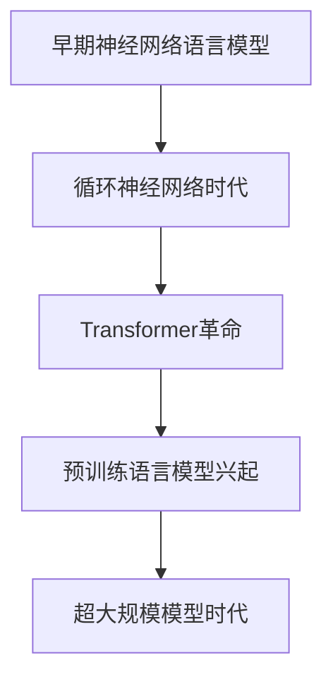
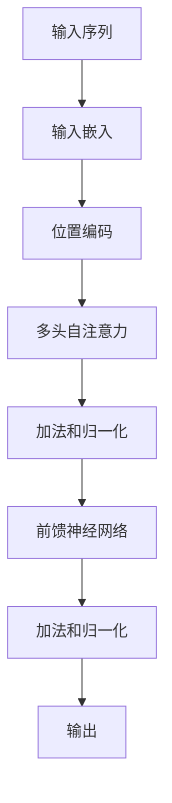

# # 基于 LLM 应用程序开发极简入门与进阶实战

# 1 LLM 基础知识

## 1.1 什么是 LLM

### 1.1.1 LLM 的定义和特点

大型语言模型（Large Language Models，简称LLM）是一种基于深度学习技术的自然语言处理模型，它能够理解、生成和操作人类语言。LLM通过对海量文本数据的学习，获得了强大的语言理解和生成能力。

LLM的主要特点包括：

1. 规模庞大：通常包含数十亿到数千亿个参数。
2. 自监督学习：能够从未标注的文本中学习语言知识。
3. 少样本学习：能够快速适应新任务，只需少量示例。
4. 多任务能力：可以执行各种自然语言处理任务，如文本生成、问答、翻译等。
5. 上下文理解：能够理解和利用长文本上下文信息。

### 1.1.2 LLM 的发展历程

LLM的发展历程可以概括为以下几个关键阶段：

1. 早期神经网络语言模型（2000年代初）
    - 以前馈神经网络为基础的简单语言模型

2. 循环神经网络时代（2010年代初）
    - LSTM和GRU等架构的出现，提高了模型处理序列数据的能力

3. Transformer革命（2017年）
    - Google提出Transformer架构，为大规模语言模型奠定基础

4. 预训练语言模型兴起（2018-2019年）
    - BERT、GPT等模型的出现，展示了预训练-微调范式的强大潜力

5. 超大规模模型时代（2020年至今）
    - GPT-3、PaLM、LaMDA等模型的出现，模型规模和能力不断突破



### 1.1.3 主流 LLM 模型介绍

1. GPT系列（OpenAI）
    - 特点：强大的文本生成能力，广泛的知识覆盖
    - 应用：对话系统、内容创作、代码生成

2. BERT系列（Google）
    - 特点：双向上下文理解，适合各种NLP任务
    - 应用：文本分类、命名实体识别、问答系统

3. T5（Google）
    - 特点：统一的文本到文本框架，多任务能力强
    - 应用：翻译、摘要、问答

4. LaMDA（Google）
    - 特点：专注于对话应用，具有强大的上下文理解能力
    - 应用：智能对话系统、虚拟助手

5. PaLM（Google）
    - 特点：超大规模（540B参数），多语言能力强
    - 应用：复杂推理、多语言任务

6. LLaMA（Meta）
    - 特点：开源模型，在较小规模下也有不错的性能
    - 应用：研究和开源社区应用开发

7. BLOOM（BigScience）
    - 特点：多语言开源模型，注重伦理和包容性
    - 应用：多语言NLP任务，开源研究

这些模型各有特点和优势，开发者可以根据具体应用场景和需求选择合适的模型。

## 1.2 LLM 的工作原理

### 1.2.1 自然语言处理基础

自然语言处理（NLP）是人工智能和语言学的交叉领域，致力于让计算机理解、解释和生成人类语言。NLP的基础包括以下几个方面：

1. 词法分析：将文本分割成有意义的单元（词语或标记）。

2. 句法分析：分析句子的语法结构，通常使用解析树表示。

3. 语义分析：理解单词、短语和句子的含义。

4. 语用分析：考虑上下文和实际使用情况来理解语言。

5. 词向量表示：将单词转换为密集的数值向量，捕捉语义信息。

LLM在这些基础上，通过深度学习技术，实现了更高级的语言理解和生成能力。

### 1.2.2 神经网络和深度学习概述

神经网络是一种模仿生物神经系统的机器学习模型。深度学习是使用多层神经网络的机器学习方法。在LLM中，主要使用的神经网络结构包括：

1. 前馈神经网络：最基本的神经网络结构，信息单向传播。

2. 循环神经网络（RNN）：能够处理序列数据，适合语言建模。

3. 长短期记忆网络（LSTM）：RNN的变体，能更好地处理长期依赖。

4. Transformer：基于自注意力机制的架构，是现代LLM的基础。

深度学习的核心思想是通过多层非线性变换，学习数据的层次化表示。在LLM中，这种层次化表示使模型能够捕捉语言的复杂结构和语义。

### 1.2.3 Transformer 架构解析

Transformer架构是现代LLM的核心，它主要由以下组件构成：

1. 输入嵌入层：将输入标记转换为向量表示。

2. 位置编码：为每个标记添加位置信息。

3. 多头自注意力机制：允许模型关注输入序列的不同部分。

4. 前馈神经网络：在每个位置上独立应用的全连接层。

5. 层归一化：稳定训练过程。

6. 残差连接：帮助梯度流动和信息传播。

Transformer的工作流程如下：



自注意力机制是Transformer的核心，它允许模型在处理每个标记时考虑整个输入序列。计算过程如下：

1. 对每个输入向量计算查询(Q)、键(K)和值(V)向量。
2. 计算注意力分数：$\text{Attention}(Q, K, V) = \text{softmax}(\frac{QK^T}{\sqrt{d_k}})V$

其中，$d_k$是键向量的维度。

多头注意力机制通过并行计算多个自注意力，捕捉不同类型的依赖关系：

$$\text{MultiHead}(Q, K, V) = \text{Concat}(\text{head}_1, ..., \text{head}_h)W^O$$

其中，$\text{head}_i = \text{Attention}(QW^Q_i, KW^K_i, VW^V_i)$

通过这种架构，Transformer能够有效地处理长距离依赖，并行计算提高了训练效率，为LLM的发展奠定了基础。

## 1.3 LLM 的应用场景

### 1.3.1 文本生成和对话系统

LLM在文本生成和对话系统方面展现出了强大的能力，主要应用包括：

1. 智能客服：
    - 自动回答客户询问
    - 处理常见问题和投诉
    - 提供个性化建议

2. 内容创作：
    - 自动生成文章、报告和新闻稿
    - 辅助创意写作，如故事和诗歌创作
    - 生成产品描述和广告文案

3. 虚拟助手：
    - 执行日程安排、提醒等任务
    - 提供信息查询和建议
    - 进行多轮对话和任务完成

4. 社交媒体管理：
    - 自动生成社交媒体帖子
    - 回复用户评论
    - 内容策划和创意生成

实现这些应用的关键在于有效的prompt工程和上下文管理。以下是一个简单的智能客服对话示例：

```python
import openai

openai.api_key = 'your_api_key_here'

def customer_service_bot(user_input):
    prompt = f"""
    你是一个专业的客服代表。请根据用户的输入提供友好、有帮助的回答。

    用户: {user_input}
    客服:
    """
    
    response = openai.Completion.create(
        engine="text-davinci-002",
        prompt=prompt,
        max_tokens=150
    )
    
    return response.choices[0].text.strip()

# 使用示例
user_question = "我的订单什么时候能到货？"
print(customer_service_bot(user_question))
```

### 1.3.2 信息抽取和问答系统

LLM在信息抽取和问答系统方面的应用包括：

1. 命名实体识别（NER）：
    - 从非结构化文本中识别和提取实体（如人名、地名、组织名）
    - 应用于新闻分析、简历筛选等领域

2. 关系抽取：
    - 识别文本中实体之间的关系
    - 构建知识图谱和信息检索系统

3. 开放域问答：
    - 回答各种领域的一般性问题
    - 用于搜索引擎和虚拟助手

4. 特定领域问答：
    - 在特定领域（如医疗、法律）提供专业回答
    - 辅助专业人士决策和研究

以下是一个使用LLM进行简单信息抽取的示例：

```python
import openai

openai.api_key = 'your_api_key_here'

def extract_entities(text):
    prompt = f"""
    从以下文本中提取人名、地名和组织名：

    文本: {text}

    请以JSON格式输出结果，格式如下：
    {{
        "人名": [],
        "地名": [],
        "组织名": []
    }}
    """
    
    response = openai.Completion.create(
        engine="text-davinci-002",
        prompt=prompt,
        max_tokens=200
    )
    
    return response.choices[0].text.strip()

# 使用示例
sample_text = "苹果公司CEO蒂姆·库克昨日在加州库比蒂诺的总部宣布了新产品。"
print(extract_entities(sample_text))
```

### 1.3.3 翻译和文本摘要

LLM在翻译和文本摘要任务中表现出色：

1. 机器翻译：
    - 支持多语言之间的互译
    - 处理专业领域的翻译需求
    - 实时口译辅助

2. 文本摘要：
    - 生成长文档的摘要
    - 新闻头条和关键信息提取
   - 学术论文摘要生成

3. 多语言文本处理：
    - 跨语言信息检索
    - 多语言情感分析

以下是一个使用LLM进行文本摘要的示例：

```python
import openai

openai.api_key = 'your_api_key_here'

def summarize_text(text, max_words=50):
    prompt = f"""
    请对以下文本进行摘要，摘要字数不超过{max_words}个词：

    {text}

    摘要：
    """
    
    response = openai.Completion.create(
        engine="text-davinci-002",
        prompt=prompt,
        max_tokens=max_words * 2  # 预留一些空间
    )
    
    return response.choices[0].text.strip()

# 使用示例
long_text = "这里是一段很长的文本......"  # 省略具体内容
print(summarize_text(long_text))
```

### 1.3.4 代码生成和辅助编程

LLM在代码生成和辅助编程方面的应用正在改变软件开发的方式：

1. 代码补全：
    - 实时提供代码建议和自动补全
    - 提高编程效率，减少语法错误

2. 代码生成：
    - 根据自然语言描述生成代码片段或完整函数
    - 快速原型开发和算法实现

3. 代码解释和文档生成：
    - 为现有代码生成注释和文档
    - 解释复杂的代码逻辑

4. 代码重构和优化：
    - 提供代码重构建议
    - 自动优化代码性能

5. 错误诊断和修复：
    - 分析错误信息，提供修复建议
    - 自动修复简单的编程错误

以下是一个使用LLM进行简单代码生成的示例：

```python
import openai

openai.api_key = 'your_api_key_here'

def generate_code(task_description, language):
    prompt = f"""
    请用{language}编写一个函数来完成以下任务：

    {task_description}

    请只返回代码，不需要解释。
    """
    
    response = openai.Completion.create(
        engine="text-davinci-002",
        prompt=prompt,
        max_tokens=200
    )
    
    return response.choices[0].text.strip()

# 使用示例
task = "计算斐波那契数列的第n项"
language = "Python"
print(generate_code(task, language))
```

LLM在这些应用场景中的表现不仅提高了效率，还为开发人员提供了新的创意和解决问题的方法。然而，重要的是要注意，LLM生成的代码仍然需要人工审查和测试，以确保其正确性和安全性。
