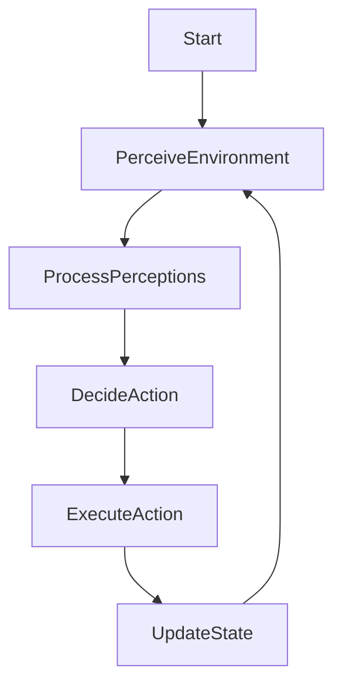
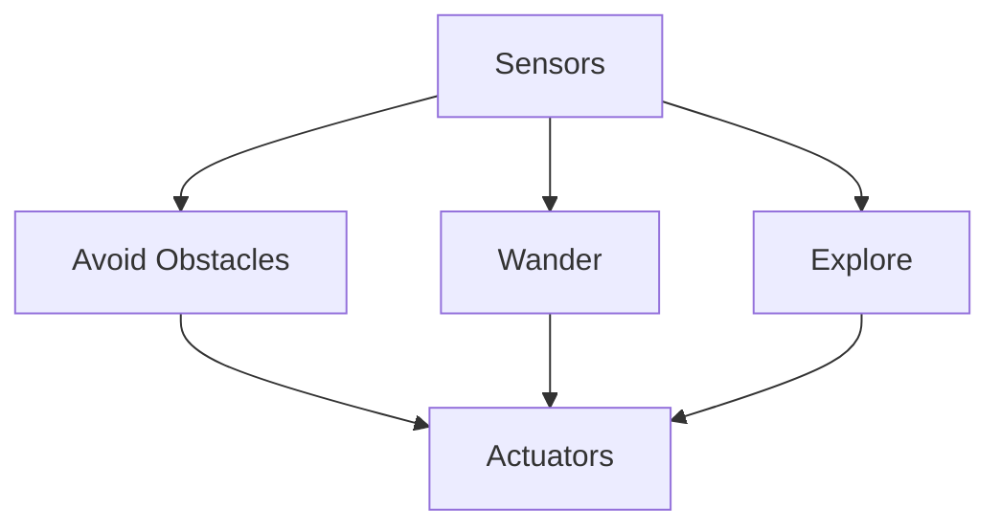
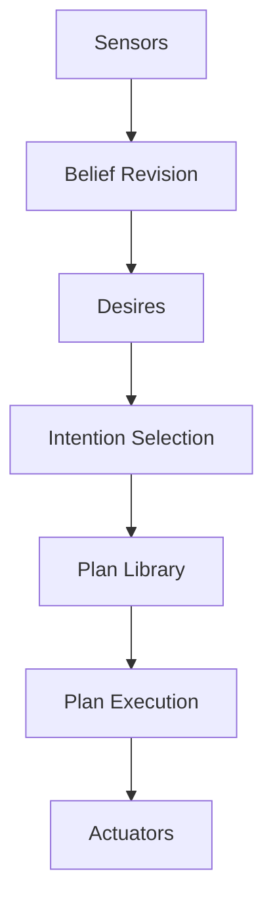
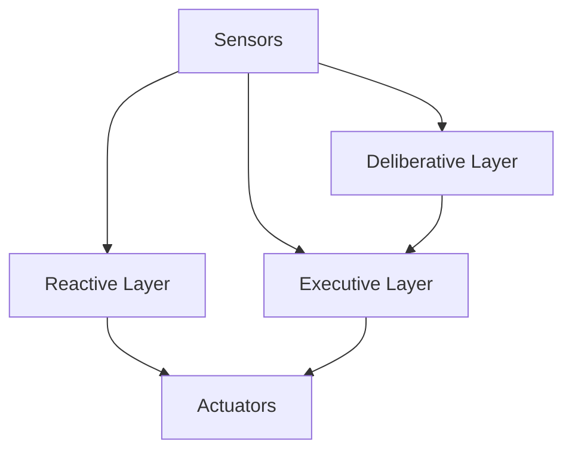

# AI Agent Workflow


## Chapter 1: Introduction to AI Agent Workflows

### 1.1 Understanding AI Agents
### 1.2 The Concept of Agent Workflows
### 1.3 Applications and Use Cases of AI Agent Workflows
### 1.4 Benefits and Challenges of Implementing Agent Workflows

## Chapter 2: Foundations of AI Agents

### 2.1 Types of AI Agents
### 2.2 Agent Architectures: Reactive, Deliberative, and Hybrid
### 2.3 Core Components of an AI Agent
### 2.4 Agent Communication and Interaction Models

## Chapter 3: Designing AI Agent Workflows

### 3.1 Workflow Planning and Goal Setting
### 3.2 Task Decomposition and Sequencing
### 3.3 Decision-Making Frameworks for Agents
### 3.4 Handling Uncertainty and Partial Information

## Chapter 4: Implementing AI Agent Workflows

### 4.1 Agent Development Platforms and Frameworks
### 4.2 Programming Autonomous Behaviors
### 4.3 Integrating Machine Learning Models into Agents
### 4.4 Building Multi-Agent Systems

## Chapter 5: Natural Language Processing in Agent Workflows

### 5.1 Language Understanding for Agent Communication
### 5.2 Natural Language Generation for Agent Responses
### 5.3 Dialogue Management in Agent Workflows
### 5.4 Sentiment Analysis and Emotional Intelligence in Agents

## Chapter 6: Knowledge Representation and Reasoning

### 6.1 Knowledge Bases and Ontologies for Agents
### 6.2 Inference Engines and Reasoning Mechanisms
### 6.3 Learning and Updating Knowledge in Agent Workflows
### 6.4 Handling Contradictions and Inconsistencies

## Chapter 7: Planning and Problem-Solving in Agent Workflows

### 7.1 Goal-Oriented Planning Algorithms
### 7.2 Reactive Planning and Real-Time Decision Making
### 7.3 Constraint Satisfaction in Agent Problem-Solving
### 7.4 Adapting Plans in Dynamic Environments

## Chapter 8: Perception and Environment Interaction

### 8.1 Sensor Integration in AI Agents
### 8.2 Computer Vision Techniques for Visual Agents
### 8.3 Speech Recognition and Audio Processing
### 8.4 Actuators and Physical World Interaction

## Chapter 9: Learning and Adaptation in Agent Workflows

### 9.1 Reinforcement Learning for Agent Behavior
### 9.2 Transfer Learning in Multi-Task Agents
### 9.3 Continuous Learning and Model Updates
### 9.4 Evaluating and Improving Agent Performance

## Chapter 10: Collaboration and Coordination in Multi-Agent Systems

### 10.1 Communication Protocols in Multi-Agent Environments
### 10.2 Task Allocation and Resource Management
### 10.3 Conflict Resolution and Negotiation Strategies
### 10.4 Swarm Intelligence and Emergent Behaviors

## Chapter 11: Ethical Considerations in AI Agent Workflows

### 11.1 Ensuring Fairness and Avoiding Bias in Agent Decision-Making
### 11.2 Privacy and Security in Agent-Human Interactions
### 11.3 Transparency and Explainability of Agent Actions
### 11.4 Ethical Frameworks for Autonomous Agents

## Chapter 12: Testing and Evaluation of Agent Workflows

### 12.1 Simulation Environments for Agent Testing
### 12.2 Metrics for Evaluating Agent Performance
### 12.3 User Studies and Human-Agent Interaction Assessment
### 12.4 Continuous Monitoring and Improvement of Workflows

## Chapter 13: Scalability and Deployment of Agent Workflows

### 13.1 Cloud-Based Deployment Strategies
### 13.2 Load Balancing and Distribution of Agent Tasks
### 13.3 Version Control and Updates for Agent Systems
### 13.4 Integration with Existing Enterprise Systems

## Chapter 14: Real-World Applications of AI Agent Workflows

### 14.1 Customer Service and Support Agents
### 14.2 Autonomous Vehicles and Robotics
### 14.3 Intelligent Personal Assistants
### 14.4 Agent-Based Modeling in Business and Science

## Chapter 15: Advanced Topics in AI Agent Workflows

### 15.1 Cognitive Architectures for Complex Agents
### 15.2 Emotion and Personality Modeling in Agents
### 15.3 Cross-Domain Knowledge Transfer in Agent Workflows
### 15.4 Integration of Quantum Computing in Agent Decision-Making

## Chapter 16: Future Trends and Research Directions

### 16.1 Emerging Paradigms in AI Agent Design
### 16.2 Advancements in Human-Agent Collaboration
### 16.3 The Role of Agents in Artificial General Intelligence
### 16.4 Societal Impact and Policy Considerations for AI Agents


# Introduction to AI Agent Workflows

**Keywords:** AI Agents, Workflow Design, Autonomous Systems, Machine Learning Integration, Multi-Agent Coordination, Natural Language Processing, Knowledge Representation, Ethical AI

**Abstract:**  
In the rapidly evolving landscape of artificial intelligence, AI agents have emerged as pivotal components driving innovation across various industries. This chapter delves into the foundational aspects of AI agent workflows, elucidating the core concepts, architectures, and applications that define their operational paradigms. By exploring the intricacies of agent design, task decomposition, decision-making frameworks, and the integration of machine learning models, readers will gain a comprehensive understanding of how AI agents function and interact within complex systems. Additionally, the chapter addresses the benefits and challenges associated with implementing AI agent workflows, providing insights into best practices and future research directions essential for advancing autonomous intelligent systems.

## Chapter 1: Introduction to AI Agent Workflows

### 1.1 Understanding AI Agents

#### 1.1.1 Background and Definition

AI agents, at their core, are autonomous entities capable of perceiving their environment, reasoning, and taking actions to achieve specific goals. Unlike traditional software applications that execute predefined tasks, AI agents exhibit a degree of autonomy, adaptability, and learning, enabling them to operate effectively in dynamic and uncertain environments.

#### 1.1.2 Core Characteristics of AI Agents

- **Autonomy:** The ability to operate without human intervention, making decisions based on internal processes and external inputs.
- **Reactivity:** Responding promptly to changes in the environment, ensuring timely actions and adaptations.
- **Proactiveness:** Initiating actions to achieve goals, anticipating future states, and planning accordingly.
- **Social Ability:** Communicating and interacting with other agents or humans to collaborate or negotiate.

#### 1.1.3 Types of AI Agents

AI agents can be categorized based on their functionalities and architectures:

- **Simple Reflex Agents:** Operate based on the current percept, without considering the history.
- **Model-Based Reflex Agents:** Maintain an internal state to track aspects of the environment not immediately observable.
- **Goal-Based Agents:** Utilize goals to evaluate possible actions, enabling decision-making towards desired outcomes.
- **Utility-Based Agents:** Assign a utility value to different states, optimizing actions to maximize overall utility.
- **Learning Agents:** Capable of improving their performance over time through learning from experiences.

#### 1.1.4 Applications and Use Cases

AI agents are deployed across various domains, showcasing their versatility and impact:

- **Customer Service:** Virtual assistants like chatbots handle customer inquiries, providing timely and accurate responses.
- **Healthcare:** AI agents assist in diagnostics, patient monitoring, and personalized treatment plans.
- **Finance:** Automated trading agents execute trades based on market analysis, optimizing investment strategies.
- **Autonomous Vehicles:** AI agents navigate and make real-time decisions to ensure safe and efficient transportation.
- **Smart Homes:** Agents manage home automation systems, enhancing comfort, security, and energy efficiency.

#### 1.1.5 Case Study: Virtual Personal Assistants

**Background:**  
Virtual personal assistants (VPAs) like Amazon's Alexa, Apple's Siri, and Google's Assistant have become integral parts of modern life, assisting users with a range of tasks from setting reminders to controlling smart home devices.

**Implementation:**  
These VPAs leverage natural language processing (NLP) to understand user commands, machine learning algorithms to improve response accuracy, and integration with various services to execute tasks.

**Impact:**  
VPAs have significantly enhanced user convenience, productivity, and accessibility, demonstrating the practical benefits of AI agents in everyday applications.

### 1.2 The Concept of Agent Workflows

#### 1.2.1 Defining Agent Workflows

Agent workflows refer to the structured sequences of operations and interactions that AI agents perform to achieve specific objectives. These workflows encompass the processes of task management, decision-making, communication, and adaptation essential for effective agent performance.

#### 1.2.2 Components of Agent Workflows

- **Task Decomposition:** Breaking down complex goals into manageable tasks.
- **Sequencing:** Ordering tasks logically to ensure efficient progression towards goals.
- **Decision Points:** Identifying moments where agents need to choose between multiple actions based on predefined criteria or learned insights.
- **Feedback Loops:** Incorporating mechanisms for agents to assess outcomes and adjust strategies accordingly.

#### 1.2.3 Workflow Planning and Goal Setting

Effective agent workflows begin with clear goal setting and meticulous planning. Agents must define their objectives, understand the constraints of their environment, and establish a roadmap outlining the steps required to attain their goals.

#### 1.2.4 Visualizing Agent Workflows with Mermaid

Illustrating agent workflows aids in comprehending the flow of operations and interactions within the system. Below is a Mermaid flowchart depicting a simplified AI agent workflow:



### 1.3 Applications and Use Cases of AI Agent Workflows

AI agent workflows are foundational to a multitude of applications across diverse sectors:

#### 1.3.1 Autonomous Customer Support

**Scenario:**  
AI agents handle customer inquiries, provide product recommendations, and resolve issues without human intervention.

**Workflow Overview:**
- **Perception:** Interpret user queries using NLP.
- **Decision-Making:** Determine the appropriate response or action (e.g., answer a question, escalate to a human).
- **Execution:** Provide the response or initiate an action (e.g., process a refund).

#### 1.3.2 Smart Manufacturing

**Scenario:**  
AI agents oversee production lines, manage inventory, and optimize supply chains in real-time.

**Workflow Overview:**
- **Monitoring:** Continuously assess production metrics and inventory levels.
- **Analysis:** Identify bottlenecks or inefficiencies using data analytics.
- **Optimization:** Adjust processes or reorder supplies to enhance productivity.

#### 1.3.3 Personalized Education

**Scenario:**  
AI agents deliver customized learning experiences, adapting content to individual student needs and progress.

**Workflow Overview:**
- **Assessment:** Evaluate student performance and learning styles.
- **Content Delivery:** Present tailored educational materials and exercises.
- **Feedback:** Provide constructive feedback and adjust learning pathways based on student performance.

### 1.4 Benefits and Challenges of Implementing Agent Workflows

#### 1.4.1 Benefits

- **Efficiency:** Automating repetitive tasks reduces operational costs and speeds up processes.
- **Scalability:** AI agents can handle increasing workloads without significant performance degradation.
- **Consistency:** Ensures uniformity in task execution, minimizing errors and variability.
- **24/7 Availability:** Operate continuously without the limitations of human work shifts.

#### 1.4.2 Challenges

- **Complexity of Design:** Developing sophisticated workflows that can handle diverse scenarios requires advanced expertise.
- **Integration with Existing Systems:** Ensuring seamless interoperability with legacy systems can be technically challenging.
- **Data Privacy and Security:** Protecting sensitive data processed by AI agents is paramount to maintain trust and compliance.
- **Adaptability:** Agents must be capable of adjusting to unexpected changes in the environment, necessitating robust learning mechanisms.

#### 1.4.3 Addressing Challenges: Best Practices

- **Modular Design:** Structuring workflows into modular components facilitates easier updates and maintenance.
- **Robust Testing:** Implementing comprehensive testing protocols ensures reliability and identifies potential vulnerabilities.
- **Continuous Learning:** Incorporating machine learning enables agents to adapt and improve over time, enhancing resilience to changes.
- **Ethical Considerations:** Integrating ethical guidelines ensures responsible AI deployment, safeguarding against biases and ensuring fairness.

### 1.5 Summary

This introductory chapter has laid the groundwork for understanding AI agent workflows by defining AI agents, exploring their inherent characteristics, and elucidating the components that constitute effective workflows. Through various applications and case studies, the chapter has demonstrated the practical significance and transformative potential of AI agents across multiple domains. Additionally, it has highlighted the benefits that autonomous workflows offer, alongside the challenges that must be navigated to achieve successful implementation. As we delve deeper into the subsequent chapters, these foundational insights will serve as a springboard for a more detailed examination of the technical and operational facets of AI agent workflows.

### 1.6 Best Practices and Tips

- **Clear Objective Definition:** Establish well-defined goals to guide the agent's actions and decision-making processes.
- **Comprehensive Testing:** Implement extensive testing scenarios to ensure agent reliability in diverse environments.
- **User-Centric Design:** Focus on the end-user experience to create intuitive and effective agent interactions.
- **Scalability Planning:** Design workflows with scalability in mind to accommodate future growth and increased demand.

### 1.7 Precautions

- **Data Security:** Implement robust security measures to protect sensitive information handled by AI agents.
- **Bias Mitigation:** Continuously monitor and address potential biases in agent decision-making to ensure fairness and equity.
- **Regulatory Compliance:** Stay abreast of relevant laws and regulations to ensure lawful deployment of AI agents.
- **System Monitoring:** Regularly monitor agent performance and behavior to detect and rectify anomalies promptly.

### 1.8 Further Reading

- **Intelligent Agent-Based Systems** by Michael Wooldridge
- **Artificial Intelligence: A Modern Approach** by Stuart Russell and Peter Norvig
- **Multi-Agent Systems: Algorithmic, Game-Theoretic, and Logical Foundations** by Yoav Shoham and Kevin Leyton-Brown
- **Reinforcement Learning: An Introduction** by Richard S. Sutton and Andrew G. Barto


### 1.9 Mathematical Foundations of AI Agent Workflows

Understanding the mathematical underpinnings of AI agent workflows is crucial for developing robust and efficient systems. This section explores key mathematical concepts and models that form the backbone of agent decision-making and optimization processes.

#### 1.9.1 Probability Theory in Agent Decision Making

Probability theory plays a vital role in modeling uncertainty and making informed decisions in dynamic environments. AI agents often rely on probabilistic reasoning to handle incomplete information and make predictions about future states.

**Bayes' Theorem:**
The cornerstone of probabilistic reasoning in AI agents is Bayes' Theorem, which allows agents to update their beliefs based on new evidence:

$$P(A|B) = \frac{P(B|A) \cdot P(A)}{P(B)}$$

Where:
- $P(A|B)$ is the posterior probability of A given B
- $P(B|A)$ is the likelihood of B given A
- $P(A)$ is the prior probability of A
- $P(B)$ is the marginal probability of B

**Example Application:**
Consider an AI agent in a medical diagnosis system. Let A represent the presence of a disease, and B represent a positive test result. The agent can use Bayes' Theorem to calculate the probability of a patient having the disease given a positive test result, considering the test's accuracy and the disease's prevalence in the population.

#### 1.9.2 Utility Theory and Decision Making

Utility theory provides a framework for agents to make decisions by assigning numerical values (utilities) to different outcomes and choosing actions that maximize expected utility.

**Expected Utility:**
The expected utility of an action is calculated as:

$$EU(a) = \sum_{s \in S} P(s|a) \cdot U(s)$$

Where:
- $EU(a)$ is the expected utility of action $a$
- $S$ is the set of possible outcome states
- $P(s|a)$ is the probability of state $s$ occurring given action $a$
- $U(s)$ is the utility of state $s$

**Decision Rule:**
An agent selects the action with the highest expected utility:

$$a^* = \arg\max_a EU(a)$$

#### 1.9.3 Markov Decision Processes (MDPs)

MDPs provide a mathematical framework for modeling decision-making in scenarios where outcomes are partly random and partly under the control of the agent. They are particularly useful in planning and reinforcement learning contexts.

**Formal Definition:**
An MDP is defined by a tuple $(S, A, P, R, \gamma)$, where:
- $S$ is the set of states
- $A$ is the set of actions
- $P$ is the transition probability function
- $R$ is the reward function
- $\gamma$ is the discount factor

The goal is to find a policy $\pi$ that maximizes the expected cumulative reward:

$$V^\pi(s) = E[\sum_{t=0}^{\infty} \gamma^t R(s_t, \pi(s_t)) | s_0 = s]$$

#### 1.9.4 Optimization in Agent Workflows

Optimization techniques are crucial for improving agent performance and efficiency. Many agent tasks can be formulated as optimization problems.

**Gradient Descent:**
A common optimization algorithm used in machine learning components of AI agents is gradient descent. The update rule for parameters $\theta$ is:

$$\theta_{t+1} = \theta_t - \alpha \nabla J(\theta_t)$$

Where:
- $\alpha$ is the learning rate
- $\nabla J(\theta_t)$ is the gradient of the objective function with respect to the parameters

### 1.10 Core Algorithms in AI Agent Workflows

AI agent workflows often incorporate various algorithms for task execution, learning, and decision-making. This section provides an overview of fundamental algorithms used in agent systems, along with pseudocode representations.

#### 1.10.1 A* Search Algorithm

A* is a widely used pathfinding and graph traversal algorithm in AI agent navigation systems. It combines the benefits of Dijkstra's algorithm and greedy best-first search.

**Pseudocode:**

```
function A_Star(start, goal):
    open_set = {start}
    came_from = {}
    g_score = {start: 0}
    f_score = {start: heuristic(start, goal)}
    
    while open_set is not empty:
        current = node in open_set with lowest f_score
        if current == goal:
            return reconstruct_path(came_from, current)
        
        open_set.remove(current)
        for neighbor in get_neighbors(current):
            tentative_g_score = g_score[current] + distance(current, neighbor)
            
            if tentative_g_score < g_score.get(neighbor, inf):
                came_from[neighbor] = current
                g_score[neighbor] = tentative_g_score
                f_score[neighbor] = g_score[neighbor] + heuristic(neighbor, goal)
                if neighbor not in open_set:
                    open_set.add(neighbor)
    
    return failure

function reconstruct_path(came_from, current):
    total_path = [current]
    while current in came_from:
        current = came_from[current]
        total_path.append(current)
    return reverse(total_path)
```

#### 1.10.2 Q-Learning Algorithm

Q-Learning is a model-free reinforcement learning algorithm used by AI agents to learn optimal action-selection policies in Markov Decision Processes.

**Pseudocode:**

```
Initialize Q(s, a) arbitrarily
Set learning rate α ∈ (0, 1] and discount factor γ ∈ [0, 1)

for each episode:
    Initialize state s
    while s is not terminal:
        Choose action a from s using policy derived from Q (e.g., ε-greedy)
        Take action a, observe reward r and next state s'
        Update Q(s, a):
            Q(s, a) ← Q(s, a) + α[r + γ max_a' Q(s', a') - Q(s, a)]
        s ← s'
```

#### 1.10.3 Natural Language Processing Pipeline

AI agents often incorporate NLP capabilities for understanding and generating human language. A typical NLP pipeline might include the following steps:

**Pseudocode:**

```
function NLP_Pipeline(input_text):
    # Tokenization
    tokens = tokenize(input_text)
    
    # Part-of-Speech Tagging
    pos_tags = pos_tag(tokens)
    
    # Named Entity Recognition
    entities = recognize_entities(pos_tags)
    
    # Dependency Parsing
    dependencies = parse_dependencies(pos_tags)
    
    # Semantic Analysis
    semantic_representation = analyze_semantics(dependencies, entities)
    
    # Intent Classification
    intent = classify_intent(semantic_representation)
    
    # Response Generation
    response = generate_response(intent, semantic_representation)
    
    return response
```

### 1.11 Emerging Trends in AI Agent Workflows

As the field of AI continues to evolve, several emerging trends are shaping the future of AI agent workflows:

#### 1.11.1 Federated Learning

Federated learning enables AI agents to learn from distributed datasets without centralizing the data, addressing privacy concerns and enabling collaborative learning across multiple agents or organizations.

#### 1.11.2 Explainable AI (XAI)

Integrating explainability into AI agent workflows enhances transparency and trust, allowing users to understand the reasoning behind agent decisions and actions.

#### 1.11.3 Transfer Learning

Transfer learning techniques enable AI agents to apply knowledge gained from one task to new, related tasks, significantly reducing the data and computational resources required for training.

#### 1.11.4 Quantum-Inspired Algorithms

Quantum-inspired algorithms leverage principles from quantum computing to enhance classical algorithms, potentially offering performance improvements in areas such as optimization and machine learning.

### 1.12 Ethical Considerations in AI Agent Design

As AI agents become more prevalent and influential, addressing ethical concerns is paramount:

#### 1.12.1 Bias Mitigation

Implementing techniques to identify and mitigate biases in training data and decision-making processes ensures fair and equitable agent behavior.

#### 1.12.2 Privacy Protection

Designing agent workflows with privacy-preserving techniques, such as differential privacy and secure multi-party computation, safeguards user data.

#### 1.12.3 Accountability and Transparency

Establishing clear mechanisms for accountability and providing transparent explanations of agent decision-making processes builds trust and enables responsible AI deployment.

#### 1.12.4 Human-AI Collaboration

Designing agent workflows that complement human capabilities rather than replace them fosters productive human-AI collaboration and addresses concerns about job displacement.

### 1.13 Future Research Directions

The field of AI agent workflows continues to evolve, with several promising research directions:

- **Meta-Learning:** Developing agents capable of learning how to learn, adapting quickly to new tasks and environments.
- **Multimodal AI:** Integrating multiple sensory inputs and output modalities for more natural and comprehensive agent interactions.
- **Autonomous Ethical Reasoning:** Enabling agents to make ethical decisions autonomously based on defined principles and contextual understanding.
- **Scalable Multi-Agent Systems:** Advancing coordination and collaboration mechanisms for large-scale, heterogeneous agent networks.

### 1.14 Conclusion

This chapter has provided a comprehensive introduction to AI agent workflows, covering fundamental concepts, mathematical foundations, core algorithms, and emerging trends. As AI continues to advance, the design and implementation of effective agent workflows will play a crucial role in shaping intelligent systems across various domains. By understanding the principles, challenges, and ethical considerations discussed in this chapter, researchers and practitioners can contribute to the development of robust, efficient, and responsible AI agent systems that drive innovation and address complex real-world problems.


## Chapter 2: # Foundations of AI Agents

**Keywords:** AI Agent Types, Reactive Agents, Deliberative Agents, Hybrid Architectures, Agent Components, Perception, Reasoning, Learning, Action Selection, Communication Protocols, Interaction Models, Multi-Agent Systems

**Abstract:**
This chapter delves into the foundational aspects of AI agents, exploring their various types, architectural paradigms, core components, and communication models. By examining the spectrum from simple reactive agents to complex deliberative and hybrid systems, we uncover the fundamental principles that govern AI agent design and functionality. The chapter also provides an in-depth analysis of the essential components that constitute an AI agent, including perception modules, reasoning engines, learning mechanisms, and action selection processes. Furthermore, it explores the intricate world of agent communication and interaction models, crucial for understanding how agents collaborate and compete in multi-agent environments. Through theoretical discussions, practical examples, and mathematical models, this chapter aims to provide a comprehensive understanding of the building blocks that form the basis of modern AI agent systems.

## Chapter 2: Foundations of AI Agents

### 2.1 Types of AI Agents

AI agents can be categorized into various types based on their capabilities, decision-making processes, and the environments in which they operate. Understanding these types is crucial for designing effective agent systems tailored to specific tasks and scenarios.

#### 2.1.1 Simple Reflex Agents

Simple reflex agents are the most basic type of AI agents. They operate based on the current percept without considering the history of percepts or maintaining any internal state.

**Characteristics:**
- Act based on current percept only
- Use condition-action rules
- No memory of past actions or percepts
- Suitable for fully observable environments

**Mathematical Model:**
Let $P$ be the set of possible percepts and $A$ be the set of possible actions. A simple reflex agent can be defined by a function $f: P \rightarrow A$ that maps percepts to actions:

$$a = f(p)$$

where $a \in A$ is the action taken in response to percept $p \in P$.

**Example: Thermostat Agent**
Consider a simple thermostat agent that controls room temperature:

```python
def thermostat_agent(temperature):
    if temperature < 20:
        return "TURN_ON_HEATER"
    elif temperature > 25:
        return "TURN_ON_AC"
    else:
        return "DO_NOTHING"
```

#### 2.1.2 Model-Based Reflex Agents

Model-based reflex agents maintain an internal state that depends on the percept history, allowing them to handle partially observable environments.

**Characteristics:**
- Maintain internal state to track unobserved aspects of the environment
- Update state based on percept history
- Use updated state and current percept for decision making

**Mathematical Model:**
Let $S$ be the set of possible internal states, $P$ the set of percepts, and $A$ the set of actions. A model-based reflex agent can be defined by two functions:

1. State update function: $g: S \times P \rightarrow S$
2. Action selection function: $f: S \times P \rightarrow A$

The agent's behavior can be described as:

$$s' = g(s, p)$$
$$a = f(s', p)$$

where $s'$ is the updated state, $s$ is the current state, $p$ is the current percept, and $a$ is the selected action.

**Example: Traffic Light Control Agent**
```python
class TrafficLightAgent:
    def __init__(self):
        self.state = {"time_since_last_change": 0, "current_color": "RED"}
    
    def update_state(self, percept):
        self.state["time_since_last_change"] += percept["time_elapsed"]
    
    def select_action(self, percept):
        self.update_state(percept)
        if self.state["current_color"] == "RED" and self.state["time_since_last_change"] >= 60:
            self.state["current_color"] = "GREEN"
            self.state["time_since_last_change"] = 0
            return "CHANGE_TO_GREEN"
        elif self.state["current_color"] == "GREEN" and self.state["time_since_last_change"] >= 30:
            self.state["current_color"] = "RED"
            self.state["time_since_last_change"] = 0
            return "CHANGE_TO_RED"
        else:
            return "NO_CHANGE"
```

#### 2.1.3 Goal-Based Agents

Goal-based agents take decision-making a step further by considering not just the current state but also a goal state they aim to achieve.

**Characteristics:**
- Maintain information about desirable situations (goals)
- Consider how actions will contribute to goal achievement
- May require search or planning to find action sequences

**Mathematical Model:**
Let $S$ be the set of states, $G \subseteq S$ the set of goal states, $A$ the set of actions, and $T: S \times A \rightarrow S$ the transition function. The agent aims to find a sequence of actions $a_1, a_2, ..., a_n$ such that:

$$T(...T(T(s_0, a_1), a_2)..., a_n) \in G$$

where $s_0$ is the initial state.

**Example: Pathfinding Agent**
```python
def astar_search(start, goal, heuristic):
    open_set = {start}
    came_from = {}
    g_score = {start: 0}
    f_score = {start: heuristic(start, goal)}
    
    while open_set:
        current = min(open_set, key=lambda x: f_score[x])
        if current == goal:
            return reconstruct_path(came_from, current)
        
        open_set.remove(current)
        for neighbor in get_neighbors(current):
            tentative_g_score = g_score[current] + distance(current, neighbor)
            if tentative_g_score < g_score.get(neighbor, float('inf')):
                came_from[neighbor] = current
                g_score[neighbor] = tentative_g_score
                f_score[neighbor] = g_score[neighbor] + heuristic(neighbor, goal)
                if neighbor not in open_set:
                    open_set.add(neighbor)
    
    return None  # No path found

def pathfinding_agent(start, goal):
    path = astar_search(start, goal, manhattan_distance)
    if path:
        return path[1]  # Return the first step towards the goal
    else:
        return "NO_VALID_PATH"
```

#### 2.1.4 Utility-Based Agents

Utility-based agents extend goal-based agents by assigning utility values to states, allowing for more nuanced decision-making in complex environments.

**Characteristics:**
- Assign utility values to states or state sequences
- Make decisions that maximize expected utility
- Can handle conflicting goals and uncertainties

**Mathematical Model:**
Let $U: S \rightarrow \mathbb{R}$ be a utility function assigning real-valued utilities to states. The agent aims to select actions that maximize expected utility:

$$a^* = \arg\max_{a \in A} \sum_{s' \in S} P(s'|s,a) \cdot U(s')$$

where $P(s'|s,a)$ is the probability of reaching state $s'$ from state $s$ by taking action $a$.

**Example: Investment Agent**
```python
import random

class InvestmentAgent:
    def __init__(self, initial_balance):
        self.balance = initial_balance
    
    def utility(self, balance):
        return 1 - math.exp(-0.0001 * balance)
    
    def expected_return(self, investment, risk):
        return investment * (1 + random.normalvariate(0.05, risk))
    
    def select_action(self, investment_options):
        best_action = None
        max_expected_utility = float('-inf')
        
        for option in investment_options:
            investment = min(self.balance, option['amount'])
            risk = option['risk']
            num_simulations = 1000
            total_utility = 0
            
            for _ in range(num_simulations):
                expected_balance = self.balance - investment + self.expected_return(investment, risk)
                total_utility += self.utility(expected_balance)
            
            expected_utility = total_utility / num_simulations
            
            if expected_utility > max_expected_utility:
                max_expected_utility = expected_utility
                best_action = option
        
        return best_action
```

#### 2.1.5 Learning Agents

Learning agents have the capability to improve their performance over time through experience.

**Characteristics:**
- Adapt behavior based on feedback and experience
- Can operate in unknown or changing environments
- Often use techniques from machine learning and reinforcement learning

**Mathematical Model:**
In the context of reinforcement learning, a learning agent aims to learn a policy $\pi: S \rightarrow A$ that maximizes the expected cumulative reward:

$$V^\pi(s) = E[\sum_{t=0}^{\infty} \gamma^t r_t | s_0 = s, \pi]$$

where $\gamma$ is the discount factor, $r_t$ is the reward at time $t$, and $s_0$ is the initial state.

**Example: Q-Learning Agent**
```python
import random

class QLearningAgent:
    def __init__(self, num_states, num_actions, learning_rate=0.1, discount_factor=0.9, epsilon=0.1):
        self.q_table = [[0 for _ in range(num_actions)] for _ in range(num_states)]
        self.learning_rate = learning_rate
        self.discount_factor = discount_factor
        self.epsilon = epsilon
    
    def select_action(self, state):
        if random.random() < self.epsilon:
            return random.randint(0, len(self.q_table[state]) - 1)
        else:
            return self.q_table[state].index(max(self.q_table[state]))
    
    def update(self, state, action, reward, next_state):
        current_q = self.q_table[state][action]
        max_next_q = max(self.q_table[next_state])
        new_q = current_q + self.learning_rate * (reward + self.discount_factor * max_next_q - current_q)
        self.q_table[state][action] = new_q
```

### 2.2 Agent Architectures: Reactive, Deliberative, and Hybrid

Agent architectures define the fundamental organization of an AI agent's components and decision-making processes. The three main architectural paradigms are reactive, deliberative, and hybrid architectures.

#### 2.2.1 Reactive Architectures

Reactive architectures are based on the principle of direct mapping from perceptions to actions, without complex reasoning or planning.

**Key Features:**
- Fast response times
- Simple and robust behavior
- No internal representation of the world
- Suitable for dynamic and unpredictable environments

**Advantages:**
- Low computational overhead
- Quick reaction to environmental changes
- Easy to implement and maintain

**Limitations:**
- Limited ability to handle complex tasks
- Lack of long-term planning capabilities
- Difficulty in achieving global optimization

**Example: Subsumption Architecture**
The subsumption architecture, proposed by Rodney Brooks, is a classic example of a reactive architecture. It consists of layered behavior modules, each responsible for a specific task.



**Pseudocode for a Simple Subsumption-based Robot:**

```python
class SubsumptionRobot:
    def __init__(self):
        self.layers = [
            self.avoid_obstacles,
            self.wander,
            self.explore
        ]
    
    def avoid_obstacles(self, sensors):
        if sensors.detect_obstacle():
            return "TURN_AWAY"
        return None
    
    def wander(self, sensors):
        return "MOVE_RANDOM"
    
    def explore(self, sensors):
        if sensors.detect_unexplored_area():
            return "MOVE_TOWARDS_UNEXPLORED"
        return None
    
    def decide_action(self, sensors):
        for layer in self.layers:
            action = layer(sensors)
            if action:
                return action
        return "DO_NOTHING"
```

#### 2.2.2 Deliberative Architectures

Deliberative architectures incorporate reasoning, planning, and decision-making based on an internal representation of the world.

**Key Features:**
- Maintain a world model
- Use symbolic reasoning and planning
- Can handle complex, long-term goals
- Suitable for structured and predictable environments

**Advantages:**
- Ability to solve complex problems
- Long-term planning capabilities
- Can optimize actions for global goals

**Limitations:**
- Higher computational complexity
- Slower response times
- Requires accurate and up-to-date world model

**Example: BDI (Belief-Desire-Intention) Architecture**
The BDI architecture is a popular deliberative architecture based on modeling the agent's beliefs, desires, and intentions.



**Pseudocode for a BDI Agent:**

```python
class BDIAgent:
    def __init__(self):
        self.beliefs = set()
        self.desires = set()
        self.intentions = []
        self.plan_library = {}
    
    def update_beliefs(self, percept):
        self.beliefs.update(percept)
    
    def generate_options(self):
        return [desire for desire in self.desires if self.is_achievable(desire)]
    
    def filter(self, options):
        return max(options, key=self.utility)
    
    def select_intention(self):
        options = self.generate_options()
        if options:
            selected_desire = self.filter(options)
            self.intentions.append(selected_desire)
    
    def execute(self):
        if self.intentions:
            current_intention = self.intentions[0]
            plan = self.plan_library.get(current_intention)
            if plan:
                success = self.execute_plan(plan)
                if success:
                    self.intentions.pop(0)
            else:
                self.intentions.pop(0)
    
    def step(self, percept):
        self.update_beliefs(percept)
        self.select_intention()
        self.execute()
```

#### 2.2.3 Hybrid Architectures

Hybrid architectures combine elements of both reactive and deliberative architectures to leverage their respective strengths.

**Key Features:**
- Layered structure with reactive and deliberative components
- Can handle both immediate reactions and long-term planning
- Adaptive to various environment types

**Advantages:**
- Balances quick reactions with strategic planning
- Suitable for complex, real-world applications
- Can handle uncertainty and dynamic environments

**Limitations:**
- More complex to design and implement
- Requires careful integration of reactive and deliberative components
- May face challenges in real-time performance for some applications

**Example: Three-Layer Architecture**
A common hybrid architecture consists of three layers: reactive, executive, and deliberative.



**Pseudocode for a Three-Layer Hybrid Agent:**

```python
class HybridAgent:
    def __init__(self):
        self.reactive_layer = ReactiveLayer()
        self.executive_layer = ExecutiveLayer()
        self.deliberative_layer = DeliberativeLayer()
    
    def perceive(self, environment):
        return environment.get_percept()
    
    def act(self, action):
        # Execute action in the environment
        pass
    
    def run(self, environment):
        while True:
            percept = self.perceive(environment)
            
            ## Reactive Layer processing
            reactive_action = self.reactive_layer.process(percept)
            if reactive_action:
                self.act(reactive_action)
                continue
            
            # Executive Layer processing
            executive_action = self.executive_layer.process(percept)
            if executive_action:
                self.act(executive_action)
            else:
                # Deliberative Layer processing
                plan = self.deliberative_layer.plan(percept)
                self.executive_layer.set_plan(plan)

class ReactiveLayer:
    def process(self, percept):
        # Implement reactive behaviors
        pass

class ExecutiveLayer:
    def __init__(self):
        self.current_plan = None
    
    def set_plan(self, plan):
        self.current_plan = plan
    
    def process(self, percept):
        if self.current_plan:
            return self.current_plan.next_action()
        return None

class DeliberativeLayer:
    def plan(self, percept):
        # Implement planning algorithm
        pass
```

### 2.3 Core Components of an AI Agent

AI agents are composed of several essential components that work together to enable perception, reasoning, learning, and action. Understanding these core components is crucial for designing effective and efficient agent systems.

#### 2.3.1 Perception Module

The perception module is responsible for processing sensory inputs and converting them into a format that can be used by the agent's internal processes.

**Key Functions:**
- Sensor data preprocessing
- Feature extraction
- Pattern recognition
- Sensor fusion

**Mathematical Model:**
Let $S$ be the set of possible sensor readings and $P$ be the set of percepts. The perception module can be modeled as a function $f: S \rightarrow P$ that maps raw sensor data to meaningful percepts:

$$p = f(s)$$

where $s \in S$ is the sensor reading and $p \in P$ is the resulting percept.

**Example: Computer Vision for Object Detection**

```python
import cv2
import numpy as np

class ObjectDetectionModule:
    def __init__(self, model_path, classes_path):
        self.net = cv2.dnn.readNet(model_path)
        with open(classes_path, 'r') as f:
            self.classes = [line.strip() for line in f.readlines()]
    
    def detect_objects(self, image):
        blob = cv2.dnn.blobFromImage(image, 1/255.0, (416, 416), swapRB=True, crop=False)
        self.net.setInput(blob)
        output_layers_names = self.net.getUnconnectedOutLayersNames()
        layer_outputs = self.net.forward(output_layers_names)
        
        boxes = []
        confidences = []
        class_ids = []
        
        for output in layer_outputs:
            for detection in output:
                scores = detection[5:]
                class_id = np.argmax(scores)
                confidence = scores[class_id]
                if confidence > 0.5:
                    center_x = int(detection[0] * image.shape[1])
                    center_y = int(detection[1] * image.shape[0])
                    w = int(detection[2] * image.shape[1])
                    h = int(detection[3] * image.shape[0])
                    x = int(center_x - w/2)
                    y = int(center_y - h/2)
                    
                    boxes.append([x, y, w, h])
                    confidences.append(float(confidence))
                    class_ids.append(class_id)
        
        return boxes, confidences, class_ids
```

#### 2.3.2 Knowledge Representation

Knowledge representation is the component responsible for storing and organizing the agent's understanding of its environment, goals, and capabilities.

**Key Aspects:**
- Ontologies and semantic networks
- Rule-based systems
- Probabilistic models
- Logic-based representations

**Mathematical Model:**
For a logic-based representation, we can use first-order predicate logic. Let $L$ be a first-order language with predicates $P$, constants $C$, variables $V$, and function symbols $F$. The knowledge base $KB$ is a set of well-formed formulas in $L$:

$$KB = \{\phi_1, \phi_2, ..., \phi_n\}$$

where each $\phi_i$ is a formula in $L$.

**Example: Prolog-like Knowledge Base**

```python
class KnowledgeBase:
    def __init__(self):
        self.facts = set()
        self.rules = []
    
    def add_fact(self, fact):
        self.facts.add(fact)
    
    def add_rule(self, head, body):
        self.rules.append((head, body))
    
    def query(self, goal):
        return self._backward_chaining(goal, set())
    
    def _backward_chaining(self, goal, visited):
        if goal in self.facts:
            return True
        
        if goal in visited:
            return False
        
        visited.add(goal)
        
        for head, body in self.rules:
            if head == goal:
                if all(self._backward_chaining(subgoal, visited.copy()) for subgoal in body):
                    return True
        
        return False

# Usage example
kb = KnowledgeBase()
kb.add_fact("parent(john, mary)")
kb.add_fact("parent(mary, tom)")
kb.add_rule("grandparent(X, Z)", ["parent(X, Y)", "parent(Y, Z)"])

print(kb.query("grandparent(john, tom)"))  # True
print(kb.query("parent(tom, john)"))  # False
```

#### 2.3.3 Reasoning Engine

The reasoning engine is responsible for drawing inferences, making decisions, and solving problems based on the agent's knowledge and current percepts.

**Key Functions:**
- Logical inference
- Probabilistic reasoning
- Planning and decision-making
- Constraint satisfaction

**Mathematical Model:**
For a rule-based reasoning system, let $R$ be the set of rules and $F$ be the set of facts. The inference process can be modeled as a function $I: P(F) \times P(R) \rightarrow P(F)$ that generates new facts:

$$F' = I(F, R)$$

where $F' \supseteq F$ is the expanded set of facts after applying the rules.

**Example: Forward Chaining Inference Engine**

```python
class Rule:
    def __init__(self, conditions, conclusion):
        self.conditions = conditions
        self.conclusion = conclusion

class ForwardChainingEngine:
    def __init__(self):
        self.facts = set()
        self.rules = []
    
    def add_fact(self, fact):
        self.facts.add(fact)
    
    def add_rule(self, rule):
        self.rules.append(rule)
    
    def infer(self):
        new_facts = set()
        while True:
            for rule in self.rules:
                if all(cond in self.facts for cond in rule.conditions) and rule.conclusion not in self.facts:
                    self.facts.add(rule.conclusion)
                    new_facts.add(rule.conclusion)
            
            if not new_facts:
                break
            
            new_facts.clear()
        
        return self.facts

# Usage example
engine = ForwardChainingEngine()
engine.add_fact("has_feathers")
engine.add_fact("can_fly")
engine.add_rule(Rule(["has_feathers", "can_fly"], "is_bird"))
engine.add_rule(Rule(["is_bird", "can_swim"], "is_duck"))

engine.add_fact("can_swim")
inferred_facts = engine.infer()
print(inferred_facts)  # {'has_feathers', 'can_fly', 'is_bird', 'can_swim', 'is_duck'}
```

#### 2.3.4 Learning Module

The learning module enables an agent to improve its performance over time by acquiring new knowledge, refining its decision-making processes, and adapting to changes in the environment.

**Key Techniques:**
- Supervised learning
- Unsupervised learning
- Reinforcement learning
- Transfer learning

**Mathematical Model:**
For a supervised learning task, let $X$ be the input space and $Y$ be the output space. The learning module aims to find a function $f: X \rightarrow Y$ that minimizes the expected loss:

$$f^* = \arg\min_f E_{(x,y)\sim D}[L(f(x), y)]$$

where $D$ is the underlying data distribution and $L$ is a loss function.

**Example: Simple Q-Learning Implementation**

```python
import numpy as np

class QLearningAgent:
    def __init__(self, num_states, num_actions, learning_rate=0.1, discount_factor=0.9, epsilon=0.1):
        self.q_table = np.zeros((num_states, num_actions))
        self.learning_rate = learning_rate
        self.discount_factor = discount_factor
        self.epsilon = epsilon
    
    def select_action(self, state):
        if np.random.random() < self.epsilon:
            return np.random.randint(self.q_table.shape[1])
        else:
            return np.argmax(self.q_table[state])
    
    def update(self, state, action, reward, next_state):
        best_next_action = np.argmax(self.q_table[next_state])
        td_target = reward + self.discount_factor * self.q_table[next_state][best_next_action]
        td_error = td_target - self.q_table[state][action]
        self.q_table[state][action] += self.learning_rate * td_error
    
    def train(self, env, num_episodes):
        for episode in range(num_episodes):
            state = env.reset()
            done = False
            while not done:
                action = self.select_action(state)
                next_state, reward, done, _ = env.step(action)
                self.update(state, action, reward, next_state)
                state = next_state
```

#### 2.3.5 Action Selection Module

The action selection module is responsible for choosing the most appropriate action based on the agent's current knowledge, goals, and environmental state.

**Key Considerations:**
- Exploration vs. exploitation trade-off
- Multi-objective decision making
- Real-time constraints
- Action sequencing and planning

**Mathematical Model:**
Let $A$ be the set of possible actions, $S$ be the current state, and $U: S \times A \rightarrow \mathbb{R}$ be a utility function. The action selection process can be modeled as:

$$a^* = \arg\max_{a \in A} U(s, a)$$

where $a^*$ is the selected action that maximizes the utility in the current state $s$.

**Example: Epsilon-Greedy Action Selection**

```python
import numpy as np

class EpsilonGreedyActionSelector:
    def __init__(self, num_actions, epsilon=0.1):
        self.num_actions = num_actions
        self.epsilon = epsilon
    
    def select_action(self, q_values):
        if np.random.random() < self.epsilon:
            return np.random.randint(self.num_actions)
        else:
            return np.argmax(q_values)

# Usage example
action_selector = EpsilonGreedyActionSelector(num_actions=4)
q_values = np.array([1.2, 0.8, 2.1, 0.5])
selected_action = action_selector.select_action(q_values)
print(f"Selected action: {selected_action}")
```

### 2.4 Agent Communication and Interaction Models

Agent communication and interaction models are crucial for enabling collaboration and coordination among multiple agents in a system. These models define protocols and languages for information exchange, negotiation, and collective decision-making.

#### 2.4.1 Agent Communication Languages (ACLs)

Agent Communication Languages provide a standardized way for agents to exchange information and intentions.

**Key Components:**
- Performatives (communication acts)
- Content languages
- Ontologies

**Example: FIPA ACL Message Structure**

```python
class FIPAACLMessage:
    def __init__(self):
        self.sender = None
        self.receiver = None
        self.performative = None
        self.content = None
        self.language = None
        self.ontology = None
        self.protocol = None
        self.conversation_id = None
    
    def set_performative(self, performative):
        self.performative = performative
    
    def set_content(self, content):
        self.content = content
    
    def to_string(self):
        return f"({self.performative}\n" \
               f" :sender {self.sender}\n" \
               f" :receiver {self.receiver}\n" \
               f" :content {self.content}\n" \
               f" :language {self.language}\n" \
               f" :ontology {self.ontology}\n" \
               f" :protocol {self.protocol}\n" \
               f" :conversation-id {self.conversation_id}\n)"

# Usage example
message = FIPAACLMessage()
message.set_performative("REQUEST")
message.set_content("(action (agent-identifier :name j) (deliver box1 (loc 50 75)))")
message.sender = "agent1"
message.receiver = "agent2"
message.language = "FIPA-SL0"
message.ontology = "delivery-ontology"
message.protocol = "fipa-request"
message.conversation_id = "conv-001"

print(message.to_string())
```

#### 2.4.2 Interaction Protocols

Interaction protocols define the sequences of messages exchanged between agents to achieve specific goals or coordinate actions.

**Common Protocols:**
- Contract Net Protocol
- Auction protocols
- Negotiation protocols
- Team formation protocols

**Example: Simple Contract Net Protocol Implementation**

```python
from enum import Enum
import random

class MessageType(Enum):
    CFP = 1
    PROPOSE = 2
    ACCEPT = 3
    REJECT = 4

class Message:
    def __init__(self, sender, receiver, msg_type, content):
        self.sender = sender
        self.receiver = receiver
        self.type = msg_type
        self.content = content

class ContractNetProtocol:
    def __init__(self, initiator, participants):
        self.initiator = initiator
        self.participants = participants
    
    def run(self, task):
        # Step 1: Initiator sends CFP
        proposals = []
        for participant in self.participants:
            cfp = Message(self.initiator, participant, MessageType.CFP, task)
            proposal = participant.receive(cfp)
            if proposal:
                proposals.append(proposal)
        
        # Step 2: Initiator evaluates proposals
        if proposals:
            best_proposal = max(proposals, key=lambda p: p.content['bid'])
            
            # Step 3: Initiator sends accept/reject messages
            for proposal in proposals:
                if proposal == best_proposal:
                    accept = Message(self.initiator, proposal.sender, MessageType.ACCEPT, None)
                    proposal.sender.receive(accept)
                else:
                    reject = Message(self.initiator, proposal.sender, MessageType.REJECT, None)
                    proposal.sender.receive(reject)
            
            return best_proposal.sender
        else:
            return None

class Agent:
    def __init__(self, name):
        self.name = name
    
    def receive(self, message):
        if message.type == MessageType.CFP:
            # Decide whether to propose and at what price
            if random.random() < 0.7:  # 70% chance to propose
                bid = random.uniform(50, 100)
                return Message(self, message.sender, MessageType.PROPOSE, {'bid': bid})
        elif message.type == MessageType.ACCEPT:
            print(f"{self.name} won the contract!")
        elif message.type == MessageType.REJECT:
            print(f"{self.name} didn't win the contract.")
        return None

# Usage example
initiator = Agent("Initiator")
participants = [Agent(f"Participant_{i}") for i in range(5)]

protocol = ContractNetProtocol(initiator, participants)
winner = protocol.run("Complete task X")

if winner:
    print(f"Task assigned to {winner.name}")
else:
    print("No agent accepted the task")
```

#### 2.4.3 Coordination Mechanisms

Coordination mechanisms enable multiple agents to work together effectively, avoiding conflicts and maximizing overall system performance.

**Key Approaches:**
- Centralized coordination
- Distributed coordination
- Market-based mechanisms
- Social laws and norms

**Example: Distributed Task Allocation using Token Passing**

```python
import random
from collections import deque

class Task:
    def __init__(self, task_id, difficulty):
        self.task_id = task_id
        self.difficulty = difficulty

class Agent:
    def __init__(self, agent_id, capability):
        self.agent_id = agent_id
        self.capability = capability
        self.current_task = None
    
    def can_perform(self, task):
        return self.capability >= task.difficulty
    
    def assign_task(self, task):
        if self.can_perform(task):
            self.current_task = task
            return True
        return False

class DistributedTaskAllocation:
    def __init__(self, agents, tasks):
        self.agents = agents
        self.task_queue = deque(tasks)
        self.token = None
    
    def allocate_tasks(self):
        self.token = 0  # Start with the first agent
        
        while self.task_queue:
            current_agent = self.agents[self.token]
            current_task = self.task_queue[0]
            
            if current_agent.assign_task(current_task):
                self.task_queue.popleft()
                print(f"Agent {current_agent.agent_id} assigned task {current_task.task_id}")
            
            self.pass_token()
        
        unassigned_tasks = list(self.task_queue)
        return unassigned_tasks
    
    def pass_token(self):
        self.token = (self.token + 1) % len(self.agents)

# Usage example
agents = [Agent(i, random.uniform(0.5, 1.0)) for i in range(5)]
tasks = [Task(i, random.uniform(0.3, 0.9)) for i in range(10)]

allocator = DistributedTaskAllocation(agents, tasks)
unassigned = allocator.allocate_tasks()

print(f"Unassigned tasks: {[task.task_id for task in unassigned]}")
```

#### 2.4.4 Negotiation and Conflict Resolution

Negotiation and conflict resolution mechanisms allow agents to reach agreements and resolve conflicts in situations where they have competing goals or limited resources.

**Key Techniques:**
- Utility-based negotiation
- Argumentation-based negotiation
- Game-theoretic approaches
- Mediation and arbitration

**Example: Simple Bilateral Negotiation**

```python
import random

class Agent:
    def __init__(self, name, min_value, max_value):
        self.name = name
        self.min_value = min_value
        self.max_value = max_value
    
    def propose(self, round):
        return self.max_value - (self.max_value - self.min_value) * (round / 10)
    
    def accept(self, offer):
        return offer >= self.min_value

class BilateralNegotiation:
    def __init__(self, agent1, agent2, max_rounds=10):
        self.agent1 = agent1
        self.agent2 = agent2
        self.max_rounds = max_rounds
    
    def negotiate(self):
        for round in range(1, self.max_rounds + 1):
            offer1 = self.agent1.propose(round)
            if self.agent2.accept(offer1):
                return offer1, self.agent1.name, round
            
            offer2 = self.agent2.propose(round)
            if self.agent1.accept(offer2):
                return offer2, self.agent2.name, round
        
        return None, None, self.max_rounds

# Usage example
buyer = Agent("Buyer", 50, 100)
seller = Agent("Seller", 80, 150)

negotiation = BilateralNegotiation(buyer, seller)
agreed_price, winner, rounds = negotiation.negotiate()

if agreed_price:
    print(f"Agreement reached: {winner} wins at ${agreed_price:.2f} in round {rounds}")
else:
    print("No agreement reached")
```

#### 2.4.5 Reputation and Trust Models

Reputation and trust models enable agents to assess the reliability and trustworthiness of other agents, facilitating better decision-making in multi-agent systems.

**Key Aspects:**
- Direct experience
- Indirect reputation information
- Trust propagation
- Forgetting and discount factors

**Example: Simple Trust Model**

```python
class Agent:
    def __init__(self, agent_id):
        self.agent_id = agent_id
        self.trust_values = {}
    
    def update_trust(self, other_agent, interaction_result):
        if other_agent not in self.trust_values:
            self.trust_values[other_agent] = 0.5  # Initial neutral trust
        
        current_trust = self.trust_values[other_agent]
        if interaction_result:
            new_trust = current_trust + 0.1 * (1 - current_trust)
        else:
            new_trust = current_trust - 0.1 * current_trust
        
        self.trust_values[other_agent] = max(0, min(1, new_trust))
    
    def get_trust(self, other_agent):
        return self.trust_values.get(other_agent, 0.5)

class TrustBasedInteraction:
    def __init__(self, agents):
        self.agents = agents
    
    def interact(self, agent1, agent2):
        trust1 = agent1.get_trust(agent2.agent_id)
        trust2 = agent2.get_trust(agent1.agent_id)
        
        if trust1 > 0.5 and trust2 > 0.5:
            success = random.random() < 0.8  # 80% success rate for trusted interactions
        else:
            success = random.random() < 0.2  # 20% success rate for untrusted interactions
        
        agent1.update_trust(agent2.agent_id, success)
        agent2.update_trust(agent1.agent_id, success)
        
        return success

# Usage example
agents = [Agent(i) for i in range(5)]
trust_system = TrustBasedInteraction(agents)

for _ in range(100):
    a1, a2 = random.sample(agents, 2)
    success = trust_system.interact(a1, a2)
    print(f"Interaction between Agent {a1.agent_id} and Agent {a2.agent_id}: {'Success' if success else 'Failure'}")

for agent in agents:
    print(f"Agent {agent.agent_id} trust values: {agent.trust_values}")
```

### 2.5 Conclusion

This chapter has provided a comprehensive overview of the foundations of AI agents, covering their types, architectures, core components, and communication models. By understanding these fundamental aspects, developers and researchers can design more effective and sophisticated AI agent systems capable of tackling complex real-world problems.

Key takeaways include:

1. The diverse types of AI agents, from simple reflex agents to learning agents, each suited for different types of tasks and environments.
2. The importance of choosing appropriate agent architectures (reactive, deliberative, or hybrid) based on the specific requirements of the application domain.
3. The critical role of core components such as perception modules, knowledge representation, reasoning engines, learning modules, and action selection mechanisms in creating intelligent and adaptive agents.
4. The significance of effective communication and interaction models in multi-agent systems, enabling coordination, negotiation, and collective problem-solving.

As the field of AI continues to advance, these foundational concepts will evolve and new paradigms will emerge. However, the principles discussed in this chapter will remain crucial for understanding and developing AI agent systems that can operate effectively in complex, dynamic, and uncertain environments.


### 2.6 Best Practices and Tips

When designing and implementing AI agent systems, consider the following best practices and tips:

1. **Modular Design:** Design agent components as modular, reusable units to facilitate easier maintenance, testing, and scalability.

2. **Scalability Considerations:** Plan for scalability from the outset, considering how the agent system will perform with increasing numbers of agents or in more complex environments.

3. **Robust Error Handling:** Implement comprehensive error handling and recovery mechanisms to ensure agent resilience in the face of unexpected situations or failures.

4. **Continuous Learning:** Incorporate mechanisms for continuous learning and adaptation, allowing agents to improve their performance over time and adjust to changing environments.

5. **Ethical Considerations:** Integrate ethical guidelines and constraints into agent decision-making processes to ensure responsible and fair behavior.

6. **Explainability:** Design agents with explainable AI principles in mind, allowing for transparency in decision-making processes and facilitating user trust.

7. **Simulation-Based Testing:** Utilize simulation environments for thorough testing and validation of agent behaviors before deployment in real-world scenarios.

8. **Performance Metrics:** Define clear performance metrics and evaluation criteria for assessing agent effectiveness and identifying areas for improvement.

9. **Knowledge Management:** Implement effective knowledge management strategies to organize, update, and leverage the agent's knowledge base efficiently.

10. **Security Measures:** Incorporate robust security measures to protect against potential vulnerabilities in agent communication and data handling.

### 2.7 Common Pitfalls and How to Avoid Them

1. **Overfitting to Specific Scenarios:**
   - Pitfall: Designing agents that perform well in limited test scenarios but fail in real-world applications.
   - Solution: Expose agents to diverse training scenarios and implement generalization techniques.

2. **Neglecting Real-Time Constraints:**
   - Pitfall: Developing computationally intensive agent algorithms that cannot operate in real-time environments.
   - Solution: Optimize algorithms for efficiency and consider trade-offs between optimality and responsiveness.

3. **Ignoring Scalability Issues:**
   - Pitfall: Designing systems that work well with a small number of agents but break down as the system scales.
   - Solution: Test with large-scale simulations and implement efficient coordination mechanisms.

4. **Overreliance on Perfect Information:**
   - Pitfall: Assuming agents will always have access to complete and accurate information.
   - Solution: Design agents to handle uncertainty and partial information robustly.

5. **Lack of Adaptability:**
   - Pitfall: Creating rigid agent behaviors that cannot adapt to changing environments or requirements.
   - Solution: Implement learning mechanisms and flexible decision-making processes.

6. **Inadequate Testing:**
   - Pitfall: Insufficient testing leading to unexpected behaviors in edge cases or real-world scenarios.
   - Solution: Implement comprehensive testing strategies, including unit tests, integration tests, and scenario-based tests.

7. **Poor Interoperability:**
   - Pitfall: Developing agents that cannot effectively communicate or integrate with other systems or agents.
   - Solution: Adhere to standard communication protocols and design modular, interoperable components.

8. **Neglecting User Experience:**
   - Pitfall: Focusing solely on agent functionality without considering how users will interact with the system.
   - Solution: Incorporate user-centered design principles and provide intuitive interfaces for human-agent interaction.

9. **Overlooking Ethical Implications:**
   - Pitfall: Failing to consider the ethical implications of agent decisions and actions.
   - Solution: Integrate ethical reasoning capabilities and establish clear guidelines for agent behavior.

10. **Insufficient Documentation:**
    - Pitfall: Poor documentation leading to difficulties in maintaining and extending the agent system.
    - Solution: Maintain comprehensive and up-to-date documentation of agent architectures, algorithms, and APIs.

### 2.8 Future Trends and Research Directions

As the field of AI agents continues to evolve, several promising trends and research directions are emerging:

1. **Federated Learning for Multi-Agent Systems:**
   Exploring decentralized learning approaches that allow agents to collaboratively learn from distributed data sources without compromising privacy.

2. **Quantum-Inspired Algorithms for Agent Decision Making:**
   Investigating the potential of quantum-inspired algorithms to enhance agent decision-making capabilities, particularly in complex optimization problems.

3. **Emotional Intelligence in AI Agents:**
   Developing agents with improved emotional intelligence to facilitate more natural and empathetic interactions with humans.

4. **Explainable AI for Complex Agent Behaviors:**
   Advancing techniques for making complex agent behaviors and decision-making processes more transparent and interpretable.

5. **Bio-Inspired Agent Architectures:**
   Drawing inspiration from biological systems to design more adaptive and resilient agent architectures.

6. **Integration of Symbolic AI and Machine Learning:**
   Combining symbolic reasoning with machine learning techniques to create more robust and generalizable agent systems.

7. **Continual Learning in Dynamic Environments:**
   Developing agents capable of continuous learning and adaptation in rapidly changing environments without catastrophic forgetting.

8. **Swarm Intelligence for Large-Scale Agent Coordination:**
   Exploring swarm intelligence principles to enable efficient coordination and decision-making in large-scale multi-agent systems.

9. **Human-Agent Teaming:**
   Advancing research on effective collaboration between humans and AI agents, focusing on complementary strengths and shared decision-making.

10. **Ethical AI Agents:**
    Developing frameworks and methodologies for creating ethically-aware agents capable of making morally sound decisions in complex scenarios.

### 2.9 Practical Exercises

To reinforce the concepts covered in this chapter, consider the following practical exercises:

1. **Implement a Simple Reflex Agent:**
   Design and implement a simple reflex agent for a specific task (e.g., a thermostat control system). Test its performance under various environmental conditions.

2. **Develop a BDI Agent:**
   Create a Belief-Desire-Intention (BDI) agent for a more complex scenario, such as a personal assistant that manages a user's schedule and tasks.

3. **Build a Multi-Agent System:**
   Implement a multi-agent system for a collaborative task, such as distributed problem-solving or resource allocation. Experiment with different coordination mechanisms.

4. **Design a Learning Agent:**
   Develop a reinforcement learning agent for a game environment (e.g., a simple grid world). Compare its performance with different learning algorithms and parameters.

5. **Create an Agent Communication System:**
   Implement a communication protocol for agents to exchange information and coordinate actions in a shared environment.

6. **Experiment with Hybrid Architectures:**
   Design and implement a hybrid agent architecture that combines reactive and deliberative components for a specific application (e.g., an autonomous robot navigation system).

7. **Develop a Trust-Based Multi-Agent System:**
   Create a multi-agent system where agents learn to trust or distrust each other based on past interactions. Analyze how trust dynamics affect system performance.

8. **Implement an Argumentation-Based Negotiation System:**
   Design and implement an argumentation-based negotiation protocol for agents to resolve conflicts and reach agreements.

9. **Create an Adaptive Agent:**
   Develop an agent that can adapt its behavior based on changing environmental conditions or user preferences. Test its adaptability in various scenarios.

10. **Build an Explainable Agent:**
    Implement an agent with explainable decision-making processes, providing justifications for its actions in a human-understandable format.

By completing these exercises, readers can gain practical experience in designing and implementing various types of AI agents, reinforcing the theoretical concepts covered in this chapter and preparing them for more advanced topics in subsequent chapters.


# Designing AI Agent Workflows

**Keywords:** Workflow Planning, Goal Setting, Task Decomposition, Action Sequencing, Decision-Making Frameworks, Uncertainty Handling, Partial Information Processing

**Abstract:**
This chapter delves into the intricate process of designing AI agent workflows, focusing on the critical aspects of workflow planning, goal setting, task decomposition, and decision-making frameworks. We explore how to effectively break down complex objectives into manageable tasks, sequence actions for optimal performance, and implement robust decision-making mechanisms. Additionally, the chapter addresses the challenges of handling uncertainty and partial information, equipping AI agents with the tools to navigate real-world complexities. Through theoretical discussions, practical examples, and mathematical models, readers will gain a comprehensive understanding of how to design efficient and adaptable AI agent workflows.

## Chapter 3: Designing AI Agent Workflows

### 3.1 Workflow Planning and Goal Setting

Workflow planning and goal setting are fundamental to creating effective AI agent systems. This process involves defining clear objectives, establishing performance metrics, and outlining the steps necessary to achieve desired outcomes.

#### 3.1.1 Goal Formulation

Goal formulation is the process of defining specific, measurable, achievable, relevant, and time-bound (SMART) objectives for an AI agent.

**Key Considerations:**
- Clarity and specificity of goals
- Alignment with overall system objectives
- Measurability and evaluation criteria
- Feasibility given agent capabilities and resources
- Time constraints and deadlines

**Mathematical Representation:**
Let $G = \{g_1, g_2, ..., g_n\}$ be a set of goals, where each goal $g_i$ is defined by:
- A target state or condition $s_i$
- A utility function $u_i: S \rightarrow \mathbb{R}$ that maps states to real-valued utilities
- A time constraint $t_i$

The overall goal can be represented as maximizing the cumulative utility:

$$\max \sum_{i=1}^n w_i \cdot u_i(s_i)$$

subject to time constraints $t_i$ for each goal, where $w_i$ are importance weights for each goal.

**Example: Goal Setting for a Personal Assistant Agent**

```python
class Goal:
    def __init__(self, description, target_state, utility_function, time_constraint):
        self.description = description
        self.target_state = target_state
        self.utility_function = utility_function
        self.time_constraint = time_constraint

def schedule_utility(current_state, target_state):
    return 1 - abs(current_state['tasks_completed'] - target_state['tasks_completed']) / target_state['tasks_completed']

def email_utility(current_state, target_state):
    return 1 - len(current_state['unread_emails']) / len(target_state['unread_emails'])

personal_assistant_goals = [
    Goal("Manage daily schedule", 
         {'tasks_completed': 10}, 
         schedule_utility, 
         time_constraint=24*60*60),  # 24 hours in seconds
    Goal("Keep inbox organized", 
         {'unread_emails': 5}, 
         email_utility, 
         time_constraint=12*60*60)   # 12 hours in seconds
]

def evaluate_goals(current_state, goals):
    total_utility = 0
    for goal in goals:
        utility = goal.utility_function(current_state, goal.target_state)
        total_utility += utility
        print(f"Goal: {goal.description}, Utility: {utility:.2f}")
    print(f"Total Utility: {total_utility:.2f}")

# Example usage
current_state = {'tasks_completed': 7, 'unread_emails': 15}
evaluate_goals(current_state, personal_assistant_goals)
```

#### 3.1.2 Workflow Planning

Workflow planning involves designing a structured sequence of actions and processes that an AI agent will follow to achieve its goals.

**Key Steps in Workflow Planning:**
1. Identify required tasks and subtasks
2. Determine task dependencies and relationships
3. Allocate resources and set priorities
4. Establish timelines and milestones
5. Define control flow and decision points

**Workflow Representation:**
Workflows can be represented using various models, such as:
- Directed Acyclic Graphs (DAGs)
- Petri Nets
- Business Process Model and Notation (BPMN)

**Example: Simple Workflow using a Directed Acyclic Graph**

```python
import networkx as nx
import matplotlib.pyplot as plt

def create_workflow_dag():
    G = nx.DiGraph()
    G.add_edge("Start", "Check Calendar")
    G.add_edge("Check Calendar", "Identify Priority Tasks")
    G.add_edge("Identify Priority Tasks", "Execute Task 1")
    G.add_edge("Identify Priority Tasks", "Execute Task 2")
    G.add_edge("Execute Task 1", "Update Task List")
    G.add_edge("Execute Task 2", "Update Task List")
    G.add_edge("Update Task List", "Check Emails")
    G.add_edge("Check Emails", "Respond to Urgent Emails")
    G.add_edge("Respond to Urgent Emails", "End")
    return G

def visualize_workflow(G):
    pos = nx.spring_layout(G)
    nx.draw(G, pos, with_labels=True, node_color='lightblue', node_size=2000, font_size=8, arrows=True)
    plt.title("Personal Assistant Workflow")
    plt.axis('off')
    plt.show()

# Create and visualize the workflow
workflow = create_workflow_dag()
visualize_workflow(workflow)
```

This example creates a simple workflow for a personal assistant agent using a directed acyclic graph and visualizes it using networkx and matplotlib.

### 3.2 Task Decomposition and Sequencing

Task decomposition and sequencing are crucial for breaking down complex goals into manageable subtasks and determining the optimal order of execution.

#### 3.2.1 Hierarchical Task Decomposition

Hierarchical task decomposition involves breaking down high-level tasks into smaller, more manageable subtasks.

**Approaches to Task Decomposition:**
1. Top-down decomposition
2. Bottom-up composition
3. Middle-out approach

**Mathematical Representation:**
Let $T$ be a task, and $S(T) = \{T_1, T_2, ..., T_n\}$ be the set of subtasks resulting from decomposition.

The decomposition should satisfy:
1. Completeness: $\bigcup_{i=1}^n T_i = T$
2. Minimality: $T_i \cap T_j = \emptyset$ for $i \neq j$

**Example: Hierarchical Task Network (HTN) for a Cooking Agent**

```python
class Task:
    def __init__(self, name, subtasks=None):
        self.name = name
        self.subtasks = subtasks or []

def create_cooking_htn():
    return Task("Prepare Meal", [
        Task("Plan Menu", [
            Task("Check Ingredients"),
            Task("Select Recipe")
        ]),
        Task("Gather Ingredients", [
            Task("Retrieve from Pantry"),
            Task("Retrieve from Refrigerator")
        ]),
        Task("Cook Dish", [
            Task("Prepare Ingredients", [
                Task("Wash"),
                Task("Chop"),
                Task("Measure")
            ]),
            Task("Follow Recipe Steps", [
                Task("Heat Pan"),
                Task("Combine Ingredients"),
                Task("Cook")
            ])
        ]),
        Task("Serve", [
            Task("Plate Food"),
            Task("Set Table")
        ])
    ])

def print_htn(task, level=0):
    print("  " * level + task.name)
    for subtask in task.subtasks:
        print_htn(subtask, level + 1)

# Create and print the HTN
cooking_htn = create_cooking_htn()
print_htn(cooking_htn)
```

#### 3.2.2 Task Sequencing

Task sequencing involves determining the optimal order in which to execute subtasks, considering dependencies, resource constraints, and efficiency.

**Sequencing Techniques:**
1. Critical Path Method (CPM)
2. Program Evaluation and Review Technique (PERT)
3. Topological sorting for DAGs

**Mathematical Model: Topological Sorting**
Given a DAG $G = (V, E)$, where $V$ is the set of tasks and $E$ is the set of dependencies, a topological sort is an ordering of vertices such that for every directed edge $(u, v)$, $u$ comes before $v$ in the ordering.

**Example: Task Sequencing using Topological Sort**

```python
from collections import defaultdict

class Graph:
    def __init__(self, vertices):
        self.graph = defaultdict(list)
        self.V = vertices

    def add_edge(self, u, v):
        self.graph[u].append(v)

    def topological_sort_util(self, v, visited, stack):
        visited[v] = True
        for i in self.graph[v]:
            if not visited[i]:
                self.topological_sort_util(i, visited, stack)
        stack.insert(0, v)

    def topological_sort(self):
        visited = [False] * self.V
        stack = []
        for i in range(self.V):
            if not visited[i]:
                self.topological_sort_util(i, visited, stack)
        return stack

# Example usage
g = Graph(6)
g.add_edge(5, 2)
g.add_edge(5, 0)
g.add_edge(4, 0)
g.add_edge(4, 1)
g.add_edge(2, 3)
g.add_edge(3, 1)

print("Topological Sort Order:")
print(g.topological_sort())
```

### 3.3 Decision-Making Frameworks for Agents

Decision-making frameworks provide structured approaches for agents to evaluate options and select actions in pursuit of their goals.

#### 3.3.1 Utility-Based Decision Making

Utility-based decision making involves assigning utility values to different outcomes and selecting actions that maximize expected utility.

**Mathematical Model:**
Let $A$ be the set of possible actions, $S$ be the set of possible states, and $U: S \rightarrow \mathbb{R}$ be a utility function. The expected utility of an action $a$ is:

$$EU(a) = \sum_{s \in S} P(s|a) \cdot U(s)$$

The optimal action $a^*$ is chosen as:

$$a^* = \arg\max_{a \in A} EU(a)$$

**Example: Utility-Based Decision Making for an Investment Agent**

```python
import random

class InvestmentOption:
    def __init__(self, name, expected_return, risk):
        self.name = name
        self.expected_return = expected_return
        self.risk = risk

def utility_function(return_value, risk_tolerance):
    return return_value - (risk_tolerance * (return_value ** 2))

def expected_utility(option, risk_tolerance, num_simulations=1000):
    total_utility = 0
    for _ in range(num_simulations):
        realized_return = random.gauss(option.expected_return, option.risk)
        total_utility += utility_function(realized_return, risk_tolerance)
    return total_utility / num_simulations

def make_investment_decision(options, risk_tolerance):
    best_option = max(options, key=lambda x: expected_utility(x, risk_tolerance))
    return best_option

# Example usage
investment_options = [
    InvestmentOption("Conservative Fund", 0.05, 0.02),
    InvestmentOption("Balanced Fund", 0.08, 0.05),
    InvestmentOption("Aggressive Fund", 0.12, 0.10)
]

risk_tolerance = 0.5
chosen_investment = make_investment_decision(investment_options, risk_tolerance)
print(f"Chosen Investment: {chosen_investment.name}")
```

#### 3.3.2 Multi-Criteria Decision Making (MCDM)

MCDM frameworks allow agents to make decisions based on multiple, potentially conflicting criteria.

**Common MCDM Methods:**
1. Analytic Hierarchy Process (AHP)
2. TOPSIS (Technique for Order Preference by Similarity to Ideal Solution)
3. ELECTRE (Elimination and Choice Expressing Reality)

**Example: Simple Weighted Sum Model for MCDM**

```python
import numpy as np

def normalize_matrix(matrix):
    return matrix / np.sqrt(np.sum(matrix**2, axis=0))

def weighted_sum_model(decision_matrix, weights):
    normalized_matrix = normalize_matrix(decision_matrix)
    weighted_normalized = normalized_matrix * weights
    return np.sum(weighted_normalized, axis=1)

# Example usage
alternatives = ["A", "B", "C", "D"]
criteria = ["Cost", "Performance", "Reliability"]

decision_matrix = np.array([
    [4, 7, 8],
    [6, 6, 9],
    [8, 5, 6],
    [5, 8, 7]
])

weights = np.array([0.4, 0.3, 0.3])

scores = weighted_sum_model(decision_matrix, weights)
best_alternative = alternatives[np.argmax(scores)]

print("Scores:", scores)
print("Best Alternative:", best_alternative)
```

### 3.4 Handling Uncertainty and Partial Information

AI agents often operate in environments with uncertainty and incomplete information. Effective decision-making in these contexts requires specialized techniques.

#### 3.4.1 Probabilistic Reasoning

Probabilistic reasoning allows agents to make decisions based on probability distributions over possible states and outcomes.

**Key Concepts:**
- Bayesian Networks
- Markov Decision Processes (MDPs)
- Partially Observable Markov Decision Processes (POMDPs)

**Example: Simple Bayesian Network for Medical Diagnosis**

```python
from pgmpy.models import BayesianNetwork
from pgmpy.factors.discrete import TabularCPD

def create_medical_diagnosis_bn():
    model = BayesianNetwork([('Disease', 'Symptom1'), ('Disease', 'Symptom2')])

    cpd_disease = TabularCPD(variable='Disease', variable_card=2,
                             values=[[0.9], [0.1]])

    cpd_symptom1 = TabularCPD(variable='Symptom1', variable_card=2,
                              values=[[0.8, 0.2], [0.2, 0.8]],
                              evidence=['Disease'], evidence_card=[2])

    cpd_symptom2 = TabularCPD(variable='Symptom2', variable_card=2,
                              values=[[0.7, 0.3], [0.3, 0.7]],
                              evidence=['Disease'], evidence_card=[2])

    model.add_cpds(cpd_disease, cpd_symptom1, cpd_symptom2)
    return model

# Create and use the Bayesian Network
bn = create_medical_diagnosis_bn()
print(bn.check_model())
```

#### 3.4.2 Fuzzy Logic

Fuzzy logic provides a framework for reasoning with imprecise or vague information, allowing for degrees of truth rather than binary true/false values.

**Key Concepts:**
- Fuzzy sets
- Membership functions
- Fuzzy rules and inference

**Example: Simple Fuzzy Logic System for Temperature Control**

```python
import numpy as np
import skfuzzy as fuzz
from skfuzzy import control as ctrl

def create_fuzzy_temperature_control():
    # Input variable: Temperature
    temperature = ctrl.Antecedent(np.arange(0, 41, 1), 'temperature')
    
    # Output variable: Fan Speed
    fan_speed = ctrl.Consequent(np.arange(0, 101, 1), 'fan_speed')
    
    # Fuzzy sets for temperature
    temperature['cold'] = fuzz.trimf(temperature.universe, [0, 0, 20])
    temperature['comfortable'] = fuzz.trimf(temperature.universe, [10, 20, 30])
    temperature['hot']= fuzz.trimf(temperature.universe, [20, 40, 40])
    
    # Fuzzy sets for fan speed
    fan_speed['low'] = fuzz.trimf(fan_speed.universe, [0, 0, 50])
    fan_speed['medium'] = fuzz.trimf(fan_speed.universe, [0, 50, 100])
    fan_speed['high'] = fuzz.trimf(fan_speed.universe, [50, 100, 100])
    
    # Fuzzy rules
    rule1 = ctrl.Rule(temperature['cold'], fan_speed['low'])
    rule2 = ctrl.Rule(temperature['comfortable'], fan_speed['medium'])
    rule3 = ctrl.Rule(temperature['hot'], fan_speed['high'])
    
    # Create and simulate the fuzzy control system
    fan_ctrl = ctrl.ControlSystem([rule1, rule2, rule3])
    fan_simulation = ctrl.ControlSystemSimulation(fan_ctrl)
    
    return fan_simulation

# Example usage
fan_sim = create_fuzzy_temperature_control()
fan_sim.input['temperature'] = 30
fan_sim.compute()
print(f"Fan Speed: {fan_sim.output['fan_speed']:.2f}%")
```

#### 3.4.3 Information Gathering and Active Learning

In scenarios with partial information, agents can employ strategies to actively gather more information and reduce uncertainty.

**Key Techniques:**
- Value of Information (VoI) analysis
- Active learning algorithms
- Multi-armed bandit problems

**Example: Simple Multi-Armed Bandit Problem**

```python
import numpy as np

class Arm:
    def __init__(self, true_mean):
        self.true_mean = true_mean
    
    def pull(self):
        return np.random.normal(self.true_mean, 1)

class EpsilonGreedyAgent:
    def __init__(self, n_arms, epsilon):
        self.n_arms = n_arms
        self.epsilon = epsilon
        self.q_values = np.zeros(n_arms)
        self.arm_counts = np.zeros(n_arms)
    
    def select_arm(self):
        if np.random.random() < self.epsilon:
            return np.random.randint(self.n_arms)
        else:
            return np.argmax(self.q_values)
    
    def update(self, chosen_arm, reward):
        self.arm_counts[chosen_arm] += 1
        n = self.arm_counts[chosen_arm]
        value = self.q_values[chosen_arm]
        new_value = ((n - 1) / n) * value + (1 / n) * reward
        self.q_values[chosen_arm] = new_value

def run_simulation(agent, arms, num_pulls):
    total_reward = 0
    for _ in range(num_pulls):
        chosen_arm = agent.select_arm()
        reward = arms[chosen_arm].pull()
        agent.update(chosen_arm, reward)
        total_reward += reward
    return total_reward

# Example usage
true_means = [0.1, 0.5, 0.7, 0.9]
arms = [Arm(mean) for mean in true_means]
agent = EpsilonGreedyAgent(len(arms), epsilon=0.1)
total_reward = run_simulation(agent, arms, num_pulls=1000)
print(f"Total Reward: {total_reward:.2f}")
print(f"Estimated Q-values: {agent.q_values}")
```

### 3.5 Workflow Optimization Techniques

Optimizing AI agent workflows involves improving efficiency, reducing resource consumption, and enhancing overall performance. Several techniques can be employed to achieve these goals.

#### 3.5.1 Parallel Processing

Parallel processing allows multiple tasks to be executed simultaneously, significantly reducing overall execution time for complex workflows.

**Key Concepts:**
- Task parallelism
- Data parallelism
- Load balancing

**Example: Parallel Task Execution using Python's concurrent.futures**

```python
import concurrent.futures
import time

def task(name):
    print(f"Task {name} starting")
    time.sleep(2)  # Simulate work
    print(f"Task {name} completed")
    return f"Result of task {name}"

def parallel_workflow():
    tasks = ['A', 'B', 'C', 'D']
    with concurrent.futures.ThreadPoolExecutor(max_workers=4) as executor:
        future_to_task = {executor.submit(task, t): t for t in tasks}
        for future in concurrent.futures.as_completed(future_to_task):
            task = future_to_task[future]
            try:
                result = future.result()
                print(f"Task {task} result: {result}")
            except Exception as e:
                print(f"Task {task} generated an exception: {e}")

if __name__ == "__main__":
    start_time = time.time()
    parallel_workflow()
    end_time = time.time()
    print(f"Total execution time: {end_time - start_time:.2f} seconds")
```

#### 3.5.2 Dynamic Workflow Adaptation

Dynamic workflow adaptation involves modifying the workflow structure or parameters in response to changing conditions or new information.

**Key Techniques:**
- Runtime task reordering
- Conditional execution paths
- Adaptive resource allocation

**Example: Dynamic Workflow Adaptation based on Execution Time**

```python
import random
import time

class Task:
    def __init__(self, name, expected_duration):
        self.name = name
        self.expected_duration = expected_duration
    
    def execute(self):
        actual_duration = random.uniform(0.5 * self.expected_duration, 1.5 * self.expected_duration)
        time.sleep(actual_duration)
        return actual_duration

class AdaptiveWorkflow:
    def __init__(self, tasks):
        self.tasks = tasks
        self.execution_history = {}
    
    def run(self):
        for task in self.tasks:
            start_time = time.time()
            actual_duration = task.execute()
            end_time = time.time()
            
            self.execution_history[task.name] = actual_duration
            
            if actual_duration > 1.2 * task.expected_duration:
                print(f"Task {task.name} took longer than expected. Adapting workflow...")
                self.adapt_workflow()
    
    def adapt_workflow(self):
        # Simple adaptation: Reorder remaining tasks based on expected duration
        remaining_tasks = [t for t in self.tasks if t.name not in self.execution_history]
        self.tasks = sorted(remaining_tasks, key=lambda t: t.expected_duration)

# Example usage
tasks = [
    Task("A", 2),
    Task("B", 3),
    Task("C", 1),
    Task("D", 4)
]

workflow = AdaptiveWorkflow(tasks)
workflow.run()

print("Execution history:")
for task_name, duration in workflow.execution_history.items():
    print(f"Task {task_name}: {duration:.2f} seconds")
```

#### 3.5.3 Workflow Caching and Memoization

Caching and memoization techniques can significantly improve workflow efficiency by storing and reusing the results of expensive computations.

**Key Concepts:**
- Result caching
- Incremental computation
- Cache invalidation strategies

**Example: Memoization for Expensive Computations**

```python
import time
from functools import lru_cache

def expensive_computation(n):
    print(f"Computing for {n}...")
    time.sleep(2)  # Simulate expensive computation
    return n * n

@lru_cache(maxsize=None)
def memoized_computation(n):
    return expensive_computation(n)

def workflow(inputs):
    results = []
    for x in inputs:
        result = memoized_computation(x)
        results.append(result)
    return results

# Example usage
inputs = [2, 3, 2, 4, 3, 5]
start_time = time.time()
output = workflow(inputs)
end_time = time.time()

print(f"Results: {output}")
print(f"Total execution time: {end_time - start_time:.2f} seconds")
```

### 3.6 Workflow Visualization and Monitoring

Effective visualization and monitoring of AI agent workflows are crucial for understanding system behavior, identifying bottlenecks, and optimizing performance.

#### 3.6.1 Workflow Visualization Techniques

Visualization techniques help in representing complex workflows in an intuitive and comprehensible manner.

**Common Visualization Methods:**
- Flowcharts
- Gantt charts
- Directed graphs
- Sankey diagrams

**Example: Simple Workflow Visualization using Graphviz**

```python
from graphviz import Digraph

def visualize_workflow(tasks, dependencies):
    dot = Digraph(comment='Workflow')
    dot.attr(rankdir='LR')  # Left to right layout
    
    for task in tasks:
        dot.node(task, task)
    
    for dep in dependencies:
        dot.edge(dep[0], dep[1])
    
    return dot

# Example usage
tasks = ['Start', 'Task A', 'Task B', 'Task C', 'Task D', 'End']
dependencies = [
    ('Start', 'Task A'),
    ('Start', 'Task B'),
    ('Task A', 'Task C'),
    ('Task B', 'Task C'),
    ('Task C', 'Task D'),
    ('Task D', 'End')
]

workflow_graph = visualize_workflow(tasks, dependencies)
workflow_graph.render('workflow_visualization', format='png', cleanup=True)
print("Workflow visualization saved as 'workflow_visualization.png'")
```

#### 3.6.2 Real-time Monitoring and Analytics

Real-time monitoring and analytics provide insights into workflow performance, resource utilization, and potential issues.

**Key Metrics:**
- Task execution times
- Resource utilization
- Error rates
- Throughput and latency

**Example: Simple Workflow Monitoring System**

```python
import time
import random
from collections import defaultdict

class WorkflowMonitor:
    def __init__(self):
        self.task_times = defaultdict(list)
        self.error_counts = defaultdict(int)
    
    def record_task_execution(self, task_name, execution_time):
        self.task_times[task_name].append(execution_time)
    
    def record_error(self, task_name):
        self.error_counts[task_name] += 1
    
    def get_average_execution_time(self, task_name):
        times = self.task_times[task_name]
        return sum(times) / len(times) if times else 0
    
    def get_error_rate(self, task_name):
        executions = len(self.task_times[task_name])
        errors = self.error_counts[task_name]
        return errors / executions if executions > 0 else 0
    
    def print_report(self):
        print("Workflow Monitoring Report")
        print("==========================")
        for task_name in self.task_times.keys():
            avg_time = self.get_average_execution_time(task_name)
            error_rate = self.get_error_rate(task_name)
            print(f"Task: {task_name}")
            print(f"  Average Execution Time: {avg_time:.2f} seconds")
            print(f"  Error Rate: {error_rate:.2%}")
            print()

def simulate_task_execution(monitor, task_name):
    start_time = time.time()
    # Simulate task execution
    time.sleep(random.uniform(0.5, 2.0))
    end_time = time.time()
    execution_time = end_time - start_time
    monitor.record_task_execution(task_name, execution_time)
    
    # Simulate occasional errors
    if random.random() < 0.1:
        monitor.record_error(task_name)

# Example usage
monitor = WorkflowMonitor()
tasks = ['A', 'B', 'C', 'D']

for _ in range(50):  # Simulate 50 workflow executions
    for task in tasks:
        simulate_task_execution(monitor, task)

monitor.print_report()
```

### 3.7 Best Practices in AI Agent Workflow Design

When designing AI agent workflows, consider the following best practices:

1. **Modular Design:** Create modular, reusable components that can be easily combined and reconfigured.

2. **Scalability:** Design workflows that can scale efficiently with increasing workloads or complexity.

3. **Fault Tolerance:** Implement error handling and recovery mechanisms to ensure robustness.

4. **Flexibility:** Allow for dynamic adaptation of workflows based on changing conditions or requirements.

5. **Observability:** Incorporate logging, monitoring, and visualization capabilities for easy debugging and optimization.

6. **Performance Optimization:** Regularly profile and optimize workflow components to improve overall efficiency.

7. **Security Considerations:** Implement appropriate security measures to protect sensitive data and prevent unauthorized access.

8. **Version Control:** Use version control systems to track changes in workflow designs and configurations.

9. **Documentation:** Maintain comprehensive documentation of workflow components, dependencies, and configurations.

10. **Testing and Validation:** Implement thorough testing procedures, including unit tests, integration tests, and end-to-end workflow tests.

### 3.8 Conclusion

This chapter has explored the essential aspects of designing AI agent workflows, covering workflow planning, task decomposition, decision-making frameworks, and techniques for handling uncertainty. By applying these principles and best practices, developers can create more efficient, robust, and adaptable AI agent systems capable of tackling complex real-world problems. As the field of AI continues to evolve, the ability to design effective workflows will remain a crucial skill for creating intelligent agents that can operate in diverse and challenging environments.


