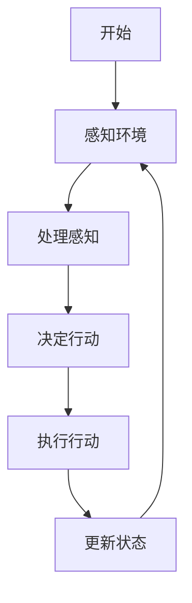
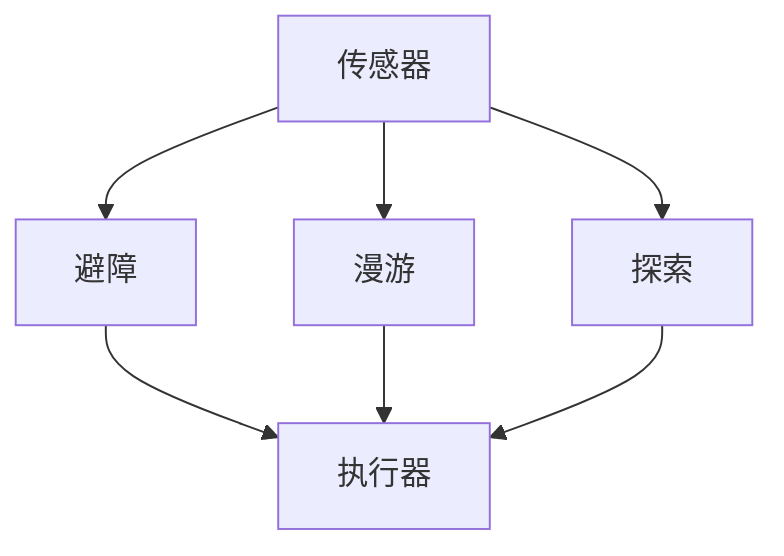
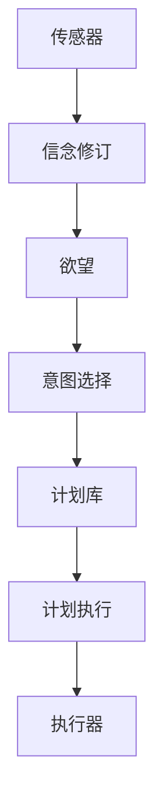
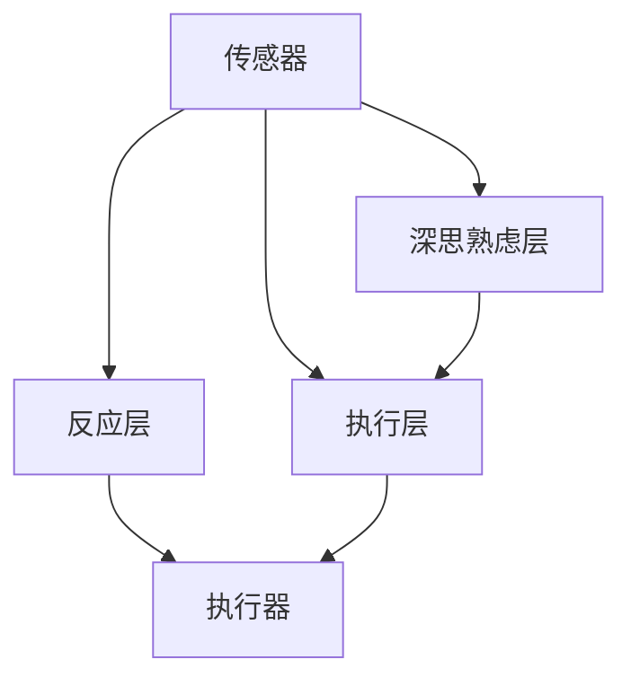

# AI Agent 工作流

## 第1章: AI代理工作流简介

### 1.1 理解AI代理

#### 1.1.1 背景和定义

AI代理本质上是能够感知环境、推理并采取行动以实现特定目标的自主实体。与执行预定义任务的传统软件应用不同,AI代理表现出一定程度的自主性、适应性和学习能力,使其能够在动态和不确定的环境中有效运作。[](https://)

#### 1.1.2 AI代理的核心特征

- **自主性:** 能够在没有人类干预的情况下运作,基于内部过程和外部输入做出决策。
- **反应性:** 对环境变化做出及时响应,确保及时的行动和适应。
- **主动性:** 主动采取行动实现目标,预测未来状态并相应地进行规划。
- **社交能力:** 与其他代理或人类进行沟通和互动,以实现协作或谈判。

#### 1.1.3 AI代理的类型

AI代理可以根据其功能和架构进行分类:

- **简单反射代理:** 基于当前感知进行操作,不考虑历史。
- **基于模型的反射代理:** 维护内部状态以跟踪环境中不可直接观察的方面。
- **基于目标的代理:** 利用目标评估可能的行动,实现朝向期望结果的决策。
- **基于效用的代理:** 为不同状态分配效用值,优化行动以最大化整体效用。
- **学习代理:** 能够通过从经验中学习来改善其性能。

#### 1.1.4 应用和用例

AI代理在各个领域得到部署,展示了其多样性和影响:

- **客户服务:** 虚拟助手如聊天机器人处理客户查询,提供及时准确的响应。
- **医疗保健:** AI代理协助诊断、患者监测和个性化治疗计划。
- **金融:** 自动交易代理基于市场分析执行交易,优化投资策略。
- **自动驾驶车辆:** AI代理进行导航并做出实时决策,确保安全高效的运输。
- **智能家居:** 代理管理家庭自动化系统,提高舒适度、安全性和能源效率。

#### 1.1.5 案例研究:虚拟个人助理

**背景:**
虚拟个人助理(VPA)如亚马逊的Alexa、苹果的Siri和谷歌的Assistant已成为现代生活不可或缺的一部分,协助用户完成从设置提醒到控制智能家居设备等一系列任务。

**实施:**
这些VPA利用自然语言处理(NLP)来理解用户命令,使用机器学习算法来提高响应准确性,并与各种服务集成以执行任务。

**影响:**
VPA显著提高了用户的便利性、生产力和可访问性,展示了AI代理在日常应用中的实际效益。

### 1.2 代理工作流的概念

#### 1.2.1 定义代理工作流

代理工作流指AI代理为实现特定目标而执行的结构化操作和交互序列。这些工作流包括对有效代理性能至关重要的任务管理、决策、通信和适应过程。

#### 1.2.2 代理工作流的组成部分

- **任务分解:** 将复杂目标分解为可管理的任务。
- **排序:** 对任务进行逻辑排序,以确保高效地朝目标推进。
- **决策点:** 识别代理需要根据预定义标准或学习到的见解在多个行动之间做出选择的时刻。
- **反馈循环:** 纳入机制使代理能够评估结果并相应调整策略。

#### 1.2.3 工作流规划和目标设定

有效的代理工作流始于明确的目标设定和细致的规划。代理必须定义其目标,了解环境的约束条件,并建立概述实现目标所需步骤的路线图。

#### 1.2.4 使用Mermaid可视化代理工作流

图示代理工作流有助于理解系统内的操作和交互流程。以下是使用Mermaid绘制的简化AI代理工作流流程图:



### 1.3 AI代理工作流的应用和用例

AI代理工作流是多个领域众多应用的基础:

#### 1.3.1 自主客户支持

**场景:**
AI代理处理客户查询,提供产品推荐,并在无需人工干预的情况下解决问题。

**工作流概述:**

- **感知:** 使用NLP解释用户查询。
- **决策:** 确定适当的响应或行动(例如,回答问题,上报给人工)。
- **执行:** 提供响应或启动行动(例如,处理退款)。

#### 1.3.2 智能制造

**场景:**
AI代理监督生产线,管理库存,并实时优化供应链。

**工作流概述:**

- **监控:** 持续评估生产指标和库存水平。
- **分析:** 使用数据分析识别瓶颈或低效之处。
- **优化:** 调整流程或重新订购供应品以提高生产力。

#### 1.3.3 个性化教育

**场景:**
AI代理提供定制化的学习体验,根据个别学生的需求和进度调整内容。

**工作流概述:**

- **评估:** 评估学生表现和学习风格。
- **内容交付:** 呈现量身定制的教育材料和练习。
- **反馈:** 提供建设性反馈,并根据学生表现调整学习路径。

### 1.4 实施代理工作流的优势与挑战

#### 1.4.1 优势

- **效率:** 自动化重复任务降低运营成本并加快流程。
- **可扩展性:** AI代理可以处理不断增加的工作负载,而不会显著降低性能。
- **一致性:** 确保任务执行的统一性,最大限度地减少错误和变异。
- **24/7可用性:** 持续运作,不受人类工作班次的限制。

#### 1.4.2 挑战

- **设计复杂性:** 开发能够处理多样化场景的复杂工作流需要高级专业知识。
- **与现有系统集成:** 确保与遗留系统的无缝互操作性在技术上具有挑战性。
- **数据隐私和安全:** 保护AI代理处理的敏感数据对维护信任和合规至关重要。
- **适应性:** 代理必须能够适应环境中的意外变化,这需要强大的学习机制。

#### 1.4.3 应对挑战:最佳实践

- **模块化设计:** 将工作流结构化为模块化组件,便于更新和维护。
- **强大的测试:** 实施全面的测试协议以确保可靠性并识别潜在漏洞。
- **持续学习:** 纳入机器学习使代理能够随时间适应和改进,增强对变化的适应能力。
- **伦理考虑:** 整合伦理指导原则确保负责任的AI部署,防范偏见并确保公平性。

### 1.5 总结

本介绍章节通过定义AI代理、探索其固有特征以及阐明构成有效工作流的组成部分,为理解AI代理工作流奠定了基础。通过各种应用和案例研究,本章展示了AI代理在多个领域的实际意义和变革潜力。此外,它还强调了自主工作流提供的好处,以及必须克服的挑战,以实现成功实施。随着我们深入后续章节,这些基础见解将作为更详细探讨AI代理工作流技术和操作方面的跳板。

### 1.6 最佳实践和提示

- **明确目标定义:** 建立明确定义的目标,指导代理的行动和决策过程。
- **全面测试:** 实施广泛的测试场景,确保代理在不同环境中的可靠性。
- **以用户为中心的设计:** 专注于最终用户体验,创建直观有效的代理交互。
- **可扩展性规划:** 设计工作流时考虑可扩展性,以适应未来增长和需求增加。

### 1.7 注意事项

- **数据安全:** 实施强大的安全措施,保护AI代理处理的敏感信息。
- **偏见缓解:** 持续监控并解决代理决策中的潜在偏见,以确保公平和公正。
- **监管合规:** 及时了解相关法律法规,确保AI代理的合法部署。
- **系统监控:** 定期监控代理性能和行为,及时检测和纠正异常。

### 1.8 进一步阅读

- 《智能代理系统》作者:Michael Wooldridge
- 《人工智能:现代方法》作者:Stuart Russell和Peter Norvig
- 《多代理系统:算法、博弈论和逻辑基础》作者:Yoav Shoham和Kevin Leyton-Brown
- 《强化学习导论》作者:Richard S. Sutton和Andrew G. Barto

### 1.9 人工智能代理工作流程的数学基础

理解人工智能代理工作流程的数学基础对于开发稳健高效的系统至关重要。本节探讨构成代理决策和优化过程骨架的关键数学概念和模型。

#### 1.9.1 代理决策中的概率论

概率论在建模不确定性和在动态环境中做出明智决策方面发挥着至关重要的作用。人工智能代理经常依赖概率推理来处理不完整信息并对未来状态进行预测。

**贝叶斯定理:**
人工智能代理概率推理的基石是贝叶斯定理,它允许代理根据新证据更新其信念:

$$
P(A|B) = \frac{P(B|A) \cdot P(A)}{P(B)}
$$

其中:

- $P(A|B)$ 是给定B条件下A的后验概率
- $P(B|A)$ 是给定A条件下B的似然概率
- $P(A)$ 是A的先验概率
- $P(B)$ 是B的边际概率

**应用示例:**
考虑医疗诊断系统中的人工智能代理。让A表示疾病的存在,B表示阳性测试结果。代理可以使用贝叶斯定理来计算在测试结果为阳性的情况下患者患病的概率,同时考虑测试的准确性和疾病在人群中的流行程度。

#### 1.9.2 效用理论与决策制定

效用理论为代理提供了一个框架,通过为不同结果分配数值(效用)并选择使预期效用最大化的行动来做出决策。

**预期效用:**
一个行动的预期效用计算如下:

$$
EU(a) = \sum_{s \in S} P(s|a) \cdot U(s)
$$

其中:

- $EU(a)$ 是行动 $a$ 的预期效用
- $S$ 是可能结果状态的集合
- $P(s|a)$ 是给定行动 $a$ 的情况下状态 $s$ 发生的概率
- $U(s)$ 是状态 $s$ 的效用

**决策规则:**
代理选择具有最高预期效用的行动:

$$
a^* = \arg\max_a EU(a)
$$

#### 1.9.3 马尔可夫决策过程 (MDPs)

MDPs为建模部分随机和部分受代理控制的决策场景提供了数学框架。它们在规划和强化学习环境中特别有用。

**形式定义:**
MDP由一个元组 $(S, A, P, R, \gamma)$ 定义,其中:

- $S$ 是状态集
- $A$ 是行动集
- $P$ 是转移概率函数
- $R$ 是奖励函数
- $\gamma$ 是折扣因子

目标是找到一个策略 $\pi$ 使预期累积奖励最大化:

$$
V^\pi(s) = E[\sum_{t=0}^{\infty} \gamma^t R(s_t, \pi(s_t)) | s_0 = s]
$$

#### 1.9.4 代理工作流程中的优化

优化技术对于提高代理性能和效率至关重要。许多代理任务可以表述为优化问题。

**梯度下降:**
人工智能代理机器学习组件中常用的优化算法是梯度下降。参数 $\theta$ 的更新规则是:

$$
\theta_{t+1} = \theta_t - \alpha \nabla J(\theta_t)
$$

其中:

- $\alpha$ 是学习率
- $\nabla J(\theta_t)$ 是目标函数相对于参数的梯度

### 1.10 人工智能代理工作流程中的核心算法

人工智能代理工作流程通常包含各种用于任务执行、学习和决策的算法。本节概述了代理系统中使用的基本算法,并提供伪代码表示。

#### 1.10.1 A*搜索算法

A*是人工智能代理导航系统中广泛使用的寻路和图遍历算法。它结合了Dijkstra算法和贪婪最佳优先搜索的优点。

**伪代码:**

```
function A_Star(start, goal):
    open_set = {start}
    came_from = {}
    g_score = {start: 0}
    f_score = {start: heuristic(start, goal)}
  
    while open_set is not empty:
        current = open_set中f_score最低的节点
        if current == goal:
            return reconstruct_path(came_from, current)
      
        open_set.remove(current)
        for neighbor in get_neighbors(current):
            tentative_g_score = g_score[current] + distance(current, neighbor)
          
            if tentative_g_score < g_score.get(neighbor, inf):
                came_from[neighbor] = current
                g_score[neighbor] = tentative_g_score
                f_score[neighbor] = g_score[neighbor] + heuristic(neighbor, goal)
                if neighbor not in open_set:
                    open_set.add(neighbor)
  
    return failure

function reconstruct_path(came_from, current):
    total_path = [current]
    while current in came_from:
        current = came_from[current]
        total_path.append(current)
    return reverse(total_path)
```

#### 1.10.2 Q-学习算法

Q-学习是一种无模型强化学习算法,人工智能代理用它来学习马尔可夫决策过程中的最优行动选择策略。

**伪代码:**

```
任意初始化 Q(s, a)
设置学习率 α ∈ (0, 1] 和折扣因子 γ ∈ [0, 1)

for 每个回合:
    初始化状态 s
    while s 不是终止状态:
        从 s 中使用从 Q 派生的策略选择动作 a (例如, ε-贪婪)
        执行动作 a, 观察奖励 r 和下一个状态 s'
        更新 Q(s, a):
            Q(s, a) ← Q(s, a) + α[r + γ max_a' Q(s', a') - Q(s, a)]
        s ← s'
```

#### 1.10.3 自然语言处理流水线

人工智能代理通常包含NLP功能,用于理解和生成人类语言。典型的NLP流水线可能包括以下步骤:

**伪代码:**

```
function NLP_Pipeline(input_text):
    # 分词
    tokens = tokenize(input_text)
  
    # 词性标注
    pos_tags = pos_tag(tokens)
  
    # 命名实体识别
    entities = recognize_entities(pos_tags)
  
    # 依存句法分析
    dependencies = parse_dependencies(pos_tags)
  
    # 语义分析
    semantic_representation = analyze_semantics(dependencies, entities)
  
    # 意图分类
    intent = classify_intent(semantic_representation)
  
    # 响应生成
    response = generate_response(intent, semantic_representation)
  
    return response
```

### 1.11 人工智能代理工作流程的新兴趋势

随着人工智能领域的不断发展,几个新兴趋势正在塑造人工智能代理工作流程的未来:

#### 1.11.1 联邦学习

联邦学习使人工智能代理能够从分布式数据集中学习,而无需集中数据,解决了隐私问题,并实现了多个代理或组织之间的协作学习。

#### 1.11.2 可解释人工智能 (XAI)

将可解释性集成到人工智能代理工作流程中可以提高透明度和信任度,使用户能够理解代理决策和行动背后的推理。

#### 1.11.3 迁移学习

迁移学习技术使人工智能代理能够将从一个任务中获得的知识应用到新的相关任务中,显著减少了训练所需的数据和计算资源。

#### 1.11.4 量子启发算法

量子启发算法利用量子计算的原理来增强经典算法,可能在优化和机器学习等领域提供性能改进。

### 1.12 人工智能代理设计中的伦理考虑

随着人工智能代理变得越来越普遍和有影响力,解决伦理问题至关重要:

#### 1.12.1 偏见缓解

实施识别和缓解训练数据和决策过程中偏见的技术,确保代理行为公平公正。

#### 1.12.2 隐私保护

设计具有隐私保护技术的代理工作流程,如差分隐私和安全多方计算,以保护用户数据。

#### 1.12.3 问责制和透明度

建立明确的问责机制,并提供代理决策过程的透明解释,以建立信任并实现负责任的人工智能部署。

#### 1.12.4 人机协作

设计能够补充人类能力而非取代人类的代理工作流程,促进富有成效的人机协作,并解决对工作岗位替代的担忧。

### 1.13 未来研究方向

人工智能代理工作流程领域不断发展,有几个有前景的研究方向:

- **元学习:** 开发能够学习如何学习的代理,快速适应新任务和环境。
- **多模态人工智能:** 集成多种感官输入和输出模态,实现更自然和全面的代理交互。
- **自主伦理推理:** 使代理能够基于定义的原则和情境理解自主做出伦理决策。
- **可扩展多代理系统:** 推进大规模异构代理网络的协调和协作机制。

### 1.14 结论

本章全面介绍了人工智能代理工作流程,涵盖了基本概念、数学基础、核心算法和新兴趋势。随着人工智能的不断进步,有效代理工作流程的设计和实施将在塑造各个领域的智能系统方面发挥关键作用。通过理解本章讨论的原则、挑战和伦理考虑,研究人员和从业者可以为开发稳健、高效和负责任的人工智能代理系统做出贡献,推动创新并解决复杂的现实世界问题。

## 第2章：人工智能代理的基础

**关键词:** 人工智能代理类型、反应式代理、深思熟虑的代理、混合架构、代理组件、感知、推理、学习、行动选择、通信协议、交互模型、多代理系统

**摘要:**
本章深入探讨了人工智能代理的基本方面,探索了它们的各种类型、架构范式、核心组件和通信模型。通过研究从简单的反应式代理到复杂的深思熟虑和混合系统的范围,我们揭示了支配人工智能代理设计和功能的基本原则。本章还深入分析了构成人工智能代理的基本组件,包括感知模块、推理引擎、学习机制和行动选择过程。此外,它还探讨了代理通信和交互模型的复杂世界,这对于理解代理如何在多代理环境中进行协作和竞争至关重要。通过理论讨论、实际示例和数学模型,本章旨在提供对构成现代人工智能代理系统基础的构建块的全面理解。

## 第2章：人工智能代理的基础

### 2.1 人工智能代理的类型

人工智能代理可以根据其能力、决策过程和运行环境分为不同类型。理解这些类型对于设计针对特定任务和场景的有效代理系统至关重要。

#### 2.1.1 简单反射代理

简单反射代理是最基本的人工智能代理类型。它们仅根据当前感知进行操作,不考虑感知历史或维护任何内部状态。

**特征:**

- 仅基于当前感知行动
- 使用条件-动作规则
- 没有过去行动或感知的记忆
- 适用于完全可观察的环境

**数学模型:**
设 $P$ 为可能感知的集合,A 为可能动作的集合。简单反射代理可以定义为一个函数 $f: P \rightarrow A$,将感知映射到动作:

$$
a = f(p)
$$

其中 $a \in A$ 是对感知 $p \in P$ 的响应动作。

**示例:恒温器代理**
考虑一个控制室温的简单恒温器代理:

```python
def thermostat_agent(temperature):
    if temperature < 20:
        return "打开加热器"
    elif temperature > 25:
        return "打开空调"
    else:
        return "不采取行动"
```

#### 2.1.2 基于模型的反射代理

基于模型的反射代理维护一个依赖于感知历史的内部状态,允许它们处理部分可观察的环境。

**特征:**

- 维护内部状态以跟踪环境的未观察方面
- 基于感知历史更新状态
- 使用更新的状态和当前感知进行决策

**数学模型:**
设 $S$ 为可能的内部状态集,P 为感知集,A 为动作集。基于模型的反射代理可以由两个函数定义:

1. 状态更新函数: $g: S \times P \rightarrow S$
2. 动作选择函数: $f: S \times P \rightarrow A$

代理的行为可以描述为:

$$
s' = g(s, p)
$$

$$
a = f(s', p)
$$

其中 $s'$ 是更新后的状态,$s$ 是当前状态,$p$ 是当前感知,$a$ 是选择的动作。

**示例:交通信号灯控制代理**

```python
class TrafficLightAgent:
    def __init__(self):
        self.state = {"距上次变化的时间": 0, "当前颜色": "红色"}
  
    def update_state(self, percept):
        self.state["距上次变化的时间"] += percept["经过时间"]
  
    def select_action(self, percept):
        self.update_state(percept)
        if self.state["当前颜色"] == "红色" and self.state["距上次变化的时间"] >= 60:
            self.state["当前颜色"] = "绿色"
            self.state["距上次变化的时间"] = 0
            return "变为绿色"
        elif self.state["当前颜色"] == "绿色" and self.state["距上次变化的时间"] >= 30:
            self.state["当前颜色"] = "红色"
            self.state["距上次变化的时间"] = 0
            return "变为红色"
        else:
            return "保持不变"
```

#### 2.1.3 基于目标的代理

基于目标的代理通过考虑不仅是当前状态,还有它们希望达到的目标状态,将决策进一步推进了一步。

**特征:**

- 维护关于期望情况(目标)的信息
- 考虑行动如何有助于实现目标
- 可能需要搜索或规划来找到行动序列

**数学模型:**
设 $S$ 为状态集,$G \subseteq S$ 为目标状态集,$A$ 为动作集,T: $S \times A \rightarrow S$ 为转移函数。代理的目标是找到一个动作序列 $a_1, a_2, ..., a_n$,使得:

$$
T(...T(T(s_0, a_1), a_2)..., a_n) \in G
$$

其中 $s_0$ 是初始状态。

**示例:寻路代理**

```python
def astar_search(start, goal, heuristic):
    open_set = {start}
    came_from = {}
    g_score = {start: 0}
    f_score = {start: heuristic(start, goal)}
  
    while open_set:
        current = min(open_set, key=lambda x: f_score[x])
        if current == goal:
            return reconstruct_path(came_from, current)
      
        open_set.remove(current)
        for neighbor in get_neighbors(current):
            tentative_g_score = g_score[current] + distance(current, neighbor)
            if tentative_g_score < g_score.get(neighbor, float('inf')):
                came_from[neighbor] = current
                g_score[neighbor] = tentative_g_score
                f_score[neighbor] = g_score[neighbor] + heuristic(neighbor, goal)
                if neighbor not in open_set:
                    open_set.add(neighbor)
  
    return None  # 未找到路径

def pathfinding_agent(start, goal):
    path = astar_search(start, goal, manhattan_distance)
    if path:
        return path[1]  # 返回朝向目标的第一步
    else:
        return "无有效路径"
```

#### 2.1.4 基于效用的代理

基于效用的代理通过为状态分配效用值来扩展基于目标的代理,允许在复杂环境中进行更细致的决策。

**特征:**

- 为状态或状态序列分配效用值
- 做出使预期效用最大化的决策
- 可以处理冲突目标和不确定性

**数学模型:**
设 $U: S \rightarrow \mathbb{R}$ 为一个将实值效用分配给状态的效用函数。代理的目标是选择使预期效用最大化的动作:

$$
a^* = \arg\max_{a \in A} \sum_{s' \in S} P(s'|s,a) \cdot U(s')
$$

其中 $P(s'|s,a)$ 是通过采取动作 $a$ 从状态 $s$ 到达状态 $s'$ 的概率。

**示例:投资代理**

```python
import random

class InvestmentAgent:
    def __init__(self, initial_balance):
        self.balance = initial_balance
  
    def utility(self, balance):
        return 1 - math.exp(-0.0001 * balance)
  
    def expected_return(self, investment, risk):
        return investment * (1 + random.normalvariate(0.05, risk))
  
    def select_action(self, investment_options):
        best_action = None
        max_expected_utility = float('-inf')
      
        for option in investment_options:
            investment = min(self.balance, option['amount'])
            risk = option['risk']
            num_simulations = 1000
            total_utility = 0
          
            for _ in range(num_simulations):
                expected_balance = self.balance - investment + self.expected_return(investment, risk)
                total_utility += self.utility(expected_balance)
          
            expected_utility = total_utility / num_simulations
          
            if expected_utility > max_expected_utility:
                max_expected_utility = expected_utility
                best_action = option
      
        return best_action
```

#### 2.1.5 学习代理

学习代理具有通过经验改善其性能的能力。

**特征:**

- 根据反馈和经验调整行为
- 可以在未知或变化的环境中运作
- 经常使用机器学习和强化学习技术

**数学模型:**
在强化学习的背景下,学习代理旨在学习一个策略 $\pi: S \rightarrow A$,以最大化预期累积奖励:

$$
V^\pi(s) = E[\sum_{t=0}^{\infty} \gamma^t r_t | s_0 = s, \pi]
$$

其中 $\gamma$ 是折扣因子,$r_t$ 是时间 $t$ 的奖励,$s_0$ 是初始状态。

**示例:Q-学习代理**

```python
import random

class QLearningAgent:
    def __init__(self, num_states, num_actions, learning_rate=0.1, discount_factor=0.9, epsilon=0.1):
        self.q_table = [[0 for _ in range(num_actions)] for _ in range(num_states)]
        self.learning_rate = learning_rate
        self.discount_factor = discount_factor
        self.epsilon = epsilon
  
    def select_action(self, state):
        if random.random() < self.epsilon:
            return random.randint(0, len(self.q_table[state]) - 1)
        else:
            return self.q_table[state].index(max(self.q_table[state]))
  
    def update(self, state, action, reward, next_state):
        current_q = self.q_table[state][action]
        max_next_q = max(self.q_table[next_state])
        new_q = current_q + self.learning_rate * (reward + self.discount_factor * max_next_q - current_q)
        self.q_table[state][action] = new_q
```

### 2.2 代理架构:反应式、深思熟虑和混合

代理架构定义了人工智能代理组件和决策过程的基本组织。三种主要的架构范式是反应式架构、深思熟虑架构和混合架构。

#### 2.2.1 反应式架构

反应式架构基于从感知到动作的直接映射原则,不涉及复杂的推理或规划。

**主要特征:**

- 快速响应时间
- 简单而稳健的行为
- 没有内部世界表示
- 适用于动态和不可预测的环境

**优点:**

- 计算开销低
- 对环境变化反应迅速
- 易于实现和维护

**局限性:**

- 处理复杂任务的能力有限
- 缺乏长期规划能力
- 难以实现全局优化

**示例:子系统架构**
子系统架构是由Rodney Brooks提出的经典反应式架构示例。它由分层的行为模块组成,每个模块负责特定任务。



**基于子系统架构的简单机器人伪代码:**

```python
class SubsumptionRobot:
    def __init__(self):
        self.layers = [
            self.avoid_obstacles,
            self.wander,
            self.explore
        ]
  
    def avoid_obstacles(self, sensors):
        if sensors.detect_obstacle():
            return "转向"
        return None
  
    def wander(self, sensors):
        return "随机移动"
  
    def explore(self, sensors):
        if sensors.detect_unexplored_area():
            return "朝未探索区域移动"
        return None
  
    def decide_action(self, sensors):
        for layer in self.layers:
            action = layer(sensors)
            if action:
                return action
        return "不采取行动"
```

#### 2.2.2 深思熟虑架构

深思熟虑架构包含基于内部世界表示的推理、规划和决策。

**主要特征:**

- 维护世界模型
- 使用符号推理和规划
- 可以处理复杂的长期目标
- 适用于结构化和可预测的环境

**优点:**

- 能够解决复杂问题
- 具有长期规划能力
- 可以针对全局目标优化行动

**局限性:**

- 计算复杂度较高
- 响应时间较慢
- 需要准确和最新的世界模型

**示例:BDI(信念-欲望-意图)架构**
BDI架构是一种流行的深思熟虑架构,基于对代理的信念、欲望和意图进行建模。



**BDI代理的伪代码:**

```python
class BDIAgent:
    def __init__(self):
        self.beliefs = set()
        self.desires = set()
        self.intentions = []
        self.plan_library = {}
  
    def update_beliefs(self, percept):
        self.beliefs.update(percept)
  
    def generate_options(self):
        return [desire for desire in self.desires if self.is_achievable(desire)]
  
    def filter(self, options):
        return max(options, key=self.utility)
  
    def select_intention(self):
        options = self.generate_options()
        if options:
            selected_desire = self.filter(options)
            self.intentions.append(selected_desire)
  
    def execute(self):
        if self.intentions:
            current_intention = self.intentions[0]
            plan = self.plan_library.get(current_intention)
            if plan:
                success = self.execute_plan(plan)
                if success:
                    self.intentions.pop(0)
            else:
                self.intentions.pop(0)
  
    def step(self, percept):
        self.update_beliefs(percept)
        self.select_intention()
        self.execute()
```

#### 2.2.3 混合架构

混合架构结合了反应式和深思熟虑架构的元素,以利用它们各自的优势。

**主要特征:**

- 具有反应式和深思熟虑组件的分层结构
- 可以同时处理即时反应和长期规划
- 适应各种环境类型

**优点:**

- 平衡快速反应和战略规划
- 适用于复杂的现实世界应用
- 可以处理不确定性和动态环境

**局限性:**

- 设计和实现更复杂
- 需要仔细整合反应式和深思熟虑组件
- 在某些应用中可能面临实时性能挑战

**示例:三层架构**
一种常见的混合架构由三层组成:反应层、执行层和深思熟虑层。



**三层混合代理的伪代码:**

```python
class HybridAgent:
    def __init__(self):
        self.reactive_layer = ReactiveLayer()
        self.executive_layer = ExecutiveLayer()
        self.deliberative_layer = DeliberativeLayer()
  
    def perceive(self, environment):
        return environment.get_percept()
  
    def act(self, action):
        # 在环境中执行动作
        pass
  
    def run(self, environment):
        while True:
            percept = self.perceive(environment)
          
            ## 反应层处理
            reactive_action = self.reactive_layer.process(percept)
            if reactive_action:
                self.act(reactive_action)
                continue
          
            # 执行层处理
            executive_action = self.executive_layer.process(percept)
            if executive_action:
                self.act(executive_action)
            else:
                # 深思熟虑层处理
                plan = self.deliberative_layer.plan(percept)
                self.executive_layer.set_plan(plan)

class ReactiveLayer:
    def process(self, percept):
        # 实现反应式行为
        pass

class ExecutiveLayer:
    def __init__(self):
        self.current_plan = None
  
    def set_plan(self, plan):
        self.current_plan = plan
  
    def process(self, percept):
        if self.current_plan:
            return self.current_plan.next_action()
        return None

class DeliberativeLayer:
    def plan(self, percept):
        # 实现规划算法
        pass
```

### 2.3 人工智能代理的核心组件

人工智能代理由几个基本组件组成,这些组件协同工作以实现感知、推理、学习和行动。理解这些核心组件对于设计有效和高效的代理系统至关重要。

#### 2.3.1 感知模块

感知模块负责处理感官输入并将其转换为代理内部过程可以使用的格式。

**主要功能:**

- 传感器数据预处理
- 特征提取
- 模式识别
- 传感器融合

**数学模型:**
设 $S$ 为可能的传感器读数集,P 为感知集。感知模块可以建模为一个函数 $f: S \rightarrow P$,将原始传感器数据映射到有意义的感知:

$$
p = f(s)
$$

其中 $s \in S$ 是传感器读数,$p \in P$ 是结果感知。

**示例:用于物体检测的计算机视觉**

```python
import cv2
import numpy as np

class ObjectDetectionModule:
    def __init__(self, model_path, classes_path):
        self.net = cv2.dnn.readNet(model_path)
        with open(classes_path, 'r') as f:
            self.classes = [line.strip() for line in f.readlines()]
  
    def detect_objects(self, image):
        blob = cv2.dnn.blobFromImage(image, 1/255.0, (416, 416), swapRB=True, crop=False)
        self.net.setInput(blob)
        output_layers_names = self.net.getUnconnectedOutLayersNames()
        layer_outputs = self.net.forward(output_layers_names)
      
        boxes = []
        confidences = []
        class_ids = []
      
        for output in layer_outputs:
            for detection in output:
                scores = detection[5:]
                class_id = np.argmax(scores)
                confidence = scores[class_id]
                if confidence > 0.5:
                    center_x = int(detection[0] * image.shape[1])
                    center_y = int(detection[1] * image.shape[0])
                    w = int(detection[2] * image.shape[1])
                    h = int(detection[3] * image.shape[0])
                    x = int(center_x - w/2)
                    y = int(center_y - h/2)
                  
                    boxes.append([x, y, w, h])
                    confidences.append(float(confidence))
                    class_ids.append(class_id)
      
        return boxes, confidences, class_ids
```

#### 2.3.2 知识表示

知识表示是负责存储和组织代理对其环境、目标和能力的理解的组件。

**主要方面:**

- 本体和语义网络
- 基于规则的系统
- 概率模型
- 基于逻辑的表示

**数学模型:**
对于基于逻辑的表示,我们可以使用一阶谓词逻辑。设 $L$ 为具有谓词 $P$、常量 $C$、变量 $V$ 和函数符号 $F$ 的一阶语言。知识库 $KB$ 是 $L$ 中良构公式的集合:

$$
KB = \{\phi_1, \phi_2, ..., \phi_n\}
$$

其中每个 $\phi_i$ 是 $L$ 中的公式。

**示例:类似Prolog的知识库**

```python
class KnowledgeBase:
    def __init__(self):
        self.facts = set()
        self.rules = []
  
    def add_fact(self, fact):
        self.facts.add(fact)
  
    def add_rule(self, head, body):
        self.rules.append((head, body))
  
    def query(self, goal):
        return self._backward_chaining(goal, set())
  
    def _backward_chaining(self, goal, visited):
        if goal in self.facts:
            return True
      
        if goal in visited:
            return False
      
        visited.add(goal)
      
        for head, body in self.rules:
            if head == goal:
                if all(self._backward_chaining(subgoal, visited.copy()) for subgoal in body):
                    return True
      
        return False

# 使用示例
kb = KnowledgeBase()
kb.add_fact("parent(john, mary)")
kb.add_fact("parent(mary, tom)")
kb.add_rule("grandparent(X, Z)", ["parent(X, Y)", "parent(Y, Z)"])

print(kb.query("grandparent(john, tom)"))  # True
print(kb.query("parent(tom, john)"))  # False
```

#### 2.3.3 推理引擎

推理引擎负责根据代理的知识和当前感知进行推理、做出决策和解决问题。

**主要功能:**

- 逻辑推理
- 概率推理
- 规划和决策
- 约束满足

**数学模型:**
对于基于规则的推理系统,设 $R$ 为规则集,F 为事实集。推理过程可以建模为一个函数 $I: P(F) \times P(R) \rightarrow P(F)$,生成新的事实:

$$
F' = I(F, R)
$$

其中 $F' \supseteq F$ 是应用规则后扩展的事实集。

**示例:前向链接推理引擎**

```python
class Rule:
    def __init__(self, conditions, conclusion):
        self.conditions = conditions
        self.conclusion = conclusion

class ForwardChainingEngine:
    def __init__(self):
        self.facts = set()
        self.rules = []
  
    def add_fact(self, fact):
        self.facts.add(fact)
  
    def add_rule(self, rule):
        self.rules.append(rule)
  
    def infer(self):
        new_facts = set()
        while True:
            for rule in self.rules:
                if all(cond in self.facts for cond in rule.conditions) and rule.conclusion not in self.facts:
                    self.facts.add(rule.conclusion)
                    new_facts.add(rule.conclusion)
          
            if not new_facts:
                break
          
            new_facts.clear()
      
        return self.facts

# 使用示例
engine = ForwardChainingEngine()
engine.add_fact("有羽毛")
engine.add_fact("会飞")
engine.add_rule(Rule(["有羽毛", "会飞"], "是鸟"))
engine.add_rule(Rule(["是鸟", "会游泳"], "是鸭子"))

engine.add_fact("会游泳")
inferred_facts = engine.infer()
print(inferred_facts)  # {'有羽毛', '会飞', '是鸟', '会游泳', '是鸭子'}
```

#### 2.3.4 学习模块

学习模块使代理能够通过获取新知识、改进决策过程和适应环境变化来随时间改善其性能。

**主要技术:**

- 监督学习
- 无监督学习
- 强化学习
- 迁移学习

**数学模型:**
对于监督学习任务,设 $X$ 为输入空间,Y 为输出空间。学习模块旨在找到一个函数 $f: X \rightarrow Y$,使预期损失最小化:

$$
f^* = \arg\min_f E_{(x,y)\sim D}[L(f(x), y)]
$$

其中 $D$ 是底层数据分布,L 是损失函数。

**示例:简单Q-学习实现**

```python
import numpy as np

class QLearningAgent:
    def __init__(self, num_states, num_actions, learning_rate=0.1, discount_factor=0.9, epsilon=0.1):
        self.q_table = np.zeros((num_states, num_actions))
        self.learning_rate = learning_rate
        self.discount_factor = discount_factor
        self.epsilon = epsilon
  
    def select_action(self, state):
        if np.random.random() < self.epsilon:
            return np.random.randint(self.q_table.shape[1])
        else:
            return np.argmax(self.q_table[state])
  
    def update(self, state, action, reward, next_state):
        best_next_action = np.argmax(self.q_table[next_state])
        td_target = reward + self.discount_factor * self.q_table[next_state][best_next_action]
        td_error = td_target - self.q_table[state][action]
        self.q_table[state][action] += self.learning_rate * td_error
  
    def train(self, env, num_episodes):
        for episode in range(num_episodes):
            state = env.reset()
            done = False
            while not done:
                action = self.select_action(state)
                next_state, reward, done, _ = env.step(action)
                self.update(state, action, reward, next_state)
                state = next_state
```

#### 2.3.5 动作选择模块

动作选择模块负责根据代理的当前知识、目标和环境状态选择最适当的动作。

**主要考虑因素:**

- 探索与利用的权衡
- 多目标决策
- 实时约束
- 动作序列和规划

**数学模型:**
设 $A$ 为可能动作集,S 为当前状态,U: $S \times A \rightarrow \mathbb{R}$ 为效用函数。动作选择过程可以建模为:

$$
a^* = \arg\max_{a \in A} U(s, a)
$$

其中 $a^*$ 是在当前状态 $s$ 下使效用最大化的选定动作。

**示例:ε-贪婪动作选择**

```python
import numpy as np

class EpsilonGreedyActionSelector:
    def __init__(self, num_actions, epsilon=0.1):
        self.num_actions = num_actions
        self.epsilon = epsilon
  
    def select_action(self, q_values):
        if np.random.random() < self.epsilon:
            return np.random.randint(self.num_actions)
        else:
            return np.argmax(q_values)

# 使用示例
action_selector = EpsilonGreedyActionSelector(num_actions=4)
q_values = np.array([1.2, 0.8, 2.1, 0.5])
selected_action = action_selector.select_action(q_values)
print(f"选择的动作: {selected_action}")
```

### 2.4 代理通信和交互模型

代理通信和交互模型对于在系统中实现多个代理之间的协作和协调至关重要。这些模型定义了信息交换、协商和集体决策的协议和语言。

#### 2.4.1 代理通信语言(ACLs)

代理通信语言为代理提供了一种标准化的方式来交换信息和意图。

**主要组成部分:**

- 表现性(通信行为)
- 内容语言
- 本体

**示例:FIPA ACL消息结构**

```python
class FIPAACLMessage:
    def __init__(self):
        self.sender = None
        self.receiver = None
        self.performative = None
        self.content = None
        self.language = None
        self.ontology = None
        self.protocol = None
        self.conversation_id = None
  
    def set_performative(self, performative):
        self.performative = performative
  
    def set_content(self, content):
        self.content = content
  
    def to_string(self):
        return f"({self.performative}\n" \
               f" :sender {self.sender}\n" \
               f" :receiver {self.receiver}\n" \
               f" :content {self.content}\n" \
               f" :language {self.language}\n" \
               f" :ontology {self.ontology}\n" \
               f" :protocol {self.protocol}\n" \
               f" :conversation-id {self.conversation_id}\n)"

# 使用示例
message = FIPAACLMessage()
message.set_performative("请求")
message.set_content("(action (agent-identifier :name j) (deliver box1 (loc 50 75)))")
message.sender = "agent1"
message.receiver = "agent2"
message.language = "FIPA-SL0"
message.ontology = "delivery-ontology"
message.protocol = "fipa-request"
message.conversation_id = "conv-001"

print(message.to_string())
```

#### 2.4.2 交互协议

交互协议定义了代理之间为实现特定目标或协调行动而交换的消息序列。

**常见协议:**

- 合同网协议
- 拍卖协议
- 谈判协议
- 团队形成协议

**示例:简单合同网协议实现**

```python
from enum import Enum
import random

class MessageType(Enum):
    CFP = 1
    PROPOSE = 2
    ACCEPT = 3
    REJECT = 4

class Message:
    def __init__(self, sender, receiver, msg_type, content):
        self.sender = sender
        self.receiver = receiver
        self.type = msg_type
        self.content = content

class ContractNetProtocol:
    def __init__(self, initiator, participants):
        self.initiator = initiator
        self.participants = participants
  
    def run(self, task):
        # 步骤1:发起者发送CFP
        proposals = []
        for participant in self.participants:
            cfp = Message(self.initiator, participant, MessageType.CFP, task)
            proposal = participant.receive(cfp)
            if proposal:
                proposals.append(proposal)
      
        # 步骤2:发起者评估提案
        if proposals:
            best_proposal = max(proposals, key=lambda p: p.content['bid'])
          
            # 步骤3:发起者发送接受/拒绝消息
            for proposal in proposals:
                if proposal == best_proposal:
                    accept = Message(self.initiator, proposal.sender, MessageType.ACCEPT, None)
                    proposal.sender.receive(accept)
                else:
                    reject = Message(self.initiator, proposal.sender, MessageType.REJECT, None)
                    proposal.sender.receive(reject)
          
            return best_proposal.sender
        else:
            return None

class Agent:
    def __init__(self, name):
        self.name = name
  
    def receive(self, message):
        if message.type == MessageType.CFP:
            # 决定是否提议以及以什么价格
            if random.random() < 0.7:  # 70%的几率提议
                bid = random.uniform(50, 100)
                return Message(self, message.sender, MessageType.PROPOSE, {'bid': bid})
        elif message.type == MessageType.ACCEPT:
            print(f"{self.name}赢得了合同!")
        elif message.type == MessageType.REJECT:
            print(f"{self.name}没有赢得合同。")
        return None

# 使用示例
initiator = Agent("发起者")
participants = [Agent(f"参与者_{i}") for i in range(5)]

protocol = ContractNetProtocol(initiator, participants)
winner = protocol.run("完成任务X")

if winner:
    print(f"任务分配给{winner.name}")
else:
    print("没有代理接受任务")
```

#### 2.4.3 协调机制

协调机制使多个代理能够有效地协同工作,避免冲突并最大化整体系统性能。

**主要方法:**

- 集中式协调
- 分布式协调
- 基于市场的机制
- 社会法则和规范

**示例:使用令牌传递的分布式任务分配**

```python
import random
from collections import deque

class Task:
    def __init__(self, task_id, difficulty):
        self.task_id = task_id
        self.difficulty = difficulty

class Agent:
    def __init__(self, agent_id, capability):
        self.agent_id = agent_id
        self.capability = capability
        self.current_task = None
  
    def can_perform(self, task):
        return self.capability >= task.difficulty
  
    def assign_task(self, task):
        if self.can_perform(task):
            self.current_task = task
            return True
        return False

class DistributedTaskAllocation:
    def __init__(self, agents, tasks):
        self.agents = agents
        self.task_queue = deque(tasks)
        self.token = None
  
    def allocate_tasks(self):
        self.token = 0  # 从第一个代理开始
      
        while self.task_queue:
            current_agent = self.agents[self.token]
            current_task = self.task_queue[0]
          
            if current_agent.assign_task(current_task):
                self.task_queue.popleft()
                print(f"代理{current_agent.agent_id}被分配任务{current_task.task_id}")
          
            self.pass_token()
      
        unassigned_tasks = list(self.task_queue)
        return unassigned_tasks
  
    def pass_token(self):
        self.token = (self.token + 1) % len(self.agents)

# 使用示例
agents = [Agent(i, random.uniform(0.5, 1.0)) for i in range(5)]
tasks = [Task(i, random.uniform(0.3, 0.9)) for i in range(10)]

allocator = DistributedTaskAllocation(agents, tasks)
unassigned = allocator.allocate_tasks()

print(f"未分配的任务: {[task.task_id for task in unassigned]}")
```

#### 2.4.4 谈判和冲突解决

谈判和冲突解决机制允许代理在目标冲突或资源有限的情况下达成协议并解决冲突。

**主要技术:**

- 基于效用的谈判
- 基于论证的谈判
- 博弈论方法
- 调解和仲裁

**示例:简单双边谈判**

```python
import random

class Agent:
    def __init__(self, name, min_value, max_value):
        self.name = name
        self.min_value = min_value
        self.max_value = max_value
  
    def propose(self, round):
        return self.max_value - (self.max_value - self.min_value) * (round / 10)
  
    def accept(self, offer):
        return offer >= self.min_value

class BilateralNegotiation:
    def __init__(self, agent1, agent2, max_rounds=10):
        self.agent1 = agent1
        self.agent2 = agent2
        self.max_rounds = max_rounds
  
    def negotiate(self):
        for round in range(1, self.max_rounds + 1):
            offer1 = self.agent1.propose(round)
            if self.agent2.accept(offer1):
                return offer1, self.agent1.name, round
          
            offer2 = self.agent2.propose(round)
            if self.agent1.accept(offer2):
                return offer2, self.agent2.name, round
      
        return None, None, self.max_rounds

# 使用示例
buyer = Agent("买家", 50, 100)
seller = Agent("卖家", 80, 150)

negotiation = BilateralNegotiation(buyer, seller)
agreed_price, winner, rounds = negotiation.negotiate()

if agreed_price:
    print(f"达成协议: {winner}以${agreed_price:.2f}的价格在第{rounds}轮获胜")
else:
    print("未达成协议")
```

#### 2.4.5 信誉和信任模型

信誉和信任模型使代理能够评估其他代理的可靠性和可信度,从而在多代理系统中做出更好的决策。

**主要方面:**

- 直接经验
- 间接信誉信息
- 信任传播
- 遗忘和折扣因子

**示例:简单信任模型**

```python
class Agent:
    def __init__(self, agent_id):
        self.agent_id = agent_id
        self.trust_values = {}
  
    def update_trust(self, other_agent, interaction_result):
        if other_agent not in self.trust_values:
            self.trust_values[other_agent] = 0.5  # 初始中性信任
      
        current_trust = self.trust_values[other_agent]
        if interaction_result:
            new_trust = current_trust + 0.1 * (1 - current_trust)
        else:
            new_trust = current_trust - 0.1 * current_trust
      
        self.trust_values[other_agent] = max(0, min(1, new_trust))
  
    def get_trust(self, other_agent):
        return self.trust_values.get(other_agent, 0.5)

class TrustBasedInteraction:
    def __init__(self, agents):
        self.agents = agents
  
    def interact(self, agent1, agent2):
        trust1 = agent1.get_trust(agent2.agent_id)
        trust2 = agent2.get_trust(agent1.agent_id)
      
        if trust1 > 0.5 and trust2 > 0.5:
            success = random.random() < 0.8  # 可信交互80%成功率
        else:
            success = random.random() < 0.2  # 不可信交互20%成功率
      
        agent1.update_trust(agent2.agent_id, success)
        agent2.update_trust(agent1.agent_id, success)
      
        return success

# 使用示例
agents = [Agent(i) for i in range(5)]
trust_system = TrustBasedInteraction(agents)

for _ in range(100):
    a1, a2 = random.sample(agents, 2)
    success = trust_system.interact(a1, a2)
    print(f"代理{a1.agent_id}和代理{a2.agent_id}之间的交互: {'成功' if success else '失败'}")

for agent in agents:
    print(f"代理{agent.agent_id}的信任值: {agent.trust_values}")
```

### 2.5 结论

本章全面概述了人工智能代理的基础,涵盖了它们的类型、架构、核心组件和通信模型。通过理解这些基本方面,开发人员和研究人员可以设计出更有效和复杂的人工智能代理系统,能够解决复杂的现实世界问题。

主要要点包括:

1. 多样化的人工智能代理类型,从简单的反射代理到学习代理,每种类型都适合不同类型的任务和环境。
2. 根据应用领域的具体要求选择适当的代理架构(反应式、深思熟虑或混合)的重要性。
3. 核心组件如感知模块、知识表示、推理引擎、学习模块和动作选择机制在创建智能和适应性代理中的关键作用。
4. 在多代理系统中有效的通信和交互模型的重要性,使协调、谈判和集体问题解决成为可能。

随着人工智能领域的不断发展,这些基础概念将会演变,新的范式将会出现。然而,本章讨论的原则将继续对理解和开发能够在复杂、动态和不确定环境中有效运作的人工智能代理系统至关重要。

### 2.6 最佳实践和建议

在设计和实现人工智能代理系统时,请考虑以下最佳实践和建议:

1. **模块化设计:** 将代理组件设计为模块化、可重用的单元,以便于维护、测试和扩展。
2. **可扩展性考虑:** 从一开始就考虑可扩展性,考虑代理系统在代理数量增加或环境更复杂时的表现。
3. **健壮的错误处理:** 实现全面的错误处理和恢复机制,确保代理在面对意外情况或故障时具有弹性。
4. **持续学习:** 纳入持续学习和适应的机制,使代理能够随时间改善其性能并适应变化的环境。
5. **伦理考虑:** 将伦理准则和约束整合到代理的决策过程中,确保负责任和公平的行为。
6. **可解释性:** 在设计代理时考虑可解释人工智能原则,使决策过程透明化并促进用户信任。
7. **基于模拟的测试:** 利用模拟环境对代理行为进行彻底测试和验证,然后再部署到现实世界场景中。
8. **性能指标:** 定义明确的性能指标和评估标准,用于评估代理的有效性并识别需要改进的领域。
9. **知识管理:** 实施有效的知识管理策略,以高效组织、更新和利用代理的知识库。
10. **安全措施:** 纳入强大的安全措施,以防止代理通信和数据处理中的潜在漏洞。

### 2.7 常见陷阱及如何避免

1. **过度拟合特定场景:**

   - 陷阱:设计在有限测试场景中表现良好但在现实应用中失败的代理。
   - 解决方案:让代理接触多样化的训练场景,并实施泛化技术。
2. **忽视实时约束:**

   - 陷阱:开发计算密集型代理算法,无法在实时环境中运行。
   - 解决方案:优化算法效率,考虑最优性和响应性之间的权衡。
3. **忽视可扩展性问题:**

   - 陷阱:设计的系统在代理数量较少时运行良好,但随着系统规模扩大而崩溃。
   - 解决方案:使用大规模模拟进行测试,并实施高效的协调机制。
4. **过度依赖完美信息:**

   - 陷阱:假设代理总是能获得完整和准确的信息。
   - 解决方案:设计代理以稳健地处理不确定性和部分信息。
5. **缺乏适应性:**

   - 陷阱:创建无法适应变化环境或需求的僵化代理行为。
   - 解决方案:实施学习机制和灵活的决策过程。
6. **测试不足:**

   - 陷阱:测试不充分导致在边缘情况或现实场景中出现意外行为。
   - 解决方案:实施全面的测试策略,包括单元测试、集成测试和基于场景的测试。
7. **互操作性差:**

   - 陷阱:开发无法有效与其他系统或代理通信或集成的代理。
   - 解决方案:遵守标准通信协议,设计模块化、可互操作的组件。
8. **忽视用户体验:**

   - 陷阱:仅关注代理功能而不考虑用户如何与系统交互。
   - 解决方案:纳入以用户为中心的设计原则,为人机交互提供直观的界面。
9. **忽视伦理影响:**

   - 陷阱:未能考虑代理决策和行动的伦理影响。
   - 解决方案:整合伦理推理能力,为代理行为建立明确的指导原则。
10. **文档不足:**

    - 陷阱:文档不完善导致维护和扩展代理系统困难。
    - 解决方案:维护全面和最新的代理架构、算法和API文档。

### 2.8 未来趋势和研究方向

随着人工智能代理领域的不断发展,一些有前景的趋势和研究方向正在出现:

1. **多代理系统的联邦学习:**
   探索分散式学习方法,允许代理从分布式数据源协作学习,同时不损害隐私。
2. **量子启发算法用于代理决策:**
   研究量子启发算法增强代理决策能力的潜力,特别是在复杂优化问题中。
3. **人工智能代理的情感智能:**
   开发具有改进情感智能的代理,以促进与人类更自然和富有同理心的互动。
4. **复杂代理行为的可解释人工智能:**
   推进使复杂代理行为和决策过程更透明和可解释的技术。
5. **生物启发的代理架构:**
   从生物系统中汲取灵感,设计更具适应性和弹性的代理架构。
6. **符号人工智能和机器学习的集成:**
   结合符号推理和机器学习技术,创建更稳健和可泛化的代理系统。
7. **动态环境中的持续学习:**
   开发能够在快速变化的环境中持续学习和适应的代理,而不会出现灾难性遗忘。
8. **大规模代理协调的群体智能:**
   探索群体智能原理,实现大规模多代理系统中的高效协调和决策。
9. **人机团队合作:**
   推进人类与人工智能代理之间有效协作的研究,关注互补优势和共同决策。
10. **伦理人工智能代理:**
    开发框架和方法,创建具有伦理意识的代理,能够在复杂场景中做出道德上正确的决策。

### 2.9 实践练习

为了巩固本章涵盖的概念,请考虑以下实践练习:

1. **实现一个简单的反射代理:**
   为特定任务(如恒温器控制系统)设计并实现一个简单的反射代理。在各种环境条件下测试其性能。
2. **开发一个BDI代理:**
   为更复杂的场景创建一个信念-欲望-意图(BDI)代理,例如管理用户日程和任务的个人助理。
3. **构建多代理系统:**
   为协作任务实现一个多代理系统,如分布式问题解决或资源分配。尝试不同的协调机制。
4. **设计学习代理:**
   为游戏环境(如简单的网格世界)开发一个强化学习代理。比较不同学习算法和参数下的性能。
5. **创建代理通信系统:**
   实现一个通信协议,让代理在共享环境中交换信息和协调行动。
6. **尝试混合架构:**
   为特定应用(如自主机器人导航系统)设计并实现结合反应式和深思熟虑组件的混合代理架构。
7. **开发基于信任的多代理系统:**
   创建一个多代理系统,代理根据过去的交互学习相互信任或不信任。分析信任动态如何影响系统性能。
8. **实现基于论证的谈判系统:**
   设计并实现一个基于论证的谈判协议,使代理能够解决冲突并达成协议。
9. **创建自适应代理:**
   开发一个能够根据变化的环境条件或用户偏好调整其行为的代理。在各种场景中测试其适应性。
10. **构建可解释代理:**
    实现一个具有可解释决策过程的代理,以人类可理解的格式提供其行动的理由。

通过完成这些练习,读者可以获得设计和实现各种类型人工智能代理的实践经验,巩固本章涵盖的理论概念,并为后续章节中更高级的主题做好准备。

## 第3章:设计人工智能代理工作流程

### 3.1 工作流程规划和目标设定

工作流程规划和目标设定是创建有效人工智能代理系统的基础。这个过程涉及定义明确的目标、建立性能指标,以及概述实现预期结果所需的步骤。

#### 3.1.1 目标制定

目标制定是为人工智能代理定义具体、可衡量、可实现、相关和有时限(SMART)目标的过程。

**关键考虑因素:**

- 目标的清晰度和具体性
- 与整体系统目标的一致性
- 可衡量性和评估标准
- 考虑代理能力和资源的可行性
- 时间限制和截止日期

**数学表示:**
设 $G = \{g_1, g_2, ..., g_n\}$ 为一组目标,其中每个目标 $g_i$ 由以下定义:

- 目标状态或条件 $s_i$
- 效用函数 $u_i: S \rightarrow \mathbb{R}$,将状态映射到实值效用
- 时间限制 $t_i$

整体目标可以表示为最大化累积效用:

$$
\max \sum_{i=1}^n w_i \cdot u_i(s_i)
$$

受每个目标的时间限制 $t_i$ 约束,其中 $w_i$ 是每个目标的重要性权重。

**示例:个人助理代理的目标设定**

```python
class Goal:
    def __init__(self, description, target_state, utility_function, time_constraint):
        self.description = description
        self.target_state = target_state
        self.utility_function = utility_function
        self.time_constraint = time_constraint

def schedule_utility(current_state, target_state):
    return 1 - abs(current_state['tasks_completed'] - target_state['tasks_completed']) / target_state['tasks_completed']

def email_utility(current_state, target_state):
    return 1 - len(current_state['unread_emails']) / len(target_state['unread_emails'])

personal_assistant_goals = [
    Goal("管理每日日程", 
         {'tasks_completed': 10}, 
         schedule_utility, 
         time_constraint=24*60*60),  # 24小时(秒)
    Goal("保持收件箱有序", 
         {'unread_emails': 5}, 
         email_utility, 
         time_constraint=12*60*60)   # 12小时(秒)
]

def evaluate_goals(current_state, goals):
    total_utility = 0
    for goal in goals:
        utility = goal.utility_function(current_state, goal.target_state)
        total_utility += utility
        print(f"目标: {goal.description}, 效用: {utility:.2f}")
    print(f"总效用: {total_utility:.2f}")

# 使用示例
current_state = {'tasks_completed': 7, 'unread_emails': 15}
evaluate_goals(current_state, personal_assistant_goals)
```

#### 3.1.2 工作流程规划

工作流程规划涉及设计人工智能代理为实现其目标而将遵循的结构化行动和过程序列。

**工作流程规划的关键步骤:**

1. 识别所需的任务和子任务
2. 确定任务依赖关系
3. 分配资源并设置优先级
4. 建立时间表和里程碑
5. 定义控制流程和决策点

**工作流程表示:**
工作流程可以使用各种模型表示,例如:

- 有向无环图(DAG)
- Petri网
- 业务流程模型和标记法(BPMN)

**示例:使用有向无环图的简单工作流程**

```python
import networkx as nx
import matplotlib.pyplot as plt

def create_workflow_dag():
    G = nx.DiGraph()
    G.add_edge("开始", "检查日历")
    G.add_edge("检查日历", "识别优先任务")
    G.add_edge("识别优先任务", "执行任务1")
    G.add_edge("识别优先任务", "执行任务2")
    G.add_edge("执行任务1", "更新任务列表")
    G.add_edge("执行任务2", "更新任务列表")
    G.add_edge("更新任务列表", "检查邮件")
    G.add_edge("检查邮件", "回复紧急邮件")
    G.add_edge("回复紧急邮件", "结束")
    return G

def visualize_workflow(G):
    pos = nx.spring_layout(G)
    nx.draw(G, pos, with_labels=True, node_color='lightblue', node_size=2000, font_size=8, arrows=True)
    plt.title("个人助理工作流程")
    plt.axis('off')
    plt.show()

# 创建并可视化工作流程
workflow = create_workflow_dag()
visualize_workflow(workflow)
```

这个示例使用有向无环图为个人助理代理创建了一个简单的工作流程,并使用networkx和matplotlib进行可视化。

### 3.2 任务分解和排序

任务分解和排序对于将复杂目标分解为可管理的子任务并确定最佳执行顺序至关重要。

#### 3.2.1 层次任务分解

层次任务分解涉及将高层任务分解为更小、更易管理的子任务。

**任务分解方法:**

1. 自上而下分解
2. 自下而上组合
3. 中间外展法

**数学表示:**
设 $T$ 为一个任务,而 $S(T) = \{T_1, T_2, ..., T_n\}$ 为分解后的子任务集。

分解应满足:

1. 完整性: $\bigcup_{i=1}^n T_i = T$
2. 最小性: $T_i \cap T_j = \emptyset$ 对于 $i \neq j$

**示例:烹饪代理的层次任务网络(HTN)**

```python
class Task:
    def __init__(self, name, subtasks=None):
        self.name = name
        self.subtasks = subtasks or []

def create_cooking_htn():
    return Task("准备餐食", [
        Task("规划菜单", [
            Task("检查食材"),
            Task("选择食谱")
        ]),
        Task("收集食材", [
            Task("从储藏室取出"),
            Task("从冰箱取出")
        ]),
        Task("烹饪菜品", [
            Task("准备食材", [
                Task("清洗"),
                Task("切块"),
                Task("称量")
            ]),
            Task("按食谱步骤操作", [
                Task("加热锅具"),
                Task("混合食材"),
                Task("烹煮")
            ])
        ]),
        Task("上菜", [
            Task("摆盘"),
            Task("布置餐桌")
        ])
    ])

def print_htn(task, level=0):
    print("  " * level + task.name)
    for subtask in task.subtasks:
        print_htn(subtask, level + 1)

# 创建并打印HTN
cooking_htn = create_cooking_htn()
print_htn(cooking_htn)
```

#### 3.2.2 任务排序

任务排序涉及确定执行子任务的最佳顺序,考虑依赖关系、资源限制和效率。

**排序技术:**

1. 关键路径法(CPM)
2. 计划评估和审查技术(PERT)
3. DAG的拓扑排序

**数学模型:拓扑排序**
给定一个DAG $G = (V, E)$,其中 $V$ 是任务集,而 $E$ 是依赖关系集,拓扑排序是顶点的排序,使得对于每个有向边 $(u, v)$,$u$ 在排序中位于 $v$ 之前。

**示例:使用拓扑排序进行任务排序**

```python
from collections import defaultdict

class Graph:
    def __init__(self, vertices):
        self.graph = defaultdict(list)
        self.V = vertices

    def add_edge(self, u, v):
        self.graph[u].append(v)

    def topological_sort_util(self, v, visited, stack):
        visited[v] = True
        for i in self.graph[v]:
            if not visited[i]:
                self.topological_sort_util(i, visited, stack)
        stack.insert(0, v)

    def topological_sort(self):
        visited = [False] * self.V
        stack = []
        for i in range(self.V):
            if not visited[i]:
                self.topological_sort_util(i, visited, stack)
        return stack

# 使用示例
g = Graph(6)
g.add_edge(5, 2)
g.add_edge(5, 0)
g.add_edge(4, 0)
g.add_edge(4, 1)
g.add_edge(2, 3)
g.add_edge(3, 1)

print("拓扑排序顺序:")
print(g.topological_sort())
```

### 3.3 代理决策框架

决策框架为代理提供结构化方法,以评估选项并选择追求目标的行动。

#### 3.3.1 基于效用的决策制定

基于效用的决策制定涉及为不同结果分配效用值,并选择最大化预期效用的行动。

**数学模型:**
设 $A$ 为可能行动集,$S$ 为可能状态集,而 $U: S \rightarrow \mathbb{R}$ 为效用函数。行动 $a$ 的预期效用为:

$$
EU(a) = \sum_{s \in S} P(s|a) \cdot U(s)
$$

最优行动 $a^*$ 选择为:

$$
a^* = \arg\max_{a \in A} EU(a)
$$

**示例:投资代理的基于效用的决策制定**

```python
import random

class InvestmentOption:
    def __init__(self, name, expected_return, risk):
        self.name = name
        self.expected_return = expected_return
        self.risk = risk

def utility_function(return_value, risk_tolerance):
    return return_value - (risk_tolerance * (return_value ** 2))

def expected_utility(option, risk_tolerance, num_simulations=1000):
    total_utility = 0
    for _ in range(num_simulations):
        realized_return = random.gauss(option.expected_return, option.risk)
        total_utility += utility_function(realized_return, risk_tolerance)
    return total_utility / num_simulations

def make_investment_decision(options, risk_tolerance):
    best_option = max(options, key=lambda x: expected_utility(x, risk_tolerance))
    return best_option

# 使用示例
investment_options = [
    InvestmentOption("保守型基金", 0.05, 0.02),
    InvestmentOption("平衡型基金", 0.08, 0.05),
    InvestmentOption("激进型基金", 0.12, 0.10)
]

risk_tolerance = 0.5
chosen_investment = make_investment_decision(investment_options, risk_tolerance)
print(f"选择的投资: {chosen_investment.name}")
```

#### 3.3.2 多准则决策制定(MCDM)

MCDM框架允许代理基于多个、可能相互冲突的准则做出决策。

**常见MCDM方法:**

1. 分析层次过程(AHP)
2. TOPSIS(理想解相似性优先排序技术)
3. ELECTRE(消除与选择表达现实)

**示例:MCDM的简单加权和模型**

```python
import numpy as np

def normalize_matrix(matrix):
    return matrix / np.sqrt(np.sum(matrix**2, axis=0))

def weighted_sum_model(decision_matrix, weights):
    normalized_matrix = normalize_matrix(decision_matrix)
    weighted_normalized = normalized_matrix * weights
    return np.sum(weighted_normalized, axis=1)

# 使用示例
alternatives = ["A", "B", "C", "D"]
criteria = ["成本", "性能", "可靠性"]

decision_matrix = np.array([
    [4, 7, 8],
    [6, 6, 9],
    [8, 5, 6],
    [5, 8, 7]
])

weights = np.array([0.4, 0.3, 0.3])

scores = weighted_sum_model(decision_matrix, weights)
best_alternative = alternatives[np.argmax(scores)]

print("得分:", scores)
print("最佳选择:", best_alternative)
```

### 3.4 处理不确定性和部分信息

人工智能代理经常在具有不确定性和不完整信息的环境中运作。在这些情况下,有效的决策制定需要专门的技术。

#### 3.4.1 概率推理

概率推理允许代理基于可能状态和结果的概率分布做出决策。

**关键概念:**

- 贝叶斯网络
- 马尔可夫决策过程(MDP)
- 部分可观察马尔可夫决策过程(POMDP)

**示例:用于医疗诊断的简单贝叶斯网络**

```python
from pgmpy.models import BayesianNetwork
from pgmpy.factors.discrete import TabularCPD

def create_medical_diagnosis_bn():
    model = BayesianNetwork([('疾病', '症状1'), ('疾病', '症状2')])

    cpd_disease = TabularCPD(variable='疾病', variable_card=2,
                             values=[[0.9], [0.1]])

    cpd_symptom1 = TabularCPD(variable='症状1', variable_card=2,
                              values=[[0.8, 0.2], [0.2, 0.8]],
                              evidence=['疾病'], evidence_card=[2])

    cpd_symptom2 = TabularCPD(variable='症状2', variable_card=2,
                              values=[[0.7, 0.3], [0.3, 0.7]],
                              evidence=['疾病'], evidence_card=[2])

    model.add_cpds(cpd_disease, cpd_symptom1, cpd_symptom2)
    return model

# 创建并使用贝叶斯网络
bn = create_medical_diagnosis_bn()
print(bn.check_model())
```

#### 3.4.2 模糊逻辑

模糊逻辑提供了一个框架,用于处理不精确或模糊的信息,允许真值程度而不是二元真/假值。

**关键概念:**

- 模糊集
- 隶属度函数
- 模糊规则和推理

**示例:用于温度控制的简单模糊逻辑系统**

```python
import numpy as np
import skfuzzy as fuzz
from skfuzzy import control as ctrl

def create_fuzzy_temperature_control():
    # 输入变量:温度
    temperature = ctrl.Antecedent(np.arange(0, 41, 1), '温度')
  
    # 输出变量:风扇速度
    fan_speed = ctrl.Consequent(np.arange(0, 101, 1), '风扇速度')
  
    # 温度的模糊集
    temperature['冷'] = fuzz.trimf(temperature.universe, [0, 0, 20])
    temperature['舒适'] = fuzz.trimf(temperature.universe, [10, 20, 30])
    temperature['热']= fuzz.trimf(temperature.universe, [20, 40, 40])
  
    # 风扇速度的模糊集
    fan_speed['低'] = fuzz.trimf(fan_speed.universe, [0, 0, 50])
    fan_speed['中'] = fuzz.trimf(fan_speed.universe, [0, 50, 100])
    fan_speed['高'] = fuzz.trimf(fan_speed.universe, [50, 100, 100])
  
    # 模糊规则
    rule1 = ctrl.Rule(temperature['冷'], fan_speed['低'])
    rule2 = ctrl.Rule(temperature['舒适'], fan_speed['中'])
    rule3 = ctrl.Rule(temperature['热'], fan_speed['高'])
  
    # 创建并模拟模糊控制系统
    fan_ctrl = ctrl.ControlSystem([rule1, rule2, rule3])
    fan_simulation = ctrl.ControlSystemSimulation(fan_ctrl)
  
    return fan_simulation

# 使用示例
fan_sim = create_fuzzy_temperature_control()
fan_sim.input['温度'] = 30
fan_sim.compute()
print(f"风扇速度: {fan_sim.output['风扇速度']:.2f}%")
```

#### 3.4.3 信息收集和主动学习

在部分信息的情况下,代理可以采用策略主动收集更多信息并减少不确定性。

**关键技术:**

- 信息价值(VoI)分析
- 主动学习算法
- 多臂赌博机问题

**示例:简单多臂赌博机问题**

```python
import numpy as np

class Arm:
    def __init__(self, true_mean):
        self.true_mean = true_mean
  
    def pull(self):
        return np.random.normal(self.true_mean, 1)

class EpsilonGreedyAgent:
    def __init__(self, n_arms, epsilon):
        self.n_arms = n_arms
        self.epsilon = epsilon
        self.q_values = np.zeros(n_arms)
        self.arm_counts = np.zeros(n_arms)
  
    def select_arm(self):
        if np.random.random() < self.epsilon:
            return np.random.randint(self.n_arms)
        else:
            return np.argmax(self.q_values)
  
    def update(self, chosen_arm, reward):
        self.arm_counts[chosen_arm] += 1
        n = self.arm_counts[chosen_arm]
        value = self.q_values[chosen_arm]
        new_value = ((n - 1) / n) * value + (1 / n) * reward
        self.q_values[chosen_arm] = new_value

def run_simulation(agent, arms, num_pulls):
    total_reward = 0
    for _ in range(num_pulls):
        chosen_arm = agent.select_arm()
        reward = arms[chosen_arm].pull()
        agent.update(chosen_arm, reward)
        total_reward += reward
    return total_reward

# 使用示例
true_means = [0.1, 0.5, 0.7, 0.9]
arms = [Arm(mean) for mean in true_means]
agent = EpsilonGreedyAgent(len(arms), epsilon=0.1)
total_reward = run_simulation(agent, arms, num_pulls=1000)
print(f"总奖励: {total_reward:.2f}")
print(f"估计的Q值: {agent.q_values}")
```

### 3.5 工作流程优化技术

优化人工智能代理工作流程涉及提高效率、减少资源消耗和增强整体性能。可以采用几种技术来实现这些目标。

#### 3.5.1 并行处理

并行处理允许同时执行多个任务,显著减少复杂工作流程的整体执行时间。

**关键概念:**

- 任务并行
- 数据并行
- 负载均衡

**示例:使用Python的concurrent.futures进行并行任务执行**

```python
import concurrent.futures
import time

def task(name):
    print(f"任务 {name} 开始")
    time.sleep(2)  # 模拟工作
    print(f"任务 {name} 完成")
    return f"任务 {name} 的结果"

def parallel_workflow():
    tasks = ['A', 'B', 'C', 'D']
    with concurrent.futures.ThreadPoolExecutor(max_workers=4) as executor:
        future_to_task = {executor.submit(task, t): t for t in tasks}
        for future in concurrent.futures.as_completed(future_to_task):
            task = future_to_task[future]
            try:
                result = future.result()
                print(f"任务 {task} 结果: {result}")
            except Exception as e:
                print(f"任务 {task} 产生异常: {e}")

if __name__ == "__main__":
    start_time = time.time()
    parallel_workflow()
    end_time = time.time()
    print(f"总执行时间: {end_time - start_time:.2f} 秒")
```

#### 3.5.2 动态工作流程适应

动态工作流程适应涉及根据变化的条件或新信息修改工作流程结构或参数。

**关键技术:**

- 运行时任务重排序
- 条件执行路径
- 自适应资源分配

**示例:基于执行时间的动态工作流程适应**

```python
import random
import time

class Task:
    def __init__(self, name, expected_duration):
        self.name = name
        self.expected_duration = expected_duration
  
    def execute(self):
        actual_duration = random.uniform(0.5 * self.expected_duration, 1.5 * self.expected_duration)
        time.sleep(actual_duration)
        return actual_duration

class AdaptiveWorkflow:
    def __init__(self, tasks):
        self.tasks = tasks
        self.execution_history = {}
  
    def run(self):
        for task in self.tasks:
            start_time = time.time()
            actual_duration = task.execute()
            end_time = time.time()
          
            self.execution_history[task.name] = actual_duration
          
            if actual_duration > 1.2 * task.expected_duration:
                print(f"任务 {task.name} 耗时超过预期。正在调整工作流程...")
                self.adapt_workflow()
  
    def adapt_workflow(self):
        # 简单适应:根据预期持续时间重新排序剩余任务
        remaining_tasks = [t for t in self.tasks if t.name not in self.execution_history]
        self.tasks = sorted(remaining_tasks, key=lambda t: t.expected_duration)

# 使用示例
tasks = [
    Task("A", 2),
    Task("B", 3),
    Task("C", 1),
    Task("D", 4)
]

workflow = AdaptiveWorkflow(tasks)
workflow.run()

print("执行历史:")
for task_name, duration in workflow.execution_history.items():
    print(f"任务 {task_name}: {duration:.2f} 秒")
```

#### 3.5.3 工作流程缓存和记忆化

缓存和记忆化技术可以通过存储和重用昂贵计算的结果来显著提高工作流程效率。

**关键概念:**

- 结果缓存
- 增量计算
- 缓存失效策略

**示例:昂贵计算的记忆化**

```python
import time
from functools import lru_cache

def expensive_computation(n):
    print(f"正在计算 {n}...")
    time.sleep(2)  # 模拟昂贵的计算
    return n * n

@lru_cache(maxsize=None)
def memoized_computation(n):
    return expensive_computation(n)

def workflow(inputs):
    results = []
    for x in inputs:
        result = memoized_computation(x)
        results.append(result)
    return results

# 使用示例
inputs = [2, 3, 2, 4, 3, 5]
start_time = time.time()
output = workflow(inputs)
end_time = time.time()

print(f"结果: {output}")
print(f"总执行时间: {end_time - start_time:.2f} 秒")
```

### 3.6 工作流程可视化和监控

有效的人工智能代理工作流程可视化和监控对于理解系统行为、识别瓶颈和优化性能至关重要。

#### 3.6.1 工作流程可视化技术

可视化技术有助于以直观和易于理解的方式表示复杂的工作流程。

**常见可视化方法:**

- 流程图
- 甘特图
- 有向图
- 桑基图

**示例:使用Graphviz的简单工作流程可视化**

```python
from graphviz import Digraph

def visualize_workflow(tasks, dependencies):
    dot = Digraph(comment='工作流程')
    dot.attr(rankdir='LR')  # 从左到右布局
  
    for task in tasks:
        dot.node(task, task)
  
    for dep in dependencies:
        dot.edge(dep[0], dep[1])
  
    return dot

# 使用示例
tasks = ['开始', '任务A', '任务B', '任务C', '任务D', '结束']
dependencies = [
    ('开始', '任务A'),
    ('开始', '任务B'),
    ('任务A', '任务C'),
    ('任务B', '任务C'),
    ('任务C', '任务D'),
    ('任务D', '结束')
]

workflow_graph = visualize_workflow(tasks, dependencies)
workflow_graph.render('workflow_visualization', format='png', cleanup=True)
print("工作流程可视化已保存为 'workflow_visualization.png'")
```

#### 3.6.2 实时监控和分析

实时监控和分析提供了对工作流程性能、资源利用和潜在问题的洞察。

**关键指标:**

- 任务执行时间
- 资源利用率
- 错误率
- 吞吐量和延迟

**示例:简单工作流程监控系统**

```python
import time
import random
from collections import defaultdict

class WorkflowMonitor:
    def __init__(self):
        self.task_times = defaultdict(list)
        self.error_counts = defaultdict(int)
  
    def record_task_execution(self, task_name, execution_time):
        self.task_times[task_name].append(execution_time)
  
    def record_error(self, task_name):
        self.error_counts[task_name] += 1
  
    def get_average_execution_time(self, task_name):
        times = self.task_times[task_name]
        return sum(times) / len(times) if times else 0
  
    def get_error_rate(self, task_name):
        executions = len(self.task_times[task_name])
        errors = self.error_counts[task_name]
        return errors / executions if executions > 0 else 0
  
    def print_report(self):
        print("工作流程监控报告")
        print("==============")
        for task_name in self.task_times.keys():
            avg_time = self.get_average_execution_time(task_name)
            error_rate = self.get_error_rate(task_name)
            print(f"任务: {task_name}")
            print(f"  平均执行时间: {avg_time:.2f} 秒")
            print(f"  错误率: {error_rate:.2%}")
            print()

def simulate_task_execution(monitor, task_name):
    start_time = time.time()
    # 模拟任务执行
    time.sleep(random.uniform(0.5, 2.0))
    end_time = time.time()
    execution_time = end_time - start_time
    monitor.record_task_execution(task_name, execution_time)
  
    # 模拟偶尔发生的错误
    if random.random() < 0.1:
        monitor.record_error(task_name)

# 使用示例
monitor = WorkflowMonitor()
tasks = ['A', 'B', 'C', 'D']

for _ in range(50):  # 模拟50次工作流程执行
    for task in tasks:
        simulate_task_execution(monitor, task)

monitor.print_report()
```

### 3.7 人工智能代理工作流程设计的最佳实践

在设计人工智能代理工作流程时,请考虑以下最佳实践:

1. **模块化设计:** 创建可以轻松组合和重新配置的模块化、可重用组件。
2. **可扩展性:** 设计能够随着工作负载或复杂性的增加而高效扩展的工作流程。
3. **容错性:** 实施错误处理和恢复机制以确保系统的稳健性。
4. **灵活性:** 允许根据变化的条件或需求动态调整工作流程。
5. **可观察性:** 纳入日志记录、监控和可视化功能,以便于调试和优化。
6. **性能优化:** 定期分析和优化工作流程组件以提高整体效率。
7. **安全考虑:** 实施适当的安全措施以保护敏感数据并防止未经授权的访问。
8. **版本控制:** 使用版本控制系统跟踪工作流程设计和配置的变更。
9. **文档:** 维护工作流程组件、依赖关系和配置的全面文档。
10. **测试和验证:** 实施彻底的测试程序,包括单元测试、集成测试和端到端工作流程测试。

### 3.8 结论

本章探讨了设计人工智能代理工作流程的基本方面,涵盖了工作流程规划、任务分解、决策框架以及处理不确定性的技术。通过应用这些原则和最佳实践,开发人员可以创建更高效、更稳健和更适应性强的人工智能代理系统,能够解决复杂的现实世界问题。随着人工智能领域的不断发展,设计有效工作流程的能力将继续成为创建能够在多样化和具有挑战性的环境中运作的智能代理的关键技能。
