# AI 大模型工程师进阶成长系列：AI Native 应用的系统设计与架构实现

# 1 AI Native 应用概述

## 1.1 AI Native 的定义与特征
### 1.1.1 什么是 AI Native 应用
### 1.1.2 AI Native 与传统应用的区别
### 1.1.3 AI Native 应用的核心特征

## 1.2 AI Native 应用的发展趋势
### 1.2.1 技术驱动因素
### 1.2.2 市场需求分析
### 1.2.3 未来发展方向预测

## 1.3 AI Native 应用的典型场景
### 1.3.1 智能客服与对话系统
### 1.3.2 个性化推荐与内容生成
### 1.3.3 智能决策支持系统
### 1.3.4 创意设计与内容创作

# 2 AI Native 应用的系统设计原则

## 2.1 以 AI 为中心的设计思想
### 2.1.1 AI 驱动的用户体验设计
### 2.1.2 AI 能力的无缝集成
### 2.1.3 持续学习与适应性设计

## 2.2 可扩展性与灵活性
### 2.2.1 模块化设计原则
### 2.2.2 微服务架构在 AI Native 中的应用
### 2.2.3 动态资源分配策略

## 2.3 数据驱动的架构设计
### 2.3.1 数据流设计与优化
### 2.3.2 实时数据处理架构
### 2.3.3 数据隐私与安全考虑

## 2.4 高性能与低延迟
### 2.4.1 分布式计算架构
### 2.4.2 缓存策略与数据预加载
### 2.4.3 边缘计算在 AI Native 中的应用

# 3 AI Native 应用的核心组件

## 3.1 AI 模型服务
### 3.1.1 模型选择与部署策略
### 3.1.2 模型版本管理与更新机制
### 3.1.3 模型服务的负载均衡与扩展

## 3.2 数据处理管道
### 3.2.1 实时数据采集与预处理
### 3.2.2 特征工程与数据转换
### 3.2.3 数据质量监控与异常检测

## 3.3 推理引擎
### 3.3.1 实时推理服务设计
### 3.3.2 批量推理处理
### 3.3.3 推理结果缓存与更新策略

## 3.4 知识库与上下文管理
### 3.4.1 知识图谱的构建与应用
### 3.4.2 上下文信息的存储与检索
### 3.4.3 动态知识更新机制

# 4 AI Native 应用的前端设计

## 4.1 智能用户界面设计
### 4.1.1 自适应 UI 组件
### 4.1.2 基于 AI 的交互模式设计
### 4.1.3 多模态交互界面实现

## 4.2 实时反馈与个性化
### 4.2.1 即时 AI 响应机制
### 4.2.2 用户行为分析与适应
### 4.2.3 个性化推荐与内容展示

## 4.3 可解释性与透明度
### 4.3.1 AI 决策过程的可视化
### 4.3.2 用户友好的解释机制
### 4.3.3 信任建立与用户控制设计

## 4.4 前端性能优化
### 4.4.1 AI 计算的客户端优化
### 4.4.2 智能预加载与缓存策略
### 4.4.3 渐进式 Web 应用在 AI Native 中的应用

# 5 AI Native 应用的后端架构

## 5.1 服务器端 AI 计算架构
### 5.1.1 GPU 集群设计与管理
### 5.1.2 分布式 AI 训练系统
### 5.1.3 模型服务化与 API 设计

## 5.2 数据存储与管理
### 5.2.1 大规模数据存储方案
### 5.2.2 时序数据处理架构
### 5.2.3 数据湖与数据仓库的集成

## 5.3 消息队列与事件驱动架构
### 5.3.1 实时数据流处理
### 5.3.2 异步任务处理系统
### 5.3.3 事件溯源与 CQRS 模式

## 5.4 API 网关与服务编排
### 5.4.1 API 网关设计与实现
### 5.4.2 服务发现与负载均衡
### 5.4.3 API 版本管理与兼容性

# 6 AI Native 应用的数据流与处理

## 6.1 数据采集与预处理
### 6.1.1 多源数据接入策略
### 6.1.2 实时数据清洗与标准化
### 6.1.3 数据质量控制机制

## 6.2 特征工程与实时计算
### 6.2.1 在线特征提取技术
### 6.2.2 特征存储与更新策略
### 6.2.3 实时特征计算架构

## 6.3 模型训练与更新流程
### 6.3.1 增量学习与在线学习
### 6.3.2 模型评估与 A/B 测试
### 6.3.3 自动化模型更新pipeline

## 6.4 结果输出与反馈循环
### 6.4.1 多渠道输出适配
### 6.4.2 用户反馈收集与分析
### 6.4.3 闭环优化机制设计

# 7 AI Native 应用的安全与隐私

## 7.1 AI 模型安全
### 7.1.1 模型攻击防御策略
### 7.1.2 模型加密与访问控制
### 7.1.3 模型审计与合规性保障

## 7.2 数据隐私保护
### 7.2.1 数据匿名化技术
### 7.2.2 联邦学习在隐私保护中的应用
### 7.2.3 差分隐私实现方案

## 7.3 安全通信与认证
### 7.3.1 端到端加密实现
### 7.3.2 身份认证与授权机制
### 7.3.3 API 安全性保障

## 7.4 合规性与伦理考虑
### 7.4.1 AI 伦理准则实施
### 7.4.2 数据处理合规框架
### 7.4.3 透明度与可解释性机制

# 8 AI Native 应用的性能优化

## 8.1 计算资源优化
### 8.1.1 GPU 利用率提升技术
### 8.1.2 分布式计算任务调度
### 8.1.3 自适应资源分配策略

## 8.2 数据访问优化
### 8.2.1 缓存层次设计
### 8.2.2 数据预取与预测加载
### 8.2.3 数据压缩与索引优化

## 8.3 网络传输优化
### 8.3.1 负载均衡与流量控制
### 8.3.2 CDN 与边缘计算应用
### 8.3.3 协议优化与压缩传输

## 8.4 模型优化与加速
### 8.4.1 模型压缩与量化技术
### 8.4.2 模型蒸馏与知识迁移
### 8.4.3 硬件加速器应用（FPGA、ASIC）

# 9 AI Native 应用的监控与运维

## 9.1 全栈监控体系
### 9.1.1 AI 模型性能监控
### 9.1.2 系统资源与服务健康监控
### 9.1.3 用户体验与业务指标监控

## 9.2 日志管理与分析
### 9.2.1 分布式日志收集架构
### 9.2.2 实时日志分析与告警
### 9.2.3 日志驱动的问题诊断

## 9.3 自动化运维
### 9.3.1 CI/CD 流程设计
### 9.3.2 基础设施即代码（IaC）实践
### 9.3.3 自动化故障恢复机制

## 9.4 性能调优与容量规划
### 9.4.1 性能瓶颈识别与分析
### 9.4.2 自动化性能测试
### 9.4.3 基于 AI 的容量预测与规划

# 10 AI Native 应用的最佳实践与案例研究

## 10.1 电商领域的 AI Native 应用
### 10.1.1 智能推荐系统架构设计
### 10.1.2 库存管理与需求预测
### 10.1.3 智能客服与用户体验优化

## 10.2 金融科技中的 AI Native 实践
### 10.2.1 智能风控系统设计
### 10.2.2 自动化交易系统架构
### 10.2.3 个性化金融服务平台

## 10.3 医疗健康行业的 AI Native 应用
### 10.3.1 智能诊断辅助系统
### 10.3.2 个性化健康管理平台
### 10.3.3 医疗图像分析系统设计

## 10.4 教育领域的 AI Native 创新
### 10.4.1 智能tutoring系统架构
### 10.4.2 个性化学习路径设计
### 10.4.3 教育资源智能推荐平台

# 11 AI Native 应用的未来趋势与挑战

## 11.1 技术发展趋势
### 11.1.1 自主学习与持续适应
### 11.1.2 多模态 AI 的融合应用
### 11.1.3 量子计算在 AI 中的潜在应用

## 11.2 应用领域拓展
### 11.2.1 AI Native 在工业互联网中的应用
### 11.2.2 智慧城市与 AI Native 架构
### 11.2.3 创意产业中的 AI Native 创新

## 11.3 伦理与社会挑战
### 11.3.1 AI 决策的公平性与透明度
### 11.3.2 数据主权与隐私保护
### 11.3.3 AI 对就业市场的影响

## 11.4 技术与人文的融合
### 11.4.1 人机协作模式的演进
### 11.4.2 AI 素养教育的重要性
### 11.4.3 构建 AI 友好型社会生态

# 附录

## A. AI Native 技术栈概览
## B. 常用 AI 框架与工具比较
## C. AI Native 项目实施清单
## D. 术语表
## E. 参考文献

---------------------------

# AI 大模型工程师进阶成长系列：AI Native 应用的系统设计与架构实现

关键词：AI Native、系统设计、架构实现、大模型、工程师进阶

摘要：
本文深入探讨了 AI Native 应用的系统设计与架构实现，旨在为 AI 大模型工程师提供全面的进阶指南。文章涵盖了 AI Native 应用的定义、特征、发展趋势及典型场景，详细阐述了系统设计原则、核心组件、前后端架构、数据流处理、安全与隐私、性能优化、监控与运维等关键方面。通过丰富的案例研究和最佳实践，本文为读者提供了实用的技术洞察和实施策略，同时也探讨了 AI Native 应用的未来发展方向和潜在挑战。

# 序言

在人工智能技术日新月异的今天，AI Native 应用正逐渐成为引领技术创新和商业变革的新范式。作为 AI 大模型工程师，我们不仅需要掌握先进的算法和模型，更要深入理解如何将这些技术有机地融入到应用系统的设计和架构中，以创造出真正智能、高效且可扩展的解决方案。

本书《AI Native 应用的系统设计与架构实现》旨在为 AI 大模型工程师提供一个全面而深入的进阶指南，帮助读者从技术实现层面提升到系统设计和架构层面的思考。我们将探讨 AI Native 应用的方方面面，从基础概念到高级实践，从前端交互到后端架构，从数据处理到模型部署，全方位覆盖 AI Native 应用开发的关键环节。

在这本书中，我们将首先明确 AI Native 的定义和特征，探讨其与传统应用的区别，以及在当前技术生态中的发展趋势。接着，我们将深入研究 AI Native 应用的系统设计原则，包括以 AI 为中心的设计思想、可扩展性、数据驱动的架构设计等核心理念。

我们还将详细介绍 AI Native 应用的核心组件，如 AI 模型服务、数据处理管道、推理引擎等，并探讨如何有效地集成这些组件以构建一个完整的 AI Native 系统。在前端设计部分，我们将讨论如何创建智能、响应式的用户界面，以及如何实现实时反馈和个性化体验。后端架构部分则将聚焦于服务器端 AI 计算架构、数据存储管理、消息队列和事件驱动架构等关键技术。

数据是 AI 应用的生命线，因此我们将专门探讨 AI Native 应用中的数据流与处理，包括数据采集、预处理、特征工程、模型训练与更新等环节。安全与隐私是 AI 应用面临的重要挑战，我们将详细讨论 AI 模型安全、数据隐私保护、安全通信与认证等关键问题。

性能优化是 AI Native 应用成功的关键因素之一，我们将深入探讨计算资源优化、数据访问优化、网络传输优化以及模型优化与加速等技术。同时，我们也将介绍 AI Native 应用的监控与运维最佳实践，包括全栈监控体系、日志管理与分析、自动化运维等方面。

为了将理论与实践相结合，本书还将通过多个行业的案例研究，展示 AI Native 应用在电商、金融科技、医疗健康和教育等领域的创新实践。最后，我们将展望 AI Native 应用的未来发展趋势，探讨潜在的技术突破、应用领域拓展，以及可能面临的伦理和社会挑战。

作为 AI 大模型工程师，我们正站在技术创新的前沿，肩负着将 AI 技术转化为实际价值的重要使命。通过本书，我们希望能够为读者提供一个全面的知识框架和实践指南，帮助大家在 AI Native 应用开发的道路上走得更远、更快。无论你是刚刚踏入 AI 领域的新手，还是寻求突破的资深工程师，我们相信这本书都能为你提供有价值的洞察和启发。

在开始这段激动人心的学习旅程之前，我想强调的是，技术的进步永无止境，而学习的过程也应该是持续不断的。本书所涵盖的内容虽然全面，但 AI 技术的发展速度之快，可能会使某些具体技术细节在短时间内发生变化。因此，我鼓励读者在阅读本书的同时，保持开放和好奇的心态，持续关注行业动态，并在实践中不断验证和更新自己的知识库。

最后，我要感谢所有为本书做出贡献的同事和专家们。正是因为有了你们的智慧和洞见，我们才能将这些宝贵的经验和知识汇聚成册，以飨读者。同时，我也要感谢即将翻开这本书的你，是你们对知识的渴求和对技术的热爱，推动着我们不断前进。

让我们携手共同探索 AI Native 的无限可能，为构建更智能、更美好的未来贡献我们的力量！


```mermaid
graph TD
    A[AI Native 应用] --> B[系统设计原则]
    A --> C[核心组件]
    A --> D[前端设计]
    A --> E[后端架构]
    A --> F[数据流与处理]
    A --> G[安全与隐私]
    A --> H[性能优化]
    A --> I[监控与运维]
    
    B --> B1[以AI为中心]
    B --> B2[可扩展性]
    B --> B3[数据驱动]
    
    C --> C1[AI模型服务]
    C --> C2[数据处理管道]
    C --> C3[推理引擎]
    
    D --> D1[智能UI]
    D --> D2[实时反馈]
    D --> D3[可解释性]
    
    E --> E1[服务器端AI计算]
    E --> E2[数据存储管理]
    E --> E3[消息队列]
    
    F --> F1[数据采集]
    F --> F2[特征工程]
    F --> F3[模型训练更新]
    
    G --> G1[模型安全]
    G --> G2[数据隐私]
    G --> G3[安全通信]
    
    H --> H1[计算优化]
    H --> H2[数据访问优化]
    H --> H3[模型优化]
    
    I --> I1[全栈监控]
    I --> I2[日志分析]
    I --> I3[自动化运维]
```

这个 Mermaid 流程图展示了 AI Native 应用的主要组成部分和它们之间的关系。从顶层的 AI Native 应用出发，分支到系统设计原则、核心组件、前端设计、后端架构、数据流与处理、安全与隐私、性能优化以及监控与运维等关键方面。每个主要方面又进一步细分为三个具体的子项目，形成了一个全面的 AI Native 应用架构概览。

在接下来的章节中，我们将逐一深入探讨这些关键组成部分，为读者提供全面而深入的 AI Native 应用开发指南。让我们开始这段激动人心的学习旅程，共同探索 AI Native 应用的无限可能！


在开始深入探讨 AI Native 应用的各个方面之前，我们需要明确一个重要的概念：AI Native 并不仅仅是将 AI 技术简单地嵌入到现有的应用中，而是从根本上重新思考和设计整个应用架构，使 AI 成为应用的核心驱动力。这种思维转变将带来全新的机遇和挑战，要求我们以更加开放和创新的视角来看待软件开发。

作为 AI 大模型工程师，我们需要不断拓展自己的技能边界。除了深入理解机器学习算法和模型外，我们还需要掌握分布式系统、高性能计算、数据工程、安全与隐私保护等多个领域的知识。这种跨学科的知识结构将使我们能够更好地应对 AI Native 应用开发中的复杂挑战。

在本书中，我们将采用理论与实践相结合的方式，通过具体的代码示例、架构图解和案例分析来阐述关键概念和技术。我们鼓励读者在阅读的同时，积极动手实践，将书中的知识应用到实际项目中。只有通过不断的实践和反思，我们才能真正掌握 AI Native 应用开发的精髓。

值得注意的是，AI Native 应用的发展并非一帆风顺。我们将在书中坦诚地讨论当前面临的技术瓶颈、伦理困境和社会挑战。例如，如何平衡模型性能和推理速度，如何确保 AI 决策的公平性和可解释性，以及如何应对 AI 技术对就业市场的潜在影响等。我们希望通过这些讨论，激发读者的批判性思考，共同探索 AI 技术的负责任发展道路。

本书的编写过程中，我们广泛参考了最新的研究论文、技术报告和行业实践。我们也邀请了来自学术界和工业界的多位专家进行审阅和建议，以确保内容的准确性和前沿性。在此，我要特别感谢这些专家的宝贵贡献，他们的洞见极大地丰富了本书的内容。

作为作者，我深知技术的发展速度可能会使书中某些具体实现细节在短时间内变得过时。因此，我们更注重传授核心原则和思维方法，这些是在技术快速迭代中保持长久价值的关键。我们也将通过在线资源和社区讨论的方式，持续更新和补充书中的内容，确保读者能够获得最新的信息和见解。

在开始正式章节之前，我想强调的是，成为一名优秀的 AI Native 应用开发者不仅需要扎实的技术功底，还需要具备开放的思维、持续学习的能力，以及对技术伦理的深刻认识。我们期待这本书能够成为你在 AI Native 应用开发道路上的可靠指南，帮助你在这个充满机遇和挑战的领域中不断成长和突破。

让我们携手共同探索 AI Native 应用的无限可能，为构建更智能、更美好的未来贡献我们的智慧和力量！

现在，让我们正式开始我们的学习旅程，深入探讨 AI Native 应用的方方面面。在第一章中，我们将首先明确 AI Native 应用的定义和特征，为后续的深入讨论奠定基础。让我们翻开新的一页，开始这段激动人心的探索之旅！

# 1 AI Native 应用概述

## 1.1 AI Native 的定义与特征

### 1.1.1 什么是 AI Native 应用

AI Native 应用是一种新兴的软件开发范式，它将人工智能（AI）技术作为应用的核心驱动力，从根本上重新定义了软件的设计、开发和运行方式。与传统应用不同，AI Native 应用不仅仅是在现有系统中嵌入 AI 功能，而是将 AI 能力深度融入到应用的每个层面，实现智能化、自适应和持续学习的特性。

AI Native 应用的核心理念可以概括为：

1. 以 AI 为中心的架构设计
2. 数据驱动的决策和优化
3. 持续学习和适应能力
4. 智能交互和个性化体验

为了更好地理解 AI Native 应用的本质，我们可以通过一个简单的伪代码来描述其基本结构：

```python
class AINativeApplication:
    def __init__(self):
        self.ai_core = AICore()
        self.data_pipeline = DataPipeline()
        self.user_interface = AdaptiveUI()
        self.learning_module = ContinuousLearning()

    def process_input(self, user_input):
        processed_data = self.data_pipeline.preprocess(user_input)
        ai_result = self.ai_core.infer(processed_data)
        self.user_interface.update(ai_result)
        self.learning_module.update(user_input, ai_result)

    def adapt(self):
        new_insights = self.learning_module.get_insights()
        self.ai_core.update_model(new_insights)
        self.user_interface.optimize(new_insights)

    def run(self):
        while True:
            user_input = self.user_interface.get_input()
            self.process_input(user_input)
            self.adapt()
```

这个伪代码展示了 AI Native 应用的基本结构和工作流程。它包含了 AI 核心、数据处理管道、自适应用户界面和持续学习模块。应用不断处理用户输入，通过 AI 推理生成结果，更新界面，并持续学习和适应。

### 1.1.2 AI Native 与传统应用的区别

AI Native 应用与传统应用在多个方面存在显著差异：

1. 核心架构
    - 传统应用：基于预定义的业务逻辑和规则
    - AI Native：以 AI 模型和算法为核心，动态适应和优化

2. 数据处理
    - 传统应用：主要用于存储和检索
    - AI Native：数据是持续学习和优化的燃料

3. 用户交互
    - 传统应用：固定的用户界面和交互模式
    - AI Native：智能、自适应的交互，个性化体验

4. 系统行为
    - 传统应用：确定性行为，基于固定的程序逻辑
    - AI Native：概率性行为，基于 AI 模型的推理结果

5. 更新和维护
    - 传统应用：周期性的版本更新
    - AI Native：持续学习和实时优化

6. 扩展性
    - 传统应用：通常需要手动添加新功能
    - AI Native：能够自主学习新模式和适应新场景

为了更直观地理解这些差异，我们可以通过一个 Mermaid 流程图来对比 AI Native 应用和传统应用的工作流程：

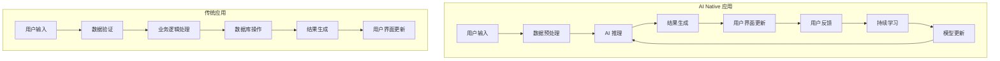
```mermaid
graph TD
    subgraph "AI Native 应用"
    A1[用户输入] --> B1[数据预处理]
    B1 --> C1[AI 推理]
    C1 --> D1[结果生成]
    D1 --> E1[用户界面更新]
    E1 --> F1[用户反馈]
    F1 --> G1[持续学习]
    G1 --> H1[模型更新]
    H1 --> C1
    end

    subgraph "传统应用"
    A2[用户输入] --> B2[数据验证]
    B2 --> C2[业务逻辑处理]
    C2 --> D2[数据库操作]
    D2 --> E2[结果生成]
    E2 --> F2[用户界面更新]
    end
```

这个流程图清晰地展示了 AI Native 应用的循环学习和适应过程，相比之下，传统应用的流程则是线性且固定的。

### 1.1.3 AI Native 应用的核心特征

AI Native 应用具有以下核心特征：

1. 智能决策：利用 AI 模型进行复杂的决策和预测，超越简单的规则基础系统。

2. 自适应性：能够根据新数据和用户行为动态调整其行为和性能。

3. 持续学习：通过不断接收和处理新数据来改进其模型和算法。

4. 个性化体验：为每个用户提供量身定制的交互和内容。

5. 实时响应：能够快速处理和响应实时数据流。

6. 可扩展性：能够处理大规模数据和复杂计算任务。

7. 多模态交互：支持文本、语音、图像等多种输入和输出模式。

8. 知识图谱集成：利用结构化知识来增强 AI 的推理能力。

9. 可解释性：提供 AI 决策过程的透明度和可解释性。

10. 安全性和隐私保护：内置数据保护和模型安全机制。

这些特征使得 AI Native 应用能够提供更智能、更个性化、更高效的用户体验。为了实现这些特征，AI Native 应用通常会采用复杂的系统架构和先进的技术栈。

以下是一个简化的 AI Native 应用架构示意图：

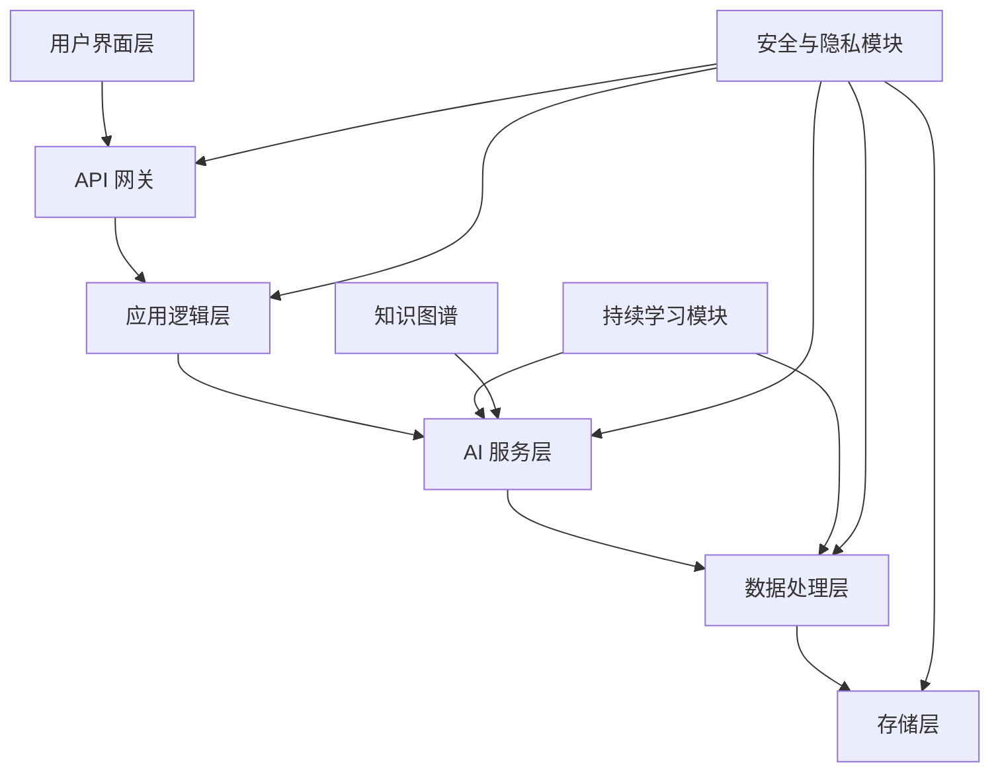
```mermaid
graph TD
    A[用户界面层] --> B[API 网关]
    B --> C[应用逻辑层]
    C --> D[AI 服务层]
    D --> E[数据处理层]
    E --> F[存储层]
    
    G[持续学习模块] --> D
    G --> E
    
    H[知识图谱] --> D
    I[安全与隐私模块] --> B
    I --> C
    I --> D
    I --> E
    I --> F
```

这个架构图展示了 AI Native 应用的各个关键组件及其相互关系。每一层都有其特定的职责，共同协作以实现 AI Native 应用的核心特征。

在实际实现中，AI Native 应用的开发涉及多个技术领域的深度集成，包括但不限于：

- 深度学习和机器学习
- 分布式系统
- 大数据处理
- 实时计算
- 自然语言处理
- 计算机视觉
- 知识图谱
- 安全与隐私保护技术

这种多学科的融合为 AI 工程师带来了新的挑战和机遇。在接下来的章节中，我们将深入探讨如何设计和实现一个真正的 AI Native 应用，包括系统架构、数据流设计、模型部署、性能优化等关键方面。

## 1.2 AI Native 应用的发展趋势

### 1.2.1 技术驱动因素

AI Native 应用的快速发展得益于多个技术领域的突破和融合。以下是推动 AI Native 应用发展的主要技术驱动因素：

1. 深度学习算法的进步
   深度学习模型，特别是大规模语言模型（如 GPT 系列）和多模态模型的突破，极大地扩展了 AI 的能力边界。这些模型能够理解和生成人类语言，处理图像和音频，甚至执行复杂的推理任务。

   ```python
   # 示例：使用大规模语言模型进行文本生成
   from transformers import GPT2LMHeadModel, GPT2Tokenizer

   model = GPT2LMHeadModel.from_pretrained("gpt2-large")
   tokenizer = GPT2Tokenizer.from_pretrained("gpt2-large")

   def generate_text(prompt, max_length=100):
       input_ids = tokenizer.encode(prompt, return_tensors="pt")
       output = model.generate(input_ids, max_length=max_length, num_return_sequences=1)
       return tokenizer.decode(output[0], skip_special_tokens=True)

   prompt = "AI Native applications are revolutionizing software development by"
   generated_text = generate_text(prompt)
   print(generated_text)
   ```

2. 计算能力的提升
   GPU、TPU 等专用硬件的发展，以及分布式计算技术的进步，使得训练和部署大规模 AI 模型成为可能。

3. 大数据技术的成熟
   数据采集、存储、处理和分析技术的进步为 AI 模型提供了丰富的训练数据和实时数据流。

4. 云计算和边缘计算的发展
   云计算提供了灵活可扩展的计算资源，而边缘计算则使得 AI 能够在终端设备上实时运行，减少延迟并提高隐私保护。

5. 5G 和物联网技术
   高速网络和广泛的设备连接为 AI Native 应用提供了更多的数据源和应用场景。

6. AutoML 和 MLOps 的兴起
   自动化的机器学习工具和运维实践简化了 AI 模型的开发、部署和管理过程。

   ```python
   # 示例：使用 AutoML 进行模型选择和超参数调优
   from autosklearn.classification import AutoSklearnClassifier
   from sklearn.datasets import load_digits
   from sklearn.model_selection import train_test_split

   # 加载数据
   X, y = load_digits(return_X_y=True)
   X_train, X_test, y_train, y_test = train_test_split(X, y, test_size=0.33, random_state=42)

   # 使用 AutoML 进行模型训练
   automl = AutoSklearnClassifier(time_left_for_this_task=120, per_run_time_limit=30)
   automl.fit(X_train, y_train)

   # 评估模型性能
   print("Test accuracy:", automl.score(X_test, y_test))
   ```

7. 知识图谱和符号 AI 的集成
   结构化知识的引入增强了 AI 系统的推理能力和可解释性。

8. 联邦学习和差分隐私
   这些技术使得在保护数据隐私的同时进行分布式模型训练成为可能。

   ```python
   # 示例：使用联邦学习进行分布式模型训练
   import tensorflow_federated as tff

   # 定义客户端数据集
   def create_client_data():
       return tf.data.Dataset.from_tensor_slices(
           ({'x': [[1.0], [2.0]]}, [5.0, 6.0])
       ).batch(2)

   # 定义模型
   def create_keras_model():
       return tf.keras.Sequential([
           tf.keras.layers.Dense(1, input_shape=(1,))
       ])

   # 设置联邦学习过程
   client_data = [create_client_data() for _ in range(3)]
   element_spec = client_data[0].element_spec
   model = create_keras_model()

   @tf.function
   def client_update(model, dataset):
       with tf.GradientTape() as tape:
           loss = tf.reduce_mean(tf.keras.losses.mse(
               y_true=dataset['y'],
               y_pred=model(dataset['x'])
           ))
       grads = tape.gradient(loss, model.trainable_variables)
       return grads

   federated_algorithm = tff.learning.build_federated_averaging_process(
       model_fn=create_keras_model,
       client_optimizer_fn=lambda: tf.keras.optimizers.SGD(0.1)
   )

   # 执行联邦学习
   state = federated_algorithm.initialize()
   for _ in range(5):
       state, metrics = federated_algorithm.next(state, client_data)
       print('round loss:', metrics['loss'])
   ```

这些技术驱动因素相互作用，共同推动了 AI Native 应用的快速发展。然而，技术的进步也带来了新的挑战，如模型的可解释性、公平性、隐私保护等问题，这些都是 AI Native 应用开发中需要重点关注的方面。

### 1.2.2 市场需求分析

AI Native 应用的发展不仅受技术驱动，也深受市场需求的影响。以下是当前市场对 AI Native 应用的主要需求和趋势：

1. 个性化体验
   用户越来越期望获得量身定制的服务和内容。AI Native 应用能够通过分析用户行为和偏好，提供高度个性化的体验。

   ```python
   # 示例：基于用户行为的个性化推荐系统
   import pandas as pd
   from sklearn.feature_extraction.text import TfidfVectorizer
   from sklearn.metrics.pairwise import cosine_similarity

   # 假设我们有用户历史数据
   user_history = pd.DataFrame({
       'user_id': [1, 1, 1, 2, 2],
       'item_id': [101, 102, 103, 102, 104],
       'item_description': [
           "AI application development",
           "Machine learning algorithms",
           "Data preprocessing techniques",
           "Machine learning algorithms",
           "Neural network architectures"
       ]
   })

   # 创建TF-IDF向量
   tfidf = TfidfVectorizer()
   tfidf_matrix = tfidf.fit_transform(user_history['item_description'])

   # 计算物品之间的相似度
   cosine_sim = cosine_similarity(tfidf_matrix, tfidf_matrix)

   # 为用户推荐物品
   def recommend_items(user_id, top_n=3):
       user_items = user_history[user_history['user_id'] == user_id]['item_id'].tolist()
       sim_scores = []
       for item in user_items:
           item_index = user_history[user_history['item_id'] == item].index[0]
           sim_scores.extend(list(enumerate(cosine_sim[item_index])))
       
       sim_scores = sorted(sim_scores, key=lambda x: x[1], reverse=True)
       sim_scores = [x for x in sim_scores if user_history.iloc[x[0]]['item_id'] not in user_items]
       
       return [user_history.iloc[i[0]]['item_id'] for i in sim_scores[:top_n]]

   print(recommend_items(user_id=1))
   ```

2. 智能自动化
   企业和个人用户都在寻求更高效的自动化解决方案。AI Native 应用能够自动化复杂的决策过程和工作流程。

3. 实时分析和决策
   在快节奏的商业环境中，实时数据分析和决策变得至关重要。AI Native 应用能够提供实时洞察和智能决策支持。

4. 自然语言交互
   语音助手和聊天机器人的普及反映了用户对更自然、更直观的人机交互方式的需求。

   ```python
   # 示例：简单的自然语言处理聊天机器人
   import nltk
   from nltk.chat.util import Chat, reflections

   # 定义一些简单的对话模式
   patterns = [
       (r'你好|嗨|您好', ['你好！', '很高兴见到你！', '有什么我可以帮助你的吗？']),
       (r'(.*) 的天气', ['我很抱歉，我没有实时的天气信息。你可以查看天气预报app获取%1的天气情况。']),
       (r'你是谁', ['我是一个AI助手，随时为你服务。']),
       (r'再见|拜拜', ['再见！', '祝你有个愉快的一天！', '随时欢迎你回来聊天！']),
       (r'(.*)', ['对不起，我不太理解你的意思。能请你换个方式表达吗？', '这个问题有点复杂，我可能需要更多信息。'])
   ]

   # 创建聊天机器人
   chatbot = Chat(patterns, reflections)

   # 开始对话
   print("你好！我是AI助手。输入'再见'结束对话。")
   while True:
       user_input = input("> ")
       if user_input.lower() == '再见':
           print(chatbot.respond(user_input))
           break
       print(chatbot.respond(user_input))
   ```

5. 预测性维护和优化
   在制造业、能源和基础设施等领域，预测性维护和优化成为降低成本和提高效率的关键。

6. 增强现实和虚拟现实
   AR/VR 技术与 AI 的结合为教育、培训、娱乐等领域带来了新的可能性。

7. 健康监测和个性化医疗
   AI Native 应用在健康监测、疾病诊断和个性化治疗方案制定方面显示出巨大潜力。

   ```python
   # 示例：使用机器学习进行简单的健康风险评估
   from sklearn.ensemble import RandomForestClassifier
   from sklearn.model_selection import train_test_split
   import numpy as np

   # 模拟健康数据
   np.random.seed(42)
   n_samples = 1000
   age = np.random.randint(18, 80, n_samples)
   bmi = np.random.uniform(18.5, 35, n_samples)
   blood_pressure = np.random.randint(90, 180, n_samples)
   cholesterol = np.random.randint(120, 300, n_samples)
   exercise = np.random.choice([0, 1], n_samples)
   
   # 创建特征矩阵
   X = np.column_stack((age, bmi, blood_pressure, cholesterol, exercise))
   
   # 模拟健康风险（0：低风险，1：高风险）
   y = (0.1 * age + 0.3 * bmi + 0.2 * blood_pressure + 0.2 * cholesterol - 10 * exercise > 50).astype(int)

   # 分割数据集
   X_train, X_test, y_train, y_test = train_test_split(X, y, test_size=0.2, random_state=42)

   # 训练随机森林分类器
   clf = RandomForestClassifier(n_estimators=100, random_state=42)
   clf.fit(X_train, y_train)

   # 评估模型
   print("模型准确率:", clf.score(X_test, y_test))

   # 使用模型进行健康风险评估
   def assess_health_risk(age, bmi, blood_pressure, cholesterol, exercise):
       features = np.array([[age, bmi, blood_pressure, cholesterol, exercise]])
       risk = clf.predict(features)[0]
       risk_probability = clf.predict_proba(features)[0][1]
       return "高风险" if risk == 1 else "低风险", risk_probability

   # 示例评估
   risk_level, risk_prob = assess_health_risk(45, 28, 130, 220, 0)
   print(f"健康风险评估: {risk_level}, 风险概率: {risk_prob:.2f}")
   ```

8. 智能安全系统
   随着网络威胁的增加，基于 AI 的智能安全系统需求日益增长。

9. 环境监测和可持续发展
   AI Native 应用在气候变化监测、资源优化和可持续发展规划中发挥着重要作用。

10. 教育个性化
    AI 驱动的自适应学习系统能够为学生提供个性化的学习体验。

### 1.2.3 未来发展方向预测

基于当前的技术趋势和市场需求，我们可以对 AI Native 应用的未来发展方向做出以下预测：

1. 多模态 AI 系统的普及
   未来的 AI Native 应用将更加擅长处理和整合文本、图像、语音、视频等多种模态的数据，提供更全面和自然的交互体验。

2. 自主学习和适应能力的提升
   AI 系统将具备更强的自主学习能力，能够从少量数据中快速学习并适应新的任务和环境。

   ```python
   # 示例：简单的元学习模型
   import numpy as np
   import tensorflow as tf
   from tensorflow.keras import layers, models

   # 定义元学习模型
   class MetaLearner(models.Model):
       def __init__(self):
           super(MetaLearner, self).__init__()
           self.encoder = layers.LSTM(64, return_sequences=True)
           self.decoder = layers.LSTM(64)
           self.output_layer = layers.Dense(1)

       def call(self, inputs):
           x, x_target = inputs
           encoded = self.encoder(x)
           decoded = self.decoder(encoded)
           return self.output_layer(decoded)

   # 生成任务数据
   def generate_task():
       a = np.random.uniform(0, 10)
       b = np.random.uniform(0, 10)
       x = np.random.uniform(0, 10, (10, 1))
       y = a * x + b
       return x, y

   # 训练元学习模型
   meta_learner = MetaLearner()
   optimizer = tf.keras.optimizers.Adam(0.01)

   for _ in range(1000):
       x, y = generate_task()
       with tf.GradientTape() as tape:
           y_pred = meta_learner([x[:-1], x[-1:]])
           loss = tf.reduce_mean(tf.square(y_pred - y[-1:]))
       grads = tape.gradient(loss, meta_learner.trainable_variables)
       optimizer.apply_gradients(zip(grads, meta_learner.trainable_variables))

   # 测试元学习模型
   x_test, y_test = generate_task()
   y_pred = meta_learner([x_test[:-1], x_test[-1:]])
   print("预测值:", y_pred.numpy()[0][0])
   print("实际值:", y_test[-1][0])
   ```

3. 边缘 AI 和分布式 AI 的发展
   更多的 AI 计算将在边缘设备上进行，同时分布式 AI 系统将实现更大规模的协作学习。

4. 可解释 AI 的重要性增加
   随着 AI 系统在关键决策中的应用增多，可解释性将成为 AI Native 应用的核心特征之一。

5. AI 与区块链的融合
   区块链技术将为 AI 系统提供去中心化的数据共享和模型训练机制，增强数据的可信度和模型的透明度。

6. 量子计算与 AI 的结合
   量子计算有望为某些 AI 任务带来突破性的性能提升，特别是在优化和模拟领域。

7. 人机协作的新模式
   AI Native 应用将不仅仅是工具，而是人类的智能伙伴，形成更加紧密的人机协作关系。

8. 跨领域 AI 应用的增加
   AI 技术将更深入地融合到各个行业和学科中，催生出更多跨领域的创新应用。

9. AI 伦理和监管的完善
   随着 AI 的广泛应用，相关的伦理准则和法律法规将更加完善，以确保 AI 技术的负责任发展。

10. 生成式 AI 的广泛应用
    像 GPT-3 这样的大规模语言模型将在内容创作、代码生成、设计等领域发挥越来越重要的作用。

    ```python
    # 示例：使用 GPT-3 进行文本生成
    import openai

    openai.api_key = 'your_api_key_here'

    def generate_text(prompt, max_tokens=100):
        response = openai.Completion.create(
            engine="text-davinci-002",
            prompt=prompt,
            max_tokens=max_tokens,
            n=1,
            stop=None,
            temperature=0.7,
        )
        return response.choices[0].text.strip()

    prompt = "未来的 AI Native 应用将如何改变我们的生活？"
    generated_text = generate_text(prompt)
    print(generated_text)
    ```

这些发展方向预测反映了 AI Native 应用的巨大潜力和复杂性。作为 AI 工程师，我们需要不断学习和适应这些新趋势，同时也要考虑技术应用的社会影响和伦理问题。在接下来的章节中，我们将深入探讨如何设计和实现能够适应这些未来趋势的 AI Native 应用。

## 1.3 AI Native 应用的典型场景

AI Native 应用已经在多个领域展现出其强大的潜力。以下是一些典型的应用场景，这些场景充分利用了 AI 的核心优势，如自然语言处理、计算机视觉、预测分析等。

### 1.3.1 智能客服与对话系统

智能客服和对话系统是 AI Native 应用的一个重要领域，它们能够大幅提高客户服务的效率和质量。

1. 多语言支持：AI 驱动的客服系统可以实时翻译和理解多种语言，为全球客户提供无缝服务。

2. 情感分析：通过分析用户的语气和用词，系统可以识别客户的情绪状态，相应地调整回复的语气和内容。

3. 知识图谱集成：结合企业知识库和知识图谱，智能客服可以提供更准确、全面的信息。

4. 多轮对话管理：AI 系统能够维护对话上下文，进行复杂的多轮交互。

5. 人机协作：在处理复杂问题时，系统可以无缝地将对话转接给人工客服。

以下是一个简单的智能客服系统的示例代码：

```python
import random
import re
from sklearn.feature_extraction.text import TfidfVectorizer
from sklearn.metrics.pairwise import cosine_similarity

# 简单的知识库
knowledge_base = {
    "产品信息": "我们提供多种AI解决方案，包括智能客服、预测分析和计算机视觉应用。",
    "价格咨询": "我们的产品价格根据具体需求而定。请提供更多细节，我们会为您定制方案。",
    "技术支持": "我们提供7*24小时的技术支持。您可以通过邮件或电话联系我们的支持团队。",
    "公司介绍": "我们是一家专注于AI技术的创新公司，致力于为客户提供最先进的AI解决方案。"
}

# 预处理函数
def preprocess(text):
    return re.sub(r'[^\w\s]', '', text.lower())

# 使用TF-IDF向量化文本
vectorizer = TfidfVectorizer(tokenizer=lambda x: x.split())
knowledge_vectors = vectorizer.fit_transform(knowledge_base.values())

def get_response(user_input):
    user_vector = vectorizer.transform([preprocess(user_input)])
    similarities = cosine_similarity(user_vector, knowledge_vectors)
    most_similar = similarities.argmax()
    
    if similarities[0][most_similar] < 0.1:
        return "抱歉，我没有理解您的问题。您能否提供更多信息？"
    
    return list(knowledge_base.values())[most_similar]

# 主对话循环
print("AI客服：您好！我是AI客服助手，有什么可以帮您的吗？")
while True:
    user_input = input("用户：")
    if user_input.lower() in ['再见', '退出']:
        print("AI客服：感谢您的咨询，再见！")
        break
    response = get_response(user_input)
    print("AI客服：", response)
```

这个简单的智能客服系统使用了TF-IDF和余弦相似度来匹配用户输入与预定义的回答。在实际应用中，我们可以使用更复杂的自然语言处理模型，如BERT或GPT，来提高系统的理解和生成能力。

### 1.3.2 个性化推荐与内容生成

个性化推荐系统和内容生成是AI Native应用的另一个重要领域，它们能够为用户提供定制化的体验。

1. 协同过滤：基于用户行为数据，推荐系统可以找到相似用户或相似物品，从而进行个性化推荐。

2. 内容基础推荐：通过分析物品的特征和用户的偏好，系统可以推荐与用户兴趣相匹配的内容。

3. 实时个性化：根据用户的实时行为和上下文信息（如时间、位置等）动态调整推荐结果。

4. 多目标优化：平衡用户兴趣、内容多样性、商业目标等多个因素，提供全面优化的推荐结果。

5. 自动内容生成：使用生成式AI模型，如GPT-3，自动创建个性化的文章、广告文案或产品描述。

以下是一个简单的基于协同过滤的推荐系统示例：

```python
import numpy as np
from sklearn.metrics.pairwise import cosine_similarity

# 模拟用户-物品交互矩阵
user_item_matrix = np.array([
    [5, 3, 0, 1],
    [4, 0, 0, 1],
    [1, 1, 0, 5],
    [1, 0, 0, 4],
    [0, 1, 5, 4],
])

def user_based_cf(user_id, user_item_matrix, k=2):
    # 计算用户相似度
    user_similarity = cosine_similarity(user_item_matrix)
    
    # 找到最相似的k个用户
    similar_users = user_similarity[user_id].argsort()[::-1][1:k+1]
    
    # 获取用户尚未交互的物品
    unrated_items = np.where(user_item_matrix[user_id] == 0)[0]
    
    # 计算预测评分
    recommendations = {}
    for item in unrated_items:
        pred_rating = 0
        total_similarity = 0
        for similar_user in similar_users:
            if user_item_matrix[similar_user][item] > 0:
                pred_rating += user_similarity[user_id][similar_user] * user_item_matrix[similar_user][item]
                total_similarity += user_similarity[user_id][similar_user]
        if total_similarity > 0:
            recommendations[item] = pred_rating / total_similarity
    
    # 排序并返回推荐结果
    return sorted(recommendations.items(), key=lambda x: x[1], reverse=True)

# 为用户0生成推荐
user_id = 0
recommendations = user_based_cf(user_id, user_item_matrix)
print(f"为用户{user_id}的推荐：", recommendations)
```

这个简单的协同过滤推荐系统使用了余弦相似度来计算用户之间的相似性，并基于相似用户的评分来预测目标用户对未评分物品的可能评分。在实际应用中，我们可能会使用更复杂的模型，如矩阵分解、深度学习模型等，以处理大规模稀疏数据和捕捉更复杂的模式。

### 1.3.3 智能决策支持系统

智能决策支持系统是AI Native应用在商业和管理领域的重要应用，它能够帮助决策者更好地理解复杂情况并做出明智决策。

1. 数据整合与可视化：从多个来源收集和整合数据，并通过直观的可视化展示关键信息。

2. 预测分析：使用机器学习模型预测未来趋势，如销售预测、风险评估等。

3. 情景模拟：通过模拟不同决策的潜在结果，帮助决策者评估各种选择。

4. 实时监控与预警：持续监控关键指标，在异常情况发生时及时预警。

5. 自然语言查询：允许用户使用自然语言提问，系统自动解析并提供相关分析结果。

以下是一个简单的销售预测模型示例，它可以作为智能决策支持系统的一部分：

```python
import numpy as np
import pandas as pd
from sklearn.model_selection import train_test_split
from sklearn.preprocessing import StandardScaler
from sklearn.ensemble import RandomForestRegressor
from sklearn.metrics import mean_squared_error, r2_score

# 生成模拟数据
np.random.seed(0)
n_samples = 1000

data = pd.DataFrame({
    'advertising_spend': np.random.uniform(1000, 10000, n_samples),
    'price': np.random.uniform(50, 500, n_samples),
    'competitor_price': np.random.uniform(40, 600, n_samples),
    'season': np.random.choice(['Spring', 'Summer', 'Autumn', 'Winter'], n_samples),
    'economic_indicator': np.random.normal(100, 10, n_samples)
})

# 模拟销售量
data['sales'] = (
    2 * data['advertising_spend'] / 1000 +
    -0.5 * data['price'] +
    0.3 * data['competitor_price'] +
    {'Spring': 100, 'Summer': 200, 'Autumn': 50, 'Winter': 0}[data['season']] +
    0.5 * data['economic_indicator'] +
    np.random.normal(0, 100, n_samples)
).clip(0)

# 数据预处理
X = pd.get_dummies(data.drop('sales', axis=1), columns=['season'])
y = data['sales']

X_train, X_test, y_train, y_test = train_test_split(X, y, test_size=0.2, random_state=42)

scaler = StandardScaler()
X_train_scaled = scaler.fit_transform(X_train)
X_test_scaled = scaler.transform(X_test)

# 训练随机森林模型
rf_model = RandomForestRegressor(n_estimators=100, random_state=42)
rf_model.fit(X_train_scaled, y_train)

# 评估模型
y_pred = rf_model.predict(X_test_scaled)
mse = mean_squared_error(y_test, y_pred)
r2 = r2_score(y_test, y_pred)

print(f"均方误差: {mse:.2f}")
print(f"R2 分数: {r2:.2f}")

# 特征重要性
feature_importance = pd.DataFrame({
    'feature': X.columns,
    'importance': rf_model.feature_importances_
}).sort_values('importance', ascending=False)

print("\n特征重要性:")
print(feature_importance)

# 使用模型进行预测
def predict_sales(advertising_spend, price, competitor_price, season, economic_indicator):
    input_data = pd.DataFrame({
        'advertising_spend': [advertising_spend],
        'price': [price],
        'competitor_price': [competitor_price],
        'economic_indicator': [economic_indicator],
        'season_Autumn': [1 if season == 'Autumn' else 0],
        'season_Spring': [1 if season == 'Spring' else 0],
        'season_Summer': [1 if season == 'Summer' else 0],
        'season_Winter': [1 if season == 'Winter' else 0]
    })
    input_scaled = scaler.transform(input_data)
    return rf_model.predict(input_scaled)[0]

# 预测示例
predicted_sales = predict_sales(5000, 200, 180, 'Summer', 105)
print(f"\n预测销售量: {predicted_sales:.2f}")
```

这个销售预测模型使用随机森林算法来预测销售量，考虑了广告支出、价格、竞争对手价格、季节和经济指标等因素。在实际的智能决策支持系统中，这样的预测模型可以与其他分析工具和可视化组件结合，为决策者提供全面的信息支持。

### 1.3.4 创意设计与内容创作

AI在创意设计和内容创作领域的应用正在快速发展，为创作者提供了新的工具和灵感来源。

1. 图像生成：使用生成对抗网络（GANs）或扩散模型创建全新的图像或修改现有图像。

2. 文本创作：利用大型语言模型（如GPT-3）生成文章、故事、诗歌或广告文案。

3. 音乐创作：AI系统可以创作原创音乐或协助音乐家进行编曲。

4. 视频编辑：自动剪辑、添加特效或生成视频摘要。

5. 交互式设计：AI辅助用户界面设计，根据用户偏好和行为自动调整布局。

以下是一个使用OpenAI的GPT-3模型进行文本创作的简单示例：

```python
import openai

# 设置您的OpenAI API密钥
openai.api_key = 'your-api-key-here'

def generate_creative_text(prompt, max_tokens=150):
    response = openai.Completion.create(
        engine="text-davinci-002",
        prompt=prompt,
        max_tokens=max_tokens,
        n=1,
        stop=None,
        temperature=0.7,
    )
    return response.choices[0].text.strip()

# 创意写作示例
writing_prompt = "在一个充满AI的未来世界中，一位年轻的程序员发现了一个惊人的秘密。故事开头是这样的："

generated_story = generate_creative_text(writing_prompt)
print("生成的故事开头：")
print(generated_story)

# 广告文案生成示例
ad_prompt = "为一款新推出的AI驱动的智能家居系统写一段简短的广告文案，突出其便捷性和创新性。"

generated_ad = generate_creative_text(ad_prompt)
print("\n生成的广告文案：")
print(generated_ad)

# 诗歌创作示例
poem_prompt = "写一首关于人工智能和人类创造力共存的短诗。"

generated_poem = generate_creative_text(poem_prompt)
print("\n生成的诗歌：")
print(generated_poem)
```

这个示例展示了如何使用GPT-3模型进行不同类型的创意文本生成，包括故事创作、广告文案和诗歌。在实际应用中，我们可能需要进行更多的提示工程（prompt engineering）和结果筛选，以确保生成的内容符合特定的风格和质量要求。

AI Native应用在创意设计和内容创作领域的应用正在不断扩展，不仅提高了创作效率，也为创作者提供了新的灵感来源。然而，它也引发了关于创作权、原创性和AI在艺术中角色的讨论。作为AI工程师，我们需要思考如何设计这些系统，使其能够增强而不是取代人类的创造力。

总结：
本节我们探讨了AI Native应用的四个典型场景：智能客服与对话系统、个性化推荐与内容生成、智能决策支持系统以及创意设计与内容创作。这些应用充分展示了AI技术在提升用户体验、辅助决策和激发创造力方面的巨大潜力。

在实际开发AI Native应用时，我们需要考虑以下几个关键点：

1. 数据质量和隐私：确保训练数据的质量和多样性，同时严格保护用户隐私。

2. 模型选择和优化：根据具体应用场景选择合适的AI模型，并进行针对性的优化。

3. 实时性和可扩展性：设计能够快速响应并且可以处理大规模数据和用户请求的系统架构。

4. 人机协作：在适当的时候将任务转交给人类操作员，实现AI和人类专家的优势互补。

5. 持续学习和适应：建立机制使系统能够从新数据和用户反馈中不断学习和改进。

6. 可解释性和透明度：特别是在决策支持系统中，确保AI的决策过程是可解释和透明的。

7. 伦理考虑：在开发和部署AI系统时，需要考虑潜在的伦理问题和社会影响。

通过深入理解这些典型场景和关键考虑点，我们可以更好地设计和实现真正有价值的AI Native应用，为用户创造更智能、更个性化的体验。在接下来的章节中，我们将深入探讨如何从系统设计和架构层面来实现这些应用，以及如何应对在开发过程中可能遇到的各种挑战。

# 2 AI Native 应用的系统设计原则

在开发 AI Native 应用时，遵循一套明确的系统设计原则至关重要。这些原则不仅能够指导我们构建高效、可扩展和可维护的系统，还能确保 AI 功能被无缝集成到应用的各个方面。本章将详细探讨 AI Native 应用的核心设计原则。

## 2.1 以 AI 为中心的设计思想

以 AI 为中心的设计思想是 AI Native 应用的核心。这意味着 AI 不仅仅是应用的一个附加功能，而是整个系统的核心驱动力。

### 2.1.1 AI 驱动的用户体验设计

在 AI Native 应用中，用户体验应该围绕 AI 的能力来设计。这包括：

1. 智能交互：利用自然语言处理和计算机视觉技术，创造更自然、直观的交互方式。

2. 预测性界面：基于用户行为和偏好，预测用户可能的下一步操作，提供相应的快捷方式或建议。

3. 动态内容：根据用户的实时行为和上下文，动态调整展示的内容和功能。

4. 持续学习：从用户交互中不断学习，逐步优化用户体验。

以下是一个简单的预测性界面示例：

```python
import numpy as np
from sklearn.cluster import KMeans

class PredictiveUI:
    def __init__(self, n_clusters=3):
        self.kmeans = KMeans(n_clusters=n_clusters)
        self.user_actions = []
        self.action_suggestions = {
            0: ["搜索", "浏览分类", "查看推荐"],
            1: ["添加到购物车", "立即购买", "查看详情"],
            2: ["查看订单", "联系客服", "评价商品"]
        }

    def record_action(self, action, context):
        self.user_actions.append(context + [action])
        if len(self.user_actions) % 10 == 0:  # 每10个动作更新一次模型
            self.update_model()

    def update_model(self):
        if len(self.user_actions) < self.kmeans.n_clusters:
            return
        X = np.array(self.user_actions)
        self.kmeans.fit(X)

    def get_suggestions(self, current_context):
        if not self.kmeans.cluster_centers_.any():
            return self.action_suggestions[0]  # 返回默认建议
        
        cluster = self.kmeans.predict([current_context])[0]
        return self.action_suggestions[cluster]

# 使用示例
ui = PredictiveUI()

# 模拟用户操作
contexts = [
    [1, 0, 1],  # 时间段，设备类型，用户类型
    [2, 1, 0],
    [0, 0, 1],
]
actions = ["搜索", "添加到购物车", "查看订单"]

for context, action in zip(contexts, actions):
    ui.record_action(action, context)
    print(f"当前操作: {action}")
    print(f"下一步建议: {ui.get_suggestions(context)}\n")

# 预测新的上下文
new_context = [1, 1, 1]
print(f"新上下文建议: {ui.get_suggestions(new_context)}")
```

这个例子展示了一个简单的预测性UI系统，它基于用户的历史行为和当前上下文来提供操作建议。在实际应用中，我们可能会使用更复杂的模型和特征工程来提高预测准确性。

### 2.1.2 AI 能力的无缝集成

AI 能力应该被无缝地集成到应用的各个方面，而不是作为独立的模块存在。这包括：

1. 微服务架构：将 AI 功能封装为独立的微服务，便于集成和扩展。

2. API 设计：设计灵活的 API，使 AI 功能可以轻松地被应用的其他部分调用。

3. 事件驱动架构：使用事件驱动的方式触发 AI 处理，实现实时响应。

4. 数据流设计：确保 AI 模型能够及时获取所需的数据，并将结果快速反馈给相关组件。

以下是一个简单的 AI 微服务架构示例：

```python
from fastapi import FastAPI
from pydantic import BaseModel
import joblib
import numpy as np

app = FastAPI()

# 加载预训练的模型
model = joblib.load("sentiment_model.joblib")

class TextInput(BaseModel):
    text: str

@app.post("/predict_sentiment")
async def predict_sentiment(input: TextInput):
    # 这里应该有文本预处理的步骤
    prediction = model.predict([input.text])[0]
    sentiment = "正面" if prediction == 1 else "负面"
    return {"sentiment": sentiment, "confidence": float(model.predict_proba([input.text])[0].max())}

@app.post("/feedback")
async def feedback(input: TextInput, actual_sentiment: int):
    # 记录反馈，用于后续模型更新
    # 在实际应用中，这里应该将数据存储到数据库
    print(f"Feedback received: {input.text}, Actual sentiment: {actual_sentiment}")
    return {"status": "feedback recorded"}

if __name__ == "__main__":
    import uvicorn
    uvicorn.run(app, host="0.0.0.0", port=8000)
```

这个例子展示了一个简单的情感分析 AI 微服务。它提供了预测接口和反馈接口，允许其他服务轻松集成情感分析功能，并通过用户反馈不断改进模型。

### 2.1.3 持续学习与适应性设计

AI Native 应用应该具有持续学习和适应的能力，这包括：

1. 在线学习：设计支持增量学习的模型架构，能够从新数据中不断学习。

2. A/B 测试框架：建立系统化的 A/B 测试框架，持续优化 AI 模型和用户体验。

3. 反馈循环：设计闭环的反馈机制，收集用户反馈并用于模型更新。

4. 多模型策略：维护多个模型版本，根据性能动态选择最佳模型。

以下是一个简单的在线学习示例：

```python
import numpy as np
from sklearn.linear_model import SGDClassifier
from sklearn.preprocessing import StandardScaler
from sklearn.pipeline import make_pipeline

class OnlineLearningSystem:
    def __init__(self):
        self.model = make_pipeline(
            StandardScaler(with_mean=False),
            SGDClassifier(loss='log', random_state=42)
        )
        self.classes = []

    def partial_fit(self, X, y):
        if not self.classes:
            self.classes = np.unique(y)
        self.model.partial_fit(X, y, classes=self.classes)

    def predict(self, X):
        return self.model.predict(X)

    def predict_proba(self, X):
        return self.model.predict_proba(X)

# 使用示例
online_system = OnlineLearningSystem()

# 模拟数据流
for _ in range(100):
    # 生成随机数据
    X = np.random.rand(1, 5)
    y = np.random.choice([0, 1])
    
    # 进行预测
    if online_system.classes:
        prediction = online_system.predict(X)
        print(f"预测: {prediction}, 实际: {y}")
    
    # 更新模型
    online_system.partial_fit(X, [y])

# 最终预测
X_test = np.random.rand(1, 5)
final_prediction = online_system.predict(X_test)
final_proba = online_system.predict_proba(X_test)
print(f"最终预测: {final_prediction}")
print(f"预测概率: {final_proba}")
```

这个例子展示了一个简单的在线学习系统，它可以不断从新数据中学习，并实时更新其预测。在实际应用中，我们需要考虑更复杂的场景，如处理概念漂移、特征工程的动态调整等。

总结：
以 AI 为中心的设计思想要求我们从根本上重新思考应用的架构和用户体验。通过将 AI 能力无缝集成到应用的各个方面，并设计支持持续学习和适应的机制，我们可以创建真正智能和动态的 AI Native 应用。这种设计思想不仅能够提供更个性化和智能的用户体验，还能使应用随着时间的推移不断改进和适应变化的需求。

在实施以 AI 为中心的设计时，我们需要注意以下几点：

1. 数据流设计：确保 AI 模型能够及时获取所需的高质量数据。
2. 实时性能：优化 AI 处理管道，以满足实时响应的需求。
3. 可解释性：在适当的场景下，提供 AI 决策的解释。
4. 隐私保护：在收集和使用数据时，严格遵守隐私保护规定。
5. 错误处理：设计合理的回退机制，以应对 AI 模型可能的错误或不确定性。

通过遵循这些原则，我们可以创建既智能又可靠的 AI Native 应用，为用户提供卓越的体验。

## 2.2 可扩展性与灵活性

在 AI Native 应用中，可扩展性和灵活性是至关重要的设计原则。这些原则使得应用能够适应不断增长的数据量、用户数和功能需求，同时保持高性能和可维护性。

### 2.2.1 模块化设计原则

模块化设计是实现可扩展性和灵活性的基础。它包括以下几个关键点：

1. 单一职责原则：每个模块应该只负责一个特定的功能或任务。

2. 松耦合：模块之间应该尽可能减少依赖，通过定义良好的接口进行通信。

3. 高内聚：相关的功能应该组织在同一个模块中。

4. 可替换性：模块应该设计成可以轻易替换或升级，而不影响整个系统。

以下是一个模块化设计的简单示例：

```python
from abc import ABC, abstractmethod

# 抽象基类
class AIModel(ABC):
    @abstractmethod
    def predict(self, input_data):
        pass

# 具体模型实现
class SentimentAnalysisModel(AIModel):
    def predict(self, input_data):
        # 实现情感分析逻辑
        return "正面" if len(input_data) % 2 == 0 else "负面"

class EntityRecognitionModel(AIModel):
    def predict(self, input_data):
        # 实现实体识别逻辑
        return ["实体1", "实体2"]

# 模型管理器
class ModelManager:
    def __init__(self):
        self.models = {}

    def add_model(self, name, model):
        if not isinstance(model, AIModel):
            raise ValueError("Model must be an instance of AIModel")
        self.models[name] = model

    def get_model(self, name):
        return self.models.get(name)

    def predict(self, name, input_data):
        model = self.get_model(name)
        if model:
            return model.predict(input_data)
        else:
            raise ValueError(f"Model {name} not found")

# 使用示例
manager = ModelManager()
manager.add_model("sentiment", SentimentAnalysisModel())
manager.add_model("entity", EntityRecognitionModel())

text = "这是一个测试文本"
print(f"情感分析结果: {manager.predict('sentiment', text)}")
print(f"实体识别结果: {manager.predict('entity', text)}")
```

这个例子展示了如何使用模块化设计来构建一个灵活的 AI 模型管理系统。通过定义抽象接口和具体实现，我们可以轻松地添加新的模型类型，而不需要修改现有代码。

### 2.2.2 微服务架构在 AI Native 中的应用

微服务架构是实现可扩展性和灵活性的有效方法，特别适合 AI Native 应用。主要优势包括：

1. 独立部署：每个微服务可以独立开发、测试和部署。

2. 技术多样性：不同的微服务可以使用最适合其功能的技术栈。

3. 故障隔离：一个服务的故障不会直接影响其他服务。

4. 按需扩展：可以根据需求单独扩展特定的服务。

以下是一个简化的 AI 微服务架构示例：

```python
from fastapi import FastAPI
from pydantic import BaseModel
import httpx

app = FastAPI()

class TextInput(BaseModel):
    text: str

class AnalysisResult(BaseModel):
    sentiment: str
    entities: list

# 情感分析微服务
sentiment_service_url = "http://sentiment-service:8000/predict"

# 实体识别微服务
entity_service_url = "http://entity-service:8001/predict"

@app.post("/analyze", response_model=AnalysisResult)
async def analyze_text(input: TextInput):
    async with httpx.AsyncClient() as client:
        # 并行调用两个微服务
        sentiment_task = client.post(sentiment_service_url, json={"text": input.text})
        entity_task = client.post(entity_service_url, json={"text": input.text})
        
        sentiment_response, entity_response = await asyncio.gather(sentiment_task, entity_task)
    
    sentiment = sentiment_response.json()["sentiment"]
    entities = entity_response.json()["entities"]

    return AnalysisResult(sentiment=sentiment, entities=entities)

if __name__ == "__main__":
    import uvicorn
    uvicorn.run(app, host="0.0.0.0", port=8002)
```

这个例子展示了如何使用 FastAPI 构建一个简单的 API 网关，它协调多个 AI 微服务（情感分析和实体识别）的调用。这种架构允许我们独立扩展和更新每个 AI 功能，同时提供一个统一的接口给客户端。

### 2.2.3 动态资源分配策略

在 AI Native 应用中，工作负载可能会随时间快速变化。动态资源分配策略可以确保系统能够高效地利用可用资源，并在需要时快速扩展。关键策略包括：

1. 自动扩缩容：根据负载自动调整计算资源。

2. 负载均衡：在多个实例之间均匀分配请求。

3. 任务优先级队列：根据任务的重要性和紧急程度分配资源。

4. 资源预留和限制：为关键服务预留资源，同时限制非关键任务的资源使用。

以下是一个简单的动态资源分配模拟器：

```python
import random
import time
from collections import deque

class Task:
    def __init__(self, id, priority, resource_need):
        self.id = id
        self.priority = priority
        self.resource_need = resource_need

class ResourceAllocator:
    def __init__(self, total_resources):
        self.total_resources = total_resources
        self.available_resources = total_resources
        self.task_queue = deque()

    def add_task(self, task):
        self.task_queue.append(task)

    def allocate_resources(self):
        allocated_tasks = []
        self.task_queue = deque(sorted(self.task_queue, key=lambda x: x.priority, reverse=True))

        while self.task_queue and self.available_resources > 0:
            task = self.task_queue.popleft()
            if task.resource_need <= self.available_resources:
                self.available_resources -= task.resource_need
                allocated_tasks.append(task)
            else:
                self.task_queue.appendleft(task)
                break

        return allocated_tasks

    def release_resources(self, resource_amount):
        self.available_resources = min(self.total_resources, self.available_resources + resource_amount)

# 模拟资源分配
allocator = ResourceAllocator(total_resources=100)

for i in range(20):
    task = Task(id=i, priority=random.randint(1, 5), resource_need=random.randint(10, 30))
    allocator.add_task(task)

for _ in range(5):  # 模拟5个时间单位
    print(f"可用资源: {allocator.available_resources}")
    allocated = allocator.allocate_resources()
    print(f"分配的任务: {[task.id for task in allocated]}")
    
    # 模拟任务完成并释放资源
    for task in allocated:
        time.sleep(0.1)  # 模拟任务执行时间
        allocator.release_resources(task.resource_need)

    print(f"剩余任务数: {len(allocator.task_queue)}\n")
```

这个例子模拟了一个简单的资源分配器，它根据任务优先级和资源需求动态分配资源。在实际的 AI Native 应用中，我们可能需要考虑更复杂的因素，如任务依赖关系、资源类型（如 CPU、GPU、内存）等。

总结：
可扩展性和灵活性是 AI Native 应用成功的关键因素。通过采用模块化设计、微服务架构和动态资源分配策略，我们可以构建能够适应不断变化的需求和工作负载的系统。这些原则不仅有助于管理复杂性，还能提高系统的可维护性和可靠性。

在实施这些策略时，需要注意以下几点：

1. 接口设计：定义清晰、稳定的接口，以确保模块和服务之间的顺畅通信。
2. 服务发现：在微服务架构中实现有效的服务发现机制。
3. 监控和日志：建立全面的监控和日志系统，以便快速识别和解决问题。
4. 容错设计：实现熔断、重试等机制，提高系统的弹性。
5. 性能优化：持续监控和优化系统性能，特别是在服务间通信方面。

通过遵循这些原则和最佳实践，我们可以构建既灵活又强大的 AI Native 应用，能够满足不断增长和变化的业务需求。

## 2.3 数据驱动的架构设计

在 AI Native 应用中，数据是核心资产。数据驱动的架构设计确保了数据的高效收集、处理、存储和利用，为 AI 模型提供持续的学习和优化基础。

### 2.3.1 数据流设计与优化

有效的数据流设计对于 AI Native 应用的性能和可扩展性至关重要。关键考虑点包括：

1. 数据摄取：设计高效的数据收集管道，支持多种数据源和格式。
2. 实时处理：实现流处理架构，以处理高速实时数据。
3. 批处理：对于大规模历史数据分析，设计高效的批处理流程。
4. 数据质量：在数据流的各个阶段实施数据验证和清洗。
5. 数据编排：协调不同数据处理任务的执行。

以下是一个简单的数据流设计示例，使用 Apache Kafka 和 Apache Flink：

```python
from pyflink.datastream import StreamExecutionEnvironment
from pyflink.common.serialization import SimpleStringSchema
from pyflink.datastream.connectors import FlinkKafkaConsumer, FlinkKafkaProducer

def data_flow_job():
    env = StreamExecutionEnvironment.get_execution_environment()
    
    # 配置 Kafka 消费者
    kafka_consumer = FlinkKafkaConsumer(
        topics='input-topic',
        deserialization_schema=SimpleStringSchema(),
        properties={'bootstrap.servers': 'localhost:9092', 'group.id': 'test-group'}
    )

    # 配置 Kafka 生产者
    kafka_producer = FlinkKafkaProducer(
        topic='output-topic',
        serialization_schema=SimpleStringSchema(),
        producer_config={'bootstrap.servers': 'localhost:9092'}
    )

    # 定义数据处理逻辑
    (
        env.add_source(kafka_consumer)
        .map(lambda x: process_data(x))
        .filter(lambda x: x is not None)
        .add_sink(kafka_producer)
    )

    env.execute("Data Flow Job")

def process_data(data):
    # 实现数据处理逻辑
    try:
        # 假设数据是 JSON 格式
        parsed_data = json.loads(data)
        # 进行一些处理...
        processed_data = some_processing_function(parsed_data)
        return json.dumps(processed_data)
    except json.JSONDecodeError:
        print(f"Invalid JSON data: {data}")
        return None

if __name__ == '__main__':
    data_flow_job()
```

这个例子展示了如何使用 Apache Flink 创建一个简单的流处理作业，从 Kafka 主题读取数据，进行处理，然后将结果写回另一个 Kafka 主题。在实际应用中，我们可能需要添加更复杂的处理逻辑、错误处理和监控。

### 2.3.2 实时数据处理架构

实时数据处理是 AI Native 应用的关键特性之一，它使应用能够快速响应和适应变化。实时处理架构的主要组件包括：

1. 消息队列：如 Apache Kafka，用于高吞吐量的数据摄取。
2. 流处理引擎：如 Apache Flink 或 Apache Spark Streaming，用于复杂的实时数据处理。
3. 实时数据库：如 Apache Druid 或 ClickHouse，用于快速的实时数据分析。
4. 缓存层：如 Redis，用于存储频繁访问的数据。

以下是一个使用 Apache Kafka 和 Apache Spark Streaming 的实时处理示例：

```python
from pyspark.sql import SparkSession
from pyspark.sql.functions import from_json, col
from pyspark.sql.types import StructType, StructField, StringType, IntegerType

def create_spark_session():
    return SparkSession.builder \
        .appName("RealTimeProcessing") \
        .config("spark.jars.packages", "org.apache.spark:spark-sql-kafka-0-10_2.12:3.1.2") \
        .getOrCreate()

def process_stream(spark):
    # 定义输入数据的模式
    schema = StructType([
        StructField("user_id", StringType(), True),
        StructField("action", StringType(), True),
        StructField("timestamp", IntegerType(), True)
    ])

    # 从 Kafka 读取流数据
    df = spark \
        .readStream \
        .format("kafka") \
        .option("kafka.bootstrap.servers", "localhost:9092") \
        .option("subscribe", "user-actions") \
        .load()

    # 解析 JSON 数据
    parsed_df = df.select(from_json(col("value").cast("string"), schema).alias("data")).select("data.*")

    # 处理数据流
    processed_df = parsed_df \
        .groupBy("user_id", "action") \
        .count()

    # 将结果写入控制台（在实际应用中，可能会写入数据库或其他存储系统）
    query = processed_df \
        .writeStream \
        .outputMode("complete") \
        .format("console") \
        .start()

    query.awaitTermination()

if __name__ == "__main__":
    spark = create_spark_session()
    process_stream(spark)
```

这个例子展示了如何使用 Spark Streaming 从 Kafka 读取实时数据，进行简单的聚合处理，并将结果输出到控制台。在实际应用中，我们可能会进行更复杂的处理，如实时特征工程、异常检测等。

### 2.3.3 数据隐私与安全考虑

在设计数据驱动的架构时，数据隐私和安全是不可忽视的关键因素。主要考虑点包括：

1. 数据加密：在传输和存储过程中加密敏感数据。
2. 访问控制：实施细粒度的访问控制策略。
3. 数据匿名化：在处理和分析过程中匿名化个人身份信息。
4. 合规性：确保数据处理符合 GDPR、CCPA 等隐私法规。
5. 审计日志：记录所有数据访问和处理活动。

以下是一个简单的数据加密和访问控制示例：

```python
from cryptography.fernet import Fernet
import base64
import os

class SecureDataHandler:
    def __init__(self):
        self.key = os.environ.get('ENCRYPTION_KEY') or Fernet.generate_key()
        self.cipher_suite = Fernet(self.key)
        self.access_levels = {
            'admin': 3,
            'manager': 2,
            'user': 1
        }

    def encrypt_data(self, data):
        return self.cipher_suite.encrypt(data.encode())

    def decrypt_data(self, encrypted_data):
        return self.cipher_suite.decrypt(encrypted_data).decode()

    def has_access(self, user_role, required_level):
        return self.access_levels.get(user_role, 0) >= required_level

    def process_data(self, data, user_role):
        if not self.has_access(user_role, 2):  # 假设需要 manager 级别访问权限
            raise PermissionError("Access denied")
        
        # 加密处理
        encrypted_data = self.encrypt_data(data)
        
        # 模拟数据处理
        processed_data = f"Processed: {encrypted_data.decode()}"
        
        return processed_data

# 使用示例
handler = SecureDataHandler()

# 模拟不同角色的数据访问
try:
    result = handler.process_data("Sensitive information", "admin")
    print("Admin access:", result)
    
    result = handler.process_data("Sensitive information", "manager")
    print("Manager access:", result)
    
    result = handler.process_data("Sensitive information", "user")
    print("User access:", result)
except PermissionError as e:
    print("Error:", str(e))

# 解密数据
encrypted_result = handler.encrypt_data("Sensitive information")
decrypted_result = handler.decrypt_data(encrypted_result)
print("Decrypted data:", decrypted_result)
```

这个例子展示了基本的数据加密和基于角色的访问控制。在实际应用中，我们需要使用更复杂的加密方案、更细粒度的访问控制策略，并考虑数据在整个生命周期中的安全性。

总结：
数据驱动的架构设计是 AI Native 应用的核心。通过精心设计数据流、实现高效的实时处理架构，并严格保护数据隐私和安全，我们可以构建既强大又可信的 AI 系统。这种架构不仅能够支持 AI 模型的持续学习和优化，还能确保系统的可扩展性、实时性和合规性。

在实施数据驱动的架构时，需要注意以下几点：

1. 数据治理：建立全面的数据治理框架，确保数据的质量、一致性和可用性。
2. 可观测性：实现全面的监控和日志记录，以便快速识别和解决数据流问题。
3. 数据版本控制：实施数据版本控制机制，以支持模型的可重现性和回滚。
4. 数据血缘：跟踪数据的来源和转换过程，以增强数据的可信度和可解释性。
5. 弹性设计：实现容错机制，确保在面对数据异常或系统故障时能够继续运行。

通过遵循这些原则和最佳实践，我们可以构建一个强大、灵活且安全的数据驱动架构，为 AI Native 应用提供坚实的基础。

## 2.4 高性能与低延迟

在 AI Native 应用中，高性能和低延迟是关键的设计目标。用户期望实时的响应和流畅的体验，这就要求我们在系统设计的各个层面都要考虑性能优化。

### 2.4.1 分布式计算架构

分布式计算架构是实现高性能 AI 系统的基础。它允许我们将计算任务分散到多个节点上，从而提高整体处理能力。关键考虑点包括：

1. 任务分割：将大型计算任务分解为可并行执行的小任务。
2. 负载均衡：确保任务均匀分布在所有可用节点上。
3. 数据本地性：尽可能将计算任务调度到数据所在的节点，减少数据传输。
4. 容错机制：实现任务失败重试和数据复制策略。

以下是一个使用 Dask 实现简单分布式计算的示例：

```python
import dask.dataframe as dd
from dask.distributed import Client

def process_chunk(chunk):
    # 假设这是一个计算密集型的处理函数
    return chunk.apply(lambda x: x ** 2)

def distributed_processing():
    # 创建一个本地 Dask 集群
    client = Client()
    
    # 创建一个大型 Dask DataFrame
    df = dd.read_csv('large_dataset.csv')
    
    # 定义处理流程
    result = df.map_partitions(process_chunk)
    
    # 触发计算并获取结果
    final_result = result.compute()
    
    print("处理完成，结果形状:", final_result.shape)
    
    # 关闭客户端连接
    client.close()

if __name__ == "__main__":
    distributed_processing()
```

这个例子展示了如何使用 Dask 进行简单的分布式数据处理。Dask 会自动处理任务分割、调度和结果聚合，使得开发者可以专注于业务逻辑。

### 2.4.2 缓存策略与数据预加载

缓存和数据预加载是减少延迟的有效策略。通过将频繁访问的数据存储在快速存储介质中，我们可以显著提高系统响应速度。关键点包括：

1. 多级缓存：实现内存、SSD 和磁盘的多级缓存策略。
2. 缓存一致性：确保缓存数据与源数据的一致性。
3. 预测性加载：基于用户行为模式预加载可能需要的数据。
4. 缓存失效策略：实现合理的缓存更新和失效机制。

以下是一个使用 Redis 实现简单缓存层的示例：

```python
import redis
import json
from functools import wraps

redis_client = redis.Redis(host='localhost', port=6379, db=0)

def cache(expire_time=300):
    def decorator(func):
        @wraps(func)
        def wrapper(*args, **kwargs):
            # 生成缓存键
            cache_key = f"{func.__name__}:{args}:{kwargs}"
            
            # 尝试从缓存获取结果
            cached_result = redis_client.get(cache_key)
            if cached_result:
                return json.loads(cached_result)
            
            # 如果缓存未命中，执行原函数
            result = func(*args, **kwargs)
            
            # 将结果存入缓存
            redis_client.setex(cache_key, expire_time, json.dumps(result))
            
            return result
        return wrapper
    return decorator

@cache(expire_time=60)
def expensive_computation(x, y):
    # 假设这是一个耗时的计算
    import time
    time.sleep(2)  # 模拟耗时操作
    return x * y

# 使用示例
print(expensive_computation(10, 20))  # 第一次调用，会执行实际计算
print(expensive_computation(10, 20))  # 第二次调用，从缓存获取结果
```

这个例子展示了如何使用 Redis 实现一个简单的函数结果缓存。在实际应用中，我们可能需要考虑更复杂的缓存策略，如分布式缓存、缓存预热等。

### 2.4.3 边缘计算在 AI Native 中的应用

边缘计算是将计算任务从中心化的数据中心转移到靠近数据源的"边缘"位置的一种方法。在 AI Native 应用中，边缘计算可以显著减少延迟，提高实时性能。主要应用包括：

1. 本地推理：在边缘设备上运行轻量级 AI 模型。
2. 数据预处理：在数据源头进行初步处理，减少传输数据量。
3. 隐私保护：敏感数据在本地处理，减少数据传输风险。
4. 离线能力：在网络连接不稳定时保持基本功能。

以下是一个模拟边缘设备上 AI 推理的简单示例：

```python
import numpy as np
import tensorflow as tf

class EdgeDevice:
    def __init__(self, model_path):
        self.interpreter = tf.lite.Interpreter(model_path=model_path)
        self.interpreter.allocate_tensors()
        
        self.input_details = self.interpreter.get_input_details()
        self.output_details = self.interpreter.get_output_details()

    def preprocess(self, data):
        # 在边缘设备上进行数据预处理
        return np.array(data, dtype=np.float32).reshape(self.input_details[0]['shape'])

    def infer(self, data):
        # 在边缘设备上进行模型推理
        self.interpreter.set_tensor(self.input_details[0]['index'], data)
        self.interpreter.invoke()
        return self.interpreter.get_tensor(self.output_details[0]['index'])

    def postprocess(self, result):
        # 在边缘设备上进行结果后处理
        return result.squeeze().tolist()

# 模拟边缘设备上的 AI 处理流程
def edge_ai_pipeline(device, raw_data):
    preprocessed_data = device.preprocess(raw_data)
    inference_result = device.infer(preprocessed_data)
    final_result = device.postprocess(inference_result)
    return final_result

# 使用示例
edge_device = EdgeDevice("path_to_tflite_model.tflite")
raw_data = [1.0, 2.0, 3.0, 4.0]  # 假设这是从传感器收集的原始数据
result = edge_ai_pipeline(edge_device, raw_data)
print("Edge AI 结果:", result)
```

这个例子展示了如何在边缘设备上实现一个简单的 AI 推理流程。在实际应用中，我们可能需要考虑模型压缩、量化、边缘-云协同等更复杂的技术。

总结：
高性能和低延迟是 AI Native 应用成功的关键因素。通过采用分布式计算架构、实施有效的缓存策略，以及利用边缘计算技术，我们可以显著提升系统的响应速度和处理能力。这不仅能够提供更好的用户体验，还能支持更复杂的 AI 功能和更大规模的数据处理。

在实施这些策略时，需要注意以下几点：

1. 性能监控：实施全面的性能监控系统，及时发现和解决瓶颈。
2. 自适应优化：根据实时负载情况动态调整资源分配和处理策略。
3. 成本效益：平衡性能提升和资源成本，选择最适合的优化策略。
4. 安全性：在追求高性能的同时，不忽视系统的安全性和数据保护。
5. 可维护性：设计易于维护和升级的系统架构，以适应未来的需求变化。

通过综合考虑这些因素，我们可以构建既高效又可靠的 AI Native 应用，为用户提供卓越的体验，同时为未来的扩展和优化留下充足的空间。

# 3 AI Native 应用的核心组件

AI Native 应用由多个核心组件构成，这些组件共同工作，实现智能、高效和可扩展的系统。本章将详细探讨这些核心组件的设计和实现。

## 3.1 AI 模型服务

AI 模型服务是 AI Native 应用的核心，负责处理智能决策和预测任务。

### 3.1.1 模型选择与部署策略

选择合适的 AI 模型并制定有效的部署策略是构建高性能 AI 服务的关键。主要考虑因素包括：

1. 任务需求：根据具体任务（如分类、回归、生成等）选择适当的模型架构。
2. 性能指标：考虑模型的准确性、延迟、吞吐量等指标。
3. 资源约束：评估模型在目标硬件上的运行效率和资源需求。
4. 可解释性：在某些应用场景中，模型的可解释性可能比极致的性能更重要。
5. 部署环境：考虑模型是部署在云端、边缘设备还是移动端。

以下是一个简单的模型选择和部署示例：

```python
import tensorflow as tf
from tensorflow.keras.models import load_model
import numpy as np

class ModelServer:
    def __init__(self, model_path):
        self.model = load_model(model_path)
        
    def preprocess(self, data):
        # 实现数据预处理逻辑
        return np.array(data)
    
    def postprocess(self, prediction):
        # 实现预测结果后处理逻辑
        return prediction.tolist()
    
    def predict(self, data):
        processed_data = self.preprocess(data)
        prediction = self.model.predict(processed_data)
        return self.postprocess(prediction)

# 模型部署示例
model_server = ModelServer('path_to_your_model.h5')

# 模拟客户端请求
client_data = [[1.0, 2.0, 3.0, 4.0]]
result = model_server.predict(client_data)
print("预测结果:", result)

# 模型性能评估
import time

def benchmark(model_server, num_requests=1000):
    start_time = time.time()
    for _ in range(num_requests):
        model_server.predict([[1.0, 2.0, 3.0, 4.0]])
    end_time = time.time()
    avg_latency = (end_time - start_time) / num_requests
    print(f"平均延迟: {avg_latency:.4f} 秒")

benchmark(model_server)
```

这个例子展示了如何加载和部署一个 TensorFlow 模型，并进行简单的性能评估。在实际应用中，我们可能需要考虑更复杂的部署策略，如模型量化、模型蒸馏或使用 TensorFlow Serving 等专门的模型服务框架。

### 3.1.2 模型版本管理与更新机制

在 AI Native 应用中，模型的迭代和更新是常态。有效的版本管理和更新机制可以确保系统的稳定性和性能持续提升。关键点包括：

1. 版本控制：使用语义化版本号，清晰标识模型的重大更新、特性添加和问题修复。
2. A/B 测试：在生产环境中同时部署多个模型版本，比较性能。
3. 灰度发布：逐步将流量转移到新模型，以降低风险。
4. 回滚机制：在新模型出现问题时，快速回滚到稳定版本。
5. 模型档案：保存历史版本的模型，支持重现性和审计。

以下是一个简单的模型版本管理示例：

```python
import os
import json
from datetime import datetime

class ModelVersionManager:
    def __init__(self, base_path):
        self.base_path = base_path
        self.current_version = self.load_current_version()
    
    def load_current_version(self):
        version_file = os.path.join(self.base_path, 'current_version.json')
        if os.path.exists(version_file):
            with open(version_file, 'r') as f:
                return json.load(f)
        return {"version": "0.0.0", "path": ""}
    
    def save_current_version(self):
        version_file = os.path.join(self.base_path, 'current_version.json')
        with open(version_file, 'w') as f:
            json.dump(self.current_version, f)
    
    def deploy_new_version(self, version, model_path):
        # 保存当前版本为历史版本
        history_path = os.path.join(self.base_path, 'history', self.current_version['version'])
        os.makedirs(history_path, exist_ok=True)
        os.rename(self.current_version['path'], os.path.join(history_path, 'model.h5'))
        
        # 更新当前版本
        self.current_version = {"version": version, "path": model_path}
        self.save_current_version()
        
        print(f"已部署新版本 {version}")
    
    def rollback(self, version):
        history_path = os.path.join(self.base_path, 'history', version, 'model.h5')
        if os.path.exists(history_path):
            self.deploy_new_version(version, history_path)
            print(f"已回滚到版本 {version}")
        else:
            print(f"版本 {version} 不存在，无法回滚")

# 使用示例
manager = ModelVersionManager('/path/to/model/storage')

# 部署新版本
manager.deploy_new_version('1.0.0', '/path/to/new/model.h5')

# 回滚到之前的版本
manager.rollback('0.9.0')
```

这个例子展示了一个基本的模型版本管理系统，支持新版本部署和版本回滚。在实际应用中，我们可能需要更复杂的版本管理策略，如自动化的 A/B 测试、性能监控和告警机制。

### 3.1.3 模型服务的负载均衡与扩展

为了处理大规模请求并确保高可用性，AI 模型服务需要实现有效的负载均衡和扩展机制。关键策略包括：

1. 水平扩展：通过增加服务实例数量来提高处理能力。
2. 负载均衡算法：如轮询、最少连接、加权轮询等。
3. 自动扩缩容：根据负载自动调整服务实例数量。
4. 服务发现：动态注册和发现服务实例。
5. 健康检查：定期检查服务实例的健康状态，移除不健康的实例。

以下是一个使用 Flask 和 Gunicorn 实现简单负载均衡的示例：

```python
from flask import Flask, request, jsonify
import numpy as np
from tensorflow.keras.models import load_model
import multiprocessing

app = Flask(__name__)
model = load_model('path_to_your_model.h5')

@app.route('/predict', methods=['POST'])
def predict():
    data = request.json['data']
    prediction = model.predict(np.array([data]))
    return jsonify({'prediction': prediction.tolist()})

if __name__ == '__main__':
    # 使用 Gunicorn 启动多个 worker
    from gunicorn.app.base import BaseApplication

    class StandaloneApplication(BaseApplication):
        def __init__(self, app, options=None):
            self.options = options or {}
            self.application = app
            super().__init__()

        def load_config(self):
            for key, value in self.options.items():
                if key in self.cfg.settings and value is not None:
                    self.cfg.set(key.lower(), value)

        def load(self):
            return self.application

    options = {
        'bind': '0.0.0.0:8000',
        'workers': multiprocessing.cpu_count() * 2 + 1,
    }
    StandaloneApplication(app, options).run()
```

要运行这个服务，你可以使用以下命令：

```
gunicorn --workers=4 --bind 0.0.0.0:8000 your_script_name:app
```

这个例子展示了如何使用 Gunicorn 来为 Flask 应用提供简单的负载均衡。在实际部署中，你可能还需要考虑使用 Nginx 作为反向代理，实现更高级的负载均衡策略。

总结：
AI 模型服务是 AI Native 应用的核心组件，其设计和实现直接影响整个系统的性能和可靠性。通过精心的模型选择、有效的版本管理和强大的负载均衡策略，我们可以构建高性能、可扩展且易于维护的 AI 服务。

在实施 AI 模型服务时，需要注意以下几点：

1. 模型优化：考虑模型压缩、量化等技术，以提高推理速度和减少资源消耗。
2. 监控和日志：实施全面的监控系统，跟踪模型性能和系统健康状况。
3. 安全性：保护模型和数据免受未授权访问和攻击。
4. 可解释性：在适当的场景下，提供模型决策的解释。
5. 持续评估：定期评估模型在生产环境中的表现，及时发现和解决性能退化问题。

通过综合考虑这些因素，我们可以构建既智能又可靠的 AI 模型服务，为 AI Native 应用提供强大的智能决策能力。

## 3.2 数据处理管道

数据处理管道是 AI Native 应用的关键组件，负责数据的采集、清洗、转换和加载。一个高效的数据处理管道可以确保 AI 模型获得高质量的训练和推理数据。

### 3.2.1 实时数据采集与预处理

实时数据采集和预处理是 AI Native 应用保持实时性和适应性的关键。主要考虑点包括：

1. 多源数据集成：从各种来源（如 IoT 设备、用户交互、外部 API 等）收集数据。
2. 数据格式化：统一不同来源的数据格式。
3. 实时清洗：去除噪声、处理缺失值、检测异常值。
4. 特征提取：实时计算相关特征。
5. 数据流控制：处理突发流量，避免系统过载。

以下是一个使用 Apache Kafka 和 Flink 实现实时数据处理的示例：

```python
from pyflink.datastream import StreamExecutionEnvironment
from pyflink.common.serialization import SimpleStringSchema
from pyflink.datastream.connectors import FlinkKafkaConsumer, FlinkKafkaProducer
from pyflink.common.typeinfo import Types
from pyflink.datastream.functions import MapFunction

class DataPreprocessor(MapFunction):
    def map(self, value):
        # 假设输入是 JSON 格式的字符串
        import json
        data = json.loads(value)
        
        # 数据清洗和特征提取
        cleaned_data = {
            'user_id': data.get('user_id', ''),
            'timestamp': data.get('timestamp', 0),
            'action': data.get('action', ''),
            'value': float(data.get('value', 0)),
            'is_valid': 1 if float(data.get('value', 0)) > 0 else 0
        }
        
        return json.dumps(cleaned_data)

def data_processing_job():
    env = StreamExecutionEnvironment.get_execution_environment()
    
    # 配置 Kafka 消费者
    kafka_consumer = FlinkKafkaConsumer(
        topics='input-topic',
        deserialization_schema=SimpleStringSchema(),
        properties={'bootstrap.servers': 'localhost:9092', 'group.id': 'test-group'}
    )

    # 配置 Kafka 生产者
    kafka_producer = FlinkKafkaProducer(
        topic='output-topic',
        serialization_schema=SimpleStringSchema(),
        producer_config={'bootstrap.servers': 'localhost:9092'}
    )

    # 定义数据处理流程
    (
        env.add_source(kafka_consumer)
        .map(DataPreprocessor())
        .add_sink(kafka_producer)
    )

    env.execute("Real-time Data Processing Job")

if __name__ == '__main__':
    data_processing_job()
```

这个例子展示了如何使用 Flink 从 Kafka 读取原始数据，进行预处理，然后将处理后的数据写回 Kafka。在实际应用中，你可能需要添加更复杂的数据清洗和特征提取逻辑。

### 3.2.2 特征工程与数据转换

特征工程是将原始数据转换为 AI 模型可以有效利用的特征的过程。好的特征工程可以显著提升模型性能。关键技术包括：

1. 数值特征处理：标准化、归一化、离散化等。
2. 类别特征处理：one-hot 编码、标签编码、特征哈希等。
3. 文本特征处理：词袋模型、TF-IDF、词嵌入等。
4. 时间特征处理：时间窗口统计、周期性特征提取等。
5. 特征选择：去除冗余或无关特征，降低维度。
6. 特征组合：创建交互特征，捕捉特征间的非线性关系。

以下是一个使用 Scikit-learn 进行特征工程的示例：

```python
import pandas as pd
import numpy as np
from sklearn.preprocessing import StandardScaler, OneHotEncoder
from sklearn.impute import SimpleImputer
from sklearn.feature_extraction.text import TfidfVectorizer
from sklearn.compose import ColumnTransformer
from sklearn.pipeline import Pipeline

# 假设我们有以下数据
data = pd.DataFrame({
    'age': [25, 30, np.nan, 40],
    'income': [50000, 60000, 75000, np.nan],
    'education': ['Bachelor', 'Master', 'PhD', 'Bachelor'],
    'job_description': ['data analyst', 'software engineer', 'data scientist', 'product manager']
})

# 定义特征工程管道
numeric_features = ['age', 'income']
categorical_features = ['education']
text_features = ['job_description']

numeric_transformer = Pipeline(steps=[
    ('imputer', SimpleImputer(strategy='median')),
    ('scaler', StandardScaler())
])

categorical_transformer = Pipeline(steps=[
    ('imputer', SimpleImputer(strategy='constant', fill_value='missing')),
    ('onehot', OneHotEncoder(handle_unknown='ignore'))
])

text_transformer = Pipeline(steps=[
    ('tfidf', TfidfVectorizer(max_features=100))
])

preprocessor = ColumnTransformer(
    transformers=[
        ('num', numeric_transformer, numeric_features),
        ('cat', categorical_transformer, categorical_features),
        ('text', text_transformer, text_features)
    ])

# 应用特征工程
X = preprocessor.fit_transform(data)

print("转换后的特征矩阵形状:", X.shape)

# 获取特征名称
feature_names = (numeric_features +
                 preprocessor.named_transformers_['cat'].named_steps['onehot'].get_feature_names(categorical_features).tolist() +
                 preprocessor.named_transformers_['text'].named_steps['tfidf'].get_feature_names().tolist())

print("特征名称:", feature_names)
```

这个例子展示了如何使用 Scikit-learn 的 Pipeline 和 ColumnTransformer 来处理不同类型的特征，包括数值特征、类别特征和文本特征。在实际应用中，你可能需要根据具体的数据特点和模型需求来调整特征工程的策略。

### 3.2.3 数据质量控制机制

数据质量直接影响 AI 模型的性能和可靠性。实施有效的数据质量控制机制可以确保输入到模型的数据始终保持高质量。主要策略包括：

1. 数据验证：检查数据格式、范围、一致性等。
2. 异常检测：识别和处理异常值和离群点。
3. 数据完整性检查：处理缺失值和重复数据。
4. 数据一致性检查：确保跨不同数据源的数据一致性。
5. 数据版本控制：跟踪数据的变更历史。
6. 数据质量度量：定义和监控关键的数据质量指标。

以下是一个简单的数据质量控制示例：

```python
import pandas as pd
import numpy as np
from scipy import stats

class DataQualityChecker:
    def __init__(self, data):
        self.data = data
        self.quality_report = {}

    def check_missing_values(self):
        missing = self.data.isnull().sum()
        self.quality_report['missing_values'] = missing[missing > 0].to_dict()

    def check_duplicates(self):
        duplicates = self.data.duplicated().sum()
        self.quality_report['duplicate_rows'] = duplicates

    def check_outliers(self, columns, method='zscore', threshold=3):
        outliers = {}
        for col in columns:
            if method == 'zscore':
                z = np.abs(stats.zscore(self.data[col]))
                outliers[col] = (z > threshold).sum()
            elif method == 'iqr':
                Q1 = self.data[col].quantile(0.25)
                Q3 = self.data[col].quantile(0.75)
                IQR = Q3 - Q1
                outliers[col] = ((self.data[col] < (Q1 - 1.5 * IQR)) | (self.data[col] > (Q3 + 1.5 * IQR))).sum()
        self.quality_report['outliers'] = outliers

    def check_data_types(self):
        self.quality_report['data_types'] = self.data.dtypes.to_dict()

    def run_all_checks(self):
        self.check_missing_values()
        self.check_duplicates()
        self.check_outliers(['age', 'income'])
        self.check_data_types()
        return self.quality_report

# 使用示例
data = pd.DataFrame({
    'age': [25, 30, np.nan, 40, 1000],
    'income': [50000, 60000, 75000, np.nan, 55000],
    'education': ['Bachelor', 'Master', 'PhD', 'Bachelor', 'Master']
})

checker = DataQualityChecker(data)
quality_report = checker.run_all_checks()

print("数据质量报告:")
for check, result in quality_report.items():
    print(f"{check}:")
    print(result)
    print()
```

这个例子展示了一个基本的数据质量检查器，它可以检测缺失值、重复行、异常值，并报告数据类型。在实际应用中，你可能需要根据具体的数据特点和业务需求来定制更多的质量检查规则。

总结：
数据处理管道是 AI Native 应用的关键组件，它确保了输入到 AI 模型的数据的质量和相关性。通过实施有效的实时数据采集和预处理、精心设计的特征工程流程，以及严格的数据质量控制机制，我们可以显著提升 AI 模型的性能和可靠性。

在设计和实现数据处理管道时，需要注意以下几点：

1. 可扩展性：设计能够处理大规模数据和高并发请求的管道。
2. 实时性：在保证数据质量的同时，尽量减少处理延迟。
3. 适应性：能够灵活地适应新的数据源和特征需求。
4. 可监控性：实施全面的监控，及时发现和解决数据问题。
5. 数据隐私：在数据处理的各个环节保护用户隐私。

通过精心设计和实现数据处理管道，我们可以为 AI Native 应用提供高质量、实时的数据支持，从而充分发挥 AI 模型的潜力。

## 3.3 推理引擎

推理引擎是 AI Native 应用的核心执行单元，负责运行训练好的 AI 模型并生成预测或决策结果。一个高效的推理引擎需要平衡速度、准确性和资源利用率。

### 3.3.1 实时推理服务设计

实时推理服务需要能够快速响应用户请求，同时保持高吞吐量。关键设计考虑包括：

1. 低延迟：最小化从接收请求到返回结果的时间。
2. 高并发：能够同时处理大量请求。
3. 资源效率：优化计算资源的使用。
4. 容错性：能够优雅地处理错误和异常情况。
5. 可扩展性：支持水平扩展以应对负载增加。

以下是一个使用 FastAPI 和 ONNX Runtime 实现的简单实时推理服务示例：

```python
from fastapi import FastAPI, HTTPException
from pydantic import BaseModel
import numpy as np
import onnxruntime as ort
import time

app = FastAPI()

# 加载 ONNX 模型
session = ort.InferenceSession("path_to_your_model.onnx")

class PredictionRequest(BaseModel):
    features: list[float]

class PredictionResponse(BaseModel):
    prediction: float
    latency: float

@app.post("/predict", response_model=PredictionResponse)
async def predict(request: PredictionRequest):
    start_time = time.time()
    
    try:
        # 准备输入数据
        input_name = session.get_inputs()[0].name
        input_data = np.array([request.features], dtype=np.float32)
        
        # 执行推理
        result = session.run(None, {input_name: input_data})
        
        # 处理结果
        prediction = result[0][0][0]
        
        latency = time.time() - start_time
        return PredictionResponse(prediction=float(prediction), latency=latency)
    
    except Exception as e:
        raise HTTPException(status_code=500, detail=str(e))

if __name__ == "__main__":
    import uvicorn
    uvicorn.run(app, host="0.0.0.0", port=8000)
```

这个例子展示了一个基本的实时推理服务，它使用 ONNX Runtime 来加载和运行模型，并通过 FastAPI 提供 RESTful API。在实际应用中，你可能需要添加更多的错误处理、日志记录、性能监控等功能。

### 3.3.2 批量推理处理

对于某些应用场景，批量推理可以提供更高的吞吐量和资源利用率。批量推理的关键考虑点包括：

1. 批量大小优化：平衡延迟和吞吐量。
2. 数据批处理：高效地组织和处理大量数据。
3. 并行处理：利用多核 CPU 或 GPU 进行并行计算。
4. 内存管理：有效管理大批量数据的内存使用。
5. 错误处理：在批处理过程中优雅地处理错误。

以下是一个使用 PyTorch 实现批量推理的示例：

```python
import torch
import torch.nn as nn
from torch.utils.data import DataLoader, TensorDataset
import time

class SimpleModel(nn.Module):
    def __init__(self):
        super(SimpleModel, self).__init__()
        self.fc = nn.Linear(10, 1)
    
    def forward(self, x):
        return self.fc(x)

def batch_inference(model, dataloader):
    model.eval()
    results = []
    total_time = 0
    
    with torch.no_grad():
        for batch in dataloader:
            start_time = time.time()
            outputs = model(batch)
            batch_time = time.time() - start_time
            total_time += batch_time
            
            results.extend(outputs.numpy().flatten().tolist())
    
    return results, total_time

# 准备模型和数据
model = SimpleModel()
model.load_state_dict(torch.load("path_to_your_model.pth"))

# 模拟大量数据
num_samples = 10000
input_data = torch.randn(num_samples, 10)
dataset = TensorDataset(input_data)

# 测试不同的批量大小
batch_sizes = [1, 10, 50, 100, 500]

for batch_size in batch_sizes:
    dataloader = DataLoader(dataset, batch_size=batch_size, shuffle=False)
    results, total_time = batch_inference(model, dataloader)
    
    print(f"Batch size: {batch_size}")
    print(f"Total samples: {len(results)}")
    print(f"Total time: {total_time:.4f} seconds")
    print(f"Average time per sample: {total_time/len(results):.6f} seconds")
    print()
```

这个例子展示了如何使用 PyTorch 进行批量推理，并比较了不同批量大小对性能的影响。在实际应用中，你需要根据具体的模型、硬件资源和性能要求来选择最佳的批量大小。

### 3.3.3 推理结果缓存与更新策略

对于某些应用场景，缓存推理结果可以显著提高响应速度和减少计算资源的使用。关键考虑点包括：

1. 缓存策略：决定哪些结果需要缓存，以及缓存的有效期。
2. 缓存更新：定期或基于触发条件更新缓存的结果。
3. 缓存一致性：确保缓存的结果与最新的模型输出一致。
4. 缓存命中率优化：分析和优化缓存的使用效率。
5. 分布式缓存：在分布式系统中管理和同步缓存。

以下是一个使用 Redis 实现推理结果缓存的示例：

```python
import redis
import json
import hashlib
from fastapi import FastAPI, HTTPException
from pydantic import BaseModel
import numpy as np
import onnxruntime as ort

app = FastAPI()
redis_client = redis.Redis(host='localhost', port=6379, db=0)
session = ort.InferenceSession("path_to_your_model.onnx")

class PredictionRequest(BaseModel):
    features: list[float]

class PredictionResponse(BaseModel):
    prediction: float
    cached: bool

def generate_cache_key(features):
    return hashlib.md5(json.dumps(features).encode()).hexdigest()

@app.post("/predict", response_model=PredictionResponse)
async def predict(request: PredictionRequest):
    cache_key = generate_cache_key(request.features)
    cached_result = redis_client.get(cache_key)
    
    if cached_result:
        return PredictionResponse(prediction=float(cached_result), cached=True)
    
    try:
        input_name = session.get_inputs()[0].name
        input_data = np.array([request.features], dtype=np.float32)
        result = session.run(None, {input_name: input_data})
        prediction = result[0][0][0]
        
        # 缓存结果，设置 1 小时过期时间
        redis_client.setex(cache_key, 3600, str(prediction))
        
        return PredictionResponse(prediction=float(prediction), cached=False)
    
    except Exception as e:
        raise HTTPException(status_code=500, detail=str(e))

@app.post("/update_cache")
async def update_cache():
    # 这里可以实现缓存更新逻辑，例如清除所有缓存或更新特定的缓存项
    redis_client.flushdb()
    return {"message": "Cache updated successfully"}

if __name__ == "__main__":
    importuvicorn
    uvicorn.run(app, host="0.0.0.0", port=8000)
```

这个例子展示了如何使用 Redis 来缓存推理结果，并提供了一个简单的缓存更新机制。在实际应用中，你可能需要实现更复杂的缓存策略，如基于时间或数据变化的自动更新机制。

总结：
推理引擎是 AI Native 应用的核心执行单元，其设计和实现直接影响系统的性能和用户体验。通过优化实时推理服务、实施高效的批量处理，以及利用智能缓存策略，我们可以显著提升推理引擎的效率和响应速度。

在设计和实现推理引擎时，需要注意以下几点：

1. 性能优化：使用模型量化、模型蒸馏等技术来减少模型大小和提高推理速度。
2. 硬件加速：充分利用 GPU、TPU 等专用硬件来加速推理过程。
3. 负载均衡：在分布式系统中实现有效的负载均衡，以最大化资源利用率。
4. 监控和日志：实施全面的性能监控和日志记录，以便及时发现和解决问题。
5. 版本控制：实现模型版本控制和 A/B 测试机制，以持续优化模型性能。

通过综合考虑这些因素，我们可以构建一个高效、可靠且可扩展的推理引擎，为 AI Native 应用提供强大的智能决策支持。

## 3.4 知识库与上下文管理

知识库和上下文管理是 AI Native 应用的重要组成部分，它们为 AI 系统提供了背景信息和长期记忆，使得系统能够做出更智能、更相关的决策。

### 3.4.1 知识图谱的构建与应用

知识图谱是一种结构化的知识表示方式，它可以捕捉实体之间的复杂关系，为 AI 系统提供丰富的背景知识。

1. 知识抽取：从非结构化文本中提取实体和关系。
2. 知识融合：整合来自不同源的知识，解决冲突和重复。
3. 知识推理：基于已有知识推断新的事实。
4. 知识更新：动态更新知识图谱以保持其时效性。
5. 知识查询：高效地检索和利用知识图谱中的信息。

以下是一个使用 NetworkX 构建简单知识图谱的示例：

```python
import networkx as nx
import matplotlib.pyplot as plt

class KnowledgeGraph:
    def __init__(self):
        self.graph = nx.Graph()

    def add_entity(self, entity):
        self.graph.add_node(entity)

    def add_relation(self, entity1, relation, entity2):
        self.graph.add_edge(entity1, entity2, relation=relation)

    def query_relations(self, entity):
        relations = []
        for neighbor in self.graph.neighbors(entity):
            relation = self.graph[entity][neighbor]['relation']
            relations.append((relation, neighbor))
        return relations

    def visualize(self):
        pos = nx.spring_layout(self.graph)
        nx.draw(self.graph, pos, with_labels=True, node_color='lightblue', node_size=500, font_size=10, font_weight='bold')
        edge_labels = nx.get_edge_attributes(self.graph, 'relation')
        nx.draw_networkx_edge_labels(self.graph, pos, edge_labels=edge_labels)
        plt.show()

# 使用示例
kg = KnowledgeGraph()

# 添加实体和关系
kg.add_entity("TensorFlow")
kg.add_entity("Google")
kg.add_entity("Deep Learning")
kg.add_entity("Python")

kg.add_relation("TensorFlow", "developed by", "Google")
kg.add_relation("TensorFlow", "used for", "Deep Learning")
kg.add_relation("TensorFlow", "implemented in", "Python")

# 查询关系
print("TensorFlow的关系:")
for relation, entity in kg.query_relations("TensorFlow"):
    print(f"- {relation} {entity}")

# 可视化知识图谱
kg.visualize()
```

这个例子展示了如何构建一个简单的知识图谱，并提供了基本的查询和可视化功能。在实际应用中，你可能需要使用更复杂的知识图谱库（如 Neo4j）和更高级的知识抽取和推理技术。

### 3.4.2 上下文信息的存储与检索

有效的上下文管理可以使 AI 系统在交互过程中保持连贯性和相关性。关键考虑点包括：

1. 上下文表示：设计能够捕捉对话历史、用户偏好等信息的数据结构。
2. 上下文存储：选择适当的存储方案，平衡访问速度和存储容量。
3. 上下文检索：实现高效的检索机制，快速获取相关上下文。
4. 上下文更新：动态更新上下文信息，反映最新的交互状态。
5. 隐私保护：确保敏感的上下文信息得到适当的保护。

以下是一个简单的上下文管理系统示例：

```python
import redis
import json
from datetime import datetime, timedelta

class ContextManager:
    def __init__(self, redis_host='localhost', redis_port=6379, expiration_time=3600):
        self.redis_client = redis.Redis(host=redis_host, port=redis_port, db=0)
        self.expiration_time = expiration_time

    def save_context(self, user_id, context):
        key = f"context:{user_id}"
        context['timestamp'] = datetime.now().isoformat()
        self.redis_client.setex(key, self.expiration_time, json.dumps(context))

    def get_context(self, user_id):
        key = f"context:{user_id}"
        context_data = self.redis_client.get(key)
        if context_data:
            context = json.loads(context_data)
            # 检查上下文是否过期
            timestamp = datetime.fromisoformat(context['timestamp'])
            if datetime.now() - timestamp > timedelta(seconds=self.expiration_time):
                self.redis_client.delete(key)
                return None
            return context
        return None

    def update_context(self, user_id, updates):
        context = self.get_context(user_id) or {}
        context.update(updates)
        self.save_context(user_id, context)

    def clear_context(self, user_id):
        key = f"context:{user_id}"
        self.redis_client.delete(key)

# 使用示例
context_manager = ContextManager()

# 保存上下文
context_manager.save_context("user123", {
    "last_query": "What's the weather like?",
    "location": "New York"
})

# 获取上下文
context = context_manager.get_context("user123")
print("Retrieved context:", context)

# 更新上下文
context_manager.update_context("user123", {
    "last_query": "What's the temperature?",
    "temperature_unit": "Celsius"
})

# 再次获取更新后的上下文
updated_context = context_manager.get_context("user123")
print("Updated context:", updated_context)

# 清除上下文
context_manager.clear_context("user123")
```

这个例子展示了一个基本的上下文管理系统，使用 Redis 来存储和检索上下文信息。它支持上下文的保存、检索、更新和清除，并实现了简单的过期机制。在实际应用中，你可能需要处理更复杂的上下文结构，并实现更高级的检索和更新策略。

### 3.4.3 动态知识更新机制

AI Native 应用需要能够不断学习和更新其知识库，以适应不断变化的环境和需求。动态知识更新机制的关键点包括：

1. 增量学习：支持在不重新训练整个模型的情况下更新知识。
2. 知识验证：验证新知识的正确性和相关性。
3. 冲突解决：处理新旧知识之间的冲突。
4. 知识遗忘：实现类似人类记忆的遗忘机制，移除过时或不相关的知识。
5. 版本控制：管理知识库的不同版本，支持回滚操作。

以下是一个简单的动态知识更新系统示例：

```python
import json
from datetime import datetime

class DynamicKnowledgeBase:
    def __init__(self, file_path):
        self.file_path = file_path
        self.knowledge = self.load_knowledge()

    def load_knowledge(self):
        try:
            with open(self.file_path, 'r') as f:
                return json.load(f)
        except FileNotFoundError:
            return {}

    def save_knowledge(self):
        with open(self.file_path, 'w') as f:
            json.dump(self.knowledge, f, indent=2)

    def add_knowledge(self, key, value, source):
        timestamp = datetime.now().isoformat()
        if key not in self.knowledge:
            self.knowledge[key] = []
        self.knowledge[key].append({
            "value": value,
            "source": source,
            "timestamp": timestamp
        })
        self.save_knowledge()

    def query_knowledge(self, key):
        return self.knowledge.get(key, [])

    def update_knowledge(self, key, value, source):
        if key in self.knowledge:
            for item in self.knowledge[key]:
                if item["value"] == value:
                    item["source"] = source
                    item["timestamp"] = datetime.now().isoformat()
                    self.save_knowledge()
                    return
        self.add_knowledge(key, value, source)

    def remove_outdated_knowledge(self, days_threshold=30):
        current_time = datetime.now()
        for key in list(self.knowledge.keys()):
            self.knowledge[key] = [
                item for item in self.knowledge[key]
                if (current_time - datetime.fromisoformat(item["timestamp"])).days <= days_threshold
            ]
            if not self.knowledge[key]:
                del self.knowledge[key]
        self.save_knowledge()

# 使用示例
kb = DynamicKnowledgeBase("knowledge_base.json")

# 添加新知识
kb.add_knowledge("Python", "Python is a programming language", "Wikipedia")
kb.add_knowledge("Python", "Python was created by Guido van Rossum", "Python.org")

# 查询知识
python_knowledge = kb.query_knowledge("Python")
print("Python knowledge:", python_knowledge)

# 更新知识
kb.update_knowledge("Python", "Python is a high-level programming language", "Updated source")

# 移除过时知识
kb.remove_outdated_knowledge(days_threshold=7)

# 再次查询知识
updated_python_knowledge = kb.query_knowledge("Python")
print("Updated Python knowledge:", updated_python_knowledge)
```

这个例子展示了一个基本的动态知识更新系统，支持知识的添加、查询、更新和移除过时知识。在实际应用中，你可能需要实现更复杂的知识验证和冲突解决机制，并考虑使用更高级的存储解决方案来处理大规模知识库。

总结：
知识库和上下文管理是 AI Native 应用的关键组件，它们使系统能够利用丰富的背景信息做出更智能、更相关的决策。通过构建和应用知识图谱、实现有效的上下文管理，以及建立动态知识更新机制，我们可以显著提升 AI 系统的智能水平和适应能力。

在实施知识库和上下文管理时，需要注意以下几点：

1. 可扩展性：设计能够处理大规模知识和高并发访问的系统。
2. 实时性：确保知识更新和上下文检索的低延迟。
3. 一致性：在分布式系统中维护知识的一致性。
4. 隐私保护：实施严格的访问控制和数据加密措施。
5. 可解释性：提供知识推理过程的可解释性，增强用户信任。

通过综合考虑这些因素，我们可以构建一个强大、灵活且智能的知识管理系统，为 AI Native 应用提供坚实的知识基础。

# 4 AI Native 应用的前端设计

AI Native 应用的前端设计不仅要考虑传统的用户体验原则，还需要充分利用 AI 的能力来创造智能、个性化和自适应的用户界面。本章将探讨 AI Native 应用前端设计的关键方面。

## 4.1 智能用户界面设计

智能用户界面是 AI Native 应用的核心特征之一，它能够根据用户行为、偏好和上下文动态调整，提供个性化的交互体验。

### 4.1.1 自适应 UI 组件

自适应 UI 组件能够根据用户的使用模式、设备特性和环境条件自动调整其布局、样式和功能。关键设计考虑包括：

1. 响应式设计：适应不同屏幕尺寸和设备类型。
2. 上下文感知：根据用户的位置、时间和活动调整界面。
3. 个性化布局：基于用户偏好动态组织界面元素。
4. 智能默认值：预测并提供最可能的选项作为默认值。
5. 动态内容加载：根据用户兴趣和行为智能加载内容。

以下是一个使用 React 和 TensorFlow.js 实现简单自适应 UI 的示例：

```jsx
import React, { useState, useEffect } from 'react';
import * as tf from '@tensorflow/tfjs';

const AdaptiveUI = () => {
  const [uiConfig, setUiConfig] = useState({
    fontSize: 16,
    colorScheme: 'light',
    layout: 'simple'
  });

  useEffect(() => {
    // 加载预训练模型（这里仅作示例，实际应用中需要一个真实的模型）
    const loadModel = async () => {
      const model = await tf.loadLayersModel('path/to/your/model.json');
      
      // 获取用户特征（这里使用模拟数据）
      const userFeatures = tf.tensor2d([[
        new Date().getHours(), // 当前小时
        navigator.userAgent.includes('Mobile') ? 1 : 0, // 是否移动设备
        window.innerWidth, // 屏幕宽度
        window.innerHeight // 屏幕高度
      ]]);

      // 使用模型预测最佳 UI 配置
      const prediction = model.predict(userFeatures);
      const [fontSize, colorScheme, layout] = prediction.dataSync();

      // 更新 UI 配置
      setUiConfig({
        fontSize: Math.round(fontSize * 10 + 12), // 将预测值映射到 12-22 范围
        colorScheme: colorScheme > 0.5 ? 'dark' : 'light',
        layout: layout > 0.5 ? 'complex' : 'simple'
      });
    };

    loadModel();
  }, []);

  return (
    <div style={{
      fontSize: `${uiConfig.fontSize}px`,
      backgroundColor: uiConfig.colorScheme === 'light' ? '#ffffff' : '#333333',
      color: uiConfig.colorScheme === 'light' ? '#333333' : '#ffffff',
    }}>
      <h1>Adaptive UI Example</h1>
      <p>This UI adapts based on user context and preferences.</p>
      {uiConfig.layout === 'complex' && (
        <div>
          <h2>Additional Content for Complex Layout</h2>
          <p>This content is only shown in the complex layout.</p>
        </div>
      )}
    </div>
  );
};

export default AdaptiveUI;
```

这个例子展示了如何使用 React 和 TensorFlow.js 创建一个简单的自适应 UI 组件。它根据时间、设备类型和屏幕尺寸来调整字体大小、配色方案和布局复杂度。在实际应用中，你需要训练一个更复杂的模型，并考虑更多的用户特征和 UI 参数。

### 4.1.2 基于 AI 的交互模式设计

AI 驱动的交互模式可以提供更自然、更直观的用户体验。主要方向包括：

1. 自然语言交互：集成语音识别和自然语言处理技术。
2. 手势识别：利用计算机视觉技术实现无触摸交互。
3. 情感识别：根据用户的情绪状态调整交互方式。
4. 预测性交互：预测用户的下一步操作，提供快捷选项。
5. 上下文感知对话：维护对话上下文，提供连贯的交互体验。

以下是一个使用 Web Speech API 和自然语言处理库实现简单语音交互的示例：

```javascript
import React, { useState, useEffect } from 'react';
import * as nlp from 'compromise';

const VoiceInterface = () => {
  const [transcript, setTranscript] = useState('');
  const [response, setResponse] = useState('');

  useEffect(() => {
    const recognition = new (window.SpeechRecognition || window.webkitSpeechRecognition)();
    recognition.continuous = true;
    recognition.interimResults = true;

    recognition.onresult = (event) => {
      const last = event.results.length - 1;
      const text = event.results[last][0].transcript;
      setTranscript(text);
      processCommand(text);
    };

    recognition.start();

    return () => recognition.stop();
  }, []);

  const processCommand = (text) => {
    const doc = nlp(text);

    if (doc.has('weather')) {
      setResponse("I'm sorry, I don't have access to weather information right now.");
    } else if (doc.has('time')) {
      setResponse(`The current time is ${new Date().toLocaleTimeString()}.`);
    } else if (doc.has('hello') || doc.has('hi')) {
      setResponse("Hello! How can I assist you today?");
    } else {
      setResponse("I'm not sure how to respond to that. Can you please rephrase?");
    }

    speak(response);
  };

  const speak = (text) => {
    const utterance = new SpeechSynthesisUtterance(text);
    window.speechSynthesis.speak(utterance);
  };

  return (
    <div>
      <h1>Voice Interface</h1>
      <p>Transcript: {transcript}</p>
      <p>Response: {response}</p>
    </div>
  );
};

export default VoiceInterface;
```

这个例子展示了如何使用 Web Speech API 进行语音识别，并使用简单的自然语言处理来理解和响应用户命令。在实际应用中，你可能需要使用更复杂的 NLP 模型和对话管理系统。

### 4.1.3 多模态交互界面实现

多模态交互界面结合了多种输入和输出方式，如文本、语音、图像和手势，以提供更丰富、更自然的用户体验。实现多模态界面的关键点包括：

1. 模态融合：整合来自不同模态的信息。
2. 跨模态学习：利用一个模态的信息来增强对另一个模态的理解。
3. 模态协同：在不同模态间无缝切换。
4. 适应性选择：根据上下文选择最合适的交互模态。
5. 多模态反馈：通过多种方式提供系统反馈。

以下是一个简单的多模态交互界面示例，结合了文本、语音和图像输入：

```jsx
import React, { useState, useRef } from 'react';
import * as tf from '@tensorflow/tfjs';
import * as speechCommands from '@tensorflow-models/speech-commands';
import * as mobilenet from '@tensorflow-models/mobilenet';

const MultimodalInterface = () => {
  const [textInput, setTextInput] = useState('');
  const [speechResult, setSpeechResult] = useState('');
  const [imageResult, setImageResult] = useState('');
  const fileInputRef = useRef(null);

  // 文本处理
  const handleTextSubmit = (e) => {
    e.preventDefault();
    // 这里可以添加更复杂的文本处理逻辑
    console.log('Processing text:', textInput);
  };

  // 语音识别
  const startSpeechRecognition = async () => {
    const recognizer = speechCommands.create('BROWSER_FFT');
    await recognizer.ensureModelLoaded();

    recognizer.listen(result => {
      const scores = result.scores;
      const wordIndex = scores.indexOf(Math.max(...scores));
      setSpeechResult(recognizer.wordLabels()[wordIndex]);
    }, { probabilityThreshold: 0.75 });
  };

  // 图像识别
  const handleImageUpload = async (e) => {
    const file = e.target.files[0];
    const img = await createImageBitmap(file);
    const model = await mobilenet.load();
    const predictions = await model.classify(img);
    setImageResult(predictions[0].className);
  };

  return (
    <div>
      <h1>Multimodal Interface</h1>

      {/* 文本输入 */}
      <form onSubmit={handleTextSubmit}>
        <input
          type="text"
          value={textInput}
          onChange={(e) => setTextInput(e.target.value)}
          placeholder="Enter text here"
        />
        <button type="submit">Submit Text</button>
      </form>

      {/* 语音输入 */}
      <button onClick={startSpeechRecognition}>Start Speech Recognition</button>
      <p>Speech Result: {speechResult}</p>

      {/* 图像输入 */}
      <input
        type="file"
        accept="image/*"
        onChange={handleImageUpload}
        ref={fileInputRef}
        style={{ display: 'none' }}
      />
      <button onClick={() => fileInputRef.current.click()}>Upload Image</button>
      <p>Image Result: {imageResult}</p>
    </div>
  );
};

export default MultimodalInterface;
```

这个例子展示了如何创建一个简单的多模态界面，支持文本输入、语音命令识别和图像分类。在实际应用中，你需要更复杂的模型和更精细的模态融合策略来提供真正智能的多模态体验。

总结：
智能用户界面设计是 AI Native 应用的核心特征，它通过自适应 UI 组件、AI 驱动的交互模式和多模态界面为用户提供个性化、直观和自然的交互体验。在设计这些界面时，需要考虑以下几点：

1. 用户中心：始终将用户需求和体验放在首位，确保 AI 增强而不是干扰用户交互。
2. 性能优化：在客户端实现智能 UI 时，需要权衡模型复杂度和响应速度。
3. 隐私保护：在收集和使用用户数据进行个性化时，要确保用户隐私得到充分保护。
4. 可解释性：为 AI 驱动的界面决策提供适当的解释，增强用户信任。
5. 优雅降级：设计在 AI 功能不可用时的备选方案，确保基本功能仍然可用。

通过精心设计和实现这些智能界面元素，我们可以创造出真正以用户为中心、智能且直观的 AI Native 应用前端体验。

## 4.2 实时反馈与个性化

实时反馈和个性化是 AI Native 应用提升用户体验的关键特性。通过快速响应用户操作并提供量身定制的内容和功能，我们可以显著提高用户满意度和参与度。

### 4.2.1 即时 AI 响应机制

即时 AI 响应机制旨在最小化用户操作和系统反馈之间的延迟，为用户提供流畅的交互体验。关键实现策略包括：

1. 预加载模型：在客户端预加载轻量级 AI 模型，实现本地快速推理。
2. 流式处理：使用流式 API 逐步返回结果，而不是等待完整响应。
3. 预测性加载：基于用户行为预测可能的下一步操作，提前准备响应。
4. 缓存策略：智能缓存常用操作的结果，减少重复计算。
5. 渐进式更新：先返回初步结果，然后逐步细化和更新。

以下是一个使用 TensorFlow.js 实现客户端即时图像分类的示例：

```jsx
import React, { useState, useEffect, useRef } from 'react';
import * as tf from '@tensorflow/tfjs';
import * as mobilenet from '@tensorflow-models/mobilenet';

const InstantImageClassifier = () => {
  const [model, setModel] = useState(null);
  const [prediction, setPrediction] = useState(null);
  const videoRef = useRef(null);
  const canvasRef = useRef(null);

  useEffect(() => {
    const loadModel = async () => {
      const loadedModel = await mobilenet.load();
      setModel(loadedModel);
    };
    loadModel();

    if (navigator.mediaDevices && navigator.mediaDevices.getUserMedia) {
      navigator.mediaDevices.getUserMedia({ video: true })
        .then(stream => {
          videoRef.current.srcObject = stream;
          videoRef.current.play();
        })
        .catch(error => {
          console.error("Error accessing the camera", error);
        });
    }
  }, []);

  const classifyImage = async () => {
    if (model && videoRef.current) {
      const canvas = canvasRef.current;
      canvas.width = videoRef.current.videoWidth;
      canvas.height = videoRef.current.videoHeight;
      canvas.getContext('2d').drawImage(videoRef.current, 0, 0);

      const predictions = await model.classify(canvas);
      setPrediction(predictions[0]);
    }
  };

  useEffect(() => {
    const interval = setInterval(classifyImage, 1000); // 每秒分类一次
    return () => clearInterval(interval);
  }, [model]);

  return (
    <div>
      <h2>Instant Image Classifier</h2>
      <video ref={videoRef} style={{ display: 'none' }} />
      <canvas ref={canvasRef} style={{ display: 'none' }} />
      {prediction && (
        <div>
          <p>Prediction: {prediction.className}</p>
          <p>Probability: {(prediction.probability * 100).toFixed(2)}%</p>
        </div>
      )}
    </div>
  );
};

export default InstantImageClassifier;
```

这个例子展示了如何使用 TensorFlow.js 和 MobileNet 模型在浏览器中实现实时图像分类。它每秒对摄像头捕获的图像进行一次分类，提供即时反馈。在实际应用中，你可能需要优化分类频率和模型大小，以平衡性能和准确性。

### 4.2.2 用户行为分析与适应

通过分析用户行为并适应用户偏好，AI Native 应用可以提供高度个性化的体验。关键实现策略包括：

1. 行为跟踪：记录用户的点击、浏览和交互模式。
2. 会话分析：理解用户在单次会话中的目标和意图。
3. 长期偏好学习：随时间学习和更新用户的兴趣和习惯。
4. 实时适应：根据当前会话的行为动态调整界面和内容。
5. A/B 测试：持续测试不同的个性化策略，优化用户体验。

以下是一个简单的用户行为分析和适应系统的示例：

```jsx
import React, { useState, useEffect } from 'react';

const UserBehaviorAdapter = () => {
  const [userPreferences, setUserPreferences] = useState({
    theme: 'light',
    fontSize: 'medium',
    layout: 'list'
  });

  const [content, setContent] = useState([
    { id: 1, title: 'Article 1', category: 'Technology' },
    { id: 2, title: 'Article 2', category: 'Science' },
    { id: 3, title: 'Article 3', category: 'Health' },
    // ... more articles
  ]);

  const [userActions, setUserActions] = useState([]);

  useEffect(() => {
    // 分析用户行为并更新偏好
    const analyzeUserBehavior = () => {
      const recentActions = userActions.slice(-10);
      
      // 分析主题偏好
      const darkModeActions = recentActions.filter(action => action.includes('dark mode')).length;
      if (darkModeActions > 5) {
        setUserPreferences(prev => ({ ...prev, theme: 'dark' }));
      }

      // 分析字体大小偏好
      const largeFontActions = recentActions.filter(action => action.includes('zoom in')).length;
      if (largeFontActions > 5) {
        setUserPreferences(prev => ({ ...prev, fontSize: 'large' }));
      }

      // 分析布局偏好
      const gridViewActions = recentActions.filter(action => action.includes('grid view')).length;
      if (gridViewActions > 5) {
        setUserPreferences(prev => ({ ...prev, layout: 'grid' }));
      }

      // 分析内容偏好
      const categories = recentActions
        .filter(action => action.startsWith('view:'))
        .map(action => action.split(':')[1]);
      const preferredCategory = categories.length > 0 
        ? categories.reduce((a, b) => categories.filter(v => v === a).length >= categories.filter(v => v === b).length ? a : b)
        : null;
      
      if (preferredCategory) {
        setContent(prevContent => [
          ...prevContent.filter(item => item.category === preferredCategory),
          ...prevContent.filter(item => item.category !== preferredCategory)
        ]);
      }
    };

    analyzeUserBehavior();
  }, [userActions]);

  const logUserAction = (action) => {
    setUserActions(prev => [...prev, action]);
  };

  return (
    <div style={{
      backgroundColor: userPreferences.theme === 'dark' ? '#333' : '#fff',
      color: userPreferences.theme === 'dark' ? '#fff' : '#333',
      fontSize: userPreferences.fontSize === 'large' ? '18px' : '14px'
    }}>
      <h1>Adaptive Content</h1>
      <div style={{
        display: userPreferences.layout === 'grid' ? 'grid' : 'block',
        gridTemplateColumns: 'repeat(auto-fill, minmax(200px, 1fr))',
        gap: '20px'
      }}>
        {content.map(item => (
          <div key={item.id} onClick={() => logUserAction(`view:${item.category}`)}>
            <h3>{item.title}</h3>
            <p>Category: {item.category}</p>
          </div>
        ))}
      </div>
      <div>
        <button onClick={() => logUserAction('dark mode')}>Toggle Dark Mode</button>
        <button onClick={() => logUserAction('zoom in')}>Increase Font Size</button>
        <button onClick={() => logUserAction('grid view')}>Toggle Grid View</button>
      </div>
    </div>
  );
};

export default UserBehaviorAdapter;
```

这个例子展示了一个简单的用户行为分析和适应系统。它跟踪用户的操作，分析其偏好，并相应地调整界面和内容。在实际应用中，你需要更复杂的行为分析算法和更细粒度的个性化策略。

### 4.2.3 个性化推荐与内容展示

个性化推荐和内容展示是 AI Native 应用提高用户参与度的有效方式。关键实现策略包括：

1. 协同过滤：基于相似用户的行为推荐内容。
2. 内容基础推荐：分析内容特征，推荐相似或相关的项目。
3. 混合推荐：结合多种推荐策略，提高推荐的准确性和多样性。
4. 上下文感知推荐：考虑用户的当前情境（如时间、位置）进行推荐。
5. 实时个性化：根据用户的实时行为动态调整推荐结果。

以下是一个简单的个性化推荐系统示例：

```python
import numpy as np
from sklearn.metrics.pairwise import cosine_similarity

class PersonalizedRecommender:
    def __init__(self, user_item_matrix):
        self.user_item_matrix = user_item_matrix
        self.user_similarity = cosine_similarity(user_item_matrix)
        self.item_similarity = cosine_similarity(user_item_matrix.T)

    def recommend_items(self, user_id, n=5):
        user_vector = self.user_item_matrix[user_id]
        unrated_items = np.where(user_vector == 0)[0]
        
        # 协同过滤推荐
        cf_scores = self.user_similarity[user_id].dot(self.user_item_matrix[:, unrated_items]) / \
                    np.sum(np.abs(self.user_similarity[user_id]))
        
        # 内容基础推荐
        rated_items = np.where(user_vector > 0)[0]
        cb_scores = np.mean(self.item_similarity[rated_items][:, unrated_items], axis=0)
        
        # 混合推荐
        hybrid_scores = 0.7 * cf_scores + 0.3 * cb_scores
        
        top_items = unrated_items[np.argsort(hybrid_scores)[::-1][:n]]
        return top_items

# 示例使用
user_item_matrix = np.array([
    [5, 3, 0, 1],
    [4, 0, 0, 1],
    [1, 1, 0, 5],
    [1, 0, 0, 4],
    [0, 1, 5, 4],
])

recommender = PersonalizedRecommender(user_item_matrix)
user_id = 0
recommendations = recommender.recommend_items(user_id)
print(f"为用户 {user_id} 推荐的项目: {recommendations}")
```

这个例子展示了一个简单的混合推荐系统，结合了协同过滤和基于内容的推荐方法。在实际应用中，你需要处理更大规模的数据，可能需要使用更高级的推荐算法（如矩阵分解或深度学习模型），并考虑实时更新推荐结果。

总结：
实时反馈与个性化是 AI Native 应用提供卓越用户体验的关键。通过实现即时 AI 响应机制、深入分析用户行为并适应其偏好，以及提供个性化的推荐和内容展示，我们可以创造出高度智能和个性化的应用体验。

在实施这些功能时，需要注意以下几点：

1. 性能优化：确保实时反馈和个性化不会影响应用的响应速度。
2. 隐私保护：在收集和使用用户数据时，严格遵守隐私法规和最佳实践。
3. 透明度：让用户了解个性化的工作原理，并提供控制选项。
4. 平衡性：在个性化和多样性之间找到平衡，避免创造"过滤泡沫"。
5. 持续学习：实施机制以持续评估和改进个性化策略的效果。

通过精心设计和实现这些特性，我们可以创造出真正以用户为中心、智能且个性化的 AI Native 应用体验。

## 4.3 可解释性与透明度

在 AI Native 应用中，可解释性和透明度对于建立用户信任至关重要。用户需要理解 AI 系统是如何做出决策的，特别是在这些决策可能对他们产生重大影响的情况下。

### 4.3.1 AI 决策过程的可视化

可视化 AI 决策过程可以帮助用户更好地理解系统的工作原理。关键策略包括：

1. 决策树可视化：对于基于规则或决策树的模型，展示决策路径。
2. 特征重要性展示：显示不同特征对最终决策的影响程度。
3. 概率分布图：展示模型对不同结果的置信度。
4. 注意力热图：对于使用注意力机制的模型，展示模型关注的重点区域。
5. 交互式探索：允许用户调整输入并实时查看结果变化。

以下是一个简单的决策树可视化示例：

```python
import numpy as np
import matplotlib.pyplot as plt
from sklearn.tree import DecisionTreeClassifier, plot_tree
from sklearn.datasets import make_classification

# 生成示例数据
X, y = make_classification(n_samples=100, n_features=5, n_informative=3, n_classes=2, random_state=42)

# 训练决策树模型
clf = DecisionTreeClassifier(max_depth=3, random_state=42)
clf.fit(X, y)

# 可视化决策树
plt.figure(figsize=(20,10))
plot_tree(clf, feature_names=[f'Feature {i}' for i in range(5)], class_names=['Class 0', 'Class 1'], filled=True, rounded=True)
plt.show()

# 特征重要性
importances = clf.feature_importances_
feature_names = [f'Feature {i}' for i in range(5)]

plt.figure(figsize=(10, 6))
plt.bar(feature_names, importances)
plt.title('Feature Importances')
plt.xlabel('Features')
plt.ylabel('Importance')
plt.show()
```

这个例子展示了如何可视化一个简单的决策树模型和特征重要性。在实际应用中，你可能需要处理更复杂的模型和更大规模的数据，可能需要使用更高级的可视化技术。

### 4.3.2 用户友好的解释机制

提供用户友好的解释对于增强 AI 系统的可解释性至关重要。关键策略包括：

1. 自然语言解释：将技术性的模型输出转化为易于理解的自然语言描述。
2. 反事实解释：说明如果输入略有不同，结果会如何变化。
3. 案例基础解释：提供与当前情况相似的历史案例作为参考。
4. 分层解释：提供不同深度的解释，满足不同用户的需求。
5. 交互式问答：允许用户提问并获得针对性的解释。

以下是一个简单的自然语言解释生成器示例：

```python
import numpy as np

class LoanApprovalExplainer:
    def __init__(self, model, feature_names):
        self.model = model
        self.feature_names = feature_names

    def explain(self, features):
        prediction = self.model.predict([features])[0]
        probabilities = self.model.predict_proba([features])[0]
        feature_importances = self.model.feature_importances_

        approval_status = "approved" if prediction == 1 else "denied"
        confidence = probabilities[1] if prediction == 1 else probabilities[0]

        explanation = f"Your loan application has been {approval_status} with {confidence:.2%} confidence.\n\n"
        explanation += "The main factors influencing this decision are:\n"

        sorted_features = sorted(zip(self.feature_names, features, feature_importances), 
                                 key=lambda x: x[2], reverse=True)

        for name, value, importance in sorted_features[:3]:
            if name == 'credit_score':
                explanation += f"- Your credit score of {value} is {'good' if value > 700 else 'concerning'}. "
            elif name == 'income':
                explanation += f"- Your annual income of ${value:,.0f} is {'favorable' if value > 50000 else 'below our preferred threshold'}. "
            elif name == 'debt_to_income_ratio':
                explanation += f"- Your debt-to-income ratio of {value:.2f} is {'within' if value < 0.4 else 'above'} our acceptable range. "
            explanation += f"This factor had a {importance:.2%} influence on the decision.\n"

        return explanation

# 使用示例（假设我们已经有一个训练好的模型）# 假设的模型和数据
class MockModel:
    def predict(self, X):
        return [1]  # 假设总是批准贷款
    
    def predict_proba(self, X):
        return [[0.2, 0.8]]  # 假设 80% 的置信度
    
    def feature_importances_(self):
        return [0.5, 0.3, 0.2]  # 假设的特征重要性

model = MockModel()
feature_names = ['credit_score', 'income', 'debt_to_income_ratio']
explainer = LoanApprovalExplainer(model, feature_names)

# 示例使用
features = [720, 60000, 0.3]
explanation = explainer.explain(features)
print(explanation)
```

这个例子展示了如何为贷款审批决策生成用户友好的自然语言解释。在实际应用中，你需要处理更复杂的模型输出，可能需要更高级的自然语言生成技术。

### 4.3.3 信任建立与用户控制设计

建立用户对 AI 系统的信任，并给予用户适当的控制权是很重要的。关键策略包括：

1. 透明度设置：允许用户选择他们希望看到的解释详细程度。
2. 数据控制：让用户了解系统使用了哪些数据，并允许他们控制数据使用。
3. 模型选择：在某些情况下，允许用户在不同的 AI 模型之间进行选择。
4. 反馈机制：提供途径让用户对 AI 决策提供反馈或质疑。
5. 人工干预选项：在关键决策中提供请求人工审核的选项。

以下是一个简单的用户控制界面示例：

```jsx
import React, { useState } from 'react';

const AIControlPanel = () => {
  const [explainLevel, setExplainLevel] = useState('simple');
  const [dataUsage, setDataUsage] = useState({
    browsing_history: true,
    location: false,
    social_media: true
  });
  const [selectedModel, setSelectedModel] = useState('default');

  const handleDataUsageChange = (dataType) => {
    setDataUsage(prev => ({...prev, [dataType]: !prev[dataType]}));
  };

  const requestHumanReview = () => {
    // 实现请求人工审核的逻辑
    console.log("Human review requested");
  };

  return (
    <div>
      <h2>AI Control Panel</h2>
      
      <div>
        <h3>Explanation Level</h3>
        <select value={explainLevel} onChange={(e) => setExplainLevel(e.target.value)}>
          <option value="simple">Simple</option>
          <option value="detailed">Detailed</option>
          <option value="technical">Technical</option>
        </select>
      </div>

      <div>
        <h3>Data Usage Permissions</h3>
        {Object.entries(dataUsage).map(([dataType, isUsed]) => (
          <label key={dataType}>
            <input
              type="checkbox"
              checked={isUsed}
              onChange={() => handleDataUsageChange(dataType)}
            />
            {dataType.replace('_', ' ')}
          </label>
        ))}
      </div>

      <div>
        <h3>AI Model Selection</h3>
        <select value={selectedModel} onChange={(e) => setSelectedModel(e.target.value)}>
          <option value="default">Default Model</option>
          <option value="conservative">Conservative Model</option>
          <option value="aggressive">Aggressive Model</option>
        </select>
      </div>

      <button onClick={requestHumanReview}>Request Human Review</button>
    </div>
  );
};

export default AIControlPanel;
```

这个例子展示了一个简单的用户控制面板，允许用户调整 AI 系统的各种设置。在实际应用中，你需要将这些控制选项与后端 AI 系统集成，并可能需要更复杂的权限管理和用户反馈处理机制。

总结：
可解释性和透明度是 AI Native 应用建立用户信任的关键。通过实现 AI 决策过程的可视化、提供用户友好的解释机制，以及设计适当的用户控制界面，我们可以创造出更透明、更可信的 AI 系统。

在实施这些功能时，需要注意以下几点：

1. 平衡详细度和简洁性：提供足够详细的解释，同时避免信息过载。
2. 个性化解释：根据用户的背景和需求调整解释的复杂度。
3. 实时性能：确保解释和可视化不会显著影响系统的响应速度。
4. 隐私保护：在提供解释时，注意不要泄露敏感信息。
5. 持续改进：收集用户对解释的反馈，不断优化解释的质量和相关性。

通过精心设计和实现这些特性，我们可以创造出既智能又透明的 AI Native 应用，增强用户对系统的理解和信任。

## 4.4 前端性能优化

在 AI Native 应用中，前端性能优化对于提供流畅的用户体验至关重要，特别是考虑到 AI 功能可能带来的额外计算负担。

### 4.4.1 AI 计算的客户端优化

将部分 AI 计算任务转移到客户端可以减少服务器负载并提高响应速度。关键策略包括：

1. 模型压缩：使用量化、剪枝等技术减小模型大小。
2. 模型分割：将模型分割为服务器端和客户端部分。
3. 增量更新：只传输和更新模型的变化部分。
4. WebAssembly：使用 WebAssembly 加速浏览器中的计算。
5. GPU 加速：利用 WebGL 或 WebGPU 进行并行计算。

以下是一个使用 TensorFlow.js 在浏览器中运行压缩模型的示例：

```javascript
import * as tf from '@tensorflow/tfjs';

async function loadAndRunCompressedModel() {
  // 加载量化模型
  const model = await tf.loadLayersModel('https://example.com/quantized_model/model.json');

  // 准备输入数据
  const inputData = tf.tensor2d([[1, 2, 3, 4]]);

  // 运行模型
  const result = model.predict(inputData);

  // 输出结果
  result.print();
}

loadAndRunCompressedModel();
```

这个例子展示了如何加载和运行一个量化压缩后的 TensorFlow.js 模型。在实际应用中，你需要根据具体需求选择合适的模型压缩技术，并可能需要实现更复杂的模型分割和增量更新策略。

### 4.4.2 智能预加载与缓存策略

智能预加载和缓存可以显著提高 AI Native 应用的响应速度。关键策略包括：

1. 预测性加载：基于用户行为预测可能需要的资源并预先加载。
2. 优先级加载：首先加载关键资源，延迟加载非关键资源。
3. 智能缓存：缓存频繁使用的 AI 模型和数据。
4. 后台更新：在后台静默更新缓存的模型和数据。
5. 离线支持：实现关键功能的离线可用性。

以下是一个实现智能预加载的示例：

```javascript
class SmartPreloader {
  constructor() {
    this.loadedResources = new Set();
    this.userBehavior = {};
  }

  trackUserBehavior(action) {
    this.userBehavior[action] = (this.userBehavior[action] || 0) + 1;
  }

  predictNextAction() {
    let maxCount = 0;
    let predictedAction = null;
    for (const [action, count] of Object.entries(this.userBehavior)) {
      if (count > maxCount) {
        maxCount = count;
        predictedAction = action;
      }
    }
    return predictedAction;
  }

  async preloadResource(resource) {
    if (this.loadedResources.has(resource)) return;

    // 模拟资源加载
    console.log(`Preloading ${resource}...`);
    await new Promise(resolve => setTimeout(resolve, 1000));
    this.loadedResources.add(resource);
    console.log(`${resource} preloaded.`);
  }

  async smartPreload() {
    const predictedAction = this.predictNextAction();
    if (predictedAction) {
      const resourceToPreload = `resource_for_${predictedAction}`;
      await this.preloadResource(resourceToPreload);
    }
  }
}

// 使用示例
const preloader = new SmartPreloader();

// 模拟用户行为
preloader.trackUserBehavior('view_product');
preloader.trackUserBehavior('add_to_cart');
preloader.trackUserBehavior('view_product');

// 智能预加载
preloader.smartPreload();
```

这个例子展示了一个简单的智能预加载系统，它基于用户的历史行为预测下一个可能的操作，并预加载相应的资源。在实际应用中，你需要更复杂的预测算法和更细粒度的资源管理策略。

### 4.4.3 渐进式 Web 应用在 AI Native 中的应用

渐进式 Web 应用（PWA）技术可以显著提升 AI Native 应用的性能和用户体验。关键特性包括：

1. 离线功能：使用 Service Workers 实现离线或弱网络环境下的基本功能。
2. 快速加载：使用 App Shell 架构实现快速的初始加载。
3. 推送通知：利用推送通知保持用户参与度。
4. 本地存储：使用 IndexedDB 或 Cache API 存储大量数据或 AI 模型。
5. 后台同步：在网络恢复时自动同步数据。

以下是一个简单的 PWA Service Worker 示例：

```javascript
// service-worker.js

const CACHE_NAME = 'ai-native-app-v1';
const urlsToCache = [
  '/',
  '/index.html',
  '/styles/main.css',
  '/scripts/app.js',
  '/models/lite_model.tflite'
];

self.addEventListener('install', (event) => {
  event.waitUntil(
    caches.open(CACHE_NAME)
      .then((cache) => cache.addAll(urlsToCache))
  );
});

self.addEventListener('fetch', (event) => {
  event.respondWith(
    caches.match(event.request)
      .then((response) => {
        if (response) {
          return response;
        }
        return fetch(event.request);
      })
  );
});

self.addEventListener('sync', (event) => {
  if (event.tag === 'sync-ai-data') {
    event.waitUntil(syncAIData());
  }
});

async function syncAIData() {
  // 实现 AI 数据同步逻辑
  console.log('Syncing AI data...');
}
```

这个例子展示了一个基本的 Service Worker，它缓存关键资源、处理离线请求，并实现了一个简单的后台同步机制。在实际的 AI Native PWA 中，你可能需要更复杂的缓存策略、更高级的离线功能，以及与 AI 模型相关的特定优化。

总结：
前端性能优化对于提供流畅的 AI Native 应用体验至关重要。通过实施客户端 AI 计算优化、智能预加载和缓存策略，以及利用 PWA 技术，我们可以显著提升应用的响应速度和可用性。

在实施这些优化策略时，需要注意以下几点：

1. 设备兼容性：考虑不同设备的性能差异，适当调整客户端计算策略。
2. 网络条件适应：设计能够适应不同网络条件的加载和同步策略。
3. 电池消耗：平衡性能优化和设备电池寿命。
4. 存储管理：合理管理客户端存储，避免过度占用用户设备存储空间。
5. 安全性：在实现客户端 AI 和数据存储时，注意保护用户隐私和数据安全。

通过综合考虑这些因素并实施适当的优化策略，我们可以创造出性能卓越、响应迅速的 AI Native 应用前端，为用户提供流畅而智能的交互体验。

# 5 AI Native 应用的后端架构

AI Native 应用的后端架构需要能够支持大规模的数据处理、复杂的 AI 模型训练和推理，以及高并发的请求处理。本章将探讨 AI Native 应用后端架构的关键组件和设计原则。

## 5.1 服务器端 AI 计算架构

服务器端 AI 计算架构是 AI Native 应用的核心，它需要高效地处理大规模数据和复杂的 AI 模型。

### 5.1.1 GPU 集群设计与管理

GPU 集群是进行大规模 AI 计算的关键基础设施。设计和管理 GPU 集群需要考虑以下几点：

1. GPU 选择：根据任务需求选择适当的 GPU 型号。
2. 网络拓扑：设计高带宽、低延迟的网络连接。
3. 作业调度：实现高效的 GPU 资源分配和任务调度。
4. 监控和管理：实时监控 GPU 使用情况和性能。
5. 扩展性：设计支持动态扩展的架构。

以下是一个使用 Kubernetes 和 NVIDIA GPU Operator 管理 GPU 集群的示例配置：

```yaml
# gpu-cluster.yaml
apiVersion: apps/v1
kind: Deployment
metadata:
  name: gpu-workload
spec:
  replicas: 3
  selector:
    matchLabels:
      app: gpu-workload
  template:
    metadata:
      labels:
        app: gpu-workload
    spec:
      containers:
      - name: gpu-container
        image: nvidia/cuda:11.0-base
        command: ["nvidia-smi", "-l", "1"]
        resources:
          limits:
            nvidia.com/gpu: 1 # 请求一个 GPU
```

这个例子展示了如何在 Kubernetes 中部署使用 GPU 的工作负载。在实际应用中，你需要更复杂的配置来管理大规模 GPU 集群，包括自动扩缩容、故障恢复、负载均衡等功能。

### 5.1.2 分布式 AI 训练系统

分布式 AI 训练系统允许在多个节点上并行训练大型模型，从而加速训练过程。关键考虑点包括：

1. 数据并行：在多个节点上复制模型，每个节点处理不同的数据批次。
2. 模型并行：将大型模型分割到多个节点上。
3. 参数服务器：集中管理和同步模型参数。
4. 通信优化：最小化节点间的通信开销。
5. 容错设计：处理节点故障和网络中断。

以下是一个使用 PyTorch 的分布式训练示例：

```python
import torch
import torch.distributed as dist
import torch.multiprocessing as mp
from torch.nn.parallel import DistributedDataParallel as DDP

def setup(rank, world_size):
    dist.init_process_group("nccl", rank=rank, world_size=world_size)

def cleanup():
    dist.destroy_process_group()

class SimpleModel(torch.nn.Module):
    def __init__(self):
        super(SimpleModel, self).__init__()
        self.linear = torch.nn.Linear(10, 1)

    def forward(self, x):
        return self.linear(x)

def train(rank, world_size):
    setup(rank, world_size)
    
    model = SimpleModel().to(rank)
    ddp_model = DDP(model, device_ids=[rank])
    
    loss_fn = torch.nn.MSELoss()
    optimizer = torch.optim.SGD(ddp_model.parameters(), lr=0.001)

    for epoch in range(100):
        # 模拟数据加载
        inputs = torch.randn(20, 10).to(rank)
        labels = torch.randn(20, 1).to(rank)

        outputs = ddp_model(inputs)
        loss = loss_fn(outputs, labels)

        optimizer.zero_grad()
        loss.backward()
        optimizer.step()

        if rank == 0 and epoch % 10 == 0:
            print(f"Epoch {epoch}, Loss: {loss.item()}")

    cleanup()

if __name__ == "__main__":
    world_size = 4
    mp.spawn(train, args=(world_size,), nprocs=world_size, join=True)
```

这个例子展示了如何使用 PyTorch 的 DistributedDataParallel 实现简单的分布式训练。在实际应用中，你需要处理更复杂的模型、更大的数据集，并可能需要实现更高级的分布式训练策略。

### 5.1.3 模型服务化与 API 设计

将训练好的 AI 模型部署为可扩展、高性能的服务是 AI Native 应用的关键部分。主要考虑点包括：

1. 模型版本控制：管理不同版本的模型。
2. 负载均衡：在多个服务实例间分配请求。
3. 批处理推理：合并多个请求以提高吞吐量。
4. 模型 A/B 测试：比较不同模型版本的性能。
5. 监控和日志：跟踪模型性能和预测质量。

以下是一个使用 Flask 和 TensorFlow Serving 的模型服务化示例：

```python
from flask import Flask, request, jsonify
import requests
import numpy as np

app = Flask(__name__)

MODEL_SERVER_URL = "http://localhost:8501/v1/models/my_model:predict"

@app.route('/predict', methods=['POST'])
def predict():
    data = request.json
    instances = data['instances']
    
    # 调用 TensorFlow Serving
    response = requests.post(MODEL_SERVER_URL, json={'instances': instances})
    predictions = response.json()['predictions']
    
    # 后处理
    processed_predictions = [float(pred[0]) for pred in predictions]
    
    return jsonify({'predictions': processed_predictions})

@app.route('/health', methods=['GET'])
def health_check():
    return jsonify({'status': 'healthy'})

if __name__ == '__main__':
    app.run(host='0.0.0.0', port=5000)
```

这个例子展示了如何创建一个简单的 Flask 应用作为 AI 模型的 API 网关，它将请求转发到 TensorFlow Serving 并处理响应。在实际应用中，你需要添加更多的错误处理、认证、限流等功能，并可能需要使用更复杂的服务网格解决方案。

总结：
服务器端 AI 计算架构是 AI Native 应用的核心，它需要高效地管理 GPU 资源、支持大规模分布式训练，并提供可靠的模型服务。在设计这样的架构时，需要考虑以下几点：

1. 可扩展性：设计能够随着需求增长而扩展的架构。
2. 资源效率：优化 GPU 和其他计算资源的利用率。
3. 容错性：实现故障检测和自动恢复机制。
4. 性能监控：持续监控和优化系统性能。
5. 安全性：保护模型和数据的安全，防止未授权访问。

通过精心设计和实现这些组件，我们可以构建一个强大、灵活且高效的 AI Native 应用后端架构，为前端提供可靠的 AI 计算支持。

## 5.2 数据存储与管理

在 AI Native 应用中，数据存储和管理是至关重要的，因为 AI 模型的性能直接依赖于数据的质量和可用性。

### 5.2.1 大规模数据存储方案

处理 AI 应用中的大规模数据需要考虑以下几点：

1. 分布式存储：使用分布式文件系统或对象存储来处理大量数据。
2. 数据分片：将数据分散到多个节点以提高并行处理能力。
3. 数据压缩：使用适当的压缩算法减少存储空间和传输时间。
4. 冷热数据分离：根据访问频率将数据存储在不同性能的存储介质上。
5. 数据备份和恢复：实现可靠的数据备份和快速恢复机制。

以下是一个使用 Apache Hadoop 分布式文件系统（HDFS）的示例：

```java
import org.apache.hadoop.conf.Configuration;
import org.apache.hadoop.fs.FileSystem;
import org.apache.hadoop.fs.Path;

public class HDFSExample {
    public static void main(String[] args) throws Exception {
        Configuration conf = new Configuration();
        conf.set("fs.defaultFS", "hdfs://localhost:9000");
        FileSystem fs = FileSystem.get(conf);

        // 写入文件
        String content = "This is a test file for HDFS";
        Path file = new Path("/user/test/testfile.txt");
        try (FSDataOutputStream out = fs.create(file)) {
            out.writeBytes(content);
        }

        // 读取文件
        try (FSDataInputStream in = fs.open(file)) {
            byte[] buffer = new byte[1024];
            int bytesRead = in.read(buffer);
            System.out.println(new String(buffer, 0, bytesRead));
        }

        // 删除文件
        fs.delete(file, false);

        fs.close();
    }
}
```

这个例子展示了如何使用 HDFS API 进行基本的文件操作。在实际应用中，你可能需要处理更复杂的数据结构和更大规模的数据集，可能需要使用 Hive、HBase 等工具来管理和查询数据。

### 5.2.2 时序数据处理架构

许多 AI 应用，特别是在预测和异常检测领域，需要处理大量的时序数据。关键考虑点包括：

1. 高写入吞吐量：支持高速、持续的数据写入。
2. 高效查询：支持对大量历史数据的快速查询。
3. 数据压缩：使用专门的时序数据压缩算法。
4. 数据保留策略：实现自动的数据老化和删除机制。
5. 实时分析：支持对实时流数据的分析。

以下是一个使用 InfluxDB 处理时序数据的示例：

```python
from influxdb_client import InfluxDBClient, Point
from influxdb_client.client.write_api import SYNCHRONOUS
import time

# InfluxDB 连接配置
url = "http://localhost:8086"
token = "your-token"
org = "your-org"
bucket = "your-bucket"

client = InfluxDBClient(url=url, token=token, org=org)
write_api = client.write_api(write_options=SYNCHRONOUS)
query_api = client.query_api()

# 写入数据
def write_data(sensor_id, temperature, humidity):
    point = Point("weather_data") \
        .tag("sensor_id", sensor_id) \
        .field("temperature", temperature) \
        .field("humidity", humidity)
    write_api.write(bucket=bucket, record=point)

# 模拟数据写入
for i in range(100):
    write_data(f"sensor_{i % 5}", 20 + i * 0.1, 50 + i * 0.2)
    time.sleep(0.1)

# 查询数据
query = f'''
from(bucket:"{bucket}")
    |> range(start: -1h)
    |> filter(fn: (r) => r._measurement == "weather_data")
    |> mean()
'''

result = query_api.query(query=query)

for table in result:
    for record in table.records:
        print(f"{record.get_field()}: {record.get_value()}")

client.close()
```

这个例子展示了如何使用 InfluxDB 客户端库写入和查询时序数据。在实际应用中，你可能需要处理更复杂的数据模式、更大规模的数据写入，并实现更高级的查询和分析功能。

### 5.2.3 数据湖与数据仓库的集成

数据湖和数据仓库的集成可以为 AI 应用提供全面的数据视图，支持从原始数据到结构化分析的全流程。关键考虑点包括：

1. 数据摄取：从各种源系统高效地摄取数据到数据湖。
2. 数据转换：实现从数据湖到数据仓库的 ETL（提取、转换、加载）过程。
3. 数据目录：维护数据湖中数据的元数据和索引。
4. 数据治理：实施数据质量控制和访问权限管理。
5. 查询引擎：支持跨数据湖和数据仓库的统一查询。

以下是一个使用 Apache Spark 进行数据湖和数据仓库集成的示例：

```python
from pyspark.sql import SparkSession
from pyspark.sql.functions import col, to_date

# 创建 Spark 会话
spark = SparkSession.builder \
    .appName("DataLakeWarehouseIntegration") \
    .config("spark.sql.warehouse.dir", "/user/hive/warehouse") \
    .enableHiveSupport() \
    .getOrCreate()

# 从数据湖读取原始数据
raw_data = spark.read.format("parquet").load("/data/lake/raw_sales")

# 数据转换
transformed_data = raw_data \
    .select(
        col("order_id"),
        to_date(col("order_date")).alias("date"),
        col("customer_id"),
        col("product_id"),
        col("quantity"),
        col("price")
    ) \
    .withColumn("total_amount", col("quantity") * col("price"))

# 写入数据仓库
transformed_data.write \
    .format("parquet") \
    .partitionBy("date") \
    .mode("overwrite") \
    .saveAsTable("sales_fact")

# 查询集成后的数据
result = spark.sql("""
    SELECT 
        date, 
        SUM(total_amount) as daily_sales
    FROM sales_fact
    GROUP BY date
    ORDER BY date
""")

result.show()

spark.stop()
```

这个例子展示了如何使用 Apache Spark 从数据湖读取原始数据，进行转换，然后将结果存储到数据仓库中。在实际应用中，你可能需要处理更复杂的数据模式、实现更复杂的 ETL 逻辑，并考虑增量更新和数据质量监控等问题。

总结：
数据存储和管理是 AI Native 应用的基础，它需要能够高效地处理大规模、多样化的数据。通过实施适当的大规模数据存储方案、时序数据处理架构，以及数据湖与数据仓库的集成，我们可以为 AI 模型提供高质量、易访问的数据基础。

在设计数据存储和管理系统时，需要考虑以下几点：

1. 可扩展性：设计能够处理不断增长的数据量的架构。
2. 性能：优化数据读写和查询性能。
3. 数据质量：实施数据验证和清洗机制。
4. 安全性：保护敏感数据，实施访问控制。
5. 成本效益：平衡存储成本和性能需求。

通过综合考虑这些因素，我们可以构建一个强大、灵活且高效的数据管理系统，为 AI Native 应用提供可靠的数据支持。

## 5.3 消息队列与事件驱动架构

在 AI Native 应用中，消息队列和事件驱动架构play着关键角色，它们能够处理高并发的数据流，解耦系统组件，并支持实时数据处理。

### 5.3.1 实时数据流处理

实时数据流处理允许 AI 系统快速响应和适应不断变化的数据。关键考虑点包括：

1. 高吞吐量：处理大量实时数据流的能力。
2. 低延迟：最小化数据从产生到处理的时间。
3. 容错性：确保在节点故障时不丢失数据。
4. 可扩展性：能够动态增加处理节点以应对负载增加。
5. exactly-once 语义：保证每条消息只被处理一次。

以下是一个使用 Apache Kafka 和 Apache Flink 进行实时数据流处理的示例：

```java
import org.apache.flink.api.common.serialization.SimpleStringSchema;
import org.apache.flink.streaming.api.datastream.DataStream;
import org.apache.flink.streaming.api.environment.StreamExecutionEnvironment;
import org.apache.flink.streaming.connectors.kafka.FlinkKafkaConsumer;
import org.apache.flink.streaming.connectors.kafka.FlinkKafkaProducer;

import java.util.Properties;

public class RealTimeProcessing {
    public static void main(String[] args) throws Exception {
        StreamExecutionEnvironment env = StreamExecutionEnvironment.getExecutionEnvironment();

        Properties properties = new Properties();
        properties.setProperty("bootstrap.servers", "localhost:9092");
        properties.setProperty("group.id", "test");

        DataStream<String> stream = env
            .addSource(new FlinkKafkaConsumer<>("input-topic", new SimpleStringSchema(), properties));

        // 进行数据处理
        DataStream<String> processedStream = stream
            .map(value -> "Processed: " + value)
            .filter(value -> value.length() > 0);

        processedStream.addSink(
            new FlinkKafkaProducer<>("output-topic", new SimpleStringSchema(), properties));

        env.execute("Realtime Data Processing");
    }
}
```

这个例子展示了如何使用 Flink 从 Kafka 读取数据流，进行简单处理，然后将结果写回 Kafka。在实际应用中，你可能需要实现更复杂的数据处理逻辑，处理更大规模的数据流，并考虑状态管理和容错等问题。

### 5.3.2 异步任务处理系统

异步任务处理系统允许 AI Native 应用高效地处理长时间运行的任务，如模型训练或批量数据处理。关键考虑点包括：

1. 任务队列：管理待处理任务的队列。
2. 工作者池：维护一组处理任务的工作者。
3. 结果存储：存储和检索任务执行结果。
4. 任务优先级：支持任务优先级和调度。
5. 错误处理：处理任务执行失败和重试机制。

以下是一个使用 Celery 实现异步任务处理的示例：

```python
from celery import Celery
import time

app = Celery('tasks', broker='redis://localhost:6379', backend='redis://localhost:6379')

@app.task
def train_model(model_id, dataset_id):
    print(f"Starting training model {model_id} with dataset {dataset_id}")
    # 模拟长时间运行的模型训练过程
    time.sleep(10)
    return {"model_id": model_id, "accuracy": 0.95}

@app.task
def process_data(data_id):
    print(f"Processing data {data_id}")
    # 模拟数据处理
    time.sleep(5)
    return {"data_id": data_id, "status": "processed"}

# 在另一个 Python 脚本中使用这些任务
from tasks import train_model, process_data

# 启动异步任务
model_task = train_model.delay(1, 100)
data_task = process_data.delay(200)

# 检查任务状态
print("Model task status:", model_task.status)
print("Data task status:", data_task.status)

# 获取任务结果（这会阻塞直到任务完成）
model_result = model_task.get()
data_result = data_task.get()

print("Model training result:", model_result)
print("Data processing result:", data_result)
```

这个例子展示了如何使用 Celery 创建和管理异步任务。在实际应用中，你可能需要处理更复杂的任务依赖关系，实现更高级的错误处理和重试策略，并考虑任务优先级和资源管理。

### 5.3.3 事件溯源与 CQRS 模式

事件溯源和命令查询责任分离（CQRS）模式可以提高 AI Native 应用的可扩展性和灵活性。关键考虑点包括：

1. 事件存储：设计高效的事件存储系统。
2. 事件重放：支持从事件历史重建应用状态。
3. 命令处理：实现处理命令并生成事件的逻辑。
4. 查询模型：优化用于查询的数据模型。
5. 最终一致性：管理命令端和查询端之间的数据同步。

以下是一个简单的事件溯源和 CQRS 实现示例：

```python
from collections import defaultdict
import json

class EventStore:
    def __init__(self):
        self.events = []

    def append(self, event):
        self.events.append(event)

    def get_events(self):
        return self.events

class UserAggregate:
    def __init__(self, user_id):
        self.user_id = user_id
        self.email = None
        self.name = None

    def apply_event(self, event):
        if event['type'] == 'UserCreated':
            self.email = event['data']['email']
        elif event['type'] == 'UserNameChanged':
            self.name = event['data']['name']

class UserCommandHandler:
    def __init__(self, event_store):
        self.event_store = event_store

    def handle_create_user(self, user_id, email):
        event = {
            'type': 'UserCreated',
            'data': {'user_id': user_id, 'email': email}
        }
        self.event_store.append(event)

    def handle_change_name(self, user_id, name):
        event = {
            'type': 'UserNameChanged',
            'data': {'user_id': user_id, 'name': name}
        }
        self.event_store.append(event)

class UserQueryModel:
    def __init__(self):
        self.users = defaultdict(dict)

    def apply_event(self, event):
        if event['type'] == 'UserCreated':
            self.users[event['data']['user_id']]['email'] = event['data']['email']
        elif event['type'] == 'UserNameChanged':
            self.users[event['data']['user_id']]['name'] = event['data']['name']

    def get_user(self, user_id):
        return self.users.get(user_id)

# 使用示例
event_store = EventStore()
command_handler = UserCommandHandler(event_store)
query_model = UserQueryModel()

# 处理命令
command_handler.handle_create_user('user1', 'user1@example.com')
command_handler.handle_change_name('user1', 'John Doe')

# 更新查询模型
for event in event_store.get_events():
    query_model.apply_event(event)

# 查询
user = query_model.get_user('user1')
print(json.dumps(user, indent=2))
```

这个例子展示了事件溯源和 CQRS 模式的基本实现。在实际应用中，你可能需要使用专门的事件存储数据库，实现更复杂的聚合和投影逻辑，并考虑性能优化和一致性问题。

总结：
消息队列和事件驱动架构是 AI Native 应用实现高并发、低延迟和可扩展性的关键。通过实施实时数据流处理、异步任务处理系统，以及事件溯源和 CQRS 模式，我们可以构建出能够处理大规模数据和复杂业务逻辑的强大系统。

在设计这些系统时，需要考虑以下几点：

1. 可靠性：确保消息的可靠传递和处理。
2. 可扩展性：设计能够水平扩展的架构。
3. 一致性：在分布式系统中管理数据一致性。
4. 监控和调试：实现全面的系统监控和日志记录。
5. 性能优化：持续优化消息处理和事件流的性能。

通过综合考虑这些因素，我们可以构建一个高效、可靠且灵活的事件驱动系统，为 AI Native 应用提供强大的后端支持。

## 5.4 API 网关与服务编排

API 网关和服务编排在 AI Native 应用中扮演着关键角色，它们管理客户端请求、协调后端服务，并确保系统的可扩展性和安全性。

### 5.4.1 API 网关设计与实现

API 网关作为客户端和后端服务之间的中间层，提供了一个统一的入口点。关键考虑点包括：

1. 请求路由：将请求转发到适当的后端服务。
2. 认证和授权：统一管理 API 访问控制。
3. 限流和熔断：保护后端服务免受过载。
4. 请求/响应转换：适配不同客户端的需求。
5. 缓存：减少对后端服务的请求。
6. 监控和日志：提供 API 使用的可见性。

以下是一个使用 Express.js 实现简单 API 网关的示例：

```javascript
const express = require('express');
const httpProxy = require('http-proxy');
const app = express();
const proxy = httpProxy.createProxyServer();

// 认证中间件
const authenticate = (req, res, next) => {
  const apiKey = req.header('X-API-Key');
  if (apiKey === 'valid-api-key') {
    next();
  } else {
    res.status(401).json({ error: 'Unauthorized' });
  }
};

// 限流中间件（简化版）
const rateLimit = (req, res, next) => {
  // 这里应该实现实际的限流逻辑
  next();
};

// 路由到用户服务
app.use('/users', authenticate, rateLimit, (req, res) => {
  proxy.web(req, res, { target: 'http://user-service:3001' });
});

// 路由到 AI 模型服务
app.use('/ai', authenticate, rateLimit, (req, res) => {
  proxy.web(req, res, { target: 'http://ai-model-service:3002' });
});

// 错误处理
proxy.on('error', (err, req, res) => {
  res.status(500).json({ error: 'Proxy Error' });
});

app.listen(3000, () => console.log('API Gateway running on port 3000'));
```

这个例子展示了一个基本的 API 网关实现，包括认证、限流和请求路由。在实际应用中，你可能需要实现更复杂的路由逻辑、更强大的安全措施，并考虑性能优化和可扩展性。

### 5.4.2 服务发现与负载均衡

服务发现和负载均衡是构建可扩展 AI Native 应用的关键组件。它们使系统能够动态管理和利用可用资源。关键考虑点包括：

1. 服务注册：允许服务实例动态注册自己。
2. 服务发现：使客户端能够找到可用的服务实例。
3. 健康检查：监控服务实例的健康状态。
4. 负载均衡策略：实现智能的请求分发。
5. 弹性：处理服务实例的动态添加和删除。

以下是一个使用 Consul 进行服务发现和负载均衡的示例：

```python
import consul
from flask import Flask
import requests
import random

app = Flask(__name__)
consul_client = consul.Consul()

def get_service_address(service_name):
    _, services = consul_client.catalog.service(service_name)
    if services:
        service = random.choice(services)
        return f"http://{service['ServiceAddress']}:{service['ServicePort']}"
    return None

@app.route('/api/<service_name>')
def api_gateway(service_name):
    service_address = get_service_address(service_name)
    if service_address:
        response = requests.get(f"{service_address}/api")
        return response.text
    return "Service not available", 503

if __name__ == '__main__':
    app.run(host='0.0.0.0', port=5000)
```

这个例子展示了如何使用 Consul 进行简单的服务发现和负载均衡。在实际应用中，你可能需要实现更复杂的负载均衡策略、处理服务健康检查，并考虑缓存和容错机制。

### 5.4.3 API 版本管理与兼容性

在 AI Native 应用中，API 版本管理和兼容性维护对于系统的长期稳定性和可维护性至关重要。关键考虑点包括：

1. 版本控制策略：如 URL 版本化、媒体类型版本化等。
2. 向后兼容性：确保新版本 API 不会破坏现有客户端。
3. 版本生命周期管理：定义和执行 API 版本的废弃策略。
4. 文档管理：维护每个 API 版本的清晰文档。
5. 客户端迁移支持：提供工具和指南帮助客户端迁移到新版本。

以下是一个使用 Flask 实现 API 版本控制的示例：

```python
from flask import Flask, jsonify, request
from functools import wraps

app = Flask(__name__)

def version(v):
    def decorator(f):
        @wraps(f)
        def wrapper(*args, **kwargs):
            if request.headers.get('Accept-Version', '1') == v:
                return f(*args, **kwargs)
            return jsonify({"error": "Unsupported API version"}), 400
        return wrapper
    return decorator

@app.route('/api/users')
@version('1')
def get_users_v1():
    return jsonify({"users": ["Alice", "Bob"]})

@app.route('/api/users')
@version('2')
def get_users_v2():
    return jsonify({"users": [{"name": "Alice", "id": 1}, {"name": "Bob", "id": 2}]})

@app.route('/api/ai/predict')
@version('1')
def predict_v1():
    return jsonify({"prediction": 0.5})

@app.route('/api/ai/predict')
@version('2')
def predict_v2():
    return jsonify({"prediction": 0.5, "confidence": 0.8})

if __name__ == '__main__':
    app.run(debug=True)
```

这个例子展示了如何使用自定义装饰器实现基于请求头的 API 版本控制。在实际应用中，你可能需要更复杂的版本控制策略，如 URL 路径版本化或内容协商，并考虑如何管理多个版本的代码库和文档。

总结：
API 网关和服务编排是 AI Native 应用架构中的关键组件，它们提供了统一的接入点、服务发现、负载均衡和版本管理能力。通过精心设计这些组件，我们可以构建出灵活、可扩展且易于维护的系统。

在实施 API 网关和服务编排时，需要考虑以下几点：

1. 性能优化：最小化网关引入的延迟。
2. 安全性：实施强大的认证、授权和加密机制。
3. 可观测性：实现全面的日志记录、监控和追踪。
4. 容错设计：处理后端服务故障和网络问题。
5. 开发者体验：提供清晰的文档和开发者工具。

通过综合考虑这些因素，我们可以构建一个强大、灵活且易于管理的 API 基础设施，为 AI Native 应用提供可靠的服务接入和管理能力。

# 6 AI Native 应用的数据流与处理

数据是 AI Native 应用的生命线，高效的数据流和处理机制对于系统的性能和智能性至关重要。本章将探讨 AI Native 应用中数据流和处理的关键方面。

## 6.1 数据采集与预处理

数据采集和预处理是 AI 管道的起点，它们直接影响后续 AI 模型的质量和效果。

### 6.1.1 多源数据接入策略

AI Native 应用通常需要从多个来源收集数据。关键考虑点包括：

1. 数据源多样性：支持结构化、半结构化和非结构化数据。
2. 实时vs批量：根据需求设计实时和批量数据接入策略。
3. 数据格式标准化：统一不同来源的数据格式。
4. 连接器架构：设计可扩展的数据源连接器系统。
5. 数据质量控制：在数据入口处进行初步的质量检查。

以下是一个使用 Apache Kafka 和 Kafka Connect 实现多源数据接入的示例：

```java
import org.apache.kafka.connect.data.Schema;
import org.apache.kafka.connect.data.SchemaBuilder;
import org.apache.kafka.connect.data.Struct;
import org.apache.kafka.connect.source.SourceRecord;
import org.apache.kafka.connect.source.SourceTask;

import java.util.ArrayList;
import java.util.List;
import java.util.Map;

public class MultiSourceConnector extends SourceTask {
    private String topic;
    private int batchSize;

    @Override
    public String version() {
        return "1.0";
    }

    @Override
    public void start(Map<String, String> props) {
        topic = props.get("topic");
        batchSize = Integer.parseInt(props.get("batch.size"));
    }

    @Override
    public List<SourceRecord> poll() throws InterruptedException {
        List<SourceRecord> records = new ArrayList<>();
        
        // 模拟从多个数据源收集数据
        for (int i = 0; i < batchSize; i++) {
            records.add(generateRecord("source1"));
            records.add(generateRecord("source2"));
        }

        return records;
    }

    private SourceRecord generateRecord(String source) {
        Schema schema = SchemaBuilder.struct()
            .field("id", Schema.INT64_SCHEMA)
            .field("data", Schema.STRING_SCHEMA)
            .field("source", Schema.STRING_SCHEMA)
            .build();

        Struct struct = new Struct(schema)
            .put("id", System.currentTimeMillis())
            .put("data", "Sample data from " + source)
            .put("source", source);

        return new SourceRecord(null, null, topic, schema, struct);
    }

    @Override
    public void stop() {
        // 清理资源
    }
}
```

这个例子展示了一个简单的 Kafka Connect 源连接器，它模拟从多个数据源收集数据。在实际应用中，你需要实现针对具体数据源的连接逻辑，处理数据格式转换，并考虑错误处理和重试机制。

### 6.1.2 实时数据清洗与标准化

实时数据清洗和标准化是确保数据质量的关键步骤。主要任务包括：

1. 数据验证：检查数据的完整性和有效性。
2. 数据清洗：处理缺失值、异常值和重复数据。
3. 数据转换：统一数据格式和单位。
4. 数据增强：添加派生字段或元数据。
5. 实时处理：在数据流动过程中进行上述操作。

以下是一个使用 Apache Flink 进行实时数据清洗和标准化的示例：

```java
import org.apache.flink.streaming.api.datastream.DataStream;
import org.apache.flink.streaming.api.environment.StreamExecutionEnvironment;
import org.apache.flink.streaming.api.functions.ProcessFunction;
import org.apache.flink.util.Collector;

public class RealTimeDataCleaner {

    public static void main(String[] args) throws Exception {
        StreamExecutionEnvironment env = StreamExecutionEnvironment.getExecutionEnvironment();

        DataStream<String> inputStream = env.addSource(/* 添加数据源 */);

        DataStream<CleanedData> cleanedStream = inputStream
            .process(new DataCleanerFunction());

        cleanedStream.print();

        env.execute("Real-time Data Cleaning Job");
    }

    public static class DataCleanerFunction extends ProcessFunction<String, CleanedData> {
        @Override
        public void processElement(String value, Context ctx, Collector<CleanedData> out) {
            try {
                // 解析输入数据
                String[] fields = value.split(",");
                if (fields.length != 3) {
                    // 数据格式不正确，跳过此记录
                    return;
                }

                String id = fields[0].trim();
                double numericValue = Double.parseDouble(fields[1].trim());
                String category = fields[2].trim().toLowerCase();

                // 数据清洗和标准化
                if (id.isEmpty() || numericValue < 0 || category.isEmpty()) {
                    // 无效数据，跳过
                    return;
                }

                // 数据转换和增强
                CleanedData cleanedData = new CleanedData(
                    id,
                    Math.round(numericValue * 100.0) / 100.0, // 保留两位小数
                    category,
                    System.currentTimeMillis() // 添加时间戳
                );

                out.collect(cleanedData);
            } catch (NumberFormatException e) {
                // 数值解析错误，跳过此记录
            }
        }
    }

    public static class CleanedData {
        public String id;
        public double value;
        public String category;
        public long timestamp;

        public CleanedData(String id, double value, String category, long timestamp) {
            this.id = id;
            this.value = value;
            this.category = category;
            this.timestamp = timestamp;
        }

        @Override
        public String toString() {
            return String.format("CleanedData{id='%s', value=%f, category='%s', timestamp=%d}",
                                 id, value, category, timestamp);
        }
    }
}
```

这个例子展示了如何使用 Flink 进行实时数据清洗和标准化。它包括数据验证、清洗、转换和增强。在实际应用中，你可能需要处理更复杂的数据结构，实现更多样的清洗规则，并考虑如何处理和报告数据质量问题。

### 6.1.3 数据质量控制机制

数据质量控制是确保 AI 模型获得高质量输入的关键。主要策略包括：

1. 数据完整性检查：验证必要字段的存在和有效性。
2. 一致性检查：确保数据符合预定义的业务规则。
3. 准确性验证：通过交叉验证或外部参考来检查数据准确性。
4. 异常检测：识别和处理异常值和离群点。
5. 数据质量度量：定义和监控关键的数据质量指标。

以下是一个实现数据质量控制的示例：

```python
import pandas as pd
import numpy as np
from scipy import stats

class DataQualityChecker:
    def __init__(self, df):
        self.df = df
        self.quality_report = {}

    def check_completeness(self):
        missing_percentages = self.df.isnull().mean() * 100
        self.quality_report['completeness'] = missing_percentages.to_dict()

    def check_consistency(self, rules):
        consistency_results = {}
        for rule_name, rule_func in rules.items():
            consistency_results[rule_name] = rule_func(self.df)
        self.quality_report['consistency'] = consistency_results

    def check_accuracy(self, numeric_columns):
        accuracy_results = {}
        for col in numeric_columns:
            z_scores = np.abs(stats.zscore(self.df[col]))
            accuracy_results[col] = (z_scores < 3).mean() * 100  # 假设 z-score < 3 为准确
        self.quality_report['accuracy'] = accuracy_results

    def detect_outliers(self, columns, method='iqr'):
        outlier_results = {}
        for col in columns:
            if method == 'iqr':
                Q1 = self.df[col].quantile(0.25)
                Q3 = self.df[col].quantile(0.75)
                IQR = Q3 - Q1
                lower_bound = Q1 - 1.5 * IQR
                upper_bound = Q3 + 1.5 * IQR
                outliers = ((self.df[col] < lower_bound) | (self.df[col] > upper_bound)).sum()
            elif method == 'zscore':
                z_scores = np.abs(stats.zscore(self.df[col]))
                outliers = (z_scores > 3).sum()
            outlier_results[col] = outliers
        self.quality_report['outliers'] = outlier_results

    def generate_report(self):
        return self.quality_report

# 使用示例
df = pd.DataFrame({
    'A': [1, 2, np.nan, 4, 100],
    'B': [5, 6, 7, 8, 9],
    'C': ['x', 'y', 'z', 'x', 'y']
})

checker = DataQualityChecker(df)

# 完整性检查
checker.check_completeness()

# 一致性检查
consistency_rules = {
    'B_greater_than_A': lambda df: (df['B'] > df['A']).all(),
    'C_in_set': lambda df: df['C'].isin(['x', 'y', 'z']).all()
}
checker.check_consistency(consistency_rules)

# 准确性检查
checker.check_accuracy(['A', 'B'])

# 异常检测
checker.detect_outliers(['A', 'B'])

# 生成报告
quality_report = checker.generate_report()
print(json.dumps(quality_report, indent=2))
```

这个例子展示了一个全面的数据质量检查器，包括完整性、一致性、准确性检查和异常检测。在实际应用中，你可能需要根据具体的数据特征和业务需求定制更多的质量检查规则，并考虑如何将这些检查集成到实时数据处理流程中。

总结：
数据采集和预处理是 AI Native 应用的基础，它们直接影响了后续 AI 模型的性能和可靠性。通过实施多源数据接入策略、实时数据清洗与标准化，以及严格的数据质量控制机制，我们可以确保 AI 系统获得高质量的输入数据。

在设计和实现这些系统时，需要考虑以下几点：

1. 可扩展性：设计能够处理不断增长的数据量和新数据源的系统。
2. 实时性：在保证数据质量的同时，最小化数据处理延迟。
3. 容错性：实现健壮的错误处理和恢复机制。
4. 可配置性：允许灵活调整数据处理规则和质量标准。
5. 监控和报告：实施全面的数据质量监控和报告机制。

通过综合考虑这些因素，我们可以构建一个强大、灵活且可靠的数据采集和预处理系统，为 AI Native 应用提供高质量的数据基础。

## 6.2 特征工程与实时计算

特征工程是将原始数据转换为 AI 模型可以有效利用的特征的过程，而实时计算则确保这些特征能够及时反映最新的数据状态。

### 6.2.1 在线特征提取技术

在线特征提取允许系统从实时数据流中动态生成特征。关键技术包括：

1. 滑动窗口计算：计算时间窗口内的统计特征。
2. 增量更新：高效更新特征值而不需要重新计算。
3. 特征哈希：将高维类别特征映射到低维空间。
4. 在线标准化：动态调整特征的均值和方差。
5. 实时特征选择：根据最新数据动态选择最相关的特征。

以下是一个使用 Flink 实现在线特征提取的示例：

```java
import org.apache.flink.api.common.functions.RichFlatMapFunction;
import org.apache.flink.api.common.state.ValueState;
import org.apache.flink.api.common.state.ValueStateDescriptor;
import org.apache.flink.configuration.Configuration;
import org.apache.flink.streaming.api.datastream.DataStream;
import org.apache.flink.streaming.api.environment.StreamExecutionEnvironment;
import org.apache.flink.util.Collector;

public class OnlineFeatureExtraction {

    public static void main(String[] args) throws Exception {
        StreamExecutionEnvironment env = StreamExecutionEnvironment.getExecutionEnvironment();

        DataStream<Event> input = env.addSource(/* 添加数据源 */);

        DataStream<Feature> features = input
            .keyBy(Event::getUserId)
            .flatMap(new FeatureExtractor());

        features.print();

        env.execute("Online Feature Extraction");
    }

    public static class FeatureExtractor extends RichFlatMapFunction<Event, Feature> {
        private ValueState<FeatureState> state;

        @Override
        public void open(Configuration config) {
            ValueStateDescriptor<FeatureState> descriptor =
                new ValueStateDescriptor<>("feature-state", FeatureState.class);
            state = getRuntimeContext().getState(descriptor);
        }

        @Override
        public void flatMap(Event event, Collector<Feature> out) throws Exception {
            FeatureState featureState = state.value();
            if (featureState == null) {
                featureState = new FeatureState();
            }

            // 更新特征状态
            featureState.eventCount++;
            featureState.totalValue += event.getValue();
            featureState.lastEventTime = event.getTimestamp();

            // 计算特征
            double avgValue = featureState.totalValue / featureState.eventCount;
            long timeSinceLastEvent = System.currentTimeMillis() - featureState.lastEventTime;

            // 输出特征
            out.collect(new Feature(
                event.getUserId(),
                featureState.eventCount,
                avgValue,
                timeSinceLastEvent
            ));

            // 更新状态
            state.update(featureState);
        }
    }

    public static class Event {
        private String userId;
        private double value;
        private long timestamp;

        // 构造函数、getter 和 setter 方法
    }

    public static class Feature {
        private String userId;
        private long eventCount;
        private double avgValue;
        private long timeSinceLastEvent;

        // 构造函数、getter 和 setter 方法
    }

    public static class FeatureState {
        public long eventCount = 0;
        public double totalValue = 0;
        public long lastEventTime = 0;
    }
}
```

这个例子展示了如何使用 Flink 的有状态计算来实现在线特征提取。它计算了事件计数、平均值和上次事件以来的时间等特征。在实际应用中，你可能需要处理更复杂的特征计算，实现更多样的窗口操作，并考虑如何处理特征的时效性和存储问题。

### 6.2.2 特征存储与更新策略

高效的特征存储和更新策略对于支持实时 AI 决策至关重要。关键考虑点包括：

1. 低延迟访问：支持快速读取和更新特征值。
2. 高并发处理：处理大量并发的特征请求。
3. 版本控制：管理特征的不同版本。
4. 缓存策略：优化频繁访问的特征。
5. 一致性保证：在分布式环境中维护特征的一致性。

以下是一个使用 Redis 实现特征存储和更新的示例：

```python
import redis
import json
from datetime import datetime

class FeatureStore:
    def __init__(self, host='localhost', port=6379, db=0):
        self.redis = redis.Redis(host=host, port=port, db=db)

    def set_feature(self, entity_id, feature_name, value, timestamp=None):
        if timestamp is None:
            timestamp = datetime.now().timestamp()
        
        feature_key = f"feature:{entity_id}:{feature_name}"
        feature_data = {
            "value": value,
            "timestamp": timestamp
        }
        self.redis.set(feature_key, json.dumps(feature_data))

    def get_feature(self, entity_id, feature_name):
        feature_key = f"feature:{entity_id}:{feature_name}"
        feature_data = self.redis.get(feature_key)
        if feature_data:
            return json.loads(feature_data)
        return None

    def update_feature(self, entity_id, feature_name, update_func):
        feature_data = self.get_feature(entity_id, feature_name)
        if feature_data:
            new_value = update_func(feature_data['value'])
            self.set_feature(entity_id, feature_name, new_value)
            return new_value
        return None

    def get_features(self, entity_id, feature_names):
        pipe = self.redis.pipeline()
        for feature_name in feature_names:
            feature_key = f"feature:{entity_id}:{feature_name}"
            pipe.get(feature_key)
        results = pipe.execute()
        return {
            feature_name: json.loads(result) if result else None
            for feature_name, result in zip(feature_names, results)
        }

# 使用示例
feature_store = FeatureStore()

# 设置特征
feature_store.set_feature("user1", "login_count", 10)
feature_store.set_feature("user1", "total_purchase", 100.5)

# 获取特征
login_count = feature_store.get_feature("user1", "login_count")
print("Login count:", login_count)

# 更新特征
new_purchase_total = feature_store.update_feature("user1", "total_purchase", lambda x: x + 50.0)
print("New purchase total:", new_purchase_total)

# 批量获取特征
user_features = feature_store.get_features("user1", ["login_count", "total_purchase"])
print("User features:", user_features)
```

这个例子展示了一个基于 Redis 的简单特征存储系统，支持特征的设置、获取、更新和批量获取。在实际应用中，你可能需要实现更复杂的特征版本控制、缓存策略，并考虑如何处理大规模并发访问和数据一致性问题。

### 6.2.3 实时特征计算架构

实时特征计算架构需要能够快速响应新数据，并及时更新相关特征。关键组件包括：

1. 流处理引擎：处理实时数据流并触发特征更新。
2. 特征注册表：管理特征定义和元数据。
3. 计算调度器：协调特征计算任务。
4. 特征缓存：提供快速访问的特征值缓存。
5. 监控和告警：跟踪特征计算性能和质量。

以下是一个使用 Apache Flink 和 Redis 实现实时特征计算架构的示例：

```java
import org.apache.flink.api.common.functions.RichFlatMapFunction;
import org.apache.flink.api.common.state.ValueState;
import org.apache.flink.api.common.state.ValueStateDescriptor;
import org.apache.flink.configuration.Configuration;
import org.apache.flink.streaming.api.datastream.DataStream;
import org.apache.flink.streaming.api.environment.StreamExecutionEnvironment;
import org.apache.flink.util.Collector;
import redis.clients.jedis.Jedis;

public class RealTimeFeatureComputation {

    public static void main(String[] args) throws Exception {
        StreamExecutionEnvironment env = StreamExecutionEnvironment.getExecutionEnvironment();

        DataStream<Event> input = env.addSource(/* 添加数据源 */);

        input.keyBy(Event::getUserId)
             .flatMap(new FeatureComputer())
             .addSink(new RedisSink());

        env.execute("Real-time Feature Computation");
    }

    public static class FeatureComputer extends RichFlatMapFunction<Event, Feature> {
        private ValueState<FeatureState> state;

        @Override
        public void open(Configuration config) {
            ValueStateDescriptor<FeatureState> descriptor =
                new ValueStateDescriptor<>("feature-state", FeatureState.class);
            state = getRuntimeContext().getState(descriptor);
        }

        @Override
        public void flatMap(Event event, Collector<Feature> out) throws Exception {
            FeatureState featureState = state.value();
            if (featureState == null) {
                featureState = new FeatureState();
            }

            // 更新特征状态
            featureState.eventCount++;
            featureState.totalValue += event.getValue();

            // 计算特征
            double avgValue = featureState.totalValue / featureState.eventCount;

            // 输出特征
            out.collect(new Feature(event.getUserId(), "avg_value", avgValue));
            out.collect(new Feature(event.getUserId(), "event_count", (double) featureState.eventCount));

            // 更新状态
            state.update(featureState);
        }
    }

    public static class RedisSink implements SinkFunction<Feature> {
        private transient Jedis jedis;

        @Override
        public void open(Configuration parameters) throws Exception {
            jedis = new Jedis("localhost", 6379);
        }

        @Override
        public void invoke(Feature feature, Context context) throws Exception {
            String key = String.format("feature:%s:%s", feature.getUserId(), feature.getName());
            jedis.set(key, String.valueOf(feature.getValue()));
        }

        @Override
        public void close() throws Exception {
            if (jedis != null) {
                jedis.close();
            }
        }
    }

    public static class Event {
        private String userId;
        private double value;
        // 构造函数、getter 和 setter 方法
    }

    public static class Feature {
        private String userId;
        private String name;
        private double value;
        // 构造函数、getter 和 setter 方法
    }

    public static class FeatureState {
        public long eventCount = 0;
        public double totalValue = 0;
    }
}
```

这个例子展示了一个使用 Flink 进行实时特征计算，并将结果存储到 Redis 的架构。它计算了每个用户的平均值和事件计数特征。在实际应用中，你可能需要处理更复杂的特征计算逻辑，实现更高效的特征存储和检索机制，并考虑如何处理大规模数据和高并发请求。

总结：
特征工程与实时计算是 AI Native 应用中至关重要的环节，它们直接影响了 AI 模型的性能和实时性。通过实施高效的在线特征提取技术、设计合适的特征存储与更新策略，以及构建可扩展的实时特征计算架构，我们可以为 AI 模型提供高质量、实时的特征数据。

在设计和实现这些系统时，需要考虑以下几点：

1. 性能优化：最小化特征计算和访问的延迟。
2. 可扩展性：设计能够处理大规模数据和高并发请求的系统。
3. 一致性：在分布式环境中确保特征数据的一致性。
4. 灵活性：支持快速添加和修改特征定义。
5. 监控和调试：实现全面的性能监控和调试机制。

通过综合考虑这些因素，我们可以构建一个高效、可靠且灵活的特征工程和实时计算系统，为 AI Native 应用提供强大的数据支持。

------------------------------


# 2 AI Native 应用的系统设计原则

## 2.1 以 AI 为中心的设计思想

### 2.1.1 AI 驱动的用户体验设计

AI 驱动的用户体验设计是 AI Native 应用的核心特征之一。这种设计方法将人工智能技术深度融入用户交互的各个环节，旨在创造更加智能、个性化和直观的用户体验。

1. 智能交互界面
    - 自然语言处理：通过集成先进的 NLP 技术，使用户能够以自然语言与应用进行交互，减少学习成本。
    - 语音识别与合成：实现语音控制和语音反馈，为用户提供更自然的交互方式。
    - 计算机视觉：利用图像识别技术，实现基于视觉的交互，如手势控制或表情识别。

2. 个性化推荐
    - 用户行为分析：通过机器学习算法分析用户的历史行为数据，预测用户偏好。
    - 动态内容调整：根据用户的实时反馈和上下文信息，动态调整推荐内容和界面布局。

3. 预测性用户界面
    - 智能表单填充：基于用户历史数据和上下文信息，自动预填表单字段。
    - 任务预测：预测用户可能执行的下一步操作，提前准备相关资源或界面元素。

4. 情感计算
    - 情绪识别：通过分析用户的语音、文本或面部表情，识别用户的情绪状态。
    - 情感响应：根据识别到的情绪，调整系统的响应方式和内容，提供更贴心的服务。

5. 无缝适应性
    - 跨设备一致性：确保用户体验在不同设备和平台之间保持一致。
    - 环境感知：根据用户所处的环境（如位置、时间、周围噪音等）自动调整应用行为。

实现 AI 驱动的用户体验设计，需要考虑以下关键因素：

- 数据收集与隐私保护：设计合理的数据收集机制，同时确保用户隐私得到充分保护。
- 实时性能优化：确保 AI 模型的推理速度能够满足实时交互的需求。
- 可解释性：提供适当的解释机制，让用户理解 AI 决策的依据。
- 容错与优雅降级：当 AI 模型出现错误或不确定性时，系统应能够优雅地降级到基本功能。

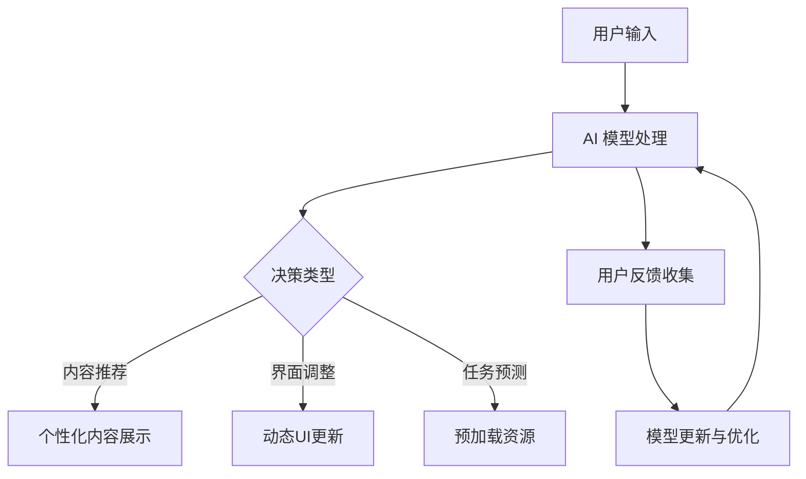
```mermaid
graph TD
    A[用户输入] --> B[AI 模型处理]
    B --> C{决策类型}
    C -->|内容推荐| D[个性化内容展示]
    C -->|界面调整| E[动态UI更新]
    C -->|任务预测| F[预加载资源]
    B --> G[用户反馈收集]
    G --> H[模型更新与优化]
    H --> B
```

最佳实践 Tips：
1. 进行大规模 A/B 测试，持续优化 AI 驱动的用户体验。
2. 建立用户反馈循环，允许用户直接对 AI 决策进行评价和调整。
3. 结合传统 UX 设计原则和 AI 技术，确保技术创新不会牺牲基本的可用性。

### 2.1.2 AI 能力的无缝集成

AI 能力的无缝集成是 AI Native 应用设计的关键原则之一。这种集成不仅仅是将 AI 功能添加到现有应用中，而是从根本上重新思考应用架构，使 AI 成为应用的核心驱动力。

1. 微服务架构中的 AI 服务
    - 将 AI 能力封装为独立的微服务
    - 通过 API 网关统一管理 AI 服务的访问
    - 使用服务网格（Service Mesh）实现 AI 服务的动态发现和负载均衡

2. 事件驱动架构与 AI
    - 利用事件总线触发 AI 模型的推理
    - 实现基于 AI 预测的主动事件生成
    - 设计 AI 驱动的事件处理流程

3. 边缘计算与 AI
    - 将轻量级 AI 模型部署到边缘设备
    - 实现本地 AI 推理，减少网络延迟
    - 设计边缘-云协同的 AI 处理架构

4. 数据流水线中的 AI 集成
    - 在 ETL 过程中嵌入 AI 模型进行数据清洗和转换
    - 实现实时特征工程的 AI 流水线
    - 设计 AI 驱动的数据质量控制机制

5. DevOps 与 MLOps 的融合
    - 将 AI 模型训练和部署纳入 CI/CD 流程
    - 实现模型版本控制和自动化测试
    - 设计 AI 模型的灰度发布和回滚机制

AI 能力无缝集成的核心算法原理可以用以下伪代码表示：

```python
class AIIntegrationPipeline:
    def __init__(self):
        self.data_source = DataSource()
        self.feature_extractor = FeatureExtractor()
        self.ai_model = AIModel()
        self.result_processor = ResultProcessor()

    def process(self, input_data):
        # 数据获取
        raw_data = self.data_source.get_data(input_data)
        
        # 特征提取
        features = self.feature_extractor.extract(raw_data)
        
        # AI 模型推理
        ai_result = self.ai_model.infer(features)
        
        # 结果处理
        final_result = self.result_processor.process(ai_result)
        
        return final_result

    def update_model(self, feedback):
        # 基于反馈更新 AI 模型
        self.ai_model.update(feedback)

# 使用示例
pipeline = AIIntegrationPipeline()
result = pipeline.process(user_input)
pipeline.update_model(user_feedback)
```

实现 AI 能力的无缝集成需要考虑以下数学模型和原理：

1. 特征工程：
   特征选择可以使用信息增益（Information Gain）或卡方检验（Chi-squared test）等方法。例如，信息增益的计算公式：

   $$IG(T,a) = H(T) - H(T|a)$$

   其中，$H(T)$ 是数据集 $T$ 的熵，$H(T|a)$ 是给定属性 $a$ 后的条件熵。

2. 模型融合：
   集成学习方法如随机森林或梯度提升树。以随机森林为例，其预测结果是多个决策树的投票结果：

   $$\hat{y} = \frac{1}{B} \sum_{b=1}^B f_b(x)$$

   其中，$B$ 是树的数量，$f_b(x)$ 是第 $b$ 个决策树的预测结果。

3. 在线学习：
   使用随机梯度下降（SGD）等算法实现模型的在线更新。SGD 的参数更新公式：

   $$\theta_{t+1} = \theta_t - \eta \nabla_\theta J(\theta; x^{(i)}, y^{(i)})$$

   其中，$\theta$ 是模型参数，$\eta$ 是学习率，$J$ 是损失函数。

4. 负载均衡：
   使用一致性哈希算法实现 AI 服务的动态负载均衡。一致性哈希函数可以表示为：

   $$h(x) = ((a \cdot x + b) \mod p) \mod m$$

   其中，$a$ 和 $b$ 是随机选择的参数，$p$ 是一个大素数，$m$ 是哈希环的大小。

AI 能力无缝集成的架构图如下：

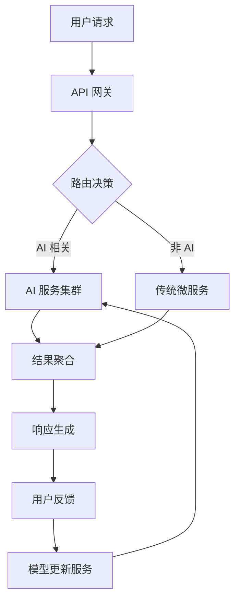
```mermaid
graph TD
    A[用户请求] --> B[API 网关]
    B --> C{路由决策}
    C -->|AI 相关| D[AI 服务集群]
    C -->|非 AI| E[传统微服务]
    D --> F[结果聚合]
    E --> F
    F --> G[响应生成]
    G --> H[用户反馈]
    H --> I[模型更新服务]
    I --> D
```

最佳实践 Tips：
1. 使用特征存储（Feature Store）集中管理和复用特征，提高 AI 能力的一致性和效率。
2. 实现模型 A/B 测试框架，支持多个 AI 模型版本的并行部署和评估。
3. 设计弹性伸缩机制，根据负载自动调整 AI 服务的资源分配。

### 2.1.3 持续学习与适应性设计

持续学习与适应性设计是 AI Native 应用的核心特征之一，它使应用能够不断从用户交互和环境变化中学习，并动态调整其行为和性能。这种设计理念确保了 AI 系统能够随时间推移而不断改进，适应不断变化的用户需求和业务环境。

1. 在线学习机制
    - 增量学习算法：使用如在线梯度下降、在线随机森林等算法，实现模型的实时更新。
    - 概念漂移检测：实时监控数据分布的变化，及时调整模型以适应新的模式。
    - 样本重要性加权：根据样本的时间戳或相关性动态调整其在学习过程中的权重。

2. 多模型ensemble系统
    - 动态模型选择：根据实时性能指标自动选择最佳模型进行预测。
    - 模型权重自适应：根据各个模型的表现动态调整它们在集成中的权重。
    - 异质模型融合：结合不同类型的模型（如深度学习、传统机器学习）以提高鲁棒性。

3. 强化学习框架
    - 多臂老虎机算法：用于解决探索-利用权衡问题，如在推荐系统中动态调整内容展示策略。
    - 策略梯度方法：用于优化长期决策序列，如在对话系统中改进交互策略。
    - 模型预测控制：结合预测模型和优化算法，实现对复杂系统的自适应控制。

4. 联邦学习
    - 分布式模型更新：在保护用户隐私的前提下，利用分散在各个设备上的数据进行模型训练。
    - 安全聚合：使用加密技术确保模型更新的安全性和隐私性。
    - 异构设备适配：设计能够适应不同计算能力和网络条件的联邦学习算法。

5. 自适应用户界面
    - 布局优化：基于用户交互数据动态调整UI元素的位置和大小。
    - 个性化主题：根据用户偏好和使用环境自动调整应用的视觉风格。
    - 功能自适应：根据用户的使用频率和习惯动态调整功能的可见性和访问路径。

持续学习与适应性设计的核心算法可以用以下伪代码表示：

```python
class AdaptiveLearningSystem:
    def __init__(self):
        self.models = [Model1(), Model2(), Model3()]  # 多模型ensemble
        self.online_learner = OnlineLearner()
        self.concept_drift_detector = ConceptDriftDetector()
        self.reinforcement_learner = ReinforcementLearner()

    def process_input(self, input_data):
        # 检测概念漂移
        if self.concept_drift_detector.detect_drift(input_data):
            self.adapt_to_drift()

        # 多模型预测
        predictions = [model.predict(input_data) for model in self.models]
        ensemble_prediction = self.ensemble(predictions)

        # 在线学习更新
        self.online_learner.update(input_data, ensemble_prediction)

        # 强化学习优化
        action = self.reinforcement_learner.select_action(input_data)
        return action, ensemble_prediction

    def ensemble(self, predictions):
        # 动态权重计算
        weights = self.calculate_model_weights()
        return sum(w * p for w, p in zip(weights, predictions))

    def adapt_to_drift(self):
        # 重新训练或调整模型
        for model in self.models:
            model.retrain()

    def calculate_model_weights(self):
        # 基于模型性能动态调整权重
        performances = [model.get_performance() for model in self.models]
        return softmax(performances)

    def update_feedback(self, feedback):
        # 根据反馈更新强化学习策略
        self.reinforcement_learner.update_policy(feedback)

# 使用示例
system = AdaptiveLearningSystem()
action, prediction = system.process_input(user_data)
system.update_feedback(user_feedback)
```

在实现持续学习与适应性设计时，需要考虑以下数学模型和原理：

1. 在线学习算法：
   以在线梯度下降为例，参数更新公式为：

   $$\theta_{t+1} = \theta_t - \eta \nabla_\theta L(\theta_t, x_t, y_t)$$

   其中，$\theta_t$ 是时间 $t$ 的模型参数，$\eta$ 是学习率，$L$是损失函数，$(x_t, y_t)$ 是时间 $t$ 的训练样本。

2. 概念漂移检测：
   使用 ADWIN (ADaptive WINdowing) 算法检测概念漂移。ADWIN 维护一个动态窗口，当窗口的两个子窗口之间的均值差异显著时，认为发生了概念漂移：

   $$|\mu_{W_0} - \mu_{W_1}| \geq \epsilon = \sqrt{\frac{1}{2m} \ln{\frac{4}{\delta}}}$$

   其中，$\mu_{W_0}$ 和 $\mu_{W_1}$ 是两个子窗口的均值，$m$ 是较小子窗口的样本数，$\delta$ 是置信度参数。

3. 多臂老虎机算法：
   使用 UCB (Upper Confidence Bound) 算法进行探索-利用权衡。选择动作的策略为：

   $$a_t = \arg\max_a \left( \hat{\mu}_a + \sqrt{\frac{2\ln t}{n_a}} \right)$$

   其中，$\hat{\mu}_a$ 是动作 $a$ 的估计收益，$t$ 是当前时间步，$n_a$ 是动作 $a$ 被选择的次数。

4. 联邦学习：
   在联邦平均算法中，全局模型参数更新公式为：

   $$w_{t+1} = \sum_{k=1}^K \frac{n_k}{n} w_{t+1}^k$$

   其中，$w_{t+1}$ 是更新后的全局模型参数，$w_{t+1}^k$ 是客户端 $k$ 的本地模型参数，$n_k$ 是客户端 $k$ 的数据量，$n$ 是总数据量。

持续学习与适应性设计的架构图如下：

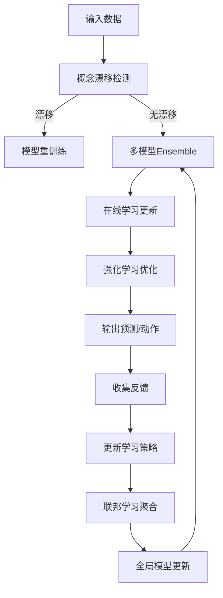
```mermaid
graph TD
    A[输入数据] --> B[概念漂移检测]
    B --> |漂移| C[模型重训练]
    B --> |无漂移| D[多模型Ensemble]
    D --> E[在线学习更新]
    E --> F[强化学习优化]
    F --> G[输出预测/动作]
    G --> H[收集反馈]
    H --> I[更新学习策略]
    I --> J[联邦学习聚合]
    J --> K[全局模型更新]
    K --> D
```

最佳实践 Tips：
1. 实现模型版本控制，以便在性能下降时快速回滚到之前的稳定版本。
2. 使用 A/B 测试框架持续评估新的学习策略和模型更新。
3. 设计可解释性机制，帮助理解模型的适应性行为和决策依据。
4. 实现自动化的模型性能监控，及时发现并处理模型退化问题。

注意事项：
- 在实现持续学习时，需要平衡模型的稳定性和适应性，避免过度适应短期波动。
- 考虑数据隐私和安全问题，特别是在实现联邦学习时。
- 注意计算资源的消耗，设计高效的增量更新算法以减少实时学习的开销。
- 对于关键业务决策，保留人工干预的机制，以应对 AI 系统可能的异常行为。

拓展阅读：
1. "Online Learning and Stochastic Approximations" by Léon Bottou
2. "Concept Drift Adaptation Techniques in Distributed Environments" by J. Gama et al.
3. "Federated Learning: Challenges, Methods, and Future Directions" by T. Li et al.

## 2.2 可扩展性与灵活性

### 2.2.1 模块化设计原则

模块化设计是 AI Native 应用架构的基石，它不仅提高了系统的可维护性和可扩展性，还为 AI 能力的无缝集成提供了理想的结构。在 AI Native 应用中，模块化设计需要特别考虑 AI 组件的特性和需求。

1. 功能分解
    - 核心 AI 功能模块：如模型训练、推理、特征工程等
    - 数据处理模块：数据收集、清洗、转换、存储
    - 业务逻辑模块：实现具体的业务规则和流程
    - 用户界面模块：负责数据展示和用户交互
    - 系统管理模块：处理日志、监控、配置管理等

2. 接口设计
    - 定义清晰的 API 契约：使用 OpenAPI (Swagger) 等标准规范化接口定义
    - 版本控制：实现 API 版本管理，确保向后兼容性
    - 错误处理：统一的错误响应格式和错误码体系

3. 依赖管理
    - 依赖注入：使用 IoC (Inversion of Control) 容器管理模块间依赖
    - 服务发现：实现动态服务注册和发现机制
    - 配置中心：集中管理各模块的配置信息，支持动态配置更新

4. AI 特定模块化考虑
    - 模型即服务（Model as a Service）：将 AI 模型封装为独立服务
    - 特征存储（Feature Store）：集中管理和服务化特征工程
    - 实验管理：支持 A/B 测试和多版本模型并行运行

5. 可插拔架构
    - 插件系统：设计允许动态加载和卸载功能模块的机制
    - 适配器模式：使用适配器隔离第三方库和核心系统
    - 事件驱动：通过事件总线实现模块间的松耦合通信

模块化设计的核心原则可以用以下伪代码表示：

```python
class AIModule(ABC):
    @abstractmethod
    def process(self, input_data):
        pass

class FeatureEngineeringModule(AIModule):
    def process(self, input_data):
        # 特征工程逻辑
        return processed_features

class ModelInferenceModule(AIModule):
    def __init__(self, model):
        self.model = model

    def process(self, features):
        # 模型推理逻辑
        return self.model.predict(features)

class PostProcessingModule(AIModule):
    def process(self, model_output):
        # 后处理逻辑
        return processed_result

class AIPipeline:
    def __init__(self):
        self.modules = []

    def add_module(self, module):
        self.modules.append(module)

    def process(self, input_data):
        result = input_data
        for module in self.modules:
            result = module.process(result)
        return result

# 使用示例
pipeline = AIPipeline()
pipeline.add_module(FeatureEngineeringModule())
pipeline.add_module(ModelInferenceModule(trained_model))
pipeline.add_module(PostProcessingModule())

final_result = pipeline.process(raw_input)
```

在实现模块化设计时，需要考虑以下数学模型和原理：

1. 模块耦合度评估：
   使用耦合度矩阵计算模块间的耦合程度。假设有 $n$ 个模块，耦合度矩阵 $C$ 的元素 $c_{ij}$ 表示模块 $i$ 和模块 $j$ 之间的耦合度：

   $$C = \begin{bmatrix}
   c_{11} & c_{12} & \cdots & c_{1n} \\
   c_{21} & c_{22} & \cdots & c_{2n} \\
   \vdots & \vdots & \ddots & \vdots \\
   c_{n1} & c_{n2} & \cdots & c_{nn}
   \end{bmatrix}$$

   系统的总体耦合度可以通过矩阵的范数来衡量，如 Frobenius 范数：

   $$\text{总耦合度} = \|C\|_F = \sqrt{\sum_{i=1}^n \sum_{j=1}^n |c_{ij}|^2}$$

2. 模块内聚度计算：
   使用 LCOM (Lack of Cohesion of Methods) 指标评估模块的内聚度。对于一个有 $m$ 个方法和 $a$ 个属性的模块，LCOM 可以计算如下：

   $$LCOM = \frac{1}{a} \sum_{i=1}^a (1 - \frac{\mu(A_i)}{m})$$

   其中，$\mu(A_i)$ 是使用属性 $A_i$ 的方法数。LCOM 值越低，表示内聚度越高。

3. 接口复杂度评估：
   使用 CK 度量套件中的 WMC (Weighted Methods per Class) 指标评估接口复杂度：

   $$WMC = \sum_{i=1}^n c_i$$

   其中，$n$ 是接口中的方法数，$c_i$ 是第 $i$ 个方法的复杂度（可以用圈复杂度表示）。

模块化设计的架构图如下：

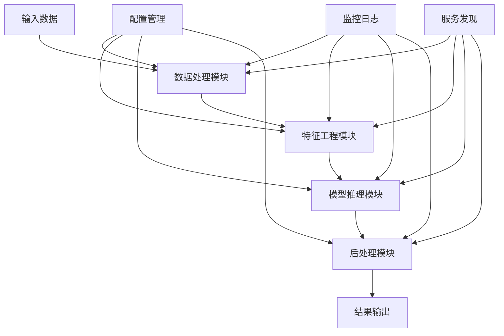
```mermaid
graph TD
    A[输入数据] --> B[数据处理模块]
    B --> C[特征工程模块]
    C --> D[模型推理模块]
    D --> E[后处理模块]
    E --> F[结果输出]
    G[配置管理] --> B
    G --> C
    G --> D
    G --> E
    H[监控日志] --> B
    H --> C
    H --> D
    H --> E
    I[服务发现] --> B
    I --> C
    I --> D
    I --> E
```

最佳实践 Tips：
1. 使用依赖倒置原则 (DIP) 设计模块间的接口，减少高层模块对低层模块的依赖。
2. 实现模块级别的健康检查和自我诊断机制，提高系统的可维护性。
3. 设计模块间的异步通信机制，提高系统的并发处理能力和响应性。
4. 为每个模块实现详细的监控指标，便于性能分析和问题诊断。

注意事项：
- 避免过度模块化，这可能导致系统复杂度增加和性能下降。
- 在设计模块接口时，需要平衡通用性和特定性，以适应未来的需求变化。
- 考虑模块的版本兼容性，特别是在分布式系统中，不同版本的模块可能同时运行。
- 注意模块间的数据一致性，特别是在分布式事务场景中。

拓展阅读：
1. "Clean Architecture: A Craftsman's Guide to Software Structure and Design" by Robert C. Martin
2. "Designing Data-Intensive Applications" by Martin Kleppmann
3. "Building Microservices: Designing Fine-Grained Systems" by Sam Newman

### 2.2.2 微服务架构在 AI Native 中的应用

微服务架构在 AI Native 应用中扮演着关键角色，它不仅提供了系统的可扩展性和灵活性，还为 AI 能力的分布式部署和管理提供了理想的框架。在 AI Native 环境中，微服务架构需要特别考虑 AI 模型的特性和数据流的复杂性。

1. AI 服务化
    - 模型即服务 (Model as a Service)：将 AI 模型封装为独立的微服务
    - 特征服务 (Feature Service)：提供实时特征计算和管理的微服务
    - 推理服务 (Inference Service)：专门用于模型推理的高性能微服务

2. 数据流管理
    - 数据接入服务：处理多源数据的采集和预处理
    - 数据转换服务：实现数据格式转换和标准化
    - 数据存储服务：管理不同类型的数据存储（如时序数据库、文档数据库）

3. 业务逻辑服务
    - 决策服务：集成 AI 推理结果和业务规则
    - 工作流服务：管理复杂的 AI 驱动业务流程
    - 用户画像服务：维护和更新用户特征和偏好

4. 基础设施服务
    - 服务发现：动态管理服务实例和路由
    - 配置管理：集中管理各服务的配置信息
    - 日志聚合：收集和分析分布式系统的日志
    - 监控告警：实时监控系统性能和健康状态

5. API 网关
    - 请求路由：将请求分发到相应的微服务
    - 认证授权：统一管理访问控制
    - 限流熔断：保护后端服务免受过载
    - 协议转换：支持多种客户端协议

6. 消息队列
    - 事件驱动：实现服务间的异步通信
    - 流处理：支持实时数据流的处理和分析
    - 解耦：减少服务间的直接依赖

微服务架构在 AI Native 应用中的实现可以用以下伪代码表示：

```python
class AIService:
    def __init__(self, model):
        self.model = model

    def predict(self, features):
        return self.model.predict(features)

class FeatureService:
    def get_features(self, user_id):
        # 从特征存储获取特征
        return features

class InferenceService:
    def __init__(self, ai_service, feature_service):
        self.ai_service = ai_service
        self.feature_service = feature_service

    def process(self, user_id):
        features = self.feature_service.get_features(user_id)
        prediction = self.ai_service.predict(features)
        return prediction

class APIGateway:
    def __init__(self):
        self.services = {}

    def register_service(self, name, service):
        self.services[name] = service

    def route_request(self, service_name, *args, **kwargs):
        if service_name in self.services:
            return self.services[service_name].process(*args, **kwargs)
        else:
            raise ServiceNotFoundError(f"Service {service_name} not found")

# 使用示例
ai_model = load_model("trained_model.pkl")
ai_service = AIService(ai_model)
feature_service = FeatureService()
inference_service = InferenceService(ai_service, feature_service)

gateway = APIGateway()
gateway.register_service("inference", inference_service)

result = gateway.route_request("inference", user_id=123)
```

在实现微服务架构时，需要考虑以下数学模型和原理：

1. 服务发现和负载均衡：
   使用一致性哈希算法进行服务实例的选择。给定 $n$ 个服务实例和 $m$ 个虚拟节点，哈希函数为：

   $$h(x) = ((ax + b) \mod p) \mod m$$

   其中 $a$ 和 $b$ 是随机选择的参数，$p$ 是一个大素数。

2. 熔断器模式：
   使用滑动窗口算法统计失败率。在窗口大小为 $N$ 的情况下，失败率计算公式为：

   $$\text{失败率} = \frac{\text{失败请求数}}{\text{总请求数}} = \frac{\sum_{i=1}^N I(\text{请求}_i \text{失败})}{N}$$

   其中 $I$ 是指示函数，当请求失败时为 1，否则为 0。

3. 反压机制：
   使用 Little's Law 计算系统的最大吞吐量。假设系统的平均响应时间为 $R$，并发请求数为 $N$，则：

   $$\text{最大吞吐量} = \frac{N}{R}$$

4. 服务依赖分析：
   使用图论中的强连通分量算法（如 Kosaraju 算法）分析服务间的循环依赖。

微服务架构在 AI Native 应用中的部署图如下：

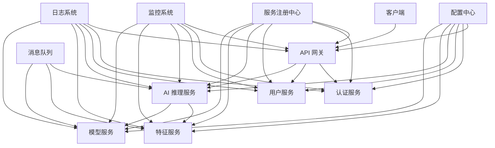
```mermaid
graph TD
    A[客户端] --> B[API 网关]
    B --> C[认证服务]
    B --> D[用户服务]
    B --> E[AI 推理服务]
    E --> F[特征服务]
    E --> G[模型服务]
    H[配置中心] --> B
    H --> C
    H --> D
    H --> E
    H --> F
    H --> G
    I[服务注册中心] --> B
    I --> C
    I --> D
    I --> E
    I --> F
    I --> G
    J[监控系统] --> B
    J --> C
    J --> D
    J --> E
    J --> F
    J --> G
    K[日志系统] --> B
    K --> C
    K --> D
    K --> E
    K --> F
    K --> G
    L[消息队列] --> E
    L --> F
    L --> G
```

最佳实践 Tips：
1. 实现智能路由：基于 AI 模型的实时性能和负载情况动态调整请求路由。
2. 自适应批处理：根据请求量自动调整批处理大小，平衡延迟和吞吐量。
3. 模型版本控制：实现模型的蓝绿部署和金丝雀发布，降低模型更新风险。
4. 分布式追踪：使用如 Jaeger 或 Zipkin 等工具实现请求的全链路追踪。

注意事项：
- 考虑数据一致性：在分布式系统中实现最终一致性或使用分布式事务。
- 注意服务粒度：避免服务过细导致的网络开销增加和管理复杂性提高。
- 处理跨服务调用的延迟：使用缓存、预计算等策略降低跨服务调用的影响。
- 安全性考虑：实现服务间的身份认证和加密通信，防止未授权访问。

拓展阅读：
1. "Microservices Patterns" by Chris Richardson
2. "Designing Distributed Systems" by Brendan Burns
3. "Building Machine Learning Powered Applications" by Emmanuel Ameisen

### 2.2.3 动态资源分配策略

在 AI Native 应用中，动态资源分配策略是确保系统高效运行和成本优化的关键。由于 AI 工作负载的特性（如模型训练、批量推理等）往往具有高度的波动性和资源密集性，因此需要一个智能且灵活的资源管理系统。

1. 负载预测
    - 时间序列分析：使用 ARIMA、Prophet 等模型预测未来负载
    - 机器学习模型：利用历史数据训练预测模型，考虑多种因素（如时间、用户活动、外部事件等）
    - 异常检测：识别并处理突发流量或异常模式

2. 资源弹性伸缩
    - 水平扩展：根据负载自动增减服务实例数量
    - 垂直扩展：动态调整单个实例的资源配置（CPU、内存、GPU等）
    - 混合扩展：结合水平和垂直扩展，优化资源利用率

3. 智能调度
    - 任务优先级：基于业务重要性和紧急程度分配资源
    - 亲和性调度：考虑数据局部性和硬件亲和性进行任务分配
    - 资源感知调度：根据不同任务的资源需求特征进行最优匹配

4. 成本优化
    - Spot 实例利用：使用低成本的临时实例处理非关键任务
    - 自动关机策略：识别空闲资源并自动释放
    - 资源池化：跨应用共享资源池，提高整体利用率

5. 服务质量保证（QoS）
    - 多级服务等级：为不同优先级的任务设置资源保证
    - 动态资源限制：根据系统负载动态调整资源上限
    - 自适应降级：在资源紧张时自动降低非核心服务的质量

动态资源分配策略的核心算法可以用以下伪代码表示：

```python
class ResourceAllocator:
    def __init__(self, prediction_model, resource_pool):
        self.prediction_model = prediction_model
        self.resource_pool = resource_pool

    def allocate_resources(self, current_load, time):
        predicted_load = self.prediction_model.predict(time)
        required_resources = self.calculate_required_resources(predicted_load)
        allocation_plan = self.optimize_allocation(required_resources)
        self.execute_allocation(allocation_plan)

    def calculate_required_resources(self, load):
        # 根据负载计算所需资源
        cpu = load * CPU_FACTOR
        memory = load * MEMORY_FACTOR
        gpu = load * GPU_FACTOR
        return ResourceRequirement(cpu, memory, gpu)

    def optimize_allocation(self, required_resources):
        # 使用优化算法计算最佳资源分配方案
        return self.solve_optimization_problem(required_resources, self.resource_pool)

    def execute_allocation(self, allocation_plan):
        for service, resources in allocation_plan.items():
            self.scale_service(service, resources)

    def scale_service(self, service, resources):
        # 执行实际的扩缩容操作
        service.scale(resources.cpu, resources.memory, resources.gpu)

# 使用示例
allocator = ResourceAllocator(load_prediction_model, cloud_resource_pool)
allocator.allocate_resources(current_system_load, current_time)
```

在实现动态资源分配策略时，需要考虑以下数学模型和原理：

1. 负载预测模型：
   使用时间序列模型如 ARIMA(p,d,q)，其中 p 是自回归项数，d 是差分次数，q 是移动平均项数。模型可表示为：

   $$\phi(B)(1-B)^d X_t = \theta(B)\varepsilon_t$$

   其中 $B$ 是滞后算子，$\phi(B)$ 和 $\theta(B)$ 分别是自回归和移动平均多项式。

2. 资源分配优化：
   使用线性规划模型优化资源分配。目标函数可以是最小化成本或最大化性能：

   $$\min \sum_{i=1}^n \sum_{j=1}^m c_{ij}x_{ij}$$

   约束条件：
   $$\sum_{j=1}^m x_{ij} \geq r_i, \forall i$$
   $$\sum_{i=1}^n x_{ij} \leq a_j, \forall j$$
   $$x_{ij} \geq 0, \forall i,j$$

   其中 $c_{ij}$ 是将资源 j 分配给任务 i 的成本，$r_i$ 是任务 i 的资源需求，$a_j$ 是资源 j 的可用量。

3. 排队论模型：
   使用 M/M/c 队列模型分析系统性能。平均等待时间 W 可以通过 Erlang C 公式计算：

   $$W = \frac{C(m,\rho)}{m\mu(1-\rho)}$$

   其中 $m$ 是服务器数量，$\rho$ 是系统利用率，$\mu$ 是服务率，$C(m,\rho)$ 是 Erlang C 函数。

4. 反馈控制理论：
   使用 PID (Proportional-Integral-Derivative) 控制器进行资源动态调整：

   $$u(t) = K_p e(t) + K_i \int_0^t e(\tau)d\tau + K_d \frac{de(t)}{dt}$$

   其中 $u(t)$ 是控制信号，$e(t)$ 是误差信号，$K_p$、$K_i$ 和 $K_d$ 分别是比例、积分和微分增益。

动态资源分配策略的系统架构图如下：

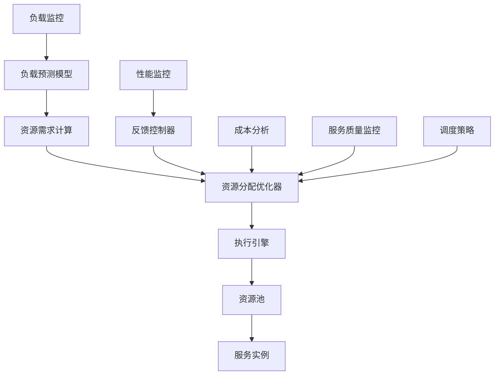
```mermaid
graph TD
    A[负载监控] --> B[负载预测模型]
    B --> C[资源需求计算]
    C --> D[资源分配优化器]
    D --> E[执行引擎]
    E --> F[资源池]
    F --> G[服务实例]
    H[性能监控] --> I[反馈控制器]
    I --> D
    J[成本分析] --> D
    K[服务质量监控] --> D
    L[调度策略] --> D
```

最佳实践 Tips：
1. 实现多层次资源分配：从集群级到容器级，实现细粒度的资源控制。
2. 使用资源预留和超卖：为关键服务预留资源，同时允许非关键服务使用超卖资源。
3. 实现资源分配的平滑过渡：避免资源的急剧变化，减少对服务性能的影响。
4. 建立资源分配的闭环反馈：持续监控分配效果，并根据实际情况动态调整策略。

注意事项：
- 考虑资源分配的延迟：从决策到执行可能存在时间差，需要在预测中考虑这一因素。
- 处理资源碎片化：避免因小粒度资源分配导致的资源浪费。
- 注意服务依赖关系：在扩缩容时考虑服务间的依赖，确保系统的整体稳定性。
- 设置合理的扩缩容阈值：避免频繁的资源调整，同时保证系统的响应性。

拓展阅读：
1. "Kubernetes in Action" by Marko Luksa
2. "Cloud Native DevOps with Kubernetes" by John Arundel & Justin Domingus
3. "Designing Distributed Systems" by Brendan Burns

## 2.3 数据驱动的架构设计

### 2.3.1 数据流设计与优化

在 AI Native 应用中，数据流的设计和优化是确保系统高效运行的关键因素。优秀的数据流设计不仅能提高系统的吞吐量和响应速度，还能降低资源消耗，提升 AI 模型的训练和推理效率。

1. 数据摄入
    - 多源数据接入：支持多种数据源和格式的统一接入
    - 实时流处理：使用流处理框架如 Apache Kafka 或 Apache Flink 处理实时数据
    - 批量数据处理：使用分布式计算框架如 Apache Spark 处理大规模批量数据

2. 数据预处理
    - 数据清洗：去除噪声、处理缺失值、异常检测
    - 数据转换：标准化、归一化、编码转换
    - 特征工程：特征提取、特征选择、降维

3. 数据存储
    - 分层存储：冷热数据分离，使用不同存储介质
    - 数据分片：根据访问模式进行数据分片，提高并行处理能力
    - 缓存策略：多级缓存设计，减少数据访问延迟

4. 数据处理管道
    - 并行处理：设计并行化的数据处理流程
    - 管道优化：减少数据移动，就近处理原则
    - 反压机制：实现自适应的流量控制，避免系统过载

5. 数据分发
    - 发布订阅模式：实现数据的异步分发和解耦
    - 负载均衡：根据消费者能力动态分配数据
    - 数据复制：实现数据的多副本策略，提高可用性和读取性能

6. 数据质量控制
    - 数据验证：实时检查数据的完整性和一致性
    - 数据血缘：追踪数据的来源和转换过程
    - 数据版本控制：管理数据的不同版本，支持回滚和审计

数据流设计与优化的核心算法可以用以下伪代码表示：

```python
class DataPipeline:
    def __init__(self):
        self.data_sources = []
        self.preprocessors = []
        self.storage_manager = StorageManager()
        self.processors = []
        self.distributors = []

    def add_data_source(self, source):
        self.data_sources.append(source)

    def add_preprocessor(self, preprocessor):
        self.preprocessors.append(preprocessor)

    def add_processor(self, processor):
        self.processors.append(processor)

    def add_distributor(self, distributor):
        self.distributors.append(distributor)

    def process_data(self):
        for source in self.data_sources:
            data = source.fetch_data()
            for preprocessor in self.preprocessors:
                data = preprocessor.preprocess(data)
            self.storage_manager.store(data)
            for processor in self.processors:
                results = processor.process(data)
                for distributor in self.distributors:
                    distributor.distribute(results)

class StreamProcessor(DataPipeline):
    def __init__(self):
        super().__init__()
        self.stream_buffer = Queue()

    def process_stream(self):
        while True:
            data = self.stream_buffer.get()
            self.process_data(data)

    def handle_backpressure(self):
        if self.stream_buffer.qsize() > THRESHOLD:
            self.slow_down_data_ingestion()

# 使用示例
pipeline = StreamProcessor()
pipeline.add_data_source(KafkaSource())
pipeline.add_preprocessor(DataCleaner())
pipeline.add_preprocessor(FeatureExtractor())
pipeline.add_processor(MLPredictor())
pipeline.add_distributor(ResultPublisher())

pipeline.process_stream()
```

在实现数据流设计与优化时，需要考虑以下数学模型和原理：

1. 数据流量控制：
   使用令牌桶算法控制数据流入速率。令牌生成速率 r，桶容量 b，则在时间 t 内可以发送的最大数据量 V(t) 为：

   $$V(t) = \min(rt, b + rt)$$

2. 数据分片策略：
   使用一致性哈希算法进行数据分片。给定哈希函数 h 和 n 个节点，数据项 x 被分配到的节点索引为：

   $$\text{node}(x) = h(x) \mod n$$

3. 缓存命中率优化：
   使用 LRU (Least Recently Used) 算法管理缓存。给定缓存大小 k 和访问序列 {x₁, x₂, ..., xₘ}，缓存命中率 H 为：

   $$H = \frac{\text{缓存命中次数}}{m}$$

4. 并行处理效率：
   使用 Amdahl's Law 评估并行化效果。给定串行部分比例 s 和处理器数量 n，加速比 S(n) 为：

   $$S(n) = \frac{1}{s + \frac{1-s}{n}}$$

数据流设计与优化的系统架构图如下：

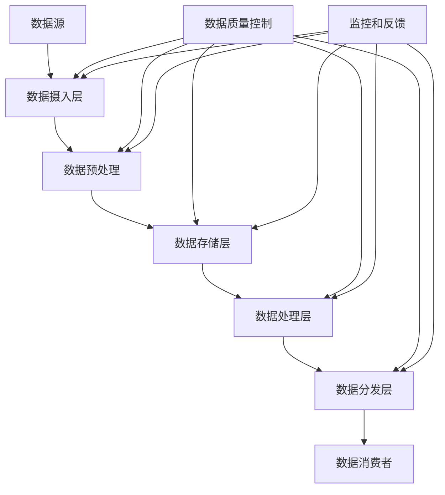
```mermaid
graph TD
    A[数据源] --> B[数据摄入层]
    B --> C[数据预处理]
    C --> D[数据存储层]
    D --> E[数据处理层]
    E --> F[数据分发层]
    F --> G[数据消费者]
    H[数据质量控制] --> B
    H --> C
    H --> D
    H --> E
    H --> F
    I[监控和反馈] --> B
    I --> C
    I --> D
    I --> E
    I --> F
```

最佳实践 Tips：
1. 实现数据流的自适应调节：根据系统负载动态调整数据处理速率。
2. 使用数据压缩：在数据传输和存储环节使用适当的压缩算法，减少网络和存储开销。
3. 实现增量处理：对于大规模数据，设计增量处理机制，避免全量重处理。
4. 优化数据序列化：选择高效的序列化格式（如 Protocol Buffers 或 Apache Avro），减少序列化开销。

注意事项：
- 考虑数据倾斜问题：在数据分片和并行处理中，注意处理数据分布不均的情况。
- 处理数据延迟：在实时处理系统中，需要权衡数据新鲜度和处理延迟。
- 确保数据一致性：在分布式环境中，需要特别注意数据的一致性和顺序性。
- 实现容错机制：设计适当的重试和容错策略，处理数据处理过程中的各种异常情况。

拓展阅读：
1. "Designing Data-Intensive Applications" by Martin Kleppmann
2. "Streaming Systems" by Tyler Akidau, Slava Chernyak, and Reuven Lax
3. "Fundamentals of Data Engineering" by Joe Reis and Matt Housley

### 2.3.2 实时数据处理架构

实时数据处理是 AI Native 应用中的关键组件，它能够及时处理和分析持续产生的大量数据，为 AI 模型提供最新的输入，并支持快速决策和响应。设计高效的实时数据处理架构需要考虑数据的及时性、可靠性和可扩展性。

1. 数据摄入
    - 消息队列：使用如 Apache Kafka 或 RabbitMQ 的消息中间件
    - 流式接入：支持 TCP、WebSocket 等协议的实时数据流
    - 变更数据捕获（CDC）：实时捕获数据库变更

2. 流处理引擎
    - 分布式流处理：如 Apache Flink、Apache Spark Streaming
    - 事件时间处理：处理乱序事件和延迟数据
    - 状态管理：维护和管理流处理中的状态信息

3. 实时计算
    - 窗口计算：滑动窗口、翻转窗口、会话窗口等
    - 流表联结：实现流数据和静态数据的实时关联
    - 复杂事件处理（CEP）：检测复杂的事件模式

4. 数据输出
    - 实时存储：写入支持高并发的数据库如 Cassandra 或 HBase
    - 实时可视化：推送到实时仪表板
    - 触发器：基于处理结果触发下游动作

5. 容错和一致性
    - 至少一次处理：确保数据不丢失
    - 恰好一次语义：避免重复处理
    - 检查点机制：定期保存处理状态，支持故障恢复

6. 性能优化
    - 并行处理：利用数据并行和任务并行
    - 反压处理：实现自适应的流量控制
    - 本地状态优化：利用本地状态加速计算

实时数据处理架构的核心算法可以用以下伪代码表示：

```python
class StreamProcessor:
    def __init__(self):
        self.sources = []
        self.operators = []
        self.sinks = []
        self.state_backend = StateBackend()

    def add_source(self, source):
        self.sources.append(source)

    def add_operator(self, operator):
        self.operators.append(operator)

    def add_sink(self, sink):
        self.sinks.append(sink)

    def process(self):
        while True:
            for source in self.sources:
                event = source.get_next_event()
                if event:
                    for operator in self.operators:
                        event = operator.process(event, self.state_backend)
                    for sink in self.sinks:
                        sink.emit(event)
            self.state_backend.checkpoint()

class WindowOperator:
    def __init__(self, window_size, slide_size):
        self.window_size = window_size
        self.slide_size = slide_size
        self.buffer = []

    def process(self, event, state):
        self.buffer.append(event)
        if len(self.buffer) >= self.window_size:
            result = self.aggregate(self.buffer)
            self.buffer = self.buffer[self.slide_size:]
            return result
        return None

    def aggregate(self, window):
        # 实现具体的窗口聚合逻辑
        pass

# 使用示例
processor = StreamProcessor()
processor.add_source(KafkaSource("input-topic"))
processor.add_operator(WindowOperator(window_size=100, slide_size=50))
processor.add_operator(FilterOperator(lambda x: x > threshold))
processor.add_sink(DatabaseSink("output-table"))

processor.process()
```

在实现实时数据处理架构时，需要考虑以下数学模型和原理：

1. 窗口计算：
   对于滑动窗口，给定窗口大小 w 和滑动步长 s，在时间 t 的窗口范围为：

   $$[max(0, \lfloor \frac{t}{s} \rfloor \cdot s - w + s), \lfloor \frac{t}{s} \rfloor \cdot s + s)$$

2. 流量控制：
   使用漏桶算法控制数据处理速率。给定桶容量 b 和流出速率 r，在时间 t 内可以处理的最大事件数 N(t) 为：

   $$N(t) = \min(rt, b)$$

3. 一致性哈希：
   用于数据分区。给定哈希函数 h 和 n 个节点，事件 e 被分配到的节点为：

   $$node(e) = \arg\min_{i \in [1,n]} (h(e) - h(i)) \mod 2^{32}$$

4. 延迟测量：
   使用指数移动平均（EMA）计算平均处理延迟。给定平滑因子 α，新的延迟样本 x，更新后的平均延迟 L 为：

   $$L_{new} = \alpha \cdot x + (1 - \alpha) \cdot L_{old}$$

实时数据处理架构的系统设计图如下：

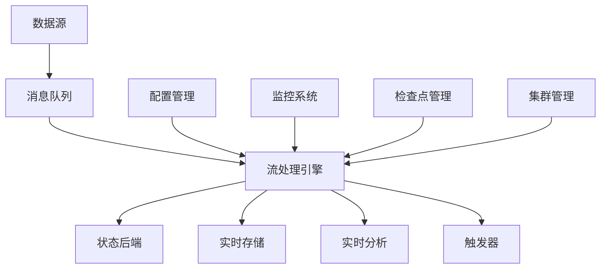
```mermaid
graph TD
    A[数据源] --> B[消息队列]
    B --> C[流处理引擎]
    C --> D[状态后端]
    C --> E[实时存储]
    C --> F[实时分析]
    C --> G[触发器]
    H[配置管理] --> C
    I[监控系统] --> C
    J[检查点管理] --> C
    K[集群管理] --> C
```

最佳实践 Tips：
1. 实现动态负载均衡：根据处理节点的负载情况动态调整数据分配。
2. 使用预聚合：在数据源头进行初步聚合，减少网络传输和处理压力。
3. 实现热点数据缓存：对频繁访问的状态数据进行缓存，提高处理效率。
4. 采用分层存储策略：将热数据存储在内存或SSD，冷数据存储在硬盘，优化存储成本和访问性能。

注意事项：
- 处理数据倾斜：设计合适的分区策略，避免数据热点导致的处理不均衡。
- 考虑事件时间和处理时间的差异：实现水印机制处理延迟和乱序数据。
- 确保端到端的一致性：在整个处理流程中维护数据的一致性，包括源系统、处理系统和目标系统。
- 实现优雅的降级机制：在系统过载时，能够自动降低处理精度或延迟，保证核心功能的可用性。

拓展阅读：
1. "Streaming Systems: The What, Where, When, and How of Large-Scale Data Processing" by Tyler Akidau, Slava Chernyak, and Reuven Lax
2. "Designing Event-Driven Systems" by Ben Stopford
3. "Kafka: The Definitive Guide" by Neha Narkhede, Gwen Shapira, and Todd Palino

### 2.3.3 数据隐私与安全考虑

在 AI Native 应用中，数据隐私和安全是至关重要的考虑因素。随着数据量的增加和 AI 模型的复杂化，保护用户隐私和确保数据安全变得越来越具有挑战性。设计一个强大的数据隐私和安全架构需要从多个层面进行考虑。

1. 数据收集和同意
    - 明确的用户同意：实现细粒度的数据收集同意机制
    - 数据最小化：只收集必要的数据
    - 匿名化和假名化：在数据收集阶段就进行身份信息的脱敏

2. 数据存储安全
    - 加密存储：使用强加密算法保护静态数据
    - 访问控制：实现基于角色的细粒度访问控制
    - 数据分类：根据敏感度对数据进行分类和隔离存储

3. 数据传输安全
    - 端到端加密：确保数据在传输过程中的安全
    - 安全协议：使用 TLS/SSL 等安全协议
    - 数据完整性校验：使用数字签名或哈希校验确保数据未被篡改

4. 数据处理安全
    - 安全多方计算：在保护数据隐私的同时进行协作计算
    - 同态加密：允许在加密数据上进行计算，无需解密
    - 差分隐私：在数据分析结果中添加噪声，保护个体隐私

5. 模型安全
    - 模型加密：保护模型参数和结构
    - 对抗性攻击防御：增强模型对恶意输入的鲁棒性
    - 模型隐私：防止模型逆向工程和成员推断攻击

6. 审计和合规
    - 数据访问日志：记录所有数据访问和操作
    - 合规性检查：定期进行隐私和安全合规性审计
    - 数据生命周期管理：实现数据的安全销毁和保留策略

7. 隐私增强技术
    - 联邦学习：在不共享原始数据的情况下进行分布式模型训练
    - 零知识证明：证明拥有某些信息而不泄露信息本身
    - 安全飞地计算：在受信任的硬件环境中处理敏感数据

数据隐私与安全架构的核心实现可以用以下伪代码表示：

```python
class PrivacySecurityManager:
    def __init__(self):
        self.encryption_service = EncryptionService()
        self.access_control = AccessControlService()
        self.audit_logger = AuditLogger()
        self.differential_privacy = DifferentialPrivacy()

    def collect_data(self, user_data, user_consent):
        if not self.verify_consent(user_consent):
            raise PermissionError("User consent not provided")
        anonymized_data = self.anonymize(user_data)
        encrypted_data = self.encryption_service.encrypt(anonymized_data)
        self.store_data(encrypted_data)
        self.audit_logger.log_data_collection(user_data.id)

    def process_data(self, data_id, requester):
        if not self.access_control.check_permission(requester, data_id):
            raise PermissionError("Access denied")
        encrypted_data = self.retrieve_data(data_id)
        decrypted_data = self.encryption_service.decrypt(encrypted_data)
        processed_result = self.secure_compute(decrypted_data)
        private_result = self.differential_privacy.add_noise(processed_result)
        self.audit_logger.log_data_access(requester, data_id)
        return private_result

    def anonymize(self, data):
        # 实现数据匿名化逻辑
        pass

    def secure_compute(self, data):
        # 实现安全计算逻辑，如同态加密计算
        pass

    def verify_consent(self, consent):
        # 验证用户同意的有效性
        pass

# 使用示例
privacy_manager = PrivacySecurityManager()
user_data = UserData(id="user123", content="sensitive information")
user_consent = UserConsent(user_id="user123", purpose="analysis")

try:
    privacy_manager.collect_data(user_data, user_consent)
    result = privacy_manager.process_data("user123", requester="analyst001")
    print("Processed result:", result)
except PermissionError as e:
    print("Security violation:", str(e))
```

在实现数据隐私与安全考虑时，需要考虑以下数学模型和原理：

1. 差分隐私：
   给定数据集 D 和 D'（它们只相差一个元素），查询函数 f，和隐私预算 ε，满足：

   $$P[f(D) \in S] \leq e^ε \cdot P[f(D') \in S]$$

   其中 S 是输出空间的任意子集。

2. 同态加密：
   对于明文 m1 和 m2，加密函数 E，和某种运算 ⊕，满足：

   $$E(m1) \otimes E(m2) = E(m1 \oplus m2)$$

3. k-匿名性：
   对于数据集中的每条记录，至少有 k-1 条其他记录在准识别属性上与之相同。

4. 信息熵：
   用于衡量数据的不确定性，给定概率分布 P(X)，信息熵 H(X) 定义为：

   $$H(X) = -\sum_{i} P(x_i) \log_2 P(x_i)$$

数据隐私与安全架构的系统设计图如下：

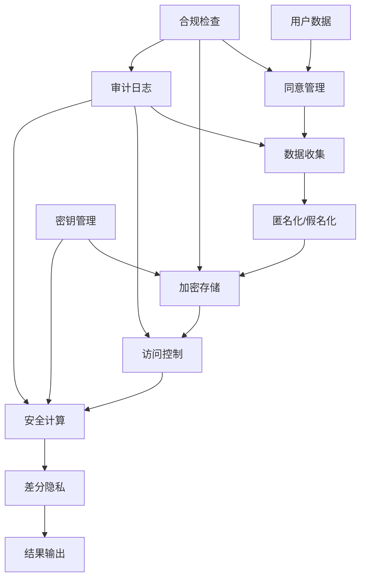
```mermaid
graph TD
    A[用户数据] --> B[同意管理]
    B --> C[数据收集]
    C --> D[匿名化/假名化]
    D --> E[加密存储]
    E --> F[访问控制]
    F --> G[安全计算]
    G --> H[差分隐私]
    H --> I[结果输出]
    J[审计日志] --> C
    J --> F
    J --> G
    K[密钥管理] --> E
    K --> G
    L[合规检查] --> B
    L --> E
    L --> J
```

最佳实践 Tips：
1. 实现数据分类自动化：使用机器学习模型自动识别和分类敏感数据。
2. 采用隐私预算管理：实现动态隐私预算分配，平衡数据使用和隐私保护。
3. 使用安全多方计算：在多个参与方之间进行协作计算，无需共享原始数据。
4. 实施持续的安全监控：使用 AI 技术实时检测异常访问模式和潜在的安全威胁。

注意事项：
- 平衡隐私保护和功能性：过度的隐私保护可能影响系统的可用性和性能。
- 考虑跨境数据传输的法律合规性：不同地区可能有不同的数据保护法规。
- 防范侧信道攻击：注意保护系统的物理安全，防止通过功耗、电磁辐射等侧信道泄露信息。
- 定期更新安全措施：随着新的攻击方式出现，及时更新和升级安全策略。

拓展阅读：
1. "Privacy-Preserving Machine Learning: Methods, Challenges and Directions" by Qiang Yang et al.
2. "The Algorithmic Foundations of Differential Privacy" by Cynthia Dwork and Aaron Roth
3. "Secure Multiparty Computation and Secret Sharing" by Ronald Cramer, Ivan Damgård, and Jesper Buus Nielsen

## 2.4 高性能与低延迟

### 2.4.1 分布式计算架构

在 AI Native 应用中，分布式计算架构是实现高性能和低延迟的关键。它允许系统利用多台机器的计算资源，处理大规模数据和复杂的 AI 模型。设计一个高效的分布式计算架构需要考虑计算任务的特性、数据分布、网络通信等多个方面。

1. 任务分解与调度
    - 任务粒度：根据计算复杂度和数据依赖关系确定合适的任务粒度
    - 负载均衡：动态分配任务以平衡各节点的计算负载
    - 数据局部性：将计算任务调度到数据所在节点，减少数据传输

2. 数据分布
    - 数据分片：根据计算需求设计合适的数据分片策略
    - 数据复制：实现数据的多副本存储，提高可用性和读取性能
    - 数据一致性：在分布式环境中维护数据的一致性，如使用分布式事务或最终一致性模型

3. 通信模型
    - 点对点通信：节点间直接通信，适用于局部数据交换
    - 广播/多播：高效地将信息传播到多个节点
    - 聚合通信：如 MapReduce 模型，用于大规模数据处理

4. 容错与恢复
    - 检查点机制：定期保存计算状态，支持故障恢复
    - 任务重试：自动重试失败的任务
    - 热备份：维护关键节点的实时备份，实现快速故障转移

5. 资源管理
    - 动态资源分配：根据任务需求和系统负载动态调整资源分配
    - 资源隔离：确保不同任务之间的资源隔离，避免相互干扰
    - 资源预留：为关键任务预留必要的计算资源

6. 性能优化
    - 计算和存储分离：允许计算和存储资源独立扩展
    - 数据预取：预测性地加载数据，减少 I/O 等待时间
    - 结果缓存：缓存中间结果和频繁访问的数据，减少重复计算

分布式计算架构的核心实现可以用以下伪代码表示：

```python
class DistributedComputeManager:
    def __init__(self):
        self.task_queue = TaskQueue()
        self.resource_manager = ResourceManager()
        self.data_manager = DataManager()
        self.nodes = []

    def submit_task(self, task):
        self.task_queue.enqueue(task)
        self.schedule_tasks()

    def schedule_tasks(self):
        while not self.task_queue.is_empty():
            task = self.task_queue.dequeue()
            node = self.resource_manager.get_best_node(task)
            node.execute(task)

    def add_node(self, node):
        self.nodes.append(node)
        self.resource_manager.register_node(node)

    def remove_node(self, node):
        self.nodes.remove(node)
        self.resource_manager.unregister_node(node)
        self.reschedule_tasks(node.get_running_tasks())

    def reschedule_tasks(self, tasks):
        for task in tasks:
            self.task_queue.enqueue(task)
        self.schedule_tasks()

class ComputeNode:
    def __init__(self, node_id, resources):
        self.node_id = node_id
        self.resources = resources
        self.running_tasks = []

    def execute(self, task):
        if self.has_sufficient_resources(task):
            self.allocate_resources(task)
            self.running_tasks.append(task)
            result = task.run()
            self.release_resources(task)
            self.running_tasks.remove(task)
            return result
        else:
            raise InsufficientResourcesError()

    def has_sufficient_resources(self, task):
        return all(self.resources[r] >= task.required_resources[r] for r in task.required_resources)

    def allocate_resources(self, task):
        for r in task.required_resources:
            self.resources[r] -= task.required_resources[r]

    def release_resources(self, task):
        for r in task.required_resources:
            self.resources[r] += task.required_resources[r]

# 使用示例
manager = DistributedComputeManager()
node1 = ComputeNode("node1", {"cpu": 8, "memory": 16})
node2 = ComputeNode("node2", {"cpu": 16, "memory": 32})
manager.add_node(node1)
manager.add_node(node2)

task = ComputeTask(required_resources={"cpu": 4, "memory": 8})
manager.submit_task(task)
```

在实现分布式计算架构时，需要考虑以下数学模型和原理：

1. 负载均衡：
   使用一致性哈希算法进行任务分配。给定哈希函数 h，节点集合 N，任务 t 被分配到的节点为：

   $$node(t) = \arg\min_{n \in N} (h(t) - h(n)) \mod 2^{32}$$

2. 任务调度：
   使用多目标优化算法，如帕累托最优化。给定目标函数集 F = {f₁, f₂, ..., fₖ}，调度方案 s 的帕累托最优条件为：

   $$\nexists s' : \forall i, f_i(s') \leq f_i(s) \land \exists j, f_j(s') < f_j(s)$$

3. 资源分配：
   使用线性规划模型优化资源分配。目标函数可以是最大化资源利用率或最小化任务完成时间：

   $$\max \sum_{i=1}^n \sum_{j=1}^m x_{ij}r_{ij}$$

   约束条件：
   $$\sum_{j=1}^m x_{ij} = 1, \forall i$$
   $$\sum_{i=1}^n x_{ij}r_{ij} \leq c_j, \forall j$$
   $$x_{ij} \in \{0,1\}, \forall i,j$$

   其中 xᵢⱼ 表示任务 i 是否分配给节点 j，rᵢⱼ 是任务 i 在节点 j 上的资源需求，cⱼ 是节点 j 的资源容量。

4. 故障检测：
   使用 Phi Accrual 故障检测算法。给定观察到的心跳间隔 t 和历史心跳数据，故障可能性 ϕ(t) 计算为：

   $$\phi(t) = -\log_{10}(1 - F(t))$$

   其中 F(t) 是 t 的累积分布函数。

分布式计算架构的系统设计图如下：

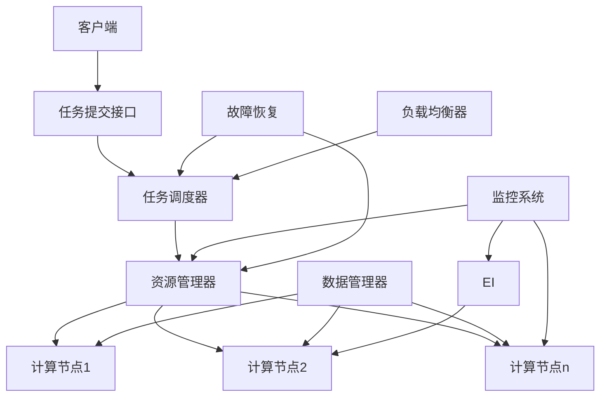
```mermaid
graph TD
    A[客户端] --> B[任务提交接口]
    B --> C[任务调度器]
    C --> D[资源管理器]
    D --> E[计算节点1]
    D --> F[计算节点2]
    D --> G[计算节点n]
    H[数据管理器] --> E
    H --> F
    H --> G
    I[监控系统] --> D
    I --> EI --> F
    I --> G
    J[故障恢复] --> C
    J --> D
    K[负载均衡器] --> C
```

最佳实践 Tips：
1. 实现自适应任务分割：根据系统负载和资源可用性动态调整任务粒度。
2. 使用数据感知调度：将计算任务调度到数据所在位置，减少数据传输开销。
3. 实现分层资源管理：在集群、机器和容器级别实现多层次的资源管理和隔离。
4. 采用异步通信模型：减少同步等待，提高系统整体吞吐量。

注意事项：
- 处理数据倾斜：设计合适的数据分片策略，避免某些节点负载过重。
- 考虑网络拓扑：在任务调度时考虑网络距离，优化数据传输效率。
- 实现细粒度的监控：收集详细的性能指标，以便快速定位和解决性能瓶颈。
- 设计可扩展的通信协议：确保通信协议能够支持大规模集群的高效通信。

拓展阅读：
1. "Designing Data-Intensive Applications" by Martin Kleppmann
2. "Large-Scale Distributed Systems and Middleware" by Jeff Shute et al.
3. "The Datacenter as a Computer: Designing Warehouse-Scale Machines" by Luiz André Barroso et al.

### 2.4.2 缓存策略与数据预加载

在 AI Native 应用中，缓存策略和数据预加载是提高系统性能和降低延迟的关键技术。这些技术能够减少数据访问时间，提高数据的可用性，并优化计算资源的使用。设计有效的缓存策略和数据预加载机制需要考虑数据特性、访问模式和系统资源等多个因素。

1. 多级缓存设计
    - 客户端缓存：减少网络请求，提高响应速度
    - 应用服务器缓存：缓存计算结果和频繁访问的数据
    - 分布式缓存：如 Redis 或 Memcached，提供跨节点的共享缓存
    - 数据库缓存：如查询结果缓存，减少数据库负载

2. 缓存策略
    - LRU (Least Recently Used)：淘汰最久未使用的数据
    - LFU (Least Frequently Used)：淘汰访问频率最低的数据
    - FIFO (First In First Out)：先进先出策略
    - 时间过期策略：设置缓存项的过期时间

3. 缓存一致性
    - 写透策略：同时更新缓存和后端存储
    - 延迟写入：先更新缓存，异步更新后端存储
    - 缓存失效：更新数据时使相关缓存失效

4. 数据预加载
    - 预测性加载：基于用户行为或业务逻辑预测并预加载数据
    - 批量预加载：在系统空闲时预加载大量数据
    - 渐进式加载：先加载关键数据，然后逐步加载次要数据

5. 智能预取
    - 基于 AI 的访问模式预测：使用机器学习模型预测数据访问模式
    - 上下文感知预取：根据当前上下文动态调整预取策略
    - 自适应预取：根据预取效果动态调整预取策略

6. 缓存监控与优化
    - 缓存命中率监控：实时监控缓存效率
    - 热点数据分析：识别并优化频繁访问的数据
    - 缓存空间动态调整：根据系统负载动态调整缓存大小

缓存策略与数据预加载的核心实现可以用以下伪代码表示：

```python
class CacheManager:
    def __init__(self, capacity):
        self.capacity = capacity
        self.cache = {}
        self.access_history = []

    def get(self, key):
        if key in self.cache:
            self.update_access_history(key)
            return self.cache[key]
        return None

    def put(self, key, value):
        if len(self.cache) >= self.capacity:
            self.evict()
        self.cache[key] = value
        self.update_access_history(key)

    def update_access_history(self, key):
        self.access_history.append(key)
        if len(self.access_history) > self.capacity * 2:
            self.access_history = self.access_history[-self.capacity:]

    def evict(self):
        lru_key = min(self.cache, key=lambda k: self.access_history[::-1].index(k))
        del self.cache[lru_key]

class DataPreloader:
    def __init__(self, data_source, cache_manager):
        self.data_source = data_source
        self.cache_manager = cache_manager
        self.prediction_model = PredictionModel()

    def preload(self):
        predicted_keys = self.prediction_model.predict_next_accesses()
        for key in predicted_keys:
            if key not in self.cache_manager.cache:
                data = self.data_source.get(key)
                self.cache_manager.put(key, data)

    def update_prediction_model(self, access_pattern):
        self.prediction_model.train(access_pattern)

# 使用示例
cache_manager = CacheManager(capacity=1000)
data_source = DataSource()
preloader = DataPreloader(data_source, cache_manager)

def process_request(request):
    key = request.get_data_key()
    data = cache_manager.get(key)
    if data is None:
        data = data_source.get(key)
        cache_manager.put(key, data)
    preloader.update_prediction_model(key)
    preloader.preload()
    return process_data(data)
```

在实现缓存策略与数据预加载时，需要考虑以下数学模型和原理：

1. 缓存命中率：
   缓存命中率 H 定义为：

   $$H = \frac{\text{缓存命中次数}}{\text{总访问次数}}$$

2. 缓存替换策略（以 LRU 为例）：
   对于缓存项 i，其优先级 P(i) 可以表示为：

   $$P(i) = \frac{1}{t_{\text{current}} - t_{\text{last\_access}}(i)}$$

   其中 t_current 是当前时间，t_last_access(i) 是项 i 最后一次访问的时间。

3. 预加载准确率：
   预加载准确率 A 定义为：

   $$A = \frac{\text{被使用的预加载数据数量}}{\text{总预加载数据数量}}$$

4. 马尔可夫链预测模型：
   使用马尔可夫链模型预测下一个可能访问的数据项。转移概率矩阵 P 中的元素 p_ij 表示从状态 i 转移到状态 j 的概率：

   $$P = \begin{bmatrix}
   p_{11} & p_{12} & \cdots & p_{1n} \\
   p_{21} & p_{22} & \cdots & p_{2n} \\
   \vdots & \vdots & \ddots & \vdots \\
   p_{n1} & p_{n2} & \cdots & p_{nn}
   \end{bmatrix}$$

缓存策略与数据预加载的系统设计图如下：

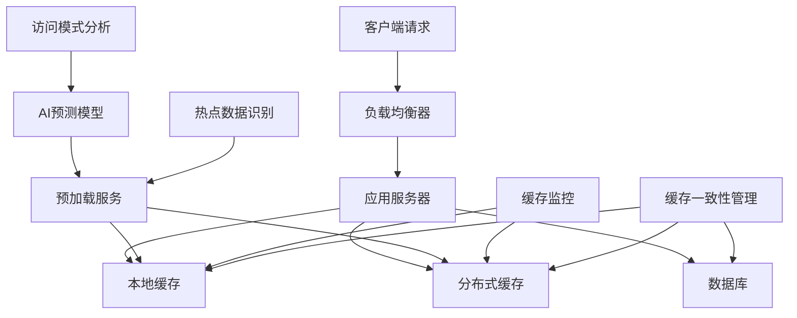
```mermaid
graph TD
    A[客户端请求] --> B[负载均衡器]
    B --> C[应用服务器]
    C --> D[本地缓存]
    C --> E[分布式缓存]
    C --> F[数据库]
    G[预加载服务] --> D
    G --> E
    H[缓存监控] --> D
    H --> E
    I[AI预测模型] --> G
    J[访问模式分析] --> I
    K[热点数据识别] --> G
    L[缓存一致性管理] --> D
    L --> E
    L --> F
```

最佳实践 Tips：
1. 实现多级缓存预热：系统启动时，按优先级逐级预热各层缓存。
2. 使用布隆过滤器：快速判断数据是否可能在缓存中，减少不必要的缓存查询。
3. 实现缓存分片：将大型缓存分布到多个节点，提高并发访问能力。
4. 采用写回策略：对于写操作频繁的场景，使用写回策略减少与后端存储的同步频率。

注意事项：
- 避免缓存穿透：对不存在的数据也进行缓存，防止大量请求直接打到后端存储。
- 处理缓存雪崩：为缓存项设置随机过期时间，避免同时大量缓存失效。
- 考虑数据一致性：在实现缓存策略时，权衡性能和数据一致性需求。
- 监控缓存效率：持续监控缓存命中率和使用情况，及时调整缓存策略。

拓展阅读：
1. "Caching at Scale with Redis" by Salvatore Sanfilippo
2. "The Cache Refresh Problem" by Ben Sigelman
3. "Predictive Data Prefetching" by Jiannong Cao et al.

### 2.4.3 边缘计算在 AI Native 中的应用

边缘计算在 AI Native 应用中扮演着越来越重要的角色，它通过将计算能力下沉到数据源附近，显著减少了数据传输延迟，提高了实时处理能力，并增强了数据隐私保护。在 AI 场景中，边缘计算能够支持更快的决策制定和更高效的资源利用。

1. 边缘 AI 推理
    - 模型压缩：使用量化、剪枝等技术压缩 AI 模型，适应边缘设备的资源限制
    - 轻量级模型：设计专门针对边缘设备的轻量级 AI 模型
    - 硬件加速：利用边缘设备的专用 AI 芯片进行高效推理

2. 边缘-云协同
    - 任务分割：将 AI 任务合理分配到边缘和云端
    - 增量学习：在边缘进行模型的增量更新，定期与云端同步
    - 联邦学习：在保护数据隐私的前提下，实现分布式模型训练

3. 实时数据处理
    - 数据过滤和聚合：在边缘进行初步的数据处理，减少传输到云端的数据量
    - 异常检测：在边缘快速识别和响应异常情况
    - 时序数据分析：对时间敏感的数据进行实时分析和预测

4. 智能缓存
    - 本地数据缓存：缓存频繁访问的数据，减少网络请求
    - 预测性缓存：基于 AI 预测用户行为，提前缓存可能需要的数据
    - 分布式缓存同步：在边缘节点间同步和共享缓存数据

5. 安全和隐私
    - 本地敏感数据处理：敏感数据在边缘设备上处理，不上传到云端
    - 差分隐私：在数据聚合阶段应用差分隐私技术
    - 安全通信：实现边缘设备和云端之间的加密通信

6. 资源管理
    - 动态负载均衡：根据边缘设备的负载情况动态调整任务分配
    - 能耗优化：根据任务优先级和设备电量调整计算策略
    - 设备协同：多个边缘设备协同工作，共享计算资源

边缘计算在 AI Native 应用中的核心实现可以用以下伪代码表示：

```python
class EdgeDevice:
    def __init__(self, device_id, resources):
        self.device_id = device_id
        self.resources = resources
        self.ai_model = load_compressed_model()
        self.data_cache = DataCache()

    def process_data(self, input_data):
        if self.data_cache.contains(input_data.id):
            processed_data = self.data_cache.get(input_data.id)
        else:
            filtered_data = self.preprocess(input_data)
            if self.can_process_locally(filtered_data):
                processed_data = self.local_inference(filtered_data)
                self.data_cache.put(input_data.id, processed_data)
            else:
                processed_data = self.cloud_inference(filtered_data)
        return processed_data

    def preprocess(self, data):
        # 实现数据预处理逻辑
        return filtered_data

    def can_process_locally(self, data):
        required_resources = estimate_required_resources(data)
        return all(self.resources[r] >= required_resources[r] for r in required_resources)

    def local_inference(self, data):
        return self.ai_model.infer(data)

    def cloud_inference(self, data):
        return send_to_cloud_for_processing(data)

    def update_model(self, new_model_params):
        self.ai_model.update_parameters(new_model_params)

class EdgeManager:
    def __init__(self):
        self.devices = {}
        self.load_balancer = LoadBalancer()

    def register_device(self, device):
        self.devices[device.device_id] = device
        self.load_balancer.add_device(device)

    def process_request(self, request):
        device = self.load_balancer.get_best_device(request)
        return device.process_data(request.data)

    def synchronize_models(self):
        global_model = aggregate_models([device.ai_model for device in self.devices.values()])
        for device in self.devices.values():
            device.update_model(global_model.get_parameters())

# 使用示例
edge_manager = EdgeManager()
device1 = EdgeDevice("edge1", {"cpu": 2, "memory": 4})
device2 = EdgeDevice("edge2", {"cpu": 4, "memory": 8})
edge_manager.register_device(device1)
edge_manager.register_device(device2)

request = DataRequest(data=sensor_data)
result = edge_manager.process_request(request)
edge_manager.synchronize_models()
```

在实现边缘计算在 AI Native 应用中时，需要考虑以下数学模型和原理：

1. 任务调度决策：
   使用多目标优化模型。给定任务 j 和设备 i，定义目标函数：

   $$f(i,j) = w_1 \cdot \text{latency}(i,j) + w_2 \cdot \text{energy}(i,j) + w_3 \cdot \text{cost}(i,j)$$

   其中 w₁, w₂, w₃ 是权重系数，目标是最小化 f(i,j)。

2. 模型压缩：
   使用量化技术将浮点权重 w 映射到 b 位定点数：

   $$w_q = \text{round}(\frac{w}{\Delta}) \cdot \Delta$$

   其中 Δ 是量化步长，通常定义为：

   $$\Delta = \frac{\max(|w|) - \min(|w|)}{2^b - 1}$$

3. 联邦学习：
   在 t 轮联邦学习中，全局模型参数更新公式：

   $$w_{t+1} = \sum_{k=1}^K \frac{n_k}{n} w_{t+1}^k$$

   其中 wᵗ⁺¹ᵏ 是设备 k 的本地模型参数，nₖ 是设备 k 的数据量，n 是总数据量。

4. 差分隐私：
   对于查询函数 f 和隐私预算 ε，添加拉普拉斯噪声：

   $$f'(D) = f(D) + \text{Lap}(\frac{\Delta f}{\varepsilon})$$

   其中 Δf 是函数 f 的敏感度。

边缘计算在 AI Native 应用中的系统设计图如下：

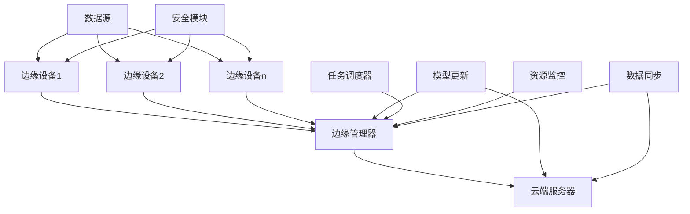
```mermaid
graph TD
    A[数据源] --> B[边缘设备1]
    A --> C[边缘设备2]
    A --> D[边缘设备n]
    B --> E[边缘管理器]
    C --> E
    D --> E
    E --> F[云端服务器]
    G[模型更新] --> E
    G --> F
    H[任务调度器] --> E
    I[安全模块] --> B
    I --> C
    I --> D
    J[资源监控] --> E
    K[数据同步] --> E
    K --> F
```

最佳实践 Tips：
1. 实现动态模型部署：根据边缘设备的能力动态部署不同复杂度的模型。
2. 使用模型蒸馏：将复杂模型的知识迁移到轻量级模型，适应边缘设备。
3. 实现渐进式计算：允许在有限时间内返回近似结果，然后逐步优化。
4. 采用分层缓存策略：在设备、本地网关和云端实现多级缓存，优化数据访问。

注意事项：
- 处理网络不稳定：设计容错机制，处理边缘设备与云端的临时断连情况。
- 考虑设备异构性：适应不同类型和能力的边缘设备，确保系统的普适性。
- 管理模型版本：在边缘设备上实现模型版本控制，确保模型更新的一致性。
- 优化能源使用：考虑边缘设备的能源限制，设计节能的计算和通信策略。

拓展阅读：
1. "Edge Intelligence: The Confluence of Edge Computing and Artificial Intelligence" by Zhi Zhou et al.
2. "Mobile Edge Computing: A Survey on Architecture and Computation Offloading" by Pavel Mach and Zdenek Becvar
3. "Federated Learning: Challenges, Methods, and Future Directions" by Tian Li et al.

# 3 AI Native 应用的核心组件

## 3.1 AI 模型服务

### 3.1.1 模型选择与部署策略

在 AI Native 应用中，模型选择与部署策略是决定系统性能、可扩展性和可维护性的关键因素。正确的策略可以确保 AI 模型高效运行，同时满足业务需求和技术约束。

1. 模型选择考虑因素
    - 任务需求：分类、回归、生成等不同任务类型
    - 性能指标：准确率、召回率、F1 分数等
    - 计算复杂度：推理时间、内存占用
    - 可解释性：模型决策的可解释程度
    - 数据依赖：训练数据的可用性和质量

2. 模型架构选择
    - 传统机器学习模型：如随机森林、SVM、梯度提升树
    - 深度学习模型：CNN、RNN、Transformer 等
    - 预训练模型：使用迁移学习，如 BERT、GPT 系列
    - 自定义模型：根据特定需求设计的模型架构

3. 模型压缩技术
    - 量化：将浮点数转换为低位定点数
    - 剪枝：移除不重要的连接或神经元
    - 知识蒸馏：将大模型的知识迁移到小模型
    - 低秩分解：使用矩阵分解减少参数数量

4. 部署环境选择
    - 云端部署：适用于计算密集型模型
    - 边缘部署：适用于实时性要求高的场景
    - 混合部署：结合云端和边缘的优势
    - 移动设备部署：针对移动应用的轻量级模型

5. 服务化策略
    - RESTful API：适用于简单的请求-响应模式
    - gRPC：适用于高性能、低延迟的服务调用
    - 消息队列：适用于异步处理和流式数据
    - WebSocket：适用于需要持续连接的实时应用

6. 扩展性考虑
    - 水平扩展：增加服务实例数量
    - 垂直扩展：增加单个实例的资源
    - 模型并行：将大模型分割到多个设备上
    - 数据并行：同一模型在多个设备上处理不同数据

7. 监控与维护
    - 性能监控：推理延迟、吞吐量、资源利用率
    - 模型漂移检测：识别模型性能随时间的变化
    - A/B 测试：比较不同模型或配置的效果
    - 自动重训练：根据新数据自动更新模型

模型选择与部署策略的核心实现可以用以下伪代码表示：

```python
class ModelManager:
    def __init__(self):
        self.models = {}
        self.deployment_config = {}

    def select_model(self, task, constraints):
        candidate_models = self.filter_models(task, constraints)
        best_model = max(candidate_models, key=lambda m: self.evaluate_model(m, task))
        return best_model

    def filter_models(self, task, constraints):
        return [model for model in self.models.values()
                if model.task == task and self.meets_constraints(model, constraints)]

    def meets_constraints(self, model, constraints):
        return (model.inference_time <= constraints['max_latency'] and
                model.memory_usage <= constraints['max_memory'])

    def evaluate_model(self, model, task):
        # 实现模型评估逻辑，返回评分
        pass

    def deploy_model(self, model, environment):
        if environment == 'cloud':
            return self.deploy_to_cloud(model)
        elif environment == 'edge':
            return self.deploy_to_edge(model)
        elif environment == 'mobile':
            return self.deploy_to_mobile(model)

    def deploy_to_cloud(self, model):
        compressed_model = self.compress_model(model)
        service = self.create_model_service(compressed_model)
        self.deployment_config[model.id] = {
            'environment': 'cloud',
            'service_url': service.url,
            'scaling_policy': 'auto-scale'
        }
        return service

    def compress_model(self, model):
        quantized_model = self.quantize(model)
        pruned_model = self.prune(quantized_model)
        return pruned_model

    def quantize(self, model):
        # 实现模型量化逻辑
        pass

    def prune(self, model):
        # 实现模型剪枝逻辑
        pass

    def create_model_service(self, model):
        # 创建模型服务（如 RESTful API）
        pass

    def monitor_model_performance(self, model_id):
        config = self.deployment_config[model_id]
        metrics = self.collect_metrics(config['service_url'])
        if self.detect_performance_degradation(metrics):
            self.trigger_model_update(model_id)

    def collect_metrics(self, service_url):
        # 收集模型服务的性能指标
        pass

    def detect_performance_degradation(self, metrics):
        # 检测模型性能是否下降
        pass

    def trigger_model_update(self, model_id):
        # 触发模型更新流程
        pass

# 使用示例
manager = ModelManager()
task = "image_classification"
constraints = {'max_latency': 100, 'max_memory': 1024}
selected_model = manager.select_model(task, constraints)
deployed_service = manager.deploy_model(selected_model, 'cloud')
manager.monitor_model_performance(selected_model.id)
```

在实现模型选择与部署策略时，需要考虑以下数学模型和原理：

1. 模型性能评估：
   使用 F1 分数作为分类模型的综合评估指标：

   $$F1 = 2 \cdot \frac{\text{precision} \cdot \text{recall}}{\text{precision} + \text{recall}}$$

   其中，precision = TP / (TP + FP)，recall = TP / (TP + FN)

2. 模型压缩（量化）：
   将浮点权重 w 量化为 b 位定点数：

   $$w_q = \text{round}(\frac{w - \min(w)}{\max(w) - \min(w)} \cdot (2^b - 1)) \cdot \frac{\max(w) - \min(w)}{2^b - 1} + \min(w)$$

3. 负载均衡：
   使用加权轮询算法进行负载均衡。给定 n 个服务器，权重为 w₁, w₂, ..., wₙ，第 i 个请求被分配到的服务器索引 s 为：

   $$s = i \mod (\sum_{k=1}^n w_k)$$

4. 模型漂移检测：
   使用 Kullback-Leibler 散度衡量预测分布的变化。给定两个概率分布 P 和 Q：

   $$D_{KL}(P||Q) = \sum_{i} P(i) \log \frac{P(i)}{Q(i)}$$

模型选择与部署策略的系统设计图如下：

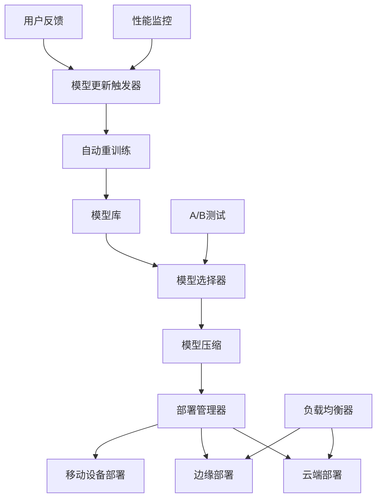
```mermaid
graph TD
    A[模型库] --> B[模型选择器]
    B --> C[模型压缩]
    C --> D[部署管理器]
    D --> E[云端部署]
    D --> F[边缘部署]
    D --> G[移动设备部署]
    H[性能监控] --> I[模型更新触发器]
    I --> J[自动重训练]
    J --> A
    K[负载均衡器] --> E
    K --> F
    L[A/B测试] --> B
    M[用户反馈] --> I
```

最佳实践 Tips：
1. 实现模型版本控制：使用语义化版本号管理模型，便于回滚和审计。
2. 采用蓝绿部署：在更新模型时使用蓝绿部署策略，减少服务中断风险。
3. 实现模型热切换：支持在不停机的情况下动态切换模型版本。
4. 使用特征存储：集中管理特征工程逻辑，确保训练和推理阶段的一致性。

注意事项：
- 考虑模型的可解释性：在某些领域（如医疗、金融），模型的可解释性可能比性能更重要。
- 注意数据隐私：在选择部署环境时，考虑数据隐私法规的要求。
- 平衡性能和成本：选择最具成本效益的部署方案，而不仅仅是性能最高的。
- 考虑模型的可移植性：选择支持多种部署环境的模型框架，增加灵活性。

拓展阅读：
1. "Model Serving in PyTorch" by James Reed and Przemyslaw Tredak
2. "TensorFlow Serving: Flexible, High-Performance ML Serving" by Christopher Olston et al.
3. "ML Model Deployment and Inference: Patterns and Best Practices" by Holden Karau

### 3.1.2 模型版本管理与更新机制

在 AI Native 应用中，模型版本管理与更新机制是确保 AI 系统持续优化和稳定运行的关键组件。有效的版本管理和更新策略可以帮助团队追踪模型的演变、快速响应性能变化，并在保证系统稳定性的同时实现模型的迭代优化。

1. 版本控制系统
    - 语义化版本号：采用 Major.Minor.Patch 格式
    - 模型元数据：包括训练数据版本、超参数、性能指标等
    - 代码版本关联：将模型版本与相关代码版本关联
    - 模型文件存储：使用专门的模型存储系统，如 MLflow 或 DVC

2. 模型更新策略
    - 定期更新：根据预定计划定期重新训练和更新模型
    - 性能触发更新：当模型性能下降到阈值以下时触发更新
    - 数据驱动更新：当新的训练数据累积到一定量时更新模型
    - 手动触发：允许人工干预，手动触发模型更新

3. 模型部署策略
    - 蓝绿部署：同时维护两个生产环境，便于快速切换和回滚
    - 金丝雀发布：逐步将流量导向新模型，降低风险
    - 影子模式：新模型接收实时流量副本，但不产生实际输出
    - A/B 测试：同时运行多个模型版本，比较性能

4. 模型回滚机制
    - 自动回滚：当新模型性能低于阈值时自动回滚
    - 快速回滚：保留前几个版本的模型，支持快速切换
    - 部分回滚：支持特定特征或组件的回滚

5. 版本兼容性管理
    - 向后兼容性：确保新版本模型能处理旧版本的输入
    - API 版本控制：使用 API 版本控制管理不同模型版本的接口
    - 特征版本管理：跟踪和管理特征工程的变化

6. 模型性能监控
    - 实时指标：监控推理延迟、吞吐量、错误率等
    - 离线评估：定期使用测试集评估模型性能
    - 数据漂移检测：监控输入数据分布的变化
    - 模型解释性跟踪：监控模型决策的可解释性变化

7. 协作与治理
    - 审批流程：实施模型更新的审批机制
    - 变更日志：详细记录每次模型更新的内容和原因
    - 角色权限管理：控制不同角色对模型版本的访问和操作权限

模型版本管理与更新机制的核心实现可以用以下伪代码表示：

```python
class ModelVersionManager:
    def __init__(self):
        self.model_registry = ModelRegistry()
        self.deployment_manager = DeploymentManager()
        self.performance_monitor = PerformanceMonitor()

    def create_new_version(self, model, metadata):
        version = self.model_registry.register_model(model, metadata)
        return version

    def deploy_model(self, version, strategy='blue_green'):
        if strategy == 'blue_green':
            self.deployment_manager.blue_green_deploy(version)
        elif strategy == 'canary':
            self.deployment_manager.canary_deploy(version)
        # 其他部署策略...

    def rollback(self, to_version):
        self.deployment_manager.rollback(to_version)

    def monitor_performance(self, version):
        metrics = self.performance_monitor.collect_metrics(version)
        if self.performance_monitor.detect_degradation(metrics):
            self.trigger_update()

    def trigger_update(self):
        latest_data = self.get_latest_training_data()
        new_model = self.train_new_model(latest_data)
        new_version = self.create_new_version(new_model, metadata={
            'training_data': latest_data.version,
            'timestamp': datetime.now()
        })
        self.deploy_model(new_version, strategy='canary')

    def compare_versions(self, version1, version2):
        metrics1 = self.performance_monitor.evaluate(version1)
        metrics2 = self.performance_monitor.evaluate(version2)
        return self.compare_metrics(metrics1, metrics2)

class DeploymentManager:
    def blue_green_deploy(self, version):
        new_env = self.create_new_environment(version)
        self.route_traffic(new_env, percentage=0.5)
        if self.is_stable(new_env):
            self.route_traffic(new_env, percentage=1.0)
            self.terminate_old_environment()
        else:
            self.rollback(self.get_current_version())

    def canary_deploy(self, version):
        canary_env = self.create_canary_environment(version)
        for percentage in [0.1, 0.3, 0.5, 0.8, 1.0]:
            self.route_traffic(canary_env, percentage)
            if not self.is_stable(canary_env):
                self.rollback(self.get_current_version())
                return
        self.finalize_deployment(version)

# 使用示例
manager = ModelVersionManager()
new_model = train_model(latest_data)
new_version = manager.create_new_version(new_model, metadata={'algorithm': 'XGBoost', 'features': ['A', 'B', 'C']})
manager.deploy_model(new_version, strategy='canary')
manager.monitor_performance(new_version)
```

在实现模型版本管理与更新机制时，需要考虑以下数学模型和原理：

1. 版本号计算：
   使用语义化版本号 MAJOR.MINOR.PATCH，版本号递增规则：
    - MAJOR：当做了不兼容的 API 修改
    - MINOR：当做了向下兼容的功能性新增
    - PATCH：当做了向下兼容的问题修正

2. 性能退化检测：
   使用 CUSUM (Cumulative Sum) 算法检测性能变化。给定性能指标序列 {X_t}，计算累积和：

   $$S_t = \max(0, S_{t-1} + (X_t - \mu_0) - k)$$

   其中 μ₀ 是目标均值，k 是允许的偏差。当 S_t > h 时触发报警，h 是阈值。

3. 金丝雀发布的流量分配：
   使用递增的 Beta 分布控制流量分配。在时间 t，新版本接收的流量比例为：

   $$p_t = \text{Beta}(\alpha + t, \beta)$$

   其中 α 和 β 是形状参数，控制增长速度和初始值。

4. A/B 测试的样本量计算：
   为检测 d% 的相对变化，所需的每组样本量 n 为：

   $$n = \frac{2(Z_\alpha + Z_\beta)^2}{\delta^2} \cdot \frac{p(1-p)}{p^2}$$

   其中 p 是基准转化率，δ 是要检测的相对变化，Z_α 和 Z_β 分别是显著性水平和检验功效对应的 Z 分数。

模型版本管理与更新机制的系统设计图如下：

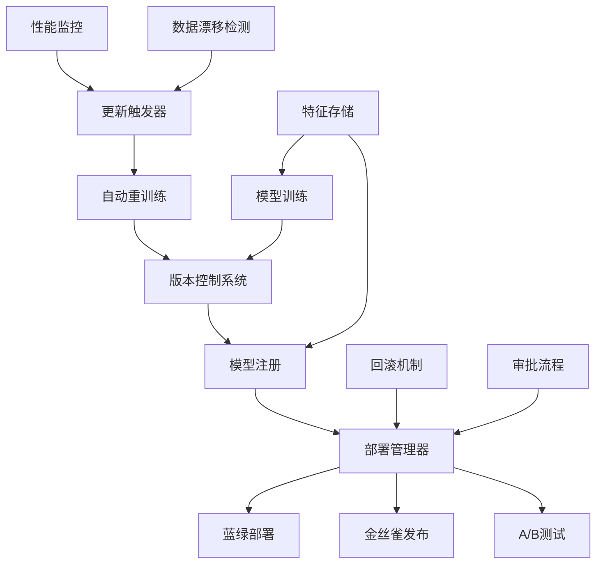
```mermaid
graph TD
    A[模型训练] --> B[版本控制系统]
    B --> C[模型注册]
    C --> D[部署管理器]
    D --> E[蓝绿部署]
    D --> F[金丝雀发布]
    D --> G[A/B测试]
    H[性能监控] --> I[更新触发器]
    I --> J[自动重训练]
    J --> B
    K[回滚机制] --> D
    L[数据漂移检测] --> I
    M[审批流程] --> D
    N[特征存储] --> A
    N --> C
```

最佳实践 Tips：
1. 实现模型实验跟踪：使用工具如 MLflow 记录每次实验的参数、指标和产物。
2. 采用不可变基础设施：将模型和其运行环境打包为容器，确保一致性。
3. 实现自动化测试：为模型部署流程构建自动化测试，包括单元测试、集成测试和性能测试。
4. 使用特征存储：集中管理特征定义和转换逻辑，确保训练和推理的一致性。

注意事项：
- 考虑长尾效应：某些模型更新可能在长期才显示效果，设计长期的评估机制。
- 注意数据隐私：在更新模型时，确保遵守数据使用的相关法规和政策。
- 管理技术债务：定期重构和优化模型代码，避免累积技术债务。
- 文档化：详细记录每个模型版本的变更、性能特征和使用注意事项。

拓展阅读：
1. "Continuous Delivery for Machine Learning" by D. Sato, A. Wider, and C. Windheuser
2. "Versioning Machine Learning Models in Modern Data Stack" by Doordash Engineering
3. "Rules of Machine Learning: Best Practices for ML Engineering" by Martin Zinkevich

### 3.1.3 模型服务的负载均衡与扩展

在 AI Native 应用中，模型服务的负载均衡与扩展是确保系统高可用性、高性能和成本效益的关键组件。随着用户请求的增加和业务的扩展，有效的负载均衡和扩展策略变得尤为重要。

1. 负载均衡策略
    - 轮询（Round Robin）：请求依次分配给每个服务器
    - 加权轮询：根据服务器能力分配不同的权重
    - 最少连接：将请求发送到当前连接数最少的服务器
    - 响应时间：根据服务器的响应时间动态调整分配
    - 一致性哈希：确保相同的请求总是发送到相同的服务器

2. 自动扩展机制
    - 水平扩展：增加或减少服务实例数量
    - 垂直扩展：增加或减少单个实例的资源（CPU、内存等）
    - 预测性扩展：基于历史数据和预测模型提前扩展资源
    - 多区域扩展：在不同地理位置部署服务实例

3. 扩展触发条件
    - CPU 利用率：当 CPU 使用率超过阈值时触发扩展
    - 内存使用：基于内存使用情况进行扩展
    - 请求队列长度：根据等待处理的请求数量决定是否扩展
    - 响应时间：当平均响应时间超过设定阈值时扩展
    - 自定义指标：基于业务特定的指标进行扩展决策

4. 服务发现
    - DNS 服务发现：使用 DNS 解析获取服务实例列表
    - 配置中心：通过集中式配置管理服务实例信息
    - 服务注册表：服务实例主动注册到注册中心
    - 健康检查：定期检查服务实例的健康状态

5. 流量控制
    - 限流：控制单位时间内的请求数量
    - 熔断：当服务不可用时快速失败，防止级联故障
    - 降级：在高负载情况下，返回部分功能或缓存结果
    - 请求优先级：为不同类型的请求设置优先级

6. 状态管理
    - 无状态设计：尽可能设计无状态服务，便于扩展
    - 分布式缓存：使用如 Redis 的分布式缓存存储会话信息
    - 粘性会话：确保相关的请求总是发送到同一服务器

7. 监控与告警
    - 实时监控：监控服务实例的健康状态和性能指标
    - 日志聚合：集中收集和分析所有服务实例的日志
    - 告警机制：当出现异常情况时及时通知相关人员
    - 性能分析：定期分析系统性能，识别潜在瓶颈

模型服务的负载均衡与扩展的核心实现可以用以下伪代码表示：

```python
class LoadBalancer:
    def __init__(self):
        self.servers = []
        self.algorithm = 'round_robin'

    def add_server(self, server):
        self.servers.append(server)

    def remove_server(self, server):
        self.servers.remove(server)

    def get_server(self, request):
        if self.algorithm == 'round_robin':
            return self.round_robin()
        elif self.algorithm == 'least_connections':
            return self.least_connections()
        # 其他负载均衡算法...

    def round_robin(self):
        server = self.servers.pop(0)
        self.servers.append(server)
        return server

    def least_connections(self):
        return min(self.servers, key=lambda s: s.active_connections)

class AutoScaler:
    def __init__(self, min_instances, max_instances):
        self.min_instances = min_instances
        self.max_instances = max_instances
        self.current_instances = min_instances

    def scale(self, metrics):
        if self.should_scale_up(metrics):
            self.scale_up()
        elif self.should_scale_down(metrics):
            self.scale_down()

    def should_scale_up(self, metrics):
        return (metrics['cpu_utilization'] > 70 or 
                metrics['request_queue_length'] > 100) and 
                self.current_instances < self.max_instances

    def should_scale_down(self, metrics):
        return metrics['cpu_utilization'] < 30 and 
               self.current_instances > self.min_instances

    def scale_up(self):
        new_instance = self.create_new_instance()
        self.current_instances += 1
        load_balancer.add_server(new_instance)

    def scale_down(self):
        instance_to_remove = self.select_instance_to_remove()
        load_balancer.remove_server(instance_to_remove)
        self.terminate_instance(instance_to_remove)
        self.current_instances -= 1

    def create_new_instance(self):
        # 创建新的服务实例
        pass

    def select_instance_to_remove(self):
        # 选择要移除的实例
        pass

    def terminate_instance(self, instance):
        # 终止指定的实例
        pass

class ServiceDiscovery:
    def __init__(self):
        self.services = {}

    def register(self, service_name, instance):
        if service_name not in self.services:
            self.services[service_name] = []
        self.services[service_name].append(instance)

    def unregister(self, service_name, instance):
        self.services[service_name].remove(instance)

    def get_instances(self, service_name):
        return self.services.get(service_name, [])

class CircuitBreaker:
    def __init__(self, failure_threshold, reset_timeout):
        self.failure_threshold = failure_threshold
        self.reset_timeout = reset_timeout
        self.failures = 0
        self.last_failure_time = None
        self.state = 'CLOSED'

    def execute(self, func):
        if self.state == 'OPEN':
            if time.time() - self.last_failure_time > self.reset_timeout:
                self.state = 'HALF-OPEN'
            else:
                raise CircuitBreakerOpenError()

        try:
            result = func()
            if self.state == 'HALF-OPEN':
                self.state = 'CLOSED'
                self.failures = 0
            return result
        except Exception as e:
            self.failures += 1
            if self.failures >= self.failure_threshold:
                self.state = 'OPEN'
                self.last_failure_time = time.time()
            raise e

# 使用示例
load_balancer = LoadBalancer()
auto_scaler = AutoScaler(min_instances=2, max_instances=10)
service_discovery = ServiceDiscovery()
circuit_breaker = CircuitBreaker(failure_threshold=5, reset_timeout=60)

def handle_request(request):
    server = load_balancer.get_server(request)
    try:
        return circuit_breaker.execute(lambda: server.process(request))
    except CircuitBreakerOpenError:
        return fallback_response()

def monitor_and_scale():
    while True:
        metrics = collect_metrics()
        auto_scaler.scale(metrics)
        time.sleep(60)  # 每分钟检查一次

threading.Thread(target=monitor_and_scale, daemon=True).start()
```

在实现模型服务的负载均衡与扩展时，需要考虑以下数学模型和原理：

1. 负载均衡算法（加权轮询）：
   给定 n 个服务器，权重分别为 w₁, w₂, ..., wₙ，第 k 个请求应该被分配到的服务器索引 i 满足：

   $$i = \arg\min_j \left\{\sum_{m=1}^j w_m > (k \mod \sum_{m=1}^n w_m)\right\}$$

2. 自动扩展决策：
   使用指数平滑法预测未来负载。给定观察到的负载序列 {x_t}，预测值 s_t 为：

   $$s_t = \alpha x_t + (1-\alpha)s_{t-1}$$

   其中 α 是平滑因子（0 < α < 1）。

3. 服务发现的一致性哈希：
   使用一致性哈希算法进行服务发现。给定哈希函数 h，服务实例集合 S，请求 r 被路由到的实例 s 满足：

   $$s = \arg\min_{s_i \in S} \{(h(r) - h(s_i)) \mod 2^{32}\}$$

4. 熔断器状态转换：
   使用马尔可夫链模型描述熔断器状态转换。状态转移矩阵 P：

   $$P = \begin{bmatrix}
   p_{CC} & p_{CO} & 0 \\
   0 & p_{OO} & p_{OH} \\
   p_{HC} & 0 & p_{HH}
   \end{bmatrix}$$

   其中 C 表示 Closed，O 表示 Open，H 表示 Half-Open。

模型服务的负载均衡与扩展的系统设计图如下：

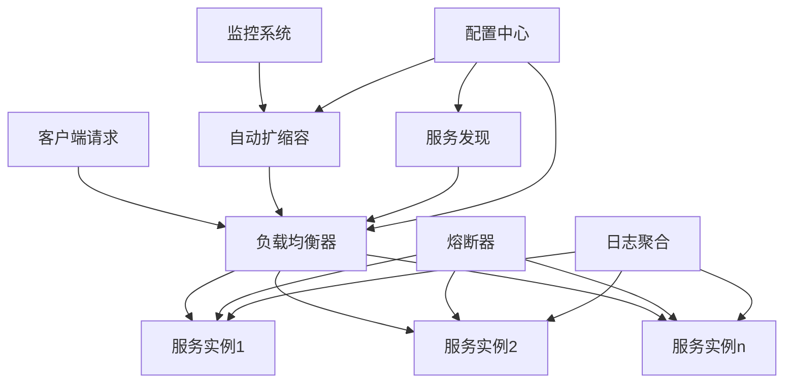
```mermaid
graph TD
    A[客户端请求] --> B[负载均衡器]
    B --> C[服务实例1]
    B --> D[服务实例2]
    B --> E[服务实例n]
    F[自动扩缩容] --> B
    G[服务发现] --> B
    H[监控系统] --> F
    I[熔断器] --> C
    I --> D
    I --> E
    J[配置中心] --> B
    J --> F
    J --> G
    K[日志聚合] --> C
    K --> D
    K --> E
```

最佳实践 Tips：
1. 实现智能负载均衡：结合机器学习预测请求特征，优化负载分配。
2. 使用容器化技术：采用 Docker 和 Kubernetes 实现快速部署和弹性伸缩。
3. 实现灰度发布：在扩展时逐步引入新版本，降低风险。
4. 采用多级缓存：结合内存缓存、分布式缓存和 CDN，优化响应速度。

注意事项：
- 考虑状态管理：在扩展无状态服务时，注意处理有状态组件（如会话）。
- 注意数据一致性：在分布式环境中，确保数据的一致性，特别是在扩缩容过程中。
- 监控资源使用：密切关注资源使用情况，避免过度扩展导致成本浪费。
- 安全性考虑：在负载均衡和服务发现中实施适当的安全措施，防止未授权访问。

拓展阅读：
1. "Designing Distributed Systems" by Brendan Burns
2. "Site Reliability Engineering: How Google Runs Production Systems" by Niall Richard Murphy et al.
3. "Patterns of Distributed Systems" by Unmesh Joshi

## 3.2 数据处理管道

### 3.2.1 实时数据采集与预处理

在 AI Native 应用中，实时数据采集与预处理是构建高效、可靠的 AI 系统的基础。这个过程涉及从各种来源持续不断地获取数据，并在数据进入主处理管道之前进行必要的清洗和转换。设计一个强大的实时数据采集与预处理系统需要考虑数据的多样性、实时性要求、可扩展性和数据质量等多个方面。

1. 数据源接入
    - 流式数据：如 IoT 设备数据、用户行为日志、社交媒体流
    - 批量数据：定期更新的大规模数据集
    - API 集成：与外部系统的 API 对接
    - 数据库变更捕获（CDC）：实时捕获数据库的更新操作

2. 数据采集技术
    - 消息队列：使用 Kafka、RabbitMQ 等处理高吞吐量的数据流
    - 日志收集：如 Fluentd、Logstash 用于收集分布式系统的日志
    - 网络爬虫：自动化工具抓取网页数据
    - SDK/Agent：在客户端集成数据收集 SDK 或部署 Agent

3. 数据预处理
    - 数据清洗：处理缺失值、异常值、重复数据
    - 格式转换：统一数据格式，如 JSON、Avro、Parquet
    - 数据增强：添加元数据、时间戳等辅助信息
    - 数据脱敏：保护敏感信息，如个人身份信息（PII）

4. 实时处理框架
    - Apache Flink：支持高吞吐量、低延迟的流处理
    - Apache Spark Streaming：基于微批处理的流式计算
    - Apache Beam：统一批处理和流处理的编程模型
    - Kafka Streams：轻量级流处理库，紧密集成 Kafka

5. 数据质量控制
    - 数据验证：检查数据的完整性、一致性和准确性
    - 异常检测：识别和标记异常数据点
    - 数据血缘：追踪数据的来源和转换过程
    - 实时监控：监控数据流的健康状况和处理延迟

6. 扩展性考虑
    - 水平扩展：增加处理节点以提高吞吐量
    - 动态分区：根据负载动态调整数据分区
    - 背压处理：实现流量控制，防止系统过载
    - 容错机制：处理节点故障和数据丢失的情况

7. 数据存储与分发
    - 实时数据存储：如时序数据库、列式存储
    - 数据湖：存储原始数据，支持后续的深度分析
    - 流数据分发：将处理后的数据推送给下游消费者
    - 缓存层：使用内存缓存加速数据访问

实时数据采集与预处理的核心实现可以用以下伪代码表示：

```python
from pyspark.sql import SparkSession
from pyspark.sql.functions import *
from pyspark.sql.types import *

class RealTimeDataProcessor:
    def __init__(self):
        self.spark = SparkSession.builder \
            .appName("RealTimeDataProcessing") \
            .getOrCreate()
        self.schema = self.define_schema()

    def define_schema(self):
        return StructType([
            StructField("id", StringType(), True),
            StructField("timestamp", TimestampType(), True),
            StructField("value", DoubleType(), True),
            StructField("source", StringType(), True)
        ])

    def read_stream(self):
        return self.spark \
            .readStream \
            .format("kafka") \
            .option("kafka.bootstrap.servers", "localhost:9092") \
            .option("subscribe", "input-topic") \
            .load()

    def preprocess(self, df):
        return df \
            .select(from_json(col("value").cast("string"), self.schema).alias("data")) \
            .select("data.*") \
            .withColumn("processed_timestamp", current_timestamp()) \
            .withColumn("value", when(col("value").isNull(), 0).otherwise(col("value"))) \
            .filter(col("value") > 0)

    def write_stream(self, df):
        return df \
            .writeStream \
            .outputMode("append") \
            .format("parquet") \
            .option("path", "output/path") \
            .option("checkpointLocation", "checkpoint/path") \
            .start()

    def process(self):
        raw_stream = self.read_stream()
        processed_stream = self.preprocess(raw_stream)
        query = self.write_stream(processed_stream)
        query.awaitTermination()

class DataQualityChecker:
    def __init__(self):
        self.rules = []

    def add_rule(self, rule):
        self.rules.append(rule)

    def check_quality(self, df):
        for rule in self.rules:
            df = df.filter(rule)
        return df

# 使用示例
processor = RealTimeDataProcessor()
quality_checker = DataQualityChecker()
quality_checker.add_rule(col("value").between(0, 100))
quality_checker.add_rule(col("source").isin(["sensor1", "sensor2", "sensor3"]))

def main():
    raw_stream = processor.read_stream()
    processed_stream = processor.preprocess(raw_stream)
    quality_stream = quality_checker.check_quality(processed_stream)
    query = processor.write_stream(quality_stream)
    query.awaitTermination()

if __name__ == "__main__":
    main()
```

在实现实时数据采集与预处理时，需要考虑以下数学模型和原理：

1. 流量控制（令牌桶算法）：
   令牌生成速率 r，桶容量 b，在时间 t 内可以发送的最大数据量 V(t)：

   $$V(t) = \min(rt, b + rt)$$

2. 异常检测（Z-score 方法）：
   给定数据点 x，均值 μ，标准差 σ，Z-score 定义为：

   $$Z = \frac{x - \mu}{\sigma}$$

   通常 |Z| > 3 被认为是异常值。

3. 数据压缩（游程编码）：
   对于序列 S = s₁s₂...sₙ，游程编码 RLE(S) 为：

   $$RLE(S) = (s_1, l_1)(s_2, l_2)...(s_k, l_k)$$

   其中 lᵢ 是 sᵢ 连续出现的次数。

4. 数据分区（一致性哈希）：
   给定哈希函数 h，节点集合 N，数据项 x 被分配到的节点 n：

   $$n = \arg\min_{n_i \in N} \{(h(x) - h(n_i)) \mod 2^{32}\}$$

实时数据采集与预处理的系统设计图如下：

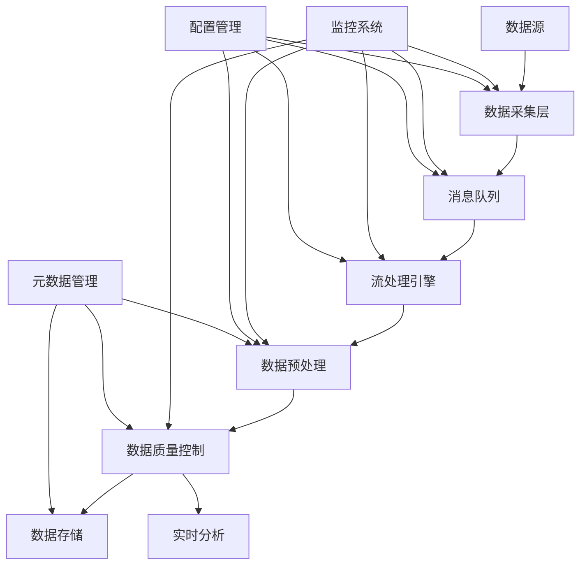
```mermaid
graph TD
    A[数据源] --> B[数据采集层]
    B --> C[消息队列]
    C --> D[流处理引擎]
    D --> E[数据预处理]
    E --> F[数据质量控制]
    F --> G[数据存储]
    F --> H[实时分析]
    I[监控系统] --> B
    I --> C
    I --> D
    I --> E
    I --> F
    J[配置管理] --> B
    J --> C
    J --> D
    J --> E
    K[元数据管理] --> E
    K --> F
    K --> G
```

最佳实践 Tips：
1. 实现数据缓冲：在数据源和处理系统之间使用缓冲区，平滑数据流波动。
2. 采用数据压缩：在网络传输和存储时使用适当的压缩算法，减少资源消耗。
3. 实现增量处理：对于大规模数据，设计增量处理机制，避免全量重处理。
4. 使用数据采样：在高流量情况下，采用智能采样策略，保证处理效率和数据代表性。

注意事项：
- 处理数据倾斜：设计合适的分区策略，避免数据热点导致的处理不均衡。
- 考虑数据时效性：对于时间敏感的数据，确保处理的及时性和顺序性。
- 保障数据隐私：在数据采集和预处理阶段就实施必要的隐私保护措施。
- 处理不一致数据：设计鲁棒的处理逻辑，能够处理各种不一致和异常的数据格式。

拓展阅读：
1. "Streaming Systems" by Tyler Akidau, Slava Chernyak, and Reuven Lax
2. "Designing Data-Intensive Applications" by Martin Kleppmann
3. "The Data Engineering Cookbook" by Andreas Kretz

### 3.2.2 特征工程与数据转换

特征工程与数据转换是 AI Native 应用中至关重要的环节，它直接影响模型的性能和效果。这个过程涉及从原始数据中提取、创建和选择最相关的特征，以及将数据转换成适合机器学习算法的格式。有效的特征工程可以显著提高模型的准确性和泛化能力。

1. 特征提取
    - 数值特征：统计量（均值、方差、分位数等）、时间序列特征（趋势、周期性等）
    - 文本特征：TF-IDF、词嵌入（Word2Vec、BERT等）、主题模型（LDA）
    - 图像特征：颜色直方图、纹理特征、深度学习特征（CNN提取）
    - 音频特征：MFCC、频谱特征、韵律特征

2. 特征变换
    - 标准化：Z-score标准化、Min-Max缩放
    - 正则化：L1正则化、L2正则化
    - 对数变换：处理偏斜分布
    - 多项式变换：捕捉非线性关系
    - 离散化：将连续变量转换为分类变量

3. 特征选择
    - 过滤方法：相关性分析、方差阈值、信息增益
    - 包装方法：递归特征消除、前向特征选择
    - 嵌入方法：Lasso、Ridge回归、决策树
    - 主成分分析（PCA）：降维和特征提取

4. 特征编码
    - One-Hot编码：处理分类变量
    - 标签编码：序数变量编码
    - 频率编码：基于类别频率的编码
    - 目标编码：基于目标变量的编码

5. 时间相关特征
    - 时间窗口特征：滑动窗口统计
    - 滞后特征：使用历史数据点作为特征
    - 周期性特征：提取日、周、月等周期性模式
    - 趋势特征：长期趋势提取

6. 交互特征
    - 特征组合：多个特征的乘积或和
    - 群体统计特征：基于群体的聚合统计
    - 域知识特征：基于专家知识创建的特征

7. 自动特征工程
    - 特征学习：使用深度学习自动学习特征表示
    - 自动特征生成：如 AutoFeat、Featuretools 等工具
    - 元学习：学习特征工程策略

特征工程与数据转换的核心实现可以用以下伪代码表示：

```python
import pandas as pd
import numpy as np
from sklearn.preprocessing import StandardScaler, OneHotEncoder
from sklearn.feature_selection import SelectKBest, f_classif
from sklearn.decomposition import PCA
from sklearn.pipeline import Pipeline

class FeatureEngineer:
    def __init__(self):
        self.numeric_features = []
        self.categorical_features = []
        self.text_features = []
        self.target = None

    def fit_transform(self, df, target):
        self.target = target
        self.numeric_features = df.select_dtypes(include=[np.number]).columns.tolist()
        self.categorical_features = df.select_dtypes(include=['object']).columns.tolist()
        
        numeric_transformer = Pipeline(steps=[
            ('scaler', StandardScaler()),
            ('selector', SelectKBest(f_classif, k=10))
        ])
        
        categorical_transformer = Pipeline(steps=[
            ('onehot', OneHotEncoder(handle_unknown='ignore')),
            ('selector', SelectKBest(f_classif, k=10))
        ])
        
        preprocessor = ColumnTransformer(
            transformers=[
                ('num', numeric_transformer, self.numeric_features),
                ('cat', categorical_transformer, self.categorical_features)
            ])
        
        final_transformer = Pipeline(steps=[
            ('preprocessor', preprocessor),
            ('pca', PCA(n_components=0.95))
        ])
        
        return final_transformer.fit_transform(df, df[target])

    def create_time_features(self, df, date_column):
        df['dayofweek'] = df[date_column].dt.dayofweek
        df['month'] = df[date_column].dt.month
        df['year'] = df[date_column].dt.year
        df['is_weekend'] = df['dayofweek'].isin([5, 6]).astype(int)
        return df

    def create_lag_features(self, df, column, lags):
        for lag in lags:
            df[f'{column}_lag_{lag}'] = df[column].shift(lag)
        return df

    def create_window_features(self, df, column, windows):
        for window in windows:
            df[f'{column}_rolling_mean_{window}'] = df[column].rolling(window=window).mean()
            df[f'{column}_rolling_std_{window}'] = df[column].rolling(window=window).std()
        return df

    def create_interaction_features(self, df, features):
        for i in range(len(features)):
            for j in range(i+1, len(features)):
                df[f'{features[i]}_{features[j]}_interaction'] = df[features[i]] * df[features[j]]
        return df

# 使用示例
engineer = FeatureEngineer()

def process_data(df, target):
    df = engineer.create_time_features(df, 'date_column')
    df = engineer.create_lag_features(df, 'value_column', [1, 7, 30])
    df = engineer.create_window_features(df, 'value_column', [7, 30, 90])
    df = engineer.create_interaction_features(df, ['feature1', 'feature2', 'feature3'])
    
    X = engineer.fit_transform(df.drop(columns=[target]), target)
    y = df[target]
    
    return X, y

# 假设 df 是我们的输入数据框
X, y = process_data(df, 'target_column')
```

在实现特征工程与数据转换时，需要考虑以下数学模型和原理：

1. 标准化（Z-score）：
   对于特征 x，其标准化后的值 z：

   $$z = \frac{x - \mu}{\sigma}$$

   其中 μ 是均值，σ 是标准差。

2. 主成分分析（PCA）：
   给定协方差矩阵 Σ，求解特征方程：

   $$\Sigma v = \lambda v$$

   其中 λ 是特征值，v 是对应的特征向量。

3. 信息增益：
   对于特征 A 和类别 C，信息增益定义为：

   $$IG(A,C) = H(C) - H(C|A)$$

   其中 H(C) 是类别的熵，H(C|A) 是给定特征 A 后类别的条件熵。

4. TF-IDF：
   对于词 t 在文档 d 中的 TF-IDF 值：

   $$TF\text{-}IDF(t,d,D) = TF(t,d) \cdot IDF(t,D)$$

   其中 TF(t,d) 是词频，IDF(t,D) 是逆文档频率。

特征工程与数据转换的系统设计图如下：

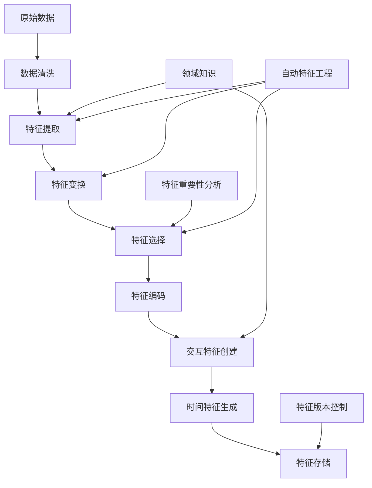
```mermaid
graph TD
    A[原始数据] --> B[数据清洗]
    B --> C[特征提取]
    C --> D[特征变换]
    D --> E[特征选择]
    E --> F[特征编码]
    F --> G[交互特征创建]
    G --> H[时间特征生成]
    H --> I[特征存储]
    J[特征重要性分析] --> E
    K[领域知识] --> C
    K --> G
    L[自动特征工程] --> C
    L --> D
    L --> E
    M[特征版本控制] --> I
```

最佳实践 Tips：
1. 使用特征存储：集中管理和版本控制特征定义，确保训练和推理的一致性。
2. 实现特征监控：持续监控特征的分布和重要性，及时发现数据漂移。
3. 采用增量特征计算：对于大规模数据，设计增量计算机制，提高效率。
4. 平衡特征数量和模型复杂度：避免过度特征工程导致的过拟合。

注意事项：
- 处理缺失值：在特征工程过程中妥善处理缺失值，避免引入偏差。
- 考虑特征的可解释性：在创建复杂特征时，保持其可解释性，有助于模型理解和调试。
- 注意特征泄露：确保不会使用未来信息创建特征，特别是在时间序列问题中。
- 评估特征稳定性：考虑特征在不同数据集和时间段的稳定性，避免过度拟合特定数据集。

拓展阅读：
1. "Feature Engineering for Machine Learning" by Alice Zheng and Amanda Casari
2. "Automated Machine Learning" by Frank Hutter, Lars Kotthoff, and Joaquin Vanschoren
3. "Deep Feature Synthesis: Towards Automating Data Science Endeavors" by James Max Kanter and Kalyan Veeramachaneni

### 3.2.3 数据质量监控与异常检测

数据质量监控与异常检测是 AI Native 应用中确保模型性能和可靠性的关键环节。高质量的数据是构建有效 AI 模型的基础，而及时检测和处理数据异常可以防止模型性能下降和错误决策。设计一个强大的数据质量监控和异常检测系统需要综合考虑数据特征、业务逻辑和统计方法。

1. 数据质量维度
    - 完整性：检查缺失值、空值比例
    - 准确性：数据值是否在合理范围内
    - 一致性：跨不同数据源的数据是否一致
    - 及时性：数据是否及时更新
    - 唯一性：检查重复数据
    - 有效性：数据是否符合预定义的格式和规则

2. 数据质量规则定义
    - 业务规则：基于领域知识定义的规则
    - 统计规则：基于数据分布的统计特性
    - 关系规则：检查数据之间的关系和依赖
    - 时间序列规则：检查数据的时间相关特性

3. 异常检测方法
    - 统计方法：Z-score、IQR（四分位距）、DBSCAN
    - 机器学习方法：孤立森林、One-Class SVM、自编码器
    - 时间序列方法：移动平均、指数平滑、ARIMA
    - 集成方法：结合多种异常检测算法

4. 实时监控
    - 流处理：使用流处理框架进行实时数据质量检查
    - 阈值告警：设置关键指标的告警阈值
    - 趋势分析：监控数据质量指标的变化趋势
    - 实时仪表板：可视化展示数据质量状况

5. 根因分析
    - 数据溯源：追踪异常数据的来源
    - 相关性分析：识别与异常相关的因素
    - 决策树分析：构建解释异常的决策树模型
    - 专家系统：结合领域知识进行根因推断

6. 自动化修复
    - 数据清洗：自动纠正常见的数据错误
    - 缺失值填充：使用高级插补方法填充缺失数据
    - 异常值处理：自动识别和处理异常值
    - 数据转换：自动进行必要的数据转换和标准化

7. 报告和反馈
    - 定期报告：生成数据质量报告
    - 告警机制：及时通知相关人员数据质量问题
    - 反馈循环：将发现的问题反馈给数据源和数据处理流程
    - 持续改进：基于历史数据不断优化监控和检测策略

数据质量监控与异常检测的核心实现可以用以下伪代码表示：

```python
import pandas as pd
import numpy as np
from scipy import stats
from sklearn.ensemble import IsolationForest
from statsmodels.tsa.arima.model import ARIMA

class DataQualityMonitor:
    def __init__(self):
        self.rules = []
        self.anomaly_detectors = {}

    def add_rule(self, rule):
        self.rules.append(rule)

    def check_quality(self, df):
        results = {}
        for rule in self.rules:
            results[rule.__name__] = rule(df)
        return results

    def detect_anomalies(self, df, method='isolation_forest'):
        if method not in self.anomaly_detectors:
            if method == 'isolation_forest':
                self.anomaly_detectors[method] = IsolationForest(contamination=0.1)
            elif method == 'zscore':
                self.anomaly_detectors[method] = lambda x: np.abs(stats.zscore(x))
        
        return self.anomaly_detectors[method].fit_predict(df)

    def time_series_anomaly(self, series, method='arima'):
        model = ARIMA(series, order=(1,1,1))
        results = model.fit()
        residuals = series - results.fittedvalues
        threshold = 3 * np.std(residuals)
        return np.abs(residuals) > threshold

def completeness_check(df):
    return df.isnull().sum() / len(df)

def value_range_check(df, column, min_val, max_val):
    return ((df[column] >= min_val) & (df[column] <= max_val)).mean()

def consistency_check(df, column1, column2, condition):
    return condition(df[column1], df[column2]).mean()

class DataQualityPipeline:
    def __init__(self):
        self.monitor = DataQualityMonitor()
        self.setup_rules()

    def setup_rules(self):
        self.monitor.add_rule(completeness_check)
        self.monitor.add_rule(lambda df: value_range_check(df, 'age', 0, 120))
        self.monitor.add_rule(lambda df: consistency_check(df, 'start_date', 'end_date', lambda x, y: x <= y))

    def process(self, df):
        quality_results = self.monitor.check_quality(df)
        anomalies = self.monitor.detect_anomalies(df)
        time_anomalies = {col: self.monitor.time_series_anomaly(df[col]) for col in df.select_dtypes(include=[np.number]).columns}
        
        return quality_results, anomalies, time_anomalies

    def generate_report(self, quality_results, anomalies, time_anomalies):
        report = {
            "data_quality": quality_results,
            "anomalies_percentage": np.mean(anomalies == -1),
            "time_series_anomalies": {col: np.mean(anom) for col, anom in time_anomalies.items()}
        }
        return report

# 使用示例
pipeline = DataQualityPipeline()

def monitor_data_quality(df):
    quality_results, anomalies, time_anomalies = pipeline.process(df)
    report = pipeline.generate_report(quality_results, anomalies, time_anomalies)
    
    if report["anomalies_percentage"] > 0.05 or any(v > 0.01 for v in report["time_series_anomalies"].values()):
        send_alert("High anomaly rate detected in the data")
    
    return report

# 假设 df 是我们要监控的数据框
report = monitor_data_quality(df)
print(report)
```

在实现数据质量监控与异常检测时，需要考虑以下数学模型和原理：

1. Z-score 异常检测：
   对于数据点 x，其 Z-score 定义为：

   $$Z = \frac{x - \mu}{\sigma}$$

   其中 μ 是均值，σ 是标准差。通常 |Z| > 3 被认为是异常。

2. 隔离森林（Isolation Forest）：
   对于数据点 x，其异常分数定义为：

   $$s(x, n) = 2^{-\frac{E(h(x))}{c(n)}}$$

   其中 E(h(x)) 是 x 的平均路径长度，c(n) 是数据集大小为 n 时的平均路径长度。

3. ARIMA 模型：
   ARIMA(p,d,q) 模型定义为：

   $$\phi(B)(1-B)^d X_t = \theta(B)\varepsilon_t$$

   其中 B 是滞后算子，φ(B) 是自回归多项式，θ(B) 是移动平均多项式。

4. 箱线图（IQR）方法：
   定义异常值为小于 Q1 - 1.5 * IQR 或大于 Q3 + 1.5 * IQR 的值，其中：

   $$IQR = Q3 - Q1$$

   Q1 和 Q3 分别是第一和第三四分位数。

数据质量监控与异常检测的系统设计图如下：

```mermaid
graph TD
    A[数据源] --> B[数据采集]
    B --> C[数据质量检查]
    C --> D[异常检测]
    D --> E[报告生成]
    E --> F[告警系统]
    E --> G[可视化仪表板]
    H[规则管理] --> C
    I[模型管理] --> D
    J[历史数据] --> K[趋势分析]
    K --> D
    L[人工反馈] --> M[规则优化]
    M --> H
    N[根因分析] --> O[自动修复]
    O --> B
```

最佳实践 Tips：
1. 实现多层次监控：从原始数据到特征再到模型输出，实施全方位的质量监控。
2. 使用ensemble方法：结合多种异常检测算法，提高检测的准确性和鲁棒性。
3. 实现自适应阈值：根据历史数据动态调整异常检测的阈值。
4. 构建知识图谱：利用领域知识构建数据质量规则的知识图谱，辅助根因分析。

注意事项：
- 考虑数据的时效性：某些数据质量问题可能随时间变化，需要定期更新监控策略。
- 平衡灵敏度和特异性：调整异常检测的阈值，平衡误报和漏报。
- 处理高维数据：在高维空间中，传统的异常检测方法可能失效，考虑使用降维技术。
- 考虑隐私问题：在进行数据质量检查时，确保不会泄露敏感信息。

拓展阅读：
1. "Outlier Analysis" by Charu C. Aggarwal
2. "Anomaly Detection: A Survey" by Varun Chandola, Arindam Banerjee, and Vipin Kumar
3. "Data Quality: The Field Guide" by Thomas C. Redman

## 3.3 推理引擎

### 3.3.1 实时推理服务设计

实时推理服务是 AI Native 应用的核心组件之一，它需要在极短的时间内对输入数据进行处理并返回预测结果。设计一个高效、可靠的实时推理服务需要考虑性能、可扩展性、容错性等多个方面。

1. 服务架构
    - 微服务架构：将推理服务拆分为独立的微服务
    - 无服务器架构：使用 AWS Lambda 或 Google Cloud Functions 等无服务器平台
    - 容器化部署：使用 Docker 和 Kubernetes 实现容器化和编排

2. 模型服务化
    - RESTful API：提供 HTTP 接口for简单集成
    - gRPC：使用 Protocol Buffers 实现高效的二进制通信
    - WebSocket：支持双向实时通信
    - 消息队列：使用 Kafka 或 RabbitMQ 实现异步推理

3. 模型优化
    - 模型量化：将浮点模型转换为整数模型，减少计算量
    - 模型剪枝：移除不重要的神经元或连接
    - 知识蒸馏：将大模型的知识迁移到小模型
    - 模型编译：使用 TensorRT 或 ONNX Runtime 优化模型执行

4. 缓存策略
    - 结果缓存：缓存常见查询的推理结果
    - 特征缓存：缓存中间特征，加速推理过程
    - 分布式缓存：使用 Redis 等分布式缓存系统
    - 缓存预热：预先计算并缓存热门请求的结果

5. 负载均衡
    - 轮询：简单的请求分发策略
    - 最少连接：将请求发送到连接数最少的服务器
    - 一致性哈希：确保相似请求发送到同一服务器
    - 动态加权：根据服务器性能动态调整权重

6. 并行处理
    - 数据并行：同时处理多个请求
    - 模型并行：将大模型分割到多个设备上
    - 流水线并行：将推理过程分为多个阶段并行执行

7. 监控和日志
    - 性能指标：监控延迟、吞吐量、资源利用率
    - 健康检查：定期检查服务的可用性
    - 分布式追踪：使用 Jaeger 或 Zipkin 跟踪请求流程
    - 集中式日志：使用 ELK 栈收集和分析日志

8. 错误处理和容错
    - 重试机制：自动重试失败的请求
    - 熔断器：防止级联故障
    - 降级策略：在高负载时返回缓存结果或默认响应
    - 多版本部署：支持蓝绿部署和金丝雀发布

实时推理服务设计的核心实现可以用以下伪代码表示：

```python
from fastapi import FastAPI, HTTPException
from pydantic import BaseModel
import joblib
import redis
import time
from concurrent.futures import ThreadPoolExecutor

app = FastAPI()
model = joblib.load('model.pkl')
redis_client = redis.Redis(host='localhost', port=6379, db=0)
executor = ThreadPoolExecutor(max_workers=10)

class PredictionRequest(BaseModel):
    features: List[float]

class PredictionResponse(BaseModel):
    prediction: float
    latency: float

@app.post("/predict", response_model=PredictionResponse)
async def predict(request: PredictionRequest):
    start_time = time.time()
    
    # 检查缓存
    cache_key = str(request.features)
    cached_result = redis_client.get(cache_key)
    if cached_result:
        prediction = float(cached_result)
    else:
        # 并行处理
        future = executor.submit(model.predict, [request.features])
        prediction = future.result()[0]
        
        # 更新缓存
        redis_client.setex(cache_key, 3600, str(prediction))  # 缓存1小时
    
    latency = time.time() - start_time
    return PredictionResponse(prediction=prediction, latency=latency)

@app.get("/health")
async def health_check():
    return {"status": "healthy"}

if __name__ == "__main__":
    import uvicorn
    uvicorn.run(app, host="0.0.0.0", port=8000)
```

在实现实时推理服务时，需要考虑以下数学模型和原理：

1. 负载均衡（加权轮询）：
   给定 n 个服务器，权重分别为 w₁, w₂, ..., wₙ，第 k 个请求应该被分配到的服务器索引 i 满足：

   $$i = \arg\min_j \left\{\sum_{m=1}^j w_m > (k \mod \sum_{m=1}^n w_m)\right\$$

2. 指数退避重试：
   第 n 次重试的等待时间 t：

   $$t = \min(cap, base * 2^n + random)$$

   其中 cap 是最大等待时间，base 是基础等待时间，random 是一个小的随机值。

3. 熔断器状态转换：
   使用马尔可夫链模型描述熔断器状态转换。状态转移矩阵 P：

   $$P = \begin{bmatrix}
   p_{CC} & p_{CO} & 0 \\
   0 & p_{OO} & p_{OH} \\
   p_{HC} & 0 & p_{HH}
   \end{bmatrix}$$

   其中 C 表示 Closed，O 表示 Open，H 表示 Half-Open。

4. 缓存命中率：
   缓存命中率 H 定义为：

   $$H = \frac{缓存命中次数}{总请求次数}$$

实时推理服务的系统设计图如下：

```mermaid
graph TD
    A[客户端] --> B[负载均衡器]
    B --> C[API网关]
    C --> D[推理服务1]
    C --> E[推理服务2]
    C --> F[推理服务n]
    D --> G[模型服务器]
    E --> G
    F --> G
    G --> H[模型存储]
    I[缓存] --> D
    I --> E
    I --> F
    J[监控系统] --> D
    J --> E
    J --> F
    K[日志系统] --> D
    K --> E
    K --> F
    L[配置中心] --> C
    L --> D
    L --> E
    L --> F
```

最佳实践 Tips：
1. 实现模型热加载：支持在不停机的情况下更新模型。
2. 使用异步编程：利用异步 IO 提高并发处理能力。
3. 实现请求批处理：将多个请求合并成一个批次，提高 GPU 利用率。
4. 采用边缘计算：将部分推理任务下放到边缘设备，减少网络延迟。

注意事项：
- 处理输入验证：确保输入数据的格式和范围符合预期，防止异常输入导致服务崩溃。
- 考虑版本兼容性：在更新模型或API时，确保向后兼容性。
- 实施安全措施：使用身份验证、授权和加密保护推理服务。
- 优化冷启动：对于无服务器架构，注意减少冷启动时间。

拓展阅读：
1. "Designing Machine Learning Systems" by Chip Huyen
2. "Building Machine Learning Powered Applications" by Emmanuel Ameisen
3. "Kubeflow for Machine Learning" by Holden Karau, Trevor Grant, Ilan Filonenko, Richard Liu, and Boris Lublinsky

### 3.3.2 批量推理处理

批量推理处理是 AI Native 应用中处理大规模数据的重要组成部分。相比实时推理，批量推理通常处理更大量的数据，对延迟要求较低，但对吞吐量和资源利用率有更高要求。设计高效的批量推理系统需要考虑数据处理、计算优化和资源管理等多个方面。

1. 数据处理
    - 数据分片：将大规模数据集分割成多个小批次
    - 数据流水线：构建高效的数据加载和预处理流水线
    - 数据格式优化：使用列式存储格式如 Parquet 或 ORC
    - 数据压缩：在存储和传输过程中使用适当的压缩算法

2. 计算优化
    - 批处理大小优化：根据硬件资源调整最佳批处理大小
    - 模型量化：使用低精度表示（如int8）减少计算和内存需求
    - 计算图优化：使用TensorRT等工具优化深度学习模型的计算图
    - 并行计算：利用多核CPU或多GPU并行处理

3. 分布式处理
    - 数据并行：在多个节点上并行处理不同的数据分片
    - 模型并行：将大模型分割到多个设备上
    - 参数服务器：集中管理模型参数，支持分布式更新
    - 任务调度：使用如Airflow的工作流管理工具调度批处理任务

4. 资源管理
    - 动态资源分配：根据工作负载动态调整计算资源
    - 资源隔离：使用容器技术隔离不同的批处理任务
    - 资源预留：为关键任务预留必要的计算资源
    - 成本优化：利用spot实例或预留实例降低计算成本

5. 错误处理和恢复
    - 检查点机制：定期保存处理状态，支持从故障中恢复
    - 失败重试：自动重试失败的任务或数据分片
    - 部分结果处理：允许部分失败，只处理成功的结果
    - 数据一致性检查：确保处理结果的一致性和完整性

6. 监控和日志
    - 进度跟踪：实时监控批处理任务的进度
    - 资源使用监控：跟踪CPU、内存、磁盘IO等资源使用情况
    - 性能分析：识别和优化批处理过程中的瓶颈
    - 结果验证：自动验证批处理结果的正确性

7. 结果存储和分发
    - 结果压缩：压缩存储批处理结果，节省存储空间
    - 增量更新：支持增量处理和结果更新
    - 结果缓存：缓存常用的批处理结果，加速后续查询
    - 结果分发：将处理结果高效分发给下游系统

批量推理处理的核心实现可以用以下伪代码表示：

```python
import pandas as pd
import numpy as np
from sklearn.model_selection import train_test_split
from tensorflow.keras.models import load_model
from concurrent.futures import ProcessPoolExecutor
import multiprocessing

class BatchInferenceProcessor:
    def __init__(self, model_path, batch_size=1000):
        self.model = load_model(model_path)
        self.batch_size = batch_size

    def load_data(self, data_path):
        return pd.read_parquet(data_path)

    def preprocess(self, df):
        # 实现数据预处理逻辑
        return df

    def split_data(self, df):
        return np.array_split(df, len(df) // self.batch_size + 1)

    def process_batch(self, batch):
        X = self.preprocess(batch)
        return self.model.predict(X)

    def run_inference(self, data_path):
        df = self.load_data(data_path)
        batches = self.split_data(df)
        
        with ProcessPoolExecutor(max_workers=multiprocessing.cpu_count()) as executor:
            results = list(executor.map(self.process_batch, batches))
        
        return np.concatenate(results)

    def save_results(self, results, output_path):
        np.save(output_path, results)

def main():
    processor = BatchInferenceProcessor('model.h5', batch_size=5000)
    results = processor.run_inference('large_dataset.parquet')
    processor.save_results(results, 'inference_results.npy')

if __name__ == "__main__":
    main()
```

在实现批量推理处理时，需要考虑以下数学模型和原理：

1. 批处理大小优化：
   给定总数据量 N，单次处理时间 t(b)，其中 b 是批大小，总处理时间 T 可表示为：

   $$T(b) = \frac{N}{b} \cdot t(b)$$

   目标是找到使 T(b) 最小的 b 值。

2. 资源利用率：
   对于 n 个资源，资源利用率 U 定义为：

   $$U = \frac{1}{n} \sum_{i=1}^n \frac{\text{使用的资源}_i}{\text{总资源}_i}$$

3. Amdahl's Law（并行加速比）：
   给定程序中可并行化的部分比例 p，使用 n 个处理器的加速比 S(n)：

   $$S(n) = \frac{1}{(1-p) + \frac{p}{n}}$$

4. 数据分片策略（条带化）：
   对于 m 个数据项和 n 个处理节点，第 i 个数据项分配给的节点索引 j：

   $$j = i \mod n$$

批量推理处理的系统设计图如下：

```mermaid
graph TD
    A[数据源] --> B[数据加载]
    B --> C[数据预处理]
    C --> D[数据分片]
    D --> E[批处理引擎]
    E --> F[模型服务器1]
    E --> G[模型服务器2]
    E --> H[模型服务器n]
    F --> I[结果聚合]
    G --> I
    H --> I
    I --> J[结果存储]
    K[资源管理器] --> E
    L[任务调度器] --> E
    M[监控系统] --> E
    M --> F
    M --> G
    M --> H
    N[错误处理] --> E
```

最佳实践 Tips：
1. 实现动态批处理大小：根据系统负载和资源可用性动态调整批处理大小。
2. 使用内存映射文件：处理超大数据集时，使用内存映射文件减少内存使用。
3. 实现预取机制：在处理当前批次时预取下一批次的数据，减少 I/O 等待时间。
4. 采用混合精度计算：在保证精度的前提下，使用低精度计算加速推理过程。

注意事项：
- 处理数据倾斜：设计合适的数据分片策略，避免某些节点负载过重。
- 考虑数据局部性：尽可能将相关数据分配到同一节点，减少网络传输。
- 实施错误隔离：确保单个任务的失败不会影响整个批处理作业。
- 优化I/O操作：使用异步I/O和批量写入等技术减少I/O开销。

拓展阅读：
1. "High Performance Spark" by Holden Karau and Rachel Warren
2. "Designing Data-Intensive Applications" by Martin Kleppmann
3. "Streaming Systems" by Tyler Akidau, Slava Chernyak, and Reuven Lax

### 3.3.3 推理结果缓存与更新策略

推理结果缓存与更新策略是优化 AI Native 应用性能和响应时间的关键技术。通过缓存常用的推理结果，可以显著减少计算开销和响应延迟。然而，有效的缓存策略需要平衡缓存的新鲜度和系统资源的使用。设计一个高效的推理结果缓存和更新机制需要考虑缓存策略、更新机制、一致性保证等多个方面。

1. 缓存策略
    - LRU (Least Recently Used)：淘汰最久未使用的项
    - LFU (Least Frequently Used)：淘汰使用频率最低的项
    - FIFO (First In First Out)：先进先出策略
    - ARC (Adaptive Replacement Cache)：自适应调整 LRU 和 LFU 的比例
    - 时间衰减策略：根据项目的年龄动态调整其权重

2. 缓存粒度
    - 全结果缓存：缓存完整的推理结果
    - 部分结果缓存：只缓存关键或计算密集的中间结果
    - 特征缓存：缓存计算成本高的特征
    - 多级缓存：结合不同粒度的缓存策略

3. 缓存更新机制
    - 定时更新：按固定时间间隔更新缓存
    - 事件驱动更新：基于特定事件（如模型更新）触发缓存更新
    - 惰性更新：在访问时检查并更新过期的缓存项
    - 批量更新：积累一定量的更新后批量处理
    - 增量更新：只更新发生变化的部分

4. 一致性保证
    - 强一致性：确保所有访问都能看到最新的结果
    - 最终一致性：允许短暂的不一致，但最终会收敛到一致状态
    - 因果一致性：保证相关操作的顺序一致性
    - 会话一致性：在同一会话内保证一致性

5. 缓存预热
    - 启动预热：系统启动时预先加载热点数据
    - 智能预热：基于历史访问模式预测并预热可能需要的数据
    - 渐进式预热：逐步加载缓存，避免系统负载突增

6. 缓存失效
    - 基于时间的失效：设置缓存项的过期时间
    - 基于版本的失效：当数据源或模型版本变化时使缓存失效
    - 手动失效：提供 API 允许手动使特定缓存项失效
    - 级联失效：相关缓存项的连锁失效

7. 分布式缓存
    - 一致性哈希：实现缓存项的均匀分布和动态扩展
    - 副本策略：设置多个缓存副本提高可用性和读取性能
    - 跨数据中心同步：管理地理分布的缓存一致性

8. 监控和优化
    - 命中率监控：跟踪缓存的效率
    - 内存使用监控：避免缓存过度消耗内存
    - 访问模式分析：识别热点数据和优化缓存策略
    - 自动调优：根据实时性能指标动态调整缓存参数

推理结果缓存与更新策略的核心实现可以用以下伪代码表示：

```python
import time
import threading
from collections import OrderedDict
from concurrent.futures import ThreadPoolExecutor

class CacheItem:
    def __init__(self, value, expire_time):
        self.value = value
        self.expire_time = expire_time

class LRUCache:
    def __init__(self, capacity, default_ttl=3600):
        self.capacity = capacity
        self.default_ttl = default_ttl
        self.cache = OrderedDict()
        self.lock = threading.Lock()

    def get(self, key):
        with self.lock:
            if key not in self.cache:
                return None
            item = self.cache[key]
            if time.time() > item.expire_time:
                del self.cache[key]
                return None
            self.cache.move_to_end(key)
            return item.value

    def put(self, key, value, ttl=None):
        with self.lock:
            if ttl is None:
                ttl = self.default_ttl
            expire_time = time.time() + ttl
            if key in self.cache:
                self.cache.move_to_end(key)
            elif len(self.cache) >= self.capacity:
                self.cache.popitem(last=False)
            self.cache[key] = CacheItem(value, expire_time)

class InferenceCache:
    def __init__(self, model, cache_capacity=1000, update_interval=3600):
        self.model = model
        self.cache = LRUCache(cache_capacity)
        self.update_interval = update_interval
        self.executor = ThreadPoolExecutor(max_workers=5)
        self.start_update_thread()

    def infer(self, input_data):
        cache_key = self.generate_cache_key(input_data)
        result = self.cache.get(cache_key)
        if result is not None:
            return result
        
        result = self.model.predict(input_data)
        self.cache.put(cache_key, result)
        return result

    def generate_cache_key(self, input_data):
        # 实现缓存键生成逻辑
        return hash(str(input_data))

    def start_update_thread(self):
        self.executor.submit(self.update_cache_periodically)

    def update_cache_periodically(self):
        while True:
            time.sleep(self.update_interval)
            self.update_all_cache_items()

    def update_all_cache_items(self):
        for key, item in list(self.cache.cache.items()):
            input_data = self.recover_input_from_key(key)
            new_result = self.model.predict(input_data)
            self.cache.put(key, new_result)

    def recover_input_from_key(self, key):
        # 实现从缓存键恢复输入数据的逻辑
        pass

    def invalidate_cache(self, key=None):
        if key is None:
            self.cache.cache.clear()
        else:
            self.cache.cache.pop(key, None)

# 使用示例
class DummyModel:
    def predict(self, input_data):
        return sum(input_data)

model = DummyModel()
cache = InferenceCache(model, cache_capacity=100, update_interval=1800)

def process_request(input_data):
    result = cache.infer(input_data)
    return result

# 模拟请求
print(process_request([1, 2, 3]))  # 首次计算
print(process_request([1, 2, 3]))  # 从缓存获取
cache.invalidate_cache()  # 手动使缓存失效
print(process_request([1, 2, 3]))  # 重新计算
```

在实现推理结果缓存与更新策略时，需要考虑以下数学模型和原理：

1. 缓存命中率：
   缓存命中率 H 定义为：

   $$H = \frac{缓存命中次数}{总请求次数}$$

2. LRU 缓存的命中率近似：
   对于容量为 k 的 LRU 缓存，第 i 个最常访问项的命中概率 p_i 近似为：

   $$p_i \approx \frac{1}{\sum_{j=1}^k \frac{1}{j}}$$

3. 缓存更新频率与数据新鲜度的权衡：
   假设数据变化率为 λ，缓存更新间隔为 T，则数据平均新鲜度 F 为：

   $$F = \frac{1}{T} \int_0^T e^{-\lambda t} dt = \frac{1 - e^{-\lambda T}}{\lambda T}$$

4. 一致性哈希：
   使用一致性哈希算法分配缓存项。给定哈希函数 h，节点集合 N，数据项 x 被分配到的节点 n：

   $$n = \arg\min_{n_i \in N} \{(h(x) - h(n_i)) \mod 2^{32}\}$$

推理结果缓存与更新策略的系统设计图如下：

```mermaid
graph TD
    A[客户端请求] --> B[负载均衡器]
    B --> C[API网关]
    C --> D[缓存层]
    D --> E[推理服务]
    E --> F[模型服务器]
    G[缓存更新器] --> D
    H[监控系统] --> D
    H --> E
    H --> F
    I[配置管理] --> D
    I --> E
    I --> G
    J[数据源] --> G
    K[缓存预热器] --> D
```

最佳实践 Tips：
1. 实现多级缓存：结合内存缓存、分布式缓存和CDN，优化不同场景下的访问速度。
2. 使用布隆过滤器：快速判断某个结果是否可能在缓存中，减少不必要的缓存查询。
3. 实现缓存预测：使用机器学习模型预测哪些数据最可能被访问，提前缓存。
4. 采用写时复制（Copy-on-Write）：在更新大型缓存项时，避免阻塞读操作。

注意事项：
- 考虑缓存穿透：对不存在的数据也进行缓存，防止大量无效请求穿透到后端。
- 处理缓存雪崩：为缓存项设置随机过期时间，避免同时大量缓存失效。
- 保证缓存一致性：在更新底层数据时，确保缓存数据的一致性更新。
- 监控缓存效率：持续监控缓存命中率和使用情况，及时调整缓存策略。

拓展阅读：
1. "Caching at Scale with Redis" by Salvatore Sanfilippo
2. "Designing Distributed Systems" by Brendan Burns
3. "Database Internals" by Alex Petrov (Chapter on Caching Strategies)

## 3.4 知识库与上下文管理

### 3.4.1 知识图谱的构建与应用

知识图谱是 AI Native 应用中表示和管理复杂知识的强大工具。它通过实体、关系和属性的网络结构来组织和表示知识，为智能系统提供丰富的语义信息和推理能力。构建和应用知识图谱可以显著提升 AI 系统的理解能力、推理能力和解释能力。

1. 知识获取
    - 结构化数据导入：从数据库、API等源导入已结构化的数据
    - 非结构化文本处理：使用NLP技术从文本中提取实体和关系
    - 半自动标注：结合人工和机器学习方法进行知识标注
    - 众包采集：利用群众智慧收集和验证知识

2. 实体识别与链接
    - 命名实体识别（NER）：识别文本中的实体mention
    - 实体消歧：解决实体指代的歧义问题
    - 实体链接：将识别的实体与知识库中的实体对应
    - 新实体发现：识别和处理知识库中不存在的新实体

3. 关系抽取
    - 基于模式的方法：使用预定义的语言模式抽取关系
    - 监督学习方法：使用标注数据训练关系抽取模型
    - 远程监督：利用已知知识自动标注训练数据
    - 开放域关系抽取：抽取预先未定义的关系类型

4. 知识表示
    - RDF（资源描述框架）：使用主谓宾三元组表示知识
    - OWL（Web本体语言）：定义复杂的本体和推理规则
    - 向量表示：学习实体和关系的低维向量表示
    - 属性图模型：使用图数据库存储和查询知识

5. 知识融合
    - 实体对齐：识别和合并来自不同源的相同实体
    - 关系对齐：统一不同来源的关系表示
    - 冲突解决：处理来自不同源的矛盾信息
    - 知识补全：利用已有知识推断缺失的信息

6. 知识推理
    - 基于规则的推理：使用预定义规则进行逻辑推理
    - 统计关联推理：基于统计模型发现隐含关系
    - 嵌入式推理：在向量空间中进行知识推理
    - 多跳推理：通过多步关系路径进行复杂推理

7. 知识图谱应用
    - 智能问答：支持复杂的知识问答系统
    - 推荐系统：利用知识图谱提供解释性推荐
    - 信息检索：增强搜索引擎的语义理解能力
    - 决策支持：为决策过程提供结构化知识支持

8. 知识图谱更新与维护
    - 增量更新：持续集成新知识到现有图谱
    - 版本控制：管理知识图谱的不同版本
    - 质量评估：持续评估和改进知识的质量
    - 知识演化：跟踪和管理知识的时间演变

知识图谱的构建与应用的核心实现可以用以下伪代码表示：

```python
from rdflib import Graph, Literal, BNode, Namespace, RDF, URIRef
from rdflib.namespace import FOAF, XSD
import spacy

class KnowledgeGraph:
    def __init__(self):
        self.g = Graph()
        self.nlp = spacy.load("en_core_web_sm")
        self.ns = Namespace("http://example.org/")

    def add_entity(self, entity_name, entity_type):
        entity = self.ns[entity_name.replace(" ", "_")]
        self.g.add((entity, RDF.type, self.ns[entity_type]))
        return entity

    def add_relation(self, subject, predicate, obj):
        self.g.add((subject, self.ns[predicate], obj))

    def extract_entities(self, text):
        doc = self.nlp(text)
        entities = []
        for ent in doc.ents:
            entity = self.add_entity(ent.text, ent.label_)
            entities.append((entity, ent.text, ent.label_))
        return entities

    def extract_relations(self, text):
        doc = self.nlp(text)
        relations = []
        for token in doc:
            if token.dep_ == "nsubj" and token.head.pos_ == "VERB":
                subject = token.text
                predicate = token.head.text
                for child in token.head.children:
                    if child.dep_ == "dobj":
                        obj = child.text
                        relations.append((subject, predicate, obj))
        return relations

    def process_text(self, text):
        entities = self.extract_entities(text)
        relations = self.extract_relations(text)
        for subject, predicate, obj in relations:
            subj_entity = next((e for e in entities if e[1] == subject), None)
            obj_entity = next((e for e in entities if e[1] == obj), None)
            if subj_entity and obj_entity:
                self.add_relation(subj_entity[0], predicate, obj_entity[0])

    def query(self, sparql_query):
        return self.g.query(sparql_query)

    def export_rdf(self, format='turtle'):
        return self.g.serialize(format=format)

# 使用示例
kg = KnowledgeGraph()
text = "Albert Einstein was a German-born theoretical physicist who developed the theory of relativity."
kg.process_text(text)

# 查询示例
query = """
SELECT ?subject ?predicate ?object
WHERE {
    ?subject ?predicate ?object .
}
"""
results = kg.query(query)
for row in results:
    print(f"{row.subject} {row.predicate} {row.object}")

# 导出RDF
print(kg.export_rdf())
```

在实现知识图谱的构建与应用时，需要考虑以下数学模型和原理：

1. 实体链接的相似度计算：
   使用余弦相似度计算实体向量表示的相似性：

   $$similarity(A, B) = \frac{A \cdot B}{\|A\| \|B\|}$$

   其中 A 和 B 是实体的向量表示。

2. TransE 知识图谱嵌入模型：
   对于三元组 (h, r, t)，TransE 模型定义的评分函数为：

   $$f_r(h, t) = -\|h + r - t\|$$

   其中 h, r, t 分别是头实体、关系和尾实体的向量表示。

3. 知识图谱补全的链接预测：
   使用逻辑回归模型预测链接存在的概率：

   $$P(y=1|h,r,t) = \sigma(w^T \phi(h,r,t))$$

   其中 φ(h,r,t) 是特征函数，w 是权重向量，σ 是 sigmoid 函数。

4. PageRank 算法用于实体重要性排序：
   实体 i 的 PageRank 值 PR(i) 定义为：

   $$PR(i) = \frac{1-d}{N} + d \sum_{j \in M(i)} \frac{PR(j)}{L(j)}$$

   其中 d 是阻尼因子，N 是总实体数，M(i) 是指向 i 的实体集合，L(j) 是 j 的出度。

知识图谱的构建与应用的系统设计图如下：

```mermaid
graph TD
    A[数据源] --> B[知识获取]
    B --> C[实体识别与链接]
    B --> D[关系抽取]
    C --> E[知识表示]
    D --> E
    E --> F[知识融合]
    F --> G[知识存储]
    G --> H[知识推理]
    G --> I[知识查询]
    J[应用层] --> I
    J --> H
    K[知识更新] --> G
    L[质量评估] --> G
    M[版本控制] --> G
```

最佳实践 Tips：
1. 使用本体设计：创建清晰的本体结构，确保知识的一致性和可扩展性。
2. 实现增量更新：设计支持增量更新的架构，以便高效地集成新知识。
3. 采用多模态知识表示：结合文本、图像等多种模态的知识，丰富知识图谱的表示。
4. 实现知识推理缓存：缓存常用的推理结果，提高查询效率。

注意事项：
- 处理知识不确定性：使用概率模型或置信度分数表示知识的不确定性。
- 考虑知识时效性：跟踪和更新随时间变化的知识。
- 保护隐私和安全：在知识图谱中实施适当的访问控制和数据脱敏措施。
- 处理大规模数据：设计能够处理海量实体和关系的存储和查询方案。

拓展阅读：
1. "Knowledge Graphs: Fundamentals, Techniques, and Applications" by Mayank Kejriwal, Craig A. Knoblock, and Pedro Szekely
2. "Neural Network Methods for Natural Language Processing" by Yoav Goldberg (Chapter on Knowledge Representation and Reasoning)
3. "Exploiting Semantic Technologies in Smart Applications and Services" by Payam Barnaghi and Amit Sheth

### 3.4.2 上下文信息的存储与检索

上下文信息的有效管理是 AI Native 应用实现个性化、智能化交互的关键。上下文信息包括用户历史行为、环境状态、对话历史等，能够帮助 AI 系统更好地理解和响应用户需求。设计一个高效的上下文信息存储与检索系统需要考虑数据模型、存储策略、检索算法和实时性等多个方面。

1. 上下文数据模型
    - 键值对模型：简单的 key-value 存储
    - 文档模型：使用 JSON 或 XML 存储结构化上下文
    - 图模型：使用图结构表示复杂的上下文关系
    - 时序模型：针对时间序列上下文数据的特殊存储

2. 存储策略
    - 内存存储：使用 Redis 等内存数据库存储短期上下文
    - 持久化存储：使用 MongoDB 等文档数据库存储长期上下文
    - 分布式存储：使用 Cassandra 等分布式数据库处理大规模上下文
    - 分层存储：结合内存和磁盘存储，平衡性能和容量

3. 索引技术
    - 倒排索引：快速检索文本上下文
    - 空间索引：处理地理位置相关的上下文
    - 时间索引：高效查询时间相关的上下文信息
    - 多维索引：支持复杂的多条件上下文查询

4. 检索算法
    - 精确匹配：基于关键字或 ID 的精确查询
    - 模糊匹配：使用编辑距离等算法进行近似匹配
    - 语义检索：基于向量表示的语义相似度检索
    - 推理检索：结合知识图谱进行上下文推理和检索

5. 实时性处理
    - 流处理：使用 Kafka Streams 等技术实时处理上下文流
    - 增量更新：支持上下文信息的实时更新和同步
    - 缓存策略：使用多级缓存提高频繁访问的上下文检索速度
    - 预测加载：基于用户行为预测可能需要的上下文并预加载

6. 上下文压缩与清理
    - 数据压缩：压缩存储不常用的历史上下文
    - 重要性排序：保留最相关和最重要的上下文信息
    - 过期策略：自动清理过期或不再相关的上下文
    - 采样存储：对长期上下文进行采样存储，减少存储压力

7. 隐私和安全
    - 数据加密：加密存储敏感的上下文信息
    - 访问控制：实施细粒度的上下文访问权限控制
    - 匿名化：在存储和处理过程中匿名化个人识别信息
    - 审计跟踪：记录上下文访问和使用的日志

8. 上下文融合与推理
    - 多源融合：整合来自不同源的上下文信息
    - 冲突解决：处理矛盾的上下文信息
    - 上下文推理：基于现有上下文推断隐含的信息
    - 不确定性处理：管理和表示上下文信息的不确定性

上下文信息的存储与检索的核心实现可以用以下伪代码表示：

```python
import redis
import json
from pymongo import MongoClient
from datetime import datetime, timedelta

class ContextManager:
    def __init__(self):
        self.redis_client = redis.Redis(host='localhost', port=6379, db=0)
        self.mongo_client = MongoClient('mongodb://localhost:27017/')
        self.db = self.mongo_client['context_db']
        self.short_term_context = self.db['short_term']
        self.long_term_context = self.db['long_term']

    def store_context(self, user_id, context_data, context_type='short_term'):
        if context_type == 'short_term':
            self.redis_client.setex(f"context:{user_id}", 3600, json.dumps(context_data))  # 1 hour expiry
        else:
            self.long_term_context.update_one(
                {'user_id': user_id},
                {'$push': {'context_history': context_data}},
                upsert=True
            )

    def retrieve_context(self, user_id, context_type='short_term'):
        if context_type == 'short_term':
            context = self.redis_client.get(f"context:{user_id}")
            return json.loads(context) if context else None
        else:
            return self.long_term_context.find_one({'user_id': user_id})

    def update_context(self, user_id, update_data, context_type='short_term'):
        if context_type == 'short_term':
            current_context = self.retrieve_context(user_id)
            if current_context:
                current_context.update(update_data)
                self.store_context(user_id, current_context)
        else:
            self.long_term_context.update_one(
                {'user_id': user_id},
                {'$set': update_data}
            )

    def clear_expired_context(self):
        cutoff = datetime.utcnow() - timedelta(days=30)  # Clear data older than 30 days
        self.long_term_context.delete_many({'timestamp': {'$lt': cutoff}})

    def search_context(self, query, context_type='long_term'):
        if context_type == 'long_term':
            return self.long_term_context.find(query)
        else:
            # Implement search in Redis (e.g., using Redis Search module)
            pass

# 使用示例
context_manager = ContextManager()

# 存储短期上下文
context_manager.store_context('user123', {'last_action': 'search', 'query': 'AI applications'})

# 检索短期上下文
short_term_context = context_manager.retrieve_context('user123')
print("Short-term context:", short_term_context)

# 存储长期上下文
context_manager.store_context('user123', {'purchase_history': ['book1', 'book2']}, 'long_term')

# 检索长期上下文
long_term_context = context_manager.retrieve_context('user123', 'long_term')
print("Long-term context:", long_term_context)

# 更新上下文
context_manager.update_context('user123', {'last_login': datetime.now().isoformat()}, 'long_term')

# 搜索上下文
search_results = context_manager.search_context({'purchase_history': 'book1'}, 'long_term')
for result in search_results:
    print("Search result:", result)

# 清理过期上下文
context_manager.clear_expired_context()
```

在实现上下文信息的存储与检索时，需要考虑以下数学模型和原理：

1. 上下文相似度计算：
   使用余弦相似度计算上下文向量的相似性：

   $$similarity(A, B) = \frac{A \cdot B}{\|A\| \|B\|}$$

   其中 A 和 B 是上下文的向量表示。

2. 时间衰减模型：
   使用指数衰减函数计算上下文的重要性：

   $$importance(t) = e^{-\lambda(t_{\text{current}} - t)}$$

   其中 λ 是衰减率，t 是上下文的时间戳。

3. LRU (Least Recently Used) 缓存替换策略：
   定义每个缓存项的优先级 P：

   $$P(i) = \frac{1}{t_{\text{current}} - t_{\text{last\_access}}(i)}$$

   其中 t_last_access(i) 是项 i 最后一次访问的时间。

4. TF-IDF 用于上下文关键词提取：
   词 t 在上下文 d 中的 TF-IDF 值：

   $$TF\text{-}IDF(t,d,D) = TF(t,d) \cdot IDF(t,D)$$

   其中 TF(t,d) 是词频，IDF(t,D) 是逆文档频率。

上下文信息的存储与检索的系统设计图如下：

```mermaid
graph TD
    A[用户交互] --> B[上下文管理器]
    B --> C[短期存储 Redis]
    B --> D[长期存储 MongoDB]
    E[上下文索引] --> C
    E --> D
    F[实时处理] --> B
    G[上下文清理] --> D
    H[隐私控制] --> B
    I[上下文融合] --> B
    J[检索服务] --> C
    J --> D
    K[缓存层] --> J
    L[预测模型] --> B
```

最佳实践 Tips：
1. 实现上下文分层：根据时效性和重要性将上下文分为不同层次，采用不同的存储和检索策略。
2. 使用向量化表示：将上下文信息转换为向量表示，支持高效的语义检索和相似度计算。
3. 实现增量更新：设计支持上下文信息增量更新的机制，减少全量更新的开销。
4. 采用异步处理：使用消息队列等技术异步处理上下文更新，提高系统响应性。

注意事项：
- 处理上下文冲突：设计机制解决来自不同源或时间点的矛盾上下文信息。
- 考虑可扩展性：设计能够处理大规模用户和海量上下文数据的架构。
- 优化存储效率：对长期存储的上下文信息进行压缩和优化，减少存储成本。
- 实现容错机制：设计故障恢复机制，确保上下文信息的可靠性和一致性。

拓展阅读：
1. "Designing Data-Intensive Applications" by Martin Kleppmann (Chapter on Data Models and Query Languages)
2. "Building Intelligent Systems: A Guide to Machine Learning Engineering" by Geoff Hulten (Chapter on Context Management)
3. "Streaming Systems: The What, Where, When, and How of Large-Scale Data Processing" by Tyler Akidau, Slava Chernyak, and Reuven Lax

### 3.4.3 动态知识更新机制

动态知识更新机制是 AI Native 应用保持知识库和上下文信息时效性和准确性的关键组件。它允许系统持续学习和适应新的信息，提高 AI 系统的智能性和适应性。设计一个有效的动态知识更新机制需要考虑数据源、更新策略、一致性维护和性能优化等多个方面。

1. 知识源管理
    - 外部数据源集成：定期从外部 API、数据库等获取更新
    - 用户反馈收集：整合用户提供的纠错和补充信息
    - 爬虫系统：自动爬取和提取网络上的最新信息
    - 传感器数据：实时接入 IoT 设备等传感器数据

2. 更新触发机制
    - 定时更新：按固定时间间隔执行更新
    - 事件驱动：基于特定事件（如用户交互）触发更新
    - 阈值触发：当变化量达到某个阈值时进行更新
    - 优先级更新：根据知识重要性决定更新顺序

3. 知识验证与冲突解决
    - 多源验证：交叉验证来自不同源的信息
    - 专家审核：重要更新经过领域专家审核
    - 众包验证：利用群体智慧验证知识更新
    - 冲突解决策略：设计算法解决矛盾的知识更新

4. 增量学习与知识整合
    - 增量模型更新：支持模型的在线学习和更新
    - 知识图谱扩展：动态添加新实体和关系
    - 规则库更新：自动更新和优化推理规则
    - 知识蒸馏：将新知识高效整合到现有模型

5. 版本控制与回滚
    - 知识快照：定期创建知识库的完整快照
    - 增量日志：记录每次更新的详细日志
    - 版本分支：支持知识库的多版本并行维护
    - 回滚机制：能够快速回退到之前的稳定版本

6. 实时性与一致性平衡
    - 最终一致性：允许短暂的不一致状态
    - 原子更新：确保相关知识的同步更新
    - 读写分离：优化并发读取和更新操作
    - 缓存同步：维护缓存与持久存储的一致性

7. 性能优化
    - 增量更新：只更新发生变化的部分
    - 并行处理：并行执行多个独立的更新任务
    - 批量更新：将多个小更新合并为大批量更新
    - 异步更新：非关键更新异步处理，提高响应速度

8. 安全性与隐私保护
    - 更新权限控制：严格控制知识更新的权限
    - 数据脱敏：在更新过程中保护敏感信息
    - 审计日志：记录所有知识更新操作的详细日志
    - 加密传输：确保更新数据在传输过程中的安全性

动态知识更新机制的核心实现可以用以下伪代码表示：

```python
import threading
import time
from datetime import datetime
from queue import PriorityQueue

class KnowledgeUpdateManager:
    def __init__(self):
        self.knowledge_base = {}
        self.update_queue = PriorityQueue()
        self.lock = threading.Lock()
        self.version_history = []

    def schedule_update(self, knowledge_item, priority=0):
        self.update_queue.put((priority, time.time(), knowledge_item))

    def process_updates(self):
        while True:
            priority, timestamp, item = self.update_queue.get()
            self.apply_update(item)
            self.update_queue.task_done()

    def apply_update(self, item):
        with self.lock:
            key = item['key']
            new_value = item['value']
            old_value = self.knowledge_base.get(key)
            
            if self.validate_update(old_value, new_value):
                self.knowledge_base[key] = new_value
                self.log_update(key, old_value, new_value)
                self.trigger_dependent_updates(key)
            else:
                self.handle_conflict(key, old_value, new_value)

    def validate_update(self, old_value, new_value):
        # 实现验证逻辑
        return True

    def log_update(self, key, old_value, new_value):
        log_entry = {
            'timestamp': datetime.now().isoformat(),
            'key': key,
            'old_value': old_value,
            'new_value': new_value
        }
        self.version_history.append(log_entry)

    def trigger_dependent_updates(self, key):
        # 触发依赖于该知识项的其他更新
        pass

    def handle_conflict(self, key, old_value, new_value):
        # 实现冲突解决策略
        pass

    def create_snapshot(self):
        with self.lock:
            return self.knowledge_base.copy()

    def rollback_to_version(self, version):
        with self.lock:
            # 实现回滚逻辑
            pass

    def start_update_processor(self):
        threading.Thread(target=self.process_updates, daemon=True).start()

# 使用示例
update_manager = KnowledgeUpdateManager()
update_manager.start_update_processor()

# 调度知识更新
update_manager.schedule_update({'key': 'population', 'value': 7800000000}, priority=1)
update_manager.schedule_update({'key': 'latest_technology', 'value': 'Quantum Computing'}, priority=2)

# 创建知识库快照
snapshot = update_manager.create_snapshot()

# 回滚到之前的版本
update_manager.rollback_to_version('2023-01-01T00:00:00')

# 持续运行更新处理
try:
    while True:
        time.sleep(1)
except KeyboardInterrupt:
    print("Shutting down update manager...")
```

在实现动态知识更新机制时，需要考虑以下数学模型和原理：

1. 优先级队列模型：
   使用堆（Heap）数据结构实现优先级队列，插入和删除操作的时间复杂度为 O(log n)。

2. 版本控制的差分存储：
   存储连续版本之间的差异 Δ，版本 V_i 可以通过基础版本 V_0 和差分序列重构：

   $$V_i = V_0 + \sum_{j=1}^i \Delta_j$$

3. 一致性哈希用于分布式更新：
   给定哈希函数 h，节点集合 N，数据项 x 被分配到的节点 n：

   $$n = \arg\min_{n_i \in N} \{(h(x) - h(n_i)) \mod 2^{32}\}$$

4. 指数退避算法用于更新重试：
   第 k 次重试的等待时间 t：

   $$t = \min(t_{max}, t_{base} \cdot 2^k + random(-t_{jitter}, t_{jitter}))$$

动态知识更新机制的系统设计图如下：

```mermaid
graph TD
    A[知识源] --> B[更新收集器]
    B --> C[更新验证器]
    C --> D[更新调度器]
    D --> E[更新执行器]
    E --> F[知识库]
    G[版本控制] --> F
    H[冲突解决器] --> E
    I[一致性管理器] --> E
    J[缓存同步器] --> F
    K[审计日志] --> E
    L[性能优化器] --> D
    M[安全控制] --> B
    M --> E
```

最佳实践 Tips：
1. 实现分层更新策略：将知识分为不同的层次，采用不同的更新频率和策略。
2. 使用更新预测模型：基于历史数据预测知识的更新模式，提前准备资源。
3. 实现智能冲突解决：使用机器学习模型辅助解决复杂的知识冲突。
4. 采用联邦学习：在保护隐私的前提下，从多个分布式源学习和更新知识。

注意事项：
- 处理级联更新：某些知识更新可能触发一系列相关更新，需要有效管理这种级联效应。
- 考虑更新的副作用：评估每次更新可能对整个系统造成的影响。
- 平衡实时性和系统负载：在保证知识时效性和系统性能之间找到平衡点。
- 处理长尾知识：对于不常用但可能重要的知识，设计特殊的更新和维护策略。

拓展阅读：
1. "Designing Data-Intensive Applications" by Martin Kleppmann (Chapter on Consistency and Consensus)
2. "Incremental Learning for Streaming and Evolving Data" by Joao Gama
3. "Knowledge Graphs: Fundamentals, Techniques, and Applications" by Mayank Kejriwal, Craig A. Knoblock, and Pedro Szekely (Chapter on Knowledge Graph Maintenance)

# 4 AI Native 应用的前端设计

## 4.1 智能用户界面设计

### 4.1.1 自适应 UI 组件

自适应 UI 组件是 AI Native 应用前端设计中的关键元素，它能够根据用户行为、设备特性和环境条件动态调整其外观和功能。这种智能化的用户界面不仅提高了用户体验，还能够优化应用性能和资源利用。设计高效的自适应 UI 组件需要考虑响应式设计、动态布局、智能内容展示和性能优化等多个方面。

1. 响应式设计
    - 流式布局：使用相对单位（如百分比、em、rem）适应不同屏幕尺寸
    - 弹性盒子（Flexbox）：创建灵活的一维布局
    - 网格系统（Grid）：实现复杂的二维布局
    - 媒体查询：根据设备特性应用不同的样式

2. 动态布局调整
    - 组件重排：根据屏幕空间动态调整组件位置
    - 折叠/展开：根据重要性动态显示或隐藏内容
    - 自适应导航：根据屏幕尺寸调整导航菜单样式
    - 动态字体大小：根据设备和用户偏好调整文本大小

3. 智能内容优先级
    - 内容重要性排序：根据用户兴趣动态调整内容展示顺序
    - 上下文感知展示：根据用户当前任务和环境调整显示的信息
    - 个性化推荐：基于用户历史行为推荐相关内容
    - 动态加载：按需加载内容，优化初始加载时间

4. 设备特性适配
    - 触摸优化：为触摸设备优化交互元素大小和间距
    - 高 DPI 支持：使用矢量图形和高分辨率图像
    - 设备方向感应：响应设备旋转，调整布局
    - 输入方法适配：支持触摸、鼠标、键盘等多种输入方式

5. 性能优化
    - 懒加载：延迟加载不在视口内的内容
    - 虚拟滚动：只渲染可见区域的列表项
    - 代码分割：按需加载 JavaScript 模块
    - 图像优化：使用响应式图片和新一代图片格式

6. 主题和样式动态调整
    - 动态主题切换：支持明暗模式和自定义主题
    - 色彩对比度自适应：根据环境光调整颜色对比度
    - 动画适应：根据设备性能和用户偏好调整动画效果
    - CSS 变量：使用 CSS 自定义属性实现动态样式调整

7. 可访问性适配
    - 屏幕阅读器支持：提供适当的 ARIA 标签和角色
    - 键盘导航优化：确保所有功能可通过键盘访问
    - 颜色对比度调整：满足 WCAG 标准的对比度要求
    - 文本替代：为非文本内容提供文本替代

8. 智能错误处理和反馈
    - 上下文相关的错误信息：提供针对性的错误提示
    - 智能表单验证：实时验证并提供改进建议
    - 渐进式反馈：在长时间操作中提供进度和状态更新
    - 自我修复：尝试自动解决常见错误

自适应 UI 组件的核心实现可以用以下伪代码表示：

```javascript
class AdaptiveComponent extends React.Component {
  constructor(props) {
    super(props);
    this.state = {
      screenSize: this.getScreenSize(),
      deviceType: this.getDeviceType(),
      userPreferences: this.getUserPreferences(),
      theme: 'light',
    };
  }

  componentDidMount() {
    window.addEventListener('resize', this.handleResize);
    this.setupMediaQueryListeners();
    this.loadUserPreferences();
  }

  componentWillUnmount() {
    window.removeEventListener('resize', this.handleResize);
    this.cleanupMediaQueryListeners();
  }

  handleResize = () => {
    this.setState({ screenSize: this.getScreenSize() });
  }

  setupMediaQueryListeners() {
    // 设置媒体查询监听器
  }

  loadUserPreferences() {
    // 加载用户偏好设置
  }

  getScreenSize() {
    // 获取当前屏幕尺寸
  }

  getDeviceType() {
    // 检测设备类型（桌面、平板、手机等）
  }

  getUserPreferences() {
    // 获取用户偏好设置
  }

  renderContent() {
    const { screenSize, deviceType, userPreferences, theme } = this.state;

    // 根据状态选择合适的布局和内容
    if (screenSize.width < 768) {
      return this.renderMobileLayout();
    } else if (screenSize.width < 1024) {
      return this.renderTabletLayout();
    } else {
      return this.renderDesktopLayout();
    }
  }

  renderMobileLayout() {
    // 渲染移动端布局
  }

  renderTabletLayout() {
    // 渲染平板布局
  }

  renderDesktopLayout() {
    // 渲染桌面布局
  }

  render() {
    return (
      <ThemeProvider theme={this.state.theme}>
        <div className={`adaptive-component ${this.state.deviceType}`}>
          {this.renderContent()}
        </div>
      </ThemeProvider>
    );
  }
}

// 使用示例
function App() {
  return (
    <AdaptiveComponent>
      {/* 子组件 */}
    </AdaptiveComponent>
  );
}
```

在实现自适应 UI 组件时，需要考虑以下数学模型和原理：

1. 响应式布局计算：
   使用视口单位（vw, vh）计算元素大小：

   $$element\_size = base\_size + (max\_size - base\_size) * \frac{viewport\_width - min\_width}{max\_width - min\_width}$$

2. 颜色对比度计算：
   计算两种颜色的对比度比率：

   $$ContrastRatio = \frac{L1 + 0.05}{L2 + 0.05}$$

   其中 L1 是较亮颜色的相对亮度，L2 是较暗颜色的相对亮度。

3. 布局熵计算：
   评估布局的复杂度：

   $$LayoutEntropy = -\sum_{i=1}^n p_i \log_2(p_i)$$

   其中 p_i 是第 i 个元素占据的屏幕面积比例。

4. 性能评分模型：
   综合考虑加载时间、交互延迟等因素：

   $$PerformanceScore = w_1 \cdot LoadTime + w_2 \cdot InteractionDelay + w_3 \cdot FrameRate$$

   其中 w_1, w_2, w_3 是权重系数。

自适应 UI 组件的系统设计图如下：

```mermaid
graph TD
    A[用户交互] --> B[自适应组件]
    B --> C[响应式布局引擎]
    B --> D[内容优先级管理器]
    B --> E[设备特性检测器]
    B --> F[性能监控器]
    G[用户偏好存储] --> B
    H[主题管理器] --> B
    I[可访问性适配器] --> B
    J[错误处理器] --> B
    K[状态管理] --> B
    L[API 层] --> B
```

最佳实践 Tips：
1. 使用组件库：利用成熟的响应式组件库如 Material-UI 或 Ant Design，加速开发。
2. 实现 A/B 测试：为不同的自适应策略设置 A/B 测试，优化用户体验。
3. 使用 CSS-in-JS：采用 styled-components 等解决方案，实现更灵活的动态样式。
4. 实现性能预算：设定加载时间、交互延迟等性能指标的预算，并在开发过程中持续监控。

注意事项：
- 考虑渐进式增强：确保基本功能在所有设备上可用，然后逐步添加高级特性。
- 注意过度适应：避免频繁的布局变化，可能会导致用户体验不连贯。
- 优化资源加载：使用资源提示（如 preload、prefetch）优化关键资源的加载。
- 考虑离线体验：实现 Service Worker，提供基本的离线功能。

拓展阅读：
1. "Responsive Web Design" by Ethan Marcotte
2. "Atomic Design" by Brad Frost
3. "Designing for Performance" by Lara Callender Hogan

### 4.1.2 基于 AI 的交互模式设计

基于 AI 的交互模式设计是 AI Native 应用前端设计中的一个革命性领域，它利用人工智能技术来创造更直观、个性化和智能的用户交互体验。这种设计方法不仅能够预测用户意图，还能够适应用户行为模式，从而提供更加流畅和高效的交互。实现基于 AI 的交互模式设计需要考虑用户行为分析、预测模型、自然语言处理、情感计算等多个方面。

1. 智能预测和推荐
    - 下一步操作预测：基于用户历史行为预测可能的下一步操作
    - 个性化推荐：根据用户偏好和上下文推荐相关内容或功能
    - 自动完成：智能补全用户输入，提高输入效率
    - 智能默认值：根据用户历史选择自动设置表单默认值

2. 自然语言交互
    - 语音助手集成：支持语音命令和查询
    - 智能聊天机器人：提供自然语言对话界面
    - 语义搜索：理解用户意图，提供更精确的搜索结果
    - 多语言支持：自动检测和适应用户语言

3. 手势和动作识别
    - 触摸手势识别：支持复杂的多点触控手势
    - 相机基础动作识别：通过设备相机识别用户动作
    - 3D 交互：支持空间手势和动作（如 VR/AR 环境）
    - 自定义手势：允许用户创建和使用个性化手势

4. 情感计算和适应
    - 表情识别：通过相机捕捉和分析用户表情
    - 语音情感分析：从语音中提取情感信息
    - 压力感知界面：根据用户压力水平调整界面复杂度
    - 情感响应：根据检测到的情感调整交互风格

5. 上下文感知交互
    - 位置感知：根据用户位置提供相关信息和功能
    - 时间感知：根据时间和日程调整界面和功能
    - 环境感知：根据光线、噪音等环境因素调整界面
    - 社交上下文：考虑用户的社交网络和活动

6. 自适应学习界面
    - 使用模式学习：随时间学习和适应用户的使用模式
    - 个性化快捷方式：自动创建频繁使用功能的快捷方式
    - 界面布局优化：根据使用频率动态调整界面元素位置
    - 难度自适应：在教程或游戏中自动调整难度级别

7. 多模态交互
    - 视觉-语音协同：结合视觉和语音输入进行交互
    - 触觉反馈：提供智能的触觉反馈以增强交互体验
    - 增强现实集成：将虚拟信息无缝集成到真实环境中
    - 跨设备交互：支持在多个设备间无缝切换和继续任务

8. 智能错误预防和恢复
    - 预测性错误检测：在错误发生前预警并提供建议
    - 智能纠错：自动纠正常见的用户输入错误
    - 上下文相关帮助：根据用户当前操作提供精确的帮助信息
    - 自我修复界面：检测到问题时尝试自动恢复正常状态

基于 AI 的交互模式设计的核心实现可以用以下伪代码表示：

```python
import tensorflow as tf
from transformers import pipeline

class AIInteractionDesign:
    def __init__(self):
        self.user_model = self.load_user_model()
        self.nlp_model = pipeline("text-generation")
        self.gesture_recognizer = self.load_gesture_recognizer()
        self.emotion_analyzer = self.load_emotion_analyzer()

    def load_user_model(self):
        # 加载用户行为预测模型
        return tf.keras.models.load_model('user_model.h5')

    def load_gesture_recognizer(self):
        # 加载手势识别模型
        return tf.keras.models.load_model('gesture_model.h5')

    def load_emotion_analyzer(self):
        # 加载情感分析模型
        return pipeline("sentiment-analysis")

    def predict_next_action(self, user_history):
        # 预测用户可能的下一步操作
        return self.user_model.predict(user_history)

    def process_natural_language(self, user_input):
        # 处理自然语言输入
        return self.nlp_model(user_input)[0]['generated_text']

    def recognize_gesture(self, gesture_data):
        # 识别用户手势
        return self.gesture_recognizer.predict(gesture_data)

    def analyze_emotion(self, user_input):
        # 分析用户情感
        return self.emotion_analyzer(user_input)[0]

    def adapt_interface(self, user_context):
        # 根据用户上下文调整界面
        layout = self.generate_adaptive_layout(user_context)
        content = self.personalize_content(user_context)
        interaction_style = self.adjust_interaction_style(user_context)
        return layout, content, interaction_style

    def generate_adaptive_layout(self, user_context):
        # 生成自适应布局
        pass

    def personalize_content(self, user_context):
        # 个性化内容
        pass

    def adjust_interaction_style(self, user_context):
        # 调整交互风格
        pass

# 使用示例
ai_interaction = AIInteractionDesign()

def handle_user_interaction(user_input, user_context):
    next_action = ai_interaction.predict_next_action(user_context['history'])
    nl_response = ai_interaction.process_natural_language(user_input)
    emotion = ai_interaction.analyze_emotion(user_input)
    
    layout, content, style = ai_interaction.adapt_interface({
        **user_context,
        'predicted_action': next_action,
        'emotion': emotion
    })

    return {
        'response': nl_response,
        'layout': layout,
        'content': content,
        'style': style
    }

# 模拟用户交互
user_input = "我想找一家附近的意大利餐厅"
user_context = {
    'history': [...],  # 用户历史行为
    'location': (40.7128, -74.0060),  # 用户位置
    'time': '2023-05-01T19:30:00',  # 当前时间
    'device': 'mobile'  # 设备类型
}

response = handle_user_interaction(user_input, user_context)
print(response)
```

在实现基于 AI 的交互模式设计时，需要考虑以下数学模型和原理：

1. 用户行为预测（马尔可夫决策过程）：
   给定状态 s 和动作 a，转移到下一个状态 s' 的概率：

   $$P(s'|s,a) = P(s_{t+1} = s' | s_t = s, a_t = a)$$

2. 自然语言处理（Transformer 模型）：
   自注意力机制计算：

   $$Attention(Q, K, V) = softmax(\frac{QK^T}{\sqrt{d_k}})V$$

3. 手势识别（卷积神经网络）：
   卷积层的输出：

   $$O_{i,j,k} = \sum_{m,n,c} I_{i+m,j+n,c} \cdot K_{m,n,c,k}$$

4. 情感分析（词向量和 LSTM）：
   LSTM 单元的遗忘门：

   $$f_t = \sigma(W_f \cdot [h_{t-1}, x_t] + b_f)$$

基于 AI 的交互模式设计的系统架构图如下：

```mermaid
graph TD
    A[用户输入] --> B[多模态输入处理]
    B --> C[自然语言处理]
    B --> D[手势识别]
    B --> E[情感分析]
    C --> F[意图理解]
    D --> F
    E --> F
    F --> G[上下文整合]
    H[用户模型] --> G
    I[环境感知] --> G
    G --> J[交互策略生成]
    J --> K[界面适配]
    J --> L[内容个性化]
    J --> M[交互风格调整]
    K --> N[响应生成]
    L --> N
    M --> N
    N --> O[多模态输出]
```

最佳实践 Tips：
1. 实现渐进式 AI：从简单的规则开始，逐步引入更复杂的 AI 功能。
2. 使用 A/B 测试：持续测试不同的 AI 驱动交互模式，优化用户体验。
3. 保持透明度：让用户了解 AI 在交互中的角色，建立信任。
4. 提供回退机制：当 AI 无法有效处理时，确保有人工干预或传统交互方式可用。

注意事项：
- 考虑隐私问题：在收集和使用用户数据进行 AI 交互时，确保遵守隐私法规。
- 避免过度个性化：保持一定程度的一致性和可预测性，避免用户感到困惑。
- 处理 AI 错误：优雅地处理 AI 模型的错误或不确定性，不要让用户感到沮丧。
- 考虑可访问性：确保 AI 驱动的交互模式对所有用户都是可访问的，包括残障用户。

拓展阅读：
1. "The UX of AI" by Josh Lovejoy and Jess Holbrook (Google Design)
2. "Designing Voice User Interfaces" by Cathy Pearl
3. "Affective Computing" by Rosalind W. Picard

### 4.1.3 多模态交互界面实现

多模态交互界面是 AI Native 应用前端设计中的一个先进概念，它整合了多种输入和输出模式，如语音、视觉、触觉和手势等，以创造更自然、直观和高效的用户体验。这种交互方式模仿了人类自然的交流方式，能够适应不同的使用场景和用户需求。实现多模态交互界面需要考虑模态融合、上下文理解、实时响应和无缝切换等多个方面。

1. 输入模态集成
    - 语音识别：将语音转换为文本或命令
    - 计算机视觉：处理图像和视频输入，包括手势和表情识别
    - 触摸和手势：捕捉和解释触摸屏或传感器的输入
    - 文本输入：处理键盘或手写输入
    - 生物识别：整合指纹、面部识别等生物特征输入

2. 输出模态协调
    - 视觉反馈：图形用户界面、动画、增强现实显示
    - 音频输出：语音合成、声音提示和环境音效
    - 触觉反馈：振动、压力或温度变化
    - 嗅觉和味觉输出：在特定应用中使用气味或味道反馈

3. 模态融合和协同
    - 早期融合：在特征级别组合多个模态的输入
    - 晚期融合：在决策级别整合不同模态的结果
    - 混合融合：结合早期和晚期融合的优点
    - 跨模态学习：利用一个模态的信息增强另一个模态的理解

4. 上下文感知和适应
    - 环境感知：根据噪音水平、光线条件等调整交互模式
    - 用户状态识别：根据用户的情绪、注意力等调整交互策略
    - 任务上下文：根据当前任务的性质选择最合适的交互模式
    - 设备能力适应：根据设备的传感器和输出能力调整交互方式

5. 实时处理和响应
    - 并行处理：同时处理多个模态的输入
    - 低延迟架构：优化系统架构以实现快速响应
   - 预测性处理：预测用户可能的下一步操作并预加载资源
   - 渐进式响应：在完整处理完成前提供初步反馈

6. 无缝模态切换
    - 智能模态选择：自动选择最适合当前情况的交互模式
    - 平滑过渡：在不同模态之间提供流畅的过渡体验
    - 多模态协同：允许多个模态同时协作完成任务
    - 用户偏好学习：学习并记住用户对不同模态的偏好

7. 错误处理和恢复
    - 多模态确认：使用其他模态确认不确定的输入
    - 优雅降级：当某个模态不可用时，平滑切换到替代模态
    - 交互修复：提供简单的方法让用户纠正错误解释
    - 主动澄清：在不确定时主动寻求用户澄清

8. 可访问性和包容性设计
    - 替代模态：为每种交互提供多种模态选择
    - 自适应界面：根据用户能力自动调整交互方式
    - 个性化设置：允许用户自定义偏好的交互模式
    - 多语言和文化适应：支持不同语言和文化背景的用户

多模态交互界面实现的核心代码可以用以下伪代码表示：

```python
import speech_recognition as sr
import cv2
import numpy as np
from gtts import gTTS
import pygame

class MultimodalInterface:
    def __init__(self):
        self.speech_recognizer = sr.Recognizer()
        self.camera = cv2.VideoCapture(0)
        self.gesture_model = self.load_gesture_model()
        pygame.mixer.init()

    def load_gesture_model(self):
        # 加载预训练的手势识别模型
        return cv2.face.FisherFaceRecognizer_create()

    def speech_to_text(self):
        with sr.Microphone() as source:
            audio = self.speech_recognizer.listen(source)
        try:
            return self.speech_recognizer.recognize_google(audio)
        except sr.UnknownValueError:
            return None

    def capture_image(self):
        ret, frame = self.camera.read()
        return frame if ret else None

    def recognize_gesture(self, frame):
        # 使用预训练模型识别手势
        gray = cv2.cvtColor(frame, cv2.COLOR_BGR2GRAY)
        return self.gesture_model.predict(gray)

    def text_to_speech(self, text):
        tts = gTTS(text=text, lang='en')
        tts.save("response.mp3")
        pygame.mixer.music.load("response.mp3")
        pygame.mixer.music.play()

    def process_input(self):
        speech_input = self.speech_to_text()
        image = self.capture_image()
        gesture = self.recognize_gesture(image) if image is not None else None

        return {
            'speech': speech_input,
            'gesture': gesture,
            'image': image
        }

    def generate_response(self, input_data):
        # 基于输入生成响应
        # 这里应该包含复杂的逻辑来处理多模态输入
        response = "Processed multimodal input"
        return response

    def present_output(self, response):
        print(response)  # 视觉输出
        self.text_to_speech(response)  # 听觉输出
        # 可以添加其他输出模态，如触觉反馈

    def run(self):
        while True:
            input_data = self.process_input()
            response = self.generate_response(input_data)
            self.present_output(response)

# 使用示例
interface = MultimodalInterface()
interface.run()
```

在实现多模态交互界面时，需要考虑以下数学模型和原理：

1. 多模态融合（早期融合）：
   给定来自 n 个模态的特征向量 x₁, x₂, ..., xₙ，融合特征 f 可以表示为：

   $$f = \phi([x_1; x_2; ...; x_n])$$

   其中 φ 是非线性变换函数，如神经网络。

2. 注意力机制用于模态重要性加权：
   对于模态 i 的特征 xᵢ，其权重 αᵢ 可以计算为：

   $$\alpha_i = \frac{\exp(e_i)}{\sum_{j=1}^n \exp(e_j)}$$

   其中 eᵢ 是模态 i 的重要性得分。

3. 多模态对齐（动态时间规整，DTW）：
   对于两个时间序列 A 和 B，DTW 距离定义为：

   $$DTW(A, B) = \min_{w} \sqrt{\sum_{k=1}^K d(w_k^A, w_k^B)}$$

   其中 w 是对齐路径，d 是距离函数。

4. 多模态生成（条件变分自编码器）：
   给定条件 c，生成模态 x 的概率模型：

   $$p(x|c) = \int p(x|z,c)p(z|c)dz$$

   其中 z 是潜在变量。

多模态交互界面的系统架构图如下：

```mermaid
graph TD
    A[用户] --> B[多模态输入接口]
    B --> C[语音处理]
    B --> D[视觉处理]
    B --> E[触觉处理]
    C --> F[自然语言理解]
    D --> G[计算机视觉分析]
    E --> H[手势识别]
    F --> I[多模态融合引擎]
    G --> I
    H --> I
    I --> J[上下文理解]
    J --> K[决策引擎]
    K --> L[响应生成器]
    L --> M[多模态输出接口]
    M --> N[视觉显示]
    M --> O[语音合成]
    M --> P[触觉反馈]
    N --> A
    O --> A
    P --> A
```

最佳实践 Tips：
1. 实现模态补充：设计交互使不同模态相互补充，而不是简单重复。
2. 使用自适应融合：根据不同情况动态调整模态融合的权重。
3. 提供模态选择：允许用户选择或禁用特定的交互模态。
4. 实现渐进增强：从基本的单模态交互开始，逐步添加更复杂的多模态功能。

注意事项：
- 处理模态不一致：当不同模态提供矛盾信息时，实现有效的冲突解决机制。
- 考虑隐私问题：某些模态（如视觉）可能涉及敏感信息，需要特别注意隐私保护。
- 优化性能：多模态处理可能计算密集，需要优化以确保实时响应。
- 处理环境限制：设计能够适应不同环境限制（如噪音、光线）的交互方式。

拓展阅读：
1. "Multimodal Machine Learning: A Survey and Taxonomy" by Tadas Baltrušaitis, Chaitanya Ahuja, and Louis-Philippe Morency
2. "Multimodal Deep Learning" by Jiquan Ngiam et al.
3. "The Handbook of Multimodal-Multisensor Interfaces" edited by Sharon Oviatt et al.

## 4.2 实时反馈与个性化

### 4.2.1 即时 AI 响应机制

即时 AI 响应机制是 AI Native 应用中实现实时交互和个性化体验的关键组件。它能够快速处理用户输入，提供及时、相关的反馈，从而创造出流畅、智能的用户体验。设计高效的即时 AI 响应机制需要考虑实时处理、预测性分析、个性化响应和系统优化等多个方面。

1. 实时数据处理
    - 流处理架构：使用如 Apache Flink 或 Kafka Streams 的流处理系统
    - 事件驱动设计：采用事件驱动架构快速响应用户操作
    - 内存计算：利用内存数据库如 Redis 进行快速数据访问
    - 边缘计算：将部分处理逻辑下放到客户端，减少网络延迟

2. 预测性分析
    - 用户行为预测：基于历史数据预测用户可能的下一步操作
    - 预加载：预测并预加载可能需要的资源和数据
    - 智能缓存：根据使用模式动态调整缓存策略
    - 上下文感知：考虑用户环境和状态进行预测

3. 个性化响应生成
    - 用户画像：实时更新和利用用户画像信息
    - 动态内容适配：根据用户偏好和上下文调整内容
    - 多样化推荐：平衡个性化和多样性，避免过度定制
    - A/B 测试：持续优化个性化算法

4. 自然语言处理
    - 意图识别：快速理解用户输入的意图
    - 实体提取：识别用户输入中的关键实体
    - 情感分析：分析用户输入的情感倾向
    - 上下文理解：维护对话上下文，提供连贯的交互

5. 计算优化
    - 模型压缩：使用量化、剪枝等技术压缩 AI 模型
    - 分布式计算：利用分布式系统处理复杂查询
    - GPU 加速：使用 GPU 加速大规模并行计算
    - 异步处理：非阻塞式处理用户请求

6. 响应质量控制
    - 置信度评估：评估 AI 响应的可信度
    - 人机协作：在低置信度情况下引入人工辅助
    - 渐进式响应：先快速返回初步结果，然后逐步完善
    - 错误恢复：优雅处理错误，提供备选方案

7. 实时监控和调整
    - 性能监控：实时监控响应时间和系统负载
    - 动态资源分配：根据负载动态调整计算资源
    - 自适应算法：根据实时反馈调整算法参数
    - 异常检测：快速识别和响应系统异常

8. 多模态融合
    - 跨模态理解：整合文本、语音、图像等多种输入
    - 协同推理：结合多种模态信息进行综合决策
    - 模态切换：根据情况智能切换最适合的交互模式
    - 多模态输出：生成文本、语音、视觉等多种形式的响应

即时 AI 响应机制的核心实现可以用以下伪代码表示：

```python
import asyncio
from fastapi import FastAPI
from pydantic import BaseModel
import numpy as np
from transformers import pipeline

app = FastAPI()

class UserInput(BaseModel):
    text: str
    user_id: str

class AIResponse(BaseModel):
    text: str
    confidence: float

class InstantAIResponder:
    def __init__(self):
        self.nlp_model = pipeline("text-generation")
        self.user_profiles = {}
        self.cache = {}

    async def process_input(self, user_input: UserInput):
        # 异步处理用户输入
        intent = await self.identify_intent(user_input.text)
        entities = await self.extract_entities(user_input.text)
        context = await self.get_user_context(user_input.user_id)
        
        return intent, entities, context

    async def identify_intent(self, text):
        # 意图识别逻辑
        pass

    async def extract_entities(self, text):
        # 实体提取逻辑
        pass

    async def get_user_context(self, user_id):
        # 获取用户上下文
        return self.user_profiles.get(user_id, {})

    async def generate_response(self, intent, entities, context):
        # 生成个性化响应
        cache_key = f"{intent}_{entities}_{context}"
        if cache_key in self.cache:
            return self.cache[cache_key]

        response = self.nlp_model(intent, max_length=50)[0]['generated_text']
        confidence = np.random.random()  # 示例：随机生成置信度

        self.cache[cache_key] = AIResponse(text=response, confidence=confidence)
        return self.cache[cache_key]

    async def update_user_profile(self, user_id, interaction_data):
        # 更新用户画像
        if user_id not in self.user_profiles:
            self.user_profiles[user_id] = {}
        self.user_profiles[user_id].update(interaction_data)

responder = InstantAIResponder()

@app.post("/respond", response_model=AIResponse)
async def respond(user_input: UserInput):
    intent, entities, context = await responder.process_input(user_input)
    response = await responder.generate_response(intent, entities, context)
    await responder.update_user_profile(user_input.user_id, {
        "last_intent": intent,
        "last_interaction_time": datetime.now().isoformat()
    })
    return response

if __name__ == "__main__":
    import uvicorn
    uvicorn.run(app, host="0.0.0.0", port=8000)
```

在实现即时 AI 响应机制时，需要考虑以下数学模型和原理：

1. 响应时间预测：
   使用指数移动平均（EMA）预测响应时间：

   $$EMA_t = \alpha \cdot RT_t + (1-\alpha) \cdot EMA_{t-1}$$

   其中 RT_t 是当前响应时间，α 是平滑因子。

2. 用户意图分类（多类逻辑回归）：
   对于 K 个可能的意图类别，类别 k 的概率为：

   $$P(Y=k|X) = \frac{e^{\beta_k^T X}}{\sum_{j=1}^K e^{\beta_j^T X}}$$

   其中 X 是输入特征向量，βₖ 是类别 k 的参数向量。

3. 置信度计算（集成模型）：
   对于 N 个基础模型，最终置信度可以是加权平均：

   $$Confidence = \sum_{i=1}^N w_i \cdot conf_i$$

   其中 wᵢ 是模型 i 的权重，confᵢ 是模型 i 的置信度。

4. 个性化排序（Learning to Rank）：
   使用 pairwise 方法，对于项目对 (i, j)，其相对顺序的概率：

   $$P(i >_u j) = \frac{1}{1 + e^{-\sigma(s(u,i) - s(u,j))}}$$

   其中 s(u,i) 是用户 u 对项目 i 的得分函数，σ 是缩放因子。

即时 AI 响应机制的系统架构图如下：

```mermaid
graph TD
    A[用户输入] --> B[输入预处理]
    B --> C[意图识别]
    B --> D[实体提取]
    C --> E[上下文理解]
    D --> E
    E --> F[个性化响应生成]
    G[用户画像] --> F
    H[知识库] --> F
    F --> I[响应优化]
    I --> J[输出格式化]
    J --> K[用户界面]
    L[实时监控] --> M[性能优化]
    M --> B
    M --> F
    N[缓存系统] --> F
    O[预测模型] --> P[预加载]
    P --> F
```

最佳实践 Tips：
1. 实现渐进式响应：先返回快速生成的初步结果，然后异步更新更精确的结果。
2. 使用多级缓存：结合内存缓存、分布式缓存和 CDN，优化响应速度。
3. 实现智能降级：在高负载情况下，自动降级到更简单但仍然有用的响应模式。
4. 采用联邦学习：在保护用户隐私的同时，利用分布式数据改进模型。

注意事项：
- 处理冷启动问题：为新用户或新场景设计合适的初始化策略。
- 考虑公平性：确保 AI 响应不会对特定用户群体产生偏见或歧视。
- 管理用户期望：清晰地传达 AI 系统的能力和限制，避免过高期望。
- 实现优雅的错误处理：当 AI 无法提供满意答案时，提供清晰的后备选项。

拓展阅读：
1. "Real-Time Machine Learning: Challenges and Solutions" by Arun Kejariwal and John Allspaw
2. "Streaming Systems: The What, Where, When, and How of Large-Scale Data Processing" by Tyler Akidau, Slava Chernyak, and Reuven Lax
3. "Bandit Algorithms for Website Optimization" by John Myles White

### 4.2.2 用户行为分析与适应

用户行为分析与适应是 AI Native 应用中实现个性化和智能交互的核心组件。通过深入分析用户的行为模式、偏好和上下文，系统可以不断调整和优化其响应，提供更加贴合用户需求的体验。实现有效的用户行为分析与适应机制需要考虑数据收集、行为建模、实时分析和动态适应等多个方面。

1. 数据收集
    - 交互日志：记录用户的点击、浏览、搜索等行为
    - 会话分析：跟踪用户在应用中的完整会话流程
    - 时间序列数据：捕捉用户行为的时间模式
    - 多设备跟踪：整合用户在不同设备上的行为数据
    - 隐式反馈：收集如停留时间、滚动深度等隐式信号

2. 用户画像构建
    - 静态特征：人口统计学特征、注册信息等
    - 动态特征：兴趣变化、行为模式演变等
    - 上下文特征：位置、时间、设备类型等
    - 社交网络特征：用户的社交关系和影响力
    - 多维度聚类：基于多种特征的用户分群

3. 行为模式识别
    - 序列模式挖掘：发现用户行为中的常见序列
    - 异常检测：识别偏离正常模式的行为
    - 周期性分析：检测用户行为的周期性模式
    - 关联规则学习：发现行为之间的关联关系
    - 意图推断：从行为序列中推断用户意图

4. 预测性分析
    - 下一步行为预测：预测用户可能的下一个动作
    - 流失预测：识别可能流失的用户
    - 兴趣演变预测：预测用户兴趣的变化趋势
    - 生命周期价值预测：估算用户的长期价值
    - 需求预测：预测用户未来可能的需求

5. 实时分析与决策
    - 流处理：使用流处理技术实时分析用户行为
    - 实时特征工程：动态生成和更新用户特征
    - 在线学习：持续更新模型以适应新的行为模式
    - 多臂老虎机：平衡探索和利用以优化决策
    - 上下文感知推荐：根据实时上下文调整推荐策略

6. 动态适应机制
    - 自适应界面：根据用户行为动态调整UI布局
    - 个性化内容：tailoring内容展示以匹配用户偏好
    - 智能提示：基于用户行为提供上下文相关的建议
    - 自动工作流优化：简化用户经常执行的操作序列
    - 动态定价：根据用户行为和市场需求调整价格

7. 隐私和道德考虑
    - 数据匿名化：确保用户数据的隐私性
    - 透明度：清晰地告知用户数据的使用方式
    - 用户控制：允许用户选择退出或修改其数据使用
    - 公平性：确保行为分析不会导致歧视或不公平对待
    - 道德审查：定期审查行为分析的道德影响

8. 性能和可扩展性
    - 分布式计算：使用分布式系统处理大规模用户数据
    - 增量更新：支持用户模型的增量更新
    - 特征存储：高效存储和检索用户特征
    - 模型服务：快速部署和更新行为模型
    - 缓存策略：优化频繁访问的用户数据和模型结果

用户行为分析与适应的核心实现可以用以下伪代码表示：

```python
import pandas as pd
from sklearn.cluster import KMeans
from sklearn.preprocessing import StandardScaler
from tensorflow.keras.models import Sequential
from tensorflow.keras.layers import LSTM, Dense

class UserBehaviorAnalyzer:
    def __init__(self):
        self.user_profiles = {}
        self.behavior_model = self.create_behavior_model()
        self.kmeans = KMeans(n_clusters=5)
        self.scaler = StandardScaler()

    def create_behavior_model(self):
        model = Sequential([
            LSTM(64, input_shape=(None, 10)),  # 假设每个行为有10个特征
            Dense(32, activation='relu'),
            Dense(1, activation='sigmoid')
        ])
        model.compile(optimizer='adam', loss='binary_crossentropy')
        return model

    def process_user_event(self, user_id, event_data):
        if user_id not in self.user_profiles:
            self.user_profiles[user_id] = {'events': [], 'features': {}}
        
        self.user_profiles[user_id]['events'].append(event_data)
        self.update_user_features(user_id)
        self.predict_next_action(user_id)

    def update_user_features(self, user_id):
        events = self.user_profiles[user_id]['events']
        features = self.user_profiles[user_id]['features']
        
        # 示例特征更新逻辑
        features['event_count'] = len(events)
        features['last_event_type'] = events[-1]['type']
        features['avg_time_between_events'] = self.calculate_avg_time(events)

    def calculate_avg_time(self, events):
        if len(events) < 2:
            return 0
        times = [e['timestamp'] for e in events]
        return sum(t2 - t1 for t1, t2 in zip(times[:-1], times[1:])) / (len(times) - 1)

    def predict_next_action(self, user_id):
        features = self.user_profiles[user_id]['features']
        recent_events = self.user_profiles[user_id]['events'][-10:]  # 最近10个事件
        X = self.prepare_sequence(recent_events)
        prediction = self.behavior_model.predict(X)
        return prediction[0][0]

    def prepare_sequence(self, events):
        # 将事件序列转换为模型输入格式
        pass

    def cluster_users(self):
        feature_matrix = self.extract_feature_matrix()
        scaled_features = self.scaler.fit_transform(feature_matrix)
        clusters = self.kmeans.fit_predict(scaled_features)
        return clusters

    def extract_feature_matrix(self):
        features = []
        for user_id, profile in self.user_profiles.items():
            features.append(list(profile['features'].values()))
        return pd.DataFrame(features)

    def adapt_ui(self, user_id):
        cluster = self.get_user_cluster(user_id)
        next_action = self.predict_next_action(user_id)
        return self.generate_ui_config(cluster, next_action)

    def get_user_cluster(self, user_id):
        features = self.user_profiles[user_id]['features']
        scaled_features = self.scaler.transform([list(features.values())])
        return self.kmeans.predict(scaled_features)[0]

    def generate_ui_config(self, cluster, next_action):
        # 基于用户群集和预测的下一个动作生成UI配置
        pass

# 使用示例
analyzer = UserBehaviorAnalyzer()

def handle_user_interaction(user_id, event_data):
    analyzer.process_user_event(user_id, event_data)
    ui_config = analyzer.adapt_ui(user_id)
    return ui_config

# 模拟用户交互
event_data = {
    'type': 'click',
    'target': 'product_page',
    'timestamp': 1620000000
}
ui_config = handle_user_interaction('user123', event_data)
print(ui_config)
```

在实现用户行为分析与适应时，需要考虑以下数学模型和原理：

1. 序列模式挖掘（PrefixSpan算法）：
   给定序列数据库 S 和最小支持度阈值 min_sup，找出所有频繁子序列 P，满足：

   $$support(P) = \frac{|\{s | s \in S, P \subseteq s\}|}{|S|} \geq min\_sup$$

2. 用户聚类（K-means算法）：
   最小化簇内平方和（WCSS）：

   $$WCSS = \sum_{i=1}^k \sum_{x \in C_i} \|x - \mu_i\|^2$$

   其中 k 是簇的数量，Cᵢ 是第 i 个簇，μᵢ 是第 i 个簇的中心。

3. 行为预测（LSTM网络）：
   LSTM单元的核心公式：

   $$
   \begin{aligned}
   f_t &= \sigma(W_f \cdot [h_{t-1}, x_t] + b_f) \\
   i_t &= \sigma(W_i \cdot [h_{t-1}, x_t] + b_i) \\
   \tilde{C}_t &= \tanh(W_C \cdot [h_{t-1}, x_t] + b_C) \\
   C_t &= f_t * C_{t-1} + i_t * \tilde{C}_t \\
   o_t &= \sigma(W_o \cdot [h_{t-1}, x_t] + b_o) \\
   h_t &= o_t * \tanh(C_t)
   \end{aligned}
   $$

4. 多臂老虎机（UCB算法）：
   选择动作 a 的UCB公式：

   $$UCB_a = \bar{X}_a + \sqrt{\frac{2\ln n}{n_a}}$$

   其中 X̄ₐ 是动作 a 的平均回报，n 是总尝试次数，nₐ 是动作 a 被选择的次数。

用户行为分析与适应的系统架构图如下：

```mermaid
graph TD
    A[用户交互] --> B[事件收集器]
    B --> C[实时处理引擎]
    C --> D[用户画像更新器]
    C --> E[行为模式识别器]
    D --> F[用户聚类引擎]
    E --> G[预测模型]
    F --> H[个性化引擎]
    G --> H
    H --> I[UI适配器]
    H --> J[内容推荐器]
    H --> K[智能提示生成器]
    L[特征存储] --> D
    L --> E
    L --> F
    M[模型服务] --> G
    N[配置管理] --> H
    O[A/B测试引擎] --> I
    O --> J
    O --> K
    P[性能监控] --> C
    P --> H
```

最佳实践 Tips：
1. 实现增量学习：设计模型能够从流式数据中持续学习，适应用户行为的变化。
2. 使用多模型集成：结合多个模型的预测结果，提高行为预测的准确性和鲁棒性。
3. 实现上下文感知：考虑时间、位置等上下文信息，提供更精准的个性化体验。
4. 采用分层架构：将短期行为分析和长期兴趣建模分开，以捕捉不同时间尺度的模式。

注意事项：
- 处理数据稀疏性：对于新用户或罕见行为，设计合适的冷启动和数据增强策略。
- 考虑隐私保护：在收集和分析用户行为数据时，严格遵守隐私法规和最佳实践。
- 避免过度个性化：保持一定程度的多样性，避免将用户限制在"过滤泡沫"中。
- 处理概念漂移：设计机制检测和适应用户行为模式的长期变化。

拓展阅读：
1. "Mining of Massive Datasets" by Jure Leskovec, Anand Rajaraman, and Jeffrey D. Ullman
2. "Recommender Systems: The Textbook" by Charu C. Aggarwal
3. "Bandit Algorithms" by Tor Lattimore and Csaba Szepesvári

### 4.2.3 个性化推荐与内容展示

个性化推荐与内容展示是 AI Native 应用中提升用户体验和参与度的关键功能。通过分析用户的历史行为、偏好和上下文信息，系统可以为每个用户提供量身定制的内容和服务建议。实现高效的个性化推荐系统需要考虑推荐算法、内容理解、实时性能和用户反馈等多个方面。

1. 推荐算法
    - 协同过滤：基于用户-物品交互矩阵进行推荐
    - 基于内容的推荐：利用物品特征和用户偏好进行匹配
    - 混合方法：结合多种推荐策略
    - 深度学习推荐：使用神经网络模型捕捉复杂的用户-物品关系
    - 上下文感知推荐：考虑时间、位置等上下文信息

2. 用户建模
    - 显式偏好：用户明确表达的兴趣和评分
    - 隐式反馈：从用户行为中推断兴趣
    - 动态兴趣建模：捕捉用户兴趣的演变
    - 多维度用户画像：考虑人口统计、行为、社交等多个维度
    - 短期和长期兴趣建模：区分临时兴趣和持久偏好

3. 内容理解与表示
    - 自然语言处理：理解和表示文本内容
    - 计算机视觉：分析和表示图像和视频内容
    - 知识图谱：构建和利用领域知识结构
    - 多模态融合：整合不同类型的内容特征
    - 特征工程：提取和选择有效的内容特征

4. 实时个性化
    - 流处理：实时处理用户行为数据
    - 增量更新：动态更新用户模型和推荐结果
    - 缓存策略：优化频繁访问的推荐结果
    - 预计算：提前计算可能的推荐结果
    - 异步处理：非阻塞式处理个性化请求

5. 多样性和新颖性
    - 推荐多样化：确保推荐结果的多样性
    - 探索与利用平衡：引入一定比例的新内容
    - 惊喜推荐：推荐用户可能感兴趣但未曾接触的内容
    - 时效性内容：考虑内容的时间相关性
    - 长尾内容推荐：关注非热门但有价值的内容

6. 解释性和透明度
    - 推荐理由：为每个推荐项提供简洁的解释
    - 用户控制：允许用户调整推荐参数
    - 反馈机制：收集用户对推荐的反馈
    - 透明度报告：提供推荐系统的工作原理说明
    - 可解释AI：使用可解释的模型进行推荐

7. 评估和优化
    - 离线评估：使用历史数据评估推荐性能
    - 在线A/B测试：比较不同推荐策略的实际效果
    - 多目标优化：平衡准确性、多样性、新颖性等多个指标
    - 用户满意度调查：直接收集用户对推荐的满意度
    - 长期影响分析：评估推荐对用户长期行为的影响

8. 个性化展示
    - 自适应布局：根据用户偏好调整内容布局
    - 动态排序：个性化内容的展示顺序
    - 个性化摘要：根据用户兴趣生成内容摘要
    - 自适应详细程度：调整内容的详细程度
    - 个性化可视化：根据用户偏好选择数据可视化方式

个性化推荐与内容展示的核心实现可以用以下伪代码表示：

```python
import numpy as np
from sklearn.metrics.pairwise import cosine_similarity
from collections import defaultdict

class PersonalizedRecommender:
    def __init__(self):
        self.user_item_matrix = defaultdict(dict)
        self.item_features = {}
        self.user_profiles = {}

    def add_interaction(self, user_id, item_id, rating):
        self.user_item_matrix[user_id][item_id] = rating

    def add_item_features(self, item_id, features):
        self.item_features[item_id] = features

    def update_user_profile(self, user_id):
        profile = np.zeros_like(next(iter(self.item_features.values())))
        for item_id, rating in self.user_item_matrix[user_id].items():
            if item_id in self.item_features:
                profile += rating * self.item_features[item_id]
        self.user_profiles[user_id] = profile / len(self.user_item_matrix[user_id])

    def collaborative_filtering(self, user_id, n_recommendations=5):
        user_ratings = self.user_item_matrix[user_id]
        similarities = {}
        for other_user in self.user_item_matrix:
            if other_user != user_id:
                similarities[other_user] = self._calculate_similarity(user_ratings, self.user_item_matrix[other_user])
        
        similar_users = sorted(similarities.items(), key=lambda x: x[1], reverse=True)[:10]
        recommendations = defaultdict(float)
        
        for similar_user, similarity in similar_users:
            for item, rating in self.user_item_matrix[similar_user].items():
                if item not in user_ratings:
                    recommendations[item] += similarity * rating
        
        return sorted(recommendations.items(), key=lambda x: x[1], reverse=True)[:n_recommendations]

    def content_based_filtering(self, user_id, n_recommendations=5):
        if user_id not in self.user_profiles:
            self.update_user_profile(user_id)
        
        user_profile = self.user_profiles[user_id]
        scores = {}
        for item_id, features in self.item_features.items():
            if item_id not in self.user_item_matrix[user_id]:
                scores[item_id] = cosine_similarity([user_profile], [features])[0][0]
        
        return sorted(scores.items(), key=lambda x: x[1], reverse=True)[:n_recommendations]

    def hybrid_recommend(self, user_id, n_recommendations=5):
        cf_recs = dict(self.collaborative_filtering(user_id, n_recommendations))
        cb_recs = dict(self.content_based_filtering(user_id, n_recommendations))
        
        hybrid_scores = defaultdict(float)
        for item, score in cf_recs.items():
            hybrid_scores[item] += 0.5 * score
        for item, score in cb_recs.items():
            hybrid_scores[item] += 0.5 * score
        
        return sorted(hybrid_scores.items(), key=lambda x: x[1], reverse=True)[:n_recommendations]

    def _calculate_similarity(self, ratings1, ratings2):
        common_items = set(ratings1.keys()) & set(ratings2.keys())
        if not common_items:
            return 0
        vec1 = [ratings1[item] for item in common_items]
        vec2 = [ratings2[item] for item in common_items]
        return cosine_similarity([vec1], [vec2])[0][0]

    def personalize_content(self, user_id, content_items):
        if user_id not in self.user_profiles:
            self.update_user_profile(user_id)
        
        user_profile = self.user_profiles[user_id]
        personalized_items = []
        for item in content_items:
            relevance_score = cosine_similarity([user_profile], [self.item_features[item['id']]])[0][0]
            item['relevance_score'] = relevance_score
            personalized_items.append(item)
        
        return sorted(personalized_items, key=lambda x: x['relevance_score'], reverse=True)

# 使用示例
recommender = PersonalizedRecommender()

# 添加用户-物品交互
recommender.add_interaction('user1', 'item1', 5)
recommender.add_interaction('user1', 'item2', 3)
recommender.add_interaction('user2', 'item1', 4)
recommender.add_interaction('user2', 'item3', 5)

# 添加物品特征
recommender.add_item_features('item1', [1, 0, 1])
recommender.add_item_features('item2', [0, 1, 1])
recommender.add_item_features('item3', [1, 1, 0])
recommender.add_item_features('item4', [0, 0, 1])

# 生成推荐
print("Collaborative Filtering:", recommender.collaborative_filtering('user1'))
print("Content-based Filtering:", recommender.content_based_filtering('user1'))
print("Hybrid Recommendations:", recommender.hybrid_recommend('user1'))

# 个性化内容展示
content_items = [
    {'id': 'item1', 'title': 'Item 1'},
    {'id': 'item2', 'title': 'Item 2'},
    {'id': 'item3', 'title': 'Item 3'},
    {'id': 'item4', 'title': 'Item 4'},
]
personalized_content = recommender.personalize_content('user1', content_items)
print("Personalized Content:", personalized_content)
```

在实现个性化推荐与内容展示时，需要考虑以下数学模型和原理：

1. 矩阵分解（协同过滤）：
   用户-物品评分矩阵 R 近似为两个低维矩阵的乘积：

   $$R \approx P Q^T$$

   其中 P 是用户因子矩阵，Q 是物品因子矩阵。

2. TF-IDF（内容特征表示）：
   词 t 在文档 d 中的 TF-IDF 值：

   $$TF\text{-}IDF(t,d,D) = TF(t,d) \cdot IDF(t,D)$$

   其中 TF(t,d) 是词频，IDF(t,D) 是逆文档频率。

3. 余弦相似度：
   计算两个向量 A 和 B 的相似度：

   $$similarity(A,B) = \frac{A \cdot B}{\|A\| \|B\|}$$

4. 多臂老虎机（探索与利用）：
   UCB1 算法选择动作 a 的公式：

   $$UCB1_a = \bar{X}_a + \sqrt{\frac{2\ln n}{n_a}}$$

   其中 X̄ₐ 是动作 a 的平均回报，n 是总尝试次数，nₐ 是动作 a 被选择的次数。

个性化推荐与内容展示的系统架构图如下：

```mermaid
graph TD
    A[用户交互] --> B[数据收集层]
    B --> C[特征工程]
    C --> D[用户建模]
    C --> E[内容分析]
    D --> F[推荐引擎]
    E --> F
    F --> G[个性化过滤器]
    G --> H[展示优化器]
    I[实时处理] --> D
    I --> F
    J[反馈收集] --> K[模型更新]
    K --> D
    K --> F
    L[A/B测试] --> H
    M[性能监控] --> F
    M --> H
    N[隐私保护] --> B
    O[解释生成器] --> H
```

最佳实践 Tips：
1. 实现混合推荐：结合多种推荐策略，如协同过滤、基于内容的推荐和知识图谱推荐。
2. 使用深度学习模型：如神经协同过滤或注意力机制，捕捉复杂的用户-物品交互模式。
3. 实现增量学习：设计能够从流式数据中持续学习的模型，适应用户兴趣的变化。
4. 采用多目标优化：平衡推荐的准确性、多样性、新颖性和覆盖率等多个指标。

注意事项：
- 处理冷启动问题：为新用户和新物品设计特殊的推荐策略。
- 考虑长尾效应：确保推荐系统不仅关注热门项目，也能推荐长尾内容。
- 注意反馈循环：避免推荐系统陷入自我强化的循环，导致用户兴趣狭窄化。
- 处理数据稀疏性：使用矩阵分解或深度学习等技术处理稀疏的用户-物品交互数据。

拓展阅读：
1. "Recommender Systems Handbook" by Francesco Ricci, Lior Rokach, and Bracha Shapira
2. "Deep Learning for Recommender Systems" by Shuai Zhang, Lina Yao, and Aixin Sun
3. "Fairness and Transparency in Ranking" by Meike Zehlike et al.

## 4.3 可解释性与透明度

### 4.3.1 AI 决策过程的可视化

AI 决策过程的可视化是提高 AI Native 应用透明度和用户信任的关键技术。通过直观地展示 AI 系统如何得出特定结论或建议，可以帮助用户更好地理解和接受 AI 的决策。实现有效的 AI 决策过程可视化需要考虑数据表示、交互设计、复杂性简化和个性化展示等多个方面。

1. 决策树可视化
    - 节点展开/折叠：允许用户探索决策的不同层级
    - 路径高亮：突出显示导致特定决策的路径
    - 条件概率显示：在每个节点显示相关的概率信息
    - 交互式修改：允许用户修改输入并实时查看结果变化

2. 特征重要性展示
    - 条形图：展示不同特征对决策的贡献度
    - 热力图：在多维特征空间中显示重要性分布
    - 动态排序：允许用户根据不同指标排序特征重要性
    - 特征相关性：展示特征之间的相互关系

3. 神经网络可视化
    - 网络结构图：展示神经网络的层次和连接
    - 激活可视化：显示不同层的神经元激活情况
    - 权重热力图：可视化网络权重的分布
    - 注意力机制可视化：展示模型关注的输入部分

4. 概率分布和不确定性
    - 概率密度图：展示预测结果的概率分布
    - 置信区间：显示预测的不确定性范围
    - 敏感性分析：展示输入变化对输出的影响
    - 蒙特卡洛模拟：可视化多次模拟的结果分布

5. 时序数据决策过程
    - 时间线图：展示随时间变化的决策过程
    - 状态转移图：可视化系统状态的变化
    - 预测vs实际对比：展示模型预测与实际结果的对比
    - 滑动窗口分析：允许用户探索不同时间尺度的决策

6. 多模型比较
    - 并排比较：同时展示多个模型的决策过程
    - 差异高亮：突出显示不同模型之间的决策差异
    - 性能指标对比：可视化不同模型在各指标上的表现
    - 集成决策可视化：展示多个模型如何共同影响最终决策

7. 交互式假设检验
    - 什么如果分析：允许用户修改输入并查看结果变化
    - 反事实解释：展示为什么没有得出其他可能的结果
    - 阈值调整：允许用户调整决策阈值并查看影响
    - 约束条件可视化：展示决策过程中的约束条件

8. 个性化解释生成
    - 用户背景适配：根据用户专业水平调整解释复杂度
    - 上下文相关解释：提供与用户当前任务相关的解释
    - 多层次解释：提供从高层概述到详细技术说明的不同层次解释
    - 交互式探索：允许用户根据兴趣深入探索特定方面

AI 决策过程可视化的核心实现可以用以下伪代码表示：

```python
import numpy as np
import matplotlib.pyplot as plt
from sklearn.tree import DecisionTreeClassifier, plot_tree
from sklearn.inspection import PartialDependenceDisplay

class AIDecisionVisualizer:
    def __init__(self, model, feature_names, class_names):
        self.model = model
        self.feature_names = feature_names
        self.class_names = class_names

    def visualize_decision_tree(self, X, y):
        plt.figure(figsize=(20,10))
        plot_tree(self.model, feature_names=self.feature_names, 
                  class_names=self.class_names, filled=True, rounded=True)
        plt.title("Decision Tree Visualization")
        plt.show()

    def visualize_feature_importance(self):
        importances = self.model.feature_importances_
        indices = np.argsort(importances)[::-1]

        plt.figure(figsize=(10,6))
        plt.title("Feature Importances")
        plt.bar(range(len(importances)), importances[indices])
        plt.xticks(range(len(importances)), [self.feature_names[i] for i in indices], rotation=90)
        plt.tight_layout()
        plt.show()

    def visualize_partial_dependence(self, X, features):
        fig, ax = plt.subplots(figsize=(12, 6))
        display = PartialDependenceDisplay.from_estimator(
            self.model, X, features, ax=ax
        )
        display.plot()
        plt.tight_layout()
        plt.show()

    def visualize_decision_boundary(self, X, y):
        if X.shape[1] != 2:
            raise ValueError("This visualization only works for 2D feature spaces")

        x_min, x_max = X[:, 0].min() - 1, X[:, 0].max() + 1
        y_min, y_max = X[:, 1].min() - 1, X[:, 1].max() + 1
        xx, yy = np.meshgrid(np.arange(x_min, x_max, 0.1),
                             np.arange(y_min, y_max, 0.1))

        Z = self.model.predict(np.c_[xx.ravel(), yy.ravel()])
        Z = Z.reshape(xx.shape)

        plt.figure(figsize=(10, 8))
        plt.contourf(xx, yy, Z, alpha=0.4)
        plt.scatter(X[:, 0], X[:, 1], c=y, alpha=0.8)
        plt.xlabel(self.feature_names[0])
        plt.ylabel(self.feature_names[1])
        plt.title("Decision Boundary Visualization")
        plt.tight_layout()
        plt.show()

    def visualize_prediction_probability(self, X):
        probas = self.model.predict_proba(X)
        plt.figure(figsize=(10, 6))
        plt.bar(self.class_names, probas[0])
        plt.title("Prediction Probability Distribution")
        plt.ylabel("Probability")
        plt.tight_layout()
        plt.show()

# 使用示例
from sklearn.datasets import make_classification
from sklearn.model_selection import train_test_split

# 生成示例数据
X, y = make_classification(n_samples=1000, n_features=5, n_informative=3, n_classes=2, random_state=42)
feature_names = [f"Feature {i}" for i in range(5)]
class_names = ["Class 0", "Class 1"]

# 训练决策树模型
X_train, X_test, y_train, y_test = train_test_split(X, y, test_size=0.2, random_state=42)
model = DecisionTreeClassifier(max_depth=4, random_state=42)
model.fit(X_train, y_train)

# 创建可视化器
visualizer = AIDecisionVisualizer(model, feature_names, class_names)

# 可视化决策树
visualizer.visualize_decision_tree(X_train, y_train)

# 可视化特征重要性
visualizer.visualize_feature_importance()

# 可视化部分依赖图
visualizer.visualize_partial_dependence(X_train, [0, 1])

# 可视化决策边界（仅使用前两个特征）
visualizer.visualize_decision_boundary(X_train[:, :2], y_train)

# 可视化预测概率
sample = X_test[0].reshape(1, -1)
visualizer.visualize_prediction_probability(sample)
```

在实现 AI 决策过程可视化时，需要考虑以下数学模型和原理：

1. 决策树分裂准则（基尼不纯度）：
   节点 m 的基尼不纯度：

   $$G_m = \sum_{k} p_{mk}(1-p_{mk})$$

   其中 p_{mk} 是节点 m 中类别 k 的样本比例。

2. 特征重要性计算：
   特征 i 的重要性：

   $$Importance(i) = \sum_{j: node j splits on feature i} w_j C_j$$

   其中 w_j 是节点 j 的权重，C_j 是节点 j 的不纯度减少量。

3. 部分依赖图：
   特征 X_s 的部分依赖函数：

   $$\hat{f}_s(X_s) = \frac{1}{n} \sum_{i=1}^n f(X_s, x_{ic})$$

   其中 x_{ic} 是样本 i 中除 X_s 外的其他特征。

4. 决策边界：
   在二分类问题中，决策边界是满足以下条件的点集：

   $$\{x: P(y=1|x) = P(y=0|x) = 0.5\}$$

AI 决策过程可视化的系统架构图如下：

```mermaid
graph TD
    A[AI模型] --> B[决策过程分析器]
    B --> C[可视化生成器]
    C --> D[决策树可视化]
    C --> E[特征重要性图]
    C --> F[部分依赖图]
    C --> G[决策边界图]
    C --> H[概率分布图]
    I[用户交互接口] --> J[交互控制器]
    J --> K[视图更新器]
    K --> D
    K --> E
    K --> F
    K --> G
    K --> H
    L[数据源] --> M[数据预处理器]
    M --> B
    N[配置管理] --> B
    N --> C
```

最佳实践 Tips：
1. 提供多层次可视化：从高层概述到详细技术说明，满足不同用户的需求。
2. 实现交互式探索：允许用户通过点击、拖拽等操作深入了解决策过程。
3. 使用颜色编码：合理使用颜色来表示不同的决策路径、重要性级别等。
4. 提供上下文信息：在可视化中加入相关的背景信息，帮助用户理解决策的上下文。

注意事项：
- 平衡复杂性和可理解性：在保留关键信息的同时，简化复杂的决策过程。
- 考虑性能影响：大规模可视化可能影响系统性能，需要优化渲染和数据处理。
- 保护敏感信息：在可视化过程中注意保护用户隐私和敏感业务数据。
- 适应不同设备：设计响应式可视化界面，适应不同屏幕尺寸和设备类型。

拓展阅读：
1. "Visual Analytics for Explainable Deep Learning" by Liu et al.
2. "How to Explain Individual Classification Decisions" by Strumbelj and Kononenko
3. "Visualizing and Understanding Convolutional Networks" by Zeiler and Fergus

### 4.3.2 用户友好的解释机制

用户友好的解释机制是 AI Native 应用中提高透明度和用户信任的关键组件。它能够以非技术用户也能理解的方式解释 AI 系统的决策过程和结果。设计有效的解释机制需要考虑解释的形式、内容、时机以及与用户的交互方式等多个方面。

1. 解释类型
    - 全局解释：解释模型的整体行为和决策逻辑
    - 局部解释：解释特定实例的决策过程
    - 反事实解释：说明在什么条件下结果会有所不同
    - 示例基解释：通过类似案例解释当前决策

2. 解释形式
    - 文本解释：使用自然语言生成解释
    - 可视化解释：使用图表、图像等直观展示决策过程
    - 交互式解释：允许用户探索和操作解释内容
    - 多模态解释：结合文本、图像、音频等多种形式

3. 解释内容
    - 特征重要性：说明哪些因素对决策影响最大
    - 决策规则：展示模型使用的主要决策规则
    - 不确定性：表达模型预测的置信度和可能的误差
    - 替代方案：提供其他可能的决策选项及其影响

4. 个性化解释
    - 用户背景适配：根据用户的专业水平调整解释复杂度
    - 上下文相关：提供与用户当前任务相关的解释
    - 兴趣导向：允许用户深入探索感兴趣的方面
    - 学习进度跟踪：随着用户理解的深入调整解释内容

5. 交互式探索
    - 假设检验：允许用户修改输入并查看结果变化
    - 深度探索：提供从高层概述到详细说明的多层次解释
   - 问答交互：支持用户提问并获得针对性解答
   - 实时反馈：在用户操作过程中提供即时解释

6. 时机选择
    - 主动解释：在做出决策时自动提供解释
    - 按需解释：用户请求时提供解释
    - 分级解释：根据决策的重要性或异常程度选择解释详细度
    - 渐进式解释：随着用户交互逐步提供更深入的解释

7. 语言和表达
    - 简明扼要：使用简洁、易懂的语言
    - 术语解释：为专业术语提供通俗解释
    - 类比和比喻：使用日常生活中的类比来解释复杂概念
    - 多语言支持：提供多种语言的解释

8. 可信度和透明度
    - 解释的局限性：明确指出解释的适用范围和限制
    - 模型不确定性：传达模型预测的不确定性
    - 数据来源：说明用于决策的数据来源和质量
    - 算法选择：解释为什么选择特定的算法或模型

用户友好的解释机制的核心实现可以用以下伪代码表示：

```python
import numpy as np
from sklearn.base import BaseEstimator
from lime import lime_tabular

class UserFriendlyExplainer:
    def __init__(self, model, feature_names, class_names):
        self.model = model
        self.feature_names = feature_names
        self.class_names = class_names
        self.explainer = lime_tabular.LimeTabularExplainer(
            training_data=np.zeros((1, len(feature_names))),
            feature_names=feature_names,
            class_names=class_names,
            mode='classification'
        )

    def generate_explanation(self, instance, num_features=5):
        exp = self.explainer.explain_instance(
            instance, 
            self.model.predict_proba, 
            num_features=num_features
        )
        return self._format_explanation(exp)

    def _format_explanation(self, exp):
        explanation = {
            'prediction': self.class_names[exp.predict_proba.argmax()],
            'probability': exp.predict_proba.max(),
            'factors': []
        }
        for feature, weight in exp.as_list():
            explanation['factors'].append({
                'feature': feature,
                'importance': abs(weight),
                'effect': 'positive' if weight > 0 else 'negative'
            })
        return explanation

    def generate_counterfactual(self, instance, desired_class):
        # 简化的反事实生成逻辑
        cf_instance = instance.copy()
        for i, value in enumerate(instance):
            cf_instance[i] = value + np.random.uniform(-0.1, 0.1)
            if self.model.predict([cf_instance])[0] == desired_class:
                break
        return cf_instance

    def compare_instances(self, instance1, instance2):
        diff = []
        for i, (v1, v2) in enumerate(zip(instance1, instance2)):
            if v1 != v2:
                diff.append({
                    'feature': self.feature_names[i],
                    'value1': v1,
                    'value2': v2
                })
        return diff

    def generate_text_explanation(self, explanation):
        text = f"The model predicts {explanation['prediction']} with {explanation['probability']:.2f} probability.\n"
        text += "The main factors influencing this decision are:\n"
        for factor in explanation['factors']:
            effect = "increases" if factor['effect'] == 'positive' else "decreases"
            text += f"- {factor['feature']} {effect} the likelihood (importance: {factor['importance']:.2f})\n"
        return text

    def interactive_explanation(self, instance):
        base_explanation = self.generate_explanation(instance)
        print(self.generate_text_explanation(base_explanation))
        
        while True:
            user_input = input("Enter a feature name to explore or 'q' to quit: ")
            if user_input.lower() == 'q':
                break
            if user_input in self.feature_names:
                feature_index = self.feature_names.index(user_input)
                original_value = instance[feature_index]
                new_values = [original_value * 0.5, original_value * 1.5]
                for new_value in new_values:
                    new_instance = instance.copy()
                    new_instance[feature_index] = new_value
                    new_explanation = self.generate_explanation(new_instance)
                    print(f"\nIf {user_input} was {new_value}:")
                    print(self.generate_text_explanation(new_explanation))
            else:
                print("Feature not found. Please try again.")

# 使用示例
class DummyModel(BaseEstimator):
    def predict_proba(self, X):
        return np.random.rand(len(X), 2)

feature_names = ['age', 'income', 'credit_score', 'employment_years']
class_names = ['approve', 'deny']
model = DummyModel()

explainer = UserFriendlyExplainer(model, feature_names, class_names)

# 生成解释
instance = [35, 50000, 700, 5]
explanation = explainer.generate_explanation(instance)
print(explainer.generate_text_explanation(explanation))

# 生成反事实解释
counterfactual = explainer.generate_counterfactual(instance, desired_class=1)
print("\nCounterfactual explanation:")
print(explainer.compare_instances(instance, counterfactual))

# 交互式解释
print("\nInteractive explanation:")
explainer.interactive_explanation(instance)
```

在实现用户友好的解释机制时，需要考虑以下数学模型和原理：

1. LIME (Local Interpretable Model-agnostic Explanations):
   对于实例 x，LIME 通过优化以下目标函数来生成局部解释：

   $$\xi(x) = \argmin_{g \in G} L(f, g, \pi_x) + \Omega(g)$$

   其中 f 是原始模型，g 是可解释的模型，π_x 是 x 附近的局部权重，Ω(g) 是 g 的复杂度。

2. SHAP (SHapley Additive exPlanations) 值：
   特征 i 的 SHAP 值定义为：

   $$\phi_i = \sum_{S \subseteq F \setminus \{i\}} \frac{|S|!(|F|-|S|-1)!}{|F|!} [f_x(S \cup \{i\}) - f_x(S)]$$

   其中 F 是所有特征的集合，f_x(S) 是仅使用特征子集 S 的模型预测。

3. 反事实解释的优化问题：
   找到最小改变的反事实实例：

   $$\min_{x'} d(x, x') \text{ subject to } f(x') = y' \text{ and } x' \in D$$

   其中 d 是距离函数，f 是模型，y' 是目标预测，D 是有效实例的域。

用户友好的解释机制的系统架构图如下：

```mermaid
graph TD
    A[AI模型] --> B[解释生成器]
    B --> C[全局解释模块]
    B --> D[局部解释模块]
    B --> E[反事实解释模块]
    B --> F[示例基解释模块]
    G[用户交互接口] --> H[解释请求处理器]
    H --> I[解释定制器]
    I --> C
    I --> D
    I --> E
    I --> F
    J[解释呈现器] --> K[文本生成器]
    J --> L[可视化生成器]
    J --> M[交互式探索器]
    N[用户画像] --> I
    O[解释数据库] --> B
    P[解释评估器] --> B
```

最佳实践 Tips：
1. 提供分层解释：从简单概述到详细技术说明，满足不同用户的需求。
2. 使用多模态解释：结合文本、图像和交互式元素，增强解释的直观性。
3. 实现上下文感知：根据用户的背景和当前任务调整解释的内容和复杂度。
4. 提供比较功能：允许用户比较不同实例或不同模型的解释。

注意事项：
- 避免信息过载：确保解释简洁明了，不要用过多技术细节淹没用户。
- 保持一致性：在不同部分和不同时间的解释应保持逻辑一致。
- 处理模型更新：当模型更新时，确保解释机制也相应更新。
- 考虑解释的实时性：在需要快速决策的场景中，权衡解释的深度和响应速度。

拓展阅读：
1. "Interpretable Machine Learning: A Guide for Making Black Box Models Explainable" by Christoph Molnar
2. "Explaining Explanations: An Overview of Interpretability of Machine Learning" by Leilani H. Gilpin et al.
3. "The Mythos of Model Interpretability" by Zachary C. Lipton

### 4.3.3 信任建立与用户控制设计

信任建立与用户控制设计是 AI Native 应用中至关重要的环节，它直接影响用户对 AI 系统的接受度和长期使用意愿。通过提供透明度、可控性和个性化选项，可以增强用户对 AI 系统的信任，并使其感到更有掌控感。实现有效的信任建立和用户控制机制需要考虑透明度、可控性、隐私保护和用户反馈等多个方面。

1. 透明度设计
    - 决策过程公开：清晰展示 AI 如何做出决策
    - 数据使用说明：解释系统使用了哪些数据及其来源
    - 算法选择说明：说明为什么选择特定算法或模型
    - 性能指标公示：公开系统的准确率、误差率等关键指标

2. 用户控制机制
    - 个性化设置：允许用户调整 AI 系统的行为参数
    - 干预机制：提供用户纠正或覆盖 AI 决策的选项
    - 反馈循环：设计用户反馈机制并及时响应
    - 选择退出：允许用户选择不使用特定 AI 功能

3. 隐私保护
    - 数据收集透明：明确告知收集哪些数据及用途
    - 隐私设置：提供细粒度的隐私控制选项
    - 数据访问权：允许用户查看和管理其个人数据
    - 匿名化处理：在可能的情况下使用匿名或加密数据

4. 错误处理与恢复
    - 错误承认：当 AI 犯错时，坦诚承认并解释原因
    - 纠错机制：提供简单的方法让用户纠正 AI 的错误
    - 学习从错误中学习：展示系统如何从错误中改进
    - 人工干预：在关键决策中提供人工审核选项

5. 渐进式信任建立
    - 引导式介绍：逐步介绍 AI 功能，避免初期信息过载
    - 能力展示：通过简单任务展示 AI 的能力和局限性
    - 信任度量：跟踪和显示用户对系统的信任程度
    - 长期关系建立：设计机制鼓励用户长期使用和反馈

6. 个性化解释和控制
    - 用户模型：根据用户背景和偏好调整解释和控制选项
    - 交互历史：利用过去的交互记录个性化当前体验
    - 学习曲线适应：随着用户熟悉度提高，调整控制粒度
    - 情境感知：根据使用场景调整解释深度和控制选项

7. 社会影响考量
    - 伦理审查：定期评估 AI 系统的社会和伦理影响
    - 公平性保证：确保系统不会对特定群体产生歧视
    - 社会责任：明确系统的社会责任和使用边界
    - 用户教育：提供资源帮助用户理解 AI 的社会影响

8. 持续改进机制
    - 用户反馈分析：系统地分析和响应用户反馈
    - A/B 测试：持续测试不同的信任建立和控制设计
    - 长期影响评估：评估设计变更对用户信任的长期影响
    - 开放创新：允许第三方开发者贡献信任建立机制

信任建立与用户控制设计的核心实现可以用以下伪代码表示：

```python
from enum import Enum
from datetime import datetime

class TrustLevel(Enum):
    LOW = 1
    MEDIUM = 2
    HIGH = 3

class UserControlSetting:
    def __init__(self):
        self.data_sharing = False
        self.ai_assistance_level = "medium"
        self.personalization = True
        self.notification_frequency = "daily"

class UserFeedback:
    def __init__(self, user_id, feedback_type, content, timestamp):
        self.user_id = user_id
        self.feedback_type = feedback_type
        self.content = content
        self.timestamp = timestamp

class TrustAndControlManager:
    def __init__(self):
        self.user_trust_levels = {}
        self.user_control_settings = {}
        self.user_feedback_history = {}
        self.privacy_policies = {}

    def get_user_trust_level(self, user_id):
        return self.user_trust_levels.get(user_id, TrustLevel.MEDIUM)

    def update_user_trust_level(self, user_id, new_level):
        self.user_trust_levels[user_id] = new_level

    def get_user_control_settings(self, user_id):
        if user_id not in self.user_control_settings:
            self.user_control_settings[user_id] = UserControlSetting()
        return self.user_control_settings[user_id]

    def update_user_control_settings(self, user_id, settings):
        self.user_control_settings[user_id] = settings

    def add_user_feedback(self, user_id, feedback_type, content):
        if user_id not in self.user_feedback_history:
            self.user_feedback_history[user_id] = []
        feedback = UserFeedback(user_id, feedback_type, content, datetime.now())
        self.user_feedback_history[user_id].append(feedback)

    def get_user_feedback_history(self, user_id):
        return self.user_feedback_history.get(user_id, [])

    def set_privacy_policy(self, policy_type, policy_content):
        self.privacy_policies[policy_type] = policy_content

    def get_privacy_policy(self, policy_type):
        return self.privacy_policies.get(policy_type, "Policy not found")

    def generate_transparency_report(self, user_id):
        trust_level = self.get_user_trust_level(user_id)
        settings = self.get_user_control_settings(user_id)
        feedback_count = len(self.get_user_feedback_history(user_id))

        report = f"Transparency Report for User {user_id}:\n"
        report += f"Trust Level: {trust_level.name}\n"
        report += f"Data Sharing: {'Enabled' if settings.data_sharing else 'Disabled'}\n"
        report += f"AI Assistance Level: {settings.ai_assistance_level}\n"
        report += f"Personalization: {'Enabled' if settings.personalization else 'Disabled'}\n"
        report += f"Notification Frequency: {settings.notification_frequency}\n"
        report += f"Total Feedback Submissions: {feedback_count}\n"

        return report

    def handle_user_intervention(self, user_id, decision_id, user_choice):
        # 实现用户干预逻辑
        pass

    def adjust_ai_behavior(self, user_id):
        trust_level = self.get_user_trust_level(user_id)
        settings = self.get_user_control_settings(user_id)

        # 根据信任级别和用户设置调整AI行为
        if trust_level == TrustLevel.LOW:
            # 实现低信任级别的行为调整
            pass
        elif trust_level == TrustLevel.MEDIUM:
            # 实现中等信任级别的行为调整
            pass
        elif trust_level == TrustLevel.HIGH:
            # 实现高信任级别的行为调整
            pass

        # 根据用户设置进一步调整
        if not settings.personalization:
            # 禁用个性化功能
            pass

        # 返回调整后的AI行为配置
        return {}

# 使用示例
manager = TrustAndControlManager()

# 设置用户信任级别
manager.update_user_trust_level("user123", TrustLevel.MEDIUM)

# 更新用户控制设置
settings = UserControlSetting()
settings.data_sharing = True
settings.ai_assistance_level = "high"
manager.update_user_control_settings("user123", settings)

# 添加用户反馈
manager.add_user_feedback("user123", "suggestion", "Improve voice recognition")

# 设置隐私政策
manager.set_privacy_policy("data_usage", "We use your data to improve our services...")

# 生成透明度报告
report = manager.generate_transparency_report("user123")
print(report)

# 调整AI行为
ai_config = manager.adjust_ai_behavior("user123")
print("Adjusted AI Configuration:", ai_config)
```

在实现信任建立与用户控制设计时，需要考虑以下数学模型和原理：

1. 信任度量模型：
   使用多因素加权平均计算用户信任度：

   $$TrustScore = \sum_{i=1}^n w_i \cdot f_i$$

   其中 w_i 是因素 i 的权重，f_i 是因素 i 的得分。

2. 用户满意度预测：
   使用逻辑回归模型预测用户满意度：

   $$P(Satisfied) = \frac{1}{1 + e^{-(\beta_0 + \beta_1x_1 + ... + \beta_nx_n)}}$$

   其中 x_i 是影响因素，β_i 是对应的系数。

3. 隐私风险评估：
   使用信息熵计算数据的隐私风险：

   $$PrivacyRisk = -\sum_{i=1}^n p_i \log_2(p_i)$$

   其中 p_i 是某一隐私属性的概率分布。

4. 反馈影响力评分：
   使用时间衰减函数计算反馈的影响力：

   $$FeedbackScore = Score \cdot e^{-\lambda(t_{current} - t_{feedback})}$$

   其中 λ 是衰减率，t 是时间戳。

信任建立与用户控制设计的系统架构图如下：

```mermaid
graph TD
    A[用户交互] --> B[信任度评估模块]
    A --> C[用户控制面板]
    B --> D[信任建立策略生成器]
    C --> E[设置管理器]
    F[隐私保护模块] --> C
    F --> G[数据匿名化处理器]
    H[反馈收集器] --> I[反馈分析引擎]
    I --> J[系统改进建议生成器]
    K[透明度报告生成器] --> L[用户界面]
    M[AI行为调整器] --> N[决策引擎]
    O[伦理审查模块] --> P[社会影响评估器]
    Q[用户教育资源] --> L
    R[A/B测试模块] --> S[长期影响分析器]
    T[第三方开发者接口] --> U[创新机制整合器]
```

最佳实践 Tips：
1. 实现渐进式信任建立：从小任务开始，逐步增加 AI 系统的责任和权限。
2. 提供情境化控制：根据用户当前任务和环境动态调整可用的控制选项。
3. 使用可视化工具：通过图表和交互式界面直观展示 AI 决策过程和用户控制效果。
4. 建立反馈闭环：及时响应用户反馈，并展示如何根据反馈改进系统。

注意事项：
- 平衡自动化和控制：提供足够的控制选项，但不要使界面过于复杂。
- 考虑文化差异：在设计信任建立机制时考虑不同文化背景用户的需求。
- 防止过度依赖：鼓励用户保持独立思考，不过度依赖 AI 系统。
- 持续评估信任度：定期评估用户信任度，及时发现和解决信任危机。

拓展阅读：
1. "The Psychology of Trust in AI Systems" by Lionel P. Robert Jr. et al.
2. "Designing for Trust in AI Systems" by Ewa Luger and Abigail Sellen
3. "Human-AI Interaction: Principles and Guidelines" by Saleema Amershi et al.

## 4.4 前端性能优化

### 4.4.1 AI 计算的客户端优化

AI 计算的客户端优化是 AI Native 应用前端性能优化的关键环节。通过将部分 AI 计算任务转移到客户端执行，可以减少网络延迟、降低服务器负载，并提供更快速的响应体验。然而，客户端 AI 计算也面临着设备性能差异、电量消耗和隐私保护等挑战。实现高效的客户端 AI 计算优化需要考虑模型压缩、硬件加速、缓存策略和任务调度等多个方面。

1. 模型压缩与优化
    - 模型量化：将浮点数转换为低精度整数表示
    - 模型剪枝：移除不重要的神经网络连接
    - 知识蒸馏：将大模型的知识转移到小模型
    - 模型分割：将模型分割为客户端和服务器端部分

2. 硬件加速利用
    - WebGL 加速：利用 GPU 进行并行计算
    - WebAssembly：使用接近原生性能的 Web 技术
    - 设备 API 集成：利用设备特定的 AI 加速芯片
    - 多线程处理：使用 Web Workers 进行并行计算

3. 缓存与预计算
    - 模型缓存：将 AI 模型存储在本地存储中
    - 结果缓存：缓存常见输入的计算结果
    - 预计算：在空闲时预先计算可能的结果
    - 增量更新：只更新模型或数据的变化部分

4. 任务调度与优化
    - 任务优先级：根据重要性和紧急程度调度任务
    - 批处理：将多个小任务合并为一个大任务处理
    - 延迟加载：按需加载 AI 功能和模型
    - 后台处理：在用户不活跃时执行计算密集型任务

5. 网络优化
    - 模型流式传输：分块传输大型 AI 模型
    - 增量同步：只同步模型或数据的变化部分
    - 压缩传输：使用高效的数据压缩算法
    - 离线支持：实现基本的离线 AI 功能

6. 自适应计算
    - 设备能力检测：根据设备性能调整计算复杂度
    - 动态精度调整：根据电量和性能需求调整计算精度
    - 负载均衡：在客户端和服务器之间动态分配任务
    - 渐进式增强：根据设备能力提供不同级别的 AI 功能

7. 内存管理
    - 内存池：重用内存以减少分配和回收开销
    - 垃圾回收优化：手动触发或优化自动垃圾回收
    - 数据结构优化：使用内存效率高的数据结构
    - 资源释放：及时释放不再需要的大型资源

8. 性能监控与优化
    - 性能指标跟踪：监控 AI 计算的时间和资源消耗
    - 性能分析工具：使用浏览器开发工具分析性能瓶颈
    - A/B 测试：比较不同优化策略的效果
    - 用户体验度量：收集和分析用户对性能的反馈

AI 计算的客户端优化的核心实现可以用以下伪代码表示：

```javascript
class ClientAIOptimizer {
    constructor() {
        this.model = null;
        this.cache = new Map();
        this.taskQueue = [];
        this.isProcessing = false;
    }

    async loadModel() {
        // 加载压缩后的模型
        const modelArrayBuffer = await fetch('compressed_model.bin').then(r => r.arrayBuffer());
        this.model = await tf.loadLayersModel(tf.io.fromMemory(modelArrayBuffer));
    }

    async predict(input) {
        if (!this.model) {
            await this.loadModel();
        }

        const cacheKey = JSON.stringify(input);
        if (this.cache.has(cacheKey)) {
            return this.cache.get(cacheKey);
        }

        const tensor = tf.tensor(input);
        const result = this.model.predict(tensor);
        const output = await result.array();
        tensor.dispose();
        result.dispose();

        this.cache.set(cacheKey, output);
        return output;
    }

    async batchPredict(inputs) {
        const results = await Promise.all(inputs.map(input => this.predict(input)));
        return results;
    }

    scheduleTask(task, priority = 0) {
        this.taskQueue.push({ task, priority });
        this.taskQueue.sort((a, b) => b.priority - a.priority);
        this.processQueue();
    }

    async processQueue() {
        if (this.isProcessing) return;
        this.isProcessing = true;

        while (this.taskQueue.length > 0) {
            const { task } = this.taskQueue.shift();
            await task();
        }

        this.isProcessing = false;
    }

    precomputeCommonInputs(commonInputs) {
        if (!this.model) return;

        for (const input of commonInputs) {
            this.scheduleTask(async () => {
                await this.predict(input);
            }, -1); // 低优先级
        }
    }

    async warmUpCache(sampleInputs) {
        await this.batchPredict(sampleInputs);
    }

    clearCache() {
        this.cache.clear();
    }

    async optimizeForDevice() {
        const deviceMemory = navigator.deviceMemory || 4; // 默认 4GB
        if (deviceMemory < 4) {
            // 对于低内存设备，使用更小的模型或降低精度
            await this.loadLightweightModel();
        } else {
            await this.loadModel();
        }
    }

    async loadLightweightModel() {
        // 加载轻量级模型的实现
    }

    enableOfflineSupport() {
        if ('serviceWorker' in navigator) {
            navigator.serviceWorker.register('sw.js');
        }
    }
}

// 使用示例
const optimizer = new ClientAIOptimizer();

async function runAITask(input) {
    try {
        const result = await optimizer.predict(input);
        console.log('AI计算结果:', result);
    } catch (error) {
        console.error('AI计算错误:', error);
    }
}

// 初始化和预热
optimizer.optimizeForDevice().then(() => {
    optimizer.warmUpCache([
        [1, 2, 3],
        [4, 5, 6],
        [7, 8, 9]
    ]);
});

// 使用 AI 功能
document.getElementById('aiButton').addEventListener('click', () => {
    const userInput= [1, 2, 3]; // 假设这是用户输入
    runAITask(userInput);
});

// 后台预计算
optimizer.precomputeCommonInputs([
    [1, 1, 1],
    [2, 2, 2],
    [3, 3, 3]
]);

// 启用离线支持
optimizer.enableOfflineSupport();
```

在实现 AI 计算的客户端优化时，需要考虑以下数学模型和原理：

1. 模型量化：
   将浮点权重 w 量化为 n 位定点数：

   $$w_q = round(\frac{w}{s}) \cdot s$$

   其中 s 是量化比例因子。

2. 模型剪枝：
   使用 L1 正则化鼓励权重稀疏性：

   $$L = L_{original} + \lambda \sum_{i} |w_i|$$

   其中 λ 是正则化系数。

3. 知识蒸馏：
   学生模型 S 从教师模型 T 学习的损失函数：

   $$L_{KD} = \alpha \cdot H(y, \sigma(z_s/T)) + (1-\alpha) \cdot H(\sigma(z_t/T), \sigma(z_s/T))$$

   其中 H 是交叉熵，σ 是 softmax 函数，T 是温度参数。

4. 任务调度（EDF 算法）：
   对于任务 i，其优先级 P_i：

   $$P_i = \frac{1}{d_i - t}$$

   其中 d_i 是截止时间，t 是当前时间。

AI 计算的客户端优化的系统架构图如下：

```mermaid
graph TD
    A[用户输入] --> B[任务调度器]
    B --> C[模型加载器]
    C --> D[模型优化器]
    D --> E[硬件加速器]
    E --> F[计算执行器]
    F --> G[结果缓存]
    G --> H[输出展示]
    I[性能监控器] --> B
    I --> D
    I --> F
    J[离线存储] --> C
    K[预计算管理器] --> F
    L[设备能力检测器] --> D
    M[网络状态监控] --> B
    N[电量管理器] --> D
    O[内存管理器] --> F
```

最佳实践 Tips：
1. 使用渐进式加载：先加载核心功能，然后在后台加载更复杂的 AI 模型。
2. 实现智能批处理：收集并批量处理用户输入，以提高计算效率。
3. 利用设备传感器：使用设备传感器数据来优化 AI 模型的输入和预处理。
4. 实现自适应计算：根据设备性能和网络状况动态调整计算复杂度。

注意事项：
- 考虑隐私保护：确保客户端 AI 计算不会泄露用户敏感信息。
- 平衡性能和电量消耗：避免过度消耗设备电量，特别是在移动设备上。
- 处理设备兼容性：确保优化策略在各种设备和浏览器上都能正常工作。
- 提供降级方案：当客户端无法执行 AI 计算时，提供服务器端备选方案。

拓展阅读：
1. "TensorFlow.js: Machine Learning for the Web and Beyond" by Daniel Smilkov et al.
2. "Mobile Deep Learning with TensorFlow Lite, ML Kit and Flutter" by Karthik Ramesh
3. "Efficient Deep Learning Inference on Edge Devices" by Ting-Wu Chin et al.

### 4.4.2 智能预加载与缓存策略

智能预加载与缓存策略是 AI Native 应用前端性能优化的重要组成部分。通过预测用户可能需要的资源并提前加载，同时智能管理缓存，可以显著提升应用的响应速度和用户体验。实现高效的智能预加载和缓存策略需要考虑用户行为分析、资源优先级、缓存管理和网络条件适应等多个方面。

1. 用户行为预测
    - 历史行为分析：基于用户过去的操作预测未来行为
    - 会话分析：分析当前会话的行为模式
    - 上下文感知：考虑时间、位置等上下文因素
    - 协同过滤：利用相似用户的行为进行预测

2. 资源优先级管理
    - 关键路径分析：识别并优先加载关键资源
    - 可见性预测：优先加载可能soon可见的内容
    - 交互预测：预加载用户可能soon交互的元素
    - 动态优先级调整：根据用户行为实时调整优先级

3. 智能预加载策略
    - 渐进式预加载：逐步加载资源，先加载关键部分
    - 条件预加载：基于设备性能和网络状况决定预加载量
    - 空闲时预加载：利用浏览器空闲时间预加载资源
    - 预测性预加载：基于AI预测模型决定预加载内容

4. 缓存管理优化
    - 多级缓存：结合内存缓存、IndexedDB和Service Worker缓存
    - 缓存优先级：根据资源重要性和使用频率设置缓存优先级
    - 智能过期策略：使用机器学习预测资源的最佳过期时间
    - 缓存预热：在应用启动时预先填充常用资源的缓存

5. 网络感知适应
    - 网络质量检测：实时监测网络状况
    - 自适应加载：根据网络质量调整加载策略
    - 离线优先：优先使用缓存资源，确保基本离线功能
    - 增量同步：网络恢复后增量同步数据

6. 资源优化
    - 图片优化：使用WebP格式，实现响应式图片
    - 代码分割：将代码分割成小块，按需加载
    - 树摇（Tree Shaking）：移除未使用的代码
    - 资源压缩：使用Gzip或Brotli压缩传输资源

7. 预渲染与预计算
    - 服务端渲染：预渲染首屏内容
    - 静态站点生成：预生成静态内容
    - 计算结果缓存：缓存复杂计算的结果
    - 预计算：在服务器或空闲时预先计算可能的结果

8. 性能监控与优化
    - 实时性能监控：跟踪加载时间、缓存命中率等指标
    - 用户体验度量：收集真实用户的性能数据
    - A/B测试：比较不同预加载和缓存策略的效果
    - 持续优化：基于监控数据不断调整策略

智能预加载与缓存策略的核心实现可以用以下伪代码表示：

```javascript
class SmartPreloader {
    constructor() {
        this.resourcePriorities = new Map();
        this.cache = new Map();
        this.networkQuality = 'high';
        this.userModel = this.loadUserModel();
    }

    async loadUserModel() {
        // 加载用户行为预测模型
        const model = await tf.loadLayersModel('user_behavior_model.json');
        return model;
    }

    predictNextResources(userActions) {
        // 使用用户模型预测下一步可能需要的资源
        const prediction = this.userModel.predict(tf.tensor([userActions]));
        return prediction.arraySync()[0];
    }

    setPriority(resource, priority) {
        this.resourcePriorities.set(resource, priority);
    }

    async preload(resources) {
        const sortedResources = resources.sort((a, b) => 
            (this.resourcePriorities.get(b) || 0) - (this.resourcePriorities.get(a) || 0)
        );

        for (const resource of sortedResources) {
            if (this.shouldPreload(resource)) {
                await this.loadResource(resource);
            }
        }
    }

    shouldPreload(resource) {
        // 基于网络质量、设备性能和资源优先级决定是否预加载
        const priority = this.resourcePriorities.get(resource) || 0;
        const networkFactor = this.networkQuality === 'high' ? 1 : 0.5;
        return priority * networkFactor > 0.7;
    }

    async loadResource(resource) {
        if (this.cache.has(resource)) {
            return this.cache.get(resource);
        }

        try {
            const response = await fetch(resource);
            const data = await response.blob();
            this.cache.set(resource, data);
            return data;
        } catch (error) {
            console.error(`Failed to preload resource: ${resource}`, error);
        }
    }

    updateNetworkQuality(quality) {
        this.networkQuality = quality;
    }

    clearCache() {
        const now = Date.now();
        for (const [resource, {data, timestamp}] of this.cache.entries()) {
            if (now - timestamp > 24 * 60 * 60 * 1000) { // 24 hours
                this.cache.delete(resource);
            }
        }
    }
}

class SmartCacheManager {
    constructor() {
        this.cache = new Map();
        this.cacheUsage = new Map();
    }

    async get(key) {
        if (this.cache.has(key)) {
            this.updateUsage(key);
            return this.cache.get(key);
        }
        return null;
    }

    async set(key, value, priority = 0) {
        this.cache.set(key, value);
        this.cacheUsage.set(key, { lastUsed: Date.now(), frequency: 1, priority });
        await this.manageCache();
    }

    updateUsage(key) {
        const usage = this.cacheUsage.get(key);
        if (usage) {
            usage.lastUsed = Date.now();
            usage.frequency++;
            this.cacheUsage.set(key, usage);
        }
    }

    async manageCache() {
        if (this.cache.size > 1000) { // 假设缓存上限为1000项
            const sortedItems = Array.from(this.cacheUsage.entries())
                .sort((a, b) => this.calculateScore(b[1]) - this.calculateScore(a[1]));
            
            while (this.cache.size > 900) { // 删除到900项
                const [key] = sortedItems.pop();
                this.cache.delete(key);
                this.cacheUsage.delete(key);
            }
        }
    }

    calculateScore(usage) {
        const timeFactor = Math.exp(-(Date.now() - usage.lastUsed) / (24 * 60 * 60 * 1000));
        return usage.frequency * timeFactor * (usage.priority + 1);
    }
}

// 使用示例
const preloader = new SmartPreloader();
const cacheManager = new SmartCacheManager();

async function initApp() {
    // 设置资源优先级
    preloader.setPriority('main.js', 1);
    preloader.setPriority('style.css', 0.8);
    preloader.setPriority('logo.png', 0.5);

    // 预测并预加载资源
    const userActions = getUserActions(); // 假设这个函数获取用户最近的行为
    const predictedResources = preloader.predictNextResources(userActions);
    await preloader.preload(predictedResources);

    // 使用缓存管理器
    const cachedData = await cacheManager.get('userData');
    if (cachedData) {
        useData(cachedData);
    } else {
        const newData = await fetchUserData();
        await cacheManager.set('userData', newData, 0.9); // 高优先级缓存
        useData(newData);
    }
}

// 网络状态变化时更新预加载策略
window.addEventListener('online', () => preloader.updateNetworkQuality('high'));
window.addEventListener('offline', () => preloader.updateNetworkQuality('low'));

// 定期清理缓存
setInterval(() => preloader.clearCache(), 60 * 60 * 1000); // 每小时清理一次

initApp();
```

在实现智能预加载与缓存策略时，需要考虑以下数学模型和原理：

1. 资源重要性评分：
   使用加权求和模型计算资源的重要性得分：

   $$Score(r) = w_1 \cdot frequency(r) + w_2 \cdot recency(r) + w_3 \cdot size(r)^{-1}$$

   其中 w_i 是权重，frequency 是使用频率，recency 是最近使用时间，size 是资源大小。

2. 缓存替换策略（LRU-K）：
   计算资源 r 的优先级：

   $$Priority(r) = \frac{1}{K} \sum_{i=1}^K \frac{1}{t_{current} - t_i(r)}$$

   其中 K 是考虑的最近访问次数，t_i(r) 是资源 r 第 i 次最近访问的时间。

3. 预加载概率模型：
   使用逻辑回归模型预测资源需要预加载的概率：

   $$P(preload|x) = \frac{1}{1 + e^{-(\beta_0 + \beta_1x_1 + ... + \beta_nx_n)}}$$

   其中 x_i 是特征（如资源类型、用户行为等），β_i 是模型参数。

4. 网络质量评估：
   使用指数加权移动平均（EWMA）计算平均延迟：

   $$EWMA_t = \alpha \cdot latency_t + (1-\alpha) \cdot EWMA_{t-1}$$

   其中 α 是平滑因子，latency_t 是当前测量的延迟。

智能预加载与缓存策略的系统架构图如下：

```mermaid
graph TD
    A[用户行为分析器] --> B[资源预测器]
    B --> C[预加载管理器]
    D[网络状态监测器] --> C
    E[设备性能检测器] --> C
    C --> F[资源加载器]
    F --> G[多级缓存系统]
    H[缓存优先级管理器] --> G
    I[缓存过期策略] --> G
    J[性能监控器] --> K[策略优化器]
    K --> C
    K --> H
    L[离线存储管理器] --> G
    M[Service Worker] --> N[网络代理]
    N --> F
    N --> G
```

最佳实践 Tips：
1. 实现智能预取：使用机器学习模型预测用户可能需要的下一个资源。
2. 采用渐进式加载：先加载关键内容，然后逐步加载次要内容。
3. 利用浏览器空闲时间：使用 requestIdleCallback API 在浏览器空闲时预加载资源。
4. 实现自适应预加载：根据网络条件和设备性能动态调整预加载策略。

注意事项：
- 避免过度预加载：过多的预加载可能会浪费带宽和电量。
- 考虑用户隐私：确保预加载和缓存策略不会泄露敏感信息。
- 处理缓存一致性：确保缓存的数据与服务器保持同步。
- 提供用户控制：允许用户选择是否启用预加载功能。

拓展阅读：
1. "Predictive Prefetching of Web Pages" by Daniel Zeng et al.
2. "An Analysis of Browser-based Caching Strategies for the Mobile Web" by Feng Qian et al.
3. "Adaptive Prefetching Scheme Using Web Log Mining in Cluster-based Web Systems" by Tae-Wan Kim et al.

### 4.4.3 渐进式 Web 应用在 AI Native 中的应用

渐进式 Web 应用（Progressive Web Apps, PWA）技术在 AI Native 应用中的应用可以显著提升用户体验、离线功能和性能。通过结合 PWA 的特性和 AI 的智能化，可以创建更加强大、响应迅速且适应性强的应用。实现 AI Native PWA 需要考虑离线功能、推送通知、性能优化和设备集成等多个方面。

1. 离线功能增强
    - AI 模型缓存：在 Service Worker 中缓存轻量级 AI 模型
    - 智能数据同步：使用 AI 预测需要离线使用的数据
    - 离线推理：在离线状态下执行基本的 AI 任务
    - 渐进式数据加载：优先同步最重要的数据

2. 智能推送通知
    - 个性化通知：基于用户行为和偏好定制推送内容
    - 上下文感知推送：考虑时间、位置等因素决定推送时机
    - 预测性通知：预测用户可能需要的信息并提前通知
    - 智能分组：自动对通知进行分类和优先级排序

3. 性能优化
    - 智能预缓存：使用 AI 预测并预缓存可能需要的资源
    - 自适应加载：根据设备性能和网络状况调整加载策略
    - 后台同步：利用 Background Sync API 在最佳时机同步数据
    - 计算负载均衡：在客户端和服务器之间智能分配 AI 计算任务

4. 设备 API 集成
    - 传感器数据利用：集成设备传感器数据以增强 AI 功能
    - 相机 AI：利用设备相机实现实时图像识别和增强现实
    - 语音交互：集成语音识别和合成以实现语音 AI 助手
    - 地理位置服务：结合位置数据提供上下文相关的 AI 服务

5. 自适应用户界面
    - 动态 UI 生成：基于用户行为和偏好动态调整界面布局
    - 智能表单：使用 AI 预填和验证表单数据
    - 个性化内容：根据用户兴趣实时定制展示内容
    - 可访问性增强：自动调整界面以适应不同用户的需求

6. 安全性和隐私保护
    - 本地 AI 处理：敏感数据在设备本地进行 AI 处理
    - 差分隐私：在数据同步时应用差分隐私技术
    - 加密存储：使用加密技术保护本地存储的 AI 模型和数据
    - 用户控制：提供细粒度的隐私设置选项

7. 跨设备同步
    - 智能同步策略：使用 AI 决定哪些数据需要跨设备同步
    - 无缝体验：在不同设备间保持 AI 个性化设置的一致性
    - 设备特定优化：根据不同设备的能力调整 AI 功能
    - 协同学习：利用多设备数据改进 AI 模型

8. 持续学习和更新
    - 增量学习：基于用户交互持续更新本地 AI 模型
    - 模型版本管理：智能管理和更新 PWA 中的 AI 模型版本
    - A/B 测试：在 PWA 环境中进行 AI 功能的 A/B 测试
    - 用户反馈循环：收集和分析用户反馈以改进 AI 功能

AI Native PWA 的核心实现可以用以下伪代码表示：

```javascript
// service-worker.js
importScripts('https://storage.googleapis.com/tfjs-models/tfjs/mobilenet_v1_0.25_224/model.json');

let model;

self.addEventListener('install', (event) => {
  event.waitUntil(
    Promise.all([
      caches.open('ai-model-cache').then((cache) => {
        return cache.addAll([
          '/models/lite-model.tflite',
          '/data/labels.json'
        ]);
      }),
      tf.loadLayersModel('https://storage.googleapis.com/tfjs-models/tfjs/mobilenet_v1_0.25_224/model.json').then((loadedModel) => {
        model = loadedModel;
      })
    ])
  );
});

self.addEventListener('fetch', (event) => {
  event.respondWith(
    caches.match(event.request).then((response) => {
      return response || fetch(event.request);
    })
  );
});

self.addEventListener('sync', (event) => {
  if (event.tag === 'sync-ai-data') {
    event.waitUntil(syncAIData());
  }
});

async function syncAIData() {
  const db = await openDB('ai-data', 1, {
    upgrade(db) {
      db.createObjectStore('user-interactions');
    }
  });

  const interactions = await db.getAll('user-interactions');
  const response = await fetch('/api/sync', {
    method: 'POST',
    body: JSON.stringify(interactions)
  });

  if (response.ok) {
    await db.clear('user-interactions');
  }
}

self.addEventListener('push', (event) => {
  const data = event.data.json();
  const options = {
    body: data.body,
    icon: data.icon,
    data: {
      aiAction: data.aiAction
    }
  };

  event.waitUntil(
    self.registration.showNotification(data.title, options)
  );
});

self.addEventListener('notificationclick', (event) => {
  event.notification.close();
  if (event.notification.data.aiAction) {
    // 执行 AI 相关操作
    event.waitUntil(handleAIAction(event.notification.data.aiAction));
  }
});

async function handleAIAction(action) {
  // 实现 AI 操作逻辑
}

// app.js
if ('serviceWorker' in navigator) {
  navigator.serviceWorker.register('/service-worker.js');
}

async function registerPeriodicSync() {
  const registration = await navigator.serviceWorker.ready;
  try {
    await registration.periodicSync.register('sync-ai-data', {
      minInterval: 24 * 60 * 60 * 1000 // 每24小时
    });
  } catch (error) {
    console.error('Periodic Sync could not be registered!', error);
  }
}

async function requestNotificationPermission() {
  const permission = await Notification.requestPermission();
  if (permission === 'granted') {
    await subscribeToPushManager();
  }
}

async function subscribeToPushManager() {
  const registration = await navigator.serviceWorker.ready;
  const subscription = await registration.pushManager.subscribe({
    userVisibleOnly: true,
    applicationServerKey: urlBase64ToUint8Array(publicVapidKey)
  });

  await fetch('/api/subscribe', {
    method: 'POST',
    body: JSON.stringify(subscription),
    headers: {
      'Content-Type': 'application/json'
    }
  });
}

function urlBase64ToUint8Array(base64String) {
  // 实现 base64 到 Uint8Array 的转换
}

async function performAITask(input) {
  if (!navigator.onLine) {
    const cachedModel = await caches.match('/models/lite-model.tflite');
    if (cachedModel) {
      return performOfflineInference(input, cachedModel);
    }
  }

  const response = await fetch('/api/ai-task', {
    method: 'POST',
    body: JSON.stringify({ input }),
    headers: {
      'Content-Type': 'application/json'
    }
  });

  return response.json();
}

async function performOfflineInference(input, model) {
  // 使用 TensorFlow.js 进行离线推理
}

// 初始化
requestNotificationPermission();
registerPeriodicSync();
```

在实现 AI Native PWA 时，需要考虑以下数学模型和原理：

1. 离线学习更新（随机梯度下降）：
   对于模型参数 θ，更新规则为：

   $$\theta_{t+1} = \theta_t - \eta \nabla L(\theta_t, x_t, y_t)$$

   其中 η 是学习率，L 是损失函数，(x_t, y_t) 是当前样本。

2. 推送通知优先级（多臂老虎机）：
   使用 UCB1 算法选择通知 i 的概率：

   $$UCB1_i = \bar{X}_i + \sqrt{\frac{2\ln n}{n_i}}$$

   其中 X̄ᵢ 是通知 i 的平均点击率，n 是总尝试次数，nᵢ 是通知 i 被选择的次数。

3. 资源预缓存得分：
   资源 r 的预缓存得分：

   $$Score(r) = w_1P(use|context) + w_2(1-size(r)) + w_3freshness(r)$$

   其中 P(use|context) 是给定上下文下使用资源的概率，size(r) 是标准化的资源大小，freshness(r) 是资源的新鲜度。

4. 差分隐私（拉普拉斯机制）：
   对于查询函数 f，添加拉普拉斯噪声：

   $$f_{DP}(D) = f(D) + Lap(\frac{\Delta f}{\epsilon})$$

   其中 Δf 是函数的敏感度，ε 是隐私预算。

AI Native PWA 的系统架构图如下：

```mermaid
graph TD
    A[PWA Shell] --> B[Service Worker]
    B --> C[缓存管理器]
    B --> D[推送通知处理器]
    B --> E[后台同步管理器]
    F[AI 模型管理器] --> B
    G[离线存储] --> B
    H[设备 API 集成器] --> A
    I[用户界面适配器] --> A
    J[安全性管理器] --> A
    K[跨设备同步器] --> A
    L[持续学习模块] --> F
    M[性能监控器] --> A
    N[网络状态检测器] --> B
    O[IndexedDB] --> G
    P[Web Workers] --> A
```

最佳实践 Tips：
1. 实现智能预缓存：使用 AI 预测用户可能需要的资源并提前缓存。
2. 采用渐进式加载：优先加载核心 AI 功能，然后逐步加载增强功能。
3. 利用 Web Workers：将耗时的 AI 计算任务放在 Web Workers 中执行，避免阻塞主线程。
4. 实现智能降级：在离线或低带宽情况下，提供基本的 AI 功能。

注意事项：
- 平衡在线和离线功能：确保核心功能在离线状态下仍能使用。
- 考虑电池消耗：优化 AI 任务以减少对设备电池的消耗。
- 保护用户隐私：在设备上进行敏感数据的 AI 处理，减少数据传输。
- 处理版本更新：设计机制以平滑地更新 PWA 中的 AI 模型和数据。

拓展阅读：
1. "Progressive Web Apps: The Future of the Mobile Web" by Jason Grigsby
2. "Offline-First Web and Mobile Apps: Using PouchDB and CouchDB" by Bradley Holt
3. "Building Progressive Web Apps: Bringing the Power of Native to the Browser" by Tal Ater

## 5 AI Native 应用的后端架构

### 5.1 服务器端 AI 计算架构

#### 5.1.1 GPU 集群设计与管理

GPU 集群设计与管理是 AI Native应用后端架构中的关键组成部分。高效的 GPU 集群可以显著提升 AI 模型的训练和推理性能，从而支持更复杂的 AI 应用。设计和管理 GPU 集群需要考虑硬件选择、资源调度、负载均衡、扩展性和容错性等多个方面。

1. 硬件选择与配置
    - GPU 型号选择：根据任务需求选择适合的 GPU（如 NVIDIA Tesla V100, A100）
    - CPU 与 GPU 比例：确定合适的 CPU 核心数与 GPU 数量比例
    - 内存配置：根据模型大小和数据量确定 GPU 内存和系统内存
    - 网络互连：选择高带宽、低延迟的网络（如 InfiniBand, RDMA）
    - 存储系统：配置高性能存储（如 NVMe SSD）以支持快速数据访问

2. 集群架构设计
    - 计算节点：配置 GPU 服务器作为主要计算节点
    - 管理节点：设置专用服务器管理集群资源和任务调度
    - 存储节点：配置分布式存储系统存储大规模数据集和模型
    - 网络拓扑：设计高效的网络拓扑以支持节点间通信
    - 电源和冷却：考虑 GPU 集群的电力需求和散热解决方案

3. 资源调度与管理
    - 任务队列系统：实现优先级based的任务队列管理
    - GPU 分配策略：根据任务需求动态分配 GPU 资源
    - 作业调度算法：实现高效的多任务调度算法（如 FIFO, Fair Sharing, Capacity Scheduler）
    - 资源隔离：使用容器技术（如 Docker）实现任务间的资源隔离
    - 动态资源调整：根据负载情况动态调整资源分配

4. 分布式训练支持
    - 数据并行：实现数据并行训练以充分利用多 GPU
    - 模型并行：支持大规模模型的模型并行训练
    - 参数服务器：实现高效的参数同步机制
    - 梯度压缩：使用梯度压缩技术减少通信开销
    - 异步训练：支持异步SGD等算法以提高训练效率

5. 性能优化
    - GPU 利用率监控：实时监控和优化 GPU 利用率
    - 内存管理：实现高效的 GPU 内存管理策略
    - 通信优化：优化节点间通信，如使用 NCCL 库
    - 计算优化：利用 TensorRT 等工具优化推理性能
    - 数据加载优化：实现高效的数据加载和预处理pipeline

6. 可扩展性设计
    - 水平扩展：支持动态添加或移除计算节点
    - 垂直扩展：支持升级单个节点的 GPU 和其他硬件
    - 多集群管理：实现跨数据中心的 GPU 集群管理
    - 云集成：支持与公有云 GPU 服务的混合部署
    - 自动扩缩容：根据负载自动调整集群规模

7. 容错与高可用性
    - 故障检测：实现实时的节点和 GPU 故障检测机制
    - 自动恢复：支持任务自动重启和恢复
    - 数据备份：实现关键数据和模型的备份策略
    - 热备份：配置关键服务的热备份节点
    - 负载均衡：实现跨节点的负载均衡以提高可用性

8. 监控与运维
    - 实时监控：监控 GPU 使用率、温度、内存等指标
    - 日志管理：集中化的日志收集和分析系统
    - 警报系统：设置阈值based的警报机制
    - 可视化dashboard：提供直观的集群状态可视化界面
    - 自动化运维：实现自动化的软件更新和维护流程

GPU 集群设计与管理的核心实现可以用以下伪代码表示：

```python
import threading
from queue import PriorityQueue
from typing import List, Dict

class GPUClusterManager:
    def __init__(self, num_gpus: int):
        self.num_gpus = num_gpus
        self.gpu_status = [{"busy": False, "task": None} for _ in range(num_gpus)]
        self.task_queue = PriorityQueue()
        self.lock = threading.Lock()

    def submit_task(self, task: Dict, priority: int = 0):
        self.task_queue.put((priority, task))
        self._schedule_tasks()

    def _schedule_tasks(self):
        with self.lock:
            available_gpus = [i for i, status in enumerate(self.gpu_status) if not status["busy"]]
            while not self.task_queue.empty() and available_gpus:
                _, task = self.task_queue.get()
                gpu_id = available_gpus.pop(0)
                self.gpu_status[gpu_id]["busy"] = True
                self.gpu_status[gpu_id]["task"] = task
                threading.Thread(target=self._run_task, args=(gpu_id, task)).start()

    def _run_task(self, gpu_id: int, task: Dict):
        try:
            # 在这里执行实际的 GPU 任务
            print(f"Running task {task['id']} on GPU {gpu_id}")
            # 模拟任务执行
            import time
            time.sleep(5)
        finally:
            with self.lock:
                self.gpu_status[gpu_id]["busy"] = False
                self.gpu_status[gpu_id]["task"] = None
            self._schedule_tasks()

    def get_cluster_status(self) -> List[Dict]:
        return self.gpu_status

class DistributedTrainingManager:
    def __init__(self, cluster_manager: GPUClusterManager):
        self.cluster_manager = cluster_manager

    def start_distributed_training(self, model, data, num_gpus: int):
        # 实现分布式训练逻辑
        tasks = self._create_distributed_tasks(model, data, num_gpus)
        for task in tasks:
            self.cluster_manager.submit_task(task)

    def _create_distributed_tasks(self, model, data, num_gpus: int) -> List[Dict]:
        # 创建分布式训练任务
        return [{"id": f"train_{i}", "model": model, "data": data_shard} 
                for i, data_shard in enumerate(self._shard_data(data, num_gpus))]

    def _shard_data(self, data, num_shards: int):
        # 实现数据分片逻辑
        pass

class GPUMonitor:
    def __init__(self, cluster_manager: GPUClusterManager):
        self.cluster_manager = cluster_manager

    def monitor_gpu_usage(self):
        while True:
            status = self.cluster_manager.get_cluster_status()
            for i, gpu in enumerate(status):
                usage = "Busy" if gpu["busy"] else "Idle"
                task = gpu["task"]["id"] if gpu["task"] else "None"
                print(f"GPU {i}: {usage}, Task: {task}")
            import time
            time.sleep(5)

# 使用示例
cluster_manager = GPUClusterManager(num_gpus=4)
training_manager = DistributedTrainingManager(cluster_manager)
monitor = GPUMonitor(cluster_manager)

# 启动 GPU 监控
import threading
threading.Thread(target=monitor.monitor_gpu_usage, daemon=True).start()

# 提交一些任务
for i in range(10):
    cluster_manager.submit_task({"id": f"task_{i}"}, priority=i)

# 启动分布式训练
training_manager.start_distributed_training("large_model", "big_data", num_gpus=4)

# 等待所有任务完成
import time
time.sleep(60)
```

在实现 GPU 集群设计与管理时，需要考虑以下数学模型和原理：

1. 任务调度算法（多目标优化）：
   最小化总完成时间和资源利用率：

   $$\min_{x_{ij}} \left( \max_{i} \sum_{j} t_{ij}x_{ij}, \sum_{i,j} (1-x_{ij}) \right)$$

   其中 x_{ij} 表示任务 j 是否分配给 GPU i，t_{ij} 是执行时间。

2. 负载均衡（Power of Two Choices）：
   从 d 个随机选择的 GPU 中选择负载最小的一个：

   $$i^* = \arg\min_{i \in S_d} L_i$$

   其中 S_d 是 d 个随机选择的 GPU 集合，L_i 是 GPU i 的当前负载。

3. 资源利用率优化：
   最大化 GPU 利用率：

   $$\max_{x_{ij}} \frac{1}{N} \sum_{i=1}^N \frac{\sum_{j} r_j x_{ij}}{R_i}$$

   其中 N 是 GPU 数量，r_j 是任务 j 的资源需求，R_i 是 GPU i 的总资源。

4. 通信开销模型：
   估计分布式训练的通信时间：

   $$T_{comm} = \alpha + \frac{\beta \cdot s}{b}$$

   其中 α 是启动时间，β 是传输时间，s 是消息大小，b 是带宽。

GPU 集群设计与管理的系统架构图如下：

```mermaid
graph TD
    A[任务提交接口] --> B[任务调度器]
    B --> C[资源管理器]
    C --> D[GPU节点1]
    C --> E[GPU节点2]
    C --> F[GPU节点N]
    G[分布式训练管理器] --> B
    H[性能监控器] --> C
    I[故障检测器] --> C
    J[负载均衡器] --> C
    K[数据管理器] --> L[分布式存储系统]
    L --> D
    L --> E
    L --> F
    M[集群配置管理器] --> C
    N[用户界面/API] --> A
    N --> G
    N --> H
```

最佳实践 Tips：
1. 实现动态负载均衡：根据实时 GPU 利用率动态调整任务分配。
2. 使用 GPU 亲和性调度：将相关任务调度到同一 GPU 或相邻 GPU 以减少通信开销。
3. 实现自适应批处理：根据可用 GPU 内存动态调整批处理大小。
4. 采用分层调度策略：结合全局调度和局部调度以提高效率和灵活性。

注意事项：
- 考虑 GPU 温度管理：监控和控制 GPU 温度以延长硬件寿命。
- 处理异构 GPU 环境：设计能够适应不同 GPU 型号和性能的调度策略。
- 优化数据传输：最小化 CPU 和 GPU 之间以及不同 GPU 之间的数据移动。
- 实现细粒度资源隔离：确保不同任务之间不会相互干扰。

拓展阅读：
1. "Large Scale Distributed Deep Networks" by Jeffrey Dean et al.
2. "Efficient Multi-GPU Computing in Python and CUDA" by Andreas Klöckner
3. "Scaling Distributed Machine Learning with the Parameter Server" by Mu Li et al.

#### 5.1.2 分布式 AI 训练系统

分布式 AI 训练系统是 AI Native 应用后端架构中的核心组件，它能够利用多台机器的计算资源来加速大规模 AI 模型的训练过程。设计高效的分布式 AI 训练系统需要考虑数据并行、模型并行、通信优化、容错机制和资源管理等多个方面。

1. 数据并行训练
    - 数据分片：将训练数据均匀分配到多个工作节点
    - 梯度聚合：汇总所有节点的梯度更新
    - 参数同步：确保所有节点的模型参数保持一致
    - 批量大小调整：根据节点数动态调整每个节点的批量大小

2. 模型并行训练
    - 模型分割：将大型模型分割到多个设备上
    - 流水线并行：实现模型层之间的流水线处理
    - 张量并行：在设备间分割单个张量计算
    - 混合并行：结合数据并行和模型并行的优势

3. 参数服务器架构
    - 中心化参数存储：维护全局模型参数
    - 异步更新：支持工作节点的异步梯度更新
    - 带宽优化：实现高效的参数拉取和推送机制
    - 一致性模型：实现不同级别的一致性保证

4. 去中心化训练
    - 点对点通信：实现工作节点之间的直接通信
    - 环形All-Reduce：优化梯度聚合过程
    - gossip 协议：实现参数的去中心化同步
    - 联邦学习：支持在保护隐私的前提下进行分布式训练

5. 通信优化
    - 梯度压缩：使用量化或稀疏化技术减少通信量
    - 梯度累积：减少通信频率以提高效率
    - 重叠计算与通信：利用 CUDA 流实现计算和通信的并行
    - 拓扑感知通信：根据网络拓扑优化通信路径

6. 容错与弹性
    - 检查点机制：定期保存训练状态
    - 热备份：维护多个参数服务器副本
    - 动态节点加入/退出：支持训练过程中动态添加或移除节点
   - 失败恢复：自动检测并恢复失败的工作节点
   - 异步训练：通过异步更新减少节点失败的影响

7. 资源管理与调度
    - 动态资源分配：根据任务需求动态分配计算资源
    - 多租户支持：实现多个训练任务的资源隔离
    - 优先级调度：支持不同优先级的训练任务
    - 自适应批处理：根据系统负载动态调整批处理大小

8. 性能优化与监控
    - 自动超参数调优：实现分布式超参数搜索
    - 性能分析：提供详细的训练性能分析工具
    - 实时监控：监控各节点的计算、内存和网络使用情况
    - 可视化：提供训练过程和结果的可视化界面

9. 大规模模型支持
    - 模型分片：支持超大规模模型的分片存储和训练
    - 内存优化：实现梯度检查点等内存优化技术
    - 混合精度训练：支持 FP16/BF16 等低精度训练
    - 稀疏训练：支持大规模稀疏模型的高效训练

10. 数据管理与预处理
    - 分布式数据加载：实现高效的分布式数据加载机制
    - 在线数据增强：支持分布式实时数据增强
    - 缓存机制：实现多级数据缓存以减少 I/O 开销
    - 数据版本控制：管理不同版本的训练数据集

分布式 AI 训练系统的核心实现可以用以下伪代码表示：

```python
import torch
import torch.distributed as dist
from torch.nn.parallel import DistributedDataParallel as DDP
from torch.utils.data.distributed import DistributedSampler

class DistributedTrainer:
    def __init__(self, model, optimizer, loss_fn, train_dataset, val_dataset, world_size, rank):
        self.model = model
        self.optimizer = optimizer
        self.loss_fn = loss_fn
        self.world_size = world_size
        self.rank = rank

        # 初始化分布式环境
        dist.init_process_group("nccl", rank=rank, world_size=world_size)
        torch.cuda.set_device(rank)

        # 将模型转换为分布式数据并行模式
        self.model = DDP(model.to(rank), device_ids=[rank])

        # 创建分布式数据加载器
        self.train_sampler = DistributedSampler(train_dataset)
        self.train_loader = torch.utils.data.DataLoader(
            train_dataset, batch_size=32, sampler=self.train_sampler
        )
        self.val_loader = torch.utils.data.DataLoader(val_dataset, batch_size=32)

    def train(self, epochs):
        for epoch in range(epochs):
            self.train_epoch(epoch)
            self.validate(epoch)

    def train_epoch(self, epoch):
        self.model.train()
        self.train_sampler.set_epoch(epoch)
        for batch_idx, (data, target) in enumerate(self.train_loader):
            data, target = data.to(self.rank), target.to(self.rank)
            self.optimizer.zero_grad()
            output = self.model(data)
            loss = self.loss_fn(output, target)
            loss.backward()
            self.optimizer.step()
            if batch_idx % 10 == 0 and self.rank == 0:
                print(f"Train Epoch: {epoch} [{batch_idx}/{len(self.train_loader)}]\tLoss: {loss.item():.6f}")

    def validate(self, epoch):
        self.model.eval()
        val_loss = 0
        correct = 0
        with torch.no_grad():
            for data, target in self.val_loader:
                data, target = data.to(self.rank), target.to(self.rank)
                output = self.model(data)
                val_loss += self.loss_fn(output, target).item()
                pred = output.argmax(dim=1, keepdim=True)
                correct += pred.eq(target.view_as(pred)).sum().item()

        val_loss /= len(self.val_loader)
        accuracy = correct / len(self.val_loader.dataset)

        if self.rank == 0:
            print(f"Validation Epoch: {epoch}\tLoss: {val_loss:.6f}\tAccuracy: {accuracy:.6f}")

    def save_checkpoint(self, epoch):
        if self.rank == 0:
            checkpoint = {
                'epoch': epoch,
                'model_state_dict': self.model.module.state_dict(),
                'optimizer_state_dict': self.optimizer.state_dict(),
            }
            torch.save(checkpoint, f"checkpoint_epoch_{epoch}.pt")

    def load_checkpoint(self, checkpoint_path):
        map_location = {'cuda:%d' % 0: 'cuda:%d' % self.rank}
        checkpoint = torch.load(checkpoint_path, map_location=map_location)
        self.model.module.load_state_dict(checkpoint['model_state_dict'])
        self.optimizer.load_state_dict(checkpoint['optimizer_state_dict'])
        return checkpoint['epoch']

# 使用示例
def main(rank, world_size):
    model = YourModel()
    optimizer = torch.optim.Adam(model.parameters())
    loss_fn = torch.nn.CrossEntropyLoss()
    train_dataset = YourDataset(train=True)
    val_dataset = YourDataset(train=False)

    trainer = DistributedTrainer(model, optimizer, loss_fn, train_dataset, val_dataset, world_size, rank)
    trainer.train(epochs=10)
    trainer.save_checkpoint(epoch=10)

if __name__ == "__main__":
    world_size = torch.cuda.device_count()
    torch.multiprocessing.spawn(main, args=(world_size,), nprocs=world_size, join=True)
```

在实现分布式 AI 训练系统时，需要考虑以下数学模型和原理：

1. 数据并行中的梯度平均：
   对于 N 个工作节点，第 k 次迭代的参数更新：

   $$w_{k+1} = w_k - \eta \frac{1}{N} \sum_{i=1}^N \nabla L_i(w_k)$$

   其中 η 是学习率，L_i 是节点 i 上的损失函数。

2. 模型并行中的前向传播：
   对于分割到 M 个设备上的模型，第 l 层的输出：

   $$y_l = f_l(W_l x_l)$$

   其中 f_l 是激活函数，W_l 是权重矩阵，x_l 是输入。

3. 异步 SGD 的收敛性分析：
   考虑延迟 τ 的异步更新：

   $$w_{k+1} = w_k - \eta \nabla L(w_{k-τ})$$

   收敛速度与同步 SGD 相比有一定的下降。

4. 梯度压缩（Top-k 稀疏化）：
   选择绝对值最大的 k 个元素：

   $$\text{TopK}(g) = \{g_i : |g_i| \geq |g_{(k)}|\}$$

   其中 g_{(k)} 是第 k 大的梯度分量。

分布式 AI 训练系统的系统架构图如下：

```mermaid
graph TD
    A[训练任务提交] --> B[任务调度器]
    B --> C[资源管理器]
    C --> D[工作节点1]
    C --> E[工作节点2]
    C --> F[工作节点N]
    G[参数服务器] --> D
    G --> E
    G --> F
    H[数据管理器] --> I[分布式存储系统]
    I --> D
    I --> E
    I --> F
    J[性能监控器] --> C
    K[容错管理器] --> C
    L[模型检查点管理器] --> G
    M[超参数优化器] --> B
    N[可视化界面] --> J
    O[分布式训练控制器] --> B
    O --> G
```

最佳实践 Tips：
1. 实现自适应学习率：根据梯度统计信息动态调整每个节点的学习率。
2. 使用梯度累积：在通信带宽受限的情况下，累积多个小批量的梯度再进行同步。
3. 实现warmup策略：在训练初期使用较小的学习率，逐步增加到目标学习率。
4. 采用混合精度训练：结合 FP16 和 FP32 以提高训练速度和减少内存使用。

注意事项：
- 处理数据倾斜：确保数据在各节点间的均匀分布，避免某些节点成为瓶颈。
- 监控梯度爆炸和消失：实现梯度裁剪和归一化以保持训练稳定性。
- 考虑通信开销：在设计并行策略时权衡计算和通信的平衡。
- 实现细粒度的错误恢复：支持从最近的检查点恢复单个失败的工作节点。

拓展阅读：
1. "Distributed Deep Learning: Theory and Practice" by Yue Duan et al.
2. "Scaling Distributed Machine Learning with the Parameter Server" by Mu Li et al.
3. "PyTorch Distributed: Experiences on Accelerating Data Parallel Training" by Shen Li et al.

#### 5.1.3 模型服务化与 API 设计

模型服务化与 API 设计是将训练好的 AI 模型部署为可用服务的关键步骤，它使得 AI 能力可以被其他系统或应用程序方便地调用。良好的模型服务化和 API 设计需要考虑性能、可扩展性、版本控制、安全性和易用性等多个方面。

1. 模型封装与标准化
    - 模型格式标准化：使用 ONNX 等标准格式封装模型
    - 推理引擎集成：集成 TensorRT, ONNX Runtime 等高性能推理引擎
    - 模型元数据：包含模型版本、输入输出规范、性能指标等信息
    - 预处理和后处理：标准化输入数据处理和输出结果格式化

2. 服务架构设计
    - 微服务架构：将不同模型或功能封装为独立的微服务
    - 无服务器架构：使用 AWS Lambda 或 Google Cloud Functions 等实现serverless部署
    - 容器化部署：使用 Docker 和 Kubernetes 实现容器化和编排
    - 负载均衡：实现多实例部署和智能负载分配

3. API 设计原则
    - RESTful API：遵循 REST 架构风格设计 API
    - GraphQL：支持灵活的查询和数据聚合
    - gRPC：使用 Protocol Buffers 实现高性能 RPC
    - WebSocket：支持实时双向通信
    - 版本控制：实现 API 版本管理，确保向后兼容性

4. 性能优化
    - 批处理推理：支持批量请求处理以提高吞吐量
    - 缓存机制：缓存频繁请求的结果
    - 异步处理：使用消息队列实现异步任务处理
    - 模型量化：使用 INT8 或混合精度推理提高性能
    - 动态批处理：根据负载动态调整批处理大小

5. 可扩展性设计
    - 水平扩展：支持动态增加服务实例
    - 自动扩缩容：根据负载自动调整实例数量
    - 多区域部署：实现地理分布式部署以降低延迟
    - 模型分片：支持大规模模型的分布式推理

6. 安全性考虑
    - 身份认证：实现 OAuth, JWT 等身份验证机制
    - 访问控制：细粒度的 API 权限管理
    - 数据加密：使用 HTTPS 加密传输数据
    - 速率限制：实现 API 调用频率限制
    - 输入验证：严格验证和清洗输入数据

7. 监控与日志
    - 性能监控：跟踪响应时间、吞吐量等指标
    - 资源监控：监控 CPU、内存、GPU 使用情况
    - 日志管理：集中化日志收集和分析
    - 告警机制：设置阈值触发告警
    - 分布式追踪：实现请求的全链路追踪

8. 文档和开发者体验
    - API 文档：提供详细的 API 使用文档
    - 交互式文档：使用 Swagger 等工具提供可交互的 API 文档
    - SDK 生成：自动生成多语言 SDK
    - 示例代码：提供丰富的使用示例
    - 沙箱环境：提供测试环境供开发者试用

9. 版本管理与更新
    - 模型版本控制：管理不同版本的模型
    - A/B 测试：支持新旧模型的并行部署和比较
    - 热更新：支持模型的无缝更新
    - 回滚机制：快速回滚到之前的稳定版本
    - 兼容性测试：自动化测试不同版本的兼容性

10. 错误处理与容错
    - 优雅降级：在部分服务不可用时提供基本功能
    - 重试机制：实现智能重试策略
    - 断路器模式：防止级联失败
    - 超时控制：设置合理的超时限制
    - 错误反馈：提供清晰的错误信息和处理建议模型服务化与 API 设计的核心实现可以用以下伪代码表示：

```python
from fastapi import FastAPI, HTTPException, Depends
from pydantic import BaseModel
import torch
import onnxruntime as ort
from typing import List
import asyncio
import uvicorn

class ModelService:
    def __init__(self, model_path: str):
        self.session = ort.InferenceSession(model_path)
        self.input_name = self.session.get_inputs()[0].name
        self.output_name = self.session.get_outputs()[0].name

    async def predict(self, input_data: List[float]):
        try:
            ort_inputs = {self.input_name: [input_data]}
            ort_outs = self.session.run([self.output_name], ort_inputs)
            return ort_outs[0].tolist()
        except Exception as e:
            raise HTTPException(status_code=500, detail=str(e))

class PredictionRequest(BaseModel):
    input: List[float]

class PredictionResponse(BaseModel):
    output: List[float]

app = FastAPI()
model_service = ModelService("path/to/your/model.onnx")

@app.post("/predict", response_model=PredictionResponse)
async def predict(request: PredictionRequest):
    result = await model_service.predict(request.input)
    return PredictionResponse(output=result)

@app.get("/health")
async def health_check():
    return {"status": "healthy"}

if __name__ == "__main__":
    uvicorn.run(app, host="0.0.0.0", port=8000)
```

在实现模型服务化与 API 设计时，需要考虑以下数学模型和原理：

1. 负载均衡（加权轮询算法）：
   对于 n 个服务器，第 i 个服务器被选中的概率：

   $$P(i) = \frac{w_i}{\sum_{j=1}^n w_j}$$

   其中 w_i 是服务器 i 的权重。

2. 缓存命中率优化（LRU 算法）：
   对于缓存项 x，其优先级计算：

   $$Priority(x) = \frac{1}{t_{current} - t_{last\_access}(x)}$$

   其中 t_{last\_access}(x) 是 x 最后一次被访问的时间。

3. 自动扩缩容（基于队列长度的策略）：
   实例数量 N 的计算：

   $$N = \max(\min(\lceil \frac{Q}{T} \rceil, N_{max}), N_{min})$$

   其中 Q 是当前队列长度，T 是目标队列长度，N_{max} 和 N_{min} 分别是最大和最小实例数。

4. API 速率限制（令牌桶算法）：
   在时间 t 内可用的令牌数：

   $$Tokens(t) = \min(Capacity, Tokens(t-1) + (t - t_{last}) * Rate)$$

   其中 Capacity 是桶容量，Rate 是令牌生成速率。

模型服务化与 API 设计的系统架构图如下：

```mermaid
graph TD
    A[客户端] --> B[API 网关]
    B --> C[负载均衡器]
    C --> D[模型服务实例1]
    C --> E[模型服务实例2]
    C --> F[模型服务实例N]
    G[模型仓库] --> D
    G --> E
    G --> F
    H[缓存服务] --> C
    I[身份认证服务] --> B
    J[日志服务] --> D
    J --> E
    J --> F
    K[监控服务] --> C
    L[配置管理] --> D
    L --> E
    L --> F
    M[自动扩缩容控制器] --> C
```

最佳实践 Tips：
1. 实现模型热加载：支持在不停机的情况下更新模型。
2. 使用异步 I/O：利用 asyncio 提高并发处理能力。
3. 实现请求合并：在高并发场景下合并相似请求，减少重复计算。
4. 采用多级缓存：结合内存缓存和分布式缓存提高响应速度。

注意事项：
- 处理大规模并发：设计能够处理突发流量的架构。
- 考虑跨语言支持：提供多语言 SDK 以支持不同的客户端环境。
- 实现细粒度的性能监控：跟踪每个 API 端点的性能指标。
- 考虑数据隐私：确保敏感数据在传输和处理过程中得到适当保护。

拓展阅读：
1. "Designing Data-Intensive Applications" by Martin Kleppmann
2. "Building Machine Learning Powered Applications" by Emmanuel Ameisen
3. "Designing Distributed Systems" by Brendan Burns

### 5.2 数据存储与管理

#### 5.2.1 大规模数据存储方案

大规模数据存储方案是 AI Native 应用后端架构的基础，它需要能够高效地存储和管理海量的结构化、半结构化和非结构化数据。设计一个适合 AI 应用的大规模数据存储方案需要考虑数据模型、存储架构、性能优化、可扩展性和数据安全等多个方面。

1. 数据模型设计
    - 多模态数据支持：同时处理文本、图像、音频、视频等多种数据类型
    - 灵活的模式：支持无模式或动态模式以适应 AI 数据的多样性
    - 时序数据处理：高效存储和查询时间序列数据
    - 图数据模型：支持复杂的关系网络数据存储和查询
    - 向量数据：支持高维向量的存储和相似度搜索

2. 存储架构
    - 分布式文件系统：如 HDFS, Ceph 用于存储大规模原始数据
    - 列式存储：如 Parquet, ORC 用于高效分析查询
    - 键值存储：如 Redis, RocksDB 用于快速数据访问
    - 文档数据库：如 MongoDB, Elasticsearch 用于半结构化数据
    - 图数据库：如 Neo4j, JanusGraph 用于关系网络数据
    - 时序数据库：如 InfluxDB, TimescaleDB 用于时间序列数据
    - 对象存储：如 S3, MinIO 用于大规模非结构化数据

3. 数据分片与分布
    - 水平分片：基于键范围或哈希的数据分片策略
    - 一致性哈希：实现动态节点添加/删除时的数据再平衡
    - 数据本地性：将数据存储在计算节点附近以减少网络传输
    - 副本策略：实现数据多副本存储以提高可用性和读取性能
    - 分布式事务：支持跨分片的 ACID 事务

4. 性能优化
    - 索引设计：实现多级索引以加速查询
    - 缓存层：集成内存缓存层如 Redis 加速热点数据访问
    - 压缩算法：使用高效的数据压缩算法减少存储和传输开销
    - 批量操作：支持批量读写以提高吞吐量
    - 异步 I/O：利用异步 I/O 提高并发性能
    - 预读取：实现智能预读取机制减少延迟

5. 可扩展性设计
    - 无共享架构：采用无共享架构易于水平扩展
    - 动态扩缩容：支持在线添加或移除存储节点
    - 负载均衡：实现动态负载均衡以充分利用集群资源
    - 弹性存储：支持存储资源的动态分配和回收
    - 多集群管理：支持跨数据中心的数据存储和同步

6. 数据一致性与可用性
    - CAP 权衡：根据应用需求在一致性和可用性间做出权衡
    - 最终一致性：实现最终一致性模型以提高可用性
    - 版本控制：使用向量时钟等机制解决数据冲突
    - 读写quorum：实现可调节的读写一致性级别
    - 故障检测与自动恢复：快速检测和处理节点故障

7. 数据安全与隐私
    - 加密存储：实现数据静态加密
    - 访问控制：细粒度的数据访问权限管理
    - 审计日志：记录所有数据访问和修改操作
    - 数据脱敏：自动检测和脱敏敏感信息
    - 合规性：支持 GDPR, CCPA 等数据保护法规

8. 数据生命周期管理
    - 冷热数据分离：根据数据访问频率自动迁移数据
    - 数据归档：自动归档历史数据到低成本存储
    - 数据清理：实现基于策略的自动数据清理
    - 版本管理：维护数据的多个版本以支持回滚
    - 元数据管理：全面管理数据的元信息

9. 监控与运维
    - 性能监控：实时监控存储系统的性能指标
    - 容量规划：预测存储需求并自动扩容
    - 故障诊断：提供智能化的故障诊断工具
    - 自动化运维：实现存储系统的自动化管理和维护
    - 数据恢复：支持快速的数据备份和恢复

10. AI 特定优化
    - 数据湖集成：与数据湖架构集成支持大规模数据分析
    - 特征存储：专门的特征存储系统支持 AI 模型训练
    - 流式处理：支持实时数据流的存储和处理
    - 数据版本控制：支持数据集和模型的版本管理
    - 数据血缘：跟踪数据的来源和转换过程

大规模数据存储方案的核心实现可以用以下伪代码表示：

```python
from abc import ABC, abstractmethod
import hashlib
from typing import List, Dict, Any

class StorageNode:
    def __init__(self, node_id: str, capacity: int):
        self.node_id = node_id
        self.capacity = capacity
        self.data = {}

    def store(self, key: str, value: Any) -> bool:
        if len(self.data) < self.capacity:
            self.data[key] = value
            return True
        return False

    def retrieve(self, key: str) -> Any:
        return self.data.get(key)

class ConsistentHash:
    def __init__(self, nodes: List[StorageNode], virtual_nodes: int = 100):
        self.virtual_nodes = virtual_nodes
        self.hash_ring = {}
        self.nodes = nodes
        self._build_hash_ring()

    def _build_hash_ring(self):
        for node in self.nodes:
            for i in range(self.virtual_nodes):
                key = self._hash(f"{node.node_id}:{i}")
                self.hash_ring[key] = node

    def _hash(self, key: str) -> int:
        return int(hashlib.md5(key.encode()).hexdigest(), 16)

    def get_node(self, key: str) -> StorageNode:
        if not self.hash_ring:
            return None
        hash_key = self._hash(key)
        for node_hash in sorted(self.hash_ring.keys()):
            if node_hash >= hash_key:
                return self.hash_ring[node_hash]
        return self.hash_ring[sorted(self.hash_ring.keys())[0]]

class DataStore(ABC):
    @abstractmethod
    def put(self, key: str, value: Any) -> bool:
        pass

    @abstractmethod
    def get(self, key: str) -> Any:
        pass

class DistributedDataStore(DataStore):
    def __init__(self, nodes: List[StorageNode]):
        self.consistent_hash = ConsistentHash(nodes)

    def put(self, key: str, value: Any) -> bool:
        node = self.consistent_hash.get_node(key)
        return node.store(key, value)

    def get(self, key: str) -> Any:
        node = self.consistent_hash.get_node(key)
        return node.retrieve(key)

# 使用示例
nodes = [StorageNode(f"node_{i}", 1000) for i in range(5)]
data_store = DistributedDataStore(nodes)

# 存储数据
data_store.put("user:1001", {"name": "Alice", "age": 30})
data_store.put("user:1002", {"name": "Bob", "age": 25})

# 检索数据
print(data_store.get("user:1001"))
print(data_store.get("user:1002"))
```

在实现大规模数据存储方案时，需要考虑以下数学模型和原理：

1. 一致性哈希：
   对于哈希空间 [0, 2^m-1]，节点 n 的位置：

   $$position(n) = hash(n) \mod 2^m$$

   数据项 k 应该存储在满足以下条件的节点 n 上：

   $$hash(k) \le position(n) \text{ and } \nexists n' : hash(k) \le position(n') < position(n)$$

2. 布隆过滤器：
   对于 m 位的布隆过滤器，n 个元素和 k 个哈希函数，假阳性概率为：

   $$p = (1 - e^{-kn/m})^k$$

3. LSM树写入性能：
   写入 N 个元素的平均成本：

   $$O(N \log_B \frac{N}{B})$$

   其中 B 是内存中缓冲区的大小。

4.分布式系统中的 CAP 定理：
在分布式系统中，一致性（Consistency）、可用性（Availability）和分区容错性（Partition Tolerance）不可能同时满足，最多只能同时满足其中两项。

大规模数据存储方案的系统架构图如下：

```mermaid
graph TD
    A[客户端] --> B[负载均衡器]
    B --> C[协调节点]
    C --> D[数据节点1]
    C --> E[数据节点2]
    C --> F[数据节点N]
    G[元数据管理器] --> C
    H[监控系统] --> C
    H --> D
    H --> E
    H --> F
    I[备份系统] --> D
    I --> E
    I --> F
    J[数据复制管理器] --> D
    J --> E
    J --> F
    K[缓存层] --> C
    L[索引服务] --> C
    M[数据压缩模块] --> D
    M --> E
    M --> F
    N[安全管理器] --> C
```

最佳实践 Tips：
1. 实现多级存储：结合内存、SSD和HDD实现数据分层存储。
2. 使用预写日志（WAL）：确保数据持久性和系统可恢复性。
3. 实现智能分区：根据数据访问模式动态调整分区策略。
4. 采用异地多活：跨地理位置部署多个活跃集群以提高可用性。

注意事项：
- 处理数据倾斜：设计策略避免热点数据导致的负载不均衡。
- 考虑数据局部性：尽可能将相关数据存储在同一节点以减少网络传输。
- 实现细粒度的监控：监控每个存储节点和数据分片的性能指标。
- 考虑长尾延迟：设计机制处理分布式系统中的长尾延迟问题。

拓展阅读：
1. "Designing Data-Intensive Applications" by Martin Kleppmann
2. "Database Internals: A Deep Dive into How Distributed Data Systems Work" by Alex Petrov
3. "Streaming Systems: The What, Where, When, and How of Large-Scale Data Processing" by Tyler Akidau, Slava Chernyak, and Reuven Lax

#### 5.2.2 时序数据处理架构

时序数据处理架构是 AI Native 应用中处理大规模时间序列数据的关键组件。它需要能够高效地存储、查询和分析随时间变化的数据，如传感器读数、用户行为日志、金融市场数据等。设计一个高性能的时序数据处理架构需要考虑数据模型、存储优化、查询性能、聚合计算和实时处理等多个方面。

1. 数据模型设计
    - 时间戳索引：使用时间戳作为主要索引
    - 标签系统：实现灵活的多维度标签
    - 数据点结构：优化数据点的存储格式
    - 数据压缩：针对时序数据特点的压缩算法
    - 元数据管理：高效管理时间序列的元信息

2. 存储优化
    - 分片策略：基于时间范围的数据分片
    - 冷热数据分离：自动将冷数据迁移到低成本存储
    - 数据降采样：自动对历史数据进行降采样
    - 内存映射：使用内存映射文件加速数据访问
    - 列式存储：采用列式存储格式提高压缩率和查询效率

3. 查询优化
    - 时间范围索引：优化时间范围查询
    - 多级缓存：实现查询结果的多级缓存
    - 预聚合：预先计算常用的聚合结果
    - 查询计划优化：智能选择最优查询计划
    - 并行查询：支持大规模并行查询处理

4. 聚合计算
    - 增量聚合：支持增量式聚合计算
    - 近似计算：实现高效的近似聚合算法
    - 分布式聚合：支持跨节点的分布式聚合
    - 自定义聚合函数：允许用户定义复杂的聚合操作
    - 滑动窗口计算：高效处理滑动窗口聚合

5. 实时处理
    - 流处理集成：与流处理引擎如 Flink, Kafka Streams 集成
    - 实时索引更新：支持索引的实时更新
    - 低延迟写入：优化写入路径以实现低延迟
    - 实时聚合：支持数据的实时聚合计算
    - 事件驱动处理：实现基于事件的实时数据处理

6. 可扩展性设计
    - 水平扩展：支持存储和计算节点的动态扩展
    - 分布式查询：实现跨节点的分布式查询处理
    - 负载均衡：动态平衡节点间的数据和查询负载
    - 多租户支持：实现资源隔离的多租户架构
    - 弹性伸缩：根据负载自动调整集群规模

7. 高可用性和一致性
    - 数据复制：实现多副本数据复制策略
    - 一致性协议：使用 Raft 或 Paxos 等一致性协议
    - 故障恢复：支持快速的节点故障恢复
    - 读写分离：实现读写分离以提高可用性
    - 版本控制：支持数据的多版本并发控制

8. 数据生命周期管理
    - 数据保留策略：自动执行数据保留和清理策略
    - 数据归档：将历史数据归档到低成本存储
    - 数据恢复：支持从归档中恢复数据
    - 数据压缩：随时间自动增加数据压缩率
    - 数据质量控制：实现数据质量监控和异常检测

9. 安全性和审计
    - 访问控制：实现细粒度的数据访问控制
    - 加密存储：支持数据的加密存储
    - 审计日志：记录所有数据访问和修改操作
    - 数据脱敏：自动脱敏敏感的时序数据
    - 合规性支持：满足各种数据保护法规要求

10. 性能监控和优化
    - 性能指标监控：实时监控系统的关键性能指标
    - 查询分析：提供详细的查询性能分析工具
    - 自动优化：实现自动的性能调优机制
    - 资源管理：智能管理和分配系统资源
    - 性能基准测试：定期进行性能基准测试

时序数据处理架构的核心实现可以用以下伪代码表示：

```python
from abc import ABC, abstractmethod
from typing import List, Dict, Any
from datetime import datetime, timedelta
import bisect

class TimeSeriesPoint:
    def __init__(self, timestamp: datetime, value: float, tags: Dict[str, str]):
        self.timestamp = timestamp
        self.value = value
        self.tags = tags

class TimeSeriesShard:
    def __init__(self, start_time: datetime, end_time: datetime):
        self.start_time = start_time
        self.end_time = end_time
        self.data = []

    def insert(self, point: TimeSeriesPoint):
        if self.start_time <= point.timestamp < self.end_time:
            bisect.insort(self.data, point, key=lambda x: x.timestamp)

    def query(self, start: datetime, end: datetime) -> List[TimeSeriesPoint]:
        start_index = bisect.bisect_left(self.data, start, key=lambda x: x.timestamp)
        end_index = bisect.bisect_right(self.data, end, key=lambda x: x.timestamp)
        return self.data[start_index:end_index]

class TimeSeriesStore:
    def __init__(self, shard_interval: timedelta):
        self.shard_interval = shard_interval
        self.shards = []

    def insert(self, point: TimeSeriesPoint):
        shard = self._get_or_create_shard(point.timestamp)
        shard.insert(point)

    def query(self, start: datetime, end: datetime) -> List[TimeSeriesPoint]:
        results = []
        for shard in self.shards:
            if start <= shard.end_time and end >= shard.start_time:
                results.extend(shard.query(start, end))
        return results

    def _get_or_create_shard(self, timestamp: datetime) -> TimeSeriesShard:
        shard_start = timestamp - timedelta(microseconds=timestamp.microsecond,
                                            seconds=timestamp.second,
                                            minutes=timestamp.minute % self.shard_interval.minutes)
        shard_end = shard_start + self.shard_interval

        for shard in self.shards:
            if shard.start_time == shard_start:
                return shard

        new_shard = TimeSeriesShard(shard_start, shard_end)
        bisect.insort(self.shards, new_shard, key=lambda x: x.start_time)
        return new_shard

class Aggregator(ABC):
    @abstractmethod
    def aggregate(self, points: List[TimeSeriesPoint]) -> float:
        pass

class MeanAggregator(Aggregator):
    def aggregate(self, points: List[TimeSeriesPoint]) -> float:
        if not points:
            return 0
        return sum(point.value for point in points) / len(points)

class TimeSeriesDB:
    def __init__(self, shard_interval: timedelta):
        self.store = TimeSeriesStore(shard_interval)
        self.aggregators = {"mean": MeanAggregator()}

    def insert(self, timestamp: datetime, value: float, tags: Dict[str, str]):
        point = TimeSeriesPoint(timestamp, value, tags)
        self.store.insert(point)

    def query(self, start: datetime, end: datetime, tags: Dict[str, str] = None) -> List[TimeSeriesPoint]:
        results = self.store.query(start, end)
        if tags:
            results = [point for point in results if all(point.tags.get(k) == v for k, v in tags.items())]
        return results

    def aggregate(self, start: datetime, end: datetime, aggregator: str, tags: Dict[str, str] = None) -> float:
        points = self.query(start, end, tags)
        return self.aggregators[aggregator].aggregate(points)

# 使用示例
db = TimeSeriesDB(timedelta(hours=1))

# 插入数据
db.insert(datetime(2023, 1, 1, 10, 0), 100, {"sensor": "A", "location": "New York"})
db.insert(datetime(2023, 1, 1, 10, 30), 110, {"sensor": "A", "location": "New York"})
db.insert(datetime(2023, 1, 1, 11, 0), 120, {"sensor": "A", "location": "New York"})

# 查询数据
results = db.query(datetime(2023, 1, 1, 9, 0), datetime(2023, 1, 1, 12, 0), {"sensor": "A"})
for point in results:
    print(f"Timestamp: {point.timestamp}, Value: {point.value}, Tags: {point.tags}")

# 聚合计算
mean = db.aggregate(datetime(2023, 1, 1, 9, 0), datetime(2023, 1, 1, 12, 0), "mean", {"sensor": "A"})
print(f"Mean value: {mean}")
```

在实现时序数据处理架构时，需要考虑以下数学模型和原理：

1. 时间序列压缩（Delta-of-delta编码）：
   对于时间戳序列 t_1, t_2, ..., t_n，编码为：

   $$\Delta_1 = t_2 - t_1, \Delta_2 = (t_3 - t_2) - (t_2 - t_1), ..., \Delta_{n-1} = (t_n - t_{n-1}) - (t_{n-1} - t_{n-2})$$

2. 指数移动平均（EMA）计算：
   对于时间序列 x_t，EMA 的计算公式为：

   $$EMA_t = \alpha \cdot x_t + (1 - \alpha) \cdot EMA_{t-1}$$

   其中 α 是平滑因子。

3. 分位数估计（T-Digest算法）：
   使用质心 (c_i, w_i) 来近似表示数据分布，其中 c_i 是中心值，w_i 是权重。

4. 采样定理（奈奎斯特采样定理）：
   为了不失真地重建信号，采样频率 f_s 必须大于信号最高频率 f_max 的两倍：

   $$f_s > 2f_{max}$$

时序数据处理架构的系统架构图如下：

```mermaid
graph TD
    A[数据源] --> B[数据接收层]
    B --> C[数据预处理]
    C --> D[时序数据存储引擎]
    D --> E[查询引擎]
    D --> F[聚合引擎]
    G[索引管理器] --> D
    H[压缩模块] --> D
    I[缓存层] --> E
    I --> F
    J[元数据管理器] --> D
    K[数据保留策略执行器] --> D
    L[监控和告警系统] --> D
    M[查询优化器] --> E
    N[分布式协调器] --> D
    O[安全管理器] --> B
    O --> E
    P[API层] --> E
    P --> F
```

最佳实践 Tips：
1. 实现自适应采样：根据数据变化率动态调整采样频率。
2. 使用批量写入：合并多个写入操作以提高写入性能。
3. 实现多级聚合：预先计算多个时间粒度的聚合结果。
4. 采用异步写入：使用写入缓冲区和后台写入来提高响应速度。

注意事项：
- 处理时间戳精度：统一时间戳精度，避免因精度不一致导致的问题。
- 考虑时区问题：正确处理不同时区的数据，统一存储为 UTC 时间。
- 实现优雅降级：在高负载情况下，优先保证基本查询功能。
- 处理数据倾斜：设计策略避免热点时间范围导致的负载不均衡。

拓展阅读：
1. "Time Series Databases: New Ways to Store and Access Data" by Ted Dunning and Ellen Friedman
2. "Efficient Time Series Querying in Big Data Architectures" by Themis Palpanas
3. "Gorilla: A Fast, Scalable, In-Memory Time Series Database" by Tuomas Pelkonen et al.

#### 5.2.3 数据湖与数据仓库的集成

数据湖与数据仓库的集成是 AI Native 应用中实现全面数据管理和分析的关键策略。这种集成结合了数据湖的灵活性和大规模存储能力，以及数据仓库的结构化查询和分析能力，为 AI 应用提供了一个强大的数据基础设施。设计有效的集成方案需要考虑数据流转、schema 演化、查询优化、数据治理和安全性等多个方面。

1. 架构设计
    - 数据湖作为原始数据存储：存储各种格式的原始数据
    - 数据仓库作为结构化数据存储：存储经过处理和组织的数据
    - 数据处理层：实现数据湖到数据仓库的 ETL/ELT 过程
    - 元数据管理：统一管理数据湖和数据仓库的元数据
    - 查询联邦：支持跨数据湖和数据仓库的联合查询

2. 数据摄入与流转
    - 实时数据摄入：支持实时数据流入数据湖
    - 批量数据导入：高效导入大规模批量数据
    - 数据分类与路由：自动将数据路由到适当的存储位置
    - 增量数据同步：实现数据湖和数据仓库间的增量同步
    - 数据质量控制：在数据流转过程中进行数据质量检查

3. Schema 演化与管理
    - Schema on Read：支持数据湖中的灵活 schema
    - Schema 版本控制：管理数据仓库中的 schema 变更
    - 自动 Schema 推断：从数据湖数据自动推断 schema
    - Schema 映射：维护数据湖和数据仓库间的 schema 映射
    - 兼容性检查：确保 schema 变更的向后兼容性

4. 查询优化
    - 智能查询路由：根据查询特征选择最佳数据源
    - 查询重写：优化跨数据湖和数据仓库的查询
    - 分布式查询执行：支持大规模并行查询处理
    - 缓存机制：实现多级查询结果缓存
    - 自适应查询优化：根据数据特征和查询模式动态优化

5. 数据治理
    - 数据目录：提供统一的数据资产目录
    - 数据血缘：跟踪数据从源到目的地的完整流程
    - 数据生命周期管理：管理数据从摄入到归档的全生命周期
    - 数据质量监控：持续监控和报告数据质量指标
    - 合规性管理：确保数据处理符合相关法规要求

6. 安全性与访问控制
    - 统一身份认证：实现跨数据湖和数据仓库的统一认证
    - 细粒度访问控制：支持列级和行级的访问控制
    - 数据加密：实现静态和传输中的数据加密
    - 审计日志：记录所有数据访问和操作行为
    - 敏感数据处理：自动识别和保护敏感数据

7. 性能优化
    - 数据分区：实现基于时间、地理位置等的智能分区
    - 索引策略：为频繁查询的数据建立适当的索引
    - 数据压缩：使用高效的压缩算法减少存储和传输开销
    - 并行处理：充分利用分布式计算资源
    - 资源隔离：确保不同工作负载间的资源隔离

8. 数据服务层
    - API 管理：提供统一的数据访问 API
    - 数据虚拟化：创建跨数据源的虚拟视图
    - 自助服务工具：为非技术用户提供数据探索工具
    - 数据产品化：将数据资产打包为可重用的数据产品
    - 实时数据服务：支持低延迟的实时数据访问

9. AI 和机器学习支持
    - 特征存储：集成特征存储以支持 AI 模型训练
    - 模型服务集成：与模型训练和服务平台集成
    - 数据版本控制：支持 AI 实验的数据版本管理
    - 大规模数据处理：支持 AI 所需的大规模数据预处理
    - 实时特征工程：支持实时特征计算和服务

10. 监控与运维
    - 性能监控：实时监控查询性能和资源使用情况
    - 容量规划：预测存储和计算需求
    - 故障检测与恢复：快速检测和恢复系统故障
    - 自动化运维：实现关键运维任务的自动化
    - 成本优化：优化存储和计算资源的使用效率

数据湖与数据仓库集成的核心实现可以用以下伪代码表示：

```python
from abc import ABC, abstractmethod
from typing import List, Dict, Any
import pandas as pd

class DataSource(ABC):
    @abstractmethod
    def read_data(self, query: str) -> pd.DataFrame:
        pass

    @abstractmethod
    def write_data(self, data: pd.DataFrame, table: str):
        pass

class DataLake(DataSource):
    def __init__(self, storage_path: str):
        self.storage_path = storage_path

    def read_data(self, query: str) -> pd.DataFrame:
        # 实现从数据湖读取数据的逻辑
        pass

    def write_data(self, data: pd.DataFrame, table: str):
        # 实现将数据写入数据湖的逻辑
        pass

class DataWarehouse(DataSource):
    def __init__(self, connection_string: str):
        self.connection_string = connection_string

    def read_data(self, query: str) -> pd.DataFrame:
        # 实现从数据仓库读取数据的逻辑
        pass

    def write_data(self, data: pd.DataFrame, table: str):
        # 实现将数据写入数据仓库的逻辑
        pass

class SchemaManager:
    def __init__(self):
        self.schemas = {}

    def register_schema(self, table: str, schema: Dict[str, str]):
        self.schemas[table] = schema

    def get_schema(self, table: str) -> Dict[str, str]:
        return self.schemas.get(table, {})

    def evolve_schema(self, table: str, new_schema: Dict[str, str]):
        # 实现schema演化逻辑
        pass

class QueryOptimizer:
    def optimize_query(self, query: str, data_sources: List[DataSource]) -> str:
        # 实现查询优化逻辑
        pass

class DataGovernance:
    def __init__(self):
        self.data_catalog = {}
        self.lineage_graph = {}

    def register_dataset(self, dataset: str, metadata: Dict[str, Any]):
        self.data_catalog[dataset] = metadata

    def record_lineage(self, source: str, target: str, transformation: str):
        if source not in self.lineage_graph:
            self.lineage_graph[source] = []
        self.lineage_graph[source].append((target, transformation))

    def get_lineage(self, dataset: str) -> List[tuple]:
        return self.lineage_graph.get(dataset, [])

class IntegratedDataPlatform:
    def __init__(self, data_lake: DataLake, data_warehouse: DataWarehouse):
        self.data_lake = data_lake
        self.data_warehouse = data_warehouse
        self.schema_manager = SchemaManager()
        self.query_optimizer = QueryOptimizer()
        self.data_governance = DataGovernance()

    def execute_query(self, query: str) -> pd.DataFrame:
        optimized_query = self.query_optimizer.optimize_query(query, [self.data_lake, self.data_warehouse])
        
        # 根据优化后的查询决定使用哪个数据源
        if "data_lake" in optimized_query:
            result = self.data_lake.read_data(optimized_query)
        else:
            result = self.data_warehouse.read_data(optimized_query)
        
        return result

    def ingest_data(self, data: pd.DataFrame, table: str):
        # 将数据写入数据湖
        self.data_lake.write_data(data, table)
        
        # 更新schema
        inferred_schema = self.infer_schema(data)
        self.schema_manager.evolve_schema(table, inferred_schema)
        
        # 将处理后的数据写入数据仓库
        processed_data = self.process_data(data, inferred_schema)
        self.data_warehouse.write_data(processed_data, table)
        
        # 记录数据血缘
        self.data_governance.record_lineage("raw_data", table, "ingest_and_process")

    def infer_schema(self, data: pd.DataFrame) -> Dict[str, str]:
        # 实现schema推断逻辑
        pass

    def process_data(self, data: pd.DataFrame, schema: Dict[str, str]) -> pd.DataFrame:
        # 实现数据处理逻辑
        pass

# 使用示例
data_lake = DataLake("/path/to/data/lake")
data_warehouse = DataWarehouse("connection_string_to_data_warehouse")
platform = IntegratedDataPlatform(data_lake, data_warehouse)

# 数据摄入
raw_data = pd.read_csv("new_data.csv")
platform.ingest_data(raw_data, "sales_data")

# 查询执行
result = platform.execute_query("SELECT * FROM sales_data WHERE date > '2023-01-01'")
print(result)

# 查看数据血缘
lineage = platform.data_governance.get_lineage("sales_data")
print(lineage)
```

在实现数据湖与数据仓库的集成时，需要考虑以下数学模型和原理：

1. 数据压缩率：
   压缩率 = 压缩后大小 / 原始大小

2. 查询响应时间模型：
   T = T_计算 + T_IO + T_网络

   其中 T_计算 是CPU计算时间，T_IO 是磁盘IO时间，T_网络 是网络传输时间。

3. 数据倾斜度量：
   使用基尼系数来衡量数据分布的不均匀性：

   $$G = \frac{\sum_{i=1}^n (2i - n - 1)x_i}{n\sum_{i=1}^n x_i}$$

   其中 x_i 是排序后的数据值。

4. 查询复杂度估计：
   使用大O表示法估计查询复杂度，如 O(n log n) 表示排序操作。

数据湖与数据仓库集成的系统架构图如下：

```mermaid
graph TD
    A[数据源] --> B[数据摄入层]
    B --> C[数据湖]
    B --> D[实时处理引擎]
    C --> E[ETL/ELT处理]
    E --> F[数据仓库]
    G[元数据管理] --> C
    G --> F
    H[数据目录] --> G
    I[查询引擎] --> C
    I --> F
    J[数据治理] --> C
    J --> F
    K[安全管理] --> C
    K --> F
    L[API层] --> I
    M[自助分析工具] --> L
    N[AI和机器学习平台] --> C
    N --> F
    O[监控和运维] --> C
    O --> F
    P[数据质量控制] --> E
```

最佳实践 Tips：
1. 实现智能分层存储：根据数据访问频率自动在不同存储层间迁移数据。
2. 使用列式存储：对于分析型工作负载，采用列式存储格式如Parquet。
3. 实现数据湖索引：为数据湖中的文件建立索引以加速查询。
4. 采用增量ETL：只处理变化的数据，减少全量处理的开销。

注意事项：
- 处理数据一致性：确保数据湖和数据仓库中的数据保持一致。
- 考虑成本效益：平衡存储成本和查询性能，选择适当的存储和计算资源。
- 实现数据沙箱：为数据科学家提供安全的数据实验环境。
- 注意数据隐私：在数据流转和处理过程中严格遵守数据隐私法规。

拓展阅读：
1. "The Data Lakehouse: Bridging the Gap Between Data Lakes and Data Warehouses" by Matei Zaharia et al.
2. "Building a Scalable Data Warehouse with Data Vault 2.0" by Dan Linstedt and Michael Olschimke
3. "Designing Data-Intensive Applications" by MartinKleppmann

## 5.3 消息队列与事件驱动架构

### 5.3.1 实时数据流处理

实时数据流处理是 AI Native 应用中处理高速、持续产生的数据流的关键组件。它能够实时分析和响应数据，为 AI 模型提供最新的输入，并支持实时决策和用户体验优化。设计高效的实时数据流处理系统需要考虑数据摄入、流式计算、状态管理、容错机制和扩展性等多个方面。

1. 数据摄入
    - 多源数据接入：支持多种数据源和协议（如 Kafka, Kinesis, MQTT）
    - 反压机制：实现智能的背压控制，防止系统过载
    - 数据解析和验证：实时解析和验证输入数据格式
    - 数据压缩：使用高效的压缩算法减少网络传输开销
    - 数据分区：实现智能的数据分区策略以提高并行度

2. 流式计算模型
    - 窗口计算：支持滑动窗口、滚动窗口和会话窗口
    - 事件时间处理：处理乱序事件和延迟数据
    - 流表联结：支持流和表的动态联结操作
    - 复杂事件处理（CEP）：检测复杂的事件模式
    - 机器学习集成：支持在线学习和实时预测

3. 状态管理
    - 本地状态存储：使用高效的本地状态存储（如 RocksDB）
    - 分布式状态管理：实现跨节点的状态一致性
    - 检查点机制：定期保存计算状态以支持故障恢复
    - 状态后端：支持多种状态后端（内存、文件系统、数据库）
    - 增量检查点：优化大状态的检查点性能

4. 容错和可靠性
    - 至少一次处理：确保每条消息至少被处理一次
    - 精确一次语义：实现端到端的精确一次处理保证
    - 故障检测：快速检测和处理节点故障
    - 自动重启：自动重启失败的任务
    - 数据重放：支持从失败点重新处理数据

5. 扩展性和性能优化
    - 动态扩缩容：支持在线增加或减少处理节点
    - 负载均衡：实现任务和数据的动态负载均衡
    - 并行处理：最大化并行度以提高吞吐量
    - 资源隔离：确保不同任务间的资源隔离
    - 性能调优：提供自动和手动性能优化工具

6. 监控和可观测性
    - 实时指标：监控关键性能指标（如延迟、吞吐量）
    - 数据血缘：跟踪数据从源到目的地的完整流程
    - 可视化仪表板：提供直观的系统状态可视化
    - 告警机制：设置智能告警以快速响应异常
    - 分布式追踪：实现跨组件的请求追踪

7. 数据一致性和正确性
    - 幂等性处理：确保重复处理不会影响结果正确性
    - 数据质量控制：实时监控和处理数据质量问题
    - 一致性模型：支持不同级别的一致性保证
    - 数据验证：在处理管道中集成数据验证逻辑
    - 结果可重现：支持历史数据重新处理和结果验证

8. 安全性和隐私
    - 数据加密：实现传输中和静态数据的加密
    - 访问控制：实现细粒度的数据访问控制
    - 审计日志：记录所有数据访问和处理操作
    - 数据脱敏：实时脱敏敏感数据
    - 合规性支持：确保数据处理符合隐私法规要求

9. 开发和部署
    - 声明式 API：提供高级的声明式 API 简化开发
    - 测试框架：支持单元测试和集成测试
    - CI/CD 集成：实现流处理作业的持续集成和部署
    - 版本控制：管理流处理作业的不同版本
    - 热更新：支持作业逻辑的在线更新

10. 与 AI/ML 的集成
    - 特征工程：支持实时特征提取和转换
    - 模型服务集成：与在线推理服务无缝集成
    - 在线学习：支持模型的实时更新和适应
    - A/B 测试：faciliate实时 A/B 测试和实验
    - 异常检测：集成实时异常检测算法

实时数据流处理系统的核心实现可以用以下伪代码表示：

```python
from abc import ABC, abstractmethod
from typing import Dict, List, Any
import time

class Event:
    def __init__(self, data: Dict[str, Any], timestamp: float):
        self.data = data
        self.timestamp = timestamp

class Source(ABC):
    @abstractmethod
    def get_events(self) -> List[Event]:
        pass

class Sink(ABC):
    @abstractmethod
    def send_events(self, events: List[Event]):
        pass

class Operator(ABC):
    @abstractmethod
    def process(self, event: Event) -> List[Event]:
        pass

class Window:
    def __init__(self, size: int, slide: int):
        self.size = size
        self.slide = slide
        self.events = []

    def add_event(self, event: Event):
        self.events.append(event)
        self.events = [e for e in self.events if event.timestamp - e.timestamp <= self.size]

    def get_events(self) -> List[Event]:
        return self.events

class StreamProcessor:
    def __init__(self, source: Source, sink: Sink):
        self.source = source
        self.sink = sink
        self.operators = []
        self.windows = {}

    def add_operator(self, operator: Operator):
        self.operators.append(operator)

    def add_window(self, name: str, window: Window):
        self.windows[name] = window

    def process(self):
        while True:
            events = self.source.get_events()
            for event in events:
                for window in self.windows.values():
                    window.add_event(event)
                
                processed_events = [event]
                for operator in self.operators:
                    new_events = []
                    for e in processed_events:
                        new_events.extend(operator.process(e))
                    processed_events = new_events

                self.sink.send_events(processed_events)

            time.sleep(0.1)  # 避免CPU空转

class KafkaSource(Source):
    def __init__(self, bootstrap_servers: str, topic: str):
        # 初始化Kafka消费者
        pass

    def get_events(self) -> List[Event]:
        # 从Kafka主题中获取事件
        pass

class ElasticsearchSink(Sink):
    def __init__(self, hosts: List[str], index: str):
        # 初始化Elasticsearch客户端
        pass

    def send_events(self, events: List[Event]):
        # 将事件发送到Elasticsearch
        pass

class FilterOperator(Operator):
    def __init__(self, condition):
        self.condition = condition

    def process(self, event: Event) -> List[Event]:
        if self.condition(event):
            return [event]
        return []

class AggregateOperator(Operator):
    def __init__(self, window_name: str, aggregation_func):
        self.window_name = window_name
        self.aggregation_func = aggregation_func

    def process(self, event: Event) -> List[Event]:
        window = stream_processor.windows[self.window_name]
        result = self.aggregation_func(window.get_events())
        return [Event(result, event.timestamp)]

# 使用示例
source = KafkaSource("localhost:9092", "input-topic")
sink = ElasticsearchSink(["localhost:9200"], "output-index")
stream_processor = StreamProcessor(source, sink)

# 添加滑动窗口
stream_processor.add_window("5min_window", Window(300, 60))

# 添加过滤操作
stream_processor.add_operator(FilterOperator(lambda e: e.data["value"] > 100))

# 添加聚合操作
def avg_aggregation(events):
    values = [e.data["value"] for e in events]
    return {"avg_value": sum(values) / len(values)}

stream_processor.add_operator(AggregateOperator("5min_window", avg_aggregation))

# 启动流处理
stream_processor.process()
```

在实现实时数据流处理时，需要考虑以下数学模型和原理：

1. 窗口计算模型：
   对于滑动窗口，窗口 W 在时间 t 的事件集合：

   $$W(t) = \{e | t - size < e.timestamp \leq t\}$$

   其中 size 是窗口大小。

2. 流量控制（令牌桶算法）：
   在时间 t 可用的令牌数：

   $$Tokens(t) = \min(Capacity, Tokens(t-1) + (t - t_{last}) * Rate)$$

   其中 Capacity 是桶容量，Rate 是令牌生成速率。

3. 一致性哈希：
   对于哈希空间 [0, 2^m-1]，节点 n 的位置：

   $$position(n) = hash(n) \mod 2^m$$

4. 延迟估计（指数加权移动平均）：
   $$EWMA_t = \alpha \cdot latency_t + (1-\alpha) \cdot EWMA_{t-1}$$

   其中 α 是平滑因子。

实时数据流处理系统的架构图如下：

```mermaid
graph TD
    A[数据源] --> B[数据摄入层]
    B --> C[消息队列]
    C --> D[流处理引擎]
    D --> E[状态后端]
    D --> F[结果输出]
    G[监控系统] --> D
    H[配置管理] --> D
    I[作业管理器] --> D
    J[资源管理器] --> D
    K[容错管理器] --> D
    L[检查点协调器] --> D
    M[数据血缘跟踪器] --> D
    N[安全管理器] --> B
    N --> D
    N --> F
```

最佳实践 Tips：
1. 实现智能分区：根据数据特征和处理逻辑优化数据分区策略。
2. 使用本地状态：尽可能使用本地状态存储以减少网络开销。
3. 实现增量聚合：对于大型窗口，使用增量聚合算法减少计算量。
4. 采用反压机制：实现端到端的反压控制，确保系统稳定性。

注意事项：
- 处理数据倾斜：设计策略处理数据分布不均匀的情况。
- 考虑延迟事件：实现水印机制处理延迟到达的事件。
- 确保精确一次语义：在端到端流程中保证精确一次处理语义。
- 优化资源使用：根据工作负载特征动态调整资源分配。

拓展阅读：
1. "Streaming Systems" by Tyler Akidau, Slava Chernyak, and Reuven Lax
2. "Designing Data-Intensive Applications" by Martin Kleppmann
3. "Flink: Stateful Computations over Data Streams" by Paris Carbone et al.

### 5.3.2 异步任务处理系统

异步任务处理系统是 AI Native 应用中处理长时间运行、资源密集型任务的关键组件。它能够提高系统的响应性、可扩展性和资源利用率。设计高效的异步任务处理系统需要考虑任务调度、优先级管理、错误处理、监控和扩展性等多个方面。

1. 任务模型
    - 任务定义：支持灵活的任务定义和参数化
    - 任务依赖：处理复杂的任务依赖关系
    - 任务生命周期：管理任务的完整生命周期
    - 任务类型：支持不同类型的任务（短期、长期、周期性）
    - 任务优先级：实现多级任务优先级

2. 任务队列管理
    - 分布式队列：使用分布式消息队列存储任务
    - 优先级队列：支持基于优先级的任务调度
    - 延迟队列：处理需要延迟执行的任务
    - 死信队列：处理失败或过期的任务
    - 队列分片：实现队列的水平扩展

3. 任务调度
    - 公平调度：确保资源在任务间公平分配
    - 资源感知调度：根据任务资源需求和系统负载进行调度
    - 批处理：智能批处理小任务以提高效率
    - 动态优先级：支持任务优先级的动态调整
    - 任务预取：预取任务以减少延迟

4. 工作者管理
    - 动态扩缩容：根据负载自动调整工作者数量
    - 工作者池：维护和管理工作者池
    - 健康检查：监控工作者的健康状态
    - 负载均衡：在工作者之间均衡分配任务
    - 资源隔离：确保不同任务间的资源隔离

5. 错误处理和重试
    - 重试策略：实现智能的任务重试策略
    - 错误分类：区分临时错误和永久错误
