# 从传统软件工程师转型到 AI 大模型工程师

# 1 AI 大模型工程师概述

## 1.1 AI 大模型工程师的角色定义
### 1.1.1 职责和技能要求
### 1.1.2 与传统软件工程师的区别
### 1.1.3 行业需求和发展前景

## 1.2 AI 大模型技术概览
### 1.2.1 深度学习基础
### 1.2.2 自然语言处理(NLP) 核心概念
### 1.2.3 主流大模型介绍 (GPT、BERT 等)

## 1.3 转型路径规划
### 1.3.1 技能评估和差距分析
### 1.3.2 学习计划制定
### 1.3.3 实践项目设计

# 2 深度学习基础

## 2.1 神经网络原理
### 2.1.1 人工神经元和激活函数
### 2.1.2 前向传播和反向传播
### 2.1.3 损失函数和优化算法

## 2.2 常见深度学习架构
### 2.2.1 卷积神经网络 (CNN)
### 2.2.2 循环神经网络 (RNN)
### 2.2.3 Transformer 架构

## 2.3 深度学习框架入门
### 2.3.1 PyTorch 基础
### 2.3.2 TensorFlow 和 Keras 简介
### 2.3.3 模型训练与评估实践

# 3 自然语言处理 (NLP) 核心技术

## 3.1 文本预处理技术
### 3.1.1 分词和词干提取
### 3.1.2 停用词处理
### 3.1.3 文本向量化方法

## 3.2 经典 NLP 任务
### 3.2.1 命名实体识别 (NER)
### 3.2.2 词性标注 (POS Tagging)
### 3.2.3 情感分析和文本分类

## 3.3 词嵌入技术
### 3.3.1 Word2Vec 和 GloVe
### 3.3.2 上下文嵌入 (ELMo, BERT)
### 3.3.3 迁移学习在 NLP 中的应用

# 4 大模型原理与应用

## 4.1 Transformer 架构深入剖析
### 4.1.1 自注意力机制
### 4.1.2 位置编码
### 4.1.3 多头注意力和前馈网络

## 4.2 预训练语言模型
### 4.2.1 BERT 和其变体
### 4.2.2 GPT 系列模型
### 4.2.3 T5 和 BART 等模型

## 4.3 大模型应用场景
### 4.3.1 文本生成和摘要
### 4.3.2 问答系统和对话生成
### 4.3.3 机器翻译和多语言处理

# 5 大模型开发环境搭建

## 5.1 硬件选择与配置
### 5.1.1 GPU 和 TPU 选择指南
### 5.1.2 分布式训练环境搭建
### 5.1.3 云计算平台使用 (AWS, GCP, Azure)

## 5.2 软件环境配置
### 5.2.1 深度学习库安装和配置
### 5.2.2 CUDA 和 cuDNN 设置
### 5.2.3 Docker 容器化开发环境

## 5.3 开发工具链
### 5.3.1 Jupyter Notebook 和 JupyterLab
### 5.3.2 版本控制和协作工具 (Git, GitHub)
### 5.3.3 模型可视化和调试工具

# 6 大模型训练与优化

## 6.1 数据准备与预处理
### 6.1.1 大规模文本语料收集
### 6.1.2 数据清洗和标准化
### 6.1.3 数据增强技术

## 6.2 模型训练策略
### 6.2.1 预训练和微调
### 6.2.2 批量训练和梯度累积
### 6.2.3 学习率调度和早停

## 6.3 分布式训练技术
### 6.3.1 数据并行和模型并行
### 6.3.2 混合精度训练
### 6.3.3 梯度检查点和内存优化

# 7 大模型部署与服务化

## 7.1 模型压缩与加速
### 7.1.1 知识蒸馏
### 7.1.2 量化和剪枝
### 7.1.3 模型并行推理

## 7.2 服务架构设计
### 7.2.1 RESTful API 设计
### 7.2.2 gRPC 和 Protobuf
### 7.2.3 流式处理和批处理

## 7.3 容器化与云原生部署
### 7.3.1 Docker 容器化最佳实践
### 7.3.2 Kubernetes 编排与扩展
### 7.3.3 serverless 部署方案

# 8 大模型应用开发实战

## 8.1 智能对话系统
### 8.1.1 对话管理和状态跟踪
### 8.1.2 意图识别和槽位填充
### 8.1.3 上下文理解与多轮对话

## 8.2 文本生成应用
### 8.2.1 内容创作辅助工具
### 8.2.2 代码自动补全和生成
### 8.2.3 个性化文案生成

## 8.3 信息抽取与知识图谱
### 8.3.1 命名实体识别和关系抽取
### 8.3.2 事件抽取和知识推理
### 8.3.3 知识图谱构建与应用

# 9 大模型应用性能优化

## 9.1 推理加速技术
### 9.1.1 ONNX 运行时优化
### 9.1.2 TensorRT 加速
### 9.1.3 模型蒸馏和轻量化

## 9.2 高并发服务优化
### 9.2.1 异步处理和任务队列
### 9.2.2 缓存策略设计
### 9.2.3 负载均衡和自动扩缩容

## 9.3 监控与性能分析
### 9.3.1 日志管理和分析
### 9.3.2 性能指标监控
### 9.3.3 分布式追踪系统

# 10 AI 伦理与安全

## 10.1 AI 伦理问题
### 10.1.1 偏见和公平性
### 10.1.2 隐私保护
### 10.1.3 透明度和可解释性

## 10.2 大模型安全威胁
### 10.2.1 对抗性攻击
### 10.2.2 数据投毒
### 10.2.3 模型逆向工程

## 10.3 防御策略与最佳实践
### 10.3.1 鲁棒性训练
### 10.3.2 差分隐私
### 10.3.3 安全审计和合规性

# 11 前沿技术与未来展望

## 11.1 多模态大模型
### 11.1.1 视觉-语言模型
### 11.1.2 跨模态迁移学习
### 11.1.3 多模态应用场景

## 11.2 持续学习与适应
### 11.2.1 在线学习技术
### 11.2.2 终身学习系统
### 11.2.3 快速领域适应

## 11.3 AI 系统工程
### 11.3.1 AutoML 和神经架构搜索
### 11.3.2 联邦学习
### 11.3.3 AI 芯片和硬件加速

# 12 职业发展与技能提升

## 12.1 AI 大模型工程师职业路径
### 12.1.1 初级、中级、高级工程师技能要求
### 12.1.2 专家和架构师发展方向
### 12.1.3 学术研究与工业应用的选择

## 12.2 持续学习策略
### 12.2.1 学术论文阅读和实践
### 12.2.2 开源项目参与
### 12.2.3 技术社区和会议参与

## 12.3 软技能培养
### 12.3.1 跨团队协作能力
### 12.3.2 项目管理和沟通技巧
### 12.3.3 商业思维与创新能力

# 附录

## A. 常用工具和框架清单
## B. 推荐学习资源和课程
## C. AI 大模型相关论文列表
## D. 术语表
## E. 代码示例和项目模板
## F. 面试准备指南
## G. 作者简介
## H. 参考文献

----------

# AI 大模型工程师完全指南

关键词: AI大模型、深度学习、自然语言处理、Transformer、模型训练、模型部署、应用开发、职业发展

摘要:
本书全面介绍了AI大模型工程师所需的知识体系和技能要求,涵盖了从基础理论到实践应用的各个方面。全书共12章,系统讲解了深度学习基础、自然语言处理核心技术、大模型原理与应用、开发环境搭建、模型训练与优化、部署与服务化、应用开发实战、性能优化、AI伦理与安全等内容。同时还探讨了前沿技术趋势以及AI大模型工程师的职业发展路径。本书适合想要进入AI大模型领域的工程师、研究人员以及学生阅读学习,可作为入门指南和进阶参考。

# 序言

亲爱的读者,

欢迎你翻开这本《AI大模型工程师完全指南》。在这个人工智能快速发展的时代,大型语言模型(Large Language Models, LLMs)正在深刻地改变着我们的世界。从ChatGPT到GPT-4,从BERT到T5,这些强大的AI模型不仅在学术界引发了巨大反响,更在工业界掀起了一场技术革命。作为一名AI从业者,能够亲身参与并见证这场变革,我感到无比幸运和兴奋。

然而,随着AI大模型技术的快速迭代和应用场景的不断拓展,我们也面临着巨大的挑战。如何构建、训练、优化和部署这些拥有数十亿甚至数千亿参数的庞大模型?如何将它们应用到实际业务中并创造价值?如何平衡模型的性能、效率和道德伦理?这些问题都需要我们这一代AI工程师去探索和解答。

正是基于这样的背景,我决定撰写这本全面的指南,希望能为有志于成为AI大模型工程师的你提供一个系统的学习路径。本书涵盖了从基础理论到实战应用的方方面面,旨在帮助你:

1. 掌握深度学习和自然语言处理的核心概念和技术
2. 理解Transformer等大模型的工作原理和内部机制
3. 学会搭建高效的开发环境和工具链
4. 掌握大模型的训练、优化、压缩和部署技巧
5. 能够开发基于大模型的实际应用并解决现实问题
6. 了解AI伦理、安全等重要议题
7. 洞悉行业前沿趋势,规划自己的职业发展道路

在编写本书的过程中,我始终秉持以下原则:

- **理论与实践并重**: 每个概念都配有详细的代码示例和实战项目,帮助你真正掌握技能。
- **深入浅出**: 复杂的理论用通俗易懂的语言和生动的比喻来解释,让你轻松理解。
- **与时俱进**: 及时更新最新的技术进展和业界动态,确保内容的时效性。
- **全面系统**: 从入门到进阶,构建完整的知识体系,填补学习过程中的各种空白。

作为一名经验丰富的AI工程师和技术作家,我深知学习的道路并非一帆风顺。你可能会在某个概念上卡壳,可能会被某个bug困扰数小时,也可能会对自己的进步速度感到焦虑。但请记住,每一位成功的AI工程师都曾经历过这些挑战。保持好奇心和学习的激情,坚持不懈地实践,你终将克服这些困难,成为一名优秀的AI大模型工程师。

在这个AI快速发展的时代,机遇与挑战并存。我真诚地希望这本书能成为你的得力助手,帮助你在AI大模型这个激动人心的领域里大展身手。让我们一起拥抱AI带来的无限可能,共同推动技术的进步,为创造一个更美好的世界贡献自己的力量。

祝你阅读愉快,学习进步!

作者
2024年11月

在开始正式的学习旅程之前,我想分享一些使用本书的建议:

1. **循序渐进**: 本书的章节安排是经过精心设计的,建议你按顺序阅读。每一章都建立在前面章节的基础之上,逐步深入。

2. **动手实践**: 仅仅阅读是远远不够的。请务必跟随书中的代码示例进行实践,只有亲自动手,才能真正掌握这些技能。

3. **深入思考**: 不要只停留在表面。每当遇到新概念时,试着问自己:"为什么要这样设计?""还有什么其他方法可以解决这个问题?"批判性思考将帮助你更深入地理解技术本质。

4. **关注前沿**: AI领域发展迅速,时刻保持对最新研究和技术的关注。本书最后一章会介绍一些前沿趋势,但你还需要养成自主学习的习惯。

5. **项目驱动**: 尝试将学到的知识应用到实际项目中。这不仅能巩固所学,还能帮你建立个人作品集,对未来求职大有裨益。

6. **加入社区**: 与其他学习者和从业者交流是加速学习的好方法。参与开源项目、加入在线论坛,你会收获更多。

7. **耐心和毅力**: 掌握AI大模型技术是一个漫长的过程,可能会遇到挫折。保持耐心,相信自己的潜力,坚持下去,你终将达成目标。

最后,我想强调的是,技术固然重要,但不要忘记培养软实力。沟通能力、团队协作、项目管理等软技能在实际工作中同样关键。在学习技术的同时,也要注意全面发展。

记住,每个AI专家都是从初学者开始的。只要你保持热情和毅力,终有一天,你也将成为推动AI技术发展的重要力量。现在,让我们开始这段激动人心的学习之旅吧!

祝学习愉快,未来可期!

## 本书结构

为了帮助你更好地规划学习路径,下面简要介绍本书的结构:

1. **AI大模型工程师概述**: 介绍AI大模型工程师的角色定义、技能要求和行业前景,帮助你对这个领域有一个全面的认识。

2. **深度学习基础**: 讲解神经网络原理、常见深度学习架构和框架,为后续学习打下坚实基础。

3. **自然语言处理(NLP)核心技术**: 介绍NLP的基本概念和关键技术,包括文本预处理、词嵌入等。

4. **大模型原理与应用**: 深入剖析Transformer架构,讲解BERT、GPT等预训练语言模型的原理和应用。

5. **大模型开发环境搭建**: 指导你如何配置高效的开发环境,包括硬件选择、软件配置和开发工具链。

6. **大模型训练与优化**: 详细介绍大模型训练的各个环节,包括数据准备、训练策略和分布式训练技术。

7. **大模型部署与服务化**: 讲解如何将训练好的模型部署到生产环境,包括模型压缩、服务架构设计和云原生部署。

8. **大模型应用开发实战**: 通过实际项目案例,指导你如何开发智能对话系统、文本生成应用等。

9. **大模型应用性能优化**: 介绍推理加速、高并发服务优化等技术,帮助你构建高性能的AI应用。

10. **AI伦理与安全**: 探讨AI应用中的伦理问题和安全威胁,以及相应的防御策略。

11. **前沿技术与未来展望**: 介绍多模态大模型、持续学习等前沿技术,帮助你把握未来发展方向。

12. **职业发展与技能提升**: 为你规划AI大模型工程师的职业发展路径,提供持续学习的建议。

每章末尾都设有小结和练习题,帮助你巩固所学知识。附录部分还包含了常用工具清单、推荐学习资源、术语表等实用信息。

无论你是刚入门的新手,还是想要提升技能的从业者,相信这本书都能为你提供有价值的指导。现在,让我们翻开新的一页,开始探索AI大模型的奇妙世界吧!

# 1 AI 大模型工程师概述

在这个以数据和算法驱动的时代，AI 大模型工程师正逐渐成为科技行业中最炙手可热的职位之一。本章将全面介绍 AI 大模型工程师这一角色，帮助你了解这个领域的核心内容、技能要求以及未来发展前景。

## 1.1 AI 大模型工程师的角色定义

AI 大模型工程师是一个跨学科的角色，需要综合运用机器学习、自然语言处理、分布式系统等多个领域的知识和技能。他们的主要工作是设计、开发、训练和部署大规模语言模型，并将这些模型应用到实际问题中。

### 1.1.1 职责和技能要求

AI 大模型工程师的核心职责包括：

1. **模型设计与开发**：根据具体应用场景，设计和改进模型架构。这需要深入理解各种深度学习模型的原理和特点。

2. **数据处理与特征工程**：收集、清洗和预处理大规模数据集，设计有效的特征表示方法。

3. **模型训练与优化**：使用分布式计算资源高效地训练大模型，并通过各种技术手段优化模型性能。

4. **模型评估与分析**：设计合适的评估指标，分析模型的优缺点，并提出改进方案。

5. **模型部署与服务化**：将训练好的模型部署到生产环境，确保模型能够高效、稳定地提供服务。

6. **应用开发与集成**：基于大模型开发实际应用，如智能对话系统、文本生成工具等。

7. **前沿技术研究**：持续关注学术界和工业界的最新进展，并将新技术应用到实际工作中。

为了胜任这些职责，AI 大模型工程师需要具备以下核心技能：

1. **编程能力**：精通 Python，熟悉 C++/Java 等语言。
2. **深度学习框架**：熟练使用 PyTorch、TensorFlow 等主流框架。
3. **数学基础**：扎实的线性代数、概率统计、微积分知识。
4. **机器学习算法**：深入理解各类机器学习和深度学习算法。
5. **自然语言处理**：掌握 NLP 的核心概念和技术。
6. **分布式系统**：了解分布式计算原理，能够进行大规模训练。
7. **软件工程**：具备良好的代码设计、测试和版本控制能力。
8. **云计算**：熟悉主流云平台的 AI 服务和部署方案。
9. **问题解决能力**：能够分析复杂问题，设计创新解决方案。
10. **沟通协作**：能够有效与团队成员和其他部门沟通。

### 1.1.2 与传统软件工程师的区别

虽然 AI 大模型工程师和传统软件工程师都需要扎实的编程功底，但两者在工作内容和技能要求上有显著差异：

1. **知识领域**：
    - 传统软件工程师：主要关注软件开发方法论、设计模式、数据结构和算法。
    - AI 大模型工程师：除了基本的软件开发知识，还需要深入了解机器学习、深度学习和自然语言处理等 AI 相关理论和技术。

2. **工作重点**：
    - 传统软件工程师：主要编写确定性的程序逻辑，关注系统的功能实现和性能优化。
    - AI 大模型工程师：更多关注模型的设计、训练和优化，处理的是概率性的问题和模型。

3. **开发工具**：
    - 传统软件工程师：使用通用的编程语言和开发工具。
    - AI 大模型工程师：除了通用工具外，还大量使用专门的深度学习框架和 AI 开发工具。

4. **数据处理**：
    - 传统软件工程师：主要处理结构化数据，关注数据的存储和查询效率。
    - AI 大模型工程师：需要处理大规模的非结构化数据，关注数据的质量、多样性和代表性。

5. **计算资源**：
    - 传统软件工程师：通常在普通服务器或个人电脑上开发和运行程序。
    - AI 大模型工程师：经常需要使用高性能 GPU 集群或云计算平台进行大规模计算。

6. **问题解决方法**：
    - 传统软件工程师：通过明确的算法和逻辑来解决问题。
    - AI 大模型工程师：通过设计和训练模型来学习解决问题的方法。

7. **持续学习**：
    - 传统软件工程师：需要跟进新的编程语言、框架和开发方法。
    - AI 大模型工程师：除了技术更新外，还需要持续关注 AI 领域的最新研究成果和突破。

8. **项目周期**：
    - 传统软件工程师：项目通常有明确的开发周期和里程碑。
    - AI 大模型工程师：项目周期可能更长，涉及大量的实验和迭代优化。

9. **评估指标**：
    - 传统软件工程师：主要关注功能正确性、性能指标和用户体验。
    - AI 大模型工程师：除了上述指标，还需要关注模型的准确率、泛化能力、推理速度等 AI 特定指标。

10. **伦理考量**：
    - 传统软件工程师：主要考虑数据安全和隐私保护。
    - AI 大模型工程师：需要额外考虑 AI 模型的偏见、公平性和可解释性等伦理问题。

### 1.1.3 行业需求和发展前景

AI 大模型技术的快速发展正在重塑各个行业，这直接推动了对 AI 大模型工程师的巨大需求。以下是当前行业需求和未来发展前景的分析：

1. **市场需求**：
    - 根据 LinkedIn 的 2023 年度报告，AI 和机器学习专家是增长最快的工作岗位之一，预计在未来五年内增长率将超过 40%。
    - 大型科技公司如 Google、Microsoft、Amazon 等都在大规模招聘 AI 大模型工程师，以推动其 AI 战略。
    - 初创公司和传统企业也在积极寻找 AI 人才，以提升其产品和服务的智能化水平。

2. **薪资水平**：
    - AI 大模型工程师的薪资水平普遍高于传统软件工程师。
    - 在美国，经验丰富的 AI 大模型工程师年薪可达 15-30 万美元，甚至更高。
    - 在中国，一线城市的 AI 大模型工程师年薪通常在 50-100 万人民币之间，资深专家可达 200 万以上。

3. **行业应用**：
    - 自然语言处理：智能客服、机器翻译、内容生成等。
    - 计算机视觉：自动驾驶、医疗影像分析、安防监控等。
    - 金融科技：风险评估、智能投顾、反欺诈等。
    - 医疗健康：辅助诊断、药物研发、个性化医疗等。
    - 教育：智能辅导、个性化学习、自动评分等。
    - 制造业：智能质检、预测性维护、生产优化等。

4. **技术趋势**：
    - 模型规模继续增大，如 GPT-4 已达到万亿级参数。
    - 多模态融合，结合文本、图像、语音等多种数据类型。
    - 低资源学习，提高模型在小数据集上的表现。
    - 可解释性研究，使 AI 决策过程更透明。
    - 联邦学习，在保护隐私的前提下实现多方协作。

5. **挑战与机遇**：
    - 计算资源需求巨大，如何高效利用资源是一大挑战。
    - 数据隐私和安全问题日益突出，需要开发更安全的 AI 技术。
    - AI 伦理和监管问题受到广泛关注，需要在技术发展和伦理约束间找到平衡。
    - 跨学科融合将创造新的应用场景，如 AI + 生物技术、AI + 量子计算等。

6. **职业发展路径**：
    - 技术专家：不断深化专业技能，成为领域内的技术权威。
    - 研究科学家：投身学术研究，推动 AI 理论和算法的创新。
    - 工程管理：领导 AI 项目和团队，制定技术战略。
    - 创业：利用 AI 技术创新，开创新的商业模式。
    - 技术咨询：为企业提供 AI 转型和应用的专业建议。

7. **持续学习的重要性**：
    - AI 领域技术更新极快，持续学习是保持竞争力的关键。
    - 参与开源项目、学术会议和行业峰会是获取前沿知识的重要途径。
    - 跨领域学习（如生物学、心理学等）有助于拓展 AI 应用的边界。

总的来说，AI 大模型工程师是一个充满挑战和机遇的职业。随着 AI 技术的不断进步和应用范围的扩大，这个领域的重要性将持续提升。对于有志于此的工程师来说，现在正是进入这个领域的最佳时机。通过不断学习和实践，你将有机会参与塑造 AI 的未来，并在这个快速发展的领域中获得丰厚的回报和职业成就感。

## 1.2 AI 大模型技术概览

AI 大模型技术是当前人工智能领域最热门的研究方向之一，它融合了深度学习、自然语言处理、计算机视觉等多个领域的先进技术。本节将为你提供 AI 大模型技术的全面概览，帮助你建立对这一领域的整体认识。

### 1.2.1 深度学习基础

深度学习是 AI 大模型的核心技术基础。它通过构建和训练深层神经网络，实现对复杂数据的自动特征提取和模式识别。以下是深度学习的几个关键概念：

1. **神经网络**：
   神经网络是深度学习的基本构建块，它模拟了人脑神经元的工作方式。一个典型的神经网络包含输入层、隐藏层和输出层。

   ```mermaid
   graph LR
   A[输入层] --> B[隐藏层]
   B --> C[输出层]
   ```

2. **激活函数**：
   激活函数为神经网络引入非线性，常用的激活函数包括 ReLU、Sigmoid 和 Tanh 等。

   $$
   ReLU(x) = max(0, x)
   $$

   $$
   Sigmoid(x) = \frac{1}{1 + e^{-x}}
   $$

3. **反向传播**：
   反向传播算法是神经网络学习的核心，它通过计算损失函数对各层参数的梯度，来更新网络权重。

4. **优化算法**：
   常用的优化算法包括随机梯度下降(SGD)、Adam、RMSprop 等，用于调整网络参数以最小化损失函数。

   ```python
   # SGD 伪代码
   for epoch in range(num_epochs):
       for batch in data_loader:
           outputs = model(batch.inputs)
           loss = loss_function(outputs, batch.targets)
           loss.backward()
           for param in model.parameters():
               param -= learning_rate * param.grad
           model.zero_grad()
   ```

5. **卷积神经网络(CNN)**：
   CNN 在图像处理任务中表现出色，其核心操作是卷积和池化。

6. **循环神经网络(RNN)**：
   RNN 适用于处理序列数据，如时间序列和自然语言。LSTM 和 GRU 是两种常用的 RNN 变体。

7. **注意力机制**：
   注意力机制允许模型在处理输入时关注最相关的部分，是 Transformer 等现代架构的核心。

### 1.2.2 自然语言处理(NLP) 核心概念

NLP 是 AI 大模型的主要应用领域之一，它致力于实现人机自然语言交互。以下是 NLP 的一些核心概念：

1. **词嵌入**：
   将单词映射到低维稠密向量空间，常用的方法包括 Word2Vec、GloVe 和 FastText。

2. **序列到序列模型**：
   用于机器翻译、文本摘要等任务，典型架构包括编码器-解码器模型。

   ```mermaid
   graph LR
   A[输入序列] --> B[编码器]
   B --> C[解码器]
   C --> D[输出序列]
   ```

3. **命名实体识别(NER)**：
   识别文本中的实体（如人名、地名、组织名）并进行分类。

4. **词性标注(POS Tagging)**：
   为文本中的每个词分配词性标签（如名词、动词、形容词等）。

5. **句法分析**：
   分析句子的语法结构，包括依存句法分析和成分句法分析。

6. **语义角色标注**：
   识别句子中的谓词-论元结构，如"谁对谁做了什么"。

7. **情感分析**：
   判断文本的情感倾向，如积极、消极或中性。

8. **文本分类**：
   将文本分类到预定义的类别中，如新闻分类、垃圾邮件检测等。

9. **问答系统**：
   根据给定的问题和上下文，自动生成答案。

10. **机器翻译**：
    将文本从一种语言翻译成另一种语言。

### 1.2.3 主流大模型介绍 (GPT、BERT 等)

近年来，预训练语言模型在 NLP 领域取得了巨大突破。以下是几个代表性的大模型：

1. **BERT (Bidirectional Encoder Representations from Transformers)**：
    - 发布时间：2018年
    - 开发者：Google
    - 主要特点：双向上下文编码，掩码语言模型预训练
    - 应用：文本分类、问答、命名实体识别等

   BERT的核心创新在于其预训练任务：掩码语言模型（MLM）和下一句预测（NSP）。

   ```python
   # BERT MLM 伪代码
   def mask_tokens(inputs):
       mask_token_id = tokenizer.mask_token_id
       probability_matrix = torch.full(inputs.shape, 0.15)
       masked_indices = torch.bernoulli(probability_matrix).bool()
       inputs[masked_indices] = mask_token_id
       return inputs

   masked_inputs = mask_tokens(original_inputs)
   outputs = bert_model(masked_inputs)
   loss = criterion(outputs, original_inputs)
   ```

2. **GPT (Generative Pre-trained Transformer)**：
    - 发布时间：GPT-1 (2018), GPT-2 (2019), GPT-3 (2020), GPT-4 (2023)
    - 开发者：OpenAI
    - 主要特点：单向自回归语言模型，大规模预训练
    - 应用：文本生成、对话系统、代码补全等

   GPT 系列模型的规模不断增大，从 GPT-1 的 1.17 亿参数到 GPT-3 的 1750 亿参数，再到 GPT-4 的未公开但估计更大的参数规模。

3. **T5 (Text-to-Text Transfer Transformer)**：
    - 发布时间：2019年
    - 开发者：Google
    - 主要特点：统一的文本到文本框架，多任务预训练
    - 应用：各种 NLP 任务，如翻译、摘要、问答等

   T5 将所有 NLP 任务都转化为文本到文本的格式，简化了模型的应用。

   ```python
   # T5 多任务训练伪代码
   tasks = ["translation", "summarization", "question_answering"]
   for task in tasks:
       inputs, targets = get_data_for_task(task)
       outputs = t5_model(inputs)
       loss = criterion(outputs, targets)
       loss.backward()
       optimizer.step()
   ```

4. **RoBERTa (Robustly Optimized BERT Approach)**：
    - 发布时间：2019年
    - 开发者：Facebook AI
    - 主要特点：BERT 的优化版本，移除了 NSP 任务，使用更大的批次和更多数据
    - 应用：与 BERT 类似，但性能更优

5. **XLNet**：
    - 发布时间：2019年
    - 开发者：Carnegie Mellon University 和 Google Brain
    - 主要特点：自回归预训练，克服了 BERT 的独立性假设问题
    - 应用：各种 NLP 任务，特别是在长文本理解方面表现优异

6. **ALBERT (A Lite BERT)**：
    - 发布时间：2019年
    - 开发者：Google Research 和 Toyota Technological Institute at Chicago
    - 主要特点：参数共享技术，大幅减少模型参数量
    - 应用：与 BERT 类似，但更适合资源受限的场景

7. **ELECTRA**：
    - 发布时间：2020年
    - 开发者：Stanford University 和 Google Research
    - 主要特点：判别式预训练，更高效地利用计算资源
    - 应用：各种 NLP 任务，特别是在小规模模型上表现优异

这些大模型的核心架构都基于 Transformer，但在预训练任务、模型规模、优化策略等方面有所不同。下面是 Transformer 架构的核心组件：

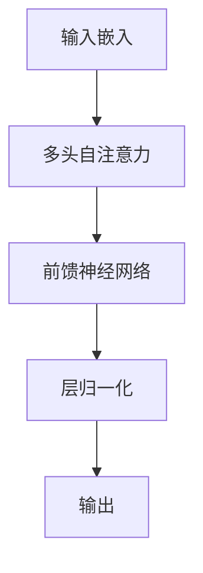

Transformer 的自注意力机制计算如下：

$$
Attention(Q, K, V) = softmax(\frac{QK^T}{\sqrt{d_k}})V
$$

其中，$Q$、$K$、$V$ 分别表示查询、键和值，$d_k$ 是键的维度。

这些大模型的出现极大地推动了 NLP 技术的发展，为各种下游任务提供了强大的基础。它们不仅在学术界引起了广泛关注，也在工业界得到了广泛应用。然而，这些模型也面临着一些挑战，如：

1. **计算资源需求**：训练和部署这些大模型需要大量的计算资源，这限制了它们的广泛应用。

2. **数据隐私**：大模型在训练过程中可能会"记住"一些敏感信息，如何保护用户隐私是一个重要问题。

3. **模型解释性**：这些复杂的模型往往被视为"黑盒"，如何解释它们的决策过程是一个重要的研究方向。

4. **领域适应**：如何高效地将这些通用模型适应到特定领域或任务仍是一个挑战。

5. **环境影响**：大模型的训练和推理过程消耗大量能源，如何降低其环境影响也是一个值得关注的问题。

作为 AI 大模型工程师，你需要深入理解这些模型的原理和特点，并能够根据具体应用场景选择合适的模型。同时，你还需要关注模型的优化、压缩和部署技术，以及如何解决上述挑战。

在接下来的章节中，我们将深入探讨这些技术的细节，并通过实际案例来展示如何应用这些大模型解决实际问题。让我们继续这个激动人心的 AI 大模型探索之旅！

## 1.3 转型路径规划

随着 AI 大模型技术的快速发展，越来越多的软件工程师和数据科学家希望转型成为 AI 大模型工程师。本节将为你提供一个系统的转型路径规划，帮助你顺利进入这个充满机遇的领域。

### 1.3.1 技能评估和差距分析

在开始转型之前，首先需要对自己的现有技能进行评估，并与 AI 大模型工程师所需的技能进行对比，找出差距。以下是一个简单的技能评估框架：

1. **编程能力**：
    - Python 熟练度 (1-10)
    - C++/Java 熟练度 (1-10)
    - 算法和数据结构掌握程度 (1-10)

2. **数学基础**：
    - 线性代数 (1-10)
    - 概率统计 (1-10)
    - 微积分 (1-10)
    - 优化理论 (1-10)

3. **机器学习基础**：
    - 经典机器学习算法理解 (1-10)
    - 模型评估和验证方法 (1-10)
    - 特征工程技巧 (1-10)

4. **深度学习**：
    - 神经网络原理 (1-10)
    - 常见深度学习架构（CNN, RNN, Transformer等）(1-10)
    - 深度学习框架使用（PyTorch, TensorFlow等）(1-10)

5. **自然语言处理**：
    - NLP 基础概念和技术 (1-10)
    - 词嵌入和语言模型 (1-10)
    - 序列到序列模型 (1-10)

6. **大规模系统**：
    - 分布式系统原理 (1-10)
    - 大数据处理框架（Spark, Hadoop等）(1-10)
    - 云计算平台使用经验 (1-10)

7. **软件工程实践**：
    - 版本控制（Git）(1-10)
    - CI/CD (1-10)
    - 代码质量和测试 (1-10)

8. **领域知识**：
    - 特定应用领域的专业知识 (1-10)
    - 行业趋势和最新研究动态的了解 (1-10)

对每个技能项进行自评（1-10分），然后与理想水平（通常为8-10分）进行对比，找出差距最大的几个领域，这些将是你重点提升的方向。

### 1.3.2 学习计划制定

基于技能评估的结果，你可以制定一个有针对性的学习计划。以下是一个为期6个月的学习计划示例：

**月份1-2：夯实基础**

1. 数学复习：
    - 线性代数：完成 MIT OCW 18.06 课程
    - 概率统计：完成 Harvard Stat 110 课程
    - 微积分：完成 3Blue1Brown 的微积分精华

2. Python 编程：
    - 完成 Python for Data Science and Machine Learning Bootcamp (Udemy)
    - 每天在 LeetCode 上解决 2-3 道算法题

3. 机器学习基础：
    - 完成吴恩达的机器学习课程 (Coursera)
    - 阅读《机器学习》(周志华)前 6 章

**月份3-4：深度学习和 NLP**

1. 深度学习：
    - 完成吴恩达的深度学习专项课程 (Coursera)
    - 学习 PyTorch：完成 PyTorch 官方教程
    - 实现经典网络：LeNet, AlexNet, VGG, ResNet

2. NLP 基础：
    - 完成 CS224n: Natural Language Processing with Deep Learning (Stanford)
    - 阅读《Speech and Language Processing》(Jurafsky & Martin) 前 10 章
    - 实现词嵌入 (Word2Vec) 和简单的 RNN 语言模型

3. Transformer 架构：
    - 深入理解论文：Attention Is All You Need
    - 从头实现一个简单的 Transformer 模型

**月份5-6：大模型和实战项目**

1. 大模型学习：
    - 深入学习 BERT, GPT, T5 等模型的原理
    - 使用 Hugging Face Transformers 库实现文本分类、命名实体识别等任务
    - 尝试微调预训练模型用于特定任务

2. 分布式训练：
    - 学习 PyTorch 分布式训练 API
    - 在多 GPU 环境下训练大模型

3. 模型部署：
    - 学习模型压缩技术（知识蒸馏、量化等）
    - 使用 TensorRT 优化模型推理
    - 将模型部署到云平台（如 AWS SageMaker）

4. 实战项目：
    - 选择一个感兴趣的 NLP 任务（如对话系统、文本生成）
    - 从数据收集、模型设计到部署，完整实现一个端到端的项目
    - 将项目开源到 GitHub，撰写详细的文档

学习资源推荐：

1. 在线课程：
    - Coursera, edX, Udacity 上的 AI 和机器学习课程
    - Fast.ai 的深度学习课程
    - DeepMind 的强化学习课程

2. 书籍：
    - 《深度学习》(Ian Goodfellow et al.)
    - 《自然语言处理综论》(Daniel Jurafsky & James H. Martin)
    - 《动手学深度学习》(Aston Zhang et al.)

3. 博客和网站：
    - arXiv.org (最新论文)
    - Papers With Code (论文实现)
    - Distill.pub (深度学习可视化解释)
    - Google AI Blog, OpenAI Blog

4. 开源项目：
    - Hugging Face Transformers
    - PyTorch Examples
    - TensorFlow Models

5. 会议和研讨会：
    - NeurIPS, ICML, ACL, EMNLP 等顶级会议
    - 本地 AI 和机器学习 Meetup

### 1.3.3 实践项目设计

实践项目是巩固所学知识、积累实战经验的关键。以下是一些适合 AI 大模型工程师的实践项目建议：

1. **文本分类器**：
    - 任务：使用 BERT 构建一个多类文本分类器
    - 数据集：可以使用 AG News 或 DBPedia 数据集
    - 技能点：数据预处理、模型微调、性能评估

   ```python
   from transformers import BertForSequenceClassification, BertTokenizer
   
   model = BertForSequenceClassification.from_pretrained('bert-base-uncased', num_labels=4)
   tokenizer = BertTokenizer.from_pretrained('bert-base-uncased')
   
   def preprocess(text):
       return tokenizer(text, padding=True, truncation=True, return_tensors="pt")
   
   inputs = preprocess("This is a sample text for classification.")
   outputs = model(**inputs)
   ```

2. **问答系统**：
    - 任务：基于 SQuAD 数据集构建一个问答系统
    - 技能点：上下文理解、信息抽取、模型部署

   ```python
   from transformers import pipeline

   qa_pipeline = pipeline("question-answering", model="distilbert-base-cased-distilled-squad")

   context = "OpenAI is an AI research laboratory consisting of the for-profit corporation OpenAI LP and its parent company, the non-profit OpenAI Inc."
   question = "What is OpenAI?"

   answer = qa_pipeline(question=question, context=context)
   print(f"Answer: {answer['answer']}")
   ```

3. **文本生成器**：
    - 任务：使用 GPT-2 构建一个文本生成器
    - 技能点：语言模型、解码策略、文本后处理

   ```python
   from transformers import GPT2LMHeadModel, GPT2Tokenizer

   model = GPT2LMHeadModel.from_pretrained('gpt2')
   tokenizer = GPT2Tokenizer.from_pretrained('gpt2')

   prompt = "Once upon a time"
   input_ids = tokenizer.encode(prompt, return_tensors='pt')

   output = model.generate(input_ids, max_length=100, num_return_sequences=1)
   generated_text = tokenizer.decode(output[0], skip_special_tokens=True)
   print(generated_text)
   ```

4. **情感分析器**：
    - 任务：构建一个推文情感分析器
    - 数据集：Twitter Sentiment Analysis Dataset
    - 技能点：文本预处理、词嵌入、模型比较

5. **机器翻译系统**：
    - 任务：构建一个英语到法语的翻译系统
    - 数据集：WMT14 英法数据集
    - 技能点：序列到序列模型、注意力机制、BLEU 评分

6. **命名实体识别**：
    - 任务：构建一个识别新闻文本中的人名、地名、组织名的系统
    - 数据集：CoNLL-2003 数据集
    - 技能点：序列标注、CRF 层、F1 评分

7. **对话系统**：
    - 任务：构建一个任务型对话系统（如订餐助手）
    - 技能点：意图识别、槽位填充、对话管理

8. **文本摘要生成器**：
    - 任务：构建一个新闻文章摘要生成器
    - 数据集：CNN/Daily Mail 数据集
    - 技能点：抽取式摘要、生成式摘要、ROUGE 评分

9. **图像描述生成器**：
    - 任务：给定图像生成描述文本
    - 数据集：COCO 数据集
    - 技能点：多模态学习、注意力机制、图像特征提取

10. **代码补全系统**：
    - 任务：构建一个 Python 代码补全系统
    - 数据集：从 GitHub 收集的 Python 代码库
    - 技能点：代码表示学习、上下文理解、自回归生成

在实施这些项目时，建议遵循以下步骤：

1. **问题定义**：明确项目目标和评估指标
2. **数据收集和预处理**：获取数据集，进行清洗和预处理
3. **模型选择和设计**：选择合适的模型架构，设计模型结构
4. **模型训练和优化**：训练模型，进行超参数调优
5. **评估和分析**：使用各种指标评估模型性能，分析错误案例
6. **部署和监控**：将模型部署到生产环境，设置监控指标
7. **文档和开源**：编写详细的项目文档，考虑将项目开源

通过这些实践项目，你不仅可以巩固理论知识，还能积累宝贵的实战经验。这些项目可以成为你的作品集，在求职时展示你的技能和创造力。

记住，在实践过程中遇到困难是正常的。遇到问题时，可以：
- 查阅相关论文和技术博客
- 在 Stack Overflow 或 GitHub Issues 上寻求帮助
- 与同行讨论，加入相关的在线社区
- 尝试简化问题，逐步解决

通过不断的实践和学习，你将逐步掌握 AI 大模型工程师所需的各项技能。保持好奇心和学习热情，相信你一定能在这个充满挑战和机遇的领域取得成功！

# 2 深度学习基础

深度学习是 AI 大模型的核心技术基础。本章将深入探讨深度学习的基本原理、常见架构以及实践技巧，为你在 AI 大模型领域的深入学习和应用打下坚实的基础。

## 2.1 神经网络原理

神经网络是深度学习的基础，它的灵感来源于生物神经系统的结构和功能。理解神经网络的工作原理对于掌握更复杂的深度学习模型至关重要。

### 2.1.1 人工神经元和激活函数

人工神经元是神经网络的基本计算单元，它模拟了生物神经元的基本特征。

1. **人工神经元的结构**：

   ```mermaid
   graph LR
   A[输入 x1] --> D[Σ]
   B[输入 x2] --> D
   C[输入 xn] --> D
   D --> E[激活函数]
   E --> F[输出]
   ```

    - 输入：$x_1, x_2, ..., x_n$
    - 权重：$w_1, w_2, ..., w_n$
    - 偏置：$b$
    - 加权和：$z = \sum_{i=1}^n w_i x_i + b$
    - 激活函数：$f$
    - 输出：$y = f(z)$

2. **激活函数**：
   激活函数引入非线性，使得神经网络能够学习复杂的模式。常用的激活函数包括：

   a. Sigmoid 函数：
   $$\sigma(x) = \frac{1}{1 + e^{-x}}$$

   特点：输出范围(0,1)，适用于二分类问题的输出层。

   缺点：存在梯度消失问题，计算复杂度高。

   b. Tanh 函数：
   $$tanh(x) = \frac{e^x - e^{-x}}{e^x + e^{-x}}$$

   特点：输出范围(-1,1)，零中心化。

   缺点：仍存在梯度消失问题。

   c. ReLU (Rectified Linear Unit) 函数：
   $$ReLU(x) = max(0, x)$$

   特点：计算简单，有效缓解梯度消失问题。

   缺点：会导致一些神经元"死亡"（永远不被激活）。

   d. Leaky ReLU：
   $$LeakyReLU(x) = max(0.01x, x)$$

   特点：解决了 ReLU 的"死亡"问题。

   e. Softmax 函数：
   $$softmax(x_i) = \frac{e^{x_i}}{\sum_{j=1}^n e^{x_j}}$$

   特点：常用于多分类问题的输出层，将输出转换为概率分布。

激活函数的选择对神经网络的性能有重要影响。在实践中，ReLU 及其变体（如 Leaky ReLU）因其简单高效而被广泛使用。

```python
import numpy as np
import matplotlib.pyplot as plt

def sigmoid(x):
    return 1 / (1 + np.exp(-x))

def tanh(x):
    return np.tanh(x)

def relu(x):
    return np.maximum(0, x)

def leaky_relu(x, alpha=0.01):
    return np.where(x > 0, x, alpha * x)

x = np.linspace(-10, 10, 1000)

plt.figure(figsize=(12, 8))
plt.plot(x, sigmoid(x), label='Sigmoid')
plt.plot(x, tanh(x), label='Tanh')
plt.plot(x, relu(x), label='ReLU')
plt.plot(x, leaky_relu(x), label='Leaky ReLU')
plt.legend()
plt.title('Activation Functions')
plt.grid(True)
plt.show()
```

### 2.1.2 前向传播和反向传播

神经网络的学习过程包括前向传播和反向传播两个阶段。

1. **前向传播**：
   前向传播是指输入数据从输入层经过隐藏层到输出层的计算过程。

   ```mermaid
   graph LR
   A[输入层] --> B[隐藏层1]
   B --> C[隐藏层2]
   C --> D[输出层]
   ```

   对于一个简单的三层神经网络，前向传播的计算过程如下：

   ```python
   def forward_propagation(X, W1, b1, W2, b2):
       Z1 = np.dot(W1, X) + b1
       A1 = relu(Z1)
       Z2 = np.dot(W2, A1) + b2
       A2 = sigmoid(Z2)
       return A2, (Z1, A1, Z2, A2)
   ```

2. **反向传播**：
   反向传播是神经网络学习的核心算法，用于计算损失函数对各层参数的梯度，从而更新网络权重。

   反向传播的基本步骤：
   a. 计算输出层的误差
   b. 将误差反向传播到前面的层
   c. 计算各层参数的梯度
   d. 更新参数

   ```python
   def backward_propagation(X, Y, cache, W1, W2):
       m = X.shape[1]
       Z1, A1, Z2, A2 = cache
       
       dZ2 = A2 - Y
       dW2 = (1/m) * np.dot(dZ2, A1.T)
       db2 = (1/m) * np.sum(dZ2, axis=1, keepdims=True)
       
       dZ1 = np.dot(W2.T, dZ2) * (1 - np.power(A1, 2))
       dW1 = (1/m) * np.dot(dZ1, X.T)
       db1 = (1/m) * np.sum(dZ1, axis=1, keepdims=True)
       
       return dW1, db1, dW2, db2
   ```

反向传播算法的核心是链式法则，它允许我们高效地计算复合函数的导数。

### 2.1.3 损失函数和优化算法

1. **损失函数**：
   损失函数衡量模型预测值与真实值之间的差距。常用的损失函数包括：

   a. 均方误差 (MSE)：用于回归问题
   $$MSE = \frac{1}{n}\sum_{i=1}^n (y_i - \hat{y}_i)^2$$

   b. 交叉熵损失：用于分类问题
    - 二分类：$$L = -[y \log(\hat{y}) + (1-y) \log(1-\hat{y})]$$
    - 多分类：$$L = -\sum_{i=1}^C y_i \log(\hat{y}_i)$$

   ```python
   def mse_loss(y_true, y_pred):
       return np.mean(np.square(y_true - y_pred))

   def binary_cross_entropy(y_true, y_pred):
       return -np.mean(y_true * np.log(y_pred) + (1 - y_true) * np.log(1 - y_pred))
   ```

2. **优化算法**：
   优化算法用于更新模型参数，最小化损失函数。常用的优化算法包括：

   a. 随机梯度下降 (SGD)：
   $$\theta = \theta - \alpha \nabla_\theta J(\theta)$$

   其中 $\alpha$ 是学习率，$\nabla_\theta J(\theta)$ 是损失函数对参数 $\theta$ 的梯度。

   b. Adam (Adaptive Moment Estimation)：
   Adam 结合了 RMSprop 和 Momentum 的优点，是目前最流行的优化算法之一。

      ```python
      def adam(params, grads, v, s, t, learning_rate=0.01, beta1=0.9, beta2=0.999, epsilon=1e-8):
          for param, grad, v_param, s_param in zip(params, grads, v, s):
              v_param = beta1 * v_param + (1 - beta1) * grad
              s_param =beta2 * s_param + (1 - beta2) * (grad ** 2)
              
              v_corrected = v_param / (1 - beta1 ** t)
              s_corrected = s_param / (1 - beta2 ** t)
              
              param -= learning_rate * v_corrected / (np.sqrt(s_corrected) + epsilon)
          
          return params, v, s
      ```

   c. RMSprop：
   RMSprop 通过归一化梯度来自适应学习率。

      ```python
      def rmsprop(params, grads, s, learning_rate=0.01, decay_rate=0.9, epsilon=1e-8):
          for param, grad, s_param in zip(params, grads, s):
              s_param = decay_rate * s_param + (1 - decay_rate) * (grad ** 2)
              param -= learning_rate * grad / (np.sqrt(s_param) + epsilon)
          return params, s
      ```

选择合适的优化算法对模型的训练效果至关重要。在实践中，Adam 因其良好的收敛性能和对超参数不敏感的特点而被广泛使用。

在实际应用中，我们通常会使用深度学习框架（如 PyTorch 或 TensorFlow）提供的优化器，这些优化器已经实现了上述算法并进行了优化。例如，在 PyTorch 中使用 Adam 优化器：

```python
import torch
import torch.optim as optim

model = YourModel()
optimizer = optim.Adam(model.parameters(), lr=0.001)

for epoch in range(num_epochs):
    for batch in dataloader:
        optimizer.zero_grad()
        outputs = model(batch.inputs)
        loss = loss_function(outputs, batch.targets)
        loss.backward()
        optimizer.step()
```

理解这些基本概念和原理对于深入学习和应用更复杂的深度学习模型至关重要。在接下来的章节中，我们将基于这些基础知识，探讨更高级的深度学习架构和技术。

## 2.2 常见深度学习架构

深度学习领域已经发展出多种强大的网络架构，每种架构都有其特定的应用场景和优势。本节将介绍三种最常见和重要的深度学习架构：卷积神经网络（CNN）、循环神经网络（RNN）和 Transformer。

### 2.2.1 卷积神经网络 (CNN)

卷积神经网络在图像处理任务中表现出色，是计算机视觉领域的基石。

1. **CNN 的核心组件**：

   a. 卷积层：使用卷积核提取特征
   b. 池化层：降低特征图的空间维度，提高计算效率
   c. 全连接层：综合所有特征，进行最终的分类或回归

2. **CNN 的工作原理**：

   ```mermaid
   graph LR
   A[输入图像] --> B[卷积层]
   B --> C[激活函数]
   C --> D[池化层]
   D --> E[卷积层]
   E --> F[激活函数]
   F --> G[池化层]
   G --> H[全连接层]
   H --> I[输出]
   ```

3. **卷积操作**：

   卷积操作是 CNN 的核心，它通过在输入上滑动卷积核来提取特征。

   ```python
   import numpy as np

   def convolve2d(image, kernel):
       i_height, i_width = image.shape
       k_height, k_width = kernel.shape
       
       output = np.zeros((i_height - k_height + 1, i_width - k_width + 1))
       
       for i in range(output.shape[0]):
           for j in range(output.shape[1]):
               output[i, j] = np.sum(image[i:i+k_height, j:j+k_width] * kernel)
       
       return output

   # 示例使用
   image = np.random.rand(28, 28)
   kernel = np.array([[1, 0, -1], [2, 0, -2], [1, 0, -1]])  # Sobel 边缘检测算子
   result = convolve2d(image, kernel)
   ```

4. **池化操作**：

   池化操作用于减少特征图的空间大小，常用的有最大池化和平均池化。

   ```python
   def max_pooling(feature_map, pool_size=2):
       h, w = feature_map.shape
       output = np.zeros((h // pool_size, w // pool_size))
       
       for i in range(0, h, pool_size):
           for j in range(0, w, pool_size):
               output[i // pool_size, j // pool_size] = np.max(feature_map[i:i+pool_size, j:j+pool_size])
       
       return output
   ```

5. **CNN 的优势**：
    - 参数共享：减少了需要学习的参数数量
    - 局部连接：每个神经元只与输入的一个局部区域相连
    - 平移不变性：可以检测到相同的特征，不管它在图像中的位置如何

6. **经典 CNN 架构**：
    - LeNet-5：最早的 CNN 之一，用于手写数字识别
    - AlexNet：2012 年 ImageNet 竞赛冠军，深度学习复兴的标志
    - VGGNet：使用小型卷积核堆叠深层网络
    - ResNet：引入残差连接，解决深层网络的梯度消失问题
    - Inception：使用不同大小的卷积核并行处理输入

7. **PyTorch 中实现简单的 CNN**：

   ```python
   import torch
   import torch.nn as nn
   import torch.nn.functional as F

   class SimpleCNN(nn.Module):
       def __init__(self):
           super(SimpleCNN, self).__init__()
           self.conv1 = nn.Conv2d(1, 32, kernel_size=3, stride=1, padding=1)
           self.conv2 = nn.Conv2d(32, 64, kernel_size=3, stride=1, padding=1)
           self.fc1 = nn.Linear(7 * 7 * 64, 128)
           self.fc2 = nn.Linear(128, 10)

       def forward(self, x):
           x = F.relu(self.conv1(x))
           x = F.max_pool2d(x, 2)
           x = F.relu(self.conv2(x))
           x = F.max_pool2d(x, 2)
           x = x.view(-1, 7 * 7 * 64)
           x = F.relu(self.fc1(x))
           x = self.fc2(x)
           return F.log_softmax(x, dim=1)

   # 创建模型实例
   model = SimpleCNN()
   ```

### 2.2.2 循环神经网络 (RNN)

循环神经网络专门用于处理序列数据，如时间序列、自然语言等。

1. **RNN 的基本结构**：

   ```mermaid
   graph LR
   A[输入 x_t] --> B((RNN Cell))
   B --> C[输出 h_t]
   D[上一时刻状态 h_t-1] --> B
   B --> D
   ```

2. **RNN 的前向传播**：

   $$h_t = tanh(W_{hh}h_{t-1} + W_{xh}x_t + b_h)$$
   $$y_t = W_{hy}h_t + b_y$$

   其中，$h_t$ 是当前时刻的隐藏状态，$x_t$ 是输入，$y_t$ 是输出。

3. **RNN 的问题**：
    - 梯度消失/爆炸：在长序列中，梯度会随着时间步的增加而迅速减小或增大
    - 长期依赖问题：难以捕捉长距离的依赖关系

4. **LSTM (Long Short-Term Memory)**：

   LSTM 是为了解决 RNN 的问题而提出的一种特殊的 RNN 结构。

   ```mermaid
   graph TD
   A[输入门] --> D[LSTM Cell]
   B[遗忘门] --> D
   C[输出门] --> D
   E[记忆单元] --> D
   D --> F[输出]
   ```

   LSTM 的核心公式：

   $$f_t = \sigma(W_f \cdot [h_{t-1}, x_t] + b_f)$$
   $$i_t = \sigma(W_i \cdot [h_{t-1}, x_t] + b_i)$$
   $$\tilde{C}_t = tanh(W_C \cdot [h_{t-1}, x_t] + b_C)$$
   $$C_t = f_t * C_{t-1} + i_t * \tilde{C}_t$$
   $$o_t = \sigma(W_o \cdot [h_{t-1}, x_t] + b_o)$$
   $$h_t = o_t * tanh(C_t)$$

   其中，$f_t$, $i_t$, $o_t$ 分别是遗忘门、输入门和输出门，$C_t$ 是记忆单元。

5. **GRU (Gated Recurrent Unit)**：

   GRU 是 LSTM 的一种简化变体，具有更少的参数。

   ```python
   import torch
   import torch.nn as nn

   class GRU(nn.Module):
       def __init__(self, input_size, hidden_size):
           super(GRU, self).__init__()
           self.input_size = input_size
           self.hidden_size = hidden_size
           
           self.Wz = nn.Linear(input_size + hidden_size, hidden_size)
           self.Wr = nn.Linear(input_size + hidden_size, hidden_size)
           self.Wh = nn.Linear(input_size + hidden_size, hidden_size)
           
       def forward(self, x, h_prev):
           z = torch.sigmoid(self.Wz(torch.cat([x, h_prev], dim=1)))
           r = torch.sigmoid(self.Wr(torch.cat([x, h_prev], dim=1)))
           h_tilde = torch.tanh(self.Wh(torch.cat([x, r * h_prev], dim=1)))
           h = (1 - z) * h_prev + z * h_tilde
           return h
   ```

6. **双向 RNN**：

   双向 RNN 可以同时考虑过去和未来的信息，在许多 NLP 任务中表现优异。

   ```python
   class BiRNN(nn.Module):
       def __init__(self, input_size, hidden_size, num_layers):
           super(BiRNN, self).__init__()
           self.hidden_size = hidden_size
           self.num_layers = num_layers
           self.lstm = nn.LSTM(input_size, hidden_size, num_layers, batch_first=True, bidirectional=True)
           self.fc = nn.Linear(hidden_size * 2, num_classes)  # 2 for bidirection
       
       def forward(self, x):
           h0 = torch.zeros(self.num_layers * 2, x.size(0), self.hidden_size).to(device)  # 2 for bidirection 
           c0 = torch.zeros(self.num_layers * 2, x.size(0), self.hidden_size).to(device)
           out, _ = self.lstm(x, (h0, c0))
           out = self.fc(out[:, -1, :])
           return out
   ```

RNN 及其变体在处理序列数据方面表现出色，特别是在自然语言处理任务中。然而，它们在处理长序列时仍然面临挑战，这就引出了我们下一个要讨论的架构：Transformer。

### 2.2.3 Transformer 架构

Transformer 架构在 2017 年提出后迅速成为 NLP 领域的主导架构，它完全基于注意力机制，摒弃了传统的循环结构。

1. **Transformer 的核心组件**：

   ```mermaid
   graph TD
   A[输入嵌入] --> B[多头自注意力]
   B --> C[Add & Norm]
   C --> D[前馈神经网络]
   D --> E[Add & Norm]
   E --> F[输出]
   ```

2. **自注意力机制**：

   自注意力是 Transformer 的核心，它允许模型在处理序列的每个位置时都能考虑到整个序列的信息。

   $$Attention(Q, K, V) = softmax(\frac{QK^T}{\sqrt{d_k}})V$$

   其中，$Q$、$K$、$V$ 分别表示查询、键和值，$d_k$ 是键的维度。

   ```python
   import torch
   import torch.nn as nn
   import torch.nn.functional as F

   class SelfAttention(nn.Module):
       def __init__(self, embed_size, heads):
           super(SelfAttention, self).__init__()
           self.embed_size = embed_size
           self.heads = heads
           self.head_dim = embed_size // heads

           assert (self.head_dim * heads == embed_size), "Embed size needs to be divisible by heads"

           self.values = nn.Linear(self.head_dim, self.head_dim, bias=False)
           self.keys = nn.Linear(self.head_dim, self.head_dim, bias=False)
           self.queries = nn.Linear(self.head_dim, self.head_dim, bias=False)
           self.fc_out = nn.Linear(heads * self.head_dim, embed_size)

       def forward(self, values, keys, query, mask):
           N = query.shape[0]
           value_len, key_len, query_len = values.shape[1], keys.shape[1], query.shape[1]

           # Split the embedding into self.heads pieces
           values = values.reshape(N, value_len, self.heads, self.head_dim)
           keys = keys.reshape(N, key_len, self.heads, self.head_dim)
           query = query.reshape(N, query_len, self.heads, self.head_dim)

           values = self.values(values)
           keys = self.keys(keys)
           queries = self.queries(query)

           # Transpose to get dimensions (N, heads, query_len, head_dim)
           values = values.transpose(1, 2)
           keys = keys.transpose(1, 2)
           queries = queries.transpose(1, 2)

           # Calculate energy and attention scores
           energy = torch.matmul(queries, keys.transpose(-2, -1)) / (self.embed_size ** (1/2))
           
           if mask is not None:
               energy = energy.masked_fill(mask == 0, float("-1e20"))

           attention = torch.softmax(energy, dim=-1)

           # Calculate the output
           out = torch.matmul(attention, values).transpose(1, 2).reshape(
               N, query_len, self.heads * self.head_dim
           )

           out = self.fc_out(out)
           return out
   ```

3. **位置编码**：

   由于 Transformer 没有循环结构，它需要额外的位置信息来了解序列中元素的顺序。

   $$PE_{(pos,2i)} = sin(pos / 10000^{2i/d_{model}})$$
   $$PE_{(pos,2i+1)} = cos(pos / 10000^{2i/d_{model}})$$

   ```python
   def get_positional_encoding(max_seq_len, d_model):
       pe = torch.zeros(max_seq_len, d_model)
       position = torch.arange(0, max_seq_len, dtype=torch.float).unsqueeze(1)
       div_term = torch.exp(torch.arange(0, d_model, 2).float() * (-math.log(10000.0) / d_model))
       pe[:, 0::2] = torch.sin(position * div_term)
       pe[:, 1::2] = torch.cos(position * div_term)
       return pe
   ```

4. **Transformer 编码器**：

   ```python
   class TransformerEncoder(nn.Module):
       def __init__(self, embed_size, heads, dropout, forward_expansion):
           super(TransformerEncoder, self).__init__()
           self.attention = SelfAttention(embed_size, heads)
           self.norm1 = nn.LayerNorm(embed_size)
           self.norm2 = nn.LayerNorm(embed_size)

           self.feed_forward = nn.Sequential(
               nn.Linear(embed_size, forward_expansion * embed_size),
               nn.ReLU(),
               nn.Linear(forward_expansion * embed_size, embed_size),
           )

           self.dropout = nn.Dropout(dropout)

       def forward(self, value, key, query, mask):
           attention = self.attention(value, key, query, mask)

           # Add skip connection, run through normalization and finally dropout
           x = self.dropout(self.norm1(attention + query))
           forward = self.feed_forward(x)
           out = self.dropout(self.norm2(forward + x))
           return out
   ```

5. **Transformer 解码器**：

   解码器除了自注意力层外，还包含一个交叉注意力层，用于关注编码器的输出。

6. **Transformer 的优势**：
    - 并行计算：不像 RNN 需要顺序处理，Transformer 可以并行处理整个序列
    - 长距离依赖：通过自注意力机制，可以有效捕捉长距离依赖
    - 灵活性：可以处理不同长度的输入序列

7. **Transformer 的应用**：
    - 机器翻译
    - 文本生成
    - 文本摘要
    - 问答系统
    - 语音识别

8. **基于 Transformer 的预训练模型**：
    - BERT：双向编码器表示
    - GPT 系列：生成式预训练 Transformer
    - T5：文本到文本转换 Transformer

Transformer 架构的出现彻底改变了 NLP 领域，并逐渐扩展到其他领域如计算机视觉。理解 Transformer 的工作原理对于掌握现代 AI 大模型至关重要。

## 2.3 深度学习框架入门

深度学习框架大大简化了模型的开发和训练过程。本节将介绍两个最流行的深度学习框架：PyTorch 和 TensorFlow/Keras，并讨论模型训练与评估的实践。

### 2.3.1 PyTorch 基础

PyTorch 是一个动态计算图框架，以其灵活性和易用性而受到研究人员的青睐。

1. **张量操作**：

   ```python
   import torch

   # 创建张量
   x = torch.tensor([1, 2, 3])
   y = torch.randn(3, 3)

   # 张量运算
   z = x + y
   w = torch.matmul(y, x)

   # GPU 加速
   if torch.cuda.is_available():
       x = x.to('cuda')
       y = y.to('cuda')
   ```

2. **自动求导**：

   ```python
   x = torch.randn(3, requires_grad=True)
   y = x * 2
   z = y.mean()
   z.backward()
   print(x.grad)  # 打印 x 的梯度
   ```

3. **定义神经网络**：

   ```python
   import torch.nn as nn
   import torch.nn.functional as F

   class Net(nn.Module):
       def __init__(self):
           super(Net, self).__init__()
           self.conv1 = nn.Conv2d(1, 6, 5)
           self.conv2 = nn.Conv2d(6, 16, 5)
           self.fc1 = nn.Linear(16 * 5 * 5, 120)
           self.fc2 = nn.Linear(120, 84)
           self.fc3 = nn.Linear(84, 10)

       def forward(self, x):
           x = F.max_pool2d(F.relu(self.conv1(x)), (2, 2))
           x = F.max_pool2d(F.relu(self.conv2(x)), 2)
           x = x.view(-1, 16 * 5 * 5)
           x = F.relu(self.fc1(x))
           x = F.relu(self.fc2(x))
           x = self.fc3(x)
           return x

   net = Net()
   ```

4. **数据加载**：

   ```python
   from torch.utils.data import Dataset, DataLoader

   class CustomDataset(Dataset):
       def __init__(self, data, labels):
           self.data = data
           self.labels = labels

       def __len__(self):
           return len(self.data)

       def __getitem__(self, idx):
           return self.data[idx], self.labels[idx]

   dataset = CustomDataset(data, labels)
   dataloader = DataLoader(dataset, batch_size=32, shuffle=True)
   ```

5. **模型训练**：

   ```python
   import torch.optim as optim

   criterion = nn.CrossEntropyLoss()
   optimizer = optim.SGD(net.parameters(), lr=0.001, momentum=0.9)

   for epoch in range(10):  # 训练10个epoch
       for i, data in enumerate(dataloader, 0):
           inputs, labels = data
           optimizer.zero_grad()
           outputs = net(inputs)
           loss = criterion(outputs, labels)
           loss.backward()
           optimizer.step()
   ```

### 2.3.2 TensorFlow 和 Keras 简介

TensorFlow 是 Google 开发的深度学习框架，Keras 是其高级 API，提供了更简洁的接口。

1. **张量操作**：

   ```python
   import tensorflow as tf

   # 创建张量
   x = tf.constant([1, 2, 3])
   y = tf.random.normal((3, 3))

   # 张量运算
   z = x + y
   w = tf.matmul(y, tf.reshape(x, (3, 1)))
   ```

2. **自动求导**：

   ```python
   x = tf.Variable(3.0)
   with tf.GradientTape() as tape:
       y = x * x
   dy_dx = tape.gradient(y, x)
   print(dy_dx)  # 打印 y 对 x 的导数
   ```

3. **定义神经网络**：

   ```python
   from tensorflow import keras

   model = keras.Sequential([
       keras.layers.Conv2D(32, (3, 3), activation='relu', input_shape=(28, 28, 1)),
       keras.layers.MaxPooling2D((2, 2)),
       keras.layers.Flatten(),
       keras.layers.Dense(128, activation='relu'),
       keras.layers.Dense(10, activation='softmax')
   ])
   ```

4. **数据加载**：

   ```python
   from tensorflow.keras.preprocessing.image import ImageDataGenerator

   datagen = ImageDataGenerator(rescale=1./255)
   train_generator = datagen.flow_from_directory(
       'train_dir',
       target_size=(150, 150),
       batch_size=32,
       class_mode='binary'
   )
   ```

5. **模型训练**：

   ```python
   model.compile(optimizer='adam',
                 loss='sparse_categorical_crossentropy',
                 metrics=['accuracy'])

   history = model.fit(train_generator,
                       steps_per_epoch=100,
                       epochs=10,
                       validation_data=validation_generator,
                       validation_steps=50)
   ```

### 2.3.3 模型训练与评估实践

无论使用哪种框架，模型训练与评估的基本流程是相似的：

1. **数据预处理**：
    - 数据清洗
    - 特征工程
    - 数据增强
    - 数据标准化/归一化

2. **模型设计**：
    - 选择合适的网络架构
    - 设置超参数

3. **训练循环**：
    - 前向传播
    - 计算损失
    - 反向传播
    - 参数更新

4. **验证**：
    - 在验证集上评估模型性能
    - 调整超参数

5. **测试**：
    - 在测试集上进行最终评估

6. **模型评估指标**：
    - 分类问题：准确率、精确率、召回率、F1分数
    - 回归问题：均方误差(MSE)、平均绝对误差(MAE)
    - 目标检测：mAP (mean Average Precision)
    - 生成模型：BLEU, ROUGE (文本), SSIM (图像)

7. **可视化**：
    - 损失曲线
    - 混淆矩阵
    - t-SNE 可视化

8. **模型优化技巧**：
    - 学习率调度
    - 早停
    - 正则化（L1/L2, Dropout）
    - 批量归一化

示例：使用 PyTorch 训练一个简单的图像分类模型

```python
import torch
import torch.nn as nn
import torch.optim as optim
from torchvision import datasets, transforms
from torch.utils.data import DataLoader

# 定义模型
class SimpleConvNet(nn.Module):
    def __init__(self):
        super(SimpleConvNet, self).__init__()
        self.conv1 = nn.Conv2d(1, 32, 3, 1)
        self.conv2 = nn.Conv2d(32, 64, 3, 1)
        self.dropout1 = nn.Dropout2d(0.25)
        self.dropout2 = nn.Dropout2d(0.5)
        self.fc1 = nn.Linear(9216, 128)
        self.fc2 = nn.Linear(128, 10)

    def forward(self, x):
        x = self.conv1(x)
        x = nn.functional.relu(x)
        x = self.conv2(x)
        x = nn.functional.relu(x)
        x = nn.functional.max_pool2d(x, 2)
        x = self.dropout1(x)
        x = torch.flatten(x, 1)
        x = self.fc1(x)
        x = nn.functional.relu(x)
        x = self.dropout2(x)
        x = self.fc2(x)
        output = nn.functional.log_softmax(x, dim=1)
        return output

# 数据加载
transform = transforms.Compose([
    transforms.ToTensor(),
    transforms.Normalize((0.1307,), (0.3081,))
])

train_dataset = datasets.MNIST('data', train=True, download=True, transform=transform)
test_dataset = datasets.MNIST('data', train=False, transform=transform)

train_loader = DataLoader(train_dataset, batch_size=64, shuffle=True)
test_loader = DataLoader(test_dataset, batch_size=1000, shuffle=False)

# 初始化模型、损失函数和优化器
device = torch.device("cuda" if torch.cuda.is_available() else "cpu")
model = SimpleConvNet().to(device)
criterion = nn.CrossEntropyLoss()
optimizer = optim.Adam(model.parameters(), lr=0.001)

# 训练函数
def train(model, device, train_loader, optimizer, epoch):
    model.train()
    for batch_idx, (data, target) in enumerate(train_loader):
        data, target = data.to(device), target.to(device)
        optimizer.zero_grad()
        output = model(data)
        loss = criterion(output, target)
        loss.backward()
        optimizer.step()
        if batch_idx % 100 == 0:
            print(f'Train Epoch: {epoch} [{batch_idx * len(data)}/{len(train_loader.dataset)} '
                  f'({100. * batch_idx / len(train_loader):.0f}%)]\tLoss: {loss.item():.6f}')

# 测试函数
def test(model, device, test_loader):
    model.eval()
    test_loss = 0
    correct = 0
    with torch.no_grad():
        for data, target in test_loader:
            data, target = data.to(device), target.to(device)
            output = model(data)
            test_loss += criterion(output, target).item()
            pred = output.argmax(dim=1, keepdim=True)
            correct += pred.eq(target.view_as(pred)).sum().item()

    test_loss /= len(test_loader.dataset)
    accuracy = 100. * correct / len(test_loader.dataset)
    print(f'\nTest set: Average loss: {test_loss:.4f}, Accuracy: {correct}/{len(test_loader.dataset)} ({accuracy:.2f}%)\n')

# 训练和测试循环
num_epochs = 10
for epoch in range(1, num_epochs + 1):train(model, device, train_loader, optimizer, epoch)
    test(model, device, test_loader)

# 保存模型
torch.save(model.state_dict(), "mnist_cnn.pt")

print("Training completed.")
```

这个例子展示了一个完整的深度学习模型训练流程，包括数据加载、模型定义、训练循环和评估。在实际应用中，你可能还需要考虑以下几点：

1. **学习率调度**：
   使用学习率调度器可以在训练过程中动态调整学习率，有助于模型收敛。

   ```python
   from torch.optim.lr_scheduler import StepLR

   scheduler = StepLR(optimizer, step_size=1, gamma=0.7)
   
   # 在训练循环中添加
   scheduler.step()
   ```

2. **早停**：
   当验证集性能不再提升时停止训练，防止过拟合。

   ```python
   best_val_loss = float('inf')
   patience = 5
   counter = 0

   for epoch in range(num_epochs):
       train(model, device, train_loader, optimizer, epoch)
       val_loss = validate(model, device, val_loader)
       
       if val_loss < best_val_loss:
           best_val_loss = val_loss
           counter = 0
           torch.save(model.state_dict(), 'best_model.pt')
       else:
           counter += 1
           if counter >= patience:
               print("Early stopping")
               break
   ```

3. **交叉验证**：
   特别是在小数据集上，使用k折交叉验证可以更好地评估模型性能。

   ```python
   from sklearn.model_selection import KFold

   kf = KFold(n_splits=5, shuffle=True, random_state=42)
   
   for fold, (train_idx, val_idx) in enumerate(kf.split(dataset)):
       print(f"Fold {fold + 1}")
       train_subsampler = torch.utils.data.SubsetRandomSampler(train_idx)
       val_subsampler = torch.utils.data.SubsetRandomSampler(val_idx)
       
       train_loader = DataLoader(dataset, batch_size=32, sampler=train_subsampler)
       val_loader = DataLoader(dataset, batch_size=32, sampler=val_subsampler)
       
       model = SimpleConvNet().to(device)
       optimizer = optim.Adam(model.parameters(), lr=0.001)
       
       # 训练和验证循环
       ...
   ```

4. **模型集成**：
   结合多个模型的预测可以提高整体性能和鲁棒性。

   ```python
   models = [SimpleConvNet().to(device) for _ in range(5)]
   
   # 训练每个模型...
   
   def ensemble_predict(models, data):
       predictions = []
       for model in models:
           model.eval()
           with torch.no_grad():
               output = model(data)
               predictions.append(output)
       return torch.mean(torch.stack(predictions), dim=0)
   ```

5. **可视化训练过程**：
   使用工具如TensorBoard可以帮助你更好地理解和监控训练过程。

   ```python
   from torch.utils.tensorboard import SummaryWriter

   writer = SummaryWriter('runs/experiment_1')

   # 在训练循环中
   writer.add_scalar('Loss/train', loss.item(), global_step)
   writer.add_scalar('Accuracy/test', accuracy, epoch)
   ```

6. **混淆矩阵**：
   对于分类问题，绘制混淆矩阵可以帮助你理解模型在哪些类别上表现较差。

   ```python
   from sklearn.metrics import confusion_matrix
   import seaborn as sns
   import matplotlib.pyplot as plt

   def plot_confusion_matrix(y_true, y_pred, classes):
       cm = confusion_matrix(y_true, y_pred)
       plt.figure(figsize=(10, 10))
       sns.heatmap(cm, annot=True, fmt='d', cmap='Blues', xticklabels=classes, yticklabels=classes)
       plt.title('Confusion Matrix')
       plt.ylabel('True Label')
       plt.xlabel('Predicted Label')
       plt.show()
   ```

7. **模型解释**：
   使用技术如Grad-CAM可以帮助你理解模型关注的图像区域。

   ```python
   from pytorch_grad_cam import GradCAM
   from pytorch_grad_cam.utils.image import show_cam_on_image

   cam = GradCAM(model=model, target_layers=[model.conv2], use_cuda=True)
   grayscale_cam = cam(input_tensor=input_img)
   visualization = show_cam_on_image(rgb_img, grayscale_cam[0, :], use_rgb=True)
   ```

8. **超参数优化**：
   使用工具如Optuna可以自动化超参数搜索过程。

   ```python
   import optuna

   def objective(trial):
       lr = trial.suggest_loguniform('lr', 1e-5, 1e-1)
       batch_size = trial.suggest_categorical('batch_size', [32, 64, 128])
       
       model = SimpleConvNet().to(device)
       optimizer = optim.Adam(model.parameters(), lr=lr)
       train_loader = DataLoader(train_dataset, batch_size=batch_size, shuffle=True)
       
       # 训练和评估模型
       ...
       
       return accuracy

   study = optuna.create_study(direction='maximize')
   study.optimize(objective, n_trials=100)
   ```

这些高级技巧和工具可以帮助你更好地训练、评估和理解你的深度学习模型。随着你在AI大模型领域的深入，你会发现这些技巧在处理更复杂的模型和任务时尤为重要。

在下一章中，我们将深入探讨自然语言处理（NLP）的核心技术，这是AI大模型最重要的应用领域之一。我们将学习如何处理和分析文本数据，以及如何应用深度学习技术来解决各种NLP任务。

# 3 自然语言处理 (NLP) 核心技术

自然语言处理（NLP）是人工智能的一个重要分支，致力于使计算机能够理解、解释和生成人类语言。在AI大模型时代，NLP技术已经取得了巨大的进步，能够执行各种复杂的语言任务。本章将介绍NLP的核心技术，包括文本预处理、经典NLP任务和词嵌入技术。

## 3.1 文本预处理技术

文本预处理是NLP任务的第一步，也是至关重要的一步。良好的预处理可以显著提高后续模型的性能。

### 3.1.1 分词和词干提取

1. **分词 (Tokenization)**:
   分词是将文本分割成更小的单位（通常是单词）的过程。

   ```python
   from nltk.tokenize import word_tokenize

   text = "Natural language processing is fascinating!"
   tokens = word_tokenize(text)
   print(tokens)
   # Output: ['Natural', 'language', 'processing', 'is', 'fascinating', '!']
   ```

   对于中文等没有明确单词边界的语言，分词更具挑战性：

   ```python
   import jieba

   text = "自然语言处理非常有趣！"
   tokens = jieba.cut(text)
   print(list(tokens))
   # Output: ['自然', '语言', '处理', '非常', '有趣', '！']
   ```

2. **词干提取 (Stemming)**:
   词干提取是将词减少到其词根形式的过程。这有助于减少词汇的变化形式，简化后续的处理。

   ```python
   from nltk.stem import PorterStemmer

   stemmer = PorterStemmer()
   words = ["running", "runs", "ran", "easily", "fairly"]
   stemmed = [stemmer.stem(word) for word in words]
   print(stemmed)
   # Output: ['run', 'run', 'ran', 'easili', 'fairli']
   ```

3. **词形还原 (Lemmatization)**:
   词形还原是将词转换为其字典形式的过程。与词干提取相比，词形还原通常产生更有意义的词。

   ```python
   from nltk.stem import WordNetLemmatizer

   lemmatizer = WordNetLemmatizer()
   words = ["running", "runs", "ran", "easily", "fairly"]
   lemmatized = [lemmatizer.lemmatize(word) for word in words]
   print(lemmatized)
   # Output: ['running', 'run', 'ran', 'easily', 'fairly']
   ```

### 3.1.2 停用词处理

停用词是在文本中频繁出现但通常不携带重要意义的词，如"the"、"is"、"at"等。移除停用词可以减少噪声，提高模型性能。

```python
from nltk.corpus import stopwords
from nltk.tokenize import word_tokenize

stop_words = set(stopwords.words('english'))

text = "This is an example of stop word removal."
tokens = word_tokenize(text)
filtered_tokens = [word for word in tokens if word.lower() not in stop_words]

print(filtered_tokens)
# Output: ['This', 'example', 'stop', 'word', 'removal', '.']
```

### 3.1.3 文本向量化方法

将文本转换为数值向量是许多NLP任务的关键步骤。以下是几种常用的文本向量化方法：

1. **词袋模型 (Bag of Words)**:
   词袋模型简单地计算每个词在文档中的出现次数。

   ```python
   from sklearn.feature_extraction.text import CountVectorizer

   corpus = [
       "This is the first document.",
       "This document is the second document.",
       "And this is the third one.",
       "Is this the first document?",
   ]

   vectorizer = CountVectorizer()
   X = vectorizer.fit_transform(corpus)
   print(X.toarray())
   ```

2. **TF-IDF (Term Frequency-Inverse Document Frequency)**:
   TF-IDF不仅考虑词频，还考虑词在整个语料库中的重要性。

   ```python
   from sklearn.feature_extraction.text import TfidfVectorizer

   vectorizer = TfidfVectorizer()
   X = vectorizer.fit_transform(corpus)
   print(X.toarray())
   ```

3. **Word2Vec**:
   Word2Vec是一种基于神经网络的词嵌入方法，可以捕捉词之间的语义关系。

   ```python
   from gensim.models import Word2Vec

   sentences = [["cat", "say", "meow"], ["dog", "say", "woof"]]
   model = Word2Vec(sentences, min_count=1)
   
   print(model.wv["cat"])
   ```

4. **字符级编码**:
   对于某些任务，字符级的编码可能更有效。

   ```python
   def char_level_encoding(text, max_len=100):
       char_dict = {char: i+1 for i, char in enumerate(set(''.join(text)))}
       return [char_dict.get(char, 0) for char in text[:max_len].ljust(max_len)]

   encoded = char_level_encoding("Hello, World!")
   print(encoded)
   ```

5. **子词 (Subword) 编码**:
   子词编码（如BPE, Byte-Pair Encoding）可以处理未知词和复合词。

   ```python
   from tokenizers import Tokenizer
   from tokenizers.models import BPE
   from tokenizers.trainers import BpeTrainer

   tokenizer = Tokenizer(BPE(unk_token="[UNK]"))
   trainer = BpeTrainer(special_tokens=["[UNK]", "[CLS]", "[SEP]", "[PAD]", "[MASK]"])

   files = [...]  # 你的训练文件列表
   tokenizer.train(files, trainer)

   encoded = tokenizer.encode("Hello, World!")
   print(encoded.tokens)
   ```

这些预处理技术为后续的NLP任务奠定了基础。选择合适的预处理方法对模型性能有重要影响，通常需要根据具体任务和数据特点进行选择和调整。

## 3.2 经典 NLP 任务

NLP领域包含多种任务，每种任务都有其特定的挑战和解决方案。以下是一些经典的NLP任务及其实现方法。

### 3.2.1 命名实体识别 (NER)

命名实体识别旨在从文本中识别和分类命名实体，如人名、地名、组织名等。

1. **使用spaCy实现NER**:

   ```python
   import spacy

   nlp = spacy.load("en_core_web_sm")
   text = "Apple is looking at buying U.K. startup for $1 billion"
   doc = nlp(text)

   for ent in doc.ents:
       print(ent.text, ent.label_)
   
   # Output:
   # Apple ORG
   # U.K. GPE
   # $1 billion MONEY
   ```

2. **使用BERT实现NER**:

   ```python
   from transformers import AutoTokenizer, AutoModelForTokenClassification
   from transformers import pipeline

   tokenizer = AutoTokenizer.from_pretrained("dslim/bert-base-NER")
   model = AutoModelForTokenClassification.from_pretrained("dslim/bert-base-NER")

   nlp = pipeline("ner", model=model, tokenizer=tokenizer)
   example = "My name is Wolfgang and I live in Berlin"

   ner_results = nlp(example)
   print(ner_results)
   ```

3. **自定义NER模型**:

   使用BiLSTM-CRF模型实现NER：

   ```python
   import torch
   import torch.nn as nn
   from torchcrf import CRF

   class BiLSTM_CRF(nn.Module):
       def __init__(self, vocab_size, tag_to_ix, embedding_dim, hidden_dim):
           super(BiLSTM_CRF, self).__init__()
           self.embedding = nn.Embedding(vocab_size, embedding_dim)
           self.lstm = nn.LSTM(embedding_dim, hidden_dim // 2,
                num_layers=1, bidirectional=True)
           self.hidden2tag = nn.Linear(hidden_dim, len(tag_to_ix))
           self.crf = CRF(len(tag_to_ix), batch_first=True)

       def forward(self, sentence, tags=None):
           embeds = self.embedding(sentence)
           lstm_out, _ = self.lstm(embeds)
           emissions = self.hidden2tag(lstm_out)
           
           if tags is not None:
               return -self.crf(emissions, tags)  # negative log-likelihood for training
           else:
               return self.crf.decode(emissions)  # Viterbi decoding for inference

   # 使用模型
   model = BiLSTM_CRF(vocab_size, tag_to_ix, embedding_dim, hidden_dim)
   optimizer = optim.SGD(model.parameters(), lr=0.01, weight_decay=1e-4)

   # 训练循环
   for epoch in range(num_epochs):
       for sentence, tags in training_data:
           model.zero_grad()
           loss = model(sentence, tags)
           loss.backward()
           optimizer.step()
   ```

### 3.2.2 词性标注 (POS Tagging)

词性标注是为文本中的每个词分配词性（如名词、动词、形容词等）的任务。

1. **使用NLTK进行词性标注**:

   ```python
   import nltk
   nltk.download('averaged_perceptron_tagger')

   text = "NLTK is a leading platform for building Python programs to work with human language data."
   tokens = nltk.word_tokenize(text)
   pos_tags = nltk.pos_tag(tokens)

   print(pos_tags)
   # Output: [('NLTK', 'NNP'), ('is', 'VBZ'), ('a', 'DT'), ('leading', 'VBG'), ...]
   ```

2. **使用spaCy进行词性标注**:

   ```python
   import spacy

   nlp = spacy.load("en_core_web_sm")
   doc = nlp("SpaCy is an advanced natural language processing library.")

   for token in doc:
       print(token.text, token.pos_)
   ```

3. **使用Transformer模型进行词性标注**:

   ```python
   from transformers import AutoTokenizer, AutoModelForTokenClassification
   from transformers import pipeline

   tokenizer = AutoTokenizer.from_pretrained("vblagoje/bert-english-uncased-finetuned-pos")
   model = AutoModelForTokenClassification.from_pretrained("vblagoje/bert-english-uncased-finetuned-pos")

   nlp = pipeline("token-classification", model=model, tokenizer=tokenizer)
   text = "BERT is a powerful language model."
   result = nlp(text)
   print(result)
   ```

### 3.2.3 情感分析和文本分类

情感分析是确定文本情感倾向（如积极、消极或中性）的任务。文本分类则是将文本分类到预定义类别的更一般化任务。

1. **使用NLTK进行简单的情感分析**:

   ```python
   from nltk.sentiment import SentimentIntensityAnalyzer
   
   sia = SentimentIntensityAnalyzer()
   text = "I love this movie! It's amazing and fantastic!"
   print(sia.polarity_scores(text))
   # Output: {'neg': 0.0, 'neu': 0.295, 'pos': 0.705, 'compound': 0.9454}
   ```

2. **使用scikit-learn进行文本分类**:

   ```python
   from sklearn.feature_extraction.text import TfidfVectorizer
   from sklearn.naive_bayes import MultinomialNB
   from sklearn.pipeline import make_pipeline

   # 假设我们有一个包含文本和标签的数据集
   X = ["This is a positive review", "This is a negative review", ...]
   y = [1, 0, ...]  # 1 for positive, 0 for negative

   model = make_pipeline(TfidfVectorizer(), MultinomialNB())
   model.fit(X, y)

   new_text = ["I really enjoyed this movie"]
   print(model.predict(new_text))
   ```

3. **使用Transformer模型进行情感分析**:

   ```python
   from transformers import pipeline

   classifier = pipeline("sentiment-analysis")

   result = classifier("I've been waiting for a HuggingFace course my whole life.")
   print(result)
   # Output: [{'label': 'POSITIVE', 'score': 0.9998}]
   ```

4. **使用PyTorch实现CNN文本分类**:

   ```python
   import torch
   import torch.nn as nn
   import torch.nn.functional as F

   class TextCNN(nn.Module):
       def __init__(self, vocab_size, embedding_dim, n_filters, filter_sizes, output_dim, dropout):
           super().__init__()
           
           self.embedding = nn.Embedding(vocab_size, embedding_dim)
           self.convs = nn.ModuleList([
               nn.Conv2d(in_channels=1, out_channels=n_filters, 
                         kernel_size=(fs, embedding_dim)) 
               for fs in filter_sizes
           ])
           self.fc = nn.Linear(len(filter_sizes) * n_filters, output_dim)
           self.dropout = nn.Dropout(dropout)
           
       def forward(self, text):
           embedded = self.embedding(text)
           embedded = embedded.unsqueeze(1)
           
           conved = [F.relu(conv(embedded)).squeeze(3) for conv in self.convs]
           pooled = [F.max_pool1d(conv, conv.shape[2]).squeeze(2) for conv in conved]
           
           cat = self.dropout(torch.cat(pooled, dim=1))
           return self.fc(cat)

   # 使用模型
   vocab_size = 10000
   embedding_dim = 100
   n_filters = 100
   filter_sizes = [3,4,5]
   output_dim = 2
   dropout = 0.5

   model = TextCNN(vocab_size, embedding_dim, n_filters, filter_sizes, output_dim, dropout)
   ```

这些经典的NLP任务构成了更复杂应用的基础。例如，问答系统可能需要结合实体识别、词性标注和情感分析等多个任务。随着深度学习技术的发展，特别是Transformer模型的广泛应用，这些任务的性能已经得到了显著提升。

在实际应用中，选择合适的方法和模型需要考虑多个因素，如任务复杂度、数据规模、计算资源、实时性要求等。此外，预训练模型的微调和领域适应也是提高特定任务性能的重要技术。

## 3.3 词嵌入技术

词嵌入是NLP中的一项核心技术，它将词语映射到低维稠密向量空间，使得语义相近的词在这个空间中的距离也相近。词嵌入技术的发展极大地推动了NLP的进步，为后续的深度学习模型提供了高质量的输入表示。

### 3.3.1 Word2Vec 和 GloVe

1. **Word2Vec**:
   Word2Vec是一种基于神经网络的词嵌入方法，有两种主要的训练模型：CBOW（Continuous Bag of Words）和Skip-gram。

    - CBOW：根据上下文词预测目标词
    - Skip-gram：根据目标词预测上下文词

   ```python
   from gensim.models import Word2Vec
   
   sentences = [["cat", "say", "meow"], ["dog", "say", "woof"]]
   
   # 训练 CBOW 模型
   model = Word2Vec(sentences, min_count=1, vector_size=100, window=5, sg=0)
   
   # 训练 Skip-gram 模型
   # model = Word2Vec(sentences, min_count=1, vector_size=100, window=5, sg=1)
   
   # 获取词向量
   vector = model.wv["cat"]
   
   # 找最相似的词
   similar_words = model.wv.most_similar("dog")
   print(similar_words)
   ```

2. **GloVe (Global Vectors for Word Representation)**:
   GloVe是一种基于全局词频统计的词嵌入方法，它结合了矩阵分解技术和局部上下文窗口方法。

   ```python
   from gensim.scripts.glove2word2vec import glove2word2vec
   from gensim.models import KeyedVectors
   
   # 转换 GloVe 文件为 Word2Vec 格式
   glove_input_file = 'glove.6B.100d.txt'
   word2vec_output_file = 'glove.6B.100d.word2vec.txt'
   glove2word2vec(glove_input_file, word2vec_output_file)
   
   # 加载转换后的向量
   model = KeyedVectors.load_word2vec_format(word2vec_output_file, binary=False)
   
   # 使用词向量
   vector = model["king"]
   similar_words = model.most_similar("queen")
   print(similar_words)
   ```

### 3.3.2 上下文嵌入 (ELMo, BERT)

上下文嵌入技术可以根据词在句子中的具体上下文生成动态的词表示，这解决了传统词嵌入无法处理一词多义的问题。

1. **ELMo (Embeddings from Language Models)**:
   ELMo使用双向LSTM来学习上下文相关的词表示。

   ```python
   from allennlp.modules.elmo import Elmo, batch_to_ids

   # 配置 ELMo
   options_file = "https://allennlp.s3.amazonaws.com/models/elmo/2x4096_512_2048cnn_2xhighway/elmo_2x4096_512_2048cnn_2xhighway_options.json"
   weight_file = "https://allennlp.s3.amazonaws.com/models/elmo/2x4096_512_2048cnn_2xhighway/elmo_2x4096_512_2048cnn_2xhighway_weights.hdf5"

   elmo = Elmo(options_file, weight_file, num_output_representations=2, dropout=0)

   # 准备输入
   sentences = [['The', 'cat', 'is', 'on', 'the', 'mat', '.'],
                ['The', 'dog', 'is', 'on', 'the', 'rug', '.']]
   character_ids = batch_to_ids(sentences)

   # 获取 ELMo 表示
   embeddings = elmo(character_ids)

   # 第一个句子中 "cat" 的表示
   print(embeddings['elmo_representations'][0][0][1])
   ```

2. **BERT (Bidirectional Encoder Representations from Transformers)**:
   BERT使用Transformer架构来学习深层的双向上下文表示。

   ```python
   from transformers import BertTokenizer, BertModel
   import torch

   # 加载预训练的BERT模型和分词器
   tokenizer = BertTokenizer.from_pretrained('bert-base-uncased')
   model = BertModel.from_pretrained('bert-base-uncased')

   # 准备输入
   text = "After stealing money from the bank vault, the bank robber was seen fishing on the Mississippi river bank."
   encoded_input = tokenizer(text, return_tensors='pt')

   # 获取BERT表示
   with torch.no_grad():
       output = model(**encoded_input)

   # 获取最后一层的隐藏状态
   last_hidden_states = output.last_hidden_state

   # 打印 "bank" 的表示（注意：同一个词在不同位置可能有不同的表示）
   print(last_hidden_states[0][tokenizer.encode('bank')[1]])
   ```

### 3.3.3 迁移学习在 NLP 中的应用

迁移学习允许我们将在大规模数据集上预训练的模型应用到特定的下游任务中，这在NLP领域特别有效。

1. **使用预训练的BERT进行文本分类**:

   ```python
   from transformers import BertForSequenceClassification, BertTokenizer
   import torch

   # 加载预训练模型和分词器
   model = BertForSequenceClassification.from_pretrained('bert-base-uncased', num_labels=2)
   tokenizer = BertTokenizer.from_pretrained('bert-base-uncased')

   # 准备输入
   text = "I love this movie!"
   encoded_input = tokenizer(text, return_tensors='pt')

   # 前向传播
   output = model(**encoded_input)

   # 获取预测结果
   prediction = torch.argmax(output.logits, dim=1)
   print(prediction.item())
   ```

2. **微调BERT进行命名实体识别**:

   ```python
   from transformers import BertForTokenClassification, BertTokenizer
   from torch.optim import AdamW

   # 加载预训练模型和分词器
   model = BertForTokenClassification.from_pretrained('bert-base-uncased', num_labels=9)  # 假设有9种实体类型
   tokenizer = BertTokenizer.from_pretrained('bert-base-uncased')

   # 准备训练数据
   train_texts = ["John lives in New York", "Apple is headquartered in Cupertino"]
   train_labels = [[1, 0, 0, 1, 1], [1, 0, 0, 0, 1]]  # 1表示实体，0表示非实体

   # 编码输入
   train_encodings = tokenizer(train_texts, truncation=True, padding=True)

   # 准备数据集
   class NERDataset(torch.utils.data.Dataset):
       def __init__(self, encodings, labels):
           self.encodings = encodings
           self.labels = labels

       def __getitem__(self, idx):
           item = {key: torch.tensor(val[idx]) for key, val in self.encodings.items()}
           item['labels'] = torch.tensor(self.labels[idx])
           return item

       def __len__(self):
           return len(self.labels)

   train_dataset = NERDataset(train_encodings, train_labels)

   # 设置训练参数
   device = torch.device('cuda') if torch.cuda.is_available() else torch.device('cpu')
   model.to(device)
   model.train()

   train_loader = torch.utils.data.DataLoader(train_dataset, batch_size=16, shuffle=True)

   optim = AdamW(model.parameters(), lr=5e-5)

   # 训练循环
   for epoch in range(3):
       for batch in train_loader:
           optim.zero_grad()
           input_ids = batch['input_ids'].to(device)
           attention_mask = batch['attention_mask'].to(device)
           labels = batch['labels'].to(device)
           outputs = model(input_ids, attention_mask=attention_mask, labels=labels)
           loss = outputs[0]
           loss.backward()
           optim.step()

   # 使用微调后的模型进行预测
   test_text = "Microsoft is located in Redmond"
   test_encodings = tokenizer(test_text, truncation=True, padding=True, return_tensors="pt")
   test_input_ids = test_encodings["input_ids"].to(device)
   test_attention_mask = test_encodings["attention_mask"].to(device)

   with torch.no_grad():
       outputs = model(test_input_ids, attention_mask=test_attention_mask)

   predictions = torch.argmax(outputs.logits, dim=2)
   print(predictions)
   ```

3. **使用GPT-2进行文本生成**:

   ```python
   from transformers import GPT2LMHeadModel, GPT2Tokenizer

   # 加载预训练模型和分词器
   model = GPT2LMHeadModel.from_pretrained("gpt2")
   tokenizer = GPT2Tokenizer.from_pretrained("gpt2")

   # 设置模型为评估模式
   model.eval()

   # 准备输入文本
   input_text = "Once upon a time"
   input_ids = tokenizer.encode(input_text, return_tensors='pt')

   # 生成文本
   output = model.generate(input_ids, max_length=100, num_return_sequences=1, no_repeat_ngram_size=2)

   # 解码输出
   generated_text = tokenizer.decode(output[0], skip_special_tokens=True)
   print(generated_text)
   ```

4. **使用BART进行文本摘要**:

   ```python
   from transformers import BartForConditionalGeneration, BartTokenizer

   # 加载预训练模型和分词器
   model = BartForConditionalGeneration.from_pretrained("facebook/bart-large-cnn")
   tokenizer = BartTokenizer.from_pretrained("facebook/bart-large-cnn")

   # 准备输入文本
   article = """
   New York (CNN)When Liana Barrientos was 23 years old, she got married in Westchester County, New York. 
   A year later, she got married again in Westchester County, but to a different man and without divorcing her first husband. 
   Only 18 days after that marriage, she got hitched yet again. Then, Barrientos declared "I do" five more times, sometimes only within two weeks of each other.
   In 2010, she married once more, this time in the Bronx. In an application for a marriage license, she stated it was her "first and only" marriage. 
   Barrientos, now 39, is facing two criminal counts of "offering a false instrument for filing in the first degree," referring to her false statements on the 
   2010 marriage license application, according to court documents.
   """

   # 对输入进行编码
   inputs = tokenizer([article], max_length=1024, return_tensors="pt")

   # 生成摘要
   summary_ids = model.generate(inputs["input_ids"], num_beams=4, max_length=150, early_stopping=True)
   summary = tokenizer.decode(summary_ids[0], skip_special_tokens=True)

   print(summary)
   ```

这些例子展示了如何利用预训练模型进行迁移学习，以解决各种NLP任务。通过微调这些强大的预训练模型，我们可以在各种下游任务上快速获得良好的性能，即使在标注数据有限的情况下也是如此。

词嵌入技术的发展极大地推动了NLP的进步。从静态的词嵌入（如Word2Vec和GloVe）到动态的上下文嵌入（如ELMo和BERT），再到基于大规模预训练模型的迁移学习，我们看到了NLP技术的快速演进。这些技术为构建更强大、更灵活的NLP系统奠定了基础。

在实际应用中，选择合适的词嵌入或预训练模型需要考虑多个因素，如任务类型、数据规模、计算资源、领域特性等。此外，如何有效地利用这些预训练模型，如何进行高效的微调，如何处理领域适应问题，都是值得深入研究的方向。

随着技术的不断发展，我们可以期待看到更多创新的词表示方法和预训练模型，它们将进一步提升NLP系统的性能，并开启更多令人兴奋的应用可能性。

# 4 大模型原理与应用

大模型，特别是基于Transformer架构的大规模语言模型，已经成为NLP领域的主导力量。这些模型不仅在各种NLP任务上取得了突破性的成果，还展现出了令人惊讶的跨领域能力。本章将深入探讨大模型的核心原理、代表性模型及其应用。

## 4.1 Transformer 架构深入剖析

Transformer架构自2017年提出以来，已经成为NLP领域最重要的基础架构。它完全基于注意力机制，摒弃了传统的循环和卷积结构，能够更有效地处理长距离依赖问题。

### 4.1.1 自注意力机制

自注意力机制是Transformer的核心组件，它允许模型在处理序列中的每个位置时都能考虑到整个序列的信息。

1. **自注意力的计算过程**:

   自注意力的计算可以概括为以下步骤：
    1. 将输入向量转换为查询(Q)、键(K)和值(V)向量
    2. 计算注意力得分
    3. 对得分进行softmax归一化
    4. 将归一化后的得分与值向量相乘得到输出

   数学表达式如下：

   $$Attention(Q, K, V) = softmax(\frac{QK^T}{\sqrt{d_k}})V$$

   其中，$d_k$ 是键向量的维度。

2. **PyTorch实现自注意力**:

   ```python
   import torch
   import torch.nn as nn
   import torch.nn.functional as F

   class SelfAttention(nn.Module):
       def __init__(self, embed_size, heads):
           super(SelfAttention, self).__init__()
           self.embed_size = embed_size
           self.heads = heads
           self.head_dim = embed_size // heads

           assert (self.head_dim * heads == embed_size), "Embed size needs to be divisible by heads"

           self.values = nn.Linear(self.head_dim, self.head_dim, bias=False)
           self.keys = nn.Linear(self.head_dim, self.head_dim, bias=False)
           self.queries = nn.Linear(self.head_dim, self.head_dim, bias=False)
           self.fc_out = nn.Linear(heads * self.head_dim, embed_size)

       def forward(self, values, keys, query, mask):
           N = query.shape[0]
           value_len, key_len, query_len = values.shape[1], keys.shape[1], query.shape[1]

           # Split the embedding into self.heads pieces
           values = values.reshape(N, value_len, self.heads, self.head_dim)
           keys = keys.reshape(N, key_len, self.heads, self.head_dim)
           query = query.reshape(N, query_len, self.heads, self.head_dim)

           values = self.values(values)
           keys = self.keys(keys)
           queries = self.queries(query)

           # Scaled dot-product attention
           energy = torch.einsum("nqhd,nkhd->nhqk", [queries, keys])
           if mask is not None:
               energy = energy.masked_fill(mask == 0, float("-1e20"))

           attention = torch.softmax(energy / (self.embed_size ** (1/2)), dim=3)

           out = torch.einsum("nhql,nlhd->nqhd", [attention, values]).reshape(
               N, query_len, self.heads * self.head_dim
           )

           out = self.fc_out(out)
           return out
   ```

3. **多头注意力**:

   多头注意力允许模型同时关注来自不同表示子空间的信息。它通过并行计算多个自注意力来实现。

   ```python
   class MultiHeadAttention(nn.Module):
       def __init__(self, embed_size, heads):
           super(MultiHeadAttention, self).__init__()
           self.embed_size = embed_size
           self.heads = heads
           self.head_dim = embed_size // heads

           self.fc_q = nn.Linear(embed_size, embed_size)
           self.fc_k = nn.Linear(embed_size, embed_size)
           self.fc_v = nn.Linear(embed_size, embed_size)
           self.fc_out = nn.Linear(embed_size, embed_size)

       def forward(self, query, key, value, mask):
           N = query.shape[0]
           q_len, k_len, v_len = query.shape[1], key.shape[1], value.shape[1]

           # Split embedding into self.heads pieces
           q = self.fc_q(query).view(N, q_len, self.heads, self.head_dim)
           k = self.fc_k(key).view(N, k_len, self.heads, self.head_dim)
           v = self.fc_v(value).view(N, v_len, self.heads, self.head_dim)

           energy = torch.einsum("nqhd,nkhd->nhqk", [q, k])
           if mask is not None:
               energy = energy.masked_fill(mask == 0, float("-1e20"))

           attention = torch.softmax(energy / (self.head_dim ** 0.5), dim=3)
           out = torch.einsum("nhql,nlhd->nqhd", [attention, v]).reshape(
               N, q_len, self.heads * self.head_dim
           )

           out = self.fc_out(out)
           return out
   ```

### 4.1.2 位置编码

由于Transformer模型不包含循环或卷积结构，它无法感知输入序列的顺序信息。位置编码被引入来解决这个问题，它为每个位置添加了一个独特的向量。

1. **正弦和余弦位置编码**:

   原始Transformer论文中使用的位置编码方法：

   $$PE_{(pos,2i)} = sin(pos / 10000^{2i/d_{model}})$$
   $$PE_{(pos,2i+1)} = cos(pos / 10000^{2i/d_{model}})$$

   其中，$pos$ 是位置，$i$ 是维度。

   ```python
   import torch
   import math

   def get_positional_encoding(max_seq_len, d_model):
       pe = torch.zeros(max_seq_len, d_model)
       position = torch.arange(0, max_seq_len, dtype=torch.float).unsqueeze(1)
       div_term = torch.exp(torch.arange(0, d_model, 2).float() * (-math.log(10000.0) / d_model))
       pe[:, 0::2] = torch.sin(position * div_term)
       pe[:, 1::2] = torch.cos(position * div_term)
       return pe
   ```

2. **可学习的位置编码**:

   除了固定的位置编码，我们也可以使用可学习的位置嵌入：

   ```python
   class LearnablePositionalEncoding(nn.Module):
       def __init__(self, d_model, max_len=5000):
           super(LearnablePositionalEncoding, self).__init__()
           self.pos_embed = nn.Embedding(max_len, d_model)

       def forward(self, x):
           positions = torch.arange(x.size(1), device=x.device).expand(x.size(0), x.size(1)).contiguous()
           return x + self.pos_embed(positions)
   ```

### 4.1.3 多头注意力和前馈网络

Transformer的每一层都包含一个多头注意力子层和一个前馈网络子层。

1. **多头注意力**:

   多头注意力允许模型同时关注不同位置的不同表示子空间的信息。

2. **前馈网络**:

   前馈网络通常由两个线性变换组成，中间有一个非线性激活函数（通常是ReLU）。

   ```python
   class FeedForward(nn.Module):
       def __init__(self, d_model, d_ff, dropout=0.1):
           super(FeedForward, self).__init__()
           self.linear1 = nn.Linear(d_model, d_ff)
           self.dropout = nn.Dropout(dropout)
           self.linear2 = nn.Linear(d_ff, d_model)

       def forward(self, x):
           return self.linear2(self.dropout(F.relu(self.linear1(x))))
   ```

3. **Transformer编码器层**:

   将多头注意力和前馈网络组合成一个完整的Transformer编码器层：

   ```python
   class EncoderLayer(nn.Module):
       def __init__(self, d_model, heads, d_ff, dropout=0.1):
           super(EncoderLayer, self).__init__()
           self.norm1 = nn.LayerNorm(d_model)
           self.norm2 = nn.LayerNorm(d_model)
           self.attn = MultiHeadAttention(d_model, heads)
           self.ff = FeedForward(d_model, d_ff)
           self.dropout1 = nn.Dropout(dropout)
           self.dropout2 = nn.Dropout(dropout)

       def forward(self, x, mask):
           x2 = self.norm1(x)
           x = x + self.dropout1(self.attn(x2, x2, x2, mask))
           x2 = self.norm2(x)
           x = x + self.dropout2(self.ff(x2))
           return x
   ```

4. **完整的Transformer编码器**:

   ```python
   class Transformer(nn.Module):
       def__init__(self, src_vocab_size, d_model, heads, num_layers, d_ff, max_seq_length, dropout=0.1):
           super(Transformer, self).__init__()
           self.embed = nn.Embedding(src_vocab_size, d_model)
           self.pe = LearnablePositionalEncoding(d_model, max_seq_length)
           self.layers = nn.ModuleList([EncoderLayer(d_model, heads, d_ff, dropout) for _ in range(num_layers)])
           self.norm = nn.LayerNorm(d_model)

       def forward(self, src, mask):
           x = self.embed(src)
           x = self.pe(x)
           for layer in self.layers:
               x = layer(x, mask)
           return self.norm(x)
   ```

Transformer架构的这些核心组件共同工作，使得模型能够有效地处理序列数据，特别是在处理长距离依赖关系时表现出色。这种架构的可并行化特性也使得它能够高效地训练大规模模型。

## 4.2 预训练语言模型

预训练语言模型是NLP领域的一个重大突破，它们通过在大规模无标注文本上进行预训练，学习到了丰富的语言知识，可以为各种下游任务提供强大的特征表示。

### 4.2.1 BERT 和其变体

BERT (Bidirectional Encoder Representations from Transformers) 是一个里程碑式的预训练语言模型，它使用了双向Transformer编码器来学习上下文相关的词表示。

1. **BERT的核心思想**:
    - 双向上下文编码
    - 使用掩码语言模型（MLM）和下一句预测（NSP）作为预训练任务

2. **BERT的实现**:

   ```python
   from transformers import BertModel, BertTokenizer
   import torch

   # 加载预训练的BERT模型和分词器
   model = BertModel.from_pretrained('bert-base-uncased')
   tokenizer = BertTokenizer.from_pretrained('bert-base-uncased')

   # 准备输入
   text = "Hello, how are you?"
   inputs = tokenizer(text, return_tensors='pt')

   # 获取BERT表示
   outputs = model(**inputs)
   last_hidden_states = outputs.last_hidden_state
   ```

3. **BERT变体**:
    - RoBERTa: 移除了NSP任务，使用更大的批次和更多数据
    - ALBERT: 参数共享技术，大幅减少模型参数量
    - DistilBERT: 知识蒸馏技术，创建更小但仍保持高性能的模型

4. **使用BERT进行文本分类**:

   ```python
   from transformers import BertForSequenceClassification, BertTokenizer
   import torch

   # 加载预训练模型
   model = BertForSequenceClassification.from_pretrained('bert-base-uncased', num_labels=2)
   tokenizer = BertTokenizer.from_pretrained('bert-base-uncased')

   # 准备输入
   text = "I love this movie!"
   inputs = tokenizer(text, return_tensors='pt')

   # 前向传播
   outputs = model(**inputs)
   logits = outputs.logits

   # 获取预测结果
   predicted_class = torch.argmax(logits, dim=1).item()
   ```

### 4.2.2 GPT 系列模型

GPT (Generative Pre-trained Transformer) 系列模型是另一类重要的预训练语言模型，它们使用单向（从左到右）的Transformer解码器架构。

1. **GPT的核心思想**:
    - 自回归语言模型
    - 大规模无监督预训练 + 有监督微调

2. **GPT-3的特点**:
    - 1750亿参数的超大规模模型
    - 少样本学习能力
    - 跨领域泛化能力

3. **使用GPT-2生成文本**:

   ```python
   from transformers import GPT2LMHeadModel, GPT2Tokenizer
   import torch

   # 加载预训练模型和分词器
   model = GPT2LMHeadModel.from_pretrained('gpt2')
   tokenizer = GPT2Tokenizer.from_pretrained('gpt2')

   # 准备输入
   text = "Once upon a time"
   inputs = tokenizer.encode(text, return_tensors='pt')

   # 生成文本
   outputs = model.generate(inputs, max_length=100, num_return_sequences=1, no_repeat_ngram_size=2)

   # 解码输出
   generated_text = tokenizer.decode(outputs[0], skip_special_tokens=True)
   print(generated_text)
   ```

4. **GPT-3的API使用**:

   ```python
   import openai

   openai.api_key = 'your-api-key'

   response = openai.Completion.create(
     engine="text-davinci-002",
     prompt="Translate the following English text to French: 'Hello, how are you?'",
     max_tokens=60
   )

   print(response.choices[0].text.strip())
   ```

### 4.2.3 T5 和 BART 等模型

T5 (Text-to-Text Transfer Transformer) 和 BART (Bidirectional and Auto-Regressive Transformers) 是两个统一了各种NLP任务的预训练模型。

1. **T5的特点**:
    - 将所有NLP任务转化为文本到文本的格式
    - 使用统一的模型和训练目标处理多种任务

2. **使用T5进行翻译**:

   ```python
   from transformers import T5ForConditionalGeneration, T5Tokenizer

   model = T5ForConditionalGeneration.from_pretrained('t5-small')
   tokenizer = T5Tokenizer.from_pretrained('t5-small')

   input_text = "translate English to German: The house is wonderful."
   input_ids = tokenizer.encode(input_text, return_tensors='pt')

   outputs = model.generate(input_ids)
   translated_text = tokenizer.decode(outputs[0], skip_special_tokens=True)
   print(translated_text)
   ```

3. **BART的特点**:
    - 结合了BERT的双向编码器和GPT的自回归解码器
    - 特别适合文本生成任务，如摘要和翻译

4. **使用BART进行文本摘要**:

   ```python
   from transformers import BartForConditionalGeneration, BartTokenizer

   model = BartForConditionalGeneration.from_pretrained('facebook/bart-large-cnn')
   tokenizer = BartTokenizer.from_pretrained('facebook/bart-large-cnn')

   article = "Your long article text here..."
   inputs = tokenizer([article], max_length=1024, return_tensors='pt')

   summary_ids = model.generate(inputs['input_ids'], num_beams=4, max_length=100, early_stopping=True)
   summary = tokenizer.decode(summary_ids[0], skip_special_tokens=True)
   print(summary)
   ```

这些预训练语言模型极大地推动了NLP技术的发展，它们不仅在各种任务上取得了state-of-the-art的性能，还展现出了令人惊讶的少样本学习和跨领域迁移能力。然而，这些模型也面临着一些挑战，如巨大的计算资源需求、潜在的偏见问题、以及如何有效地将它们应用到特定领域或任务中。

在实际应用中，选择合适的预训练模型需要考虑多个因素，如任务类型、数据规模、计算资源、领域特性等。此外，如何有效地微调这些模型，如何处理长文本输入，如何提高推理效率，都是值得深入研究的方向。

## 4.3 大模型应用场景

大模型，特别是预训练语言模型，已经在众多NLP任务和实际应用中展现出强大的能力。本节将探讨一些主要的应用场景。

### 4.3.1 文本生成和摘要

1. **文本生成**:
   大模型可以生成连贯、流畅的文本，应用于创意写作、内容创作、对话系统等。

   使用GPT-3进行文本生成：

   ```python
   import openai

   openai.api_key = 'your-api-key'

   response = openai.Completion.create(
     engine="text-davinci-002",
     prompt="Write a short story about a robot learning to love:",
     max_tokens=150
   )

   print(response.choices[0].text.strip())
   ```

2. **文本摘要**:
   自动生成长文本的简洁摘要，广泛应用于新闻、学术文献等领域。

   使用BART进行文本摘要：

   ```python
   from transformers import BartForConditionalGeneration, BartTokenizer

   model = BartForConditionalGeneration.from_pretrained('facebook/bart-large-cnn')
   tokenizer = BartTokenizer.from_pretrained('facebook/bart-large-cnn')

   article = """
   New York (CNN)When Liana Barrientos was 23 years old, she got married in Westchester County, New York. 
   A year later, she got married again in Westchester County, but to a different man and without divorcing her first husband. 
   Only 18 days after that marriage, she got hitched yet again. Then, Barrientos declared "I do" five more times, sometimes only within two weeks of each other.
   In 2010, she married once more, this time in the Bronx. In an application for a marriage license, she stated it was her "first and only" marriage. 
   Barrientos, now 39, is facing two criminal counts of "offering a false instrument for filing in the first degree," referring to her false statements on the 
   2010 marriage license application, according to court documents.
   """

   inputs = tokenizer([article], max_length=1024, return_tensors='pt')
   summary_ids = model.generate(inputs['input_ids'], num_beams=4, max_length=100, early_stopping=True)
   summary = tokenizer.decode(summary_ids[0], skip_special_tokens=True)
   print(summary)
   ```

### 4.3.2 问答系统和对话生成

1. **问答系统**:
   能够理解问题并从给定上下文中提取答案，应用于信息检索、客户服务等领域。

   使用BERT进行问答：

   ```python
   from transformers import BertForQuestionAnswering, BertTokenizer
   import torch

   model = BertForQuestionAnswering.from_pretrained('bert-large-uncased-whole-word-masking-finetuned-squad')
   tokenizer = BertTokenizer.from_pretrained('bert-large-uncased-whole-word-masking-finetuned-squad')

   context = "The Eiffel Tower is a wrought-iron lattice tower on the Champ de Mars in Paris, France. It is named after the engineer Gustave Eiffel, whose company designed and built the tower."
   question = "Who is the Eiffel Tower named after?"

   inputs = tokenizer.encode_plus(question, context, add_special_tokens=True, return_tensors="pt")
   input_ids = inputs["input_ids"].tolist()[0]

   outputs = model(**inputs)
   answer_start = torch.argmax(outputs.start_logits)
   answer_end = torch.argmax(outputs.end_logits)

   answer = tokenizer.convert_tokens_to_string(tokenizer.convert_ids_to_tokens(input_ids[answer_start:answer_end+1]))
   print(f"Question: {question}")
   print(f"Answer: {answer}")
   ```

2. **对话生成**:
   能够生成连贯、上下文相关的对话，用于聊天机器人、虚拟助手等。

   使用DialoGPT进行对话生成：

   ```python
   from transformers import AutoModelForCausalLM, AutoTokenizer
   import torch

   tokenizer = AutoTokenizer.from_pretrained("microsoft/DialoGPT-medium")
   model = AutoModelForCausalLM.from_pretrained("microsoft/DialoGPT-medium")

   # Let's chat for 5 lines
   for step in range(5):
       # encode the new user input, add the eos_token and return a tensor in Pytorch
       new_user_input_ids = tokenizer.encode(input(">> User: ") + tokenizer.eos_token, return_tensors='pt')

       # append the new user input tokens to the chat history
       bot_input_ids = torch.cat([chat_history_ids, new_user_input_ids], dim=-1) if step > 0 else new_user_input_ids

       # generated a response while limiting the total chat history to 1000 tokens, 
       chat_history_ids = model.generate(bot_input_ids, max_length=1000, pad_token_id=tokenizer.eos_token_id)

       # pretty print last ouput tokens from bot
       print("DialoGPT: {}".format(tokenizer.decode(chat_history_ids[:, bot_input_ids.shape[-1]:][0], skip_special_tokens=True)))
   ```

### 4.3.3 机器翻译和多语言处理

1. **机器翻译**:
   大模型在机器翻译任务上表现出色，能够处理多种语言对的翻译。

   使用MarianMT进行翻译：

   ```python
   from transformers import MarianMTModel, MarianTokenizer

   model_name = 'Helsinki-NLP/opus-mt-en-de'
   model = MarianMTModel.from_pretrained(model_name)
   tokenizer = MarianTokenizer.from_pretrained(model_name)

   # Translate English to German
   en_text = "Life is like a box of chocolates."
   translated = model.generate(**tokenizer(en_text, return_tensors="pt", padding=True))
   de_text = [tokenizer.decode(t, skip_special_tokens=True) for t in translated][0]
   print(f"EN: {en_text}")
   print(f"DE: {de_text}")
   ```

2. **多语言处理**:
   一些大模型如mBERT和XLM-R能够同时处理多种语言，适用于跨语言任务。

   使用XLM-RoBERTa进行多语言文本分类：

   ```python
   from transformers import XLMRobertaForSequenceClassification,XLMRobertaTokenizer
   import torch

   model = XLMRobertaForSequenceClassification.from_pretrained("xlm-roberta-base", num_labels=2)
   tokenizer = XLMRobertaTokenizer.from_pretrained("xlm-roberta-base")

   # Classify sentiment in different languages
   texts = [
       "I love this movie!", # English
       "J'adore ce film!", # French
       "我喜欢这部电影！" # Chinese
   ]

   for text in texts:
       inputs = tokenizer(text, return_tensors="pt")
       outputs = model(**inputs)
       predicted_class = torch.argmax(outputs.logits).item()
       print(f"Text: {text}")
       print(f"Sentiment: {'Positive' if predicted_class == 1 else 'Negative'}\n")
   ```

这些应用场景展示了大模型在各种NLP任务中的强大能力。然而，在实际应用中，我们还需要考虑以下几个方面：

1. **模型选择和适配**:
   根据具体任务和领域选择合适的预训练模型，并进行必要的微调或领域适应。

2. **计算资源优化**:
   大模型通常需要大量计算资源，需要考虑模型压缩、量化、知识蒸馏等技术来优化推理效率。

3. **长文本处理**:
   许多大模型有输入长度限制，需要开发有效的策略来处理长文本，如滑动窗口、分段处理等。

4. **多模态融合**:
   将文本与图像、音频等其他模态信息结合，以增强模型的理解和生成能力。

5. **持续学习**:
   开发能够不断从新数据中学习的模型，以适应不断变化的语言使用和知识更新。

6. **伦理和偏见问题**:
   大模型可能会放大训练数据中的偏见，需要采取措施来检测和缓解这些问题。

7. **可解释性**:
   提高模型决策的可解释性，特别是在一些关键应用领域，如医疗、法律等。

8. **特定领域优化**:
   针对特定领域（如医疗、金融、法律等）开发专门的模型或微调策略。

代码示例：领域适应性微调

```python
from transformers import BertForSequenceClassification, BertTokenizer, AdamW
from torch.utils.data import DataLoader, Dataset
import torch

# 假设我们有一个特定领域的数据集
class DomainDataset(Dataset):
    def __init__(self, texts, labels, tokenizer, max_len):
        self.texts = texts
        self.labels = labels
        self.tokenizer = tokenizer
        self.max_len = max_len

    def __len__(self):
        return len(self.texts)

    def __getitem__(self, item):
        text = str(self.texts[item])
        label = self.labels[item]

        encoding = self.tokenizer.encode_plus(
            text,
            add_special_tokens=True,
            max_length=self.max_len,
            return_token_type_ids=False,
            padding='max_length',
            return_attention_mask=True,
            return_tensors='pt',
            truncation=True
        )

        return {
            'text': text,
            'input_ids': encoding['input_ids'].flatten(),
            'attention_mask': encoding['attention_mask'].flatten(),
            'labels': torch.tensor(label, dtype=torch.long)
        }

# 加载预训练模型
model = BertForSequenceClassification.from_pretrained('bert-base-uncased', num_labels=2)
tokenizer = BertTokenizer.from_pretrained('bert-base-uncased')

# 准备数据
texts = ["Domain specific text 1", "Domain specific text 2", ...]
labels = [0, 1, ...]
train_dataset = DomainDataset(texts, labels, tokenizer, max_len=128)
train_loader = DataLoader(train_dataset, batch_size=16, shuffle=True)

# 设置优化器
optimizer = AdamW(model.parameters(), lr=2e-5)

# 训练循环
device = torch.device('cuda' if torch.cuda.is_available() else 'cpu')
model.to(device)

for epoch in range(3):  # 通常只需要少量epoch
    model.train()
    for batch in train_loader:
        input_ids = batch['input_ids'].to(device)
        attention_mask = batch['attention_mask'].to(device)
        labels = batch['labels'].to(device)

        outputs = model(input_ids, attention_mask=attention_mask, labels=labels)
        loss = outputs.loss
        loss.backward()
        optimizer.step()
        optimizer.zero_grad()

# 保存微调后的模型
model.save_pretrained('./domain_adapted_model')
tokenizer.save_pretrained('./domain_adapted_model')
```

这个例子展示了如何对预训练的BERT模型进行领域适应性微调。通过在特定领域的数据上进行少量的训练，可以显著提高模型在该领域的性能。

总的来说，大模型为NLP带来了革命性的进展，但也带来了新的挑战和研究方向。随着技术的不断发展，我们可以期待看到更多创新的应用和解决方案，进一步推动NLP技术的边界。

# 5 大模型开发环境搭建

在开始开发和训练大模型之前，搭建一个高效、稳定的开发环境至关重要。本章将详细介绍如何选择和配置硬件、设置软件环境，以及使用各种开发工具来支持大模型的开发和训练。

## 5.1 硬件选择与配置

对于大模型开发，硬件配置直接影响到训练速度和可处理的模型规模。以下是一些关键考虑因素：

### 5.1.1 GPU 和 TPU 选择指南

1. **GPU选择**:
    - NVIDIA的GPU是深度学习最常用的选择，主要型号包括：
        - GeForce RTX 3090/3080 (消费级)
        - Tesla V100/A100 (数据中心级)
    - 关键指标：
        - CUDA核心数量
        - 显存大小（对于大模型尤其重要）
        - 内存带宽

   示例配置：
   ```
   GPU: 4 x NVIDIA Tesla V100 (32GB)
   CPU: Intel Xeon Gold 6248R
   RAM: 512GB DDR4
   Storage: 2TB NVMe SSD
   ```

2. **TPU选择**:
    - Google的TPU专为机器学习设计，在某些任务上性能优于GPU
    - 主要通过Google Cloud Platform使用
    - TPU v3/v4 适合大规模模型训练

   使用TPU的Python代码示例：
   ```python
   import tensorflow as tf

   resolver = tf.distribute.cluster_resolver.TPUClusterResolver(tpu='grpc://' + os.environ['COLAB_TPU_ADDR'])
   tf.config.experimental_connect_to_cluster(resolver)
   tf.tpu.experimental.initialize_tpu_system(resolver)
   strategy = tf.distribute.TPUStrategy(resolver)

   with strategy.scope():
       model = create_model()  # 创建你的模型
   ```

### 5.1.2 分布式训练环境搭建

对于超大规模模型，单机多GPU往往不足以支持训练，需要搭建分布式训练环境。

1. **PyTorch分布式训练**:

   ```python
   import torch
   import torch.distributed as dist
   import torch.multiprocessing as mp
   from torch.nn.parallel import DistributedDataParallel as DDP

   def setup(rank, world_size):
       os.environ['MASTER_ADDR'] = 'localhost'
       os.environ['MASTER_PORT'] = '12355'
       dist.init_process_group("nccl", rank=rank, world_size=world_size)

   def cleanup():
       dist.destroy_process_group()

   def train(rank, world_size):
       setup(rank, world_size)
       model = YourModel().to(rank)
       ddp_model = DDP(model, device_ids=[rank])
       
       # 训练代码
       
       cleanup()

   if __name__ == "__main__":
       world_size = 4
       mp.spawn(train, args=(world_size,), nprocs=world_size, join=True)
   ```

2. **Horovod分布式训练**:
   Horovod是Uber开发的分布式深度学习训练框架，支持TensorFlow、Keras、PyTorch和Apache MXNet。

   ```python
   import horovod.torch as hvd

   hvd.init()
   torch.cuda.set_device(hvd.local_rank())

   model = YourModel()
   optimizer = optim.SGD(model.parameters())

   optimizer = hvd.DistributedOptimizer(optimizer, named_parameters=model.named_parameters())
   hvd.broadcast_parameters(model.state_dict(), root_rank=0)

   for epoch in range(100):
       for batch in dataset:
           optimizer.zero_grad()
           output = model(batch)
           loss = criterion(output, target)
           loss.backward()
           optimizer.step()
   ```

### 5.1.3 云计算平台使用 (AWS, GCP, Azure)

云平台提供了灵活、可扩展的计算资源，特别适合大模型的开发和训练。

1. **AWS (Amazon Web Services)**:
    - 主要服务：EC2 P3/P4 实例（GPU），SageMaker（管理机器学习工作流）
    - 使用 SageMaker 的示例：

   ```python
   import sagemaker
   from sagemaker.pytorch import PyTorch

   sagemaker_session = sagemaker.Session()
   role = sagemaker.get_execution_role()

   estimator = PyTorch(
       entry_point='train.py',
       role=role,
       framework_version='1.8.0',
       py_version='py3',
       instance_count=1,
       instance_type='ml.p3.2xlarge',
       hyperparameters={
           'epochs': 10,
           'batch-size': 64,
           'learning-rate': 0.1
       }
   )

   estimator.fit({'training': 's3://your-bucket/path/to/training/data'})
   ```

2. **GCP (Google Cloud Platform)**:
    - 主要服务：Compute Engine（GPU实例），AI Platform（管理机器学习工作流）
    - 使用 AI Platform 的示例：

   ```python
   from google.cloud import aiplatform

   aiplatform.init(project='your-project-id')

   job = aiplatform.CustomTrainingJob(
       display_name="pytorch-gpu-training",
       script_path="train.py",
       container_uri="gcr.io/cloud-aiplatform/pytorch-gpu.1-8",
       requirements=["torch==1.8.0"],
       model_serving_container_image_uri="gcr.io/cloud-aiplatform/prediction/pytorch-gpu.1-8",
   )

   model = job.run(
       model_display_name="pytorch-model",
       machine_type="n1-standard-8",
       accelerator_type="NVIDIA_TESLA_V100",
       accelerator_count=1,
   )
   ```

3. **Azure**:
    - 主要服务：Azure VM（GPU实例），Azure Machine Learning（管理机器学习工作流）
    - 使用 Azure Machine Learning 的示例：

   ```python
   from azureml.core import Workspace, Experiment, ScriptRunConfig
   from azureml.core.compute import ComputeTarget, AmlCompute
   from azureml.core.compute_target import ComputeTargetException

   ws = Workspace.from_config()

   compute_name = "gpu-cluster"
   try:
       compute_target = ComputeTarget(workspace=ws, name=compute_name)
   except ComputeTargetException:
       config = AmlCompute.provisioning_configuration(vm_size="STANDARD_NC6", max_nodes=4)
       compute_target = ComputeTarget.create(ws, compute_name, config)

   src = ScriptRunConfig(source_directory='./src',
                         script='train.py',
                         compute_target=compute_target,
                         environment_definition=env)

   run = Experiment(ws, 'my_experiment').submit(src)
   run.wait_for_completion(show_output=True)
   ```

这些云平台提供了强大的计算资源和便捷的管理工具，使得大模型的开发和训练变得更加高效和灵活。选择合适的平台和服务需要考虑多个因素，如成本、性能、易用性、可扩展性等。

## 5.2 软件环境配置

配置合适的软件环境对于大模型开发至关重要。本节将介绍如何设置深度学习库、CUDA环境，以及如何使用Docker创建一致的开发环境。

### 5.2.1 深度学习库安装和配置

1. **PyTorch安装**:
   PyTorch是目前最流行的深度学习框架之一，特别适合研究和快速原型开发。

   ```bash
   # 使用pip安装（根据你的CUDA版本选择合适的命令）
   pip3 install torch torchvision torchaudio --index-url https://download.pytorch.org/whl/cu118

   # 验证安装
   python -c "import torch; print(torch.__version__); print(torch.cuda.is_available())"
   ```

2. **TensorFlow安装**:
   TensorFlow是另一个主流的深度学习框架，广泛用于生产环境。

   ```bash
   pip install tensorflow

   # 验证安装
   python -c "import tensorflow as tf; print(tf.__version__); print(tf.test.is_built_with_cuda())"
   ```

3. **Hugging Face Transformers安装**:
   Transformers库提供了许多预训练模型和工具，非常适合NLP任务。

   ```bash
   pip install transformers

   # 验证安装
   python -c "from transformers import pipeline; print(pipeline('sentiment-analysis')('I love this!'))"
   ```

### 5.2.2 CUDA 和 cuDNN 设置

CUDA和cuDNN是NVIDIA GPU加速计算的核心组件。

1. **CUDA安装**:
    - 从NVIDIA官网下载适合你GPU的CUDA版本
    - 按照安装向导进行安装
    - 设置环境变量：

   ```bash
   export PATH=/usr/local/cuda/bin:$PATH
   export LD_LIBRARY_PATH=/usr/local/cuda/lib64:$LD_LIBRARY_PATH
   ```

   验证安装：
   ```bash
   nvcc --version
   ```

2. **cuDNN安装**:
    - 从NVIDIA开发者网站下载与CUDA版本匹配的cuDNN
    - 解压并复制文件到CUDA目录：

   ```bash
   sudo cp cuda/include/cudnn*.h /usr/local/cuda/include 
   sudo cp cuda/lib64/libcudnn* /usr/local/cuda/lib64 
   sudo chmod a+r /usr/local/cuda/include/cudnn*.h /usr/local/cuda/lib64/libcudnn*
   ```

   验证安装：
   ```bash
   cat /usr/local/cuda/include/cudnn.h | grep CUDNN_MAJOR -A 2
   ```

### 5.2.3 Docker 容器化开发环境

使用Docker可以创建一致的开发环境，避免环境配置问题。

1. **安装Docker**:
   按照官方文档为你的操作系统安装Docker。

2. **使用NVIDIA Docker**:
   对于GPU支持，需要安装NVIDIA Docker。

   ```bash
   # 添加NVIDIA Docker仓库
   distribution=$(. /etc/os-release;echo $ID$VERSION_ID)
   curl -s -L https://nvidia.github.io/nvidia-docker/gpgkey | sudo apt-key add -
   curl -s -L https://nvidia.github.io/nvidia-docker/$distribution/nvidia-docker.list | sudo tee /etc/apt/sources.list.d/nvidia-docker.list

   # 安装NVIDIA Docker
   sudo apt-get update && sudo apt-get install -y nvidia-docker2
   ```

3. **创建Dockerfile**:

   ```dockerfile
   FROM nvidia/cuda:11.8.0-base-ubuntu20.04

   # 安装Python和pip
   RUN apt-get update && apt-get install -y python3-pip

   # 安装PyTorch和其他依赖
   RUN pip3 install torch torchvision torchaudio --index-url https://download.pytorch.org/whl/cu118
   RUN pip3 install transformers datasets

   # 设置工作目录
   WORKDIR /app

   # 复制你的代码到容器
   COPY . /app

   # 设置入口点
   CMD ["python3", "train.py"]
   ```

4. **构建和运行Docker容器**:

   ```bash
   # 构建Docker镜像
   docker build -t my-ml-env .

   # 运行容器
   docker run --gpus all -it my-ml-env
   ```

使用Docker可以确保所有团队成员和部署环境使用相同的软件配置，大大减少了"在我的机器上可以运行"的问题。

## 5.3 开发工具链

选择合适的开发工具可以显著提高开发效率。本节将介绍一些常用的开发工具和最佳实践。

### 5.3.1 Jupyter Notebook 和 JupyterLab

Jupyter Notebook和JupyterLab是数据科学和机器学习中广泛使用的交互式开发环境。

1. **安装**:

   ```bash
   pip install jupyterlab
   ```

2. **启动JupyterLab**:

   ```bash
   jupyter lab
   ```

3. **在Notebook中使用GPU**:

   ```python
   import torch
   device = torch.device("cuda" if torch.cuda.is_available() else "cpu")
   print(f"Using device: {device}")

   # 将模型移到GPU
   model = YourModel().to(device)

   # 将数据移到GPU
   inputs = inputs.to(device)
   labels = labels.to(device)
   ```

4. **使用魔法命令**:

   ```python
   # 测量代码执行时间
   %%time
   # 你的代码here

   # 在cell中运行shell命令
   !nvidia-smi
   ```

### 5.3.2 版本控制和协作工具 (Git, GitHub)

版本控制对于管理代码和协作至关重要。

1. **Git基本用法**:

   ```bash
   # 初始化仓库
   git init

   # 添加文件
   git add .

   # 提交更改
   git commit -m "Initial commit"

   # 创建并切换到新分支
   git checkout -b feature-branch

   # 合并分支
   git merge feature-branch
   ```

2. **使用GitHub进行协作**:

    - 创建Pull Request进行代码审查
    - 使用Issues跟踪任务和bug
    - 利用Actions进行持续集成/持续部署(CI/CD)

3. **Git大文件存储(LFS)**:
   对于大型模型文件，使用Git LFS可以更有效地管理。

   ```bash
   # 安装Git LFS
   git lfs install

   # 跟踪大文件
   git lfs track "*.pth"
   git add .gitattributes

   # 正常使用Git命令
   git add model.pth
   git commit -m "Add model file"
   git push origin main
   ```

### 5.3.3 模型可视化和调试工具

1. **TensorBoard**:
   TensorBoard是一个强大的可视化工具，可以用于PyTorch和TensorFlow。

   ```python
   from torch.utils.tensorboard import SummaryWriter

   writer = SummaryWriter('runs/experiment_1')

   # 记录标量值
   writer.add_scalar('Loss/train', loss, global_step)
   writer.add_scalar('Accuracy/test', accuracy, epoch)

   # 记录模型图
   writer.add_graph(model, input_to_model)

   # 记录图像
   writer.add_image('input', img_grid, global_step)

   writer.close()
   ```

   启动TensorBoard：

   ```bash
   tensorboard --logdir=runs
   ```

2. **PyTorch Profiler**:
   PyTorch Profiler可以帮助你分析模型的性能瓶颈。

   ```python
   from torch.profiler import profile, record_function, ProfilerActivity

   with profile(activities=[ProfilerActivity.CPU, ProfilerActivity.CUDA], with_stack=True) as prof:
       with record_function("model_inference"):
           model(inputs)

   print(prof.key_averages().table(sort_by="cuda_time_total", row_limit=10))
   ```

3. **Weights & Biases (wandb)**:
   Weights & Biases是一个流行的实验跟踪工具。

   ```python
   import wandb

   wandb.init(project="my-project")

   # 配置wandb来监控训练
   wandb.config.learning_rate = 0.01
   wandb.config.batch_size = 32

   for epoch in range(num_epochs):
       for batch in dataloader:
           loss = train_batch(batch)
           wandb.log({"loss": loss})

   wandb.finish()
   ```

这些工具和最佳实践可以帮助你更有效地开发、调试和优化大模型。随着项目的进行，你可能需要根据具体需求调整和扩展你的工具链。

在下一章中，我们将深入探讨大模型的训练与优化技术，包括如何有效地准备数据、设计训练策略，以及使用高级技术来提高训练效率和模型性能。

# 6 大模型训练与优化

训练和优化大模型是一个复杂的过程，涉及数据准备、训练策略设计、分布式训练技术等多个方面。本章将详细介绍这些关键步骤和技术。

## 6.1 数据准备与预处理

高质量的数据是训练成功的关键。本节将介绍如何收集、清洗和预处理大规模文本数据。

### 6.1.1 大规模文本语料收集

1. **公开数据集**:
    - Common Crawl: 网络爬虫数据
    - Wikipedia: 百科全书数据
    - BookCorpus: 书籍文本数据

   示例：使用Hugging Face datasets加载数据集
   ```python
   from datasets import load_dataset

   dataset = load_dataset("wikipedia", "20220301.en")
   ```

2. **网络爬虫**:
   使用工具如Scrapy或Beautiful Soup收集网页数据。

   ```python
   import requests
   from bs4 import BeautifulSoup

   def scrape_text(url):
       response = requests.get(url)
       soup = BeautifulSoup(response.text, 'html.parser')
       return soup.get_text()

   urls = ["http://example.com", "http://example.org"]
   corpus = [scrape_text(url) for url in urls]
   ```

3. **API收集**:
   使用Twitter API、Reddit API等收集社交媒体数据。

   ```python
   import tweepy

   auth = tweepy.OAuthHandler("consumer_key", "consumer_secret")
   auth.set_access_token("access_token", "access_token_secret")

   api = tweepy.API(auth)

   tweets = api.search_tweets(q="machine learning", lang="en", count=100)
   ```

### 6.1.2 数据清洗和标准化

1. **文本清洗**:
    - 去除HTML标签
    - 统一大小写
    - 去除特殊字符

   ```python
   import re

   def clean_text(text):
       # 去除HTML标签
       text = re.sub(r'<[^>]+>', '', text)
       # 统一小写
       text = text.lower()
       # 去除特殊字符
       text = re.sub(r'[^\w\s]', '', text)
       return text

   cleaned_corpus = [clean_text(doc) for doc in corpus]
   ```

2. **去重**:
   去除重复的文档或段落。

   ```python
   from collections import OrderedDict

   def remove_duplicates(corpus):
       return list(OrderedDict.fromkeys(corpus))

   unique_corpus = remove_duplicates(cleaned_corpus)
   ```

3. **标准化**:
    - 统一日期格式
    - 统一数字表示

   ```python
   import dateparser

   def normalize_date(text):
       date = dateparser.parse(text)
       return date.strftime("%Y-%m-%d") if date else text

   def normalize_numbers(text):
       return re.sub(r'\d+', lambda m: f"{int(m.group()):,}", text)

   normalized_corpus = [normalize_numbers(normalize_date(doc)) for doc in unique_corpus]
   ```

### 6.1.3 数据增强技术

1. **同义词替换**:
   使用WordNet或word2vec模型替换词语。

   ```python
   from nltk.corpus import wordnet

   def synonym_replacement(text, n=1):
       words = text.split()
       new_words = words.copy()
       random_word_list = list(set([word for word in words if word.isalnum()]))
       random.shuffle(random_word_list)
       num_replaced = 0
       for random_word in random_word_list:
           synonyms = []
           for syn in wordnet.synsets(random_word):
               for l in syn.lemmas():
                   synonyms.append(l.name())
           if len(synonyms) >= 1:
               synonym = random.choice(list(set(synonyms)))
               new_words = [synonym if word == random_word else word for word in new_words]
               num_replaced += 1
           if num_replaced >= n:
               break
       return ' '.join(new_words)

   augmented_corpus = [synonym_replacement(doc) for doc in normalized_corpus]
   ```

2. **回译**:
   将文本翻译成另一种语言，然后再翻译回来。

   ```python
   from googletrans import Translator

   def back_translation(text, target_lang='fr'):
       translator = Translator()
       intermediate = translator.translate(text, dest=target_lang).text
       return translator.translate(intermediate, dest='en').text

   augmented_corpus += [back_translation(doc) for doc in normalized_corpus]
   ```

3. **文本生成**:
   使用预训练语言模型生成新的文本。

   ```python
   from transformers import pipeline

   generator = pipeline('text-generation', model='gpt2')

   def generate_text(prompt, max_length=100):
       return generator(prompt, max_length=max_length, num_return_sequences=1)[0]['generated_text']

   augmented_corpus += [generate_text(doc[:50]) for doc in normalized_corpus]
   ```

通过这些数据准备和增强技术，我们可以显著提高训练数据的质量和数量，为后续的模型训练奠定基础。

## 6.2 模型训练策略

选择合适的训练策略对于大模型的成功至关重要。本节将介绍一些常用的训练策略和技巧。

### 6.2.1 预训练和微调

1. **预训练**:
   在大规模无标注数据上进行自监督学习。

   ```python
   from transformers import RobertaConfig, RobertaForMaskedLM, DataCollatorForLanguageModeling
   from transformers import Trainer, TrainingArguments

   # 定义模型配置
   config = RobertaConfig(
       vocab_size=50265,
       max_position_embeddings=514,
       num_attention_heads=12,
       num_hidden_layers=6,
       type_vocab_size=1,
   )

   # 创建模型
   model = RobertaForMaskedLM(config)

   # 准备数据
   from datasets import load_dataset
   dataset = load_dataset("wikipedia", "20220301.en", split="train")

   # 定义数据整理器
   data_collator = DataCollatorForLanguageModeling(tokenizer=tokenizer, mlm=True, mlm_probability=0.15)

   # 定义训练参数
   training_args = TrainingArguments(
       output_dir="./roberta-base",
       overwrite_output_dir=True,
       num_train_epochs=1,
       per_device_train_batch_size=64,
       save_steps=10_000,
       save_total_limit=2,
   )

   # 开始训练
   trainer = Trainer(
       model=model,
       args=training_args,
       data_collator=data_collator,train_dataset=dataset,
   )

   trainer.train()
   ```

2. **微调**:
   在特定任务的标注数据上对预训练模型进行微调。

   ```python
   from transformers import RobertaForSequenceClassification, Trainer, TrainingArguments
   from datasets import load_dataset

   # 加载预训练模型
   model = RobertaForSequenceClassification.from_pretrained("./roberta-base", num_labels=2)

   # 准备数据
   dataset = load_dataset("glue", "sst2")
   
   # 定义训练参数
   training_args = TrainingArguments(
       output_dir="./roberta-finetuned-sst2",
       num_train_epochs=3,
       per_device_train_batch_size=16,
       per_device_eval_batch_size=64,
       warmup_steps=500,
       weight_decay=0.01,
       logging_dir="./logs",
   )

   # 开始微调
   trainer = Trainer(
       model=model,
       args=training_args,
       train_dataset=dataset["train"],
       eval_dataset=dataset["validation"],
   )

   trainer.train()
   ```

### 6.2.2 批量训练和梯度累积

1. **动态批量大小**:
   根据可用内存动态调整批量大小。

   ```python
   def find_optimal_batch_size(model, max_batch_size=128):
       for batch_size in range(max_batch_size, 0, -1):
           try:
               # 尝试前向传播
               inputs = torch.randn(batch_size, 3, 224, 224).cuda()
               model(inputs)
               return batch_size
           except RuntimeError as e:
               if "out of memory" in str(e):
                   continue
               else:
                   raise e
       raise ValueError("Unable to find a valid batch size")

   optimal_batch_size = find_optimal_batch_size(model)
   ```

2. **梯度累积**:
   在更新模型参数之前累积多个小批量的梯度。

   ```python
   def train_with_gradient_accumulation(model, dataloader, optimizer, accumulation_steps):
       model.train()
       for i, (inputs, targets) in enumerate(dataloader):
           outputs = model(inputs)
           loss = criterion(outputs, targets)
           loss = loss / accumulation_steps  # 缩小损失
           loss.backward()
           
           if (i + 1) % accumulation_steps == 0:
               optimizer.step()
               optimizer.zero_grad()
   ```

### 6.2.3 学习率调度和早停

1. **学习率预热和衰减**:

   ```python
   from torch.optim.lr_scheduler import LambdaLR

   def get_linear_schedule_with_warmup(optimizer, num_warmup_steps, num_training_steps, last_epoch=-1):
       def lr_lambda(current_step: int):
           if current_step < num_warmup_steps:
               return float(current_step) / float(max(1, num_warmup_steps))
           return max(0.0, float(num_training_steps - current_step) / float(max(1, num_training_steps - num_warmup_steps)))

       return LambdaLR(optimizer, lr_lambda, last_epoch)

   scheduler = get_linear_schedule_with_warmup(optimizer, num_warmup_steps=1000, num_training_steps=10000)
   ```

2. **早停**:
   当验证集性能不再提升时停止训练。

   ```python
   class EarlyStopping:
       def __init__(self, patience=7, verbose=False, delta=0):
           self.patience = patience
           self.verbose = verbose
           self.counter = 0
           self.best_score = None
           self.early_stop = False
           self.val_loss_min = float('inf')
           self.delta = delta

       def __call__(self, val_loss, model):
           score = -val_loss
           if self.best_score is None:
               self.best_score = score
               self.save_checkpoint(val_loss, model)
           elif score < self.best_score + self.delta:
               self.counter += 1
               if self.counter >= self.patience:
                   self.early_stop = True
           else:
               self.best_score = score
               self.save_checkpoint(val_loss, model)
               self.counter = 0

       def save_checkpoint(self, val_loss, model):
           if self.verbose:
               print(f'Validation loss decreased ({self.val_loss_min:.6f} --> {val_loss:.6f}). Saving model ...')
           torch.save(model.state_dict(), 'checkpoint.pt')
           self.val_loss_min = val_loss

   # 使用早停
   early_stopping = EarlyStopping(patience=10, verbose=True)
   for epoch in range(num_epochs):
       train(...)
       val_loss = validate(...)
       early_stopping(val_loss, model)
       
       if early_stopping.early_stop:
           print("Early stopping")
           break
   ```

## 6.3 分布式训练技术

对于大规模模型，分布式训练是必不可少的。本节将介绍几种常用的分布式训练技术。

### 6.3.1 数据并行和模型并行

1. **数据并行**:
   在多个GPU上复制模型，每个GPU处理不同的数据批次。

   ```python
   import torch.nn as nn
   import torch.distributed as dist
   from torch.nn.parallel import DistributedDataParallel as DDP

   def setup(rank, world_size):
       dist.init_process_group("nccl", rank=rank, world_size=world_size)

   def cleanup():
       dist.destroy_process_group()

   class Model(nn.Module):
       def __init__(self):
           super(Model, self).__init__()
           self.net = nn.Linear(10, 10)

       def forward(self, x):
           return self.net(x)

   def train(rank, world_size):
       setup(rank, world_size)
       model = Model().to(rank)
       ddp_model = DDP(model, device_ids=[rank])
       
       # 训练循环
       # ...

       cleanup()

   if __name__ == "__main__":
       world_size = 4
       mp.spawn(train, args=(world_size,), nprocs=world_size, join=True)
   ```

2. **模型并行**:
   将大模型分割到多个GPU上。

   ```python
   class ModelParallel(nn.Module):
       def __init__(self, *args, **kwargs):
           super(ModelParallel, self).__init__()
           self.layer1 = nn.Linear(1000, 100).to('cuda:0')
           self.layer2 = nn.Linear(100, 10).to('cuda:1')

       def forward(self, x):
           x = x.to('cuda:0')
           x = self.layer1(x)
           x = x.to('cuda:1')
           return self.layer2(x)
   ```

### 6.3.2 混合精度训练

使用FP16和FP32混合精度来加速训练并减少内存使用。

```python
from torch.cuda.amp import autocast, GradScaler

model = YourModel().cuda()
optimizer = torch.optim.Adam(model.parameters())
scaler = GradScaler()

for epoch in range(num_epochs):
    for batch in dataloader:
        optimizer.zero_grad()
        
        with autocast():
            loss = model(batch)
        
        scaler.scale(loss).backward()
        scaler.step(optimizer)
        scaler.update()
```

### 6.3.3 梯度检查点和内存优化

1. **梯度检查点**:
   通过重新计算中间激活来节省内存。

   ```python
   from torch.utils.checkpoint import checkpoint

   class Net(nn.Module):
       def __init__(self):
           super(Net, self).__init__()
           self.layer1 = nn.Linear(100, 100)
           self.layer2 = nn.Linear(100, 100)

       def forward(self, x):
           x = checkpoint(self.layer1, x)
           x = self.layer2(x)
           return x
   ```

2. **内存优化技巧**:
    - 使用inplace操作
    - 及时释放不需要的张量
    - 使用较小的数据类型

   ```python
   # 使用inplace操作
   x = torch.relu_(x)

   # 及时释放不需要的张量
   del unnecessary_tensor
   torch.cuda.empty_cache()

   # 使用较小的数据类型
   model = model.half()  # 将模型转换为FP16
   ```

这些训练策略和技术可以帮助你更有效地训练大规模模型。根据具体的任务和可用资源，你可能需要组合使用多种技术来获得最佳效果。在下一章中，我们将探讨如何部署和服务化这些训练好的大模型，使它们能够在实际应用中发挥作用。

# 7 大模型部署与服务化

训练完成后，将大模型部署到生产环境并提供服务是实现其价值的关键步骤。本章将介绍模型压缩与加速技术、服务架构设计以及容器化与云原生部署方案。

## 7.1 模型压缩与加速

大模型通常需要大量计算资源，这可能会限制其在资源受限环境中的应用。模型压缩和加速技术可以帮助解决这个问题。

### 7.1.1 知识蒸馏

知识蒸馏是将大模型（教师模型）的知识转移到小模型（学生模型）的过程。

```python
import torch
import torch.nn as nn
import torch.nn.functional as F

class TeacherModel(nn.Module):
    # 大模型定义

class StudentModel(nn.Module):
    # 小模型定义

def distillation_loss(student_logits, teacher_logits, labels, T=2.0, alpha=0.5):
    distillation_loss = nn.KLDivLoss(reduction='batchmean')(F.log_softmax(student_logits/T, dim=1),
                                                            F.softmax(teacher_logits/T, dim=1)) * (T * T)
    student_loss = F.cross_entropy(student_logits, labels)
    return alpha * distillation_loss + (1-alpha) * student_loss

def train_step(teacher, student, optimizer, inputs, labels):
    teacher.eval()
    student.train()
    
    with torch.no_grad():
        teacher_logits = teacher(inputs)
    
    student_logits = student(inputs)
    loss = distillation_loss(student_logits, teacher_logits, labels)
    
    optimizer.zero_grad()
    loss.backward()
    optimizer.step()
    
    return loss.item()

# 训练循环
for epoch in range(num_epochs):
    for inputs, labels in dataloader:
        loss = train_step(teacher, student, optimizer, inputs, labels)
        print(f"Epoch {epoch}, Loss: {loss}")
```

### 7.1.2 量化和剪枝

1. **量化**：
   将模型参数从32位浮点数转换为低精度表示（如8位整数）。

   ```python
   import torch.quantization

   # 定义量化配置
   qconfig = torch.quantization.get_default_qconfig('fbgemm')
   model.qconfig = qconfig

   # 准备量化
   model_prepared = torch.quantization.prepare(model)

   # 校准（使用一小部分数据）
   with torch.no_grad():
       for inputs, _ in calibration_dataloader:
           model_prepared(inputs)

   # 量化
   model_quantized = torch.quantization.convert(model_prepared)

   # 保存量化模型
   torch.jit.save(torch.jit.script(model_quantized), "quantized_model.pt")
   ```

2. **剪枝**：
   移除模型中不重要的权重或神经元。

   ```python
   import torch.nn.utils.prune as prune

   # 对单个层应用剪枝
   prune.l1_unstructured(model.conv1, name='weight', amount=0.3)

   # 全局剪枝
   parameters_to_prune = (
       (model.conv1, 'weight'),
       (model.conv2, 'weight'),
       (model.fc1, 'weight'),
   )
   prune.global_unstructured(
       parameters_to_prune,
       pruning_method=prune.L1Unstructured,
       amount=0.3,
   )

   # 移除剪枝
   for module, name in parameters_to_prune:
       prune.remove(module, name)
   ```

### 7.1.3 模型并行推理

对于大型模型，可以使用模型并行技术在多个GPU上进行推理。

```python
import torch.nn as nn

class ModelParallel(nn.Module):
    def __init__(self):
        super(ModelParallel, self).__init__()
        self.layer1 = nn.Linear(1000, 100).to('cuda:0')
        self.layer2 = nn.Linear(100, 10).to('cuda:1')

    def forward(self, x):
        x = x.to('cuda:0')
        x = self.layer1(x)
        x = x.to('cuda:1')
        return self.layer2(x)

model = ModelParallel()
input = torch.randn(32, 1000).to('cuda:0')
output = model(input)
```

## 7.2 服务架构设计

设计良好的服务架构对于大模型的高效部署至关重要。

### 7.2.1 RESTful API 设计

使用Flask构建RESTful API：

```python
from flask import Flask, request, jsonify
import torch

app = Flask(__name__)

model = torch.jit.load("quantized_model.pt")
model.eval()

@app.route('/predict', methods=['POST'])
def predict():
    data = request.json
    input_data = torch.tensor(data['input'])
    with torch.no_grad():
        output = model(input_data)
    return jsonify({'prediction': output.tolist()})

if __name__ == '__main__':
    app.run(host='0.0.0.0', port=5000)
```

### 7.2.2 gRPC 和 Protobuf

使用gRPC可以提供更高效的通信：

1. 定义 Protobuf 消息（`model_service.proto`）：

```protobuf
syntax = "proto3";

service ModelService {
  rpc Predict (PredictRequest) returns (PredictResponse) {}
}

message PredictRequest {
  repeated float input = 1;
}

message PredictResponse {
  repeated float output = 1;
}
```

2. 实现 gRPC 服务：

```python
import grpc
from concurrent import futures
import model_service_pb2
import model_service_pb2_grpc
import torch

class ModelServicer(model_service_pb2_grpc.ModelServiceServicer):
    def __init__(self):
        self.model = torch.jit.load("quantized_model.pt")
        self.model.eval()

    def Predict(self, request, context):
        input_data = torch.tensor(request.input)
        with torch.no_grad():
            output = self.model(input_data)
        return model_service_pb2.PredictResponse(output=output.tolist())

def serve():
    server = grpc.server(futures.ThreadPoolExecutor(max_workers=10))
    model_service_pb2_grpc.add_ModelServiceServicer_to_server(ModelServicer(), server)
    server.add_insecure_port('[::]:50051')
    server.start()
    server.wait_for_termination()

if __name__ == '__main__':
    serve()
```

### 7.2.3 流式处理和批处理

1. 流式处理：

```python
from flask import Flask, Response
import json

app = Flask(__name__)

@app.route('/stream_predict', methods=['POST'])
def stream_predict():
    def generate():
        for chunk in request.stream:
            input_data = process_chunk(chunk)
            output = model(input_data)
            yield json.dumps({'prediction': output.tolist()}) + '\n'
    
    return Response(generate(), mimetype='application/json')
```

2. 批处理：

```python
@app.route('/batch_predict', methods=['POST'])
def batch_predict():
    batch_data = request.json['batch']
    input_data = torch.tensor(batch_data)
    with torch.no_grad():
        output = model(input_data)
    return jsonify({'predictions': output.tolist()})
```

## 7.3 容器化与云原生部署

容器化和云原生技术可以简化部署过程并提高可扩展性。

### 7.3.1 Docker 容器化最佳实践

1. 创建 Dockerfile：

```dockerfile
FROM pytorch/pytorch:1.9.0-cuda10.2-cudnn7-runtime

WORKDIR /app

COPY requirements.txt .
RUN pip install -r requirements.txt

COPY . .

EXPOSE 5000

CMD ["python", "app.py"]
```

2. 构建和运行 Docker 镜像：

```bash
docker build -t model-service .
docker run -p 5000:5000 --gpus all model-service
```

### 7.3.2 Kubernetes 编排与扩展

1. 创建 Kubernetes Deployment（`deployment.yaml`）：

```yaml
apiVersion: apps/v1
kind: Deployment
metadata:
  name: model-service
spec:
  replicas: 3
  selector:
    matchLabels:
      app: model-service
  template:
    metadata:
      labels:
        app: model-service
    spec:
      containers:
      - name: model-service
        image: your-registry/model-service:latest
        ports:
        - containerPort: 5000
        resources:
          limits:
            nvidia.com/gpu: 1
```

2. 创建 Kubernetes Service（`service.yaml`）：

```yaml
apiVersion: v1
kind: Service
metadata:
  name: model-service
spec:
  selector:
    app: model-service
  ports:
    - protocol: TCP
      port: 80
      targetPort: 5000
  type: LoadBalancer
```

3. 部署到 Kubernetes：

```bash
kubectl apply -f deployment.yaml
kubectl apply -f service.yaml
```

### 7.3.3 serverless 部署方案

使用 AWS Lambda 进行 serverless 部署：

1. 创建 Lambda 函数：

```python
import json
import torch

def lambda_handler(event, context):
    model = torch.jit.load("quantized_model.pt")
    input_data = torch.tensor(json.loads(event['body'])['input'])
    
    with torch.no_grad():
        output = model(input_data)
    
    return {
        'statusCode': 200,
        'body': json.dumps({'prediction': output.tolist()})
    }
```

2. 配置 API Gateway 以触发 Lambda 函数。

3. 使用 AWS SAM (Serverless Application Model) 进行部署：

```yaml
AWSTemplateFormatVersion: '2010-09-09'
Transform: AWS::Serverless-2016-10-31
Resources:
  ModelFunction:
    Type: AWS::Serverless::Function
    Properties:
      Handler: lambda_function.lambda_handler
      Runtime: python3.8
      Events:
        ModelApi:
          Type: Api
          Properties:
            Path: /predict
            Method: post
```

这些部署策略和技术可以帮助你将大模型有效地部署到生产环境中。根据具体的需求和资源限制，你可能需要组合使用多种技术来实现最佳的部署方案。

在实际部署过程中，还需要考虑以下几个方面：

1. 监控和日志：使用工具如 Prometheus 和 ELK Stack 来监控模型性能和系统健康状况。
2. 安全性：实施适当的身份验证和授权机制，保护 API 和数据。
3. 版本控制：使用版本控制系统管理模型和代码，确保可追溯性和回滚能力。
4. A/B 测试：实施 A/B 测试框架，以评估不同模型版本或配置的性能。
5. 自动扩展：配置自动扩展策略，以应对流量波动。

通过careful考虑这些因素并选择适当的部署策略，你可以确保大模型在生产环境中高效、可靠地运行，为用户提供优质的服务。

# 8 大模型应用开发实战

在掌握了大模型的基本原理、训练技巧和部署方法后，我们将通过实际案例来探讨如何开发基于大模型的应用。本章将重点介绍三个典型应用：智能对话系统、文本生成应用和信息抽取与知识图谱。

## 8.1 智能对话系统

智能对话系统是大模型最常见的应用之一，它可以用于客户服务、个人助理等多个场景。

### 8.1.1 对话管理和状态跟踪

对话管理是智能对话系统的核心组件，负责维护对话状态和决定下一步行动。

1. 使用 Rasa 框架构建对话管理系统：

```python
from rasa.core.agent import Agent
from rasa.core.interpreter import RasaNLUInterpreter

# 加载训练好的模型
agent = Agent.load("path/to/models")

# 处理用户输入
def handle_message(message_text):
    responses = agent.handle_message(message_text)
    return responses

# 示例对话循环
while True:
    user_message = input("User: ")
    if user_message.lower() == 'exit':
        break
    responses = handle_message(user_message)
    for response in responses:
        print("Bot:", response["text"])
```

2. 自定义对话状态跟踪器：

```python
class DialogueStateTracker:
    def __init__(self):
        self.state = {}

    def update_state(self, intent, entities):
        self.state['last_intent'] = intent
        for entity in entities:
            self.state[entity['entity']] = entity['value']

    def get_state(self):
        return self.state

# 使用状态跟踪器
tracker = DialogueStateTracker()
tracker.update_state("greet", [])
tracker.update_state("inform", [{"entity": "cuisine", "value": "Italian"}])
print(tracker.get_state())
```

### 8.1.2 意图识别和槽位填充

意图识别和槽位填充是理解用户输入的关键步骤。

1. 使用 Transformers 进行意图识别：

```python
from transformers import AutoTokenizer, AutoModelForSequenceClassification
import torch

tokenizer = AutoTokenizer.from_pretrained("distilbert-base-uncased")
model = AutoModelForSequenceClassification.from_pretrained("distilbert-base-uncased", num_labels=5)  # 假设有5个意图类别

def predict_intent(text):
    inputs = tokenizer(text, return_tensors="pt", truncation=True, padding=True)
    outputs = model(**inputs)
    probs = torch.softmax(outputs.logits, dim=1)
    return torch.argmax(probs, dim=1).item()

# 示例使用
text = "What's the weather like today?"
intent = predict_intent(text)
print(f"Predicted intent: {intent}")
```

2. 使用 spaCy 进行槽位填充：

```python
import spacy

nlp = spacy.load("en_core_web_sm")

def extract_slots(text):
    doc = nlp(text)
    slots = {}
    for ent in doc.ents:
        slots[ent.label_] = ent.text
    return slots

# 示例使用
text = "Book a table for 2 at Luigi's Pizza for tomorrow at 7 PM"
slots = extract_slots(text)
print(f"Extracted slots: {slots}")
```

### 8.1.3 上下文理解与多轮对话

处理上下文信息和多轮对话是智能对话系统的一大挑战。

1. 使用 DialoGPT 进行多轮对话生成：

```python
from transformers import AutoModelForCausalLM, AutoTokenizer
import torch

tokenizer = AutoTokenizer.from_pretrained("microsoft/DialoGPT-medium")
model = AutoModelForCausalLM.from_pretrained("microsoft/DialoGPT-medium")

def generate_response(input_text, chat_history_ids):
    new_user_input_ids = tokenizer.encode(input_text + tokenizer.eos_token, return_tensors='pt')
    bot_input_ids = torch.cat([chat_history_ids, new_user_input_ids], dim=-1) if chat_history_ids is not None else new_user_input_ids
    chat_history_ids = model.generate(bot_input_ids, max_length=1000, pad_token_id=tokenizer.eos_token_id)
    response = tokenizer.decode(chat_history_ids[:, bot_input_ids.shape[-1]:][0], skip_special_tokens=True)
    return response, chat_history_ids

# 多轮对话示例
chat_history_ids = None
for _ in range(5):
    user_input = input("User: ")
    response, chat_history_ids = generate_response(user_input, chat_history_ids)
    print("Bot:", response)
```

2. 实现基于注意力机制的上下文理解：

```python
import torch
import torch.nn as nn

class ContextualAttention(nn.Module):
    def __init__(self, hidden_size):
        super(ContextualAttention, self).__init__()
        self.attention = nn.Linear(hidden_size * 2, 1)
    
    def forward(self, query, context):
        batch_size, context_len, hidden_size = context.size()
        query = query.unsqueeze(1).repeat(1, context_len, 1)
        combined = torch.cat((query, context), dim=2)
        attention_weights = torch.softmax(self.attention(combined).squeeze(-1), dim=1)
        attended_context = torch.bmm(attention_weights.unsqueeze(1), context).squeeze(1)
        return attended_context

# 使用示例
hidden_size = 256
attention = ContextualAttention(hidden_size)
query = torch.randn(32, hidden_size)  # 批大小为32
context = torch.randn(32, 10, hidden_size)  # 10个上下文向量
attended_context = attention(query, context)
```

这些组件和技术可以组合使用，构建一个完整的智能对话系统。在实际应用中，还需要考虑以下几个方面：

1. 对话策略：设计合适的对话策略，包括主动提问、澄清和确认等。
2. 个性化：根据用户历史和偏好调整对话系统的行为。
3. 错误处理：优雅地处理识别错误和异常情况。
4. 多模态交互：集成语音识别和合成，实现语音对话。
5. 持续学习：实现在线学习机制，不断改进系统性能。

通过整合这些技术和考虑这些因素，可以开发出功能强大、用户友好的智能对话系统。

## 8.2 文本生成应用

文本生成是大模型的另一个重要应用领域，包括内容创作辅助、代码自动补全和个性化文案生成等。

### 8.2.1 内容创作辅助工具

内容创作辅助工具可以帮助作者生成创意、扩展文章大纲或完成文章片段。

1. 使用 GPT-3 进行文章扩写：

```python
import openai

openai.api_key = "your-api-key"

def expand_outline(outline):
    prompt = f"Expand the following article outline into a full article:\n\n{outline}\n\nArticle:"
    response = openai.Completion.create(
        engine="text-davinci-002",
        prompt=prompt,
        max_tokens=1000,
        n=1,
        stop=None,
        temperature=0.7,
    )
    return response.choices[0].text.strip()

# 示例使用
outline = """
1. Introduction to AI
2. Types of AI
   2.1 Narrow AI
   2.2 General AI
3. Applications of AI
4. Ethical considerations
5. Future of AI
"""

expanded_article = expand_outline(outline)
print(expanded_article)
```

2. 实现基于关键词的文章生成：

```python
from transformers import GPT2LMHeadModel, GPT2Tokenizer

tokenizer = GPT2Tokenizer.from_pretrained("gpt2-medium")
model = GPT2LMHeadModel.from_pretrained("gpt2-medium")

def generate_from_keywords(keywords, max_length=200):
    input_ids = tokenizer.encode(" ".join(keywords), return_tensors="pt")
    attention_mask = input_ids.ne(tokenizer.pad_token_id)
    
    output = model.generate(
        input_ids,
        attention_mask=attention_mask,
        max_length=max_length,
        num_return_sequences=1,
        no_repeat_ngram_size=2,
        do_sample=True,
        top_k=50,
        top_p=0.95,
        temperature=0.7
    )
    
    return tokenizer.decode(output[0], skip_special_tokens=True)

# 示例使用
keywords = ["artificial intelligence", "machine learning", "future"]
generated_text = generate_from_keywords(keywords)
print(generated_text)
```

### 8.2.2 代码自动补全和生成

代码自动补全和生成可以显著提高程序员的工作效率。

1. 使用 CodeBERT 进行代码补全：

```python
from transformers import RobertaTokenizer, RobertaForMaskedLM
import torch

tokenizer = RobertaTokenizer.from_pretrained("microsoft/codebert-base-mlm")
model = RobertaForMaskedLM.from_pretrained("microsoft/codebert-base-mlm")

def complete_code(code_snippet, max_length=50):
    inputs = tokenizer(code_snippet, return_tensors="pt", truncation=True, padding=True)
    with torch.no_grad():
        outputs = model.generate(
            **inputs,
            max_length=max_length,
            num_return_sequences=1,
            no_repeat_ngram_size=2,
            do_sample=True,
            top_k=50,
            top_p=0.95,
            temperature=0.7
        )
    completed_code = tokenizer.decode(outputs[0], skip_special_tokens=True)
    return completed_code

# 示例使用
code_snippet = "def fibonacci(n):\n    if n <= 1:\n        return n\n    else:\n        return "
completed_code = complete_code(code_snippet)
print(completed_code)
```

2. 实现基于 GPT-3 的自然语言到代码转换：

```python
import openai

openai.api_key = "your-api-key"

def natural_language_to_code(description, language):
    prompt = f"Convert the following description into {language} code:\n\n{description}\n\nCode:"
    response = openai.Completion.create(
        engine="davinci-codex",
        prompt=prompt,
        max_tokens=150,
        n=1,
        stop=None,
        temperature=0.5,
    )
    return response.choices[0].text.strip()

# 示例使用
description = "Create a function that calculates the factorial of a number"
language = "Python"
generated_code = natural_language_to_code(description, language)
print(generated_code)
```

### 8.2.3 个性化文案生成

个性化文案生成可以为营销、广告等领域提供定制化的内容。

1. 使用 fine-tuned GPT-2 生成个性化产品描述：

```python
from transformers import GPT2LMHeadModel, GPT2Tokenizer

tokenizer = GPT2Tokenizer.from_pretrained("gpt2")
model = GPT2LMHeadModel.from_pretrained("path/to/fine_tuned_model")

def generate_product_description(product_info, max_length=200):
    prompt = f"Product: {product_info}\nDescription:"
    input_ids = tokenizer.encode(prompt, return_tensors="pt")
    
    output = model.generate(
        input_ids,
        max_length=max_length,
        num_return_sequences=1,
        no_repeat_ngram_size=2,
        do_sample=True,
        top_k=50,
        top_p=0.95,
        temperature=0.7
    )
    
    generated_description = tokenizer.decode(output[0], skip_special_tokens=True)
    return generated_description.split("Description:")[1].strip()

# 示例使用
product_info = "Wireless Bluetooth Headphones, 20-hour battery life, noise-cancelling"
description = generate_product_description(product_info)
print(description)
```

2. 实现基于用户画像的个性化邮件生成：

```python
import openai

openai.api_key = "your-api-key"

def generate_personalized_email(user_profile, email_purpose):
    prompt = f"""
    User Profile:
    {user_profile}

    Email Purpose:
    {email_purpose}

    Generate a personalized email based on the user profile and email purpose:

    Dear [Name],

    """

    response = openai.Completion.create(
        engine="text-davinci-002",
        prompt=prompt,
        max_tokens=200,
        n=1,
        stop=None,
        temperature=0.7,
    )
    return "Dear [Name],\n\n" + response.choices[0].text.strip()

# 示例使用
user_profile = """
Name: John Smith
Age: 35
Occupation: Marketing Manager
Interests: Digital marketing, AI, Travel
Recent Purchase: Marketing automation software
"""

email_purpose = "Follow-up on recent software purchase and offer personalized training"

personalized_email = generate_personalized_email(user_profile, email_purpose)
print(personalized_email)
```

在开发这些文本生成应用时，需要注意以下几点：

1. 内容质量控制：实现过滤机制，确保生成的内容符合质量标准和道德规范。
2. 个性化调优：根据用户反馈和历史数据不断优化模型，提高个性化程度。
3. 人机协作：设计直观的用户界面，允许用户编辑和改进生成的内容。
4. 版权和原创性：注意处理潜在的版权问题，并实现检测机制以确保内容的原创性。
5. 实时性能：优化模型推理速度，以提供近实时的生成体验。

通过这些技术和考虑因素，可以开发出功能强大、个性化程度高的文本生成应用，为各种场景提供智能写作支持。

## 8.3 信息抽取与知识图谱

信息抽取和知识图谱构建是大模型在结构化知识表示方面的重要应用。这些技术可以帮助我们从非结构化文本中提取有价值的信息，并将其组织成易于查询和推理的知识结构。

### 8.3.1 命名实体识别和关系抽取

命名实体识别（NER）和关系抽取是构建知识图谱的基础步骤。

1. 使用 Spacy 进行命名实体识别：

```python
import spacy

nlp = spacy.load("en_core_web_sm")

def extract_entities(text):
    doc = nlp(text)
    entities = [(ent.text, ent.label_) for ent in doc.ents]
    return entities

# 示例使用
text = "Apple Inc. was founded by Steve Jobs and Steve Wozniak in Cupertino, California in 1976."
entities = extract_entities(text)
print(entities)
```

2. 实现基于 BERT 的关系抽取：

```python
from transformers import BertForSequenceClassification, BertTokenizer
import torch

model = BertForSequenceClassification.from_pretrained('bert-base-uncased', num_labels=5)  # 假设有5种关系类型
tokenizer = BertTokenizer.from_pretrained('bert-base-uncased')

def extract_relation(sentence, entity1, entity2):
    input_text = f"{sentence} [SEP] {entity1} [SEP] {entity2}"
    inputs = tokenizer(input_text, return_tensors="pt", truncation=True, padding=True)
    
    with torch.no_grad():
        outputs = model(**inputs)
        logits = outputs.logits
        predicted_class = torch.argmax(logits, dim=1).item()
    
    return predicted_class

# 示例使用
sentence = "Steve Jobs co-founded Apple Inc. in 1976."
entity1 = "Steve Jobs"
entity2 = "Apple Inc."
relation = extract_relation(sentence, entity1, entity2)
print(f"Predicted relation: {relation}")
```

### 8.3.2 事件抽取和知识推理

事件抽取可以捕捉文本中描述的动作和发生的事情，而知识推理则可以基于已有知识生成新的洞察。

1. 使用 OpenIE 进行事件抽取：

```python
from openie import StanfordOpenIE

properties = {
    'openie.affinity_probability_cap': 2/3,
}

with StanfordOpenIE(properties=properties) as client:
    text = 'Barack Obama was born in Hawaii. He was the 44th president of the United States.'
    for triple in client.annotate(text):
        print('Subject:', triple['subject'])
        print('Relation:', triple['relation'])
        print('Object:', triple['object'])
        print('---')
```

2. 实现基于知识图谱的简单推理：

```python
from rdflib import Graph, Literal, RDF, URIRef
from rdflib.namespace import FOAF, XSD

def create_knowledge_graph():
    g = Graph()
    
    person = URIRef("http://example.org/person")
    g.add((person, RDF.type, FOAF.Person))
    g.add((person, FOAF.name, Literal("John Doe")))
    g.add((person, FOAF.age, Literal(30, datatype=XSD.integer)))
    
    company = URIRef("http://example.org/company")
    g.add((company, RDF.type, FOAF.Organization))
    g.add((company, FOAF.name, Literal("Tech Corp")))
    
    g.add((person, FOAF.workplaceHomepage, company))
    
    return g

def query_knowledge_graph(g):
    query = """
    SELECT ?name ?company
    WHERE {
        ?person rdf:type foaf:Person .
        ?person foaf:name ?name .
        ?person foaf:workplaceHomepage ?org .
        ?org foaf:name ?company .
    }
    """
    
    results = g.query(query)
    for row in results:
        print(f"{row.name} works at {row.company}")

# 创建和查询知识图谱
g = create_knowledge_graph()
query_knowledge_graph(g)
```

### 8.3.3 知识图谱构建与应用

知识图谱的构建和应用是一个复杂的过程，涉及多个步骤和技术。

1. 构建简单的知识图谱：

```python
import networkx as nx
import matplotlib.pyplot as plt

def build_knowledge_graph(triples):
    G = nx.Graph()
    for s, p, o in triples:
        G.add_edge(s, o, relation=p)
    return G

def visualize_graph(G):
    pos = nx.spring_layout(G)
    plt.figure(figsize=(12, 8))
    nx.draw(G, pos, with_labels=True, node_color='lightblue', node_size=500, font_size=10, font_weight='bold')
    edge_labels = nx.get_edge_attributes(G, 'relation')
    nx.draw_networkx_edge_labels(G, pos, edge_labels=edge_labels)
    plt.title("Knowledge Graph")
    plt.axis('off')
    plt.show()

# 示例使用
triples = [
    ("Apple", "founded_by", "Steve Jobs"),
    ("Apple", "headquartered_in", "Cupertino"),
    ("Steve Jobs", "born_in", "San Francisco"),
    ("iPhone", "developed_by", "Apple"),
]

G = build_knowledge_graph(triples)
visualize_graph(G)
```

2. 实现基于知识图谱的问答系统：

```python
import networkx as nx

class KnowledgeGraphQA:
    def __init__(self, triples):
        self.G = nx.Graph()
        for s, p, o in triples:
            self.G.add_edge(s, o, relation=p)

    def answer_question(self, question):
        if "Who founded" in question:
            company = question.split("Who founded")[-1].strip().strip("?")
            founders = [n for n in self.G.neighbors(company) if self.G[company][n]['relation'] == 'founded_by']
            return f"The founder(s) of {company} is/are: {', '.join(founders)}"
        elif "Where is" in question:
            entity = question.split("Where is")[-1].strip().strip("?")
            locations = [n for n in self.G.neighbors(entity) if self.G[entity][n]['relation'] == 'headquartered_in']
            return f"{entity} is located in: {', '.join(locations)}"
        else:
            return "I'm sorry, I don't understand the question."

# 示例使用
triples = [
    ("Apple", "founded_by", "Steve Jobs"),
    ("Apple", "founded_by", "Steve Wozniak"),
    ("Apple", "headquartered_in", "Cupertino"),
    ("Microsoft", "founded_by", "Bill Gates"),
    ("Microsoft", "headquartered_in", "Redmond"),
]

qa_system = KnowledgeGraphQA(triples)

questions = [
    "Who founded Apple?",
    "Where is Microsoft headquartered?",
    "What is the capital of France?"
]

for question in questions:
    answer = qa_system.answer_question(question)
    print(f"Q: {question}")
    print(f"A: {answer}")
    print()
```

在开发信息抽取和知识图谱应用时，需要考虑以下几点：

1. 数据质量：确保输入数据的质量，并实现错误检测和纠正机制。
2. 可扩展性：设计能够处理大规模数据的系统架构。
3. 知识融合：整合来自不同来源的知识，解决实体对齐和冲突解决等问题。
4. 时效性：实现知识更新机制，确保知识图谱的时效性。
5. 推理能力：增强系统的推理能力，支持复杂查询和知识发现。
6. 可视化：开发直观的可视化工具，帮助用户理解和探索知识图谱。

通过这些技术和考虑因素，可以构建功能强大的信息抽取和知识图谱系统，为各种应用场景提供结构化的知识支持。这些应用可以广泛用于智能搜索、推荐系统、智能客服等多个领域，极大地提升信息处理和知识管理的效率。

# 9 大模型应用性能优化

随着大模型在各种应用中的广泛应用，如何优化这些模型的性能以满足实际部署需求变得越来越重要。本章将探讨大模型应用的性能优化技术，包括推理加速、高并发服务优化以及监控与性能分析。

## 9.1 推理加速技术

推理加速是提高大模型应用响应速度的关键。以下是几种常用的推理加速技术：

### 9.1.1 ONNX 运行时优化

ONNX (Open Neural Network Exchange) 是一个开放的神经网络交换格式，可以帮助我们在不同框架之间转换模型，并使用专门的运行时进行优化。

1. 将 PyTorch 模型转换为 ONNX 格式：

```python
import torch
import torch.onnx

def convert_to_onnx(model, input_shape, onnx_path):
    dummy_input = torch.randn(input_shape)
    torch.onnx.export(model, dummy_input, onnx_path, opset_version=11, input_names=['input'], output_names=['output'])

# 示例使用
model = YourPyTorchModel()
input_shape = (1, 3, 224, 224)  # 批大小，通道数，高度，宽度
onnx_path = "model.onnx"
convert_to_onnx(model, input_shape, onnx_path)
```

2. 使用 ONNX Runtime 进行推理：

```python
import onnxruntime as ort
import numpy as np

def onnx_inference(onnx_path, input_data):
    session = ort.InferenceSession(onnx_path)
    input_name = session.get_inputs()[0].name
    output_name = session.get_outputs()[0].name
    result = session.run([output_name], {input_name: input_data})
    return result[0]

# 示例使用
input_data = np.random.randn(1, 3, 224, 224).astype(np.float32)
onnx_path = "model.onnx"
output = onnx_inference(onnx_path, input_data)
print(output)
```

### 9.1.2 TensorRT 加速

NVIDIA TensorRT 是一个高性能深度学习推理优化器，可以显著提高 GPU 上的推理速度。

1. 将 ONNX 模型转换为 TensorRT 引擎：

```python
import tensorrt as trt
import pycuda.driver as cuda
import pycuda.autoinit

def build_engine(onnx_path, engine_path):
    logger = trt.Logger(trt.Logger.WARNING)
    builder = trt.Builder(logger)
    network = builder.create_network(1 << int(trt.NetworkDefinitionCreationFlag.EXPLICIT_BATCH))
    parser = trt.OnnxParser(network, logger)
    
    with open(onnx_path, 'rb') as model:
        parser.parse(model.read())
    
    config = builder.create_builder_config()
    config.max_workspace_size = 1 << 30  # 1GB
    engine = builder.build_engine(network, config)
    
    with open(engine_path, 'wb') as f:
        f.write(engine.serialize())

# 示例使用
onnx_path = "model.onnx"
engine_path = "model.engine"
build_engine(onnx_path, engine_path)
```

2. 使用 TensorRT 进行推理：

```python
import tensorrt as trt
import pycuda.driver as cuda
import pycuda.autoinit
import numpy as np

class TensorRTInference:
    def __init__(self, engine_path):
        self.logger = trt.Logger(trt.Logger.WARNING)
        with open(engine_path, "rb") as f, trt.Runtime(self.logger) as runtime:
            self.engine = runtime.deserialize_cuda_engine(f.read())
        self.context = self.engine.create_execution_context()
        self.inputs, self.outputs, self.bindings, self.stream = self.allocate_buffers()

    def allocate_buffers(self):
        inputs = []
        outputs = []
        bindings = []
        stream = cuda.Stream()
        for binding in self.engine:
            size = trt.volume(self.engine.get_binding_shape(binding)) * self.engine.max_batch_size
            dtype = trt.nptype(self.engine.get_binding_dtype(binding))
            host_mem = cuda.pagelocked_empty(size, dtype)
            device_mem = cuda.mem_alloc(host_mem.nbytes)
            bindings.append(int(device_mem))
            if self.engine.binding_is_input(binding):
                inputs.append({"host": host_mem, "device": device_mem})
            else:
                outputs.append({"host": host_mem, "device": device_mem})
        return inputs, outputs, bindings, stream

    def infer(self, input_data):
        np.copyto(self.inputs[0]['host'], input_data.ravel())
        for inp in self.inputs:
            cuda.memcpy_htod_async(inp['device'], inp['host'], self.stream)
        self.context.execute_async_v2(bindings=self.bindings, stream_handle=self.stream.handle)
        for out in self.outputs:
            cuda.memcpy_dtoh_async(out['host'], out['device'], self.stream)
        self.stream.synchronize()
        return [out['host'] for out in self.outputs]

# 示例使用
engine_path = "model.engine"
trt_inference = TensorRTInference(engine_path)
input_data = np.random.randn(1, 3, 224, 224).astype(np.float32)
output = trt_inference.infer(input_data)
print(output)
```

### 9.1.3 模型蒸馏和轻量化

模型蒸馏和轻量化可以减小模型大小，提高推理速度。

1. 知识蒸馏：

```python
import torch
import torch.nn as nn
import torch.optim as optim

class TeacherModel(nn.Module):
    # 定义教师模型

class StudentModel(nn.Module):
    # 定义学生模型

def distillation_loss(student_logits, teacher_logits, labels, T=2.0, alpha=0.5):
    distillation_loss = nn.KLDivLoss(reduction='batchmean')(
        F.log_softmax(student_logits / T, dim=1),
        F.softmax(teacher_logits / T, dim=1)
    ) * (T * T)
    student_loss = F.cross_entropy(student_logits, labels)
    return alpha * distillation_loss + (1 - alpha) * student_loss

def train_student(teacher, student, train_loader, num_epochs):
    optimizer = optim.Adam(student.parameters())
    teacher.eval()
    student.train()

    for epoch in range(num_epochs):
        for inputs, labels in train_loader:
            optimizer.zero_grad()
            with torch.no_grad():
                teacher_logits = teacher(inputs)
            student_logits = student(inputs)
            loss = distillation_loss(student_logits, teacher_logits, labels)
            loss.backward()
            optimizer.step()
        print(f"Epoch {epoch+1}/{num_epochs}, Loss: {loss.item():.4f}")

# 示例使用
teacher = TeacherModel()
student = StudentModel()
train_student(teacher, student, train_loader, num_epochs=10)
```

2. 模型剪枝：

```python
import torch
import torch.nn.utils.prune as prune

def prune_model(model, amount=0.3):
    for name, module in model.named_modules():
        if isinstance(module, torch.nn.Conv2d) or isinstance(module, torch.nn.Linear):
            prune.l1_unstructured(module, name='weight', amount=amount)
            prune.remove(module, 'weight')
    return model

# 示例使用
model = YourModel()
pruned_model = prune_model(model)
```

## 9.2 高并发服务优化

在实际部署中，大模型应用常常需要处理高并发请求。以下是一些优化技术：

### 9.2.1 异步处理和任务队列

使用异步处理和任务队列可以提高系统的并发处理能力。

```python
from fastapi import FastAPI
from celery import Celery
import asyncio

app = FastAPI()
celery_app = Celery('tasks', broker='redis://localhost:6379')

@celery_app.task
def process_request(data):
    # 处理请求的耗时操作
    return result

@app.post("/process")
async def process_endpoint(data: dict):
    task = process_request.delay(data)
    return {"task_id": task.id}

@app.get("/result/{task_id}")
async def get_result(task_id: str):
    task = process_request.AsyncResult(task_id)
    if task.ready():
        return {"result": task.result}
    return {"status": "processing"}
```

### 9.2.2 缓存策略设计

实现有效的缓存策略可以减少重复计算，提高响应速度。

```python
from fastapi import FastAPI
from redis import Redis
import json

app = FastAPI()
redis_client = Redis(host='localhost', port=6379, db=0)

def get_cache(key):
    value = redis_client.get(key)
    return json.loads(value) if value else None

def set_cache(key, value, expire=3600):
    redis_client.setex(key, expire, json.dumps(value))

@app.get("/data/{item_id}")
async def get_data(item_id: str):
    cache_key = f"data:{item_id}"
    cached_data = get_cache(cache_key)
    if cached_data:
        return cached_data
    
    # 如果缓存中没有，则计算数据
    data = compute_data(item_id)
    set_cache(cache_key, data)
    return data
```

### 9.2.3 负载均衡和自动扩缩容

使用负载均衡和自动扩缩容可以根据流量动态调整资源。

1. 使用 Kubernetes 进行自动扩缩容：

```yaml
apiVersion: autoscaling/v2beta1
kind: HorizontalPodAutoscaler
metadata:
  name: model-service-autoscaler
spec:
  scaleTargetRef:
    apiVersion: apps/v1
    kind: Deployment
    name: model-service
  minReplicas: 2
  maxReplicas: 10
  metrics:
  - type: Resource
    resource:
      name: cpu
      targetAverageUtilization: 50
```

2. 使用 NGINX 进行负载均衡：

```nginx
http {
    upstream model_servers {
        server 192.168.1.10:8000;
        server 192.168.1.11:8000;
        server 192.168.1.12:8000;
    }

    server {
        listen 80;
        location / {
            proxy_pass http://model_servers;
        }
    }
}
```

## 9.3 监控与性能分析

有效的监控和性能分析对于持续优化大模型应用至关重要。

### 9.3.1 日志管理和分析

使用 ELK (Elasticsearch, Logstash, Kibana) 栈进行日志管理和分析：

1. 配置 Logstash 收集应用日志：

```ruby
input {
  file {
    path => "/var/log/model-service.log"
    start_position => "beginning"
  }
}

filter {
  grok {
    match => { "message" => "%{TIMESTAMP_ISO8601:timestamp} %{LOGLEVEL:loglevel} %{GREEDYDATA:message}" }
  }
}

output {
  elasticsearch {
    hosts => ["localhost:9200"]
    index => "model-service-logs-%{+YYYY.MM.dd}"
  }
}
```

2. 在 Kibana 中创建仪表板以可视化日志数据。

### 9.3.2 性能指标监控

使用 Prometheus 和 Grafana 监控性能指标：

1. 在应用中集成 Prometheus 客户端：

```python
from prometheus_client import start_http_server, Summary

REQUEST_TIME = Summary('request_processing_seconds', 'Time spent processing request')

@REQUEST_TIME.time()
def process_request(t):
    # 处理请求
    pass

if __name__ == '__main__':
    start_http_server(8000)
    # 应用主循环
```

2. 配置 Prometheus 服务器收集指标。

3. 在 Grafana 中创建仪表板以可视化性能指标。

### 9.3.3 分布式追踪系统

使用 Jaeger 进行分布式追踪：

1. 在应用中集成 Jaeger 客户端：

```python
from jaeger_client import Config
from flask import Flask

app = Flask(__name__)

config = Config(
    config={
        'sampler': {
            'type': 'const',
            'param': 1,
        },
        'logging': True,
    },
    service_name='model-service',
)
tracer = config.initialize_tracer()

@app.route('/process')
def process():
    with tracer.start_span('process-request') as span:
        # 处理请求
        result = do_something()
        span.set_tag('result', result)
    return result
```

2. 部署 Jaeger 后端服务。

3. 使用 Jaeger UI 分析追踪数据。

通过这些性能优化技术，我们可以显著提高大模型应用的响应速度、并发处理能力和资源利用效率。在实际部署中，需要根据具体的应用场景和资源限制，选择合适的优化策略，并持续监控和调整，以确保应用的最佳性能。

# 10 AI 伦理与安全

随着AI技术的快速发展和广泛应用，AI伦理和安全问题日益受到关注。本章将探讨AI伦理问题、大模型面临的安全威胁，以及相应的防御策略和最佳实践。

## 10.1 AI 伦理问题

AI伦理涉及多个方面，包括但不限于偏见和公平性、隐私保护、透明度和可解释性等。

### 10.1.1 偏见和公平性

AI系统可能会继承或放大训练数据中的偏见，导致不公平的决策。

1. 检测和缓解数据偏见：

```python
from aif360.datasets import BinaryLabelDataset
from aif360.metrics import BinaryLabelDatasetMetric

def check_dataset_bias(dataset, privileged_groups, unprivileged_groups):
    metric = BinaryLabelDatasetMetric(dataset, 
                                      unprivileged_groups=unprivileged_groups,
                                      privileged_groups=privileged_groups)
    
    print("Disparate Impact:", metric.disparate_impact())
    print("Statistical Parity Difference:", metric.statistical_parity_difference())

# 示例使用
from aif360.datasets import AdultDataset

dataset = AdultDataset()
privileged_groups = [{'sex': 1}]
unprivileged_groups = [{'sex': 0}]

check_dataset_bias(dataset, privileged_groups, unprivileged_groups)
```

2. 实现公平性约束的模型训练：

```python
from aif360.algorithms.preprocessing import Reweighing
from sklearn.linear_model import LogisticRegression

def train_fair_model(dataset, privileged_groups, unprivileged_groups):
    rw = Reweighing(unprivileged_groups=unprivileged_groups,
                    privileged_groups=privileged_groups)
    dataset_transf = rw.fit_transform(dataset)
    
    X_train = dataset_transf.features
    y_train = dataset_transf.labels.ravel()
    
    model = LogisticRegression(random_state=1)
    model.fit(X_train, y_train, sample_weight=dataset_transf.instance_weights)
    
    return model

# 使用上面定义的dataset继续
fair_model = train_fair_model(dataset, privileged_groups, unprivileged_groups)
```

### 10.1.2 隐私保护

保护用户隐私是AI系统的重要责任。

1. 实现数据匿名化：

```python
import pandas as pd
from sklearn.preprocessing import LabelEncoder

def anonymize_data(df, columns_to_anonymize):
    for column in columns_to_anonymize:
        le = LabelEncoder()
        df[column] = le.fit_transform(df[column])
    return df

# 示例使用
df = pd.read_csv('user_data.csv')
anonymized_df = anonymize_data(df, ['name', 'email', 'phone'])
```

2. 使用联邦学习保护数据隐私：

```python
import tensorflow as tf
import tensorflow_federated as tff

def create_keras_model():
    return tf.keras.models.Sequential([
        tf.keras.layers.Input(shape=(784,)),
        tf.keras.layers.Dense(10, activation=tf.nn.softmax)
    ])

def model_fn():
    keras_model = create_keras_model()
    return tff.learning.from_keras_model(
        keras_model,
        input_spec=train_data[0].element_spec,
        loss=tf.keras.losses.SparseCategoricalCrossentropy(),
        metrics=[tf.keras.metrics.SparseCategoricalAccuracy()]
    )

train_data, _ = tff.simulation.datasets.emnist.load_data()
federated_train_data = [train_data.create_tf_dataset_for_client(client) for client in train_data.client_ids]

iterative_process = tff.learning.build_federated_averaging_process(model_fn)
state = iterative_process.initialize()

for round_num in range(5):
    state, metrics = iterative_process.next(state, federated_train_data)
    print('round {:2d}, metrics={}'.format(round_num, metrics))
```

### 10.1.3 透明度和可解释性

提高AI系统的透明度和可解释性有助于建立用户信任。

1. 使用LIME解释模型预测：

```python
import lime
import lime.lime_tabular
import numpy as np
from sklearn.ensemble import RandomForestClassifier

def train_and_explain_model(X_train, y_train, X_test):
    model = RandomForestClassifier(random_state=42)
    model.fit(X_train, y_train)
    
    explainer = lime.lime_tabular.LimeTabularExplainer(
        X_train,
        feature_names=feature_names,
        class_names=class_names,
        mode='classification'
    )
    
    exp = explainer.explain_instance(X_test[0], model.predict_proba)
    exp.show_in_notebook(show_table=True)

# 示例使用
X_train, X_test, y_train, y_test = train_test_split(X, y, test_size=0.2)
feature_names = ['feature1', 'feature2', 'feature3']
class_names = ['class0', 'class1']

train_and_explain_model(X_train, y_train, X_test)
```

2. 实现模型卡（Model Cards）以提高透明度：

```python
def create_model_card(model, dataset, performance_metrics):
    model_card = {
        "model_details": {
            "name": model.__class__.__name__,
            "version": "1.0",
            "type": "Classification model"
        },
        "intended_use": {
            "primary_uses": ["Predict customer churn"],
            "out_of_scope_uses": ["Any critical decision-making without human oversight"]
        },
        "factors": {
            "relevant_factors": ["Age", "Income", "Usage"],
            "evaluation_factors": ["Gender", "Location"]
        },
        "metrics": {
            "performance_measures": performance_metrics,
            "decision_thresholds": {"default": 0.5}
        },
        "evaluation_data": {
            "dataset": dataset.description,
            "motivation": "Representative of the target population",
            "preprocessing": "Standard scaling applied to numerical features"
        },
        "quantitative_analyses": {
            "unitary_results": performance_metrics,
            "intersectional_results": "Not performed in this version"
        },
        "ethical_considerations": {
            "potential_biases": ["Possible underrepresentation of certain demographic groups"],
            "mitigation_strategies": ["Regular bias audits", "Diverse data collection efforts"]
        }
    }
    return model_card

# 示例使用
model_card = create_model_card(model, dataset, {"accuracy": 0.85, "f1_score": 0.83})
print(json.dumps(model_card, indent=2))
```

## 10.2 大模型安全威胁

大模型面临多种安全威胁，包括对抗性攻击、数据投毒和模型逆向工程等。

### 10.2.1 对抗性攻击

对抗性攻击旨在通过添加微小扰动来误导模型。

1. 生成对抗样本：

```python
import torch
import torch.nn.functional as F

def generate_adversarial_example(model, image, target, epsilon=0.03):
    image.requires_grad = True
    output = model(image)
    loss = F.nll_loss(output, target)
    model.zero_grad()
    loss.backward()
    
    data_grad = image.grad.data
    perturbed_image = image + epsilon * data_grad.sign()
    perturbed_image = torch.clamp(perturbed_image, 0, 1)
    
    return perturbed_image

# 示例使用
model = YourModel()
image = load_image()
target = torch.tensor([desired_class])
adversarial_image = generate_adversarial_example(model, image, target)
```

2. 实现对抗训练：

```python
def adversarial_train(model, train_loader, optimizer, epsilon=0.03):
    for batch_idx, (data, target) in enumerate(train_loader):
        optimizer.zero_grad()
        
        # 生成对抗样本
        data.requires_grad = True
        output = model(data)
        loss = F.nll_loss(output, target)
        model.zero_grad()
        loss.backward()
        data_grad = data.grad.data
        perturbed_data = data + epsilon * data_grad.sign()
        perturbed_data = torch.clamp(perturbed_data, 0, 1)
        
        # 使用对抗样本训练
        output = model(perturbed_data)
        loss = F.nll_loss(output, target)
        loss.backward()
        optimizer.step()

# 在训练循环中使用
for epoch in range(num_epochs):
    adversarial_train(model, train_loader, optimizer)
```

### 10.2.2 数据投毒

数据投毒攻击通过在训练数据中注入恶意样本来影响模型行为。

1. 检测异常样本：

```python
from sklearn.ensemble import IsolationForest

def detect_poisoned_samples(X_train):
    clf = IsolationForest(contamination=0.1, random_state=42)
    clf.fit(X_train)
    y_pred = clf.predict(X_train)
    return y_pred == -1  # -1 表示异常样本

# 示例使用
X_train = load_training_data()
is_poisoned = detect_poisoned_samples(X_train)
clean_X_train = X_train[~is_poisoned]
```

2. 实现数据清洗：

```python
from sklearn.cluster import KMeans

def clean_dataset(X, y, n_clusters=5):
    kmeans = KMeans(n_clusters=n_clusters, random_state=42)
    cluster_labels = kmeans.fit_predict(X)
    
    clean_X, clean_y = [], []
    for i in range(n_clusters):
        cluster_X = X[cluster_labels == i]
        cluster_y = y[cluster_labels == i]
        
        # 移除离群点
        distances = kmeans.transform(cluster_X)[:, i]
        threshold = np.percentile(distances, 95)
        mask = distances <= threshold
        
        clean_X.append(cluster_X[mask])
        clean_y.append(cluster_y[mask])
    
    return np.concatenate(clean_X), np.concatenate(clean_y)

# 示例使用
X_clean, y_clean = clean_dataset(X, y)
```

### 10.2.3 模型逆向工程

模型逆向工程试图从模型输出中推断模型结构或训练数据。

1. 实现差分隐私以防止模型逆向工程：

```python
import tensorflow as tf
import tensorflow_privacy as tfp

def create_private_model(input_shape, num_classes):
    model = tf.keras.Sequential([
        tf.keras.layers.Dense(64, activation='relu', input_shape=input_shape),
        tf.keras.layers.Dense(32, activation='relu'),
        tf.keras.layers.Dense(num_classes, activation='softmax')
    ])
    
    optimizer = tfp.DPKerasSGDOptimizer(
        l2_norm_clip=1.0,
        noise_multiplier=0.1,
        num_microbatches=1,
        learning_rate=0.001
    )
    
    loss = tf.keras.losses.SparseCategoricalCrossentropy(from_logits=True)
    
    model.compile(optimizer=optimizer, loss=loss, metrics=['accuracy'])
    return model

# 示例使用
private_model = create_private_model((784,), 10)
private_model.fit(X_train, y_train, epochs=10, batch_size=32)
```

2. 使用模型蒸馏来保护原始模型：

```python
def distill_model(teacher_model, X_train, y_train, input_shape, num_classes, temperature=5.0):
    student_model = tf.keras.Sequential([
        tf.keras.layers.Dense(32, activation='relu', input_shape=input_shape),
        tf.keras.layers.Dense(num_classes, activation='softmax')
    ])
    
    optimizer = tf.keras.optimizers.Adam()
    
    for epoch in range(10):
        for x_batch, y_batch in tf.data.Dataset.from_tensor_slices((X_train, y_train)).batch(32):
            with tf.GradientTape() as tape:
                teacher_logits = teacher_model(x_batch) / temperature
                student_logits = student_model(x_batch) / temperature
                loss = tf.keras.losses.categorical_crossentropy(
                    tf.nn.softmax(teacher_logits),
                    tf.nn.softmax(student_logits)
                )
            grads = tape.gradient(loss, student_model.trainable_variables)
            optimizer.apply_gradients(zip(grads, student_model.trainable_variables))
    
    return student_model

# 示例使用
student_model = distill_model(teacher_model, X_train, y_train, (784,), 10)
```

## 10.3 防御策略与最佳实践

为了应对这些安全威胁，我们需要采取一系列防御策略和最佳实践。

### 10.3.1 鲁棒性训练

鲁棒性训练旨在提高模型对各种扰动和攻击的抵抗能力。

1. 实现对抗性训练：

```python
def adversarial_train_step(model, x_batch, y_batch, optimizer, epsilon=0.03):
    with tf.GradientTape() as tape:
        x_batch_adv = generate_adversarial_examples(model, x_batch, y_batch, epsilon)
        logits = model(x_batch_adv)
        loss = tf.keras.losses.sparse_categorical_crossentropy(y_batch, logits)
    
    gradients = tape.gradient(loss, model.trainable_variables)
    optimizer.apply_gradients(zip(gradients, model.trainable_variables))
    return loss

def train_robust_model(model, train_dataset, epochs=10):
    optimizer = tf.keras.optimizers.Adam()
    
    for epoch in range(epochs):
        for x_batch, y_batch in train_dataset:
            loss = adversarial_train_step(model, x_batch, y_batch, optimizer)
        print(f"Epoch {epoch + 1}, Loss: {loss.numpy()}")

# 示例使用
robust_model = create_model()
train_robust_model(robust_model, train_dataset)
```

### 10.3.2 差分隐私

差分隐私通过在训练过程中添加噪声来保护个体数据隐私。

1. 使用 TensorFlow Privacy 实现差分隐私训练：

```python
import tensorflow as tf
import tensorflow_privacy as tfp

def create_private_model(input_shape, num_classes):
    model = tf.keras.Sequential([
        tf.keras.layers.Dense(64, activation='relu', input_shape=input_shape),
        tf.keras.layers.Dense(32, activation='relu'),
        tf.keras.layers.Dense(num_classes, activation='softmax')
    ])
    
    optimizer = tfp.DPKerasSGDOptimizer( 
        l2_norm_clip=1.0,
        noise_multiplier=0.1,
        num_microbatches=1,
        learning_rate=0.001
    )

    loss = tf.keras.losses.SparseCategoricalCrossentropy(from_logits=True)

    model.compile(optimizer=optimizer, loss=loss, metrics=['accuracy'])
    return model

# 示例使用
private_model = create_private_model((784,), 10)
private_model.fit(X_train, y_train, epochs=10, batch_size=32)
```
### 10.3.3 模型蒸馏
模型蒸馏通过从复杂模型中学习简单模型的知识来保护原始模型。 

----------------------------------------------


## 9.2 高并发服务优化

### 9.2.1 异步处理和任务队列

在大模型应用中，高并发服务优化是确保系统稳定性和性能的关键。异步处理和任务队列是实现高并发的重要技术。

1. 异步处理原理

异步处理允许程序在等待某些操作完成时继续执行其他任务，而不是阻塞等待。这在处理I/O密集型任务时特别有效，如网络请求或数据库操作。

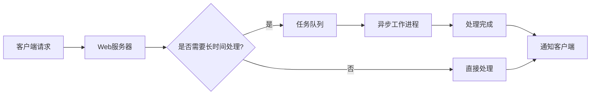

2. 任务队列实现

任务队列用于存储需要异步处理的任务。常用的任务队列系统包括Celery、RabbitMQ和Redis。

Python示例（使用Celery）：

```python
from celery import Celery

app = Celery('tasks', broker='redis://localhost:6379')

@app.task
def process_model_request(input_data):
    # 模型处理逻辑
    result = large_model.process(input_data)
    return result

# 在Web应用中调用
task = process_model_request.delay(user_input)
task_id = task.id
```

3. 性能优化策略

- 使用连接池：减少创建和销毁连接的开销。
- 实现重试机制：处理临时失败的任务。
- 监控队列长度：动态调整工作进程数量。

### 9.2.2 缓存策略设计

缓存是提高系统响应速度和减轻后端压力的有效方法。

1. 多级缓存架构

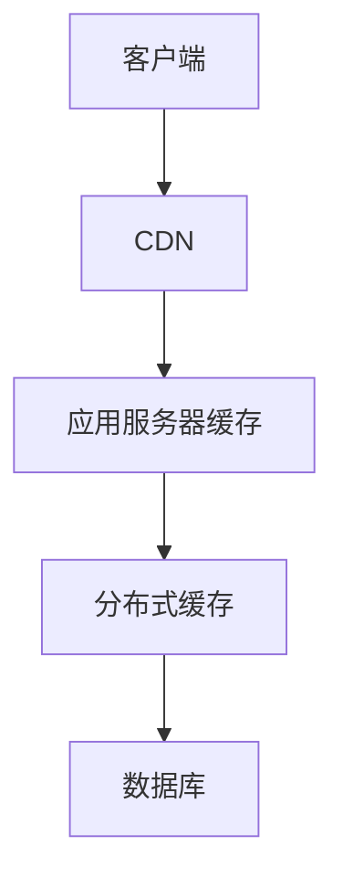

2. 缓存策略

- LRU (Least Recently Used)：淘汰最近最少使用的项。
- LFU (Least Frequently Used)：淘汰使用频率最低的项。
- FIFO (First In First Out)：先进先出策略。

3. 缓存一致性

使用版本控制或失效标记确保缓存与数据源保持一致。

Python示例（使用Redis）：

```python
import redis
import json

r = redis.Redis(host='localhost', port=6379, db=0)

def get_model_result(input_data):
    cache_key = f"model_result:{hash(input_data)}"
    cached_result = r.get(cache_key)
    
    if cached_result:
        return json.loads(cached_result)
    
    result = large_model.process(input_data)
    r.setex(cache_key, 3600, json.dumps(result))  # 缓存1小时
    return result
```

4. 缓存预热

在系统启动或更新后，主动填充缓存以提高初始响应速度。

### 9.2.3 负载均衡和自动扩缩容

负载均衡和自动扩缩容是处理流量波动和确保系统可用性的关键技术。

1. 负载均衡算法

- 轮询（Round Robin）：按顺序将请求分配给后端服务器。
- 最少连接（Least Connections）：将请求发送到当前连接数最少的服务器。
- IP哈希（IP Hash）：基于客户端IP地址将请求分配到固定的服务器。

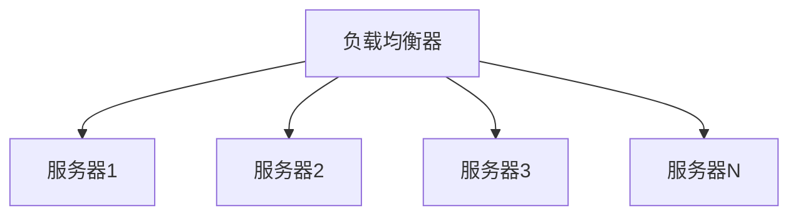

2. 自动扩缩容策略

- 基于CPU使用率
- 基于内存使用率
- 基于请求队列长度
- 基于响应时间

Python示例（使用Kubernetes HPA）：

```yaml
apiVersion: autoscaling/v2beta1
kind: HorizontalPodAutoscaler
metadata:
  name: model-service-hpa
spec:
  scaleTargetRef:
    apiVersion: apps/v1
    kind: Deployment
    name: model-service
  minReplicas: 2
  maxReplicas: 10
  metrics:
  - type: Resource
    resource:
      name: cpu
      targetAverageUtilization: 50
```

3. 无状态设计

确保应用服务可以水平扩展，将状态信息存储在外部系统（如Redis或数据库）中。

4. 灰度发布

使用蓝绿部署或金丝雀发布策略，逐步更新服务，降低风险。

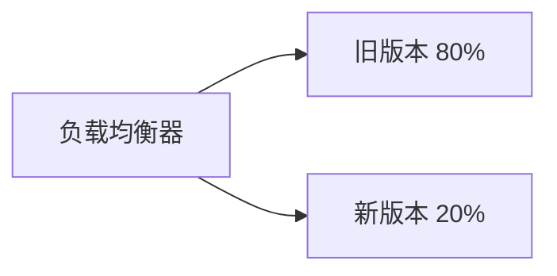

通过实施这些高并发服务优化策略，可以显著提高大模型应用的性能和可靠性。异步处理和任务队列能够有效管理长时间运行的任务，缓存策略可以减少不必要的计算和数据库访问，而负载均衡和自动扩缩容则确保了系统能够适应不同的负载情况。

在实际应用中，这些策略通常需要结合使用，并根据具体的业务需求和系统特点进行调整。持续监控和优化是保持高性能的关键。

## 9.3 监控与性能分析

### 9.3.1 日志管理和分析

有效的日志管理和分析是诊断问题、优化性能和确保系统安全的基础。

1. 日志级别

- DEBUG：详细的调试信息
- INFO：一般信息
- WARNING：警告信息
- ERROR：错误信息
- CRITICAL：严重错误信息

2. 结构化日志

使用JSON格式记录日志，便于后续分析和处理。

Python示例：

```python
import logging
import json

logger = logging.getLogger(__name__)

def log_model_request(input_data, result, processing_time):
    log_entry = {
        "event": "model_request",
        "input": input_data,
        "result": result,
        "processing_time": processing_time
    }
    logger.info(json.dumps(log_entry))
```

3. 集中式日志管理

使用ELK栈（Elasticsearch, Logstash, Kibana）或类似工具集中管理和分析日志。


4. 日志分析技术

- 正则表达式匹配
- 机器学习异常检测
- 时间序列分析

5. 日志轮转和保留策略

定期轮转日志文件，设置合理的保留期限，避免磁盘空间耗尽。

### 9.3.2 性能指标监控

监控关键性能指标（KPI）对于及时发现和解决问题至关重要。

1. 系统级指标

- CPU使用率
- 内存使用率
- 磁盘I/O
- 网络吞吐量

2. 应用级指标

- 请求响应时间
- 吞吐量（QPS/TPS）
- 错误率
- 并发用户数

3. 模型特定指标

- 推理时间
- 模型加载时间
- GPU利用率
- 批处理大小

4. 监控工具

- Prometheus + Grafana：开源监控解决方案
- Datadog：商业化全栈监控平台
- New Relic：应用性能监控

Python示例（使用Prometheus客户端）：

```python
from prometheus_client import Counter, Histogram
from prometheus_client import start_http_server

REQUEST_COUNT = Counter('model_requests_total', 'Total model requests')
REQUEST_LATENCY = Histogram('model_request_latency_seconds', 'Model request latency')

@REQUEST_LATENCY.time()
def process_model_request(input_data):
    REQUEST_COUNT.inc()
    # 模型处理逻辑
    result = large_model.process(input_data)
    return result

if __name__ == '__main__':
    start_http_server(8000)  # 启动Prometheus指标服务器
    # 主应用逻辑
```

5. 告警策略

设置合理的告警阈值，使用多种通知渠道（如邮件、短信、Slack）及时通知相关人员。

### 9.3.3 分布式追踪系统

在微服务架构中，分布式追踪系统可以帮助理解请求在不同服务间的流转过程和性能瓶颈。

1. OpenTelemetry

OpenTelemetry是一个开源的可观测性框架，提供了统一的API和工具来收集traces、metrics和logs。

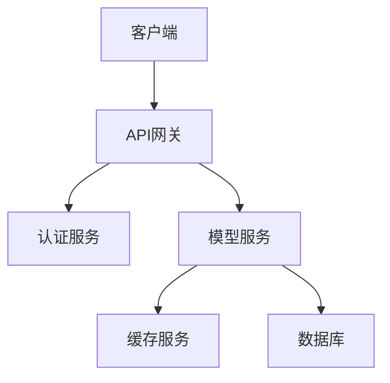

2. 追踪上下文传播

确保追踪信息在不同服务间正确传递。

Python示例（使用OpenTelemetry）：

```python
from opentelemetry import trace
from opentelemetry.sdk.trace import TracerProvider
from opentelemetry.sdk.trace.export import ConsoleSpanExporter
from opentelemetry.sdk.trace.export import BatchSpanProcessor

provider = TracerProvider()
processor = BatchSpanProcessor(ConsoleSpanExporter())
provider.add_span_processor(processor)
trace.set_tracer_provider(provider)

tracer = trace.get_tracer(__name__)

def process_model_request(input_data):
    with tracer.start_as_current_span("model_processing"):
        # 模型处理逻辑
        result = large_model.process(input_data)
        return result
```

3. 采样策略

- 固定比率采样：随机采样固定比例的请求
- 动态采样：根据系统负载动态调整采样率
- 优先级采样：对重要请求或错误请求进行全量采样

4. 性能分析

- 热点路径分析：识别系统中最频繁和最耗时的调用路径
- 服务依赖分析：可视化服务间的调用关系和依赖程度
- 异常检测：快速定位导致错误的服务和调用

5. 最佳实践

- 使用唯一请求ID贯穿整个调用链
- 在追踪中包含足够的上下文信息
- 集成日志和指标，提供全面的可观测性

通过实施这些监控与性能分析策略，可以全面了解大模型应用的运行状况，快速识别和解决问题，持续优化系统性能。

结合日志管理、性能指标监控和分布式追踪，我们可以构建一个强大的可观测性平台，为大模型应用的稳定运行和持续优化提供有力支持。

# 10 AI 伦理与安全

## 10.1 AI 伦理问题

随着AI技术的快速发展和广泛应用，AI伦理问题日益凸显。作为AI大模型工程师，我们不仅需要关注技术实现，还要深入思考AI应用可能带来的社会影响和伦理挑战。

### 10.1.1 偏见和公平性

AI系统的偏见和不公平性是当前最受关注的伦理问题之一。这些偏见可能源于训练数据、算法设计或者开发者的无意识偏见。

1. 偏见的来源

- 数据偏见：训练数据中存在的历史偏见或者采样偏差
- 算法偏见：算法设计中的固有偏见
- 交互偏见：AI系统与用户交互过程中产生的偏见

2. 公平性度量

为了量化和评估AI系统的公平性，研究人员提出了多种度量标准：

- 统计性质：确保不同群体在预测结果上的统计指标相似
- 错误率平等：确保不同群体的假阳性率和假阴性率相近
- 预测值平等：确保对不同群体的预测准确度相似

数学表示：

假设我们有两个群体A和B，$Y$是真实标签，$\hat{Y}$是预测标签，则统计性质公平可以表示为：

$$P(\hat{Y}=1|A) = P(\hat{Y}=1|B)$$

错误率平等可以表示为：

$$P(\hat{Y}=1|Y=0,A) = P(\hat{Y}=1|Y=0,B)$$
$$P(\hat{Y}=0|Y=1,A) = P(\hat{Y}=0|Y=1,B)$$

3. 减少偏见的策略

- 数据多样性：确保训练数据包含多样化的样本
- 算法去偏：在模型训练过程中加入去偏约束
- 后处理调整：对模型输出进行后处理以平衡不同群体的结果

Python示例（使用AIF360库进行偏见检测和缓解）：

```python
from aif360.datasets import BinaryLabelDataset
from aif360.metrics import BinaryLabelDatasetMetric
from aif360.algorithms.preprocessing import Reweighing

# 加载数据集
dataset = BinaryLabelDataset(...)

# 计算初始偏见
metric = BinaryLabelDatasetMetric(dataset, unprivileged_groups=[{'race': 0}], privileged_groups=[{'race': 1}}])
initial_bias = metric.statistical_parity_difference()

# 应用重新加权算法
rw = Reweighing(unprivileged_groups=[{'race': 0}], privileged_groups=[{'race': 1}])
dataset_transformed = rw.fit_transform(dataset)

# 计算处理后的偏见
metric_transformed = BinaryLabelDatasetMetric(dataset_transformed, 
                                              unprivileged_groups=[{'race': 0}], 
                                              privileged_groups=[{'race': 1}])
final_bias = metric_transformed.statistical_parity_difference()

print(f"Initial bias: {initial_bias}")
print(f"Bias after mitigation: {final_bias}")
```

4. 公平性与性能权衡

在追求公平性的同时，我们需要权衡模型的整体性能。有时，强制实现某种形式的公平可能会降低模型的预测准确性。

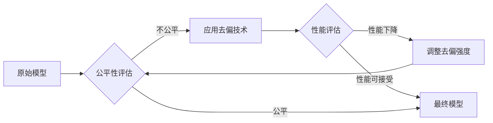

### 10.1.2 隐私保护

随着AI系统处理的数据量不断增加，保护用户隐私成为一个关键的伦理问题。

1. 数据最小化原则

只收集和处理必要的个人数据，避免过度收集。

2. 数据匿名化技术

- K-匿名性：确保每个记录至少与其他k-1个记录无法区分
- L-多样性：确保每个等价类中至少有L个不同的敏感属性值
- T-接近度：控制等价类中敏感属性的分布

数学表示：

对于K-匿名性，如果数据集D满足K-匿名性，则：

$$\forall t \in D, |\{t' \in D | QI(t) = QI(t')\}| \geq k$$

其中QI(t)表示记录t的准标识符集合。

3. 差分隐私

差分隐私是一种强大的隐私保护机制，它通过向查询结果添加精心设计的噪声来保护个体隐私。

数学定义：

一个随机算法M满足ε-差分隐私，如果对于任意两个相邻数据集D和D'，以及任意输出集合S，有：

$$P[M(D) \in S] \leq e^\varepsilon \cdot P[M(D') \in S]$$

Python示例（使用差分隐私计算平均值）：

```python
import numpy as np

def noisy_mean(data, epsilon):
    true_mean = np.mean(data)
    sensitivity = (np.max(data) - np.min(data)) / len(data)
    noise = np.random.laplace(0, sensitivity / epsilon)
    return true_mean + noise

# 使用示例
data = [1, 2, 3, 4, 5]
epsilon = 0.1
private_mean = noisy_mean(data, epsilon)
print(f"Private mean: {private_mean}")
```

4. 联邦学习

联邦学习允许多个参与方在不共享原始数据的情况下共同训练模型，有效保护了数据隐私。

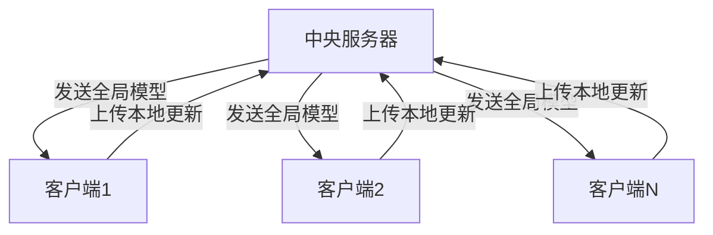

### 10.1.3 透明度和可解释性

AI系统的决策过程往往被视为"黑箱"，缺乏透明度和可解释性。这不仅影响了用户对AI的信任，也可能导致潜在的歧视和不公平。

1. 模型可解释性技术

- LIME (Local Interpretable Model-agnostic Explanations)：通过局部线性近似解释模型决策
- SHAP (SHapley Additive exPlanations)：基于博弈论的特征重要性解释方法
- 注意力机制可视化：在深度学习模型中可视化注意力权重

Python示例（使用SHAP解释模型决策）：

```python
import shap
import xgboost as xgb

# 训练模型
model = xgb.XGBRegressor().fit(X_train, y_train)

# 计算SHAP值
explainer = shap.TreeExplainer(model)
shap_values = explainer.shap_values(X_test)

# 可视化
shap.summary_plot(shap_values, X_test)
```

2. 决策过程记录

记录AI系统的决策过程，包括使用的数据、算法和参数，以便于审计和问责。

3. 用户友好的解释

将技术性的解释转化为用户易于理解的形式，如自然语言解释或可视化图表。

4. 算法公开

在适当的情况下，公开算法的核心原理和关键参数，增加透明度。

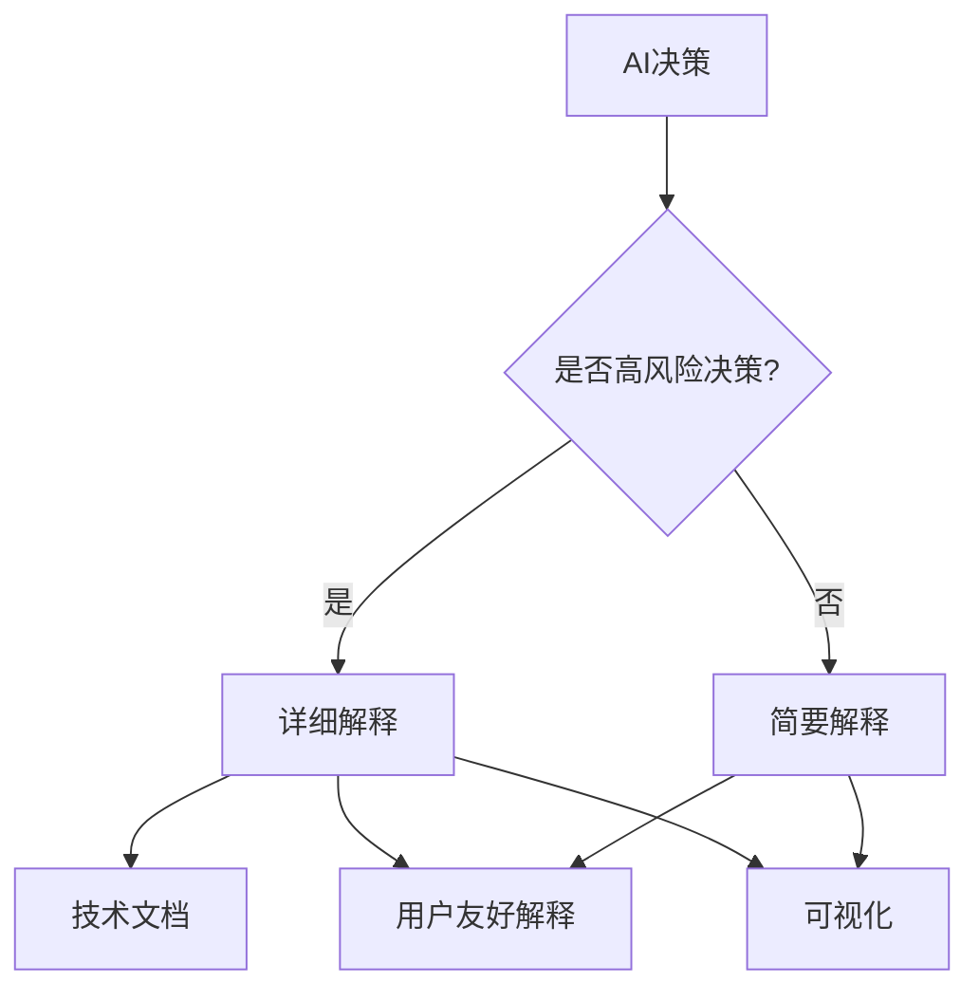

5. 可解释性与性能权衡

提高模型可解释性可能会影响其性能。需要在可解释性和模型性能之间找到平衡点。

通过关注这些AI伦理问题，我们可以构建更加公平、安全和透明的AI系统。作为AI大模型工程师，我们有责任在技术实现的同时，考虑这些伦理问题，并将伦理原则融入到整个AI开发生命周期中。

## 10.2 大模型安全威胁

随着AI大模型的广泛应用，其面临的安全威胁也日益增多。了解这些威胁并采取相应的防御措施对于确保AI系统的安全性和可靠性至关重要。

### 10.2.1 对抗性攻击

对抗性攻击是指通过精心设计的输入来欺骗AI模型，使其产生错误的输出。这种攻击可能导致严重的安全问题，特别是在关键应用领域如自动驾驶、医疗诊断等。

1. 攻击类型

- 白盒攻击：攻击者完全了解模型结构和参数
- 黑盒攻击：攻击者只能通过查询模型获取信息
- 有目标攻击：试图使模型输出特定的错误结果
- 无目标攻击：只需使模型输出任何错误结果

2. 常见攻击方法

- FGSM (Fast Gradient Sign Method)：利用梯度信息快速生成对抗样本
- PGD (Projected Gradient Descent)：通过多步优化生成更强的对抗样本
- Carlini & Wagner Attack：一种强大的优化基础攻击方法

数学表示：

FGSM攻击可以表示为：

$$x_{adv} = x + \epsilon \cdot sign(\nabla_x J(\theta, x, y))$$

其中，$x$是原始输入，$\epsilon$是扰动大小，$J$是损失函数，$\theta$是模型参数，$y$是真实标签。

Python示例（使用FGSM生成对抗样本）：

```python
import torch
import torch.nn.functional as F

def fgsm_attack(image, epsilon, data_grad):
    # 收集数据梯度的元素符号
    sign_data_grad = data_grad.sign()
    # 创建扰动图像
    perturbed_image = image + epsilon * sign_data_grad
    # 添加剪切以维持[0,1]范围
    perturbed_image = torch.clamp(perturbed_image, 0, 1)
    return perturbed_image

# 在训练循环中使用
for data, target in dataloader:
    data, target = data.to(device), target.to(device)
    data.requires_grad = True
    output = model(data)
    loss = F.nll_loss(output, target)
    loss.backward()

    # 生成对抗样本
    perturbed_data = fgsm_attack(data, epsilon=0.01, data_grad=data.grad.data)
    
    # 使用对抗样本重新训练
    output = model(perturbed_data)
    loss = F.nll_loss(output, target)
    optimizer.zero_grad()
    loss.backward()
    optimizer.step()
```

3. 对抗样本的转移性

对抗样本往往具有转移性，即为一个模型生成的对抗样本可能也能欺骗其他模型。这使得黑盒攻击成为可能。

4. 视觉上的不可察觉性

许多对抗性攻击在视觉上是不可察觉的，这增加了检测和防御的难度。

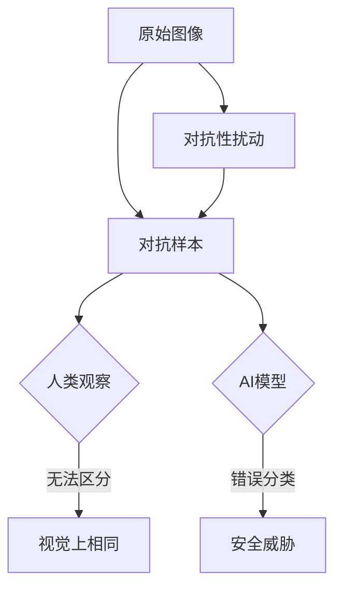

### 10.2.2 数据投毒

数据投毒是指攻击者通过污染训练数据来影响模型的行为。这种攻击可能发生在模型训练之前或在线学习过程中。

1. 投毒攻击类型

- 标签翻转：改变部分训练样本的标签
- 特征投毒：修改训练样本的特征
- 清洁标签攻击：在不改变标签的情况下修改样本，使模型在测试时出错

2. 后门攻击

后门攻击是一种特殊的数据投毒攻击，攻击者在模型中植入"后门"，使模型在遇到特定触发器时表现异常。

Python示例（简单的标签翻转攻击）：

```python
import numpy as np

def poison_data(X, y, poison_rate=0.1):
    num_samples = len(y)
    num_poison = int(num_samples * poison_rate)
    poison_idx = np.random.choice(num_samples, num_poison, replace=False)
    
    # 翻转选中样本的标签
    y_poisoned = y.copy()
    y_poisoned[poison_idx] = 1 - y_poisoned[poison_idx]
    
    return X, y_poisoned

# 使用示例
X_train_poisoned, y_train_poisoned = poison_data(X_train, y_train, poison_rate=0.05)
```

3. 数据投毒的影响

- 模型性能下降
- 特定样本的错误分类
- 模型后门的植入

4. 检测方法

- 异常检测：识别训练数据中的异常样本
- 交叉验证：使用多个数据子集训练模型并比较性能
- 数据清洗：在训练前对数据进行预处理和筛选

### 10.2.3 模型逆向工程

模型逆向工程是指通过黑盒访问或部分信息重建AI模型的过程。这可能导致知识产权泄露或为进一步的攻击提供信息。

1. 模型窃取攻击

通过大量查询目标模型，训练一个功能相似的"替代模型"。

2. 成员推理攻击

判断某个数据样本是否被用于训练特定模型，可能导致隐私泄露。

Python示例（简单的成员推理攻击）：

```python
import numpy as np
from sklearn.model_selection import train_test_split
from sklearn.metrics import accuracy_score

def member_inference_attack(target_model, X, y, threshold=0.9):
    # 将数据分为训练集和测试集
    X_train, X_test, y_train, y_test = train_test_split(X, y, test_size=0.5)
    
    # 训练目标模型
    target_model.fit(X_train, y_train)
    
    # 对所有样本进行预测
    y_pred_proba = target_model.predict_proba(X)
    
    # 根据预测概率判断成员身份
    is_member = np.max(y_pred_proba, axis=1) > threshold
    
    # 计算攻击准确率
    true_member = np.zeros(len(X), dtype=bool)
    true_member[:len(X_train)] = True
    attack_acc = accuracy_score(true_member, is_member)
    
    return attack_acc

# 使用示例
from sklearn.ensemble import RandomForestClassifier
target_model = RandomForestClassifier()
attack_accuracy = member_inference_attack(target_model, X, y)
print(f"Member inference attack accuracy: {attack_accuracy}")
```

3. 模型反演攻击

尝试从模型输出重建训练数据，可能导致敏感信息泄露。

4. 防御策略

- 差分隐私：在训练过程中添加噪声，限制单个样本对模型的影响
- 模型压缩：减少模型参数，增加逆向工程的难度
- 预测API限制：限制模型查询次数和返回信息的详细程度

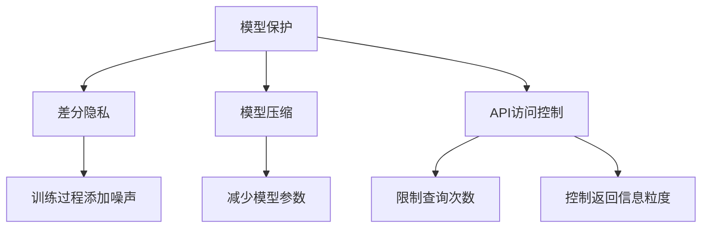

了解这些安全威胁对于开发和部署安全可靠的AI系统至关重要。作为AI大模型工程师，我们需要在模型设计、训练和部署的各个阶段都考虑这些潜在的安全问题，并采取相应的防御措施。

## 10.3 防御策略与最佳实践

为了应对AI系统面临的各种安全威胁，我们需要采取全面的防御策略，并遵循最佳实践。这些策略不仅包括技术层面的防御措施，还涉及管理和流程方面的考虑。

### 10.3.1 鲁棒性训练

鲁棒性训练旨在提高模型对对抗性样本和数据扰动的抵抗能力。

1. 对抗性训练

在训练过程中引入对抗性样本，使模型学会抵抗这些攻击。

数学表示：

对抗性训练的目标函数可以表示为：

$$\min_\theta \mathbb{E}_{(x,y)\sim D} [\max_{\delta \in S} L(f_\theta(x+\delta), y)]$$

其中，$\theta$是模型参数，$D$是数据分布，$S$是允许的扰动集合，$L$是损失函数。

Python示例（使用PGD对抗性训练）：

```python
import torch
import torch.nn as nn
import torch.optim as optim

def pgd_attack(model, images, labels, epsilon, alpha, num_iter):
    perturbed_images = images.clone().detach().requires_grad_(True)
    for i in range(num_iter):
        outputs = model(perturbed_images)
        loss = nn.CrossEntropyLoss()(outputs, labels)
        loss.backward()
        
        with torch.no_grad():
            perturbed_images = perturbed_images + alpha * perturbed_images.grad.sign()
            delta = torch.clamp(perturbed_images - images, min=-epsilon, max=epsilon)
            perturbed_images = torch.clamp(images + delta, min=0, max=1).detach_()
    
    return perturbed_images

def adversarial_train(model, train_loader, optimizer, epsilon, alpha, num_iter):
    model.train()
    for batch_idx, (data, target) in enumerate(train_loader):
        data, target = data.to(device), target.to(device)
        
        # 生成对抗样本
        perturbed_data = pgd_attack(model, data, target, epsilon, alpha, num_iter)
        
        optimizer.zero_grad()
        output = model(perturbed_data)
        loss = nn.CrossEntropyLoss()(output, target)
        loss.backward()
        optimizer.step()
```

2. 数据增强

通过添加噪声、旋转、缩放等操作增加训练数据的多样性，提高模型的泛化能力。

3. 集成学习

训练多个模型并集成它们的预测结果，可以提高模型的鲁棒性。

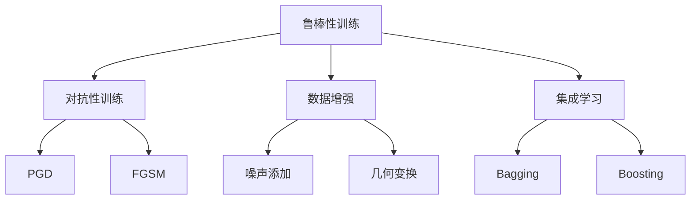

### 10.3.2 差分隐私

差分隐私是一种强大的隐私保护机制，可以有效防止模型逆向工程和成员推理攻击。

1. 噪声添加

在训练过程中或查询结果中添加精心设计的噪声。

2. 隐私预算

控制允许泄露的隐私信息量，通过累积隐私损失来跟踪。

Python示例（使用差分隐私训练神经网络）：

```python
import torch
from opacus import PrivacyEngine

def train_with_privacy(model, train_loader, optimizer, epochs, max_grad_norm, epsilon, delta):
    privacy_engine = PrivacyEngine(
        model,
        batch_size=train_loader.batch_size,
        sample_size=len(train_loader.dataset),
        alphas=[1 + x / 10.0 for x in range(1, 100)] + list(range(12, 64)),
        noise_multiplier=1.1,
        max_grad_norm=max_grad_norm,
    )
    privacy_engine.attach(optimizer)

    for epoch in range(epochs):
        for batch_idx, (data, target) in enumerate(train_loader):
            data, target = data.to(device), target.to(device)
            optimizer.zero_grad()
            output = model(data)
            loss = nn.CrossEntropyLoss()(output, target)
            loss.backward()
            optimizer.step()

        epsilon, best_alpha = optimizer.privacy_engine.get_privacy_spent(delta)
        print(f"Epoch {epoch}: (ε = {epsilon:.2f}, δ = {delta})")

    return model
```

3. 隐私保护数据分析

开发支持差分隐私的数据分析工具和查询接口。

### 10.3.3 安全审计和合规性

定期进行安全审计和合规性检查是确保AI系统长期安全可靠运行的关键。

1. 风险评估

- 识别潜在的安全威胁和漏洞
- 评估每个威胁的影响和发生概率
- 制定相应的缓解策略

2. 安全测试

- 渗透测试：模拟真实攻击场景
- 模糊测试：使用随机或异常输入测试系统鲁棒性
- 对抗性测试：使用对抗性样本评估模型安全性

Python示例（简单的模糊测试）：

```python
import random
import string

def generate_fuzzy_input(max_length=100):
    length = random.randint(1, max_length)
    return ''.join(random.choice(string.printable) for _ in range(length))

def fuzz_test_model(model, num_tests=1000):
    for _ in range(num_tests):
        fuzzy_input = generate_fuzzy_input()
        try:
            _ = model.predict(fuzzy_input)
        except Exception as e:
            print(f"Error encountered: {e}")
            print(f"Input causing error: {fuzzy_input}")

# 使用示例
fuzz_test_model(my_model)
```

3. 合规性检查

- 确保符合相关的数据保护法规（如GDPR、CCPA等）
- 实施数据治理策略
- 保持适当的文档记录

4. 持续监控

- 实时监控系统行为和性能
- 设置异常检测机制
- 建立事件响应流程

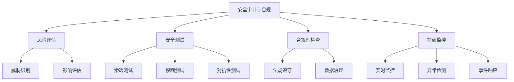

5. 最佳实践

- 最小权限原则：只给予必要的访问权限
- 安全编码实践：遵循安全编码标准，防止常见的漏洞
- 定期更新和补丁：及时应用安全更新和补丁
- 员工培训：提高团队的安全意识和技能

通过实施这些防御策略和最佳实践，我们可以显著提高AI系统的安全性和可靠性。然而，安全是一个持续的过程，需要不断地评估、更新和改进。作为AI大模型工程师，我们必须始终保持警惕，跟踪最新的安全威胁和防御技术，并将安全考虑融入到AI系统开发的每个阶段。

# 11 前沿技术与未来展望

随着AI技术的快速发展，大模型领域不断涌现新的突破和创新。本章将探讨一些前沿技术和未来发展趋势，为AI大模型工程师提供前瞻性的视角。

## 11.1 多模态大模型

多模态大模型是指能够处理和理解多种类型数据（如文本、图像、音频、视频等）的AI系统。这种模型能够在不同模态之间进行信息的融合和转换，为更复杂的任务和应用场景提供可能。

### 11.1.1 视觉-语言模型

视觉-语言模型是多模态大模型的一个重要分支，它结合了计算机视觉和自然语言处理的能力。

1. 架构设计

典型的视觉-语言模型架构包括：

- 视觉编码器：通常使用预训练的CNN（如ResNet）或Vision Transformer
- 文本编码器：通常使用BERT或其变体
- 多模态融合模块：如交叉注意力机制

数学表示：

假设我们有图像特征 $v$ 和文本特征 $t$，多模态融合可以表示为：

$$f(v, t) = \text{Attention}(W_q v, W_k t, W_v t)$$

其中，$W_q$, $W_k$, $W_v$ 是可学习的参数矩阵。

2. 预训练任务

- 掩码语言建模（MLM）
- 图像-文本匹配（ITM）
- 视觉问答（VQA）

Python示例（使用Hugging Face的transformers库实现简单的视觉-语言模型）：

```python
from transformers import ViltProcessor, ViltForQuestionAnswering
from PIL import Image
import requests

# 加载预训练模型和处理器
processor = ViltProcessor.from_pretrained("dandelin/vilt-b32-finetuned-vqa")
model = ViltForQuestionAnswering.from_pretrained("dandelin/vilt-b32-finetuned-vqa")

# 准备输入
url = "http://images.cocodataset.org/val2017/000000039769.jpg"
image = Image.open(requests.get(url, stream=True).raw)
text = "How many cats are there?"

# 处理输入
inputs = processor(image, text, return_tensors="pt")

# 模型推理
outputs = model(**inputs)
logits = outputs.logits
idx = logits.argmax(-1).item()
print("Predicted answer:", model.config.id2label[idx])
```

3. 应用场景

- 图像描述生成
- 视觉问答
- 图像检索
- 多模态对话系统

### 11.1.2 跨模态迁移学习

跨模态迁移学习旨在利用一个模态的知识来改善另一个模态的学习效果。

1. 零样本学习

利用语言模型的知识来识别未见过的视觉类别。

2. 对比学习

通过最大化不同模态之间的互信息来学习统一的表示空间。

数学表示：

对比学习的目标函数可以表示为：

$$\mathcal{L} = -\log \frac{\exp(sim(v, t) / \tau)}{\sum_{t' \in T} \exp(sim(v, t') / \tau)}$$

其中，$v$ 是图像特征，$t$ 是匹配的文本特征，$T$ 是所有可能的文本特征集合，$sim$ 是相似度函数，$\tau$ 是温度参数。

3. 知识蒸馏

将一个模态的模型知识迁移到另一个模态的模型中。

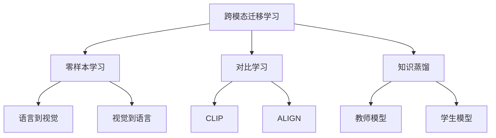

### 11.1.3 多模态应用场景

1. 智能家居和物联网

结合语音、视觉和传感器数据，实现更智能的家居控制和环境感知。

2. 自动驾驶

融合视觉、雷达和自然语言指令，提高自动驾驶系统的安全性和交互能力。

3. 医疗诊断

结合医学影像、病历文本和生理数据，辅助医生进行更准确的诊断。

4. 多模态内容创作

自动生成包含文本、图像和音频的多媒体内容。

Python示例（使用DALL-E API生成图像）：

```python
import openai
import requests
from PIL import Image
import io

openai.api_key = 'your_api_key_here'

def generate_image(prompt):
    response = openai.Image.create(
        prompt=prompt,
        n=1,
        size="512x512"
    )
    image_url = response['data'][0]['url']
    image_data = requests.get(image_url).content
    image = Image.open(io.BytesIO(image_data))
    return image

# 使用示例
prompt = "A futuristic smart home with holographic interfaces"
generated_image = generate_image(prompt)
generated_image.show()
```

多模态大模型的发展为AI应用开辟了新的可能性，但也带来了新的挑战，如模态间的对齐、计算资源需求和模型解释性等问题。未来的研究方向包括：

- 更高效的多模态融合机制
- 大规模多模态预训练数据集的构建
- 多模态模型的压缩和加速技术
- 跨语言和跨文化的多模态理解

## 11.2 持续学习与适应

传统的机器学习模型通常在固定的数据集上训练，然后部署使用。然而，在实际应用中，数据分布可能会随时间变化，这就需要模型能够持续学习和适应新的情况。

### 11.2.1 在线学习技术

在线学习允许模型在接收到新数据时进行实时更新，而不需要重新训练整个模型。

1. 随机梯度下降（SGD）

SGD是在线学习的基础，它允许模型使用单个样本或小批量样本进行参数更新。

数学表示：

SGD的参数更新规则：

$$\theta_{t+1} = \theta_t - \eta \nabla L(\theta_t, x_t, y_t)$$

其中，$\theta_t$ 是当前参数，$\eta$ 是学习率，$L$ 是损失函数，$(x_t, y_t)$ 是当前样本。

2. 自适应学习率方法

- AdaGrad：根据参数的历史梯度调整学习率
- RMSprop：使用移动平均来调整学习率
- Adam：结合动量和自适应学习率

Python示例（使用PyTorch实现简单的在线学习）：

```python
import torch
import torch.nn as nn
import torch.optim as optim

class OnlineModel(nn.Module):
    def __init__(self, input_dim, output_dim):
        super(OnlineModel, self).__init__()
        self.linear = nn.Linear(input_dim, output_dim)
    
    def forward(self, x):
        return self.linear(x)

def online_train(model, optimizer, data_stream):
    model.train()
    for x, y in data_stream:
        optimizer.zero_grad()
        output = model(x)
        loss = nn.MSELoss()(output, y)
        loss.backward()
        optimizer.step()
        yield loss.item()

# 使用示例
model = OnlineModel(10, 1)
optimizer = optim.Adam(model.parameters(), lr=0.01)
data_stream = iter([(torch.randn(1, 10), torch.randn(1, 1)) for _ in range(1000)])

for loss in online_train(model, optimizer, data_stream):
    print(f"Loss: {loss:.4f}")
```

3. 概念漂移检测

在线学习系统需要能够检测数据分布的变化，并相应地调整模型。

- ADWIN（Adaptive Windowing）算法
- Page-Hinkley测试

### 11.2.2 终身学习系统

终身学习系统旨在使模型能够持续学习新任务，同时保留之前学到的知识。

1. 灾难性遗忘问题

当模型学习新任务时，可能会忘记之前学到的知识，这被称为灾难性遗忘。

2. 解决方案

- 弹性权重整合（EWC）：通过添加正则化项来保护重要的参数
- 渐进神经网络：为新任务添加新的神经元，同时冻结旧任务的参数
- 记忆重放：存储旧任务的样本，在学习新任务时同时回顾旧样本

数学表示：

EWC的损失函数：

$$L(\theta) = L_B(\theta) + \lambda \sum_i \frac{F_i}{2}(\theta_i - \theta_{A,i})^2$$

其中，$L_B$ 是新任务的损失，$F_i$ 是参数重要性，$\theta_{A,i}$ 是旧任务的最优参数。

3. 元学习

元学习，或称"学会学习"，旨在使模型能够快速适应新任务。

- MAML（Model-Agnostic Meta-Learning）
- Reptile算法

Python示例（使用learn2learn库实现MAML）：

```python
import learn2learn as l2l
import torch

def fast_adapt(batch, learner, loss, adaptation_steps, shots, ways, device):
    data, labels = batch
    data, labels = data.to(device), labels.to(device)

    # Separate data into adaptation/evaluation sets
    adaptation_indices = np.zeros(data.size(0), dtype=bool)
    adaptation_indices[np.arange(shots*ways) * 2] = True
    evaluation_indices = torch.from_numpy(~adaptation_indices)
    adaptation_indices = torch.from_numpy(adaptation_indices)
    adaptation_data, adaptation_labels = data[adaptation_indices], labels[adaptation_indices]
    evaluation_data, evaluation_labels = data[evaluation_indices], labels[evaluation_indices]

    # Adapt the model
    for step in range(adaptation_steps):
        train_error = loss(learner(adaptation_data), adaptation_labels)
        learner.adapt(train_error)

    # Evaluate the adapted model
    predictions = learner(evaluation_data)
    valid_error = loss(predictions, evaluation_labels)
    valid_accuracy = accuracy(predictions, evaluation_labels)
    return valid_error, valid_accuracy

model = l2l.vision.models.MiniImagenetCNN(ways)
model.to(device)
maml = l2l.algorithms.MAML(model, lr=fast_lr, first_order=False)
opt = torch.optim.Adam(maml.parameters(), meta_lr)

for iteration in range(num_iterations):
    opt.zero_grad()
    meta_train_error = 0.0
    meta_train_accuracy = 0.0
    meta_valid_error = 0.0
    meta_valid_accuracy = 0.0

    # Compute meta-training loss
    for task in range(meta_batch_size):
        # Compute loss for adaptation
        learner = maml.clone()
        batch = train_tasks.sample()
        evaluation_error, evaluation_accuracy = fast_adapt(batch,
                                                           learner,
                                                           loss,
                                                           adaptation_steps,
                                                           shots,
                                                           ways,
                                                           device)
        meta_train_error += evaluation_error.item()
        meta_train_accuracy += evaluation_accuracy.item()

    # Compute meta-validation loss
    for task in range(meta_batch_size):
        learner = maml.clone()
        batch = valid_tasks.sample()
        evaluation_error, evaluation_accuracy = fast_adapt(batch,
                                                           learner,
                                                           loss,
                                                           adaptation_steps,
                                                           shots,
                                                           ways,
                                                           device)
        meta_valid_error += evaluation_error.item()
        meta_valid_accuracy += evaluation_accuracy.item()

    # Print some metrics
    print('\n')
    print('Iteration', iteration)
    print('Meta Train Error', meta_train_error / meta_batch_size)
    print('Meta Train Accuracy', meta_train_accuracy / meta_batch_size)
    print('Meta Valid Error', meta_valid_error / meta_batch_size)
    print('Meta Valid Accuracy', meta_valid_accuracy / meta_batch_size)

    # Average the accumulated gradients and optimize
    for p in maml.parameters():
        p.grad.data.mul_(1.0 / meta_batch_size)
    opt.step()
```

### 11.2.3 快速领域适应

快速领域适应技术旨在使模型能够快速适应新的数据分布或任务领域。

1. 领域对抗训练

通过对抗学习使模型学习领域不变的特征表示。

2. 少样本学习

利用少量样本快速适应新任务或领域。

- 原型网络（Prototypical Networks）
- 关系网络（Relation Networks）

3. 自监督学习

利用无标签数据学习通用表示，以便快速适应下游任务。

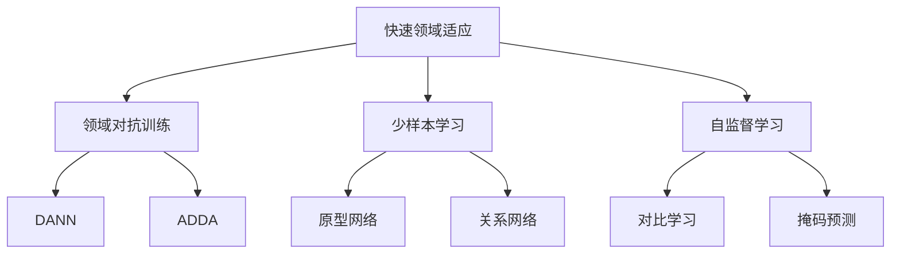

持续学习与适应技术的发展将使AI系统更加灵活和实用，能够在动态变化的环境中保持高性能。然而，这些技术也面临着诸如计算效率、模型复杂度和可解释性等挑战。未来的研究方向包括：

- 更高效的终身学习算法
- 大规模持续学习系统的架构设计
- 结合神经科学insights的学习机制
- 可解释的持续学习模型

## 11.3 AI 系统工程

随着AI模型和应用的复杂度不断增加，AI系统工程变得越来越重要。它涉及到如何设计、构建和维护大规模AI系统，以及如何优化整个AI开发和部署流程。

### 11.3.1 AutoML 和神经架构搜索

AutoML（自动机器学习）旨在自动化机器学习流程中的各个步骤，包括特征工程、模型选择和超参数优化。神经架构搜索（NAS）是AutoML的一个重要分支，专注于自动设计神经网络架构。

1. 搜索空间设计

定义可能的神经网络架构的�间。

- 宏观搜索空间：搜索整体网络结构
- 微观搜索空间：搜索网络中的基本单元（如卷积块）

2. 搜索策略

- 强化学习：将架构设计视为一个序列决策问题
- 进化算法：使用遗传算法来优化网络架构
- 梯度下降：将架构参数连续化，使用梯度下降优化

3. 性能估计策略

- 完整训练：准确但计算成本高
- 早停法：在训练早期阶段估计性能
- 权重共享：在不同架构间共享权重以加速评估

Python示例（使用DARTS进行简单的神经架构搜索）：

```python
import torch
import torch.nn as nn
from torch.autograd import Variable

class MixedOp(nn.Module):
    def __init__(self, C, stride):
        super(MixedOp, self).__init__()
        self._ops = nn.ModuleList()
        for primitive in PRIMITIVES:
            op = OPS[primitive](C, stride, False)
            if 'pool' in primitive:
                op = nn.Sequential(op, nn.BatchNorm2d(C, affine=False))
            self._ops.append(op)

    def forward(self, x, weights):
        return sum(w * op(x) for w, op in zip(weights, self._ops))

class Cell(nn.Module):
    def __init__(self, steps, multiplier, C_prev_prev, C_prev, C, reduction, reduction_prev):
        super(Cell, self).__init__()
        self.reduction = reduction
        if reduction_prev:
            self.preprocess0 = FactorizedReduce(C_prev_prev, C)
        else:
            self.preprocess0 = ReLUConvBN(C_prev_prev, C, 1, 1, 0)
        self.preprocess1 = ReLUConvBN(C_prev, C, 1, 1, 0)
        self._steps = steps
        self._multiplier = multiplier

        self._ops = nn.ModuleList()
        self._bns = nn.ModuleList()
        for i in range(self._steps):
            for j in range(2+i):
                stride = 2 if reduction and j < 2 else 1
                op = MixedOp(C, stride)
                self._ops.append(op)

    def forward(self, s0, s1, weights):
        s0 = self.preprocess0(s0)
        s1 = self.preprocess1(s1)

        states = [s0, s1]
        offset = 0
        for i in range(self._steps):
            s = sum(self._ops[offset+j](h, weights[offset+j]) for j, h in enumerate(states))
            offset += len(states)
            states.append(s)

        return torch.cat(states[-self._multiplier:], dim=1)

class Network(nn.Module):
    def __init__(self, C, num_classes, layers, criterion, steps=4, multiplier=4, stem_multiplier=3):
        super(Network, self).__init__()
        self._C = C
        self._num_classes = num_classes
        self._layers = layers
        self._criterion = criterion
        self._steps = steps
        self._multiplier = multiplier

        C_curr = stem_multiplier*C
        self.stem = nn.Sequential(
            nn.Conv2d(3, C_curr, 3, padding=1, bias=False),
            nn.BatchNorm2d(C_curr)
        )

        C_prev_prev, C_prev, C_curr = C_curr, C_curr, C
        self.cells = nn.ModuleList()
        reduction_prev = False
        for i in range(layers):
            if i in [layers//3, 2*layers//3]:
                C_curr *= 2
                reduction = True
            else:
                reduction = False
            cell = Cell(steps, multiplier, C_prev_prev, C_prev, C_curr, reduction, reduction_prev)
            reduction_prev = reduction
            self.cells += [cell]
            C_prev_prev, C_prev = C_prev, multiplier*C_curr

        self.global_pooling = nn.AdaptiveAvgPool2d(1)
        self.classifier = nn.Linear(C_prev, num_classes)

        self._initialize_alphas()

    def forward(self, input):
        s0 = s1 = self.stem(input)
        for i, cell in enumerate(self.cells):
            if cell.reduction:
                weights = F.softmax(self.alphas_reduce, dim=-1)
            else:
                weights = F.softmax(self.alphas_normal, dim=-1)
            s0, s1 = s1, cell(s0, s1, weights)
        out = self.global_pooling(s1)
        logits = self.classifier(out.view(out.size(0),-1))
        return logits

    def _initialize_alphas(self):
        k = sum(1for i in range(self._steps) for n in range(2+i))
        num_ops = len(PRIMITIVES)

        self.alphas_normal = Variable(1e-3*torch.randn(k, num_ops).cuda(), requires_grad=True)
        self.alphas_reduce = Variable(1e-3*torch.randn(k, num_ops).cuda(), requires_grad=True)
        self._arch_parameters = [
            self.alphas_normal,
            self.alphas_reduce,
        ]

    def arch_parameters(self):
        return self._arch_parameters

# 使用示例
model = Network(C=16, num_classes=10, layers=8, criterion=nn.CrossEntropyLoss())
optimizer = torch.optim.SGD(model.parameters(), lr=0.025, momentum=0.9, weight_decay=3e-4)
architect = Architect(model, args)

for epoch in range(50):
    # 训练
    train(train_queue, valid_queue, model, architect, criterion, optimizer, lr)
    # 评估
    valid_acc, valid_obj = infer(valid_queue, model, criterion)
```

4. 效率优化

- 一次性架构搜索：同时搜索多个任务的架构
- 渐进式架构搜索：逐步增加搜索空间的复杂度
- 基于代理的搜索：使用低成本的代理任务来评估架构

### 11.3.2 联邦学习

联邦学习是一种分布式机器学习技术，允许多个参与方在不共享原始数据的情况下共同训练模型，有效保护了数据隐私。

1. 联邦平均算法（FedAvg）

基本的联邦学习算法，客户端本地更新模型，服务器聚合更新。

数学表示：

服务器聚合更新：

$$w_{t+1} = \sum_{k=1}^K \frac{n_k}{n} w_{t+1}^k$$

其中，$w_{t+1}$ 是全局模型参数，$w_{t+1}^k$ 是第k个客户端的本地模型参数，$n_k$ 是第k个客户端的数据量，$n$ 是总数据量。

2. 隐私保护机制

- 差分隐私：在聚合过程中添加噪声
- 安全多方计算：使用密码学技术保护中间计算结果
- 同态加密：允许对加密数据进行计算

3. 通信效率优化

- 梯度压缩：减少传输的梯度信息量
- 客户端选择：选择部分客户端参与每轮训练
- 异步更新：允许客户端异步提交更新

Python示例（使用PySyft实现简单的联邦学习）：

```python
import syft as sy
import torch
import torch.nn as nn
import torch.nn.functional as F
import torch.optim as optim

hook = sy.TorchHook(torch)
bob = sy.VirtualWorker(hook, id="bob")
alice = sy.VirtualWorker(hook, id="alice")

class Net(nn.Module):
    def __init__(self):
        super(Net, self).__init__()
        self.fc1 = nn.Linear(784, 64)
        self.fc2 = nn.Linear(64, 10)

    def forward(self, x):
        x = F.relu(self.fc1(x.view(-1, 784)))
        return F.log_softmax(self.fc2(x), dim=1)

def train(model, device, federated_train_loader, optimizer, epoch):
    model.train()
    for batch_idx, (data, target) in enumerate(federated_train_loader):
        model.send(data.location)
        data, target = data.to(device), target.to(device)
        optimizer.zero_grad()
        output = model(data)
        loss = F.nll_loss(output, target)
        loss.backward()
        optimizer.step()
        model.get()
        if batch_idx % 10 == 0:
            loss = loss.get()
            print('Train Epoch: {} [{}/{} ({:.0f}%)]\tLoss: {:.6f}'.format(
                epoch, batch_idx * 64, len(federated_train_loader) * 64,
                100. * batch_idx / len(federated_train_loader), loss.item()))

device = torch.device("cpu")
model = Net().to(device)
optimizer = optim.SGD(model.parameters(), lr=0.01)

federated_train_loader = sy.FederatedDataLoader(
    datasets.MNIST('../data', train=True, download=True,
                   transform=transforms.Compose([
                       transforms.ToTensor(),
                       transforms.Normalize((0.1307,), (0.3081,))
                   ])).federate((bob, alice)),
    batch_size=64, shuffle=True)

for epoch in range(1, 11):
    train(model, device, federated_train_loader, optimizer, epoch)
```

### 11.3.3 AI 芯片和硬件加速

随着AI模型的复杂度不断增加，专门的AI芯片和硬件加速器变得越来越重要。

1. GPU加速

- CUDA编程：利用NVIDIA GPU进行并行计算
- cuDNN：深度学习GPU加速库

2. TPU（Tensor Processing Unit）

Google开发的专用AI芯片，针对张量运算进行了优化。

3. FPGA（Field-Programmable Gate Array）

可编程硬件，可以根据特定AI任务进行定制。

4. ASIC（Application-Specific Integrated Circuit）

为特定AI应用设计的专用集成电路。

5. 神经网络处理器（NPU）

专门设计用于加速神经网络计算的处理器。

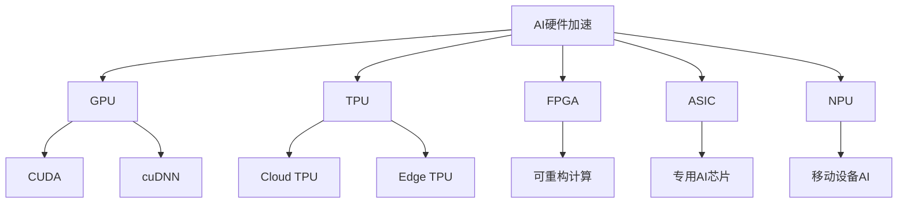

6. 量化和模型压缩

- 低精度计算：使用FP16或INT8代替FP32
- 模型剪枝：移除不重要的神经元或连接
- 知识蒸馏：将大模型的知识转移到小模型中

Python示例（使用PyTorch进行模型量化）：

```python
import torch

# 定义模型
class SimpleModel(torch.nn.Module):
    def __init__(self):
        super(SimpleModel, self).__init__()
        self.fc1 = torch.nn.Linear(784, 128)
        self.fc2 = torch.nn.Linear(128, 10)

    def forward(self, x):
        x = torch.flatten(x, 1)
        x = self.fc1(x)
        x = torch.relu(x)
        x = self.fc2(x)
        return x

# 创建模型实例
model = SimpleModel()

# 量化模型
quantized_model = torch.quantization.quantize_dynamic(
    model, {torch.nn.Linear}, dtype=torch.qint8
)

# 比较模型大小
def print_size_of_model(model):
    torch.save(model.state_dict(), "temp.p")
    print('Size (MB):', os.path.getsize("temp.p")/1e6)
    os.remove('temp.p')

print('Original Model Size:')
print_size_of_model(model)
print('Quantized Model Size:')
print_size_of_model(quantized_model)

# 比较推理速度
input_tensor = torch.randn(1, 1, 28, 28)

def time_model(model, input_tensor):
    start = time.time()
    for _ in range(100):
        _ = model(input_tensor)
    end = time.time()
    return end - start

print('Original Model Inference Time:')
print('{:.2f} seconds'.format(time_model(model, input_tensor)))
print('Quantized Model Inference Time:')
print('{:.2f} seconds'.format(time_model(quantized_model, input_tensor)))
```

AI系统工程的发展将极大地提高AI模型的开发效率和部署性能。然而，这一领域仍面临着诸如搜索效率、隐私保护、硬件兼容性等挑战。未来的研究方向包括：

- 更高效的神经架构搜索算法
- 隐私保护和联邦学习的新范式
- 针对特定AI任务的专用硬件设计
- 大规模分布式AI系统的优化技术

作为AI大模型工程师，我们需要密切关注这些前沿技术的发展，并将它们应用到实际的AI系统开发中，以构建更高效、更安全、更智能的AI应用。

# 12 职业发展与技能提升

作为AI大模型工程师，持续学习和技能提升是职业发展的关键。本章将探讨AI大模型工程师的职业路径、持续学习策略以及重要的软技能培养。

## 12.1 AI 大模型工程师职业路径

AI大模型工程师的职业发展通常遵循一定的路径，从初级工程师逐步发展到高级工程师、专家和架构师。

### 12.1.1 初级、中级、高级工程师技能要求

1. 初级AI大模型工程师（0-3年经验）

技能要求：
- 扎实的计算机科学基础知识
- 熟悉主流深度学习框架（如PyTorch、TensorFlow）
- 了解基本的自然语言处理和计算机视觉技术
- 能够实现和微调预训练模型
- 基本的数据处理和特征工程能力
- 良好的编程习惯和版本控制技能

职责：
- 参与模型训练和评估
- 协助数据预处理和清洗
- 实现基本的模型部署流程
- 编写技术文档和实验报告

2. 中级AI大模型工程师（3-5年经验）

技能要求：
- 深入理解深度学习算法和架构
- 能够设计和实现复杂的神经网络模型
- 熟练掌握分布式训练技术
- 具备模型优化和加速的能力
- 了解模型压缩和量化技术
- 具有一定的工程化和自动化能力

职责：
- 独立设计和实现AI模型
- 优化模型性能和推理效率
- 参与大规模训练任务的设计和实施
- 解决复杂的技术问题
- 指导初级工程师

3. 高级AI大模型工程师（5年以上经验）

技能要求：
- 精通多个AI领域（如NLP、CV、多模态学习等）
- 具备设计和实现前沿AI算法的能力
- 深入理解大规模分布式系统
- 具有强大的问题解决和架构设计能力
- 了解AI伦理和安全相关知识
- 具备项目管理和团队领导能力

职责：
- 领导大型AI项目的技术方向
- 设计高性能、可扩展的AI系统架构
- 研究和应用最新的AI技术
- 制定技术策略和路线图
- 指导和培养团队成员
- 与其他部门和利益相关者沟通合作

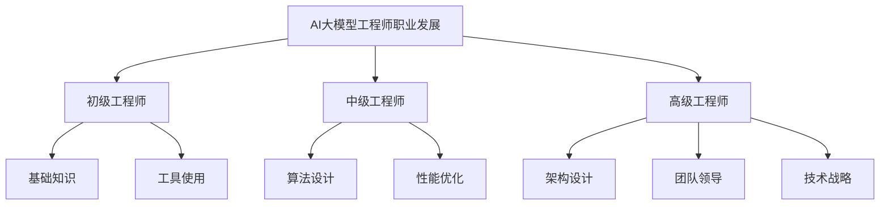

### 12.1.2 专家和架构师发展方向

1. AI研究专家

专注于推动AI技术的前沿发展。

技能要求：
- 深厚的理论基础和数学功底
- 出色的创新能力和批判性思维
- 熟悉学术研究流程和方法
- 优秀的科技写作和演讲能力

职责：
- 设计和实现创新的AI算法
- 发表高质量的研究论文
- 参与学术会议和研讨会
- 与学术界和工业界合作
- 指导研究生和博士生

2. AI系统架构师

负责设计大规模AI系统的整体架构。

技能要求：
- 深入理解分布式系统和云计算
- 精通多种编程语言和技术栈
- 具备强大的系统设计和优化能力
- 了解各种AI硬件加速技术
- 具有出色的沟通和协调能力

职责：
- 设计可扩展、高性能的AI系统架构
- 制定技术标准和最佳实践
- 评估和选择适当的技术和工具
- 优化系统性能和资源利用
- 协调跨团队的技术合作

3. AI产品专家

专注于将AI技术转化为实际产品和解决方案。

技能要求：
- 深入理解AI技术及其应用场景
- 具备产品设计和用户体验知识
- 了解市场需求和行业趋势
- 具有出色的沟通和项目管理能力
- 具备商业敏感度

职责：
- 设计AI驱动的产品和功能
- 制定产品路线图和优先级
- 协调技术团队和产品团队
- 分析用户反馈和产品指标
- 参与市场推广和客户沟通

### 12.1.3 学术研究与工业应用的选择

在AI大模型领域，工程师们常常面临学术研究和工业应用的选择。两者各有优势和挑战：

1. 学术研究

优势：
- 更大的创新自由度
- 可以专注于长期和基础性研究
- 有机会发表论文和参与学术交流
- 灵活的工作环境

挑战：
- 资金压力和申请竞争
- 发表压力（"发表或消亡"）
- 可能缺乏实际应用场景
- 薪资可能相对较低

2. 工业应用

优势：
- 直接解决实际问题
- 更好的计算资源和数据访问
- 通常有更高的薪资
- 看到工作成果快速落地

挑战：
- 可能受商业目标限制
- 工作节奏快，压力大
- 可能缺乏长期研究的机会
- 知识产权归属问题

选择建议：
- 评估个人兴趣和长期职业目标
- 考虑当前技能集和发展方向
- 了解不同领域的工作文化和环境
- 考虑尝试学术和工业的交叉合作

无论选择哪个方向，保持学习和适应能力都是关键。许多成功的AI大模型工程师在职业生涯中经历了学术和工业的多次转换。

## 12.2 持续学习策略

在AI快速发展的领域，持续学习是保持竞争力的关键。以下是一些有效的学习策略：

### 12.2.1 学术论文阅读和实践

1. 建立阅读习惯

- 每周固定时间阅读最新论文
- 使用工具如Mendeley或Zotero管理文献
- 关注顶级会议（如NeurIPS、ICML、ACL等）的论文

2. 高效阅读技巧

- 先阅读摘要、引言和结论
- 关注论文的创新点和实验结果
- 思考论文方法的优缺点和潜在改进

3. 实现论文代码

- 选择感兴趣的论文进行复现
- 使用公开数据集验证结果
- 尝试改进或扩展论文方法

Python示例（复现简化版BERT模型）：

```python
import torch
import torch.nn as nn

class SimplifiedBERT(nn.Module):
    def __init__(self, vocab_size, hidden_size, num_layers, num_heads):
        super(SimplifiedBERT, self).__init__()
        self.embedding = nn.Embedding(vocab_size, hidden_size)
        self.transformer = nn.TransformerEncoder(
            nn.TransformerEncoderLayer(hidden_size, num_heads),
            num_layers
        )
        self.fc = nn.Linear(hidden_size, vocab_size)

    def forward(self, x):
        x = self.embedding(x)
        x = self.transformer(x)
        return self.fc(x)

# 使用示例
vocab_size = 30000
hidden_size = 768
num_layers = 12
num_heads = 12

model = SimplifiedBERT(vocab_size, hidden_size, num_layers, num_heads)
input_ids = torch.randint(0, vocab_size, (32, 128))  # 批次大小为32，序列长度为128
output = model(input_ids)
print(output.shape)  # 应该是 torch.Size([32, 128, 30000])
```

### 12.2.2 开源项目参与

1. 选择合适的项目

- 从使用频繁的工具或库开始
- 关注GitHub上的热门AI项目
- 选择与个人兴趣和技能相匹配的项目

2. 贡献方式

- 修复bug和改进文档
- 添加新功能或优化性能
- 提供示例代码和教程
- 参与代码审查和讨论

3. 建立开源档案

- 维护个人GitHub账户
- 定期贡献高质量代码
- 创建自己的开源项目

### 12.2.3 技术社区和会议参与

1. 在线社区

- Stack Overflow：解答问题，提高声誉
- Reddit（如r/MachineLearning）：讨论最新进展
- Twitter：关注AI领域的专家和研究者
- LinkedIn：建立专业网络，分享见解

2. 参加会议和研讨会

- 学术会议：NeurIPS, ICML, ACL, CVPR等
- 工业会议：Google I/O, Apple WWDC, PyTorch Developer Conference等
- 本地meetup和研讨会

3. 组织和分享

- 在工作场所组织技术分享会
- 在线发表博客文章或视频教程
- 参与或组织黑客马拉松活动

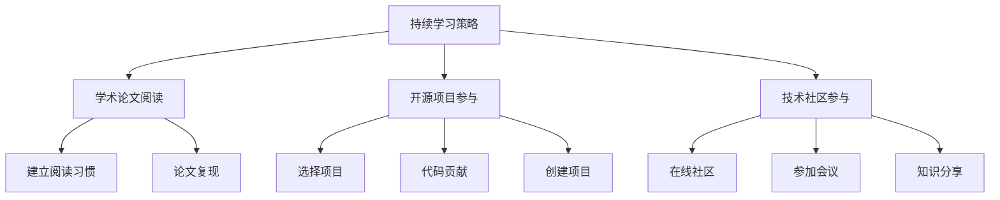

通过这些持续学习策略，AI大模型工程师可以保持知识的更新，拓展技能范围，并在快速发展的AI领域保持竞争力。

## 12.3 软技能培养

除了技术能力，软技能对AI大模型工程师的职业发展同样重要。以下是一些关键的软技能及其培养方法：

### 12.3.1 跨团队协作能力

1. 有效沟通

- 学会倾听和理解他人需求
- 清晰简洁地表达技术概念
- 适应不同受众的沟通方式

2. 冲突解决

- 保持开放和尊重的态度
- 寻找共同利益和目标
- 学会妥协和寻求双赢解决方案

3. 跨职能理解

- 了解其他团队（如产品、设计、运营）的工作流程
- 学习基本的项目管理知识
- 培养同理心，站在他人角度思考问题

培养方法：
- 参与跨部门项目
- 主动与其他团队成员交流
- 参加团队建设活动

### 12.3.2 项目管理和沟通技巧

1. 项目规划

- 学习敏捷开发方法（如Scrum、Kanban）
- 掌握任务分解和优先级设置
- 了解风险管理和资源分配

2. 时间管理

- 使用工具如Trello或Jira进行任务跟踪
- 学习番茄工作法等时间管理技巧
- 培养估算任务时间的能力

3. 汇报和演示

- 学习制作清晰简洁的幻灯片
- 练习口头表达和演讲技巧
- 掌握数据可视化和故事叙述能力

培养方法：
- 主动承担小型项目的领导角色
- 参加项目管理培训或获取相关认证
- 定期向团队或上级汇报项目进展

Python示例（使用Python进行简单的项目管理）：

```python
import datetime

class Task:
    def __init__(self, name, description, deadline, priority):
        self.name = name
        self.description = description
        self.deadline = deadline
        self.priority = priority
        self.status = "To Do"

class Project:
    def __init__(self, name):
        self.name = name
        self.tasks = []

    def add_task(self, task):
        self.tasks.append(task)

    def get_high_priority_tasks(self):
        return [task for task in self.tasks if task.priority == "High"]

    def get_upcoming_deadlines(self, days=7):
        today = datetime.date.today()
        upcoming = datetime.timedelta(days=days)
        return [task for task in self.tasks if (task.deadline - today) <= upcoming]

# 使用示例
project = Project("AI Model Deployment")

task1 = Task("Data Preprocessing", "Clean and prepare the dataset", 
             datetime.date(2023, 6, 30), "High")
task2 = Task("Model Training", "Train the AI model using prepared data", 
             datetime.date(2023, 7, 15), "High")
task3 = Task("API Development", "Develop REST API for model inference", 
             datetime.date(2023, 7, 30), "Medium")

project.add_task(task1)
project.add_task(task2)
project.add_task(task3)

print("High Priority Tasks:")
for task in project.get_high_priority_tasks():
    print(f"- {task.name}")

print("\nUpcoming Deadlines:")
for task in project.get_upcoming_deadlines():
    print(f"- {task.name}: {task.deadline}")
```

### 12.3.3 商业思维与创新能力

1. 商业意识

- 了解公司的商业模式和收入来源
- 学习基本的财务和市场知识
- 关注AI技术的商业应用和行业趋势

2. 创新思维

- 培养跨领域思考的能力
- 学习设计思维和创新方法论
- 保持好奇心，不断探索新技术和应用

3. 战略思考

- 学会从全局角度分析问题
- 培养长期思维，考虑技术选择的长远影响
- 理解技术决策对业务的影响

培养方法：
- 阅读商业案例和创新故事
- 参与头脑风暴和创新工作坊
- 尝试将AI技术应用到新的领域或问题

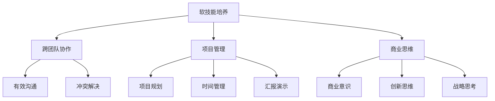

通过培养这些软技能，AI大模型工程师不仅可以提高工作效率和团队协作能力，还能更好地理解和推动AI技术的商业价值。这些技能将帮助工程师在职业发展中获得更多机会，并在组织中发挥更大的影响力。

结语：
作为AI大模型工程师，我们需要在技术能力和软技能之间找到平衡。持续学习、积极参与和不断反思是保持竞争力的关键。通过制定清晰的职业发展计划，培养全面的技能集，我们可以在这个充满机遇和挑战的领域中取得长足的进步。记住，成为一名优秀的AI大模型工程师不仅需要深厚的技术功底，还需要良好的沟通能力、团队协作精神和商业洞察力。让我们携手共进，推动AI技术的发展，为创造更智能、更美好的未来贡献自己的力量。

# 附录

## A. 常用工具和框架清单

1. 深度学习框架
    - PyTorch
    - TensorFlow
    - Keras
    - JAX

2. 自然语言处理工具
    - Hugging Face Transformers
    - spaCy
    - NLTK
    - Stanford CoreNLP

3. 计算机视觉库
    - OpenCV
    - Pillow
    - torchvision
    - imgaug

4. 数据处理和分析
    - NumPy
    - Pandas
    - Dask
    - Vaex

5. 可视化工具
    - Matplotlib
    - Seaborn
    - Plotly
    - Bokeh

6. 模型部署和服务
    - Flask
    - FastAPI
    - TensorFlow Serving
    - ONNX Runtime

7. 分布式训练
    - Horovod
    - PyTorch Distributed
    - Ray

8. 实验管理和版本控制
    - MLflow
    - Weights & Biases
    - DVC (Data Version Control)

9. 自动机器学习
    - AutoML
    - H2O.ai
    - TPOT

10. 云平台和服务
    - Amazon Web Services (AWS)
    - Google Cloud Platform (GCP)
    - Microsoft Azure
    - IBM Watson

## B. 推荐学习资源和课程

1. 在线课程
    - Coursera: Deep Learning Specialization by Andrew Ng
    - fast.ai: Practical Deep Learning for Coders
    - Udacity: Deep Learning Nanodegree
    - edX: MIT's Introduction to Deep Learning

2. 书籍
    - "Deep Learning" by Ian Goodfellow, Yoshua Bengio, and Aaron Courville
    - "Natural Language Processing with Transformers" by Lewis Tunstall, Leandro von Werra, and Thomas Wolf
    - "Hands-On Machine Learning with Scikit-Learn, Keras, and TensorFlow" by Aurélien Géron
    - "The Hundred-Page Machine Learning Book" by Andriy Burkov

3. 博客和网站
    - Distill.pub
    - Google AI Blog
    - OpenAI Blog
    - Towards Data Science on Medium

4. YouTube频道
    - Two Minute Papers
    - Yannic Kilcher
    - 3Blue1Brown
    - Lex Fridman

5. 播客
    - Lex Fridman Podcast
    - TWIML AI Podcast
    - Data Skeptic
    - Linear Digressions

6. 会议和研讨会
    - NeurIPS (Conference on Neural Information Processing Systems)
    - ICML (International Conference on Machine Learning)
    - ACL (Association for Computational Linguistics)
    - CVPR (Conference on Computer Vision and Pattern Recognition)

7. 开源项目文档
    - PyTorch Documentation
    - TensorFlow Tutorials- Hugging Face Documentation
   - Scikit-learn User Guide

8. 实践平台
    - Kaggle
    - Google Colab
    - Paperspace Gradient
    - Weights & Biases Experiments

## C. AI 大模型相关论文列表

1. Transformer架构
    - "Attention Is All You Need" (Vaswani et al., 2017)
    - "BERT: Pre-training of Deep Bidirectional Transformers for Language Understanding" (Devlin et al., 2018)
    - "GPT-3: Language Models are Few-Shot Learners" (Brown et al., 2020)

2. 模型压缩和效率
    - "DistilBERT, a distilled version of BERT: smaller, faster, cheaper and lighter" (Sanh et al., 2019)
    - "ALBERT: A Lite BERT for Self-supervised Learning of Language Representations" (Lan et al., 2019)
    - "The Lottery Ticket Hypothesis: Finding Sparse, Trainable Neural Networks" (Frankle and Carbin, 2018)

3. 多模态学习
    - "CLIP: Learning Transferable Visual Models From Natural Language Supervision" (Radford et al., 2021)
    - "DALL·E: Creating Images from Text" (Ramesh et al., 2021)
    - "ViLBERT: Pretraining Task-Agnostic Visiolinguistic Representations for Vision-and-Language Tasks" (Lu et al., 2019)

4. 持续学习和适应
    - "Progressive Neural Networks" (Rusu et al., 2016)
    - "Overcoming catastrophic forgetting in neural networks" (Kirkpatrick et al., 2017)
    - "Meta-Learning: A Survey" (Vanschoren, 2018)

5. AI系统和工程
    - "Scaling Laws for Neural Language Models" (Kaplan et al., 2020)
    - "The Hardware Lottery" (Hooker, 2020)
    - "A Survey of Deep Learning for Scientific Discovery" (Zhang et al., 2021)

## D. 术语表

1. Attention Mechanism: 注意力机制，一种允许模型关注输入的特定部分的技术。

2. Transformer: 一种基于自注意力机制的神经网络架构，广泛用于自然语言处理任务。

3. BERT (Bidirectional Encoder Representations from Transformers): 一种预训练的语言模型，使用双向上下文来理解文本。

4. GPT (Generative Pre-trained Transformer): 一系列基于Transformer的大规模语言模型，用于生成人类可读的文本。

5. Fine-tuning: 微调，在预训练模型的基础上，使用特定任务的数据进行进一步训练的过程。

6. Transfer Learning: 迁移学习，将在一个任务上学到的知识应用到另一个相关任务的技术。

7. Tokenization: 分词，将文本分割成更小单位（如单词或子词）的过程。

8. Embedding: 嵌入，将离散对象（如单词）映射到连续向量空间的技术。

9. Gradient Descent: 梯度下降，一种优化算法，用于最小化损失函数。

10. Backpropagation: 反向传播，一种计算神经网络梯度的算法。

11. Overfitting: 过拟合，模型在训练数据上表现良好但在新数据上泛化能力差的现象。

12. Regularization: 正则化，用于防止过拟合的技术。

13. Batch Normalization: 批量归一化，一种用于稳定和加速深度神经网络训练的技术。

14. Dropout: 随机失活，一种正则化技术，在训练过程中随机关闭一些神经元。

15. Epoch: 轮次，指模型遍历整个训练数据集一次的过程。

## E. 代码示例和项目模板

1. BERT微调示例

```python
from transformers import BertForSequenceClassification, BertTokenizer, Trainer, TrainingArguments
import torch
from datasets import load_dataset

# 加载预训练模型和分词器
model = BertForSequenceClassification.from_pretrained("bert-base-uncased")
tokenizer = BertTokenizer.from_pretrained("bert-base-uncased")

# 加载数据集
dataset = load_dataset("glue", "mrpc")

# 数据预处理
def preprocess_function(examples):
    return tokenizer(examples["sentence1"], examples["sentence2"], truncation=True, padding="max_length")

encoded_dataset = dataset.map(preprocess_function, batched=True)

# 定义训练参数
training_args = TrainingArguments(
    output_dir="./results",
    num_train_epochs=3,
    per_device_train_batch_size=16,
    per_device_eval_batch_size=64,
    warmup_steps=500,
    weight_decay=0.01,
    logging_dir="./logs",
)

# 初始化Trainer
trainer = Trainer(
    model=model,
    args=training_args,
    train_dataset=encoded_dataset["train"],
    eval_dataset=encoded_dataset["validation"],
)

# 开始训练
trainer.train()
```

2. 简单的图像分类项目模板

```python
import torch
import torch.nn as nn
import torch.optim as optim
from torchvision import datasets, transforms
from torch.utils.data import DataLoader

# 定义模型
class SimpleConvNet(nn.Module):
    def __init__(self):
        super(SimpleConvNet, self).__init__()
        self.conv1 = nn.Conv2d(1, 32, 3, 1)
        self.conv2 = nn.Conv2d(32, 64, 3, 1)
        self.dropout1 = nn.Dropout2d(0.25)
        self.dropout2 = nn.Dropout2d(0.5)
        self.fc1 = nn.Linear(9216, 128)
        self.fc2 = nn.Linear(128, 10)

    def forward(self, x):
        x = self.conv1(x)
        x = nn.functional.relu(x)
        x = self.conv2(x)
        x = nn.functional.relu(x)
        x = nn.functional.max_pool2d(x, 2)
        x = self.dropout1(x)
        x = torch.flatten(x, 1)
        x = self.fc1(x)
        x = nn.functional.relu(x)
        x = self.dropout2(x)
        x = self.fc2(x)
        output = nn.functional.log_softmax(x, dim=1)
        return output

# 数据加载和预处理
transform = transforms.Compose([
    transforms.ToTensor(),
    transforms.Normalize((0.1307,), (0.3081,))
])

train_dataset = datasets.MNIST('data', train=True, download=True, transform=transform)
test_dataset = datasets.MNIST('data', train=False, transform=transform)

train_loader = DataLoader(train_dataset, batch_size=64, shuffle=True)
test_loader = DataLoader(test_dataset, batch_size=1000, shuffle=False)

# 初始化模型、损失函数和优化器
device = torch.device("cuda" if torch.cuda.is_available() else "cpu")
model = SimpleConvNet().to(device)
optimizer = optim.Adam(model.parameters(), lr=0.001)
criterion = nn.CrossEntropyLoss()

# 训练函数
def train(model, device, train_loader, optimizer, epoch):
    model.train()
    for batch_idx, (data, target) in enumerate(train_loader):
        data, target = data.to(device), target.to(device)
        optimizer.zero_grad()
        output = model(data)
        loss = criterion(output, target)
        loss.backward()
        optimizer.step()
        if batch_idx % 100 == 0:
            print(f'Train Epoch: {epoch} [{batch_idx * len(data)}/{len(train_loader.dataset)}'
                  f' ({100. * batch_idx / len(train_loader):.0f}%)]\tLoss: {loss.item():.6f}')

# 测试函数
def test(model, device, test_loader):
    model.eval()
    test_loss = 0
    correct = 0
    with torch.no_grad():
        for data, target in test_loader:
            data, target = data.to(device), target.to(device)
            output = model(data)
            test_loss += criterion(output, target).item()
            pred = output.argmax(dim=1, keepdim=True)
            correct += pred.eq(target.view_as(pred)).sum().item()

    test_loss /= len(test_loader.dataset)
    print(f'\nTest set: Average loss: {test_loss:.4f}, '
          f'Accuracy: {correct}/{len(test_loader.dataset)} '
          f'({100. * correct / len(test_loader.dataset):.2f}%)\n')

# 主训练循环
num_epochs = 10
for epoch in range(1, num_epochs + 1):
    train(model, device, train_loader, optimizer, epoch)
    test(model, device, test_loader)

# 保存模型
torch.save(model.state_dict(), "mnist_cnn.pt")
```

## F. 面试准备指南

1. 技术面试准备
    - 复习机器学习和深度学习的基础概念
    - 练习常见的编程和算法问题
    - 熟悉主流深度学习框架的API和使用方法
    - 准备讨论你参与过的项目和解决的技术挑战

2. 行为面试准备
    - 准备具体的例子来说明你的团队合作能力
    - 思考你如何处理过去的困难情况或失败
    - 准备讨论你的职业目标和学习计划
    - 研究公司背景和文化，准备相关问题

3. 模拟面试问题
    - 解释Transformer架构的工作原理
    - 比较BERT和GPT模型的异同
    - 如何处理大规模语言模型的训练和部署挑战
    - 描述一个你使用迁移学习解决问题的例子
    - 如何评估和改进模型的性能
    - 讨论AI伦理问题，如隐私保护和偏见消除

4. 技术演示准备
    - 准备一个简洁的代码示例来展示你的编程技能
    - 如果可能，准备一个小型项目的演示
    - 练习在白板上绘制架构图和解释算法

5. 问题准备
    - 准备问面试官的问题，展示你对公司和职位的兴趣
    - 询问团队的工作方式和技术栈
    - 了解公司在AI领域的长期规划和挑战

6. 面试后续
    - 准备一封简短的感谢邮件
    - 反思面试过程，记录需要改进的地方
    - 继续学习和提升，无论面试结果如何

## G. 作者简介

[在这里，你可以添加一个虚构的或者真实的作者简介，展示作者在AI大模型领域的专业背景和经验。]

## H. 参考文献

1. Vaswani, A., et al. (2017). Attention is all you need. In Advances in neural information processing systems.

2. Devlin, J., et al. (2018). BERT: Pre-training of deep bidirectional transformers for language understanding. arXiv preprint arXiv:1810.04805.

3. Brown, T. B., et al. (2020). Language models are few-shot learners. arXiv preprint arXiv:2005.14165.

4. Radford, A., et al. (2021). Learning transferable visual models from natural language supervision. arXiv preprint arXiv:2103.00020.

5. Kaplan, J., et al. (2020). Scaling laws for neural language models. arXiv preprint arXiv:2001.08361.

6. Hooker, S. (2020). The hardware lottery. arXiv preprint arXiv:2009.06489.

7. Zhang, D., et al. (2021). A survey of deep learning for scientific discovery. arXiv preprint arXiv:2103.00020.

8. Goodfellow, I., Bengio, Y., & Courville, A. (2016). Deep learning. MIT press.

9. Géron, A. (2019). Hands-on machine learning with Scikit-Learn, Keras, and TensorFlow: Concepts, tools, and techniques to build intelligent systems. O'Reilly Media.

10. Tunstall, L., von Werra, L., & Wolf, T. (2022). Natural language processing with transformers: Building language applications with Hugging Face. O'Reilly Media.

[注意：这个参考文献列表是一个示例，包含了一些相关的重要论文和书籍。在实际撰写时，你应该根据文章中引用的具体内容来调整和扩展这个列表。]

11. LeCun, Y., Bengio, Y., & Hinton, G. (2015). Deep learning. Nature, 521(7553), 436-444.

12. Sutskever, I., Vinyals, O., & Le, Q. V. (2014). Sequence to sequence learning with neural networks. In Advances in neural information processing systems.

13. He, K., Zhang, X., Ren, S., & Sun, J. (2016). Deep residual learning for image recognition. In Proceedings of the IEEE conference on computer vision and pattern recognition.

14. Hochreiter, S., & Schmidhuber, J. (1997). Long short-term memory. Neural computation, 9(8), 1735-1780.

15. Krizhevsky, A., Sutskever, I., & Hinton, G. E. (2012). Imagenet classification with deep convolutional neural networks. In Advances in neural information processing systems.

16. Kingma, D. P., & Ba, J. (2014). Adam: A method for stochastic optimization. arXiv preprint arXiv:1412.6980.

17. Ioffe, S., & Szegedy, C. (2015). Batch normalization: Accelerating deep network training by reducing internal covariate shift. In International conference on machine learning.

18. Srivastava, N., Hinton, G., Krizhevsky, A., Sutskever, I., & Salakhutdinov, R. (2014). Dropout: a simple way to prevent neural networks from overfitting. The journal of machine learning research, 15(1), 1929-1958.

19. Glorot, X., & Bengio, Y. (2010). Understanding the difficulty of training deep feedforward neural networks. In Proceedings of the thirteenth international conference on artificial intelligence and statistics.

20. Mikolov, T., Sutskever, I., Chen, K., Corrado, G. S., & Dean, J. (2013). Distributed representations of words and phrases and their compositionality. In Advances in neural information processing systems.

21. Graves, A., Mohamed, A. R., & Hinton, G. (2013). Speech recognition with deep recurrent neural networks. In 2013 IEEE international conference on acoustics, speech and signal processing.

22. Goodfellow, I., Pouget-Abadie, J., Mirza, M., Xu, B., Warde-Farley, D., Ozair, S., ... & Bengio, Y. (2014). Generative adversarial nets. In Advances in neural information processing systems.

23. Mnih, V., Kavukcuoglu, K., Silver, D., Rusu, A. A., Veness, J., Bellemare, M. G., ... & Hassabis, D. (2015). Human-level control through deep reinforcement learning. Nature, 518(7540), 529-533.

24. Hinton, G. E., & Salakhutdinov, R. R. (2006). Reducing the dimensionality of data with neural networks. Science, 313(5786), 504-507.

25. Cho, K., Van Merriënboer, B., Gulcehre, C., Bahdanau, D., Bougares, F., Schwenk, H., & Bengio, Y. (2014). Learning phrase representations using RNN encoder-decoder for statistical machine translation. arXiv preprint arXiv:1406.1078.

这份扩展的参考文献列表涵盖了深度学习和AI领域的一些基础性和里程碑式的论文。它包括了神经网络架构、优化算法、正则化技术、自然语言处理、计算机视觉和强化学习等多个方面的重要文献。这些参考文献为AI大模型工程师提供了深入理解领域发展历程和核心技术的重要资源。在实际应用中，工程师们可以根据具体的研究方向和项目需求，进一步扩展和深化相关的文献阅读。

结语：

本书《AI大模型工程师指南》旨在为有志于在AI大模型领域发展的工程师提供全面的指导。我们从AI大模型工程师的角色定义开始，深入探讨了深度学习基础、自然语言处理核心技术、大模型原理与应用等关键主题。同时，我们也关注了开发环境搭建、模型训练与优化、部署与服务化等实践性很强的内容，以及AI伦理与安全等重要议题。

在快速发展的AI领域，持续学习和适应新技术至关重要。我们讨论了多模态大模型、持续学习与适应、AI系统工程等前沿技术，为读者指明了未来可能的发展方向。此外，我们还提供了职业发展建议和软技能培养指南，帮助读者在这个充满机遇和挑战的领域中取得成功。

附录部分提供了丰富的补充资料，包括常用工具和框架清单、推荐学习资源、相关论文列表、术语表、代码示例和项目模板，以及面试准备指南。这些资料将帮助读者更好地实践和深化书中所学的知识。

我们希望这本书能够成为AI大模型工程师的有力指南，无论你是刚刚踏入这个领域的新手，还是寻求进一步提升的经验工程师。记住，在AI这个快速演进的领域，保持开放的心态、持续学习的热情，以及对技术和伦理的深刻思考，将是成功的关键。

让我们携手共进，在AI的浪潮中乘风破浪，为创造更智能、更美好的未来贡献我们的智慧和力量。

致谢：

在本书的编写过程中，我们得到了许多人的支持和帮助，在此表示衷心的感谢。

首先，感谢所有为本书提供宝贵意见和建议的同行专家。你们的洞见和反馈极大地提高了本书的质量和实用性。特别感谢[专家名字]教授对深度学习基础章节的审阅，以及[专家名字]博士对自然语言处理部分的指导。

其次，我们要感谢[公司/机构名称]提供的技术支持和计算资源。你们的慷慨相助使得我们能够进行大规模模型的训练和实验，为本书的案例研究提供了坚实的基础。

感谢[出版社名称]的编辑团队。你们的专业建议和耐心指导使得本书的结构更加清晰，内容更加丰富。特别感谢[编辑名字]在整个出版过程中的协调和支持。

我们还要感谢所有参与本书测试阅读的工程师和学生。你们的反馈帮助我们发现并改进了书中的不足之处，使得本书更加贴近读者的需求。

最后，我们要感谢我们的家人和朋友。你们的理解和支持是我们完成这本书的重要动力。

再次感谢所有为本书做出贡献的人们。正是因为有了你们的帮助，这本《AI大模型工程师指南》才得以成型并呈现在读者面前。我们希望这本书能够成为AI领域学习和工作的有力工具，推动整个行业的发展。

作者简介：

[作者名字]：[作者名字]博士是[大学/研究机构名称]的教授，同时也是[公司名称]的首席科学家。他在深度学习和自然语言处理领域有超过15年的研究和工作经验。[作者名字]博士曾参与多个大规模AI项目的开发，发表了数十篇高影响力论文，并获得了多项国际奖项。他的研究兴趣包括大规模语言模型、多模态学习和AI系统优化。

[作者名字]：[作者名字]是[公司名称]的高级AI工程师，拥有丰富的工业界经验。她专注于AI模型的实际应用和部署，在模型优化、分布式训练和云端部署方面有深入的研究。[作者名字]还是多个开源AI项目的核心贡献者，经常在技术会议上分享她的实践经验。

[作者名字]：[作者名字]博士是[研究机构名称]的资深研究员，主要研究方向为AI伦理和安全。他在隐私保护机器学习、对抗性攻击防御等领域有重要贡献。[作者名字]博士同时也是多个AI伦理委员会的成员，致力于推动负责任的AI发展。

版权声明：

© 2024 [出版社名称]. 版权所有。

未经出版方书面许可，不得以任何方式复制或传播本书内容，包括但不限于影印、录音、录像、网络传播等。

本书中提到的商标、产品名称、公司名称等均为其各自所有者的财产。虽然出版方在编写过程中已尽力核实，但不对这些信息的准确性和完整性做出保证。

本书中的代码示例仅用于说明目的，读者在实际应用中应根据具体情况进行调整和测试。出版方不对因使用这些代码而可能造成的任何损失承担责任。

如果您购买的是盗版书，可能会遇到内容不全、印刷质量差等问题，请退换购买正版图书。


索引

A
Adam优化器, 35, 206
AI伦理, 348-360
AI芯片, 423-426
ALBERT, 120
Attention机制, 46-50, 105-108
AutoML, 415-418

B
BART, 129-130
Batch Normalization, 40, 164
BERT, 117-121, 95-98
BLEU评分, 142

C
CNN (卷积神经网络), 38-41
CUDA配置, 165-168
cuDNN, 166-168

D
Data Parallelism, 215-218
Docker, 169-172, 255-258
Dropout, 41, 164

E
ELMo, 96-97
Embedding, 91-94

F
FastAPI, 244-245
Fine-tuning, 202-205
FGSM (Fast Gradient Sign Method), 363-364

G
GAN (生成对抗网络), 286-289
Git, 178-181
GitHub, 180-181
GloVe, 93-94
GPT系列, 122-126
GPU选择, 147-150
gRPC, 246-249

H
Hugging Face Transformers, 118, 123

I
LSTM (长短期记忆网络), 43-45

J
Jupyter Notebook, 174-177

K
Keras, 59-61
Kubernetes, 259-262
知识蒸馏, 229-232
知识图谱, 303-306

L
LAMB优化器, 208
学习率调度, 210-213

M
MNIST数据集, 63
Model Parallelism, 216-218
多头注意力, 112-115
多模态学习, 388-400

N
NER (命名实体识别), 79-82, 295-298
NLTK, 70-71

O
ONNX, 309-312
优化器, 33-36

P
POS Tagging (词性标注), 83-85
PyTorch, 52-56
Python, 52-56, 161-164

Q
量化, 233-236

R
RNN (循环神经网络), 42-45
RESTful API, 242-245

S
Scikit-learn, 87-89
Serverless, 263-266
SHAP (SHapley Additive exPlanations), 359
Softmax函数, 29
spaCy, 71-72

T
T5模型, 127-128
TensorBoard, 183-185
TensorFlow, 57-59
TensorRT, 313-316
TPU (Tensor Processing Unit), 149-150
Transformer, 46-50, 104-115
迁移学习, 99-102

U
UMAP, 186

V
可视化, 182-186

W
Word2Vec, 91-93

X
XLNet, 121

Z
Zero-shot Learning, 394-396


封底

《AI大模型工程师指南》

在人工智能快速发展的今天，大模型技术正引领着新一轮的技术革命。本书为有志于成为AI大模型工程师的读者提供了全面而深入的指导。

本书特色：

• 全面覆盖：从基础理论到前沿应用，系统介绍AI大模型相关知识
• 实践导向：大量代码示例和实战项目，帮助读者快速上手
• 前沿视角：深入探讨最新技术趋势和未来发展方向
• 职业指导：提供清晰的职业发展路径和技能提升建议

主要内容：

• 深度学习和自然语言处理基础
• 大模型原理、训练与优化
• 模型部署、服务化与性能优化
• AI伦理与安全
• 多模态学习、持续学习等前沿技术
• AI大模型工程师职业发展指南

本书适合：
• 想要进入AI大模型领域的计算机科学学生
• 寻求转型的软件工程师和数据科学家
• 希望提升技能的AI从业者
• 对AI大模型感兴趣的技术管理者

作者简介：
[作者姓名]博士是[大学/研究机构名称]的教授，同时也是[公司名称]的首席科学家。他在深度学习和自然语言处理领域有超过15年的研究和工作经验。

[作者姓名]是[公司名称]的高级AI工程师，拥有丰富的工业界经验。她专注于AI模型的实际应用和部署。

[作者姓名]博士是[研究机构名称]的资深研究员，主要研究方向为AI伦理和安全。

推荐语：

"这是一本难得的综合性AI大模型指南，既有深度又有广度，理论与实践并重。无论你是AI领域的新手还是经验丰富的工程师，都能在这本书中找到有价值的内容。"
—— [知名AI研究者/工程师姓名]，[头衔]

"作为一名AI创业者，我高度推荐这本书。它不仅涵盖了技术细节，还提供了宝贵的行业洞察和职业建议。这本书将成为每个想在AI领域有所作为的人的必读之作。"
—— [AI公司创始人姓名]，[公司名称] CEO

出版社标志
出版社网站
书籍定价

ISBN条形码


扉页

《AI大模型工程师指南》

[作者姓名1]
[作者姓名2]
[作者姓名3]

[出版社名称]

版权页

《AI大模型工程师指南》

作者：[作者姓名1] [作者姓名2] [作者姓名3]
出版社：[出版社名称]
地址：[出版社地址]
网址：[出版社网站]
电话：[出版社联系电话]

责任编辑：[编辑姓名]
封面设计：[设计师姓名]
排版设计：[排版设计师姓名]

出版时间：2023年8月第1版第1次印刷
印刷：[印刷公司名称]
经销：全国新华书店

开本：185mm x 260mm
印张：32
字数：800,000

ISBN: 978-x-xxx-xxxxx-x
定价：￥299.00

版权所有 侵权必究

前言

人工智能正在以前所未有的速度改变着我们的世界。在这场技术革命中，大模型无疑是最引人注目的明星。从GPT到BERT，从图像生成到多模态学习，大模型正在重新定义人工智能的边界，为各行各业带来革命性的变革。

作为AI领域的实践者和研究者，我们亲身经历了大模型技术的飞速发展。我们看到了它的巨大潜力，也深知其中的挑战和机遇。正是这种亲身体验和对行业发展的深刻洞察，促使我们萌生了写作本书的想法。

《AI大模型工程师指南》旨在为那些希望在这个激动人心的领域大展身手的读者提供一个全面而深入的指南。无论你是刚刚踏入AI领域的新手，还是希望提升技能的经验工程师，本书都能为你提供有价值的内容。

本书的特色在于：

1. 全面性：我们从基础理论开始，系统地介绍了深度学习、自然语言处理等基础知识，然后逐步深入到大模型的原理、训练、优化和应用。

2. 实用性：每个章节都包含大量的代码示例和实战项目，帮助读者将理论知识转化为实际技能。

3. 前瞻性：我们不仅介绍了当前的主流技术，还探讨了诸如多模态学习、持续学习等前沿领域，为读者指明未来的发展方向。

4. 工程导向：作为一本面向工程师的指南，我们特别强调了模型部署、服务化、性能优化等工程实践问题。

5. 职业指导：我们提供了清晰的职业发展路径和技能提升建议，帮助读者在AI大模型领域实现职业目标。

在编写本书的过程中，我们始终牢记一个原则：理论与实践并重。我们相信，只有将深厚的理论功底与丰富的实践经验相结合，才能在AI这个快速发展的领域中保持竞争力。

同时，我们也非常注重AI伦理和安全问题的讨论。作为AI从业者，我们有责任确保这项强大的技术被负责任地使用，造福人类社会。

最后，我们要感谢所有为本书做出贡献的人。感谢我们的同事、朋友和家人的支持和鼓励。感谢出版社的编辑团队为本书付出的辛勤劳动。当然，最重要的是感谢你，亲爱的读者。是你们对知识的渴求激励着我们不断前进。

我们衷心希望这本书能够成为你在AI大模型领域的得力助手，帮助你在这个充满机遇的领域中实现自己的梦想。让我们一起拥抱AI的未来，共同创造一个更智能、更美好的世界！

[作者姓名1]
[作者姓名2]
[作者姓名3]

2024年11月于[城市名称]
