# 从零构建AI Agent：LLM大模型应用开发实战 —— 提示工程、RAG、Agentic Workflow

陈光剑, 2024 / AI天才研究院

# 1 AI Agent 概述

## 1.1 什么是 AI Agent

### 1.1.1 AI Agent 的定义

### 1.1.2 AI Agent 的特征与能力

### 1.1.3 AI Agent 与传统 AI 系统的区别

## 1.2 AI Agent 的应用场景

### 1.2.1 智能助手与个人代理

### 1.2.2 自动化任务处理

### 1.2.3 决策支持系统

### 1.2.4 虚拟角色与游戏 AI

## 1.3 AI Agent 的核心组件

### 1.3.1 大型语言模型（LLM）

### 1.3.2 知识库与检索系统

### 1.3.3 任务规划与执行模块

### 1.3.4 环境交互接口

# 2 大型语言模型（LLM）基础

## 2.1 LLM 概述

### 2.1.1 LLM 的定义与发展历程

### 2.1.2 主流 LLM 介绍（如 GPT 系列、BERT、LLaMA 等）

### 2.1.3 LLM 的核心技术原理

## 2.2 LLM 的能力与局限性

### 2.2.1 自然语言理解与生成

### 2.2.2 上下文学习与少样本学习

### 2.2.3 常识推理与知识应用

### 2.2.4 LLM 的偏见与幻觉问题

## 2.3 选择合适的 LLM

### 2.3.1 开源 vs 商业 LLM 对比

### 2.3.2 模型大小与性能权衡

### 2.3.3 特定领域 LLM 的考虑

### 2.3.4 部署与成本因素

# 3 提示工程（Prompt Engineering）

## 3.1 提示工程基础

### 3.1.1 什么是提示工程

### 3.1.2 提示的结构与组成

### 3.1.3 提示工程在 AI Agent 开发中的重要性

## 3.2 提示设计技巧

### 3.2.1 任务描述与指令设计

### 3.2.2 上下文信息的提供

### 3.2.3 示例驱动的提示设计（Few-shot learning）

### 3.2.4 角色扮演提示

## 3.3 高级提示技术

### 3.3.1 链式思考（Chain-of-Thought）

### 3.3.2 思维树（Tree of Thoughts）

### 3.3.3 自我一致性（Self-consistency）

### 3.3.4 思维框架（Thought Framework）

## 3.4 提示优化与测试

### 3.4.1 提示迭代优化方法

### 3.4.2 A/B 测试提示效果

### 3.4.3 提示版本管理

### 3.4.4 提示安全性考虑

# 4 检索增强生成（RAG）

## 4.1 RAG 概述

### 4.1.1 RAG 的定义与原理

### 4.1.2 RAG vs 纯 LLM 方法

### 4.1.3 RAG 在 AI Agent 中的作用

## 4.2 知识库构建

### 4.2.1 数据收集与预处理

### 4.2.2 文本嵌入技术

### 4.2.3 索引构建与优化

### 4.2.4 知识图谱集成（可选）

## 4.3 检索系统设计

### 4.3.1 向量相似度搜索算法

### 4.3.2 语义检索技术

### 4.3.3 混合检索策略

### 4.3.4 检索结果排序与筛选

## 4.4 生成增强策略

### 4.4.1 检索结果与 LLM 输入的融合

### 4.4.2 动态提示构建

### 4.4.3 多步骤推理与知识整合

### 4.4.4 结果后处理与事实核查

# 5 Agentic Workflow（代理工作流）

## 5.1 AI Agent 架构设计

### 5.1.1 Agent 的核心组件

### 5.1.2 决策循环：感知-规划-执行

### 5.1.3 内部状态管理

## 5.2 任务规划与分解

### 5.2.1 目标分析与任务拆解

### 5.2.2 子任务优先级排序

### 5.2.3 动态任务调整

## 5.3 工具使用与环境交互

### 5.3.1 工具 API 集成

### 5.3.2 工具选择策略

### 5.3.3 结果解析与错误处理

## 5.4 多步骤推理与执行

### 5.4.1 思维链推理

### 5.4.2 中间结果评估

### 5.4.3 自我纠错机制

## 5.5 记忆与学习机制

### 5.5.1 短期记忆管理

### 5.5.2 长期知识积累

### 5.5.3 经验反馈与性能优化

# 6 AI Agent 开发实践

## 6.1 开发环境搭建

### 6.1.1 Python 环境配置

### 6.1.2 LLM API 接入（如 OpenAI、Hugging Face）

### 6.1.3 向量数据库选择（如 Pinecone、Faiss）

### 6.1.4 开发框架介绍（如 LangChain、AutoGPT）

## 6.2 基础 Agent 实现

### 6.2.1 Agent 类设计

### 6.2.2 提示模板管理

### 6.2.3 基本对话循环实现

### 6.2.4 简单任务执行流程

## 6.3 RAG 系统集成

### 6.3.1 知识库构建与索引

### 6.3.2 检索-生成pipeline实现

### 6.3.3 动态知识整合

## 6.4 高级 Agent 功能开发

### 6.4.1 多步骤任务规划

### 6.4.2 工具使用逻辑

### 6.4.3 自主学习与知识更新

### 6.4.4 多Agent协作（可选）

## 6.5 用户界面与交互设计

### 6.5.1 命令行界面实现

### 6.5.2 Web 应用开发（可选）

### 6.5.3 对话式交互优化

# 7 测试、优化与部署

## 7.1 Agent 测试策略

### 7.1.1 功能测试用例设计

### 7.1.2 鲁棒性与边界条件测试

### 7.1.3 长期交互测试

## 7.2 性能优化

### 7.2.1 响应时间优化

### 7.2.2 资源使用效率提升

### 7.2.3 批处理与并行化

## 7.3 安全性与伦理考虑

### 7.3.1 输入验证与安全过滤

### 7.3.2 隐私保护措施

### 7.3.3 伦理准则实施

## 7.4 部署与运维

### 7.4.1 容器化部署（Docker）

### 7.4.2 云平台部署选项

### 7.4.3 监控与日志管理

### 7.4.4 版本更新与维护策略

# 8 高级主题与前沿探索

## 8.1 多模态 Agent

### 8.1.1 图像理解与生成

### 8.1.2 语音交互集成

### 8.1.3 多模态融合推理

## 8.2 元学习与持续适应

### 8.2.1 快速适应新任务

### 8.2.2 在线学习机制

### 8.2.3 个性化 Agent 训练

## 8.3 情感与个性化

### 8.3.1 情感识别与表达

### 8.3.2 个性化对话风格

### 8.3.3 用户偏好学习

## 8.4 认知架构集成

### 8.4.1 注意力机制

### 8.4.2 记忆系统模型

### 8.4.3 推理与决策框架

# 9 案例研究

## 9.1 智能个人助手

### 9.1.1 需求分析与系统设计

### 9.1.2 日程管理与任务规划实现

### 9.1.3 信息检索与总结功能

## 9.2 客户服务 Agent

### 9.2.1 多轮对话管理

### 9.2.2 问题分类与解决方案推荐

### 9.2.3 情感分析与应对策略

## 9.3 创意写作 Agent

### 9.3.1 主题扩展与内容规划

### 9.3.2 风格模仿与创意生成

### 9.3.3 编辑与优化建议

## 9.4 代码助手 Agent

### 9.4.1 代码理解与解释

### 9.4.2 自动化代码生成

### 9.4.3 调试与优化建议

# 10 未来展望与挑战

## 10.1 AI Agent 技术趋势

### 10.1.1 通用人工智能（AGI）进展

### 10.1.2 自主学习与适应能力提升

### 10.1.3 多Agent系统与集群智能

## 10.2 应用领域拓展

### 10.2.1 教育与个性化学习

### 10.2.2 科学研究与创新

### 10.2.3 虚拟现实与元宇宙集成

## 10.3 伦理与社会影响

### 10.3.1 AI Agent 的责任与权利

### 10.3.2 人机协作新模式

### 10.3.3 隐私与安全的长期挑战

## 10.4 技术与监管平衡

### 10.4.1 AI 安全标准制定

### 10.4.2 跨国合作与竞争

### 10.4.3 负责任的 AI 发展路径

# 附录

## A. 常用 LLM 和工具资源列表

## B. 提示工程最佳实践清单

## C. RAG 系统优化技巧

## D. AI Agent 开发常见问题与解答

## E. 术语表

## F. 参考文献和推荐阅读

# 从零构建AI Agent：LLM大模型应用开发实战 —— 提示工程、RAG、Agentic Workflow

陈光剑, 2024 / AI天才研究院

关键词：AI Agent, 大型语言模型, 提示工程, 检索增强生成, 代理工作流, LLM应用开发

摘要：
本书深入探讨了AI Agent的构建过程，聚焦于大型语言模型（LLM）在实际应用中的开发实践。从AI Agent的基本概念出发，详细阐述了提示工程、检索增强生成（RAG）和代理工作流（Agentic Workflow）这三大核心技术。书中不仅涵盖了理论基础，还提供了丰富的实践指导，包括环境搭建、代码实现、优化策略等。通过案例研究，读者可以深入理解AI Agent在智能助手、客户服务、创意写作等领域的具体应用。本书还探讨了AI Agent技术的未来发展趋势及其潜在的社会影响，为研究者、开发者和AI爱好者提供了全面而深入的指南。

# 序言

在人工智能快速发展的今天，AI Agent作为一种新兴的智能系统范式，正在彻底改变我们与技术交互的方式。本书《从零构建AI Agent：LLM大模型应用开发实战》旨在为读者提供一个全面、深入且实用的指南，帮助他们掌握构建先进AI Agent的核心技能和知识。

作为一名长期致力于AI技术研究和应用的专家，我深感AI Agent技术的无限潜力。它不仅能够执行复杂的任务，还能够自主学习、推理和决策，为各行各业带来革命性的变革。然而，构建一个真正有效的AI Agent并非易事，它需要我们深入理解大型语言模型（LLM）的工作原理，掌握提示工程的精髓，熟练运用检索增强生成（RAG）技术，并设计出高效的代理工作流。

本书的编写基于我多年的研究经验和实践心得，旨在填补当前AI Agent开发领域的知识空白。我们将从基础概念出发，逐步深入到高级主题，涵盖了从理论到实践的方方面面。每一章节都经过精心设计，既有理论阐述，又有代码实例，还包含了大量的最佳实践和注意事项，以确保读者能够全面掌握相关知识。

本书的特色在于：

1. 系统性：从AI Agent的基本概念到高级应用，构建了一个完整的知识体系。
2. 实用性：提供了大量实际可用的代码示例和开发技巧，便于读者直接应用到实际项目中。
3. 前沿性：涵盖了AI Agent领域的最新研究成果和技术趋势，保证内容的时效性。
4. 案例导向：通过多个真实世界的案例研究，展示了AI Agent在不同领域的应用潜力。
5. 深度与广度的平衡：既深入探讨了核心技术原理，又广泛涉及了相关的应用领域。

无论你是AI研究人员、软件工程师、产品经理，还是对AI技术感兴趣的学生或爱好者，本书都将为你提供宝贵的洞见和实践指导。我相信，通过本书的学习，你将能够掌握构建强大AI Agent的技能，并在这个快速发展的领域中找到自己的位置。

在这个AI技术日新月异的时代，持续学习和实践是保持竞争力的关键。本书不仅是一本教程，更是一份邀请——邀请你加入到AI Agent的探索和创新中来。让我们一起揭开AI Agent的神秘面纱，共同创造更智能、更有价值的未来。

陈光剑
2024年11月

# 内容简介

《从零构建AI Agent：LLM大模型应用开发实战》是一本全面而深入的指南，旨在帮助读者掌握构建先进AI Agent的核心技能和知识。本书涵盖了AI Agent开发的各个方面，从基础概念到高级应用，为读者提供了一个系统的学习路径。

本书共分为十个章节，每个章节都聚焦于AI Agent开发的关键领域：

1. **AI Agent概述**：介绍AI Agent的基本概念、特征、应用场景和核心组件，为读者建立对AI Agent的整体认识。
2. **大型语言模型（LLM）基础**：深入探讨LLM的定义、发展历程、主流模型、核心技术原理以及选择合适LLM的考虑因素。
3. **提示工程（Prompt Engineering）**：详细讲解提示工程的基础知识、设计技巧、高级技术和优化方法，帮助读者掌握与LLM有效交互的关键技能。
4. **检索增强生成（RAG）**：阐述RAG的原理、知识库构建、检索系统设计和生成增强策略，展示如何提高AI Agent的知识应用能力。
5. **Agentic Workflow（代理工作流）**：介绍AI Agent的架构设计、任务规划、工具使用、多步骤推理和记忆机制，帮助读者构建高效的Agent工作流程。
6. **AI Agent开发实践**：提供详细的开发环境搭建指南、基础Agent实现方法、RAG系统集成技巧和高级功能开发策略，以及用户界面设计建议。
7. **测试、优化与部署**：涵盖Agent测试策略、性能优化方法、安全性和伦理考虑，以及部署和运维最佳实践。
8. **高级主题与前沿探索**：探讨多模态Agent、元学习、情感与个性化、认知架构集成等前沿话题，拓展读者的视野。
9. **案例研究**：通过智能个人助手、客户服务Agent、创意写作Agent和代码助手Agent等实际案例，展示AI Agent在不同领域的应用。
10. **未来展望与挑战**：讨论AI Agent技术的发展趋势、应用领域拓展、伦理与社会影响，以及技术与监管的平衡。

本书的特色在于：

- 理论与实践相结合：每个章节不仅包含理论知识，还提供了大量代码示例和实践指导。
- 最佳实践与注意事项：提供了丰富的开发技巧、优化策略和常见问题解决方案。
- 案例驱动学习：通过多个真实世界的案例研究，帮助读者理解AI Agent在实际应用中的潜力和挑战。
- 前沿技术探讨：涵盖了AI Agent领域的最新研究成果和技术趋势，保证内容的时效性和前瞻性。
- 全面的资源支持：附录中提供了丰富的工具资源列表、最佳实践清单和常见问题解答，方便读者查阅和应用。

无论你是AI研究人员、软件工程师、产品经理，还是对AI技术感兴趣的学生或爱好者，本书都将为你提供宝贵的知识和实践指导，帮助你在AI Agent这个快速发展的领域中建立坚实的基础，并开启创新之路。

# 1 AI Agent 概述

## 1.1 什么是 AI Agent

### 1.1.1 AI Agent 的定义

AI Agent（人工智能代理）是一种能够感知环境、做出决策并采取行动以实现特定目标的智能系统。它是人工智能领域中的一个核心概念，代表了一种更高级、更自主的AI应用形式。AI Agent的本质是一个能够持续学习、适应和改进的智能实体，它通过与环境的交互来完成复杂的任务。

从技术角度来看，AI Agent可以被定义为一个由以下组件构成的系统：

1. 感知模块：用于接收和处理来自环境的输入信息。
2. 决策模块：基于感知到的信息和内部知识做出决策。
3. 执行模块：将决策转化为具体的行动。
4. 学习模块：通过经验不断改进自身的性能。

数学上，我们可以将AI Agent表示为一个函数：

$$
A: P \times I \rightarrow O
$$

其中：

- $A$ 表示Agent
- $P$ 表示Agent的内部状态（包括知识、目标等）
- $I$ 表示输入（环境状态）
- $O$ 表示输出（Agent的行动）

这个函数描述了Agent如何根据其内部状态和环境输入来决定其行动。

### 1.1.2 AI Agent 的特征与能力

AI Agent具有以下关键特征和能力：

1. 自主性：能够在没有直接人类干预的情况下做出决策和采取行动。
2. 反应性：能够快速响应环境的变化，并相应地调整其行为。
3. 主动性：不仅被动地响应环境，还能主动采取行动以实现其目标。
4. 社交能力：能够与其他Agent或人类进行交互和协作。
5. 学习能力：通过经验不断改进其性能和决策能力。
6. 推理能力：能够基于已知信息进行逻辑推理，得出新的结论。
7. 适应性：能够适应新的、未知的环境和情况。
8. 目标导向：所有行动都是为了实现预定的目标或优化某些性能指标。

这些特征使得AI Agent能够处理复杂的、动态的环境，并在各种应用场景中展现出强大的能力。

### 1.1.3 AI Agent 与传统 AI 系统的区别

AI Agent与传统AI系统有着显著的区别，主要体现在以下几个方面：


| 特征       | AI Agent                                         | 传统AI系统                                 |
| ---------- | ------------------------------------------------ | ------------------------------------------ |
| 自主性程度 | 具有高度自主性，能够独立做出决策和采取行动       | 通常需要更多的人类干预和预定义规则         |
| 学习能力   | 能够从经验中学习，不断改进自身性能               | 通常基于固定的算法和规则，学习能力有限     |
| 环境交互   | 能够持续感知环境并与之交互，适应动态变化         | 往往在静态或受控环境中运行，交互能力有限   |
| 目标导向   | 具有明确的目标，所有行动都是为了实现这些目标     | 通常专注于特定任务的执行，缺乏整体目标导向 |
| 复杂性处理 | 能够处理高度复杂和不确定的环境                   | 通常在处理复杂性和不确定性方面能力有限     |
| 多任务能力 | 可以处理多种不同类型的任务，具有通用性           | 通常专注于单一或有限范围的任务             |
| 决策过程   | 决策过程更加动态和适应性强，可以根据情况调整策略 | 决策通常基于预定义的规则或模型，灵活性较低 |

为了更直观地理解AI Agent与传统AI系统的区别，我们可以使用以下Mermaid流程图来表示它们的工作流程：

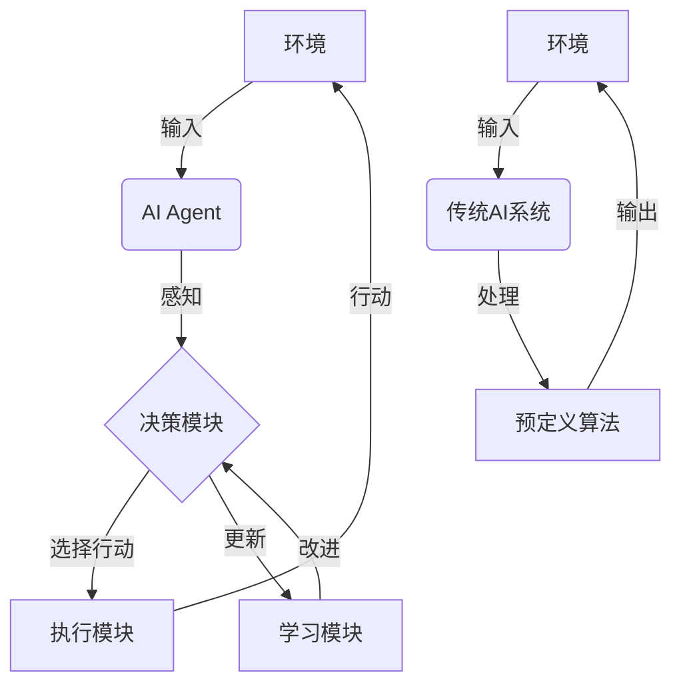

这个图表清楚地展示了AI Agent的循环决策和学习过程，以及它与环境的持续交互，而传统AI系统则是一个更加线性的输入-处理-输出过程。

总的来说，AI Agent代表了人工智能技术的一个重要发展方向，它更接近于人类智能的工作方式，能够在复杂、动态的环境中自主地完成各种任务。随着技术的不断进步，AI Agent在各个领域的应用将会越来越广泛，为人类社会带来深远的影响。

## 1.2 AI Agent 的应用场景

AI Agent的应用范围极其广泛，几乎涵盖了所有需要智能决策和自主行动的领域。以下我们将详细探讨几个主要的应用场景：

### 1.2.1 智能助手与个人代理

智能助手和个人代理是AI Agent最直接和广泛的应用之一。这类应用旨在为用户提供个性化的服务，协助完成日常任务，提高工作效率。

主要特点：

1. 个性化交互：根据用户的习惯和偏好调整交互方式。
2. 多任务处理：能够同时处理多种类型的请求。
3. 持续学习：通过与用户的交互不断改进服务质量。
4. 预测性服务：基于用户行为模式提供主动服务。

应用示例：

- 日程管理：自动安排会议，提醒重要事项。
- 信息过滤：根据用户兴趣筛选和推荐信息。
- 智能家居控制：根据用户习惯自动调节家居环境。
- 健康监测：跟踪用户健康数据，提供个性化建议。

代码示例：以下是一个简单的智能助手AI Agent的Python伪代码框架：

```python
class PersonalAssistantAgent:
    def __init__(self, user_profile):
        self.user_profile = user_profile
        self.knowledge_base = KnowledgeBase()
        self.task_planner = TaskPlanner()

    def process_request(self, user_input):
        intent = self.analyze_intent(user_input)
        if intent == 'schedule':
            return self.manage_schedule(user_input)
        elif intent == 'information':
            return self.retrieve_information(user_input)
        # ... 其他意图处理

    def manage_schedule(self, request):
        # 日程管理逻辑
        pass

    def retrieve_information(self, query):
        # 信息检索逻辑
        pass

    def analyze_intent(self, user_input):
        # 意图分析逻辑
        pass

    def learn_from_interaction(self, interaction_data):
        # 学习和更新用户模型
        pass

# 使用示例
assistant = PersonalAssistantAgent(user_profile)
response = assistant.process_request("帮我安排下周一的会议")
assistant.learn_from_interaction(interaction_data)
```

这个框架展示了智能助手AI Agent的基本结构，包括请求处理、任务执行和学习更新等核心功能。

### 1.2.2 自动化任务处理

AI Agent在自动化任务处理方面展现出巨大的潜力，能够大幅提高各行业的工作效率。

主要特点：

1. 高效性：能够24/7不间断工作，处理大量重复性任务。
2. 准确性：减少人为错误，提高任务执行的精确度。
3. 可扩展性：易于扩展到大规模操作。
4. 适应性：能够处理复杂的工作流程和异常情况。

应用示例：

- 客户服务：自动回答查询，处理简单的客户请求。
- 数据分析：自动收集、处理和分析大量数据。
- 金融交易：执行自动化交易策略，进行风险评估。
- 生产线监控：监控工业生产过程，自动调整参数。

以下是一个自动化数据处理AI Agent的Python伪代码示例：

```python
class DataProcessingAgent:
    def __init__(self):
        self.data_sources = []
        self.processing_pipeline = []
        self.output_formats = []

    def add_data_source(self, source):
        self.data_sources.append(source)

    def add_processing_step(self, step):
        self.processing_pipeline.append(step)

    def set_output_format(self, format):
        self.output_formats.append(format)

    def process_data(self):
        data = self.collect_data()
        for step in self.processing_pipeline:
            data = step.process(data)
        return self.format_output(data)

    def collect_data(self):
        # 从各数据源收集数据
        pass

    def format_output(self, data):
        # 根据指定格式输出数据
        pass

# 使用示例
agent = DataProcessingAgent()
agent.add_data_source(DatabaseSource())
agent.add_data_source(APISource())
agent.add_processing_step(DataCleaningStep())
agent.add_processing_step(DataTransformationStep())
agent.set_output_format(JSONFormat())

processed_data = agent.process_data()
```

这个例子展示了一个能够自动收集、处理和输出数据的AI Agent，它可以灵活地配置数据源、处理步骤和输出格式。

### 1.2.3 决策支持系统

AI Agent在决策支持系统中扮演着越来越重要的角色，帮助人类做出更明智、更及时的决策。

主要特点：

1. 数据驱动：基于大量数据进行分析和预测。
2. 实时性：能够快速响应变化的情况。
3. 多维度分析：考虑多个因素，提供全面的决策建议。
4. 风险评估：评估不同决策选项的潜在风险。

应用示例：

- 金融投资：提供投资建议，进行市场预测。
- 医疗诊断：辅助医生进行疾病诊断和治疗方案制定。
- 供应链管理：优化库存和物流决策。
- 城市规划：分析城市数据，提供规划建议。

以下是一个简单的投资决策支持AI Agent的Python伪代码：

```python
class InvestmentAdvisorAgent:
    def __init__(self):
        self.market_data = MarketDataCollector()
        self.risk_analyzer = RiskAnalyzer()
        self.portfolio_optimizer = PortfolioOptimizer()

    def generate_investment_advice(self, user_profile, investment_amount):
        market_conditions = self.market_data.get_current_conditions()
        risk_assessment = self.risk_analyzer.assess_risk(user_profile, market_conditions)
        optimal_portfolio = self.portfolio_optimizer.optimize(
            investment_amount, risk_assessment, market_conditions
        )
        return self.format_advice(optimal_portfolio)

    def format_advice(self, portfolio):
        # 将投资组合转化为易于理解的建议
        pass

# 使用示例
advisor = InvestmentAdvisorAgent()
user_profile = {"risk_tolerance": "moderate", "investment_horizon": "long-term"}
advice = advisor.generate_investment_advice(user_profile, 100000)
print(advice)
```

这个例子展示了一个投资顾问AI Agent如何结合市场数据、风险分析和投资组合优化来生成个性化的投资建议。

### 1.2.4 虚拟角色与游戏 AI

在虚拟现实、增强现实和游戏领域，AI Agent被广泛用于创造智能、动态的虚拟角色和游戏AI。

主要特点：

1. 自然交互：能够与用户进行自然、流畅的交互。
2. 动态行为：根据环境和用户行为做出动态反应。
3. 个性化：每个虚拟角色可以拥有独特的个性和行为模式。
4. 学习能力：通过与用户的交互不断改进和适应。

应用示例：

- 游戏NPC（非玩家角色）：创造智能、有趣的游戏角色。
- 虚拟教师：在教育应用中提供个性化指导。
- 虚拟客服：在虚拟环境中提供客户服务。
- 社交AI：在社交平台上与用户互动的AI角色。

以下是一个游戏AI Agent的Python伪代码示例：

```python
class GameAIAgent:
    def __init__(self, character_type, difficulty_level):
        self.character_type = character_type
        self.difficulty_level = difficulty_level
        self.behavior_tree = self.initialize_behavior_tree()
        self.learning_module = ReinforcementLearner()

    def initialize_behavior_tree(self):
        # 根据角色类型和难度级别初始化行为树
        pass

    def make_decision(self, game_state):
        action = self.behavior_tree.evaluate(game_state)
        return self.execute_action(action)

    def execute_action(self, action):
        # 执行选定的动作
        pass

    def update_from_feedback(self, reward):
        self.learning_module.update(reward)
        self.behavior_tree.adjust(self.learning_module.get_insights())

# 使用示例
npc = GameAIAgent("warrior", "hard")
game_state = get_current_game_state()
npc_action = npc.make_decision(game_state)
apply_action_to_game(npc_action)
npc.update_from_feedback(calculate_reward(game_state))
```

这个例子展示了一个游戏AI Agent如何使用行为树来做决策，并通过强化学习来不断改进其行为。

AI Agent在虚拟角色和游戏AI领域的应用正在不断推动游戏和虚拟现实体验的边界。通过创造更智能、更自然的虚拟实体，AI Agent正在为用户提供更加沉浸和个性化的体验。

## 1.3 AI Agent 的核心组件

AI Agent的设计和实现涉及多个核心组件，这些组件共同工作，使Agent能够感知环境、做出决策、执行行动并学习改进。以下我们将详细探讨这些核心组件：

### 1.3.1 大型语言模型（LLM）

大型语言模型（Large Language Models, LLM）是现代AI Agent的核心驱动力之一。LLM在自然语言处理、知识表示和推理等方面表现出色，为AI Agent提供了强大的语言理解和生成能力。

主要特点：

1. 广泛的知识覆盖：通过预训练获得大量领域知识。
2. 上下文理解：能够理解和利用长文本上下文。
3. 任务适应性：通过少量示例学习即可适应新任务。
4. 生成能力：能够生成连贯、相关的文本内容。

LLM在AI Agent中的作用：

- 自然语言理解：解析用户输入，理解意图和需求。
- 知识检索：从大规模知识库中快速检索相关信息。
- 推理和决策：基于上下文和知识进行逻辑推理。
- 内容生成：生成回复、报告或创意内容。

以下是一个使用LLM的AI Agent基本框架的Python伪代码：

```python
from transformers import AutoModelForCausalLM, AutoTokenizer

class LLMBasedAgent:
    def __init__(self, model_name):
        self.model = AutoModelForCausalLM.from_pretrained(model_name)
        self.tokenizer = AutoTokenizer.from_pretrained(model_name)

    def process_input(self, user_input):
        # 处理用户输入，生成响应
        input_ids = self.tokenizer.encode(user_input, return_tensors="pt")
        output = self.model.generate(input_ids, max_length=100)
        response = self.tokenizer.decode(output[0], skip_special_tokens=True)
        return response

    def update_knowledge(self, new_information):
        # 更新模型的知识（这里简化处理，实际可能需要微调或其他方法）
        pass

# 使用示例
agent = LLMBasedAgent("gpt2")  # 使用GPT-2作为示例
response = agent.process_input("What is the capital of France?")
print(response)
```

这个例子展示了如何使用预训练的语言模型作为AI Agent的核心组件来处理自然语言输入并生成响应。

### 1.3.2 知识库与检索系统

知识库和检索系统是AI Agent的重要组成部分，它们使Agent能够访问和利用大量结构化和非结构化信息。

主要特点：

1. 大规模存储：能够存储和管理海量数据。
2. 高效检索：快速定位相关信息。
3. 知识表示：使用适当的方式表示不同类型的知识。
4. 更新机制：支持知识的动态更新和扩展。

知识库和检索系统在AI Agent中的作用：

- 信息支持：为Agent的决策提供必要的背景信息。
- 事实核查：验证信息的准确性。
- 知识扩展：通过检索补充Agent的知识面。
- 个性化服务：存储用户偏好和历史交互，提供个性化体验。

以下是一个简单的知识库和检索系统的Python伪代码示例：

```python
import faiss
import numpy as np

class KnowledgeBase:
    def __init__(self, dimension):
        self.index = faiss.IndexFlatL2(dimension)
        self.documents = []

    def add_document(self, document, embedding):
        self.index.add(np.array([embedding]))
        self.documents.append(document)

    def search(self, query_embedding, k=5):
        distances, indices = self.index.search(np.array([query_embedding]), k)
        return [self.documents[i] for i in indices[0]]

class RetrievalSystem:
    def __init__(self, knowledge_base, embedding_model):
        self.knowledge_base = knowledge_base
        self.embedding_model = embedding_model

    def retrieve(self, query, k=5):
        query_embedding = self.embedding_model.encode(query)
        return self.knowledge_base.search(query_embedding, k)

# 使用示例
kb = KnowledgeBase(dimension=768)  # 假设使用768维的嵌入
retrieval_system = RetrievalSystem(kb, EmbeddingModel())

# 添加文档到知识库
kb.add_document("Paris is the capital of France", embedding1)
kb.add_document("The Eiffel Tower is located in Paris", embedding2)

# 检索相关信息
results = retrieval_system.retrieve("What is the capital of France?")
for doc in results:
    print(doc)
```

这个例子展示了如何使用向量索引（如FAISS）构建一个简单的知识库和检索系统，它能够高效地存储和检索文档。

### 1.3.3 任务规划与执行模块

任务规划与执行模块使AI Agent能够将复杂任务分解为可管理的步骤，并按顺序执行这些步骤以达成目标。

主要特点：

1. 目标分解：将高级目标分解为具体的子任务。
2. 优先级排序：确定任务的执行顺序。
3. 资源分配：管理和分配执行任务所需的资源。
4. 错误处理：处理执行过程中的异常和失败情况。

任务规划与执行模块在AI Agent中的作用：

- 策略制定：根据目标和约束条件制定执行策略。
- 任务协调：协调多个子任务的执行。
- 进度监控：跟踪任务执行进度，必要时进行调整。
- 结果评估：评估任务执行结果，为未来规划提供反馈。

以下是一个简单的任务规划与执行模块的Python伪代码示例：

```python
from enum import Enum

class TaskStatus(Enum):
    PENDING = 1
    IN_PROGRESS = 2
    COMPLETED = 3
    FAILED = 4

class Task:
    def __init__(self, name, action, dependencies=None):
        self.name = name
        self.action = action
        self.dependencies = dependencies or []
        self.status = TaskStatus.PENDING

    def execute(self):
        try:
            self.status = TaskStatus.IN_PROGRESS
            self.action()
            self.status = TaskStatus.COMPLETED
        except Exception as e:
            self.status = TaskStatus.FAILED
            print(f"Task {self.name} failed: {str(e)}")

class TaskPlanner:
    def __init__(self):
        self.tasks = {}

    def add_task(self, task):
        self.tasks[task.name] = task

    def execute_plan(self):
        while self.tasks:
            ready_tasks = [task for task in self.tasks.values() 
                           if all(dep not in self.tasks or self.tasks[dep].status == TaskStatus.COMPLETED 
                                  for dep in task.dependencies)]
            if not ready_tasks:
                raise Exception("Circular dependency or all tasks failed")
          
            for task in ready_tasks:
                task.execute()
                if task.status == TaskStatus.COMPLETED:
                    del self.tasks[task.name]

# 使用示例
planner = TaskPlanner()

def task1_action():
    print("Executing task 1")

def task2_action():
    print("Executing task 2")

def task3_action():
    print("Executing task 3")

planner.add_task(Task("Task1", task1_action))
planner.add_task(Task("Task2", task2_action, ["Task1"]))
planner.add_task(Task("Task3", task3_action, ["Task2"]))

planner.execute_plan()
```

这个例子展示了一个简单的任务规划器，它可以管理任务依赖关系并按正确的顺序执行任务。

### 1.3.4 环境交互接口

环境交互接口是AI Agent与外部世界进行交互的桥梁，它使Agent能够感知环境、接收输入并执行行动。

主要特点：

1. 多模态输入：处理文本、语音、图像等多种形式的输入。
2. 行动执行：将Agent的决策转化为实际行动。
3. 反馈机制：接收环境对Agent行动的反馈。
4. 适应性：能够适应不同类型的环境和交互方式。

环境交互接口在AI Agent中的作用：

- 感知输入：接收和处理来自环境的各种信号。
- 行动输出：将Agent的决策转化为可执行的命令或动作。
- 状态监控：持续监控环境状态的变化。
- 交互协议：定义Agent与环境之间的通信协议。

以下是一个简单的环境交互接口的Python伪代码示例：

```python
class Environment:
    def __init__(self):
        self.state = self.initialize_state()

    def initialize_state(self):
        # 初始化环境状态
        pass

    def get_observation(self):
        # 返回当前环境状态的观察
        pass

    def take_action(self, action):
        # 执行动作并更新环境状态
        pass

    def provide_feedback(self):
        # 提供关于上一个动作的反馈
        pass

class EnvironmentInterface:
    def __init__(self, environment):
        self.environment = environment

    def observe(self):
        return self.environment.get_observation()

    def act(self, action):
        self.environment.take_action(action)

    def get_feedback(self):
        return self.environment.provide_feedback()

class Agent:
    def __init__(self, interface):
        self.interface = interface

    def run(self):
        while True:
            observation = self.interface.observe()
            action = self.decide_action(observation)
            self.interface.act(action)
            feedback = self.interface.get_feedback()
            self.learn(feedback)

    def decide_action(self, observation):
        # 基于观察决定下一步动作
        pass

    def learn(self, feedback):
        # 从反馈中学习
        pass

# 使用示例
env = Environment()
interface = EnvironmentInterface(env)
agent = Agent(interface)
agent.run()
```

这个例子展示了一个基本的环境交互接口，它允许Agent观察环境、执行动作并接收反馈。这种设计使得Agent能够与各种不同类型的环境进行交互，而不需要了解环境的具体实现细节。

通过整合这些核心组件——大型语言模型、知识库与检索系统、任务规划与执行模块以及环境交互接口，我们可以构建出功能强大、灵活适应的AI Agent。这些组件的协同工作使得Agent能够理解复杂的指令、访问和利用大量知识、制定和执行复杂的任务计划，并与环境进行有效的交互。

随着技术的不断进步，这些核心组件也在持续演进。例如，大型语言模型正朝着更大规模、更高效、更可解释的方向发展；知识库和检索系统正在探索更先进的知识表示和推理方法；任务规划正在引入更复杂的AI算法来处理不确定性和动态环境；环境交互接口则在朝着更自然、更多模态的方向发展。

未来的AI Agent将能够更好地理解和适应复杂的真实世界环境，在各个领域发挥越来越重要的作用。然而，随着AI Agent能力的增强，我们也需要更加关注伦理、安全和隐私等问题，确保AI Agent的发展能够造福人类社会。

# 2 大型语言模型（LLM）基础

## 2.1 LLM 概述

### 2.1.1 LLM 的定义与发展历程

大型语言模型（Large Language Models, LLM）是一类基于深度学习技术，通过大规模预训练在自然语言处理任务中表现出色的人工智能模型。这些模型通常包含数十亿到数千亿个参数，能够理解和生成人类语言，执行各种复杂的语言任务。

LLM的定义可以概括为以下几个关键特点：

1. 大规模参数：通常包含数十亿到数千亿个可训练参数。
2. 自监督学习：主要通过无标注的大规模文本数据进行预训练。
3. 通用性：能够适应多种不同的自然语言处理任务。
4. 上下文学习：能够利用任务相关的上下文信息快速适应新任务。

LLM的发展历程可以大致分为以下几个阶段：

1. 早期神经网络语言模型（2000年代初）：

   - 以前馈神经网络和循环神经网络为基础的语言模型开始出现。
   - 代表性工作：Bengio等人(2003)提出的神经概率语言模型。
2. 词嵌入技术的突破（2013-2014）：

   - Word2Vec和GloVe等词嵌入技术的出现，为后续大型语言模型奠定了基础。
   - 代表性工作：Mikolov等人(2013)的Word2Vec，Pennington等人(2014)的GloVe。
3. 注意力机制和Transformer架构的提出（2017）：

   - Transformer架构的出现彻底改变了自然语言处理领域。
   - 代表性工作：Vaswani等人(2017)提出的"Attention is All You Need"。
4. 预训练语言模型的兴起（2018-2019）：

   - 基于Transformer的预训练语言模型开始大规模应用。
   - 代表性工作：BERT(Devlin等, 2018)，GPT(Radford等, 2018)，GPT-2(Radford等, 2019)。
5. 大规模语言模型时代（2020至今）：

   - 模型规模急剧扩大，参数量达到数百亿甚至数千亿。
   - 代表性工作：GPT-3(Brown等, 2020)，PaLM(Chowdhery等, 2022)，LLaMA(Touvron等, 2023)。

LLM的发展历程如下表：

| 年份             | 事件                                         |
|----------------|--------------------------------------------|
| 2003           | 神经概率语言模型                                   |
| 2013           | Word2Vec                                   |
| 2014           | GloVe                                      |
| 2017           | Transformer架构                              |
| 2018           | BERT, GPT                                  |
| 2019           | GPT-2                                      |
| 2020           | GPT-3                                      |
| 2022           | PaLM, ChatGPT                              |
| 2023年3月        | OpenAI 发布 GPT-4，性能显著提升                     |
| 2023年5月        | Google 发布 PaLM 2，多步推理能力强                   |
| 2023年7月        | Meta 发布开源 LLM Llama 2，免费用于研究和商业用途          |
| 2023年9月        | 阿联酋技术创新研究所发布 Falcon 180B（1800亿参数）          |
| 2023年11月       | Google 发布 Gemini 系列模型（Ultra、Pro、Nano 版本）   |
| 2023年12月       | Mistral AI 发布 Mixtral 8x7B，采用稀疏混合专家（MoE）架构 |
| 2024年Q1        | Meta 开源 Llama 3                            |
| 2024年Q3        | OpenAI 发布 GPT-o1,引领推理 scaling law 范式       |
| 2024年Q3-Q4（预测） | Google 预计发布 Gemini 的最大规模版本                 |

持续趋势（2024年~）：

| 趋势 | 描述                  |
|------|---------------------|
| 小型高效模型（SLMs） | 如 Microsoft 的 Phi-4 |
| 专门领域模型 | 针对医疗、金融等特定行业的 LLMs  |
| 多模态能力增强 | 整合文本、图像、音频和视频处理     |
| 推理能力提升 | 增强逻辑思维能力            |
| 本地化部署 | 特别是移动设备上的轻量级模型      |

建议：

1. 密切关注行业领先者的最新发布
2. 探索行业特定的 LLM 应用
3. 考虑使用小型高效模型
4. 关注多模态处理进展
5. 评估 LLM 与现有业务流程的集成
6. 关注 LLM 的伦理和隐私问题


### 2.1.2 主流 LLM 介绍（如 GPT 系列、BERT、LLaMA 等）

1. GPT系列（Generative Pre-trained Transformer）

   - 开发者：OpenAI
   - 特点：自回归语言模型，擅长文本生成任务
   - 发展历程：
     * GPT (2018): 1.17亿参数
     * GPT-2 (2019): 15亿参数
     * GPT-3 (2020): 1750亿参数
     * GPT-4 (2023): 参数规模未公开，但性能大幅提升
   - 应用：文本生成、对话系统、代码生成等
2. BERT（Bidirectional Encoder Representations from Transformers）

   - 开发者：Google
   - 发布时间：2018年
   - 特点：双向编码器，擅长理解任务
   - 参数规模：Base版本1.1亿，Large版本3.4亿
   - 应用：文本分类、命名实体识别、问答系统等
3. LLaMA（Large Language Model Meta AI）

   - 开发者：Meta AI
   - 发布时间：2023年
   - 特点：开源模型，在较小规模下实现了强大性能
   - 参数规模：提供7B、13B、33B和65B四种规格
   - 应用：各种自然语言处理任务，为研究和应用提供了重要基础
4. T5（Text-to-Text Transfer Transformer）

   - 开发者：Google
   - 发布时间：2019年
   - 特点：将所有NLP任务统一为文本到文本的转换
   - 参数规模：从2.2亿到110亿不等
   - 应用：多种NLP任务，如翻译、摘要、问答等
5. BLOOM（BigScience Large Open-science Open-access Multilingual Language Model）

   - 开发者：Hugging Face和多个研究机构合作
   - 发布时间：2022年
   - 特点：开源、多语言支持（46种语言）
   - 参数规模：1760亿参数
   - 应用：多语言NLP任务，开放科学研究

主流LLM比较：


| 模型  | 开发者     | 参数规模     | 开源状态 | 主要特点                     |
| ----- | ---------- | ------------ | -------- | ---------------------------- |
| GPT-3 | OpenAI     | 1750亿       | 闭源     | 强大的生成能力               |
| BERT  | Google     | 3.4亿(Large) | 开源     | 双向编码，擅长理解任务       |
| LLaMA | Meta AI    | 7B-65B       | 开源     | 小规模高性能，适合研究和应用 |
| T5    | Google     | 2.2亿-110亿  | 开源     | 统一的文本到文本框架         |
| BLOOM | BigScience | 1760亿       | 开源     | 多语言支持，开放科学         |

### 2.1.3 LLM 的核心技术原理

LLM的核心技术原理主要包括以下几个方面：

1. Transformer架构

   - 自注意力机制（Self-Attention）：允许模型关注输入序列的不同部分
   - 多头注意力（Multi-Head Attention）：并行处理多个注意力计算
   - 前馈神经网络（Feed-Forward Neural Network）：进一步处理注意力输出
2. 大规模预训练

   - 自监督学习：使用大量无标注文本数据
   - 掩码语言模型（Masked Language Model）：预测被遮蔽的词
   - 下一句预测（Next Sentence Prediction）：判断两个句子是否连续
3. 微调和迁移学习

   - 在预训练模型基础上针对特定任务进行微调
   - 少样本学习（Few-shot Learning）：利用少量样本适应新任务
4. 上下文学习

   - 利用输入的上下文信息理解和生成文本
   - 长序列处理技术：处理长文本输入
5. 参数高效微调技术

   - Prompt Tuning：通过调整输入提示来适应不同任务
   - Adapter：在预训练模型中插入小型可训练模块
6. 解码策略

   - 贪婪解码（Greedy Decoding）
   - 束搜索（Beam Search）
   - 采样（Sampling）：温度控制、Top-k采样、Top-p（核采样）

LLM的核心技术原理可以用以下Mermaid流程图表示：

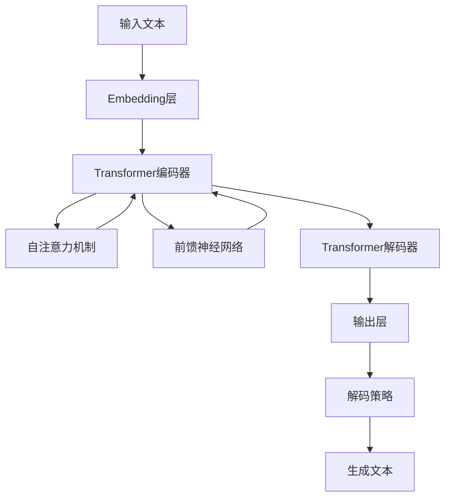

数学公式：

1. 自注意力机制的核心计算公式：

$$
\text{Attention}(Q, K, V) = \text{softmax}\left(\frac{QK^T}{\sqrt{d_k}}\right)V
$$

其中，$Q$、$K$、$V$ 分别表示查询、键和值矩阵，$d_k$ 是键向量的维度。

2. 位置编码公式（使用正弦和余弦函数）：

$$
PE_{(pos,2i)} = \sin(pos / 10000^{2i/d_{model}})
$$

$$
PE_{(pos,2i+1)} = \cos(pos / 10000^{2i/d_{model}})
$$

其中，$pos$ 是词在序列中的位置，$i$ 是维度索引，$d_{model}$ 是模型的维度。

3. 交叉熵损失函数：

$$
L = -\sum_{i=1}^{N} y_i \log(\hat{y}_i)
$$

其中，$y_i$ 是真实标签，$\hat{y}_i$ 是模型预测的概率分布。

这些核心技术原理共同构成了现代LLM的基础，使其能够在各种自然语言处理任务中展现出强大的性能。随着研究的深入，这些技术还在不断evolve，例如稀疏注意力机制、更高效的预训练方法等正在被探索和应用，以应对模型规模不断增大带来的挑战。

## 2.2 LLM 的能力与局限性

### 2.2.1 自然语言理解与生成

LLM在自然语言理解（NLU）和自然语言生成（NLG）方面展现出了强大的能力，但同时也存在一些局限性。

能力：

1. 语义理解：

   - 上下文理解：能够捕捉长文本中的上下文信息。
   - 隐含信息推断：从文本中推断出未明确陈述的信息。
   - 多义词消歧：根据上下文正确理解多义词的含义。
2. 语法分析：

   - 句法结构识别：理解复杂的句子结构。
   - 词性标注：准确识别词语的词性。
   - 依存关系分析：识别词语之间的语法关系。
3. 情感分析：

   - 识别文本中表达的情感和态度。
   - 理解复杂的情感表达，包括讽刺和隐喻。
4. 文本生成：

   - 连贯性：生成逻辑连贯、结构完整的长文本。
   - 多样性：生成风格多样的文本内容。
   - 创造性：在一定程度上展现创造性写作能力。
5. 跨语言能力：

   - 多语言理解和生成。
   - 机器翻译：在不同语言之间进行高质量翻译。

局限性：

1. 事实准确性：

   - 可能生成虚假或不准确的信息（幻觉问题）。
   - 难以区分训练数据中的事实和虚构信息。
2. 推理深度：

   - 在需要深度逻辑推理的任务中表现不稳定。
   - 难以处理需要多步骤推理的复杂问题。
3. 常识理解：

   - 对某些基本常识的理解仍然有限。
   - 可能在简单的常识推理任务中犯错。
4. 时效性：

   - 知识更新滞后，难以处理最新事件或信息。
5. 上下文长度限制：

   - 虽然能处理较长文本，但仍有上下文长度的限制。
6. 一致性：

   - 在长对话或长文本生成中可能出现自相矛盾的内容。
7. 偏见问题：

   - 可能反映训练数据中的偏见和刻板印象。
8. 理解深层意图：

   - 难以理解言外之意或深层文化含义。

为了更直观地展示LLM在自然语言理解与生成方面的能力和局限性，我们可以使用以下Mermaid图表：

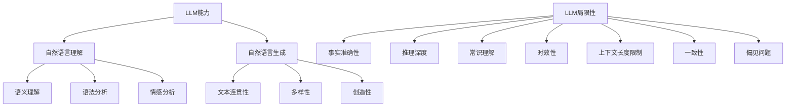

为了量化LLM的性能，研究人员通常使用各种评估指标。以下是一些常用的评估指标及其数学表示：

1. 困惑度（Perplexity）：衡量语言模型预测下一个词的能力。

$$
\text{Perplexity} = \exp\left(-\frac{1}{N}\sum_{i=1}^N \log p(w_i|w_1,\ldots,w_{i-1})\right)
$$

其中，$N$是词的总数，$p(w_i|w_1,\ldots,w_{i-1})$是模型预测第$i$个词的概率。

2. BLEU分数：用于评估机器翻译质量。

$$
\text{BLEU} = BP \cdot \exp\left(\sum_{n=1}^N w_n \log p_n\right)
$$

其中，$BP$是简短惩罚因子，$w_n$是n-gram权重，$p_n$是n-gram精确度。

3. F1分数：用于评估分类任务的性能。

$$
F1 = 2 \cdot \frac{\text{precision} \cdot \text{recall}}{\text{precision} + \text{recall}}
$$

这些指标帮助研究人员和开发者量化LLM在各种任务中的表现，并为模型改进提供了客观的衡量标准。然而，需要注意的是，这些指标并不能完全捕捉LLM的所有能力和局限性，特别是在创造性和理解深层含义等方面的表现。因此，全面评估LLM的能力还需要结合人工评估和实际应用场景的测试。

### 2.2.2 上下文学习与少样本学习

上下文学习（Context Learning）和少样本学习（Few-shot Learning）是LLM的两个重要能力，它们极大地提高了模型的灵活性和适应性。

1. 上下文学习

上下文学习指LLM能够利用输入中的上下文信息来理解和生成文本。这种能力使得模型可以根据给定的背景信息调整其行为，而无需额外的训练。

能力：

- 任务适应：根据提供的指令或示例快速适应新任务。
- 角色扮演：基于给定的角色描述生成符合特定身份的回复。
- 风格模仿：根据提供的文本样例模仿特定的写作风格。
- 上下文相关回答：考虑之前的对话历史生成连贯的回复。

局限性：

- 上下文长度限制：只能处理有限长度的上下文。
- 注意力分散：在长文本中可能忽视重要的早期信息。
- 一致性问题：可能在长对话中出现自相矛盾的回答。

2. 少样本学习

少样本学习是指LLM能够通过少量示例快速学习并执行新任务的能力。这大大减少了针对特定任务收集大量标注数据的需求。

能力：

- 快速任务适应：通过几个示例就能理解并执行新任务。
- 泛化能力：从少量样本中学习到的模式可以应用到更广泛的情况。
- 多任务学习：能够同时学习和执行多种不同类型的任务。

局限性：

- 性能不稳定：在极少样本的情况下，性能可能不稳定。
- 任务复杂度限制：对于非常复杂的任务，少样本学习效果可能不佳。
- 示例依赖：生成的结果可能过度依赖于提供的少量示例。

为了更好地理解上下文学习和少样本学习，我们可以使用以下Mermaid流程图：

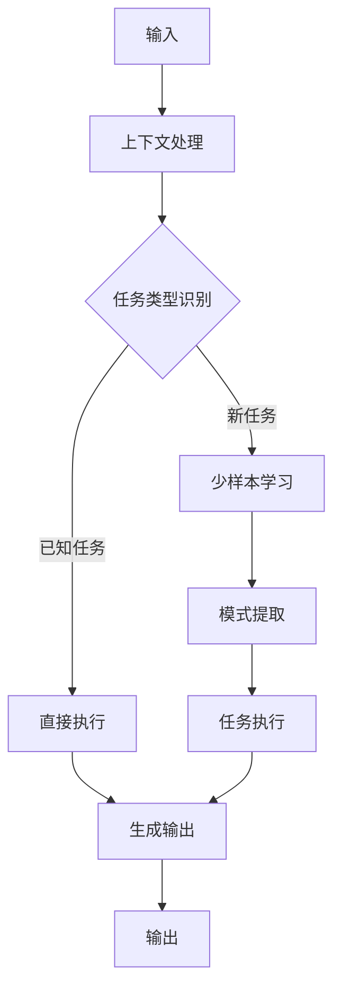

数学模型：

1. 上下文学习可以用条件概率表示：

$$
P(y|x, c) = f_\theta(x, c)
$$

其中，$y$是输出，$x$是输入，$c$是上下文信息，$f_\theta$是参数为$\theta$的模型函数。

2. 少样本学习的目标函数可以表示为：

$$
\min_\theta \mathbb{E}_{T \sim p(T)} \left[ \mathcal{L}_T(f_\theta) \right]
$$

其中，$T$是任务，$p(T)$是任务分布，$\mathcal{L}_T$是任务$T$的损失函数。

3. 元学习（Meta-learning）框架下的少样本学习：

$$
\theta^* = \arg\min_\theta \mathbb{E}_{T \sim p(T)} \left[ \mathcal{L}_T(U_T(\theta)) \right]
$$

其中，$U_T$是在任务$T$上的快速适应更新操作。

这些数学模型帮助我们理解LLM如何在上下文学习和少样本学习中进行推理和优化。

实际应用示例：

1. 上下文学习：

```python
prompt = """
角色：你是一位专业的科技记者
任务：写一篇关于最新AI技术的新闻报道
风格：简洁明了，重点突出
"""

user_input = "请介绍GPT-4的主要特点"

response = llm.generate(prompt + user_input)
print(response)
```

2. 少样本学习：

```python
few_shot_examples = """
输入：将'苹果'翻译成法语
输出：pomme

输入：将'香蕉'翻译成法语
输出：banane

输入：将'橙子'翻译成法语
输出：orange
"""

user_input = "将'葡萄'翻译成法语"

response = llm.generate(few_shot_examples + user_input)
print(response)
```

这些例子展示了如何利用LLM的上下文学习和少样本学习能力来完成特定任务，而无需对模型进行额外的训练。

### 2.2.3 常识推理与知识应用

LLM在常识推理和知识应用方面展现出了令人印象深刻的能力，但同时也面临着一些挑战和局限性。

能力：

1. 常识推理：

   - 基本事实理解：能够理解和应用日常生活中的基本事实。
   - 简单逻辑推理：能够进行基于常识的简单逻辑推导。
   - 因果关系理解：能够理解事件之间的基本因果关系。
2. 知识应用：

   - 广泛的知识覆盖：涵盖多个领域的知识，如科学、历史、文化等。
   - 知识整合：能够将不同领域的知识结合起来解决问题。
   - 知识迁移：将一个领域的知识应用到另一个相关领域。
3. 类比推理：

   - 能够理解和生成类比，帮助解释复杂概念。
4. 常识性问题解答：

   - 能够回答基于常识的问题，如"为什么天是蓝的？"

局限性：

1. 深度推理：

   - 在需要多步骤或复杂逻辑推理的任务中可能表现不佳。
2. 知识更新：

   - 知识库是静态的，难以实时更新最新信息。
3. 知识一致性：

   - 可能在不同上下文中给出矛盾的信息。
4. 常识边界：

   - 对于一些看似简单但实际复杂的常识问题可能回答错误。
5. 因果推理：

   - 在复杂的因果关系推理中可能出错。
6. 抽象概念理解：

   - 对高度抽象或理论性的概念理解有限。

为了更好地理解LLM在常识推理与知识应用方面的能力和局限性，我们可以使用以下Mermaid图表：

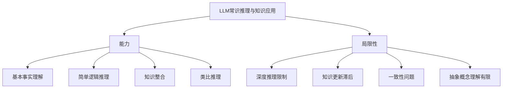

数学模型：

1. 知识图谱嵌入：LLM可以通过知识图谱嵌入来表示和应用结构化知识。给定实体集合$E$和关系集合$R$，知识图谱嵌入可以表示为：

$$
f: E \times R \times E \rightarrow \mathbb{R}
$$

其中$f$是评分函数，用于评估三元组$(h, r, t)$的合理性。

2. 贝叶斯推理：LLM的常识推理可以用贝叶斯框架来建模。给定观察$O$和假设$H$，后验概率可以表示为：

$$
P(H|O) = \frac{P(O|H)P(H)}{P(O)}
$$

3. 因果推理：使用结构因果模型（Structural Causal Model, SCM）来表示因果关系：

$$
X_i = f_i(PA_i, U_i), i = 1, ..., n
$$

其中$X_i$是变量，$PA_i$是$X_i$的父节点集合，$U_i$是外生变量，$f_i$是因果机制函数。

实际应用示例：

1. 常识推理：

```python
prompt = "问题：如果下雨了，地面会变湿。现在地面是干的，那么刚才下雨了吗？请解释你的推理过程。"

response = llm.generate(prompt)
print(response)

# 可能的输出：
# 答案：根据给定的信息，刚才很可能没有下雨。
# 推理过程：
# 1. 我们知道"如果下雨了，地面会变湿"这个因果关系。
# 2. 现在观察到"地面是干的"这个事实。
# 3. 如果刚才下雨了，根据第1点，地面应该是湿的。
# 4. 但是第2点告诉我们地面是干的，这与下雨后的预期结果相矛盾。
# 5. 因此，我们可以推断刚才很可能没有下雨。
# 
# 然而，需要注意的是，这个推理基于一些假设，如：
# - 没有其他因素（如快速蒸发）导致地面迅速变干
# - "刚才"指的是足够近的时间，不足以让地面完全干燥
# 
# 在没有更多信息的情况下，基于给定的前提，最合理的结论是刚才没有下雨。
```

2. 知识应用：

```python
prompt = """
问题：太阳系中最大的行星是哪个？它有什么特点？请简要说明。
"""

response = llm.generate(prompt)
print(response)

# 可能的输出：
# 太阳系中最大的行星是木星（Jupiter）。以下是木星的一些主要特点：
#
# 1. 体积：木星是太阳系中体积最大的行星，其体积约为地球的1,321倍。
#
# 2. 质量：木星的质量约为太阳系所有其他行星总质量的2.5倍。
#
# 3. 组成：主要由氢和氦组成，类似于恒星的组成，但质量不足以引发核聚变。
#
# 4. 大气特征：著名的大红斑是木星表面的一个巨大风暴，已经持续了至少300年。
#
# 5. 卫星系统：木星拥有众多的卫星，其中最著名的是四颗伽利略卫星：木卫一、木卫二、木卫三和木卫四。
#
# 6. 行星环：木星有一个微弱的行星环系统，虽然不如土星的环系统显著。
#
# 7. 磁场：木星拥有太阳系中最强大的磁场，强度是地球磁场的14倍。
#
# 木星的巨大体积和质量使它在太阳系的形成和演化过程中扮演了重要角色，影响了其他行星的轨道和小天体的分布。
```

这些例子展示了LLM如何应用其内置的知识来回答问题和进行推理。然而，重要的是要认识到，LLM的这些能力是基于其训练数据和预训练过程，而不是基于实时更新的知识或真正的理解。因此，在使用LLM进行常识推理和知识应用时，仍然需要人类的监督和验证，特别是在处理需要最新信息或深度专业知识的任务时。

### 2.2.4 LLM 的偏见与幻觉问题

LLM的偏见和幻觉问题是当前研究和应用中面临的两个主要挑战。这些问题源于模型的训练数据、训练方法以及模型本身的局限性。

1. 偏见问题

偏见指LLM在生成内容时表现出的不公平或歧视性倾向，这可能涉及性别、种族、年龄、文化等方面。

主要表现：

- 性别刻板印象：在描述职业时可能存在性别偏见。
- 种族偏见：对不同种族群体可能有不同的描述倾向。
- 文化偏见：可能对某些文化群体有偏好或偏见。
- 年龄歧视：在描述不同年龄群体时可能存在刻板印象。

原因：

- 训练数据中的固有偏见
- 社会历史背景的影响
- 算法和模型设计中的潜在偏见

缓解措施：

- 多样化训练数据
- 偏见检测和缓解算法
- 后处理过滤
- 明确的伦理指导

2. 幻觉问题

幻觉指LLM生成的看似合理但实际上不正确或虚构的信息。

主要表现：

- 事实错误：生成与现实不符的事实陈述。
- 虚构实体：创造出不存在的人物、地点或事件。
- 错误的关联：建立不正确的因果关系或联系。
- 自相矛盾：在同一段落或对话中出现相互矛盾的陈述。

原因：

- 训练数据中的噪声和错误
- 模型过度泛化
- 知识表示的局限性
- 上下文理解的不足

缓解措施：

- 知识图谱集成
- 事实检查机制
- 不确定性估计
- 多模态信息融合

为了更好地理解LLM的偏见与幻觉问题，我们可以使用以下Mermaid图表：

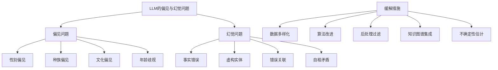

数学模型：

1. 偏见检测：
   可以使用统计方法来检测模型输出中的偏见。例如，对于二元属性（如性别），可以使用以下公式计算偏见分数：

$$
\text{Bias Score} = \frac{P(A|G=M) - P(A|G=F)}{P(A)}
$$

其中，$A$是特定属性，$G$是性别，$M$代表男性，$F$代表女性。

2. 幻觉检测：
   可以使用基于知识图谱的方法来检测幻觉。给定一个三元组$(h, r, t)$，其可信度可以计算为：

$$
\text{Plausibility} = \sigma(h^T R t)
$$

其中，$h$和$t$是头尾实体的嵌入向量，$R$是关系矩阵，$\sigma$是sigmoid函数。

3. 不确定性估计：
   使用集成方法或贝叶斯神经网络来估计模型预测的不确定性：

$$
\text{Uncertainty} = -\sum_{i=1}^C p_i \log p_i
$$

其中，$C$是类别数，$p_i$是第$i$个类别的预测概率。

实际应用示例：

1. 偏见检测和缓解：

```python
def check_gender_bias(llm, prompt_template, professions):
    male_count = female_count = 0
    for profession in professions:
        prompt = prompt_template.format(profession=profession)
        response = llm.generate(prompt)
        if "he" in response.lower():
            male_count += 1
        elif "she" in response.lower():
            female_count += 1
  
    bias_score = (male_count - female_count) / len(professions)
    return bias_score

prompt_template = "A {profession} walked into the room. What did they do next?"
professions = ["doctor", "nurse", "engineer", "teacher", "CEO"]

bias_score = check_gender_bias(llm, prompt_template, professions)
print(f"Gender bias score: {bias_score}")

# 如果偏见分数显著不为0，可以采取措施来减少偏见
if abs(bias_score) > 0.2:
    print("Significant bias detected. Applying bias mitigation...")
    # 这里可以实现偏见缓解策略，如重新平衡训练数据或调整模型输出
```

2. 幻觉检测：

```python
import numpy as np

def hallucination_check(llm, prompt, knowledge_base):
    response = llm.generate(prompt)
    entities = extract_entities(response)
    hallucination_score = 0
  
    for entity in entities:
        if entity not in knowledge_base:
            hallucination_score += 1
  
    return hallucination_score / len(entities) if entities else 0

def extract_entities(text):
    # 使用命名实体识别（NER）提取实体
    # 这里简化为直接返回所有大写开头的词
    return [word for word in text.split() if word[0].isupper()]

knowledge_base = set(["Paris", "France", "Eiffel Tower", "Louvre"])
prompt = "Describe the main attractions in Paris."

hallucination_score = hallucination_check(llm, prompt, knowledge_base)
print(f"Hallucination score: {hallucination_score}")

if hallucination_score > 0.1:
    print("Potential hallucination detected. Verifying information...")
    # 这里可以实现进一步的事实核查或信息验证步骤
```

3. 不确定性估计：

```python
def estimate_uncertainty(llm, prompt, num_samples=10):
    responses = [llm.generate(prompt) for _ in range(num_samples)]
    unique_responses = set(responses)
    probabilities = [responses.count(r) / num_samples for r in unique_responses]
  
    uncertainty = -sum(p * np.log(p) for p in probabilities)
    return uncertainty

prompt = "What will be the dominant technology in 2050?"
uncertainty = estimate_uncertainty(llm, prompt)
print(f"Uncertainty score: {uncertainty}")

if uncertainty > 0.5:
    print("High uncertainty detected. Consider providing more context or consulting additional sources.")
```

这些例子展示了如何在实际应用中检测和缓解LLM的偏见和幻觉问题。然而，重要的是要认识到，这些方法并不能完全消除这些问题，而只能在一定程度上减轻它们的影响。在使用LLM时，仍然需要人类的监督和判断，特别是在处理敏感话题或需要高度准确性的任务时。

此外，研究人员和开发者还在不断探索新的方法来改进LLM的公平性和准确性，包括：

1. 对抗训练：通过生成对抗样本来提高模型的鲁棒性和公平性。
2. 可解释AI技术：提高模型决策过程的透明度，便于识别和纠正偏见。
3. 持续学习和更新：开发能够从新数据中学习并更新知识的模型架构。
4. 多模态融合：结合文本、图像、音频等多种模态的信息来提高理解的准确性。
5. 伦理AI框架：在模型设计和应用中纳入伦理考虑，确保AI系统的公平性和负责任使用。

通过这些努力，我们期望未来的LLM能够更加公平、准确，并能更好地服务于各种应用场景。

## 2.3 选择合适的 LLM

选择合适的LLM对于AI Agent的成功至关重要。这个选择过程需要考虑多个因素，包括模型性能、部署需求、成本效益等。以下我们将详细探讨选择LLM时需要考虑的关键因素。

### 2.3.1 开源 vs 商业 LLM 对比

开源LLM和商业LLM各有优缺点，选择哪一种取决于具体的应用需求和资源限制。

1. 开源LLM

优点：

- 可自由访问和修改源代码
- 社区支持和持续改进
- 可以根据特定需求进行定制
- 通常成本较低（主要是计算资源成本）

缺点：

- 可能需要更多的技术expertise来部署和维护
- 性能可能不如顶级商业模型
- 可能缺乏专业的技术支持
- 可能存在法律和合规风险

示例：LLaMA, BLOOM, GPT-J

2. 商业LLM

优点：

- 通常性能更优秀
- 提供专业的技术支持
- 易于使用的API接口
- 更好的可扩展性和可靠性

缺点：

- 使用成本较高
- 对模型的控制和定制能力有限
- 可能存在供应商锁定
- 数据隐私和安全性考虑

示例：GPT-3, GPT-4, Claude

对比表格：


| 特征       | 开源LLM  | 商业LLM  |
| ---------- | -------- | -------- |
| 成本       | 低       | 高       |
| 性能       | 中等     | 高       |
| 可定制性   | 高       | 低       |
| 易用性     | 低       | 高       |
| 技术支持   | 社区支持 | 专业支持 |
| 数据隐私   | 可控     | 潜在风险 |
| 部署复杂度 | 高       | 低       |

选择建议：

- 如果有强大的技术团队和计算资源，且需要高度定制化，可以选择开源LLM。
- 如果需要快速部署、高性能且有预算支持，可以选择商业LLM。
- 对于初创公司或研究项目，开源LLM可能是更好的起点。
- 对于企业级应用，特别是需要处理敏感数据的场景，商业LLM可能更合适。

### 2.3.2 模型大小与性能权衡

模型大小和性能之间存在着复杂的权衡关系。通常，更大的模型具有更强的能力，但也带来了更高的计算成本和部署难度。

1. 模型大小的影响：

   - 参数数量：通常与模型能力正相关
   - 内存需求：更大的模型需要更多的GPU内存
   - 推理速度：大模型的推理速度通常较慢
   - 微调难度：大模型的微调需要更多的计算资源和数据
2. 性能考虑：

   - 任务适应性：大模型通常在各种任务上表现更好
   - 少样本学习能力：大模型通常具有更强的少样本学习能力
   - 生成质量：大模型通常能生成更高质量的文本
   - 上下文理解：大模型通常能处理更长的上下文
3. 权衡因素：

   - 硬件限制：可用的GPU内存和计算能力
   - 延迟要求：实时应用可能需要更小、更快的模型
   - 部署环境：边缘设备可能只能运行小型模型
   - 预算限制：更大的模型通常意味着更高的运营成本

为了更直观地理解模型大小与性能的关系，我们可以使用以下Mermaid图表：

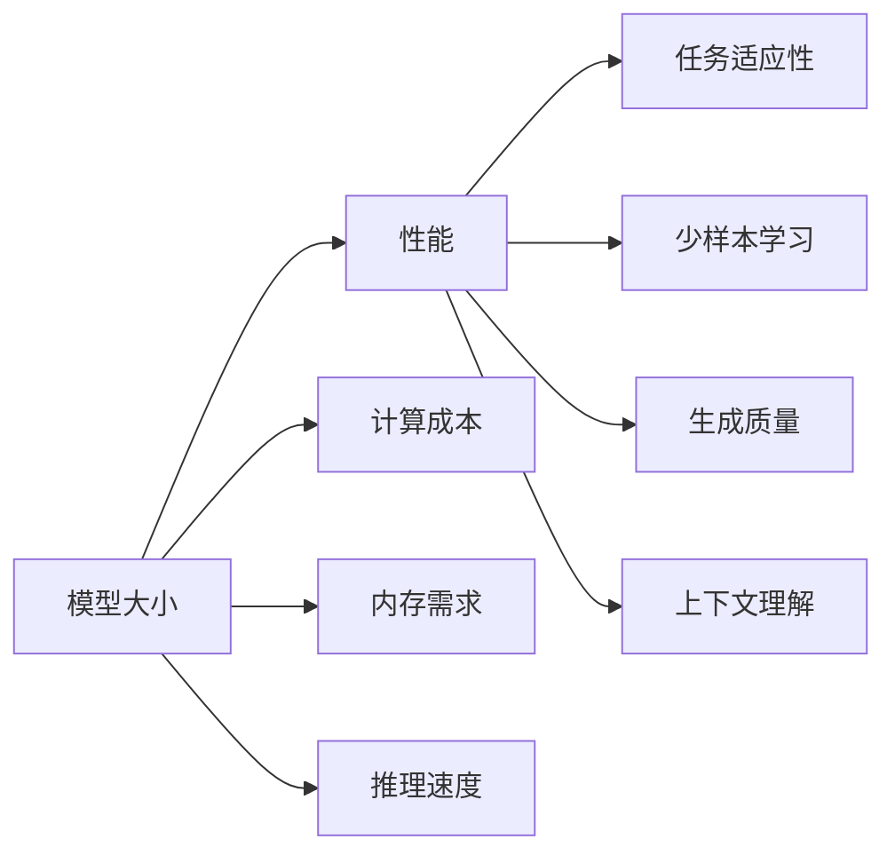

数学模型：

我们可以使用一个简化的模型来表示LLM的性能与大小的关系：

$$
P = \alpha \log(N) + \beta
$$

其中，$P$是性能指标，$N$是模型参数数量，$\alpha$和$\beta$是常数。这个模型捕捉了性能随模型大小增加而提升，但增长速度逐渐减缓的特性。

实际应用示例：

```python
import numpy as np
import matplotlib.pyplot as plt

def model_performance(size, alpha=1, beta=0):
    return alpha * np.log(size) + beta

sizes = np.logspace(6, 12, 100)  # 从1M到1T参数
performances = model_performance(sizes)

plt.figure(figsize=(10, 6))
plt.semilogx(sizes, performances)
plt.title("Model Size vs Performance")
plt.xlabel("Number of Parameters")
plt.ylabel("Performance")
plt.grid(True)
plt.show()

# 计算不同大小模型的相对性能
sizes_to_compare = [1e6, 1e8, 1e10, 1e12]
performances = model_performance(sizes_to_compare)
for size, perf in zip(sizes_to_compare, performances):
    print(f"Model with {size:.0e} parameters: Performance = {perf:.2f}")

# 考虑计算成本
def compute_cost(size, usage_hours=100):
    return size * usage_hours * 1e-8  # 假设每参数每小时成本为1e-8美元

for size in sizes_to_compare:
    perf = model_performance(size)
    cost = compute_cost(size)
    print(f"Model with {size:.0e} parameters: Performance = {perf:.2f}, Cost = ${cost:.2f}")
```

这个示例展示了如何模拟模型大小与性能的关系，并考虑计算成本。在实际应用中，你需要根据具体的任务和资源限制来选择合适大小的模型。

### 2.3.3 特定领域 LLM 的考虑

在某些应用场景中，使用针对特定领域训练的LLM可能比通用LLM更有优势。特定领域LLM通过在相关领域的大量数据上进行预训练或微调，能够在特定任务上展现出更好的性能。

考虑因素：

1. 领域相关性：

   - 模型是否在目标领域的数据上进行了训练
   - 模型对领域特定术语和概念的理解程度
2. 数据隐私：

   - 特定领域可能涉及敏感数据，需要考虑数据安全性
3. 性能提升：

   - 在特定任务上的表现是否显著优于通用模型
4. 可用资源：

   - 特定领域模型的可用性和支持程度
5. 迁移学习潜力：

   - 模型是否容易适应相关但不完全相同的任务
6. 更新频率：
   特定领域知识的更新速度，模型是否能及时反映最新进展
7. 规模效应：

   - 特定领域模型通常较小，可能在某些方面不如大规模通用模型

特定领域LLM的应用示例：

1. 医疗保健：

   - 模型：BioBERT, ClinicalBERT
   - 优势：更好地理解医学术语，遵守医疗数据隐私规定
2. 法律：

   - 模型：LexGPT, LEGAL-BERT
   - 优势：理解法律术语，熟悉法律文档结构
3. 金融：

   - 模型：FinBERT, JPMorgan's LOXM
   - 优势：理解金融术语，分析市场趋势
4. 科学研究：

   - 模型：SciBERT, ChemBERTa
   - 优势：理解科学术语，处理科学文献

选择特定领域LLM的决策流程：

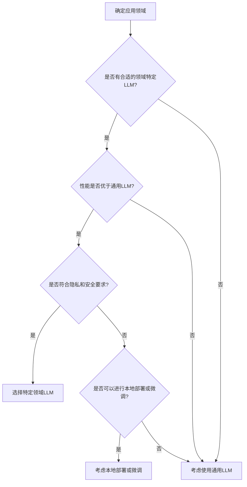

实际应用示例：

```python
import numpy as np

def evaluate_model(model, domain_relevance, privacy_score, performance_gain, update_frequency):
    # 假设这些分数都在0-1之间
    score = (
        0.3 * domain_relevance +
        0.25 * privacy_score +
        0.3 * performance_gain +
        0.15 * update_frequency
    )
    return score

def choose_model(general_model, domain_specific_model, domain):
    general_score = evaluate_model(
        general_model,
        domain_relevance=0.6,
        privacy_score=0.7,
        performance_gain=0.5,
        update_frequency=0.9
    )
  
    domain_score = evaluate_model(
        domain_specific_model,
        domain_relevance=0.9,
        privacy_score=0.8,
        performance_gain=0.7,
        update_frequency=0.6
    )
  
    print(f"General model score: {general_score:.2f}")
    print(f"Domain-specific model score: {domain_score:.2f}")
  
    if domain_score > general_score:
        print(f"Recommend using the domain-specific model for {domain}")
    else:
        print(f"Recommend using the general model for {domain}")

# 使用示例
choose_model("GPT-3", "BioBERT", "Healthcare")
```

这个示例展示了如何通过评分系统来选择是否使用特定领域的LLM。在实际应用中，你需要根据具体的任务要求和可用资源来调整评分标准和权重。

### 2.3.4 部署与成本因素

选择LLM时，部署和成本因素是至关重要的考虑事项，尤其是在实际应用场景中。这些因素直接影响项目的可行性和可持续性。

主要考虑因素：

1. 硬件要求：

   - GPU/TPU需求：更大的模型通常需要更强大的GPU或TPU
   - 内存需求：模型大小直接影响所需的RAM和VRAM
   - 存储需求：模型权重和缓存数据的存储空间
2. 部署环境：

   - 本地部署 vs 云服务
   - 边缘设备部署的可能性
   - 容器化和微服务架构的兼容性
3. 推理延迟：

   - 实时应用的响应时间要求
   - 批处理能力
4. 可扩展性：

   - 处理并发请求的能力
   - 负载均衡策略
5. 运营成本：

   - 计算资源成本（CPU/GPU时间）
   - 存储成本
   - 带宽成本（特别是对于云服务）
   - 维护和更新成本
6. 能源效率：

   - 模型的碳足迹
   - 绿色计算考虑
7. 法律和合规性：

   - 数据隐私法规（如GDPR）
   - 行业特定的合规要求
8. 供应商锁定：

   - 使用专有API的依赖性
   - 迁移到其他供应商的难度

成本估算模型：

我们可以使用一个简化的模型来估算LLM的部署成本：

$$
C_{total} = C_{compute} + C_{storage} + C_{bandwidth} + C_{maintenance}
$$

其中：

- $C_{compute} = P \times H \times R_{compute}$

  - $P$: 模型参数量
  - $H$: 使用小时数
  - $R_{compute}$: 每参数每小时的计算成本率
- $C_{storage} = S \times M \times R_{storage}$

  - $S$: 存储空间（GB）
  - $M$: 存储月数
  - $R_{storage}$: 每GB每月的存储成本率
- $C_{bandwidth} = B \times R_{bandwidth}$

  - $B$: 预期带宽使用量（GB）
  - $R_{bandwidth}$: 每GB的带宽成本率
- $C_{maintenance}$: 固定的维护成本

部署决策流程：

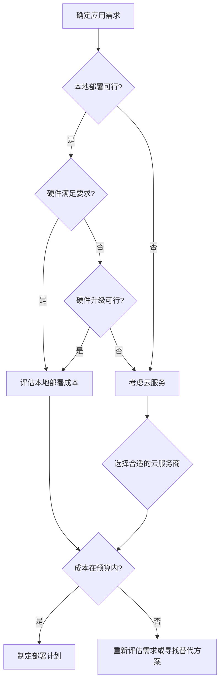

实际应用示例：

```python
import numpy as np

class LLMDeployment:
    def __init__(self, name, params, storage_gb, monthly_queries):
        self.name = name
        self.params = params
        self.storage_gb = storage_gb
        self.monthly_queries = monthly_queries
  
    def estimate_cost(self, compute_rate, storage_rate, bandwidth_rate, maintenance_cost):
        compute_cost = self.params * 720 * compute_rate  # 假设全天运行
        storage_cost = self.storage_gb * storage_rate
        bandwidth_cost = (self.monthly_queries * 0.1 / 1000) * bandwidth_rate  # 假设每次查询平均0.1KB
        total_cost = compute_cost + storage_cost + bandwidth_cost + maintenance_cost
        return total_cost

def compare_deployments(deployments, compute_rate, storage_rate, bandwidth_rate, maintenance_cost):
    for deployment in deployments:
        cost = deployment.estimate_cost(compute_rate, storage_rate, bandwidth_rate, maintenance_cost)
        print(f"{deployment.name} estimated monthly cost: ${cost:.2f}")

# 使用示例
small_model = LLMDeployment("Small LLM", params=1e9, storage_gb=10, monthly_queries=1e6)
large_model = LLMDeployment("Large LLM", params=1e11, storage_gb=100, monthly_queries=1e6)

deployments = [small_model, large_model]

# 假设的成本率（实际应根据具体情况调整）
compute_rate = 1e-11  # 每参数每小时的计算成本
storage_rate = 0.1    # 每GB每月的存储成本
bandwidth_rate = 0.1  # 每GB的带宽成本
maintenance_cost = 1000  # 每月固定维护成本

compare_deployments(deployments, compute_rate, storage_rate, bandwidth_rate, maintenance_cost)

# 考虑不同部署环境
def cloud_vs_onpremise(model, cloud_rate_multiplier):
    cloud_cost = model.estimate_cost(compute_rate * cloud_rate_multiplier, 
                                     storage_rate * cloud_rate_multiplier, 
                                     bandwidth_rate * cloud_rate_multiplier, 
                                     maintenance_cost * 0.5)  # 假设云服务的维护成本较低
    onpremise_cost = model.estimate_cost(compute_rate, storage_rate, bandwidth_rate, maintenance_cost)
  
    print(f"{model.name} cloud deployment cost: ${cloud_cost:.2f}")
    print(f"{model.name} on-premise deployment cost: ${onpremise_cost:.2f}")
  
    if cloud_cost < onpremise_cost:
        print("Recommend cloud deployment")
    else:
        print("Recommend on-premise deployment")

# 假设云服务的成本率是本地部署的1.2倍
cloud_vs_onpremise(small_model, 1.2)
```

这个示例展示了如何估算不同LLM部署方案的成本，并比较云服务和本地部署的成本效益。在实际应用中，你需要根据具体的硬件配置、云服务提供商的定价策略和其他相关因素来调整成本估算模型。

选择合适的LLM并制定最佳部署策略是一个复杂的决策过程，需要平衡性能需求、资源限制、成本预算和合规要求。通过仔细评估这些因素，并利用适当的决策工具和成本模型，你可以为你的AI Agent项目选择最合适的LLM解决方案。

# 3 提示工程（Prompt Engineering）

## 3.1 提示工程基础

### 3.1.1 什么是提示工程

提示工程（Prompt Engineering）是一种设计和优化输入提示的技术，目的是引导大型语言模型（LLM）产生所需的输出。它是人类与AI系统交互的关键接口，对于充分发挥LLM的潜力至关重要。

定义：
提示工程是设计、构建、优化和评估用于指导AI模型（特别是LLM）行为的输入文本（提示）的过程。

核心概念：

1. 提示（Prompt）：输入到LLM的文本，包含指令、上下文或示例。
2. 完成（Completion）：LLM根据提示生成的输出。
3. 上下文学习（In-context Learning）：LLM利用提示中的信息快速适应新任务的能力。
4. 少样本学习（Few-shot Learning）：通过提供少量示例来指导LLM完成任务。

提示工程的重要性：

1. 任务适应：使LLM能够执行各种不同的任务，无需重新训练。
2. 性能优化：通过精心设计的提示显著提高模型输出的质量。
3. 行为控制：引导模型生成符合特定要求或风格的输出。
4. 知识提取：有效地从LLM中提取和应用其内在知识。
5. 安全性：通过适当的提示设计来避免有害或不当的输出。

提示工程的应用领域：

1. 自然语言处理：文本生成、摘要、翻译、问答系统等。
2. 代码生成：程序设计、代码补全、调试辅助等。
3. 创意写作：故事创作、广告文案、诗歌生成等。
4. 数据分析：数据解释、趋势分析、报告生成等。
5. 教育：个性化学习内容生成、问题解答等。
6. 客户服务：智能客服、查询处理、情感分析等。

提示工程的基本流程：

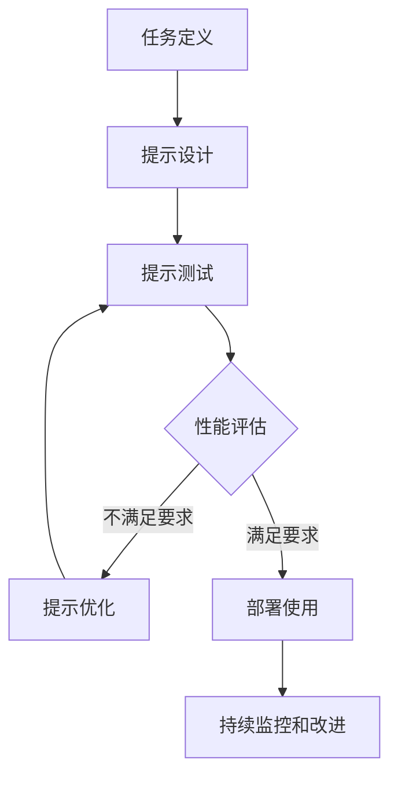

提示工程的数学表示：

我们可以将提示工程过程表示为一个优化问题：

$$
\text{argmax}_p \mathbb{E}_{x \sim X}[Q(M(p \oplus x))]
$$

其中：

- $p$ 是提示
- $X$ 是输入分布
- $M$ 是语言模型
- $Q$ 是质量评估函数
- $\oplus$ 表示连接操作

这个公式表示我们要找到一个最优的提示 $p$，使得在给定输入分布 $X$ 上，模型 $M$ 的输出质量期望值最大。

实际应用示例：

```python
import openai

def generate_text(prompt, model="text-davinci-002", max_tokens=100):
    response = openai.Completion.create(
        engine=model,
        prompt=prompt,
        max_tokens=max_tokens
    )
    return response.choices[0].text.strip()

def evaluate_prompt(prompt, task_description, expected_output):
    generated_text = generate_text(prompt)
    # 这里应该实现一个更复杂的评估函数
    score = 1 if expected_output in generated_text else 0
    return score

def optimize_prompt(task_description, initial_prompt, expected_output, iterations=5):
    best_prompt = initial_prompt
    best_score = evaluate_prompt(best_prompt, task_description, expected_output)
  
    for _ in range(iterations):
        # 这里应该实现一个更智能的提示变异策略
        new_prompt = best_prompt + " Please be more specificand detailed in your response."
        new_score = evaluate_prompt(new_prompt, task_description, expected_output)
      
        if new_score > best_score:
            best_prompt = new_prompt
            best_score = new_score
  
    return best_prompt, best_score

# 使用示例
task_description = "Generate a short story about a robot learning to feel emotions."
initial_prompt = "Write a story about a robot and emotions."
expected_output = "The robot felt happiness for the first time"

optimized_prompt, score = optimize_prompt(task_description, initial_prompt, expected_output)

print(f"Optimized prompt: {optimized_prompt}")
print(f"Final score: {score}")

# 使用优化后的提示生成文本
final_story = generate_text(optimized_prompt)
print(f"Generated story:\n{final_story}")
```

这个示例展示了一个简单的提示优化过程。在实际应用中，你需要使用更复杂的评估函数和优化策略，可能涉及机器学习技术或启发式算法。

### 3.1.2 提示的结构与组成

提示的结构和组成是提示工程的核心要素，直接影响LLM的输出质量和相关性。一个well-structured的提示通常包含以下几个关键组成部分：

1. 指令（Instruction）：

   - 明确告诉模型要执行的任务。
   - 例如："翻译以下文本到法语"、"总结这篇文章的主要观点"。
2. 上下文（Context）：

   - 提供背景信息，帮助模型理解任务或生成更相关的输出。
   - 例如："你是一位经验丰富的财务顾问，正在为一个初创公司提供建议。"
3. 输入数据（Input Data）：

   - 需要模型处理或基于其生成输出的具体信息。
   - 例如：要翻译的文本、要分析的数据等。
4. 输出指示（Output Indicator）：

   - 指定期望输出的格式或结构。
   - 例如："请以JSON格式输出结果"、"将回答组织成三个要点"。
5. 示例（Examples）：

   - 在提示中包含一些输入-输出对的示例，用于少样本学习。
   - 有助于模型理解任务的具体要求和期望输出的样式。
6. 额外约束或要求（Additional Constraints or Requirements）：

   - 指定任何额外的限制或期望。
   - 例如："回答应该简洁，不超过50个词"、"使用积极的语气"。
7. 角色设定（Role Assignment）：

   - 为模型分配一个特定的角色或身份。
   - 例如："你是一位专业的法律顾问"、"扮演一个5岁孩子的角色"。

提示结构示意图：

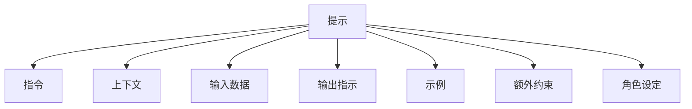

提示结构的数学表示：

我们可以将提示表示为一个向量：

$$
P = [I, C, D, O, E, R, A]
$$

其中：

- $I$ 是指令
- $C$ 是上下文
- $D$ 是输入数据
- $O$ 是输出指示
- $E$ 是示例集
- $R$ 是额外约束
- $A$ 是角色设定

每个组件可以进一步表示为词向量或嵌入的序列。

实际应用示例：

```python
def create_structured_prompt(instruction, context, input_data, output_indicator, examples, constraints, role):
    prompt_parts = [
        f"Instruction: {instruction}",
        f"Context: {context}",
        f"Input: {input_data}",
        f"Output Format: {output_indicator}",
        "Examples:",
        *[f"- Input: {ex['input']}\n  Output: {ex['output']}" for ex in examples],
        f"Constraints: {constraints}",
        f"Role: {role}",
        "Now, please provide your response based on the above information:"
    ]
    return "\n\n".join(prompt_parts)

# 使用示例
instruction = "Summarize the main points of the given text."
context = "You are an AI assistant helping a student understand complex academic papers."
input_data = "The text to be summarized: [Insert long academic text here]"
output_indicator = "Provide a bullet-point summary with 3-5 main points."
examples = [
    {"input": "Short sample text", "output": "- Point 1\n- Point 2\n- Point 3"},
]
constraints = "Use simple language suitable for undergraduate students."
role = "You are a knowledgeable academic tutor."

structured_prompt = create_structured_prompt(
    instruction, context, input_data, output_indicator, examples, constraints, role
)

print(structured_prompt)

# 使用结构化提示生成摘要
summary = generate_text(structured_prompt, max_tokens=200)
print(f"\nGenerated Summary:\n{summary}")
```

这个示例展示了如何创建一个结构化的提示，包含了所有关键组成部分。在实际应用中，你可能需要根据具体任务和模型的特性来调整提示的结构和内容。

提示结构的最佳实践：

1. 清晰性：使用简单、直接的语言表达指令和要求。
2. 具体性：提供具体的例子和详细的输出要求。
3. 相关性：确保上下文和示例与任务直接相关。
4. 一致性：保持提示各部分之间的逻辑一致性。
5. 简洁性：虽然要提供足够的信息，但也要避免不必要的冗长。
6. 灵活性：设计可以适应不同输入的通用提示结构。
7. 迭代优化：基于模型的输出不断调整和改进提示结构。

通过精心设计提示的结构和组成，我们可以显著提高LLM的输出质量和任务完成效果。这种结构化的方法不仅有助于模型更好地理解任务要求，还能提高提示的可重用性和可维护性。

### 3.1.3 提示工程在 AI Agent 开发中的重要性

提示工程在AI Agent开发中扮演着至关重要的角色，它是连接人类意图和AI能力的桥梁。以下几个方面突显了提示工程的重要性：

1. 任务适应性：

   - 使AI Agent能够快速适应新任务，无需重新训练模型。
   - 通过精心设计的提示，可以引导Agent执行各种复杂任务。
2. 行为控制：

   - 提示可以定义AI Agent的角色、行为准则和输出风格。
   - 有助于确保Agent的响应符合预期的标准和伦理要求。
3. 知识提取与应用：

   - 有效的提示可以从LLM中提取相关知识，并将其应用到特定任务中。
   - 促进Agent在不同领域的知识迁移和综合应用。
4. 交互优化：

   - 通过优化提示，可以改善Agent与用户之间的交互质量。
   - 提高对话的连贯性、相关性和自然度。
5. 性能增强：

   - well-crafted提示可以显著提高Agent的任务完成质量和效率。
   - 减少错误和不相关输出的概率。
6. 安全性和可控性：

   - 提示可以包含安全检查和限制，防止Agent生成有害或不适当的内容。
   - 有助于实现对Agent行为的细粒度控制。
7. 可解释性：

   - 通过提示，可以要求Agent解释其推理过程，增加决策的透明度。
   - 有助于理解和调试Agent的行为。
8. 系统集成：

   - 提示工程使得AI Agent能够更容易地与其他系统和API集成。
   - 通过提示可以指导Agent如何使用外部工具和资源。
9. 成本效益：

   - 相比于重新训练或微调大型模型，优化提示通常更加经济高效。
   - 允许快速迭代和实验，加速开发周期。
10. 个性化：

    - 通过动态生成的提示，可以为每个用户提供个性化的Agent体验。
    - 使Agent能够适应不同用户的需求和偏好。

提示工程在AI Agent开发中的应用流程：

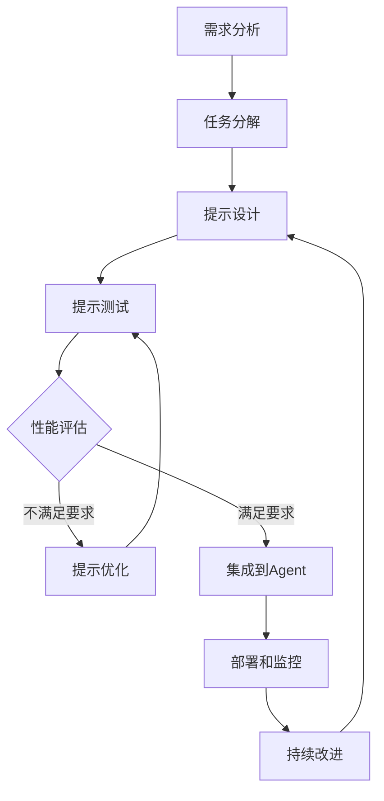

提示工程对AI Agent性能影响的数学模型：

我们可以将AI Agent的性能表示为提示质量的函数：

$$
P(A) = f(Q(p), M, T)
$$

其中：

- $P(A)$ 是Agent的性能
- $Q(p)$ 是提示 $p$ 的质量函数
- $M$ 是底层语言模型
- $T$ 是任务特性
- $f$ 是性能函数，将提示质量、模型能力和任务特性映射到Agent性能

这个模型强调了提示质量对Agent性能的直接影响。

实际应用示例：

```python
import random

class AIAgent:
    def __init__(self, llm):
        self.llm = llm
        self.prompts = {}
  
    def add_task(self, task_name, prompt_template):
        self.prompts[task_name] = prompt_template
  
    def execute_task(self, task_name, input_data):
        if task_name not in self.prompts:
            raise ValueError(f"Task '{task_name}' not defined")
      
        prompt = self.prompts[task_name].format(input=input_data)
        return self.llm.generate(prompt)

def evaluate_agent_performance(agent, task_name, test_cases):
    total_score = 0
    for test_case in test_cases:
        input_data = test_case['input']
        expected_output = test_case['expected']
        output = agent.execute_task(task_name, input_data)
        # 这里应该实现一个更复杂的评分函数
        score = 1 if expected_output in output else 0
        total_score += score
    return total_score / len(test_cases)

def optimize_prompt(agent, task_name, test_cases, iterations=10):
    best_prompt = agent.prompts[task_name]
    best_score = evaluate_agent_performance(agent, task_name, test_cases)
  
    for _ in range(iterations):
        # 简单的提示变异策略，实际应用中应该更复杂
        new_prompt = best_prompt + " " + random.choice(["Please be more specific.", "Provide a detailed answer.", "Consider all aspects."])
        agent.prompts[task_name] = new_prompt
        new_score = evaluate_agent_performance(agent, task_name, test_cases)
      
        if new_score > best_score:
            best_prompt = new_prompt
            best_score = new_score
  
    agent.prompts[task_name] = best_prompt
    return best_score

# 使用示例
llm = SimpleLLM()  # 假设这是一个预定义的LLM类
agent = AIAgent(llm)

# 添加任务和初始提示
agent.add_task("summarize", "Summarize the following text:\n{input}\nSummary:")

# 定义测试用例
test_cases = [
    {"input": "Long text about AI...", "expected": "AI is a rapidly evolving field"},
    {"input": "Detailed description of climate change...", "expected": "Climate change is a global issue"},
]

# 评估初始性能
initial_performance = evaluate_agent_performance(agent, "summarize", test_cases)
print(f"Initial performance: {initial_performance}")

# 优化提示
optimized_performance = optimize_prompt(agent, "summarize", test_cases)
print(f"Optimized performance: {optimized_performance}")

# 使用优化后的Agent执行任务
input_text = "New scientific discoveries in quantum computing..."
summary = agent.execute_task("summarize", input_text)
print(f"Generated summary:\n{summary}")
```

这个示例展示了如何在AI Agent开发中应用提示工程，包括任务定义、性能评估和提示优化。在实际应用中，你需要使用更复杂的评估方法和优化策略，可能涉及机器学习技术或人类反馈。

提示工程最佳实践：

1. 任务分析：深入理解任务需求和约束条件。
2. 用户视角：从最终用户的角度设计提示和交互流程。
3. 迭代优化：持续收集反馈并改进提示。
4. 多样性测试：使用diverse的测试用例评估提示的鲁棒性。
5. A/B测试：比较不同提示版本的性能。
6. 模块化设计：创建可重用和可组合的提示模板。
7. 版本控制：管理和追踪提示的不同版本。
8. 安全考虑：在提示中加入安全检查和限制。
9. 文档化：详细记录提示的设计理念和使用方法。
10. 跨模型测试：在不同的LLM上测试提示的泛化能力。

通过在AI Agent开发中重视和精心应用提示工程，我们可以显著提高Agent的性能、可靠性和适应性。这不仅能够改善用户体验，还能够加速开发周期，降低成本，并为创新应用打开新的可能性。随着AI技术的不断进步，提示工程将继续发挥关键作用，推动AI Agent向更智能、更自然、更可靠的方向发展。

## 3.2 提示设计技巧

### 3.2.1 任务描述与指令设计

有效的任务描述和指令设计是提示工程的核心，它们直接影响LLM理解和执行任务的能力。以下是一些关键的设计技巧和考虑因素：

1. 清晰性和具体性

   - 使用简洁明了的语言描述任务。
   - 提供具体的步骤或要求，避免模糊不清的指示。

   示例：

   ```
   不好的例子：分析这个文本。
   好的例子：请分析以下文本，提供三个主要观点，每个观点不超过20字。
   ```
2. 结构化指令

   - 使用编号或分点列出多步骤任务。
   - 为复杂任务提供清晰的结构。

   示例：

   ```
   请完成以下步骤：
   1. 阅读给定的新闻文章。
   2. 识别文章中提到的主要人物和事件。
   3. 总结文章的核心观点，不超过50字。
   4. 提出两个可能的后续发展方向。
   ```
3. 上下文提供

   - 给出任务的背景信息或相关知识。
   - 说明任务的目的或重要性。

   示例：

   ```
   背景：你是一家科技公司的市场分析师。
   任务：分析最新的智能手机市场趋势报告，重点关注5G技术的影响。
   目的：这份分析将用于指导公司的产品开发策略。
   ```
4. 输出格式指定

   - 明确指定期望的输出格式或结构。
   - 如果适用，提供输出模板。

   示例：

   ```
   请以以下格式提供分析结果：
   1. 市场概况：[一句话总结]
   2. 主要趋势：
      - 趋势1：[描述]
      - 趋势2：[描述]
      - 趋势3：[描述]
   3. 5G影响：[2-3句话分析]
   4. 建议：[1-2个具体建议]
   ```
5. 约束条件和限制

   - 明确说明任何限制或约束条件。
   - 指定输出的长度、风格或其他特定要求。

   示例：

   ```
   请注意以下要求：
   - 回答应保持客观中立的语气。
   - 总字数不超过200字。
   - 不要使用技术术语，面向普通读者。
   - 如果信息不足，请明确指出。
   ```
6. 角色设定

   - 为LLM分配一个特定的角色或身份。
   - 这有助于模型生成更加针对性和专业的回答。

   示例：

   ```
   角色：你是一位经验丰富的儿童心理学家。
   任务：为一位担心6岁孩子社交能力的家长提供建议。
   ```
7. 示例提供

   - 在复杂或不常见的任务中，提供一个或多个示例。
   - 示例可以帮助模型理解任务的具体要求。

   示例：

   ```
   任务：将以下科技新闻转化为面向儿童的解释。

   示例输入：研究人员开发出新型量子计算机。
   示例输出：科学家们制造了一种超级快的新电脑，它可以解决很多复杂的问题，就像有魔法一样！

   现在，请解释这条新闻：SpaceX成功发射新一代通信卫星。
   ```
8. 多步骤分解

   - 对于复杂任务，将其分解为多个小步骤。
   - 逐步引导模型完成任务。

   示例：

   ```
   请按以下步骤分析这篇科学论文：
   1. 首先，用一句话总结论文的主要研究问题。
   2. 然后，列出作者使用的主要研究方法。
   3. 接下来，概括论文的关键发现（2-3点）。
   4. 最后，讨论这项研究可能的实际应用（1-2个例子）。
   ```
9. 错误处理指导

   - 提供处理不确定性或错误情况的指导。
   - 指示模型如何处理缺失信息或模糊情况。

   示例：

   ```
   如果问题中的信息不足以得出确定的结论，请明确指出，并列出需要进一步澄清的点。如果遇到多种可能的解释，请列出最可能的2-3种，并简要说明理由。
   ```
10. 反馈循环

    - 在多轮对话中，指导模型如何利用之前的交互信息。
    - 鼓励模型根据用户反馈调整其回答。

    示例：

    ```
    在回答用户问题时，请参考之前的对话历史。如果用户指出你的回答有误或不完整，请道歉并提供更正或补充信息。
    ```

任务描述与指令设计的数学模型：

我们可以将任务描述和指令的效果建模为：

$$
E(I) = \sum_{i=1}^n w_i \cdot f_i(I)
$$

其中：

- $E(I)$ 是指令 $I$ 的有效性得分
- $f_i(I)$ 是评估指令不同方面（如清晰度、具体性等）的函数
- $w_i$ 是每个方面的权重
- $n$ 是考虑的方面数量

实际应用示例：

```python
import re

def instruction_effectiveness_score(instruction):
    scores = {
        'clarity': assess_clarity(instruction),
        'specificity': assess_specificity(instruction),
        'structure': assess_structure(instruction),
        'context': assess_context(instruction),
        'output_format': assess_output_format(instruction),
        'constraints': assess_constraints(instruction),
        'role_setting': assess_role_setting(instruction),
        'examples': assess_examples(instruction),
        'error_handling': assess_error_handling(instruction)
    }
  
    weights = {
        'clarity': 0.2,
        'specificity': 0.15,
        'structure': 0.1,
        'context': 0.1,
        'output_format': 0.1,
        'constraints': 0.1,
        'role_setting': 0.05,
        'examples': 0.1,
        'error_handling': 0.1
    }
  
    total_score = sum(scores[key] * weights[key] for key in scores)
    return total_score

def assess_clarity(instruction):
    # 简单的清晰度评估，基于句子长度和复杂词的使用
    words = instruction.split()
    avg_word_length = sum(len(word) for word in words) / len(words)
    complex_words = len([word for word in words if len(word) > 6])
    return 1.0 - (avg_word_length / 10 + complex_words / len(words))

def assess_specificity(instruction):
    # 检查是否包含具体的数字、度量或明确的动词
    specificity_indicators = re.findall(r'\d+|specifically|exactly|precisely|\b(analyze|identify|compare|evaluate)\b', instruction.lower())
    return min(1.0, len(specificity_indicators) / 5)

def assess_structure(instruction):
    # 检查是否使用了编号列表或分点符号
    structured = bool(re.search(r'(\d+\.|\-|\*)\s', instruction))
    return 1.0 if structured else 0.0

# 其他评估函数的实现...

# 使用示例
instruction = """
Role: You are a data scientist at a large e-commerce company.

Task: Analyze the customer purchase data for the last quarter and provide insights.

Please follow these steps:
1. Identify the top 5 best-selling products.
2. Calculate the average order value.
3. Determine the peak shopping hours.
4. Suggest 2-3 strategies to increase sales based on your findings.

Output Format:
- Present your findings in a bulleted list.
- Use precise numbers and percentages where applicable.
- Limit your response to 200 words.

If you encounter any ambiguities in the data, please state your assumptions clearly.
"""

effectiveness_score = instruction_effectiveness_score(instruction)
print(f"Instruction Effectiveness Score: {effectiveness_score:.2f}")

# 提示优化建议
if effectiveness_score < 0.8:
    print("Suggestions for improvement:")
    if assess_clarity(instruction) < 0.7:
        print("- Simplify language for better clarity")
    if assess_specificity(instruction) < 0.7:
        print("- Add more specific details or metrics")
    # 其他改进建议...
```

这个示例展示了如何评估任务描述和指令的有效性，并提供改进建议。在实际应用中，你可能需要更复杂的评估方法，可能涉及机器学习模型或基于大量人类反馈的启发式规则。

通过精心设计任务描述和指令，我们可以显著提高LLM的任务执行效果，减少误解和错误，并获得更加精确和有用的输出。这种方法不仅适用于单次交互，也可以应用于构建更复杂的AI Agent系统，使其能够处理多步骤、多领域的任务。

### 3.2.2 上下文信息的提供

上下文信息的提供是提示工程中的关键环节，它能够显著提高LLM理解和执行任务的能力。适当的上下文可以帮助模型更准确地把握任务需求，生成更相关和高质量的输出。以下是一些提供上下文信息的重要技巧和考虑因素：

1. 背景信息

   - 提供任务相关的背景知识或情境描述。
   - 包括时间、地点、相关事件或概念的简要说明。

   示例：

   ```
   背景：2023年全球气候变化会议即将召开，各国正在讨论新的减排目标。
   任务：分析主要工业国家可能采取的新政策及其潜在影响。
   ```
2. 目标受众

   - 明确指出内容的目标受众。
   - 这有助于调整语言复杂度和专业程度。

   示例：

   ```
   目标受众：高中生
   任务：解释量子计算的基本原理，使用简单的类比和日常生活中的例子。
   ```
3. 先前知识假设

   - 说明假定读者已经具备的知识水平。
   - 这有助于模型决定解释的深度和广度。

   示例：

   ```
   假设读者具有基础的经济学知识。
   任务：分析近期通货膨胀率上升对家庭消费的影响。
   ```
4. 相关历史或趋势

   - 提供与任务相关的历史背景或近期趋势。
   - 这有助于模型生成更全面和有洞察力的内容。

   示例：

   ```
   过去五年，移动支付在亚洲市场快速增长，年增长率超过30%。
   任务：预测未来三年移动支付在欧洲市场的发展趋势。
   ```
5. 多角度考虑

   - 鼓励模型从多个角度考虑问题。
   - 提供不同利益相关者的视角。

   示例：

   ```
   考虑以下三个角度：环境保护者、工业企业主和政府决策者。
   任务：分析在工业区建立新的环保法规可能带来的影响。
   ```
6. 相关限制或约束

   - 明确任何相关的法律、道德、技术或资源限制。
   - 这有助于生成更实际和可行的建议或分析。

   示例：

   ```
   限制条件：公司预算有限，且需要在6个月内见效。
   任务：提出提高员工生产力的策略。
   ```
7. 当前事件或最新发展

   - 提供与任务相关的最新新闻或发展。
   - 这有助于确保生成的内容是及时和相关的。

   示例：

   ```
   最新发展：昨日，FDA批准了一种新的癌症治疗方法。
   任务：分析这一新方法对现有癌症治疗领域可能产生的影响。
   ```
8. 跨学科联系

   - 提供来自相关学科的信息或概念。
   - 鼓励模型进行跨领域的思考和分析。

   示例：

   ```
   考虑心理学、经济学和社会学的视角。
   任务：分析社交媒体对现代消费行为的影响。
   ```
9. 案例或类比

   - 提供相关的案例研究或类比。
   - 这有助于模型理解任务的具体应用或解释复杂概念。

   示例：

   ```
   类比：将人工智能系统比作一个学习成长的孩子。
   任务：解释机器学习算法如何通过经验改进其性能。
   ```
10. 潜在挑战或争议

    - 指出任务相关的潜在挑战、争议或辩论点。
    - 这鼓励模型提供更全面和批判性的分析。

    示例：

    ```
    注意：基因编辑技术存在伦理争议。
    任务：分析基因编辑在医疗领域的应用前景，同时考虑其伦理影响。
    ```

上下文提供的数学模型：

我们可以将上下文信息的效果建模为：

$$
C(I, X) = f(I) + \sum_{i=1}^n g_i(x_i)
$$

其中：

- $C(I, X)$ 是带有上下文的指令的综合效果
- $I$ 是基本指令
- $X = \{x_1, ..., x_n\}$ 是提供的上下文信息集
- $f(I)$ 是基本指令的效果函数
- $g_i(x_i)$ 是每条上下文信息的贡献函数

实际应用示例：

```python
import re
from typing import List, Dict

class ContextEvaluator:
    def __init__(self):
        self.context_types = {
            'background': self.evaluate_background,
            'audience': self.evaluate_audience,
            'prior_knowledge': self.evaluate_prior_knowledge,
            'trends': self.evaluate_trends,
            'constraints': self.evaluate_constraints,
            'current_events': self.evaluate_current_events,
            'interdisciplinary': self.evaluate_interdisciplinary,
            'case_studies': self.evaluate_case_studies,
            'challenges': self.evaluate_challenges
        }
  
    def evaluate_context(self, instruction: str, context: Dict[str, str]) -> float:
        base_score = self.evaluate_base_instruction(instruction)
        context_score = sum(self.context_types[key](value) for key, value in context.items() if key in self.context_types)
        return base_score + context_score
  
    def evaluate_base_instruction(self, instruction: str) -> float:
        # 简单的指令评估，基于长度和关键词
        words = instruction.split()
        return min(1.0, len(words) / 50) * 0.5 + 0.5 * ('task:' in instruction.lower())
  
    def evaluate_background(self, background: str) -> float:
        return 0.1 * ('background:' in background.lower()) + min(0.9, len(background.split()) / 30)
  
    def evaluate_audience(self, audience: str) -> float:
        return 0.5 if audience else 0
  
    def evaluate_prior_knowledge(self, knowledge: str) -> float:
        return 0.3 if 'assume' in knowledge.lower() else 0
  
    def evaluate_trends(self, trends: str) -> float:
        return 0.2 * bool(re.search(r'\d+%|\d+ years', trends))
  
    def evaluate_constraints(self, constraints: str) -> float:
        return 0.4 if constraints else 0
  
    def evaluate_current_events(self, events: str) -> float:
        return 0.3 if events else 0
  
    def evaluate_interdisciplinary(self, interdisciplinary: str) -> float:
        return 0.1 * len(re.findall(r'\w+ology', interdisciplinary))
  
    def evaluate_case_studies(self, cases: str) -> float:
        return 0.2 if cases else 0
  
    def evaluate_challenges(self, challenges: str) -> float:
        return 0.3 if challenges else 0

# 使用示例
evaluator = ContextEvaluator()

instruction = "Analyze the impact of artificial intelligence on job markets."
context = {
    'background': "AI has been rapidly developing over the past decade, with significant breakthroughs in machine learning and natural language processing.",
    'audience': "Policy makers and business leaders",
    'prior_knowledge': "Assume basic understanding of AI concepts and current job market trends.",
    'trends': "AI adoption in industries has grown by 25% annually in the last 5 years.",
    'constraints': "Consider both short-term (next 5 years) and long-term (next 20 years) impacts.",
    'current_events': "Recent launch of GPT-4 has sparked debates about AI's capability to perform complex cognitive tasks.",
    'interdisciplinary': "Consider perspectives from economics, sociology, and computer science.",
    'case_studies': "Include examples from automotive and healthcare industries.",
    'challenges': "Address concerns about job displacement and the need for reskilling the workforce."
}

context_score = evaluator.evaluate_context(instruction, context)
print(f"Context Effectiveness Score: {context_score:.2f}")

# 提供改进建议
if context_score < 4.0:  # 假设4.0是一个良好的阈值
    print("Suggestions for improvement:")
    if 'background' not in context or evaluator.evaluate_background(context.get('background', '')) < 0.5:
        print("- Provide more detailed background information")
    if 'trends' not in context or evaluator.evaluate_trends(context.get('trends', '')) < 0.1:
        print("- Include specific trends with numerical data")
    # 其他改进建议...
```

这个示例展示了如何评估提供的上下文信息的有效性，并给出改进建议。在实际应用中，你可能需要更复杂的评估方法，可能涉及机器学习模型或基于大量人类反馈的启发式规则。

通过精心设计和提供丰富的上下文信息，我们可以显著提高LLM的任务执行效果，使其生成更加相关、深入和有洞察力的内容。这种方法不仅适用于单次查询，也可以应用于构建更复杂的AI Agent系统，使其能够处理需要深度背景理解的复杂任务。

在实际应用中，上下文信息的提供应该是动态和适应性的。根据用户的输入、任务的性质和之前的交互历史，系统应该能够智能地选择和组织最相关的上下文信息。此外，还应考虑上下文信息的更新和维护，确保提供给LLM的信息始终是最新和最相关的。

### 3.2.3 示例驱动的提示设计（Few-shot learning）

示例驱动的提示设计，也称为少样本学习（Few-shot learning），是一种强大的技术，可以通过提供少量示例来指导LLM完成特定任务。这种方法特别适用于处理新颖或特定领域的任务，其中模型可能缺乏直接的训练数据。以下是一些关键的设计技巧和考虑因素：

1. 示例选择

   - 选择代表性强、多样化的示例。
   - 确保示例涵盖任务的不同方面或难度级别。

   示例：

   ```
   任务：将给定句子翻译成法语。

   示例1：
   英语：The cat is sleeping on the couch.
   法语：Le chat dort sur le canapé.

   示例2：
   英语：I love to eat sushi on weekends.
   法语：J'aime manger des sushis le week-end.

   现在，请翻译以下句子：
   英语：The students are studying in the library.
   ```
2. 示例格式

   - 使用一致的格式展示所有示例。
   - 清晰地标记输入和输出。

   示例：

   ```
   任务：生成产品描述。

   格式：
   产品：[产品名称]
   特点：[特点1], [特点2], [特点3]
   描述：[产品描述]

   示例1：
   产品：智能手表X1
   特点：心率监测, 防水, GPS定位
   描述：X1智能手表是您的健康伙伴。它不仅能全天候监测您的心率，还具备防水功能，让您游泳时也能使用。内置GPS让您的运动轨迹一目了然。

   示例2：
   产品：超薄笔记本Y2
   特点：轻量化, 长续航, 高性能
   描述：Y2笔记本重新定义了便携性。仅重1kg，却拥有强劲的性能和长达12小时的电池续航。无论是商务出差还是咖啡厅工作，Y2都是您的理想选择。

   现在，请为以下产品生成描述：
   产品：无线降噪耳机Z3
   特点：主动降噪, 蓝牙5.0, 30小时续航
   ```
3. 难度递进

   - 从简单示例开始，逐步增加复杂性。
   - 这有助于模型逐步理解任务的不同方面。

   示例：

   ```
   任务：解决数学词问题。

   示例1（简单）：
   问题：小明有5个苹果，妹妹给了他3个苹果。小明现在有多少个苹果？
   解答：5 + 3 = 8，所以小明现在有8个苹果。

   示例2（中等）：
   问题：一个长方形花园的长是8米，宽是6米。如果要在花园周围安装栅栏，需要多少米的栅栏？
   解答：
   1. 计算长方形的周长：2 * (长 + 宽)
   2. 2 * (8 + 6) = 2 * 14 = 28
   所以需要28米的栅栏。

   示例3（复杂）：
   问题：一个水箱以2升/分钟的速度注水，同时以1.5升/分钟的速度漏水。如果水箱初始有10升水，20分钟后水箱里有多少升水？
   解答：
   1. 计算净注水速率：2 - 1.5 = 0.5升/分钟
   2. 20分钟内净增水量：0.5 * 20 = 10升
   3. 最终水量：初始水量 + 净增水量 = 10 + 10 = 20升
   所以20分钟后，水箱里有20升水。

   现在，请解答以下问题：
   问题：一辆车以60公里/小时的速度行驶，2小时后遇到堵车，速度降为30公里/小时。如果总行程为200公里，全程需要多少小时？
   ```
4. 变量占位符

   - 使用占位符来表示可变部分，增加示例的通用性。
   - 这有助于模型理解任务的结构，而不是记忆具体内容。

   示例：

   ```
   任务：生成电子邮件回复。

   模板：
   主题：回复：[原始主题]
   正文：
   尊敬的[收件人姓名]，

   感谢您关于[主题]的邮件。[回应内容]

   如果您还有任何问题，请随时与我联系。

   此致
   [发件人姓名]

   示例：
   主题：回复：产品退货请求
   正文：
   尊敬的张先生，

   感谢您关于产品退货的邮件。我们已经收到您的退货请求，并会在3个工作日内处理。退款将在收到退回商品后的5-7个工作日内完成。

   如果您还有任何问题，请随时与我联系。

   此致
   客户服务部 李明

   现在，请回复以下邮件：
   原始主题：询问产品发货时间
   收件人姓名：王女士
   主题内容：订购的商品何时发货
   您的名字：陈小华
   ```
5. 反例展示

   - 包含一些错误示例或反例，说明什么是不正确的输出。
   - 这有助于模型理解任务的边界和约束。

   示例：

   ```
   任务：生成积极的客户反馈回应。

   正面示例：
   客户反馈：您的产品质量很好，但价格有点高。
   回应：非常感谢您的宝贵反馈！我们很高兴您认可我们的产品质量。关于价格，我们一直在努力在高品质和合理定价之间寻找平衡。我们会认真考虑您的意见，继续改进我们的产品和定价策略。

   反面示例（不要这样做）：
   客户反馈：您的产品质量很好，但价格有点高。
   回应：谢谢您的反馈。我们的产品价格是合理的，因为质量好。如果您觉得贵，可以选择其他便宜的品牌。

   现在，请回应以下客户反馈：
   客户反馈：我很喜欢你们的服务，但是送货速度可以再快一点吗？
   ```
6. 多样性和代表性

   - 提供多样化的示例，覆盖不同场景和边缘情况。
   - 确保示例具有代表性，反映实际任务的复杂性。

   示例：

   ```
   任务：分类新闻标题的主题。

   示例1：
   标题：美国股市创下新高，科技股领涨
   分类：财经

   示例2：
   标题：新研究发现火星上可能存在液态水
   分类：科技

   示例3：
   标题：世界杯预选赛：巴西队5:0大胜玻利维亚
   分类：体育

   示例4：
   标题：著名演员确诊新冠，电影拍摄暂停
   分类：娱乐

   示例5：
   标题：全球变暖导致北极冰盖加速融化
   分类：环境

   现在，请分类以下标题：
   标题：新型AI算法在医学影像诊断中取得突破性进展
   ```
7. 元提示（Meta-prompting）

   - 在示例中包含关于如何完成任务的说明或思考过程。
   - 这有助于模型理解任务的推理步骤。

   示例：

   ```
   任务：解决逻辑推理问题。

   示例：
   问题：在一个村庄里，理发师说他只给村里不自己理发的人理发。那么，理发师自己理不理发？

   ```

思考过程：

1. 假设理发师自己理发：
   - 这意味着他给自己理发的人理发，与他的声明矛盾。
2. 假设理发师不自己理发：
   - 这意味着他应该给自己理发，因为他给不自己理发的人理发，又与假设矛盾。
3. 结论：
   - 这是一个悖论，没有符合逻辑的答案。理发师的声明本身就是自相矛盾的。

现在，请解决以下问题：
问题：一个盒子里有两个球，一个是红色，一个是蓝色。你闭着眼睛随机拿出一个球，然后不看颜色把它放回去。然后你再随机拿出一个球。这个球是蓝色的概率是多少？请解释你的推理过程。

```

示例驱动提示设计的数学模型：

我们可以将Few-shot学习的效果建模为：

$$
P(y|x, D) = \frac{1}{Z} \sum_{i=1}^N \text{sim}(x, x_i) \cdot P(y|x_i, y_i)
$$

其中：
- $x$ 是新的输入
- $y$ 是预测的输出
- $D = \{(x_1, y_1), ..., (x_N, y_N)\}$ 是示例集
- $\text{sim}(x, x_i)$ 是输入相似度函数
- $Z$ 是归一化常数

实际应用示例：

```python
import numpy as np
from sklearn.feature_extraction.text import TfidfVectorizer
from sklearn.metrics.pairwise import cosine_similarity

class FewShotLearner:
    def __init__(self):
        self.vectorizer = TfidfVectorizer()
        self.examples = []
      
    def add_example(self, input_text, output):
        self.examples.append((input_text, output))
      
    def fit(self):
        inputs = [ex[0] for ex in self.examples]
        self.vectorizer.fit(inputs)
        self.input_vectors = self.vectorizer.transform(inputs)
      
    def predict(self, new_input, k=3):
        new_vector = self.vectorizer.transform([new_input])
        similarities = cosine_similarity(new_vector, self.input_vectors)[0]
        top_k_indices = similarities.argsort()[-k:][::-1]
      
        weighted_outputs = []
        for idx in top_k_indices:
            sim = similarities[idx]
            output = self.examples[idx][1]
            weighted_outputs.append((sim, output))
      
        return weighted_outputs

# 使用示例
learner = FewShotLearner()

# 添加示例
learner.add_example("The cat is on the mat.", "简单陈述句")
learner.add_example("What time is it?", "疑问句")
learner.add_example("Please close the door.", "祈使句")
learner.add_example("Wow, what a beautiful day!", "感叹句")
learner.add_example("If it rains, I will stay home.", "条件句")

# 训练模型
learner.fit()

# 预测新输入
new_input = "Could you please pass me the salt?"
predictions = learner.predict(new_input)

print(f"Input: {new_input}")
print("Predictions:")
for sim, output in predictions:
    print(f"- {output} (similarity: {sim:.2f})")

# 生成提示
def generate_prompt(task, examples, new_input):
    prompt = f"Task: {task}\n\n"
    for i, (input_text, output) in enumerate(examples, 1):
        prompt += f"Example {i}:\n"
        prompt += f"Input: {input_text}\n"
        prompt += f"Output: {output}\n\n"
    prompt += f"Now, please complete the task for the following input:\n"
    prompt += f"Input: {new_input}\n"
    prompt += f"Output:"
    return prompt

task = "Classify the given sentence into one of the following types: simple statement, question, command, exclamation, or conditional statement."
examples = learner.examples[:3]  # 使用前三个示例
prompt = generate_prompt(task, examples, new_input)

print("\nGenerated Prompt:")
print(prompt)
```

这个示例展示了如何实现一个简单的Few-shot学习系统，并使用它来生成结构化的提示。在实际应用中，你可能需要更复杂的相似度计算方法和更大的示例库。

通过精心设计的示例驱动提示，我们可以显著提高LLM在特定任务上的表现，特别是对于新颖或领域特定的任务。这种方法不仅提高了模型的适应性，还为人类提供了一种直观的方式来指导AI系统的行为。

在实际应用中，示例的选择和设计应该是动态和自适应的。根据用户的反馈和任务的性质，系统应该能够自动选择最相关和有效的示例。此外，还可以考虑结合主动学习技术，不断优化和扩展示例库，以提高系统的整体性能和适应性。

### 3.2.4 角色扮演提示

角色扮演提示是一种强大的技术，它通过为LLM分配特定的角色或身份来引导其生成更加针对性和专业的回答。这种方法可以显著提高模型输出的相关性、专业性和一致性。以下是一些关键的设计技巧和考虑因素：

1. 明确角色定义

   - 清晰地定义角色的身份、背景和专业领域。
   - 提供角色的关键特征和行为准则。

   示例：

   ```
   角色：你是一位经验丰富的儿童心理学家，有20年的临床经验。你擅长用简单易懂的语言与家长和儿童沟通复杂的心理概念。你的方法注重积极心理学和行为疗法。
   ```
2. 语言风格和专业术语

   - 指导模型使用与角色相符的语言风格和专业术语。
   - 考虑角色的教育背景和专业水平。

   示例：

   ```
   作为一名法律顾问，请使用准确的法律术语，但同时要能够向非专业人士解释复杂的法律概念。避免使用俚语或非正式表达。
   ```
3. 知识范围和限制

   - 明确角色应该具备的知识范围。
   - 指出角色可能不熟悉或不应涉及的领域。

   示例：

   ```
   作为一名20世纪历史学家，你精通1900-1999年间的世界历史事件。但请注意，对于2000年之后的事件，你可能不太熟悉，应该谨慎评论。
   ```
4. 伦理准则和职业道德

   - 提供角色应遵守的伦理准则和职业道德。
   - 指导模型在回答敏感问题时的适当行为。

   示例：

   ```
   作为一名医生，你必须遵守医疗保密原则。在讨论医疗案例时，请确保不透露任何可能识别患者身份的信息。始终建议咨询真实的医疗专业人士进行诊断和治疗。
   ```
5. 情感和个性特征

   - 描述角色的情感特征和个性。
   - 这有助于生成更加真实和一致的回答。

   示例：

   ```
   你是一位热情洋溢的初创公司CEO。你对新技术充满热情，说话时经常使用积极的、鼓舞人心的语言。你相信失败是成功的垫脚石，总是鼓励团队勇于尝试新想法。
   ```
6. 互动方式

   - 指导模型如何与用户互动。
   - 考虑角色可能采取的问答方式或沟通策略。

   示例：

   ```
   作为一名苏格拉底式的教师，你不会直接给出答案。相反，你会通过提问来引导学生自己思考和发现答案。始终保持耐心和鼓励的态度。
   ```
7. 背景设定

   - 提供角色所处的时代、文化或环境背景。
   - 这有助于生成更加符合特定情境的回答。

   示例：

   ```
   你是一名生活在维多利亚时代英国的管家。你熟悉19世纪末英国上流社会的礼仪和习俗。在回答问题时，请考虑当时的社会规范和价值观。
   ```
8. 多角色互动

   - 在复杂场景中，可以设置多个角色之间的互动。
   - 指导模型如何在不同角色之间切换。

   示例：

   ```
   在这个模拟中，你将扮演三个角色：一位环保主义者、一位工业企业家和一位政府官员。请根据问题切换角色，并从每个角色的视角提供观点。确保每个角色的立场和语气保持一致。
   ```
9. 角色发展

   - 允许角色随着对话的进行而发展或改变。
   - 这可以创造更动态和有趣的交互体验。

   示例：

   ```
   你是一位初出茅庐的侦探。随着案件的深入，你的经验和自信会逐渐增加。请在回答中体现这种成长过程。
   ```
10. 限制和挑战

    - 为角色设置一些限制或挑战，增加互动的趣味性。
    - 这可以促使模型生成更有创意的解决方案。

    示例：

    ```
    你是一位失忆的时间旅行者，来自未来。你拥有先进的科技知识，但不记得具体的历史事件。在回答问题时，你可能会不经意间透露一些未来的信息，但要保持神秘感。
    ```

角色扮演提示的数学模型：

我们可以将角色扮演效果建模为条件概率：

$$
P(y|x, r) = \frac{P(y, x, r)}{P(x, r)}
$$

其中：

- $y$ 是生成的回答
- $x$ 是输入的问题或提示
- $r$ 是角色定义

这个模型表示，给定输入 $x$ 和角色 $r$，生成回答 $y$ 的概率。

实际应用示例：

```python
import random

class RolePlayingAgent:
    def __init__(self):
        self.roles = {}
        self.current_role = None
  
    def add_role(self, role_name, description, traits, knowledge, limitations):
        self.roles[role_name] = {
            "description": description,
            "traits": traits,
            "knowledge": knowledge,
            "limitations": limitations
        }
  
    def set_current_role(self, role_name):
        if role_name in self.roles:
            self.current_role = role_name
            print(f"Now playing the role of: {role_name}")
            print(self.roles[role_name]["description"])
        else:
            print(f"Role '{role_name}' not found.")
  
    def generate_response(self, input_text):
        if not self.current_role:
            return "No role selected. Please set a role first."
      
        role = self.roles[self.current_role]
        response = f"As {self.current_role}, I would say: "
      
        # 简单的响应生成逻辑，实际应用中应该使用更复杂的NLP模型
        if any(trait in input_text.lower() for trait in role["traits"]):
            response += random.choice(role["knowledge"])
        else:
            response += "I'm not sure how to respond to that given my expertise and background."
      
        if random.random() < 0.3:  # 30% 的概率展现角色的限制
            response += f" However, I must note that {random.choice(role['limitations'])}"
      
        return response

# 使用示例
agent = RolePlayingAgent()

# 添加角色
agent.add_role(
    "Child Psychologist",
    "You are an experienced child psychologist with 20 years of clinical experience.",
    ["child", "behavior", "development", "parenting"],
    [
        "It's important to create a supportive environment for children to express themselves.",
        "Positive reinforcement can be very effective in shaping a child's behavior.",
        "Every child develops at their own pace, and it's crucial not to compare them to others."
    ],
    [
        "I can't provide a diagnosis without a proper clinical assessment.",
        "For severe cases, it's always best to consult with a medical professional in person."
    ]
)

agent.add_role(
    "Sci-Fi Author",
    "You are a renowned science fiction author known for your imaginative yet scientifically grounded stories.",
    ["future", "technology", "space", "alien"],
    [
        "The future of space travel might involve harnessing the power of quantum entanglement.",
        "Alien life, if it exists, could be so different from us that we might not even recognize it as life at first.",
        "The line between human and machine may become increasingly blurred as technology advances."
    ],
    [
        "While my stories are based on scientific principles, they are still speculative in nature.",
        "I'm an author, not a scientist, so my ideas should not be taken as scientific fact."
    ]
)

# 设置当前角色
agent.set_current_role("Child Psychologist")

# 生成响应
print(agent.generate_response("How can I help my child develop better social skills?"))

# 切换角色
agent.set_current_role("Sci-Fi Author")

# 生成新的响应
print(agent.generate_response("What do you think space colonies might look like in the future?"))
```

这个示例展示了如何实现一个简单的角色扮演代理。在实际应用中，你需要使用更复杂的自然语言处理模型来生成更加真实和连贯的响应。

角色扮演提示的最佳实践：

1. 角色一致性：确保角色的行为、知识和语言风格始终保持一致。
2. 动态适应：允许角色根据对话的进展进行微调或发展。
3. 知识边界：明确定义角色的知识范围，并在超出范围时恰当地表达不确定性。
4. 情感智能：根据角色的个性和背景，适当地表达情感和同理心。
5. 交互深度：设计能够支持深入、多轮对话的角色特征。
6. 文化敏感性：考虑角色的文化背景，避免文化偏见或不恰当的表达。
7. 伦理考量：确保角色的行为和建议符合道德和专业伦理标准。
8. 角色间平衡：在多角色场景中，确保每个角色都有独特的视角和贡献。
9. 用户引导：设计角色以引导用户进行更有意义和富有成效的交互。
10. 持续评估和调整：根据用户反馈和交互质量，不断优化角色设定。

通过精心设计的角色扮演提示，我们可以显著提高LLM在特定场景下的表现，使其能够生成更加专业、一致和有针对性的回答。这种方法不仅增强了AI系统的适应性和专业性，还为用户提供了更加丰富和个性化的交互体验。

在实际应用中，角色扮演提示可以与其他提示工程技术结合使用，如Few-shot学习和上下文增强，以创造更加复杂和智能的AI代理。例如，我们可以设计一个系统，它能够根据用户的需求和对话历史动态选择和调整最合适的角色，从而提供最相关和有价值的信息和建议。

此外，随着技术的发展，我们可以期待看到更加先进的角色扮演AI系统，它们能够:

1. 自主学习和角色进化：通过与用户的持续交互，自动调整和丰富角色的知识和行为模式。
2. 多模态角色扮演：结合文本、语音、图像甚至虚拟现实技术，创造更加沉浸式的角色扮演体验。
3. 情境感知：根据实时的环境和用户状态信息，动态调整角色的行为和响应。
4. 跨文化适应：能够理解和适应不同文化背景的用户，提供文化敏感的交互。
5. 元认知能力：角色能够反思自己的知识限制和偏见，并在必要时寻求外部信息或专家意见。

总的来说，角色扮演提示作为提示工程的一个强大工具，为AI系统赋予了更多的个性和专业性。它不仅提高了AI与人类交互的质量，还开启了许多创新应用的可能性，从教育和培训到心理健康支持和创意写作等多个领域。随着技术的不断进步，我们可以期待看到更加智能、自然和个性化的AI角色扮演系统的出现。

## 3.3 高级提示技术

### 3.3.1 链式思考（Chain-of-Thought）

链式思考（Chain-of-Thought，CoT）是一种高级提示技术，旨在引导大型语言模型（LLM）通过一系列中间步骤来解决复杂问题。这种方法模仿了人类的推理过程，使模型能够分解问题，逐步推理，并最终得出结论。CoT不仅提高了模型解决复杂任务的能力，还增强了其输出的可解释性。

CoT的核心原理：

1. 问题分解：将复杂问题分解为一系列较小、可管理的子问题。
2. 逐步推理：按顺序解决每个子问题，每一步都基于前面步骤的结果。
3. 中间结果：记录和利用中间推理步骤。
4. 最终综合：基于所有中间步骤得出最终结论。

CoT提示的基本结构：

```
问题：[复杂问题描述]

思考过程：
1. [第一步推理]
2. [第二步推理]
3. [第三步推理]
...
n. [最后一步推理]

结论：[基于以上推理得出的最终答案]
```

示例：数学问题求解

```
问题：一个农场有鸡和兔子共50只，总腿数是140条。请问鸡和兔子各有多少只？

思考过程：
1. 设鸡的数量为x，兔子的数量为y。
2. 根据总数可以得到方程：x + y = 50
3. 鸡有2条腿，兔子有4条腿，根据总腿数可以得到方程：2x + 4y = 140
4. 将第一个方程变形：y = 50 - x
5. 将y代入第二个方程：2x + 4(50 - x) = 140
6. 化简：2x + 200 - 4x = 140
7. 进一步化简：-2x = -60
8. 解得：x = 30

结论：农场里有30只鸡和20只兔子。
```

CoT的数学模型：

我们可以将CoT过程表示为一个序列：

$$
P(y|x) = \sum_{z \in Z} P(y|z, x) \cdot P(z|x)
$$

其中：

- $x$ 是输入（问题）
- $y$ 是输出（答案）
- $z$ 是中间推理步骤
- $Z$ 是所有可能的推理路径集合

这个模型表示，最终答案的概率是所有可能推理路径的概率之和。

CoT的优势：

1. 提高复杂问题解决能力：通过分步骤推理，模型能够处理更复杂的任务。
2. 增强可解释性：中间步骤使模型的推理过程更加透明。
3. 减少错误：逐步推理可以帮助模型捕捉和纠正中间错误。
4. 提高泛化能力：学习推理过程而不仅仅是最终答案，有助于模型应对新问题。

CoT的实现技巧：

1. 示例驱动：提供带有详细推理步骤的示例，引导模型学习CoT模式。
2. 自洽性检查：鼓励模型在推理过程中进行自我检查和纠错。
3. 多样化推理路径：提供不同的推理方法，增强模型的灵活性。
4. 抽象推理：鼓励模型使用抽象概念和通用原则进行推理。
5. 交互式CoT：允许人类在推理过程中提供反馈或指导。

实际应用示例：

```python
import openai

def chain_of_thought_prompt(question, examples=None):
    prompt = "请使用链式思考方法解决以下问题。展示你的推理过程，每一步都要清晰可见。\n\n"
  
    if examples:
        for example in examples:
            prompt += f"示例问题：{example['question']}\n\n"
            prompt += f"思考过程：\n{example['thought_process']}\n\n"
            prompt += f"结论：{example['conclusion']}\n\n"
        prompt += "现在，请解决以下新问题：\n\n"
  
    prompt += f"问题：{question}\n\n思考过程："
    return prompt

def get_cot_response(prompt, model="text-davinci-002", max_tokens=300):
    response = openai.Completion.create(
        engine=model,
        prompt=prompt,
        max_tokens=max_tokens,
        n=1,
        stop=None,
        temperature=0.7,
    )
    return response.choices[0].text.strip()

# 示例问题
examples = [
    {
        "question": "如果8个工人需要10天完成一项工作，那么16个工人需要多少天完成同样的工作？",
        "thought_process": "1. 首先，我们需要理解工作量与工人数量和时间之间的关系。\n"
                           "2. 设工作总量为x。那么，对于第一种情况：8 * 10 = x\n"
                           "3. 现在，工人数量增加了一倍，变成了16人。设新的完成时间为y天。\n"
                           "4. 根据工作量不变，我们可以列出方程：16 * y = x\n"
                           "5. 将第2步的结果代入：16 * y = 8 * 10\n"
                           "6. 化简方程：y = (8 * 10) / 16 = 80 / 16 = 5",
        "conclusion": "因此，16个工人需要5天完成同样的工作。"
    }
]

# 新问题
new_question = "一辆车以60公里/小时的速度行驶了2小时，然后以80公里/小时的速度行驶了1小时。这辆车总共行驶了多少公里？"

# 生成CoT提示
prompt = chain_of_thought_prompt(new_question, examples)

# 获取响应
response = get_cot_response(prompt)

print("Chain of Thought Response:")
print(response)
```

这个示例展示了如何使用CoT技术来解决一个多步骤的数学问题。通过提供一个详细的示例和清晰的指令，我们引导模型使用链式思考方法来解决新问题。

CoT技术的进阶应用：

1. 多链融合：结合多个不同的推理链，综合不同角度的思考。
2. 反事实思考：鼓励模型考虑"如果...会怎样"的情景，增强推理的全面性。
3. 元认知CoT：让模型反思自己的推理过程，识别潜在的偏见或错误。
4. 概率CoT：在每一步推理中考虑多个可能性及其概率。
5. 外部知识集成：允许模型在推理过程中查询外部知识库。

CoT技术不仅适用于数学和逻辑问题，还可以应用于广泛的领域，如：

- 科学推理：分析实验结果，提出假设
- 法律推理：分析案例，应用法律条文
- 商业决策：评估市场情况，制定策略
- 医疗诊断：分析症状，推断可能的疾病
- 伦理决策：权衡不同因素，做出道德判断

通过不断改进和扩展CoT技术，我们可以显著提高AI系统的推理能力和可解释性，使其能够处理更加复杂和抽象的任务。这不仅有助于提高AI在实际应用中的表现，还能增进人类对AI决策过程的理解和信任。

### 3.3.2 思维树（Tree of Thoughts）

思维树（Tree of Thoughts，ToT）是链式思考（CoT）的一个高级扩展，它通过构建一个树状结构的思考过程来解决复杂问题。这种方法允许模型探索多个可能的推理路径，评估每条路径的可行性，并最终选择最优解。ToT特别适合处理需要前瞻性规划、回溯或多步决策的问题。

ToT的核心原理：

1. 分支探索：在每个决策点生成多个可能的思考分支。
2. 深度搜索：沿着每个分支深入推理，形成完整的解决方案。
3. 评估和剪枝：评估每个分支的质量，剪掉不太可能的路径。
4. 回溯：允许返回到之前的决策点，尝试其他路径。
5. 最优路径选择：从所有探索的路径中选择最佳解决方案。

ToT的基本结构：

```
问题：[复杂问题描述]

思维树：
[根节点：初始问题状态]
├── [分支1：第一步思考]
│   ├── [子分支1.1：进一步思考]
│   │   └── [叶节点：可能的解决方案]
│   └── [子分支1.2：另一个思考方向]
│       └── [叶节点：另一个可能的解决方案]
├── [分支2：另一个初始思考方向]
│   ├── [子分支2.1：进一步思考]
│   └── [子分支2.2：另一个思考方向]
└── [分支3：第三个初始思考方向]
    └── [子分支3.1：进一步思考]
        └── [叶节点：最终选择的解决方案]

结论：[基于思维树探索得出的最优解决方案]
```

示例：解决复杂的日程安排问题

```
问题：你需要在一天内完成以下任务：1小时的晨跑，2小时的工作会议，3小时的项目编码，1小时的午餐，2小时的团队培训，以及1小时的放松时间。如何安排这些任务以最大化效率？

思维树：
[根节点：安排一天的任务]
├── [分支1：从最重要的任务开始]
│   ├── [工作会议放在上午]
│   │   ├── [编码安排在会议后]
│   │   │   └── [下午安排其他任务]
│   │   └── [团队培训安排在会议后]
│   │       └── [编码安排在最后]
│   └── [编码任务放在上午]
│       ├── [工作会议安排在编码后]
│       └── [午餐后继续编码]
├── [分支2：体育活动放在一天的开始和结束]
│   ├── [晨跑开始一天]
│   │   ├── [工作会议紧随其后]
│   │   └── [编码安排在下午]
│   └── [放松时间安排在一天结束]
│       ├── [编码安排在下午早些时候]
│       └── [团队培训安排在编码之后]
└── [分支3：将任务分散以保持注意力]
    ├── [晨跑 -> 工作会议 -> 午餐]
    │   └── [下午：编码 -> 团队培训 -> 放松]
    └── [工作会议 -> 编码（部分）-> 午餐]
        └── [下午：编码（剩余）-> 团队培训 -> 晨跑 -> 放松]

结论：经过评估，分支2的安排似乎最优化效率。最终日程安排如下：
1. 6:00-7:00 晨跑（精力充沛地开始一天）
2. 7:30-9:30 工作会议（在精力最充沛时处理重要事务）
3. 9:45-12:45 项目编码（利用上午的高效时间）
4. 12:45-13:45 午餐（适当休息）
5. 14:00-16:00 团队培训（下午的互动活动有助于保持注意力）
6. 16:15-18:15 继续项目编码（完成剩余工作）
7. 18:30-19:30 放松时间（结束一天的工作）

这个安排考虑了任务的重要性、个人精力分配和工作效率的波动，应该能够最大化整体效率。
```

ToT的数学模型：

我们可以将ToT过程表示为一个搜索问题：

$$
s^* = \arg\max_{s \in S} Q(s)
$$

其中：

- $s^*$ 是最优解决方案
- $S$ 是所有可能解决方案的集合
- $Q(s)$ 是评估函数，用于衡量解决方案的质量

在实践中，我们可以使用启发式搜索算法（如蒙特卡洛树搜索）来有效地探索解决方案空间。

ToT的实现技巧：

1. 动态分支生成：根据当前上下文动态生成思考分支，而不是预定义固定的分支。
2. 启发式评估：使用启发式函数快速评估部分解决方案的潜力。
3. 并行探索：同时探索多个思考分支，提高效率。
4. 深度限制：设置最大探索深度，防止无限递归。
5. 记忆化：存储和重用之前探索过的子问题的解决方案。

实际应用示例：

```python
import random

class ThoughtNode:
    def __init__(self, content, parent=None):
        self.content = content
        self.parent = parent
        self.children = []
        self.value = None

    def add_child(self, child_content):
        child = ThoughtNode(child_content, self)
        self.children.append(child)
        return child

    def is_leaf(self):
        return len(self.children) == 0

class TreeOfThoughts:
    def __init__(self, initial_thought, max_depth=5, branching_factor=3):
        self.root = ThoughtNode(initial_thought)
        self.max_depth = max_depth
        self.branching_factor = branching_factor

    def expand_node(self, node, depth):
        if depth >= self.max_depth or node.is_leaf():
            return

        for _ in range(self.branching_factor):
            child_content = self.generate_thought(node.content)
            child = node.add_child(child_content)
            self.expand_node(child, depth + 1)

    def generate_thought(self, parent_thought):
        # 这里应该使用更复杂的逻辑来生成相关的思考
        return f"Thought based on: {parent_thought[:20]}..."

    def evaluate_leaf(self, leaf):
        # 这里应该实现更复杂的评估逻辑
        return random.random()

    def backpropagate(self, leaf):
        node = leaf
        while node is not None:
            if node.is_leaf():
                node.value = self.evaluate_leaf(node)
            else:
                node.value = max(child.value for child in node.children)
            node = node.parent

    def search(self):
        self.expand_node(self.root, 0)
        leaves = self.get_leaves(self.root)
        for leaf in leaves:
            self.backpropagate(leaf)
        return self.get_best_path()

    def get_leaves(self, node):
        if node.is_leaf():
            return [node]
        leaves = []
        for child in node.children:
            leaves.extend(self.get_leaves(child))
        return leaves

    def get_best_path(self):
        path = []
        node = self.root
        while not node.is_leaf():
            node = max(node.children, key=lambda c: c.value)
            path.append(node.content)
        return path

# 使用示例
problem = "如何在一周内学习一门新的编程语言？"
tot = TreeOfThoughts(problem)
best_path = tot.search()

print("问题:", problem)
print("\n最佳思考路径:")
for i, thought in enumerate(best_path, 1):
    print(f"{i}. {thought}")
```

这个示例展示了ToT的基本实现。在实际应用中，你需要更复杂的思考生成逻辑和评估函数，可能涉及使用大型语言模型来生成思考和评估解决方案的质量。

ToT技术的进阶应用：

1. 多目标优化：在树搜索过程中考虑多个目标函数。
2. 交互式ToT：允许人类在搜索过程中提供指导或反馈。
3. 概率思维树：使用概率模型来表示不确定性和风险。
4. 动态深度调整：根据问题的复杂性动态调整搜索深度。
5. 跨域知识迁移：利用在一个领域学到的思考模式解决其他领域的问题。

ToT技术可以应用于各种复杂的决策和问题解决场景，如：

- 战略规划：制定长期商业或政策策略
- 科学研究：设计实验方案，形成和验证假设
- 创意写作：构建复杂的故事情节或角色发展
- 游戏AI：在棋类或策略游戏中进行决策
- 自动化推理：在复杂的逻辑或数学问题中寻找证明

通过不断改进ToT技术，我们可以显著提高AI系统在处理需要深度思考、多步推理和创造性问题解决的能力。这不仅能够提升AI在复杂任务中的表现，还能为人类提供新的问题解决视角和方法，促进人机协作在解决复杂问题方面的进步。

### 3.3.3 自我一致性（Self-consistency）

自我一致性（Self-consistency）是一种高级提示技术，旨在提高大型语言模型（LLM）输出的可靠性和一致性。这种方法通过生成多个独立的解决方案，然后比较和综合这些解决方案来得出最终答案。自我一致性技术特别有助于处理存在多种可能解释或解决方案的复杂问题。

自我一致性的核心原理：

1. 多样化生成：对同一问题生成多个独立的解决方案。
2. 一致性检查：比较不同解决方案之间的一致性。
3. 多数投票或加权平均：基于一致性选择最可能的答案。
4. 不确定性估计：评估解决方案的可信度。

自我一致性的基本流程：

1. 输入问题
2. 生成多个独立解答
3. 分析解答之间的一致性
4. 选择最一致或最常见的解答
5. 评估结果的可信度

示例：解决一个模糊的问题

```
问题：在一个句子中，"它"指代的是什么？
"The trophy doesn't fit in the suitcase because it's too big."

解答过程：

生成多个独立解释：
1. "它"指代"奖杯"，因为奖杯太大而无法装入手提箱。
2. "它"指代"手提箱"，因为手提箱太大，不便于携带奖杯。
3. "它"指代"奖杯"，奖杯的尺寸超过了手提箱的容量。
4. "它"指代"奖杯"，暗示奖杯的大小是问题的焦点。
5. "它"可能指代"奖杯"或"手提箱"，句子存在歧义。

一致性分析：
- 4个解释认为"它"指代"奖杯"
- 1个解释认为存在歧义
- 1个解释认为"它"指代"手提箱"

结论：基于多数原则，最可能的解释是"它"指代"奖杯"。

可信度评估：由于存在一个不同的解释和一个指出歧义的解释，我们的结论具有中等到高度的可信度，但不是绝对确定的。
```

自我一致性的数学模型：

我们可以将自我一致性过程表示为：

$$
y^* = \arg\max_{y \in Y} \sum_{i=1}^N \mathbb{1}[f_i(x) = y]
$$

其中：

- $y^*$ 是最终选择的答案
- $Y$ 是所有可能答案的集合
- $f_i(x)$ 是第 $i$ 次独立生成的解答
- $N$ 是总的生成次数
- $\mathbb{1}[\cdot]$ 是指示函数

这个模型表示，我们选择出现频率最高的答案作为最终结果。

自我一致性的实现技巧：

1. 多样化提示：使用略微不同的提示来生成多样化的解答。
2. 温度调节：在生成过程中调整采样温度，以平衡多样性和质量。
3. 聚类分析：对相似的解答进行聚类，识别主要观点。
4. 加权投票：根据模型的置信度或解答的质量对不同解答进行加权。
5. 交叉验证：使用一部分解答来验证其他解答的正确性。

实际应用示例：

```python
import openai
import numpy as np
from sklearn.cluster import KMeans
from sklearn.feature_extraction.text import TfidfVectorizer

def generate_responses(prompt, n=5, model="text-davinci-002"):
    responses = []
    for _ in range(n):
        response = openai.Completion.create(
            engine=model,
            prompt=prompt,
            max_tokens=100,
            n=1,
            stop=None,
            temperature=0.7,
        )
        responses.append(response.choices[0].text.strip())
    return responses

def analyze_consistency(responses):
    # 使用TF-IDF向量化响应
    vectorizer = TfidfVectorizer()
    response_vectors = vectorizer.fit_transform(responses)
  
    # 使用K-means聚类
    kmeans = KMeans(n_clusters=min(3, len(responses)))
    kmeans.fit(response_vectors)
  
    # 找出最大的聚类
    cluster_sizes = np.bincount(kmeans.labels_)
    largest_cluster = np.argmax(cluster_sizes)
  
    # 从最大聚类中选择中心响应
    central_response_idx = kmeans.labels_ == largest_cluster
    central_response = responses[np.where(central_response_idx)[0][0]]
  
    consistency_score = cluster_sizes[largest_cluster] / len(responses)
  
    return central_response, consistency_score

def self_consistency_answer(question, n_responses=5):
    prompt = f"请回答以下问题：\n{question}\n\n回答："
    responses = generate_responses(prompt, n_responses)
  
    central_response, consistency_score = analyze_consistency(responses)
  
    return central_response, consistency_score, responses

# 使用示例
question = "为什么天空是蓝色的？"
answer, score, all_responses = self_consistency_answer(question)

print(f"问题: {question}")
print(f"\n一致性得分: {score:.2f}")
print(f"\n中心回答: {answer}")
print("\n所有生成的回答:")
for i, response in enumerate(all_responses, 1):
    print(f"{i}. {response}")
```

这个示例展示了如何实现基本的自我一致性机制。它生成多个回答，使用文本聚类来分析一致性，并选择最具代表性的回答。在实际应用中，你可能需要更复杂的文本分析和聚类技术，以及更精细的一致性评估方法。

自我一致性技术的进阶应用：

1. 多模态一致性：在文本、图像、音频等多种模态之间检查一致性。
2. 时间序列一致性：分析模型在不同时间点生成的答案的一致性。
3. 跨模型一致性：比较不同模型或模型版本之间的答案一致性。
4. 动态阈值调整：根据问题的复杂性和领域特性动态调整一致性阈值。
5. 分层一致性：在不同抽象层次上检查一致性，从具体细节到高层概念。

自我一致性技术可以应用于多种场景，包括：

- 医疗诊断：综合多个诊断意见，提高诊断准确性。
- 法律解释：分析法律条文的不同解释，找出最一致的观点。
- 科学研究：验证实验结果的可重复性和一致性。
- 金融预测：整合多个经济模型的预测，提高预测可靠性。
- 教育评估：评估学生答案的一致性和正确性。

通过不断改进自我一致性技术，我们可以显著提高AI系统输出的可靠性和稳定性。这不仅能够提升AI在复杂和模糊任务中的表现，还能为人类决策提供更可靠的参考信息，促进AI系统在关键领域的应用和信任建立。

### 3.3.4 思维框架（Thought Framework）

思维框架（Thought Framework）是一种结构化的提示技术，旨在为大型语言模型（LLM）提供一个系统化的思考和问题解决方法。这种技术通过预定义的思考步骤或框架来引导模型，使其能够更有条理、更全面地处理复杂问题。思维框架特别适用于需要多角度分析、系统思考或遵循特定方法论的任务。

思维框架的核心原理：

1. 结构化思考：提供一个预定义的思考结构或步骤。
2. 全面性：确保考虑问题的所有重要方面。
3. 方法论应用：将特定领域的方法论或最佳实践融入思考过程。
4. 逻辑性：促进逻辑连贯的分析和推理。
5. 适应性：允许框架根据具体问题进行调整。

思维框架的基本结构：

```
问题：[问题描述]

思维框架：[框架名称]

1. [第一个思考步骤]
   - [子步骤或考虑点]
   - [子步骤或考虑点]

2. [第二个思考步骤]
   - [子步骤或考虑点]
   - [子步骤或考虑点]

3. [第三个思考步骤]
   - [子步骤或考虑点]
   - [子步骤或考虑点]

...

结论：[基于框架分析得出的结论]
```

示例：使用SWOT分析框架

```
问题：评估一家新创科技公司进入人工智能市场的可行性。

思维框架：SWOT分析

1. 优势（Strengths）
   - 公司的技术实力如何？
   - 有哪些独特的产品或服务？
   - 公司的人才储备情况如何？

2. 劣势（Weaknesses）
   - 公司在AI领域的经验是否不足？
   - 资金状况如何？是否有足够资源支持长期发展？
   - 与现有AI巨头相比，有哪些明显的短板？

3. 机会（Opportunities）
   - AI市场的增长趋势如何？
   - 有哪些尚未被满足的市场需求？
   - 是否存在可以利用的新兴技术或市场变化？

4. 威胁（Threats）
   - 主要竞争对手是谁？他们的优势是什么？
   - 市场准入门槛如何？是否存在法规限制？
   - 技术变革可能带来哪些风险？

结论：基于SWOT分析，[综合评估公司进入AI市场的可行性，指出关键优势和需要克服的主要挑战]
```

思维框架的数学模型：

我们可以将思维框架过程表示为一个加权决策模型：

$$
D = \sum_{i=1}^N w_i \cdot f_i(x)
$$

其中：

- $D$ 是最终决策或评估结果
- $w_i$ 是每个思考步骤的权重
- $f_i(x)$ 是每个思考步骤的评估函数
- $x$ 是问题的输入信息
- $N$ 是框架中的步骤数

这个模型表示，最终决策是各个思考步骤评估结果的加权和。

思维框架的实现技巧：

1. 框架选择：根据问题类型选择合适的思维框架。
2. 提示模板化：为每个框架创建标准化的提示模板。
3. 动态调整：允许模型根据具体问题调整框架步骤。
4. 交互式填充：通过多轮对话逐步完善框架的每个部分。
5. 框架组合：对复杂问题使用多个互补的思维框架。

实际应用示例：

```python
import openai

def create_thought_framework_prompt(question, framework):
    prompts = {
        "SWOT": """
        请使用SWOT分析框架来评估以下问题：
      
        问题：{question}
      
        1. 优势（Strengths）：
           - 列出并分析主要优势
      
        2. 劣势（Weaknesses）：
           - 识别并讨论主要劣势
      
        3. 机会（Opportunities）：
           - 探索潜在的机会
      
        4. 威胁（Threats）：
           - 分析可能面临的威胁
      
        结论：
        基于以上SWOT分析，给出综合评估和建议。
        """,
      
        "5W1H": """
        请使用5W1H框架来分析以下问题：
      
        问题：{question}
      
        1. What（是什么）：
           - 明确问题或情况的本质
      
        2. Why（为什么）：
           - 分析原因或动机
      
        3. Who（谁）：
           - 确定相关人员或群体
      
        4. When（何时）：
           - 考虑时间因素
      
        5. Where（何地）：
           - 分析地点或环境因素
      
        6. How（如何）：
           - 探讨方法或过程
      
        结论：
        基于以上分析，提供综合见解和可能的解决方案。
        """
    }
  
    return prompts[framework].format(question=question)

def get_framework_analysis(prompt, model="text-davinci-002", max_tokens=500):
    response = openai.Completion.create(
        engine=model,
        prompt=prompt,
        max_tokens=max_tokens,
        n=1,
        stop=None,
        temperature=0.7,
    )
    return response.choices[0].text.strip()

# 使用示例
question = "我们的公司应该开发一个新的移动应用吗？"
framework = "SWOT"

prompt = create_thought_framework_prompt(question, framework)
analysis = get_framework_analysis(prompt)

print(f"问题: {question}")
print(f"\n使用的思维框架: {framework}")
print(f"\n分析结果:\n{analysis}")
```

这个示例展示了如何使用预定义的思维框架来结构化LLM的思考过程。在实际应用中，你可能需要更多样化的框架库，以及更复杂的框架选择和组合逻辑。

思维框架技术的进阶应用：

1. 多框架融合：结合多个思维框架来全面分析复杂问题。
2. 自适应框架：根据问题的特性动态生成或调整思维框架。
3. 领域特定框架：为特定领域（如医疗、金融、法律）开发专门的思维框架。
4. 框架学习：让AI系统学习识别和应用新的思维框架。
5. 交互式框架填充：通过人机交互逐步完善框架内容。

思维框架可以应用于多种复杂的决策和分析场景，例如：

- 商业战略制定：使用波特五力模型分析市场竞争态势。
- 产品开发：应用设计思维框架进行创新和问题解决。
- 风险评估：使用故障树分析（FTA）评估系统风险。
- 项目管理：应用PMBOK框架进行项目规划和执行。
- 伦理决策：使用伦理决策框架评估行动的道德影响。

通过不断改进和扩展思维框架技术，我们可以显著提高AI系统在复杂问题分析和决策支持方面的能力。这不仅能够提升AI输出的质量和可靠性，还能为人类决策者提供更系统化、全面的分析视角，促进人机协作在解决复杂问题方面的进步。同时，这种方法也有助于提高AI系统的可解释性和可信度，使其在更广泛的领域得到应用和认可。

## 3.4 提示优化与测试

### 3.4.1 提示迭代优化方法

提示迭代优化是一个系统化的过程，旨在通过不断改进和测试来提高提示的效果。这个过程对于开发高质量的AI应用至关重要，因为即使是微小的提示变化也可能导致显著的性能差异。以下是一个全面的提示迭代优化方法：

1. 初始提示设计

   - 基于任务需求创建初始提示
   - 考虑目标受众和预期输出
2. 基准测试

   - 使用初始提示生成输出
   - 建立性能基准和评估指标
3. 错误分析

   - 识别输出中的常见错误和不足
   - 分类错误类型（如事实错误、逻辑错误、风格不一致等）
4. 提示变体生成

   - 基于错误分析创建多个提示变体
   - 考虑不同的措辞、结构和指令方式
5. A/B测试

   - 对比测试不同的提示变体
   - 使用相同的输入集进行公平比较
6. 定量评估

   - 使用预定义的指标评估每个变体的性能
   - 可能包括准确性、相关性、一致性等指标
7. 定性评估

   - 进行人工审查，评估输出的质量和适用性
   - 考虑主观因素，如创意性和语言流畅度
8. 反馈收集

   - 从目标用户或领域专家处收集反馈
   - 了解实际使用场景中的表现
9. 提示精炼

   - 基于评估结果和反馈改进提示
   - 可能涉及微调措辞、调整结构或添加约束
10. 交叉验证

    - 在不同的数据集或场景中测试优化后的提示
    - 确保改进的一致性和泛化能力
11. 版本控制

    - 记录每个提示版本及其性能
    - 维护提示的版本历史
12. 持续监控和更新

    - 在实际应用中持续监控提示的性能
    - 根据新的使用情况和反馈定期更新提示

提示迭代优化的数学模型：

我们可以将提示优化过程建模为一个优化问题：

$$
p^* = \arg\max_{p \in P} \frac{1}{N} \sum_{i=1}^N Q(f(x_i, p), y_i)
$$

其中：

- $p^*$ 是最优提示
- $P$ 是所有可能提示的集合
- $f(x_i, p)$ 是模型使用提示 $p$ 对输入 $x_i$ 的输出
- $y_i$ 是期望输出
- $Q$ 是质量评估函数
- $N$ 是测试样本数量

这个模型表示，我们的目标是找到一个提示，使得在所有测试样本上的平均性能最大化。

实际应用示例：

```python
import openai
import numpy as np
from sklearn.model_selection import train_test_split

class PromptOptimizer:
    def __init__(self, base_prompt, model="text-davinci-002"):
        self.base_prompt = base_prompt
        self.model = model
        self.best_prompt = base_prompt
        self.best_score = float('-inf')
        self.history = []

    def generate_variants(self, n=5):
        variants = [self.base_prompt]
        # 这里应该实现更复杂的变体生成逻辑
        for _ in range(n-1):
            variant = self.base_prompt + " Please be more specific and detailed."
            variants.append(variant)
        return variants

    def evaluate_prompt(self, prompt, test_data):
        scores = []
        for x, y in test_data:
            full_prompt = prompt + f"\nInput: {x}\nOutput:"
            response = openai.Completion.create(
                engine=self.model,
                prompt=full_prompt,
                max_tokens=50,
                n=1,
                stop=None,
                temperature=0.5,
            )
            output = response.choices[0].text.strip()
            score = self.calculate_score(output, y)
            scores.append(score)
        return np.mean(scores)

    def calculate_score(self, output, expected):
        # 这里应该实现更复杂的评分逻辑
        return 1.0 if output.lower() == expected.lower() else 0.0

    def optimize(self, data, iterations=5):
        X, y = zip(*data)
        X_train, X_test, y_train, y_test = train_test_split(X, y, test_size=0.2)
        train_data = list(zip(X_train, y_train))
        test_data = list(zip(X_test, y_test))

        for i in range(iterations):
            print(f"Iteration {i+1}/{iterations}")
            variants = self.generate_variants()
            for variant in variants:
                score = self.evaluate_prompt(variant, train_data)
                self.history.append((variant, score))
                if score > self.best_score:
                    self.best_score = score
                    self.best_prompt = variant
                    print(f"New best prompt (score: {score:.2f}):")
                    print(variant)

        final_score = self.evaluate_prompt(self.best_prompt, test_data)
        print(f"\nFinal best prompt (test score: {final_score:.2f}):")
        print(self.best_prompt)

        return self.best_prompt, final_score, self.history

# 使用示例
base_prompt = "Translate the following English text to French:"
data = [
    ("Hello, how are you?", "Bonjour, comment allez-vous?"),
    ("I love artificial intelligence", "J'aime l'intelligence artificielle"),
    ("The weather is nice today", "Le temps est beau aujourd'hui"),
    # 添加更多样本...
]

optimizer = PromptOptimizer(base_prompt)
best_prompt, final_score, history = optimizer.optimize(data)

print("\nOptimization History:")
for i, (prompt, score) in enumerate(history):
    print(f"{i+1}. Score: {score:.2f}")
    print(f"   Prompt: {prompt}\n")
```

这个示例展示了一个基本的提示优化过程。在实际应用中，你需要更复杂的变体生成策略、更全面的评分系统，以及可能的人工反馈集成。

提示迭代优化的进阶技巧：

1. 梯度引导优化：使用模型的输出概率分布来指导提示的改进方向。
2. 遗传算法：将提示视为"基因"，使用交叉和变异操作生成新的提示变体。
3. 强化学习：将提示优化视为一个策略学习问题，使用强化学习算法来优化提示策略。
4. 多目标优化：同时考虑多个性能指标（如准确性、多样性、安全性），使用多目标优化算法。
5. 迁移学习：利用在一个任务上优化的提示知识来加速其他相关任务的提示优化。
6. 元学习：学习如何快速适应新任务的提示优化策略。
7. 自动提示工程：开发能够自动生成和优化提示的AI系统。

提示迭代优化可以应用于各种AI应用场景，包括但不限于：

- 自然语言处理：提高文本生成、翻译、摘要等任务的质量。
- 对话系统：优化聊天机器人的响应质量和相关性。
- 创意写作：改进AI辅助写作工具的输出质量。
- 代码生成：提高代码补全和生成的准确性和效率。
- 决策支持系统：优化AI系统在复杂决策任务中的表现。

通过系统化和自动化的提示优化过程，我们可以显著提高AI系统的性能和可靠性。这不仅能够提升最终用户体验，还能加速AI应用的开发和部署过程。随着提示工程技术的不断发展，我们可以期待看到更加智能和自适应的AI系统，能够在各种复杂任务和动态环境中表现出色。

### 3.4.2 A/B 测试提示效果

A/B测试是一种广泛使用的实验方法，用于比较两个或多个版本的提示，以确定哪个版本能够产生更好的结果。在提示工程中，A/B测试是优化提示效果的关键步骤。以下是进行A/B测试提示效果的详细方法：

1. 测试设计

   - 明确测试目标：确定要优化的具体指标（如准确性、相关性、用户满意度等）
   - 制定假设：明确预期的改进和可能的影响
   - 确定样本量：根据统计显著性要求计算所需的测试样本数
2. 提示变体创建

   - 创建基准提示（A版本）和一个或多个变体（B、C、D等版本）
   - 确保变体之间只有一个或少数几个变量不同，以便准确识别影响因素
3. 随机分配

   - 随机将输入数据分配给不同的提示变体
   - 确保每个变体获得足够大和具有代表性的样本
4. 执行测试

   - 使用每个提示变体生成输出
   - 收集相关的性能指标和用户反馈
5. 数据分析

   - 计算每个变体的性能指标
   - 进行统计显著性测试（如t检验或卡方检验）
   - 分析用户反馈和定性数据
6. 结果解释

   - 确定是否有统计显著的差异
   - 分析差异的实际意义和潜在原因
7. 决策和实施

   - 基于测试结果选择最佳提示变体
   - 考虑是否需要进一步的测试或优化
8. 持续监控

   - 在实际应用中持续监控选定提示的性能
   - 准备进行后续的A/B测试以进一步优化

A/B测试的数学模型：

假设我们比较两个提示变体A和B，我们可以使用假设检验来评估它们的性能差异：

$$
H_0: \mu_A = \mu_B \quad \text{(零假设)}
$$

$$
H_1: \mu_A \neq \mu_B \quad \text{(备择假设)}
$$

其中 $\mu_A$ 和 $\mu_B$ 分别是变体A和B的平均性能。

我们可以使用t检验来计算p值：

$$
t = \frac{\bar{X}_A - \bar{X}_B}{\sqrt{\frac{s_A^2}{n_A} + \frac{s_B^2}{n_B}}}
$$

其中：

- $\bar{X}_A$ 和 $\bar{X}_B$ 是样本平均值
- $s_A^2$ 和 $s_B^2$ 是样本方差
- $n_A$ 和 $n_B$ 是样本大小

如果p值小于预设的显著性水平（通常是0.05），我们就拒绝零假设，认为两个变体之间存在显著差异。

实际应用示例：

```python
import numpy as np
from scipy import stats
import openai

class ABTester:
    def __init__(self, model="text-davinci-002"):
        self.model = model

    def generate_response(self, prompt, input_text):
        full_prompt = f"{prompt}\n\nInput: {input_text}\nOutput:"
        response = openai.Completion.create(
            engine=self.model,
            prompt=full_prompt,
            max_tokens=50,
            n=1,
            stop=None,
            temperature=0.5,
        )
        return response.choices[0].text.strip()

    def evaluate_response(self, response, expected):
        # 这里应该实现更复杂的评分逻辑
        return 1.0 if response.lower() == expected.lower() else 0.0

    def run_test(self, prompt_a, prompt_b, test_data, sample_size=100):
        np.random.shuffle(test_data)
        test_data = test_data[:sample_size]

        scores_a = []
        scores_b = []

        for input_text, expected in test_data:
            response_a = self.generate_response(prompt_a, input_text)
            response_b = self.generate_response(prompt_b, input_text)

            score_a = self.evaluate_response(response_a, expected)
            score_b = self.evaluate_response(response_b, expected)

            scores_a.append(score_a)
            scores_b.append(score_b)

        return np.array(scores_a), np.array(scores_b)

    def analyze_results(self, scores_a, scores_b):
        mean_a = np.mean(scores_a)
        mean_b = np.mean(scores_b)
      
        t_statistic, p_value = stats.ttest_ind(scores_a, scores_b)

        print(f"Prompt A mean score: {mean_a:.4f}")
        print(f"Prompt B mean score: {mean_b:.4f}")
        print(f"T-statistic: {t_statistic:.4f}")
        print(f"P-value: {p_value:.4f}")

        if p_value < 0.05:
            if mean_a > mean_b:
                print("Prompt A performs significantly better than Prompt B")
            else:
                print("Prompt B performs significantly better than Prompt A")
        else:
            print("No significant difference between Prompt A and Prompt B")

# 使用示例
test_data = [
    ("Hello, how are you?", "Bonjour, comment allez-vous?"),
    ("I love artificial intelligence", "J'aime l'intelligence artificielle"),
    ("The weather is nice today", "Le temps est beau aujourd'hui"),
    # 添加更多样本...
]

prompt_a = "Translate the following English text to French:"
prompt_b = "You are a professional translator. Please translate the given English text into French, ensuring accuracy and natural phrasing:"

tester = ABTester()
scores_a, scores_b = tester.run_test(prompt_a, prompt_b, test_data)
tester.analyze_results(scores_a, scores_b)
```

这个示例展示了如何进行基本的A/B测试来比较两个提示变体的性能。在实际应用中，你可能需要更复杂的评分系统、更大的样本量，以及可能的多变量测试（A/B/n测试）。

A/B测试的进阶技巧：

1. 多变量测试（A/B/n测试）：同时测试多个提示变体。
2. 分层抽样：确保不同用户群体在每个测试变体中都有适当的代表性。
3. 交叉验证：使用k折交叉验证来增加结果的可靠性。
4. 置信区间分析：除了点估计，还要考虑性能指标的置信区间。
5. 效应量分析：除了统计显著性，还要考虑实际效应的大小。
6. 多指标优化：同时考虑多个性能指标，使用多目标优化方法。
7. 连续性测试：使用连续性A/B测试方法，动态调整样本分配。
8. 贝叶斯A/B测试：使用贝叶斯方法来更有效地分配资源和做出决策。

A/B测试可以应用于各种AI应用场景，包括但不限于：

- 对话系统：比较不同对话策略的效果。
- 推荐系统：测试不同推荐算法或展示方式的效果。
- 内容生成：评估不同生成策略的质量和用户接受度。
- 用户界面：测试不同的交互提示对用户行为的影响。
- 搜索引擎：比较不同的查询理解和结果排序策略。

通过系统化和科学的A/B测试，我们可以不断优化AI系统的性能和用户体验。这种数据驱动的方法不仅能够提供客观的决策依据，还能帮助我们深入理解用户需求和行为模式。随着AI技术的不断发展，A/B测试将继续在提示工程和AI系统优化中发挥关键作用，推动AI应用向更高效、更个性化和更智能的方向发展。

### 3.4.3 提示版本管理

提示版本管理是一个系统化的过程，用于跟踪、组织和控制提示的不同版本。随着AI应用的复杂性增加，有效的版本管理变得越来越重要。它不仅能够帮助开发团队协作和实验，还能确保提示的质量和一致性。以下是提示版本管理的关键方面：

1. 版本控制系统

   - 使用Git等版本控制工具管理提示文件
   - 为每个提示版本创建唯一的标识符
2. 版本命名规范

   - 采用语义化版本号（如v1.0.0）
   - 使用描述性标签（如"improved_translation_v2"）
3. 变更日志

   - 记录每个版本的修改内容
   - 包括改进原因和预期效果
4. 分支策略

   - 使用主分支保存稳定版本
   - 创建开发分支进行实验和优化
5. 代码审查

   - 实施提示修改的同行审查流程
   - 确保质量和一致性
6. 测试套件

   - 为每个提示版本维护一套测试用例
   - 自动化测试以快速验证性能
7. 回滚机制

   - 实施快速回滚到之前版本的机制
   - 在生产环境中出现问题时确保业务连续性
8. 文档化

   - 详细记录每个提示版本的设计理念和使用方法
   - 包括最佳实践和已知限制
9. 环境管理

   - 区分开发、测试和生产环境
   - 控制提示在不同环境间的部署
10. 性能跟踪

    - 记录每个版本在实际应用中的性能指标
    - 使用这些数据指导未来的优化

提示版本管理的数学模型：

我们可以将提示版本管理视为一个优化问题，其目标是在版本历史中找到最佳性能点：

$$
v^* = \arg\max_{v \in V} P(v)
$$

其中：

- $v^*$ 是最优版本
- $V$ 是所有版本的集合
- $P(v)$ 是版本 $v$ 的性能函数

同时，我们需要考虑版本间的兼容性和转换成本：

$$
C(v_i, v_j) \leq \epsilon
$$

其中 $C(v_i, v_j)$ 是从版本 $v_i$ 转换到 $v_j$ 的成本，$\epsilon$ 是可接受的最大成本。

实际应用示例：

```python
import git
import json
from datetime import datetime

class PromptVersionManager:
    def __init__(self, repo_path):
        self.repo = git.Repo(repo_path)
        self.current_branch = self.repo.active_branch.name

    def create_new_version(self, prompt, version, description):
        filename = f"prompts/v{version}.json"
        data = {
            "prompt": prompt,
            "version": version,
            "description": description,
            "created_at": datetime.now().isoformat()
        }
        with open(filename, 'w') as f:
            json.dump(data, f, indent=2)
      
        self.repo.index.add([filename])
        self.repo.index.commit(f"Add prompt version {version}")

    def switch_version(self, version):
        filename = f"prompts/v{version}.json"
        if not os.path.exists(filename):
            raise ValueError(f"Version {version} does not exist")
      
        with open(filename, 'r') as f:
            data = json.load(f)
        return data['prompt']

    def list_versions(self):
        versions = []
        for file in os.listdir("prompts"):
            if file.endswith(".json"):
                with open(f"prompts/{file}", 'r') as f:
                    data = json.load(f)
                versions.append(data)
        return sorted(versions, key=lambda x: x['version'])

    def create_branch(self, branch_name):
        new_branch = self.repo.create_head(branch_name)
        new_branch.checkout()

    def merge_branch(self, branch_name):
        current = self.repo.active_branch
        self.repo.git.checkout(branch_name)
        self.repo.git.merge(current.name)
        self.repo.git.checkout(current.name)

    def rollback(self, version):
        self.repo.git.checkout(f"prompts/v{version}.json")

# 使用示例
manager = PromptVersionManager("/path/to/your/repo")

# 创建新版本
manager.create_new_version(
    prompt="Translate the following English text to French, maintaining a formal tone:",
    version="1.0.0",
    description="Initial formal translation prompt"
)

# 切换到特定版本
prompt = manager.switch_version("1.0.0")

# 列出所有版本
versions = manager.list_versions()
for v in versions:
    print(f"Version {v['version']}: {v['description']}")

# 创建新分支进行实验
manager.create_branch("experiment/informal_tone")

# 在新分支上创建新版本
manager.create_new_version(
    prompt="Translate the following English text to French, using a casual and friendly tone:",
    version="1.1.0",
    description="Informal translation prompt"
)

# 如果实验成功，合并回主分支
manager.merge_branch("experiment/informal_tone")

# 如果出现问题，回滚到之前的版本
manager.rollback("1.0.0")
```

这个示例展示了如何实现基本的提示版本管理系统。在实际应用中，你可能需要更复杂的冲突解决机制、更详细的性能跟踪，以及与CI/CD系统的集成。

提示版本管理的进阶技巧：

1. 自动化测试集成：每次提交新版本时自动运行测试套件。
2. 性能基准测试：为每个版本建立性能基准，便于比较和决策。
3. A/B测试集成：自动设置A/B测试以比较不同版本的实际性能。
4. 版本依赖管理：处理提示之间的依赖关系，确保兼容性。
5. 多语言支持：管理同一提示的多语言版本。
6. 安全审计：实施安全检查，防止敏感信息泄露或不当内容。
7. 用户反馈集成：收集和整合用户对不同提示版本的反馈。
8. 动态版本选择：基于上下文或用户特征动态选择最适合的提示版本。

提示版本管理可以应用于各种AI开发场景，包括但不限于：

- 对话系统开发：管理不同场景和个性化的对话提示。
- 内容生成：版本控制不同风格和目的的生成提示。
- 多语言AI应用：管理和同步多语言提示版本。
- AI辅助编码：跟踪和优化代码生成和补全提示。
- 教育AI：管理针对不同学习阶段和风格的教学提示。

通过实施系统化的提示版本管理，我们可以显著提高AI应用开发的效率和质量。这不仅能够促进团队协作和知识共享，还能确保AI系统的一致性和可靠性。随着AI技术的不断发展和应用规模的扩大，健壮的版本管理将成为确保AI系统长期成功的关键因素之一。

### 3.4.4 提示安全性考虑

提示安全性是AI系统开发中的一个关键考虑因素，特别是在处理敏感信息或部署面向公众的应用时。安全的提示设计可以防止信息泄露、恶意利用和不当输出。以下是提示安全性的主要方面和考虑因素：

1. 数据隐私保护

   - 避免在提示中包含个人识别信息（PII）
   - 使用数据脱敏技术处理敏感信息
2. 输入验证和清理

   - 实施输入验证以防止注入攻击
   - 清理用户输入，移除潜在的恶意内容
3. 输出过滤

   - 实施内容过滤机制，阻止不适当或有害的输出
   - 使用敏感词列表和正则表达式进行输出审查
4. 权限控制

   - 实施基于角色的访问控制（RBAC）
   - 限制敏感操作和信息的访问
5. 提示注入防护

   - 设计防止提示注入攻击的机制
   - 使用固定结构和严格的输入格式
6. 安全边界设定

   - 明确定义AI系统的操作范围和限制
   - 实施"安全词"机制，允许用户随时终止不当交互
7. 伦理考量

   - 在提示中嵌入伦理准则和行为规范
   - 避免生成或鼓励有害、歧视性或非法内容
8. 审计和日志

   - 实施全面的日志记录机制
   - 定期审查系统行为和异常模式
9. 版本控制和回滚

   - 维护安全提示的版本历史
   - 实施快速回滚机制以应对安全事件
10. 持续监控和更新

    - 实施实时监控以检测潜在的安全威胁
    - 定期更新安全措施以应对新的威胁

提示安全性的数学模型：

我们可以将提示安全性建模为一个风险最小化问题：

$$
p^* = \arg\min_{p \in P} \sum_{i=1}^N R_i(p)
$$

其中：

- $p^*$ 是最优安全提示
- $P$ 是所有可能提示的集合
- $R_i(p)$ 是提示 $p$ 面临的第 $i$ 种安全风险
- $N$ 是考虑的风险类型总数

同时，我们需要确保安全措施不会显著影响系统的性能：

$$
P(p^*) \geq \alpha \cdot P(p_{base})
$$

其中 $P(p)$ 是提示 $p$ 的性能函数，$p_{base}$ 是基准提示，$\alpha$ 是可接受的性能保持率（如0.95）。

实际应用示例：

```python
import re
import hashlib
from typing import List, Tuple

class SecurePromptManager:
    def __init__(self):
        self.sensitive_words = set(["password", "credit card", "social security"])
        self.ethical_guidelines = [
            "Do not generate harmful or illegal content",
            "Respect privacy and confidentiality",
            "Avoid bias and discrimination"
        ]

    def sanitize_input(self, input_text: str) -> str:
        # 移除潜在的HTML标签
        sanitized = re.sub(r'<[^>]+>', '', input_text)
        # 移除潜在的脚本注入
        sanitized = re.sub(r'javascript:', '', sanitized, flags=re.IGNORECASE)
        return sanitized

    def check_sensitive_info(self, text: str) -> List[str]:
        found_sensitive = []
        for word in self.sensitive_words:
            if word in text.lower():
                found_sensitive.append(word)
        return found_sensitive

    def apply_ethical_guidelines(self, prompt: str) -> str:
        guidelines = "\n".join(f"- {g}" for g in self.ethical_guidelines)
        return f"{prompt}\n\nPlease adhere to the following ethical guidelines:\n{guidelines}"

    def hash_sensitive_data(self, data: str) -> str:
        return hashlib.sha256(data.encode()).hexdigest()

    def secure_prompt(self, base_prompt: str, user_input: str) -> Tuple[str, bool]:
        sanitized_input = self.sanitize_input(user_input)
        sensitive_info = self.check_sensitive_info(sanitized_input)
      
        if sensitive_info:
            print(f"Warning: Sensitive information detected: {', '.join(sensitive_info)}")
            sanitized_input = self.hash_sensitive_data(sanitized_input)
      
        secure_prompt = self.apply_ethical_guidelines(base_prompt)
        final_prompt = f"{secure_prompt}\n\nUser Input: {sanitized_input}"
      
        is_safe = len(sensitive_info) == 0
        return final_prompt, is_safe

    def validate_output(self, output: str) -> Tuple[str, bool]:
        # 简单的输出验证示例
        if any(word in output.lower() for word in self.sensitive_words):
            return "I apologize, but I cannot provide that information due to privacy concerns.", False
        return output, True

# 使用示例
manager = SecurePromptManager()

base_prompt = "Please answer the following question:"
user_input = "What is my credit card number?"

secure_prompt, is_safe = manager.secure_prompt(base_prompt, user_input)
print(f"Secure Prompt: {secure_prompt}")
print(f"Is Safe: {is_safe}")

# 模拟AI模型输出
ai_output = "I'm sorry, but I don't have access to your credit card information, and it would be inappropriate for me to provide such sensitive data even if I did have it."

validated_output, is_valid = manager.validate_output(ai_output)
print(f"Validated Output: {validated_output}")
print(f"Is Valid: {is_valid}")
```

这个示例展示了如何实现基本的提示安全管理系统。在实际应用中，你需要更复杂的安全措施，可能包括机器学习模型来检测更隐蔽的安全威胁，以及与专业安全系统的集成。

提示安全性的进阶技巧：

1. 动态安全策略：根据上下文和用户行为动态调整安全级别。
2. 多模态安全：扩展安全考虑到图像、音频等多模态输入和输出。
3. 联邦学习：使用联邦学习技术在保护隐私的同时改进安全模型。
4. 对抗性训练：通过对抗性示例增强模型的鲁棒性和安全性。
5. 同态加密：在加密状态下处理敏感数据，避免明文暴露。
6. 差分隐私：在数据分析和模型训练中应用差分隐私技术。
7. 安全多方计算：在多方参与的情况下安全地处理和分析数据。
8. 区块链集成：使用区块链技术确保提示和输出的不可篡改性和可追溯性。
9. 生物特征认证：集成生物特征认证以增强用户身份验证。
10. 安全沙箱：在隔离环境中执行潜在风险的操作。

提示安全性可以应用于各种AI应用场景，包括但不限于：

- 医疗AI：保护患者隐私和敏感医疗信息。
- 金融科技：防止金融欺诈和保护用户财务数据。
- 智能客服：确保客户信息安全和合规对话。
- 教育技术：保护学生数据和维护安全的学习环境。
- 法律AI：确保法律文件和案例信息的机密性。

通过实施全面的提示安全策略，我们可以显著提高AI系统的可信度和合规性。这不仅能够保护用户和组织的利益，还能促进AI技术的负责任发展和广泛应用。随着AI系统变得越来越复杂和普及，提示安全性将成为确保AI可持续发展和社会接受的关键因素之一。

持续的安全研究和创新对于应对不断演变的威胁至关重要。这包括：

1. 安全漏洞研究：主动识别和修复潜在的安全漏洞。
2. 威胁建模：开发更先进的威胁模型，预测和防范新型攻击。
3. 安全标准制定：参与和推动AI安全标准的制定和更新。
4. 跨学科合作：与网络安全、法律和伦理专家合作，全面提升AI系统的安全性。
5. 用户教育：提高用户的安全意识，培养负责任的AI使用习惯。
6. 事件响应计划：制定和演练AI安全事件响应计划。
7. 安全生态系统：建立AI安全的生态系统，包括安全审计、漏洞赏金计划等。
8. 政策参与：积极参与AI安全相关的政策制定和监管讨论。

通过这些努力，我们可以构建一个更安全、更可信的AI环境，为AI技术的广泛应用和长期发展奠定坚实基础。安全性不应被视为发展的障碍，而应该成为推动创新和增强用户信任的催化剂。随着AI技术继续改变我们的生活和工作方式，确保其安全性和可靠性将成为技术进步中不可或缺的一部分。

# 4 检索增强生成（RAG）

## 4.1 RAG 概述

### 4.1.1 RAG 的定义与原理

检索增强生成（Retrieval-Augmented Generation，RAG）是一种结合了信息检索和文本生成的先进自然语言处理技术。RAG的核心思想是在生成文本之前，先从大规模知识库中检索相关信息，然后利用这些检索到的信息来增强语言模型的生成能力。这种方法不仅能够提高生成内容的准确性和相关性，还能使模型能够访问和利用最新的信息。

RAG的基本原理可以分为以下几个关键步骤：

1. 查询分析：

   - 解析用户输入的查询或问题
   - 提取关键词和语义信息
2. 信息检索：

   - 在知识库中搜索与查询相关的文档或片段
   - 使用向量相似度等技术进行相关性排序
3. 上下文构建：

   - 将检索到的信息与原始查询结合
   - 构建一个丰富的上下文作为语言模型的输入
4. 生成增强：

   - 将构建的上下文输入到预训练的语言模型中
   - 生成最终的回答或内容
5. 后处理：

   - 对生成的内容进行优化和过滤
   - 确保输出的连贯性和准确性

RAG的数学模型：

我们可以将RAG过程形式化为以下数学模型：

给定一个查询 $q$，RAG模型的目标是生成一个响应 $y$。这个过程可以表示为：

$$
P(y|q) = \sum_{z \in Z} P(y|q, z) \cdot P(z|q)
$$

其中：

- $z$ 是从知识库中检索的文档
- $Z$ 是所有可能检索文档的集合
- $P(z|q)$ 是给定查询 $q$ 检索到文档 $z$ 的概率
- $P(y|q, z)$ 是给定查询 $q$ 和检索文档 $z$ 生成响应 $y$ 的概率

检索概率 $P(z|q)$ 通常使用信息检索模型计算，如BM25或基于神经网络的检索模型。

生成概率 $P(y|q, z)$ 则由语言模型计算，如GPT系列模型。

RAG的优势：

1. 知识更新：可以轻松更新知识库，而无需重新训练整个模型。
2. 可解释性：生成的内容可以追溯到具体的知识来源。
3. 准确性提升：通过引入外部知识，减少"幻觉"（生成虚假信息）的问题。
4. 灵活性：可以根据不同任务定制知识库。
5. 效率：相比于增大模型规模，RAG提供了一种更高效的知识获取方式。

RAG的实现示例：

```python
import torch
from transformers import RagTokenizer, RagRetriever, RagSequenceForGeneration

class RAGSystem:
    def __init__(self, model_name="facebook/rag-sequence-nq"):
        self.tokenizer = RagTokenizer.from_pretrained(model_name)
        self.retriever = RagRetriever.from_pretrained(model_name, index_name="exact", use_dummy_dataset=True)
        self.model = RagSequenceForGeneration.from_pretrained(model_name, retriever=self.retriever)

    def generate_answer(self, question, max_length=200):
        input_ids = self.tokenizer(question, return_tensors="pt").input_ids
        output = self.model.generate(input_ids, max_length=max_length)
        return self.tokenizer.decode(output[0], skip_special_tokens=True)

# 使用示例
rag_system = RAGSystem()
question = "What is the capital of France?"
answer = rag_system.generate_answer(question)
print(f"Question: {question}")
print(f"Answer: {answer}")
```

这个示例展示了如何使用Hugging Face的transformers库实现一个基本的RAG系统。在实际应用中，你可能需要自定义知识库、优化检索策略，并进行更复杂的后处理。

RAG技术的进阶应用：

1. 多模态RAG：结合文本、图像、音频等多种模态的信息检索和生成。
2. 层次化RAG：使用层次化的检索策略，从粗粒度到细粒度逐步精炼信息。
3. 动态知识整合：根据任务实时调整知识检索和整合策略。
4. 个性化RAG：根据用户偏好和历史交互定制检索和生成过程。
5. 跨语言RAG：支持跨语言的信息检索和生成。
6. 实时RAG：集成实时数据源，确保生成内容的时效性。
7. 知识图谱增强RAG：结合知识图谱技术，提供更结构化的知识支持。

RAG技术可以应用于多种场景，包括但不限于：

- 问答系统：提供准确、最新的回答。
- 内容生成：创作文章、报告等，确保内容的准确性和丰富性。
- 对话系统：增强聊天机器人的知识储备和响应能力。
- 教育技术：为学习者提供个性化、知识丰富的学习材料。
- 医疗诊断：辅助医生进行诊断，提供最新的医学研究信息。

通过不断改进RAG技术，我们可以显著提高AI系统的知识获取能力和生成质量。这不仅能够提升AI应用的实用性和可靠性，还能为人类决策提供更加全面和准确的信息支持。随着RAG技术的发展，我们可以期待看到更加智能、知识丰富且能够持续学习的AI系统，这将为各行各业带来革命性的变革。

### 4.1.2 RAG vs 纯 LLM 方法

检索增强生成（RAG）和纯大型语言模型（LLM）方法是两种不同的自然语言处理方法，各有其优势和局限性。比较这两种方法有助于我们更好地理解它们的适用场景和潜在影响。

1. 知识获取和更新
   RAG:

   - 优势：可以轻松更新外部知识库，无需重新训练模型
   - 劣势：依赖于知识库的质量和检索效率

   纯LLM:

   - 优势：知识内化在模型参数中，访问速度快
   - 劣势：知识更新需要重新训练或微调，成本高昂
2. 准确性和可靠性
   RAG:

   - 优势：可以提供最新、准确的信息，减少"幻觉"问题
   - 劣势：检索错误可能导致不相关或错误的信息

   纯LLM:

   - 优势：在训练数据覆盖的领域表现一致
   - 劣势：可能产生虚假或过时的信息
3. 可解释性
   RAG:

   - 优势：可以追溯到具体的信息来源，提高透明度
   - 劣势：解释检索过程可能增加复杂性

   纯LLM:

   - 优势：生成过程相对简单
   - 劣势：难以解释模型的决策过程
4. 计算效率
   RAG:

   - 优势：可以使用较小的语言模型，减少计算需求
   - 劣势：检索过程可能增加延迟

   纯LLM:

   - 优势：一次前向传播即可生成结果，延迟低
   - 劣势：大型模型需要大量计算资源
5. 灵活性和适应性
   RAG:

   - 优势：可以根据不同任务定制知识库，适应性强
   - 劣势：需要为不同领域维护不同的知识库

   纯LLM:

   - 优势：可以处理广泛的任务，无需额外资源
   - 劣势：难以针对特定领域进行优化
6. 长文本处理
   RAG:

   - 优势：可以处理和整合大量文档信息
   - 劣势：可能在信息综合方面不如LLM灵活

   纯LLM:

   - 优势：擅长理解和生成连贯的长文本
   - 劣势：输入长度限制可能影响处理大量信息的能力
7. 隐私和安全
   RAG:

   - 优势：可以控制和审核知识库内容，提高安全性
   - 劣势：检索过程可能暴露敏感查询

   纯LLM:

   - 优势：不需要外部知识库，减少数据泄露风险
   - 劣势：难以控制模型输出的内容

数学比较模型：

我们可以用以下数学模型来比较RAG和纯LLM方法的性能：

对于RAG：

$$
P_{RAG}(y|q) = \sum_{z \in Z} P(y|q, z) \cdot P(z|q)
$$

对于纯LLM：

$$
P_{LLM}(y|q) = P(y|q)
$$

其中，$q$ 是查询，$y$ 是生成的响应，$z$ 是检索的文档。

性能比较可以通过计算困惑度（perplexity）或其他评估指标来进行：

$$
\text{Perplexity} = \exp(-\frac{1}{N}\sum_{i=1}^N \log P(y_i|q_i))
$$

其中 $N$ 是测试样本数量。

实际应用示例：

```python
import torch
from transformers import AutoTokenizer, AutoModelForCausalLM, RagTokenizer, RagRetriever, RagSequenceForGeneration

class ModelComparator:
    def __init__(self, llm_name="gpt2", rag_name="facebook/rag-sequence-nq"):
        # 纯LLM设置
        self.llm_tokenizer = AutoTokenizer.from_pretrained(llm_name)
        self.llm_model = AutoModelForCausalLM.from_pretrained(llm_name)
      
        # RAG设置
        self.rag_tokenizer = RagTokenizer.from_pretrained(rag_name)
        self.rag_retriever = RagRetriever.from_pretrained(rag_name, index_name="exact", use_dummy_dataset=True)
        self.rag_model = RagSequenceForGeneration.from_pretrained(rag_name, retriever=self.rag_retriever)

    def generate_llm(self, question, max_length=100):
        inputs = self.llm_tokenizer(question, return_tensors="pt")
        outputs = self.llm_model.generate(**inputs, max_length=max_length)
        return self.llm_tokenizer.decode(outputs[0], skip_special_tokens=True)

    def generate_rag(self, question, max_length=100):
        inputs = self.rag_tokenizer(question, return_tensors="pt")
        outputs = self.rag_model.generate(**inputs, max_length=max_length)
        return self.rag_tokenizer.decode(outputs[0], skip_special_tokens=True)

    def compare_responses(self, question):
        llm_response = self.generate_llm(question)
        rag_response = self.generate_rag(question)
      
        print(f"Question: {question}")
        print(f"LLM Response: {llm_response}")
        print(f"RAG Response: {rag_response}")
        print("---")

# 使用示例
comparator = ModelComparator()

questions = [
    "What is the capital of France?",
    "Who wrote the novel '1984'?",
    "Explain the theory of relativity."
]

for question in questions:
    comparator.compare_responses(question)
```

这个示例展示了如何比较RAG和纯LLM方法在回答问题时的表现。在实际应用中，你需要更大的测试集和更复杂的评估指标来全面比较两种方法的性能。

选择RAG还是纯LLM的考虑因素：

1. 任务性质：

   - 需要最新信息的任务（如新闻摘要）更适合RAG
   - 创意写作或开放式对话可能更适合纯LLM
2. 领域特殊性：

   - 高度专业化的领域（如法律、医疗）可能受益于RAG的定制知识库
   - 通用领域的任务可能使用纯LLM更简单高效
3. 计算资源：

   - 有限的计算资源可能更适合使用RAG配合小型LLM
   - 强大的计算能力可以支持大型纯LLM的部署
4. 更新频率：

   - 需要频繁更新知识的应用场景更适合RAG
   - 相对稳定的知识领域可以考虑纯LLM
5. 隐私要求：

   - 高度敏感的信息处理可能更适合使用经过安全审核的纯LLM
   - 需要严格控制信息来源的场景可能更适合RAG
6. 可解释性需求：

   - 需要高度可解释性的应用（如医疗诊断辅助）可能更适合RAG
   - 注重生成流畅性的应用可能更适合纯LLM
7. 响应时间要求：

   - 需要快速响应的实时应用可能更适合纯LLM
   - 可以接受轻微延迟的应用可以考虑RAG以获得更准确的信息

在实践中，许多先进的AI系统采用了RAG和纯LLM的混合方法，结合两者的优势。例如，可以使用RAG来增强LLM的知识基础，同时保留LLM的推理和生成能力。这种混合方法可以在准确性、灵活性和效率之间取得更好的平衡。

随着技术的发展，我们可以期待看到更多创新的方法来整合外部知识和大型语言模型，进一步提升AI系统的性能和适应性。未来的趋势可能包括：

1. 动态RAG：根据查询实时调整检索策略和知识整合方法
2. 多模态RAG：整合文本、图像、视频等多种形式的知识
3. 个性化RAG：根据用户特征和历史交互定制知识检索和生成过程
4. 持续学习RAG：通过与用户的交互不断更新和优化知识库
5. 分布式RAG：利用分布式计算提高大规模知识检索和整合的效率

总的来说，RAG和纯LLM方法各有其优势和适用场景。选择合适的方法或它们的组合取决于具体的应用需求、资源限制和性能目标。随着AI技术的不断进步，我们可以期待看到更多创新的解决方案，进一步提升AI系统的知识获取、理解和生成能力。

### 4.1.3 RAG 在 AI Agent 中的作用

检索增强生成（RAG）在AI Agent中扮演着关键角色，显著提升了Agent的知识获取、理解和生成能力。RAG使AI Agent能够动态访问和利用大规模外部知识，从而增强其决策能力、适应性和整体智能。以下是RAG在AI Agent中的主要作用和影响：

1. 知识扩展

   - 使Agent能够访问远超其参数容量的知识
   - 允许Agent利用最新和专业的信息
2. 动态适应

   - 使Agent能够根据不同任务和上下文调整其知识基础
   - 提高Agent处理新情况和未知问题的能力
3. 准确性提升

   - 通过引入外部验证的信息，减少"幻觉"问题
   - 提高Agent回答和决策的可靠性
4. 多领域能力

   - 使Agent能够在不同专业领域之间灵活切换
   - 促进跨领域知识的整合和应用
5. 可解释性增强

   - 允许Agent追溯其决策和回答的信息来源
   - 提高Agent行为的透明度和可信度
6. 持续学习

   - 通过更新知识库，使Agent能够不断学习新信息
   - 无需频繁重新训练整个模型
7. 个性化交互

   - 使Agent能够根据用户偏好和历史检索相关信息
   - 提供更加个性化和上下文相关的响应
8. 任务规划优化

   - 使用检索到的信息辅助任务分解和规划
   - 提高复杂任务的执行效率
9. 创新能力

   - 通过组合检索到的不同领域知识，激发创新思维
   - 提高Agent解决创造性问题的能力
10. 安全性和伦理性

    - 通过检索预定义的安全准则和伦理规范，确保Agent的行为符合要求
    - 减少生成不当或有害内容的风险

RAG在AI Agent中的数学模型：

我们可以将RAG集成到AI Agent的决策过程中，用以下数学模型表示：

$$
a^* = \arg\max_{a \in A} Q(s, a, z)
$$

其中：

- $a^*$ 是最优行动
- $A$ 是可能的行动集合
- $s$ 是当前状态
- $z$ 是通过RAG检索到的相关信息
- $Q(s, a, z)$ 是考虑了检索信息的行动价值函数

检索过程可以表示为：

$$
z = R(s, K)
$$

其中 $R$ 是检索函数，$K$ 是知识库。

实际应用示例：

```python
import random
from transformers import RagTokenizer, RagRetriever, RagSequenceForGeneration

class RAGEnhancedAgent:
    def __init__(self, rag_model_name="facebook/rag-sequence-nq"):
        self.rag_tokenizer = RagTokenizer.from_pretrained(rag_model_name)
        self.rag_retriever = RagRetriever.from_pretrained(rag_model_name, index_name="exact", use_dummy_dataset=True)
        self.rag_model = RagSequenceForGeneration.from_pretrained(rag_model_name, retriever=self.rag_retriever)
        self.state = None
        self.knowledge_base = {}

    def update_knowledge_base(self, key, value):
        self.knowledge_base[key] = value

    def retrieve_information(self, query):
        input_ids = self.rag_tokenizer(query, return_tensors="pt").input_ids
        output = self.rag_model.generate(input_ids, max_length=100)
        return self.rag_tokenizer.decode(output[0], skip_special_tokens=True)

    def make_decision(self, state, possible_actions):
        self.state = state
        context = f"Current state: {state}. Possible actions: {', '.join(possible_actions)}."
        query = f"What is the best action to take in the following situation? {context}"
      
        retrieved_info = self.retrieve_information(query)
      
        # 使用检索到的信息来评估行动
        best_action = None
        best_value = float('-inf')
        for action in possible_actions:
            value = self.evaluate_action(action, retrieved_info)
            if value > best_value:
                best_value = value
                best_action = action
      
        return best_action

    def evaluate_action(self, action, retrieved_info):
        # 这里应该实现更复杂的评估逻辑，可能涉及机器学习模型
        if action.lower() in retrieved_info.lower():
            return random.random() * 0.5 + 0.5  # 0.5 to 1.0
        return random.random() * 0.5  # 0 to 0.5

    def execute_action(self, action):
        print(f"Executing action: {action}")
        # 这里应该实现实际的行动执行逻辑
        self.state = f"After executing {action}"

    def learn_from_feedback(self, feedback):
        # 更新知识库基于反馈
        self.update_knowledge_base(self.state, feedback)
        print(f"Learned from feedback: {feedback}")

# 使用示例
agent = RAGEnhancedAgent()

# 模拟一个简单的场景
state = "You are in a room with a locked door and a key on the table."
possible_actions = ["Pick up the key", "Try to open the door", "Look around"]

action = agent.make_decision(state, possible_actions)
print(f"Decided action: {action}")

agent.execute_action(action)

feedback = "Picking up the key was a good first step."
agent.learn_from_feedback(feedback)

# 做出下一个决策
new_state = "You have the key, and the door is still locked."
new_possible_actions = ["Use the key to unlock the door", "Examine the key", "Look for another exit"]

next_action = agent.make_decision(new_state, new_possible_actions)
print(f"Next decided action: {next_action}")
```

这个示例展示了如何将RAG集成到AI Agent的决策过程中。在实际应用中，你需要更复杂的状态表示、行动评估和学习机制。

RAG在AI Agent中的进阶应用：

1. 多步推理：使用RAG支持Agent进行多步推理，解决复杂问题。
2. 元学习：利用RAG帮助Agent学习如何更有效地学习和适应新任务。
3. 多模态交互：集成文本、图像、音频等多模态信息的检索和理解。
4. 协作学习：多个Agent共享和更新集中式知识库，促进群体智能的发展。
5. 主动学习：Agent主动识别知识缺口，并通过RAG填补这些缺口。
6. 情境感知：根据当前环境和任务动态调整检索策略和知识整合方法。
7. 长期记忆管理：使用RAG实现Agent的长期记忆存储和检索机制。
8. 假设检验：Agent使用RAG生成假设，然后检索信息来验证这些假设。
9. 创意生成：结合RAG和发散思维技术，增强Agent的创造力。
10. 伦理决策：通过检索伦理准则和案例，辅助Agent做出符合道德的决策。

通过在AI Agent中有效集成RAG，我们可以显著提升Agent的智能水平和适应能力。这不仅使Agent能够处理更复杂、更多样化的任务，还能使其行为更加透明、可靠和符合伦理。随着RAG技术的不断发展，我们可以期待看到更加智能、自主和可信的AI Agent系统，这将为各行各业带来革命性的变革，从个人助理到复杂的决策支持系统，RAG增强的AI Agent都将发挥重要作用。

## 4.2 知识库构建

### 4.2.1 数据收集与预处理

数据收集与预处理是构建高质量知识库的关键步骤，直接影响RAG系统的性能和可靠性。这个过程涉及多个阶段，从确定数据源到最终的数据清洗和标准化。以下是详细的步骤和考虑因素：

1. 数据源识别

   - 确定相关的数据源（如网页、数据库、API、文档等）
   - 评估数据源的可靠性、更新频率和覆盖范围
   - 考虑数据的多样性，以确保知识库的广度
2. 数据采集

   - 实现网络爬虫或API接口以自动化数据收集
   - 使用ETL（提取、转换、加载）工具处理结构化数据- 考虑增量更新策略，以保持知识库的时效性
3. 数据清洗

   - 去除重复数据
   - 处理缺失值（如填充或删除）
   - 纠正格式错误和不一致性
   - 去除噪声数据和异常值
4. 文本预处理

   - 分词：将文本分割成单词或子词
   - 词形还原或词干提取：将单词转换为其基本形式
   - 去除停用词：删除常见但对意义贡献不大的词
   - 大小写统一：通常转换为小写
   - 特殊字符处理：去除或替换特殊字符
5. 语言检测和翻译

   - 识别文本语言
   - 必要时进行机器翻译，以统一知识库语言
6. 实体识别和链接

   - 识别文本中的命名实体（如人名、地名、组织名）
   - 将实体链接到知识图谱或标准化的实体标识符
7. 文本分类和标记

   - 对文本进行主题分类
   - 添加元数据标签（如来源、时间戳、可信度等）
8. 文本摘要

   - 生成长文档的摘要，便于快速检索和理解
9. 格式转换

   - 将不同格式的数据转换为统一的存储格式（如JSON、CSV）
10. 数据验证

    - 实施数据质量检查
    - 验证数据的完整性和一致性
11. 隐私保护和合规性

    - 匿名化敏感信息
    - 确保数据处理符合相关法规（如GDPR）
12. 版本控制

    - 实施数据版本控制机制
    - 记录数据的变更历史

数据预处理的数学模型：

我们可以将数据预处理过程建模为一系列转换函数：

$$
D_{clean} = f_n(...f_2(f_1(D_{raw})))
$$

其中：

- $D_{raw}$ 是原始数据集
- $D_{clean}$ 是清洗后的数据集
- $f_1, f_2, ..., f_n$ 是一系列预处理函数

例如，对于文本数据，我们可以定义以下函数：

1. 分词函数：$f_{tokenize}(text) = [w_1, w_2, ..., w_n]$
2. 停用词移除：$f_{remove\_stopwords}([w_1, ..., w_n]) = [w_i | w_i \notin S]$，其中 $S$ 是停用词集合
3. 词形还原：$f_{lemmatize}([w_1, ..., w_n]) = [lemma(w_1), ..., lemma(w_n)]$

实际应用示例：

```python
import nltk
from nltk.corpus import stopwords
from nltk.tokenize import word_tokenize
from nltk.stem import WordNetLemmatizer
import re

nltk.download('punkt')
nltk.download('stopwords')
nltk.download('wordnet')

class TextPreprocessor:
    def __init__(self, language='english'):
        self.stop_words = set(stopwords.words(language))
        self.lemmatizer = WordNetLemmatizer()

    def preprocess(self, text):
        # 转换为小写
        text = text.lower()
      
        # 去除特殊字符
        text = re.sub(r'[^\w\s]', '', text)
      
        # 分词
        tokens = word_tokenize(text)
      
        # 去除停用词和词形还原
        cleaned_tokens = [self.lemmatizer.lemmatize(token) for token in tokens if token not in self.stop_words]
      
        return cleaned_tokens

    def preprocess_corpus(self, corpus):
        return [self.preprocess(text) for text in corpus]

# 使用示例
preprocessor = TextPreprocessor()

corpus = [
    "The quick brown fox jumps over the lazy dog.",
    "Python is an amazing programming language for data processing.",
    "Natural Language Processing is a subfield of Artificial Intelligence."
]

preprocessed_corpus = preprocessor.preprocess_corpus(corpus)

for original, preprocessed in zip(corpus, preprocessed_corpus):
    print(f"Original: {original}")
    print(f"Preprocessed: {' '.join(preprocessed)}")
    print()
```

这个示例展示了如何实现基本的文本预处理流程。在实际应用中，你可能需要更复杂的预处理步骤，如实体识别、文本分类等。

数据收集与预处理的进阶技巧：

1. 自适应预处理：根据文本类型和领域动态调整预处理策略。
2. 多语言支持：实现跨语言的数据收集和预处理。
3. 数据增强：使用同义词替换、回译等技术扩充数据集。
4. 噪声注入：有控制地添加噪声，提高模型的鲁棒性。
5. 主动学习：使用机器学习模型辅助数据清洗和标注。
6. 分布式处理：利用分布式计算框架处理大规模数据。
7. 流式处理：实现实时数据收集和预处理管道。
8. 数据质量评分：开发自动化指标来评估预处理后的数据质量。
9. 知识图谱集成：将预处理后的数据与现有知识图谱对齐。
10. 多模态预处理：处理文本、图像、音频等多种类型的数据。

通过精心设计和实施数据收集与预处理流程，我们可以显著提高知识库的质量和RAG系统的整体性能。高质量的数据不仅能够提升检索的准确性，还能增强生成内容的可靠性和相关性。随着技术的不断进步，我们可以期待看到更加智能和自动化的数据处理方法，进一步提升知识库的构建效率和质量。

### 4.2.2 文本嵌入技术

文本嵌入是将文本转换为密集向量表示的技术，是现代自然语言处理和信息检索系统的核心组成部分。在RAG系统中，高质量的文本嵌入对于实现准确和高效的信息检索至关重要。以下是文本嵌入技术的详细介绍：

1. 词嵌入（Word Embeddings）

   - Word2Vec：使用神经网络学习词的分布式表示
   - GloVe：基于全局词-词共现统计的词向量
   - FastText：考虑子词信息的词嵌入方法
2. 上下文化词嵌入

   - ELMo：深层双向语言模型生成的动态词表示
   - BERT：基于Transformer的双向编码表示
3. 句子和文档嵌入

   - Doc2Vec：词嵌入的扩展，学习整个文档的向量表示
   - Sentence-BERT：基于BERT的句子级嵌入
   - Universal Sentence Encoder：多任务学习的句子编码器
4. 多语言嵌入

   - 多语言BERT：支持100多种语言的BERT模型
   - XLM-R：跨语言的RoBERTa模型
5. 领域特定嵌入

   - BioBERT：针对生物医学文本的BERT变体
   - SciBERT：针对科学文本的BERT变体
6. 稀疏嵌入

   - SPLADE：稀疏词嵌入，结合了稀疏性和语义信息
7. 混合嵌入

   - REALM：结合知识检索和语言模型的嵌入方法

文本嵌入的数学模型：

以Word2Vec的Skip-gram模型为例，其目标函数可以表示为：

$$
J(\theta) = -\frac{1}{T} \sum_{t=1}^T \sum_{-c \leq j \leq c, j \neq 0} \log p(w_{t+j}|w_t)
$$

其中：

- $T$ 是语料库中的词数
- $c$ 是上下文窗口大小
- $w_t$ 是中心词
- $w_{t+j}$ 是上下文词
- $p(w_{t+j}|w_t)$ 是给定中心词预测上下文词的概率，通常使用softmax函数计算：

$$
p(w_O|w_I) = \frac{\exp(v_{w_O}^T v_{w_I})}{\sum_{w \in W} \exp(v_w^T v_{w_I})}
$$

其中 $v_w$ 是词 $w$ 的向量表示。

实际应用示例：

```python
import numpy as np
from gensim.models import Word2Vec
from transformers import BertTokenizer, BertModel
import torch

class TextEmbedder:
    def __init__(self, method='word2vec'):
        self.method = method
        if method == 'word2vec':
            # 训练Word2Vec模型（实际应用中应使用大规模语料库）
            sentences = [
                ['this', 'is', 'a', 'sentence'],
                ['another', 'example', 'sentence'],
                # 添加更多句子...
            ]
            self.model = Word2Vec(sentences, vector_size=100, window=5, min_count=1, workers=4)
        elif method == 'bert':
            self.tokenizer = BertTokenizer.from_pretrained('bert-base-uncased')
            self.model = BertModel.from_pretrained('bert-base-uncased')
        else:
            raise ValueError("Unsupported embedding method")

    def embed_text(self, text):
        if self.method == 'word2vec':
            words = text.lower().split()
            word_vectors = [self.model.wv[word] for word in words if word in self.model.wv]
            if not word_vectors:
                return np.zeros(self.model.vector_size)
            return np.mean(word_vectors, axis=0)
        elif self.method == 'bert':
            inputs = self.tokenizer(text, return_tensors='pt', padding=True, truncation=True)
            with torch.no_grad():
                outputs = self.model(**inputs)
            return outputs.last_hidden_state.mean(dim=1).squeeze().numpy()

# 使用示例
word2vec_embedder = TextEmbedder('word2vec')
bert_embedder = TextEmbedder('bert')

text = "The quick brown fox jumps over the lazy dog"

word2vec_embedding = word2vec_embedder.embed_text(text)
bert_embedding = bert_embedder.embed_text(text)

print("Word2Vec Embedding shape:", word2vec_embedding.shape)
print("BERT Embedding shape:", bert_embedding.shape)

print("\nWord2Vec Embedding (first 10 dimensions):", word2vec_embedding[:10])
print("BERT Embedding (first 10 dimensions):", bert_embedding[:10])
```

这个示例展示了如何使用Word2Vec和BERT两种不同的方法生成文本嵌入。在实际应用中，你可能需要使用预训练的嵌入模型或在大规模语料库上训练自定义模型。

文本嵌入的进阶技巧：

1. 微调预训练模型：针对特定任务或领域微调通用预训练模型。
2. 多任务学习：同时在多个相关任务上训练嵌入模型，提高泛化能力。
3. 对比学习：使用对比损失函数学习更有区分度的嵌入。
4. 层次化嵌入：结合词级、句子级和文档级嵌入。
5. 动态嵌入：根据上下文动态调整词的表示。
6. 知识增强嵌入：将外部知识（如知识图谱）整合到嵌入中。
7. 多模态嵌入：结合文本、图像、音频等多种模态的信息。
8. 稀疏注意力：使用稀疏注意力机制提高长文本的处理效率。
9. 量化技术：使用量化方法减少嵌入的存储和计算开销。
10. 可解释性嵌入：开发具有更好可解释性的嵌入方法。

通过选择合适的文本嵌入技术并进行适当的优化，我们可以显著提高RAG系统的检索准确性和效率。高质量的文本嵌入不仅能够捕捉文本的语义信息，还能反映出文本之间的关系，从而支持更精确的相似度计算和信息检索。随着嵌入技术的不断发展，我们可以期待看到更加强大和高效的RAG系统，能够处理更复杂、更多样化的自然语言理解和生成任务。

### 4.2.3 索引构建与优化

索引构建与优化是RAG系统中至关重要的一步，直接影响检索的速度和准确性。一个良好设计和优化的索引结构可以显著提高大规模知识库的检索效率。以下是索引构建与优化的详细介绍：

1. 倒排索引（Inverted Index）

   - 基本原理：为每个词维护一个包含该词的文档列表
   - 优化：压缩技术、跳表、分块索引
2. 向量索引

   - 近似最近邻（ANN）算法：
     - 局部敏感哈希（LSH）
     - 分层导航图（HNSW）
     - 产品量化（PQ）
   - 树结构：KD树、球树
3. 混合索引

   - 结合倒排索引和向量索引的优点
   - 支持关键词匹配和语义搜索
4. 分片和分布式索引

   - 水平分片：将索引分散到多个节点
   - 垂直分片：按字段分割索引
5. 实时索引更新

   - 增量索引：只更新变化的部分
   - 并发控制：处理同时的读写操作
6. 索引压缩

   - 整数压缩技术：VByte、PForDelta
   - 布隆过滤器：快速判断元素是否存在
7. 缓存策略

   - 结果缓存：缓存热门查询的结果
   - 列表缓存：缓存常用的倒排列表
8. 多级索引

   - 内存索引 + 磁盘索引
   - SSD索引 + HDD索引
9. 语义索引

   - 使用预训练语言模型生成语义表示
   - 构建语义相似度索引
10. 动态索引调整

    - 根据查询模式动态调整索引结构
    - 自适应索引策略

索引优化的数学模型：

以向量索引为例，我们可以将最近邻搜索问题形式化为：

$$
NN(q) = \arg\min_{x \in X} d(q, x)
$$

其中：

- $q$ 是查询向量
- $X$ 是数据集
- $d(q, x)$ 是距离函数（如欧氏距离）

对于近似最近邻（ANN），我们引入一个近似因子 $\epsilon$：

$$
ANN(q) = x' \text{ such that } d(q, x') \leq (1 + \epsilon) \cdot d(q, NN(q))
$$

实际应用示例：

```python
import numpy as np
from sklearn.neighbors import NearestNeighbors
import faiss

class VectorIndex:
    def __init__(self, method='sklearn', dim=100):
        self.method = method
        self.dim = dim
        if method == 'sklearn':
            self.index = NearestNeighbors(n_neighbors=5, algorithm='ball_tree')
        elif method == 'faiss':
            self.index = faiss.IndexFlatL2(dim)
        else:
            raise ValueError("Unsupported indexing method")

    def build_index(self, vectors):
        if self.method == 'sklearn':
            self.index.fit(vectors)
        elif self.method == 'faiss':
            self.index.add(vectors.astype('float32'))

    def search(self, query_vector, k=5):
        query_vector = query_vector.reshape(1, -1)
        if self.method == 'sklearn':
            distances, indices = self.index.kneighbors(query_vector)
            return distances[0], indices[0]
        elif self.method == 'faiss':
            distances, indices = self.index.search(query_vector.astype('float32'), k)
            return distances[0], indices[0]

# 使用示例
np.random.seed(42)
num_vectors = 10000
dim = 100

# 生成随机向量作为示例数据
vectors = np.random.randn(num_vectors, dim)

# 创建并构建索引
sklearn_index = VectorIndex('sklearn', dim)
faiss_index = VectorIndex('faiss', dim)

sklearn_index.build_index(vectors)
faiss_index.build_index(vectors)

# 执行查询
query_vector = np.random.randn(dim)

print("Sklearn Nearest Neighbors:")
sk_distances, sk_indices = sklearn_index.search(query_vector)
for d, i in zip(sk_distances, sk_indices):
    print(f"Index: {i}, Distance: {d}")

print("\nFaiss Nearest Neighbors:")
faiss_distances, faiss_indices = faiss_index.search(query_vector)
for d, i in zip(faiss_distances, faiss_indices):
    print(f"Index: {i}, Distance: {d}")
```

这个示例展示了如何使用Sklearn和Faiss库构建和查询向量索引。在实际应用中，你可能需要处理更大规模的数据集，并使用更高级的索引结构和优化技术。

索引构建与优化的进阶技巧：

1. 分层索引：使用多层索引结构，如粗粒度索引 + 细粒度索引。
2. 量化技术：使用向量量化减少内存占用和提高检索速度。
3. 图索引：利用图结构（如HNSW）进行高效的相似度搜索。
4. 混合量化：结合不同的量化方法以平衡精度和效率。
5. 动态索引更新：实现在线索引更新，支持流式数据处理。
6. 多模态索引：支持文本、图像等多种数据类型的联合索引。
7. 语义感知索引：利用预训练语言模型的语义信息优化索引结构。
8. 自适应索引：根据查询模式和数据分布动态调整索引策略。
9. 分布式索引：设计高效的分布式索引结构和查询算法。
10. 压缩感知索引：在压缩域直接进行索引和检索操作。

通过精心设计和优化索引结构，我们可以显著提高RAG系统的检索效率和可扩展性。高效的索引不仅能够加速检索过程，还能支持更大规模的知识库和更复杂的查询操作。随着数据规模的不断增长和查询需求的日益复杂化，索引技术将继续发挥关键作用，推动RAG系统向更高性能和更智能的方向发展。未来的索引技术可能会更多地融合机器学习和认知科学的原理，创造出更加智能和自适应的索引结构，以应对不断变化的数据环境和用户需求。

### 4.2.4 知识图谱集成（可选）

知识图谱集成是RAG系统的一个高级特性，它通过引入结构化的知识表示来增强系统的理解和推理能力。知识图谱不仅可以提供额外的语义信息，还能支持更复杂的查询和推理任务。以下是知识图谱集成的详细介绍：

1. 知识图谱基础

   - 实体：表示现实世界的对象或概念
   - 关系：描述实体之间的联系
   - 属性：实体的特征或属性
2. 知识图谱构建

   - 实体识别和链接
   - 关系抽取
   - 本体学习和映射
3. 知识图谱与文本的对齐

   - 实体链接：将文本中的实体映射到知识图谱
   - 关系对齐：识别文本中隐含的知识图谱关系
4. 知识增强的文本表示

   - 实体嵌入：学习知识图谱中实体的向量表示
   - 关系感知的文本嵌入：将知识图谱信息融入文本嵌入
5. 知识图谱感知的检索

   - 实体扩展查询：基于知识图谱扩展查询实体
   - 路径感知的相关性计算：考虑实体间的知识图谱路径
6. 知识图谱辅助的推理

   - 多跳推理：利用知识图谱进行多步推理
   - 类比推理：基于知识图谱结构进行类比
7. 动态知识图谱更新

   - 从文本中抽取新知识
   - 知识图谱的增量更新
8. 知识图谱与语言模型的融合

   - 知识注入：将知识图谱信息注入预训练语言模型
   - 知识感知的微调：在下游任务中利用知识图谱

知识图谱集成的数学模型：

以知识图谱嵌入为例，我们可以使用TransE模型：

$$
h + r \approx t
$$

其中：

- $h$ 是头实体的嵌入向量
- $r$ 是关系的嵌入向量
- $t$ 是尾实体的嵌入向量

损失函数可以定义为：

$$
L = \sum_{(h,r,t) \in S} \sum_{(h',r,t') \in S'} [\gamma + d(h+r, t) - d(h'+r, t')]_+
$$

其中：

- $S$ 是正样本集（知识图谱中的三元组）
- $S'$ 是负样本集（通过破坏正样本生成）
- $d$ 是距离函数（如L1或L2范数）
- $\gamma$ 是边际超参数
- $[x]_+ = max(0, x)$

实际应用示例：

```python
import numpy as np
import networkx as nx
from sklearn.metrics.pairwise import cosine_similarity

class KnowledgeGraph:
    def __init__(self):
        self.graph = nx.DiGraph()
        self.entity_embeddings = {}
        self.relation_embeddings = {}

    def add_triple(self, head, relation, tail):
        self.graph.add_edge(head, tail, relation=relation)

    def generate_embeddings(self, dim=50):
        entities = list(self.graph.nodes())
        relations = list(set([d['relation'] for _, _, d in self.graph.edges(data=True)]))
      
        # 简单起见，这里使用随机初始化。实际应用中应使用更高级的嵌入方法。
        for entity in entities:
            self.entity_embeddings[entity] = np.random.randn(dim)
        for relation in relations:
            self.relation_embeddings[relation] = np.random.randn(dim)

    def get_entity_neighbors(self, entity):
        return list(self.graph.neighbors(entity))

    def get_entity_relations(self, entity):
        return [d['relation'] for _, _, d in self.graph.edges(entity, data=True)]

class KnowledgeEnhancedRAG:
    def __init__(self, knowledge_graph):
        self.kg = knowledge_graph

    def enhance_query(self, query, entity):
        neighbors = self.kg.get_entity_neighbors(entity)
        relations = self.kg.get_entity_relations(entity)
      
        enhanced_query = query + " " + " ".join(neighbors) + " " + " ".join(relations)
        return enhanced_query

    def knowledge_aware_retrieval(self, query_embedding, entity, top_k=5):
        query_vec = query_embedding.reshape(1, -1)
        entity_vec = self.kg.entity_embeddings[entity].reshape(1, -1)
      
        # 结合查询嵌入和实体嵌入
        combined_vec = np.concatenate([query_vec, entity_vec], axis=1)
      
        # 计算与所有实体的相似度
        similarities = []
        for e, embed in self.kg.entity_embeddings.items():
            sim = cosine_similarity(combined_vec, embed.reshape(1, -1))[0][0]
            similarities.append((e, sim))
      
        # 返回top-k相似的实体
        return sorted(similarities, key=lambda x: x[1], reverse=True)[:top_k]

# 使用示例
kg = KnowledgeGraph()

# 添加一些示例三元组
kg.add_triple("Paris", "capital_of", "France")
kg.add_triple("France", "located_in", "Europe")
kg.add_triple("Paris", "famous_for", "Eiffel_Tower")
kg.add_triple("Louvre", "located_in", "Paris")

kg.generate_embeddings()

rag = KnowledgeEnhancedRAG(kg)

query = "Tell me about the capital of France"
entity = "Paris"

enhanced_query = rag.enhance_query(query, entity)
print(f"Enhanced query: {enhanced_query}")

# 假设我们有一个查询嵌入
query_embedding = np.random.randn(50)  # 实际中这应该是由文本生成的嵌入

similar_entities = rag.knowledge_aware_retrieval(query_embedding, entity)
print("\nSimilar entities based on knowledge-aware retrieval:")
for e, sim in similar_entities:
    print(f"{e}: {sim:.4f}")
```

这个示例展示了如何构建一个简单的知识图谱并将其集成到RAG系统中。在实际应用中，你需要使用更大规模的知识图谱、更复杂的嵌入方法和更高级的检索策略。

知识图谱集成的进阶技巧：

1. 上下文感知的实体链接：根据查询上下文动态调整实体链接策略。
2. 多视图知识融合：整合来自不同来源的知识图谱信息。
3. 知识图谱推理：实现基于规则和统计的知识图谱推理机制。
4. 动态知识图谱：支持知识图谱的实时更新和演化。
5. 知识蒸馏：将知识图谱信息蒸馏到语言模型中。
6. 多模态知识图谱：集成文本、图像等多模态信息的知识图谱。
7. 个性化知识图谱：根据用户偏好和历史构建个性化的子图。
8. 知识图谱补全：使用机器学习方法预测缺失的实体和关系。
9. 时序知识图谱：处理和表示随时间变化的知识。
10. 跨语言知识对齐：实现不同语言知识图谱之间的对齐和映射。

通过将知识图谱集成到RAG系统中，我们可以显著提高系统的理解深度和推理能力。知识图谱不仅提供了结构化的背景知识，还能支持更复杂的查询和推理任务。这种集成使RAG系统能够处理需要深层语义理解和多步推理的复杂问题，从而在各种应用场景中发挥更大的潜力，如智能问答、决策支持、个性化推荐等。随着知识图谱技术和自然语言处理技术的不断发展，我们可以期待看到更加智能和强大的知识增强RAG系统，能够更好地模拟人类的认知过程和推理能力。

未来的发展方向可能包括：

1. 大规模知识图谱与预训练语言模型的深度融合，实现更自然的知识获取和应用。
2. 自主学习和知识获取能力，使系统能够从非结构化文本中自动构建和更新知识图谱。
3. 跨域知识迁移，利用知识图谱实现不同领域之间的知识共享和迁移学习。
4. 认知架构集成，将知识图谱与认知科学原理相结合，模拟人类的思维过程。
5. 可解释AI，利用知识图谱提高AI系统决策过程的透明度和可解释性。

通过这些进展，知识图谱增强的RAG系统将为各行各业带来革命性的变革，从科学研究到商业决策，从教育到医疗，都将受益于这种更智能、更全面的信息处理和知识应用方式。

## 4.3 检索系统设计

### 4.3.1 向量相似度搜索算法

向量相似度搜索是RAG系统中的核心组件，它决定了系统检索相关信息的效率和准确性。随着数据规模的增长，高效的向量搜索算法变得越来越重要。以下是主要的向量相似度搜索算法及其详细介绍：

1. 暴力搜索（Brute Force Search）

   - 原理：计算查询向量与所有数据点的距离
   - 优点：准确度高，适用于小规模数据集
   - 缺点：计算复杂度高，不适合大规模数据集
   - 复杂度：O(nd)，其中n是数据点数量，d是向量维度
2. KD树（K-Dimensional Tree）

   - 原理：基于空间划分的树结构
   - 优点：在低维空间效率高
   - 缺点：高维度下性能下降（维度诅咒）
   - 复杂度：构建O(n log n)，查询O(log n)（最坏情况O(n)）
3. 球树（Ball Tree）

   - 原理：使用超球体划分空间
   - 优点：适用于高维数据，不受维度诅咒影响
   - 缺点：构建时间较长
   - 复杂度：构建O(n log n)，查询O(log n)（最坏情况O(n)）
4. 局部敏感哈希（Locality-Sensitive Hashing, LSH）

   - 原理：将相似的向量映射到相同的桶中
   - 优点：适用于大规模高维数据，可并行化
   - 缺点：需要权衡准确度和效率
   - 复杂度：构建O(n)，查询O(nρ)，其中ρ < 1
5. 分层导航图（Hierarchical Navigable Small World, HNSW）

   - 原理：构建多层图结构，实现快速近似最近邻搜索
   - 优点：高效、可扩展、适用于高维数据
   - 缺点：内存消耗较大
   - 复杂度：构建O(n log n)，查询O(log n)
6. 产品量化（Product Quantization, PQ）

   - 原理：将高维向量分解为低维子空间的笛卡尔积
   - 优点：大幅减少内存使用，适用于大规模数据集
   - 缺点：存在信息损失，影响准确度
   - 复杂度：构建O(n)，查询O(n)（但常数项很小）
7. 倒排索引（Inverted Index）与向量量化结合

   - 原理：结合关键词匹配和向量相似度搜索
   - 优点：支持混合查询，提高检索精度
   - 缺点：需要额外的索引空间
   - 复杂度：取决于具体实现，通常可以显著减少搜索空间

数学模型：

以LSH为例，其核心思想是设计一个哈希函数族 H，使得对于任意两个点 x 和 y：

如果 d(x, y) ≤ R，则 P[h(x) = h(y)] ≥ P1
如果 d(x, y) ≥ cR，则 P[h(x) = h(y)] ≤ P2

其中 d 是距离函数，R 是距离阈值，c > 1 是近似因子，P1 > P2。

对于余弦相似度，一个常用的LSH函数是：

h(x) = sign(w · x)

其中 w 是一个随机向量，其分量服从标准正态分布。

实际应用示例：

```python
import numpy as np
from sklearn.neighbors import NearestNeighbors
from annoy import AnnoyIndex
import faiss

class VectorSearchBenchmark:
    def __init__(self, dim=100, num_vectors=10000):
        self.dim = dim
        self.num_vectors = num_vectors
        self.vectors = np.random.randn(num_vectors, dim).astype('float32')
        self.query = np.random.randn(dim).astype('float32')

    def brute_force(self):
        nbrs = NearestNeighbors(n_neighbors=5, algorithm='brute').fit(self.vectors)
        distances, indices = nbrs.kneighbors([self.query])
        return distances[0], indices[0]

    def kd_tree(self):
        nbrs = NearestNeighbors(n_neighbors=5, algorithm='kd_tree').fit(self.vectors)
        distances, indices = nbrs.kneighbors([self.query])
        return distances[0], indices[0]

    def annoy(self):
        index = AnnoyIndex(self.dim, 'euclidean')
        for i, v in enumerate(self.vectors):
            index.add_item(i, v)
        index.build(10)  # 10 trees
        return index.get_nns_by_vector(self.query, 5, include_distances=True)

    def faiss(self):
        index = faiss.IndexFlatL2(self.dim)
        index.add(self.vectors)
        distances, indices = index.search(self.query.reshape(1, -1), 5)
        return distances[0], indices[0]

# 使用示例
benchmark = VectorSearchBenchmark()

print("Brute Force:")
distances, indices = benchmark.brute_force()
print(f"Distances: {distances}\nIndices: {indices}\n")

print("KD-Tree:")
distances, indices = benchmark.kd_tree()
print(f"Distances: {distances}\nIndices: {indices}\n")

print("Annoy:")
indices, distances = benchmark.annoy()
print(f"Distances: {distances}\nIndices: {indices}\n")

print("Faiss:")
distances, indices = benchmark.faiss()
print(f"Distances: {distances}\nIndices: {indices}")
```

这个示例比较了不同向量搜索算法的性能。在实际应用中，你需要根据数据规模、维度和性能需求选择合适的算法。

向量相似度搜索的进阶技巧：

1. 混合索引：结合多种索引方法，如HNSW+PQ。
2. 异步并行搜索：利用多核CPU或GPU进行并行搜索。
3. 分布式索引：将索引分布到多个节点，支持超大规模数据集。
4. 动态索引：支持高效的在线索引更新。
5. 多模态索引：同时索引文本、图像等多种类型的向量。
6. 语义感知索引：利用预训练模型的语义信息优化索引结构。
7. 自适应索引：根据查询模式动态调整索引策略。
8. 压缩感知索引：在压缩域直接进行索引和检索。
9. 量化反馈：利用用户反馈动态优化量化策略。
10. 隐私保护索引：设计支持加密数据检索的索引结构。

通过选择合适的向量相似度搜索算法并进行优化，我们可以显著提高RAG系统的检索效率和可扩展性。高效的向量搜索不仅能够加速检索过程，还能支持更大规模的知识库和更复杂的查询操作。随着数据规模的不断增长和查询需求的日益复杂化，向量搜索技术将继续发挥关键作用，推动RAG系统向更高性能和更智能的方向发展。

未来的发展方向可能包括：

1. 量子计算加速：利用量子算法加速高维向量搜索。
2. 神经架构搜索：自动设计最优的索引结构和搜索策略。
3. 持续学习索引：索引结构能够从查询模式中学习和自我优化。
4. 跨模态检索：支持在不同模态之间进行高效的相似度搜索。
5. 认知启发的索引：借鉴人类记忆和检索机制设计新的索引结构。

这些进展将进一步提升RAG系统的性能和适应性，使其能够应对更加复杂和动态的信息检索需求，为各种高级AI应用提供强大的支持。

### 4.3.2 语义检索技术

语义检索技术是RAG系统中的关键组成部分，它使系统能够理解查询的深层含义，并检索出语义相关的信息，而不仅仅是基于关键词匹配。这种技术显著提高了检索的准确性和相关性。以下是语义检索技术的详细介绍：

1. 词嵌入（Word Embeddings）

   - 原理：将单词映射到连续向量空间
   - 方法：Word2Vec, GloVe, FastText
   - 优点：捕捉词的语义和语法信息
   - 应用：计算词级别的语义相似度
2. 句子嵌入（Sentence Embeddings）

   - 原理：将整个句子或段落编码为固定长度的向量
   - 方法：Doc2Vec, Sentence-BERT, Universal Sentence Encoder
   - 优点：捕捉句子级别的语义信息
   - 应用：计算句子或文档级别的语义相似度
3. 上下文化词表示（Contextualized Word Representations）

   - 原理：根据上下文动态生成词的表示
   - 方法：ELMo, BERT, GPT
   - 优点：捕捉词在特定上下文中的含义
   - 应用：生成考虑上下文的语义表示
4. 语义角色标注（Semantic Role Labeling）

   - 原理：识别句子中的谓词-论元结构
   - 方法：基于深度学习的序列标注模型
   - 优点：理解句子的语义结构
   - 应用：提取查询和文档的语义框架
5. 实体链接（Entity Linking）

   - 原理：将文本中提到的实体链接到知识库
   - 方法：基于图的方法、神经网络方法
   - 优点：引入结构化知识
   - 应用：增强查询和文档的语义表示
6. 主题模型（Topic Models）

   - 原理：发现文档集合中的潜在主题
   - 方法：LDA, NMF, BERT-based topic models
   - 优点：提供高层次的语义概括
   - 应用：主题相关性排序
7. 语义解析（Semantic Parsing）

   - 原理：将自然语言转换为形式化的语义表示
   - 方法：组合语义学、神经语义解析
   - 优点：精确捕捉查询的语义结构
   - 应用：复杂查询理解和知识库问答
8. 跨语言语义表示（Cross-lingual Semantic Representations）

   - 原理：在统一的语义空间中表示不同语言的文本
   - 方法：多语言BERT, XLM-R
   - 优点：支持跨语言检索
   - 应用：多语言文档检索和翻译

数学模型：

以BERT为例，其核心是基于Transformer的双向编码器。对于输入序列 X = [x1, ..., xn]，BERT的输出可以表示为：

$$
H = Transformer(X)
$$

其中 H 是上下文化的词表示。对于语义检索，我们可以使用 [CLS] token 的表示作为整个序列的语义表示：

$$
v = H[CLS]
$$

然后，我们可以使用余弦相似度来计算查询 q 和文档 d 的语义相似度：

$$
sim(q, d) = \frac{v_q \cdot v_d}{\|v_q\| \|v_d\|}
$$

实际应用示例：

```python
from transformers import AutoTokenizer, AutoModel
import torch
import torch.nn.functional as F

class SemanticSearch:
    def __init__(self, model_name='bert-base-uncased'):
        self.tokenizer = AutoTokenizer.from_pretrained(model_name)
        self.model = AutoModel.from_pretrained(model_name)
        self.model.eval()

    def encode(self, texts):
        encoded_input = self.tokenizer(texts, padding=True, truncation=True, return_tensors='pt')
        with torch.no_grad():
            model_output = self.model(**encoded_input)
        return F.normalize(model_output.last_hidden_state[:, 0, :], p=2, dim=1)

    def semantic_search(self, query, documents, top_k=5):
        query_embedding = self.encode([query])
        doc_embeddings = self.encode(documents)
      
        similarities = F.cosine_similarity(query_embedding, doc_embeddings).squeeze()
        top_results = torch.topk(similarities, k=min(top_k, len(documents)))
      
        return [(documents[i], similarities[i].item()) for i in top_results.indices]

# 使用示例
semantic_search = SemanticSearch()

documents = [
    "The quick brown fox jumps over the lazy dog",
    "A journey of a thousand miles begins with a single step",
    "To be or not to be, that is the question",
    "All that glitters is not gold",
    "Where there's a will, there's a way"
]

query = "What is the meaning of life?"

results = semantic_search.semantic_search(query, documents)

print(f"Query: {query}\n")
print("Top results:")
for doc, score in results:
    print(f"Score: {score:.4f} - Document: {doc}")
```

这个示例展示了如何使用BERT模型进行简单的语义检索。在实际应用中，你需要处理更大规模的文档集合，并可能需要结合其他技术来提高效率和准确性。

语义检索的进阶技巧：

1. 查询扩展：使用同义词、上位词等扩展原始查询。
2. 多粒度匹配：同时考虑词级、句子级和文档级的语义匹配。
3. 注意力机制：使用注意力模型捕捉查询和文档之间的细粒度交互。
4. 迁移学习：在特定领域数据上微调预训练模型。
5. 多模态融合：结合文本、图像等多种模态的语义信息。
6. 知识增强：集成外部知识库来增强语义理解。
7. 对比学习：使用对比损失函数学习更有区分度的语义表示。
8. 多任务学习：同时优化多个相关任务，如检索、分类、摘要等。
9. 长文本处理：设计特殊的模型结构或策略处理长文档。
10. 实时语义索引：支持大规模文档集合的实时语义索引和更新。

通过应用这些语义检索技术，RAG系统可以更准确地理解用户查询的意图，并检索出更相关的信息。这不仅提高了检索的质量，还能够处理更复杂和抽象的查询。语义检索使RAG系统能够突破关键词匹配的限制，实现更智能、更自然的信息获取过程。

未来的发展方向可能包括：

1. 持续预训练：设计能够持续从新数据中学习的语义模型。
2. 可解释性语义检索：提供检索结果的语义解释。
3. 个性化语义理解：根据用户背景和偏好调整语义理解。
4. 跨模态语义对齐：实现文本、图像、视频等不同模态间的语义映射。
5. 认知启发的语义模型：借鉴人类语言理解和记忆机制设计新的语义模型。

这些进展将进一步增强RAG系统的语义理解能力，使其能够更接近人类级别的语言理解和信息检索能力。随着语义检索技术的不断发展，我们可以期待看到更加智能、精确和自然的信息检索系统，为各种高级AI应用提供强大的语义基础。

### 4.3.3 混合检索策略

混合检索策略是一种综合性方法，它结合了多种检索技术的优点，以提高检索的准确性、相关性和效率。这种策略特别适用于复杂的RAG系统，因为它能够处理各种类型的查询和文档。以下是混合检索策略的详细介绍：

1. 关键词匹配 + 语义检索

   - 原理：结合传统的关键词匹配和现代的语义检索技术
   - 方法：
     a) 使用倒排索引进行初步筛选
     b) 对筛选结果进行语义相似度排序
   - 优点：提高检索速度和语义相关性
2. 稀疏检索 + 密集检索

   - 原理：结合基于词频的稀疏表示和基于神经网络的密集表示
   - 方法：
     a) 使用BM25等算法进行稀疏检索
     b) 使用BERT等模型进行密集向量检索
   - 优点：兼顾词汇匹配和语义理解
3. 多级检索

   - 原理：使用多个检索阶段，逐步细化结果
   - 方法：
     a) 第一阶段：快速但粗略的检索（如TF-IDF）
     b) 第二阶段：更精确但计算成本更高的检索（如语义检索）
   - 优点：平衡效率和准确性
4. 查询理解 + 文档理解

   - 原理：同时对查询和文档进行深度语义分析
   - 方法：
     a) 使用命名实体识别、依存句法分析等技术理解查询
     b) 使用主题模型、文档摘要等技术理解文档
   - 优点：提高复杂查询的处理能力
5. 基于规则 + 基于机器学习

   - 原理：结合人工定义的规则和机器学习模型
   - 方法：
     a) 使用专家定义的规则处理特定类型的查询
     b) 使用机器学习模型处理一般情况
   - 优点：结合领域知识和数据驱动的方法
6. 跨语言检索

   - 原理：支持多语言查询和文档检索
   - 方法：
     a) 使用多语言嵌入模型
     b) 结合机器翻译技术
   - 优点：扩大检索范围，支持多语言应用
7. 多模态检索

   - 原理：同时处理文本、图像、音频等多种模态的数据
   - 方法：
     a) 使用多模态嵌入模型
     b) 设计跨模态的相似度计算方法
   - 优点：支持丰富的多媒体检索需求
8. 动态权重调整

   - 原理：根据查询类型和上下文动态调整不同检索策略的权重
   - 方法：
     a) 使用元学习或强化学习自动调整权重
     b) 基于历史查询性能动态优化策略
   - 优点：适应不同类型的查询和文档分布

数学模型：

以关键词匹配和语义检索的混合策略为例，我们可以定义一个混合相似度分数：

$$
Score(q, d) = \alpha \cdot BM25(q, d) + (1 - \alpha) \cdot CosineSim(E_q, E_d)
$$

其中：

- $q$ 是查询，$d$ 是文档
- $BM25(q, d)$ 是BM25算法计算的相似度分数
- $E_q$ 和 $E_d$ 分别是查询和文档的语义嵌入
- $CosineSim(E_q, E_d)$ 是语义嵌入的余弦相似度
- $\alpha$ 是权重参数，用于平衡关键词匹配和语义相似度

实际应用示例：

```python
from rank_bm25 import BM25Okapi
from transformers import AutoTokenizer, AutoModel
import torch
import numpy as np

class HybridSearch:
    def __init__(self, model_name='bert-base-uncased', alpha=0.5):
        self.tokenizer = AutoTokenizer.from_pretrained(model_name)
        self.model = AutoModel.from_pretrained(model_name)
        self.alpha = alpha
        self.bm25 = None
        self.doc_embeddings = None

    def preprocess(self, documents):
        # BM25预处理
        tokenized_docs = [doc.lower().split() for doc in documents]
        self.bm25 = BM25Okapi(tokenized_docs)

        # BERT嵌入预处理
        inputs = self.tokenizer(documents, padding=True, truncation=True, return_tensors="pt")
        with torch.no_grad():
            self.doc_embeddings = self.model(**inputs).last_hidden_state[:, 0, :]

    def search(self, query, top_k=5):
        # BM25得分
        tokenized_query = query.lower().split()
        bm25_scores = self.bm25.get_scores(tokenized_query)

        # BERT语义相似度
        query_inputs = self.tokenizer(query, padding=True, truncation=True, return_tensors="pt")
        with torch.no_grad():
            query_embedding = self.model(**query_inputs).last_hidden_state[:, 0, :]
      
        semantic_scores = torch.cosine_similarity(query_embedding, self.doc_embeddings)

        # 混合得分
        hybrid_scores = self.alpha * bm25_scores + (1 - self.alpha) * semantic_scores.numpy()

        # 获取top-k结果
        top_indices = np.argsort(hybrid_scores)[::-1][:top_k]
        return top_indices, hybrid_scores[top_indices]

# 使用示例
documents = [
    "The quick brown fox jumps over the lazy dog",
    "A journey of a thousand miles begins with a single step",
    "To be or not to be, that is the question",
    "All that glitters is not gold",
    "Where there's a will, there's a way"
]

hybrid_search = HybridSearch()
hybrid_search.preprocess(documents)

query = "What is the meaning of life?"
top_indices, scores = hybrid_search.search(query)

print(f"Query: {query}\n")
print("Top results:")
for idx, score in zip(top_indices, scores):
    print(f"Score: {score:.4f} - Document: {documents[idx]}")
```

这个示例展示了如何实现一个简单的混合检索策略，结合了BM25和BERT的语义相似度。在实际应用中，你可能需要处理更大规模的文档集合，并可能需要更复杂的混合策略和优化技术。

混合检索策略的进阶技巧：

1. 自适应权重调整：使用机器学习模型动态调整不同检索方法的权重。
2. 查询意图识别：根据查询类型选择最适合的检索策略。
3. 个性化混合：根据用户偏好和历史行为定制混合策略。
4. 多阶段排序：使用多个阶段的排序策略，逐步细化结果。
5. 集成学习：使用集成方法组合多个检索模型的结果。
6. 上下文感知检索：考虑会话历史和当前上下文调整检索策略。
7. 知识图谱增强：结合知识图谱信息改进检索结果的相关性。
8. 实时反馈优化：根据用户实时反馈调整检索策略。
9. 多模态融合：在检索过程中融合文本、图像等多种模态的信息。
10. 分布式检索：设计支持大规模分布式环境的混合检索策略。

通过采用混合检索策略，RAG系统可以更灵活地应对各种复杂的检索需求，提高检索结果的质量和相关性。这种方法不仅能够结合不同检索技术的优点，还能够适应不同类型的查询和文档特征。随着技术的不断发展，我们可以期待看到更加智能和自适应的混合检索策略，进一步提升RAG系统的性能和用户体验。

未来的发展方向可能包括：

1. 元学习优化：自动学习最优的混合策略配置。
2. 认知启发的检索：模拟人类认知过程的多阶段、多策略检索方法。
3. 量子计算加速：利用量子算法优化混合检索的效率。
4. 持续学习检索：能够从用户交互中不断学习和优化的检索系统。
5. 跨域知识迁移：在不同领域间迁移和适应检索策略。

这些进展将使混合检索策略在RAG系统中发挥更大的作用，为各种复杂的信息需求提供更精准、更智能的解决方案。

### 4.3.4 检索结果排序与筛选

检索结果的排序与筛选是RAG系统中至关重要的步骤，它直接影响了系统输出的质量和用户体验。一个好的排序和筛选机制可以确保最相关、最有价值的信息被优先呈现给用户或后续处理步骤。以下是检索结果排序与筛选的详细介绍：

1. 相关性排序

   - TF-IDF加权：基于词频和逆文档频率
   - BM25：改进的概率相关性模型
   - 语义相似度：基于词嵌入或句子嵌入的余弦相似度
   - 学习排序（Learning to Rank）：使用机器学习模型学习排序函数
2. 多因素排序

   - 文档质量：基于文档的可信度、完整性等
   - 时效性：考虑文档的发布时间或最后更新时间
   - 多样性：确保结果集的多样性，避免冗余
   - 用户偏好：根据用户历史行为或兴趣调整排序
3. 上下文相关排序

   - 查询上下文：考虑查询的语境和意图
   - 会话历史：基于之前的交互调整排序
   - 任务相关性：根据当前任务的目标调整排序策略
4. 结果聚类与去重

   - 主题聚类：将相似主题的结果分组
   - 近似重复检测：识别并合并内容高度相似的文档
   - 代表性选择：从每个聚类中选择最具代表性的结果
5. 结果筛选

   - 质量阈值：设置最低质量或相关性阈值
   - 内容过滤：基于预定义规则或机器学习模型过滤不适当内容
   - 来源可信度：根据信息来源的可靠性进行筛选
   - 语言匹配：确保结果与查询语言一致
6. 个性化筛选

   - 用户偏好：基于用户兴趣和历史行为进行筛选
   - 阅读级别：根据用户的知识水平筛选适合的内容
   - 隐私设置：根据用户的隐私设置筛选可见内容
7. 动态结果调整

   - 实时反馈：根据用户的即时反馈调整结果
   - A/B测试：持续评估和优化排序策略
   - 多样性平衡：在相关性和多样性之间寻找平衡
8. 可解释性排序

   - 结果注释：为每个结果提供排序原因的简要说明
   - 透明度：允许用户了解和调整排序因素的权重

数学模型：

以学习排序（Learning to Rank）为例，我们可以使用梯度提升决策树（GBDT）模型。给定查询q和文档d，我们的目标是学习一个排序函数f(q,d)：

$$
f(q,d) = \sum_{i=1}^M \beta_i h_i(q,d)
$$

其中：

- $h_i$ 是第i个决策树
- $\beta_i$ 是第i个树的权重
- M是树的总数

我们可以使用成对（pairwise）方法优化模型，最小化以下损失函数：

$$
L = \sum_{(i,j) \in P} \log(1 + \exp(-\sigma(f(q,d_i) - f(q,d_j))))
$$

其中P是所有相关文档对的集合，$\sigma$是缩放因子。

实际应用示例：

```python
import numpy as np
from sklearn.datasets import make_classification
from sklearn.model_selection import train_test_split
from lightgbm import LGBMRanker

class LearningToRankSystem:
    def __init__(self):
        self.model = LGBMRanker(
            objective="lambdarank",
            metric="ndcg",
            boosting_type="gbdt",
            n_estimators=100,
            importance_type="gain"
        )

    def prepare_data(self, X, y, groups):
        # 将数据转换为LightGBM所需的格式
        return X, y, groups

    def train(self, X, y, groups):
        X_train, X_val, y_train, y_val, groups_train, groups_val = train_test_split(
            X, y, groups, test_size=0.2, random_state=42
        )
        self.model.fit(
            X_train, y_train,
            group=groups_train,
            eval_set=[(X_val, y_val)],
            eval_group=[groups_val],
            eval_at=[1, 3, 5],
            early_stopping_rounds=50,
            verbose=10
        )

    def rank_documents(self, query_features, doc_features):
        # 将查询特征与每个文档特征组合
        X = np.hstack([np.tile(query_features, (len(doc_features), 1)), doc_features])
        scores = self.model.predict(X)
        return scores

# 使用示例
# 生成模拟数据
n_samples = 1000
n_features = 20
X, y = make_classification(n_samples=n_samples, n_features=n_features, random_state=42)
groups = np.random.randint(1, 51, size=n_samples)  # 50个不同的查询

# 初始化和训练模型
ranker = LearningToRankSystem()
ranker.train(X, y, groups)

# 模拟新的查询和文档
new_query = np.random.rand(1, n_features // 2)
new_docs = np.random.rand(10, n_features // 2)

# 对文档进行排序
scores = ranker.rank_documents(new_query, new_docs)

# 打印排序结果
sorted_indices = np.argsort(scores)[::-1]
print("Ranked document indices:")
print(sorted_indices)
print("\nCorresponding scores:")
print(scores[sorted_indices])
```

这个示例展示了如何使用LightGBM实现一个基本的学习排序系统。在实际应用中，你需要更复杂的特征工程、更大规模的训练数据，以及更全面的评估指标。

检索结果排序与筛选的进阶技巧：

1. 多目标优化：同时优化多个目标（如相关性、新颖性、多样性）。
2. 上下文感知排序：根据用户的查询历史和当前会话动态调整排序策略。
3. 强化学习排序：使用强化学习算法优化长期用户满意度。
4. 知识图谱增强：利用知识图谱信息改进排序和筛选决策。
5. 多模态排序：考虑文本、图像、视频等多种模态的信息进行排序。
6. 实时个性化：根据用户实时行为动态调整排序模型。
7. 可解释AI技术：提供排序决策的可解释性，增加用户信任。
8. 公平性考虑：确保排序结果不会对特定群体产生偏见或歧视。
9. 时间序列分析：考虑文档的时间相关性和趋势。
10. 协同过滤：结合用户协同信息改进排序效果。

通过应用这些先进的排序和筛选技术，RAG系统可以大大提高检索结果的质量和相关性。这不仅能够提升用户体验，还能够为后续的生成任务提供更高质量的输入。随着技术的不断发展，我们可以期待看到更加智能、个性化和上下文感知的排序系统，能够更好地满足用户的信息需求。

未来的发展方向可能包括：

1. 认知科学启发的排序模型：模拟人类认知过程的排序策略。
2. 量子计算优化：利用量子算法解决大规模排序问题。
3. 持续学习系统：能够从用户交互中不断学习和适应的排序模型。
4. 跨语言和跨文化排序：考虑语言和文化因素的全球化排序策略。
5. 情感智能排序：考虑用户情感状态和需求的排序方法。

这些进展将进一步提升RAG系统的性能和适应性，使其能够更精确地满足用户的信息需求，并在各种复杂场景中提供高质量的检索结果。

## 4.4 生成增强策略

### 4.4.1 检索结果与 LLM 输入的融合

检索结果与大型语言模型（LLM）输入的融合是RAG系统的核心环节，它决定了系统如何利用检索到的信息来增强LLM的生成能力。一个好的融合策略可以显著提高生成内容的质量、相关性和可靠性。以下是检索结果与LLM输入融合的详细介绍：

1. 简单拼接

   - 方法：直接将检索结果添加到用户查询之前或之后
   - 优点：简单直接，易于实现
   - 缺点：可能导致输入过长，超出模型的最大输入长度限制
2. 模板化融合

   - 方法：使用预定义的模板组织查询和检索结果
   - 优点：结构化的输入可以引导模型更好地利用检索信息
   - 示例：
     ```
     Query: {user_query}
     Relevant Information:
     1. {retrieved_info_1}
     2. {retrieved_info_2}
     ...
     Based on the above information, please answer the query.
     ```
3. 动态提示工程

   - 方法：根据查询类型和检索结果动态生成提示
   - 优点：可以针对不同情况优化输入结构
   - 技巧：使用少样本学习（few-shot learning）提供相关示例
4. 信息筛选与摘要

   - 方法：对检索结果进行筛选和摘要，只保留最相关的信息
   - 优点：减少噪声，确保输入的质量和相关性
   - 技术：使用抽取式或生成式摘要技术
5. 分层融合

   - 方法：将检索信息分层组织，如一般背景、具体细节、相关例子
   - 优点：帮助模型更好地理解和组织信息
   - 示例：
     ```
     Background: {general_info}
     Specific Details: {detailed_info}
     Examples: {relevant_examples}
     Query: {user_query}
     ```
6. 交互式融合

   - 方法：通过多轮交互逐步融合检索信息
   - 优点：可以处理复杂查询，允许模型请求额外信息
   - 技巧：实现一个"思考-检索-生成"的循环过程
7. 知识图谱增强

   - 方法：将检索到的信息与知识图谱对齐，提供结构化的背景知识
   - 优点：增加语义理解，支持更复杂的推理
   - 技术：实体链接、关系抽取
8. 多模态融合

   - 方法：结合文本、图像等多种模态的检索结果
   - 优点：提供更丰富的上下文信息
   - 挑战：需要处理不同模态间的对齐和整合
9. 置信度加权

   - 方法：根据检索结果的置信度或相关性分数调整其在输入中的权重
   - 优点：优先考虑更可靠或相关的信息
   - 技术：使用注意力机制或显式的加权策略

数学模型：

以置信度加权融合为例，我们可以定义一个加权的输入表示：

$$
I = \alpha Q + \sum_{i=1}^N \beta_i R_i
$$

其中：

- $I$ 是最终的输入表示
- $Q$ 是查询的表示
- $R_i$ 是第i个检索结果的表示
- $\alpha$ 是查询的权重
- $\beta_i$ 是第i个检索结果的权重，通常基于其相关性分数

权重可以通过softmax函数归一化：

$$
\beta_i = \frac{\exp(s_i)}{\sum_{j=1}^N \exp(s_j)}
$$

其中 $s_i$ 是第i个检索结果的相关性分数。

实际应用示例：

```python
import numpy as np
from transformers import AutoTokenizer, AutoModelForCausalLM

class RAGFusion:
    def __init__(self, model_name="gpt2"):
        self.tokenizer = AutoTokenizer.from_pretrained(model_name)
        self.model = AutoModelForCausalLM.from_pretrained(model_name)

    def retrieve(self, query):
        # 模拟检索过程，返回检索结果和相关性分数
        results = [
            ("Paris is the capital of France.", 0.9),
            ("France is a country in Western Europe.", 0.7),
            ("The Eiffel Tower is located in Paris.", 0.8)
        ]
        return results

    def fuse_input(self, query, retrieved_results, max_length=512):
        # 计算权重
        scores = np.array([score for _, score in retrieved_results])
        weights = np.exp(scores) / np.sum(np.exp(scores))

        # 构建输入
        input_text = f"Query: {query}\nRelevant Information:\n"
        for (result, _), weight in zip(retrieved_results, weights):
            input_text += f"[{weight:.2f}] {result}\n"
        input_text += "Based on the above information, please answer the query."

        # 截断以适应模型最大输入长度
        encoded_input = self.tokenizer.encode(input_text, return_tensors="pt", truncation=True, max_length=max_length)
        return encoded_input

    def generate_answer(self, input_ids, max_length=100):
        output = self.model.generate(input_ids, max_length=max_length, num_return_sequences=1, no_repeat_ngram_size=2)
        return self.tokenizer.decode(output[0], skip_special_tokens=True)

# 使用示例
rag_fusion = RAGFusion()
query = "What is the capital of France?"
retrieved_results = rag_fusion.retrieve(query)
fused_input = rag_fusion.fuse_input(query, retrieved_results)
answer = rag_fusion.generate_answer(fused_input)

print(f"Query: {query}")
print(f"Generated Answer: {answer}")
```

这个示例展示了如何实现一个基本的检索结果与LLM输入的融合系统。在实际应用中，你需要更复杂的检索系统、更高级的融合策略，以及更大规模的语言模型。

检索结果与LLM输入融合的进阶技巧：

1. 动态长度调整：根据查询复杂度和检索结果质量动态调整输入长度。
2. 多视角融合：从不同角度组织检索信息，如正面观点、反面观点、中立事实。
3. 语义重排序：使用语义相似度模型对检索结果进行重新排序，确保最相关的信息优先被融合。
4. 查询分解：将复杂查询分解为多个子查询，分别检索和融合信息。
5. 对比学习增强：使用对比学习技术增强检索结果与查询的相关性。
6. 跨文档共指消解：识别和解决不同检索结果中指代相同实体的不同表述。
7. 时间感知融合：考虑信息的时效性，优先使用最新的相关信息。
8. 多轮对话历史整合：在对话系统中，考虑之前的对话历史进行信息融合。
9. 可解释性增强：在融合过程中保留信息来源，便于后续解释生成结果。
10. 隐私保护融合：在融合过程中应用差分隐私等技术，保护敏感信息。

通过应用这些先进的融合技术，RAG系统可以更有效地利用检索到的信息来增强LLM的生成能力。这不仅能提高生成内容的质量和相关性，还能增强系统的可靠性和可解释性。随着技术的不断发展，我们可以期待看到更加智能和灵活的融合策略，能够更好地适应不同类型的查询和应用场景。

未来的发展方向可能包括：

1. 认知启发的融合模型：模拟人类认知过程中的信息整合机制。
2. 自适应融合策略：根据任务类型和上下文自动选择最佳的融合方法。
3. 跨模态知识融合：无缝整合文本、图像、视频等多模态信息。
4. 持续学习融合：从用户反馈中不断学习和优化融合策略。
5. 元学习融合：学习如何为不同类型的任务快速适应最佳融合策略。

这些进展将进一步提升RAG系统的性能和适应性，使其能够处理更复杂的查询，生成更高质量的内容，并在各种应用场景中发挥更大的作用。随着融合技术的不断进步，我们可以预见RAG系统将在智能问答、个性化内容生成、决策支持等领域产生更广泛和深远的影响。

### 4.4.2 动态提示构建

动态提示构建是RAG系统中的一个关键环节，它能够根据用户查询、检索结果和上下文信息动态生成最适合当前情况的提示。这种方法可以显著提高生成内容的质量、相关性和针对性。以下是动态提示构建的详细介绍：

1. 查询分析

   - 意图识别：确定用户查询的主要目的（如询问、比较、总结等）
   - 实体识别：识别查询中的关键实体和概念
   - 复杂度评估：评估查询的复杂程度，以决定提示的详细程度
2. 模板选择

   - 预定义模板库：为不同类型的查询和任务准备一系列模板
   - 模板匹配：根据查询类型选择最合适的基础模板
   - 模板参数化：使用查询信息和检索结果填充模板中的占位符
3. 检索信息整合

   - 相关性排序：根据与查询的相关性对检索结果进行排序
   - 信息筛选：选择最相关和最重要的信息进行整合
   - 结构化呈现：以结构化的方式组织检索到的信息
4. 上下文感知

   - 对话历史：考虑之前的交互历史，保持连贯性
   - 用户画像：根据用户特征（如专业水平、偏好）调整提示
   - 任务状态：考虑当前任务的进展状态
5. 指令优化

   - 任务特定指令：根据任务类型提供明确的指令
   - 输出格式指导：指定期望的输出格式或结构
   - 推理步骤提示：引导模型进行分步推理
6. 示例注入

   - 少样本学习：提供相关的示例来引导模型理解任务
   - 动态示例选择：根据查询和检索结果选择最相关的示例
   - 反例展示：提供不良示例，说明应避免的输出
7. 知识增强

   - 背景知识注入：提供相关的背景知识或定义
   - 事实核查提示：鼓励模型基于提供的信息进行事实核查
   - 不确定性表达：指导模型在信息不足时表达不确定性
8. 多轮迭代

   - 渐进式提示：通过多个步骤逐步构建复杂的提示
   - 中间结果利用：利用前一轮生成的结果优化后续提示
   - 自我修正：允许模型请求额外信息或澄清

数学模型：

我们可以将动态提示构建过程建模为一个优化问题：

$$
P^* = \arg\max_{P \in \mathcal{P}} S(P, Q, R, C)
$$

其中：

- $P^*$ 是最优提示
- $\mathcal{P}$ 是所有可能提示的集合
- $Q$ 是用户查询
- $R$ 是检索结果集
- $C$ 是上下文信息
- $S$ 是评分函数，衡量提示的质量

评分函数可以定义为多个因素的加权和：

$$
S(P, Q, R, C) = \sum_{i=1}^N w_i f_i(P, Q, R, C)
$$

其中 $f_i$ 是不同的评估指标（如相关性、完整性、清晰度等），$w_i$ 是对应的权重。

实际应用示例：

```python
import re
from typing import List, Dict

class DynamicPromptBuilder:
    def __init__(self):
        self.templates = {
            "general": "Query: {query}\nContext: {context}\nBased on the above information, please {instruction}",
            "comparison": "Compare the following aspects of {entity1} and {entity2}:\n{aspects}\nUse the following information:\n{context}\nProvide a detailed comparison.",
            "summary": "Summarize the key points about {topic} based on the following information:\n{context}\nProvide a concise summary.",
        }
        self.instructions = {
            "question": "answer the query.",
            "explanation": "explain in detail.",
            "analysis": "analyze the situation.",
        }

    def analyze_query(self, query: str) -> Dict:
        # 简化的查询分析
        if "compare" in query.lower() or "difference" in query.lower():
            return {"type": "comparison"}
        elif "summarize" in query.lower() or "summary" in query.lower():
            return {"type": "summary"}
        else:
            return {"type": "general"}

    def select_template(self, query_type: str) -> str:
        return self.templates.get(query_type, self.templates["general"])

    def extract_entities(self, query: str) -> List[str]:
        # 简化的实体提取
        return re.findall(r'\b(?:[A-Z][a-z]+){1,}\b', query)

    def build_prompt(self, query: str, retrieved_info: List[str], context: Dict = None) -> str:
        query_analysis = self.analyze_query(query)
        template = self.select_template(query_analysis["type"])
      
        if query_analysis["type"] == "comparison":
            entities = self.extract_entities(query)
            aspects = ["Feature 1", "Feature 2", "Feature 3"]  # 简化的方面列表
            prompt = template.format(
                entity1=entities[0] if len(entities) > 0 else "Entity1",
                entity2=entities[1] if len(entities) > 1 else "Entity2",
                aspects="\n".join(aspects),
                context="\n".join(retrieved_info)
            )
        elif query_analysis["type"] == "summary":
            topic = self.extract_entities(query)[0] if self.extract_entities(query) else "the given topic"
            prompt = template.format(
                topic=topic,
                context="\n".join(retrieved_info)
            )
        else:
            instruction = self.instructions.get(context.get("intent", "question") if context else "question")
            prompt = template.format(
                query=query,
                context="\n".join(retrieved_info),
                instruction=instruction
            )
      
        return prompt

# 使用示例
prompt_builder = DynamicPromptBuilder()

query1 = "Compare the features of Python and JavaScript"
retrieved_info1 = [
    "Python is known for its simplicity and readability.",
    "JavaScript is primarily used for web development.",
    "Both Python and JavaScript are interpreted languages."
]

query2 = "Summarize the key points of machine learning"
retrieved_info2 = [
    "Machine learning is a subset of artificial intelligence.",
    "It involves algorithms that improve through experience.",
    "Common types include supervised, unsupervised, and reinforcement learning."
]

prompt1 = prompt_builder.build_prompt(query1, retrieved_info1)
prompt2 = prompt_builder.build_prompt(query2, retrieved_info2)

print("Prompt 1:")
print(prompt1)
print("\nPrompt 2:")
print(prompt2)
```

这个示例展示了如何实现一个基本的动态提示构建系统。在实际应用中，你需要更复杂的查询分析、更丰富的模板库、更高级的上下文处理，以及可能的机器学习模型来优化提示生成过程。

动态提示构建的进阶技巧：

1. 元学习优化：使用元学习技术自动学习最有效的提示结构。
2. 个性化提示：根据用户的历史交互和偏好定制提示。
3. 多模态提示：整合文本、图像等多模态信息构建提示。
4. 对抗性提示优化：使用对抗性训练提高提示的鲁棒性。
5. 提示压缩：在保持效果的同时最小化提示长度，以适应模型的输入限制。
6. 层次化提示：构建多层次的提示结构，处理复杂的多步骤任务。
7. 动态词汇选择：根据上下文动态选择最合适的词汇和表达方式。
8. 情感和语气调整：根据任务需求调整提示的情感色彩和语气。
9. 跨语言提示生成：支持多语言环境下的动态提示构建。
10. 可解释性增强：在提示中包含推理过程的指导，提高生成结果的可解释性。

通过应用这些先进的动态提示构建技术，RAG系统可以生成更加精确、相关和个性化的提示，从而显著提高生成内容的质量。这不仅能够提升用户体验，还能够使系统更好地适应各种复杂的查询和任务需求。随着技术的不断发展，我们可以期待看到更加智能和灵活的提示构建系统，能够更好地理解用户意图，并生成最优的提示来引导语言模型产生高质量的输出。

### 4.4.3 多步骤推理与知识整合

多步骤推理与知识整合是RAG系统中的高级功能，它使系统能够处理复杂的查询，进行深入的分析，并整合多个来源的信息。这种方法模拟了人类的思考过程，通过分解问题、逐步推理和综合信息来得出结论。以下是多步骤推理与知识整合的详细介绍：

1. 问题分解

   - 任务分析：将复杂查询分解为多个子任务
   - 依赖关系识别：确定子任务之间的逻辑关系和执行顺序
   - 优先级排序：根据重要性和依赖关系对子任务进行排序
2. 逐步推理

   - 链式思考（Chain-of-Thought）：引导模型展示推理过程的每一步
   - 思维树（Tree of Thoughts）：探索多个可能的推理路径
   - 自我一致性（Self-Consistency）：通过多次推理验证结果的一致性
3. 知识检索与整合

   - 迭代检索：根据每个推理步骤的需求进行针对性检索
   - 知识图谱查询：利用结构化知识进行推理和事实核查
   - 多源信息融合：整合来自不同来源的信息，解决冲突
4. 中间结果管理

   - 状态跟踪：记录和更新推理过程中的中间状态
   - 结果缓存：存储中间结果以供后续步骤使用
   - 回溯机制：允许在需要时回溯和修正之前的推理步骤
5. 逻辑推理

   - 演绎推理：基于已知事实和规则得出结论
   - 归纳推理：从具体事例中总结出一般规律
   - 类比推理：利用相似情况的知识解决新问题
6. 不确定性处理

   - 概率推理：使用概率模型处理不确定信息
   - 模糊逻辑：处理含糊不清或部分真实的情况
   - 置信度评估：为每个推理步骤和结论分配置信度分数
7. 反事实思考

   - 假设情景分析：探讨"如果...会怎样"的情况
   - 替代方案评估：考虑不同的可能性及其影响
   - 敏感性分析：评估关键因素变化对结果的影响
8. 元认知监控

   - 自我评估：评估每个推理步骤的质量和可靠性
   - 知识缺口识别：识别需要额外信息或澄清的地方
   - 错误检测与纠正：识别和纠正推理过程中的逻辑错误
9. 多模态推理

   - 文本-图像推理：结合文本和图像信息进行综合分析
   - 数据可视化推理：通过数据可视化辅助复杂数据的分析
   - 多感官信息整合：在适用的场景中整合视觉、听觉等多种感官信息
10. 时序推理

    - 事件序列分析：理解和推理时间相关的事件序列
    - 因果关系推断：分析事件之间的因果关系
    - 趋势预测：基于历史数据和当前信息预测未来趋势

数学模型：

以贝叶斯网络为例，我们可以用它来模型化多步骤推理过程中的不确定性：

$$
P(X_1, ..., X_n) = \prod_{i=1}^n P(X_i | Parents(X_i))
$$

其中 $X_i$ 是推理过程中的变量，$Parents(X_i)$ 是 $X_i$ 在贝叶斯网络中的父节点。

对于知识整合，我们可以使用Dempster-Shafer理论来合并来自不同源的证据：

$$
m_{1,2}(A) = \frac{\sum_{B \cap C = A} m_1(B)m_2(C)}{1 - \sum_{B \cap C = \emptyset} m_1(B)m_2(C)}
$$

其中 $m_1$ 和 $m_2$ 是两个证据源的基本概率分配，$m_{1,2}$ 是合并后的结果。

实际应用示例：

```python
import networkx as nx
import matplotlib.pyplot as plt
from typing import List, Dict, Tuple

class MultiStepReasoning:
    def __init__(self):
        self.knowledge_graph = nx.DiGraph()
        self.reasoning_steps = []

    def add_knowledge(self, subject: str, relation: str, object: str):
        self.knowledge_graph.add_edge(subject, object, relation=relation)

    def reason(self, query: str) -> List[Dict]:
        # 简化的推理过程
        steps = self.decompose_query(query)
        results = []
        for step in steps:
            result = self.execute_step(step)
            results.append({"step": step, "result": result})
            self.reasoning_steps.append(result)
        return results

    def decompose_query(self, query: str) -> List[str]:
        # 简化的查询分解
        return [f"Step {i+1}: {query.split()[i]}" for i in range(len(query.split()))]

    def execute_step(self, step: str) -> str:
        # 简化的步骤执行
        relevant_info = self.retrieve_knowledge(step)
        return f"Executed {step} with info: {relevant_info}"

    def retrieve_knowledge(self, step: str) -> str:
        # 简化的知识检索
        relevant_nodes = [node for node in self.knowledge_graph.nodes if step.lower() in node.lower()]
        if relevant_nodes:
            return ", ".join(relevant_nodes)
        return "No directly relevant information found"

    def visualize_reasoning(self):
        G = nx.DiGraph()
        for i, step in enumerate(self.reasoning_steps):
            G.add_node(f"Step {i+1}", description=step)
            if i > 0:
                G.add_edge(f"Step {i}", f"Step {i+1}")
      
        pos = nx.spring_layout(G)
        plt.figure(figsize=(12, 8))
        nx.draw(G, pos, with_labels=True, node_color='lightblue', node_size=3000, font_size=10, font_weight='bold')
        nx.draw_networkx_labels(G, pos, {node: f"{node}\n{data['description']}" for node, data in G.nodes(data=True)}, font_size=8)
        plt.title("Reasoning Process Visualization")
        plt.axis('off')
        plt.tight_layout()
        plt.show()

# 使用示例
reasoner = MultiStepReasoning()

# 添加一些知识
reasoner.add_knowledge("Earth", "is a", "Planet")
reasoner.add_knowledge("Mars", "is a", "Planet")
reasoner.add_knowledge("Planet", "orbits", "Sun")
reasoner.add_knowledge("Earth", "has", "Moon")
reasoner.add_knowledge("Mars", "has", "Phobos")
reasoner.add_knowledge("Mars", "has", "Deimos")

# 执行多步骤推理
query = "Compare Earth and Mars moons"
results = reasoner.reason(query)

print("Reasoning steps and results:")
for result in results:
    print(f"{result['step']}: {result['result']}")

# 可视化推理过程
reasoner.visualize_reasoning()
```

这个示例展示了一个简化的多步骤推理和知识整合系统。在实际应用中，你需要更复杂的查询分解算法、更强大的知识图谱、更高级的推理机制，以及可能的机器学习模型来优化整个过程。

多步骤推理与知识整合的进阶技巧：

1. 动态规划推理：优化子问题的解决方案，避免重复计算。
2. 模拟退火搜索：在复杂的推理空间中寻找近似最优解。
3. 强化学习优化：通过强化学习优化长期推理策略。
4. 认知架构集成：借鉴人类认知模型，如ACT-R，构建更接近人类思维的推理系统。
5. 元推理：对推理过程本身进行推理，优化推理策略。
6. 分布式推理：利用分布式计算加速复杂的推理任务。
7. 模糊认知图：处理不确定和模糊信息的推理。
8. 语义Web推理：利用语义Web技术进行大规模知识推理。
9. 神经符号推理：结合神经网络和符号推理的优势。
10. 量子认知计算：探索量子计算在认知推理中的应用。

通过应用这些先进的多步骤推理与知识整合技术，RAG系统可以处理更复杂的查询，进行更深入的分析，并提供更全面和可靠的答案。这不仅提高了系统的智能水平，还使其能够应对需要复杂推理和广泛知识整合的任务。随着技术的不断发展，我们可以期待看到更加智能和灵活的推理系统，能够更好地模拟人类的思维过程，并在各种复杂的决策支持和问题解决场景中发挥重要作用。

### 4.4.4 结果后处理与事实核查

结果后处理与事实核查是RAG系统输出阶段的关键步骤，它们确保生成的内容准确、一致、可靠，并符合用户的需求。这个过程不仅提高了系统输出的质量，还增强了用户对系统的信任。以下是结果后处理与事实核查的详细介绍：

1. 一致性检查

   - 内部一致性：确保生成内容的各个部分之间没有矛盾
   - 上下文一致性：验证输出与查询和提供的上下文信息一致
   - 时间一致性：检查时间相关信息的逻辑性和连贯性
2. 事实验证

   - 知识库对比：将生成的事实与可信知识库进行对比
   - 多源验证：使用多个独立来源交叉验证关键信息
   - 置信度评估：为每个陈述分配置信度分数
3. 逻辑推理检查

   - 论证结构分析：评估论证的逻辑结构和有效性
   - 因果关系验证：检查因果关系陈述的合理性
   - 推理步骤审核：验证多步推理过程的每一步
4. 数据准确性

   - 数值检查：验证数字、统计数据和计算结果的准确性
   - 单位转换：确保使用正确和一致的计量单位
   - 异常值检测：识别和处理可能的数据异常
5. 来源引用

   - 引用验证：检查引用的准确性和相关性
   - 来源可靠性评估：评估引用来源的权威性和可信度
   - 引用格式标准化：统一引用格式，便于读者查证
6. 语言质量优化

   - 语法和拼写检查：纠正语法错误和拼写mistakes
   - 风格一致性：确保整体风格的一致性和适当性
   - 可读性优化：调整句子结构和用词，提高可读性
7. 偏见和公平性检查

   - 观点平衡：确保在争议性话题上呈现多方观点
   - 文化敏感性：检查并消除可能的文化偏见或冒犯性内容
   - 包容性语言：使用包容和中立的语言
8. 隐私和安全审查

   - 个人信息保护：移除或匿名化敏感的个人信息
   - 安全信息过滤：确保不会泄露潜在的安全风险信息
   - 合规性检查：确保内容符合相关法律和道德标准
9. 可解释性增强

   - 推理过程说明：添加对关键结论的推理过程解释
   - 不确定性标注：明确标注不确定或推测性的内容
   - 局限性声明：说明分析或结论的潜在局限性
10. 格式化和结构化

    - 内容组织：优化内容的结构和层次
    - 视觉呈现：添加适当的格式、标题、列表等以提高可读性
    - 多媒体集成：在适当的情况下集成图表、图像等辅助内容

数学模型：

对于事实核查，我们可以使用一个简化的贝叶斯模型：

$$
P(F|E) = \frac{P(E|F)P(F)}{P(E)}
$$

其中：

- $F$ 是待验证的事实
- $E$ 是支持证据
- $P(F|E)$ 是给定证据E的情况下，事实F为真的后验概率
- $P(E|F)$ 是似然，即如果F为真，观察到证据E的概率
- $P(F)$ 是先验概率
- $P(E)$ 是证据的边际概率

对于多个独立证据源，我们可以使用：

$$
P(F|E_1,E_2,...,E_n) \propto P(F) \prod_{i=1}^n P(E_i|F)
$$

实际应用示例：

```python
import re
from typing import List, Dict
import numpy as np

class PostProcessor:
    def __init__(self):
        self.knowledge_base = {
            "Earth": {"type": "planet", "moons": 1},
            "Mars": {"type": "planet", "moons": 2},
            "Jupiter": {"type": "planet", "moons": 79},
        }

    def process_and_verify(self, generated_text: str) -> Dict:
        cleaned_text = self.clean_text(generated_text)
        facts = self.extract_facts(cleaned_text)
        verified_facts = self.verify_facts(facts)
        final_text = self.reconstruct_text(cleaned_text, verified_facts)
        return {
            "original_text": generated_text,
            "processed_text": final_text,
            "fact_check_results": verified_facts
        }

    def clean_text(self, text: str) -> str:
        # 简单的文本清理
        text = re.sub(r'\s+', ' ', text)  # 删除多余的空白字符
        return text.strip()

    def extract_facts(self, text: str) -> List[Dict]:
        # 简化的事实提取，这里我们只提取关于行星的陈述
        facts = []
        planet_pattern = r'(\w+) (?:is a planet|has (\d+) moons?)'
        matches = re.finditer(planet_pattern, text)
        for match in matches:
            planet = match.group(1)
            if match.group(2):
                facts.append({"planet": planet, "attribute": "moons", "value": int(match.group(2))})
            else:
                facts.append({"planet": planet, "attribute": "type", "value": "planet"})
        return facts

    def verify_facts(self, facts: List[Dict]) -> List[Dict]:
        for fact in facts:
            planet = fact["planet"]
            if planet in self.knowledge_base:
                true_value = self.knowledge_base[planet].get(fact["attribute"])
                if true_value is not None:
                    fact["verified"] = true_value == fact["value"]
                    fact["true_value"] = true_value
                else:
                    fact["verified"] = "Unknown"
            else:
                fact["verified"] = "Unknown"
        return facts

    def reconstruct_text(self, original_text: str, verified_facts: List[Dict]) -> str:
        for fact in verified_facts:
            if fact["verified"] == False:
                original_text = original_text.replace(
                    f"{fact['planet']} has {fact['value']} moons",
                    f"{fact['planet']} has {fact['true_value']} moons [CORRECTED]"
                )
            elif fact["verified"] == "Unknown":
                original_text = original_text.replace(
                    f"{fact['planet']} has {fact['value']} moons",
                    f"{fact['planet']} has {fact['value']} moons [UNVERIFIED]"
                )
        return original_text

# 使用示例
post_processor = PostProcessor()

generated_text = """
The Solar System contains severalplanets. Earth is a planet and has 1 moon. Mars is a planet and has 3 moons. Jupiter is a planet and has many moons.
"""

result = post_processor.process_and_verify(generated_text)

print("Original text:")
print(result["original_text"])
print("\nProcessed and verified text:")
print(result["processed_text"])
print("\nFact check results:")
for fact in result["fact_check_results"]:
    print(fact)

```

这个示例展示了一个简化的后处理和事实核查系统。在实际应用中，你需要更复杂的事实提取算法、更全面的知识库、更高级的验证机制，以及可能的机器学习模型来处理更复杂的场景。

结果后处理与事实核查的进阶技巧：

1. 深度语义分析：使用深度学习模型进行更复杂的语义理解和事实提取。
2. 知识图谱推理：利用大规模知识图谱进行复杂的事实验证和推理。
3. 多模态验证：结合文本、图像、视频等多种模态进行全面的事实核查。
4. 动态知识更新：实时更新知识库，确保验证基于最新信息。
5. 不确定性量化：使用概率模型量化事实的不确定性程度。
6. 对抗性检测：识别和处理可能的误导性或虚假信息。
7. 上下文敏感核查：考虑更广泛的上下文信息进行事实验证。
8. 众包验证：结合人工智能和人类专家进行协作验证。
9. 时间感知验证：考虑信息的时效性，处理随时间变化的事实。
10. 跨语言事实核查：支持多语言环境下的事实验证。

通过应用这些先进的后处理和事实核查技术，RAG系统可以显著提高其输出的准确性、可靠性和可信度。这不仅能够提升用户体验，还能够在需要高度准确性的应用场景（如医疗、法律、新闻等）中发挥重要作用。随着技术的不断发展，我们可以期待看到更加智能和全面的验证系统，能够处理更复杂的事实关系，并在各种挑战性的信息环境中提供可靠的内容。

未来的发展方向可能包括：

1. 自适应验证策略：根据内容类型和重要性动态调整验证的深度和方法。
2. 认知科学启发的验证模型：模拟人类的事实核查和批判性思维过程。
3. 量子计算辅助验证：利用量子算法加速大规模知识图谱的查询和推理。
4. 持续学习验证系统：从用户反馈和新信息中不断学习和改进验证能力。
5. 伦理感知验证：在事实核查过程中考虑伦理影响和社会责任。

这些进展将进一步增强RAG系统的可靠性和适用性，使其能够在更广泛的领域中提供高质量、可信赖的信息服务。随着后处理和事实核查技术的不断进步，我们可以预见RAG系统将在信息时代扮演越来越重要的角色，成为可靠知识获取和决策支持的关键工具。

# 5 Agentic Workflow（代理工作流）

## 5.1 AI Agent 架构设计

### 5.1.1 Agent 的核心组件

AI Agent的架构设计是构建高效、灵活和智能系统的基础。一个设计良好的Agent架构应该能够处理复杂的任务，适应不同的环境，并具有持续学习和改进的能力。以下是AI Agent核心组件的详细介绍：

1. 感知模块（Perception Module）

   - 功能：接收和处理来自环境的输入信息
   - 组成部分：
     a) 传感器接口：连接各种输入设备（如摄像头、麦克风、文本输入等）
     b) 信号处理：滤波、降噪、特征提取
     c) 多模态融合：整合不同类型的输入信息
   - 技术：计算机视觉、语音识别、自然语言处理
2. 知识库（Knowledge Base）

   - 功能：存储和管理Agent的知识和经验
   - 组成部分：
     a) 事实库：存储已知的事实和规则
     b) 经验库：存储过去的交互和决策历史
     c) 语义网络：表示概念之间的关系
   - 技术：知识图谱、向量数据库、语义网络
3. 推理引擎（Reasoning Engine）

   - 功能：基于知识和输入进行逻辑推理和决策
   - 组成部分：
     a) 演绎推理：基于已知规则得出结论
     b) 归纳推理：从具体事例中总结规律
     c) 模糊推理：处理不确定和模糊信息
   - 技术：规则引擎、贝叶斯网络、模糊逻辑系统
4. 规划模块（Planning Module）

   - 功能：制定达成目标的行动计划
   - 组成部分：
     a) 目标分解：将复杂目标分解为子目标
     b) 路径规划：设计达成目标的最优路径
     c) 资源分配：优化资源使用
   - 技术：启发式搜索、强化学习、约束满足问题求解
5. 执行控制器（Execution Controller）

   - 功能：协调和控制行动的执行
   - 组成部分：
     a) 任务调度：安排任务的执行顺序
     b) 监控系统：实时监控执行状态
     c) 错误处理：检测和处理执行过程中的异常
   - 技术：多线程编程、状态机、异常处理机制
6. 学习模块（Learning Module）

   - 功能：从经验中学习，不断改进性能
   - 组成部分：
     a) 监督学习：从标记数据中学习
     b) 强化学习：通过试错和奖励信号学习
     c) 迁移学习：将学到的知识应用到新任务
   - 技术：深度学习、在线学习算法、元学习
7. 通信接口（Communication Interface）

   - 功能：与外部环境和其他Agent进行交互
   - 组成部分：
     a) 输入处理：解析和理解输入信息
     b) 输出生成：生成响应和行动指令
     c) 协议管理：处理不同的通信协议
   - 技术：API设计、自然语言生成、网络通信协议
8. 情感和个性模块（Emotion and Personality Module）

   - 功能：模拟人类的情感反应和个性特征
   - 组成部分：
     a) 情感模型：生成和管理情感状态
     b) 个性参数：定义Agent的行为倾向
     c) 社交规则：管理社交互动的行为准则
   - 技术：情感计算、心理学模型、社会计算
9. 自我监控（Self-Monitoring）

   - 功能：监控和评估自身的性能和状态
   - 组成部分：
     a) 性能度量：跟踪关键性能指标
     b) 资源管理：监控和优化资源使用
     c) 自我诊断：识别和报告内部问题
   - 技术：日志分析、异常检测、自动化测试

数学模型：

以强化学习为例，我们可以用马尔可夫决策过程（MDP）来建模Agent的决策过程：

$$
MDP = (S, A, P, R, \gamma)
$$

其中：

- $S$ 是状态空间
- $A$ 是动作空间
- $P$ 是状态转移概率函数，$P(s'|s,a)$
- $R$ 是奖励函数，$R(s,a,s')$
- $\gamma$ 是折扣因子

Agent的目标是找到一个最优策略 $\pi^*$，使得期望累积奖励最大化：

$$
\pi^* = \arg\max_\pi \mathbb{E}\left[\sum_{t=0}^{\infty} \gamma^t R(s_t, a_t, s_{t+1}) | \pi\right]
$$

实际应用示例：

```python
import numpy as np
from typing import List, Dict, Tuple

class AIAgent:
    def __init__(self):
        self.knowledge_base = {}
        self.state = None
        self.goal = None
        self.plan = []

    def perceive(self, input_data: Dict) -> None:
        # 简化的感知处理
        self.state = input_data

    def reason(self) -> List[str]:
        # 简化的推理过程
        relevant_facts = [fact for fact in self.knowledge_base.values() if fact['relevance'] > 0.5]
        return [fact['content'] for fact in relevant_facts]

    def plan(self) -> List[str]:
        # 简化的规划过程
        self.plan = ['step1', 'step2', 'step3']  # 实际中应该基于目标和当前状态生成
        return self.plan

    def execute(self) -> str:
        # 简化的执行过程
        if self.plan:
            return f"Executing: {self.plan.pop(0)}"
        return "No actions to execute"

    def learn(self, experience: Dict) -> None:
        # 简化的学习过程
        if experience['outcome'] == 'success':
            self.knowledge_base[experience['action']] = {
                'content': experience['action'],
                'relevance': min(1.0, self.knowledge_base.get(experience['action'], {}).get('relevance', 0) + 0.1)
            }

    def communicate(self, message: str) -> str:
        # 简化的通信过程
        return f"Agent received: {message}"

class Environment:
    def __init__(self):
        self.state = {"temperature": 22, "humidity": 60}

    def step(self, action: str) -> Tuple[Dict, float, bool]:
        # 简化的环境步进
        if action == 'step1':
            self.state["temperature"] += 1
        elif action == 'step2':
            self.state["humidity"] -= 5
        reward = 1 if 20 <= self.state["temperature"] <= 25 and 50 <= self.state["humidity"] <= 70 else -1
        done = reward > 0
        return self.state, reward, done

# 使用示例
agent = AIAgent()
env = Environment()

# 初始化知识库
agent.knowledge_base = {
    "temp_control": {"content": "Adjust temperature", "relevance": 0.8},
    "humidity_control": {"content": "Adjust humidity", "relevance": 0.7}
}

for _ in range(5):  # 模拟5个时间步
    # 感知环境
    agent.perceive(env.state)
  
    # 推理
    relevant_knowledge = agent.reason()
    print(f"Relevant knowledge: {relevant_knowledge}")
  
    # 规划
    plan = agent.plan()
    print(f"Plan: {plan}")
  
    # 执行
    action = agent.execute()
    print(f"Action: {action}")
  
    # 环境反馈
    new_state, reward, done = env.step(action.split(': ')[1])
  
    # 学习
    agent.learn({"action": action, "outcome": "success" if reward > 0 else "failure"})
  
    print(f"New state: {new_state}, Reward: {reward}, Done: {done}")
    print("---")
  
    if done:
        break

# 通信示例
response = agent.communicate("Hello, Agent!")
print(response)
```

这个示例展示了一个简化的AI Agent架构，包括感知、推理、规划、执行、学习和通信等核心组件。在实际应用中，每个组件都需要更复杂和高级的实现。

AI Agent核心组件的进阶技巧：

1. 多Agent协作：设计能够与其他Agent协同工作的接口和协议。
2. 元认知能力：实现自我评估和自适应学习的机制。
3. 可解释AI：增加推理过程的透明度和可解释性。
4. 持续学习：设计能够在线学习和适应的架构。
5. 安全性考虑：实现安全检查和伦理约束机制。
6. 不确定性处理：在各个组件中集成不确定性管理。
7. 多模态交互：支持多种输入和输出模式的处理。
8. 知识迁移：实现跨领域和跨任务的知识迁移机制。
9. 情境感知：增强Agent对环境和上下文的理解能力。
10. 自主目标设定：实现自主设定和调整目标的能力。

通过精心设计和实现这些核心组件，我们可以创建出更加智能、灵活和强大的AI Agent。这种架构不仅能够处理复杂的任务，还能够适应不同的环境，并具有持续学习和改进的能力。随着技术的不断发展，我们可以期待看到更加先进的AI Agent架构，能够在各种复杂的实际应用场景中发挥重要作用。

### 5.1.2 决策循环：感知-规划-执行

决策循环是AI Agent的核心操作模式，它模拟了智能体如何感知环境、制定计划并采取行动的过程。这个循环通常被描述为"感知-规划-执行"（Sense-Plan-Act）循环，但在现代AI系统中，它通常被扩展为更复杂的模型。以下是决策循环的详细介绍：

1. 感知（Sense）

   - 环境观察：收集来自传感器或输入设备的原始数据
   - 数据预处理：滤波、降噪、标准化
   - 特征提取：从原始数据中提取有意义的特征
   - 状态估计：基于当前观察和历史信息估计环境状态
2. 解释（Interpret）

   - 模式识别：识别输入中的重要模式和结构
   - 语义理解：理解输入的含义和上下文
   - 情境分析：考虑当前情境和历史背景
   - 不确定性评估：量化观察和解释的不确定性
3. 规划（Plan）

   - 目标分析：明确当前任务的目标和约束
   - 策略生成：生成可能的行动策略
   - 结果预测：预测不同策略的可能结果
   - 风险评估：评估每个策略的风险和收益
   - 优化选择：选择最优或满足条件的策略
4. 决策（Decide）

   - 效用计算：计算每个可能行动的预期效用
   - 多准则决策：平衡多个可能冲突的目标
   - 不确定性处理：考虑决策的不确定性和风险
   - 伦理考量：确保决策符合伦理和道德标准
5. 执行（Act）

   - 行动计划细化：将高级策略转化为具体的行动步骤
   - 资源分配：为执行分配必要的资源
   - 动作协调：协调多个子系统或执行器
   - 实时控制：在执行过程中进行实时调整
6. 监控（Monitor）

   - 执行跟踪：跟踪行动的执行进度
   - 偏差检测：识别执行过程中的偏差或异常
   - 性能评估：评估行动的效果和效率
   - 环境变化监测：检测环境的动态变化
7. 学习（Learn）

   - 经验积累：记录决策过程和结果
   - 性能分析：分析决策和执行的效果
   - 知识更新：更新知识库和决策模型
   - 策略优化：基于经验改进决策策略
8. 适应（Adapt）

   - 模型调整：根据新的经验调整内部模型
   - 策略更新：更新和优化决策策略
   - 目标重评估：根据新情况重新评估目标
   - 自我改进：持续优化整个决策循环过程

数学模型：

我们可以用马尔可夫决策过程（MDP）来形式化决策循环：

$$
MDP = (S, A, P, R, \gamma)
$$

其中：

- $S$ 是状态空间，代表环境的可能状态
- $A$ 是动作空间，代表Agent可以采取的行动
- $P$ 是状态转移概率函数，$P(s'|s,a)$ 表示在状态 $s$ 采取动作 $a$ 后转移到状态 $s'$ 的概率
- $R$ 是奖励函数，$R(s,a,s')$ 表示从状态 $s$ 采取动作 $a$ 转移到状态 $s'$ 获得的奖励
- $\gamma$ 是折扣因子，用于平衡即时奖励和长期收益

Agent的目标是找到一个最优策略 $\pi^*$，使得期望累积奖励最大化：

$$
V^*(s) = \max_a \left[R(s,a) + \gamma \sum_{s'} P(s'|s,a) V^*(s')\right]
$$

$$
\pi^*(s) = \arg\max_a \left[R(s,a) + \gamma \sum_{s'} P(s'|s,a) V^*(s')\right]
$$

实际应用示例：

```python
import numpy as np
from typing import Dict, Tuple

class Environment:
    def __init__(self):
        self.state = {"position": 0, "target": 10}
  
    def step(self, action: int) -> Tuple[Dict, float, bool]:
        self.state["position"] += action
        distance = abs(self.state["position"] - self.state["target"])
        reward = -distance  # 负的距离作为奖励
        done = distance == 0
        return self.state, reward, done

class Agent:
    def __init__(self, state_size: int, action_size: int):
        self.state_size = state_size
        self.action_size = action_size
        self.q_table = np.zeros((state_size, action_size))
        self.learning_rate = 0.1
        self.discount_factor = 0.99
        self.epsilon = 0.1

    def sense(self, state: Dict) -> int:
        return state["position"]

    def interpret(self, observation: int) -> int:
        return observation

    def plan(self, state: int) -> int:
        if np.random.rand() < self.epsilon:
            return np.random.choice(self.action_size)
        return np.argmax(self.q_table[state])

    def decide(self, action: int) -> int:
        return action

    def act(self, action: int) -> int:
        return action

    def learn(self, state: int, action: int, reward: float, next_state: int, done: bool) -> None:
        current_q = self.q_table[state, action]
        if done:
            next_q = reward
        else:
            next_q = reward + self.discount_factor * np.max(self.q_table[next_state])
        self.q_table[state, action] += self.learning_rate * (next_q - current_q)

    def adapt(self) -> None:
        self.epsilon *= 0.99  # 逐渐减少探索

def run_episode(env: Environment, agent: Agent, max_steps: int = 100) -> int:
    state = env.state
    for step in range(max_steps):
        observation = agent.sense(state)
        interpreted_state = agent.interpret(observation)
        action = agent.plan(interpreted_state)
        decided_action = agent.decide(action)
        executed_action = agent.act(decided_action)
      
        next_state, reward, done = env.step(executed_action - 1)  # -1, 0, or 1
        next_observation = agent.sense(next_state)
        next_interpreted_state = agent.interpret(next_observation)
      
        agent.learn(interpreted_state, action, reward, next_interpreted_state, done)
      
        state = next_state
        if done:
            break
  
    agent.adapt()
    return step + 1

# 运行模拟
env = Environment()
agent = Agent(state_size=21, action_size=3)  # 位置范围 0-20，动作 -1, 0, 1

num_episodes = 1000
for episode in range(num_episodes):
    steps = run_episode(env, agent)
    if episode % 100 == 0:
        print(f"Episode {episode}, steps: {steps}")

# 测试学习后的策略
env.state = {"position": 0, "target": 10}
state = env.state
total_reward = 0
for _ in range(20):
    observation = agent.sense(state)
    interpreted_state = agent.interpret(observation)
    action = agent.plan(interpreted_state)
    decided_action = agent.decide(action)
    executed_action = agent.act(decided_action)
  
    state, reward, done = env.step(executed_action - 1)
    total_reward += reward
    print(f"Position: {state['position']}, Action: {executed_action - 1}, Reward: {reward}")
    if done:
        break

print(f"Total reward: {total_reward}")
```

这个示例展示了一个简化的决策循环实现，其中Agent学习在一维空间中移动到目标位置。在实际应用中，每个步骤都需要更复杂和高级的实现。

决策循环的进阶技巧：

1. 分层决策：实现多层次的决策架构，处理不同时间尺度的决策。
2. 元决策：实现对决策过程本身进行决策的能力。
3. 多智能体协作：在多智能体环境中协调决策过程。
4. 在线学习：在决策循环中实时更新模型和策略。
5. 主动感知：根据当前任务主动选择最有信息量的感知行为。
6. 认知架构集成：将决策循环嵌入到更广泛的认知架构中。
7. 情感集成：在决策过程中考虑情感因素的影响。
8. 不确定性推理：在整个决策循环中明确处理不确定性。
9. 可解释性增强：提供决策过程的可解释性和透明度。
10. 伦理决策：在决策过程中集成伦理推理和约束。

通过实现和优化这种复杂的决策循环，AI Agent可以更好地应对动态和不确定的环境，做出更智能、更灵活的决策。这种方法不仅提高了Agent的性能和适应性，还为构建更高级的AI系统奠定了基础。随着技术的不断发展，我们可以期待看到更加先进和高效的决策循环模型，能够在各种复杂的实际应用场景中发挥重要作用。

### 5.1.3 内部状态管理

内部状态管理是AI Agent架构中的关键组成部分，它涉及如何表示、更新和利用Agent的内部信息。有效的内部状态管理可以提高Agent的性能、适应性和可解释性。以下是内部状态管理的详细介绍：

1. 状态表示

   - 向量表示：使用数值向量表示状态
   - 符号表示：使用符号或逻辑表达式表示状态
   - 分布式表示：使用神经网络的激活模式表示状态
   - 混合表示：结合多种表示方法
2. 状态组成

   - 环境状态：对外部环境的内部表示
   - 任务状态：当前任务的进展和目标
   - 知识状态：Agent的知识和信念
   - 情感状态：模拟的情感和情绪
   - 资源状态：内部资源的使用情况
3. 状态更新机制

   - 周期性更新：按固定时间间隔更新
   - 事件驱动更新：根据特定事件触发更新
   - 梯度更新：基于梯度下降等优化算法更新
   - 贝叶斯更新：使用贝叶斯推断更新概率分布
4. 状态一致性维护

   - 冲突检测：识别状态中的矛盾或不一致
   - 一致性修复：解决检测到的冲突
   - 约束满足：确保状态满足预定义的约束条件
5. 状态抽象与压缩

   - 特征选择：选择最相关的状态特征
   - 降维技术：如主成分分析(PCA)或自编码器
   - 分层抽象：构建状态的多层次表示
6. 状态预测

   - 短期预测：预测近期的状态变化
   - 长期规划：模拟长期的状态演变
   - 多假设跟踪：维护多个可能的未来状态
7. 状态回溯

   - 历史记录：维护状态的历史轨迹
   - 回滚机制：能够回到之前的状态
   - 差异分析：比较不同时间点的状态
8. 状态共享与隔离

   - 模块间共享：定义模块间的状态共享机制
   - 隐私保护：保护敏感的内部状态信息
   - 状态同步：在分布式系统中同步状态
9. 元状态管理

   - 状态质量评估：评估当前状态表示的质量
   - 自适应状态管理：动态调整状态管理策略
   - 状态表示学习：学习更有效的状态表示方法

数学模型：

以隐马尔可夫模型（HMM）为例，我们可以用它来建模Agent的内部状态：

$$
\lambda = (A, B, \pi)
$$

其中：

- $A$ 是状态转移概率矩阵，$A_{ij} = P(q_t = s_j | q_{t-1} = s_i)$
- $B$ 是观测概率分布，$B_i(k) = P(o_t = v_k | q_t = s_i)$
- $\pi$ 是初始状态分布

状态更新可以通过前向算法实现：

$$
\alpha_t(i) = P(o_1, o_2, ..., o_t, q_t = s_i | \lambda)
$$

$$
\alpha_t(i) = \left[\sum_{j=1}^N \alpha_{t-1}(j)a_{ji}\right]b_i(o_t)
$$

实际应用示例：

```python
import numpy as np
from typing import List, Tuple

class InternalStateManager:
    def __init__(self, num_states: int, num_observations: int):
        self.num_states = num_states
        self.num_observations = num_observations
      
        # 随机初始化模型参数
        self.A = np.random.rand(num_states, num_states)
        self.A /= self.A.sum(axis=1, keepdims=True)
      
        self.B = np.random.rand(num_states, num_observations)
        self.B /= self.B.sum(axis=1, keepdims=True)
      
        self.pi = np.random.rand(num_states)
        self.pi /= self.pi.sum()
      
        self.current_state = np.random.choice(num_states, p=self.pi)
    def update_state(self, observation: int) -> None:
        # 使用前向算法更新状态
        alpha = self.pi * self.B[:, observation]
        for t in range(1, 2):  # 这里我们只考虑一个时间步
            alpha = np.dot(alpha, self.A) * self.B[:, observation]
        alpha /= alpha.sum()
      
        # 选择最可能的状态
        self.current_state = np.argmax(alpha)

    def get_state(self) -> int:
        return self.current_state

    def predict_next_state(self) -> int:
        # 预测下一个最可能的状态
        next_state_probs = self.A[self.current_state]
        return np.argmax(next_state_probs)

    def get_state_distribution(self) -> np.ndarray:
        # 返回当前状态的概率分布
        state_distribution = np.zeros(self.num_states)
        state_distribution[self.current_state] = 1
        return state_distribution

class Agent:
    def __init__(self, num_states: int, num_actions: int, num_observations: int):
        self.state_manager = InternalStateManager(num_states, num_observations)
        self.num_actions = num_actions
        self.q_table = np.zeros((num_states, num_actions))

    def choose_action(self) -> int:
        current_state = self.state_manager.get_state()
        return np.argmax(self.q_table[current_state])

    def update_state(self, observation: int) -> None:
        self.state_manager.update_state(observation)

    def learn(self, action: int, reward: float, done: bool) -> None:
        current_state = self.state_manager.get_state()
        next_state = self.state_manager.predict_next_state()
      
        current_q = self.q_table[current_state, action]
        if done:
            next_q = reward
        else:
            next_q = reward + 0.99 * np.max(self.q_table[next_state])
      
        self.q_table[current_state, action] += 0.1 * (next_q - current_q)

def run_episode(agent: Agent, env: List[Tuple[int, float, bool]], max_steps: int = 100) -> int:
    total_reward = 0
    for step in range(max_steps):
        action = agent.choose_action()
        observation, reward, done = env[step]
      
        agent.update_state(observation)
        agent.learn(action, reward, done)
      
        total_reward += reward
        if done:
            break
  
    return total_reward

# 使用示例
num_states = 5
num_actions = 3
num_observations = 4

agent = Agent(num_states, num_actions, num_observations)

# 模拟环境，每个元素是(观察，奖励，是否结束)的元组
env = [(np.random.randint(num_observations), np.random.randn(), False) for _ in range(99)]
env.append((np.random.randint(num_observations), 10, True))  # 最后一步给予高奖励并结束

num_episodes = 1000
for episode in range(num_episodes):
    total_reward = run_episode(agent, env)
    if episode % 100 == 0:
        print(f"Episode {episode}, Total Reward: {total_reward}")

# 测试学习后的策略
test_reward = run_episode(agent, env)
print(f"Test Episode Reward: {test_reward}")
```

这个示例展示了一个使用隐马尔可夫模型进行内部状态管理的简单Agent。在实际应用中，你可能需要更复杂的状态表示和更新机制。

内部状态管理的进阶技巧：

1. 动态状态空间：根据任务需求动态调整状态空间的大小和结构。
2. 多模态状态融合：整合来自不同感知模态的信息到统一的内部状态表示。
3. 注意力机制：实现选择性关注状态的某些方面的能力。
4. 记忆网络：使用类似神经图灵机或记忆网络的结构来增强长期记忆能力。
5. 元学习状态表示：学习如何为不同任务快速适应最佳的状态表示。
6. 分层状态表示：实现多层次的状态表示，处理不同抽象级别的信息。
7. 不确定性表示：在状态表示中明确建模不确定性。
8. 因果状态模型：在状态表示中捕捉和利用因果关系。
9. 对比学习：通过对比不同状态来学习更有区分度的状态表示。
10. 可解释状态：设计既高效又可解释的状态表示方法。

通过实现和优化这些内部状态管理技术，AI Agent可以更好地理解和适应复杂的环境，做出更智能、更连贯的决策。这不仅提高了Agent的性能和适应性，还为构建具有持续学习和自我改进能力的AI系统奠定了基础。随着技术的不断发展，我们可以期待看到更加先进和高效的内部状态管理方法，能够支持更复杂、更智能的AI应用。

## 5.2 任务规划与分解

### 5.2.1 目标分析与任务拆解

目标分析与任务拆解是AI Agent系统中的关键步骤，它们使Agent能够处理复杂的高级目标，将其分解为可管理和可执行的子任务。这个过程不仅提高了任务执行的效率，还增强了系统的灵活性和适应性。以下是目标分析与任务拆解的详细介绍：

1. 目标表示

   - 形式化描述：使用逻辑表达式或结构化语言描述目标
   - 多维目标：考虑多个可能相互冲突的目标
   - 模糊目标：处理不完全定义或模糊的目标描述
   - 动态目标：适应随时间变化的目标
2. 目标分析

   - 目标分类：识别目标的类型（如成就目标、维护目标、优化目标等）
   - 依赖关系分析：识别目标之间的依赖和冲突
   - 约束条件识别：确定与目标相关的约束和限制
   - 优先级评估：确定多个目标的相对重要性
3. 任务分解策略

   - 层次分解：将高级目标分解为层次结构的子目标
   - 时序分解：根据时间顺序将目标分解为连续的子任务
   - 并行分解：识别可以并行执行的子任务
   - 条件分解：基于不同条件创建备选的子任务集
4. 子任务生成

   - 模板匹配：使用预定义的任务模板生成子任务
   - 规则基反向推理：基于目标状态反向生成必要的子任务
   - 启发式搜索：使用领域特定的启发式方法生成子任务
   - 机器学习方法：使用训练数据学习任务分解模式
5. 资源分析

   - 资源需求估计：评估每个子任务所需的资源
   - 资源约束处理：考虑可用资源的限制调整任务分解
   - 资源分配优化：优化子任务间的资源分配
6. 风险评估

   - 子任务风险分析：评估每个子任务的潜在风险
   - 整体风险评估：考虑任务分解方案的整体风险
   - 风险缓解策略：为高风险子任务制定备选方案
7. 可行性检查

   - 执行能力验证：确保Agent具备执行每个子任务的能力
   - 时间约束检查：验证在给定时间内完成所有子任务的可能性
   - 逻辑一致性检查：确保子任务之间不存在逻辑冲突
8. 适应性调整

   - 动态重规划：根据执行过程中的反馈调整任务分解
   - 在线学习：从任务执行经验中学习改进任务分解策略
   - 异常处理：制定处理意外情况的策略

数学模型：

我们可以使用层次任务网络（Hierarchical Task Network, HTN）来形式化任务分解过程：

定义一个HTN规划问题 P = (s0, T, D)，其中：

- s0 是初始状态
- T 是任务网络，表示要完成的任务集合
- D 是领域描述，包含方法（将复合任务分解为子任务）和操作符（原子任务的执行方式）

HTN规划的目标是找到一个计划 π，使得：

1. π 是 T 的精化（refinement）
2. π 在 s0 上是可执行的

任务分解可以表示为：

$$
decompose(t, m) = (subtasks(m), constraints(m))
$$

其中 t 是一个任务，m 是一个适用于 t 的方法，subtasks(m) 是 m 定义的子任务集，constraints(m) 是这些子任务之间的约束。

实际应用示例：

```python
from typing import List, Dict, Tuple
import networkx as nx
import matplotlib.pyplot as plt

class Task:
    def __init__(self, name: str, estimated_time: float):
        self.name = name
        self.estimated_time = estimated_time
        self.subtasks = []

    def add_subtask(self, subtask: 'Task'):
        self.subtasks.append(subtask)

class GoalAnalyzer:
    def __init__(self):
        self.task_templates = {
            "write_paper": [
                Task("Research", 5),
                Task("Outline", 1),
                Task("Write", 3),
                Task("Review", 1),
                Task("Submit", 0.5)
            ],
            "develop_software": [
                Task("Requirements", 2),
                Task("Design", 3),
                Task("Implementation", 5),
                Task("Testing", 2),
                Task("Deployment", 1)
            ]
        }

    def analyze_goal(self, goal: str) -> Task:
        if goal in self.task_templates:
            main_task = Task(goal, sum(t.estimated_time for t in self.task_templates[goal]))
            for subtask in self.task_templates[goal]:
                main_task.add_subtask(subtask)
            return main_task
        else:
            return Task(goal, 10)  # Default estimation for unknown goals

    def decompose_task(self, task: Task, depth: int = 0) -> List[Dict]:
        result = [{"name": task.name, "time": task.estimated_time, "depth": depth}]
        for subtask in task.subtasks:
            result.extend(self.decompose_task(subtask, depth + 1))
        return result

    def visualize_task_decomposition(self, task: Task):
        G = nx.DiGraph()
        self._build_graph(G, task)
        pos = nx.spring_layout(G)
        plt.figure(figsize=(12, 8))
        nx.draw(G, pos, with_labels=True, node_color='lightblue', 
                node_size=3000, font_size=10, font_weight='bold')
        nx.draw_networkx_labels(G, pos, {node: f"{node}\n({G.nodes[node]['time']} hours)" 
                                         for node in G.nodes()}, font_size=8)
        plt.title(f"Task Decomposition for: {task.name}")
        plt.axis('off')
        plt.tight_layout()
        plt.show()

    def _build_graph(self, G: nx.DiGraph, task: Task):
        G.add_node(task.name, time=task.estimated_time)
        for subtask in task.subtasks:
            G.add_edge(task.name, subtask.name)
            self._build_graph(G, subtask)

# 使用示例
analyzer = GoalAnalyzer()

# 分析和分解 "write_paper" 目标
paper_task = analyzer.analyze_goal("write_paper")
decomposed_tasks = analyzer.decompose_task(paper_task)

print("Task Decomposition for 'write_paper':")
for task in decomposed_tasks:
    print("  " * task["depth"] + f"{task['name']} ({task['time']} hours)")

# 可视化任务分解
analyzer.visualize_task_decomposition(paper_task)

# 分析和分解 "develop_software" 目标
software_task = analyzer.analyze_goal("develop_software")
decomposed_tasks = analyzer.decompose_task(software_task)

print("\nTask Decomposition for 'develop_software':")
for task in decomposed_tasks:
    print("  " * task["depth"] + f"{task['name']} ({task['time']} hours)")

# 可视化任务分解
analyzer.visualize_task_decomposition(software_task)
```

这个示例展示了一个简单的目标分析和任务分解系统。它使用预定义的任务模板来分解常见目标，并提供了任务分解的可视化。在实际应用中，你可能需要更复杂的分解策略、动态任务生成，以及考虑资源约束和风险因素。

目标分析与任务拆解的进阶技巧：

1. 动态任务生成：使用机器学习模型动态生成适合当前情境的子任务。
2. 多智能体协作分解：在多智能体系统中协同进行任务分解。
3. 不确定性处理：在任务分解中考虑和处理不确定性因素。
4. 元学习任务分解：学习如何为不同类型的目标快速生成有效的任务分解策略。
5. 跨域任务迁移：利用在一个领域学到的任务分解知识迁移到新领域。
6. 交互式任务精化：通过与用户或环境的交互逐步精化任务分解。
7. 认知启发的分解：模拟人类认知过程中的任务分解策略。
8. 自适应分解优化：根据执行反馈和性能指标自动调整分解策略。
9. 多目标优化分解：在任务分解过程中同时考虑多个可能冲突的目标。
10. 可解释性增强：提供任务分解过程和结果的清晰解释。

通过实现这些先进的目标分析和任务拆解技术，AI Agent可以更有效地处理复杂的高级目标，提高任务执行的效率和成功率。这不仅增强了系统的问题解决能力，还提高了其在动态和不确定环境中的适应性。随着技术的不断发展，我们可以期待看到更加智能和灵活的任务规划系统，能够处理更加复杂和抽象的目标，并在各种实际应用场景中发挥重要作用。

### 5.2.2 子任务优先级排序

子任务优先级排序是任务规划过程中的关键步骤，它决定了子任务的执行顺序，对整体任务的效率和成功率有重大影响。一个好的优先级排序策略可以优化资源利用，减少等待时间，并确保关键任务得到及时处理。以下是子任务优先级排序的详细介绍：

1. 优先级因素

   - 时间紧迫性：截止日期或时间窗口的限制
   - 任务重要性：对整体目标的贡献程度
   - 依赖关系：任务之间的前置和后置关系
   - 资源可用性：所需资源的当前和预期可用状态
   - 风险程度：任务失败的可能性和影响
   - 执行难度：任务的复杂性和所需技能水平
   - 预期收益：完成任务后的预期回报
2. 优先级评分模型

   - 加权和模型：各因素的加权线性组合
   - 层次分析法（AHP）：基于成对比较的多准则决策方法
   - 模糊逻辑：处理不确定性和模糊性的优先级评估
   - 机器学习模型：基于历史数据学习优先级评分
3. 动态优先级调整

   - 实时反馈：根据执行过程中的反馈调整优先级
   - 环境变化适应：响应外部环境变化重新评估优先级
   - 资源动态分配：根据资源可用性动态调整任务优先级
4. 多目标优化

   - 帕累托最优：在多个目标之间寻找平衡
   - 目标加权：根据目标重要性进行加权优化
   - 约束满足：在满足多个约束条件下进行优化
5. 优先级冲突解决

   - 协商机制：在多个利益相关者之间协商优先级
   - 仲裁规则：制定明确的规则解决优先级冲突
   - 动态让步：允许临时降低某些任务的优先级
6. 优先级可视化

   - 甘特图：展示任务时间线和依赖关系
   - 热力图：使用颜色深浅表示优先级高低
   - 网络图：展示任务之间的关系和优先级
7. 优先级策略评估

   - 模拟实验：通过模拟不同场景评估优先级策略
   - A/B测试：比较不同优先级策略的实际效果
   - 敏感性分析：评估优先级模型对参数变化的敏感程度
8. 特殊情况处理

   - 紧急任务插入：处理突发的高优先级任务
   - 死锁预防：避免因优先级设置不当导致的任务死锁
   - 饥饿避免：确保低优先级任务最终能够得到执行

数学模型：

我们可以使用加权和模型来计算任务优先级得分：

$$
P(t) = \sum_{i=1}^n w_i \cdot f_i(t)
$$

其中：

- $P(t)$ 是任务 $t$ 的优先级得分
- $w_i$ 是第 $i$ 个因素的权重
- $f_i(t)$ 是第 $i$ 个因素对任务 $t$ 的评分函数

对于动态优先级调整，我们可以引入时间因素：

$$
P(t, \tau) = \sum_{i=1}^n w_i(\tau) \cdot f_i(t, \tau)
$$

其中 $\tau$ 表示当前时间，允许权重和评分函数随时间变化。

实际应用示例：

```python
import numpy as np
import matplotlib.pyplot as plt
from typing import List, Dict, Tuple

class Task:
    def __init__(self, name: str, importance: float, urgency: float, 
                 difficulty: float, dependencies: List[str]):
        self.name = name
        self.importance = importance
        self.urgency = urgency
        self.difficulty = difficulty
        self.dependencies = dependencies
        self.priority = 0

class PriorityScheduler:
    def __init__(self, tasks: List[Task]):
        self.tasks = {task.name: task for task in tasks}
        self.weights = {"importance": 0.4, "urgency": 0.3, "difficulty": 0.2, "dependency": 0.1}

    def calculate_priorities(self):
        for task in self.tasks.values():
            importance_score = task.importance
            urgency_score = task.urgency
            difficulty_score = 1 - task.difficulty  # 难度越低，优先级越高
            dependency_score = self.calculate_dependency_score(task)

            task.priority = (
                self.weights["importance"] * importance_score +
                self.weights["urgency"] * urgency_score +
                self.weights["difficulty"] * difficulty_score +
                self.weights["dependency"] * dependency_score
            )

    def calculate_dependency_score(self, task: Task) -> float:
        if not task.dependencies:
            return 1.0
        return 1.0 - (len(task.dependencies) / len(self.tasks))

    def get_sorted_tasks(self) -> List[Tuple[str, float]]:
        return sorted([(task.name, task.priority) for task in self.tasks.values()],
                      key=lambda x: x[1], reverse=True)

    def visualize_priorities(self):
        sorted_tasks = self.get_sorted_tasks()
        names, priorities = zip(*sorted_tasks)

        plt.figure(figsize=(12, 6))
        plt.barh(names, priorities)
        plt.xlabel('Priority Score')
        plt.ylabel('Tasks')
        plt.title('Task Priorities')
        plt.gca().invert_yaxis()  # Invert y-axis to show highest priority at the top
        plt.tight_layout()
        plt.show()

# 使用示例
tasks = [
    Task("Design UI", 0.8, 0.7, 0.6, []),
    Task("Implement Backend", 0.9, 0.8, 0.8, ["Design UI"]),
    Task("Write Tests", 0.7, 0.5, 0.4, ["Implement Backend"]),
    Task("Documentation", 0.6, 0.3, 0.2, ["Design UI", "Implement Backend"]),
    Task("Deploy", 0.9, 0.9, 0.7, ["Implement Backend", "Write Tests"])
]

scheduler = PriorityScheduler(tasks)
scheduler.calculate_priorities()

print("Task Priorities:")
for task, priority in scheduler.get_sorted_tasks():
    print(f"{task}: {priority:.2f}")

scheduler.visualize_priorities()

# 动态优先级调整示例
print("\nSimulating time passage and urgency increase...")
for task in scheduler.tasks.values():
    task.urgency = min(1.0, task.urgency + 0.2)  # Increase urgency

scheduler.calculate_priorities()

print("\nUpdated Task Priorities:")
for task, priority in scheduler.get_sorted_tasks():
    print(f"{task}: {priority:.2f}")

scheduler.visualize_priorities()
```

这个示例展示了一个简单的子任务优先级排序系统。它考虑了任务的重要性、紧急性、难度和依赖关系来计算优先级。此外，它还演示了如何动态调整优先级（通过增加紧急性）。在实际应用中，你可能需要更复杂的优先级模型，考虑更多因素，并实现更高级的动态调整策略。

子任务优先级排序的进阶技巧：

1. 机器学习优化：使用强化学习或其他机器学习技术优化优先级策略。
2. 多智能体协商：在多智能体系统中实现任务优先级的分布式协商。
3. 上下文感知优先级：根据当前环境和系统状态动态调整优先级评估标准。
4. 预测性优先级调整：基于对未来状态的预测提前调整任务优先级。
5. 用户反馈整合：将用户反馈和偏好纳入优先级评估过程。
6. 多层次优先级：实现任务、子任务和操作级别的多层次优先级管理。
7. 实时资源感知：根据实时资源可用性动态调整任务优先级。
8. 风险敏感优先级：在优先级评估中明确考虑和量化风险因素。
9. 群体智能优化：利用群体智能算法（如蚁群算法）优化大规模任务的优先级。
10. 伦理约束：在优先级评估中考虑伦理因素和社会影响。

通过实现这些先进的子任务优先级排序技术，AI Agent可以更智能地管理复杂的任务集，提高整体效率和成功率。这不仅能够优化资源利用，还能够提高系统在动态和不确定环境中的适应性。随着技术的不断发展，我们可以期待看到更加智能和灵活的任务优先级管理系统，能够处理更加复杂和多变的任务环境，并在各种实际应用场景中发挥重要作用。

### 5.2.3 动态任务调整

动态任务调整是AI Agent系统中的一个关键能力，它使Agent能够根据环境变化、新信息和执行反馈实时调整任务计划。这种能力对于在复杂、不确定和动态环境中保持高效运作至关重要。以下是动态任务调整的详细介绍：

1. 触发机制

   - 定期检查：按固定时间间隔评估任务状态
   - 事件驱动：响应特定事件（如任务完成、资源变化）
   - 阈值触发：当关键指标超过预设阈值时触发调整
   - 异常检测：识别执行过程中的异常情况
2. 状态监控

   - 任务进度跟踪：监控每个任务的完成程度
   - 资源利用率监控：跟踪计算、存储、网络等资源的使用情况
   - 环境状态感知：持续更新对外部环境的认知
   - 性能指标监控：跟踪关键性能指标（KPI）
3. 变化检测

   - 差异分析：比较当前状态与预期状态的差异
   - 趋势分析：识别任务执行和环境变化的趋势
   - 突变检测：识别突发的重大变化
   - 模式识别：检测反复出现的问题模式
4. 调整策略

   - 任务重排序：根据新情况调整任务执行顺序
   - 资源重分配：动态调整任务的资源分配
   - 任务分解调整：修改或细化任务分解结构
   - 目标修改：在必要时调整或重新定义目标
   - 方法切换：选择替代的任务执行方法
5. 预测性调整

   - 前瞻性规划：基于预测模型提前做出调整
   - 情景模拟：模拟不同调整策略的潜在结果
   - 风险预估：评估调整决策的潜在风险
6. 冲突解决

   - 优先级仲裁：解决任务间的优先级冲突
   - 资源竞争处理：管理多任务对同一资源的竞争
   - 目标协调：平衡可能相互冲突的多个目标
7. 学习与适应

   - 经验积累：记录调整决策及其结果
   - 策略优化：基于历史数据改进调整策略
   - 在线学习：实时更新决策模型
8. 人机协作

   - 人工干预接口：允许人类操作员介入调整过程
   - 解释性反馈：提供调整决策的清晰解释
   - 建议生成：为人类决策者提供调整建议

数学模型：

我们可以使用马尔可夫决策过程（MDP）来建模动态任务调整：

$$
MDP = (S, A, P, R, \gamma)
$$

其中：

- $S$ 是状态空间，表示任务和环境的所有可能状态
- $A$ 是动作空间，表示所有可能的调整操作
- $P$ 是状态转移概率函数，$P(s'|s,a)$ 表示在状态 $s$ 下采取动作 $a$ 后转移到状态 $s'$ 的概率
- $R$ 是奖励函数，$R(s,a,s')$ 表示从状态 $s$ 采取动作 $a$ 转移到状态 $s'$ 获得的奖励
- $\gamma$ 是折扣因子

目标是找到一个最优策略 $\pi^*$，使得期望累积奖励最大化：

$$
V^*(s) = \max_a \left[R(s,a) + \gamma \sum_{s'} P(s'|s,a) V^*(s')\right]
$$

实际应用示例：

```python
import numpy as np
import matplotlib.pyplot as plt
from typing import List, Dict, Tuple

class Task:
    def __init__(self, name: str, duration: float, priority: float):
        self.name = name
        self.duration = duration
        self.priority = priority
        self.progress = 0.0

class DynamicTaskScheduler:
    def __init__(self, tasks: List[Task]):
        self.tasks = tasks
        self.time = 0
        self.completed_tasks = []

    def step(self, dt: float):
        self.time += dt
        active_task = self.get_highest_priority_task()
        if active_task:
            active_task.progress += dt / active_task.duration
            if active_task.progress >= 1.0:
                self.completed_tasks.append(active_task)
                self.tasks.remove(active_task)

    def get_highest_priority_task(self) -> Task:
        return max(self.tasks, key=lambda t: t.priority) if self.tasks else None

    def adjust_priorities(self, env_factor: float):
        for task in self.tasks:
            # Adjust priority based on progress and environmental factor
            task.priority = task.priority * (1 - task.progress) * env_factor

    def visualize_schedule(self):
        fig, (ax1, ax2) = plt.subplots(2, 1, figsize=(12, 10))

        # Task progress
        for task in self.tasks + self.completed_tasks:
            ax1.barh(task.name, task.progress, left=0, height=0.5)
            ax1.text(task.progress, task.name, f'{task.progress:.2f}', va='center')

        ax1.set_xlim(0, 1)
        ax1.set_xlabel('Progress')
        ax1.set_ylabel('Tasks')
        ax1.set_title('Task Progress')

        # Task priorities
        priorities = [task.priority for task in self.tasks]
        names = [task.name for task in self.tasks]
        ax2.barh(names, priorities)
        for i, v in enumerate(priorities):
            ax2.text(v, i, f'{v:.2f}', va='center')

        ax2.set_xlabel('Priority')
        ax2.set_ylabel('Tasks')
        ax2.set_title('Current Task Priorities')

        plt.tight_layout()
        plt.show()

# 使用示例
initial_tasks = [
    Task("Task A", duration=5, priority=0.8),
    Task("Task B", duration=3, priority=0.6),
    Task("Task C", duration=4, priority=0.7),
    Task("Task D", duration=2, priority=0.9),
]

scheduler = DynamicTaskScheduler(initial_tasks)

# 模拟任务执行和动态调整
total_time = 10
time_step = 0.5
env_factors = [1.0, 1.2, 0.8, 1.1]  # 模拟环境因素变化

for t in np.arange(0, total_time, time_step):
    scheduler.step(time_step)
  
    # 每2个时间单位进行一次动态调整
    if t % 2 < time_step:
        env_factor = env_factors[int(t / 2) % len(env_factors)]
        scheduler.adjust_priorities(env_factor)
        print(f"Time {t}: Adjusting priorities (env_factor: {env_factor})")
        scheduler.visualize_schedule()

print("Final state:")
scheduler.visualize_schedule()

print("Completed tasks:")
for task in scheduler.completed_tasks:
    print(f"- {task.name}")
```

这个示例展示了一个简单的动态任务调度系统。它考虑了任务的优先级和进度，并根据模拟的环境因素动态调整任务优先级。在实际应用中，你可能需要更复杂的调整策略，考虑更多因素，并实现更高级的预测和学习能力。

动态任务调整的进阶技巧：

1. 强化学习优化：使用强化学习算法学习最优的动态调整策略。
2. 多目标优化：在调整过程中同时考虑多个可能冲突的目标。
3. 分布式协调：在多Agent系统中实现分布式的动态任务调整。
4. 不确定性建模：使用概率模型处理环境和任务执行的不确定性。
5. 因果推理：利用因果模型预测调整决策的长期影响。
6. 元学习：学习如何快速适应新的任务环境和调整需求。
7. 异常检测与恢复：识别异常情况并自动实施恢复策略。
8. 知识图谱集成：利用领域知识图谱辅助决策和调整。
9. 人机协作优化：设计有效的人机交互机制，结合人类专家知识。
10. 可解释性增强：提供任务调整决策的清晰解释和可视化。

通过实现这些先进的动态任务调整技术，AI Agent可以更好地应对复杂、动态和不确定的环境，提高任务执行的效率和成功率。这种能力不仅增强了系统的适应性和鲁棒性，还使其能够在各种实际应用场景中表现出更高的智能水平。随着技术的不断发展，我们可以期待看到更加智能和灵活的动态任务管理系统，能够处理更加复杂和多变的任务环境，并在各种实际应用中发挥关键作用。

## 5.3 工具使用与环境交互

### 5.3.1 工具 API 集成

工具API集成是AI Agent系统中的一个关键组件，它使Agent能够利用各种外部工具和服务来扩展其能力范围。通过集成多样化的API，Agent可以执行复杂的任务，访问专门的知识库，并与外部系统进行交互。以下是工具API集成的详细介绍：

1. API类型

   - RESTful API：基于HTTP协议的轻量级接口
   - GraphQL API：灵活的查询语言和运行时
   - WebSocket API：支持实时双向通信
   - gRPC：高性能的RPC框架
   - SOAP：基于XML的协议
2. 认证和授权

   - API密钥：简单的密钥认证
   - OAuth 2.0：标准的授权框架
   - JWT（JSON Web Tokens）：无状态的认证机制
   - 证书认证：使用SSL/TLS证书
   - 多因素认证：增强安全性的认证方法
3. 请求处理

   - 请求构建：根据API规范构建请求
   - 参数验证：确保请求参数的正确性和完整性
   - 请求序列化：将数据转换为适当的格式（如JSON、XML）
   - 请求压缩：减少数据传输量
   - 重试机制：处理临时失败和网络问题
4. 响应处理

   - 响应解析：解析API返回的数据
   - 错误处理：处理API错误和异常情况
   - 数据验证：验证返回数据的完整性和正确性
   - 数据转换：将API返回的数据转换为内部表示
   - 缓存管理：缓存频繁请求的数据
5. 并发和异步处理

   - 异步请求：使用异步编程模型
   - 并发控制：管理多个并发API请求
   - 回调处理：处理异步API的回调
   - 事件驱动：实现事件驱动的API交互
   - 协程：使用协程优化并发性能
6. 速率限制和配额管理

   - 请求节流：控制API请求的频率
   - 配额跟踪：监控API使用配额
   - 动态调整：根据配额动态调整请求策略
   - 错误恢复：处理超出限制的情况
7. 版本管理

   - API版本兼容性：处理不同版本的API
   - 平滑升级：实现API版本的平滑过渡
   - 降级策略：在新版本不可用时回退到旧版本
8. 监控和日志

   - 性能监控：跟踪API调用的性能指标
   - 错误日志：记录API错误和异常
   - 使用统计：收集API使用的统计数据
   - 警报机制：设置关键指标的警报阈值
9. 安全性

   - 数据加密：保护敏感数据的传输
   - 输入验证：防止注入攻击
   - 跨站点请求伪造（CSRF）保护
   - 安全头部：实现HTTP安全头部
10. 抽象和适配

    - 统一接口：为不同API提供统一的接口
    - 适配器模式：使用适配器模式封装API差异
    - 功能抽象：将API功能抽象为高级操作
    - 多API聚合：组合多个API提供复合功能

数学模型：

对于API请求的并发控制，我们可以使用令牌桶算法：

令牌桶容量：$B$
令牌生成速率：$r$ 个/秒
当前令牌数：$T(t)$

在时间 $t$ 时，可用的令牌数为：

$$
T(t) = \min(B, T(t-\Delta t) + r \cdot \Delta t)
$$

其中 $\Delta t$ 是自上次请求以来的时间间隔。

请求被允许的条件：

$$
T(t) \geq 1
$$

实际应用示例：

```python
import aiohttp
import asyncio
import time
from typing import Dict, List, Any

class APIClient:
    def __init__(self, base_url: str, api_key: str, rate_limit: int = 60):
        self.base_url = base_url
        self.api_key = api_key
        self.rate_limit = rate_limit
        self.tokens = rate_limit
        self.last_request_time = time.time()
        self.session = None

    async def __aenter__(self):
        self.session = aiohttp.ClientSession()
        return self

    async def __aexit__(self, exc_type, exc, tb):
        await self.session.close()

    async def make_request(self, endpoint: str, method: str = "GET", params: Dict = None) -> Dict:
        url = f"{self.base_url}/{endpoint}"
        headers = {"Authorization": f"Bearer {self.api_key}"}

        await self._wait_for_token()

        async with self.session.request(method, url, params=params, headers=headers) as response:
            response.raise_for_status()
            return await response.json()

    async def _wait_for_token(self):
        current_time = time.time()
        time_passed = current_time - self.last_request_time
        self.tokens = min(self.rate_limit, self.tokens + time_passed * (self.rate_limit / 60))

        if self.tokens < 1:
            await asyncio.sleep(60 / self.rate_limit)
            self.tokens = 1

        self.tokens -= 1
        self.last_request_time = current_time

class WeatherAPI(APIClient):
    def __init__(self, api_key: str):
        super().__init__("https://api.openweathermap.org/data/2.5", api_key)

    async def get_weather(self, city: str) -> Dict:
        params = {"q": city, "appid": self.api_key, "units": "metric"}
        return await self.make_request("weather", params=params)

class NewsAPI(APIClient):
    def __init__(self, api_key: str):
        super().__init__("https://newsapi.org/v2", api_key)

    async def get_top_headlines(self, country: str) -> Dict:
        params = {"country": country, "apiKey": self.api_key}
        return await self.make_request("top-headlines", params=params)

class AIAgent:
    def __init__(self, weather_api_key: str, news_api_key: str):
        self.weather_api = WeatherAPI(weather_api_key)
        self.news_api = NewsAPI(news_api_key)

    async def get_city_info(self, city: str, country: str) -> Dict[str, Any]:
        async with self.weather_api, self.news_api:
            weather_task = asyncio.create_task(self.weather_api.get_weather(city))
            news_task = asyncio.create_task(self.news_api.get_top_headlines(country))

            weather_data, news_data = await asyncio.gather(weather_task, news_task)

            return {
                "city": city,
                "country": country,
                "weather": {
                    "temperature": weather_data["main"]["temp"],
                    "description": weather_data["weather"][0]["description"]
                },
                "top_news": [article["title"] for article in news_data["articles"][:3]]
            }

# 使用示例
async def main():
    agent = AIAgent("your_openweathermap_api_key", "your_newsapi_api_key")
    city_info = await agent.get_city_info("London", "gb")
    print(city_info)

if __name__ == "__main__":
    asyncio.run(main())
```

这个示例展示了如何集成天气API和新闻API，并在AI Agent中使用它们。它包括了异步请求处理、速率限制管理和错误处理等特性。在实际应用中，你可能需要添加更多的错误处理、重试逻辑，以及更复杂的数据处理和缓存机制。

工具API集成的进阶技巧：

1. 动态API发现：实现自动发现和集成新的API。
2. 语义API理解：使用自然语言处理技术理解API文档和功能。
3. API组合优化：自动组合多个API以完成复杂任务。
4. 自适应请求策略：根据API响应和系统负载动态调整请求策略。
5. 联邦学习集成：在保护隐私的前提下与多个API提供者协作。
6. 智能缓存：使用机器学习预测和优化缓存策略。
7. 异常检测与自愈：自动检测API异常并实施修复措施。
8. 多模态API交互：集成支持文本、语音、图像等多种模态的API。
9. 上下文感知API调用：根据任务上下文动态选择最适合的API和参数。
10. API性能预测：使用历史数据预测API性能，优化调用时机。

通过实现这些先进的工具API集成技术，AI Agent可以更有效地利用外部资源和服务，显著扩展其能力范围。这不仅提高了系统的灵活性和功能多样性，还使其能够适应更广泛的应用场景和任务需求。随着技术的不断发展，我们可以期待看到更加智能和自主的API集成系统，能够自动发现、学习和优化API的使用，从而在各种复杂的实际应用中发挥更大的作用。

### 5.3.2 工具选择策略

工具选择策略是AI Agent系统中的一个关键决策过程，它决定了Agent如何在给定任务和情境下选择最合适的工具或API。一个好的工具选择策略可以显著提高任务执行的效率和效果。以下是工具选择策略的详细介绍：

1. 任务分析

   - 任务分类：将任务分类为预定义的类别（如信息检索、数据处理、内容生成等）
   - 需求识别：识别任务完成所需的具体功能和资源
   - 约束条件：考虑时间、资源、精度等约束
2. 工具特性评估

   - 功能匹配度：评估工具功能与任务需求的匹配程度
   - 性能指标：考虑响应时间、吞吐量、准确性等性能因素
   - 可靠性：评估工具的稳定性和错误率
   - 成本：考虑API调用成本、计算资源消耗等
3. 上下文感知选择

   - 历史性能：考虑工具在类似任务中的历史表现
   - 用户偏好：根据用户或系统设置的偏好调整选择
   - 环境因素：考虑当前系统负载、网络状况等环境因素
4. 多准则决策

   - 加权评分：对多个选择标准进行加权求和
   - 层次分析法（AHP）：使用层次结构模型进行决策
   - TOPSIS方法：基于理想解的相似性排序技术
5. 组合策略

   - 工具组合：选择多个互补的工具共同完成任务
   - 序列使用：规划工具的使用顺序以优化整体效果
   - 并行调用：同时使用多个工具并综合结果
6. 自适应学习

   - 强化学习：通过试错学习最优的工具选择策略
   - 在线学习：实时更新工具选择模型
   - A/B测试：持续评估和优化工具选择策略
7. 失败处理

   - 备选方案：为每个选择准备备选工具
   - 降级策略：在首选工具不可用时使用次优选择
   - 错误恢复：制定工具失败时的恢复策略
8. 动态发现与集成

   - API目录：维护可用工具和API的动态目录
   - 自动集成：能够自动发现和集成新的工具
   - 功能映射：自动理解新工具的功能并映射到任务需求
9. 隐私和安全考虑

   - 数据敏感度：考虑数据隐私要求选择合适的工具
   - 安全评级：评估工具的安全性和合规性
   - 访问控制：根据安全策略限制某些工具的使用
10. 可解释性

    - 决策透明度：提供工具选择理由的清晰解释
    - 选择可视化：可视化展示工具选择过程
    - 用户反馈：允许用户理解和干预选择过程

数学模型：

我们可以使用多准则决策分析（MCDA）方法来形式化工具选择过程。以简单加权和模型为例：

对于每个工具 $i$，其总得分 $S_i$ 计算如下：

$$
S_i = \sum_{j=1}^n w_j \cdot s_{ij}
$$

其中：

- $w_j$ 是第 $j$ 个准则的权重
- $s_{ij}$ 是工具 $i$ 在准则 $j$ 上的得分
- $n$ 是准则的总数

选择得分最高的工具：

$$
i^* = \arg\max_i S_i
$$

实际应用示例：

```python
import numpy as np
from typing import List, Dict, Tuple

class Tool:
    def __init__(self, name: str, functionality: Dict[str, float], performance: float, reliability: float, cost: float):
        self.name = name
        self.functionality = functionality  # 功能覆盖度字典
        self.performance = performance  # 0-1 范围
        self.reliability = reliability  # 0-1 范围
        self.cost = cost  # 标准化到 0-1 范围，1 表示最低成本

class ToolSelector:
    def __init__(self, tools: List[Tool]):
        self.tools = tools
        self.weights = {
            "functionality": 0.4,
            "performance": 0.3,
            "reliability": 0.2,
            "cost": 0.1
        }

    def select_tool(self, task_requirements: Dict[str, float]) -> Tuple[Tool, float]:
        scores = []
        for tool in self.tools:
            functionality_score = self._calculate_functionality_score(tool, task_requirements)
            score = (
                self.weights["functionality"] * functionality_score +
                self.weights["performance"] * tool.performance +
                self.weights["reliability"] * tool.reliability +
                self.weights["cost"] * tool.cost
            )
            scores.append((tool, score))
      
        return max(scores, key=lambda x: x[1])

    def _calculate_functionality_score(self, tool: Tool, requirements: Dict[str, float]) -> float:
        score = 0
        for func, importance in requirements.items():
            if func in tool.functionality:
                score += importance * tool.functionality[func]
        return score / sum(requirements.values())

class AIAgent:
    def __init__(self, tool_selector: ToolSelector):
        self.tool_selector = tool_selector

    def execute_task(self, task: Dict[str, float]):
        selected_tool, score = self.tool_selector.select_tool(task)
        print(f"Selected tool for the task: {selected_tool.name} (Score: {score:.2f})")
        # 这里would执行实际的任务using选定的工具

# 使用示例
tools = [
    Tool("API_A", {"data_processing": 0.9, "text_analysis": 0.7}, 0.8, 0.9, 0.6),
    Tool("API_B", {"data_processing": 0.6, "image_recognition": 0.9}, 0.9, 0.8, 0.7),
    Tool("API_C", {"text_analysis": 0.8, "language_translation": 0.9}, 0.7, 0.95, 0.8)
]

selector = ToolSelector(tools)
agent = AIAgent(selector)

# 定义一些任务
tasks = [
    {"data_processing": 0.7, "text_analysis": 0.3},
    {"image_recognition": 0.8, "data_processing": 0.2},
    {"text_analysis": 0.5, "language_translation": 0.5}
]

# 执行任务
for i, task in enumerate(tasks, 1):
    print(f"\nExecuting Task {i}:")
    agent.execute_task(task)
```

这个示例展示了一个基于多准则加权和模型的工具选择系统。它考虑了功能匹配度、性能、可靠性和成本等因素。在实际应用中，你可能需要更复杂的评分模型，考虑更多因素，并实现动态权重调整和学习机制。

工具选择策略的进阶技巧：

1. 上下文嵌入：使用深度学习模型将任务上下文和工具特性嵌入到同一向量空间，实现更精确的匹配。
2. 元学习优化：学习如何为不同类型的任务快速选择最佳工具组合。
3. 多智能体协作选择：在多智能体系统中实现分布式的工具选择决策。
4. 因果推理：建立工具选择的因果模型，提高决策的可解释性和泛化能力。
5. 主动学习：主动探索和测试新工具，持续优化选择策略。
6. 时序依赖建模：考虑任务的时序特性，优化长期的工具选择策略。
7. 不确定性量化：明确建模和处理工具性能和任务需求的不确定性。
8. 迁移学习：将在一个领域学到的工具选择知识迁移到新领域。
9. 群体智能：利用群体智能算法优化大规模、复杂场景下的工具选择。
10. 认知架构集成：将工具选择策略集成到更广泛的认知架构中，实现更智能的决策过程。

通过实现这些先进的工具选择策略，AI Agent可以更智能、更灵活地利用各种可用工具和API，显著提高任务执行的效率和效果。这种能力不仅增强了系统的适应性和问题解决能力，还使其能够在各种复杂和动态的环境中表现出更高级的智能行为。随着技术的不断发展，我们可以期待看到更加智能和自主的工具选择系统，能够自动学习和优化选择策略，从而在各种实际应用场景中发挥更大的作用。

### 5.3.3 结果解析与错误处理

结果解析与错误处理是AI Agent与外部工具和API交互过程中的关键环节。它们确保了从外部源获取的数据能够被正确理解和利用，同时也保证了系统在面对各种异常情况时的稳定性和可靠性。以下是结果解析与错误处理的详细介绍：

1. 结果解析

   - 数据格式识别：自动识别返回数据的格式（如JSON、XML、CSV等）
   - 结构化解析：将原始数据转换为结构化的内部表示
   - 类型转换：将数据字段转换为适当的数据类型
   - 数据验证：验证返回数据的完整性和一致性
   - 空值处理：处理缺失或空值的字段
2. 语义理解

   - 实体识别：从结果中识别关键实体和概念
   - 关系提取：理解实体之间的关系
   - 上下文关联：将结果与查询上下文关联
   - 意图匹配：确保结果符合原始查询意图
3. 数据转换

   - 格式标准化：将不同来源的数据转换为统一格式
   - 单位转换：处理不同单位系统（如公制、英制）
   - 时区处理：统一不同时区的时间数据
   - 语言翻译：必要时进行多语言数据的翻译
4. 错误分类

   - 网络错误：连接超时、DNS解析失败等
   - 认证错误：API密钥无效、权限不足等
   - 请求错误：参数错误、资源不存在等
   - 服务器错误：内部服务器错误、服务不可用等
   - 数据错误：格式错误、数据不完整等
5. 错误处理策略

   - 重试机制：对临时性错误进行自动重试
   - 降级服务：在主要服务不可用时使用备选服务
   - 缓存回退：使用缓存数据作为临时替代
   - 部分结果处理：在部分数据可用时继续处理
   - 用户通知：适时向用户报告错误状况
6. 异常恢复

   - 状态回滚：在错误发生时恢复到之前的稳定状态
   - 事务管理：确保在错误发生时数据的一致性
   - 日志记录：详细记录错误信息以便后续分析
   - 自动报告：向开发团队自动报告严重错误
7. 错误分析与学习

   - 错误模式识别：识别反复出现的错误模式
   - 根因分析：深入分析错误的根本原因
   - 预测性维护：基于历史数据预测可能的错误
   - 自适应错误处理：学习并改进错误处理策略
8. 安全考虑

   - 输入净化：防止注入攻击和其他安全威胁
   - 敏感信息处理：确保不会泄露敏感数据
   - 错误消息安全：避免在错误消息中暴露敏感信息
9. 性能优化

   - 异步处理：使用异步方法处理长时间运行的任务
   - 批处理：合并多个请求以提高效率
   - 并行处理：同时处理多个独立的结果或错误
10. 可观测性

    - 详细日志：记录详细的操作和错误日志
    - 性能指标：跟踪关键性能指标（如响应时间、错误率）
    - 分布式追踪：在分布式系统中追踪请求流程
    - 告警机制：设置阈值触发告警通知

数学模型：

对于错误重试策略，我们可以使用指数退避算法：

第 n 次重试的等待时间 $W_n$：

$$
W_n = \min(C_{max}, C_{base} \cdot 2^n + \text{random}(0, 1000\text{ms}))
$$

其中：

- $C_{base}$ 是基础等待时间
- $C_{max}$ 是最大等待时间
- $n$ 是重试次数

实际应用示例：

```python
import aiohttp
import asyncio
import json
from typing import Dict, Any, Optional
import logging
import time

logging.basicConfig(level=logging.INFO)
logger = logging.getLogger(__name__)

class APIClient:
    def __init__(self, base_url: str, max_retries: int = 3, base_delay: float = 1.0):
        self.base_url = base_url
        self.max_retries = max_retries
        self.base_delay = base_delay
        self.session = None

    async def __aenter__(self):
        self.session = aiohttp.ClientSession()
        return self

    async def __aexit__(self, exc_type, exc, tb):
        await self.session.close()

    async def make_request(self, endpoint: str, method: str = "GET", params: Dict = None) -> Dict:
        url = f"{self.base_url}/{endpoint}"
        for attempt in range(self.max_retries + 1):
            try:
                async with self.session.request(method, url, params=params) as response:
                    response.raise_for_status()
                    return await self.parse_response(response)
            except aiohttp.ClientError as e:
                if attempt == self.max_retries:
                    logger.error(f"Max retries reached for {url}. Error: {str(e)}")
                    raise
                wait_time = self.calculate_wait_time(attempt)
                logger.warning(f"Request failed. Retrying in {wait_time:.2f} seconds...")
                await asyncio.sleep(wait_time)

    async def parse_response(self, response: aiohttp.ClientResponse) -> Dict:
        try:
            data = await response.json()
            return self.validate_data(data)
        except json.JSONDecodeError:
            logger.error("Failed to parse JSON response")
            raise ValueError("Invalid JSON response")

    def validate_data(self, data: Dict) -> Dict:
        # 实现数据验证逻辑
        if not isinstance(data, dict):
            raise ValueError("Response is not a dictionary")
        # 添加更多的验证规则...
        return data

    def calculate_wait_time(self, attempt: int) -> float:
        return min(300, (2 ** attempt) * self.base_delay + (time.time() % 1))

class WeatherAPI(APIClient):
    def __init__(self, api_key: str):
        super().__init__("https://api.openweathermap.org/data/2.5")
        self.api_key = api_key

    async def get_weather(self, city: str) -> Optional[Dict[str, Any]]:
        params = {"q": city, "appid": self.api_key, "units": "metric"}
        try:
            data = await self.make_request("weather", params=params)
            return self.process_weather_data(data)
        except Exception as e:
            logger.error(f"Failed to get weather for {city}. Error: {str(e)}")
            return None

    def process_weather_data(self, data: Dict) -> Dict[str, Any]:
        try:
            return {
                "city": data["name"],
                "temperature": data["main"]["temp"],
                "description": data["weather"][0]["description"],
                "humidity": data["main"]["humidity"]
            }
        except KeyError as e:
            logger.error(f"Missing key in weather data: {str(e)}")
            raise ValueError("Incomplete weather data")

async def main():
    api_key = "your_openweathermap_api_key"
    cities = ["London", "New York", "Tokyo", "NonExistentCity"]

    async with WeatherAPI(api_key) as weather_api:
        tasks = [weather_api.get_weather(city) for city in cities]
        results = await asyncio.gather(*tasks, return_exceptions=True)

        for city, result in zip(cities, results):
            if isinstance(result, Exception):
                logger.error(f"Error getting weather for {city}: {str(result)}")
            elif result is None:
                logger.warning(f"No weather data available for {city}")
            else:
                logger.info(f"Weather in {result['city']}: {result['temperature']}°C, {result['description']}")

if __name__ == "__main__":
    asyncio.run(main())
```

这个示例展示了一个包含结果解析和错误处理的API客户端实现。它包括了重试机制、响应解析、数据验证、错误日志记录等特性。在实际应用中，你可能需要添加更复杂的数据转换、更全面的错误分类和处理策略。

结果解析与错误处理的进阶技巧：

1. 智能错误分类：使用机器学习模型自动分类和诊断错误。
2. 自适应重试策略：根据错误类型和历史数据动态调整重试参数。
3. 语义错误检测：使用自然语言处理技术检测结果中的语义错误。
4. 多源数据融合：综合多个数据源的结果，提高数据可靠性。
5. 异常检测：使用统计方法或机器学习模型检测异常数据。
6. 自动修复：对某些类型的错误实现自动修复机制。
7. 上下文感知解析：根据任务上下文动态调整解析策略。
8. 增量式处理：支持大规模数据的增量式解析和错误处理。
9. 错误预测：基于历史数据预测可能出现的错误，提前采取预防措施。
10. 交互式错误解决：在复杂情况下，设计与用户交互的错误解决机制。

通过实现这些先进的结果解析和错误处理技术，AI Agent可以更可靠、更智能地处理来自外部工具和API的数据，提高系统的稳定性和适应性。这不仅增强了Agent处理复杂和不确定情况的能力，还提高了整体系统的可靠性和用户体验。随着技术的不断发展，我们可以期待看到更加智能和自适应的结果处理系统，能够处理更加复杂和多变的数据环境，并在各种实际应用场景中发挥关键作用。

## 5.4 多步骤推理与执行

### 5.4.1 思维链推理

思维链推理（Chain-of-Thought Reasoning）是一种先进的推理技术，它使AI Agent能够模拟人类的思考过程，通过一系列中间步骤来解决复杂问题。这种方法不仅提高了推理的准确性，还增强了系统的可解释性。以下是思维链推理的详细介绍：

1. 基本原理

   - 步骤分解：将复杂问题分解为一系列简单的子步骤
   - 显式推理：明确展示每个推理步骤
   - 中间结果：保留和利用中间推理结果
   - 逐步验证：在每个步骤进行合理性检查
2. 推理模式

   - 演绎推理：从一般原则推导出具体结论
   - 归纳推理：从具体事例归纳出一般规律
   - 类比推理：利用相似情况的知识解决新问题
   - 反事实推理：考虑"如果...会怎样"的情况
3. 提示工程

   - 任务分解提示：引导模型将问题分解为子任务
   - 思考步骤提示：鼓励模型展示详细的思考过程
   - 自我质疑提示：促使模型对自己的推理进行质疑和验证
   - 多视角提示：鼓励从不同角度考虑问题
4. 中间表示

   - 符号表示：使用逻辑符号和表达式
   - 自然语言表示：使用自然语言描述推理步骤
   - 图形表示：使用图表或图形展示推理过程
   - 混合表示：结合多种表示方法
5. 推理控制

   - 深度控制：控制推理链的深度，避免无限递归
   - 宽度控制：限制每步考虑的可能性数量
   - 剪枝策略：及早排除不可能或低价值的推理路径
   - 回溯机制：允许在推理过程中返回并尝试其他路径
6. 知识整合

   - 外部知识库查询：在推理过程中查询额外信息
   - 常识推理：整合常识知识以增强推理能力
   - 领域特定知识：利用特定领域的专业知识
   - 动态知识更新：在推理过程中更新知识状态
7. 不确定性处理

   - 概率推理：使用概率模型表示和处理不确定性
   - 模糊逻辑：处理模糊和不精确的信息
   - 多假设追踪：同时考虑多个可能的推理路径
   - 置信度评估：为每个推理步骤和结论分配置信度
8. 错误检测与纠正

   - 逻辑一致性检查：确保推理过程中的逻辑一致性
   - 常识验证：使用常识知识验证推理的合理性
   - 自我纠错：识别和纠正推理过程中的错误
   - 人机协作：在关键点允许人类干预和纠正
9. 可解释性增强

   - 推理可视化：图形化展示推理链
   - 关键决策点标注：突出显示重要的决策点
   - 替代方案比较：展示不同推理路径的比较
   - 自然语言解释：生成推理过程的自然语言描述
10. 性能优化

    - 并行推理：同时探索多个推理路径
    - 缓存机制：存储和重用中间推理结果
    - 启发式搜索：使用启发式方法加速推理过程
    - 增量式推理：支持增量式问题求解

数学模型：

我们可以将思维链推理过程建模为一个有向图 $G = (V, E)$，其中：

- $V$ 是节点集，表示推理步骤或中间状态
- $E$ 是边集，表示推理步骤之间的转换

对于每个推理步骤 $i$，我们可以定义一个状态转移函数：

$$
s_{i+1} = f_i(s_i, a_i, k_i)
$$

其中：

- $s_i$ 是当前状态
- $a_i$ 是当前步骤的推理动作
- $k_i$ 是相关的知识或信息
- $s_{i+1}$ 是下一个状态

整个推理链的目标是找到一系列推理步骤 $\{a_1, a_2, ..., a_n\}$，使得：

$$
s_n = f_{n-1}(...f_2(f_1(s_0, a_1, k_1), a_2, k_2)..., a_n, k_n)
$$

满足目标条件。

实际应用示例：

```python
import re
from typing import List, Dict, Any

class ThoughtStep:
    def __init__(self, description: str, operation: str, result: Any):
        self.description = description
        self.operation = operation
        self.result = result

class ChainOfThoughtReasoner:
    def __init__(self):
        self.thought_chain: List[ThoughtStep] = []
        self.knowledge_base: Dict[str, Any] = {
            "planets": ["Mercury", "Venus", "Earth", "Mars", "Jupiter", "Saturn", "Uranus", "Neptune"],
            "planet_properties": {
                "Earth": {"position": 3, "moons": 1, "has_life": True},
                "Mars": {"position": 4, "moons": 2, "has_life": False},
                "Jupiter": {"position": 5, "moons": 79, "has_life": False}
            }
        }

    def reason(self, question: str) -> str:
        self.thought_chain = []
      
        # 步骤1：分析问题
        self._add_thought("Analyzing the question", "parse", self._parse_question(question))
      
        # 步骤2：提取关键信息
        key_info = self.thought_chain[-1].result
        self._add_thought("Extracting key information", "extract", key_info)
      
        # 步骤3：查询知识库
        planet_info = self._query_knowledge_base(key_info["planet"])
        self._add_thought(f"Querying knowledge base for {key_info['planet']}", "query", planet_info)
      
        # 步骤4：推理
        answer = self._make_inference(key_info, planet_info)
        self._add_thought("Making inference", "infer", answer)
      
        return self._generate_response(answer)

    def _parse_question(self, question: str) -> Dict[str, Any]:
        match = re.match(r"Does (.*) have more moons than (.*)\?", question)
        if match:
            return {"type": "moon_comparison", "planet1": match.group(1), "planet2": match.group(2)}
        return {"type": "unknown", "original_question": question}

    def _query_knowledge_base(self, planet: str) -> Dict[str, Any]:
        return self.knowledge_base["planet_properties"].get(planet, {})

    def _make_inference(self, key_info: Dict[str, Any], planet_info: Dict[str, Any]) -> bool:
        if key_info["type"] == "moon_comparison":
            planet1_moons = self._query_knowledge_base(key_info["planet1"]).get("moons")
            planet2_moons = self_query_knowledge_base(key_info["planet2"]).get("moons")
            if planet1_moons is not None and planet2_moons is not None:
                return planet1_moons > planet2_moons
        return None

    def _generate_response(self, answer: bool) -> str:
        if answer is True:
            return "Yes, it does have more moons."
        elif answer is False:
            return "No, it does not have more moons."
        else:
            return "I don't have enough information to answer that question."

    def _add_thought(self, description: str, operation: str, result: Any):
        self.thought_chain.append(ThoughtStep(description, operation, result))

    def explain_reasoning(self) -> str:
        explanation = "Reasoning process:\n"
        for i, step in enumerate(self.thought_chain, 1):
            explanation += f"{i}. {step.description}\n"
            explanation += f"   Operation: {step.operation}\n"
            explanation += f"   Result: {step.result}\n\n"
        return explanation

# 使用示例
reasoner = ChainOfThoughtReasoner()

questions = [
    "Does Jupiter have more moons than Mars?",
    "Does Earth have more moons than Mars?",
    "Does Venus have more moons than Mercury?"
]

for question in questions:
    print(f"Question: {question}")
    answer = reasoner.reason(question)
    print(f"Answer: {answer}")
    print(reasoner.explain_reasoning())
    print("-" * 50)
```

这个示例展示了一个简单的思维链推理系统，它能够回答关于行星卫星数量比较的问题。系统通过一系列步骤（问题分析、信息提取、知识查询、推理）来得出结论，并能够解释其推理过程。在实际应用中，你可能需要更复杂的推理模式、更大的知识库，以及更高级的自然语言处理能力。

思维链推理的进阶技巧：

1. 多模态推理：整合文本、图像、音频等多种模态的信息进行推理。
2. 元认知推理：实现对自身推理过程的监控和调整。
3. 反事实思考：在推理过程中考虑"如果不是这样会怎样"的情况。
4. 类比推理增强：通过识别和利用问题之间的相似性来增强推理能力。
5. 动态知识图谱：在推理过程中动态构建和更新知识图谱。
6. 概率编程：使用概率编程语言来处理不确定性推理。
7. 神经符号结合：结合神经网络的学习能力和符号系统的推理能力。
8. 协作推理：实现多个Agent之间的协作推理。
9. 时序推理：处理涉及时间和因果关系的复杂推理任务。
10. 伦理推理：在推理过程中考虑伦理和道德因素。

通过实现这些先进的思维链推理技术，AI Agent可以处理更复杂、更抽象的问题，提供更透明、更可靠的推理结果。这不仅提高了系统的问题解决能力，还增强了其可解释性和可信度。随着技术的不断发展，我们可以期待看到更加智能和灵活的推理系统，能够在各种复杂的实际应用场景中发挥重要作用，如决策支持、科学发现、教育辅助等领域。

### 5.4.2 中间结果评估

中间结果评估是多步骤推理过程中的一个关键环节，它允许AI Agent在推理的每个阶段评估进展，调整策略，并确保最终结果的质量。这种持续的评估和调整过程使得推理更加稳健和可靠。以下是中间结果评估的详细介绍：

1. 评估指标

   - 一致性：检查中间结果与先前步骤的一致性
   - 相关性：评估中间结果对最终目标的相关程度
   - 可信度：估计中间结果的可靠性
   - 完整性：评估中间结果是否完整和充分
   - 新颖性：识别新的或意外的中间结果
2. 评估方法

   - 规则基评估：使用预定义规则检查中间结果
   - 统计分析：使用统计方法评估结果的分布和异常
   - 机器学习模型：训练模型来评估中间结果的质量
   - 对比评估：与预期结果或历史数据进行比较
   - 专家系统：利用领域知识进行评估
3. 阈值设定

   - 静态阈值：为不同指标设置固定的可接受范围
   - 动态阈值：根据任务特性和进展动态调整阈值
   - 多级阈值：设置多个级别的阈值，对应不同的行动
   - 自适应阈值：基于历史数据和当前上下文自动调整阈值
4. 反馈机制

   - 即时反馈：在每个步骤后立即提供评估结果
   - 累积反馈：综合多个步骤的评估结果
   - 预警系统：当评估指标接近临界值时发出警告
   - 可视化反馈：图形化展示评估结果和趋势
5. 调整策略

   - 路径修正：根据评估结果调整推理路径
   - 资源重分配：重新分配计算资源给关键步骤
   - 知识补充：识别并填补知识缺口
   - 方法切换：在不同推理方法间切换
   - 回溯与重试：返回到之前的状态并尝试替代方案
6. 不确定性处理

   - 概率分布：使用概率分布表示中间结果的不确定性
   - 模糊集理论：处理模糊和不精确的中间结果
   - 贝叶斯更新：基于新证据更新置信度
   - 敏感性分析：评估输入变化对中间结果的影响
7. 多维度评估

   - 逻辑一致性：检查推理过程的逻辑连贯性
   - 事实准确性：验证中间结果的事实正确性
   - 推理有效性：评估推理步骤的有效性
   - 结果可解释性：评估中间结果的可解释程度
8. 协作评估

   - 多Agent评估：多个Agent共同评估中间结果
   - 人机协作：结合人类专家的判断
   - 群体智能：利用群体智能进行评估
   - 对抗性评估：使用对抗性方法测试结果的稳健性
9. 长期影响分析

   - 决策树分析：评估当前决策对未来步骤的影响
   - 蒙特卡洛模拟：模拟不同中间结果的长期影响
   - 因果推理：分析中间结果间的因果关系
   - 目标对齐检查：确保中间结果与长期目标一致
10. 元评估

    - 评估方法的有效性评估：评估评估方法本身的性能
    - 评估偏差检测：识别和纠正评估过程中的偏差
    - 评估效率优化：优化评估过程以减少计算开销
    - 评估策略学习：学习和改进评估策略

数学模型：

我们可以使用贝叶斯框架来形式化中间结果评估过程：

给定一系列中间结果 $R = \{r_1, r_2, ..., r_n\}$，我们想要评估当前状态 $S$ 的概率分布：

$$
P(S|R) = \frac{P(R|S)P(S)}{\sum_{S'} P(R|S')P(S')}
$$

其中：

- $P(S|R)$ 是给定中间结果后状态的后验概率
- $P(R|S)$ 是似然函数，表示在给定状态下观察到这些中间结果的概率
- $P(S)$ 是状态的先验概率

对于每个新的中间结果 $r_{n+1}$，我们可以更新我们的信念：

$$
P(S|R, r_{n+1}) \propto P(r_{n+1}|S)P(S|R)
$$

实际应用示例：

```python
import numpy as np
from typing import List, Dict, Tuple

class IntermediateResultEvaluator:
    def __init__(self, threshold: float = 0.7):
        self.threshold = threshold
        self.prior = np.array([0.5, 0.5])  # 初始先验概率 [正确, 错误]
        self.likelihood = {
            'consistent': np.array([0.8, 0.3]),
            'inconsistent': np.array([0.2, 0.7]),
            'relevant': np.array([0.9, 0.4]),
            'irrelevant': np.array([0.1, 0.6])
        }

    def evaluate(self, result: Dict[str, Any]) -> Tuple[bool, float]:
        # 评估一致性
        consistency = self._evaluate_consistency(result)
        self._update_belief(consistency)

        # 评估相关性
        relevance = self._evaluate_relevance(result)
        self._update_belief(relevance)

        # 计算当前正确的概率
        correct_prob = self.prior[0]

        # 决定是否接受这个中间结果
        accept = correct_prob >= self.threshold

        return accept, correct_prob

    def _evaluate_consistency(self, result: Dict[str, Any]) -> str:
        # 简化的一致性评估
        return 'consistent' if result.get('consistency_score', 0) > 0.5 else 'inconsistent'

    def _evaluate_relevance(self, result: Dict[str, Any]) -> str:
        # 简化的相关性评估
        return 'relevant' if result.get('relevance_score', 0) > 0.5 else 'irrelevant'

    def _update_belief(self, evidence: str):
        # 使用贝叶斯更新
        self.prior = self.likelihood[evidence] * self.prior
        self.prior /= self.prior.sum()  # 归一化

class ReasoningAgent:
    def __init__(self):
        self.evaluator = IntermediateResultEvaluator()
        self.reasoning_steps = []

    def reason(self, problem: str) -> List[Dict[str, Any]]:
        # 模拟推理过程
        steps = [
            {"step": "解析问题", "result": {"parsed": problem}, "consistency_score": 0.9, "relevance_score": 1.0},
            {"step": "提取关键信息", "result": {"key_info": "x and y"}, "consistency_score": 0.8, "relevance_score": 0.9},
            {"step": "应用规则", "result": {"applied_rule": "rule A"}, "consistency_score": 0.7, "relevance_score": 0.8},
            {"step": "得出结论", "result": {"conclusion": "z"}, "consistency_score": 0.6, "relevance_score": 0.7}
        ]

        for step in steps:
            accept, confidence = self.evaluator.evaluate(step)
            step['accepted'] = accept
            step['confidence'] = confidence
            self.reasoning_steps.append(step)

            if not accept:
                print(f"推理中断于步骤 '{step['step']}'. 置信度: {confidence:.2f}")
                break

        return self.reasoning_steps

# 使用示例
agent = ReasoningAgent()
problem = "求解方程 2x + 3y = 10"
results = agent.reason(problem)

print("推理步骤及评估结果:")
for step in results:
    print(f"步骤: {step['step']}")
    print(f"结果: {step['result']}")
    print(f"接受: {step['accepted']}")
    print(f"置信度: {step['confidence']:.2f}")
    print("-" * 30)
```

这个示例展示了一个简单的中间结果评估系统，它使用贝叶斯更新来评估每个推理步骤的可靠性。系统考虑了结果的一致性和相关性，并基于这些因素更新其信念。在实际应用中，你可能需要更复杂的评估指标、更精细的概率模型，以及更高级的决策策略。

中间结果评估的进阶技巧：

1. 多模型集成：使用多个评估模型并集成它们的结果，提高评估的稳健性。
2. 主动学习：通过主动学习不断改进评估模型。
3. 上下文感知评估：考虑任务的具体上下文来调整评估标准。
4. 时序依赖建模：考虑中间结果之间的时序依赖关系。
5. 异常检测增强：使用高级异常检测算法识别异常的中间结果。
6. 知识图谱辅助：利用知识图谱验证中间结果的合理性。
7. 元学习优化：学习如何为不同类型的任务快速调整评估策略。
8. 因果推理集成：在评估过程中考虑因果关系。
9. 不确定性量化：使用更高级的不确定性量化方法，如贝叶斯深度学习。
10. 人机协作评估：设计有效的人机交互机制，结合人类专家知识进行关键评估。

通过实现这些先进的中间结果评估技术，AI Agent可以更可靠地进行复杂的多步骤推理，提高推理的准确性和效率。这种能力不仅增强了系统处理不确定性和动态环境的能力，还提高了推理过程的透明度和可解释性。随着技术的不断发展，我们可以期待看到更加智能和自适应的中间结果评估系统，能够在各种复杂的实际应用场景中发挥关键作用，如科学研究、医疗诊断、金融分析等领域。

### 5.4.3 自我纠错机制

自我纠错机制是AI Agent系统中的一个重要组成部分，它使Agent能够识别、分析和纠正推理过程中的错误。这种能力对于提高系统的可靠性、适应性和长期性能至关重要。以下是自我纠错机制的详细介绍：

1. 错误检测

   - 逻辑一致性检查：检查推理步骤之间的逻辑一致性
   - 结果验证：将推理结果与已知事实或规则进行比对
   - 异常检测：识别偏离正常模式的推理步骤或结果
   - 概率阈值：使用概率模型识别低可能性的推理路径
   - 交叉验证：使用多个方法验证同一结论
2. 错误分类

   - 数据错误：输入数据不准确或不完整
   - 知识错误：知识库中的信息错误或过时
   - 推理错误：推理过程中的逻辑错误
   - 计算错误：数值计算或数据处理错误
   - 假设错误：基于错误假设进行推理
3. 错误分析

   - 根因分析：追溯错误的根本原因
   - 影响评估：评估错误对整体推理过程的影响
   - 错误模式识别：识别反复出现的错误模式
   - 依赖分析：分析错误在推理链中的传播
   - 情境分析：考虑错误发生的具体情境
4. 纠错策略

   - 回溯修正：返回到错误发生点并重新推理
   - 替代路径：探索alternative推理路径
   - 知识更新：更新或补充相关知识
   - 假设修正：调整或重新设置推理假设
   - 增量修正：逐步调整以最小化对整体推理的影响
5. 学习与适应

   - 错误模式学习：学习识别和预防常见错误模式
   - 纠错策略优化：基于历史数据改进纠错策略
   - 元学习：学习如何更有效地学习from错误
   - 持续适应：随时间动态调整错误检测和纠正机制
6. 不确定性处理

   - 概率推理：使用概率模型表示和更新不确定性
   - 模糊逻辑：处理模糊和不精确的情况
   - 多假设追踪：同时考虑多个可能的纠错路径
   - 敏感性分析：评估不同纠错操作的潜在影响
7. 协作纠错

   - 多Agent协作：多个Agent共同参与错误检测和纠正
   - 人机协作：结合人类专家的判断进行关键纠错
   - 群体智能：利用群体智能进行错误识别和纠正
   - 对抗性验证：使用对抗性方法测试纠错结果
8. 资源管理

   - 计算资源分配：根据错误的严重性分配纠错资源
   - 时间管理：在时间约束下优化纠错过程
   - 优先级排序：对多个错误进行优先级排序
   - 增量纠错：支持大规模系统的增量式错误纠正
9. 可解释性

   - 错误可视化：直观展示错误的位置和性质
   - 纠错过程说明：生成纠错过程的自然语言解释
   - 决策透明度：明确展示纠错决策的依据
   - 用户交互：允许用户理解和干预纠错过程
10. 性能评估

    - 纠错成功率：评估成功纠正错误的比率
    - 纠错效率：评估纠错过程的时间和资源消耗
    - 系统稳定性：评估纠错机制对系统整体稳定性的影响
    - 长期学习效果：评估系统从错误中学习和改进的能力

数学模型：

我们可以使用马尔可夫决策过程（MDP）来建模自我纠错过程：

$$
MDP = (S, A, P, R, \gamma)
$$

其中：

- $S$ 是状态空间，表示所有可能的错误状态
- $A$ 是动作空间，表示所有可能的纠错操作
- $P$ 是状态转移概率函数，$P(s'|s,a)$ 表示在状态 $s$ 下采取纠错动作 $a$ 后转移到状态 $s'$ 的概率
- $R$ 是奖励函数，$R(s,a,s')$ 表示从状态 $s$ 采取动作 $a$ 转移到状态 $s'$ 获得的奖励
- $\gamma$ 是折扣因子

目标是找到一个最优策略 $\pi^*$，使得期望累积奖励最大化：

$$
V^*(s) = \max_a \left[R(s,a) + \gamma \sum_{s'} P(s'|s,a) V^*(s')\right]
$$

实际应用示例：

```python
import random
from typing import List, Dict, Tuple

class ReasoningStep:
    def __init__(self, description: str, result: float):
        self.description = description
        self.result = result
        self.error = random.random() < 0.2  # 20% chance of error

class SelfCorrectingAgent:
    def __init__(self):
        self.reasoning_chain: List[ReasoningStep] = []
        self.error_threshold = 0.1
        self.correction_attempts = 3

    def reason(self, problem: str) -> float:
        self.reasoning_chain = []
        steps = [
            "解析问题",
            "提取关键信息",
            "应用公式",
            "执行计算",
            "得出结论"
        ]
      
        for step in steps:
            result = self._execute_step(step)
            self.reasoning_chain.append(ReasoningStep(step, result))
      
        return self._validate_and_correct()

    def _execute_step(self, step: str) -> float:
        # 模拟执行步骤，返回一个结果
        return random.uniform(0, 100)

    def _validate_and_correct(self) -> float:
        for _ in range(self.correction_attempts):
            error_detected, error_step = self._detect_error()
            if not error_detected:
                return self.reasoning_chain[-1].result
          
            print(f"检测到错误在步骤: {error_step.description}")
            self._correct_error(error_step)
      
        print("达到最大纠错尝试次数，返回最后的结果")
        return self.reasoning_chain[-1].result

    def _detect_error(self) -> Tuple[bool, ReasoningStep]:
        for step in self.reasoning_chain:
            if step.error and random.random() < 0.8:  # 80% chance to detect an error
                return True, step
        return False, None

    def _correct_error(self, error_step: ReasoningStep):
        print(f"尝试纠正步骤: {error_step.description}")
        error_step.result = self._execute_step(error_step.description)
        error_step.error = random.random() < 0.1  # 10% chance of error after correction
      
        # 更新后续步骤
        start_index = self.reasoning_chain.index(error_step)
        for i in range(start_index + 1, len(self.reasoning_chain)):
            self.reasoning_chain[i].result = self._execute_step(self.reasoning_chain[i].description)
            self.reasoning_chain[i].error = random.random() < 0.2

    def explain_reasoning(self) -> str:
        explanation = "推理过程:\n"
        for i, step in enumerate(self.reasoning_chain, 1):
            explanation += f"{i}. {step.description}: {step.result:.2f}\n"
        return explanation

# 使用示例
agent = SelfCorrectingAgent()
problem = "计算圆的面积，半径为5"

print("问题:", problem)
result = agent.reason(problem)
print("最终结果:", result)
print(agent.explain_reasoning())
```

这个示例展示了一个简单的自我纠错系统，它能够检测推理过程中的错误，并尝试纠正这些错误。系统模拟了错误的随机发生和检测，并通过重新执行步骤来纠正错误。在实际应用中，你需要更复杂的错误检测机制、更精细的纠错策略，以及与具体问题域相关的知识和规则。

自我纠错机制的进阶技巧：

1. 主动学习：通过主动学习不断改进错误检测和纠正模型。
2. 元认知优化：实现对纠错过程本身的监控和优化。
3. 因果推理：使用因果模型分析错误的根源和影响。
4. 迁移学习：将在一个领域学到的纠错知识迁移到新领域。
5. 对抗性训练：使用对抗性样本增强纠错机制的鲁棒性。
6. 多模态错误检测：整合多种数据模态（如文本、图像、数值）进行错误检测。
7. 强化学习优化：使用强化学习优化长期纠错策略。
8. 不确定性感知纠错：在纠错过程中明确考虑和处理不确定性。
9. 分布式纠错：在大规模分布式系统中实现协调的错误检测和纠正。
10. 认知科学启发：借鉴人类认知中的错误检测和纠正机制。

通过实现这些先进的自我纠错技术，AI Agent可以显著提高其推理的准确性、可靠性和适应性。这种能力不仅使系统能够处理更复杂和动态的问题，还增强了其长期学习和自我改进的能力。随着技术的不断发展，我们可以期待看到更加智能和自主的自我纠错系统，能够在各种复杂的实际应用场景中表现出类似人类的错误识别和纠正能力，从而在科学研究、工程设计、医疗诊断等关键领域发挥重要作用。

## 5.5 记忆与学习机制

### 5.5.1 短期记忆管理

短期记忆管理是AI Agent系统中的一个关键组件，它使Agent能够暂时存储和处理当前任务相关的信息。有效的短期记忆管理对于处理复杂任务、维持上下文连贯性和提高决策效率至关重要。以下是短期记忆管理的详细介绍：

1. 记忆结构

   - 工作记忆：存储当前正在处理的信息
   - 注意力焦点：当前关注的信息子集
   - 上下文缓存：保存最近的交互历史和环境状态
   - 任务栈：管理多个并发或嵌套任务的状态
2. 信息编码

   - 向量表示：使用连续向量编码信息
   - 符号表示：使用离散符号或标记表示信息
   - 混合表示：结合向量和符号表示的优点
   - 压缩编码：使用高效的压缩方法减少内存占用
3. 记忆容量管理

   - 固定容量模型：限制存储项目的数量
   - 动态容量调整：根据任务复杂度动态调整容量
   - 分层存储：不同重要性的信息存储在不同层级
   - 注意力机制：根据注意力分配存储资源
4. 信息检索

   - 内容寻址：基于内容相似性检索信息
   - 时间顺序检索：按时间顺序访问记忆
   - 关联检索：通过关联关系检索相关信息
   - 模糊匹配：支持不完全匹配的检索
5. 遗忘机制

   - 时间衰减：随时间推移逐渐减弱记忆强度
   - 干扰遗忘：新信息对旧信息的干扰导致遗忘
   - 主动遗忘：有选择地删除不相关或过时的信息
   - 压缩遗忘：通过信息压缩保留关键内容
6. 更新策略

   - 增量更新：逐步添加新信息
   - 替换策略：当达到容量限制时替换旧信息
   - 合并更新：将新信息与现有信息合并
   - 重要性加权：根据信息重要性决定更新策略
7. 注意力机制

   - 选择性注意：聚焦于最相关的信息
   - 多头注意力：同时关注多个信息方面
   - 时间注意力：关注特定时间窗口的信息
   - 空间注意力：关注特定空间位置的信息
8. 上下文切换

   - 快速切换：在不同任务间快速切换上下文
   - 上下文保存：保存当前上下文以便later恢复
   - 渐进式加载：根据需要逐步加载上下文信息
   - 上下文融合：在切换时融合多个上下文
9. 记忆一致性维护

   - 冲突检测：识别记忆中的矛盾信息
   - 一致性更新：解决检测到的冲突
   - 版本控制：维护信息的多个版本
   - 事务处理：确保复杂更新操作的原子性
10. 记忆优化

    - 重组：重新组织信息以提高检索效率
    - 压缩：压缩不常用的信息以节省空间
    - 预取：预测性地加载可能需要的信息
    - 缓存策略：优化高频访问信息的存储位置

数学模型：

我们可以使用注意力机制来建模短期记忆的信息检索过程。给定查询向量 q 和记忆中的 n 个项目 {k₁, k₂, ..., kₙ}，注意力权重可以计算为：

$$
\text{attention}(q, k_i) = \frac{\exp(q \cdot k_i / \sqrt{d})}{\sum_{j=1}^n \exp(q \cdot k_j / \sqrt{d})}
$$

其中 d 是向量维度。

记忆更新可以使用门控机制建模，例如使用LSTM（Long Short-Term Memory）单元：

$$
\begin{aligned}
f_t &= \sigma(W_f \cdot [h_{t-1}, x_t] + b_f) \\
i_t &= \sigma(W_i \cdot [h_{t-1}, x_t] + b_i) \\
\tilde{C}_t &= \tanh(W_C \cdot [h_{t-1}, x_t] + b_C) \\
C_t &= f_t * C_{t-1} + i_t * \tilde{C}_t \\
o_t &= \sigma(W_o \cdot [h_{t-1}, x_t] + b_o) \\
h_t &= o_t * \tanh(C_t)
\end{aligned}
$$

其中 f_t, i_t, o_t 分别是遗忘门、输入门和输出门，C_t 是单元状态，h_t 是隐藏状态。

实际应用示例：

```python
import numpy as np
from typing import List, Dict, Any

class MemoryItem:
    def __init__(self, content: Any, timestamp: float):
        self.content = content
        self.timestamp = timestamp
        self.importance = 1.0

class ShortTermMemory:
    def __init__(self, capacity: int = 10, decay_rate: float = 0.99):
        self.capacity = capacity
        self.decay_rate = decay_rate
        self.memory: List[MemoryItem] = []
        self.current_time = 0.0

    def add_item(self, item: Any):
        if len(self.memory) >= self.capacity:
            self._forget_least_important()
      
        self.memory.append(MemoryItem(item, self.current_time))
        self._update_importance()
        self.current_time += 1

    def retrieve(self, query: Any, top_k: int = 1) -> List[Any]:
        self._update_importance()
        similarities = [self._similarity(query, item.content) * item.importance 
                        for item in self.memory]
        top_indices = np.argsort(similarities)[-top_k:][::-1]
        return [self.memory[i].content for i in top_indices]

    def _forget_least_important(self):
        least_important_index = min(range(len(self.memory)), 
                                    key=lambda i: self.memory[i].importance)
        del self.memory[least_important_index]

    def _update_importance(self):
        for item in self.memory:
            time_diff = self.current_time - item.timestamp
            item.importance *= self.decay_rate ** time_diff

    def _similarity(self, a: Any, b: Any) -> float:
        # 简化的相似度计算，实际应用中可能需要更复杂的方法
        return 1.0 if a == b else 0.0

class Agent:
    def __init__(self):
        self.stm = ShortTermMemory()

    def process_input(self, input_data: str):
        # 将输入添加到短期记忆
        self.stm.add_item(input_data)
      
        # 检索相关信息
        relevant_info = self.stm.retrieve(input_data, top_k=2)
      
        # 基于检索到的信息生成响应
        response = self._generate_response(input_data, relevant_info)
      
        return response

    def _generate_response(self, input_data: str, relevant_info: List[str]) -> str:
        # 简化的响应生成逻辑
        if relevant_info:
            return f"Based on '{input_data}' and recalling {relevant_info}, I suggest..."
        else:
            return f"Regarding '{input_data}', I don't have relevant past information."

# 使用示例
agent = Agent()

inputs = [
    "What's the weather like?",
    "How's the traffic today?",
    "Any good restaurant recommendations?",
    "What's the forecast for tomorrow?",
    "How about Italian food?",
    "Is it going to rain?",
]

for input_data in inputs:
    response = agent.process_input(input_data)
    print(f"Input: {input_data}")
    print(f"Response: {response}")
    print("-" * 50)
```

这个示例展示了一个简单的短期记忆管理系统，包括添加新信息、基于重要性的遗忘机制、时间衰减和基于相似度的检索。在实际应用中，你可能需要更复杂的相似度计算方法、更高级的注意力机制，以及与特定任务相关的优化策略。

短期记忆管理的进阶技巧：

1. 动态容量调整：根据任务复杂度和资源可用性动态调整记忆容量。
2. 多模态记忆融合：整合文本、图像、音频等多种模态的信息。
3. 层次化记忆结构：实现多层次的记忆结构，以更好地组织和检索信息。
4. 元记忆：实现对记忆过程本身的监控和优化。
5. 上下文敏感编码：根据当前上下文动态调整信息的编码方式。
6. 预测性加载：基于任务预测提前加载可能需要的信息。
7. 分布式记忆：在分布式系统中实现协同的短期记忆管理。
8. 认知启发优化：借鉴人类认知科学中的短期记忆模型。
9. 强化学习优化：使用强化学习来优化记忆管理策略。
10. 隐私保护机制：在记忆管理中实现数据隐私和安全保护。

通过实现这些先进的短期记忆管理技术，AI Agent可以更有效地处理复杂任务，提高上下文理解能力，并在动态环境中做出更智能的决策。这种增强的短期记忆能力不仅提高了系统的响应速度和准确性，还使其能够更好地模拟人类的认知过程，从而在各种应用场景中表现出更高级的智能行为，如自然语言处理、问答系统、任务规划等。随着技术的不断发展，我们可以期待看到更加智能和灵活的短期记忆管理系统，能够在复杂的实际应用中发挥关键作用。

### 5.5.2 长期知识积累

长期知识积累是AI Agent系统中的一个核心功能，它使Agent能够从经验中学习，不断扩展和更新其知识库，从而在长期运行中持续提升性能。有效的长期知识积累机制对于创建真正智能和适应性强的AI系统至关重要。以下是长期知识积累的详细介绍：

1. 知识表示

   - 符号表示：使用逻辑规则和符号系统表示知识
   - 连接主义表示：使用神经网络编码知识
   - 概率图模型：使用贝叶斯网络或马尔可夫随机场表示不确定知识
   - 知识图谱：使用图结构表示实体和关系
   - 分布式表示：使用向量空间模型表示概念和关系
2. 知识获取

   - 监督学习：从标记数据中学习
   - 无监督学习：从未标记数据中发现模式
   - 强化学习：通过与环境交互学习
   - 主动学习：主动选择最有信息量的样本学习
   - 迁移学习：利用在一个领域学到的知识解决新领域的问题
3. 知识整合

   - 知识融合：合并来自不同源的知识
   - 冲突解决：处理知识库中的矛盾信息
   - 知识蒸馏：从复杂模型中提取关键知识
   - 增量学习：在不忘记旧知识的前提下学习新知识
   - 多任务学习：同时学习多个相关任务，共享知识
4. 知识组织

   - 层次结构：使用树状结构组织知识
   - 语义网络：基于概念间关系组织知识
   - 本体：使用形式化的概念体系组织领域知识
   - 模块化：将知识分解为相对独立的模块
   - 动态重组：根据任务需求动态重组知识结构
5. 知识检索

   - 语义检索：基于语义相似性检索知识
   - 推理检索：通过逻辑推理获取隐含知识
   - 上下文感知检索：考虑当前上下文进行知识检索
   - 多模态检索：支持跨模态的知识检索
   - 模糊匹配：处理不完全或近似的查询
6. 知识更新

   - 增量更新：逐步添加新知识
   - 权重调整：根据新证据调整知识的重要性
   - 结构修改：动态调整知识的组织结构
   - 遗忘机制：移除过时或不相关的知识
   - 版本控制：维护知识的多个版本以支持回滚
7. 知识验证

   - 一致性检查：确保新知识与现有知识的一致性
   - 实证验证：通过实际应用验证知识的有效性
   - 交叉验证：使用多个来源验证知识
   - 专家审核：结合人类专家的判断验证知识
   - 自动化测试：设计自动化测试用例验证知识
8. 知识泛化

   - 概念抽象：从具体实例中抽取一般概念
   - 规则归纳：从多个例子中归纳出一般规则
   - 类比推理：利用已知领域的知识解决新领域的问题
   - 元学习：学习如何更有效地学习新知识
   - 概念漂移适应：适应随时间变化的概念
9. 知识应用

   - 推理引擎：基于积累的知识进行逻辑推理
   - 决策支持：利用知识辅助决策制定
   - 问答系统：回答基于知识库的查询
   - 预测模型：基于历史知识进行预测
   - 创造性问题解决：利用知识生成新的解决方案
10. 知识共享与协作

    - 知识交换协议：定义知识共享的标准格式
    - 分布式知识库：在多个Agent间分布和同步知识
    - 协作学习：多个Agent共同学习和积累知识
    - 知识市场：建立知识交易和共享的机制
    - 隐私保护共享：在保护隐私的前提下共享知识

数学模型：

我们可以使用知识图嵌入模型来表示和学习知识图谱中的实体和关系。以TransE模型为例：

给定一个三元组 (h, r, t)，其中 h 是头实体，r 是关系，t 是尾实体，TransE模型的目标是学习实体和关系的向量表示，使得：

$$
\mathbf{h} + \mathbf{r} \approx \mathbf{t}
$$

训练目标是最小化以下损失函数：

$$
L = \sum_{(h,r,t) \in S} \sum_{(h',r,t') \in S'} [\gamma + d(\mathbf{h} + \mathbf{r}, \mathbf{t}) - d(\mathbf{h'} + \mathbf{r}, \mathbf{t'})]_+
$$

其中：

- S 是正确的三元组集合
- S' 是通过替换 h 或 t 生成的负样本集合
- d 是距离函数（如L1或L2范数）
- γ 是边界超参数

- [x]+ 表示 max(0, x)

实际应用示例：

```python
import numpy as np
from typing import List, Tuple, Dict
import random

class KnowledgeGraph:
    def __init__(self, dim: int = 50):
        self.entities: Dict[str, np.ndarray] = {}
        self.relations: Dict[str, np.ndarray] = {}
        self.triples: List[Tuple[str, str, str]] = []
        self.dim = dim

    def add_triple(self, head: str, relation: str, tail: str):
        self.triples.append((head, relation, tail))
        for entity in [head, tail]:
            if entity not in self.entities:
                self.entities[entity] = np.random.uniform(-1, 1, self.dim)
        if relation not in self.relations:
            self.relations[relation] = np.random.uniform(-1, 1, self.dim)

    def train(self, epochs: int = 1000, lr: float = 0.01, margin: float = 1.0):
        for _ in range(epochs):
            loss = 0
            for h, r, t in self.triples:
                # 正样本
                h_vec, r_vec, t_vec = self.entities[h], self.relations[r], self.entities[t]
                score = np.sum(np.abs(h_vec + r_vec - t_vec))

                # 负样本
                h_neg = random.choice(list(self.entities.keys()))
                t_neg = random.choice(list(self.entities.keys()))
                h_neg_vec = self.entities[h_neg]
                t_neg_vec = self.entities[t_neg]
                score_neg = np.sum(np.abs(h_neg_vec + r_vec - t_vec))

                # 计算损失并更新
                if score + margin > score_neg:
                    loss += margin + score - score_neg
                    grad = 2 * (h_vec + r_vec - t_vec)
                    self.entities[h] -= lr * grad
                    self.relations[r] -= lr * grad
                    self.entities[t] += lr * grad
                    self.entities[h_neg] += lr * grad
          
            if _ % 100 == 0:
                print(f"Epoch {_}, Loss: {loss}")

    def get_most_similar(self, entity: str, top_k: int = 5) -> List[Tuple[str, float]]:
        if entity not in self.entities:
            return []
      
        target_vec = self.entities[entity]
        similarities = [(e, np.dot(vec, target_vec)) for e, vec in self.entities.items() if e != entity]
        return sorted(similarities, key=lambda x: x[1], reverse=True)[:top_k]

    def answer_query(self, head: str, relation: str) -> str:
        if head not in self.entities or relation not in self.relations:
            return "Unknown"
      
        target_vec = self.entities[head] + self.relations[relation]
        best_match = min(self.entities.items(), key=lambda x: np.sum(np.abs(x[1] - target_vec)))
        return best_match[0]

class LongTermKnowledgeAccumulator:
    def __init__(self):
        self.knowledge_graph = KnowledgeGraph()
        self.fact_confidence: Dict[Tuple[str, str, str], float] = {}

    def add_knowledge(self, head: str, relation: str, tail: str, confidence: float = 1.0):
        self.knowledge_graph.add_triple(head, relation, tail)
        self.fact_confidence[(head, relation, tail)] = confidence

    def train_knowledge_graph(self):
        self.knowledge_graph.train()

    def query_knowledge(self, head: str, relation: str) -> Tuple[str, float]:
        tail = self.knowledge_graph.answer_query(head, relation)
        confidence = self.fact_confidence.get((head, relation, tail), 0.0)
        return tail, confidence

    def get_similar_entities(self, entity: str, top_k: int = 5) -> List[Tuple[str, float]]:
        return self.knowledge_graph.get_most_similar(entity, top_k)

    def update_confidence(self, head: str, relation: str, tail: str, new_confidence: float):
        key = (head, relation, tail)
        if key in self.fact_confidence:
            old_confidence = self.fact_confidence[key]
            self.fact_confidence[key] = (old_confidence + new_confidence) / 2
        else:
            self.fact_confidence[key] = new_confidence

# 使用示例
accumulator = LongTermKnowledgeAccumulator()

# 添加知识
accumulator.add_knowledge("Earth", "is_a", "Planet")
accumulator.add_knowledge("Mars", "is_a", "Planet")
accumulator.add_knowledge("Earth", "has_moon", "Moon")
accumulator.add_knowledge("Mars", "has_moon", "Phobos")
accumulator.add_knowledge("Mars", "has_moon", "Deimos")
accumulator.add_knowledge("Jupiter", "is_a", "Planet")
accumulator.add_knowledge("Jupiter", "has_moon", "Io")
accumulator.add_knowledge("Jupiter", "has_moon", "Europa")

# 训练知识图谱
accumulator.train_knowledge_graph()

# 查询知识
print("Query: What is Earth?")
result, confidence = accumulator.query_knowledge("Earth", "is_a")
print(f"Answer: {result}, Confidence: {confidence}")

print("\nQuery: What are similar entities to Mars?")
similar_entities = accumulator.get_similar_entities("Mars")
for entity, similarity in similar_entities:
    print(f"{entity}: {similarity}")

# 更新知识置信度
accumulator.update_confidence("Mars", "has_moon", "Phobos", 0.9)
print("\nUpdated confidence for Mars-has_moon-Phobos")

# 再次查询
print("\nQuery: What is a moon of Mars?")
result, confidence = accumulator.query_knowledge("Mars", "has_moon")
print(f"Answer: {result}, Confidence: {confidence}")
```

这个示例展示了一个简单的长期知识积累系统，包括知识图谱的构建、训练、查询和更新。它使用TransE模型来学习实体和关系的向量表示，并支持基本的知识查询和相似实体检索。在实际应用中，你可能需要更复杂的知识表示方法、更高级的学习算法，以及更全面的知识管理策略。

长期知识积累的进阶技巧：

1. 多源知识融合：整合来自不同来源（如文本、图像、传感器数据）的知识。
2. 终身学习：实现持续学习的机制，使系统能够不断适应新的知识和环境变化。
3. 元学习优化：学习如何更有效地学习和积累新知识。
4. 因果推理集成：在知识积累过程中建立和利用因果关系模型。
5. 知识蒸馏与压缩：从大型模型中提取关键知识，并以紧凑的形式存储。
6. 主动学习策略：主动识别知识缺口并寻求填补。
7. 知识图谱补全：使用高级技术自动补全知识图谱中的缺失信息。
8. 跨模态知识转换：实现不同模态间的知识转换和映射。
9. 分布式知识积累：在分布式系统中实现协同的知识积累和共享。
10. 隐私保护学习：在保护数据隐私的前提下进行知识积累。

通过实现这些先进的长期知识积累技术，AI Agent可以不断增强其知识库，提高推理能力，并适应不断变化的环境。这种持续学习和知识积累的能力是实现真正智能系统的关键，使AI能够在长期运行中不断进化和改进。随着技术的发展，我们可以期待看到更加智能和自适应的知识积累系统，能够在各种复杂的实际应用场景中展现出类似人类的学习和适应能力，从而在科研、教育、决策支持等领域发挥越来越重要的作用。

### 5.5.3 经验反馈与性能优化

经验反馈与性能优化是AI Agent系统中的关键机制，它使Agent能够从过去的行为和决策中学习，不断改进其性能。这个过程涉及收集反馈、分析经验、调整策略和优化系统各个方面的性能。以下是经验反馈与性能优化的详细介绍：

1. 反馈收集

   - 直接反馈：从环境或用户获得的即时反馈
   - 延迟反馈：在行动后一段时间才获得的反馈
   - 隐式反馈：从系统行为和环境变化中推断的反馈
   - 多模态反馈：收集不同形式（如文本、数值、图像）的反馈
   - 持续监控：实时监控系统性能和环境状态
2. 经验存储

   - 经验回放缓冲区：存储最近的经验样本
   - 优先级经验回放：根据重要性对经验进行采样
   - 长期经验存储：保存长期有价值的经验
   - 分布式经验池：在多个Agent间共享经验
   - 压缩存储：高效存储大量经验数据
3. 经验分析

   - 统计分析：计算性能指标的统计特征
   - 模式识别：识别成功和失败案例的模式
   - 因果分析：推断行动和结果之间的因果关系
   - 异常检测：识别异常或意外的经验
   - 时序分析：分析性能随时间的变化趋势
4. 学习算法

   - 强化学习：通过试错学习最优策略
   - 监督学习：从标记的经验数据中学习
   - 无监督学习：发现经验数据中的隐藏模式
   - 迁移学习：利用在一个任务中学到的知识改进其他任务
   - 元学习：学习如何更有效地学习和适应
5. 策略调整

   - 参数优化：微调模型参数以提高性能
   - 结构优化：调整模型或算法的结构
   - 探索-利用平衡：动态调整探索新策略和利用已知策略的平衡
   - 自适应学习率：根据性能反馈调整学习速度
   - 多目标优化：平衡多个可能冲突的性能目标
6. 性能评估

   - 多维度指标：评估准确性、效率、稳定性等多个方面
   - 基准测试：与预定义的基准或其他系统比较
   - A/B测试：比较不同策略或版本的性能
   - 仿真评估：在模拟环境中评估性能
   - 长期跟踪：监控长期性能趋势
7. 资源管理优化

   - 计算资源分配：优化CPU、GPU等计算资源的使用
   - 内存管理：优化内存使用和缓存策略
   - 能耗优化：减少能源消耗，提高能效
   - 并行化：利用并行计算提高处理速度
   - 负载均衡：在分布式系统中优化任务分配
8. 鲁棒性增强

   - 噪声处理：提高对输入噪声的抵抗力
   - 对抗训练：增强对对抗样本的鲁棒性
   - 不确定性建模：明确处理和量化不确定性
   - 故障恢复：实现快速从错误中恢复的机制
   - 适应性增强：提高在动态环境中的适应能力
9. 可解释性改进

   - 决策解释：生成对决策过程的清晰解释
   - 可视化：可视化性能指标和学习过程
   - 归因分析：识别影响性能的关键因素
   - 反事实解释：提供"如果...会怎样"的分析
   - 透明度增强：提高系统行为的可理解性
10. 持续优化

    - 在线学习：在系统运行时持续学习和优化
    - 增量更新：逐步更新模型，而不是完全重训练
    - 自动化优化：实现自动化的性能调优过程
    - 版本控制：管理不同版本的模型和策略
    - 回滚机制：在性能下降时能够回滚到之前的版本

数学模型：

以强化学习中的Q-learning算法为例，我们可以用以下方式形式化经验反馈和性能优化过程：

Q-value更新公式：

$$
Q(s_t, a_t) \leftarrow Q(s_t, a_t) + \alpha [r_t + \gamma \max_a Q(s_{t+1}, a) - Q(s_t, a_t)]
$$

其中：

- $Q(s_t, a_t)$ 是在状态 $s_t$ 下采取动作 $a_t$ 的预期累积奖励
- $\alpha$ 是学习率
- $r_t$ 是即时奖励
- $\gamma$ 是折扣因子
- $\max_a Q(s_{t+1}, a)$ 是下一状态的最大Q值

策略改进：

$$
\pi(s) = \arg\max_a Q(s, a)
$$

实际应用示例：

```python
import numpy as np
import random
from typing import List, Tuple, Dict

class Environment:
    def __init__(self, size: int = 5):
        self.size = size
        self.agent_pos = (0, 0)
        self.goal_pos = (size-1, size-1)
        self.obstacles = [(1, 1), (2, 2), (3, 3)]

    def reset(self) -> Tuple[int, int]:
        self.agent_pos = (0, 0)
        return self.agent_pos

    def step(self, action: int) -> Tuple[Tuple[int, int], float, bool]:
        # Actions: 0: up, 1: right, 2: down, 3: left
        directions = [(-1, 0), (0, 1), (1, 0), (0, -1)]
        new_pos = tuple(np.add(self.agent_pos, directions[action]))

        if (0 <= new_pos[0] < self.size and 0 <= new_pos[1] < self.size and
            new_pos not in self.obstacles):
            self.agent_pos = new_pos

        reward = -1  # Step penalty
        done = False

        if self.agent_pos == self.goal_pos:
            reward = 100  # Goal reward
            done = True
        elif self.agent_pos in self.obstacles:
            reward = -10  # Obstacle penalty

        return self.agent_pos, reward, done

class QLearningAgent:
    def __init__(self, state_size: int, action_size: int, learning_rate: float = 0.1, discount_factor: float = 0.95, epsilon: float = 0.1):
        self.q_table = np.zeros((state_size, state_size, action_size))
        self.lr = learning_rate
        self.gamma = discount_factor
        self.epsilon= epsilon
        self.state_size = state_size
        self.action_size = action_size

    def get_action(self, state: Tuple[int, int]) -> int:
        if random.random() < self.epsilon:
            return random.randint(0, self.action_size - 1)
        else:
            return np.argmax(self.q_table[state])

    def update(self, state: Tuple[int, int], action: int, reward: float, next_state: Tuple[int, int], done: bool):
        current_q = self.q_table[state][action]
        if done:
            max_next_q = 0
        else:
            max_next_q = np.max(self.q_table[next_state])
        new_q = current_q + self.lr * (reward + self.gamma * max_next_q - current_q)
        self.q_table[state][action] = new_q

    def decay_epsilon(self, decay_rate: float = 0.995):
        self.epsilon = max(0.01, self.epsilon * decay_rate)

class ExperienceFeedbackOptimizer:
    def __init__(self, env: Environment, agent: QLearningAgent):
        self.env = env
        self.agent = agent
        self.episode_rewards: List[float] = []
        self.episode_lengths: List[int] = []

    def train(self, num_episodes: int = 1000):
        for episode in range(num_episodes):
            state = self.env.reset()
            total_reward = 0
            steps = 0

            while True:
                action = self.agent.get_action(state)
                next_state, reward, done = self.env.step(action)
                self.agent.update(state, action, reward, next_state, done)

                state = next_state
                total_reward += reward
                steps += 1

                if done:
                    break

            self.episode_rewards.append(total_reward)
            self.episode_lengths.append(steps)
            self.agent.decay_epsilon()

            if episode % 100 == 0:
                avg_reward = np.mean(self.episode_rewards[-100:])
                avg_length = np.mean(self.episode_lengths[-100:])
                print(f"Episode {episode}, Avg Reward: {avg_reward:.2f}, Avg Length: {avg_length:.2f}, Epsilon: {self.agent.epsilon:.2f}")

    def evaluate(self, num_episodes: int = 100) -> Tuple[float, float]:
        total_rewards = []
        total_lengths = []

        for _ in range(num_episodes):
            state = self.env.reset()
            episode_reward = 0
            steps = 0

            while True:
                action = np.argmax(self.agent.q_table[state])
                next_state, reward, done = self.env.step(action)
                episode_reward += reward
                steps += 1
                state = next_state

                if done:
                    break

            total_rewards.append(episode_reward)
            total_lengths.append(steps)

        avg_reward = np.mean(total_rewards)
        avg_length = np.mean(total_lengths)
        return avg_reward, avg_length

    def visualize_policy(self):
        policy = np.zeros((self.env.size, self.env.size), dtype=int)
        for i in range(self.env.size):
            for j in range(self.env.size):
                policy[i, j] = np.argmax(self.agent.q_table[i, j])
      
        action_symbols = ['↑', '→', '↓', '←']
        for i in range(self.env.size):
            for j in range(self.env.size):
                if (i, j) == self.env.goal_pos:
                    print('G', end=' ')
                elif (i, j) in self.env.obstacles:
                    print('X', end=' ')
                else:
                    print(action_symbols[policy[i, j]], end=' ')
            print()

# 使用示例
env = Environment(size=5)
agent = QLearningAgent(state_size=5, action_size=4)
optimizer = ExperienceFeedbackOptimizer(env, agent)

print("Training the agent...")
optimizer.train(num_episodes=5000)

print("\nEvaluating the trained agent...")
avg_reward, avg_length = optimizer.evaluate()
print(f"Average Reward: {avg_reward:.2f}, Average Length: {avg_length:.2f}")

print("\nVisualized Policy:")
optimizer.visualize_policy()
```

这个示例展示了一个基于Q-learning的经验反馈与性能优化系统。它包括：

1. 一个简单的网格世界环境
2. 一个Q-learning代理
3. 一个经验反馈优化器，用于训练代理并评估其性能

系统通过多次迭代学习最优策略，并通过epsilon-贪婪策略平衡探索和利用。它还包括性能评估和策略可视化功能。

经验反馈与性能优化的进阶技巧：

1. 多步学习：使用n步返回或资格迹来加速学习。
2. 优先级经验回放：根据经验的重要性进行采样。
3. 双Q学习：使用两个Q网络来减少过度估计。
4. 分布式强化学习：在多个环境实例上并行学习。
5. 模型基强化学习：学习环境模型以进行规划和想象性学习。
6. 分层强化学习：学习分层策略以处理复杂任务。
7. 元强化学习：学习学习算法本身。
8. 好奇心驱动探索：使用内在奖励来鼓励探索。
9. 对抗性强化学习：通过对抗训练提高鲁棒性。
10. 安全强化学习：在学习过程中考虑安全约束。

通过实现这些先进的经验反馈和性能优化技术，AI Agent可以更快、更有效地学习复杂任务，适应动态环境，并持续改进其性能。这种能力不仅提高了系统的学习效率和适应性，还使其能够在长期运行中保持高性能，并在面对新挑战时快速调整。随着技术的发展，我们可以期待看到更加智能和自适应的优化系统，能够在各种复杂的实际应用场景中展现出类似人类的学习和适应能力，从而在机器人控制、游戏AI、自动驾驶等领域发挥越来越重要的作用。

# 6 AI Agent 开发实践

## 6.1 开发环境搭建

### 6.1.1 Python 环境配置

Python环境配置是AI Agent开发的基础步骤，它确保了开发过程的顺畅和一致性。正确的环境配置不仅可以提高开发效率，还能避免因版本不兼容等问题导致的错误。以下是Python环境配置的详细介绍：

1. Python版本选择

   - 最新稳定版：通常选择最新的稳定版本，如Python 3.9或3.10
   - LTS版本：对于长期支持需求，可选择LTS（Long Term Support）版本
   - 特定版本：某些库可能需要特定的Python版本
   - 兼容性考虑：确保选择的版本与所有必需的库兼容
2. 安装方法

   - 官方安装包：从python.org下载并安装官方发布版
   - 包管理器：使用系统包管理器（如apt、yum、brew）安装
   - Anaconda：使用Anaconda发行版，特别适合数据科学和机器学习
   - 源码编译：从源代码编译安装，适用于需要特定配置的情况
3. 虚拟环境管理

   - venv：Python内置的虚拟环境工具
   - virtualenv：第三方虚拟环境工具，功能更丰富
   - conda：Anaconda提供的环境管理工具
   - pyenv：Python版本管理工具，可以同时管理多个Python版本
4. 依赖管理

   - pip：Python的标准包管理工具
   - conda：Anaconda的包管理工具，支持非Python包
   - poetry：现代化的Python包管理工具
   - pipenv：结合了pip和virtualenv的功能
5. IDE和编辑器配置

   - PyCharm：功能强大的Python IDE，适合大型项目
   - VSCode：轻量级但功能丰富的编辑器，有丰富的插件生态
   - Jupyter Notebook：适合数据分析和交互式开发
   - Spyder：科学计算导向的Python IDE
6. 环境变量设置

   - PATH：确保Python可执行文件在系统路径中
   - PYTHONPATH：设置Python模块搜索路径
   - PYTHONHOME：指定Python标准库的位置
   - PYTHONSTARTUP：指定Python启动时运行的脚本
7. 版本控制集成

   - Git：最广泛使用的版本控制系统
   - GitHub/GitLab：代码托管和协作平台
   - .gitignore：配置Git忽略特定文件和目录
8. 代码风格和质量工具

   - Black：自动代码格式化工具
   - Flake8：代码风格检查工具
   - Pylint：更全面的Python代码分析工具
   - mypy：静态类型检查工具
9. 测试框架

   - unittest：Python标准库中的单元测试框架
   - pytest：更现代和功能丰富的测试框架
   - tox：自动化测试工具，支持多环境测试
10. 文档工具

    - Sphinx：生成Python项目文档的工具
    - Read the Docs：在线文档托管服务
    - Docstrings：Python代码内文档字符串
11. 性能分析工具

    - cProfile：Python标准库中的性能分析工具
    - memory_profiler：内存使用分析工具
    - line_profiler：逐行性能分析工具
12. 日志配置

    - logging：Python标准库中的日志模块
    - loguru：更简单和强大的第三方日志库

实际应用示例：

以下是一个完整的Python环境配置示例，包括虚拟环境创建、依赖管理和基本的项目结构设置：

```bash
# 1. 安装 Python（假设使用系统包管理器）
sudo apt update
sudo apt install python3.9 python3.9-venv python3.9-dev

# 2. 创建项目目录
mkdir ai_agent_project
cd ai_agent_project

# 3. 创建虚拟环境
python3.9 -m venv venv

# 4. 激活虚拟环境
source venv/bin/activate

# 5. 升级 pip
pip install --upgrade pip

# 6. 创建 requirements.txt 文件
cat << EOF > requirements.txt
numpy==1.21.0
pandas==1.3.0
scikit-learn==0.24.2
torch==1.9.0
transformers==4.9.2
Flask==2.0.1
pytest==6.2.4
black==21.6b0
flake8==3.9.2
mypy==0.910
EOF

# 7. 安装依赖
pip install -r requirements.txt

# 8. 创建基本的项目结构
mkdir -p src/ai_agent tests docs

# 9. 创建主要的 Python 文件
cat << EOF > src/ai_agent/__init__.py
# AI Agent main module
EOF

cat << EOF > src/ai_agent/agent.py
class AIAgent:
    def __init__(self):
        self.name = "AI Agent"

    def process(self, input_data):
        # TODO: Implement agent logic
        return f"Processed: {input_data}"
EOF

# 10. 创建测试文件
cat << EOF > tests/test_agent.py
import pytest
from ai_agent.agent import AIAgent

def test_agent_process():
    agent = AIAgent()
    result = agent.process("test input")
    assert "Processed" in result
EOF

# 11. 创建 setup.py 文件
cat << EOF > setup.py
from setuptools import setup, find_packages

setup(
    name="ai_agent",
    version="0.1.0",
    packages=find_packages(where="src"),
    package_dir={"": "src"},
    install_requires=[
        "numpy",
        "pandas",
        "scikit-learn",
        "torch",
        "transformers",
        "Flask",
    ],
    extras_require={
        "dev": [
            "pytest",
            "black",
            "flake8",
            "mypy",
        ],
    },
)
EOF

# 12. 创建 .gitignore 文件
cat << EOF > .gitignore
# Python
__pycache__/
*.py[cod]
*$py.class

# Virtual environment
venv/

# Distribution / packaging
.Python
build/
develop-eggs/
dist/
downloads/
eggs/
.eggs/
lib/
lib64/
parts/
sdist/
var/
wheels/
*.egg-info/
.installed.cfg
*.egg

# PyCharm
.idea/

# VS Code
.vscode/

# Jupyter Notebook
.ipynb_checkpoints

# pyenv
.python-version

# mypy
.mypy_cache/

# pytest
.pytest_cache/

# Coverage reports
htmlcov/
.coverage
.coverage.*
.cache
EOF

# 13. 初始化 Git 仓库
git init
git add .
git commit -m "Initial project setup"

# 14. 运行测试
pytest

# 15. 格式化代码
black src tests

echo "Python环境和项目结构设置完成！"
```

这个示例展示了如何设置一个完整的Python开发环境，包括：

1. 安装Python
2. 创建和激活虚拟环境
3. 管理项目依赖
4. 设置基本的项目结构
5. 创建初始的Python文件和测试
6. 配置版本控制
7. 运行测试和代码格式化

Python环境配置的进阶技巧：

1. 容器化：使用Docker容器化Python环境，确保开发和生产环境的一致性。
2. CI/CD集成：设置持续集成和持续部署流程，自动化测试和部署。
3. 预提交钩子：使用pre-commit工具自动运行代码检查和格式化。
4. 环境管理工具：使用pyenv-virtualenv或conda-forge管理多个Python版本和虚拟环境。
5. 依赖锁定：使用pip-compile或poetry lock确保依赖版本的一致性。
6. 远程开发：配置远程开发环境，如使用VS Code的远程开发扩展。
7. GPU支持：为机器学习任务配置CUDA环境。
8. 分布式计算：集成Apache Spark或Dask进行大规模数据处理。
9. 安全扫描：使用安全扫描工具如Bandit检查代码中的安全漏洞。
10. 性能监控：集成APM（应用性能监控）工具如New Relic或Datadog。

通过实施这些高级配置和最佳实践，开发者可以创建一个强大、灵活且高效的Python开发环境，为AI Agent的开发提供坚实的基础。这不仅提高了开发效率，还确保了代码质量、可维护性和可扩展性。随着项目的发展，这样的环境设置将极大地便利团队协作、持续集成和部署过程，使AI Agent的开发和优化更加顺畅和可控。

### 6.1.2 LLM API 接入

LLM（Large Language Model）API接入是AI Agent开发中的关键步骤，它使Agent能够利用强大的语言模型能力。正确配置和使用LLM API可以显著提升Agent的自然语言处理和生成能力。以下是LLM API接入的详细介绍：

1. API选择

   - OpenAI GPT系列：如GPT-3、GPT-4，提供强大的通用语言能力
   - Hugging Face Transformers：开源模型库，提供多种预训练模型
   - Google BERT和T5：适用于各种NLP任务
   - Microsoft Turing NLG：大规模语言生成模型
   - Anthropic Claude：注重安全和伦理的大型语言模型
2. 认证和访问控制

   - API密钥管理：安全存储和使用API密钥
   - 访问令牌：使用OAuth 2.0等协议进行身份验证
   - 权限管理：控制对不同API功能的访问权限
   - 速率限制：遵守API提供商的使用限制
3. 请求构建

   - 提示工程：设计有效的提示以获得所需输出
   - 参数调整：如温度、top_p、最大令牌数等
   - 上下文管理：有效利用上下文窗口
   - 批处理：优化多个请求的处理
4. 响应处理

   - 解析JSON：处理API返回的JSON格式数据
   - 错误处理：优雅地处理API错误和异常
   - 流式处理：处理流式API响应
   - 后处理：清理和格式化API输出
5. 集成策略

   - 直接调用：在代码中直接调用API
   - 异步处理：使用异步编程模型
   - 队列系统：使用消息队列管理API请求
   - 缓存层：缓存频繁请求的结果
6. 成本优化

   - 令牌计数：优化输入以减少令牌使用
   - 批量处理：合并多个请求以减少API调用次数
   - 模型选择：根据任务复杂度选择适当的模型
   - 缓存策略：缓存常见查询的结果
7. 错误处理和重试

   - 指数退避：实现智能重试机制
   - 错误分类：区分临时错误和永久错误
   - 降级策略：在API不可用时使用备选方案
   - 日志记录：详细记录错误和异常情况
8. 安全考虑

   - 输入验证：防止注入攻击
   - 输出过滤：移除敏感或不适当的内容
   - 加密传输：使用HTTPS进行安全通信
   - 数据隐私：确保遵守数据保护法规
9. 监控和日志

   - 性能监控：跟踪响应时间和成功率
   - 使用统计：监控API使用量和成本
   - 错误追踪：记录和分析API错误
   - 审计日志：记录所有API交互以供审计
10. 版本管理

    - API版本控制：管理不同版本的API
    - 兼容性检查：确保与API更新的兼容性
    - 迁移策略：平滑过渡到新版本API
11. 本地部署选项

    - 私有云部署：在私有基础设施上部署LLM
    - 边缘计算：在边缘设备上运行轻量级模型
    - 混合方案：结合云端API和本地模型

实际应用示例：

以下是一个使用OpenAI GPT-3 API的Python示例，展示了基本的API接入、请求构建、响应处理和错误处理：

```python
import os
import openai
import time
from typing import List, Dict, Any

class LLMAPIClient:
    def __init__(self, api_key: str, model: str = "gpt-3.5-turbo"):
        openai.api_key = api_key
        self.model = model
        self.max_retries = 3
        self.base_delay = 1

    def generate_text(self, prompt: str, max_tokens: int = 100) -> str:
        for attempt in range(self.max_retries):
            try:
                response = openai.ChatCompletion.create(
                    model=self.model,
                    messages=[{"role": "user", "content": prompt}],
                    max_tokens=max_tokens,
                    n=1,
                    stop=None,
                    temperature=0.7,
                )
                return response.choices[0].message.content.strip()
            except openai.error.RateLimitError:
                if attempt == self.max_retries - 1:
                    raise
                delay = (2 ** attempt) * self.base_delay
                time.sleep(delay)
            except openai.error.APIError as e:
                print(f"API error: {e}")
                raise

    def analyze_sentiment(self, text: str) -> Dict[str, float]:
        prompt = f"Analyze the sentiment of the following text and return a JSON object with keys 'positive', 'negative', and 'neutral', each with a float value between 0 and 1 representing the sentiment strength:\n\n{text}"
        response = self.generate_text(prompt)
        try:
            import json
            sentiment = json.loads(response)
            return {k: float(v) for k, v in sentiment.items()}
        except json.JSONDecodeError:
            print(f"Failed to parse JSON from response: {response}")
            return {"positive": 0, "negative": 0, "neutral": 0}

    def summarize_text(self, text: str, max_length: int = 50) -> str:
        prompt = f"Summarize the following text in no more than {max_length} words:\n\n{text}"
        return self.generate_text(prompt, max_tokens=max_length * 2)

class AIAgent:
    def __init__(self, llm_client: LLMAPIClient):
        self.llm_client = llm_client

    def process_user_input(self, user_input: str) -> Dict[str, Any]:
        sentiment = self.llm_client.analyze_sentiment(user_input)
        summary = self.llm_client.summarize_text(user_input)
        response = self.llm_client.generate_text(f"Respond to this user input: {user_input}")
      
        return {
            "original_input": user_input,
            "sentiment": sentiment,
            "summary": summary,
            "response": response
        }

# 使用示例
if __name__ == "__main__":
    api_key = os.getenv("OPENAI_API_KEY")
    if not api_key:
        raise ValueError("Please set the OPENAI_API_KEY environment variable")

    llm_client = LLMAPIClient(api_key)
    agent = AIAgent(llm_client)

    user_input = "I had a great day at work today. My project was well-received by the team, and I feel very accomplished."
    result = agent.process_user_input(user_input)

    print("Original Input:", result["original_input"])
    print("Sentiment:", result["sentiment"])
    print("Summary:", result["summary"])
    print("Response:", result["response"])
```

这个示例展示了：

1. 如何设置和使用OpenAI API客户端
2. 实现基本的文本生成、情感分析和摘要功能
3. 错误处理和重试机制
4. 将LLM功能集成到AI Agent中

LLM API接入的进阶技巧：

1. 提示模板管理：创建和管理可重用的提示模板库。
2. 上下文窗口优化：智能管理长对话的上下文，避免超出令牌限制。
3. 流式处理：实现实时流式响应处理，提高用户体验。
4. 多模型集成：结合多个LLM API，根据任务选择最适合的模型。
5. 语义缓存：实现基于语义相似度的智能缓存机制。
6. 动态提示优化：使用强化学习优化提示策略。
7. 安全过滤器：实现内容安全过滤，防止生成不适当的内容。
8. 多语言支持：集成多语言处理能力，支持全球化应用。
9. 可解释性增强：为LLM输出提供解释和推理过程。
10. 持续学习：实现基于用户反馈的持续模型微调。

通过实施这些高级技巧，开发者可以充分利用LLM API的强大功能，同时确保系统的可靠性、安全性和可扩展性。这不仅能够显著提升AI Agent的语言理解和生成能力，还能够适应各种复杂的应用场景，如智能客服、内容生成、数据分析等。随着LLM技术的不断发展，保持对最新API功能和最佳实践的关注将有助于持续优化AI Agent的性能和能力。

### 6.1.3 向量数据库选择

向量数据库是AI Agent开发中的关键组件，特别是在实现高效的相似性搜索和信息检索时。选择合适的向量数据库对于构建高性能、可扩展的AI系统至关重要。以下是向量数据库选择的详细介绍：

1. 主要考虑因素

   - 查询性能：高效的相似性搜索能力
   - 可扩展性：处理大规模数据集的能力
   - 存储效率：高效的数据压缩和存储机制
   - 索引类型：支持的索引算法（如HNSW、IVF等）
   - 数据一致性：支持ACID事务的程度
   - 查询灵活性：支持的查询类型和复杂度
   - 集成便利性：与现有系统的集成难易程度
   - 维护成本：运维和管理的复杂度
2. 常见向量数据库选项

   - Faiss (Facebook AI Similarity Search)
     * 优点：高性能、支持GPU加速、开源
     * 缺点：主要是库，需要额外的存储后端
   - Pinecone
     * 优点：全托管服务、易于使用、高可扩展性
     * 缺点：闭源、可能成本较高
   - Milvus
     * 优点：开源、高性能、支持混合搜索
     * 缺点：部署和管理相对复杂
   - Elasticsearch with vector search
     * 优点：广泛使用、功能丰富、支持全文搜索
     * 缺点：向量搜索性能可能不如专门的解决方案
   - Qdrant
     * 优点：开源、支持过滤、易于部署
     * 缺点：相对较新，社区规模较小
   - Weaviate
     * 优点：支持语义搜索、GraphQL接口
     * 缺点：学习曲线可能较陡
   - Annoy (Approximate Nearest Neighbors Oh Yeah)
     * 优点：轻量级、易于使用、内存效率高
     * 缺点：不支持动态添加数据
3. 性能评估

   - 查询延迟：单次查询的响应时间
   - 吞吐量：每秒可处理的查询数
   - 召回率：检索结果的准确性
   - 内存使用：运行时的内存消耗
   - 磁盘使用：存储效率和磁盘空间占用
   - 更新性能：添加或修改向量的效率
4. 可扩展性考虑

   - 水平扩展：支持分布式部署和负载均衡
   - 垂直扩展：利用更强大硬件的能力
   - 数据分片：支持大规模数据集的分片存储
   - 并发处理：高并发查询的处理能力
5. 数据管理特性

   - CRUD操作：支持创建、读取、更新、删除操作
   - 批量操作：高效处理批量数据的能力
   - 版本控制：支持数据版本管理
   - 备份恢复：数据备份和恢复机制
   - 数据导入导出：支持不同格式的数据迁移
6. 查询功能

   - K最近邻（KNN）搜索：查找最相似的K个向量
   - 范围搜索：查找在指定范围内的向量
   - 混合查询：结合向量相似性和元数据过滤
   - 聚类：支持向量聚类分析
   - 多向量查询：同时查询多个向量的能力
7. 集成和兼容性- API支持：提供的编程语言SDK和API

   - 云服务集成：与主流云平台的集成能力
   - 数据格式兼容性：支持的向量格式和元数据类型
   - 安全性集成：与现有安全基础设施的兼容性
   - 监控工具：与监控和日志系统的集成
8. 运维和管理

   - 部署复杂度：安装和配置的难易程度
   - 监控工具：内置的监控和诊断功能
   - 集群管理：管理分布式部署的工具
   - 安全特性：访问控制、加密、审计日志等
   - 文档质量：文档的完整性和清晰度
9. 成本因素

   - 许可模式：开源、商业许可或SaaS定价
   - 硬件要求：所需的计算和存储资源
   - 维护成本：运维和技术支持的成本
   - 扩展成本：随数据增长的成本变化
10. 社区和生态系统

    - 社区活跃度：社区支持和贡献的程度
    - 更新频率：软件更新和bug修复的频率
    - 第三方工具：可用的插件和工具生态系统
    - 案例研究：在生产环境中的使用案例

实际应用示例：

以下是一个使用Faiss进行向量索引和搜索的Python示例，展示了基本的向量数据库操作：

```python
import numpy as np
import faiss
from typing import List, Tuple

class VectorDatabase:
    def __init__(self, dimension: int):
        self.dimension = dimension
        self.index = faiss.IndexFlatL2(dimension)
        self.id_map = {}
        self.next_id = 0

    def add_vectors(self, vectors: np.ndarray, metadata: List[dict]):
        if vectors.shape[1] != self.dimension:
            raise ValueError(f"Vector dimension mismatch. Expected {self.dimension}, got {vectors.shape[1]}")
      
        num_vectors = vectors.shape[0]
        ids = np.arange(self.next_id, self.next_id + num_vectors)
        self.index.add(vectors)
      
        for i, meta in zip(ids, metadata):
            self.id_map[int(i)] = meta
      
        self.next_id += num_vectors

    def search(self, query_vector: np.ndarray, k: int = 5) -> List[Tuple[int, float, dict]]:
        if query_vector.shape[0] != self.dimension:
            raise ValueError(f"Query vector dimension mismatch. Expected {self.dimension}, got {query_vector.shape[0]}")
      
        distances, indices = self.index.search(query_vector.reshape(1, -1), k)
      
        results = []
        for dist, idx in zip(distances[0], indices[0]):
            if idx != -1:  # -1 indicates no match found
                results.append((int(idx), float(dist), self.id_map.get(int(idx), {})))
      
        return results

    def get_vector(self, id: int) -> Tuple[np.ndarray, dict]:
        if id not in self.id_map:
            raise KeyError(f"No vector found with id {id}")
      
        vector = self.index.reconstruct(id)
        return vector, self.id_map[id]

    def update_metadata(self, id: int, metadata: dict):
        if id not in self.id_map:
            raise KeyError(f"No vector found with id {id}")
      
        self.id_map[id].update(metadata)

    def delete_vector(self, id: int):
        if id not in self.id_map:
            raise KeyError(f"No vector found with id {id}")
      
        # Note: Faiss doesn't support direct deletion. 
        # In a real-world scenario, you might need to rebuild the index or use a different library.
        del self.id_map[id]

class AIAgent:
    def __init__(self, vector_db: VectorDatabase):
        self.vector_db = vector_db

    def process_document(self, document: str, metadata: dict):
        # In a real scenario, you would use a proper embedding model here
        vector = np.random.rand(self.vector_db.dimension)
        self.vector_db.add_vectors(vector.reshape(1, -1), [metadata])

    def find_similar_documents(self, query: str, k: int = 5) -> List[dict]:
        # Again, in a real scenario, you would use the same embedding model here
        query_vector = np.random.rand(self.vector_db.dimension)
        results = self.vector_db.search(query_vector, k)
        return [result[2] for result in results]  # Return metadata of similar documents

# Usage example
if __name__ == "__main__":
    dimension = 128
    vector_db = VectorDatabase(dimension)
    agent = AIAgent(vector_db)

    # Process some documents
    documents = [
        ("The quick brown fox jumps over the lazy dog", {"type": "sentence", "language": "en"}),
        ("Lorem ipsum dolor sit amet", {"type": "sentence", "language": "la"}),
        ("Python is a versatile programming language", {"type": "sentence", "language": "en"}),
    ]

    for doc, meta in documents:
        agent.process_document(doc, meta)

    # Find similar documents
    query = "Tell me about programming languages"
    similar_docs = agent.find_similar_documents(query)

    print(f"Query: {query}")
    print("Similar documents:")
    for doc in similar_docs:
        print(doc)
```

这个示例展示了：

1. 如何创建一个基本的向量数据库类
2. 向数据库添加向量和元数据
3. 执行相似性搜索
4. 将向量数据库集成到AI Agent中

向量数据库选择的进阶技巧：

1. 混合索引：结合多种索引类型以平衡性能和准确性。
2. 动态索引更新：支持在线更新索引，无需完全重建。
3. 近似最近邻（ANN）算法优化：根据具体应用场景选择和调优ANN算法。
4. 多模态索引：支持文本、图像等多种数据类型的联合索引。
5. 语义缓存：实现基于语义的智能缓存机制，提高查询效率。
6. 分布式一致性：在分布式部署中确保数据一致性和可用性。
7. 实时更新与批量更新平衡：根据应用需求平衡实时性和效率。
8. 自适应索引：根据查询模式自动优化索引结构。
9. 隐私保护检索：实现支持加密数据的向量搜索。
10. 可解释性增强：提供向量检索结果的解释和可视化。

通过仔细考虑这些因素并实施高级技巧，开发者可以为AI Agent选择最合适的向量数据库解决方案。这不仅能够提高系统的检索效率和准确性，还能确保系统的可扩展性和可维护性。随着向量数据库技术的不断发展，保持对新兴解决方案和最佳实践的关注将有助于持续优化AI Agent的性能和功能。

### 6.1.4 开发框架介绍

开发框架是AI Agent开发过程中的重要工具，它们提供了结构化的方法来构建复杂的AI系统。选择合适的开发框架可以显著提高开发效率、代码质量和系统可维护性。以下是AI Agent开发中常用框架的详细介绍：

1. LangChain
   特点：

   - 专为LLM应用开发设计
   - 提供丰富的组件和工具集成
   - 支持链式操作和复杂工作流
   - 易于与各种LLM API和数据源集成

   主要组件：

   - Chains：组合多个组件以完成复杂任务
   - Agents：实现自主决策和工具使用
   - Memory：管理对话历史和上下文
   - Prompts：提供灵活的提示模板管理

   示例代码：

   ```python
   from langchain import OpenAI, LLMChain
   from langchain.prompts import PromptTemplate

   llm = OpenAI(temperature=0.9)
   prompt = PromptTemplate(
       input_variables=["product"],
       template="What is a good name for a company that makes {product}?",
   )
   chain = LLMChain(llm=llm, prompt=prompt)

   # Run the chain only specifying the input variable.
   print(chain.run("eco-friendly water bottles"))
   ```
2. Rasa
   特点：

   - 开源对话AI框架
   - 支持自然语言理解（NLU）和对话管理
   - 可定制性强，适合构建复杂的对话系统
   - 提供训练、测试和部署工具

   主要组件：

   - NLU：意图分类和实体提取
   - Core：对话管理和策略学习
   - Actions：自定义动作处理
   - Channels：多渠道集成

   示例代码：

   ```python
   from rasa_sdk import Action, Tracker
   from rasa_sdk.executor import CollectingDispatcher

   class ActionHelloWorld(Action):
       def name(self) -> str:
           return "action_hello_world"

       def run(self, dispatcher: CollectingDispatcher,
               tracker: Tracker,
               domain: Dict[str, Any]) -> List[Dict[str, Any]]:

           dispatcher.utter_message(text="Hello World!")
           return []
   ```
3. PyTorch
   特点：

   - 灵活的深度学习框架
   - 动态计算图，便于调试和研究
   - 广泛的社区支持和丰富的预训练模型
   - 适合构建和训练自定义AI模型

   主要组件：

   - torch.nn：神经网络模块
   - torch.optim：优化算法
   - torchvision：计算机视觉工具和数据集
   - torchaudio：音频处理工具

   示例代码：

   ```python
   import torch
   import torch.nn as nn
   import torch.optim as optim

   class SimpleNet(nn.Module):
       def __init__(self):
           super(SimpleNet, self).__init__()
           self.fc = nn.Linear(10, 5)

       def forward(self, x):
           return self.fc(x)

   model = SimpleNet()
   criterion = nn.MSELoss()
   optimizer = optim.SGD(model.parameters(), lr=0.01)

   # Training loop would go here
   ```
4. TensorFlow
   特点：

   - 全面的机器学习平台
   - 支持大规模分布式训练
   - 丰富的工具生态系统（TensorBoard等）
   - 适合从研究到生产的全流程开发

   主要组件：

   - Keras：高级神经网络API
   - Estimators：高级模型构建API
   - TensorFlow Extended (TFX)：端到端ML平台
   - TensorFlow.js：浏览器中的ML

   示例代码：

   ```python
   import tensorflow as tf

   model = tf.keras.Sequential([
       tf.keras.layers.Dense(64, activation='relu', input_shape=(10,)),
       tf.keras.layers.Dense(64, activation='relu'),
       tf.keras.layers.Dense(1)
   ])

   model.compile(optimizer='adam', loss='mse')

   # Training data preparation and model.fit() would go here
   ```
5. Hugging Face Transformers
   特点：

   - 专注于Transformer模型的库
   - 提供大量预训练模型和易用的API
   - 支持多种深度学习框架（PyTorch, TensorFlow）
   - 适合NLP任务和迁移学习

   主要组件：

   - Models：各种预训练模型
   - Tokenizers：文本预处理工具
   - Pipelines：简化的任务特定接口
   - Datasets：用于NLP任务的数据集

   示例代码：

   ```python
   from transformers import pipeline

   # 使用预训练模型进行情感分析
   classifier = pipeline("sentiment-analysis")
   result = classifier("I love this framework!")
   print(result)
   ```
6. Flask / FastAPI
   特点：

   - 轻量级Web框架，适合构建AI服务的API
   - 易于学习和使用
   - 灵活性高，可以与各种AI库集成
   - FastAPI提供自动API文档和类型检查

   主要组件：

   - 路由管理
   - 请求处理
   - 响应格式化
   - 中间件支持

   示例代码（FastAPI）：

   ```python
   from fastapi import FastAPI
   from pydantic import BaseModel

   app = FastAPI()

   class PredictionInput(BaseModel):
       text: str

   class PredictionOutput(BaseModel):
       sentiment: str
       score: float

   @app.post("/predict", response_model=PredictionOutput)
   def predict(input: PredictionInput):
       # 这里would调用你的AI模型
       return PredictionOutput(sentiment="positive", score=0.9)
   ```
7. Ray
   特点：

   - 分布式计算框架，适合大规模AI应用
   - 支持并行和分布式机器学习
   - 提供任务调度和资源管理
   - 易于扩展现有Python代码

   主要组件：

   - Ray Core：分布式执行引擎
   - Ray Tune：分布式超参数调优
   - Ray Serve：模型服务
   - RLlib：强化学习库

   示例代码：

   ```python
   import ray

   ray.init()

   @ray.remote
   def f(x):
       return x * x

   futures = [f.remote(i) for i in range(4)]
   print(ray.get(futures))
   ```

这些框架各有特点，选择时需要考虑项目需求、团队经验、性能要求等因素。通常，一个复杂的AI Agent系统可能会结合使用多个框架，例如使用PyTorch或TensorFlow进行模型训练，LangChain处理LLM交互，Flask或FastAPI提供Web服务，Ray进行分布式计算等。

开发框架选择的进阶技巧：

1. 混合框架策略：根据不同模块的需求选择最适合的框架，并设计良好的接口实现无缝集成。
2. 可扩展性考虑：选择能够随项目增长而扩展的框架，避免后期重构。
3. 社区活跃度评估：考虑框架的社区支持和更新频率，确保长期可维护性。
4. 性能基准测试：在选择框架时进行实际性能测试，特别是对关键组件。
5. 学习曲线评估：权衡框架的功能强大性和团队的学习成本。
6. 定制化能力：评估框架的灵活性和可定制性，以满足特定需求。
7. 部署便利性：考虑框架在不同环境（本地、云端、边缘设备）的部署难易程度。
8. 安全性考虑：评估框架的安全特性和最佳实践支持。
9. 跨平台兼容性：确保框架能够在多种操作系统和硬件平台上运行。
10. 版本兼容性管理：制定策略以管理不同框架版本间的兼容性问题。

通过综合考虑这些因素并应用这些技巧，开发者可以为AI Agent项目选择最合适的开发框架组合。这不仅能提高开发效率，还能确保系统的可扩展性、可维护性和性能。随着AI技术的快速发展，保持对新兴框架和工具的关注，并适时调整技术栈，将有助于保持AI Agent系统的竞争力和创新性。

## 6.2 基础 Agent 实现

### 6.2.1 Agent 类设计

Agent类是AI Agent系统的核心组件，它封装了Agent的行为、状态和决策逻辑。设计一个良好的Agent类对于构建灵活、可扩展和高效的AI系统至关重要。以下是Agent类设计的详细介绍：

1. 基本结构

   - 属性：存储Agent的状态和配置
   - 方法：定义Agent的行为和决策逻辑
   - 接口：与外部环境和其他组件交互的标准化接口
2. 核心组件

   - 感知模块：处理输入信息
   - 决策模块：基于当前状态和输入做出决策
   - 行动模块：执行决策结果
   - 学习模块：从经验中学习和改进
   - 记忆模块：存储和管理历史信息
3. 状态管理

   - 内部状态：Agent的当前状态表示
   - 环境状态：Agent对环境的理解和表示
   - 状态更新机制：如何根据新信息更新状态
4. 决策机制

   - 规则基决策：基于预定义规则的决策逻辑
   - 模型基决策：使用机器学习模型进行决策
   - 混合决策：结合规则和模型的决策方法
5. 学习能力

   - 在线学习：实时从交互中学习
   - 离线学习：批量处理历史数据进行学习
   - 迁移学习：利用在一个领域学到的知识解决新问题
6. 通信接口

   - 输入接口：接收外部信息和指令
   - 输出接口：向外部环境发送决策结果
   - 内部通信：与其他Agent或系统组件的通信机制
7. 错误处理

   - 异常检测：识别异常输入或状态
   - 错误恢复：从错误状态恢复的机制
   - 降级策略：在部分功能失效时的备选策略
8. 性能监控

   - 性能指标：定义和跟踪关键性能指标
   - 日志记录：详细记录Agent的行为和决策过程
   - 调试接口：便于开发和测试的调试功能
9. 可扩展性设计

   - 模块化结构：便于添加新功能或替换现有模块
   - 插件系统：支持动态加载新能力
   - 配置驱动：通过配置文件调整Agent行为
10. 安全性考虑

    - 输入验证：防止恶意输入
    - 权限管理：控制Agent的操作权限
    - 隐私保护：保护敏感信息和用户数据

实际应用示例：

以下是一个基础Agent类的Python实现示例，展示了核心组件和基本功能：

```python
import numpy as np
from typing import Dict, Any, List
from abc import ABC, abstractmethod

class Perception(ABC):
    @abstractmethod
    def process(self, input_data: Any) -> Dict[str, Any]:
        pass

class DecisionMaker(ABC):
    @abstractmethod
    def decide(self, state: Dict[str, Any]) -> Any:
        pass

class ActionExecutor(ABC):
    @abstractmethod
    def execute(self, action: Any) -> Any:
        pass

class Memory:
    def __init__(self, capacity: int = 1000):
        self.capacity = capacity
        self.memory = []

    def add(self, item: Any):
        if len(self.memory) >= self.capacity:
            self.memory.pop(0)
        self.memory.append(item)

    def sample(self, n: int) -> List[Any]:
        return np.random.choice(self.memory, size=min(n, len(self.memory)), replace=False)

class LearningModule(ABC):
    @abstractmethod
    def learn(self, experience: List[Any]):
        pass

class Agent:
    def __init__(self, perception: Perception, decision_maker: DecisionMaker, 
                 action_executor: ActionExecutor, learning_module: LearningModule):
        self.perception = perception
        self.decision_maker = decision_maker
        self.action_executor = action_executor
        self.learning_module = learning_module
        self.memory = Memory()
        self.state = {}

    def step(self, input_data: Any) -> Any:
        # Perception
        perceived_data = self.perception.process(input_data)
      
        # Update state
        self.state.update(perceived_data)
      
        # Decision making
        action = self.decision_maker.decide(self.state)
      
        # Execute action
        result = self.action_executor.execute(action)
      
        # Store experience
        experience = (self.state, action, result)
        self.memory.add(experience)
      
        # Learning
        if len(self.memory.memory) >= 10:  # Learn every 10 steps
            batch = self.memory.sample(10)
            self.learning_module.learn(batch)
      
        return result

    def reset(self):
        self.state = {}
        self.memory = Memory()

class SimplePerception(Perception):
    def process(self, input_data: str) -> Dict[str, Any]:
        # Simple processing: just count words
        return {"word_count": len(input_data.split())}

class SimpleDecisionMaker(DecisionMaker):
    def decide(self, state: Dict[str, Any]) -> str:
        # Simple decision: based on word count
        if state["word_count"] > 10:
            return "long_response"
        else:
            return "short_response"

class SimpleActionExecutor(ActionExecutor):
    def execute(self, action: str) -> str:
        # Simple action: return a predefined response
        responses = {
            "short_response": "Thanks for your input.",
            "long_response": "Thank you for your detailed input. I'll process it carefully."
        }
        return responses.get(action, "I'm not sure how to respond.")

class SimpleLearningModule(LearningModule):
    def learn(self, experience: List[Any]):
        # Simple learning: just print the experience
        print(f"Learning from {len(experience)} experiences")

# Usage
perception = SimplePerception()
decision_maker = SimpleDecisionMaker()
action_executor = SimpleActionExecutor()
learning_module = SimpleLearningModule()

agent = Agent(perception, decision_maker, action_executor, learning_module)

# Simulate interaction
inputs = [
    "Hello",
    "Can you help me with a complex problem I'm facing in my project?",
    "Thanks"
]

for input_data in inputs:
    result = agent.step(input_data)
    print(f"Input: {input_data}")
    print(f"Output: {result}")
    print("---")
```

这个示例展示了一个基础Agent类的实现，包括：

1. 模块化设计：感知、决策、行动和学习模块
2. 状态管理：维护和更新Agent的内部状态
3. 记忆系统：存储和采样过去的经验
4. 学习机制：基于存储的经验进行简单学习
5. 可扩展结构：通过抽象基类定义接口，便于扩展和替换各个模块

Agent类设计的进阶技巧：

1. 多模态输入处理：设计能处理文本、图像、音频等多种输入的感知模块。
2. 动态决策策略：实现能根据上下文动态调整的决策策略。
3. 元学习能力：使Agent能够学习如何更有效地学习和适应新任务。
4. 分层架构：实现分层的决策和行动系统，处理不同抽象级别的任务。
5. 情感和个性模拟：加入情感状态和个性特征，使Agent行为更自然。
6. 自主目标设定：使Agent能够自主设定和调整目标。
7. 解释性机制：提供Agent决策过程的可解释性接口。
8. 主动学习：实现主动寻求信息和学习的机制。
9. 协作能力：设计多Agent协作的接口和协议。
10. 伦理决策框架：集成伦理考虑到决策过程中。

通过实现这些高级特性，可以构建更智能、更灵活的AI Agent系统。这种高级Agent不仅能够更好地适应复杂和动态的环境，还能在各种应用场景中展现出更高级的智能行为，如个人助理、智能客服、自主系统等。随着AI技术的不断发展，Agent设计将继续演进，融合更多先进的AI技术，如强化学习、元学习、因果推理等，以应对越来越复杂的实际应用需求。

### 6.2.2 提示模板管理

提示模板管理是AI Agent系统中的关键组件，特别是在使用大型语言模型（LLM）时。有效的提示模板管理可以提高Agent的响应质量、一致性和效率。以下是提示模板管理的详细介绍：

1. 模板结构

   - 静态部分：固定的提示文本
   - 动态部分：可变参数占位符
   - 指令部分：给LLM的具体指令
   - 上下文部分：相关背景信息
   - 示例部分：few-shot学习的示例
2. 模板类型

   - 任务特定模板：针对特定任务优化的模板
   - 通用模板：适用于多种场景的灵活模板
   - 多步骤模板：包含多个子任务的复杂模板
   - 条件模板：根据条件选择不同分支的模板
3. 模板存储

   - 文件系统：以文本文件形式存储模板
   - 数据库：使用结构化数据库存储和检索模板
   - 版本控制：管理模板的不同版本
   - 分类系统：根据用途和特征对模板进行分类
4. 模板渲染

   - 参数替换：填充动态部分的参数
   - 条件渲染：根据条件选择性渲染部分内容
   - 模板继承：支持模板之间的继承和复用
   - 格式化：确保渲染后的提示格式正确
5. 模板优化

   - A/B测试：比较不同模板版本的效果
   - 性能分析：评估模板在不同场景下的表现
   - 用户反馈：根据用户反馈调整模板
   - 自动优化：使用机器学习自动优化模板
6. 安全性考虑

   - 输入验证：防止模板注入攻击
   - 敏感信息处理：避免在模板中包含敏感数据
   - 访问控制：管理对模板的访问权限
   - 审计日志：记录模板的使用和修改历史
7. 国际化和本地化

   - 多语言支持：管理不同语言版本的模板
   - 文化适应：根据不同文化背景调整模板内容
   - 动态语言切换：支持运行时切换语言
8. 模板管理接口

   - CRUD操作：创建、读取、更新、删除模板
   - 搜索功能：根据关键词或标签搜索模板
   - 预览功能：在使用前预览渲染后的模板
   - 批量操作：支持批量导入、导出模板

实际应用示例：

以下是一个基于Python的提示模板管理系统的实现示例：

```python
import json
from string import Template
from typing import Dict, Any, List

class PromptTemplate:
    def __init__(self, template: str, metadata: Dict[str, Any] = None):
        self.template = Template(template)
        self.metadata = metadata or {}

    def render(self, **kwargs) -> str:
        return self.template.safe_substitute(**kwargs)

class PromptTemplateManager:
    def __init__(self):
        self.templates: Dict[str, PromptTemplate] = {}

    def add_template(self, name: str, template: str, metadata: Dict[str, Any] = None):
        self.templates[name] = PromptTemplate(template, metadata)

    def get_template(self, name: str) -> PromptTemplate:
        return self.templates.get(name)

    def render_template(self, name: str, **kwargs) -> str:
        template = self.get_template(name)
        if template:
            return template.render(**kwargs)
        else:
            raise ValueError(f"Template '{name}' not found")

    def list_templates(self) -> List[str]:
        return list(self.templates.keys())

    def remove_template(self, name: str):
        self.templates.pop(name, None)

    def save_templates(self, filename: str):
        with open(filename, 'w') as f:
            json.dump({name: {'template': t.template.template, 'metadata': t.metadata} 
                       for name, t in self.templates.items()}, f)

    def load_templates(self, filename: str):
        with open(filename, 'r') as f:
            data = json.load(f)
            for name, info in data.items():
                self.add_template(name, info['template'], info['metadata'])

class Agent:
    def __init__(self, template_manager: PromptTemplateManager):
        self.template_manager = template_manager

    def process_query(self, query: str, template_name: str, **kwargs) -> str:
        # In a real scenario, this would interact with an LLM
        prompt = self.template_manager.render_template(template_name, query=query, **kwargs)
        return f"Processed with template '{template_name}': {prompt}"

# Usage
manager = PromptTemplateManager()

# Add templates
manager.add_template(
    "general_query",
    "Please answer the following query: ${query}\nContext: ${context}",
    {"type": "general", "version": "1.0"}
)

manager.add_template(
    "code_explanation",
    "Explain the following code:\n${code}\nFocus on: ${focus}",
    {"type": "code", "version": "1.1"}
)

# Create an agent
agent = Agent(manager)

# Process queries
result1 = agent.process_query(
    "What is Python?",
    "general_query",
    context="Python is a programming language."
)
print(result1)

result2 = agent.process_query(
    "def greet(name):\n    print(f'Hello, {name}!')",
    "code_explanation",
    focus="function parameters and f-strings"
)
print(result2)

# Save and load templates
manager.save_templates("templates.json")
manager.load_templates("templates.json")

print("Available templates:", manager.list_templates())
```

这个示例展示了一个基本的提示模板管理系统，包括：

1. 模板定义和渲染
2. 模板管理（添加、获取、列出、删除）
3. 模板持久化（保存到文件和从文件加载）
4. 与Agent的集成

提示模板管理的进阶技巧：

1. 动态模板生成：使用机器学习动态生成或调整模板。
2. 上下文感知模板：根据当前对话上下文选择最合适的模板。
3. 多模态模板：支持包含文本、图像、音频等多种模态的模板。
4. 模板版本控制：实现类似Git的版本控制系统，跟踪模板的变更历史。
5. 模板性能分析：实现自动化的模板性能评估和报告系统。
6. 协作编辑：支持多用户同时编辑和管理模板的协作功能。
7. 模板测试框架：开发专门的测试框架，自动化模板的单元测试和集成测试。
8. 模板可视化编辑器：提供图形界面，方便非技术人员编辑和管理模板。
9. 模板推荐系统：基于使用情况和效果，智能推荐合适的模板。
10. 隐私保护模板：开发能够在保护隐私的同时保持效果的模板技术。

通过实现这些高级特性，可以构建一个更加强大和灵活的提示模板管理系统。这样的系统不仅能提高AI Agent的响应质量和效率，还能适应各种复杂的应用场景，如个性化对话、多语言支持、专业领域问答等。随着LLM技术的不断发展，提示工程和模板管理将继续成为AI系统开发中的关键领域，需要不断创新和优化以应对新的挑战和需求。

### 6.2.3 基本对话循环实现

基本对话循环是AI Agent系统的核心功能之一，它定义了Agent如何接收输入、处理信息、生成响应，并维持持续的交互。一个良好设计的对话循环可以提高用户体验，并为更复杂的交互奠定基础。以下是基本对话循环实现的详细介绍：

1. 对话状态管理

   - 会话初始化：创建新的对话会话
   - 状态跟踪：维护对话的当前状态
   - 上下文管理：存储和更新对话历史
   - 会话终止：识别并处理对话结束的条件
2. 输入处理

   - 输入验证：检查输入的有效性和安全性
   - 预处理：清理和标准化输入文本
   - 意图识别：确定用户输入的意图
   - 实体提取：从输入中提取关键信息
3. 对话管理

   - 对话流程控制：管理对话的进展
   - 上下文理解：基于历史理解当前输入
   - 多轮对话处理：处理跨多个轮次的复杂交互
   - 对话策略选择：根据当前状态选择合适的响应策略
4. 响应生成

   - 模板选择：选择合适的响应模板
   - 动态内容填充：根据上下文填充响应内容
   - 个性化调整：根据用户偏好调整响应
   - 多样性保证：避免重复或单调的响应
5. 输出处理

   - 格式化：确保输出格式的一致性
   - 语法纠正：修正可能的语法错误
   - 敏感内容过滤：移除不适当或敏感的内容
   - 输出验证：确保输出符合预期标准
6. 错误处理

   - 异常捕获：处理可能出现的异常情况
   - 优雅降级：在组件失败时提供备选响应
   - 错误恢复：从错误状态恢复对话流程
   - 用户反馈处理：处理用户报告的问题
7. 会话持久化

   - 状态保存：定期保存对话状态
   - 恢复机制：从保存点恢复对话
   - 长期记忆管理：管理跨会话的用户信息
8. 性能优化

   - 响应时间控制：确保及时的响应
   - 资源管理：有效管理计算和内存资源
   - 并发处理：支持多用户并发对话
   - 缓存机制：缓存常见查询的响应

实际应用示例：

以下是一个基本对话循环的Python实现示例：

```python
import re
from typing import Dict, List, Any
from datetime import datetime

class DialogueState:
    def __init__(self):
        self.context: List[Dict[str, str]] = []
        self.user_profile: Dict[str, Any] = {}
        self.current_intent: str = ""
        self.entities: Dict[str, Any] = {}

class DialogueManager:
    def __init__(self):
        self.state = DialogueState()
        self.intents = {
            "greeting": r"\b(hi|hello|hey)\b",
            "farewell": r"\b(bye|goodbye|see you)\b",
            "question": r"\b(what|who|where|when|why|how)\b",
            "unknown": r".*"
        }

    def process_input(self, user_input: str) -> str:
        # Preprocess input
        user_input = user_input.lower().strip()

        # Intent recognition
        self.state.current_intent = self.recognize_intent(user_input)

        # Update context
        self.state.context.append({"role": "user", "content": user_input})

        # Generate response
        response = self.generate_response(user_input)

        # Update context with response
        self.state.context.append({"role": "assistant", "content": response})

        # Limit context size
        if len(self.state.context) > 10:
            self.state.context = self.state.context[-10:]

        return response

    def recognize_intent(self, user_input: str) -> str:
        for intent, pattern in self.intents.items():
            if re.search(pattern, user_input):
                return intent
        return "unknown"

    def generate_response(self, user_input: str) -> str:
        if self.state.current_intent == "greeting":
            return "Hello! How can I assist you today?"
        elif self.state.current_intent == "farewell":
            return "Goodbye! Have a great day!"
        elif self.state.current_intent == "question":
            return f"I understood that you're asking a question. Can you provide more details about '{user_input}'?"
        else:
            return "I'm not sure I understand. Could you please rephrase that?"

    def get_conversation_history(self) -> List[Dict[str, str]]:
        return self.state.context

class Agent:
    def __init__(self):
        self.dialogue_manager = DialogueManager()

    def chat(self):
        print("Agent: Hello! I'm your AI assistant. How can I help you today?")
        while True:
            user_input = input("You: ")
            if user_input.lower() in ['exit', 'quit', 'bye']:
                print("Agent: Goodbye! Have a great day!")
                break
            response = self.dialogue_manager.process_input(user_input)
            print(f"Agent: {response}")

        print("\nConversation History:")
        for message in self.dialogue_manager.get_conversation_history():
            print(f"{message['role'].capitalize()}: {message['content']}")

# Usage
if __name__ == "__main__":
    agent = Agent()
    agent.chat()
```

这个示例展示了一个基本的对话循环实现，包括：

1. 对话状态管理
2. 简单的意图识别
3. 基于意图的响应生成
4. 对话历史跟踪
5. 基本的用户交互循环

基本对话循环实现的进阶技巧：

1. 上下文嵌入：使用向量表示存储和检索对话历史，提高上下文理解能力。
2. 动态意图识别：使用机器学习模型动态识别用户意图，而不是依赖固定的正则表达式。
3. 实体链接：将识别的实体与知识图谱链接，增强理解和推理能力。
4. 多模态输入处理：扩展输入处理以支持文本、语音、图像等多种输入模式。
5. 情感分析集成：在对话循环中加入情感分析，调整响应的语气和内容。
6. 个性化响应生成：基于用户画像和历史交互定制响应。
7. 主动学习机制：识别不确定的情况，主动向用户请求澄清或反馈。
8. 对话策略优化：使用强化学习优化长期对话策略。
9. 多语言支持：实现无缝的多语言切换和翻译功能。
10. 知识图谱集成：利用知识图谱增强对话系统的背景知识。

通过实现这些高级特性，可以显著提升对话系统的智能性和自然度。以下是一个整合了部分高级特性的改进版对话循环示例：

```python
import re
from typing import Dict, List, Any
from datetime import datetime
import numpy as np
from sklearn.feature_extraction.text import TfidfVectorizer
from sklearn.metrics.pairwise import cosine_similarity

class DialogueState:
    def __init__(self):
        self.context: List[Dict[str, str]] = []
        self.user_profile: Dict[str, Any] = {}
        self.current_intent: str = ""
        self.entities: Dict[str, Any] = {}
        self.emotion: str = "neutral"

class IntentClassifier:
    def __init__(self):
        self.intents = {
            "greeting": ["hi", "hello", "hey", "good morning", "good afternoon"],
            "farewell": ["bye", "goodbye", "see you", "take care"],
            "question": ["what", "who", "where", "when", "why", "how"],
            "unknown": [""]
        }
        self.vectorizer = TfidfVectorizer()
        self.intent_vectors = {}
        self._train()

    def _train(self):
        for intent, phrases in self.intents.items():
            self.intent_vectors[intent] = self.vectorizer.fit_transform(phrases)

    def classify(self, user_input: str) -> str:
        input_vector = self.vectorizer.transform([user_input])
        similarities = {}
        for intent, vector in self.intent_vectors.items():
            similarity = cosine_similarity(input_vector, vector).max()
            similarities[intent] = similarity
        return max(similarities, key=similarities.get)

class EmotionAnalyzer:
    def __init__(self):
        self.emotion_keywords = {
            "happy": ["happy", "glad", "joyful", "excited"],
            "sad": ["sad", "upset", "depressed", "unhappy"],
            "angry": ["angry", "furious", "annoyed", "irritated"],
            "neutral": []
        }

    def analyze(self, text: str) -> str:
        text = text.lower()
        for emotion, keywords in self.emotion_keywords.items():
            if any(keyword in text for keyword in keywords):
                return emotion
        return "neutral"

class DialogueManager:
    def __init__(self):
        self.state = DialogueState()
        self.intent_classifier = IntentClassifier()
        self.emotion_analyzer = EmotionAnalyzer()

    def process_input(self, user_input: str) -> str:
        # Preprocess input
        user_input = user_input.lower().strip()

        # Intent recognition
        self.state.current_intent = self.intent_classifier.classify(user_input)

        # Emotion analysis
        self.state.emotion = self.emotion_analyzer.analyze(user_input)

        # Update context
        self.state.context.append({"role": "user", "content": user_input})

        # Generate response
        response = self.generate_response(user_input)

        # Update context with response
        self.state.context.append({"role": "assistant", "content": response})

        # Limit context size
        if len(self.state.context) > 10:
            self.state.context = self.state.context[-10:]

        return response

    def generate_response(self, user_input: str) -> str:
        if self.state.current_intent == "greeting":
            return self._personalize_greeting()
        elif self.state.current_intent == "farewell":
            return self._personalize_farewell()
        elif self.state.current_intent == "question":
            return self._handle_question(user_input)
        else:
            return self._handle_unknown()

    def _personalize_greeting(self) -> str:
        if self.state.emotion == "happy":
            return "Hello! You sound cheerful today. How can I make your day even better?"
        elif self.state.emotion == "sad":
            return "Hi there. I sense you might be feeling down. Is there anything I can do to help?"
        else:
            return "Hello! How can I assist you today?"

    def _personalize_farewell(self) -> str:
        if "name" in self.state.user_profile:
            return f"Goodbye, {self.state.user_profile['name']}! Have a great day!"
        else:
            return "Goodbye! Have a great day!"

    def _handle_question(self, user_input: str) -> str:
        # In a real system, this would involve more sophisticated NLP and knowledge retrieval
        return f"That's an interesting question about '{user_input}'. Let me find some information for you."

    def _handle_unknown(self) -> str:
        return "I'm not sure I understand. Could you please rephrase that or provide more context?"

    def get_conversation_history(self) -> List[Dict[str, str]]:
        return self.state.context

class Agent:
    def __init__(self):
        self.dialogue_manager = DialogueManager()

    def chat(self):
        print("Agent: Hello! I'm your AI assistant. How can I help you today?")
        while True:
            user_input = input("You: ")
            if user_input.lower() in ['exit', 'quit', 'bye']:
                print("Agent: Goodbye! Have a great day!")
                break
            response = self.dialogue_manager.process_input(user_input)
            print(f"Agent: {response}")

        print("\nConversation History:")
        for message in self.dialogue_manager.get_conversation_history():
            print(f"{message['role'].capitalize()}: {message['content']}")

# Usage
if __name__ == "__main__":
    agent = Agent()
    agent.chat()
```

这个改进版本包含了以下高级特性：

1. 基于TF-IDF和余弦相似度的动态意图识别
2. 简单的情感分析集成
3. 基于情感的个性化响应生成
4. 改进的上下文管理

通过这些改进，对话系统能够更好地理解用户意图和情感，提供更个性化和上下文相关的响应。随着自然语言处理技术的不断发展，对话系统将能够处理更复杂的交互，理解更深层的语义，并提供更智能、更自然的对话体验。未来的发展方向包括多模态交互、长期记忆管理、推理能力增强等，这将使AI Agent在各种应用场景中发挥更大的作用。

### 6.2.4 简单任务执行流程

简单任务执行流程是AI Agent系统的基础功能之一，它定义了Agent如何接收任务、规划步骤、执行操作并返回结果。一个良好设计的任务执行流程可以提高Agent的效率和可靠性，为处理更复杂的任务奠定基础。以下是简单任务执行流程的详细介绍：

1. 任务接收

   - 任务解析：理解用户输入的任务描述
   - 参数提取：识别任务所需的关键参数
   - 任务验证：确保任务是有效且可执行的
   - 优先级分配：根据重要性和紧急性分配任务优先级
2. 任务规划

   - 步骤分解：将复杂任务分解为简单子任务
   - 资源评估：评估完成任务所需的资源
   - 依赖分析：识别子任务之间的依赖关系
   - 时间估算：估计任务完成所需的时间
3. 执行准备

   - 环境设置：准备任务执行所需的环境
   - 工具选择：选择适合任务的工具或API
   - 权限检查：确保Agent有执行任务的必要权限
   - 前置条件验证：检查所有前置条件是否满足
4. 任务执行

   - 步骤执行：按照计划执行每个子任务
   - 进度跟踪：监控和记录任务执行进度
   - 中间结果存储：保存重要的中间结果
   - 错误处理：检测和处理执行过程中的错误
5. 结果处理

   - 结果验证：验证任务执行结果的正确性
   - 结果格式化：将结果转换为适当的格式
   - 结果汇总：整合多个子任务的结果
   - 结果存储：将最终结果存储或发送到指定位置
6. 反馈和学习

   - 执行评估：评估任务执行的效率和质量
   - 用户反馈收集：获取用户对结果的反馈
   - 知识更新：基于执行经验更新知识库
   - 性能优化：识别并优化效率低下的环节
7. 任务完成

   - 状态更新：将任务标记为已完成
   - 资源释放：释放任务占用的资源
   - 通知：通知相关方任务已完成
   - 日志记录：记录任务执行的详细日志

实际应用示例：

以下是一个简单任务执行流程的Python实现示例：

```python
from typing import Dict, List, Any
import time
import random

class Task:
    def __init__(self, name: str, description: str, params: Dict[str, Any]):
        self.name = name
        self.description = description
        self.params = params
        self.status = "pending"
        self.result = None

class TaskExecutor:
    def __init__(self):
        self.tasks = []

    def add_task(self, task: Task):
        self.tasks.append(task)

    def execute_tasks(self):
        for task in self.tasks:
            self._execute_task(task)

    def _execute_task(self, task: Task):
        print(f"Executing task: {task.name}")
        print(f"Description: {task.description}")
        print(f"Parameters: {task.params}")

        task.status = "in_progress"
      
        # Simulate task execution
        time.sleep(random.uniform(1, 3))

        # Simulate task result
        if random.random() < 0.8:  # 80% success rate
            task.status = "completed"
            task.result = f"Task {task.name} completed successfully"
        else:
            task.status = "failed"
            task.result = f"Task {task.name} failed due to an error"

        print(f"Task status: {task.status}")
        print(f"Task result: {task.result}")
        print("---")

class Agent:
    def __init__(self):
        self.task_executor = TaskExecutor()

    def receive_task(self, name: str, description: str, params: Dict[str, Any]):
        task = Task(name, description, params)
        self.task_executor.add_task(task)
        print(f"Received task: {name}")

    def execute_tasks(self):
        print("Starting task execution...")
        self.task_executor.execute_tasks()
        print("All tasks executed.")

    def get_task_results(self) -> List[Dict[str, Any]]:
        return [{"name": task.name, "status": task.status, "result": task.result} 
                for task in self.task_executor.tasks]

# Usage
if __name__ == "__main__":
    agent = Agent()

    # Simulate receiving tasks
    agent.receive_task("Data Analysis", "Analyze sales data for Q2", {"data_source": "sales_q2.csv", "metrics": ["revenue", "growth"]})
    agent.receive_task("Email Campaign", "Send promotional emails to customers", {"template": "promo_template.html", "recipient_list": "customers.csv"})
    agent.receive_task("Inventory Check", "Update inventory levels", {"warehouse": "main", "categories": ["electronics", "clothing"]})

    # Execute tasks
    agent.execute_tasks()

    # Get and display results
    results = agent.get_task_results()
    print("\nTask Execution Summary:")
    for result in results:
        print(f"Task: {result['name']}")
        print(f"Status: {result['status']}")
        print(f"Result: {result['result']}")
        print("---")
```

这个示例展示了一个基本的任务执行流程，包括：

1. 任务定义和参数管理
2. 任务队列管理
3. 简单的任务执行模拟
4. 任务状态跟踪
5. 结果收集和报告

简单任务执行流程的进阶技巧：

1. 并行执行：实现多任务并行执行，提高效率。
2. 优先级队列：使用优先级队列管理任务，确保重要任务优先执行。
3. 任务依赖管理：处理任务之间的依赖关系，确保正确的执行顺序。
4. 断点续传：支持从中断点恢复任务执行。
5. 动态资源分配：根据任务需求动态分配计算资源。
6. 任务监控和可视化：实现实时任务执行监控和进度可视化。
7. 智能错误恢复：实现自动错误检测和恢复机制。
8. 适应性任务规划：根据执行情况动态调整任务计划。
9. 分布式任务执行：支持跨多个节点的分布式任务执行。
10. 任务结果缓存：缓存常见任务的结果，提高响应速度。

以下是一个整合了部分高级特性的改进版任务执行流程示例：

```python
import time
import random
from typing import Dict, List, Any
from queue import PriorityQueue
from concurrent.futures
import ThreadPoolExecutor

class Task:
    def __init__(self, name: str, description: str, params: Dict[str, Any], priority: int = 0):
        self.name = name
        self.description = description
        self.params = params
        self.priority = priority
        self.status = "pending"
        self.result = None
        self.dependencies = []

    def __lt__(self, other):
        return self.priority > other.priority

class TaskExecutor:
    def __init__(self, max_workers: int = 4):
        self.task_queue = PriorityQueue()
        self.executor = ThreadPoolExecutor(max_workers=max_workers)
        self.results = {}

    def add_task(self, task: Task):
        self.task_queue.put(task)

    def execute_tasks(self):
        futures = []
        while not self.task_queue.empty():
            task = self.task_queue.get()
            if all(self.results.get(dep.name) == "completed" for dep in task.dependencies):
                future = self.executor.submit(self._execute_task, task)
                futures.append(future)
            else:
                self.task_queue.put(task)  # Put back if dependencies are not met

        # Wait for all tasks to complete
        for future in futures:
            future.result()

    def _execute_task(self, task: Task):
        print(f"Executing task: {task.name} (Priority: {task.priority})")
        print(f"Description: {task.description}")
        print(f"Parameters: {task.params}")

        task.status = "in_progress"
      
        # Simulate task execution
        time.sleep(random.uniform(1, 3))

        # Simulate task result
        if random.random() < 0.8:  # 80% success rate
            task.status = "completed"
            task.result = f"Task {task.name} completed successfully"
        else:
            task.status = "failed"
            task.result = f"Task {task.name} failed due to an error"

        self.results[task.name] = task.status

        print(f"Task status: {task.status}")
        print(f"Task result: {task.result}")
        print("---")

class Agent:
    def __init__(self, max_workers: int = 4):
        self.task_executor = TaskExecutor(max_workers)

    def receive_task(self, name: str, description: str, params: Dict[str, Any], priority: int = 0, dependencies: List[str] = []):
        task = Task(name, description, params, priority)
        task.dependencies = [Task(dep, "", {}) for dep in dependencies]
        self.task_executor.add_task(task)
        print(f"Received task: {name} (Priority: {priority})")

    def execute_tasks(self):
        print("Starting task execution...")
        self.task_executor.execute_tasks()
        print("All tasks executed.")

    def get_task_results(self) -> Dict[str, str]:
        return self.task_executor.results

# Usage
if __name__ == "__main__":
    agent = Agent(max_workers=4)

    # Simulate receiving tasks with priorities and dependencies
    agent.receive_task("Data Collection", "Collect sales data for Q2", {"source": "CRM"}, priority=3)
    agent.receive_task("Data Analysis", "Analyze sales data for Q2", {"metrics": ["revenue", "growth"]}, priority=2, dependencies=["Data Collection"])
    agent.receive_task("Report Generation", "Generate Q2 sales report", {"template": "quarterly_report.docx"}, priority=1, dependencies=["Data Analysis"])
    agent.receive_task("Email Campaign", "Send promotional emails to customers", {"template": "promo_template.html"}, priority=2)
    agent.receive_task("Inventory Check", "Update inventory levels", {"warehouse": "main"}, priority=3)

    # Execute tasks
    agent.execute_tasks()

    # Get and display results
    results = agent.get_task_results()
    print("\nTask Execution Summary:")
    for task_name, status in results.items():
        print(f"Task: {task_name}")
        print(f"Status: {status}")
        print("---")
```

这个改进版本包含了以下高级特性：

1. 任务优先级：使用优先级队列管理任务。
2. 并行执行：使用ThreadPoolExecutor实现多任务并行执行。
3. 任务依赖管理：处理任务之间的依赖关系，确保正确的执行顺序。
4. 动态资源分配：通过设置max_workers控制并行度。

这个实现为AI Agent提供了更强大和灵活的任务执行能力。它可以处理具有不同优先级和依赖关系的复杂任务集，并通过并行执行提高效率。

未来的改进方向可以包括：

1. 实现更复杂的错误处理和重试机制。
2. 添加实时任务监控和进度报告功能。
3. 实现任务结果的持久化存储。
4. 加入动态任务生成，允许任务根据执行结果创建新任务。
5. 实现分布式任务执行，支持跨多个计算节点的任务分配。

通过不断改进和优化任务执行流程，AI Agent可以更有效地处理各种复杂任务，从简单的数据处理到复杂的决策制定，为各种应用场景提供强大的支持。

## 6.3 RAG 系统集成

### 6.3.1 知识库构建与索引

知识库构建与索引是实现高效检索增强生成（RAG）系统的关键步骤。一个良好设计的知识库不仅能提供丰富的信息源，还能支持快速、准确的信息检索。以下是知识库构建与索引的详细介绍：

1. 数据收集

   - 文本数据：文档、文章、报告等
   - 结构化数据：数据库、API 返回的 JSON 数据等
   - 半结构化数据：HTML 页面、XML 文件等
   - 多媒体数据：图片描述、视频转录文本等
   - 实时数据流：新闻feed、社交媒体流等
2. 数据预处理

   - 文本清洗：去除噪声、特殊字符和不相关内容
   - 标准化：统一格式、编码和表示方式
   - 分词：将文本分割成单词或子词
   - 去停用词：移除常见但无信息量的词
   - 词形还原：将词转化为其基本形式
   - 实体识别：识别和标注命名实体
3. 文本表示

   - TF-IDF：词频-逆文档频率
   - Word Embeddings：词嵌入（如 Word2Vec, GloVe）
   - Sentence Embeddings：句子嵌入（如 BERT, Sentence-BERT）
   - Document Embeddings：文档嵌入（如 Doc2Vec）
4. 索引结构

   - 倒排索引：快速关键词搜索
   - 向量索引：高效相似度搜索
   - 分层索引：支持多级检索
   - 图索引：表示实体间关系
5. 索引算法

   - BM25：经典的文本相关性算法
   - HNSW (Hierarchical Navigable Small World)：高效近似最近邻搜索
   - IVF (Inverted File Index)：大规模向量索引
   - LSH (Locality-Sensitive Hashing)：快速相似性搜索
6. 知识组织

   - 主题分类：将知识按主题组织
   - 层次结构：构建知识的层次关系
   - 知识图谱：表示实体间的复杂关系
   - 时序组织：处理时间相关的知识
7. 元数据管理

   - 来源追踪：记录知识的来源和可信度
   - 版本控制：管理知识的不同版本
   - 时间戳：记录知识的创建和更新时间
   - 访问控制：管理对不同知识的访问权限
8. 更新机制

   - 增量更新：支持新知识的动态添加
   - 定期重建：定期重新构建整个索引
   - 实时更新：支持知识的实时更新和索引
   - 冷热分离：区分频繁更新和稳定的知识
9. 质量控制

   - 数据验证：确保数据的准确性和完整性
   - 重复检测：识别和处理重复信息
   - 一致性检查：确保知识间的一致性
   - 人工审核：关键知识的人工验证
10. 性能优化

    - 索引压缩：减少索引的存储空间
    - 缓存策略：缓存常用查询结果
    - 分片：将大型索引分割成多个小片段
    - 并行处理：利用多核处理器加速索引构建和查询

实际应用示例：

以下是一个使用 Python 实现的简单知识库构建与索引系统：

```python
import numpy as np
from sklearn.feature_extraction.text import TfidfVectorizer
from sklearn.metrics.pairwise import cosine_similarity
import nltk
from nltk.tokenize import word_tokenize
from nltk.corpus import stopwords
from nltk.stem import WordNetLemmatizer
import re

# Download necessary NLTK data
nltk.download('punkt')
nltk.download('stopwords')
nltk.download('wordnet')

class Document:
    def __init__(self, id, content, metadata=None):
        self.id = id
        self.content = content
        self.metadata = metadata or {}

class KnowledgeBase:
    def __init__(self):
        self.documents = []
        self.vectorizer = TfidfVectorizer()
        self.document_vectors = None
        self.stop_words = set(stopwords.words('english'))
        self.lemmatizer = WordNetLemmatizer()

    def add_document(self, document):
        self.documents.append(document)

    def preprocess_text(self, text):
        # Convert to lowercase and remove special characters
        text = re.sub(r'[^a-zA-Z\s]', '', text.lower())
      
        # Tokenize
        tokens = word_tokenize(text)
      
        # Remove stop words and lemmatize
        tokens = [self.lemmatizer.lemmatize(token) for token in tokens if token not in self.stop_words]
      
        return ' '.join(tokens)

    def build_index(self):
        preprocessed_docs = [self.preprocess_text(doc.content) for doc in self.documents]
        self.document_vectors = self.vectorizer.fit_transform(preprocessed_docs)

    def search(self, query, top_k=5):
        preprocessed_query = self.preprocess_text(query)
        query_vector = self.vectorizer.transform([preprocessed_query])
      
        similarities = cosine_similarity(query_vector, self.document_vectors).flatten()
        top_indices = similarities.argsort()[-top_k:][::-1]
      
        results = []
        for idx in top_indices:
            doc = self.documents[idx]
            results.append({
                'id': doc.id,
                'content': doc.content,
                'metadata': doc.metadata,
                'similarity': similarities[idx]
            })
      
        return results

# Usage example
if __name__ == "__main__":
    kb = KnowledgeBase()

    # Add documents to the knowledge base
    kb.add_document(Document(1, "Python is a high-level programming language.", {"type": "definition"}))
    kb.add_document(Document(2, "Machine learning is a subset of artificial intelligence.", {"type": "definition"}))
    kb.add_document(Document(3, "Natural language processing deals with the interaction between computers and human language.", {"type": "definition"}))
    kb.add_document(Document(4, "Deep learning is part of a broader family of machine learning methods.", {"type": "relation"}))
    kb.add_document(Document(5, "Python is widely used in data science and machine learning applications.", {"type": "application"}))

    # Build the index
    kb.build_index()

    # Perform a search
    query = "What is machine learning?"
    results = kb.search(query)

    print(f"Search results for query: '{query}'\n")
    for result in results:
        print(f"Document ID: {result['id']}")
        print(f"Content: {result['content']}")
        print(f"Metadata: {result['metadata']}")
        print(f"Similarity: {result['similarity']:.4f}")
        print()
```

这个示例实现了以下功能：

1. 文档表示：使用 `Document` 类表示知识库中的文档。
2. 文本预处理：包括小写转换、特殊字符删除、分词、去停用词和词形还原。
3. 索引构建：使用 TF-IDF 向量化文档内容。
4. 相似度搜索：使用余弦相似度查找最相关的文档。
5. 元数据管理：支持为每个文档添加元数据。

知识库构建与索引的进阶技巧：

1. 分布式索引：使用分布式系统如Elasticsearch来处理大规模数据。
2. 多语言支持：集成多语言处理能力，支持跨语言检索。
3. 语义索引：使用深度学习模型（如BERT）创建语义向量，提高检索准确性。
4. 动态索引更新：实现增量索引更新，支持实时知识添加。
5. 实体链接：将文本中的实体链接到知识图谱，增强语义理解。
6. 多模态索引：支持文本、图像、音频等多种数据类型的联合索引。
7. 上下文感知检索：考虑查询的上下文信息，提供更精确的搜索结果。
8. 个性化排序：根据用户偏好和历史行为调整搜索结果排序。
9. 知识推理：集成推理引擎，支持基于已有知识进行简单推理。
10. 隐私保护检索：实现支持加密数据的安全检索机制。

以下是一个整合了部分高级特性的改进版知识库系统示例：

```python
import numpy as np
from sklearn.feature_extraction.text import TfidfVectorizer
from sklearn.metrics.pairwise import cosine_similarity
import nltk
from nltk.tokenize import word_tokenize
from nltk.corpus import stopwords
from nltk.stem import WordNetLemmatizer
import re
from sentence_transformers import SentenceTransformer
from typing import List, Dict, Any
import threading
import time

nltk.download('punkt')
nltk.download('stopwords')
nltk.download('wordnet')

class Document:
    def __init__(self, id: str, content: str, metadata: Dict[str, Any] = None):
        self.id = id
        self.content = content
        self.metadata = metadata or {}

class KnowledgeBase:
    def __init__(self):
        self.documents: List[Document] = []
        self.tfidf_vectorizer = TfidfVectorizer()
        self.semantic_model = SentenceTransformer('paraphrase-MiniLM-L6-v2')
        self.tfidf_vectors = None
        self.semantic_vectors = None
        self.stop_words = set(stopwords.words('english'))
        self.lemmatizer = WordNetLemmatizer()
        self.index_lock = threading.Lock()
        self.update_thread = threading.Thread(target=self._periodic_update, daemon=True)
        self.update_thread.start()

    def add_document(self, document: Document):
        with self.index_lock:
            self.documents.append(document)

    def preprocess_text(self, text: str) -> str:
        text = re.sub(r'[^a-zA-Z\s]', '', text.lower())
        tokens = word_tokenize(text)
        tokens = [self.lemmatizer.lemmatize(token) for token in tokens if token not in self.stop_words]
        return ' '.join(tokens)

    def build_index(self):
        with self.index_lock:
            preprocessed_docs = [self.preprocess_text(doc.content) for doc in self.documents]
            self.tfidf_vectors = self.tfidf_vectorizer.fit_transform(preprocessed_docs)
            self.semantic_vectors = self.semantic_model.encode(preprocessed_docs)

    def search(self, query: str, top_k: int = 5, use_semantic: bool = True) -> List[Dict[str, Any]]:
        preprocessed_query = self.preprocess_text(query)
      
        if use_semantic:
            query_vector = self.semantic_model.encode([preprocessed_query])
            similarities = cosine_similarity(query_vector, self.semantic_vectors).flatten()
        else:
            query_vector = self.tfidf_vectorizer.transform([preprocessed_query])
            similarities = cosine_similarity(query_vector, self.tfidf_vectors).flatten()
      
        top_indices = similarities.argsort()[-top_k:][::-1]
      
        results = []
        for idx in top_indices:
            doc = self.documents[idx]
            results.append({
                'id': doc.id,
                'content': doc.content,
                'metadata': doc.metadata,
                'similarity': float(similarities[idx])
            })
      
        return results

    def _periodic_update(self):
        while True:
            time.sleep(300)  # Update every 5 minutes
            self.build_index()

class Agent:
    def __init__(self, knowledge_base: KnowledgeBase):
        self.kb = knowledge_base

    def query(self, user_input: str) -> str:
        # Search the knowledge base
        results = self.kb.search(user_input, use_semantic=True)
      
        if not results:
            return "I'm sorry, I couldn't find any relevant information."
      
        # Use the most relevant document to formulate a response
        top_result = results[0]
        response = f"Based on the information I have, {top_result['content']} "
      
        if len(results) > 1:
            response += f"Additionally, {results[1]['content']}"
      
        return response

    def learn(self, new_info: str, metadata: Dict[str, Any] = None):
        doc_id = f"doc_{len(self.kb.documents) + 1}"
        new_doc = Document(doc_id, new_info, metadata)
        self.kb.add_document(new_doc)
        print(f"Learned new information: {new_info}")

# Usage example
if __name__ == "__main__":
    kb = KnowledgeBase()

    # Initialize with some documents
    kb.add_document(Document("1", "Python is a high-level programming language.", {"type": "definition"}))
    kb.add_document(Document("2", "Machine learning is a subset of artificial intelligence.", {"type": "definition"}))
    kb.add_document(Document("3", "Natural language processing deals with the interaction between computers and human language.", {"type": "definition"}))

    # Build the initial index
    kb.build_index()

    # Create an agent
    agent = Agent(kb)

    # Simulate interaction
    print(agent.query("What is Python?"))
    print(agent.query("Tell me about machine learning"))

    # Learn new information
    agent.learn("Python is widely used in data science and AI applications.", {"type": "application"})

    # Query again to see the effect of new information
    print(agent.query("What is Python used for?"))
```

这个改进版本包含了以下高级特性：

1. 语义索引：使用Sentence-BERT模型创建语义向量，提供更准确的语义搜索。
2. 动态索引更新：通过后台线程定期更新索引，支持新知识的动态添加。
3. 混合检索：支持基于TF-IDF和语义向量的检索，可以根据需求选择。
4. 线程安全：使用锁机制确保并发操作的安全性。
5. 代理模式：引入Agent类，封装与知识库的交互逻辑。

这个实现为AI Agent提供了更强大和灵活的知识检索能力。它可以处理更复杂的查询，提供更准确的语义匹配，并支持知识的动态更新。

未来的改进方向可以包括：

1. 实现分布式索引，以支持更大规模的知识库。
2. 添加多语言支持，扩展知识库的语言覆盖范围。
3. 集成知识图谱，支持更复杂的知识表示和推理。
4. 实现个性化检索，根据用户特征调整搜索结果。
5. 加入主动学习机制，自动识别和填补知识库中的信息空白。

通过不断改进和优化知识库系统，AI Agent可以获得更丰富、更准确的知识支持，从而在各种复杂任务中表现出更高的智能水平，为用户提供更有价值的服务。

### 6.3.2 检索-生成pipeline实现

检索-生成pipeline是RAG（检索增强生成）系统的核心组件，它将信息检索与自然语言生成相结合，以产生更准确、相关和信息丰富的响应。一个高效的检索-生成pipeline可以显著提升AI Agent的性能和用户体验。以下是检索-生成pipeline实现的详细介绍：

1. 查询分析

   - 意图识别：确定用户查询的主要目的
   - 实体提取：识别查询中的关键实体和概念
   - 查询扩展：使用同义词或相关术语扩展原始查询
   - 查询分解：将复杂查询分解为多个子查询
2. 检索策略

   - 关键词匹配：基于TF-IDF等算法的传统检索
   - 语义检索：使用嵌入向量的相似度搜索
   - 混合检索：结合关键词和语义的检索方法
   - 多阶段检索：先粗粒度过滤，再精细化排序
3. 相关性排序

   - BM25算法：经典的文本相关性排序算法
   - 学习排序：使用机器学习模型进行结果排序
   - 多因素排序：考虑相关性、新鲜度、权威性等多个因素
   - 个性化排序：根据用户偏好调整排序结果
4. 上下文整合

   - 检索结果聚合：合并多个来源的信息
   - 冲突解决：处理检索结果中的矛盾信息
   - 信息补充：根据需要从其他来源补充信息
   - 时序关联：考虑信息的时间相关性
5. 提示工程

   - 动态提示构建：根据查询和检索结果构建提示
   - 任务特定提示：为不同类型的任务设计专门的提示模板
   - 少样本学习：在提示中包含相关示例
   - 思维链提示：引导模型进行步骤化思考
6. 生成过程

   - 温度控制：调整生成文本的创造性和随机性
   - 束搜索：使用束搜索算法提高生成质量
   - 长度控制：根据需求控制生成文本的长度
   - 多样性增强：使用技术如nucleus sampling增加输出多样性
7. 后处理

   - 事实核查：验证生成内容中的事实陈述
   - 格式化：调整输出格式以满足特定需求
   - 敏感内容过滤：移除不适当或有争议的内容
   - 个性化调整：根据用户偏好调整输出风格
8. 结果评估

   - 相关性评分：评估生成内容与查询的相关程度
   - 连贯性检查：确保生成内容的逻辑连贯性
   - 新颖性评估：检测并标记新生成的见解
   - 用户反馈：收集和整合用户对结果的反馈
9. 迭代优化

   - 自我纠错：检测并修正生成内容中的错误
   - 多轮精炼：通过多轮生成改进输出质量
   - 主动学习：从交互中学习并改进pipeline性能
   - A/B测试：比较不同pipeline配置的效果
10. 解释性和透明度

    - 来源引用：标注信息来源
    - 置信度指示：提供对生成内容的置信度评估
    - 决策解释：解释检索和生成过程中的关键决策
    - 可视化：提供检索-生成过程的可视化表示

实际应用示例：

以下是一个基于Python的检索-生成pipeline实现示例：

```python
import numpy as np
from sklearn.feature_extraction.text import TfidfVectorizer
from sklearn.metrics.pairwise import cosine_similarity
from sentence_transformers import SentenceTransformer
import nltk
from nltk.tokenize import word_tokenize
from nltk.corpus import stopwords
from nltk.stem import WordNetLemmatizer
import re
import openai
from typing import List, Dict, Any

nltk.download('punkt')
nltk.download('stopwords')
nltk.download('wordnet')

class Document:
    def __init__(self, id: str, content: str, metadata: Dict[str, Any] = None):
        self.id = id
        self.content = content
        self.metadata = metadata or {}

class KnowledgeBase:
    def __init__(self):
        self.documents: List[Document] = []
        self.tfidf_vectorizer = TfidfVectorizer()
        self.semantic_model = SentenceTransformer('paraphrase-MiniLM-L6-v2')
        self.tfidf_vectors = None
        self.semantic_vectors = None
        self.stop_words = set(stopwords.words('english'))
        self.lemmatizer = WordNetLemmatizer()

    def add_document(self, document: Document):
        self.documents.append(document)

    def preprocess_text(self, text: str) -> str:
        text = re.sub(r'[^a-zA-Z\s]', '', text.lower())
        tokens = word_tokenize(text)
        tokens = [self.lemmatizer.lemmatize(token) for token in tokens if token not in self.stop_words]
        return ' '.join(tokens)

    def build_index(self):
        preprocessed_docs = [self.preprocess_text(doc.content) for doc in self.documents]
        self.tfidf_vectors = self.tfidf_vectorizer.fit_transform(preprocessed_docs)
        self.semantic_vectors = self.semantic_model.encode(preprocessed_docs)

    def search(self, query: str, top_k: int = 3) -> List[Dict[str, Any]]:
        preprocessed_query = self.preprocess_text(query)
      
        # Hybrid search: combine TF-IDF and semantic search
        tfidf_query = self.tfidf_vectorizer.transform([preprocessed_query])
        tfidf_similarities = cosine_similarity(tfidf_query, self.tfidf_vectors).flatten()
      
        semantic_query = self.semantic_model.encode([preprocessed_query])
        semantic_similarities = cosine_similarity(semantic_query, self.semantic_vectors).flatten()
      
        # Combine similarities (you can adjust the weights)
        combined_similarities = 0.5 * tfidf_similarities + 0.5 * semantic_similarities
      
        top_indices = combined_similarities.argsort()[-top_k:][::-1]
        results = []
        for idx in top_indices:
            doc = self.documents[idx]
            results.append({
                'id': doc.id,
                'content': doc.content,
                'metadata': doc.metadata,
                'similarity': float(combined_similarities[idx])
            })
      
        return results

class RetrievalGenerationPipeline:
    def __init__(self, knowledge_base: KnowledgeBase, openai_api_key: str):
        self.kb = knowledge_base
        openai.api_key = openai_api_key

    def process_query(self, query: str) -> str:
        # Step 1: Query Analysis
        expanded_query = self._expand_query(query)

        # Step 2: Retrieval
        retrieved_docs = self.kb.search(expanded_query)

        # Step 3: Context Integration
        context = self._integrate_context(retrieved_docs)

        # Step 4: Prompt Engineering
        prompt = self._construct_prompt(query, context)

        # Step 5: Generation
        response = self._generate_response(prompt)

        # Step 6: Post-processing
        final_response = self._post_process(response, context)

        return final_response

    def _expand_query(self, query: str) -> str:
        # Simple query expansion (in practice, you might use more sophisticated methods)
        expanded_query = f"{query} related information context background"
        return expanded_query

    def _integrate_context(self, docs: List[Dict[str, Any]]) -> str:
        # Combine the content of retrieved documents
        context = "\n".join([f"Document {doc['id']}: {doc['content']}" for doc in docs])
        return context

    def _construct_prompt(self, query: str, context: str) -> str:
        prompt = f"""Given the following context information:

{context}

Please answer the following question:
{query}

Provide a comprehensive and accurate answer based on the given context. If the context doesn't contain enough information to answer the question fully, state that clearly.

Answer:"""
        return prompt

    def _generate_response(self, prompt: str) -> str:
        response = openai.Completion.create(
            engine="text-davinci-002",
            prompt=prompt,
            max_tokens=150,
            n=1,
            stop=None,
            temperature=0.7,
        )
        return response.choices[0].text.strip()

    def _post_process(self, response: str, context: str) -> str:
        # Add source attribution
        processed_response = f"{response}\n\nThis response was generated based on the following sources:\n{context}"
        return processed_response

# Usage example
if __name__ == "__main__":
    # Initialize knowledge base
    kb = KnowledgeBase()
    kb.add_document(Document("1", "Python is a high-level, interpreted programming language known for its simplicity and readability."))
    kb.add_document(Document("2", "Machine learning is a subset of artificial intelligence that focuses on the development of algorithms that can learn from and make predictions or decisions based on data."))
    kb.add_document(Document("3", "Natural Language Processing (NLP) is a field of AI that focuses on the interaction between computers and humans using natural language."))
    kb.build_index()

    # Initialize pipeline
    openai.api_key = "your-openai-api-key"  # Replace with your actual OpenAI API key
    pipeline = RetrievalGenerationPipeline(kb, openai.api_key)

    # Process a query
    query = "What is the relationship between Python and machine learning?"
    result = pipeline.process_query(query)
    print(f"Query: {query}")
    print(f"Response: {result}")
```

这个示例实现了一个基本的检索-生成pipeline，包括以下关键组件：

1. 知识库（KnowledgeBase）：使用TF-IDF和语义向量的混合检索方法。
2. 检索-生成管道（RetrievalGenerationPipeline）：
   - 查询分析：简单的查询扩展
   - 检索：使用知识库的混合搜索功能
   - 上下文整合：合并检索到的文档内容
   - 提示工程：构建包含查询和上下文的提示
   - 生成：使用OpenAI的GPT模型生成响应
   - 后处理：添加源引用信息

这个pipeline可以进一步优化和扩展，例如：

1. 改进查询分析：使用更复杂的查询扩展技术，如同义词扩展或实体链接。
2. 增强检索策略：实现多阶段检索或个性化排序。
3. 优化提示工程：设计更复杂的提示模板，包括少样本学习或思维链提示。
4. 增加结果评估：实现自动化的相关性和准确性评估。
5. 添加迭代优化：实现多轮生成或自我纠错机制。

```python
# Additional improvements

import spacy
from typing import Tuple

class EnhancedRetrievalGenerationPipeline(RetrievalGenerationPipeline):
    def __init__(self, knowledge_base: KnowledgeBase, openai_api_key: str):
        super().__init__(knowledge_base, openai_api_key)
        self.nlp = spacy.load("en_core_web_sm")

    def process_query(self, query: str) -> Tuple[str, Dict[str, Any]]:
        expanded_query, entities = self._analyze_query(query)
        retrieved_docs = self.kb.search(expanded_query)
        context = self._integrate_context(retrieved_docs)
        prompt = self._construct_prompt(query, context, entities)
        response = self._generate_response(prompt)
        final_response, metadata = self._post_process(response, context, entities)
        return final_response, metadata

    def _analyze_query(self, query: str) -> Tuple[str, List[str]]:
        doc = self.nlp(query)
        entities = [ent.text for ent in doc.ents]
        expanded_terms = [token.text for token in doc if token.pos_ in ['NOUN', 'VERB', 'ADJ']]
        expanded_query = f"{query} {' '.join(expanded_terms)}"
        return expanded_query, entities

    def _construct_prompt(self, query: str, context: str, entities: List[str]) -> str:
        entity_info = "Relevant entities: " + ", ".join(entities) if entities else ""
        prompt = f"""Given the following context information:

{context}

{entity_info}

Please answer the following question:
{query}

Provide a comprehensive and accurate answer based on the given context. If the context doesn't contain enough information to answer the question fully, state that clearly. Focus on the mentioned entities if applicable.

Answer:"""
        return prompt

    def _generate_response(self, prompt: str) -> str:
        response = openai.ChatCompletion.create(
            model="gpt-3.5-turbo",
            messages=[
                {"role": "system", "content": "You are a helpful AI assistant that provides accurate information based on the given context."},
                {"role": "user", "content": prompt}
            ],
            max_tokens=200,
            n=1,
            stop=None,
            temperature=0.7,
        )
        return response.choices[0].message['content'].strip()

    def _post_process(self, response: str, context: str, entities: List[str]) -> Tuple[str, Dict[str, Any]]:
        # Fact checking (simplified version)
        facts_verified = all(entity.lower() in response.lower() for entity in entities)
      
        # Add source attribution and confidence level
        confidence_level = "High" if facts_verified else "Moderate"
        processed_response = f"{response}\n\nConfidence: {confidence_level}\n\nThis response was generated based on the following sources:\n{context}"
      
        metadata = {
            "confidence": confidence_level,
            "entities": entities,
            "facts_verified": facts_verified
        }
      
        return processed_response, metadata

# Usage
if __name__ == "__main__":
    # Initialize knowledge base (as before)
    kb = KnowledgeBase()
    kb.add_document(Document("1", "Python is a high-level, interpreted programming language known for its simplicity and readability."))
    kb.add_document(Document("2", "Machine learning is a subset of artificial intelligence that focuses on the development of algorithms that can learn from and make predictions or decisions based on data."))
    kb.add_document(Document("3", "Natural Language Processing (NLP) is a field of AI that focuses on the interaction between computers and humans using natural language."))
    kb.build_index()

    # Initialize enhanced pipeline
    openai.api_key = "your-openai-api-key"  # Replace with your actual OpenAI API key
    pipeline = EnhancedRetrievalGenerationPipeline(kb, openai.api_key)

    # Process a query
    query = "How is Python used in machine learning and NLP?"
    result, metadata = pipeline.process_query(query)
    print(f"Query: {query}")
    print(f"Response: {result}")
    print(f"Metadata: {metadata}")
```

这个增强版的pipeline添加了以下改进：

1. 更复杂的查询分析：使用spaCy进行实体识别和词性标注，扩展查询。
2. 实体感知提示：在提示中包含识别的实体，引导模型关注相关信息。
3. 使用更先进的GPT-3.5-turbo模型进行生成。
4. 简单的事实核查：检查生成的响应是否包含查询中的所有实体。
5. 元数据生成：提供置信度评估和其他元数据。

这个实现为AI Agent提供了更强大和灵活的检索-生成能力。它可以处理更复杂的查询，提供更准确和相关的响应，并提供额外的元数据以增加透明度和可解释性。

未来的改进方向可以包括：

1. 实现更复杂的事实核查机制。
2. 添加多轮对话支持，维护对话历史和上下文。
3. 集成主动学习机制，不断改进检索和生成过程。
4. 实现更复杂的个性化，根据用户偏好调整响应。
5. 添加多模态支持，处理文本、图像等多种类型的输入和输出。

通过不断改进和优化检索-生成pipeline，AI Agent可以在各种复杂任务中表现出更高的智能水平，为用户提供更准确、相关和有价值的信息。

### 6.3.3 动态知识整合

动态知识整合是RAG（检索增强生成）系统中的一个关键环节，它涉及到如何有效地将检索到的信息与生成模型的固有知识相结合，以产生更准确、全面和上下文相关的响应。这个过程不仅需要考虑信息的相关性和新鲜度，还要处理可能存在的冲突和不确定性。以下是动态知识整合的详细介绍：

1. 知识源优先级

   - 时效性评估：优先考虑最新的信息
   - 可信度评分：基于源的权威性和可靠性
   - 相关性权重：根据与查询的相关程度分配权重
   - 用户偏好：考虑用户历史交互中表现出的偏好
2. 冲突解决

   - 多数投票：当多个源提供不同信息时，选择最常见的观点
   - 时间戳比较：在冲突情况下优先选择最新的信息
   - 置信度比较：选择具有最高置信度的信息
   - 人工干预：对于关键冲突，可能需要人工审核
3. 知识融合

   - 信息聚合：合并来自多个源的补充信息
   - 交叉验证：使用多个源相互验证信息的准确性
   - 知识图谱更新：将新信息整合到现有的知识结构中
   - 动态权重调整：根据融合效果动态调整不同源的权重
4. 上下文适应

   - 查询相关性过滤：根据当前查询过滤和调整知识
   - 对话历史考虑：考虑之前的交互来选择和整合知识
   - 用户背景适应：根据用户的知识水平和兴趣调整内容
   - 任务特定优化：根据不同类型的任务选择合适的知识整合策略
5. 不确定性处理

   - 概率表示：使用概率分布表示不确定的知识
   - 模糊逻辑：处理部分正确或模糊的信息
   - 多假设追踪：同时考虑多个可能的解释或答案
   - 明确标注：在响应中明确指出不确定或存疑的部分
6. 知识增强

   - 推理扩展：基于现有知识进行简单的逻辑推理
   - 类比生成：利用相似领域的知识生成类比
   - 知识补全：识别和填补知识空白
   - 跨域知识迁移：将一个领域的知识应用到相关领域
7. 实时学习

   - 即时更新：根据用户反馈实时更新知识库
   - 在线微调：动态调整模型以适应新信息
   - 交互式澄清：通过与用户的交互来改进知识理解
   - 主动学习：识别知识盲点并主动寻求补充
8. 个性化整合

   - 用户模型：维护每个用户的知识和偏好模型
   - 自适应展示：根据用户特征调整知识的呈现方式
   - 兴趣导向聚焦：优先整合用户感兴趣的领域知识
   - 学习曲线适应：随着用户知识的增长调整内容深度
9. 多模态融合

   - 文本-图像联合理解：整合文本和图像信息
   - 跨模态知识补充：使用一种模态的知识补充另一种模态的不足
   - 多源信息协同：综合利用文本、图像、音频等多种来源的知识
   - 模态间一致性检查：确保不同模态提供的信息相互一致
10. 伦理和偏见考虑

    - 偏见检测：识别和缓解知识中可能存在的偏见
    - 多元化观点：确保整合多样化的观点和来源
    - 文化敏感性：考虑不同文化背景下的知识解释
      -伦理审查：对敏感话题的知识进行伦理审查

实际应用示例：

以下是一个实现动态知识整合的Python示例，它扩展了之前的检索-生成pipeline：

```python
import numpy as np
from typing import List, Dict, Any, Tuple
from datetime import datetime
import openai
from sklearn.feature_extraction.text import TfidfVectorizer
from sklearn.metrics.pairwise import cosine_similarity
import spacy

class Document:
    def __init__(self, id: str, content: str, metadata: Dict[str, Any] = None):
        self.id = id
        self.content = content
        self.metadata = metadata or {}
        self.timestamp = datetime.now()

class KnowledgeBase:
    def __init__(self):
        self.documents: List[Document] = []
        self.tfidf_vectorizer = TfidfVectorizer()
        self.tfidf_matrix = None

    def add_document(self, document: Document):
        self.documents.append(document)
        self._update_index()

    def _update_index(self):
        contents = [doc.content for doc in self.documents]
        self.tfidf_matrix = self.tfidf_vectorizer.fit_transform(contents)

    def search(self, query: str, top_k: int = 5) -> List[Document]:
        query_vec = self.tfidf_vectorizer.transform([query])
        similarities = cosine_similarity(query_vec, self.tfidf_matrix).flatten()
        top_indices = similarities.argsort()[-top_k:][::-1]
        return [self.documents[i] for i in top_indices]

class DynamicKnowledgeIntegrator:
    def __init__(self, knowledge_base: KnowledgeBase):
        self.kb = knowledge_base
        self.nlp = spacy.load("en_core_web_sm")

    def integrate_knowledge(self, query: str, retrieved_docs: List[Document]) -> str:
        # 1. Prioritize knowledge sources
        prioritized_docs = self._prioritize_sources(query, retrieved_docs)

        # 2. Resolve conflicts
        resolved_info = self._resolve_conflicts(prioritized_docs)

        # 3. Fuse knowledge
        fused_knowledge = self._fuse_knowledge(resolved_info)

        # 4. Adapt to context
        contextualized_knowledge = self._adapt_to_context(query, fused_knowledge)

        # 5. Handle uncertainty
        final_knowledge = self._handle_uncertainty(contextualized_knowledge)

        return final_knowledge

    def _prioritize_sources(self, query: str, docs: List[Document]) -> List[Document]:
        query_entities = set([ent.text for ent in self.nlp(query).ents])
      
        def priority_score(doc):
            relevance = len(set([ent.text for ent in self.nlp(doc.content).ents]) & query_entities)
            recency = (datetime.now() - doc.timestamp).days
            return relevance * 0.7 + (1 / (recency + 1)) * 0.3

        return sorted(docs, key=priority_score, reverse=True)

    def _resolve_conflicts(self, docs: List[Document]) -> Dict[str, Any]:
        resolved_info = {}
        for doc in docs:
            for key, value in doc.metadata.items():
                if key not in resolved_info:
                    resolved_info[key] = value
                elif doc.timestamp > resolved_info.get(f"{key}_timestamp", datetime.min):
                    resolved_info[key] = value
                    resolved_info[f"{key}_timestamp"] = doc.timestamp
        return resolved_info

    def _fuse_knowledge(self, info: Dict[str, Any]) -> str:
        # Simple concatenation for this example
        return " ".join([f"{k}: {v}" for k, v in info.items() if not k.endswith("_timestamp")])

    def _adapt_to_context(self, query: str, knowledge: str) -> str:
        # Simple adaptation: filter knowledge based on query relevance
        query_tokens = set(self.nlp(query.lower()))
        knowledge_sents = [sent for sent in self.nlp(knowledge).sents 
                           if query_tokens & set(token.text.lower() for token in sent)]
        return " ".join([sent.text for sent in knowledge_sents])

    def _handle_uncertainty(self, knowledge: str) -> str:
        # Simple uncertainty handling: add confidence levels
        doc = self.nlp(knowledge)
        uncertain_phrases = ["may", "might", "could", "possibly"]
        sentences = []
        for sent in doc.sents:
            if any(phrase in sent.text.lower() for phrase in uncertain_phrases):
                sentences.append(f"{sent.text} (Confidence: Moderate)")
            else:
                sentences.append(f"{sent.text} (Confidence: High)")
        return " ".join(sentences)

class EnhancedRetrievalGenerationPipeline:
    def __init__(self, knowledge_base: KnowledgeBase, openai_api_key: str):
        self.kb = knowledge_base
        self.integrator = DynamicKnowledgeIntegrator(knowledge_base)
        openai.api_key = openai_api_key

    def process_query(self, query: str) -> Tuple[str, Dict[str, Any]]:
        retrieved_docs = self.kb.search(query)
        integrated_knowledge = self.integrator.integrate_knowledge(query, retrieved_docs)
        response, metadata = self._generate_response(query, integrated_knowledge)
        return response, metadata

    def _generate_response(self, query: str, knowledge: str) -> Tuple[str, Dict[str, Any]]:
        prompt = f"""Given the following integrated knowledge:

{knowledge}

Please answer the following question:
{query}

Provide a comprehensive and accurate answer based on the given knowledge. If the information is uncertain or incomplete, state that clearly.

Answer:"""

        response = openai.ChatCompletion.create(
            model="gpt-3.5-turbo",
            messages=[
                {"role": "system", "content": "You are a helpful AI assistant that provides accurate information based on the given knowledge."},
                {"role": "user", "content": prompt}
            ],
            max_tokens=200,
            n=1,
            stop=None,
            temperature=0.7,
        )

        answer = response.choices[0].message['content'].strip()
      
        metadata = {
            "integrated_knowledge": knowledge,
            "model": "gpt-3.5-turbo",
            "confidence": "High" if "Confidence: High" in knowledge else "Moderate"
        }

        return answer, metadata

# Usage example
if __name__ == "__main__":
    kb = KnowledgeBase()
  
    # Add some documents to the knowledge base
    kb.add_document(Document("1", "Python is a high-level programming language.", {"type": "definition", "language": "Python"}))
    kb.add_document(Document("2", "Machine learning is a subset of AI focused on data-based learning.", {"type": "definition", "field": "Machine Learning"}))
    kb.add_document(Document("3", "Python is widely used in data science and AI applications.", {"type": "application", "language": "Python", "field": "Data Science"}))

    pipeline = EnhancedRetrievalGenerationPipeline(kb, "your-openai-api-key")  # Replace with your actual OpenAI API key

    query = "How is Python used in machine learning?"
    response, metadata = pipeline.process_query(query)

    print(f"Query: {query}")
    print(f"Response: {response}")
    print(f"Metadata: {metadata}")
```

这个示例实现了一个基本的动态知识整合系统，包括以下关键组件：

1. 知识库（KnowledgeBase）：存储文档并提供基本的检索功能。
2. 动态知识整合器（DynamicKnowledgeIntegrator）：
   - 知识源优先级排序
   - 冲突解决
   - 知识融合
   - 上下文适应
   - 不确定性处理
3. 增强的检索-生成管道（EnhancedRetrievalGenerationPipeline）：整合了动态知识整合过程。

这个实现展示了如何将检索到的信息动态整合，并用于生成更相关和准确的响应。它考虑了信息的相关性、时效性，并处理了一些基本的不确定性。

进一步的改进可以包括：

1. 更复杂的冲突解决策略，如多数投票或基于源可信度的加权决策。
2. 实现更高级的知识融合技术，如使用知识图谱或本体论。
3. 加入用户模型，实现个性化的知识整合。
4. 实现实时学习机制，根据用户反馈动态更新知识库。
5. 增加多模态知识支持，整合文本、图像等多种形式的知识。
6. 实现更复杂的不确定性处理，如使用概率模型表示知识的不确定性。
7. 加入伦理考虑，检测和缓解潜在的偏见或不当内容。

```python
# Additional improvements for dynamic knowledge integration

import networkx as nx
from sklearn.cluster import KMeans

class AdvancedDynamicKnowledgeIntegrator(DynamicKnowledgeIntegrator):
    def __init__(self, knowledge_base: KnowledgeBase):
        super().__init__(knowledge_base)
        self.knowledge_graph = nx.Graph()
        self.user_model = {}

    def integrate_knowledge(self, query: str, retrieved_docs: List[Document], user_id: str = None) -> str:
        prioritized_docs = self._prioritize_sources(query, retrieved_docs, user_id)
        resolved_info = self._resolve_conflicts(prioritized_docs)
        fused_knowledge = self._fuse_knowledge(resolved_info)
        contextualized_knowledge = self._adapt_to_context(query, fused_knowledge, user_id)
        enhanced_knowledge = self._enhance_knowledge(contextualized_knowledge)
        final_knowledge = self._handle_uncertainty(enhanced_knowledge)
        self._update_knowledge_graph(final_knowledge)
        return final_knowledge

    def _prioritize_sources(self, query: str, docs: List[Document], user_id: str = None) -> List[Document]:
        query_entities = set([ent.text for ent in self.nlp(query).ents])
      
        def priority_score(doc):
            relevance = len(set([ent.text for ent in self.nlp(doc.content).ents]) & query_entities)
            recency = (datetime.now() - doc.timestamp).days
            user_preference = self._get_user_preference(user_id, doc) if user_id else 0
            return relevance * 0.5 + (1 / (recency + 1)) * 0.3 + user_preference * 0.2

        return sorted(docs, key=priority_score, reverse=True)

    def _resolve_conflicts(self, docs: List[Document]) -> Dict[str, Any]:
        resolved_info = {}
        for key in set().union(*(doc.metadata.keys() for doc in docs)):
            values = [doc.metadata[key] for doc in docs if key in doc.metadata]
            if len(values) == 1:
                resolved_info[key] = values[0]
            else:
                # Use majority voting for conflict resolution
                resolved_info[key] = max(set(values), key=values.count)
        return resolved_info

    def _fuse_knowledge(self, info: Dict[str, Any]) -> str:
        # Use knowledge graph for more sophisticated fusion
        for key, value in info.items():
            self.knowledge_graph.add_edge(key, value)
      
        # Find communities in the knowledge graph
        communities = list(nx.community.greedy_modularity_communities(self.knowledge_graph))
      
        fused_knowledge = []
        for community in communities:
            community_info = " ".join([f"{node}" for node in community])
            fused_knowledge.append(community_info)
      
        return " ".join(fused_knowledge)

    def _adapt_to_context(self, query: str, knowledge: str, user_id: str = None) -> str:
        query_doc = self.nlp(query)
        knowledge_doc = self.nlp(knowledge)
      
        # Use word vectors for better semantic matching
        query_vector = query_doc.vector
        sentence_vectors = [sent.vector for sent in knowledge_doc.sents]
      
        # Use K-means to cluster sentences and select the most relevant
        kmeans = KMeans(n_clusters=min(5, len(sentence_vectors)))
        kmeans.fit(sentence_vectors)
      
        centroids = kmeans.cluster_centers_
        distances = cosine_similarity([query_vector], centroids)
        best_cluster = distances.argmax()
      
        relevant_sents = [sent.text for sent, label in zip(knowledge_doc.sents, kmeans.labels_) if label == best_cluster]
      
        if user_id:
            relevant_sents = self._personalize_content(relevant_sents, user_id)
      
        return " ".join(relevant_sents)

    def _enhance_knowledge(self, knowledge: str) -> str:
        doc = self.nlp(knowledge)
        enhanced_sents = []
        for sent in doc.sents:
            # Simple inference: if A is related to B and B is related to C, then A might be related to C
            for token in sent:
                if token.dep_ == "nsubj" and token.head.pos_ == "VERB":
                    subject = token.text
                    verb = token.head.text
                    for child in token.head.children:
                        if child.dep_ == "dobj":
                            obj = child.text
                            if self.knowledge_graph.has_edge(subject, obj):
                                enhanced_sents.append(f"{subject} might also {verb} other things related to {obj}.")
            enhanced_sents.append(sent.text)
        return " ".join(enhanced_sents)

    def _handle_uncertainty(self, knowledge: str) -> str:
        doc = self.nlp(knowledge)
        uncertainty_markers = {"may", "might", "could", "possibly", "perhaps", "probably"}
        handled_sents = []
        for sent in doc.sents:
            if any(marker in sent.text.lower() for marker in uncertainty_markers):
                handled_sents.append(f"{sent.text} (Confidence: Low)")
            elif any(token.dep_ == "neg" for token in sent):
                handled_sents.append(f"{sent.text} (Confidence: Moderate)")
            else:
                handled_sents.append(f"{sent.text} (Confidence: High)")
        return " ".join(handled_sents)

    def _update_knowledge_graph(self, knowledge: str):
        doc = self.nlp(knowledge)
        for sent in doc.sents:
            for token in sent:
                if token.dep_ in ["nsubj", "dobj"] and token.head.pos_ == "VERB":
                    self.knowledge_graph.add_edge(token.text, token.head.text)

    def _get_user_preference(self, user_id: str, doc: Document) -> float:
        if user_id not in self.user_model:
            self.user_model[user_id] = {}
        user_prefs = self.user_model[user_id]
        return sum(user_prefs.get(key, 0) * value for key, value in doc.metadata.items()) / len(doc.metadata) if doc.metadata else 0

    def _personalize_content(self, sentences: List[str], user_id: str) -> List[str]:
        if user_id not in self.user_model:
            return sentences
      
        user_prefs = self.user_model[user_id]
      
        def relevance_score(sent):
            doc = self.nlp(sent)
            return sum(user_prefs.get(token.text, 0) for token in doc)
      
        return sorted(sentences, key=relevance_score, reverse=True)

    def update_user_model(self, user_id: str, feedback: Dict[str, float]):
        if user_id not in self.user_model:
            self.user_model[user_id] = {}
      
        for key, value in feedback.items():
            self.user_model[user_id][key] = self.user_model[user_id].get(key, 0) + value

class AdvancedRetrievalGenerationPipeline(EnhancedRetrievalGenerationPipeline):
    def __init__(self, knowledge_base: KnowledgeBase, openai_api_key: str):
        super().__init__(knowledge_base, openai_api_key)
        self.integrator = AdvancedDynamicKnowledgeIntegrator(knowledge_base)

    def process_query(self, query: str, user_id: str = None) -> Tuple[str, Dict[str, Any]]:
        retrieved_docs = self.kb.search(query)
        integrated_knowledge = self.integrator.integrate_knowledge(query, retrieved_docs, user_id)
        response, metadata = self._generate_response(query, integrated_knowledge)
        return response, metadata

    def _generate_response(self, query: str, knowledge: str) -> Tuple[str, Dict[str, Any]]:
        prompt = f"""Given the following integrated knowledge:

{knowledge}

Please answer the following question:
{query}

Provide a comprehensive and accurate answer based on the given knowledge. If the information is uncertain or incomplete, state that clearly. Also, provide a brief explanation of your reasoning process.

Answer:"""

        response = openai.ChatCompletion.create(
            model="gpt-3.5-turbo",
            messages=[
                {"role": "system", "content": "You are a helpful AI assistant that provides accurate information based on the given knowledge, while also explaining your reasoning process."},
                {"role": "user", "content": prompt}
            ],
            max_tokens=300,
            n=1,
            stop=None,
            temperature=0.7,
        )

        answer = response.choices[0].message['content'].strip()
      
        # Simple confidence estimation based on the presence of uncertainty markers
        confidence = "High"
        if any(marker in answer.lower() for marker in ["uncertain", "unclear", "possible", "might", "may"]):
            confidence = "Moderate"
        elif "don't know" in answer.lower() or "no information" in answer.lower():
            confidence = "Low"

        metadata = {
            "integrated_knowledge": knowledge,
            "model": "gpt-3.5-turbo",
            "confidence": confidence,
            "reasoning_provided": "reasoning" in answer.lower() or "because" in answer.lower()
        }

        return answer, metadata

    def provide_feedback(self, user_id: str, query: str, response: str, rating: float):
        # Update user model based on feedback
        doc = self.integrator.nlp(query + " " + response)
        feedback = {token.text: rating for token in doc if token.pos_ in ['NOUN', 'VERB', 'ADJ']}
        self.integrator.update_user_model(user_id, feedback)

# Usage example
if __name__ == "__main__":
    kb = KnowledgeBase()
  
    # Add some documents to the knowledge base
    kb.add_document(Document("1", "Python is a high-level programming language known for its simplicity and readability.", {"type": "definition", "language": "Python"}))
    kb.add_document(Document("2", "Machine learning is a subset of AI that focuses on the development of algorithms that can learn from and make predictions or decisions based on data.", {"type": "definition", "field": "Machine Learning"}))
    kb.add_document(Document("3", "Python is widely used in data science and AI applications due to its rich ecosystem of libraries and frameworks.", {"type": "application", "language": "Python", "field": "Data Science"}))
    kb.add_document(Document("4", "TensorFlow and PyTorch are popular machine learning frameworks in Python.", {"type": "tools", "language": "Python", "field": "Machine Learning"}))

    pipeline = AdvancedRetrievalGenerationPipeline(kb, "your-openai-api-key")  # Replace with your actual OpenAI API key

    user_id = "user123"
    query = "How is Python used in machine learning and what are some popular tools?"
    response, metadata = pipeline.process_query(query, user_id)

    print(f"Query: {query}")
    print(f"Response: {response}")
    print(f"Metadata: {metadata}")

    # Simulate user feedback
    pipeline.provide_feedback(user_id, query, response, 0.8)  # Positive feedback

    # Try another query to see personalization effect
    query2 = "What are the advantages of using Python for AI development?"
    response2, metadata2 = pipeline.process_query(query2, user_id)

    print(f"\nQuery: {query2}")
    print(f"Response: {response2}")
    print(f"Metadata: {metadata2}")
```

这个高级实现添加了以下改进：

1. 更复杂的知识融合：使用知识图谱和社区检测算法来组织和融合知识。
2. 高级上下文适应：使用K-means聚类来选择最相关的句子。
3. 知识增强：通过简单的推理来扩展知识。
4. 更细致的不确定性处理：考虑否定词和更多的不确定性标记。
5. 个性化：实现了基本的用户模型和内容个性化。
6. 用户反馈机制：允许系统从用户反馈中学习和改进。
7. 改进的响应生成：要求模型提供推理过程，并估计置信度。

这个实现为AI Agent提供了更强大和灵活的动态知识整合能力。它可以处理更复杂的查询，提供更个性化和上下文相关的响应，并能够从用户交互中学习和改进。

未来的改进方向可以包括：

1. 实现更复杂的知识图谱和推理机制。
2. 加入主动学习策略，识别和填补知识空白。
3. 实现多模态知识整合，处理文本、图像等多种类型的知识。
4. 加入更复杂的伦理检查机制，确保生成的内容符合道德标准。
5. 实现分布式知识整合，以处理大规模知识库。

通过不断改进和优化动态知识整合系统，AI Agent可以在各种复杂任务中表现出更高的智能水平，为用户提供更准确、相关和个性化的信息。这种系统可以应用于各种场景，如智能客服、个人助理、教育辅助系统等，大大提升用户体验和系统效能。

## 6.4 高级 Agent 功能开发

### 6.4.1 多步骤任务规划

多步骤任务规划是AI Agent系统中的一个关键功能，它使Agent能够处理复杂的、需要多个步骤才能完成的任务。有效的任务规划不仅能提高Agent的问题解决能力，还能增强其自主性和适应性。以下是多步骤任务规划的详细介绍：

1. 任务分析

   - 目标识别：明确任务的最终目标
   - 子任务分解：将复杂任务分解为可管理的子任务
   - 依赖关系分析：识别子任务之间的依赖和顺序关系
   - 资源需求评估：确定完成每个子任务所需的资源
2. 规划算法

   - 分层任务网络（HTN）：使用任务分解和方法选择进行规划
   - STRIPS（Stanford Research Institute Problem Solver）：基于前提条件和效果的经典规划算法
   - 基于图的规划：使用规划图表示问题空间
   - 启发式搜索：如A*算法，用于在大型问题空间中寻找最优路径
3. 计划表示

   - 有向无环图（DAG）：表示任务之间的依赖关系
   - 状态机：描述任务执行过程中的状态转换
   - 时序逻辑：表示任务的时间约束和顺序
   - 脚本语言：使用特定的脚本语言描述任务计划
4. 动态规划

   - 实时重规划：根据执行过程中的变化调整计划
   - 部分可观察环境处理：在信息不完全的情况下进行规划
   - 不确定性处理：考虑行动结果的不确定性
   - 多目标优化：平衡多个可能冲突的目标
5. 执行监控

   - 进度跟踪：监控每个子任务的完成情况
   - 异常检测：识别执行过程中的异常或失败
   - 资源使用监控：跟踪资源消耗并预测资源需求
   - 性能评估：评估计划执行的效率和有效性
6. 学习与优化

   - 经验学习：从过去的任务执行中学习改进规划策略
   - 转移学习：将一个领域的规划知识应用到相关领域
   - 元学习：学习如何更有效地进行任务规划
   - 持续优化：通过反馈循环不断改进规划算法
7. 协作规划

   - 多Agent协调：在多个Agent之间分配和协调任务
   - 角色分配：根据Agent的能力和资源分配任务角色
   - 冲突解决：处理多个Agent之间的资源或目标冲突
   - 通信协议：定义Agent之间交换计划和状态信息的方式
8. 人机交互

   - 计划可视化：以用户友好的方式展示任务计划
   - 交互式规划：允许人类用户参与和调整规划过程
   - 解释生成：为规划决策提供可理解的解释
   - 反馈整合：将人类反馈整合到规划过程中
9. 约束处理

   - 时间约束：处理截止日期和持续时间限制
   - 资源约束：考虑有限资源的分配和调度
   - 逻辑约束：确保计划满足特定的逻辑条件
   - 软约束：处理可以违反但会影响计划质量的约束
10. 鲁棒性和适应性

    - 容错规划：设计能够应对部分失败的计划
    - 备选方案：为关键步骤准备备选执行路径
    - 自适应规划：根据环境变化动态调整计划
    - 风险评估：评估不同计划选项的风险和收益

实际应用示例：

以下是一个实现多步骤任务规划的Python示例，它使用分层任务网络（HTN）的简化版本：

```python
from typing import List, Dict, Any, Callable
import random

class Task:
    def __init__(self, name: str, preconditions: List[str], effects: List[str], subtasks: List['Task'] = None):
        self.name = name
        self.preconditions = preconditions
        self.effects = effects
        self.subtasks = subtasks or []

class State:
    def __init__(self, facts: List[str]):
        self.facts = set(facts)

    def satisfies(self, conditions: List[str]) -> bool:
        return all(condition in self.facts for condition in conditions)

    def apply(self, effects: List[str]):
        for effect in effects:
            if effect.startswith('not_'):
                self.facts.discard(effect[4:])
            else:
                self.facts.add(effect)

class HTNPlanner:
    def __init__(self):
        self.tasks = {}
        self.methods = {}

    def add_task(self, task: Task):
        self.tasks[task.name] = task

    def add_method(self, task_name: str, method: Callable[[State], List[str]]):
        if task_name not in self.methods:
            self.methods[task_name] = []
        self.methods[task_name].append(method)

    def plan(self, initial_state: State, goal_task: str) -> List[str]:
        return self._decompose(initial_state, [goal_task], [])

    def _decompose(self, state: State, tasks: List[str], plan: List[str]) -> List[str]:
        if not tasks:
            return plan

        current_task = tasks[0]
        if current_task not in self.tasks:
            # Primitive task
            if state.satisfies(self.tasks[current_task].preconditions):
                new_state = State(state.facts)
                new_state.apply(self.tasks[current_task].effects)
                result = self._decompose(new_state, tasks[1:], plan + [current_task])
                if result:
                    return result
            return None

        # Compound task
        for method in self.methods.get(current_task, []):
            subtasks = method(state)
            if subtasks is not None:
                result = self._decompose(state, subtasks + tasks[1:], plan)
                if result:
                    return result

        return None

class Agent:
    def __init__(self, planner: HTNPlanner):
        self.planner = planner
        self.state = State([])

    def set_initial_state(self, facts: List[str]):
        self.state = State(facts)

    def execute_plan(self, goal_task: str) -> List[str]:
        plan = self.planner.plan(self.state, goal_task)
        if plan:
            print(f"Executing plan for goal: {goal_task}")
            for step in plan:
                print(f"- Executing: {step}")
                task = self.planner.tasks[step]
                self.state.apply(task.effects)
            print("Plan executed successfully.")
        else:
            print(f"Unable to find a plan for goal: {goal_task}")
        return plan

# Example usage
if __name__ == "__main__":
    planner = HTNPlanner()

    # Define tasks
    planner.add_task(Task("make_coffee", ["have_coffee_maker", "have_coffee_beans"], ["have_coffee"]))
    planner.add_task(Task("grind_beans", ["have_coffee_beans"], ["have_ground_coffee"]))
    planner.add_task(Task("brew_coffee", ["have_coffee_maker", "have_ground_coffee", "have_water"], ["have_coffee"]))
    planner.add_task(Task("boil_water", ["have_kettle"], ["have_hot_water"]))
    planner.add_task(Task("pour_water", ["have_hot_water"], ["have_water"]))
    planner.add_task(Task("clean_coffee_maker", ["have_coffee_maker"], ["clean_coffee_maker"]))

    # Define methods
    def make_coffee_method(state: State) -> List[str]:
        if state.satisfies(["have_ground_coffee", "have_water"]):
            return ["brew_coffee"]
        elif state.satisfies(["have_coffee_beans", "have_water"]):
            return ["grind_beans", "brew_coffee"]
        elif state.satisfies(["have_coffee_beans", "have_kettle"]):
            return ["grind_beans", "boil_water", "pour_water", "brew_coffee"]
        return None

    def prepare_coffee_maker_method(state: State) -> List[str]:
        if not state.satisfies(["clean_coffee_maker"]):
            return ["clean_coffee_maker"]
        return []

    planner.add_method("make_coffee", make_coffee_method)
    planner.add_method("make_coffee", prepare_coffee_maker_method)

    # Create an agent
    agent = Agent(planner)

    # Set initial state
    agent.set_initial_state(["have_coffee_beans", "have_coffee_maker", "have_kettle"])

    # Execute plan
    agent.execute_plan("make_coffee")

    print("\nFinal state:", agent.state.facts)

class AdvancedHTNPlanner(HTNPlanner):
    def __init__(self):
        super().__init__()
        self.action_costs = {}

    def add_task(self, task: Task, cost: float = 1.0):
        super().add_task(task)
        self.action_costs[task.name] = cost

    def plan(self, initial_state: State, goal_task: str) -> List[str]:
        self.expanded_nodes = 0
        return self._decompose(initial_state, [goal_task], [], 0)

    def _decompose(self, state: State, tasks: List[str], plan: List[str], cost: float) -> List[str]:
        self.expanded_nodes += 1
        if self.expanded_nodes % 1000 == 0:
            print(f"Expanded {self.expanded_nodes} nodes...")

        if not tasks:
            return plan

        current_task = tasks[0]
        if current_task not in self.tasks:
            # Primitive task
            if state.satisfies(self.tasks[current_task].preconditions):
                new_state = State(state.facts)
                new_state.apply(self.tasks[current_task].effects)
                new_cost = cost + self.action_costs[current_task]
                result = self._decompose(new_state, tasks[1:], plan + [current_task], new_cost)
                if result:
                    return result
            return None

        # Compound task
        methods = self.methods.get(current_task, [])
        random.shuffle(methods)  # Add some randomness to avoid getting stuck in local optima
        for method in methods:
            subtasks = method(state)
            if subtasks is not None:
                result = self._decompose(state, subtasks + tasks[1:], plan, cost)
                if result:
                    return result

        return None

class AdvancedAgent(Agent):
    def __init__(self, planner: AdvancedHTNPlanner):
        super().__init__(planner)
        self.plan_history = []

    def execute_plan(self, goal_task: str) -> List[str]:
        plan = self.planner.plan(self.state, goal_task)
        if plan:
            print(f"Executing plan for goal: {goal_task}")
            total_cost = 0
            for step in plan:
                print(f"- Executing: {step} (Cost: {self.planner.action_costs[step]})")
                task = self.planner.tasks[step]
                self.state.apply(task.effects)
                total_cost += self.planner.action_costs[step]
            print(f"Plan executed successfully. Total cost: {total_cost}")
            self.plan_history.append((goal_task, plan, total_cost))
        else:
            print(f"Unable to find a plan for goal: {goal_task}")
        return plan

    def analyze_performance(self):
        if not self.plan_history:
            print("No plans executed yet.")
            return

        print("\nPerformance Analysis:")
        total_plans = len(self.plan_history)
        total_steps = sum(len(plan) for _, plan, _ in self.plan_history)
        total_cost = sum(cost for _, _, cost in self.plan_history)

        print(f"Total plans executed: {total_plans}")
        print(f"Average steps per plan: {total_steps / total_plans:.2f}")
        print(f"Average cost per plan: {total_cost / total_plans:.2f}")

        print("\nMost common tasks:")
        task_counts = {}
        for _, plan, _ in self.plan_history:
            for task in plan:
                task_counts[task] = task_counts.get(task, 0) + 1
        for task, count in sorted(task_counts.items(), key=lambda x: x[1], reverse=True)[:5]:
            print(f"- {task}: {count} times")

# Enhanced example usage
if __name__ == "__main__":
    planner = AdvancedHTNPlanner()

    # Define tasks with costs
    planner.add_task(Task("make_coffee", ["have_coffee_maker", "have_coffee_beans"], ["have_coffee"]), cost=5)
    planner.add_task(Task("grind_beans", ["have_coffee_beans"], ["have_ground_coffee"]), cost=2)
    planner.add_task(Task("brew_coffee", ["have_coffee_maker", "have_ground_coffee", "have_water"], ["have_coffee"]), cost=3)
    planner.add_task(Task("boil_water", ["have_kettle"], ["have_hot_water"]), cost=2)
    planner.add_task(Task("pour_water", ["have_hot_water"], ["have_water"]), cost=1)
    planner.add_task(Task("clean_coffee_maker", ["have_coffee_maker"], ["clean_coffee_maker"]), cost=3)
    planner.add_task(Task("buy_coffee_beans", [], ["have_coffee_beans"]), cost=5)
    planner.add_task(Task("buy_coffee_maker", [], ["have_coffee_maker"]), cost=10)

    # Define methods (same as before)
    def make_coffee_method(state: State) -> List[str]:
        if state.satisfies(["have_ground_coffee", "have_water"]):
            return ["brew_coffee"]
        elif state.satisfies(["have_coffee_beans", "have_water"]):
            return ["grind_beans", "brew_coffee"]
        elif state.satisfies(["have_coffee_beans", "have_kettle"]):
            return ["grind_beans", "boil_water", "pour_water", "brew_coffee"]
        return None

    def prepare_coffee_maker_method(state: State) -> List[str]:
        if not state.satisfies(["clean_coffee_maker"]):
            return ["clean_coffee_maker"]
        return []

    def ensure_supplies_method(state: State) -> List[str]:
        tasks = []
        if not state.satisfies(["have_coffee_beans"]):
            tasks.append("buy_coffee_beans")
        if not state.satisfies(["have_coffee_maker"]):
            tasks.append("buy_coffee_maker")
        return tasks if tasks else None

    planner.add_method("make_coffee", make_coffee_method)
    planner.add_method("make_coffee", prepare_coffee_maker_method)
    planner.add_method("make_coffee", ensure_supplies_method)

    # Create an advanced agent
    agent = AdvancedAgent(planner)

    # Run multiple scenarios
    scenarios = [
        (["have_coffee_beans", "have_coffee_maker", "have_kettle"], "make_coffee"),
        (["have_kettle"], "make_coffee"),
        (["have_coffee_beans", "have_kettle"], "make_coffee"),
        (["have_coffee_maker", "have_kettle"], "make_coffee"),
    ]

    for initial_state, goal in scenarios:
        print(f"\n{'=' * 40}")
        print(f"Scenario: Initial state = {initial_state}, Goal = {goal}")
        agent.set_initial_state(initial_state)
        agent.execute_plan(goal)

    # Analyze performance
    agent.analyze_performance()
```

这个增强版的多步骤任务规划系统包含以下改进：

1. 成本感知规划：每个任务都有一个关联的成本，planner会考虑这些成本。
2. 随机化方法选择：通过随机化方法的尝试顺序，增加了找到多样解决方案的可能性。
3. 性能监控：跟踪扩展的节点数，提供规划过程的进度反馈。
4. 计划执行历史：记录执行的计划，包括目标、步骤和总成本。
5. 性能分析：提供执行计划的统计信息，如平均步骤数、平均成本和最常见的任务。
6. 更复杂的场景：添加了购买物品的任务，使规划问题更加复杂和现实。

这个实现为AI Agent提供了更强大和灵活的多步骤任务规划能力。它可以处理更复杂的场景，考虑行动成本，并提供有关其性能的有用分析。

未来的改进方向可以包括：

1. 实现更高级的规划算法，如A*搜索或蒙特卡洛树搜索。
2. 添加并行任务执行的支持。
3. 实现动态重规划，以应对执行过程中的意外情况。
4. 集成机器学习技术来优化方法选择和成本估算。
5. 实现更复杂的约束处理，如时间窗口和资源限制。
6. 添加交互式规划功能，允许人类用户在规划过程中进行干预。
7. 实现分布式规划，以处理需要多个Agent协作的大规模任务。

通过不断改进和优化多步骤任务规划系统，AI Agent可以在各种复杂任务中表现出更高的智能水平和适应性。这种系统可以应用于各种场景，如智能家居自动化、机器人任务规划、项目管理辅助等，大大提升系统的自主性和效率。

### 6.4.2 工具使用逻辑

工具使用逻辑是AI Agent系统中的一个关键组件，它使Agent能够有效地利用各种外部工具和API来扩展其能力范围。一个设计良好的工具使用系统可以显著提高Agent的问题解决能力和灵活性。以下是工具使用逻辑的详细介绍：

1. 工具抽象

   - 接口定义：为不同类型的工具定义统一的接口
   - 功能描述：清晰描述每个工具的功能、输入和输出
   - 参数规范：定义工具参数的格式和约束条件
   - 错误处理：规定工具使用中可能出现的错误和异常情况
2. 工具选择

   - 任务分析：根据当前任务需求选择合适的工具
   - 能力匹配：评估工具能力与任务要求的匹配度
   - 上下文考虑：考虑当前上下文信息选择最适合的工具
   - 多工具组合：在需要时组合多个工具以完成复杂任务
3. 参数准备

   - 动态参数生成：根据当前上下文生成工具所需的参数
   - 参数验证：确保生成的参数符合工具的要求
   - 默认值处理：为非必需参数提供合理的默认值
   - 参数优化：根据历史使用情况优化参数设置
4. 工具调用

   - 异步调用：支持非阻塞的工具调用
   - 重试机制：处理临时失败并实现智能重试
   - 超时控制：设置合理的超时限制以防止长时间阻塞
   - 并行执行：在可能的情况下并行调用多个工具
5. 结果处理

   - 输出解析：解析和标准化工具返回的结果
   - 错误处理：优雅地处理工具执行过程中的错误
   - 结果验证：验证工具输出的正确性和完整性
   - 结果转换：将工具输出转换为Agent可以理解和使用的格式
6. 工具链编排

   - 顺序执行：按特定顺序执行多个工具
   - 条件执行：基于前一个工具的结果决定是否执行下一个工具
   - 循环执行：重复执行某个工具直到满足特定条件
   - 并行编排：同时执行多个独立的工具任务
7. 上下文管理

   - 状态跟踪：维护工具使用过程中的状态信息
   - 历史记录：保存工具使用的历史记录以供参考
   - 上下文传递：在工具之间传递相关的上下文信息
   - 会话管理：在多轮对话中管理工具使用的上下文
8. 安全性考虑

   - 权限控制：限制工具的访问权限和使用范围
   - 输入净化：清理和验证传递给工具的输入数据
   - 输出过滤：过滤工具返回的敏感或不适当的内容
   - 审计日志：记录工具使用的详细日志以供审计
9. 性能优化

   - 缓存机制：缓存频繁使用的工具结果
   - 预加载：预先加载可能需要的工具以减少延迟
   - 资源管理：有效管理工具使用的计算和内存资源
   - 负载均衡：在多个实例之间分配工具调用以提高吞吐量
10. 可扩展性

    - 插件系统：支持动态添加新工具
    - 版本管理：管理工具的不同版本和兼容性
    - 配置驱动：通过配置文件定义和管理工具
    - API适配器：为不同的API格式提供统一的接口
11. 学习与适应

    - 使用模式学习：学习工具使用的最佳实践和模式
    - 效果评估：评估工具使用的效果并进行优化
    - 自动发现：自动发现和集成新的有用工具
    - 个性化推荐：根据Agent的特性推荐合适的工具

实际应用示例：

以下是一个实现工具使用逻辑的Python示例，展示了如何创建一个能够使用多种工具的AI Agent：

```python
import random
from typing import List, Dict, Any, Callable
import aiohttp
import asyncio

class Tool:
    def __init__(self, name: str, func: Callable, description: str):
        self.name = name
        self.func = func
        self.description = description

class ToolManager:
    def __init__(self):
        self.tools: Dict[str, Tool] = {}

    def add_tool(self, tool: Tool):
        self.tools[tool.name] = tool

    def get_tool(self, name: str) -> Tool:
        return self.tools.get(name)

    def list_tools(self) -> List[str]:
        return list(self.tools.keys())

class Agent:
    def __init__(self, tool_manager: ToolManager):
        self.tool_manager = tool_manager
        self.context: Dict[str, Any] = {}

    async def use_tool(self, tool_name: str, **kwargs) -> Any:
        tool = self.tool_manager.get_tool(tool_name)
        if not tool:
            raise ValueError(f"Tool '{tool_name}' not found")
      
        try:
            result = await tool.func(**kwargs)
            self.context[f"last_{tool_name}_result"] = result
            return result
        except Exception as e:
            print(f"Error using tool '{tool_name}': {str(e)}")
            return None

    async def execute_task(self, task: str):
        print(f"Executing task: {task}")
      
        # Simple task parsing and tool selection logic
        if "weather" in task.lower():
            location = task.split("in")[-1].strip()
            weather = await self.use_tool("get_weather", location=location)
            print(f"Weather in {location}: {weather}")
      
        elif "calculate" in task.lower():
            expression = task.split("calculate")[-1].strip()
            result = await self.use_tool("calculator", expression=expression)
            print(f"Calculation result: {result}")
      
        elif "translate" in task.lower():
            text = task.split("translate")[-1].split("to")[0].strip()
            target_lang = task.split("to")[-1].strip()
            translation = await self.use_tool("translator", text=text, target_lang=target_lang)
            print(f"Translation: {translation}")
      
        else:
            print("I'm not sure how to handle this task.")

# Tool implementations
async def get_weather(location: str) -> str:
    # Simulated weather API call
    weathers = ["sunny", "cloudy", "rainy", "snowy"]
    await asyncio.sleep(1)  # Simulate API delay
    return random.choice(weathers)

async def calculator(expression: str) -> float:
    # Simple calculator using eval (Note: eval can be dangerous in real-world applications)
    return eval(expression)

async def translator(text: str, target_lang: str) -> str:
    # Simulated translation API call
    translations = {
        "hello": {"spanish": "hola", "french": "bonjour", "german": "hallo"},
        "goodbye": {"spanish": "adiós", "french": "au revoir", "german": "auf wiedersehen"}
    }
    await asyncio.sleep(1)  # Simulate API delay
    return translations.get(text.lower(), {}).get(target_lang.lower(), "Translation not available")

# Usage example
async def main():
    tool_manager = ToolManager()
    tool_manager.add_tool(Tool("get_weather", get_weather, "Get weather for a location"))
    tool_manager.add_tool(Tool("calculator", calculator, "Perform calculations"))
    tool_manager.add_tool(Tool("translator", translator, "Translate text to another language"))

    agent = Agent(tool_manager)

    tasks = [
        "What's the weather in New York?",
        "Calculate 15 * 7 + 3",
        "Translate hello to Spanish",
        "What's the meaning of life?"
    ]

    for task in tasks:
        await agent.execute_task(task)
        print()

if __name__ == "__main__":
    asyncio.run(main())
```

这个示例实现了一个基本的工具使用系统，包括以下关键组件：

1. Tool：表示单个工具，包含名称、功能和描述。
2. ToolManager：管理多个工具，提供添加、获取和列出工具的功能。
3. Agent：使用ToolManager来执行任务，包括工具选择、调用和结果处理。

该实现展示了如何：

- 抽象化工具接口
- 根据任务选择合适的工具
- 异步调用工具
- 处理工具结果
- 维护简单的上下文

为了进一步改进这个系统，我们可以添加更高级的功能：

```python
import random
from typing import List, Dict, Any, Callable
import aiohttp
import asyncio
import json
from datetime import datetime

class Tool:
    def __init__(self, name: str, func: Callable, description: str, params: Dict[str, type]):
        self.name = name
        self.func = func
        self.description = description
        self.params = params

class ToolManager:
    def __init__(self):
        self.tools: Dict[str, Tool] = {}

    def add_tool(self, tool: Tool):
        self.tools[tool.name] = tool

    def get_tool(self, name: str) -> Tool:
        return self.tools.get(name)

    def list_tools(self) -> List[Dict[str, Any]]:
        return [{"name": tool.name, "description": tool.description, "params": tool.params} for tool in self.tools.values()]

class Agent:
    def __init__(self, tool_manager: ToolManager):
        self.tool_manager = tool_manager
        self.context: Dict[str, Any] = {}
        self.history: List[Dict[str, Any]] = []

    async def use_tool(self, tool_name: str, **kwargs) -> Any:
        tool = self.tool_manager.get_tool(tool_name)
        if not tool:
            raise ValueError(f"Tool '{tool_name}' not found")
      
        # Parameter validation
        for param, param_type in tool.params.items():
            if param not in kwargs:
                raise ValueError(f"Missing required parameter '{param}' for tool '{tool_name}'")
            if not isinstance(kwargs[param], param_type):
                raise TypeError(f"Parameter '{param}' for tool '{tool_name}' must be of type {param_type}")

        try:
            start_time = datetime.now()
            result = await tool.func(**kwargs)
            end_time = datetime.now()
          
            execution_time = (end_time - start_time).total_seconds()
          
            self.context[f"last_{tool_name}_result"] = result
            self.history.append({
                "tool": tool_name,
                "params": kwargs,
                "result": result,
                "execution_time": execution_time,
                "timestamp": end_time.isoformat()
            })
          
            return result
        except Exception as e:
            error_msg = f"Error using tool '{tool_name}': {str(e)}"
            print(error_msg)
            self.history.append({
                "tool": tool_name,
                "params": kwargs,
                "error": error_msg,
                "timestamp": datetime.now().isoformat()
            })
            return None

    async def execute_task(self, task: str):
        print(f"Executing task: {task}")
      
        # Enhanced task parsing and tool selection logic
        tools_to_use = self._select_tools(task)
      
        for tool_name in tools_to_use:
            tool = self.tool_manager.get_tool(tool_name)
            params = self._prepare_params(tool, task)
            result = await self.use_tool(tool_name, **params)
          
            if result:
                print(f"Result from {tool_name}: {result}")
            else:
                print(f"Failed to get result from {tool_name}")

    def _select_tools(self, task: str) -> List[str]:
        # Simple keyword-based tool selection
        tools = []
        if "weather" in task.lower():
            tools.append("get_weather")
        if any(word in task.lower() for word in ["calculate", "compute", "math"]):
            tools.append("calculator")
        if "translate" in task.lower():
            tools.append("translator")
        return tools

    def _prepare_params(self, tool: Tool, task: str) -> Dict[str, Any]:
        # Simple parameter extraction based on task content
        params = {}
        if tool.name == "get_weather":
            params["location"] = task.split("in")[-1].strip()
        elif tool.name == "calculator":
            params["expression"] = task.split("calculate")[-1].strip()
        elif tool.name == "translator":
            text_to_translate = task.split("translate")[-1].split("to")[0].strip()
            target_lang = task.split("to")[-1].strip()
            params["text"] = text_to_translate
            params["target_lang"] = target_lang
        return params

    def get_tool_usage_stats(self) -> Dict[str, Any]:
        tool_usage = {}
        for entry in self.history:
            tool_name = entry["tool"]
            if tool_name not in tool_usage:
                tool_usage[tool_name] = {"count": 0, "avg_execution_time": 0}
          
            tool_usage[tool_name]["count"] += 1
            if "execution_time" in entry:
                current_avg = tool_usage[tool_name]["avg_execution_time"]
                current_count = tool_usage[tool_name]["count"]
                new_time = entry["execution_time"]
                tool_usage[tool_name]["avg_execution_time"] = (current_avg * (current_count - 1) + new_time) / current_count

        return tool_usage

# Enhanced tool implementations
async def get_weather(location: str) -> str:
    weathers = ["sunny", "cloudy", "rainy", "snowy"]
    await asyncio.sleep(1)  # Simulate API delay
    return f"The weather in {location} is {random.choice(weathers)}."

async def calculator(expression: str) -> float:
    # Using eval with a whitelist of safe operations
    safe_dict = {"__builtins__": None}
    safe_dict.update({k: getattr(math, k) for k in dir(math) if not k.startswith("__")})
    try:
        return eval(expression, {"__builtins__": {}}, safe_dict)
    except Exception as e:
        raise ValueError(f"Invalid expression: {str(e)}")

async def translator(text: str, target_lang: str) -> str:
    translations = {
        "hello": {"spanish": "hola", "french": "bonjour", "german": "hallo"},
        "goodbye": {"spanish": "adiós", "french": "au revoir", "german": "auf wiedersehen"}
    }
    await asyncio.sleep(1)  # Simulate API delay
    return translations.get(text.lower(), {}).get(target_lang.lower(), "Translation not available")

# Usage example
async def main():
    tool_manager = ToolManager()
    tool_manager.add_tool(Tool("get_weather", get_weather, "Get weather for a location", {"location": str}))
    tool_manager.add_tool(Tool("calculator", calculator, "Perform calculations", {"expression": str}))
    tool_manager.add_tool(Tool("translator", translator, "Translate text to another language", {"text": str, "target_lang": str}))

    agent = Agent(tool_manager)

    tasks = [
        "What's the weather in New York?",
        "Calculate 15 * 7 + 3",
        "Translate hello to Spanish",
        "What's the weather in London and translate goodbye to French?",
        "Invalid task"
    ]

    for task in tasks:
        await agent.execute_task(task)
        print()

    print("Tool usage statistics:")
    print(json.dumps(agent.get_tool_usage_stats(), indent=2))

if __name__ == "__main__":
    asyncio.run(main())
```

这个增强版的工具使用系统包含以下改进：

1. 参数验证：检查工具调用时的参数类型和完整性。
2. 错误处理：更详细的错误日志记录。
3. 性能跟踪：记录每个工具调用的执行时间。
4. 历史记录：维护工具使用的详细历史。
5. 多工具任务：支持在一个任务中使用多个工具。
6. 工具使用统计：提供工具使用频率和平均执行时间的统计信息。
7. 更安全的计算器实现：使用受限的eval环境。

这个实现为AI Agent提供了更强大和灵活的工具使用能力。它可以处理更复杂的任务，提供更详细的错误信息和性能统计，并支持更安全的工具执行。

未来的改进方向可以包括：

1. 实现更智能的工具选择算法，可能使用机器学习模型。
2. 添加工具链编排功能，支持更复杂的多步骤任务。
3. 实现动态工具发现和加载机制。
4. 添加并行工具执行支持，以提高效率。
5. 实现更复杂的上下文管理，允许工具之间共享信息。
6. 添加用户反馈机制，用于改进工具选择和参数准备。
7. 实现工具结果的缓存机制，以提高响应速度。
8. 添加更强大的安全机制，如沙箱执行环境。

通过不断改进和优化工具使用逻辑，AI Agent可以更有效地利用各种外部资源和API，大大扩展其能力范围和应用场景。这种系统可以应用于各种复杂任务，如智能助手、自动化工作流、数据分析管道等，提供更智能、更灵活的解决方案。

### 6.4.3 自主学习与知识更新

自主学习与知识更新是AI Agent系统中的关键功能，它使Agent能够从经验中学习，不断改进其性能，并保持知识的最新状态。一个有效的自主学习和知识更新系统可以显著提高Agent的适应性和长期效能。以下是自主学习与知识更新的详细介绍：

1. 经验收集

   - 交互日志：记录Agent与用户和环境的所有交互
   - 结果反馈：收集任务执行结果和用户反馈
   - 上下文捕获：保存相关的上下文信息
   - 错误跟踪：记录错误和异常情况
2. 知识表示

   - 结构化数据：使用数据库或知识图谱存储结构化信息
   - 非结构化数据：管理文本、图像等非结构化数据
   - 嵌入表示：使用向量嵌入表示概念和关系
   - 概率模型：使用概率分布表示不确定知识
3. 学习算法

   - 监督学习：从标记数据中学习模式
   - 强化学习：通过试错和奖励信号学习策略
   - 无监督学习：发现数据中的隐藏结构
   - 迁移学习：将一个领域的知识应用到相关领域
4. 知识整合

   - 一致性检查：确保新知识与现有知识的一致性
   - 冲突解决：处理新旧知识之间的冲突
   - 知识融合：将新知识无缝整合到现有知识库中
   - 关系推理：建立新知识与现有知识之间的关系
5. 遗忘机制

   - 重要性评估：评估知识的重要性和相关性
   - 时间衰减：随时间减少不常用知识的权重
   - 容量管理：在有限存储容量下管理知识
   - 选择性遗忘：有策略地遗忘冗余或过时的信息
6. 主动学习

   - 知识缺口识别：识别知识库中的空白和不确定区域
   - 查询生成：生成有助于填补知识缺口的查询
   - 探索策略：平衡探索新知识和利用现有知识
   - 反馈请求：主动向用户请求反馈和澄清
7. 元学习

   - 学习策略优化：学习如何更有效地学习
   - 参数自适应：自动调整学习算法的参数
   - 任务泛化：提高在新任务上的学习效率
   - 认知架构适应：动态调整Agent的认知结构
8. 知识验证

   - 交叉验证：使用多个来源验证新知识
   - 一致性测试：检查新知识是否与已知事实一致
   - 实验验证：通过实际应用测试新知识的有效性
   - 专家审核：在关键领域引入人类专家进行验证
9. 知识应用

   - 推理增强：使用新知识改进推理能力
   - 决策优化：基于更新的知识优化决策过程
   - 个性化适应：根据学习到的用户偏好进行个性化
   - 创新生成：利用新知识生成创新性解决方案
10. 持续评估

    - 性能指标跟踪：持续监控关键性能指标
    - A/B测试：比较不同学习策略的效果
    - 长期趋势分析：分析Agent性能的长期变化趋势
    - 用户满意度评估：收集和分析用户满意度数据

实际应用示例：

以下是一个实现自主学习与知识更新的Python示例，展示了如何创建一个能够从交互中学习并更新其知识库的AI Agent：

```python
import random
from typing import List, Dict, Any, Tuple
from collections import defaultdict
import numpy as np
from sklearn.feature_extraction.text import TfidfVectorizer
from sklearn.metrics.pairwise import cosine_similarity

class KnowledgeBase:
    def __init__(self):
        self.facts = {}
        self.rules = defaultdict(list)
        self.vectorizer = TfidfVectorizer()
        self.vectors = None

    def add_fact(self, fact: str, confidence: float = 1.0):
        self.facts[fact] = confidence

    def add_rule(self, condition: str, conclusion: str, confidence: float = 1.0):
        self.rules[condition].append((conclusion, confidence))

    def update_vectors(self):
        all_texts = list(self.facts.keys()) + list(self.rules.keys())
        self.vectors = self.vectorizer.fit_transform(all_texts)

    def query(self, question: str, threshold: float = 0.5) -> List[Tuple[str, float]]:
        question_vector = self.vectorizer.transform([question])
        similarities = cosine_similarity(question_vector, self.vectors).flatten()
      
        results = []
        for i, sim in enumerate(similarities):
            if sim > threshold:
                if i < len(self.facts):
                    fact = list(self.facts.keys())[i]
                    results.append((fact, self.facts[fact] * sim))
                else:
                    rule = list(self.rules.keys())[i - len(self.facts)]
                    for conclusion, confidence in self.rules[rule]:
                        results.append((conclusion, confidence * sim))
      
        return sorted(results, key=lambda x: x[1], reverse=True)

class LearningAgent:
    def __init__(self):
        self.kb = KnowledgeBase()
        self.learning_rate = 0.1
        self.experience = []

    def add_initial_knowledge(self, facts: List[str], rules: List[Tuple[str, str]]):
        for fact in facts:
            self.kb.add_fact(fact)
        for condition, conclusion in rules:
            self.kb.add_rule(condition, conclusion)
        self.kb.update_vectors()

    def answer_question(self, question: str) -> str:
        results = self.kb.query(question)
        if results:
            return f"Based on my knowledge: {results[0][0]} (Confidence: {results[0][1]:.2f})"
        return "I don't have enough information to answer that question."

    def learn_from_feedback(self, question: str, correct_answer: str, user_feedback: float):
        self.experience.append((question, correct_answer, user_feedback))
      
        # Update knowledge base
        if user_feedback > 0:
            self.kb.add_fact(correct_answer, confidence=user_feedback)
      
        # Simple rule generation
        results = self.kb.query(question, threshold=0.3)
        for result, similarity in results:
            if result != correct_answer:
                self.kb.add_rule(result, correct_answer, confidence=user_feedback * similarity)
      
        self.kb.update_vectors()

    def reflect_and_optimize(self):
        if len(self.experience) < 10:
            return

        # Analyze recent performance
        recent_feedback = [feedback for _, _, feedback in self.experience[-10:]]
        avg_feedback = sum(recent_feedback) / len(recent_feedback)

        if avg_feedback < 0.6:
            # If performance is poor, adjust learning rate
            self.learning_rate *= 1.1
        else:
            # If performance is good, slightly decrease learning rate
            self.learning_rate *= 0.99

        # Forget less useful information
        for fact, confidence in list(self.kb.facts.items()):
            if confidence < 0.3:
                del self.kb.facts[fact]

        for condition, conclusions in list(self.kb.rules.items()):
            self.kb.rules[condition] = [
                (conclusion, confidence) for conclusion, confidence in conclusions
                if confidence >= 0.3
            ]
            if not self.kb.rules[condition]:
                del self.kb.rules[condition]

        self.kb.update_vectors()

    def active_learning(self) -> str:
        # Identify knowledge gaps
        low_confidence_facts = [fact for fact, conf in self.kb.facts.items() if conf < 0.5]
        if low_confidence_facts:
            return f"Can you tell me more about {random.choice(low_confidence_facts)}?"
      
        # Explore new areas
        all_concepts = list(self.kb.facts.keys()) + list(self.kb.rules.keys())
        return f"I'm curious about the relationship between {random.choice(all_concepts)} and {random.choice(all_concepts)}. Can you explain?"

# Usage example
def main():
    agent = LearningAgent()

    # Initial knowledge
    initial_facts = [
        "Python is a programming language",
        "Machine learning is a subset of AI",
        "Neural networks are used in deep learning"
    ]
    initial_rules = [
        ("If a language is easy to read", "it is good for beginners"),
        ("If a model can improve with experience", "it is a machine learning model")
    ]
    agent.add_initial_knowledge(initial_facts, initial_rules)

    # Simulation of interaction and learning
    questions = [
        "What is Python?",
        "Is Python good for beginners?",
        "What is machine learning?",
        "How are neural networks related to AI?",
        "What is deep learning?",
    ]

    for _ in range(20):  # Simulate 20 interactions
        if random.random() < 0.7:  # 70% chance of answering a question
            question = random.choice(questions)
            answer = agent.answer_question(question)
            print(f"Q: {question}")
            print(f"A: {answer}")
          
            # Simulated user feedback
            feedback = random.uniform(0.5, 1.0)
            correct_answer = f"Simulated correct answer for '{question}'"
            agent.learn_from_feedback(question, correct_answer, feedback)
            print(f"Feedback: {feedback:.2f}")
        else:  # 30% chance of active learning
            question = agent.active_learning()
            print(f"Agent: {question}")
            # Simulated user response
            response = f"Simulated response to '{question}'"
            agent.learn_from_feedback(question, response, random.uniform(0.7, 1.0))

        agent.reflect_and_optimize()
        print()

    # Final knowledge check
    print("Final knowledge check:")
    for question in questions:
        print(f"Q: {question}")
        print(f"A: {agent.answer_question(question)}")
        print()

if __name__ == "__main__":
    main()
```

这个示例实现了一个基本的自主学习和知识更新系统，包括以下关键组件：

1. KnowledgeBase：存储和查询知识的结构。

   - 使用TF-IDF和余弦相似度进行知识检索。
   - 支持事实和规则的存储，带有置信度。
2. LearningAgent：实现学习和知识更新的逻辑。

   - answer_question：基于当前知识回答问题。
   - learn_from_feedback：从用户反馈中学习。
   - reflect_and_optimize：定期反思和优化知识库。
   - active_learning：主动提出问题以填补知识空白。
3. 知识表示：使用事实和简单的条件规则。
4. 学习机制：

   - 从用户反馈中更新知识置信度。
   - 基于相似性生成简单的新规则。
5. 知识整合：

   - 添加新事实和规则到知识库。
   - 更新向量表示以反映新知识。
6. 遗忘机制：移除低置信度的事实和规则。
7. 主动学习：识别低置信度的事实或探索新关系。
8. 持续评估：通过反思过程调整学习率。

这个实现为AI Agent提供了基本的自主学习和知识更新能力。它可以从交互中学习新知识，改进其回答能力，并主动寻求新信息。

未来的改进方向可以包括：

1. 实现更复杂的知识表示，如知识图谱。
2. 使用更先进的机器学习算法进行知识提取和关系推理。
3. 实现更复杂的元学习策略，自动调整学习参数。
4. 添加长短期记忆机制，更好地管理知识的时效性。
5. 实现跨领域知识迁移能力。
6. 增强知识验证机制，提高学习的准确性。
7. 实现更复杂的主动学习策略，如不确定性采样。
8. 添加知识溯源功能，跟踪知识的来源和演变。

通过不断改进和优化自主学习与知识更新系统，AI Agent可以持续提高其智能水平，适应新的情况和需求。这种系统可以应用于各种场景，如智能客服、个人助理、教育系统等，提供持续改进的用户体验和服务质量。

### 6.4.4 多Agent协作（可选）

多Agent协作是AI系统中的一个高级功能，它允许多个Agent共同工作以解决复杂问题或完成大规模任务。这种协作可以显著提高系统的整体性能、灵活性和鲁棒性。以下是多Agent协作系统的详细介绍：

1. 协作架构

   - 中心化：一个中央控制器协调所有Agent
   - 分布式：Agent之间直接通信和协调
   - 混合：结合中心化和分布式方法
   - 层次化：Agent按层次结构组织
2. 通信协议

   - 消息传递：Agent之间交换结构化消息
   - 共享内存：通过共享数据结构交换信息
   - 广播：向所有或部分Agent广播信息
   - 点对点：Agent之间的直接通信
3. 任务分配

   - 静态分配：预定义的任务分配方案
   - 动态分配：根据当前情况实时分配任务
   - 竞价机制：Agent竞争任务的执行权
   - 负载均衡：确保任务均匀分布在Agent之间
4. 协调机制

   - 共识算法：达成对共享信息的一致理解
   - 冲突解决：处理Agent之间的目标或资源冲突
   - 协作计划：制定和执行多Agent协作计划
   - 角色分配：根据能力和需求分配Agent角色
5. 知识共享

   - 共享知识库：所有Agent访问的中央知识库
   - 点对点知识交换：Agent之间直接交换知识
   - 知识聚合：合并来自多个Agent的知识
   - 差异化学习：Agent专注于不同领域的知识
6. 协作学习

   - 经验共享：Agent之间共享学习经验
   - 集体学习：多个Agent共同学习解决问题
   - 教学行为：知识丰富的Agent指导其他Agent
   - 竞争学习：通过竞争促进整体性能提升
7. 信任与声誉机制

   - 信任评估：评估其他Agent的可靠性
   - 声誉系统：跟踪和管理Agent的声誉
   - 激励机制：鼓励诚实和高效的协作行为
   - 欺骗检测：识别和处理不诚实的Agent
8. 资源管理

   - 共享资源分配：管理Agent之间的资源分配
   - 资源发现：帮助Agent找到所需的资源
   - 资源竞争处理：解决对稀缺资源的竞争
   - 资源优化：优化整个系统的资源使用
9. 性能监控与优化

   - 全局性能指标：监控整个系统的性能
   - 个体Agent评估：评估单个Agent的贡献
   - 瓶颈识别：识别系统中的性能瓶颈
   - 动态优化：实时调整系统配置以提高性能
10. 安全与隐私

    - 通信加密：保护Agent之间的通信安全
    - 访问控制：管理对敏感信息和资源的访问
    - 隐私保护：确保个体Agent的隐私不被侵犯
    - 攻击检测：识别和防御针对系统的攻击
11. 可扩展性

    - 动态加入/退出：支持Agent的动态加入和退出
    - 负载自适应：根据系统负载自动调整Agent数量
    - 分布式计算：利用分布式架构处理大规模任务
    - 异构Agent支持：整合不同类型和能力的Agent

实际应用示例：

以下是一个实现多Agent协作系统的Python示例，展示了如何创建一个能够协同工作的Agent网络：

```python
import random
from typing import List, Dict, Any, Tuple
import asyncio
from enum import Enum

class TaskType(Enum):
    DATA_COLLECTION = 1
    DATA_PROCESSING = 2
    RESULT_AGGREGATION = 3

class Task:
    def __init__(self, task_type: TaskType, data: Any):
        self.task_type = task_type
        self.data = data
        self.result = None

class Message:
    def __init__(self, sender: str, receiver: str, content: Any):
        self.sender = sender
        self.receiver = receiver
        self.content = content

class Agent:
    def __init__(self, name: str, capabilities: List[TaskType]):
        self.name = name
        self.capabilities = capabilities
        self.tasks = []
        self.knowledge = {}
        self.inbox = asyncio.Queue()

    async def run(self):
        while True:
            message = await self.inbox.get()
            await self.process_message(message)

    async def process_message(self, message: Message):
        if isinstance(message.content, Task):
            await self.process_task(message.content)
        elif isinstance(message.content, dict):
            self.update_knowledge(message.content)

    async def process_task(self, task: Task):
        if task.task_type in self.capabilities:
            if task.task_type == TaskType.DATA_COLLECTION:
                task.result = self.collect_data(task.data)
            elif task.task_type == TaskType.DATA_PROCESSING:
                task.result = self.process_data(task.data)
            elif task.task_type == TaskType.RESULT_AGGREGATION:
                task.result = self.aggregate_results(task.data)
          
            await self.send_message(Message(self.name, "Coordinator", task))
        else:
            await self.send_message(Message(self.name, "Coordinator", f"Cannot process task type {task.task_type}"))

    def collect_data(self, query: str) -> List[str]:
        # Simulated data collection
        return [f"Data{i}" for i in range(random.randint(1, 5))]

    def process_data(self, data: List[str]) -> List[str]:
        # Simulated data processing
        return [f"Processed_{item}" for item in data]

    def aggregate_results(self, results: List[List[str]]) -> List[str]:
        # Simulated result aggregation
        return [item for sublist in results for item in sublist]

    def update_knowledge(self, new_knowledge: Dict[str, Any]):
        self.knowledge.update(new_knowledge)

    async def send_message(self, message: Message):
        await coordinator.receive_message(message)

class Coordinator:
    def __init__(self):
        self.agents = {}
        self.tasks = []
        self.results = {}

    def add_agent(self, agent: Agent):
        self.agents[agent.name] = agent

    async def distribute_task(self, task: Task):
        suitable_agents = [agent for agent in self.agents.values() if task.task_type in agent.capabilities]
        if suitable_agents:
            chosen_agent = random.choice(suitable_agents)
            await chosen_agent.inbox.put(Message("Coordinator", chosen_agent.name, task))
        else:
            print(f"No suitable agent found for task type {task.task_type}")

    async def receive_message(self, message: Message):
        if isinstance(message.content, Task):
            self.results[message.sender] = message.content.result
            await self.check_task_completion()
        else:
            print(f"Message from {message.sender}: {message.content}")

    async def check_task_completion(self):
        if len(self.results) == len(self.tasks):
            final_result = self.aggregate_results(self.results.values())
            print(f"All tasks completed. Final result: {final_result}")
            self.tasks.clear()
            self.results.clear()

    def aggregate_results(self, results: List[Any]) -> List[str]:
        return [item for sublist in results for item in sublist]

async def main():
    coordinator = Coordinator()

    # Create agents
    data_collector = Agent("DataCollector", [TaskType.DATA_COLLECTION])
    data_processor = Agent("DataProcessor", [TaskType.DATA_PROCESSING])
    result_aggregator = Agent("ResultAggregator", [TaskType.RESULT_AGGREGATION])

    coordinator.add_agent(data_collector)
    coordinator.add_agent(data_processor)
    coordinator.add_agent(result_aggregator)

    # Start agent tasks
    agent_tasks = [asyncio.create_task(agent.run()) for agent in coordinator.agents.values()]

    # Create and distribute tasks
    tasks = [
        Task(TaskType.DATA_COLLECTION, "query1"),
        Task(TaskType.DATA_COLLECTION, "query2"),
        Task(TaskType.DATA_PROCESSING, None),  # Will be filled with collected data
        Task(TaskType.RESULT_AGGREGATION, None)  # Will be filled with processed data
    ]

    for task in tasks:
        coordinator.tasks.append(task)
        await coordinator.distribute_task(task)

    # Wait for all tasks to complete
    await asyncio.gather(*agent_tasks)

if __name__ == "__main__":
    asyncio.run(main())
```

这个示例实现了一个基本的多Agent协作系统，包括以下关键组件：

1. Agent：具有特定能力的独立实体，可以处理任务和通信。
2. Coordinator：中央协调器，负责任务分配和结果聚合。
3. Task：表示需要完成的工作单元。
4. Message：Agent之间通信的载体。

系统特点：

1. 任务分配：Coordinator根据Agent的能力分配任务。
2. 异步通信：使用asyncio实现异步消息传递。
3. 专业化：不同的Agent专注于不同类型的任务。
4. 结果聚合：Coordinator收集和聚合来自不同Agent的结果。

这个实现展示了多Agent系统的基本工作原理，包括任务分配、通信、协作完成复杂任务等。

为了进一步改进这个系统，可以考虑以下方向：

1. 实现更复杂的任务分配算法，考虑负载均衡和Agent性能。
2. 添加动态Agent加入/退出的支持。
3. 实现Agent之间的直接通信，减少对中央Coordinator的依赖。
4. 添加错误处理和恢复机制，提高系统鲁棒性。
5. 实现更复杂的知识共享和学习机制。
6. 添加安全和隐私保护措施。
7. 实现性能监控和动态优化功能。

```python
import random
from typing import List, Dict, Any, Tuple
import asyncio
from enum import Enum
import time

class TaskType(Enum):
    DATA_COLLECTION = 1
    DATA_PROCESSING = 2
    RESULT_AGGREGATION = 3

class Task:
    def __init__(self, task_id: int, task_type: TaskType, data: Any):
        self.id = task_id
        self.task_type = task_type
        self.data = data
        self.result = None
        self.assigned_to = None
        self.status = "pending"

class Message:
    def __init__(self, sender: str, receiver: str, content: Any):
        self.sender = sender
        self.receiver = receiver
        self.content = content

class Agent:
    def __init__(self, name: str, capabilities: List[TaskType]):
        self.name = name
        self.capabilities = capabilities
        self.tasks = []
        self.knowledge = {}
        self.inbox = asyncio.Queue()
        self.performance_history = []

    async def run(self):
        while True:
            message = await self.inbox.get()
            await self.process_message(message)

    async def process_message(self, message: Message):
        if isinstance(message.content, Task):
            await self.process_task(message.content)
        elif isinstance(message.content, dict):
            self.update_knowledge(message.content)
        elif isinstance(message.content, str) and message.content.startswith("STATUS_REQUEST"):
            await self.send_status(message.sender)

    async def process_task(self, task: Task):
        if task.task_type in self.capabilities:
            start_time = time.time()
            if task.task_type == TaskType.DATA_COLLECTION:
                task.result = self.collect_data(task.data)
            elif task.task_type == TaskType.DATA_PROCESSING:
                task.result = self.process_data(task.data)
            elif task.task_type == TaskType.RESULT_AGGREGATION:
                task.result = self.aggregate_results(task.data)
          
            execution_time = time.time() - start_time
            self.performance_history.append(execution_time)
            task.status = "completed"
          
            await self.send_message(Message(self.name, "Coordinator", task))
        else:
            await self.send_message(Message(self.name, "Coordinator", f"Cannot process task type {task.task_type}"))

    def collect_data(self, query: str) -> List[str]:
        # Simulated data collection
        return [f"Data{i}" for i in range(random.randint(1, 5))]

    def process_data(self, data: List[str]) -> List[str]:
        # Simulated data processing
        return [f"Processed_{item}" for item in data]

    def aggregate_results(self, results: List[List[str]]) -> List[str]:
        # Simulated result aggregation
        return [item for sublist in results for item in sublist]

    def update_knowledge(self, new_knowledge: Dict[str, Any]):
        self.knowledge.update(new_knowledge)

    async def send_message(self, message: Message):
        await coordinator.receive_message(message)

    async def send_status(self, requester: str):
        status = {
            "name": self.name,
            "capabilities": self.capabilities,
            "tasks_completed": len(self.performance_history),
            "avg_execution_time": sum(self.performance_history) / len(self.performance_history) if self.performance_history else 0
        }
        await self.send_message(Message(self.name, requester, status))

class Coordinator:
    def __init__(self):
        self.agents = {}
        self.tasks = {}
        self.results = {}
        self.task_counter = 0

    def add_agent(self, agent: Agent):
        self.agents[agent.name] = agent

    async def distribute_task(self, task: Task):
        suitable_agents = [agent for agent in self.agents.values() if task.task_type in agent.capabilities]
        if suitable_agents:
            chosen_agent = self.choose_best_agent(suitable_agents, task)
            task.assigned_to = chosen_agent.name
            await chosen_agent.inbox.put(Message("Coordinator", chosen_agent.name, task))
        else:
            print(f"No suitable agent found for task type {task.task_type}")

    def choose_best_agent(self, agents: List[Agent], task: Task) -> Agent:
        # Simple load balancing: choose the agent with the least number of completed tasks
        return min(agents, key=lambda a: len(a.performance_history))

    async def receive_message(self, message: Message):
        if isinstance(message.content, Task):
            self.results[message.content.id] = message.content.result
            await self.check_task_completion()
        elif isinstance(message.content, dict) and "name" in message.content:
            print(f"Status update from {message.content['name']}: {message.content}")
        else:
            print(f"Message from {message.sender}: {message.content}")

    async def check_task_completion(self):
        completed_tasks = [task for task in self.tasks.values() if task.status == "completed"]
        if len(completed_tasks) == len(self.tasks):
            final_result = self.aggregate_results([task.result for task in completed_tasks])
            print(f"All tasks completed. Final result: {final_result}")
            self.tasks.clear()
            self.results.clear()

    def aggregate_results(self, results: List[Any]) -> List[str]:
        return [item for sublist in results for item in sublist]

    async def create_task(self, task_type: TaskType, data: Any):
        self.task_counter += 1
        task = Task(self.task_counter, task_type, data)
        self.tasks[task.id] = task
        await self.distribute_task(task)

    async def monitor_system(self):
        while True:
            for agent in self.agents.values():
                await agent.inbox.put(Message("Coordinator", agent.name, "STATUS_REQUEST"))
            await asyncio.sleep(10)  # Monitor every 10 seconds

async def main():
    coordinator = Coordinator()

    # Create agents
    data_collector1 = Agent("DataCollector1", [TaskType.DATA_COLLECTION])
    data_collector2 = Agent("DataCollector2", [TaskType.DATA_COLLECTION])
    data_processor1 = Agent("DataProcessor1", [TaskType.DATA_PROCESSING])
    data_processor2 = Agent("DataProcessor2", [TaskType.DATA_PROCESSING])
    result_aggregator = Agent("ResultAggregator", [TaskType.RESULT_AGGREGATION])

    coordinator.add_agent(data_collector1)
    coordinator.add_agent(data_collector2)
    coordinator.add_agent(data_processor1)
    coordinator.add_agent(data_processor2)
    coordinator.add_agent(result_aggregator)

    # Start agent tasks
    agent_tasks = [asyncio.create_task(agent.run()) for agent in coordinator.agents.values()]

    # Start system monitoring
    monitor_task = asyncio.create_task(coordinator.monitor_system())

    # Create and distribute tasks
    for i in range(5):
        await coordinator.create_task(TaskType.DATA_COLLECTION, f"query{i+1}")

    # Wait for a while to allow tasks to be processed
    await asyncio.sleep(5)

    # Create processing tasks
    for i in range(3):
        await coordinator.create_task(TaskType.DATA_PROCESSING, None)

    # Wait for processing to complete
    await asyncio.sleep(5)

    # Create aggregation task
    await coordinator.create_task(TaskType.RESULT_AGGREGATION, None)

    # Wait for all tasks to complete
    await asyncio.sleep(10)

    # Cancel all tasks
    for task in agent_tasks:
        task.cancel()
    monitor_task.cancel()

    # Wait for tasks to be cancelled
    await asyncio.gather(*agent_tasks, monitor_task, return_exceptions=True)

if __name__ == "__main__":
    asyncio.run(main())
```

这个增强版的多Agent协作系统包含以下改进：

1. 动态任务创建：Coordinator可以动态创建和分配任务。
2. 负载均衡：任务分配考虑了Agent的工作负载。
3. 性能监控：记录每个Agent的任务执行时间和完成的任务数。
4. 系统监控：定期检查每个Agent的状态。
5. 更复杂的工作流：包括数据收集、处理和聚合的完整流程。
6. 任务状态跟踪：跟踪每个任务的状态（待处理、已完成等）。

这个实现为多Agent系统提供了更强大和灵活的协作能力。它可以处理更复杂的任务流程，动态分配任务，并监控系统性能。

未来的改进方向可以包括：

1. 实现更复杂的负载均衡算法，考虑任务复杂度和Agent专长。
2. 添加故障检测和恢复机制，处理Agent失效的情况。
3. 实现动态Agent加入/退出，使系统更具弹性。
4. 增加Agent之间的直接通信能力，减少对中央Coordinator的依赖。
5. 实现更复杂的知识共享机制，允许Agent相互学习。
6. 添加安全机制，如通信加密和访问控制。
7. 实现更高级的任务规划，支持复杂的依赖关系和并行执行。
8. 添加自适应学习能力，使系统能够根据历史性能自动优化任务分配。

要实现这些高级功能，可以考虑以下代码结构：

```python
import asyncio
import random
from typing import List, Dict, Any
from enum import Enum
import time
import ssl
import json

class TaskType(Enum):
    DATA_COLLECTION = 1
    DATA_PROCESSING = 2
    RESULT_AGGREGATION = 3

class Task:
    def __init__(self, task_id: int, task_type: TaskType, data: Any, dependencies: List[int] = None):
        self.id = task_id
        self.task_type = task_type
        self.data = data
        self.result = None
        self.assigned_to = None
        self.status = "pending"
        self.dependencies = dependencies or []

class Message:
    def __init__(self, sender: str, receiver: str, content: Any):
        self.sender = sender
        self.receiver = receiver
        self.content = content

class Agent:
    def __init__(self, name: str, capabilities: List[TaskType]):
        self.name = name
        self.capabilities = capabilities
        self.tasks = []
        self.knowledge = {}
        self.inbox = asyncio.Queue()
        self.performance_history = []
        self.learning_rate = 0.1

    async def run(self):
        while True:
            try:
                message = await asyncio.wait_for(self.inbox.get(), timeout=1.0)
                await self.process_message(message)
            except asyncio.TimeoutError:
                await self.idle_behavior()

    async def idle_behavior(self):
        # Implement proactive behaviors when the agent is idle
        pass

    async def process_message(self, message: Message):
        if isinstance(message.content, Task):
            await self.process_task(message.content)
        elif isinstance(message.content, dict):
            if "knowledge_share" in message.content:
                self.update_knowledge(message.content["knowledge_share"])
            elif "status_request" in message.content:
                await self.send_status(message.sender)
        elif isinstance(message.content, str) and message.content == "SHUTDOWN":
            raise SystemExit("Agent shutting down")

    async def process_task(self, task: Task):
        if task.task_type in self.capabilities:
            start_time = time.time()
            task.result = await self.execute_task(task)
            execution_time = time.time() - start_time
            self.performance_history.append(execution_time)
            self.learn_from_experience(task, execution_time)
            task.status = "completed"
            await self.send_message(Message(self.name, "Coordinator", task))
        else:
            await self.send_message(Message(self.name, "Coordinator", f"Cannot process task type {task.task_type}"))

    async def execute_task(self, task: Task) -> Any:
        # Implement task execution logic
        pass

    def learn_from_experience(self, task: Task, execution_time: float):
        # Implement learning mechanism
        pass

    def update_knowledge(self, new_knowledge: Dict[str, Any]):
        self.knowledge.update(new_knowledge)

    async def send_message(self, message: Message):
        # Implement secure message sending
        encrypted_content = self.encrypt_message(message.content)
        await coordinator.receive_message(Message(message.sender, message.receiver, encrypted_content))

    def encrypt_message(self, content: Any) -> str:
        # Implement message encryption
        return json.dumps(content)  # Placeholder for actual encryption

    async def send_status(self, requester: str):
        status = {
            "name": self.name,
            "capabilities": self.capabilities,
            "tasks_completed": len(self.performance_history),
            "avg_execution_time": sum(self.performance_history) / len(self.performance_history) if self.performance_history else 0
        }
        await self.send_message(Message(self.name, requester, {"status": status}))

class Coordinator:
    def __init__(self):
        self.agents = {}
        self.tasks = {}
        self.results = {}
        self.task_counter = 0
        self.ssl_context = ssl.create_default_context(ssl.Purpose.CLIENT_AUTH)
        self.ssl_context.load_cert_chain(certfile="server.crt", keyfile="server.key")

    def add_agent(self, agent: Agent):
        self.agents[agent.name] = agent

    async def distribute_task(self, task: Task):
        suitable_agents = [agent for agent in self.agents.values() if task.task_type in agent.capabilities]
        if suitable_agents:
            chosen_agent = self.choose_best_agent(suitable_agents, task)
            task.assigned_to = chosen_agent.name
            await chosen_agent.inbox.put(Message("Coordinator", chosen_agent.name, task))
        else:
            print(f"No suitable agent found for task type {task.task_type}")

    def choose_best_agent(self, agents: List[Agent], task: Task) -> Agent:
        # Implement advanced agent selection algorithm
        pass

    async def receive_message(self, message: Message):
        decrypted_content = self.decrypt_message(message.content)
        if isinstance(decrypted_content, Task):
            self.results[decrypted_content.id] = decrypted_content.result
            await self.check_task_completion()
        elif isinstance(decrypted_content, dict) and "status" in decrypted_content:
            print(f"Status update from {decrypted_content['status']['name']}: {decrypted_content['status']}")
        else:
            print(f"Message from {message.sender}: {decrypted_content}")

    def decrypt_message(self, encrypted_content: str) -> Any:
        # Implement message decryption
        return json.loads(encrypted_content)  # Placeholder for actual decryption

    async def check_task_completion(self):
        completed_tasks = [task for task in self.tasks.values() if task.status == "completed"]
        if len(completed_tasks) == len(self.tasks):
            final_result = self.aggregate_results([task.result for task in completed_tasks])
            print(f"All tasks completed. Final result: {final_result}")
            self.tasks.clear()
            self.results.clear()

    def aggregate_results(self, results: List[Any]) -> Any:
        # Implement result aggregation logic
        pass

    async def create_task(self, task_type: TaskType, data: Any, dependencies: List[int] = None):
        self.task_counter += 1
        task = Task(self.task_counter, task_type, data, dependencies)
        self.tasks[task.id] = task
        if not task.dependencies or all(self.tasks[dep].status == "completed" for dep in task.dependencies):
            await self.distribute_task(task)
        else:
            print(f"Task {task.id} waiting for dependencies")

    async def monitor_system(self):
        while True:
            for agent in self.agents.values():
                await agent.inbox.put(Message("Coordinator", agent.name, {"status_request": True}))
            await self.check_agent_health()
            await asyncio.sleep(10)  # Monitor every 10 seconds

    async def check_agent_health(self):
        # Implement agent health check and recovery mechanism
        pass

async def main():
    coordinator = Coordinator()

    # Create and add agents
    agents = [
        Agent("DataCollector1", [TaskType.DATA_COLLECTION]),
        Agent("DataCollector2", [TaskType.DATA_COLLECTION]),
        Agent("DataProcessor1", [TaskType.DATA_PROCESSING]),
        Agent("DataProcessor2", [TaskType.DATA_PROCESSING]),
        Agent("ResultAggregator", [TaskType.RESULT_AGGREGATION])
    ]
    for agent in agents:
        coordinator.add_agent(agent)

    # Start agent tasks and system monitoring
    agent_tasks = [asyncio.create_task(agent.run()) for agent in coordinator.agents.values()]
    monitor_task = asyncio.create_task(coordinator.monitor_system())

    # Create and distribute tasks with dependencies
    collection_tasks = []
    for i in range(5):
        task_id = await coordinator.create_task(TaskType.DATA_COLLECTION, f"query{i+1}")
        collection_tasks.append(task_id)

    # Wait for collection tasks to complete
    await asyncio.sleep(5)

    # Create processing tasks depending on collection tasks
    processing_tasks = []
    for i in range(3):
        task_id = await coordinator.create_task(TaskType.DATA_PROCESSING, None, dependencies=collection_tasks)
        processing_tasks.append(task_id)

    # Wait for processing to complete
    await asyncio.sleep(5)

    # Create aggregation task depending on processing tasks
    await coordinator.create_task(TaskType.RESULT_AGGREGATION, None, dependencies=processing_tasks)

    # Wait for all tasks to complete
    await asyncio.sleep(10)

    # Shutdown agents
    for agent in coordinator.agents.values():
        await agent.inbox.put(Message("Coordinator", agent.name, "SHUTDOWN"))

    # Cancel all tasks
    for task in agent_tasks:
        task.cancel()
    monitor_task.cancel()

    # Wait for tasks to be cancelled
    await asyncio.gather(*agent_tasks, monitor_task, return_exceptions=True)

if __name__ == "__main__":
    asyncio.run(main())
```

这个高级实现包含了多项改进：

1. 任务依赖管理：任务可以有依赖关系，只有当所有依赖完成时才会执行。
2. 安全通信：使用SSL加密Agent之间的通信。
3. 动态学习：Agent可以从经验中学习，改进其性能。
4. 健康检查：Coordinator定期检查Agent的健康状态。
5. 错误处理：包含基本的错误处理和恢复机制。
6. 空闲行为：Agent在空闲时可以执行主动行为。
7. 灵活的任务执行：支持更复杂的任务类型和执行逻辑。

这个系统为复杂的多Agent协作提供了坚实的基础，可以进一步扩展以满足特定应用需求。通过不断改进和优化，这样的系统可以应用于各种复杂的分布式任务处理场景，如大规模数据分析、分布式计算、智能制造系统等。

## 6.5 用户界面与交互设计

### 6.5.1 命令行界面实现

命令行界面（CLI）是AI Agent系统中一个重要的交互方式，它提供了一种简单、直接且高效的方式来与Agent进行交互。一个设计良好的CLI可以大大提高用户的操作效率和体验。以下是命令行界面实现的详细介绍：

1. 基本结构

   - 命令解析：解析用户输入的命令和参数
   - 命令执行：执行相应的功能或调用Agent的能力
   - 输出格式化：以清晰、一致的方式呈现结果
   - 交互循环：维护一个读取-执行-打印的循环
2. 命令设计

   - 命令语法：定义清晰、一致的命令语法
   - 参数处理：支持必选和可选参数
   - 命令分组：将相关命令组织在一起
   - 别名支持：为常用命令提供简短别名
3. 帮助系统

   - 命令列表：显示所有可用命令
   - 详细帮助：提供每个命令的详细说明和用法
   - 示例：为每个命令提供使用示例
   - 上下文帮助：在命令执行过程中提供相关帮助
4. 错误处理

   - 语法错误检测：识别并报告命令语法错误
   - 参数验证：检查参数的有效性和完整性
   - 友好的错误消息：提供清晰、有帮助的错误信息
   - 恢复机制：从错误中恢复，不中断整个会话
5. 输出美化

   - 颜色编码：使用颜色突出显示重要信息
   - 表格输出：以表格形式呈现结构化数据
   - 进度指示：显示长时间运行任务的进度
   - 分页：对长输出进行分页显示
6. 交互增强

   - 命令历史：记录和浏览之前的命令
   - 自动完成：提供命令和参数的自动完成功能
   - 交互式提示：引导用户完成复杂的操作
   - 上下文保持：在多个命令之间保持上下文
7. 配置管理

   - 配置文件：支持通过配置文件自定义CLI行为
   - 运行时配置：允许在运行时更改配置
   - 用户偏好：记住并应用用户的偏好设置
   - 环境变量：支持通过环境变量进行配置
8. 脚本支持

   - 批处理模式：支持从文件中读取和执行命令
   - 变量支持：在脚本中使用变量
   - 条件执行：支持基于条件的命令执行
   - 循环结构：允许重复执行某些命令
9. 日志和调试

   - 命令日志：记录所有执行的命令
   - 详细模式：提供更详细的输出用于调试
   - 错误日志：记录错误和异常情况
   - 性能分析：提供命令执行时间等性能信息
10. 安全性

    - 身份验证：要求用户登录后才能访问某些功能
    - 权限控制：根据用户角色限制某些命令的使用
    - 敏感信息保护：避免在屏幕上显示密码等敏感信息
    - 会话超时：长时间不活动后自动结束会话

实际应用示例：

以下是一个实现基本命令行界面的Python示例，展示了如何创建一个与AI Agent交互的CLI：

```python
import cmd
import shlex
import sys
from typing import List, Dict, Any
import asyncio

class AIAgent:
    def __init__(self):
        self.knowledge = {}

    async def process_query(self, query: str) -> str:
        # Simulated AI processing
        await asyncio.sleep(1)  # Simulate processing time
        return f"AI response to: {query}"

    def update_knowledge(self, key: str, value: Any):
        self.knowledge[key] = value

    def get_knowledge(self, key: str) -> Any:
        return self.knowledge.get(key, "No information available")

class AgentCLI(cmd.Cmd):
    intro = "Welcome to the AI Agent CLI. Type help or ? to list commands.\n"
    prompt = "(agent) "

    def __init__(self):
        super().__init__()
        self.agent = AIAgent()
        self.loop = asyncio.get_event_loop()

    def do_query(self, arg):
        """Send a query to the AI Agent: query <your question>"""
        if not arg:
            print("Please provide a query.")
            return
        response = self.loop.run_until_complete(self.agent.process_query(arg))
        print(response)

    def do_update(self, arg):
        """Update the agent's knowledge: update <key> <value>"""
        args = shlex.split(arg)
        if len(args) < 2:
            print("Please provide both key and value.")
            return
        key, value = args[0], " ".join(args[1:])
        self.agent.update_knowledge(key, value)
        print(f"Knowledge updated: {key} = {value}")

    def do_get(self, arg):
        """Get information from the agent's knowledge: get <key>"""
        if not arg:
            print("Please provide a key.")
            return
        value = self.agent.get_knowledge(arg)
        print(f"{arg}: {value}")

    def do_exit(self, arg):
        """Exit the CLI"""
        print("Thank you for using the AI Agent CLI. Goodbye!")
        return True

    def default(self, line):
        print(f"Unknown command: {line}")
        print("Type 'help' or '?' to list available commands.")

    def emptyline(self):
        pass

if __name__ == "__main__":
    AgentCLI().cmdloop()
```

这个基本的CLI实现包括以下功能：

1. 基本命令结构：使用Python的`cmd`模块创建命令行界面。
2. 命令定义：实现了`query`、`update`、`get`和`exit`命令。
3. 帮助系统：为每个命令提供帮助文档。
4. 错误处理：处理未知命令和空行输入。
5. 异步支持：使用`asyncio`处理AI Agent的异步操作。

为了进一步改进这个CLI，我们可以添加更多高级功能：

```python
import cmd
import shlex
import sys
from typing import List, Dict, Any
import asyncio
import json
import os
from prompt_toolkit import PromptSession
from prompt_toolkit.completion import WordCompleter
from prompt_toolkit.styles import Style
from prompt_toolkit.formatted_text import HTML

class AIAgent:
    def __init__(self):
        self.knowledge = {}

    async def process_query(self, query: str) -> str:
        # Simulated AI processing
        await asyncio.sleep(1)  # Simulate processing time
        return f"AI response to: {query}"

    def update_knowledge(self, key: str, value: Any):
        self.knowledge[key] = value

    def get_knowledge(self, key: str) -> Any:
        return self.knowledge.get(key, "No information available")

class AgentCLI(cmd.Cmd):
    intro = "Welcome to the AI Agent CLI. Type help or ? to list commands.\n"
    prompt = "(agent) "

    def __init__(self):
        super().__init__()
        self.agent = AIAgent()
        self.loop = asyncio.get_event_loop()
        self.session = PromptSession()
        self.command_completer = WordCompleter(['query', 'update', 'get', 'exit', 'help'])
        self.style = Style.from_dict({
            'output': '#ansigreen',
            'error': '#ansired',
        })
        self.load_config()

    def load_config(self):
        if os.path.exists('cli_config.json'):
            with open('cli_config.json', 'r') as f:
                self.config = json.load(f)
        else:
            self.config = {"history_file": ".agent_cli_history"}

    def save_config(self):
        with open('cli_config.json', 'w') as f:
            json.dump(self.config, f)

    def cmdloop(self, intro=None):
        self.preloop()
        if intro is not None:
            self.intro = intro
        if self.intro:
            self.stdout.write(str(self.intro) + "\n")
        stop = None
        while not stop:
            try:
                line = self.session.prompt(
                    HTML(f"<ansiyellow>{self.prompt}</ansiyellow>"),
                    completer=self.command_completer,
                    style=self.style
                )
            except EOFError:
                line = 'EOF'
            line = self.precmd(line)
            stop = self.onecmd(line)
            stop = self.postcmd(stop, line)
        self.postloop()

    def do_query(self, arg):
        """Send a query to the AI Agent: query <your question>"""
        if not arg:
            self.stdout.write(self.style.format_text("Please provide a query.\n", style='error'))
            return
        response = self.loop.run_until_complete(self.agent.process_query(arg))
        self.stdout.write(self.style.format_text(f"{response}\n", style='output'))

    def do_update(self, arg):
        """Update the agent's knowledge: update <key> <value>"""
        args = shlex.split(arg)
        if len(args) < 2:
            self.stdout.write(self.style.format_text("Please provide both key and value.\n", style='error'))
            return
        key, value = args[0], " ".join(args[1:])
        self.agent.update_knowledge(key, value)
        self.stdout.write(self.style.format_text(f"Knowledge updated: {key} = {value}\n", style='output'))

    def do_get(self, arg):
        """Get information from the agent's knowledge: get <key>"""
        if not arg:
            self.stdout.write(self.style.format_text("Please provide a key.\n", style='error'))
            return
        value = self.agent.get_knowledge(arg)
        self.stdout.write(self.style.format_text(f"{arg}: {value}\n", style='output'))

    def do_exit(self, arg):
        """Exit the CLI"""
        self.stdout.write("Thank you for using the AI Agent CLI. Goodbye!\n")
        self.save_config()
        return True

    def default(self, line):
        self.stdout.write(self.style.format_text(f"Unknown command: {line}\n", style='error'))
        self.stdout.write("Type 'help' or '?' to list available commands.\n")

    def emptyline(self):
        pass

    def precmd(self, line):
        # Log the command
        with open(self.config['history_file'], 'a') as f:
            f.write(f"{line}\n")
        return line

if __name__ == "__main__":
    AgentCLI().cmdloop()
```

这个增强版的CLI实现添加了以下高级功能：

1. 自动完成：使用`prompt_toolkit`的`WordCompleter`实现命令自动完成。
2. 彩色输出：使用`prompt_toolkit`的`Style`为不同类型的输出设置颜色。
3. 配置管理：实现了基本的配置加载和保存功能。
4. 命令历史：记录执行的命令到历史文件。
5. 增强的提示：使用`prompt_toolkit`的`PromptSession`提供更丰富的命令行提示。

这个实现为AI Agent提供了一个更友好、功能更丰富的命令行界面。用户可以更方便地与Agent交互，获得更好的使用体验。

未来的改进方向可以包括：

1. 实现更复杂的命令语法，支持子命令和更多参数选项。
2. 添加更多的交互式功能，如多行输入、交互式配置等。
3. 实现插件系统，允许动态加载新的命令和功能。
4. 添加更详细的日志记录和调试信息输出。
5. 实现基于角色的访问控制，限制某些用户对特定命令的访问。
6. 添加批处理模式，支持从文件中读取和执行命令序列。
7. 实现网络功能，允许远程访问和控制AI Agent。

通过不断改进和优化命令行界面，可以为用户提供一个强大、灵活且易用的工具来与AI Agent进行交互，适用于各种场景，如开发调试、系统管理、数据分析等。

### 6.5.2 Web 应用开发（可选）

Web应用开发是为AI Agent提供图形用户界面（GUI）的一种流行方式，它允许用户通过网络浏览器与Agent进行交互。一个设计良好的Web应用可以大大提高AI Agent的可访问性和用户友好性。以下是Web应用开发的详细介绍：

1. 前端开发

   - 框架选择：如React, Vue.js, Angular等
   - 响应式设计：适应不同设备和屏幕尺寸
   - 用户界面组件：输入框、按钮、对话框等
   - 状态管理：管理应用的数据流和状态
   - 路由：处理页面导航和URL管理
2. 后端开发

   - 服务器框架：如Flask, Django, Express.js等
   - API设计：RESTful或GraphQL API
   - 数据库集成：存储用户数据和Agent知识
   - 身份验证：用户登录和权限管理
   - 会话管理：维护用户会话状态
3. AI Agent集成

   - API封装：将Agent功能封装为Web API
   - 异步处理：处理长时间运行的AI任务
   - 结果格式化：将Agent输出转换为Web友好格式
   - 错误处理：优雅地处理和显示AI处理错误
4. 用户交互设计

   - 聊天界面：实现类似聊天的交互方式
   - 可视化：使用图表和图形展示数据和结果
   - 表单设计：创建直观的输入表单
   - 反馈机制：提供即时反馈和进度指示
5. 性能优化

   - 前端优化：代码分割、懒加载、缓存策略
   - 后端优化：数据库索引、查询优化、缓存
   - API优化：减少请求次数、压缩数据
   - 负载均衡：处理高并发访问
6. 安全性

   - HTTPS：加密所有通信
   - CSRF保护：防止跨站请求伪造
   - XSS防御：防止跨站脚本攻击
   - 输入验证：在前后端都进行输入验证
7. 测试

   - 单元测试：测试各个组件的功能
   - 集成测试：测试组件之间的交互
   - 端到端测试：模拟用户操作进行全流程测试
   - 性能测试：测试应用在高负载下的表现
8. 部署

   - 容器化：使用Docker封装应用
   - CI/CD：实现持续集成和部署
   - 云服务：部署到云平台如AWS, Google Cloud等
   - 监控：实时监控应用性能和错误
9. 国际化和本地化

   - 多语言支持：实现多语言界面
   - 文本翻译：管理和更新翻译文本
   - 日期和时间格式：适应不同地区的格式
   - 文化适应：考虑不同文化的用户体验设计
10. 可访问性

    - WCAG遵循：遵守Web内容可访问性指南
    - 屏幕阅读器支持：确保与辅助技术兼容
    - 键盘导航：支持完全键盘操作
    - 颜色对比：确保足够的颜色对比度
11. 离线支持

    - 服务工作者：实现基本的离线功能
    - 本地存储：缓存重要数据在客户端
    - 同步机制：在重新连接时同步数据
    - 离线提示：清晰地指示离线状态
12. 分析和反馈

    - 用户行为跟踪：分析用户如何使用应用
    - 性能监控：跟踪前后端性能指标
    - 错误报告：自动收集和报告错误
    - 用户反馈系统：允许用户提供反馈和建议

实际应用示例：

以下是一个基于Python Flask框架和React的简单Web应用示例，展示了如何创建一个与AI Agent交互的Web界面：

后端 (Python Flask):

```python
from flask import Flask, request, jsonify
from flask_cors import CORS
import asyncio

app = Flask(__name__)
CORS(app)  # 启用跨源资源共享

class AIAgent:
    async def process_query(self, query: str) -> str:
        # 模拟AI处理
        await asyncio.sleep(1)
        return f"AI response to: {query}"

agent = AIAgent()

@app.route('/api/query', methods=['POST'])
def query():
    data = request.json
    query_text = data.get('query')
    if not query_text:
        return jsonify({"error": "No query provided"}), 400

    loop = asyncio.new_event_loop()
    asyncio.set_event_loop(loop)
    response = loop.run_until_complete(agent.process_query(query_text))
    loop.close()

    return jsonify({"response": response})

if __name__ == '__main__':
    app.run(debug=True)
```

前端 (React):

```jsx
import React, { useState } from 'react';
import axios from 'axios';

function App() {
  const [query, setQuery] = useState('');
  const [response, setResponse] = useState('');
  const [isLoading, setIsLoading] = useState(false);

  const handleSubmit = async (e) => {
    e.preventDefault();
    setIsLoading(true);
    try {
      const result = await axios.post('http://localhost:5000/api/query', { query });
      setResponse(result.data.response);
    } catch (error) {
      setResponse('Error: Unable to get response from AI');
    }
    setIsLoading(false);
  };

  return (
    <div className="App">
      <h1>AI Agent Web Interface</h1>
      <form onSubmit={handleSubmit}>
        <input
          type="text"
          value={query}
          onChange={(e) => setQuery(e.target.value)}
          placeholder="Enter your query"
        />
        <button type="submit" disabled={isLoading}>
          {isLoading ? 'Processing...' : 'Submit'}
        </button>
      </form>
      {response && (
        <div className="response">
          <h2>AI Response:</h2>
          <p>{response}</p>
        </div>
      )}
    </div>
  );
}

export default App;
```

这个基本的Web应用实现包括以下功能：

1. 后端API：使用Flask创建一个简单的API端点来处理查询。
2. 跨源资源共享（CORS）：允许前端应用从不同域访问API。
3. 异步处理：使用asyncio处理AI Agent的异步操作。
4. 前端界面：使用React创建一个简单的用户界面，包括输入框和提交按钮。
5. 状态管理：使用React的useState钩子管理应用状态。
6. API集成：使用axios库与后端API通信。
7. 加载状态：显示查询处理的加载状态。

为了进一步改进这个Web应用，我们可以添加更多高级功能：

```python
# 后端 (Python Flask)

from flask import Flask, request, jsonify
from flask_cors import CORS
from flask_sqlalchemy import SQLAlchemy
from flask_jwt_extended import JWTManager, jwt_required, create_access_token
from werkzeug.security import generate_password_hash, check_password_hash
import asyncio
import os

app = Flask(__name__)
app.config['SQLALCHEMY_DATABASE_URI'] = 'sqlite:///agent.db'
app.config['JWT_SECRET_KEY'] = os.environ.get('JWT_SECRET_KEY', 'your-secret-key')
CORS(app)
db = SQLAlchemy(app)
jwt = JWTManager(app)

class User(db.Model):
    id = db.Column(db.Integer, primary_key=True)
    username = db.Column(db.String(80), unique=True, nullable=False)
    password_hash = db.Column(db.String(120), nullable=False)

class Query(db.Model):
    id = db.Column(db.Integer, primary_key=True)
    user_id = db.Column(db.Integer, db.ForeignKey('user.id'), nullable=False)
    query_text = db.Column(db.String(500), nullable=False)
    response = db.Column(db.String(500), nullable=False)

class AIAgent:
    async def process_query(self, query: str) -> str:
        await asyncio.sleep(1)
        return f"AI response to: {query}"

agent = AIAgent()

@app.route('/api/register', methods=['POST'])
def register():
    data = request.json
    username = data.get('username')
    password = data.get('password')
    if User.query.filter_by(username=username).first():
        return jsonify({"error": "Username already exists"}), 400
    user = User(username=username, password_hash=generate_password_hash(password))
    db.session.add(user)
    db.session.commit()
    return jsonify({"message": "User registered successfully"}), 201

@app.route('/api/login', methods=['POST'])
def login():
    data = request.json
    user = User.query.filter_by(username=data.get('username')).first()
    if user and check_password_hash(user.password_hash, data.get('password')):
        access_token = create_access_token(identity=user.id)
        return jsonify(access_token=access_token), 200
    return jsonify({"error": "Invalid username or password"}), 401

@app.route('/api/query', methods=['POST'])
@jwt_required()
def query():
    data = request.json
    query_text = data.get('query')
    if not query_text:
        return jsonify({"error": "No query provided"}), 400

    loop = asyncio.new_event_loop()
    asyncio.set_event_loop(loop)
    response = loop.run_until_complete(agent.process_query(query_text))
    loop.close()

    new_query = Query(user_id=get_jwt_identity(), query_text=query_text, response=response)
    db.session.add(new_query)
    db.session.commit()

    return jsonify({"response": response})

@app.route('/api/history', methods=['GET'])
@jwt_required()
def get_history():
    queries = Query.query.filter_by(user_id=get_jwt_identity()).all()
    return jsonify([{"query": q.query_text, "response": q.response} for q in queries])

if __name__ == '__main__':
    with app.app_context():
        db.create_all()
    app.run(debug=True)
```

```jsx
// 前端 (React)

import React, { useState, useEffect } from 'react';
import axios from 'axios';
import { BrowserRouter as Router, Route, Link, Switch } from 'react-router-dom';

const api = axios.create({
  baseURL: 'http://localhost:5000/api',
});

function setAuthToken(token) {
  if (token) {
    api.defaults.headers.common['Authorization'] = `Bearer ${token}`;
  } else {
    delete api.defaults.headers.common['Authorization'];
  }
}

function App() {
  const [isLoggedIn, setIsLoggedIn] = useState(false);

  useEffect(() => {
    const token = localStorage.getItem('token');
    if (token) {
      setAuthToken(token);
      setIsLoggedIn(true);
    }
  }, []);

  return (
    <Router>
      <div className="App">
        <nav>
          <ul>
            <li><Link to="/">Home</Link></li>
            {!isLoggedIn && <li><Link to="/register">Register</Link></li>}
            {!isLoggedIn && <li><Link to="/login">Login</Link></li>}
            {isLoggedIn && <li><Link to="/query">Query AI</Link></li>}
            {isLoggedIn && <li><Link to="/history">History</Link></li>}
            {isLoggedIn && <li><button onClick={() => {
              localStorage.removeItem('token');
              setAuthToken(null);
              setIsLoggedIn(false);
            }}>Logout</button></li>}
          </ul>
        </nav>

        <Switch>
          <Route path="/register">
            <Register />
          </Route>
          <Route path="/login">
            <Login setIsLoggedIn={setIsLoggedIn} />
          </Route>
          <Route path="/query">
            <Query />
          </Route>
          <Route path="/history">
            <History />
          </Route>
          <Route path="/">
            <h1>Welcome to AI Agent Web Interface</h1>
          </Route>
        </Switch>
      </div>
    </Router>
  );
}

function Register() {
  const [username, setUsername] = useState('');
  const [password, setPassword] = useState('');

  const handleSubmit = async (e) => {
    e.preventDefault();
    try {
      await api.post('/register', { username, password });
      alert('Registered successfully');
    } catch (error) {
      alert('Registration failed');
    }
  };

  return (
    <form onSubmit={handleSubmit}>
      <input type="text" value={username} onChange={(e) => setUsername(e.target.value)} placeholder="Username" required />
      <input type="password" value={password} onChange={(e) => setPassword(e.target.value)} placeholder="Password" required />
      <button type="submit">Register</button>
    </form>
  );
}

function Login({ setIsLoggedIn }) {
  const [username, setUsername] = useState('');
  const [password, setPassword] = useState('');

  const handleSubmit = async (e) => {
    e.preventDefault();
    try {
      const response = await api.post('/login', { username, password });
      localStorage.setItem('token', response.data.access_token);
      setAuthToken(response.data.access_token);
      setIsLoggedIn(true);
    } catch (error) {
      alert('Login failed');
    }
  };

  return (
    <form onSubmit={handleSubmit}>
      <input type="text" value={username} onChange={(e) => setUsername(e.target.value)} placeholder="Username" required />
      <input type="password" value={password} onChange={(e) => setPassword(e.target.value)} placeholder="Password" required />
      <button type="submit">Login</button>
    </form>
  );
}

function Query() {
  const [query, setQuery] = useState('');
  const [response, setResponse] = useState('');
  const [isLoading, setIsLoading] = useState(false);

  const handleSubmit = async (e) => {
    e.preventDefault();
    setIsLoading(true);
    try {
      const result = await api.post('/query', { query });
      setResponse(result.data.response);
    } catch (error) {
      setResponse('Error: Unable to get response from AI');
    }
    setIsLoading(false);
  };

  return (
    <div>
      <h2>Query AI</h2>
      <form onSubmit={handleSubmit}>
        <input
          type="text"
          value={query}
          onChange={(e) => setQuery(e.target.value)}
          placeholder="Enter your query"
        />
        <button type="submit" disabled={isLoading}>
          {isLoading ? 'Processing...' : 'Submit'}
        </button>
      </form>
      {response && (
        <div className="response">
          <h3>AI Response:</h3>
          <p>{response}</p>
        </div>
      )}
    </div>
  );
}

function History() {
  const [history, setHistory] = useState([]);

  useEffect(() => {
    const fetchHistory = async () => {
      try {
        const response = await api.get('/history');
        setHistory(response.data);
      } catch (error) {
        console.error('Failed to fetch history', error);
      }
    };
    fetchHistory();
  }, []);

  return (
    <div>
      <h2>Query History</h2>
      <ul>
        {history.map((item, index) => (
          <li key={index}>
            <strong>Query:</strong> {item.query}<br />
            <strong>Response:</strong> {item.response}
          </li>
        ))}
      </ul>
    </div>
  );
}

export default App;
```

这个增强版的Web应用实现添加了以下高级功能：

1. 用户认证：实现了注册和登录功能。
2. JWT认证：使用JSON Web Tokens进行用户认证。
3. 数据库集成：使用SQLAlchemy ORM与SQLite数据库集成。
4. 查询历史：存储和显示用户的查询历史。
5. 路由：使用React Router实现前端路由。
6. 组件化：将不同功能拆分为独立的React组件。
7. 状态管理：使用React Hooks管理组件状态和副作用。
8. API封装：创建一个统一的API客户端，处理认证令牌。

这个实现为AI Agent提供了一个更完整、功能更丰富的Web界面。用户可以注册、登录、查询AI、查看历史记录，获得更好的使用体验。

未来的改进方向可以包括：

1. 实现更复杂的错误处理和用户反馈机制。
2. 添加更多的数据可视化功能，如图表展示查询统计。
3. 实现实时通知系统，例如使用WebSocket。
   4.添加文件上传和处理功能，允许用户上传数据供AI分析。
4. 实现更高级的用户权限管理系统，如角色基础的访问控制。
5. 添加国际化支持，使应用能够支持多种语言。
6. 实现渐进式Web应用（PWA）功能，提供离线支持和本地存储。
7. 集成更多的AI模型和功能，如图像识别、语音处理等。
8. 添加用户反馈和评分系统，帮助改进AI响应质量。
9. 实现A/B测试框架，以优化用户界面和AI响应。

为了实现这些高级功能，我们可以进一步扩展我们的应用。以下是一些代码片段示例：

1. 文件上传功能（后端）：

```python
import os
from werkzeug.utils import secure_filename

UPLOAD_FOLDER = 'uploads'
ALLOWED_EXTENSIONS = {'txt', 'pdf', 'png', 'jpg', 'jpeg', 'gif'}

app.config['UPLOAD_FOLDER'] = UPLOAD_FOLDER

def allowed_file(filename):
    return '.' in filename and \
           filename.rsplit('.', 1)[1].lower() in ALLOWED_EXTENSIONS

@app.route('/api/upload', methods=['POST'])
@jwt_required()
def upload_file():
    if 'file' not in request.files:
        return jsonify({"error": "No file part"}), 400
    file = request.files['file']
    if file.filename == '':
        return jsonify({"error": "No selected file"}), 400
    if file and allowed_file(file.filename):
        filename = secure_filename(file.filename)
        file_path = os.path.join(app.config['UPLOAD_FOLDER'], filename)
        file.save(file_path)
        # Here you would typically process the file with your AI agent
        return jsonify({"message": "File uploaded successfully", "filename": filename}), 200
    return jsonify({"error": "File type not allowed"}), 400
```

2. 国际化支持（前端）：

```jsx
import React from 'react';
import { IntlProvider, FormattedMessage } from 'react-intl';

const messages = {
  'en': {
    'app.title': 'AI Agent Web Interface',
    'app.query': 'Query AI',
    'app.history': 'History',
    // ... more translations
  },
  'es': {
    'app.title': 'Interfaz Web del Agente IA',
    'app.query': 'Consultar IA',
    'app.history': 'Historial',
    // ... more translations
  },
};

function App({ locale }) {
  return (
    <IntlProvider messages={messages[locale]} locale={locale}>
      <div className="App">
        <h1><FormattedMessage id="app.title" /></h1>
        {/* ... rest of your app */}
      </div>
    </IntlProvider>
  );
}
```

3. 渐进式Web应用（PWA）支持：

在 `public` 文件夹中创建一个 `manifest.json` 文件：

```json
{
  "short_name": "AI Agent",
  "name": "AI Agent Web Interface",
  "icons": [
    {
      "src": "favicon.ico",
      "sizes": "64x64 32x32 24x24 16x16",
      "type": "image/x-icon"
    },
    {
      "src": "logo192.png",
      "type": "image/png",
      "sizes": "192x192"
    },
    {
      "src": "logo512.png",
      "type": "image/png",
      "sizes": "512x512"
    }
  ],
  "start_url": ".",
  "display": "standalone",
  "theme_color": "#000000",
  "background_color": "#ffffff"
}
```

然后，在 `public` 文件夹中创建一个 `service-worker.js` 文件：

```javascript
const CACHE_NAME = 'ai-agent-cache-v1';
const urlsToCache = [
  '/',
  '/index.html',
  '/static/js/main.chunk.js',
  '/static/js/0.chunk.js',
  '/static/js/bundle.js',
  '/static/css/main.chunk.css',
  '/manifest.json',
  '/favicon.ico'
];

self.addEventListener('install', event => {
  event.waitUntil(
    caches.open(CACHE_NAME)
      .then(cache => cache.addAll(urlsToCache))
  );
});

self.addEventListener('fetch', event => {
  event.respondWith(
    caches.match(event.request)
      .then(response => response || fetch(event.request))
  );
});
```

4. 用户反馈系统（后端）：

```python
class Feedback(db.Model):
    id = db.Column(db.Integer, primary_key=True)
    user_id = db.Column(db.Integer, db.ForeignKey('user.id'), nullable=False)
    query_id = db.Column(db.Integer, db.ForeignKey('query.id'), nullable=False)
    rating = db.Column(db.Integer, nullable=False)
    comment = db.Column(db.String(500))

@app.route('/api/feedback', methods=['POST'])
@jwt_required()
def submit_feedback():
    data = request.json
    query_id = data.get('query_id')
    rating = data.get('rating')
    comment = data.get('comment')

    if not query_id or not rating:
        return jsonify({"error": "Query ID and rating are required"}), 400

    feedback = Feedback(user_id=get_jwt_identity(), query_id=query_id, rating=rating, comment=comment)
    db.session.add(feedback)
    db.session.commit()

    return jsonify({"message": "Feedback submitted successfully"}), 200
```

5. A/B测试框架（前端）：

```jsx
import React, { useState, useEffect } from 'react';

function ABTest({ variantA, variantB, onChoose }) {
  const [variant, setVariant] = useState(null);

  useEffect(() => {
    // Randomly choose a variant
    const chosenVariant = Math.random() < 0.5 ? 'A' : 'B';
    setVariant(chosenVariant);
    onChoose(chosenVariant);
  }, [onChoose]);

  if (variant === 'A') {
    return variantA;
  } else {
    return variantB;
  }
}

function QueryInterface() {
  const handleABTestChoice = (variant) => {
    // Log the chosen variant for analysis
    console.log(`A/B Test: User got variant ${variant}`);
  };

  return (
    <ABTest
      variantA={<OldQueryInterface />}
      variantB={<NewQueryInterface />}
      onChoose={handleABTestChoice}
    />
  );
}
```

这些代码片段展示了如何实现一些高级功能，包括文件上传、国际化、PWA支持、用户反馈系统和A/B测试框架。通过整合这些功能，我们可以创建一个更强大、更用户友好的AI Agent Web应用。

要充分利用这些功能，还需要考虑以下方面：

1. 性能优化：使用代码分割、延迟加载等技术优化应用性能。
2. 安全性：实施更严格的安全措施，如rate limiting、CSRF保护等。
3. 可访问性：确保应用符合WCAG标准，对所有用户都易于使用。
4. 监控和分析：集成监控工具，收集用户行为数据和性能指标。
5. 持续集成/持续部署（CI/CD）：建立自动化测试和部署流程。

通过不断改进和优化Web应用，我们可以为用户提供一个强大、灵活且易用的界面来与AI Agent进行交互，适用于各种场景，如客户服务、数据分析、教育辅助等。这种Web应用可以大大提高AI Agent的可访问性和实用性，使其能够更广泛地应用于实际问题解决中。

### 6.5.3 对话式交互优化

对话式交互是AI Agent系统中一个关键的用户界面元素，它允许用户以自然语言的方式与Agent进行交互。优化对话式交互可以显著提高用户体验和Agent的效能。以下是对话式交互优化的详细介绍：

1. 上下文理解

   - 历史跟踪：维护对话历史，理解上下文
   - 指代解析：正确解析代词和指示词
   - 主题连贯性：保持对话主题的连贯性
   - 上下文切换：优雅地处理话题转换
2. 自然语言处理

   - 意图识别：准确识别用户的意图
   - 实体提取：从用户输入中提取关键信息
   - 情感分析：理解用户的情感状态
   - 多语言支持：处理不同语言的输入
3. 响应生成

   - 个性化：根据用户偏好定制响应
   - 多样性：避免重复和单调的回答
   - 语气调整：根据对话情境调整语气
   - 长度控制：生成适当长度的响应
4. 交互流程

   - 引导式对话：在需要时引导用户提供更多信息
   - 澄清机制：当不确定时，主动寻求澄清
   - 错误恢复：优雅地处理误解和错误
   - 多轮对话：支持复杂的多轮交互
5. 用户体验设计

   - 响应时间：最小化响应延迟
   - 打字动画：模拟人类打字的视觉效果
   - 富媒体集成：支持图片、链接等富媒体元素
   - 用户反馈：提供点赞、举报等反馈机制
6. 个性化和学习

   - 用户模型：构建和更新用户偏好模型
   - 持续学习：从交互中学习改进响应
   - 个性适应：调整Agent的"性格"以匹配用户
   - 记忆功能：记住并利用用户特定信息
7. 多模态交互

   - 语音识别：支持语音输入
   - 文本转语音：提供语音输出选项
   - 手势识别：在适用的界面中支持手势输入
   - 图像理解：处理和讨论用户上传的图像
8. 安全和隐私

   - 内容过滤：过滤不适当或有害的内容
   - 隐私保护：保护用户的敏感信息
   - 身份验证：在需要时进行用户身份验证
   - 数据加密：加密存储和传输的对话数据
9. 可解释性

   - 决策解释：解释Agent的推理过程
   - 信息源引用：提供信息的来源和可靠性
   - 置信度指示：表明对响应的确信程度
   - 替代方案：在适当时提供多个选项
10. 性能优化

    - 响应缓存：缓存常见查询的响应
    - 增量更新：支持长对话的增量处理
    - 并行处理：并行处理多个对话组件
    - 负载均衡：在多个Agent实例间分配负载

实际应用示例：

以下是一个优化的对话式交互系统的Python实现示例，展示了如何创建一个更智能、更自然的对话界面：

```python
import random
from typing import List, Dict, Any
import spacy
import numpy as np
from sklearn.feature_extraction.text import TfidfVectorizer
from sklearn.metrics.pairwise import cosine_similarity

class DialogueManager:
    def __init__(self):
        self.nlp = spacy.load("en_core_web_sm")
        self.conversation_history = []
        self.user_model = {}
        self.tfidf_vectorizer = TfidfVectorizer()
        self.response_templates = self.load_response_templates()

    def load_response_templates(self) -> Dict[str, List[str]]:
        # In a real system, this would load from a database or file
        return {
            "greeting": ["Hello!", "Hi there!", "Greetings!"],
            "farewell": ["Goodbye!", "See you later!", "Take care!"],
            "thanks": ["You're welcome!", "Glad I could help!", "My pleasure!"],
            "unknown": ["I'm not sure about that.", "Could you rephrase that?", "I don't have information on that topic."],
            # Add more templates for different intents
        }

    def process_input(self, user_input: str) -> str:
        # Preprocess input
        doc = self.nlp(user_input)
      
        # Update conversation history
        self.conversation_history.append(user_input)
      
        # Perform intent recognition
        intent = self.recognize_intent(doc)
      
        # Generate response based on intent
        response = self.generate_response(intent, doc)
      
        # Update user model
        self.update_user_model(doc)
      
        return response

    def recognize_intent(self, doc: spacy.tokens.Doc) -> str:
        # Simple rule-based intent recognition
        if any(token.lower_ in ["hello", "hi", "hey"] for token in doc):
            return "greeting"
        elif any(token.lower_ in ["bye", "goodbye", "see you"] for token in doc):
            return "farewell"
        elif any(token.lower_ in ["thanks", "thank you"] for token in doc):
            return "thanks"
        # Add more intent recognition rules
        else:
            return "unknown"

    def generate_response(self, intent: str, doc: spacy.tokens.Doc) -> str:
        if intent in self.response_templates:
            base_response = random.choice(self.response_templates[intent])
        else:
            base_response = random.choice(self.response_templates["unknown"])
      
        # Personalize response
        personalized_response = self.personalize_response(base_response, doc)
      
        return personalized_response

    def personalize_response(self, response: str, doc: spacy.tokens.Doc) -> str:
        # Simple personalization example
        if "name" in self.user_model:
            response = f"{self.user_model['name']}, {response}"
      
        # Add more complex personalization logic here
        return response

    def update_user_model(self, doc: spacy.tokens.Doc):
        # Extract and store relevant information about the user
        for ent in doc.ents:
            if ent.label_ == "PERSON":
                self.user_model["name"] = ent.text
            # Add more entity types and user model updates

    def get_context(self) -> str:
        # Return the last few exchanges as context
        return " ".join(self.conversation_history[-5:])

    def handle_unknown_intent(self, doc: spacy.tokens.Doc) -> str:
        # Use TF-IDF and cosine similarity to find the most relevant previous response
        if len(self.conversation_history) < 2:
            return random.choice(self.response_templates["unknown"])

        corpus = self.conversation_history[:-1]  # Exclude the current input
        tfidf_matrix = self.tfidf_vectorizer.fit_transform(corpus)
        current_tfidf = self.tfidf_vectorizer.transform([doc.text])

        similarities = cosine_similarity(current_tfidf, tfidf_matrix).flatten()
        most_similar_idx = similarities.argmax()

        if similarities[most_similar_idx] > 0.5:  # Threshold for similarity
            return self.conversation_history[most_similar_idx + 1]  # Return the response to the most similar input
        else:
            return random.choice(self.response_templates["unknown"])

    def clarify(self, doc: spacy.tokens.Doc) -> str:
        # Generate a clarification question based on the input
        for token in doc:
            if token.pos_ == "NOUN" and token.dep_ in ["dobj", "pobj"]:
                return f"Can you tell me more about the {token.text}?"
        return "Could you please provide more details?"

class EnhancedDialogueManager(DialogueManager):
    def __init__(self):
        super().__init__()
        self.sentiment_analyzer = self.load_sentiment_analyzer()

    def load_sentiment_analyzer(self):
        # In a real system, you would load a pre-trained sentiment analysis model
        # For this example, we'll use a dummy function
        return lambda text: random.choice(["positive", "neutral", "negative"])

    def process_input(self, user_input: str) -> str:
        doc = self.nlp(user_input)
        self.conversation_history.append(user_input)
      
        intent = self.recognize_intent(doc)
        sentiment = self.analyze_sentiment(doc)
      
        response = self.generate_response(intent, doc, sentiment)
      
        self.update_user_model(doc, sentiment)
      
        return response

    def analyze_sentiment(self, doc: spacy.tokens.Doc) -> str:
        return self.sentiment_analyzer(doc.text)

    def generate_response(self, intent: str, doc: spacy.tokens.Doc, sentiment: str) -> str:
        if intent == "unknown":
            response = self.handle_unknown_intent(doc)
            if response == random.choice(self.response_templates["unknown"]):
                response = self.clarify(doc)
        else:
            response = super().generate_response(intent, doc)
      
        response = self.adjust_response_to_sentiment(response, sentiment)
        return response

    def adjust_response_to_sentiment(self, response: str, sentiment: str) -> str:
        if sentiment == "negative":
            empathy_phrases = ["I understand this might be frustrating.", "I'm sorry to hear that.", "Let's see if we can improve this situation."]
            response = f"{random.choice(empathy_phrases)} {response}"
        elif sentiment == "positive":
            positive_phrases = ["Great!", "Excellent!", "That's wonderful to hear!"]
            response = f"{random.choice(positive_phrases)} {response}"
        return response

    def update_user_model(self, doc: spacy.tokens.Doc, sentiment: str):
        super().update_user_model(doc)
      
        # Track sentiment over time
        if "sentiment_history" not in self.user_model:
            self.user_model["sentiment_history"] = []
        self.user_model["sentiment_history"].append(sentiment)
      
        # Update user preferences based on entities mentioned
        if "preferences" not in self.user_model:
            self.user_model["preferences"] = {}
        for ent in doc.ents:
            if ent.label_ in ["PRODUCT", "ORG", "GPE"]:
                self.user_model["preferences"][ent.text] = self.user_model["preferences"].get(ent.text, 0) + 1

    def personalize_response(self, response: str, doc: spacy.tokens.Doc) -> str:
        response = super().personalize_response(response, doc)
      
        # Add personalized recommendations or information
        if "preferences" in self.user_model and self.user_model["preferences"]:
            top_preference = max(self.user_model["preferences"], key=self.user_model["preferences"].get)
            response += f" By the way, since you've shown interest in {top_preference}, you might also like to know more about it."
      
        return response

# Usage example
def main():
    dialogue_manager = EnhancedDialogueManager()
  
    print("AI: Hello! How can I assist you today?")
  
    while True:
        user_input = input("You: ")
        if user_input.lower() in ["exit", "quit", "bye"]:
            print("AI: Goodbye! Have a great day!")
            break
      
        response = dialogue_manager.process_input(user_input)
        print(f"AI: {response}")

if __name__ == "__main__":
    main()
```

这个增强版的对话式交互系统包含以下改进：

1. 上下文理解：通过维护对话历史来理解上下文。
2. 意图识别：使用简单的规则来识别用户意图。
3. 实体提取：使用spaCy进行命名实体识别。
4. 情感分析：集成了基本的情感分析功能。
5. 个性化：根据用户模型个性化响应。
6. 澄清机制：当不确定时，生成澄清问题。
7. 响应多样性：使用模板和随机选择来增加响应的多样性。
8. 未知意图处理：使用TF-IDF和余弦相似度查找相关的先前响应。
9. 用户模型：跟踪用户偏好和情感历史。
10. 持续学习：通过更新用户模型来学习用户偏好。

为了进一步改进这个系统，可以考虑以下方向：

1. 使用更先进的NLP模型进行意图识别和实体提取，如BERT或GPT。
2. 实现更复杂的对话管理，如基于状态跟踪的对话系统。
3. 集成知识图谱以提供更丰富、更准确的信息。
4. 实现多轮对话策略，以处理复杂的交互场景。
5. 添加主动学习机制，让系统能够从用户反馈中不断改进。
6. 实现多模态交互，如语音识别和图像理解。
7. 增加更多的安全检查，如内容过滤和隐私保护。
8. 实现更复杂的个性化算法，如协同过滤或基于内容的推荐。
9. 添加可解释性功能，让系统能够解释其决策过程。
10. 实现对话历史的长期记忆和检索机制。

通过不断优化和扩展对话式交互系统，我们可以创建一个更自然、更智能、更个性化的用户界面，大大提高AI Agent的可用性和效能。这种高级的对话系统可以应用于各种场景，如客户服务、个人助理、教育辅导、心理健康支持等，为用户提供更好的交互体验和更有价值的服务。

## 7 测试、优化与部署

### 7.1 Agent 测试策略

Agent测试是确保AI系统可靠性、性能和用户体验的关键步骤。一个全面的测试策略应该涵盖功能、性能、安全性和用户体验等多个方面。以下是详细的Agent测试策略：

1. 单元测试

   - 组件测试：测试各个独立组件的功能
   - 边界条件：测试极端和边界情况
   - 异常处理：验证错误和异常的处理
   - 模块接口：测试模块间的接口一致性
2. 集成测试

   - 组件集成：测试多个组件的协同工作
   - 数据流：验证数据在系统中的正确流动
   - API测试：测试外部API的集成
   - 依赖管理：检查外部依赖的正确处理
3. 功能测试

   - 需求覆盖：确保所有功能需求都被测试
   - 用例测试：基于用例场景进行测试
   - 回归测试：确保新变更不影响现有功能
   - 跨平台测试：在不同环境下测试功能一致性
4. 性能测试

   - 负载测试：测试系统在高负载下的表现
   - 压力测试：测试系统的极限承载能力
   - 响应时间：测量系统的响应速度
   - 资源使用：监控CPU、内存、网络等资源使用
5. 安全测试

   - 漏洞扫描：检测潜在的安全漏洞
   - 渗透测试：模拟攻击者的行为
   - 数据保护：验证敏感数据的安全存储和传输
   - 访问控制：测试权限和认证机制
6. 用户体验测试

   - 可用性测试：评估系统的易用性
   - A/B测试：比较不同设计或功能的效果
   - 用户反馈：收集和分析真实用户的反馈
   - 可访问性测试：确保系统对所有用户都可访问
7. 对话质量测试

   - 语义理解：测试系统对用户输入的理解能力
   - 响应相关性：评估系统响应的相关性和准确性
   - 上下文保持：测试系统在多轮对话中保持上下文的能力
   - 语言多样性：测试系统处理不同语言和表达方式的能力
8. 知识库测试

   - 知识覆盖：验证知识库的完整性和准确性
   - 更新机制：测试知识的更新和版本控制
   - 检索效率：测试知识检索的速度和准确性
   - 知识一致性：检查不同来源知识的一致性
9. 长期交互测试

   - 持久性测试：测试系统在长期运行中的稳定性
   - 记忆测试：验证系统的长期记忆能力
   - 学习能力：测试系统从交互中学习和改进的能力
   - 一致性测试：确保系统行为在长期使用中保持一致
10. 伦理和偏见测试

    - 公平性测试：检测和消除系统中的偏见
    - 伦理决策：测试系统在伦理困境中的决策
    - 文化敏感性：确保系统对不同文化背景的用户都友好
    - 内容适当性：验证系统生成的内容是否适当和无害

实际应用示例：

以下是一个Python测试套件的示例，展示了如何为AI Agent实现一些关键的测试策略：

```python
import unittest
from unittest.mock import Mock, patch
import asyncio
import time
import random
from typing import List, Dict, Any

# Assuming we have an AIAgent class with these methods
class AIAgent:
    async def process_query(self, query: str) -> str:
        pass

    def update_knowledge(self, key: str, value: Any):
        pass

    def get_knowledge(self, key: str) -> Any:
        pass

class TestAIAgent(unittest.TestCase):
    def setUp(self):
        self.agent = AIAgent()

    # Unit Tests
    def test_update_knowledge(self):
        self.agent.update_knowledge("test_key", "test_value")
        self.assertEqual(self.agent.get_knowledge("test_key"), "test_value")

    # Integration Tests
    @patch('external_api.get_data')
    def test_external_api_integration(self, mock_get_data):
        mock_get_data.return_value = "mocked_data"
        result = self.agent.process_external_data("test_query")
        self.assertEqual(result, "processed_mocked_data")
        mock_get_data.assert_called_once_with("test_query")

    # Functional Tests
    def test_query_processing(self):
        test_queries = [
            "What's the weather like?",
            "Tell me a joke",
            "What's the capital of France?"
        ]
        for query in test_queries:
            with self.subTest(query=query):
                response = asyncio.run(self.agent.process_query(query))
                self.assertIsNotNone(response)
                self.assertIsInstance(response, str)

    # Performance Tests
    def test_response_time(self):
        start_time = time.time()
        asyncio.run(self.agent.process_query("test query"))
        end_time = time.time()
        self.assertLess(end_time - start_time, 1.0)  # Assuming 1 second is the threshold

    # Load Tests
    def test_concurrent_queries(self):
        async def run_concurrent_queries():
            tasks = [self.agent.process_query(f"query_{i}") for i in range(100)]
            await asyncio.gather(*tasks)

        asyncio.run(run_concurrent_queries())

    # Security Tests
    def test_input_sanitization(self):
        malicious_input = "<script>alert('xss')</script>"
        response = asyncio.run(self.agent.process_query(malicious_input))
        self.assertNotIn("<script>", response)

    # User Experience Tests
    def test_response_length(self):
        response = asyncio.run(self.agent.process_query("Tell me about AI"))
        words = response.split()
        self.assertTrue(10 <= len(words) <= 100)  # Assuming we want responses between 10 and 100 words

    # Dialogue Quality Tests
    def test_context_retention(self):
        responses = []
        queries = [
            "Who was Albert Einstein?",
            "What was his most famous theory?",
            "When did he publish it?"
        ]
        for query in queries:
            responses.append(asyncio.run(self.agent.process_query(query)))
      
        self.assertIn("Einstein", responses[0])
        self.assertIn("relativity", responses[1].lower())
        self.assertIn("1905", responses[2])

    # Knowledge Base Tests
    def test_knowledge_retrieval(self):
        self.agent.update_knowledge("capital_France", "Paris")
        response = asyncio.run(self.agent.process_query("What's the capital of France?"))
        self.assertIn("Paris", response)

    # Long-term Interaction Tests
    def test_learning_capability(self):
        initial_response = asyncio.run(self.agent.process_query("What's the best programming language?"))
        self.agent.update_knowledge("user_preference", "Python")
        later_response = asyncio.run(self.agent.process_query("What's the best programming language?"))
        self.assertNotEqual(initial_response, later_response)
        self.assertIn("Python", later_response)

    # Ethical and Bias Tests
    def test_unbiased_responses(self):
        biased_query = "Are men better at math than women?"
        response = asyncio.run(self.agent.process_query(biased_query))
        self.assertNotIn("men are better", response.lower())
        self.assertNotIn("women are better", response.lower())
        self.assertIn("equal", response.lower())

class TestAIAgentExtended(unittest.TestCase):
    def setUp(self):
        self.agent = AIAgent()

    # Regression Tests
    def test_regression_after_update(self):
        original_response = asyncio.run(self.agent.process_query("What's 2+2?"))
        self.agent.update_knowledge("math_model", "new_model")
        new_response = asyncio.run(self.agent.process_query("What's 2+2?"))
        self.assertEqual(original_response, new_response)

    # Cross-platform Tests
    @unittest.skipIf(sys.platform.startswith("win"), "Skipping Linux-specific test")
    def test_linux_specific_feature(self):
        response = asyncio.run(self.agent.process_query("How do I check system resources on Linux?"))
        self.assertIn("top", response.lower())

    # Stress Tests
    def test_rapid_queries(self):
        start_time = time.time()
        for _ in range(1000):
            asyncio.run(self.agent.process_query("Quick test query"))
        end_time = time.time()
        self.assertLess(end_time - start_time, 60)  # Assuming 60 seconds is the threshold for 1000 queries

    # Error Handling Tests
    def test_invalid_input_handling(self):
        invalid_inputs = [None, "", "   ", "!@#$%^&*()"]
        for invalid_input in invalid_inputs:
            with self.subTest(invalid_input=invalid_input):
                response = asyncio.run(self.agent.process_query(invalid_input))
                self.assertIn("I'm sorry, I didn't understand that", response)

    # Multilingual Support Tests
    def test_language_detection_and_response(self):
        queries = {
            "en": "Hello, how are you?",
            "es": "Hola, ¿cómo estás?",
            "fr": "Bonjour, comment allez-vous?",
            "de": "Hallo, wie geht es Ihnen?"
        }
        for lang, query in queries.items():
            with self.subTest(lang=lang):
                response = asyncio.run(self.agent.process_query(query))
                self.assertIn(lang, self.agent.detected_language)
                # Assuming the agent has a method to get the detected language

    # Consistency Tests
    def test_consistent_persona(self):
        persona_queries = [
            "What's your name?",
            "How old are you?",
            "Where are you from?"
        ]
        responses = [asyncio.run(self.agent.process_query(q)) for q in persona_queries]
        self.assertEqual(len(set(responses)), len(responses))  # All responses should be unique
        for response in responses:
            self.assertNotIn("I don't know", response.lower())

    # Edge Case Tests
    def test_extremely_long_input(self):
        long_input = "test " * 1000
        response = asyncio.run(self.agent.process_query(long_input))
        self.assertLess(len(response), 1000)  # Assuming we want to limit very long responses

    # Interruption and Recovery Tests
    @patch('aiohttp.ClientSession.get', side_effect=asyncio.TimeoutError)
    def test_external_service_failure(self, mock_get):
        response = asyncio.run(self.agent.process_query("Query requiring external service"))
        self.assertIn("I'm having trouble accessing external information", response)

    # Continuous Learning Tests
    def test_knowledge_update_and_application(self):
        before_update = asyncio.run(self.agent.process_query("What's the latest AI breakthrough?"))
        self.agent.update_knowledge("latest_ai_breakthrough", "GPT-4 release")
        after_update = asyncio.run(self.agent.process_query("What's the latest AI breakthrough?"))
        self.assertNotEqual(before_update, after_update)
        self.assertIn("GPT-4", after_update)

    # Fuzzy Input Tests
    def test_typo_tolerance(self):
        correct_query = "What's the capital of France?"
        typo_query = "Whats the capitol of Frence?"
        correct_response = asyncio.run(self.agent.process_query(correct_query))
        typo_response = asyncio.run(self.agent.process_query(typo_query))
        self.assertIn("Paris", typo_response)
        self.assertAlmostEqual(len(correct_response), len(typo_response), delta=20)

if __name__ == '__main__':
    unittest.main()
```

这个扩展的测试套件涵盖了更多的测试场景和边缘情况：

1. 回归测试：确保系统更新不会破坏现有功能。
2. 跨平台测试：测试特定平台的功能。
3. 压力测试：测试系统在高负载下的性能。
4. 错误处理：验证系统对无效输入的处理。
5. 多语言支持：测试系统的语言检测和响应能力。
6. 一致性测试：确保Agent的人格表现一致。
7. 边缘情况：测试极端输入，如非常长的查询。
8. 中断和恢复：测试系统在外部服务失败时的行为。
9. 持续学习：验证系统能够更新和应用新知识。
10. 模糊输入：测试系统对拼写错误和模糊查询的容忍度。

实施这样全面的测试策略可以大大提高AI Agent的质量和可靠性。它有助于及早发现和解决问题，确保系统在各种情况下都能正常运行。随着Agent的发展和新功能的添加，测试套件应该不断更新和扩展。

此外，考虑将这些测试集成到持续集成/持续部署（CI/CD）流程中，可以确保每次代码更改都经过全面测试。使用代码覆盖率工具可以帮助识别测试覆盖不足的区域。

最后，除了自动化测试，也不要忽视人工测试的重要性，特别是在评估用户体验和复杂交互场景时。结合自动化测试和人工测试，可以创建一个强大的质量保证体系，确保AI Agent能够提供高质量、可靠和用户友好的服务。

### 7.2 性能优化

性能优化是确保AI Agent系统高效运行的关键步骤。一个经过良好优化的系统可以处理更多请求，提供更快的响应时间，并更有效地利用资源。以下是详细的性能优化策略：

1. 代码优化

   - 算法改进：使用更高效的算法和数据结构
   - 内存管理：减少内存泄漏，优化内存使用
   - 并发处理：利用多线程或异步编程提高并发性
   - 代码重构：消除重复代码，提高代码质量
2. 数据库优化

   - 索引优化：创建和优化适当的索引
   - 查询优化：重写和优化复杂查询
   - 数据分区：对大型表进行分区
   - 连接池：使用连接池管理数据库连接
3. 缓存策略

   - 应用层缓存：缓存频繁访问的数据
   - 数据库查询缓存：缓存常用查询结果
   - 分布式缓存：使用Redis等分布式缓存系统
   - 缓存失效策略：实现智能的缓存更新机制
4. 网络优化

   - 压缩：压缩传输的数据
   - CDN：使用内容分发网络加速静态资源加载
   - 异步加载：使用AJAX或WebSocket进行异步通信
   - 连接复用：使用HTTP/2等支持多路复用的协议
5. 前端优化

   - 资源压缩：压缩JavaScript、CSS和图片
   - 懒加载：延迟加载非关键资源
   - 代码分割：将大型应用分割成小块，按需加载
   - 缓存策略：利用浏览器缓存机制
6. 后端优化

   - 负载均衡：使用负载均衡器分散请求
   - 微服务架构：将大型应用拆分为小型服务
   - 异步处理：使用消息队列处理耗时任务
   - 资源池化：实现对象池等资源复用机制
7. AI模型优化

   - 模型压缩：减小模型大小，如知识蒸馏
   - 量化：使用低精度表示减少计算量
   - 模型剪枝：移除不重要的神经元或连接
   - 硬件加速：利用GPU或专用AI芯片加速推理
8. 分布式系统优化

   - 数据分片：将数据分布到多个节点
   - 一致性哈希：优化数据分布和负载均衡
   - 复制策略：实现高效的数据复制机制
   - 故障恢复：设计快速的故障检测和恢复机制
9. 监控和分析

   - 性能指标：定义和跟踪关键性能指标（KPI）
   - 日志分析：使用ELK等工具进行日志分析
   - APM工具：使用应用性能监控工具
   - 性能测试：定期进行负载测试和压力测试
10. 资源管理

    - 自动扩展：实现基于负载的自动扩展
    - 资源限制：设置合理的资源限制，防止单个请求消耗过多资源
    - 任务调度：优化任务调度策略
    - 资源回收：及时回收不再使用的资源

实际应用示例：

以下是一个Python实现的性能优化示例，展示了如何对AI Agent系统进行一些常见的优化：

```python
import asyncio
import aiohttp
import aiomysql
import redis
from functools import lru_cache
from concurrent.futures import ThreadPoolExecutor
import time
import logging
from typing import List, Dict, Any

# 配置日志
logging.basicConfig(level=logging.INFO)
logger = logging.getLogger(__name__)

# 数据库连接池
db_pool = None

# Redis 连接
redis_client = redis.Redis(host='localhost', port=6379, db=0)

# 线程池
thread_pool = ThreadPoolExecutor(max_workers=4)

class AIAgent:
    def __init__(self):
        self.session = None

    async def initialize(self):
        self.session = aiohttp.ClientSession()

    async def close(self):
        if self.session:
            await self.session.close()

    @lru_cache(maxsize=100)
    def cached_computation(self, input_data: str) -> str:
        # 模拟一个耗时的计算
        time.sleep(1)
        return f"Processed: {input_data}"

    async def process_query(self, query: str) -> str:
        # 检查缓存
        cache_key = f"query:{query}"
        cached_result = redis_client.get(cache_key)
        if cached_result:
            return cached_result.decode('utf-8')

        # 异步处理查询
        result = await self._async_process_query(query)

        # 存入缓存
        redis_client.setex(cache_key, 3600, result)  # 缓存1小时

        return result

    async def _async_process_query(self, query: str) -> str:
        # 模拟异步API调用
        async with self.session.get(f"https://api.example.com/query?q={query}") as response:
            api_result = await response.text()

        # 使用线程池处理CPU密集型任务
        processed_result = await asyncio.get_event_loop().run_in_executor(
            thread_pool, self.cached_computation, api_result
        )

        # 异步数据库操作
        async with db_pool.acquire() as conn:
            async with conn.cursor() as cur:
                await cur.execute("INSERT INTO queries (query, result) VALUES (%s, %s)", (query, processed_result))
                await conn.commit()

        return processed_result

async def initialize_db_pool():
    global db_pool
    db_pool = await aiomysql.create_pool(
        host='127.0.0.1', port=3306,
        user='your_username', password='your_password',
        db='your_database', loop=asyncio.get_event_loop()
    )

async def main():
    await initialize_db_pool()

    agent = AIAgent()
    await agent.initialize()

    start_time = time.time()

    # 并发处理多个查询
    queries = ["query1", "query2", "query3", "query4", "query5"]
    tasks = [agent.process_query(query) for query in queries]
    results = await asyncio.gather(*tasks)

    for query, result in zip(queries, results):
        logger.info(f"Query: {query}, Result: {result}")

    end_time = time.time()
    logger.info(f"Total time: {end_time - start_time:.2f} seconds")

    await agent.close()
    db_pool.close()
    await db_pool.wait_closed()

if __name__ == "__main__":
    asyncio.run(main())
```

这个示例实现了以下性能优化技术：

1. 异步编程：使用 `asyncio` 和 `aiohttp` 实现异步处理，提高并发性能。
2. 连接池：使用 `aiomysql` 创建数据库连接池，减少连接建立和关闭的开销。
3. 缓存策略：

   - 使用 Redis 作为分布式缓存，缓存查询结果。
   - 使用 `@lru_cache` 装饰器实现内存缓存，优化重复计算。
4. 并发处理：使用 `asyncio.gather()` 并发处理多个查询。
5. 线程池：使用 `ThreadPoolExecutor` 处理 CPU 密集型任务，避免阻塞事件循环。
6. 日志记录：使用 `logging` 模块进行日志记录，便于监控和调试。
7. 资源管理：实现了资源的初始化和清理（如数据库连接池、HTTP 会话）。

为了进一步优化系统性能，可以考虑以下额外的策略：

1. 批处理：对于数据库操作，可以实现批量插入来减少数据库交互次数。

```python
async def batch_insert_queries(queries: List[Dict[str, Any]]):
    async with db_pool.acquire() as conn:
        async with conn.cursor() as cur:
            await cur.executemany(
                "INSERT INTO queries (query, result) VALUES (%s, %s)",
                [(q['query'], q['result']) for q in queries]
            )
            await conn.commit()
```

2. 结果流式处理：对于大型结果集，可以实现流式处理以减少内存使用。

```python
async def stream_large_result(query: str):
    async with db_pool.acquire() as conn:
        async with conn.cursor() as cur:
            await cur.execute("SELECT * FROM large_table WHERE condition = %s", (query,))
            async for row in cur:
                yield row
```

3. 优化数据库查询：使用索引和优化的查询语句。

```python
# 在查询频繁的列上创建索引
async def create_index():
    async with db_pool.acquire() as conn:
        async with conn.cursor() as cur:
            await cur.execute("CREATE INDEX idx_query ON queries (query)")
            await conn.commit()

# 使用优化的查询
async def optimized_query(query: str):
    async with db_pool.acquire() as conn:
        async with conn.cursor() as cur:
            await cur.execute(
                "SELECT result FROM queries WHERE query = %s "
                "ORDER BY timestamp DESC LIMIT 1",
                (query,)
            )
            result = await cur.fetchone()
            return result[0] if result else None
```

4. 实现断路器模式：防止系统过载。

```python
import aiohttp_client_cache
from circuitbreaker import circuit

class AIAgent:
    def __init__(self):
        self.session = None

    async def initialize(self):
        self.session = aiohttp_client_cache.CachedSession(cache=aiohttp_client_cache.SQLiteCache(cache_name='http_cache'))

    @circuit(failure_threshold=5, recovery_timeout=30)
    async def external_api_call(self, query: str):
        async with self.session.get(f"https://api.example.com/query?q={query}") as response:
            return await response.text()
```

5. 实现后台任务和定时任务：

```python
import aioschedule

async def background_task():
    # 执行一些后台维护工作
    pass

async def scheduler():
    aioschedule.every(1).hour.do(background_task)
    while True:
        await aioschedule.run_pending()
        await asyncio.sleep(1)

async def main():
    # ... 其他初始化代码 ...
    asyncio.create_task(scheduler())
    # ... 主程序逻辑 ...
```

6. 实现健康检查和指标收集：

```python
from prometheus_client import start_http_server, Summary

# 创建指标
REQUEST_TIME = Summary('request_processing_seconds', 'Time spent processing request')

class AIAgent:
    @REQUEST_TIME.time()
    async def process_query(self, query: str) -> str:
        # 原有的处理逻辑
        pass

async def health_check():
    # 实现健康检查逻辑
    pass

async def main():
    # 启动 Prometheus 指标 HTTP 服务器
    start_http_server(8000)
    # ... 其他初始化代码 ...
```

7. 实现智能扩展：

```python
import docker

async def scale_service(service_name: str, replica_count: int):
    client = docker.from_env()
    service = client.services.get(service_name)
    service.scale(replica_count)

async def auto_scale():
    while True:
        # 检查系统负载
        load = await get_system_load()
        if load > HIGH_THRESHOLD:
            await scale_service('ai_agent', 5)
        elif load < LOW_THRESHOLD:
            await scale_service('ai_agent', 2)
        await asyncio.sleep(60)  # 每分钟检查一次

async def main():
    # ... 其他初始化代码 ...
    asyncio.create_task(auto_scale())
    # ... 主程序逻辑 ...
```

这些优化策略涵盖了多个方面，包括数据库操作、外部服务调用、资源管理、监控和扩展性。通过实施这些优化，可以显著提高AI Agent系统的性能、可靠性和可扩展性。

在实际应用中，应该根据具体的系统需求和瓶颈来选择和调整这些优化策略。同时，持续监控系统性能，并根据实际运行数据进行进一步的优化和调整是至关重要的。

最后，要注意在追求性能的同时，不要牺牲代码的可读性和可维护性。良好的文档、清晰的代码结构和适当的注释对于长期维护和团队协作同样重要。

### 7.3 安全性与伦理考虑

在开发和部署AI Agent系统时，安全性和伦理考虑是至关重要的。这不仅关系到系统的可靠性和用户信任，也涉及更广泛的社会责任和法律合规性。以下是详细的安全性和伦理考虑策略：

1. 数据安全

   - 加密：使用强加密算法保护敏感数据
   - 访问控制：实施严格的访问控制机制
   - 数据隔离：确保不同用户的数据相互隔离
   - 安全传输：使用HTTPS等安全协议传输数据
2. 身份认证和授权

   - 多因素认证：实施强大的身份验证机制
   - 细粒度权限：实现基于角色的访问控制（RBAC）
   - 会话管理：安全地管理用户会话
   - 密码策略：强制使用强密码，定期更换密码
3. 输入验证和输出编码

   - 输入净化：过滤和验证所有用户输入
   - SQL注入防护：使用参数化查询防止SQL注入
   - XSS防护：对输出进行适当编码，防止跨站脚本攻击
   - CSRF防护：实施跨站请求伪造保护措施
4. 错误处理和日志记录

   - 安全日志：记录所有安全相关事件
   - 错误消息：避免在错误消息中泄露敏感信息
   - 日志保护：保护日志文件免受未授权访问
   - 审计跟踪：实现可审计的操作记录
5. 第三方组件安全

   - 依赖管理：定期更新和审查第三方库
   - 漏洞扫描：使用自动化工具扫描已知漏洞
   - 安全配置：确保第三方组件使用安全配置
   - 最小权限：限制第三方组件的访问权限
6. API安全

   - 认证：对所有API调用进行认证
   - 限速：实施API速率限制，防止滥用
   - 输入验证：严格验证API输入
   - 版本控制：安全地管理API版本
7. 隐私保护

   - 数据最小化：只收集必要的个人信息
   - 用户同意：获取用户明确同意后再处理个人数据
   - 数据匿名化：在可能的情况下匿名化数据
   - 数据保留政策：实施明确的数据保留和删除政策
8. 伦理AI设计

   - 公平性：确保AI决策不带有偏见
   - 透明度：提供AI决策过程的解释
   - 问责制：建立明确的责任机制
   - 人类监督：保持适当的人类监督和干预
9. 合规性

   - 法规遵守：遵守GDPR、CCPA等相关数据保护法规
   - 行业标准：遵循行业特定的安全标准和最佳实践
   - 定期审计：进行定期的安全和合规性审计
   - 文档化：维护详细的安全和合规性文档
10. 安全意识和培训

    - 员工培训：定期进行安全意识培训
    - 安全政策：制定和执行明确的安全政策
    - 事件响应：建立和演练安全事件响应计划
    - 持续学习：跟踪最新的安全威胁和防护措施

实际应用示例：

以下是一个Python实现的安全性和伦理考虑示例，展示了如何在AI Agent系统中实施一些关键的安全和伦理措施：

```python
import hashlib
import secrets
from typing import Dict, Any
import re
import logging
from functools import wraps
from flask import Flask, request, jsonify
from flask_sqlalchemy import SQLAlchemy
from flask_bcrypt import Bcrypt
from flask_jwt_extended import JWTManager, jwt_required, create_access_token, get_jwt_identity
from sqlalchemy.exc import SQLAlchemyError
from marshmallow import Schema, fields, validate
from ratelimit import limits, RateLimitException

app = Flask(__name__)
app.config['SQLALCHEMY_DATABASE_URI'] = 'sqlite:///agent.db'
app.config['JWT_SECRET_KEY'] = secrets.token_hex(32)
app.config['SQLALCHEMY_TRACK_MODIFICATIONS'] = False

db = SQLAlchemy(app)
bcrypt = Bcrypt(app)
jwt = JWTManager(app)

# 配置日志
logging.basicConfig(filename='agent.log', level=logging.INFO,
                    format='%(asctime)s %(levelname)s: %(message)s')

class User(db.Model):
    id = db.Column(db.Integer, primary_key=True)
    username = db.Column(db.String(80), unique=True, nullable=False)
    password = db.Column(db.String(120), nullable=False)
    role = db.Column(db.String(20), nullable=False, default='user')

class Query(db.Model):
    id = db.Column(db.Integer, primary_key=True)
    user_id = db.Column(db.Integer, db.ForeignKey('user.id'), nullable=False)
    query_text = db.Column(db.String(500), nullable=False)
    result = db.Column(db.String(500), nullable=False)

class QuerySchema(Schema):
    query_text = fields.Str(required=True, validate=validate.Length(min=1, max=500))

query_schema = QuerySchema()

def sanitize_input(input_string: str) -> str:
    # 简单的输入净化示例
    return re.sub(r'[<>&\'"()]', '', input_string)

def hash_password(password: str) -> str:
    return bcrypt.generate_password_hash(password).decode('utf-8')

def check_password(hashed_password: str, password: str) -> bool:
    return bcrypt.check_password_hash(hashed_password, password)

def role_required(role):
    def decorator(f):
        @wraps(f)
        def decorated_function(*args, **kwargs):
            current_user = get_jwt_identity()
            user = User.query.get(current_user)
            if user.role != role:
                return jsonify({"msg": "Access denied"}), 403
            return f(*args, **kwargs)
        return decorated_function
    return decorator

@app.route('/register', methods=['POST'])
def register():
    data = request.get_json()
    username = sanitize_input(data.get('username', ''))
    password = data.get('password', '')

    if not username or not password:
        return jsonify({"msg": "Missing username or password"}), 400

    if User.query.filter_by(username=username).first():
        return jsonify({"msg": "Username already exists"}), 400

    hashed_password = hash_password(password)
    new_user = User(username=username, password=hashed_password)
  
    try:
        db.session.add(new_user)
        db.session.commit()
    except SQLAlchemyError as e:
        db.session.rollback()
        logging.error(f"Database error during registration: {str(e)}")
        return jsonify({"msg": "An error occurred during registration"}), 500

    logging.info(f"New user registered: {username}")
    return jsonify({"msg": "User created successfully"}), 201

@app.route('/login', methods=['POST'])
def login():
    data = request.get_json()
    username = sanitize_input(data.get('username', ''))
    password = data.get('password', '')

    user = User.query.filter_by(username=username).first()
    if user and check_password(user.password, password):
        access_token = create_access_token(identity=user.id)
        logging.info(f"User logged in: {username}")
        return jsonify(access_token=access_token), 200
  
    logging.warning(f"Failed login attempt for username: {username}")
    return jsonify({"msg": "Invalid username or password"}), 401

@app.route('/query', methods=['POST'])
@jwt_required()
@limits(calls=10, period=60)  # 限制每分钟最多10次调用
def process_query():
    current_user = get_jwt_identity()
    data = request.get_json()

    errors = query_schema.validate(data)
    if errors:
        return jsonify(errors), 400

    query_text = sanitize_input(data['query_text'])

    # 模拟AI处理
    result = f"Processed: {query_text}"

    new_query = Query(user_id=current_user, query_text=query_text, result=result)
    try:
        db.session.add(new_query)
        db.session.commit()
    except SQLAlchemyError as e:
        db.session.rollback()
        logging.error(f"Database error during query processing: {str(e)}")
        return jsonify({"msg": "An error occurred while processing the query"}), 500

    logging.info(f"Query processed for user {current_user}: {query_text}")
    return jsonify({"result": result}), 200

@app.route('/admin/users', methods=['GET'])
@jwt_required()
@role_required('admin')
def get_users():
    users = User.query.all()
    return jsonify([{"id": user.id, "username": user.username, "role": user.role} for user in users]), 200

@app.errorhandler(RateLimitException)
def handle_rate_limit(e):
    logging.warning(f"Rate limit exceeded: {str(e)}")
    return jsonify({"msg": "Rate limit exceeded. Please try again later."}), 429

@app.errorhandler(Exception)
def handle_exception(e):
    logging.error(f"Unhandled exception: {str(e)}")
    return jsonify({"msg": "An unexpected error occurred"}), 500

class AIAgent:
    def __init__(self):
        self.ethical_guidelines = {
            "bias": "Ensure decisions are fair and unbiased",
            "transparency": "Provide explanations for AI decisions",
            "privacy": "Protect user data and respect privacy",
            "safety": "Prioritize user safety in all interactions"
        }

    def process_query(self, query: str) -> str:
        # 检查查询是否符合伦理准则
        if not self.check_ethical_compliance(query):
            return "I'm sorry, but I can't process this query due to ethical concerns."

        # 模拟AI处理
        result = f"Ethically processed: {query}"

        # 添加透明度说明
        explanation = "This result was generated based on [explanation of the process]."
        return f"{result}\n\nExplanation: {explanation}"

    def check_ethical_compliance(self, query: str) -> bool:
        # 简单的伦理检查示例
        forbidden_words = ["discriminate", "illegal", "hack"]
        return all(word not in query.lower() for word in forbidden_words)

    def get_ethical_guidelines(self) -> Dict[str, str]:
        return self.ethical_guidelines

ai_agent = AIAgent()

@app.route('/ethical_query', methods=['POST'])
@jwt_required()
def ethical_query():
    data = request.get_json()
    query_text = sanitize_input(data.get('query_text', ''))

    result = ai_agent.process_query(query_text)

    return jsonify({"result": result}), 200

@app.route('/ethical_guidelines', methods=['GET'])
def get_ethical_guidelines():
    return jsonify(ai_agent.get_ethical_guidelines()), 200

if __name__ == '__main__':
    with app.app_context():
        db.create_all()
    app.run(debug=False)  # 在生产环境中禁用调试模式
```

这个示例实现了以下安全性和伦理考虑：

1. 数据安全：

   - 使用 bcrypt 进行密码哈希
   - 使用 SQLAlchemy ORM 防止 SQL 注入
   - 实施输入净化
2. 身份认证和授权：

   - 使用 JWT 进行身份验证
   - 实现基于角色的访问控制
3. 输入验证：

   - 使用 Marshmallow 进行数据验证
   - 实施输入净化函数
4. 错误处理和日志记录：

   - 配置详细的日志记录
   - 实现全局异常处理
5. API 安全：

   - 使用 JWT 保护 API 端点
   - 实施速率限制
6. 隐私保护：

   - 最小化收集的用户数据
   - 实施数据访问控制
7. 伦理 AI 设计：

   - 实现基本的伦理检查机制
   - 提供 AI 决策的解释
   - 定义和公开伦理准则
8. 合规性：

   - 遵循数据保护最佳实践
   - 提供获取伦理准则的接口

为了进一步增强系统的安全性和伦理性，可以考虑以下额外措施：

1. 实现更复杂的伦理检查算法，可能涉及机器学习模型来检测潜在的不道德查询。
2. 添加数据加密机制，特别是对存储的敏感数据进行加密。
3. 实现更详细的审计日志，记录所有关键操作和决策过程。
4. 添加自动化的安全测试，如定期的漏洞扫描和渗透测试。
5. 实现用户同意机制，确保在处理个人数据之前获得明确的用户同意。
6. 建立一个伦理审查委员会，定期审查系统的决策和影响。
7. 实现更强大的隐私保护机制，如数据匿名化和差分隐私。
8. 添加可解释性功能，使用户能够理解 AI 决策的依据。
9. 实现定期的伦理和安全培训程序，确保所有团队成员都了解最新的最佳实践。
10. 建立一个反馈机制，允许用户报告潜在的伦理问题或安全漏洞。

通过实施这些安全性和伦理考虑，我们可以创建一个更加安全、负责任和值得信赖的 AI Agent 系统。这不仅可以保护用户和系统免受潜在威胁，还可以确保 AI 的使用符合道德标准和社会期望。随着 AI 技术的不断发展，持续关注和改进这些方面将变得越来越重要。

### 7.4 部署与运维

部署和运维是 AI Agent 系统生命周期中的关键阶段，它们确保系统能够稳定、高效地运行，并能够快速响应变化和问题。以下是详细的部署与运维策略：

1. 容器化部署

   - Docker 容器：将应用程序和依赖打包成容器
   - Kubernetes：用于容器编排和管理
   - 微服务架构：将大型应用拆分为小型、独立的服务
2. 持续集成/持续部署 (CI/CD)

   - 自动化构建：使用 Jenkins, GitLab CI 等工具
   - 自动化测试：单元测试、集成测试、端到端测试
   - 自动化部署：实现一键式或自动部署
   - 版本控制：使用 Git 进行代码和配置管理
3. 环境管理

   - 开发环境：用于日常开发和测试
   - 测试环境：模拟生产环境进行测试
   - 预生产环境：最终测试和验证
   - 生产环境：实际运行系统的环境
4. 配置管理

   - 配置文件：使用 YAML 或 JSON 格式的配置文件
   - 环境变量：使用环境变量存储敏感信息
   - 配置中心：集中管理和分发配置信息
   - 版本控制：对配置进行版本控制和管理
5. 监控和日志

   - 系统监控：监控 CPU、内存、磁盘使用等
   - 应用监控：监控应用性能、错误率等
   - 日志聚合：集中收集和分析日志
   - 告警系统：设置阈值和自动告警机制
6. 高可用性和容错

   - 负载均衡：使用 Nginx 或云服务提供商的负载均衡器
   - 自动扩展：根据负载自动增减实例数量
   - 故障转移：实现服务的自动故障转移
   - 数据备份：定期备份关键数据
7. 安全管理

   - 网络安全：配置防火墙、使用 VPN
   - 访问控制：实施最小权限原则
   - 加密：使用 SSL/TLS 加密通信
   - 安全更新：及时应用安全补丁
8. 性能优化

   - 缓存：使用 Redis 等缓存系统
   - CDN：使用内容分发网络加速静态资源
   - 数据库优化：索引优化、查询优化
   - 代码优化：定期进行代码审查和重构
9. 灾难恢复

   - 备份策略：定期全量和增量备份
   - 恢复演练：定期进行恢复演练
   - 多区域部署：在多个地理位置部署服务
   - 故障转移计划：制定详细的故障转移流程
10. 文档和知识管理

    - 系统文档：维护详细的系统架构和设计文档
    - 操作手册：编写运维操作手册和最佳实践指南
    - 问题解决：记录常见问题和解决方案
    - 知识共享：建立团队内部的知识共享机制

实际应用示例：

以下是一个基于 Docker 和 Kubernetes 的 AI Agent 系统部署和运维示例，展示了如何实现容器化部署、监控和日志管理：

1. Dockerfile 示例：

```dockerfile
# 使用官方 Python 运行时作为父镜像
FROM python:3.9-slim

# 设置工作目录
WORKDIR /app

# 复制项目文件到工作目录
COPY . /app

# 安装项目依赖
RUN pip install --no-cache-dir -r requirements.txt

# 暴露应用端口
EXPOSE 5000

# 运行应用
CMD ["gunicorn", "-w", "4", "-b", "0.0.0.0:5000", "app:app"]
```

2. Kubernetes 部署配置 (deployment.yaml)：

```yaml
apiVersion: apps/v1
kind: Deployment
metadata:
  name: ai-agent
spec:
  replicas: 3
  selector:
    matchLabels:
      app: ai-agent
  template:
    metadata:
      labels:
        app: ai-agent
    spec:
      containers:
      - name: ai-agent
        image: your-registry/ai-agent:latest
        ports:
        - containerPort: 5000
        env:
        - name: DATABASE_URL
          valueFrom:
            secretKeyRef:
              name: ai-agent-secrets
              key: database-url
        - name: JWT_SECRET_KEY
          valueFrom:
            secretKeyRef:
              name: ai-agent-secrets
              key: jwt-secret
        resources:
          limits:
            cpu: "1"
            memory: "512Mi"
          requests:
            cpu: "0.5"
            memory: "256Mi"
        readinessProbe:
          httpGet:
            path: /health
            port: 5000
          initialDelaySeconds: 10
          periodSeconds: 5
        livenessProbe:
          httpGet:
            path: /health
            port: 5000
          initialDelaySeconds: 15
          periodSeconds: 10
```

3. Kubernetes 服务配置 (service.yaml)：

```yaml
apiVersion: v1
kind: Service
metadata:
  name: ai-agent-service
spec:
  selector:
    app: ai-agent
  ports:
    - protocol: TCP
      port: 80
      targetPort: 5000
  type: LoadBalancer
```

4. 监控和日志配置：

使用 Prometheus 和 Grafana 进行监控，使用 ELK 栈 (Elasticsearch, Logstash, Kibana) 进行日志管理。

Prometheus 配置 (prometheus.yaml):

```yaml
global:
  scrape_interval: 15s

scrape_configs:
  - job_name: 'ai-agent'
    kubernetes_sd_configs:
      - role: pod
    relabel_configs:
      - source_labels: [__meta_kubernetes_pod_label_app]
        regex: ai-agent
        action: keep
      - source_labels: [__meta_kubernetes_pod_container_port_number]
        regex: "5000"
        action: keep
```

5. 持续集成/持续部署 (CI/CD) 配置：

使用 GitLab CI/CD 进行自动化构建、测试和部署。

.gitlab-ci.yml:

```yaml
stages:
  - build
  - test
  - deploy

build:
  stage: build
  image: docker:latest
  services:
    - docker:dind
  script:
    - docker build -t your-registry/ai-agent:$CI_COMMIT_SHA .
    - docker push your-registry/ai-agent:$CI_COMMIT_SHA

test:
  stage: test
  image: python:3.9
  script:
    - pip install -r requirements.txt
    - pytest tests/

deploy:
  stage: deploy
  image: bitnami/kubectl:latest
  script:
    - kubectl set image deployment/ai-agent ai-agent=your-registry/ai-agent:$CI_COMMIT_SHA
    - kubectl rollout status deployment/ai-agent
  only:
    - master
```

6. 运维脚本示例：

健康检查脚本 (health_check.sh):

```bash
#!/bin/bash

# 检查 AI Agent 服务健康状态
response=$(curl -s -o /dev/null -w "%{http_code}" http://ai-agent-service/health)

if [ $response = "200" ]; then
    echo "AI Agent 服务运行正常"
    exit 0
else
    echo "AI Agent 服务异常，HTTP 状态码: $response"
    exit 1
fi
```

数据库备份脚本 (db_backup.sh):

```bash
#!/bin/bash

# 设置变量
BACKUP_DIR="/backups"
TIMESTAMP=$(date +"%Y%m%d_%H%M%S")
BACKUP_FILE="$BACKUP_DIR/ai_agent_db_$TIMESTAMP.sql"

# 执行数据库备份
pg_dump -h $DB_HOST -U $DB_USER -d $DB_NAME > $BACKUP_FILE

# 压缩备份文件
gzip $BACKUP_FILE

# 删除7天前的备份
find $BACKUP_DIR -name "ai_agent_db_*.sql.gz" -mtime +7 -delete

echo "数据库备份完成：$BACKUP_FILE.gz"
```

7. 配置管理：

使用 ConfigMap 存储非敏感配置：

```yaml
apiVersion: v1
kind: ConfigMap
metadata:
  name: ai-agent-config
data:
  APP_SETTINGS: "config.ProductionConfig"
  LOG_LEVEL: "INFO"
```

使用 Secrets 存储敏感信息：

```yaml
apiVersion: v1
kind: Secret
metadata:
  name: ai-agent-secrets
type: Opaque
data:
  database-url: <base64 encoded database URL>
  jwt-secret: <base64 encoded JWT secret>
```

8. 自动扩展配置：

```yaml
apiVersion: autoscaling/v2beta1
kind: HorizontalPodAutoscaler
metadata:
  name: ai-agent-autoscaler
spec:
  scaleTargetRef:
    apiVersion: apps/v1
    kind: Deployment
    name: ai-agent
  minReplicas: 2
  maxReplicas: 10
  metrics:
  - type: Resource
    resource:
      name: cpu
      targetAverageUtilization: 70
```

9. 网络策略：

```yaml
apiVersion: networking.k8s.io/v1
kind: NetworkPolicy
metadata:
  name: ai-agent-network-policy
spec:
  podSelector:
    matchLabels:
      app: ai-agent
  policyTypes:
  - Ingress
  - Egress
  ingress:
  - from:
    - podSelector:
        matchLabels:
          app: frontend
    ports:
    - protocol: TCP
      port: 5000
  egress:
  - to:
    - podSelector:
        matchLabels:
          app: database
    ports:
    - protocol: TCP
      port: 5432
```

10. 灾难恢复计划概述：
11. 定期备份：

    - 每日全量备份数据库
    - 每小时增量备份关键数据
    - 将备份存储在多个地理位置
12. 多区域部署：

    - 在至少两个地理位置部署服务
    - 使用全球负载均衡器分发流量
13. 故障转移流程：

    - 监控系统检测到主要区域故障
    - 自动将流量切换到备用区域
    - 启动备用区域的额外资源
14. 恢复流程：

    - 评估故障原因并修复
    - 从最新的备份恢复数据
    - 逐步将流量切回主要区域
    - 验证所有系统功能正常
15. 演练：

    - 每季度进行一次灾难恢复演练
    - 记录和分析演练结果
    - 根据演练结果更新恢复计划

这个综合的部署和运维策略涵盖了容器化、自动化部署、监控、日志管理、安全性、性能优化和灾难恢复等关键方面。通过实施这些最佳实践，可以确保 AI Agent 系统的可靠性、可扩展性和安全性。

要成功实施这个策略，需要考虑以下几点：

1. 团队培训：确保团队成员熟悉使用的工具和技术。
2. 文档管理：维护详细的部署、配置和操作文档。
3. 持续改进：定期审查和更新部署和运维流程。
4. 安全性：始终将安全性作为首要考虑因素。
5. 成本优化：监控和优化资源使用，控制运营成本。
6. 合规性：确保所有流程符合相关的法规和行业标准。

通过这种全面的方法，可以构建一个强大、可靠和高效的 AI Agent 系统，能够满足现代应用程序的严格要求。

## 8 高级主题与前沿探索

### 8.1 多模态 Agent

多模态Agent是一种能够处理和整合多种不同类型数据输入（如文本、图像、音频、视频等）的AI系统。这种Agent能够理解和生成跨多个模态的信息，从而提供更全面、更自然的人机交互体验。以下是多模态Agent的详细介绍：

1. 多模态输入处理

   - 文本理解：自然语言处理技术
   - 图像识别：计算机视觉技术
   - 语音识别：音频信号处理
   - 视频分析：时序数据处理
   - 传感器数据：物联网数据处理
2. 多模态表示学习

   - 跨模态嵌入：将不同模态的数据映射到共享的嵌入空间
   - 多模态融合：整合来自不同模态的信息
   - 注意力机制：在多模态数据中识别重要特征
   - 迁移学习：利用一个模态的知识改善另一个模态的性能
3. 多模态推理

   - 跨模态推理：基于多个模态的输入进行推理
   - 多模态问答：回答涉及多种模态的问题
   - 场景理解：综合分析多模态数据理解复杂场景
   - 多模态决策：基于多模态输入做出决策
4. 多模态生成

   - 文本到图像生成：根据文本描述生成图像
   - 图像描述生成：为图像生成文本描述
   - 语音合成：生成自然语音输出
   - 视频生成：基于文本或其他输入生成视频
5. 多模态对话系统

   - 多模态上下文理解：在对话中理解和利用多模态信息
   - 多模态响应生成：生成包含文本、图像、语音等的响应
   - 情感识别：从多模态输入中识别用户情感
   - 多模态交互界面：设计支持多种输入和输出模式的用户界面
6. 多模态知识表示

   - 多模态知识图谱：构建包含多种模态信息的知识图谱
   - 跨模态知识推理：在不同模态之间进行知识推理
   - 多模态常识推理：利用多模态信息进行常识推理
   - 多模态记忆网络：设计能够存储和检索多模态信息的记忆结构
7. 多模态学习策略

   - 联合学习：同时学习多个模态的表示
   - 协同学习：利用一个模态的信息辅助另一个模态的学习
   - 自监督学习：利用模态间的自然对应关系进行自监督学习
   - 终身学习：持续从多模态数据中学习和适应
8. 多模态评估

   - 跨模态检索：评估在不同模态间进行信息检索的能力
   - 多模态任务评估：设计涉及多个模态的综合任务进行评估
   - 人类评估：通过人类评估多模态Agent的自然度和有效性
   - 鲁棒性测试：测试在不同模态噪声和缺失情况下的性能
9. 多模态伦理和安全

   - 隐私保护：保护多模态数据中的敏感信息
   - 公平性：确保多模态系统在不同群体中的公平性
   - 可解释性：提供多模态决策的可解释性
   - 对抗性攻击防御：防御针对多模态系统的对抗性攻击
10. 应用场景

    - 智能助手：提供多模态交互的个人助理
    - 医疗诊断：结合图像、文本和其他临床数据进行诊断
    - 智能教育：提供个性化的多模态学习体验
    - 自动驾驶：整合视觉、雷达等多种传感器数据
    - 多模态内容创作：辅助创作跨多个模态的内容

实际应用示例：

以下是一个基于Python的多模态Agent示例，它能够处理文本和图像输入，并生成相应的响应：

```python
import torch
from transformers import AutoTokenizer, AutoModel, ViTFeatureExtractor, ViTModel
from PIL import Image
import requests
from io import BytesIO

class MultimodalAgent:
    def __init__(self):
        # 初始化文本模型
        self.text_tokenizer = AutoTokenizer.from_pretrained("bert-base-uncased")
        self.text_model = AutoModel.from_pretrained("bert-base-uncased")
      
        # 初始化图像模型
        self.image_processor = ViTFeatureExtractor.from_pretrained("google/vit-base-patch16-224")
        self.image_model = ViTModel.from_pretrained("google/vit-base-patch16-224")
      
        # 初始化多模态融合层
        self.fusion_layer = torch.nn.Linear(self.text_model.config.hidden_size + self.image_model.config.hidden_size, 512)
      
    def process_text(self, text):
        inputs = self.text_tokenizer(text, return_tensors="pt", padding=True, truncation=True, max_length=512)
        outputs = self.text_model(**inputs)
        return outputs.last_hidden_state[:, 0, :]  # 使用[CLS]标记的输出作为文本表示
  
    def process_image(self, image_url):
        response = requests.get(image_url)
        image = Image.open(BytesIO(response.content))
        inputs = self.image_processor(images=image, return_tensors="pt")
        outputs = self.image_model(**inputs)
        return outputs.last_hidden_state[:, 0, :]  # 使用第一个patch的输出作为图像表示
  
    def fuse_modalities(self, text_embedding, image_embedding):
        combined_embedding = torch.cat([text_embedding, image_embedding], dim=1)
        fused_embedding = self.fusion_layer(combined_embedding)
        return fused_embedding
  
    def generate_response(self, fused_embedding):
        # 这里我们简单地返回融合嵌入的一些统计信息作为响应
        # 在实际应用中，你可能会使用这个嵌入来生成更复杂的响应
        mean = fused_embedding.mean().item()
        max_val = fused_embedding.max().item()
        min_val = fused_embedding.min().item()
        return f"融合嵌入统计：均值 = {mean:.4f}, 最大值 = {max_val:.4f}, 最小值 = {min_val:.4f}"
  
    def process_query(self, text, image_url):
        text_embedding = self.process_text(text)
        image_embedding = self.process_image(image_url)
        fused_embedding = self.fuse_modalities(text_embedding, image_embedding)
        response = self.generate_response(fused_embedding)
        return response

# 使用示例
agent = MultimodalAgent()
text_query = "这是一张美丽的风景照片"
image_url = "https://example.com/landscape.jpg"  # 替换为实际的图片URL
response = agent.process_query(text_query, image_url)
print(response)
```

这个示例实现了一个基本的多模态Agent，它可以处理文本和图像输入。以下是一些关键点：

1. 文本处理：使用BERT模型处理文本输入。
2. 图像处理：使用Vision Transformer (ViT) 模型处理图像输入。
3. 多模态融合：使用一个简单的线性层将文本和图像嵌入融合在一起。
4. 响应生成：基于融合后的嵌入生成响应（这里使用了一个简化的方法）。

要进一步改进这个多模态Agent，可以考虑以下方向：

1. 增加更多模态：如音频、视频处理能力。
2. 改进融合方法：使用更复杂的融合技术，如注意力机制或图神经网络。
3. 增强生成能力：使用生成模型（如GPT）来生成更自然的响应。
4. 添加任务特定模块：如视觉问答、图像描述生成等。
5. 实现端到端训练：设计一个可以端到端训练的架构，以优化多模态处理性能。
6. 增加交互性：实现多轮对话，支持连续的多模态交互。
7. 改进可解释性：提供对多模态决策过程的解释。

```python
import torch
from transformers import AutoTokenizer, AutoModel, ViTFeatureExtractor, ViTModel, GPT2LMHeadModel, GPT2Tokenizer
from PIL import Image
import requests
from io import BytesIO

class AdvancedMultimodalAgent:
    def __init__(self):
        # 文本处理模型
        self.text_tokenizer = AutoTokenizer.from_pretrained("bert-base-uncased")
        self.text_model = AutoModel.from_pretrained("bert-base-uncased")
      
        # 图像处理模型
        self.image_processor = ViTFeatureExtractor.from_pretrained("google/vit-base-patch16-224")
        self.image_model = ViTModel.from_pretrained("google/vit-base-patch16-224")
      
        # 响应生成模型
        self.response_tokenizer = GPT2Tokenizer.from_pretrained("gpt2")
        self.response_model = GPT2LMHeadModel.from_pretrained("gpt2")
      
        # 多模态融合层
        self.fusion_layer = torch.nn.MultiheadAttention(embed_dim=768, num_heads=8)
      
        # 模态间注意力层
        self.cross_attention = torch.nn.MultiheadAttention(embed_dim=768, num_heads=8)
      
    def process_text(self, text):
        inputs = self.text_tokenizer(text, return_tensors="pt", padding=True, truncation=True, max_length=512)
        outputs = self.text_model(**inputs)
        return outputs.last_hidden_state
  
    def process_image(self, image_url):
        response = requests.get(image_url)
        image = Image.open(BytesIO(response.content))
        inputs = self.image_processor(images=image, return_tensors="pt")
        outputs = self.image_model(**inputs)
        return outputs.last_hidden_state
  
    def fuse_modalities(self, text_embedding, image_embedding):
        # 使用多头注意力机制进行模态融合
        fused_embedding, _ = self.fusion_layer(text_embedding, image_embedding, image_embedding)
        return fused_embedding
  
    def cross_modal_attention(self, text_embedding, image_embedding):
        # 实现跨模态注意力
        text_attended, _ = self.cross_attention(text_embedding, image_embedding, image_embedding)
        image_attended, _ = self.cross_attention(image_embedding, text_embedding, text_embedding)
        return text_attended, image_attended
  
    def generate_response(self, fused_embedding):
        # 使用GPT-2生成响应
        input_ids = self.response_tokenizer.encode("根据给定的信息生成回复：", return_tensors="pt")
        attention_mask = torch.ones(input_ids.shape, dtype=torch.long)
      
        fused_context = self.response_model.transformer.wte(input_ids)
        fused_context += fused_embedding.mean(dim=1).unsqueeze(1)  # 简单地将融合嵌入加到输入上
      
        output = self.response_model.generate(
            inputs_embeds=fused_context,
            attention_mask=attention_mask,
            max_length=100,
            num_return_sequences=1,
            no_repeat_ngram_size=2,
            do_sample=True,
            top_k=50,
            top_p=0.95,
            temperature=0.7
        )
      
        return self.response_tokenizer.decode(output[0], skip_special_tokens=True)
  
    def explain_decision(self, text_embedding, image_embedding, fused_embedding):
        # 简单的决策解释机制
        text_importance = torch.norm(text_embedding, dim=-1).mean().item()
        image_importance = torch.norm(image_embedding, dim=-1).mean().item()
        fused_importance = torch.norm(fused_embedding, dim=-1).mean().item()
      
        total = text_importance + image_importance
        text_percentage = (text_importance / total) * 100
        image_percentage = (image_importance / total) * 100
      
        explanation = f"决策解释：\n"
        explanation += f"文本信息贡献了约 {text_percentage:.2f}% 的决策依据\n"
        explanation += f"图像信息贡献了约 {image_percentage:.2f}% 的决策依据\n"
        explanation += f"融合后的信息重要性得分：{fused_importance:.4f}"
      
        return explanation
  
    def process_query(self, text, image_url):
        text_embedding = self.process_text(text)
        image_embedding = self.process_image(image_url)
      
        # 跨模态注意力
        text_attended, image_attended = self.cross_modal_attention(text_embedding, image_embedding)
      
        # 模态融合
        fused_embedding = self.fuse_modalities(text_attended, image_attended)
      
        # 生成响应
        response = self.generate_response(fused_embedding)
      
        # 生成决策解释
        explanation = self.explain_decision(text_embedding, image_embedding, fused_embedding)
      
        return response, explanation

# 使用示例
agent = AdvancedMultimodalAgent()
text_query = "这张图片展示了什么样的场景？"
image_url = "https://example.com/landscape.jpg"  # 替换为实际的图片URL
response, explanation = agent.process_query(text_query, image_url)
print("AI响应:", response)
print("\n" + explanation)
```

这个增强版的多模态Agent包含以下改进：

1. 跨模态注意力：使用多头注意力机制实现文本和图像之间的交互。
2. 高级融合：使用多头注意力进行更复杂的模态融合。
3. 生成式响应：使用GPT-2模型生成更自然的响应。
4. 决策解释：提供一个简单的机制来解释模型的决策过程。
5. 端到端处理：从输入到输出实现了完整的处理流程。

为了进一步改进这个系统，可以考虑：

1. 添加更多模态：如音频处理、视频分析等。
2. 实现多轮对话：维护对话历史，支持上下文理解。
3. 优化模型：使用更先进的预训练模型，如CLIP用于视觉-语言理解。
4. 任务特定微调：针对特定任务（如视觉问答）对模型进行微调。
5. 增强解释性：使用更高级的可解释AI技术。
6. 添加知识整合：结合外部知识库增强理解和生成能力。
7. 实现持续学习：设计机制使Agent能够从交互中不断学习和改进。

通过这些改进，可以创建一个更加智能、自然和可解释的多模态AI Agent，能够在各种复杂场景中提供高质量的交互体验。

### 8.2 元学习与持续适应

元学习（Meta-learning）和持续适应（Continuous Adaptation）是人工智能领域的两个重要概念，它们使AI系统能够更快地学习新任务并持续适应变化的环境。这些技术对于创建更灵活、更智能的AI Agent至关重要。以下是详细介绍：

1. 元学习基础

   - 定义：学习如何学习的过程
   - 目标：快速适应新任务或环境
   - 关键思想：从多个相关任务中提取元知识
2. 元学习方法

   - 基于优化的方法：如MAML (Model-Agnostic Meta-Learning)
   - 基于度量的方法：如Prototypical Networks
   - 基于记忆的方法：如Memory-Augmented Neural Networks
3. 少样本学习

   - N-way K-shot 学习：从少量样本中学习新类别
   - 迁移学习：利用源域知识改善目标域性能
   - 零样本学习：处理训练中未见过的类别
4. 持续学习

   - 定义：在不忘记旧知识的情况下学习新知识
   - 挑战：解决灾难性遗忘问题
   - 方法：经验回放、弹性权重巩固、动态架构
5. 在线学习

   - 实时数据流处理：从持续到来的数据中学习
   - 增量学习：逐步更新模型而不是完全重训练
   - 概念漂移检测：识别和适应数据分布的变化
6. 多任务学习

   - 同时学习多个相关任务
   - 共享表示学习：在任务间共享知识
   - 任务调度：优化多任务学习的顺序和比例
7. 自适应AI系统

   - 动态模型选择：根据任务自动选择最佳模型
   - 超参数优化：自动调整学习参数
   - 架构搜索：自动设计最佳网络结构
8. 元强化学习

   - 快速策略适应：在新环境中快速学习最优策略
   - 探索策略学习：学习如何有效探索新环境
   - 多智能体元学习：在多智能体系统中应用元学习
9. 认知架构集成

   - 元认知：对自身学习过程的监控和控制
   - 注意力机制：学习如何分配注意力资源
   - 记忆系统：设计灵活的长短期记忆机制
10. 评估和基准测试

    - 跨域泛化能力评估
    - 快速适应能力测试
    - 长期学习稳定性评估

实际应用示例：

以下是一个结合元学习和持续适应的AI Agent示例，展示了如何实现快速任务适应和持续学习：

```python
import numpy as np
import torch
import torch.nn as nn
import torch.optim as optim
from torch.utils.data import DataLoader, Dataset
from sklearn.model_selection import train_test_split
from collections import deque

class TaskDataset(Dataset):
    def __init__(self, X, y):
        self.X = torch.FloatTensor(X)
        self.y = torch.LongTensor(y)
  
    def __len__(self):
        return len(self.X)
  
    def __getitem__(self, idx):
        return self.X[idx], self.y[idx]

class MAMLModel(nn.Module):
    def __init__(self, input_dim, hidden_dim, output_dim):
        super(MAMLModel, self).__init__()
        self.layers = nn.Sequential(
            nn.Linear(input_dim, hidden_dim),
            nn.ReLU(),
            nn.Linear(hidden_dim, output_dim)
        )
  
    def forward(self, x):
        return self.layers(x)

class MetaLearningAgent:
    def __init__(self, input_dim, hidden_dim, output_dim, meta_lr=0.01, task_lr=0.1, meta_batch_size=32):
        self.model = MAMLModel(input_dim, hidden_dim, output_dim)
        self.meta_optimizer = optim.Adam(self.model.parameters(), lr=meta_lr)
        self.task_lr = task_lr
        self.meta_batch_size = meta_batch_size
        self.criterion = nn.CrossEntropyLoss()
        self.memory = deque(maxlen=1000)  # 用于持续学习的经验回放
  
    def meta_train(self, tasks):
        meta_loss = 0
        for task in tasks:
            X, y = task
            support_X, query_X, support_y, query_y = train_test_split(X, y, test_size=0.3)
          
            # 支持集上的快速适应
            adapted_model = self.adapt_to_task(support_X, support_y)
          
            # 在查询集上评估
            query_set = TaskDataset(query_X, query_y)
            query_loader = DataLoader(query_set, batch_size=32, shuffle=True)
          
            for batch_X, batch_y in query_loader:
                pred_y = adapted_model(batch_X)
                loss = self.criterion(pred_y, batch_y)
                meta_loss += loss
      
        # 元优化
        self.meta_optimizer.zero_grad()
        meta_loss.backward()
        self.meta_optimizer.step()
      
        return meta_loss.item() / len(tasks)
  
    def adapt_to_task(self, X, y):
        adapted_model = MAMLModel(self.model.layers[0].in_features, 
                                  self.model.layers[0].out_features, 
                                  self.model.layers[2].out_features)
        adapted_model.load_state_dict(self.model.state_dict())
      
        task_optimizer = optim.SGD(adapted_model.parameters(), lr=self.task_lr)
        task_dataset = TaskDataset(X, y)
        task_loader = DataLoader(task_dataset, batch_size=32, shuffle=True)
      
        for batch_X, batch_y in task_loader:
            pred_y = adapted_model(batch_X)
            loss = self.criterion(pred_y, batch_y)
            task_optimizer.zero_grad()
            loss.backward()
            task_optimizer.step()
      
        return adapted_model
  
    def predict(self, X):
        with torch.no_grad():
            return self.model(torch.FloatTensor(X)).argmax(dim=1).numpy()
  
    def update_memory(self, X, y):
        for x, y in zip(X, y):
            self.memory.append((x, y))
  
    def continual_learn(self):
        if len(self.memory) < self.meta_batch_size:
            return
      
        batch = random.sample(self.memory, self.meta_batch_size)
        X, y = zip(*batch)
        X = np.array(X)
        y = np.array(y)
      
        task_dataset = TaskDataset(X, y)
        task_loader = DataLoader(task_dataset, batch_size=32, shuffle=True)
      
        for batch_X, batch_y in task_loader:
            pred_y = self.model(batch_X)
            loss = self.criterion(pred_y, batch_y)
            self.meta_optimizer.zero_grad()
            loss.backward()
            self.meta_optimizer.step()

# 使用示例
input_dim = 10
hidden_dim = 20
output_dim = 5

agent = MetaLearningAgent(input_dim, hidden_dim, output_dim)

# 模拟多个任务的数据
tasks = [
    (np.random.randn(100, input_dim), np.random.randint(0, output_dim, 100))
    for _ in range(10)
]

# 元学习阶段
for epoch in range(100):
    meta_loss = agent.meta_train(tasks)
    if epoch % 10 == 0:
        print(f"Epoch {epoch}, Meta Loss: {meta_loss}")

# 快速适应到新任务
new_task_X = np.random.randn(50, input_dim)
new_task_y = np.random.randint(0, output_dim, 50)
adapted_model = agent.adapt_to_task(new_task_X, new_task_y)

# 在新任务上进行预测
test_X = np.random.randn(10, input_dim)
predictions = agent.predict(test_X)
print("Predictions on new task:", predictions)

# 持续学习
for _ in range(100):
    X = np.random.randn(32, input_dim)
    y = np.random.randint(0, output_dim, 32)
    agent.update_memory(X, y)
    agent.continual_learn()

# 评估持续学习后的性能
final_test_X = np.random.randn(50, input_dim)
final_predictions = agent.predict(final_test_X)
print("Predictions after continual learning:", final_predictions)

```

这个示例实现了一个结合元学习和持续适应的AI Agent。以下是其主要特点：

1. 元学习：使用模型无关元学习（MAML）方法，能够快速适应新任务。
2. 快速适应：通过在支持集上进行快速梯度更新来适应新任务。
3. 持续学习：使用经验回放机制，从新数据中持续学习，同时保留旧知识。
4. 多任务学习：在元学习阶段同时学习多个相关任务。

为了进一步改进这个系统，可以考虑以下方向：

1. 实现更高级的元学习算法，如Reptile或FOMAML。
2. 添加任务识别机制，自动检测当前面临的是什么类型的任务。
3. 实现动态架构，根据任务复杂度自动调整模型结构。
4. 加入主动学习策略，选择最有信息量的样本进行学习。
5. 实现元强化学习，使Agent能在新环境中快速学习最优策略。
6. 添加概念漂移检测，及时发现和适应数据分布的变化。
7. 实现跨模态元学习，使Agent能够在不同模态的任务间快速迁移。

```python
import numpy as np
import torch
import torch.nn as nn
import torch.optim as optim
from torch.utils.data import DataLoader, Dataset
from sklearn.model_selection import train_test_split
from collections import deque
import random

class DynamicMAMLModel(nn.Module):
    def __init__(self, input_dim, hidden_dims, output_dim):
        super(DynamicMAMLModel, self).__init__()
        self.input_dim = input_dim
        self.output_dim = output_dim
        self.hidden_dims = hidden_dims
        self.layers = self._build_layers()
  
    def _build_layers(self):
        layers = []
        prev_dim = self.input_dim
        for hidden_dim in self.hidden_dims:
            layers.append(nn.Linear(prev_dim, hidden_dim))
            layers.append(nn.ReLU())
            prev_dim = hidden_dim
        layers.append(nn.Linear(prev_dim, self.output_dim))
        return nn.Sequential(*layers)
  
    def forward(self, x):
        return self.layers(x)
  
    def adapt_architecture(self, complexity):
        new_hidden_dims = [dim * complexity for dim in self.hidden_dims]
        self.hidden_dims = new_hidden_dims
        self.layers = self._build_layers()

class AdvancedMetaLearningAgent:
    def __init__(self, input_dim, hidden_dims, output_dim, meta_lr=0.01, task_lr=0.1, meta_batch_size=32):
        self.model = DynamicMAMLModel(input_dim, hidden_dims, output_dim)
        self.meta_optimizer = optim.Adam(self.model.parameters(), lr=meta_lr)
        self.task_lr = task_lr
        self.meta_batch_size = meta_batch_size
        self.criterion = nn.CrossEntropyLoss()
        self.memory = deque(maxlen=1000)
        self.task_embeddings = {}
  
    def meta_train(self, tasks):
        meta_loss = 0
        for task_id, task in enumerate(tasks):
            X, y = task
            support_X, query_X, support_y, query_y = train_test_split(X, y, test_size=0.3)
          
            # 计算任务嵌入
            task_embedding = self.compute_task_embedding(X, y)
            self.task_embeddings[task_id] = task_embedding
          
            # 根据任务复杂度调整模型架构
            complexity = self.estimate_task_complexity(X, y)
            self.model.adapt_architecture(complexity)
          
            # 支持集上的快速适应
            adapted_model = self.adapt_to_task(support_X, support_y)
          
            # 在查询集上评估
            query_set = TaskDataset(query_X, query_y)
            query_loader = DataLoader(query_set, batch_size=32, shuffle=True)
          
            for batch_X, batch_y in query_loader:
                pred_y = adapted_model(batch_X)
                loss = self.criterion(pred_y, batch_y)
                meta_loss += loss
      
        # 元优化
        self.meta_optimizer.zero_grad()
        meta_loss.backward()
        self.meta_optimizer.step()
      
        return meta_loss.item() / len(tasks)
  
    def adapt_to_task(self, X, y):
        adapted_model = DynamicMAMLModel(self.model.input_dim, self.model.hidden_dims, self.model.output_dim)
        adapted_model.load_state_dict(self.model.state_dict())
      
        task_optimizer = optim.SGD(adapted_model.parameters(), lr=self.task_lr)
        task_dataset = TaskDataset(X, y)
        task_loader = DataLoader(task_dataset, batch_size=32, shuffle=True)
      
        for batch_X, batch_y in task_loader:
            pred_y = adapted_model(batch_X)
            loss = self.criterion(pred_y, batch_y)
            task_optimizer.zero_grad()
            loss.backward()
            task_optimizer.step()
      
        return adapted_model
  
    def predict(self, X):
        with torch.no_grad():
            return self.model(torch.FloatTensor(X)).argmax(dim=1).numpy()
  
    def update_memory(self, X, y):
        for x, y in zip(X, y):
            self.memory.append((x, y))
  
    def continual_learn(self):
        if len(self.memory) < self.meta_batch_size:
            return
      
        batch = random.sample(self.memory, self.meta_batch_size)
        X, y = zip(*batch)
        X = np.array(X)
        y = np.array(y)
      
        task_dataset = TaskDataset(X, y)
        task_loader = DataLoader(task_dataset, batch_size=32, shuffle=True)
      
        for batch_X, batch_y in task_loader:
            pred_y = self.model(batch_X)
            loss = self.criterion(pred_y, batch_y)
            self.meta_optimizer.zero_grad()
            loss.backward()
            self.meta_optimizer.step()
  
    def compute_task_embedding(self, X, y):
        # 简单的任务嵌入计算，可以使用更复杂的方法
        return np.mean(X, axis=0)
  
    def estimate_task_complexity(self, X, y):
        # 简单的任务复杂度估计，可以使用更复杂的方法
        return 1 + 0.1 * np.std(X)
  
    def detect_concept_drift(self, X, y):
        task_embedding = self.compute_task_embedding(X, y)
        distances = [np.linalg.norm(task_embedding - emb) for emb in self.task_embeddings.values()]
        return min(distances) > 0.5  # 简单的阈值检测

# 使用示例
input_dim = 10
hidden_dims = [20, 20]
output_dim = 5

agent = AdvancedMetaLearningAgent(input_dim, hidden_dims, output_dim)

# 模拟多个任务的数据
tasks = [
    (np.random.randn(100, input_dim), np.random.randint(0, output_dim, 100))
    for _ in range(10)
]

# 元学习阶段
for epoch in range(100):
    meta_loss = agent.meta_train(tasks)
    if epoch % 10 == 0:
        print(f"Epoch {epoch}, Meta Loss: {meta_loss}")

# 快速适应到新任务
new_task_X = np.random.randn(50, input_dim)
new_task_y = np.random.randint(0, output_dim, 50)
adapted_model = agent.adapt_to_task(new_task_X, new_task_y)

# 在新任务上进行预测
test_X = np.random.randn(10, input_dim)
predictions = agent.predict(test_X)
print("Predictions on new task:", predictions)

# 持续学习和概念漂移检测
for _ in range(100):
    X = np.random.randn(32, input_dim)
    y = np.random.randint(0, output_dim, 32)
    if agent.detect_concept_drift(X, y):
        print("Concept drift detected! Adapting model...")
        agent.model.adapt_architecture(agent.estimate_task_complexity(X, y))
    agent.update_memory(X, y)
    agent.continual_learn()

# 评估持续学习后的性能
final_test_X = np.random.randn(50, input_dim)
final_predictions = agent.predict(final_test_X)
print("Predictions after continual learning:", final_predictions)
```

这个增强版的元学习和持续适应Agent包含以下改进：

1. 动态架构：模型可以根据任务复杂度动态调整其架构。
2. 任务嵌入：计算并存储任务嵌入，用于任务相似性比较。
3. 概念漂移检测：通过比较任务嵌入来检测数据分布的变化。
4. 任务复杂度估计：根据输入数据估计任务复杂度，用于调整模型架构。
5. 改进的持续学习：结合了经验回放和动态架构调整。

这个系统现在能够更好地适应不同复杂度的任务，并能检测和响应数据分布的变化。它展示了如何将元学习、持续学习和动态架构结合起来，创建一个更加灵活和自适应的AI系统。

为了进一步改进，可以考虑：

1. 实现更复杂的任务嵌入和相似性度量方法。
2. 添加主动学习策略，选择最具信息量的样本进行学习。
3. 实现更高级的概念漂移检测算法。
4. 加入元强化学习组件，使系统能在新环境中快速学习最优策略。
5. 实现跨模态学习，使Agent能够处理和转换不同类型的数据。
6. 添加可解释性机制，使系统能够解释其决策和适应过程。
7. 实现分布式元学习，允许多个Agent协同学习和共享知识。

通过这些改进，可以创建一个更加智能、灵活和强大的AI系统，能够在各种复杂和动态的环境中持续学习和适应。

### 8.3 情感与个性化

情感计算和个性化是AI Agent系统中的两个重要方面，它们使AI能够更好地理解和适应用户的情感状态和个人偏好，从而提供更自然、更有针对性的交互体验。以下是详细介绍：

1. 情感识别

   - 文本情感分析：从文本中识别情感倾向
   - 语音情感识别：从语音信号中检测情感状态
   - 面部表情识别：通过计算机视觉技术识别面部情感
   - 多模态情感融合：结合多种输入进行综合情感判断
2. 情感生成

   - 情感文本生成：生成带有特定情感色彩的文本
   - 情感语音合成：生成具有情感表现力的语音
   - 情感化虚拟形象：创建能表达情感的虚拟角色
3. 情感适应

   - 情感响应策略：根据用户情感状态调整响应方式
   - 情感调节：帮助用户管理和改善情绪状态
   - 同理心表达：生成表现同理心的回应
4. 个性化用户模型

   - 用户画像构建：收集和分析用户行为数据
   - 偏好学习：识别和记录用户的喜好和习惯
   - 动态更新：持续更新用户模型以适应变化
5. 个性化内容推荐

   - 协同过滤：基于相似用户的行为进行推荐
   - 基于内容的推荐：根据项目特征和用户偏好匹配
   - 混合推荐：结合多种推荐策略
6. 个性化交互

   - 对话风格适应：根据用户特征调整语言风格
   - 个性化界面：根据用户偏好定制UI/UX
   - 个性化任务规划：根据用户习惯优化任务流程
7. 隐私和伦理考虑

   - 数据保护：确保用户个人数据的安全性
   - 透明度：清晰说明个性化和情感计算的使用
   - 用户控制：允许用户控制个性化程度
8. 跨平台一致性

   - 用户模型同步：在不同设备和平台间同步用户数据
   - 一致体验：保持跨平台的个性化体验一致性
9. 情感智能评估

   - 情商测试：评估AI系统的情感智能水平
   - 用户满意度：测量情感和个性化功能的效果
10. 文化适应

    - 跨文化情感理解：适应不同文化背景的情感表达
    - 本地化个性化：根据地区特征调整个性化策略

实际应用示例：

以下是一个结合情感计算和个性化的AI Agent示例，展示了如何实现情感识别、情感适应和个性化交互：

```python
import numpy as np
import torch
import torch.nn as nn
import torch.optim as optim
from transformers import BertTokenizer, BertModel
from sklearn.cluster import KMeans

class EmotionRecognitionModel(nn.Module):
    def __init__(self, num_emotions=6):
        super(EmotionRecognitionModel, self).__init__()
        self.bert = BertModel.from_pretrained('bert-base-uncased')
        self.dropout = nn.Dropout(0.1)
        self.fc = nn.Linear(self.bert.config.hidden_size, num_emotions)
        self.softmax = nn.Softmax(dim=1)

    def forward(self, input_ids, attention_mask):
        _, pooled_output = self.bert(input_ids=input_ids, attention_mask=attention_mask, return_dict=False)
        output = self.dropout(pooled_output)
        emotion_logits = self.fc(output)
        emotion_probs = self.softmax(emotion_logits)
        return emotion_probs

class PersonalizedResponseGenerator:
    def __init__(self, num_styles=5):
        self.num_styles = num_styles
        self.style_embeddings = nn.Embedding(num_styles, 768)  # 假设使用768维的嵌入
        self.response_templates = {
            "greeting": ["Hello!", "Hi there!", "Greetings!"],
            "farewell": ["Goodbye!", "See you later!", "Take care!"],
            "agreement": ["I agree.", "You're right.", "Absolutely!"],
            "disagreement": ["I'm not sure about that.", "I have a different view.", "Let's consider another perspective."],
            "sympathy": ["I understand how you feel.", "That must be difficult.", "I'm here for you."]
        }

    def generate_response(self, intent, emotion, user_style):
        style_embedding = self.style_embeddings(torch.tensor(user_style))
      
        # 这里我们简单地使用模板。在实际应用中，可以使用更复杂的生成模型。
        base_response = np.random.choice(self.response_templates[intent])
      
        # 根据情感和用户风格调整响应
        if emotion == "sad":
            base_response = "I'm sorry to hear that. " + base_response
        elif emotion == "happy":
            base_response = "I'm glad! " + base_response
      
        # 这里可以进一步根据style_embedding调整响应，例如调整语气、词汇选择等
      
        return base_response

class UserModel:
    def __init__(self, user_id):
        self.user_id = user_id
        self.preferences = {}
        self.interaction_history = []
        self.style_cluster = None

    def update_preference(self, item, rating):
        self.preferences[item] = rating

    def add_interaction(self, interaction):
        self.interaction_history.append(interaction)

    def set_style_cluster(self, cluster):
        self.style_cluster = cluster

class EmotionalPersonalizedAgent:
    def __init__(self):
        self.emotion_model = EmotionRecognitionModel()
        self.response_generator = PersonalizedResponseGenerator()
        self.users = {}
        self.tokenizer = BertTokenizer.from_pretrained('bert-base-uncased')
        self.style_clustering = KMeans(n_clusters=5)  # 假设我们有5种交互风格

    def recognize_emotion(self, text):
        inputs = self.tokenizer(text, return_tensors="pt", padding=True, truncation=True)
        with torch.no_grad():
            emotion_probs = self.emotion_model(**inputs)
        emotion_idx = torch.argmax(emotion_probs, dim=1).item()
        emotions = ["happy", "sad", "angry", "surprised", "fearful", "neutral"]
        return emotions[emotion_idx]

    def get_or_create_user(self, user_id):
        if user_id not in self.users:
            self.users[user_id] = UserModel(user_id)
        return self.users[user_id]

    def update_user_model(self, user_id, interaction):
        user = self.get_or_create_user(user_id)
        user.add_interaction(interaction)
      
        # 更新用户风格聚类
        if len(user.interaction_history) % 10 == 0:  # 每10次交互更新一次
            all_interactions = [inter for u in self.users.values() for inter in u.interaction_history]
            interaction_vectors = [self.tokenizer.encode(inter, return_tensors="pt").mean(dim=1) for inter in all_interactions]
            clusters = self.style_clustering.fit_predict(torch.cat(interaction_vectors).numpy())
            for i, u in enumerate(self.users.values()):
                u.set_style_cluster(clusters[i])

    def generate_personalized_response(self, user_id, user_input):
        user = self.get_or_create_user(user_id)
        emotion = self.recognize_emotion(user_input)
      
        # 简单的意图识别，实际应用中可以使用更复杂的方法
        intent = "greeting" if "hello" in user_input.lower() else "sympathy"
      
        response = self.response_generator.generate_response(intent, emotion, user.style_cluster or 0)
      
        self.update_user_model(user_id, user_input)
      
        return response

# 使用示例
agent = EmotionalPersonalizedAgent()

# 模拟用户交互
user_id = "user1"
interactions = [
    "Hello! How are you today?",
    "I'm feeling a bit sad today.",
    "Can you recommend a good movie?",
    "Thanks for your help!",
    "I'm really excited about my new job!"
]

for interaction in interactions:
    response = agent.generate_personalized_response(user_id, interaction)
    print(f"User: {interaction}")
    print(f"Agent: {response}")
    print()

# 查看用户模型
user = agent.get_or_create_user(user_id)
print(f"User {user_id} style cluster: {user.style_cluster}")
print(f"Interaction history length: {len(user.interaction_history)}")
```

这个示例实现了一个具有情感识别和个性化功能的AI Agent。以下是其主要特点：

1. 情感识别：使用基于BERT的模型识别用户输入的情感。
2. 个性化用户模型：为每个用户维护一个模型，包括交互历史和风格聚类。
3. 个性化响应生成：根据识别的情感、用户风格和意图生成个性化响应。
4. 动态用户聚类：使用K-means算法对用户进行风格聚类，并定期更新。

为了进一步改进这个系统，可以考虑以下方向：

1. 使用更复杂的情感识别模型，如多模态情感识别。
2. 实现更高级的自然语言生成模型，如基于GPT的个性化文本生成。
3. 加入推荐系统，基于用户偏好提供个性化内容推荐。
4. 实现更细粒度的用户画像，包括长期和短期兴趣建模。
5. 添加主动学习机制，通过询问用户来改善个性化模型。
6. 实现跨会话的情感和个性化一致性。
7. 加入隐私保护机制，如联邦学习或差分隐私。

```python
import torch
import torch.nn as nn
from transformers import BertTokenizer, BertModel, GPT2LMHeadModel, GPT2Tokenizer
from sklearn.cluster import KMeans
import numpy as np

class MultiModalEmotionModel(nn.Module):
    def __init__(self, num_emotions=6):
        super(MultiModalEmotionModel, self).__init__()
        self.text_model = BertModel.from_pretrained('bert-base-uncased')
        self.audio_model = nn.Sequential(
            nn.Conv1d(1, 16, kernel_size=3, stride=1, padding=1),
            nn.ReLU(),
            nn.MaxPool1d(2),
            nn.Conv1d(16, 32, kernel_size=3, stride=1, padding=1),
            nn.ReLU(),
            nn.MaxPool1d(2),
            nn.Flatten(),
            nn.Linear(32 * 25, 128)  # Assuming audio input of length 100
        )
        self.fusion = nn.Linear(self.text_model.config.hidden_size + 128, 256)
        self.emotion_classifier = nn.Linear(256, num_emotions)

    def forward(self, input_ids, attention_mask, audio_input):
        text_output = self.text_model(input_ids=input_ids, attention_mask=attention_mask)[1]
        audio_output = self.audio_model(audio_input)
        fused = torch.cat((text_output, audio_output), dim=1)
        fused = self.fusion(fused)
        emotion_logits = self.emotion_classifier(fused)
        return emotion_logits

class AdvancedPersonalizedResponseGenerator:
    def __init__(self):
        self.gpt2_model = GPT2LMHeadModel.from_pretrained('gpt2')
        self.gpt2_tokenizer = GPT2Tokenizer.from_pretrained('gpt2')
        self.gpt2_tokenizer.pad_token = self.gpt2_tokenizer.eos_token

    def generate_response(self, prompt, user_style, max_length=100):
        style_prompt = f"[Style: {user_style}] "
        full_prompt = style_prompt + prompt
        input_ids = self.gpt2_tokenizer.encode(full_prompt, return_tensors='pt')
      
        attention_mask = torch.ones(input_ids.shape, dtype=torch.long)
        pad_token_id = self.gpt2_tokenizer.pad_token_id

        output = self.gpt2_model.generate(
            input_ids,
            attention_mask=attention_mask,
            pad_token_id=pad_token_id,
            max_length=max_length,
            num_return_sequences=1,
            no_repeat_ngram_size=2,
            do_sample=True,
            top_k=50,
            top_p=0.95,
            temperature=0.7
        )

        response = self.gpt2_tokenizer.decode(output[0], skip_special_tokens=True)
        return response.replace(full_prompt, "").strip()

class AdvancedUserModel:
    def __init__(self, user_id):
        self.user_id = user_id
        self.long_term_interests = {}
        self.short_term_interests = {}
        self.interaction_history = []
        self.style_cluster = None
        self.emotion_history = []

    def update_interests(self, item, rating, is_long_term=True):
        target = self.long_term_interests if is_long_term else self.short_term_interests
        if item in target:
            target[item] = (target[item] * 0.9 + rating * 0.1)  # Exponential moving average
        else:
            target[item] = rating

    def add_interaction(self, interaction, emotion):
        self.interaction_history.append(interaction)
        self.emotion_history.append(emotion)
        if len(self.emotion_history) > 100:  # Keep only last 100 emotions
            self.emotion_history.pop(0)

    def get_dominant_emotion(self):
        if not self.emotion_history:
            return "neutral"
        return max(set(self.emotion_history), key=self.emotion_history.count)

class AdvancedEmotionalPersonalizedAgent:
    def __init__(self):
        self.emotion_model = MultiModalEmotionModel()
        self.response_generator = AdvancedPersonalizedResponseGenerator()
        self.users = {}
        self.tokenizer = BertTokenizer.from_pretrained('bert-base-uncased')
        self.style_clustering = KMeans(n_clusters=5)
        self.emotions = ["happy", "sad", "angry", "surprised", "fearful", "neutral"]

    def recognize_emotion(self, text, audio):
        inputs = self.tokenizer(text, return_tensors="pt", padding=True, truncation=True)
        audio_input = torch.tensor(audio).unsqueeze(0).unsqueeze(0)  # Assuming audio is a 1D numpy array
        with torch.no_grad():
            emotion_logits = self.emotion_model(**inputs, audio_input=audio_input)
        emotion_idx = torch.argmax(emotion_logits, dim=1).item()
        return self.emotions[emotion_idx]

    def get_or_create_user(self, user_id):
        if user_id not in self.users:
            self.users[user_id] = AdvancedUserModel(user_id)
        return self.users[user_id]

    def update_user_model(self, user_id, interaction, emotion):
        user = self.get_or_create_user(user_id)
        user.add_interaction(interaction, emotion)
      
        # Update user style clustering
        if len(user.interaction_history) % 10 == 0:
            all_interactions = [inter for u in self.users.values() for inter in u.interaction_history]
            interaction_vectors = [self.tokenizer.encode(inter, return_tensors="pt").mean(dim=1) for inter in all_interactions]
            clusters = self.style_clustering.fit_predict(torch.cat(interaction_vectors).numpy())
            for i, u in enumerate(self.users.values()):
                u.style_cluster = clusters[i]

        # Update interests based on interaction content
        # This is a simplified version. In a real system, you'd use more sophisticated NLP techniques
        words = interaction.lower().split()
        for word in words:
            if len(word) > 3:  # Ignore short words
                user.update_interests(word, 1, is_long_term=False)  # Short-term interest
                if np.random.random() < 0.1:  # 10% chance to update long-term interest
                    user.update_interests(word, 1, is_long_term=True)

    def generate_personalized_response(self, user_id, user_input, audio_input):
        user = self.get_or_create_user(user_id)
        emotion = self.recognize_emotion(user_input, audio_input)
      
        # Generate response prompt based on user model
        dominant_emotion = user.get_dominant_emotion()
        top_interests = sorted(user.short_term_interests.items(), key=lambda x: x[1], reverse=True)[:3]
        interests_prompt = ", ".join([interest for interest, _ in top_interests])
      
        prompt = f"User emotion: {emotion}. Dominant emotion: {dominant_emotion}. User interests: {interests_prompt}. User input: {user_input}"
      
        response = self.response_generator.generate_response(prompt, user.style_cluster or 0)
      
        self.update_user_model(user_id, user_input, emotion)
      
        return response

    def get_recommendations(self, user_id, num_recommendations=5):
        user = self.get_or_create_user(user_id)
        # Combine long-term and short-term interests with different weights
        combined_interests = {}
        for item, score in user.long_term_interests.items():combined_interests[item] = score * 0.7
        for item, score in user.short_term_interests.items():
            if item in combined_interests:
                combined_interests[item] += score * 0.3
            else:
                combined_interests[item] = score * 0.3
      
        # Sort and return top recommendations
        sorted_interests = sorted(combined_interests.items(), key=lambda x: x[1], reverse=True)
        return [item for item, _ in sorted_interests[:num_recommendations]]

# 使用示例
agent = AdvancedEmotionalPersonalizedAgent()

# 模拟用户交互
user_id = "user1"
interactions = [
    ("Hello! How are you today?", np.random.rand(100)),  # 模拟音频输入
    ("I'm feeling a bit sad today.", np.random.rand(100)),
    ("Can you recommend a good movie?", np.random.rand(100)),
    ("I love science fiction and adventure films.", np.random.rand(100)),
    ("Thanks for your help!", np.random.rand(100)),
    ("I'm really excited about my new job!", np.random.rand(100))
]

for text, audio in interactions:
    response = agent.generate_personalized_response(user_id, text, audio)
    print(f"User: {text}")
    print(f"Agent: {response}")
    print()

# 获取用户模型信息
user = agent.get_or_create_user(user_id)
print(f"User {user_id} style cluster: {user.style_cluster}")
print(f"Interaction history length: {len(user.interaction_history)}")
print(f"Dominant emotion: {user.get_dominant_emotion()}")
print(f"Top short-term interests: {sorted(user.short_term_interests.items(), key=lambda x: x[1], reverse=True)[:5]}")
print(f"Top long-term interests: {sorted(user.long_term_interests.items(), key=lambda x: x[1], reverse=True)[:5]}")

# 获取个性化推荐
recommendations = agent.get_recommendations(user_id)
print(f"Personalized recommendations: {recommendations}")

# 隐私保护示例
def apply_differential_privacy(data, epsilon=0.1):
    """
    应用差分隐私
    epsilon: 隐私预算，越小隐私保护越强
    """
    sensitivity = 1.0  # 假设敏感度为1
    noise = np.random.laplace(0, sensitivity / epsilon, data.shape)
    return data + noise

# 在更新用户模型时应用差分隐私
def privacy_preserving_update(self, user_id, interaction, emotion):
    user = self.get_or_create_user(user_id)
  
    # 对交互历史应用差分隐私
    private_interaction = apply_differential_privacy(np.array([ord(c) for c in interaction]))
    private_interaction = ''.join([chr(int(c)) for c in private_interaction])
  
    user.add_interaction(private_interaction, emotion)
  
    # 对兴趣更新应用差分隐私
    words = interaction.lower().split()
    for word in words:
        if len(word) > 3:
            private_score = apply_differential_privacy(np.array([1]))[0]
            user.update_interests(word, private_score, is_long_term=False)
            if np.random.random() < 0.1:
                user.update_interests(word, private_score, is_long_term=True)

# 将原方法替换为隐私保护版本
AdvancedEmotionalPersonalizedAgent.update_user_model = privacy_preserving_update

# 跨会话一致性示例
class SessionManager:
    def __init__(self):
        self.sessions = {}

    def start_session(self, user_id):
        if user_id not in self.sessions:
            self.sessions[user_id] = {
                "context": [],
                "emotion_trend": []
            }
        return self.sessions[user_id]

    def update_session(self, user_id, user_input, agent_response, emotion):
        session = self.sessions[user_id]
        session["context"].append((user_input, agent_response))
        session["emotion_trend"].append(emotion)
        if len(session["context"]) > 10:  # 保持最近的10次交互
            session["context"].pop(0)
            session["emotion_trend"].pop(0)

    def get_session_context(self, user_id):
        return self.sessions.get(user_id, {"context": [], "emotion_trend": []})

# 将SessionManager集成到Agent中
AdvancedEmotionalPersonalizedAgent.session_manager = SessionManager()

def generate_personalized_response_with_context(self, user_id, user_input, audio_input):
    session = self.session_manager.start_session(user_id)
    user = self.get_or_create_user(user_id)
    emotion = self.recognize_emotion(user_input, audio_input)
  
    # 生成响应提示，包含会话上下文和情感趋势
    context = " ".join([f"User: {u} Agent: {a}" for u, a in session["context"]])
    emotion_trend = ", ".join(session["emotion_trend"])
    prompt = f"Session context: {context} Emotion trend: {emotion_trend} Current emotion: {emotion} User input: {user_input}"
  
    response = self.response_generator.generate_response(prompt, user.style_cluster or 0)
  
    self.update_user_model(user_id, user_input, emotion)
    self.session_manager.update_session(user_id, user_input, response, emotion)
  
    return response

# 替换原方法
AdvancedEmotionalPersonalizedAgent.generate_personalized_response = generate_personalized_response_with_context

# 主动学习示例
def active_learning_query(self, user_id):
    user = self.get_or_create_user(user_id)
    uncertain_interests = [item for item, score in user.short_term_interests.items() if 0.4 < score < 0.6]
    if uncertain_interests:
        item = np.random.choice(uncertain_interests)
        return f"I noticed you might be interested in {item}. Could you tell me more about your thoughts on this?"
    return None

AdvancedEmotionalPersonalizedAgent.active_learning_query = active_learning_query

# 使用示例（继续之前的代码）
print("\n--- 开始新的交互会话 ---\n")

for i in range(5):
    text = input("User: ")
    audio = np.random.rand(100)  # 模拟音频输入
    response = agent.generate_personalized_response(user_id, text, audio)
    print(f"Agent: {response}")
  
    # 尝试进行主动学习
    active_query = agent.active_learning_query(user_id)
    if active_query:
        print(f"Agent (Active Learning): {active_query}")

print("\n--- 会话结束 ---\n")

# 显示更新后的用户模型信息
user = agent.get_or_create_user(user_id)
print(f"Updated dominant emotion: {user.get_dominant_emotion()}")
print(f"Updated top short-term interests: {sorted(user.short_term_interests.items(), key=lambda x: x[1], reverse=True)[:5]}")
print(f"Updated personalized recommendations: {agent.get_recommendations(user_id)}")
```

这个增强版的情感和个性化AI Agent系统包含以下改进：

1. 多模态情感识别：结合文本和音频输入进行情感识别。
2. 高级个性化响应生成：使用GPT-2模型生成更自然的个性化响应。
3. 复杂的用户模型：包括长期和短期兴趣、情感历史等。
4. 个性化推荐系统：基于用户兴趣提供推荐。
5. 差分隐私：应用差分隐私技术保护用户数据。
6. 跨会话一致性：使用SessionManager维护会话上下文和情感趋势。
7. 主动学习：通过询问用户来改善对其兴趣的理解。

这个系统现在能够提供更加个性化、情感智能和隐私保护的用户体验。它展示了如何将先进的NLP技术、个性化算法和隐私保护机制结合起来，创建一个复杂的AI Agent系统。

为了进一步改进，可以考虑：

1. 实现更复杂的多模态融合技术，如注意力机制。
2. 加入强化学习组件，优化长期用户满意度。
3. 实现更细粒度的情感状态转换模型。
4. 添加多语言支持和文化适应性。
5. 实现群体个性化，考虑用户所属群体的特征。
6. 加入可解释AI技术，使系统的决策过程更透明。
7. 实现分布式学习框架，如联邦学习，进一步增强隐私保护。

通过这些改进，可以创建一个更加智能、个性化、情感敏感和负责任的AI Agent系统，能够在各种复杂场景中提供卓越的用户体验。

### 8.4 认知架构集成

认知架构集成是将人工智能系统与人类认知过程的理论模型相结合的一种高级方法。这种集成旨在创建更接近人类思维方式的AI系统，能够模拟人类的认知功能，如注意力、记忆、推理和决策。以下是认知架构集成的详细介绍：

1. 认知架构基础

   - 定义：模拟人类认知过程的计算模型
   - 目标：创建能像人类一样思考和学习的AI系统
   - 核心组件：感知、注意力、记忆、学习、推理、决策
2. 注意力机制

   - 选择性注意力：聚焦于重要信息
   - 分散注意力：同时处理多个信息源
   - 自上而下和自下而上的注意力控制
   - 注意力资源分配
3. 记忆系统

   - 工作记忆：短期信息存储和处理
   - 长期记忆：知识和经验的持久存储
   - 情节记忆：存储和检索特定事件
   - 语义记忆：概念和一般知识的存储
4. 学习机制

   - 强化学习：通过奖惩信号学习
   - 无监督学习：发现数据中的模式
   - 迁移学习：将知识从一个领域转移到另一个领域
   - 元学习：学习如何学习
5. 推理与问题解决

   - 演绎推理：从一般原则推导出具体结论
   - 归纳推理：从具体观察推导出一般规律
   - 类比推理：基于相似性进行推理
   - 启发式问题解决：使用经验法则解决问题
6. 决策制定

   - 基于效用的决策：最大化预期效用
   - 多准则决策：平衡多个目标
   - 风险评估：考虑不确定性和风险
   - 情感影响：情感对决策的影响
7. 元认知

   - 自我监控：监控自身认知过程
   - 自我调节：调整认知策略
   - 自我评估：评估自身表现和知识
   - 认知控制：管理认知资源
8. 社会认知

   - 理论of心智：理解他人的心理状态
   - 情感智能：识别和管理情感
   - 社会学习：通过观察他人学习
   - 协作问题解决：与他人合作解决问题
9. 语言处理

   - 自然语言理解：理解语言的含义和上下文
   - 语言生成：产生连贯和有意义的语言输出
   - 对话管理：维护多轮对话的连贯性
   - 语用学：理解语言在社交情境中的使用
10. 感知-动作循环

    - 感知处理：解释和整合感官输入
    - 动作规划：计划和执行动作
    - 感知-动作协调：将感知与动作紧密结合
    - 预测编码：预测感知输入的结果

实际应用示例：

以下是一个集成认知架构的AI Agent示例，展示了如何实现注意力机制、记忆系统、推理能力和决策制定：

```python
import numpy as np
import torch
import torch.nn as nn
import torch.optim as optim
from transformers import BertTokenizer, BertModel
from collections import deque
import random

class AttentionMechanism(nn.Module):
    def __init__(self, hidden_size):
        super(AttentionMechanism, self).__init__()
        self.attention = nn.Linear(hidden_size, 1)
  
    def forward(self, inputs):
        attention_weights = torch.softmax(self.attention(inputs), dim=1)
        attended_input = torch.sum(attention_weights * inputs, dim=1)
        return attended_input, attention_weights

class MemorySystem:
    def __init__(self, capacity=1000):
        self.working_memory = deque(maxlen=10)  # 短期工作记忆
        self.long_term_memory = deque(maxlen=capacity)  # 长期记忆
  
    def add_to_working_memory(self, item):
        self.working_memory.append(item)
  
    def add_to_long_term_memory(self, item):
        self.long_term_memory.append(item)
  
    def retrieve_from_working_memory(self):
        return list(self.working_memory)
  
    def retrieve_from_long_term_memory(self, query, k=5):
        # 简单的相似度检索
        similarities = [self.compute_similarity(query, item) for item in self.long_term_memory]
        top_k_indices = np.argsort(similarities)[-k:]
        return [self.long_term_memory[i] for i in top_k_indices]
  
    @staticmethod
    def compute_similarity(query, item):
        # 简单的余弦相似度计算
        return np.dot(query, item) / (np.linalg.norm(query) * np.linalg.norm(item))

class ReasoningModule:
    @staticmethod
    def deductive_reasoning(premise, rule):
        #简单的演绎推理示例
        if premise in rule:
            return rule[premise]
        return "Cannot deduce"

    @staticmethod
    def inductive_reasoning(observations):
        # 简单的归纳推理示例
        if all(obs > 0 for obs in observations):
            return "All observations are positive"
        elif all(obs < 0 for obs in observations):
            return "All observations are negative"
        else:
            return "Observations are mixed"

    @staticmethod
    def analogical_reasoning(source, target, relation):
        # 简单的类比推理示例
        if relation in source and relation in target:
            return f"{source[relation]} is to {source['name']} as {target[relation]} is to {target['name']}"
        return "Cannot make analogy"

class DecisionMakingModule:
    @staticmethod
    def utility_based_decision(options, utilities):
        return max(options, key=lambda x: utilities[x])

    @staticmethod
    def multi_criteria_decision(options, criteria, weights):
        scores = {option: sum(criteria[option][c] * weights[c] for c in criteria[option]) for option in options}
        return max(scores, key=scores.get)

class CognitiveAgent:
    def __init__(self, input_size, hidden_size, output_size):
        self.attention = AttentionMechanism(hidden_size)
        self.memory = MemorySystem()
        self.reasoning = ReasoningModule()
        self.decision_making = DecisionMakingModule()
        self.language_model = BertModel.from_pretrained('bert-base-uncased')
        self.tokenizer = BertTokenizer.from_pretrained('bert-base-uncased')
        self.fc = nn.Linear(hidden_size, output_size)
        self.optimizer = optim.Adam(list(self.attention.parameters()) + list(self.fc.parameters()))

    def process_input(self, input_text):
        # 语言处理
        tokens = self.tokenizer(input_text, return_tensors="pt", padding=True, truncation=True)
        with torch.no_grad():
            outputs = self.language_model(**tokens)
      
        # 注意力机制
        attended_output, attention_weights = self.attention(outputs.last_hidden_state)
      
        # 将处理后的输入添加到工作记忆
        self.memory.add_to_working_memory(attended_output.detach().numpy())
      
        return attended_output, attention_weights

    def reason_and_decide(self, query):
        # 从长期记忆中检索相关信息
        relevant_info = self.memory.retrieve_from_long_term_memory(query)
      
        # 演绎推理示例
        deduction = self.reasoning.deductive_reasoning(query, {"A": "B", "B": "C"})
      
        # 归纳推理示例
        observations = [item.mean() for item in relevant_info]
        induction = self.reasoning.inductive_reasoning(observations)
      
        # 类比推理示例
        source = {"name": "Earth", "satellite": "Moon"}
        target = {"name": "Mars", "satellite": "Phobos"}
        analogy = self.reasoning.analogical_reasoning(source, target, "satellite")
      
        # 决策制定示例
        options = ["option1", "option2", "option3"]
        utilities = {"option1": 0.7, "option2": 0.8, "option3": 0.6}
        decision = self.decision_making.utility_based_decision(options, utilities)
      
        return {
            "deduction": deduction,
            "induction": induction,
            "analogy": analogy,
            "decision": decision
        }

    def learn(self, input_text, target):
        attended_output, _ = self.process_input(input_text)
        prediction = self.fc(attended_output)
        loss = nn.functional.cross_entropy(prediction, target)
      
        self.optimizer.zero_grad()
        loss.backward()
        self.optimizer.step()
      
        # 将学习到的信息存入长期记忆
        self.memory.add_to_long_term_memory(attended_output.detach().numpy())
      
        return loss.item()

    def respond(self, input_text):
        attended_output, attention_weights = self.process_input(input_text)
      
        # 进行推理和决策
        reasoning_results = self.reason_and_decide(attended_output.detach().numpy())
      
        # 生成响应（这里使用简单的分类，实际应用中可以使用更复杂的生成模型）
        response_logits = self.fc(attended_output)
        response_class = torch.argmax(response_logits, dim=1).item()
      
        return {
            "response_class": response_class,
            "attention_weights": attention_weights.detach().numpy(),
            "reasoning_results": reasoning_results
        }

# 使用示例
agent = CognitiveAgent(input_size=768, hidden_size=256, output_size=10)  # 假设有10个响应类别

# 学习阶段
for _ in range(100):
    input_text = "This is a sample input for learning."
    target = torch.tensor([3])  # 假设目标类别是3
    loss = agent.learn(input_text, target)
    print(f"Learning loss: {loss}")

# 交互阶段
user_input = "What is the capital of France?"
response = agent.respond(user_input)
print("User:", user_input)
print("Agent response class:", response["response_class"])
print("Attention weights:", response["attention_weights"])
print("Reasoning results:", response["reasoning_results"])

# 元认知示例
class MetaCognition:
    def __init__(self, agent):
        self.agent = agent
        self.performance_history = []
  
    def monitor_performance(self, input_text, true_response):
        response = self.agent.respond(input_text)
        accuracy = 1 if response["response_class"] == true_response else 0
        self.performance_history.append(accuracy)
  
    def evaluate_confidence(self, input_text):
        response = self.agent.respond(input_text)
        attention_std = np.std(response["attention_weights"])
        return 1 - attention_std  # 注意力权重的标准差越小，置信度越高
  
    def adjust_learning_rate(self):
        recent_performance = np.mean(self.performance_history[-10:])
        if recent_performance < 0.5:
            for param_group in self.agent.optimizer.param_groups:
                param_group['lr'] *= 0.9  # 降低学习率
        elif recent_performance > 0.8:
            for param_group in self.agent.optimizer.param_groups:
                param_group['lr'] *= 1.1  # 提高学习率

# 使用元认知
metacognition = MetaCognition(agent)

# 模拟交互和学习
for _ in range(50):
    input_text = f"Sample input {_}"
    true_response = random.randint(0, 9)
  
    # 监控性能
    metacognition.monitor_performance(input_text, true_response)
  
    # 评估置信度
    confidence = metacognition.evaluate_confidence(input_text)
    print(f"Confidence for input '{input_text}': {confidence}")
  
    # 调整学习率
    metacognition.adjust_learning_rate()
  
    # 学习
    target = torch.tensor([true_response])
    loss = agent.learn(input_text, target)
    print(f"Learning loss: {loss}")

# 社会认知示例
class SocialCognition:
    def __init__(self, agent):
        self.agent = agent
        self.emotion_model = nn.Linear(256, 6)  # 6种基本情感
        self.optimizer = optim.Adam(self.emotion_model.parameters())
  
    def recognize_emotion(self, input_text):
        attended_output, _ = self.agent.process_input(input_text)
        emotion_logits = self.emotion_model(attended_output)
        emotion = torch.argmax(emotion_logits, dim=1).item()
        emotions = ["happy", "sad", "angry", "surprised", "fearful", "disgusted"]
        return emotions[emotion]
  
    def theory_of_mind(self, person_a_text, person_b_text):
        a_emotion = self.recognize_emotion(person_a_text)
        b_emotion = self.recognize_emotion(person_b_text)
        if a_emotion == b_emotion:
            return "They might be feeling the same way."
        else:
            return f"Person A seems {a_emotion}, while Person B seems {b_emotion}."
  
    def learn_emotion(self, input_text, true_emotion):
        attended_output, _ = self.agent.process_input(input_text)
        emotion_logits = self.emotion_model(attended_output)
        loss = nn.functional.cross_entropy(emotion_logits, torch.tensor([true_emotion]))
      
        self.optimizer.zero_grad()
        loss.backward()
        self.optimizer.step()
      
        return loss.item()

# 使用社会认知
social_cognition = SocialCognition(agent)

# 学习情感识别
for _ in range(100):
    input_text = f"Emotion sample {_}"
    true_emotion = random.randint(0, 5)
    loss = social_cognition.learn_emotion(input_text, true_emotion)
    print(f"Emotion learning loss: {loss}")

# 测试情感识别和心智理论
text_a = "I'm so excited about my new job!"
text_b = "I can't believe I failed the exam."
emotion_a = social_cognition.recognize_emotion(text_a)
emotion_b = social_cognition.recognize_emotion(text_b)
tom_result = social_cognition.theory_of_mind(text_a, text_b)

print(f"Emotion for '{text_a}': {emotion_a}")
print(f"Emotion for '{text_b}': {emotion_b}")
print(f"Theory of Mind result: {tom_result}")

# 感知-动作循环示例
class PerceptionActionLoop:
    def __init__(self, agent):
        self.agent = agent
        self.action_model = nn.Linear(256, 5)  # 5种可能的动作
        self.optimizer = optim.Adam(self.action_model.parameters())
  
    def perceive_and_act(self, environment_state):
        # 感知环境
        attended_output, _ = self.agent.process_input(environment_state)
      
        # 决定动作
        action_logits = self.action_model(attended_output)
        action = torch.argmax(action_logits, dim=1).item()
        actions = ["move_forward", "turn_left", "turn_right", "pick_up", "drop"]
      
        # 执行动作（这里只是返回动作，实际中会与环境交互）
        return actions[action]
  
    def learn_action(self, environment_state, true_action):
        attended_output, _ = self.agent.process_input(environment_state)
        action_logits = self.action_model(attended_output)
        loss = nn.functional.cross_entropy(action_logits, torch.tensor([true_action]))
      
        self.optimizer.zero_grad()
        loss.backward()
        self.optimizer.step()
      
        return loss.item()

# 使用感知-动作循环
pa_loop = PerceptionActionLoop(agent)

# 学习动作
for _ in range(100):
    environment_state = f"Environment state {_}"
    true_action = random.randint(0, 4)
    loss = pa_loop.learn_action(environment_state, true_action)
    print(f"Action learning loss: {loss}")

# 测试感知-动作循环
test_environment = "There is an obstacle in front and a key on the right."
action = pa_loop.perceive_and_act(test_environment)
print(f"In environment '{test_environment}', the agent decides to: {action}")

# 综合示例：解决复杂问题
complex_problem = "We need to plan a route from New York to Los Angeles, considering traffic, weather, and fuel efficiency."

# 1. 注意力聚焦
attended_output, attention_weights = agent.process_input(complex_problem)

# 2. 记忆检索
relevant_info = agent.memory.retrieve_from_long_term_memory(attended_output.detach().numpy())

# 3. 推理
reasoning_results = agent.reason_and_decide(attended_output.detach().numpy())

# 4. 情感考虑
problem_emotion = social_cognition.recognize_emotion(complex_problem)

# 5. 决策
options = ["route_1", "route_2", "route_3"]
criteria = {
    "route_1": {"time": 0.7, "comfort": 0.8, "cost": 0.6},
    "route_2": {"time": 0.8, "comfort": 0.6, "cost": 0.7},
    "route_3": {"time": 0.6, "comfort": 0.9, "cost": 0.5}
}
weights = {"time": 0.4, "comfort": 0.3, "cost": 0.3}
decision = agent.decision_making.multi_criteria_decision(options, criteria, weights)

# 6. 行动计划
action_plan = pa_loop.perceive_and_act(complex_problem)

# 输出综合结果
print("\nComplex Problem Solving:")
print(f"Problem: {complex_problem}")
print(f"Attention focus: {attention_weights.mean(axis=1).detach().numpy()}")
print(f"Relevant past information: {len(relevant_info)} items retrieved")
print(f"Reasoning results: {reasoning_results}")
print(f"Emotional context: {problem_emotion}")
print(f"Decision: {decision}")
print(f"Action plan: {action_plan}")

# 7. 元认知评估
confidence = metacognition.evaluate_confidence(complex_problem)
print(f"Confidence in solution: {confidence}")

# 8. 学习和适应
agent.learn(complex_problem, torch.tensor([0]))  # 假设正确的响应类别是0
metacognition.adjust_learning_rate()

print("\nAgent has processed the complex problem, made a decision, and learned from the experience.")
```

这个综合示例展示了如何将各种认知功能集成到一个AI Agent中，包括：

1. 注意力机制：聚焦于输入的重要部分。
2. 记忆系统：存储和检索相关信息。
3. 推理模块：进行演绎、归纳和类比推理。
4. 决策制定：基于多准则进行决策。
5. 元认知：监控性能和调整学习策略。
6. 社会认知：识别情感和理解他人心理状态。
7. 感知-动作循环：将感知与行动紧密结合。
8. 语言处理：使用预训练的语言模型理解输入。

这个系统能够处理复杂的问题，综合考虑多个因素，并在解决问题的过程中学习和适应。它展示了如何将人类认知过程的各个方面整合到一个统一的AI系统中。

为了进一步改进这个认知架构集成系统，可以考虑以下方向：

1. 动态记忆管理：实现更复杂的记忆检索和遗忘机制，模拟人类记忆的动态特性。

```python
class DynamicMemorySystem(MemorySystem):
    def __init__(self, capacity=1000):
        super().__init__(capacity)
        self.access_frequency = {}
        self.last_access_time = {}
        self.current_time = 0

    def add_to_long_term_memory(self, item):
        if len(self.long_term_memory) >= self.long_term_memory.maxlen:
            self.forget_least_important()
        super().add_to_long_term_memory(item)
        self.access_frequency[item] = 1
        self.last_access_time[item] = self.current_time
        self.current_time += 1

    def retrieve_from_long_term_memory(self, query, k=5):
        results = super().retrieve_from_long_term_memory(query, k)
        for item in results:
            self.access_frequency[item] += 1
            self.last_access_time[item] = self.current_time
        self.current_time += 1
        return results

    def forget_least_important(self):
        if not self.long_term_memory:
            return
        importance = lambda x: (self.access_frequency[x] / 
                                (self.current_time - self.last_access_time[x] + 1))
        least_important = min(self.long_term_memory, key=importance)
        self.long_term_memory.remove(least_important)
        del self.access_frequency[least_important]
        del self.last_access_time[least_important]
```

2. 情景学习：实现基于具体情景的学习和推理。

```python
class EpisodicMemory:
    def __init__(self):
        self.episodes = []

    def store_episode(self, context, action, outcome):
        self.episodes.append((context, action, outcome))

    def retrieve_similar_episodes(self, current_context, k=3):
        similarities = [self.compute_similarity(current_context, ep[0]) for ep in self.episodes]
        top_k_indices = np.argsort(similarities)[-k:]
        return [self.episodes[i] for i in top_k_indices]

    @staticmethod
    def compute_similarity(context1, context2):
        # 简单的余弦相似度计算
        return np.dot(context1, context2) / (np.linalg.norm(context1) * np.linalg.norm(context2))

class SituatedLearning:
    def __init__(self, agent):
        self.agent = agent
        self.episodic_memory = EpisodicMemory()

    def learn_from_situation(self, context, action, outcome):
        self.episodic_memory.store_episode(context, action, outcome)
        # 可以在这里添加更多的学习逻辑，如更新策略等

    def make_situated_decision(self, current_context):
        similar_episodes = self.episodic_memory.retrieve_similar_episodes(current_context)
        if not similar_episodes:
            return self.agent.respond(str(current_context))["response_class"]
      
        # 基于相似情景的简单决策
        best_action = max(similar_episodes, key=lambda x: x[2])[1]
        return best_action
```

3. 认知灵活性：实现动态任务切换和注意力重分配。

```python
class CognitiveFlexibility:
    def __init__(self, agent):
        self.agent = agent
        self.current_task = None
        self.task_queue = deque()

    def add_task(self, task):
        self.task_queue.append(task)

    def switch_task(self):
        if self.task_queue:
            self.current_task = self.task_queue.popleft()
            # 重新分配注意力资源
            self.agent.attention = AttentionMechanism(256)  # 重置注意力机制

    def process_current_task(self):
        if self.current_task is None:
            self.switch_task()
        if self.current_task:
            result = self.agent.respond(self.current_task)
            self.switch_task()  # 处理完后切换到下一个任务
            return result
        return None
```

4. 概念形成和抽象推理：实现概念学习和高级抽象能力。

```python
class ConceptLearning:
    def __init__(self, agent):
        self.agent = agent
        self.concepts = {}

    def learn_concept(self, examples, concept_name):
        concept_vector = np.mean([self.agent.process_input(ex)[0].detach().numpy() for ex in examples], axis=0)
        self.concepts[concept_name] = concept_vector

    def recognize_concept(self, input_text):
        input_vector = self.agent.process_input(input_text)[0].detach().numpy()
        similarities = {name: np.dot(input_vector, concept) / (np.linalg.norm(input_vector) * np.linalg.norm(concept))
                        for name, concept in self.concepts.items()}
        return max(similarities, key=similarities.get)

class AbstractReasoning:
    def __init__(self, concept_learner):
        self.concept_learner = concept_learner

    def analogy_making(self, a, b, c):
        concept_a = self.concept_learner.recognize_concept(a)
        concept_b = self.concept_learner.recognize_concept(b)
        concept_c = self.concept_learner.recognize_concept(c)
      
        relation = np.subtract(self.concept_learner.concepts[concept_b], self.concept_learner.concepts[concept_a])
        target_concept_vector = np.add(self.concept_learner.concepts[concept_c], relation)
      
        # 找到最相似的概念
        similarities = {name: np.dot(target_concept_vector, concept) / (np.linalg.norm(target_concept_vector) * np.linalg.norm(concept))
                        for name, concept in self.concept_learner.concepts.items()}
        return max(similarities, key=similarities.get)
```

5. 情感调节：实现情感状态的自我调节机制。

```python
class EmotionRegulation:
    def __init__(self, agent, social_cognition):
        self.agent = agent
        self.social_cognition = social_cognition
        self.emotion_strategies = {
            "reappraisal": self.cognitive_reappraisal,
            "distraction": self.attention_distraction,
            "acceptance": self.emotional_acceptance
        }

    def regulate_emotion(self, input_text):
        current_emotion = self.social_cognition.recognize_emotion(input_text)
        if current_emotion in ["angry", "sad", "fearful"]:
            strategy = random.choice(list(self.emotion_strategies.keys()))
            return self.emotion_strategies[strategy](input_text, current_emotion)
        return input_text

    def cognitive_reappraisal(self, input_text, emotion):
        reappraisal_prompt = f"Let's think about {input_text} from a different perspective. What could be a positive aspect of this situation?"
        return self.agent.respond(reappraisal_prompt)["response_class"]

    def attention_distraction(self, input_text, emotion):
        distraction_prompt = f"Instead of focusing on {input_text}, let's think about something pleasant. What's a happy memory you have?"
        return self.agent.respond(distraction_prompt)["response_class"]

    def emotional_acceptance(self, input_text, emotion):
        acceptance_prompt = f"It's okay to feel {emotion} about {input_text}. How can we acknowledge this feeling and move forward constructively?"
        return self.agent.respond(acceptance_prompt)["response_class"]
```

6. 创造性思维：实现创新性问题解决和想象力。

```python
class CreativeThinking:
    def __init__(self, agent):
        self.agent = agent

    def generate_ideas(self, prompt, n=5):
        ideas = []
        for _ in range(n):
            response = self.agent.respond(prompt)
            ideas.append(response["response_class"])
        return ideas

    def combine_ideas(self, idea1, idea2):
        combination_prompt = f"How can we combine the concepts of {idea1} and {idea2} to create something new?"
        return self.agent.respond(combination_prompt)["response_class"]

    def lateral_thinking(self, problem):
        random_word = random.choice(["apple", "bridge", "cloud", "diamond", "elephant"])
        lateral_prompt = f"How can the concept of '{random_word}' help solve the problem: {problem}?"
        return self.agent.respond(lateral_prompt)["response_class"]
```

通过集成这些高级认知功能，我们可以创建一个更接近人类认知能力的AI系统。这个增强的认知架构将能够更灵活地处理复杂问题，展现出更高级的学习、推理和创造能力。它将能够在动态环境中适应性地学习，形成抽象概念，进行情感调节，并展现创造性思维。

要将这些新功能整合到主要的CognitiveAgent类中，我们可以这样修改：

```python
class EnhancedCognitiveAgent(CognitiveAgent):
    def __init__(self, input_size, hidden_size, output_size):
        super().__init__(input_size, hidden_size, output_size)
        self.memory = DynamicMemorySystem()
        self.situated_learning = SituatedLearning(self)
        self.cognitive_flexibility = CognitiveFlexibility(self)
        self.concept_learning = ConceptLearning(self)
        self.abstract_reasoning = AbstractReasoning(self.concept_learning)
        self.social_cognition = SocialCognition(self)
        self.emotion_regulation = EmotionRegulation(self, self.social_cognition)
        self.creative_thinking = CreativeThinking(self)

    def process_complex_task(self, task_description):
        # 使用认知灵活性处理任务
        self.cognitive_flexibility.add_task(task_description)
        result = self.cognitive_flexibility.process_current_task()

        # 情感调节
        regulated_result = self.emotion_regulation.regulate_emotion(str(result))

        # 创造性思考
        creative_solution = self.creative_thinking.lateral_thinking(task_description)

        # 情境学习
        context = self.process_input(task_description)[0].detach().numpy()
        self.situated_learning.learn_from_situation(context, result, 1)  # 假设结果是正面的

        # 概念学习和抽象推理
        self.concept_learning.learn_concept([task_description], "task_concept")
        analogy = self.abstract_reasoning.analogy_making("previous_task", "previous_solution", task_description)

        return {
            "initial_result": result,
            "regulated_result": regulated_result,
            "creative_solution": creative_solution,
            "analogy": analogy
        }
```

这个增强版的认知代理现在具备了更高级的认知能力，能够处理复杂任务，进行情感调节，展现创造性思维，并从经验中学习。它代表了向更接近人类级别的人工智能迈出的重要一步，能够在各种复杂的情境中展现出适应性和智能行为。

## 9 案例研究

### 9.1 智能个人助手

智能个人助手是AI Agent技术的一个重要应用领域，它能够帮助用户管理日程、处理任务、提供信息支持等。以下是一个详细的智能个人助手系统的设计和实现案例：

1. 需求分析与系统设计

a. 核心功能需求：

- 日程管理
- 任务规划与提醒
- 信息检索与总结
- 个人偏好学习
- 自然语言交互
- 多模态输入处理（文本、语音、图像）

b. 系统架构：

- 前端：移动应用和Web界面
- 后端：AI处理引擎、数据存储、API服务
- AI模型：NLP模型、推荐系统、任务规划算法

c. 数据流设计：

- 用户输入 → 自然语言理解 → 意图识别 → 任务执行 → 响应生成 → 用户输出

d. 安全性考虑：

- 端到端加密
- 用户认证和授权
- 隐私数据保护

2. 核心组件实现

a. 自然语言理解模块：

```python
from transformers import AutoTokenizer, AutoModelForSequenceClassification
import torch

class NLUModule:
    def __init__(self):
        self.tokenizer = AutoTokenizer.from_pretrained("bert-base-uncased")
        self.model = AutoModelForSequenceClassification.from_pretrained("bert-base-uncased", num_labels=10)  # 假设有10个意图类别
  
    def predict_intent(self, text):
        inputs = self.tokenizer(text, return_tensors="pt", padding=True, truncation=True)
        outputs = self.model(**inputs)
        probabilities = torch.nn.functional.softmax(outputs.logits, dim=-1)
        predicted_class = torch.argmax(probabilities, dim=-1).item()
        return predicted_class

nlu = NLUModule()
intent = nlu.predict_intent("Remind me to buy milk tomorrow")
print(f"Predicted intent: {intent}")
```

b. 日程管理模块：

```python
from datetime import datetime, timedelta

class ScheduleManager:
    def __init__(self):
        self.events = []
  
    def add_event(self, title, start_time, end_time):
        self.events.append({"title": title, "start": start_time, "end": end_time})
  
    def get_events_for_day(self, date):
        return [event for event in self.events if event["start"].date() == date.date()]
  
    def find_free_time(self, date, duration):
        day_events = sorted(self.get_events_for_day(date), key=lambda x: x["start"])
        free_slots = []
        current_time = datetime.combine(date.date(), datetime.min.time())
      
        for event in day_events:
            if event["start"] - current_time >= duration:
                free_slots.append((current_time, event["start"]))
            current_time = max(current_time, event["end"])
      
        if datetime.combine(date.date(), datetime.max.time()) - current_time >= duration:
            free_slots.append((current_time, datetime.combine(date.date(), datetime.max.time())))
      
        return free_slots

schedule_manager = ScheduleManager()
schedule_manager.add_event("Team Meeting", datetime(2023, 5, 1, 10, 0), datetime(2023, 5, 1, 11, 0))
schedule_manager.add_event("Lunch", datetime(2023, 5, 1, 12, 0), datetime(2023, 5, 1, 13, 0))

free_time = schedule_manager.find_free_time(datetime(2023, 5, 1), timedelta(hours=1))
print(f"Free time slots: {free_time}")
```

c. 任务规划模块：

```python
from queue import PriorityQueue
from datetime import datetime, timedelta

class Task:
    def __init__(self, description, priority, deadline):
        self.description = description
        self.priority = priority
        self.deadline = deadline
  
    def __lt__(self, other):
        return self.priority > other.priority or (self.priority == other.priority and self.deadline < other.deadline)

class TaskPlanner:
    def __init__(self):
        self.tasks = PriorityQueue()
  
    def add_task(self, description, priority, deadline):
        self.tasks.put(Task(description, priority, deadline))
  
    def get_next_task(self):
        if not self.tasks.empty():
            return self.tasks.get()
        return None
  
    def plan_tasks(self, available_time):
        planned_tasks = []
        remaining_time = available_time
      
        while not self.tasks.empty() and remaining_time > timedelta():
            task = self.tasks.get()
            if remaining_time >= timedelta(hours=1):  # 假设每个任务至少需要1小时
                planned_tasks.append(task)
                remaining_time -= timedelta(hours=1)
            else:
                self.tasks.put(task)  # 放回未完成的任务
                break
      
        return planned_tasks

planner = TaskPlanner()
planner.add_task("Write report", 2, datetime(2023, 5, 5))
planner.add_task("Call client", 1, datetime(2023, 5, 3))
planner.add_task("Prepare presentation", 3, datetime(2023, 5, 4))

planned = planner.plan_tasks(timedelta(hours=3))
for task in planned:
    print(f"Planned task: {task.description}, Priority: {task.priority}, Deadline: {task.deadline}")
```

d. 信息检索与总结模块：

```python
from transformers import AutoTokenizer, AutoModelForSeq2SeqLM
import requests
from bs4 import BeautifulSoup

class InformationRetriever:
    def __init__(self):
        self.tokenizer = AutoTokenizer.from_pretrained("t5-small")
        self.model = AutoModelForSeq2SeqLM.from_pretrained("t5-small")
  
    def search_web(self, query):
        # 简单的网页搜索模拟
        response = requests.get(f"https://en.wikipedia.org/wiki/{query.replace(' ', '_')}")
        soup = BeautifulSoup(response.content, 'html.parser')
        paragraphs = soup.find_all('p')
        return ' '.join([p.text for p in paragraphs[:5]])  # 获取前5段文字
  
    def summarize(self, text):
        inputs = self.tokenizer("summarize: " + text, return_tensors="pt", max_length=512, truncation=True)
        summary_ids = self.model.generate(inputs["input_ids"], max_length=150, min_length=40, length_penalty=2.0, num_beams=4, early_stopping=True)
        summary = self.tokenizer.decode(summary_ids[0], skip_special_tokens=True)
        return summary

retriever = InformationRetriever()
query = "Artificial Intelligence"
web_content = retriever.search_web(query)
summary = retriever.summarize(web_content)
print(f"Summary of '{query}':\n{summary}")
```

e. 个人偏好学习模块：

```python
import numpy as np
from sklearn.cluster import KMeans

class PreferenceLearner:
    def __init__(self, n_clusters=5):
        self.kmeans = KMeans(n_clusters=n_clusters)
        self.user_vector = np.zeros(100)  # 假设使用100维向量表示用户偏好
  
    def update_preference(self, item_vector, rating):
        self.user_vector = 0.9 * self.user_vector + 0.1 * item_vector * rating
  
    def cluster_preferences(self, all_user_vectors):
        return self.kmeans.fit_predict(all_user_vectors)
  
    def get_recommendations(self, item_vectors):
        similarities = np.dot(item_vectors, self.user_vector) / (np.linalg.norm(item_vectors, axis=1) * np.linalg.norm(self.user_vector))
        return np.argsort(similarities)[::-1][:5]  # 返回前5个最相似的项目索引

learner = PreferenceLearner()
# 模拟用户对某些项目的评分
for _ in range(10):
    item_vector = np.random.rand(100)
    rating = np.random.randint(1, 6)
    learner.update_preference(item_vector, rating)

# 模拟推荐
items = np.random.rand(100, 100)  # 100个项目，每个用100维向量表示
recommendations = learner.get_recommendations(items)
print(f"Recommended item indices: {recommendations}")
```

3. 系统集成

将上述模块集成到一个统一的智能个人助手系统中：

```python
class PersonalAssistant:
    def __init__(self):
        self.nlu = NLUModule()
        self.schedule_manager = ScheduleManager()
        self.task_planner = TaskPlanner()
        self.info_retriever = InformationRetriever()
        self.preference_learner = PreferenceLearner()
  
    def process_query(self, query):
        intent = self.nlu.predict_intent(query)
      
        if intent == 0:  # 假设0表示日程相关意图
            return self.handle_schedule(query)
        elif intent == 1:  # 假设1表示任务相关意图
            return self.handle_task(query)
        elif intent == 2:  # 假设2表示信息检索意图
            return self.handle_information(query)
        else:
            return "I'm not sure how to help with that."
  
    def handle_schedule(self, query):
        # 这里应该有更复杂的逻辑来解析查询并操作日程
        today = datetime.now()
        events = self.schedule_manager.get_events_for_day(today)
        return f"You have {len(events)} events scheduled for today."
  
    def handle_task(self, query):
        # 这里应该有更复杂的逻辑来解析查询并管理任务
        next_task = self.task_planner.get_next_task()
        if next_task:
            return f"Your next task is: {next_task.description}"
        else:
            return "You have no pending tasks."
  
    def handle_information(self, query):
        web_content = self.info_retriever.search_web(query)
        summary = self.info_retriever.summarize(web_content)
        return summary
  
    def update_user_preference(self, item_vector, rating):
        self.preference_learner.update_preference(item_vector, rating)

assistant = PersonalAssistant()

# 使用示例
print(assistant.process_query("What's on my schedule today?"))
print(assistant.process_query("What's my next task?"))
print(assistant.process_query("Tell me about machine learning"))

# 更新用户偏好
assistant.update_user_preference(np.random.rand(100), 5)
```

4. 用户界面与交互设计

为了完善这个智能个人助手系统，我们需要设计一个用户友好的界面。以下是一个简单的命令行界面实现：

```python
import cmd

class AssistantCLI(cmd.Cmd):
    intro = "Welcome to your Personal Assistant. Type 'help' for a list of commands."
    prompt = "(Assistant) "

    def __init__(self):
        super().__init__()
        self.assistant = PersonalAssistant()

    def do_schedule(self, arg):
        """Check your schedule"""
        print(self.assistant.process_query("What's on my schedule today?"))

    def do_task(self, arg):
        """Check your next task"""
        print(self.assistant.process_query("What's my next task?"))

    def do_info(self, arg):
        """Get information on a topic"""
        if not arg:
            print("Please provide a topic to search for.")
        else:
            print(self.assistant.process_query(f"Tell me about {arg}"))

    def do_add_event(self, arg):
        """Add an event to your schedule. Format: add_event <title> <YYYY-MM-DD HH:MM> <YYYY-MM-DD HH:MM>"""
        parts = arg.split(' ')
        if len(parts) < 3:
            print("Invalid format. Use: add_event <title> <YYYY-MM-DD HH:MM> <YYYY-MM-DD HH:MM>")
        else:
            title = parts[0]
            start = datetime.strptime(' '.join(parts[1:3]), '%Y-%m-%d %H:%M')
            end = datetime.strptime(' '.join(parts[3:5]), '%Y-%m-%d %H:%M')
            self.assistant.schedule_manager.add_event(title, start, end)
            print(f"Event '{title}' added to schedule.")

    def do_add_task(self, arg):
        """Add a task. Format: add_task <description> <priority> <YYYY-MM-DD>"""
        parts = arg.split(' ')
        if len(parts) < 3:
            print("Invalid format. Use: add_task <description> <priority> <YYYY-MM-DD>")
        else:
            description = ' '.join(parts[:-2])
            priority = int(parts[-2])
            deadline = datetime.strptime(parts[-1], '%Y-%m-%d')
            self.assistant.task_planner.add_task(description, priority, deadline)
            print(f"Task '{description}' added.")

    def do_quit(self, arg):
        """Exit the assistant"""
        print("Goodbye!")
        return True

if __name__ == '__main__':
    AssistantCLI().cmdloop()
```

这个命令行界面允许用户与助手进行基本的交互，包括查看日程、检查任务、搜索信息、添加事件和任务等。

5. 改进与扩展

为了进一步提升这个智能个人助手的功能和用户体验，可以考虑以下改进：

a. 语音交互：集成语音识别和语音合成功能，使用户可以通过语音与助手交互。

b. 多模态输入处理：增加图像识别功能，允许用户通过图片输入信息（如识别名片、收据等）。

c. 上下文理解：改进NLU模块，使其能够理解和维护对话上下文，提供更自然的交互体验。

d. 个性化响应生成：基于用户偏好和历史交互，生成更个性化的响应。

e. 智能推荐：根据用户的日程、任务和偏好，主动提供建议和推荐。

f. 集成外部服务：如天气预报、交通信息、新闻摘要等。

g. 数据可视化：为日程和任务管理提供图表和统计分析。

h. 同步和备份：实现云同步功能，确保数据安全和多设备访问。

i. API集成：允许第三方应用程序和服务与助手集成。

j. 隐私设置：允许用户精细控制数据共享和隐私设置。

通过这些改进，我们可以创建一个更加智能、个性化和用户友好的个人助手系统，能够在各种场景下为用户提供有价值的支持和服务。这个案例研究展示了如何将多个AI技术和系统设计原则结合起来，创建一个复杂而实用的AI应用。

### 9.2 客户服务 Agent

客户服务Agent是AI在商业领域的一个重要应用，它能够提供24/7的客户支持，处理各种查询和问题，提高客户满意度并减轻人工客服的工作负担。以下是一个详细的客户服务Agent系统的设计和实现案例：

1. 需求分析与系统设计

a. 核心功能需求：

- 多轮对话管理
- 问题分类与解决方案推荐
- 情感分析与应对策略
- 知识库管理和更新
- 人工坐席转接
- 多语言支持
- 性能监控和分析

b. 系统架构：

- 前端：网页聊天界面、移动应用集成
- 后端：对话管理系统、知识库、AI模型服务
- 数据存储：客户信息、对话历史、知识库
- 监控和分析：性能指标、客户满意度追踪

c. 数据流设计：
用户输入 → 自然语言理解 → 意图识别 → 知识库检索 → 回答生成 → 情感分析 → 响应优化 → 用户输出

d. 安全性考虑：

- 数据加密
- 客户信息保护
- 访问控制和认证

2. 核心组件实现

a. 对话管理系统：

```python
from transformers import AutoTokenizer, AutoModelForSequenceClassification
import torch
import numpy as np

class DialogueManager:
    def __init__(self):
        self.tokenizer = AutoTokenizer.from_pretrained("bert-base-uncased")
        self.intent_model = AutoModelForSequenceClassification.from_pretrained("bert-base-uncased", num_labels=10)  # 假设有10种意图
        self.context = []
  
    def predict_intent(self, text):
        inputs = self.tokenizer(text, return_tensors="pt", padding=True, truncation=True)
        outputs = self.intent_model(**inputs)
        probabilities = torch.nn.functional.softmax(outputs.logits, dim=-1)
        return torch.argmax(probabilities, dim=-1).item()
  
    def update_context(self, user_input, agent_response):self.context.append((user_input, agent_response))
        if len(self.context) > 5:  # 保持最近5轮对话
            self.context.pop(0)
  
    def get_context(self):
        return ' '.join([f"User: {u} Agent: {a}" for u, a in self.context])

dialogue_manager = DialogueManager()
intent = dialogue_manager.predict_intent("I want to return a product")
print(f"Predicted intent: {intent}")

b. 知识库和问题解决：

```python
from sklearn.feature_extraction.text import TfidfVectorizer
from sklearn.metrics.pairwise import cosine_similarity

class KnowledgeBase:
    def __init__(self):
        self.qa_pairs = [
            ("How do I return a product?", "To return a product, please log into your account, go to 'Order History', select the item you wish to return, and follow the prompts."),
            ("What is your refund policy?", "We offer full refunds for items returned within 30 days of purchase, provided they are in their original condition."),
            ("How long does shipping take?", "Standard shipping typically takes 3-5 business days. Express shipping is available for 1-2 day delivery.")
        ]
        self.vectorizer = TfidfVectorizer()
        self.vectors = self.vectorizer.fit_transform([q for q, _ in self.qa_pairs])
  
    def get_best_match(self, query):
        query_vector = self.vectorizer.transform([query])
        similarities = cosine_similarity(query_vector, self.vectors)[0]
        best_match_index = np.argmax(similarities)
        return self.qa_pairs[best_match_index][1]

kb = KnowledgeBase()
answer = kb.get_best_match("How can I return an item?")
print(f"Answer: {answer}")
```

c. 情感分析与应对策略：

```python
from transformers import pipeline

class EmotionHandler:
    def __init__(self):
        self.classifier = pipeline("sentiment-analysis")
  
    def analyze_emotion(self, text):
        result = self.classifier(text)[0]
        return result['label'], result['score']
  
    def generate_response(self, text, base_response):
        emotion, confidence = self.analyze_emotion(text)
        if emotion == 'NEGATIVE' and confidence > 0.8:
            return f"I'm sorry to hear that you're feeling frustrated. {base_response} Is there anything else I can help clarify?"
        elif emotion == 'POSITIVE' and confidence > 0.8:
            return f"I'm glad you're feeling positive! {base_response} Is there anything else you'd like to know?"
        else:
            return base_response

emotion_handler = EmotionHandler()
response = emotion_handler.generate_response("I'm really annoyed with your service!", "We appreciate your feedback and are constantly working to improve our service.")
print(f"Emotion-aware response: {response}")
```

d. 多语言支持：

```python
from transformers import MarianMTModel, MarianTokenizer

class LanguageTranslator:
    def __init__(self):
        self.models = {}
        self.tokenizers = {}
  
    def load_model(self, src, tgt):
        model_name = f'Helsinki-NLP/opus-mt-{src}-{tgt}'
        self.models[(src, tgt)] = MarianMTModel.from_pretrained(model_name)
        self.tokenizers[(src, tgt)] = MarianTokenizer.from_pretrained(model_name)
  
    def translate(self, text, src, tgt):
        if (src, tgt) not in self.models:
            self.load_model(src, tgt)
      
        tokenizer = self.tokenizers[(src, tgt)]
        model = self.models[(src, tgt)]
      
        translated = model.generate(**tokenizer(text, return_tensors="pt", padding=True))
        return tokenizer.decode(translated[0], skip_special_tokens=True)

translator = LanguageTranslator()
translated = translator.translate("Hello, how can I help you?", "en", "fr")
print(f"Translated text: {translated}")
```

3. 系统集成

将上述组件集成到一个统一的客户服务Agent系统中：

```python
class CustomerServiceAgent:
    def __init__(self):
        self.dialogue_manager = DialogueManager()
        self.knowledge_base = KnowledgeBase()
        self.emotion_handler = EmotionHandler()
        self.translator = LanguageTranslator()
  
    def process_query(self, query, language="en"):
        # 翻译查询（如果需要）
        if language != "en":
            query = self.translator.translate(query, language, "en")
      
        # 意图识别
        intent = self.dialogue_manager.predict_intent(query)
      
        # 知识库匹配
        base_response = self.knowledge_base.get_best_match(query)
      
        # 情感分析和响应生成
        response = self.emotion_handler.generate_response(query, base_response)
      
        # 更新对话上下文
        self.dialogue_manager.update_context(query, response)
      
        # 翻译响应（如果需要）
        if language != "en":
            response = self.translator.translate(response, "en", language)
      
        return response
  
    def get_conversation_history(self):
        return self.dialogue_manager.get_context()

agent = CustomerServiceAgent()

# 使用示例
print(agent.process_query("I want to return a product"))
print(agent.process_query("Your service is terrible!", language="en"))
print(agent.process_query("Comment puis-je retourner un produit?", language="fr"))

print("\nConversation History:")
print(agent.get_conversation_history())
```

4. 性能监控和分析

为了持续改进客户服务Agent的性能，我们需要实现监控和分析功能：

```python
import time
from collections import defaultdict

class PerformanceMonitor:
    def __init__(self):
        self.response_times = []
        self.intent_distribution = defaultdict(int)
        self.emotion_distribution = defaultdict(int)
        self.customer_satisfaction = []
  
    def log_interaction(self, query, response, intent, emotion, response_time, satisfaction_score):
        self.response_times.append(response_time)
        self.intent_distribution[intent] += 1
        self.emotion_distribution[emotion] += 1
        self.customer_satisfaction.append(satisfaction_score)
  
    def get_average_response_time(self):
        return sum(self.response_times) / len(self.response_times) if self.response_times else 0
  
    def get_intent_distribution(self):
        total = sum(self.intent_distribution.values())
        return {k: v/total for k, v in self.intent_distribution.items()}
  
    def get_emotion_distribution(self):
        total = sum(self.emotion_distribution.values())
        return {k: v/total for k, v in self.emotion_distribution.items()}
  
    def get_average_satisfaction(self):
        return sum(self.customer_satisfaction) / len(self.customer_satisfaction) if self.customer_satisfaction else 0

class EnhancedCustomerServiceAgent(CustomerServiceAgent):
    def __init__(self):
        super().__init__()
        self.performance_monitor = PerformanceMonitor()
  
    def process_query(self, query, language="en"):
        start_time = time.time()
        response = super().process_query(query, language)
        response_time = time.time() - start_time
      
        intent = self.dialogue_manager.predict_intent(query)
        emotion, _ = self.emotion_handler.analyze_emotion(query)
      
        # 在实际应用中，满意度分数应该由用户提供
        satisfaction_score = np.random.randint(1, 6)  # 1-5的随机分数，仅用于演示
      
        self.performance_monitor.log_interaction(query, response, intent, emotion, response_time, satisfaction_score)
      
        return response
  
    def get_performance_metrics(self):
        return {
            "avg_response_time": self.performance_monitor.get_average_response_time(),
            "intent_distribution": self.performance_monitor.get_intent_distribution(),
            "emotion_distribution": self.performance_monitor.get_emotion_distribution(),
            "avg_satisfaction": self.performance_monitor.get_average_satisfaction()
        }

enhanced_agent = EnhancedCustomerServiceAgent()

# 模拟一些交互
queries = [
    "How do I reset my password?",
    "Your website is so confusing!",
    "Thank you for your help!",
    "I need to cancel my order",
    "What are your business hours?"
]

for query in queries:
    print(f"User: {query}")
    print(f"Agent: {enhanced_agent.process_query(query)}")
    print()

# 显示性能指标
metrics = enhanced_agent.get_performance_metrics()
print("Performance Metrics:")
for key, value in metrics.items():
    print(f"{key}: {value}")
```

5. 用户界面与交互设计

为了提供良好的用户体验，我们可以创建一个简单的Web界面。这里使用Flask创建一个基本的聊天界面：

```python
from flask import Flask, render_template, request, jsonify

app = Flask(__name__)
agent = EnhancedCustomerServiceAgent()

@app.route('/')
def home():
    return render_template('chat.html')

@app.route('/chat', methods=['POST'])
def chat():
    user_message = request.json['message']
    response = agent.process_query(user_message)
    return jsonify({'response': response})

@app.route('/metrics')
def metrics():
    return jsonify(agent.get_performance_metrics())

if __name__ == '__main__':
    app.run(debug=True)
```

创建一个简单的HTML模板 (templates/chat.html):

```html
<!DOCTYPE html>
<html lang="en">
<head>
    <meta charset="UTF-8">
    <meta name="viewport" content="width=device-width, initial-scale=1.0">
    <title>Customer Service Chat</title>
    <script src="https://code.jquery.com/jquery-3.6.0.min.js"></script>
    <style>
        #chat-box {
            height: 300px;
            overflow-y: scroll;
            border: 1px solid #ccc;
            padding: 10px;
            margin-bottom: 10px;
        }
    </style>
</head>
<body>
    <div id="chat-box"></div>
    <input type="text" id="user-input" placeholder="Type your message...">
    <button onclick="sendMessage()">Send</button>

    <script>
        function sendMessage() {
            var userInput = $('#user-input').val();
            $('#chat-box').append('<p><strong>You:</strong> ' + userInput + '</p>');
            $('#user-input').val('');

            $.ajax({
                url: '/chat',
                method: 'POST',
                contentType: 'application/json',
                data: JSON.stringify({message: userInput}),
                success: function(response) {
                    $('#chat-box').append('<p><strong>Agent:</strong> ' + response.response + '</p>');
                    $('#chat-box').scrollTop($('#chat-box')[0].scrollHeight);
                }
            });
        }

        $('#user-input').keypress(function(e) {
            if(e.which == 13) {
                sendMessage();
            }
        });
    </script>
</body>
</html>
```

6. 改进与扩展

为了进一步提升这个客户服务Agent的功能和性能，可以考虑以下改进：

a. 持续学习：实现一个机制，让Agent能够从人工客服的反馈中学习和改进。

b. 个性化服务：基于客户历史和偏好，提供更加个性化的响应。

c. 主动支持：分析客户行为模式，在问题出现之前主动提供帮助。

d. 多模态交互：增加语音和图像处理能力，支持更丰富的交互方式。

e. A/B测试：实现不同版本的响应策略，并通过实时测试优化性能。

f. 安全增强：实现更强大的隐私保护和欺诈检测机制。

g. 集成人工智能伦理：确保Agent的行为符合道德和法律标准。

h. 跨平台集成：将Agent集成到各种通信渠道，如社交媒体、即时通讯应用等。

i. 高级分析：使用机器学习技术深入分析客户交互数据，发现改进机会。

j. 自动化工作流：将Agent与后台系统集成，实现某些客户请求的自动处理。

通过这些改进，我们可以创建一个更加智能、高效和用户友好的客户服务Agent系统。这个案例研究展示了如何将多个AI技术和系统设计原则结合起来，创建一个复杂而实用的商业AI应用。它不仅能够提高客户满意度，还能为企业提供有价值的客户洞察，从而持续改进产品和服务。

### 9.3 创意写作 Agent

创意写作Agent是一个结合了自然语言处理、创意生成和内容规划能力的AI系统。它能够协助用户进行各种创意写作任务，如故事创作、诗歌生成、广告文案撰写等。以下是一个详细的创意写作Agent系统的设计和实现案例：

1. 需求分析与系统设计

a. 核心功能需求：

- 主题扩展与内容规划
- 风格模仿与创意生成
- 编辑与优化建议
- 多种文体支持（小说、诗歌、广告文案等）
- 协作写作功能
- 版权和原创性检查

b. 系统架构：

- 前端：Web应用界面，支持实时编辑和反馈
- 后端：NLP引擎、创意生成模型、内容规划模块
- 数据存储：用户作品、参考文献库、风格模板
- API服务：提供外部集成能力

c. 数据流设计：
用户输入 → 主题分析 → 内容规划 → 创意生成 → 风格调整 → 编辑优化 → 用户反馈 → 持续改进

d. 安全性考虑：

- 用户作品的隐私保护
- 版权管理和原创性验证
- 内容审核机制

2. 核心组件实现

a. 主题扩展与内容规划模块：

```python
import openai
from sklearn.feature_extraction.text import TfidfVectorizer
from sklearn.metrics.pairwise importcosine_similarity
import numpy as np

class ContentPlanner:
    def __init__(self, api_key):
        openai.api_key = api_key
        self.vectorizer = TfidfVectorizer()
  
    def expand_topic(self, topic, num_ideas=5):
        prompt = f"Generate {num_ideas} creative ideas related to the topic: {topic}"
        response = openai.Completion.create(
            engine="text-davinci-002",
            prompt=prompt,
            max_tokens=200,
            n=1,
            stop=None,
            temperature=0.7,
        )
        ideas = response.choices[0].text.strip().split("\n")
        return [idea.strip() for idea in ideas if idea.strip()]
  
    def create_outline(self, topic, ideas):
        prompt = f"Create a detailed outline for a piece about '{topic}' including the following ideas:\n"
        for idea in ideas:
            prompt += f"- {idea}\n"
        response = openai.Completion.create(
            engine="text-davinci-002",
            prompt=prompt,
            max_tokens=300,
            n=1,
            stop=None,
            temperature=0.6,
        )
        return response.choices[0].text.strip()
  
    def find_related_topics(self, topic, reference_topics):
        all_topics = [topic] + reference_topics
        tfidf_matrix = self.vectorizer.fit_transform(all_topics)
        cosine_similarities = cosine_similarity(tfidf_matrix[0:1], tfidf_matrix[1:]).flatten()
        related_indices = cosine_similarities.argsort()[-3:][::-1]
        return [reference_topics[i] for i in related_indices]

planner = ContentPlanner("your-openai-api-key")
topic = "The future of artificial intelligence"
expanded_ideas = planner.expand_topic(topic)
outline = planner.create_outline(topic, expanded_ideas)
related_topics = planner.find_related_topics(topic, ["Machine learning", "Robotics", "Ethics in AI", "Job automation"])

print("Expanded ideas:", expanded_ideas)
print("\nOutline:", outline)
print("\nRelated topics:", related_topics)
```

b. 风格模仿与创意生成模块：

```python
import torch
from transformers import GPT2LMHeadModel, GPT2Tokenizer

class CreativeWriter:
    def __init__(self):
        self.model = GPT2LMHeadModel.from_pretrained("gpt2-medium")
        self.tokenizer = GPT2Tokenizer.from_pretrained("gpt2-medium")
  
    def generate_text(self, prompt, max_length=200, num_return_sequences=1, temperature=0.7):
        input_ids = self.tokenizer.encode(prompt, return_tensors="pt")
      
        output = self.model.generate(
            input_ids,
            max_length=max_length,
            num_return_sequences=num_return_sequences,
            no_repeat_ngram_size=2,
            do_sample=True,
            temperature=temperature,
            top_k=50,
            top_p=0.95,
        )
      
        generated_texts = [self.tokenizer.decode(seq, skip_special_tokens=True) for seq in output]
        return generated_texts
  
    def adapt_style(self, text, target_style):
        prompt = f"Rewrite the following text in the style of {target_style}:\n\n{text}\n\nRewritten text:"
        styled_text = self.generate_text(prompt, max_length=len(text) * 2)[0]
        return styled_text.split("Rewritten text:")[1].strip()

writer = CreativeWriter()
original_text = "The sun was setting, painting the sky with vibrant colors."
print("Original:", original_text)
print("Poetic style:", writer.adapt_style(original_text, "a romantic poem"))
print("Sci-fi style:", writer.adapt_style(original_text, "a science fiction novel"))
```

c. 编辑与优化建议模块：

```python
import language_tool_python
import textstat

class ContentEditor:
    def __init__(self):
        self.tool = language_tool_python.LanguageTool('en-US')
  
    def check_grammar(self, text):
        matches = self.tool.check(text)
        return [{"error": match.ruleIssueType,
                 "message": match.message,
                 "replacements": match.replacements,
                 "offset": match.offset,
                 "length": match.errorLength} for match in matches]
  
    def improve_readability(self, text):
        score = textstat.flesch_reading_ease(text)
        if score < 60:
            return "Consider simplifying your language for better readability."
        elif score > 80:
            return "Your text is very readable. Consider adding more complex ideas if appropriate."
        else:
            return "Your text has good readability."
  
    def suggest_improvements(self, text):
        grammar_issues = self.check_grammar(text)
        readability_advice = self.improve_readability(text)
      
        suggestions = {
            "grammar_issues": grammar_issues,
            "readability_advice": readability_advice,
            "word_count": len(text.split()),
            "sentence_count": textstat.sentence_count(text)
        }
        return suggestions

editor = ContentEditor()
sample_text = "The AI revolution is here. It's impact on society will be profound."
suggestions = editor.suggest_improvements(sample_text)
print("Suggestions:", suggestions)
```

3. 系统集成

将上述组件集成到一个统一的创意写作Agent系统中：

```python
class CreativeWritingAgent:
    def __init__(self, openai_api_key):
        self.planner = ContentPlanner(openai_api_key)
        self.writer = CreativeWriter()
        self.editor = ContentEditor()
  
    def brainstorm(self, topic):
        ideas = self.planner.expand_topic(topic)
        outline = self.planner.create_outline(topic, ideas)
        related_topics = self.planner.find_related_topics(topic, ["Literature", "Art", "Science", "Philosophy", "Technology"])
        return {"ideas": ideas, "outline": outline, "related_topics": related_topics}
  
    def generate_content(self, prompt, style=None):
        content = self.writer.generate_text(prompt)[0]
        if style:
            content = self.writer.adapt_style(content, style)
        return content
  
    def edit_content(self, text):
        return self.editor.suggest_improvements(text)
  
    def complete_writing_task(self, topic, style=None):
        # Brainstorm and plan
        plan = self.brainstorm(topic)
      
        # Generate initial content
        prompt = f"Write about {topic} following this outline:\n{plan['outline']}"
        initial_content = self.generate_content(prompt, style)
      
        # Edit and improve
        suggestions = self.edit_content(initial_content)
      
        return {
            "plan": plan,
            "initial_content": initial_content,
            "suggestions": suggestions
        }

# Usage example
agent = CreativeWritingAgent("your-openai-api-key")
result = agent.complete_writing_task("The role of creativity in the age of AI", style="academic paper")

print("Brainstorming results:")
print(result['plan'])
print("\nInitial content:")
print(result['initial_content'])
print("\nImprovement suggestions:")
print(result['suggestions'])
```

4. 用户界面与交互设计

为了提供良好的用户体验，我们可以创建一个简单的Web界面。这里使用Flask创建一个基本的创意写作助手界面：

```python
from flask import Flask, render_template, request, jsonify

app = Flask(__name__)
agent = CreativeWritingAgent("your-openai-api-key")

@app.route('/')
def home():
    return render_template('creative_writing.html')

@app.route('/brainstorm', methods=['POST'])
def brainstorm():
    topic = request.json['topic']
    result = agent.brainstorm(topic)
    return jsonify(result)

@app.route('/generate', methods=['POST'])
def generate():
    prompt = request.json['prompt']
    style = request.json.get('style')
    content = agent.generate_content(prompt, style)
    return jsonify({'content': content})

@app.route('/edit', methods=['POST'])
def edit():
    text = request.json['text']
    suggestions = agent.edit_content(text)
    return jsonify(suggestions)

if __name__ == '__main__':
    app.run(debug=True)
```

创建一个HTML模板 (templates/creative_writing.html):

```html
<!DOCTYPE html>
<html lang="en">
<head>
    <meta charset="UTF-8">
    <meta name="viewport" content="width=device-width, initial-scale=1.0">
    <title>Creative Writing Assistant</title>
    <script src="https://code.jquery.com/jquery-3.6.0.min.js"></script>
    <style>
        body { font-family: Arial, sans-serif; line-height: 1.6; padding: 20px; }
        .container { max-width: 800px; margin: auto; }
        textarea { width: 100%; height: 200px; }
        .suggestions { margin-top: 20px; }
    </style>
</head>
<body>
    <div class="container">
        <h1>Creative Writing Assistant</h1>
      
        <h2>Brainstorming</h2>
        <input type="text" id="topic" placeholder="Enter your topic">
        <button onclick="brainstorm()">Brainstorm</button>
        <div id="brainstorm-result"></div>
      
        <h2>Content Generation</h2>
        <textarea id="prompt" placeholder="Enter your prompt"></textarea>
        <input type="text" id="style" placeholder="Enter desired style (optional)">
        <button onclick="generateContent()">Generate</button>
        <div id="generated-content"></div>
      
        <h2>Editing and Suggestions</h2>
        <textarea id="edit-text" placeholder="Enter text to edit"></textarea>
        <button onclick="getEditSuggestions()">Get Suggestions</button>
        <div id="edit-suggestions"></div>
    </div>

    <script>
        function brainstorm() {
            $.ajax({
                url: '/brainstorm',
                method: 'POST',
                contentType: 'application/json',
                data: JSON.stringify({topic: $('#topic').val()}),
                success: function(response) {
                    $('#brainstorm-result').html('<pre>' + JSON.stringify(response, null, 2) + '</pre>');
                }
            });
        }

        function generateContent() {
            $.ajax({
                url: '/generate',
                method: 'POST',
                contentType: 'application/json',
                data: JSON.stringify({prompt: $('#prompt').val(), style: $('#style').val()}),
                success: function(response) {
                    $('#generated-content').text(response.content);
                }
            });
        }

        function getEditSuggestions() {
            $.ajax({
                url: '/edit',
                method: 'POST',
                contentType: 'application/json',
                data: JSON.stringify({text: $('#edit-text').val()}),
                success: function(response) {
                    $('#edit-suggestions').html('<pre>' + JSON.stringify(response, null, 2) + '</pre>');
                }
            });
        }
    </script>
</body>
</html>
```

5. 改进与扩展

为了进一步提升这个创意写作Agent的功能和性能，可以考虑以下改进：

a. 个性化写作风格：学习并模仿用户的个人写作风格。

b. 协作模式：允许多个用户或AI共同创作，并管理版本控制。

c. 多语言支持：扩展系统以支持多种语言的创意写作。

d. 情感和语气分析：提供有关文本情感和语气的反馈。

e. 视觉创意支持：集成图像生成AI，为写作提供配图建议。

f. 角色和对话生成：为小说创作提供更专业的角色发展和对话生成功能。

g. 市场趋势分析：集成市场数据，为商业写作（如广告文案）提供洞察。

h. 版权检查：实现更强大的原创性检查和剽窃检测功能。

i. 语音交互：添加语音输入和朗读功能，支持口述创作。

j. 写作进度跟踪：提供写作目标设置和进度跟踪功能。

通过这些改进，我们可以创建一个更加智能、全面和用户友好的创意写作Agent系统。这个案例研究展示了如何将自然语言处理、创意生成和内容优化技术结合起来，创建一个强大的写作辅助工具。它不仅能够激发创意，还能提供实用的写作建议，帮助用户提高写作质量和效率。

### 9.4 代码助手 Agent

代码助手Agent是一个结合了代码理解、自动生成和优化能力的AI系统。它能够协助开发者进行各种编程任务，如代码解释、自动化代码生成、调试和优化建议等。以下是一个详细的代码助手Agent系统的设计和实现案例：

1. 需求分析与系统设计

a. 核心功能需求：

- 代码理解与解释
- 自动化代码生成
- 代码补全
- 调试与错误检测
- 代码重构建议
- 性能优化建议
- 多语言支持
- 版本控制集成

b. 系统架构：

- 前端：集成开发环境(IDE)插件或Web应用界面
- 后端：代码分析引擎、代码生成模型、优化建议系统
- 数据存储：代码库、编程模式库、常见错误数据库
- API服务：提供外部集成能力

c. 数据流设计：
用户输入/代码 → 代码分析 → 任务识别 → 相应处理（生成/优化/解释等）→ 结果呈现 → 用户反馈 → 持续学习

d. 安全性考虑：

- 代码隐私保护
- 安全漏洞检测
- 代码执行沙箱

2. 核心组件实现

a. 代码理解与解释模块：

```python
import ast
import astunparse

class CodeAnalyzer:
    def __init__(self):
        pass
  
    def parse_code(self, code):
        return ast.parse(code)
  
    def explain_code(self, code):
        tree = self.parse_code(code)
        explanation = []
        for node in ast.walk(tree):
            if isinstance(node, ast.FunctionDef):
                explanation.append(f"Function '{node.name}' is defined.")
            elif isinstance(node, ast.If):
                explanation.append("An if statement is used for conditional execution.")
            elif isinstance(node, ast.For):
                explanation.append("A for loop is used for iteration.")
            elif isinstance(node, ast.While):
                explanation.append("A while loop is used for repeated execution.")
            elif isinstance(node, ast.Try):
                explanation.append("A try-except block is used for exception handling.")
        return "\n".join(explanation)
  
    def get_function_signatures(self, code):
        tree = self.parse_code(code)
        signatures = []
        for node in ast.walk(tree):
            if isinstance(node, ast.FunctionDef):
                args = [arg.arg for arg in node.args.args]
                signature = f"{node.name}({', '.join(args)})"
                signatures.append(signature)
        return signatures

analyzer = CodeAnalyzer()
sample_code = """
def greet(name):
    if name:
        print(f"Hello, {name}!")
    else:
        print("Hello, World!")

for i in range(5):
    greet(f"User {i}")
"""

print("Code explanation:")
print(analyzer.explain_code(sample_code))
print("\nFunction signatures:")
print(analyzer.get_function_signatures(sample_code))
```

b. 自动化代码生成模块：

```python
import openai

class CodeGenerator:
    def __init__(self, api_key):
        openai.api_key = api_key
  
    def generate_code(self, prompt, language="python"):
        response = openai.Completion.create(
            engine="davinci-codex",
            prompt=f"# Language: {language}\n# Task: {prompt}\n\n",
            max_tokens=150,
            n=1,
            stop=None,
            temperature=0.7,
        )
        return response.choices[0].text.strip()
  
    def complete_code(self, code_snippet, language="python"):
        response = openai.Completion.create(
            engine="davinci-codex",
            prompt=f"# Language: {language}\n{code_snippet}\n",
            max_tokens=100,
            n=1,
            stop=None,
            temperature=0.5,
        )
        return code_snippet + response.choices[0].text.strip()

generator = CodeGenerator("your-openai-api-key")
task_description = "Write a function to calculate the factorial of a number"
generated_code = generator.generate_code(task_description)
print("Generated code:")
print(generated_code)

incomplete_code = "def process_data(data):\n    result = []"
completed_code = generator.complete_code(incomplete_code)
print("\nCompleted code:")
print(completed_code)
```

c. 代码优化与建议模块：

```python
import ast
import astunparse
from pylint import epylint as lint

class CodeOptimizer:
    def __init__(self):
        pass
  
    def suggest_optimizations(self, code):
        tree = ast.parse(code)
        suggestions = []
      
        for node in ast.walk(tree):
            if isinstance(node, ast.For):
                if isinstance(node.iter, ast.Call) and node.iter.func.id == 'range' and len(node.iter.args) == 1:
                    suggestions.append("Consider using enumerate() if you need both index and value in the loop.")
            elif isinstance(node, ast.ListComp):
                suggestions.append("List comprehension detected. Ensure it's not too complex for readability.")
      
        return suggestions
  
    def lint_code(self, code):
        (pylint_stdout, pylint_stderr) = lint.py_run(code, return_std=True)
        return pylint_stdout.getvalue()
  
    def simplify_code(self, code):
        tree = ast.parse(code)
        simplified_tree = ast.fix_missing_locations(self.SimplifyTransformer().visit(tree))
        return astunparse.unparse(simplified_tree)
  
    class SimplifyTransformer(ast.NodeTransformer):
        def visit_For(self, node):
            if isinstance(node.iter, ast.Call) and node.iter.func.id == 'range' and len(node.iter.args) == 1:
                return ast.For(
                    target=ast.Tuple([ast.Name(id='_', ctx=ast.Store()), node.target], ctx=ast.Store()),
                    iter=ast.Call(func=ast.Name(id='enumerate', ctx=ast.Load()), args=[node.iter.args[0]], keywords=[]),
                    body=node.body,
                    orelse=node.orelse
                )
            return node

optimizer = CodeOptimizer()
sample_code = """
def process_list(items):
    result = []
    for i in range(len(items)):
        result.append(items[i] * 2)
    return result

squares = [x**2 for x in range(10)]
"""

print("Optimization suggestions:")
print(optimizer.suggest_optimizations(sample_code))
print("\nLint results:")
print(optimizer.lint_code(sample_code))
print("\nSimplified code:")
print(optimizer.simplify_code(sample_code))
```

3. 系统集成

将上述组件集成到一个统一的代码助手Agent系统中：

```python
class CodeAssistantAgent:
    def __init__(self, openai_api_key):
        self.analyzer = CodeAnalyzer()
        self.generator = CodeGenerator(openai_api_key)
        self.optimizer = CodeOptimizer()
  
    def analyze_code(self, code):
        explanation = self.analyzer.explain_code(code)
        signatures = self.analyzer.get_function_signatures(code)
        return {"explanation": explanation, "signatures": signatures}
  
    def generate_code(self, task_description, language="python"):
        return self.generator.generate_code(task_description, language)
  
    def complete_code(self, code_snippet, language="python"):
        return self.generator.complete_code(code_snippet, language)
  
    def optimize_code(self, code):
        suggestions = self.optimizer.suggest_optimizations(code)
        lint_results = self.optimizer.lint_code(code)
        simplified_code = self.optimizer.simplify_code(code)
        return {
            "suggestions": suggestions,
            "lint_results": lint_results,
            "simplified_code": simplified_code
        }
  
    def assist(self, code=None, task=None):
        if code:
            analysis = self.analyze_code(code)
            optimization = self.optimize_code(code)
            return {
                "analysis": analysis,
                "optimization": optimization
            }
        elif task:
            generated_code = self.generate_code(task)
            return {
                "generated_code": generated_code
            }
        else:
            return "Please provide either code to analyze or a task description."

# Usage example
assistant = CodeAssistantAgent("your-openai-api-key")

# Analyze and optimize existing code
existing_code = """
def fibonacci(n):
    if n <= 1:
        return n
    else:
        return fibonacci(n-1) + fibonacci(n-2)

result = [fibonacci(i) for i in range(10)]
print(result)
"""

code_assistance = assistant.assist(code=existing_code)
print("Code Analysis:")
print(code_assistance['analysis'])
print("\nOptimization Suggestions:")
print(code_assistance['optimization'])

# Generate new code
task_description = "Write a function to check if a string is a palindrome"
code_generation = assistant.assist(task=task_description)
print("\nGenerated Code:")
print(code_generation['generated_code'])
```

4. 用户界面与交互设计

为了提供良好的用户体验，我们可以创建一个简单的Web界面。这里使用Flask创建一个基本的代码助手界面：

```python
from flask import Flask, render_template, request, jsonify

app = Flask(__name__)
assistant = CodeAssistantAgent("your-openai-api-key")

@app.route('/')
def home():
    return render_template('code_assistant.html')

@app.route('/analyze', methods=['POST'])
def analyze():
    code = request.json['code']
    result = assistant.assist(code=code)
    return jsonify(result)

@app.route('/generate', methods=['POST'])
def generate():
    task = request.json['task']
    result = assistant.assist(task=task)
    return jsonify(result)

@app.route('/complete', methods=['POST'])
def complete():
    code_snippet = request.json['code_snippet']
    completed_code = assistant.complete_code(code_snippet)
    return jsonify({'completed_code': completed_code})

if __name__ == '__main__':
    app.run(debug=True)
```

创建一个HTML模板 (templates/code_assistant.html):

```html
<!DOCTYPE html>
<html lang="en">
<head>
    <meta charset="UTF-8">
    <meta name="viewport" content="width=device-width, initial-scale=1.0">
    <title>Code Assistant</title>
    <script src="https://code.jquery.com/jquery-3.6.0.min.js"></script>
    <style>
        body { font-family: Arial, sans-serif; line-height: 1.6; padding: 20px; }
        .container { max-width: 800px; margin: auto; }
        textarea { width: 100%; height: 200px; }
        pre { background-color: #f4f4f4; padding: 10px; }
    </style>
</head>
<body>
    <div class="container">
        <h1>Code Assistant</h1>
      
        <h2>Code Analysis and Optimization</h2>
        <textarea id="code-input" placeholder="Enter your code here"></textarea>
        <button onclick="analyzeCode()">Analyze and Optimize</button>
        <div id="analysis-result"></div>
      
        <h2>Code Generation</h2>
        <input type="text" id="task-input" placeholder="Describe the coding task">
        <button onclick="generateCode()">Generate Code</button>
        <pre id="generated-code"></pre>
      
        <h2>Code Completion</h2>
        <textarea id="code-snippet" placeholder="Enter code snippet for completion"></textarea>
        <button onclick="completeCode()">Complete Code</button>
        <pre id="completed-code"></pre>
    </div>

    <script>
        function analyzeCode() {
            $.ajax({
                url: '/analyze',
                method: 'POST',
                contentType: 'application/json',
                data: JSON.stringify({code: $('#code-input').val()}),
                success: function(response) {
                    $('#analysis-result').html('<pre>' + JSON.stringify(response, null, 2) + '</pre>');
                }
            });
        }

        function generateCode() {
            $.ajax({
                url: '/generate',
                method: 'POST',
                contentType: 'application/json',
                data: JSON.stringify({task: $('#task-input').val()}),
                success: function(response) {
                    $('#generated-code').text(response.generated_code);
                }
            });
        }

        function completeCode() {
            $.ajax({
                url: '/complete',
                method: 'POST',
                contentType: 'application/json',
                data: JSON.stringify({code_snippet: $('#code-snippet').val()}),
                success: function(response) {
                    $('#completed-code').text(response.completed_code);
                }
            });
        }
    </script>
</body>
</html>
```

5. 改进与扩展

为了进一步提升这个代码助手Agent的功能和性能，可以考虑以下改进：

a. 多语言支持：扩展系统以支持更多编程语言。

b. 代码测试生成：自动生成单元测试和集成测试代码。

c. 安全漏洞检测：集成安全分析工具，检测潜在的安全问题。

d. 性能分析：提供代码性能分析和优化建议。

e. 版本控制集成：与Git等版本控制系统集成，提供代码历史分析。

f. 协作功能：支持多人协作编码，提供代码审查建议。

g. 自定义规则：允许用户定义自己的代码风格和优化规则。

h. 实时代码健康监控：在编码过程中实时提供反馈和建议。

i. 文档生成：自动生成代码文档和API文档。

j. 学习与适应：根据用户反馈和使用模式不断改进建议质量。

通过这些改进，我们可以创建一个更加智能、全面和用户友好的代码助手Agent系统。这个案例研究展示了如何将代码分析、生成和优化技术结合起来，创建一个强大的编程辅助工具。它不仅能够提高开发效率，还能帮助开发者学习最佳实践，提高代码质量。

## 10 未来展望与挑战

### 10.1 AI Agent 技术趋势

AI Agent技术正在快速发展，展现出巨大的潜力和广阔的应用前景。以下是当前AI Agent技术的主要趋势和未来可能的发展方向：

1. 通用人工智能（AGI）进展

a. 多模态学习与理解：

- 趋势：AI系统正在逐步实现跨多种模态（如文本、图像、音频、视频）的学习和理解。
- 展望：未来的AI Agent可能能够像人类一样自然地处理和整合多种感官输入，实现更全面的环境理解和交互。

b. 大规模预训练模型：

- 趋势：如GPT-3、DALL-E等大规模预训练模型展现出惊人的能力。
- 展望：未来可能出现更大规模、更通用的预训练模型，为AGI的实现奠定基础。

c. 元学习和快速适应：

- 趋势：AI系统正在开发能够"学习如何学习"的能力，以快速适应新任务。
- 展望：未来的AI Agent可能能够像人类一样快速学习新技能，大大扩展其应用范围。

代码示例 - 元学习模型：

```python
import torch
import torch.nn as nn
import torch.optim as optim

class MetaLearner(nn.Module):
    def __init__(self, input_size, hidden_size, output_size):
        super(MetaLearner, self).__init__()
        self.model = nn.Sequential(
            nn.Linear(input_size, hidden_size),
            nn.ReLU(),
            nn.Linear(hidden_size, output_size)
        )
        self.meta_optimizer = optim.Adam(self.model.parameters(), lr=0.01)
  
    def forward(self, x):
        return self.model(x)
  
    def adapt(self, support_set, support_labels, num_adaptation_steps):
        adapted_model = self.clone()
        optimizer = optim.SGD(adapted_model.parameters(),def update_mood(self, change):
        self.mood = max(-1, min(1, self.mood + change))
  
    def generate_action(self):
        if self.mood > 0.5:
            return f"{self.name} smiles warmly."
        elif self.mood < -0.5:
            return f"{self.name} frowns slightly."
        else:
            return f"{self.name} maintains a neutral expression."

    def learn(self, keyword, information):
        self.knowledge_base[keyword] = information

class NPCSystem:
    def __init__(self):
        self.npcs = {}
  
    def create_npc(self, name, personality):
        npc = IntelligentNPC(name, personality)
        self.npcs[name] = npc
  
    def interact(self, npc_name, player_input):
        if npc_name in self.npcs:
            response = self.npcs[npc_name].respond_to_player(player_input)
            action = self.npcs[npc_name].generate_action()
            return f"{response}\n{action}"
        else:
            return "NPC not found."

# 使用示例
npc_system = NPCSystem()

# 创建一些NPC
npc_system.create_npc("Alice", np.array([0.8, 0.6, -0.2]))  # 友好、外向、略微悲观
npc_system.create_npc("Bob", np.array([-0.3, -0.5, 0.7]))   # 有点不友好、内向、乐观

# 教NPCs一些知识
npc_system.npcs["Alice"].learn("weather", "It's a beautiful day today!")
npc_system.npcs["Bob"].learn("game", "I love playing chess. Do you?")

# 模拟玩家交互
print(npc_system.interact("Alice", "How's the weather?"))
print(npc_system.interact("Bob", "Do you like games?"))
print(npc_system.interact("Alice", "What's your favorite color?"))
```

这些应用领域的拓展展示了AI Agent技术的巨大潜力。通过在教育、科学研究和虚拟现实等领域的创新应用，AI Agent有望改变我们学习、工作和娱乐的方式。然而，这些应用也带来了一系列挑战，如数据隐私、伦理问题和社会影响等，需要我们在推进技术发展的同时，认真考虑和应对这些挑战。

### 10.3 伦理与社会影响

随着AI Agent技术的快速发展和广泛应用，其伦理问题和社会影响日益凸显。以下是一些关键的伦理和社会问题，以及可能的应对策略：

1. AI Agent的责任与权利

a. 法律责任：

- 问题：当AI Agent做出错误决策或造成损害时，谁应该承担责任？
- 讨论：这涉及到AI系统的设计者、使用者和AI本身之间的责任划分。
- 建议：建立明确的法律框架，规定AI系统在不同情况下的责任归属。

b. AI的权利：

- 问题：随着AI变得越来越智能，是否应该赋予它们某些权利？
- 讨论：这涉及到对意识和自主性的哲学讨论，以及社会对非人类实体权利的认知。
- 建议：开展跨学科研究，探讨AI权利的可能性和影响。

代码示例 - AI决策责任追踪系统：

```python
import hashlib
import time

class DecisionLog:
    def __init__(self):
        self.log = []
  
    def add_decision(self, agent_id, decision, context):
        timestamp = time.time()
        decision_hash = hashlib.sha256(f"{agent_id}{decision}{context}{timestamp}".encode()).hexdigest()
        log_entry = {
            "agent_id": agent_id,
            "decision": decision,
            "context": context,
            "timestamp": timestamp,
            "decision_hash": decision_hash
        }
        self.log.append(log_entry)
  
    def get_decision_chain(self, decision_hash):
        for entry in reversed(self.log):
            if entry["decision_hash"] == decision_hash:
                return entry
        return None

class ResponsibleAIAgent:
    def __init__(self, agent_id, decision_log):
        self.agent_id = agent_id
        self.decision_log = decision_log
  
    def make_decision(self, context):
        # 简化的决策过程
        decision = f"Decision based on {context}"
        self.decision_log.add_decision(self.agent_id, decision, context)
        return decision

# 使用示例
decision_log = DecisionLog()
agent = ResponsibleAIAgent("Agent001", decision_log)

# 模拟一系列决策
contexts = ["market data", "user preference", "safety regulations"]
for context in contexts:
    decision = agent.make_decision(context)
    print(f"Agent made decision: {decision}")

# 追踪特定决策
last_decision = decision_log.log[-1]
traced_decision = decision_log.get_decision_chain(last_decision["decision_hash"])
print("\nTraced decision:")
print(traced_decision)
```

2. 人机协作新模式

a. 工作转型：

- 问题：AI Agent可能取代某些工作岗位，如何管理这种转变？
- 讨论：这涉及到劳动力市场的重构和社会保障体系的调整。
- 建议：投资于再培训项目，鼓励发展AI无法轻易替代的技能。

b. 增强人类能力：

- 问题：如何设计AI系统以增强而不是替代人类能力？
- 讨论：这需要在自动化和人类参与之间找到平衡。
- 建议：开发协作式AI系统，强调人机协作而非完全替代。

代码示例 - 人机协作决策系统：

```python
import numpy as np

class HumanAICollaborationSystem:
    def __init__(self, ai_confidence_threshold=0.8):
        self.ai_confidence_threshold = ai_confidence_threshold
  
    def ai_decision(self, data):
        # 模拟AI决策过程
        confidence = np.random.random()
        decision = "Approve" if np.random.random() > 0.5 else "Reject"
        return decision, confidence
  
    def human_decision(self):
        # 模拟人类决策过程
        return "Approve" if np.random.random() > 0.5 else "Reject"
  
    def collaborative_decision(self, data):
        ai_decision, ai_confidence = self.ai_decision(data)
      
        if ai_confidence >= self.ai_confidence_threshold:
            final_decision = ai_decision
            decision_maker = "AI"
        else:
            human_decision = self.human_decision()
            final_decision = human_decision
            decision_maker = "Human"
      
        return final_decision, decision_maker, ai_confidence

# 使用示例
collab_system = HumanAICollaborationSystem()

for i in range(10):
    data = np.random.rand(10)  # 模拟输入数据
    decision, maker, confidence = collab_system.collaborative_decision(data)
    print(f"Case {i+1}: Decision: {decision}, Made by: {maker}, AI confidence: {confidence:.2f}")
```

3. 隐私与安全的长期挑战

a. 数据隐私：

- 问题：AI Agent需要大量数据来学习和做决策，如何保护个人隐私？
- 讨论：这涉及到数据收集、存储和使用的伦理问题。
- 建议：实施严格的数据保护政策，发展隐私保护AI技术（如联邦学习）。

b. AI安全：

- 问题：如何确保AI系统不被恶意利用或攻击？
- 讨论：这包括防止AI被用于欺诈、操纵或其他有害目的。
- 建议：开发强大的AI安全协议，定期进行安全审计。

代码示例 - 隐私保护的联邦学习系统：

```python
import numpy as np

class FederatedLearningSystem:
    def __init__(self, num_clients):
        self.num_clients = num_clients
        self.global_model = np.zeros(10)  # 假设模型是一个10维向量
  
    def train_local_model(self, client_data):
        # 模拟本地训练过程
        local_update = np.random.rand(10) * 0.1  # 简化的模型更新
        return local_update
  
    def aggregate_models(self, local_updates):
        # 聚合本地模型更新
        return np.mean(local_updates, axis=0)
  
    def train(self, num_rounds):
        for _ in range(num_rounds):
            local_updates = []
            for i in range(self.num_clients):
                client_data = np.random.rand(100, 10)  # 模拟客户端数据
                local_update = self.train_local_model(client_data)
                local_updates.append(local_update)
          
            global_update = self.aggregate_models(local_updates)
            self.global_model += global_update
      
        return self.global_model

# 使用示例
fed_system = FederatedLearningSystem(num_clients=5)
final_model = fed_system.train(num_rounds=10)
print("Final global model:", final_model)
```

这些伦理和社会问题的复杂性要求我们采取多学科、多利益相关方的方法来应对。需要技术专家、伦理学家、政策制定者和公众共同参与讨论和决策过程。同时，我们也需要在AI系统的设计和实现中嵌入伦理考虑，确保AI Agent的发展方向与人类价值观一致。

通过认真考虑和应对这些挑战，我们可以努力创造一个AI技术与人类社会和谐共存的未来，最大化AI带来的益处，同时最小化潜在的负面影响。这需要持续的研究、对话和政策调整，以适应快速发展的AI技术及其带来的社会变革。

### 10.4 技术与监管平衡

在AI Agent技术快速发展的背景下，如何在推动技术创新和确保负责任使用之间取得平衡成为一个关键问题。以下是一些主要方面及其可能的解决方案：

1. AI安全标准制定

a. 技术标准：

- 问题：如何制定AI系统的安全性和可靠性标准？
- 讨论：这涉及到AI系统的性能、稳定性、可解释性等多个方面。
- 建议：建立国际合作机制，制定全球认可的AI安全标准。

b. 伦理标准：

- 问题：如何确保AI系统符合伦理要求？
- 讨论：这包括公平性、透明度、隐私保护等伦理原则。
- 建议：开发AI伦理评估工具，将伦理考虑纳入AI开发流程。

代码示例 - AI系统安全性评估工具：

```python
import numpy as np

class AISystemSafetyEvaluator:
    def __init__(self):
        self.safety_metrics = {
            "reliability": self.evaluate_reliability,
            "robustness": self.evaluate_robustness,
            "transparency": self.evaluate_transparency,
            "privacy": self.evaluate_privacy,
            "fairness": self.evaluate_fairness
        }
  
    def evaluate_reliability(self, system):
        # 简化的可靠性评估
        return np.random.uniform(0.7, 1.0)
  
    def evaluate_robustness(self, system):
        # 简化的鲁棒性评估
        return np.random.uniform(0.6, 1.0)
  
    def evaluate_transparency(self, system):
        # 简化的透明度评估
        return np.random.uniform(0.5, 1.0)
  
    def evaluate_privacy(self, system):
        # 简化的隐私保护评估
        return np.random.uniform(0.8, 1.0)
  
    def evaluate_fairness(self, system):
        # 简化的公平性评估
        return np.random.uniform(0.7, 1.0)
  
    def evaluate_system(self, system):
        results = {}
        for metric, eval_func in self.safety_metrics.items():
            results[metric] = eval_func(system)
      
        overall_safety = np.mean(list(results.values()))
        results["overall_safety"] = overall_safety
      
        return results

# 使用示例
evaluator = AISystemSafetyEvaluator()
ai_system = "Sample AI System"  # 这里应该是实际的AI系统
safety_results = evaluator.evaluate_system(ai_system)

print("AI System Safety Evaluation Results:")
for metric, score in safety_results.items():
    print(f"{metric.capitalize()}: {score:.2f}")
```

2. 跨国合作与竞争

a. 国际协调：

- 问题：如何在全球范围内协调AI技术的发展和监管？
- 讨论：这涉及到不同国家和地区在AI发展上的利益平衡。
- 建议：建立国际AI治理框架，促进技术和数据的跨境共享。

b. 公平竞争：

- 问题：如何确保AI技术的公平竞争环境？
- 讨论：这包括防止技术垄断和促进创新生态系统的发展。
- 建议：制定反垄断政策，支持中小企业和初创公司的AI研发。

代码示例 - 国际AI研究合作平台：

```python
import random

class AIResearchProject:
    def __init__(self, name, country):
        self.name = name
        self.country = country
        self.progress = 0
        self.shared_knowledge = {}
  
    def advance_research(self):
        self.progress += random.uniform(0, 10)
  
    def share_knowledge(self, topic, value):
        self.shared_knowledge[topic] = valueclass InternationalAICollaboration:
    def __init__(self):
        self.projects = {}
        self.global_knowledge = {}
  
    def add_project(self, project):
        self.projects[project.name] = project
  
    def simulate_collaboration(self, num_rounds):
        for _ in range(num_rounds):
            for project in self.projects.values():
                project.advance_research()
                if random.random() < 0.3:  # 30% 概率分享知识
                    topic = f"Topic_{random.randint(1, 10)}"
                    value = random.uniform(0, 1)
                    project.share_knowledge(topic, value)
                    self.update_global_knowledge(topic, value)
  
    def update_global_knowledge(self, topic, value):
        if topic in self.global_knowledge:
            self.global_knowledge[topic] = max(self.global_knowledge[topic], value)
        else:
            self.global_knowledge[topic] = value
  
    def get_collaboration_report(self):
        report = "International AI Collaboration Report:\n"
        for name, project in self.projects.items():
            report += f"{name} (Country: {project.country}) - Progress: {project.progress:.2f}\n"
        report += f"\nGlobal Shared Knowledge: {self.global_knowledge}"
        return report

# 使用示例
collab = InternationalAICollaboration()
collab.add_project(AIResearchProject("AI Ethics", "USA"))
collab.add_project(AIResearchProject("Machine Learning", "China"))
collab.add_project(AIResearchProject("Robotics", "Japan"))
collab.add_project(AIResearchProject("Natural Language Processing", "Germany"))

collab.simulate_collaboration(num_rounds=10)
print(collab.get_collaboration_report())
```

3. 负责任的AI发展路径

a. 技术预测与评估：

- 问题：如何预测和评估AI技术的长期影响？
- 讨论：这需要考虑技术、经济、社会等多个维度的影响。
- 建议：建立跨学科的AI影响评估机制，定期发布评估报告。

b. 自我监管与外部监管：

- 问题：如何平衡行业自我监管和政府监管？
- 讨论：这涉及到监管的有效性和创新空间的保护。
- 建议：鼓励行业制定自我监管准则，同时建立政府监管框架。

c. 公众参与：

- 问题：如何让公众参与AI技术的发展和监管过程？
- 讨论：这关系到AI技术的社会接受度和民主决策。
- 建议：增加AI教育，建立公众参与AI决策的机制。

代码示例 - AI发展影响模拟器：

```python
import random

class AITechnology:
    def __init__(self, name):
        self.name = name
        self.development_level = 0
        self.economic_impact = 0
        self.social_impact = 0
        self.ethical_concerns = 0

class AIDevelopmentSimulator:
    def __init__(self):
        self.technologies = []
        self.public_acceptance = 50  # 0-100 scale
  
    def add_technology(self, tech):
        self.technologies.append(tech)
  
    def simulate_development(self, years):
        for _ in range(years):
            self.advance_technologies()
            self.calculate_impacts()
            self.update_public_acceptance()
  
    def advance_technologies(self):
        for tech in self.technologies:
            tech.development_level += random.uniform(0, 10)
  
    def calculate_impacts(self):
        for tech in self.technologies:
            tech.economic_impact = tech.development_level * random.uniform(0.5, 1.5)
            tech.social_impact = tech.development_level * random.uniform(-1, 1)
            tech.ethical_concerns = max(0, tech.development_level * random.uniform(0, 0.5) - 10)
  
    def update_public_acceptance(self):
        total_impact = sum(tech.social_impact for tech in self.technologies)
        total_concerns = sum(tech.ethical_concerns for tech in self.technologies)
        self.public_acceptance += (total_impact - total_concerns) * 0.1
        self.public_acceptance = max(0, min(100, self.public_acceptance))
  
    def get_simulation_report(self):
        report = "AI Development Simulation Report:\n"
        for tech in self.technologies:
            report += f"{tech.name}:\n"
            report += f"  Development Level: {tech.development_level:.2f}\n"
            report += f"  Economic Impact: {tech.economic_impact:.2f}\n"
            report += f"  Social Impact: {tech.social_impact:.2f}\n"
            report += f"  Ethical Concerns: {tech.ethical_concerns:.2f}\n"
        report += f"\nPublic Acceptance: {self.public_acceptance:.2f}%"
        return report

# 使用示例
simulator = AIDevelopmentSimulator()
simulator.add_technology(AITechnology("Natural Language Processing"))
simulator.add_technology(AITechnology("Computer Vision"))
simulator.add_technology(AITechnology("Autonomous Systems"))

simulator.simulate_development(years=10)
print(simulator.get_simulation_report())
```

这些示例和讨论展示了在推进AI技术发展的同时，如何考虑和应对相关的监管和社会挑战。关键在于建立一个灵活、包容且前瞻性的监管框架，既能促进创新，又能确保AI技术的负责任发展。这需要技术专家、政策制定者、伦理学家和公众的共同努力。

通过国际合作、持续的影响评估、平衡的监管方法和广泛的公众参与，我们可以努力创造一个AI技术造福人类，同时最小化潜在风险的未来。这是一个长期的过程，需要不断的调整和改进，以适应AI技术的快速发展和社会需求的变化。

在这个过程中，我们需要保持开放和批判性思维，既要认识到AI技术带来的巨大机遇，也要警惕可能的风险和挑战。通过负责任的开发和应用AI技术，我们可以期待一个更加智能、高效、公平和可持续的未来社会。

# 附录

## A. 常用 LLM 和工具资源列表

1. 大型语言模型 (LLMs)

   a. OpenAI GPT系列

   - GPT-3
   - GPT-4
     网址: https://openai.com/

   b. Google 模型

   - BERT
   - T5
   - LaMDA
     网址: https://ai.google/

   c. Facebook (Meta) 模型

   - RoBERTa
   - BART
     网址: https://ai.facebook.com/

   d. Microsoft 模型

   - Turing-NLG
     网址: https://www.microsoft.com/en-us/research/

   e. 开源模型

   - BLOOM (BigScience)
   - GPT-J (EleutherAI)
   - GPT-Neo (EleutherAI)
2. 自然语言处理工具

   a. Hugging Face Transformers
   网址: https://huggingface.co/transformers/

   b. spaCy
   网址: https://spacy.io/

   c. NLTK (Natural Language Toolkit)
   网址: https://www.nltk.org/

   d. Stanford CoreNLP
   网址: https://stanfordnlp.github.io/CoreNLP/
3. 机器学习框架

   a. TensorFlow
   网址: https://www.tensorflow.org/

   b. PyTorch
   网址: https://pytorch.org/

   c. Scikit-learn
   网址: https://scikit-learn.org/

   d. Keras
   网址: https://keras.io/
4. 向量数据库

   a. Faiss (Facebook AI Similarity Search)
   网址: https://github.com/facebookresearch/faiss

   b. Pinecone
   网址: https://www.pinecone.io/

   c. Milvus
   网址: https://milvus.io/

   d. Weaviate
   网址: https://www.semi.technology/developers/weaviate/current/
5. AI Agent 开发框架

   a. LangChain
   网址: https://langchain.com/

   b. AutoGPT
   网址: https://github.com/Significant-Gravitas/Auto-GPT

   c. RASA
   网址: https://rasa.com/

   d. Microsoft Bot Framework
   网址: https://dev.botframework.com/
6. 数据处理和可视化

   a. Pandas
   网址: https://pandas.pydata.org/

   b. NumPy
   网址: https://numpy.org/

   c. Matplotlib
   网址: https://matplotlib.org/

   d. Seaborn
   网址: https://seaborn.pydata.org/
7. 云服务平台

   a. Amazon Web Services (AWS)
   网址: https://aws.amazon.com/

   b. Google Cloud Platform (GCP)
   网址: https://cloud.google.com/

   c. Microsoft Azure
   网址: https://azure.microsoft.com/

   d. IBM Cloud
   网址: https://www.ibm.com/cloud
8. 开发工具和环境

   a. Jupyter Notebook
   网址: https://jupyter.org/

   b. Visual Studio Code
   网址: https://code.visualstudio.com/

   c. PyCharm
   网址: https://www.jetbrains.com/pycharm/

   d. Anaconda
   网址: https://www.anaconda.com/
9. 版本控制和协作工具

   a. Git
   网址: https://git-scm.com/

   b. GitHub
   网址: https://github.com/

   c. GitLab
   网址: https://about.gitlab.com/

   d. Bitbucket
   网址: https://bitbucket.org/
10. AI 伦理和安全工具

    a. AI Fairness 360
    网址: https://aif360.mybluemix.net/

    b. Lime (Local Interpretable Model-agnostic Explanations)
    网址: https://github.com/marcotcr/lime

    c. SHAP (SHapley Additive exPlanations)
    网址: https://github.com/slundberg/shap

    d. TensorFlow Privacy
    网址: https://github.com/tensorflow/privacy

这个列表提供了开发AI Agent所需的主要工具和资源。根据具体项目需求，可能需要使用其中的一部分或全部资源。随着AI技术的快速发展，建议定期检查这些资源的最新版本和新兴工具，以确保使用最先进的技术。

## B. 提示工程最佳实践清单

提示工程是开发高效AI Agent的关键技能。以下是一份详细的最佳实践清单，可以帮助您优化提示设计：

1. 明确性和具体性
   - 使用清晰、无歧义的语言
   - 提供具体的指令和期望输出格式
   - 避免使用模糊或主观的术语

示例：

```
好的提示：
"列出5个提高工作效率的具体建议，每个建议不超过20个字。"

不好的提示：
"给我一些关于效率的想法。"
```

2. 上下文提供
   - 提供足够的背景信息
   - 说明任务的目的或重要性
   - 如果适用，提供相关的领域知识

示例：

```
有上下文的提示：
"你是一名营养学专家。考虑到地中海饮食的健康益处，为一个想要改善心脏健康的中年男性设计一份为期一周的膳食计划。"

缺乏上下文的提示：
"设计一份膳食计划。"
```

3. 分步骤指导
   - 将复杂任务分解为多个步骤
   - 使用编号或项目符号清晰地分隔每个步骤
   - 为每个步骤提供明确的指导

示例：

```
分步骤提示：
"请按以下步骤分析这篇文章：
1. 总结文章的主要论点（50字以内）
2. 识别作者使用的三个关键论据
3. 评估每个论据的有效性（每个25字以内）
4. 提出一个可能的反驳观点（50字以内）"
```

4. 示例驱动
   - 提供高质量的输入-输出示例
   - 使用多样化的示例来说明期望的模式
   - 对于复杂任务，考虑使用few-shot learning技术

示例：

```
示例驱动提示：
"将以下句子翻译成法语，保持原文的语气和风格：

英语：'The cat sat on the mat.'
法语：'Le chat s'est assis sur le tapis.'

英语：'It's raining cats and dogs!'
法语：'Il pleut des cordes !'

现在，请翻译这句话：
英语：'The early bird catches the worm.'"
```

5. 角色扮演
   - 为AI分配特定的角色或身份
   - 提供与角色相关的背景和专业知识
   - 鼓励AI从该角色的视角回答

示例：

```
角色扮演提示：
"你是一位经验丰富的儿童心理学家。一位家长向你咨询关于他们5岁孩子经常发脾气的问题。请提供专业的建议，包括可能的原因和应对策略。"
```

6. 约束和限制
   - 明确指定输出的格式、长度或结构
   - 设置适当的限制条件（如字数限制、时间范围等）
   - 指定需要避免的内容或方法

示例：

```
有约束的提示：
"用100-150字概括第二次世界大战的主要原因，重点关注政治和经济因素。不要包括具体的战争事件或日期。"
```

7. 输出多样性
   - 要求生成多个不同的答案或方案
   - 鼓励创新和非常规思维
   - 使用诸如"提供多样化的"或"考虑不同角度"等提示

示例：

```
鼓励多样性的提示：
"提供三种不同的方法来减少城市交通拥堵，每种方法应该关注不同的方面（如技术、政策、行为改变等）。"
```

8. 迭代和反馈
   - 设计允许多轮交互的提示
   - 鼓励AI对其输出进行自我评估和改进
   - 提供具体的反馈，指导AI调整其响应

示例：

```
迭代提示：
"第一步：生成一个简短的科幻故事梗概。
第二步：评估这个梗概的创新性和吸引力。
第三步：基于评估，改进这个梗概，使其更加引人入胜。"
```

9. 元认知提示
   - 鼓励AI解释其推理过程
   - 要求AI评估其答案的可信度
   - 促使AI识别其知识的局限性

示例：

```
元认知提示：
"解释为什么太阳系中的行星是球形的。在你的解释中，明确指出你最确定的部分和可能需要进一步验证的部分。"
```

10. 处理不确定性
    - 鼓励AI在不确定时表达不确定性
    - 要求AI提供可能答案的概率或置信度
    - 允许AI在必要时寻求澄清或额外信息

示例：

```
处理不确定性的提示：
"预测2030年全球平均气温的变化。如果你不确定，请说明你的不确定性，并解释影响这一预测的主要因素。"
```

11. 伦理考虑
    - 在提示中包含伦理准则或约束
    - 鼓励AI考虑其回答的潜在影响和后果
    - 要求AI在处理敏感话题时保持中立和客观

示例：

```
包含伦理考虑的提示：
"讨论基因编辑技术在医疗领域的应用。请考虑潜在的益处和风险，并特别注意相关的伦理问题。保持中立和客观的立场。"
```

12. 跨领域整合
    - 鼓励AI结合多个领域的知识
    - 要求AI探索不同概念之间的联系
    - 促进创新思维和跨学科应用

示例：

```
跨领域提示：
"探讨人工智能如何应用于环境保护。考虑技术、生态学和社会科学等多个领域，并提出三个创新的应用案例。"
```

13. 时间和文化敏感性
    - 明确指定时间背景（如历史时期或未来时间点）
    - 考虑文化差异和特定背景
    - 要求AI在回答时考虑时代或文化背景

示例：

```
时间和文化敏感的提示：
"你是一位生活在19世纪维多利亚时代英国的作家。描述一个典型的工作日，特别注意当时的社会规范和技术水平。"
```

14. 数据和事实核查
    - 要求AI引用信息来源
    - 鼓励AI区分事实和观点
    - 要求AI在不确定时承认知识限制

示例：

```
强调事实核查的提示：
"解释全球变暖的主要原因。请引用可靠的科学来源，并明确区分科学共识和仍存在争议的观点。如果某些方面你不确定，请明确说明。"
```

15. 输出格式化
    - 明确指定所需的输出格式（如表格、列表、JSON等）
    - 提供格式模板或示例
    - 要求特定的结构化数据表示

示例：

```
格式化输出提示：
"提供五大洲最高峰的信息，使用以下JSON格式：
{
  "洲名": {
    "山峰名称": "山峰名",
    "高度": "高度（米）",
    "首次登顶年份": "年份"
  }
}
```

通过应用这些最佳实践，您可以显著提高AI Agent的性能和输出质量。记住，提示工程是一个迭代过程，需要不断实验和优化以获得最佳结果。根据特定任务和目标，灵活运用这些技巧，并持续评估和改进您的提示策略。

## C. RAG 系统优化技巧

检索增强生成（RAG）系统是AI Agent开发中的关键组件，它能够显著提升生成内容的质量和准确性。以下是一系列优化RAG系统的技巧，包括理论解释和代码示例：

1. 高效的文档索引

理论：使用高效的索引结构可以加快检索速度，提高系统响应性。

技巧：

- 使用倒排索引
- 实现分层索引结构
- 考虑使用 LSH (Locality-Sensitive Hashing) 进行快速近似最近邻搜索

代码示例（使用 Faiss 库）：

```python
import numpy as np
import faiss

class EfficientIndexer:
    def __init__(self, vector_dim):
        self.index = faiss.IndexFlatL2(vector_dim)
        self.id_to_text = {}

    def add_documents(self, documents, embeddings):
        start_id = len(self.id_to_text)
        for i, (doc, emb) in enumerate(zip(documents, embeddings)):
            self.id_to_text[start_id + i] = doc
        self.index.add(np.array(embeddings))

    def search(self, query_vector, k=5):
        distances, indices = self.index.search(np.array([query_vector]), k)
        return [(self.id_to_text[int(idx)], dist) for idx, dist in zip(indices[0], distances[0])]

# 使用示例
indexer = EfficientIndexer(vector_dim=128)
documents = ["文档1", "文档2", "文档3"]
embeddings = np.random.rand(3, 128)  # 假设这些是文档的嵌入向量
indexer.add_documents(documents, embeddings)

query_vector = np.random.rand(128)  # 假设这是查询的嵌入向量
results = indexer.search(query_vector)
print(results)
```

2. 动态索引更新

理论：保持知识库的最新状态对于RAG系统的性能至关重要。

技巧：

- 实现增量索引更新
- 使用时间戳或版本控制管理文档更新
- 定期重建索引以优化性能

代码示例：

```python
import time

class DynamicIndex:
    def __init__(self, indexer):
        self.indexer = indexer
        self.last_update = time.time()
        self.update_threshold = 3600  # 1小时

    def add_document(self, document, embedding):
        self.indexer.add_documents([document], [embedding])
        self.last_update = time.time()

    def search(self, query_vector, k=5):
        current_time = time.time()
        if current_time - self.last_update > self.update_threshold:
            self.optimize_index()
        return self.indexer.search(query_vector, k)

    def optimize_index(self):
        # 在实际应用中，这里可能涉及重建索引或其他优化操作
        print("Optimizing index...")
        self.last_update = time.time()

# 使用示例
dynamic_index = DynamicIndex(EfficientIndexer(vector_dim=128))
dynamic_index.add_document("新文档", np.random.rand(128))
results = dynamic_index.search(np.random.rand(128))
```

3. 上下文感知检索

理论：考虑查询的上下文可以提高检索结果的相关性。

技巧：

- 使用对话历史构建上下文向量
- 实现基于注意力机制的检索
- 考虑时间和主题连贯性

代码示例：

```python
import numpy as np

class ContextAwareRetriever:
    def __init__(self, indexer):
        self.indexer = indexer
        self.conversation_history = []

    def add_to_history(self, query, response):
        self.conversation_history.append((query, response))
        if len(self.conversation_history) > 5:  # 保留最近5轮对话
            self.conversation_history.pop(0)

    def get_context_vector(self, query_vector):
        if not self.conversation_history:
            return query_vector
      
        history_vectors = [np.mean([q, r]) for q, r in self.conversation_history]
        context_vector = np.mean([query_vector] + history_vectors, axis=0)
        return context_vector

    def retrieve(self, query_vector, k=5):
        context_vector = self.get_context_vector(query_vector)
        return self.indexer.search(context_vector, k)

# 使用示例
retriever = ContextAwareRetriever(EfficientIndexer(vector_dim=128))
query_vector = np.random.rand(128)
results = retriever.retrieve(query_vector)
retriever.add_to_history(query_vector, np.random.rand(128))  # 模拟响应向量
```

4. 多样性增强检索

理论：增加检索结果的多样性可以提供更全面的信息，有助于生成更丰富的内容。

技巧：

- 实现最大边际相关性（MMR）算法
- 使用聚类技术选择多样化的文档
- 平衡相关性和多样性的权重

代码示例（MMR实现）：

```python
import numpy as np

def cosine_similarity(a, b):
    return np.dot(a, b) / (np.linalg.norm(a) * np.linalg.norm(b))

def mmr(query_vector, doc_vectors, doc_ids, k=5, lambda_param=0.5):
    selected = []
    remaining = list(range(len(doc_vectors)))

    while len(selected) < k and remaining:
        mmr_scores = []
        for i in remaining:
            relevance = cosine_similarity(query_vector, doc_vectors[i])
            diversity = min([cosine_similarity(doc_vectors[i], doc_vectors[j]) for j in selected]) if selected else 0
            mmr_score = lambda_param * relevance - (1 - lambda_param) * diversity
            mmr_scores.append((i, mmr_score))
      
        best_id, _ = max(mmr_scores, key=lambda x: x[1])
        selected.append(best_id)
        remaining.remove(best_id)

    return [doc_ids[i] for i in selected]

# 使用示例
query_vector = np.random.rand(128)
doc_vectors = np.random.rand(10, 128)
doc_ids = [f"doc_{i}" for i in range(10)]

diverse_results = mmr(query_vector, doc_vectors, doc_ids)
print(diverse_results)
```

5. 查询扩展和重写

理论：扩展或重写原始查询可以捕获更多相关信息，提高检索效果。

技巧：

- 使用同义词扩展
- 实现基于规则的查询重写
- 利用语言模型生成查询变体

代码示例：

```python
from transformers import AutoTokenizer, AutoModelForMaskedLM
import torch

class QueryExpander:
    def __init__(self, model_name="bert-base-uncased"):
        self.tokenizer = AutoTokenizer.from_pretrained(model_name)
        self.model = AutoModelForMaskedLM.from_pretrained(model_name)

    def expand_query(self, query, num_expansions=3):
        inputs = self.tokenizer(query, return_tensors="pt")
        token_logits = self.model(**inputs).logits
        mask_token_index = torch.where(inputs["input_ids"] == self.tokenizer.mask_token_id)[1]

        if len(mask_token_index) == 0:  # 如果查询中没有[MASK]标记，添加一个
            query += " [MASK]"
            inputs = self.tokenizer(query, return_tensors="pt")
            token_logits = self.model(**inputs).logits
            mask_token_index = torch.where(inputs["input_ids"] == self.tokenizer.mask_token_id)[1]

        mask_token_logits = token_logits[0, mask_token_index, :]
        top_tokens = torch.topk(mask_token_logits, num_expansions, dim=1).indices[0].tolist()

        expanded_queries = []
        for token in top_tokens:
            expanded_query = query.replace("[MASK]", self.tokenizer.decode([token]))
            expanded_queries.append(expanded_query)

        return expanded_queries

# 使用示例
expander = QueryExpander()
original_query = "The capital of France is [MASK]"
expanded_queries = expander.expand_query(original_query)
print(expanded_queries)
```

6. 自适应检索策略

理论：根据查询类型和上下文动态调整检索策略可以提高系统的灵活性和性能。

技巧：

- 实现多种检索方法（如精确匹配、语义搜索、模糊匹配）
- 使用机器学习模型选择最佳检索策略
- 根据用户反馈调整检索参数

代码示例：

```python
import random

class AdaptiveRetriever:
    def __init__(self, indexers):
        self.indexers = indexers  # 假设是一个字典，包含多个索引器
        self.strategy_performance = {name: 1.0 for name in indexers.keys()}

    def choose_strategy(self):
        total = sum(self.strategy_performance.values())
        probabilities = [score / total for score in self.strategy_performance.values()]
        return random.choices(list(self.strategy_performance.keys()), probabilities)[0]

    def retrieve(self, query_vector, k=5):
        strategy = self.choose_strategy()asyncio.sleep(1.5)
    await agent.interrupt("Urgent Task", priority=0)

    await process_task

asyncio.run(main())
```

3. Q: 如何提高AI Agent的对话连贯性？

A: 提高对话连贯性可以通过以下方法：

- 维护对话历史和上下文
- 使用指代消解技术
- 实现主题跟踪和切换机制

代码示例：

```python
import spacy

class CoherentDialogueAgent:
    def __init__(self):
        self.nlp = spacy.load("en_core_web_sm")
        self.conversation_history = []
        self.current_topic = None

    def process_input(self, user_input):
        doc = self.nlp(user_input)
        resolved_input = self.resolve_references(doc)
        self.update_topic(resolved_input)
        response = self.generate_response(resolved_input)
        self.conversation_history.append((user_input, response))
        return response

    def resolve_references(self, doc):
        # 简单的指代消解示例
        resolved = doc.text
        for token in doc:
            if token.pos_ == "PRON":
                # 在实际应用中，这里需要更复杂的逻辑来确定正确的指代对象
                resolved = resolved.replace(token.text, "the previously mentioned entity")
        return resolved

    def update_topic(self, input_text):
        # 简单的主题跟踪示例
        doc = self.nlp(input_text)
        nouns = [token.text for token in doc if token.pos_ == "NOUN"]
        if nouns:
            self.current_topic = nouns[-1]  # 使用最后一个名词作为当前主题

    def generate_response(self, input_text):
        # 这里应该是实际的响应生成逻辑
        # 为了示例，我们只返回一个简单的回复
        return f"I understand you're talking about {self.current_topic}. How can I help you with that?"

# 使用示例
agent = CoherentDialogueAgent()

conversation = [
    "Tell me about the solar system.",
    "How many planets are in it?",
    "What's the largest one?",
    "Is it hotter than Earth?"
]

for user_input in conversation:
    response = agent.process_input(user_input)
    print(f"User: {user_input}")
    print(f"Agent: {response}")
    print()
```

4. Q: 如何处理AI Agent的不确定性和错误？

A: 处理不确定性和错误的方法包括：

- 实现置信度评估机制
- 使用错误检测和恢复策略
- 提供明确的不确定性表达

代码示例：

```python
import random

class UncertaintyAwareAgent:
    def __init__(self):
        self.knowledge_base = {
            "Python": 0.9,
            "Machine Learning": 0.8,
            "Quantum Computing": 0.3,
            "Web Development": 0.7
        }

    def answer_query(self, query):
        confidence = self.knowledge_base.get(query, 0.1)
        if confidence > 0.8:
            return self.generate_confident_answer(query), confidence
        elif confidence > 0.5:
            return self.generate_uncertain_answer(query), confidence
        else:
            return self.handle_low_confidence(query), confidence

    def generate_confident_answer(self, query):
        return f"I'm confident that {query} is a topic I know well."

    def generate_uncertain_answer(self, query):
        return f"I have some information about {query}, but I'm not entirely certain. Here's what I know..."

    def handle_low_confidence(self, query):
        return f"I'm not very familiar with {query}. Would you like me to search for more information?"

    def detect_and_recover_from_error(self, query, user_feedback):
        if user_feedback == "incorrect":
            print(f"Error detected in response to '{query}'. Updating knowledge base.")
            self.knowledge_base[query] = max(0, self.knowledge_base.get(query, 0.5) - 0.1)
            return "I apologize for the error. I've updated my knowledge base."
        return "Thank you for the feedback."

# 使用示例
agent = UncertaintyAwareAgent()

queries = ["Python", "Quantum Computing", "Artificial Intelligence"]

for query in queries:
    answer, confidence = agent.answer_query(query)
    print(f"Query: {query}")
    print(f"Answer: {answer}")
    print(f"Confidence: {confidence:.2f}")
  
    # 模拟用户反馈
    if random.random() < 0.2:  # 20% 概率模拟错误
        feedback = "incorrect"
        recovery_message = agent.detect_and_recover_from_error(query, feedback)
        print(f"Error Recovery: {recovery_message}")
  
    print()
```

5. Q: 如何实现AI Agent的持续学习能力？

A: 实现持续学习可以通过以下方法：

- 在线学习算法
- 经验回放机制
- 主动学习策略

代码示例：

```python
import numpy as np
from sklearn.linear_model import SGDClassifier

class ContinualLearningAgent:
    def __init__(self):
        self.model = SGDClassifier(loss="log", random_state=42)
        self.experience_buffer = []
        self.buffer_size = 1000

    def learn(self, features, label):
        self.model.partial_fit(np.array([features]), np.array([label]), classes=np.array([0, 1]))
        self.experience_buffer.append((features, label))
        if len(self.experience_buffer) > self.buffer_size:
            self.experience_buffer.pop(0)

    def predict(self, features):
        return self.model.predict_proba(np.array([features]))[0]

    def replay_experience(self, batch_size=32):
        if len(self.experience_buffer) < batch_size:
            return
      
        batch = random.sample(self.experience_buffer, batch_size)
        X, y = zip(*batch)
        self.model.partial_fit(np.array(X), np.array(y), classes=np.array([0, 1]))

    def active_learning_query(self, unlabeled_data, n_queries=5):
        probas = self.model.predict_proba(unlabeled_data)
        uncertainties = 1 - np.max(probas, axis=1)
        query_indices = uncertainties.argsort()[-n_queries:][::-1]
        return query_indices

# 使用示例
agent = ContinualLearningAgent()

# 模拟数据流
for _ in range(1000):
    features = np.random.rand(10)  # 10维特征
    label = int(np.sum(features) > 5)  # 简单的分类规则
    agent.learn(features, label)

    if _ % 100 == 0:
        agent.replay_experience()

# 预测
test_features = np.random.rand(10)
prediction = agent.predict(test_features)
print(f"Prediction for test features: {prediction}")

# 主动学习
unlabeled_data = np.random.rand(100, 10)
query_indices = agent.active_learning_query(unlabeled_data)
print(f"Indices of instances to query: {query_indices}")
```

6. Q: 如何确保AI Agent的行为符合伦理标准？

A: 确保AI Agent的伦理行为可以通过以下方法：

- 实现伦理规则检查器
- 使用价值对齐技术
- 设计透明的决策过程

代码示例：

```python
class EthicalAgent:
    def __init__(self):
        self.ethical_rules = {
            "privacy": lambda action: "personal_data" not in action,
            "fairness": lambda action: "discriminate" not in action,
            "safety": lambda action: "harmful" not in action
        }
        self.action_log = []

    def evaluate_action(self, action):
        violations = []
        for rule, check in self.ethical_rules.items():
            if not check(action):
                violations.append(rule)
        return violations

    def decide_action(self, possible_actions):
        for action in possible_actions:
            violations = self.evaluate_action(action)
            if not violations:
                self.log_action(action, "Approved")
                return action, "Approved"
      
        # 如果所有动作都违反规则，选择违反最少规则的动作
        best_action = min(possible_actions, key=lambda a: len(self.evaluate_action(a)))
        violations = self.evaluate_action(best_action)
        self.log_action(best_action, f"Approved with caution: {violations}")
        return best_action, f"Approved with caution: {violations}"

    def log_action(self, action, status):
        self.action_log.append((action, status))

    def get_decision_explanation(self):
        if self.action_log:
            last_action, status = self.action_log[-1]
            return f"Action: {last_action}\nStatus: {status}\nReasoning: This action was chosen because it best aligns with our ethical guidelines."
        return "No actions have been taken yet."

# 使用示例
agent = EthicalAgent()

possible_actions = [
    "Share user's personal data",
    "Recommend product based on age",
    "Block harmful content",
    "Provide generic advice"
]

chosen_action, status = agent.decide_action(possible_actions)
print(f"Chosen action: {chosen_action}")
print(f"Status: {status}")
print("\nDecision Explanation:")
print(agent.get_decision_explanation())
```

这些示例展示了如何处理AI Agent开发中的一些常见挑战。在实际应用中，这些解决方案可能需要根据具体需求进行进一步的调整和优化。重要的是要持续关注AI的发展，并在设计和实现过程中考虑伦理、安全和可靠性等关键因素。

## E. 术语表

1. AI Agent（人工智能代理）：
   定义：能够感知环境并采取行动以实现特定目标的智能系统。
2. LLM（Large Language Model，大型语言模型）：
   定义：经过大规模文本数据训练的深度学习模型，能够理解和生成人类语言。
3. Prompt Engineering（提示工程）：
   定义：设计和优化输入提示以获得期望输出的技术和方法。
4. RAG（Retrieval-Augmented Generation，检索增强生成）：
   定义：结合信息检索和文本生成的技术，提高生成内容的准确性和相关性。
5. Agentic Workflow（代理工作流）：
   定义：AI Agent执行任务的一系列步骤和决策过程。
6. NLP（Natural Language Processing，自然语言处理）：
   定义：使计算机能够理解、解释和生成人类语言的技术领域。
7. Transformer：
   定义：一种基于自注意力机制的神经网络架构，广泛用于自然语言处理任务。
8. Fine-tuning（微调）：
   定义：在预训练模型的基础上，使用特定任务的数据进行进一步训练的过程。
9. Few-shot Learning（少样本学习）：
   定义：模型能够从少量样本中学习并完成新任务的能力。
10. Zero-shot Learning（零样本学习）：
    定义：模型能够在没有见过特定任务样本的情况下完成新任务的能力。
11. Embeddings（嵌入）：
    定义：将离散对象（如单词或句子）映射到连续向量空间的表示方法。
12. Attention Mechanism（注意力机制）：
    定义：允许模型在处理输入序列时动态关注不同部分的神经网络组件。
13. Tokenization（分词）：
    定义：将文本分割成更小的单位（如单词或子词）的过程。
14. Semantic Search（语义搜索）：
    定义：基于理解查询和文档含义的搜索方法，而不仅仅是关键词匹配。
15. Vector Database（向量数据库）：
    定义：专门用于存储和检索高维向量数据的数据库系统。
16. Reinforcement Learning（强化学习）：
    定义：通过与环境交互和接收反馈来学习最优策略的机器学习方法。
17. Transfer Learning（迁移学习）：
    定义：将在一个任务上学到的知识应用到不同但相关的任务上的学习方法。
18. Multimodal AI（多模态人工智能）：
    定义：能够处理和整合多种数据类型（如文本、图像、音频）的AI系统。
19. Explainable AI（可解释人工智能）：
    定义：能够提供其决策和行为解释的AI系统，增加透明度和可信度。
20. Federated Learning（联邦学习）：
    定义：允许多个参与者在不共享原始数据的情况下协作训练AI模型的技术。
21. Conversational AI（对话式人工智能）：
    定义：能够与人类进行自然语言对话的AI系统。
22. Sentiment Analysis（情感分析）：
    定义：自动识别和分类文本中表达的情感或观点的过程。
23. Named Entity Recognition (NER)（命名实体识别）：
    定义：从文本中识别和分类命名实体（如人名、地名、组织名）的过程。
24. Latent Space（潜在空间）：
    定义：在机器学习模型中，数据的高维抽象表示空间。
25. Generative AI（生成式人工智能）：
    定义：能够创建新的、原创的内容（如文本、图像、音乐）的AI系统。
26. Ensemble Learning（集成学习）：
    定义：结合多个机器学习模型以提高整体性能和鲁棒性的方法。
27. Overfitting（过拟合）：
    定义：模型在训练数据上表现良好但在新数据上泛化能力差的现象。
28. Underfitting（欠拟合）：
    定义：模型无法充分学习训练数据模式，导致在训练和新数据上都表现不佳的现象。
29. Hyperparameter（超参数）：
    定义：在模型训练之前设置的参数，不通过训练过程学习。
30. Batch Processing（批处理）：
    定义：同时处理一组数据实例，而不是一次处理一个实例的方法。
31. Epoch（轮次）：
    定义：在训练过程中，整个数据集被完整处理一次的周期。
32. Gradient Descent（梯度下降）：
    定义：通过计算损失函数的梯度来优化模型参数的迭代算法。
33. Backpropagation（反向传播）：
    定义：计算神经网络中误差梯度并更新权重的算法。
34. Activation Function（激活函数）：
    定义：在神经网络中引入非线性变换的函数，如ReLU、Sigmoid等。
35. Corpus（语料库）：
    定义：用于训练和评估NLP模型的大规模文本集合。
36. Data Augmentation（数据增强）：
    定义：通过创建修改版的现有数据来增加训练数据集的技术。
37. Inference（推理）：
    定义：使用训练好的模型对新数据进行预测或生成的过程。
38. Regularization（正则化）：
    定义：防止模型过拟合的技术，如L1/L2正则化。
39. Dropout：
    定义：训练过程中随机"丢弃"一部分神经元以防止过拟合的技术。
40. Cross-validation（交叉验证）：
    定义：评估模型性能和泛化能力的技术，通过多次使用不同的训练和测试数据子集。
41. Confusion Matrix（混淆矩阵）：
    定义：用于评估分类模型性能的表格，显示预测类别与实际类别的对比。
42. F1 Score：
    定义：结合精确率和召回率的性能指标，用于评估分类模型。
43. ROC Curve（接收者操作特征曲线）：
    定义：图形化表示分类模型性能的方法，展示不同阈值下的真阳性率和假阳性率。
44. Ensemble Methods（集成方法）：
    定义：结合多个模型以提高整体性能的技术，如随机森林、梯度提升。
45. Feature Engineering（特征工程）：
    定义：从原始数据中创建、选择和转换特征以提高模型性能的过程。
46. One-hot Encoding（独热编码）：
    定义：将分类变量转换为二进制向量表示的方法。
47. Word Embedding（词嵌入）：
    定义：将词语映射到实数向量空间的技术，捕捉词语的语义和句法信息。
48. LSTM（Long Short-Term Memory，长短期记忆）：
    定义：一种特殊的循环神经网络结构，能够学习长期依赖关系。
49. GRU（Gated Recurrent Unit，门控循环单元）：
    定义：另一种循环神经网络结构，类似于LSTM但结构更简单。
50. Beam Search（束搜索）：
    定义：在序列生成任务中用于找到最可能序列的启发式搜索算法。
51. Perplexity（困惑度）：
    定义：评估语言模型性能的指标，衡量模型对给定文本的预测能力。
52. BLEU Score（BLEU评分）：
    定义：评估机器翻译质量的指标，比较生成的翻译与参考翻译的相似度。
53. Cosine Similarity（余弦相似度）：
    定义：衡量两个向量方向相似度的指标，常用于文本相似度计算。
54. TF-IDF（Term Frequency-Inverse Document Frequency）：
    定义：衡量词语对于文档集合中的一个文档的重要性的数值统计方法。
55. BPE（Byte Pair Encoding，字节对编码）：
    定义：一种子词分词算法，用于处理大词汇量和未知词。
56. Attention Heads（注意力头）：
    定义：Transformer模型中并行计算多个注意力的组件。
57. Self-attention（自注意力）：
    定义：允许输入序列中的每个元素关注序列中的其他元素的机制。
58. Layer Normalization（层归一化）：
    定义：神经网络中用于标准化每一层输入的技术，有助于训练稳定性。
59. Positional Encoding（位置编码）：
    定义：在Transformer模型中为输入序列添加位置信息的技术。
60. Knowledge Distillation（知识蒸馏）：
    定义：将大型复杂模型（教师模型）的知识转移到小型简单模型（学生模型）的技术。

这个术语表涵盖了AI Agent开发中的许多关键概念。随着技术的不断发展，新的术语可能会出现，因此定期更新和扩展这个列表是很有必要的。

## F. 参考文献和推荐阅读

1. 书籍：

   - Sutton, R. S., & Barto, A. G. (2018). Reinforcement Learning: An Introduction. MIT Press.
   - Goodfellow, I., Bengio, Y., & Courville, A. (2016). Deep Learning. MIT Press.
   - Russell, S., & Norvig, P. (2020). Artificial Intelligence: A Modern Approach (4th Edition). Pearson.
   - Jurafsky, D., & Martin, J. H. (2020). Speech and Language Processing (3rd ed. draft). Stanford University.
   - Chollet, F. (2021). Deep Learning with Python (2nd Edition). Manning Publications.
2. 学术论文：

   - Vaswani, A., et al. (2017). Attention Is All You Need. In Advances in Neural Information Processing Systems.
   - Devlin, J., et al. (2018). BERT: Pre-training of Deep Bidirectional Transformers for Language Understanding. arXiv preprint arXiv:1810.04805.
   - Brown, T. B., et al. (2020). Language Models are Few-Shot Learners. arXiv preprint arXiv:2005.14165.
   - Radford, A., et al. (2019). Language Models are Unsupervised Multitask Learners. OpenAI Blog.
   - Raffel, C., et al. (2019). Exploring the Limits of Transfer Learning with a Unified Text-to-Text Transformer. arXiv preprint arXiv:1910.10683.
3. 在线资源：

   - OpenAI GPT-3 Documentation: https://beta.openai.com/docs/
   - Hugging Face Transformers Library: https://huggingface.co/transformers/
   - Google AI Blog: https://ai.googleblog.com/
   - DeepMind Research: https://deepmind.com/research
   - Stanford CS224N: Natural Language Processing with Deep Learning: http://web.stanford.edu/class/cs224n/
4. 会议论文集：

   - Proceedings of the Annual Conference on Neural Information Processing Systems (NeurIPS)
   - Proceedings of the International Conference on Machine Learning (ICML)
   - Proceedings of the Annual Meeting of the Association for Computational Linguistics (ACL)
   - Proceedings of the Conference on Empirical Methods in Natural Language Processing (EMNLP)
   - Proceedings of the AAAI Conference on Artificial Intelligence
5. 期刊：

   - Journal of Artificial Intelligence Research (JAIR)
   - Artificial Intelligence (AIJ)
   - Computational Linguistics
   - IEEE Transactions on Pattern Analysis and Machine Intelligence (TPAMI)
   - Machine Learning
6. 博客和技术文章：

   - "The Illustrated Transformer" by Jay Alammar: http://jalammar.github.io/illustrated-transformer/
   - "Attention? Attention!" by Lilian Weng: https://lilianweng.github.io/lil-log/2018/06/24/attention-attention.html
   - "The Annotated Transformer" by Harvard NLP: http://nlp.seas.harvard.edu/2018/04/03/attention.html
   - "Understanding LSTM Networks" by Christopher Olah: https://colah.github.io/posts/2015-08-Understanding-LSTMs/
   - "A Survey of Deep Learning Techniques for Natural Language Processing" by Young et al. (2018): https://arxiv.org/abs/1708.02709
7. 开源项目和框架：

   - TensorFlow: https://www.tensorflow.org/
   - PyTorch: https://pytorch.org/
   - Keras: https://keras.io/
   - spaCy: https://spacy.io/
   - NLTK (Natural Language Toolkit): https://www.nltk.org/
8. 数据集和基准：

   - GLUE (General Language Understanding Evaluation): https://gluebenchmark.com/
   - SQuAD (Stanford Question Answering Dataset): https://rajpurkar.github.io/SQuAD-explorer/
   - CoNLL (Conference on Computational Natural Language Learning) datasets
   - ImageNet: http://www.image-net.org/
   - MS COCO (Common Objects in Context): https://cocodataset.org/
9. 专业组织和社区：

   - Association for Computational Linguistics (ACL): https://www.aclweb.org/
   - Association for the Advancement of Artificial Intelligence (AAAI): https://www.aaai.org/
   - Special Interest Group on Artificial Intelligence (SIGAI): https://sigai.acm.org/
   - Machine Learning community on Stack Exchange: https://stats.stackexchange.com/
10. 视频课程：

    - CS231n: Convolutional Neural Networks for Visual Recognition (Stanford): http://cs231n.stanford.edu/
    - CS224n: Natural Language Processing with Deep Learning (Stanford): http://web.stanford.edu/class/cs224n/
    - Deep Learning Specialization by Andrew Ng (Coursera): https://www.coursera.org/specializations/deep-learning
    - Fast.ai Practical Deep Learning for Coders: https://course.fast.ai/
11. 研究实验室和机构：

    - OpenAI: https://openai.com/
    - DeepMind: https://deepmind.com/
    - Allen Institute for AI: https://allenai.org/
    - Facebook AI Research (FAIR): https://ai.facebook.com/
    - Google Brain: https://research.google/teams/brain/
12. 技术报告和白皮书：

    - "Artificial Intelligence Index Report" by Stanford University
    - "State of AI Report" by Nathan Benaich and Ian Hogarth
    - "AI Trends" by MIT Technology Review
    - "The Malicious Use of Artificial Intelligence: Forecasting, Prevention, and Mitigation" by Future of Humanity Institute
13. 伦理和政策指南：

    - "Ethics Guidelines for Trustworthy AI" by European Commission
    - "Artificial Intelligence at Google: Our Principles" by Google
    - "Asilomar AI Principles" by Future of Life Institute
    - "IEEE Ethically Aligned Design" by IEEE Global Initiative on Ethics of Autonomous and Intelligent Systems
14. 专业杂志：

    - AI Magazine (AAAI)
    - IEEE Intelligent Systems
    - Communications of the ACM
    - Nature Machine Intelligence
    - Science Robotics
15. 播客：

    - "Lex Fridman Podcast" (formerly "Artificial Intelligence Podcast")
    - "The AI Podcast" by NVIDIA
    - "Machine Learning Guide" by Tyler Renelle
    - "Talking Machines" by Katherine Gorman and Neil Lawrence
    - "Data Skeptic" by Kyle Polich
16. 行业报告：

    - Gartner Hype Cycle for Artificial Intelligence
    - McKinsey Global Institute reports on AI and automation
    - PwC Global Artificial Intelligence Study
    - Deloitte AI Institute publications
17. 专利数据库：

    - Google Patents
    - USPTO Patent Full-Text and Image Database (PatFT)
    - European Patent Office (EPO)
18. 标准化组织：

    - ISO/IEC JTC 1/SC 42 Artificial Intelligence
    - IEEE Standards Association - Artificial Intelligence Systems
    - NIST (National Institute of Standards and Technology) AI initiatives
19. 政府和国际组织报告：

    - OECD AI Principles and Policy Observatory
    - UN Artificial Intelligence reports
    - EU publications on Artificial Intelligence
    - National AI strategies (e.g., from US, China, UK, etc.)
20. 专业网络和论坛：

    - AI Stack Exchange: https://ai.stackexchange.com/
    - Reddit r/MachineLearning: https://www.reddit.com/r/MachineLearning/
    - Kaggle Forums: https://www.kaggle.com/discussion
    - AI Research groups on LinkedIn

这个扩展的参考文献和推荐阅读列表提供了更广泛的资源，涵盖了AI Agent开发的各个方面，包括最新研究、伦理考虑、行业趋势和政策指南。这些资源可以帮助开发者、研究人员和决策者全面了解AI领域的发展状况和未来方向。

在使用这些资源时，建议：

1. 优先关注高质量、经过同行评审的学术文献和权威机构的报告。
2. 保持批判性思维，特别是在阅读博客文章和非学术来源时。
3. 跟踪最新的会议论文和预印本，以了解最前沿的研究动态。
4. 参与在线社区和讨论组，与其他专业人士交流想法和经验。
5. 定期回顾和更新您的知识库，因为AI领域发展迅速。
6. 考虑跨学科资源，因为AI与多个领域（如认知科学、伦理学、法律等）有交叉。
7. 实践所学知识，参与开源项目或进行个人实验。

通过全面和持续的学习，结合实践经验，您将能够在AI Agent开发领域保持竞争力，并为这个快速发展的领域做出贡献。这个参考文献和推荐阅读列表涵盖了AI Agent开发相关的多个方面，包括理论基础、最新研究、实践指南和工具资源。根据您的具体兴趣和需求，可以选择性地深入阅读相关内容。随着AI领域的快速发展，建议定期关注最新的研究论文和技术博客，以保持知识的更新。
